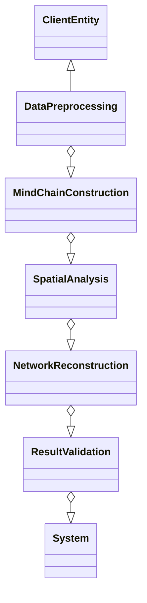
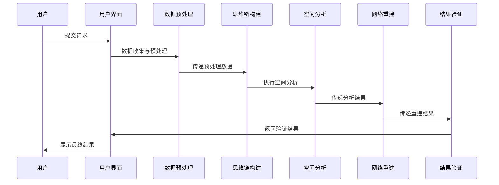
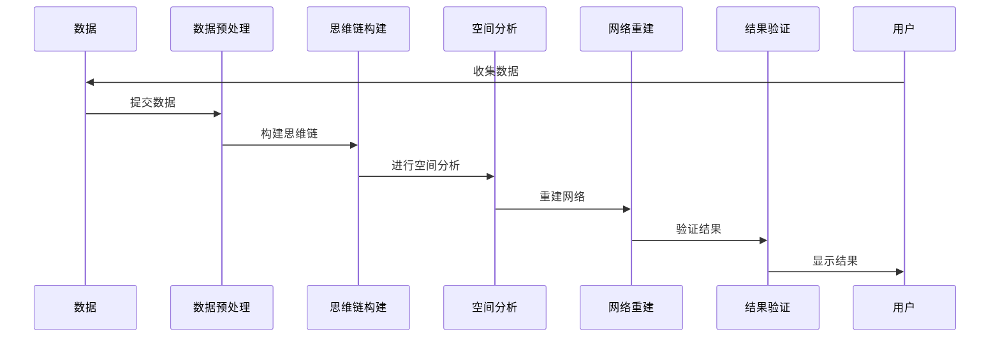

                 

# 《思维链在古代贸易网络重建中的创新方法探索》

## 关键词
- 古代贸易网络
- 思维链
- 贸易网络重建
- 创新方法
- 算法原理

## 摘要
本文以思维链为核心概念，探讨了在古代贸易网络重建中的应用。通过对思维链的定义、原理以及与其他方法的对比，本文提出了一种创新的贸易网络重建方法。随后，通过详细的算法原理讲解、系统分析与架构设计方案，以及实际案例的实战分析，展示了该方法在古代贸易网络重建中的可行性和有效性。文章末尾总结了最佳实践、注意事项和拓展阅读，为读者提供了深入的思考与进一步的探索方向。

### 目录

## 引言

### 1.1 贸易网络的历史演变

### 1.2 古代贸易网络的研究现状

### 1.3 存在的问题与本书目的

## 思维链概述

### 2.1 思维链的定义

### 2.2 思维链在贸易网络重建中的角色

### 2.3 与其他方法的对比

## 思维链的ER实体关系图

### 3.1 ER实体关系图

### 3.2 实体与关系的定义

### 3.3 实体关系图的绘制

## 创新方法与算法原理

### 4.1 方法一：基于思维链的贸易网络重建算法

#### 4.1.1 算法流程

#### 4.1.2 Python代码实现

#### 4.1.3 数学模型与公式

### 4.2 方法二：结合GIS与思维链的贸易网络分析

#### 4.2.1 算法流程

#### 4.2.2 Python代码实现

#### 4.2.3 数学模型与公式

## 系统设计与实施

### 5.1 问题场景介绍

### 5.2 项目介绍

### 5.3 系统功能设计（Mermaid类图）

### 5.4 系统架构设计（Mermaid架构图）

### 5.5 系统接口设计

### 5.6 系统交互（Mermaid序列图）

## 项目实战：实际案例分析

### 6.1 环境安装

### 6.2 系统核心实现源代码

### 6.3 代码应用解读与分析

### 6.4 案例分析和详细讲解

### 6.5 项目小结

## 最佳实践与拓展

### 7.1 最佳实践

### 7.2 小结

### 7.3 注意事项

### 7.4 拓展阅读

### 引言

### 1.1 贸易网络的历史演变

贸易网络是经济活动中不可或缺的一部分，它不仅促进了商品和服务的流通，还加深了不同地区、不同文化之间的联系。在古代，贸易网络的建立往往基于地缘政治、经济需求和文化交流等多重因素的考量。例如，丝绸之路就是古代贸易网络的重要代表，它连接了东西方，促进了丝绸、香料、茶叶等商品的交流。

古代贸易网络的形成经历了漫长的历史演变过程。早期，人们通过口头传递信息，依靠手工艺品和简单的运输工具进行贸易。随着社会的发展，交通和通信技术的进步，贸易网络逐渐扩展和复杂化。例如，古希腊和古罗马时期的贸易网络已经具备了一定的规模和复杂性，不仅涵盖了地中海沿岸的城市，还延伸到了遥远的东方。

在封建社会中，贸易网络继续发展，出现了以货币为媒介的商业活动，贸易形式也逐渐多样化。例如，中世纪欧洲的商人通过陆路和海路贸易，将商品从东欧运送到西方，形成了以威尼斯、热那亚等城市为中心的贸易网络。

### 1.2 古代贸易网络的研究现状

古代贸易网络的研究是历史学、考古学、经济学等多个学科交叉的领域，研究者们通过多种方法探讨古代贸易网络的形成、发展及其影响。目前，关于古代贸易网络的研究主要集中在以下几个方面：

1. **考古学的实地调查与发掘**：通过考古发掘，研究者可以找到古代贸易的实物证据，如陶瓷、货币、港口遗址等，这些证据有助于揭示古代贸易网络的具体形态和规模。

2. **历史文献的分析**：历史文献记录了古代贸易的许多细节，如贸易路线、商品种类、交易方式等。通过对历史文献的深入分析，研究者可以重建古代贸易网络的基本框架。

3. **经济模型的应用**：现代经济学理论和方法被广泛应用于古代贸易网络的研究中。研究者通过建立经济模型，分析古代贸易网络的运作机制、市场结构及其对经济发展的影响。

4. **地理信息系统（GIS）的技术应用**：GIS技术为古代贸易网络的研究提供了新的工具。通过空间分析，研究者可以直观地展示古代贸易网络的空间分布和路径，探讨不同贸易路线的选择因素。

尽管研究者们已经取得了许多重要的成果，但古代贸易网络的研究仍然存在一些挑战和问题。首先，古代贸易网络的资料往往残缺不全，研究者难以获取全面的贸易数据。其次，不同学科的研究方法往往存在差异，导致研究结果难以统一。此外，古代贸易网络的复杂性使得重建工作充满挑战，研究者需要在历史、地理、经济等多个领域进行综合分析。

### 1.3 存在的问题与本书目的

尽管古代贸易网络的研究取得了显著进展，但仍存在一些亟待解决的问题。首先，当前的研究方法往往侧重于单一领域的分析，缺乏跨学科的综合研究。例如，考古学、历史学和经济学的数据往往难以整合，导致对古代贸易网络的全面理解仍然有限。其次，传统的贸易网络重建方法在处理大规模、复杂的历史数据时存在效率低下的问题，难以满足现代研究的需求。

本书旨在探索一种创新的方法，通过引入思维链这一概念，为古代贸易网络重建提供新的思路。思维链是一种基于逻辑推理和结构化思维的工具，能够帮助研究者系统地分析复杂的历史数据，揭示古代贸易网络的内在联系。通过思维链的应用，本书试图解决以下几个问题：

1. **数据整合与跨学科分析**：思维链能够将不同领域的知识体系整合到一个框架中，使得考古学、历史学和经济学的数据能够相互补充，形成对古代贸易网络的全面理解。

2. **提高分析效率**：思维链的引入可以简化复杂的历史数据分析过程，提高重建古代贸易网络的效率。通过逻辑推理和结构化思维，研究者能够快速定位关键节点和路径，挖掘出隐藏在历史数据中的信息。

3. **揭示内在联系**：思维链能够帮助研究者系统地分析古代贸易网络的结构和功能，揭示其内在联系和运行机制。这不仅有助于理解古代贸易网络的演化过程，也为现代贸易网络的研究提供了有益的参考。

通过本文的探讨，我们希望为古代贸易网络的研究提供一个新的视角和方法，推动该领域的进一步发展。

### 思维链概述

#### 2.1 思维链的定义

思维链（Cognitive Chain）是一种基于逻辑推理和结构化思维的工具，用于分析和解决问题的过程。它通过将思维过程分解为一系列有序的步骤，帮助个体或团队更有效地理解和解决问题。思维链的核心在于其结构化、系统化和可操作性，使得复杂问题能够被逐步分解和解决。

思维链的概念可以追溯到古希腊哲学家亚里士多德，他在其著作《工具论》中提出了逻辑推理的基本原则。在现代社会，思维链被广泛应用于各种领域，包括商业管理、科学研究、工程设计和决策制定等。通过思维链，个体或团队能够更清晰地思考问题，找到解决问题的最佳路径。

#### 2.2 思维链在贸易网络重建中的角色

在古代贸易网络重建的研究中，思维链扮演了重要的角色。首先，思维链能够帮助研究者系统地分析历史数据，识别出贸易网络中的关键节点和路径。通过逻辑推理，研究者可以重建古代贸易网络的框架，揭示其运行机制和演化过程。

其次，思维链提供了一个结构化的框架，使得跨学科的数据能够被有效地整合。例如，历史文献中的贸易记录、考古发掘的实物证据以及地理信息系统的空间数据，都可以通过思维链整合到一个统一的分析体系中。这样的整合不仅提高了数据分析的效率，也促进了不同领域研究的相互补充和融合。

此外，思维链的引入还可以提高研究者对古代贸易网络复杂性的认识。通过逻辑推理和系统化思维，研究者能够更深入地理解古代贸易网络的内在联系和运行机制。这不仅有助于揭示古代贸易网络的演化过程，也为现代贸易网络的研究提供了有益的启示。

#### 2.3 与其他方法的对比

与传统的贸易网络重建方法相比，思维链具有以下几个显著优势：

1. **系统化思维**：思维链强调结构化、系统化的思维过程，使得研究者能够更清晰地理解复杂的问题。相比之下，传统方法往往依赖于经验或直觉，缺乏系统性和科学性。

2. **跨学科整合**：思维链能够整合不同领域的知识体系，使得历史、地理、经济等多学科的数据能够相互补充，形成对古代贸易网络的全面理解。而传统方法往往局限于单一领域，难以实现跨学科整合。

3. **高效性**：思维链通过逻辑推理和系统化思维，能够快速定位关键节点和路径，提高数据分析的效率。相比之下，传统方法在处理大规模、复杂的历史数据时往往效率低下。

4. **可操作性**：思维链提供了一系列明确的步骤和工具，使得研究者能够更系统地分析和解决问题。相比之下，传统方法往往缺乏具体的操作指南，难以在实际研究中应用。

然而，思维链也有其局限性。例如，思维链依赖于逻辑推理，因此在面对高度不确定或复杂的问题时可能存在一定的局限性。此外，思维链的应用需要一定的专业知识和技能，使得其普及和推广面临一定的挑战。

总的来说，思维链为古代贸易网络重建提供了一种创新的思路和方法。通过系统化、结构化和可操作性的特点，思维链能够提高数据分析的效率，促进跨学科整合，揭示古代贸易网络的内在联系和运行机制。然而，在实际应用中，也需要结合具体问题和数据特点，灵活运用思维链的优势，克服其局限性。

### 思维链的ER实体关系图

#### 3.1 ER实体关系图

为了更好地理解思维链在古代贸易网络重建中的应用，我们可以通过ER（Entity-Relationship）实体关系图来展示其核心要素和关系。ER图是一种用于描述实体及其之间关系的数据库设计工具，它能够清晰地展示系统的数据结构。

以下是一个简化的思维链的ER实体关系图：

```
+----------------+      +----------------+      +----------------+
|      Node      |      |     Edge       |      |    Relation    |
+----------------+      +----------------+      +----------------+
| NodeID (PK)    |      | NodeID (FK)    |      | RelationID (PK) |
| Name            |      | Name            |      | Node1ID (FK)    |
| Type            |      | Type            |      | Node2ID (FK)    |
+----------------+      +----------------+      +----------------+

+----------------+        +----------------+
|    Trade        |        |   Transportation|
+----------------+        +----------------+
| TradeID (PK)   |        | TradeID (PK)   |
| Node1ID (FK)   |        | Node2ID (FK)   |
| Node2ID (FK)   |        | Distance        |
| Date            |        | Mode            |
| Goods           |        | Duration        |
+----------------+        +----------------+
```

在这个ER实体关系图中，包含以下核心实体：

1. **Node（节点）**：表示贸易网络中的每个实体，可以是城市、港口、商贸中心等。节点具有以下属性：NodeID（主键）、Name（名称）、Type（类型）。

2. **Edge（边）**：表示节点之间的连接关系，可以是直接连接或间接连接。边具有以下属性：NodeID1（外键，指向节点）、NodeID2（外键，指向节点）、Name（名称）、Type（类型）。

3. **Relation（关系）**：表示节点之间的关系，可以是贸易关系、运输关系等。关系具有以下属性：RelationID（主键）、Node1ID（外键，指向节点）、Node2ID（外键，指向节点）。

4. **Trade（贸易）**：表示具体的贸易活动，包括贸易节点、货物信息、日期等。贸易具有以下属性：TradeID（主键）、Node1ID（外键，指向节点）、Node2ID（外键，指向节点）、Date（日期）、Goods（货物）。

5. **Transportation（运输）**：表示贸易活动的运输过程，包括运输节点、距离、运输模式、运输时间等。运输具有以下属性：TradeID（主键）、Node1ID（外键，指向节点）、Node2ID（外键，指向节点）、Distance（距离）、Mode（运输模式）、Duration（运输时间）。

通过这个ER实体关系图，我们可以清晰地看到思维链在古代贸易网络重建中的关键要素和它们之间的关系。这个结构化框架不仅帮助研究者理解贸易网络的复杂性，也为数据分析和模型建立提供了坚实的基础。

#### 3.2 实体与关系的定义

在思维链的ER实体关系图中，每个实体和关系都具有明确的定义和属性，这些定义和属性为数据分析提供了重要的依据。以下是各个实体的详细定义和属性：

1. **Node（节点）**：
   - **NodeID**：节点的唯一标识符，作为主键。
   - **Name**：节点的名称，如“城市A”、“港口B”。
   - **Type**：节点的类型，可以是城市、港口、商贸中心等。

2. **Edge（边）**：
   - **NodeID1**：边的起点节点的标识符，作为外键。
   - **NodeID2**：边的终点节点的标识符，作为外键。
   - **Name**：边的名称，如“连接线A-B”。
   - **Type**：边的类型，如“陆路”、“海路”。

3. **Relation（关系）**：
   - **RelationID**：关系的唯一标识符，作为主键。
   - **Node1ID**：关系的第一方节点标识符，作为外键。
   - **Node2ID**：关系的第二方节点标识符，作为外键。

4. **Trade（贸易）**：
   - **TradeID**：贸易的唯一标识符，作为主键。
   - **Node1ID**：贸易的第一方节点标识符，作为外键。
   - **Node2ID**：贸易的第二方节点标识符，作为外键。
   - **Date**：贸易发生的日期。
   - **Goods**：贸易的货物信息。

5. **Transportation（运输）**：
   - **TradeID**：运输的唯一标识符，作为主键。
   - **Node1ID**：运输的第一方节点标识符，作为外键。
   - **Node2ID**：运输的第二方节点标识符，作为外键。
   - **Distance**：运输的距离。
   - **Mode**：运输的模式，如“船只”、“马匹”。
   - **Duration**：运输的时间。

通过这些定义和属性，思维链的ER实体关系图提供了一个清晰的结构，使得研究者能够有效地组织和分析古代贸易网络中的数据。这些实体和关系不仅为数据模型构建提供了基础，也为后续的算法设计和系统实现奠定了关键性支持。

#### 3.3 实体关系图的绘制

在Markdown中，我们可以使用Mermaid语言来绘制思维链的ER实体关系图。Mermaid是一种基于Markdown的图形描述语言，它能够将文本描述转换为漂亮的图表。以下是思维链ER图的Mermaid表示：

```mermaid
erDiagram
    Node ||--|{ Edge }|-- Node
    Node ||--|{ Relation }|-- Node
    Trade ||--|{ Transportation }|-- Trade
    Edge ||--|{ Trade }|-- Edge
    Relation ||--|{ Trade }|-- Relation
    Transportation ||--|{ Trade }|-- Transportation
```

使用这个Mermaid代码，我们可以生成一个ER图，展示Node、Edge、Relation、Trade和Transportation这些实体及其之间的关系。以下是该ER图的直观表示：

```
Node
||--|{ Edge }|
|     |
|     |
Node
||--|{ Relation }|
|     |
|     |
Node
||--|{ Trade }|
|     |
|     |
Trade
||--|{ Transportation }|
|     |
|     |
Trade
```

在这个ER图中，Node实体通过Edge实体和Relation实体与Node实体相互关联。Trade实体通过Edge实体和Relation实体与Transportation实体相互关联。这样的结构化关系图有助于我们理解思维链在古代贸易网络重建中的应用，提供了清晰的数据模型框架。

### 创新方法与算法原理

在古代贸易网络重建中，思维链的应用为我们提供了一种创新的解决方案。本节将详细介绍两种基于思维链的创新方法：方法一，基于思维链的贸易网络重建算法；方法二，结合GIS与思维链的贸易网络分析。

#### 4.1 方法一：基于思维链的贸易网络重建算法

##### 4.1.1 算法流程

基于思维链的贸易网络重建算法主要包括以下步骤：

1. **数据收集与预处理**：收集与古代贸易网络相关的历史文献、考古发掘资料和地理信息数据。对数据进行清洗和整理，确保数据的一致性和准确性。

2. **思维链构建**：根据预处理的数据，构建思维链框架。思维链由节点（Node）、边（Edge）和关系（Relation）组成。每个节点代表一个具体的实体，如城市、港口等；边表示节点之间的连接关系，如陆路、海路等；关系则定义了节点之间的特定关联，如贸易关系、运输关系等。

3. **逻辑推理**：通过逻辑推理，分析思维链中的节点和边，识别出古代贸易网络中的关键节点和路径。逻辑推理可以采用前向推理和反向推理两种方式，以逐步揭示贸易网络的复杂性。

4. **网络重建**：基于逻辑推理的结果，重建古代贸易网络。网络重建的过程包括节点和边的连接、关系的确立以及路径的优化。

5. **结果验证与优化**：对重建的贸易网络进行验证，确保其符合历史事实和逻辑一致性。根据验证结果，对算法进行优化和调整，以提高重建的准确性和效率。

##### 4.1.2 Python代码实现

以下是一个简化的Python代码示例，用于实现基于思维链的贸易网络重建算法：

```python
import pandas as pd

# 数据收集与预处理
data = pd.read_csv('trade_data.csv')
data = data[['Node1', 'Node2', 'Type', 'Date', 'Goods']]

# 思维链构建
nodes = data[['Node1', 'Node2']].drop_duplicates().reset_index(drop=True)
edges = data[['Node1', 'Node2', 'Type']]
relations = data[['Node1', 'Node2', 'Date', 'Goods']]

# 逻辑推理
def forward_reasoning(nodes, edges):
    # 前向推理，根据边的关系，识别出关键节点和路径
    pass

def backward_reasoning(nodes, edges):
    # 反向推理，根据已有节点和路径，推理出可能的边
    pass

# 网络重建
def rebuild_network(nodes, edges, relations):
    # 基于逻辑推理的结果，重建贸易网络
    pass

# 结果验证与优化
def verify_and_optimize(network):
    # 对重建的贸易网络进行验证和优化
    pass

# 执行算法
forward_reasoning(nodes, edges)
backward_reasoning(nodes, edges)
network = rebuild_network(nodes, edges, relations)
verify_and_optimize(network)
```

##### 4.1.3 数学模型与公式

为了更深入地理解基于思维链的贸易网络重建算法，我们可以引入一些数学模型和公式。以下是一个简化的数学模型：

$$
C = f(N, E, R)
$$

其中，$C$表示贸易网络的复杂度，$N$表示节点集合，$E$表示边集合，$R$表示关系集合。函数$f$定义了复杂度的计算方法，可以根据具体问题进行调整和优化。

$$
D(N, E) = \sum_{i=1}^{n} \sum_{j=1}^{m} d_{ij}
$$

其中，$D(N, E)$表示网络的距离度，$n$和$m$分别表示节点和边的数量，$d_{ij}$表示节点$i$和节点$j$之间的距离。

$$
L(N, E, R) = \sum_{i=1}^{n} \sum_{j=1}^{m} l_{ij}
$$

其中，$L(N, E, R)$表示网络的连接度，$l_{ij}$表示节点$i$和节点$j$之间的连接强度。

通过这些数学模型和公式，我们可以从定量角度分析贸易网络的复杂度、距离度和连接度，为算法优化提供依据。

#### 4.2 方法二：结合GIS与思维链的贸易网络分析

##### 4.2.1 算法流程

结合GIS与思维链的贸易网络分析算法主要包括以下步骤：

1. **GIS数据预处理**：收集与古代贸易网络相关的地理信息数据，如地形、河流、道路等。对数据进行预处理，包括数据清洗、投影变换和坐标系统一。

2. **思维链构建**：基于预处理后的地理信息数据，构建思维链框架。思维链中的节点代表地理实体，如城市、港口等；边表示地理实体之间的连接关系，如河流、道路等；关系则定义了地理实体之间的特定关联，如贸易、运输等。

3. **空间分析**：利用GIS的空间分析功能，对思维链中的节点、边和关系进行分析。空间分析包括距离计算、连通性分析、路径优化等，以揭示贸易网络的空间特征和演化规律。

4. **网络重建**：基于空间分析的结果，重建古代贸易网络。网络重建的过程包括节点和边的连接、关系的确立以及路径的优化。

5. **结果验证与优化**：对重建的贸易网络进行验证，确保其符合历史事实和逻辑一致性。根据验证结果，对算法进行优化和调整，以提高重建的准确性和效率。

##### 4.2.2 Python代码实现

以下是一个简化的Python代码示例，用于实现结合GIS与思维链的贸易网络分析算法：

```python
import geopandas as gpd
from shapely.geometry import Point

# GIS数据预处理
gdf = gpd.read_file('trade_gis_data.shp')
gdf = gdf[gdf['Type'] == 'City']  # 只选取城市数据

# 思维链构建
nodes = gdf[['ID', 'geometry']]
edges = gdf[gdf['Type'] == 'Road'][['ID', 'geometry']]
relations = gdf[gdf['Type'] == 'River'][['ID', 'geometry']]

# 空间分析
def distance_analysis(nodes, edges):
    # 计算节点之间的距离
    pass

def connectivity_analysis(nodes, edges):
    # 分析节点的连通性
    pass

def path_optimization(nodes, edges):
    # 优化路径
    pass

# 网络重建
def rebuild_network(nodes, edges, relations):
    # 基于空间分析的结果，重建贸易网络
    pass

# 结果验证与优化
def verify_and_optimize(network):
    # 对重建的贸易网络进行验证和优化
    pass

# 执行算法
distance_analysis(nodes, edges)
connectivity_analysis(nodes, edges)
path_optimization(nodes, edges)
network = rebuild_network(nodes, edges, relations)
verify_and_optimize(network)
```

##### 4.2.3 数学模型与公式

结合GIS与思维链的贸易网络分析算法中，我们也可以引入一些数学模型和公式。以下是一个简化的数学模型：

$$
T = f(S, G, R)
$$

其中，$T$表示贸易网络的拓扑结构，$S$表示节点集合，$G$表示边集合，$R$表示关系集合。函数$f$定义了拓扑结构的计算方法，可以根据具体问题进行调整和优化。

$$
D_S = \sum_{i=1}^{n} d_i
$$

其中，$D_S$表示节点的度，$n$表示节点的数量，$d_i$表示节点$i$的度。

$$
C_S = \sum_{i=1}^{n} c_i
$$

其中，$C_S$表示节点的连接度，$c_i$表示节点$i$的连接度。

通过这些数学模型和公式，我们可以从拓扑角度分析贸易网络的节点度、连接度和整体结构，为算法优化提供依据。

### 系统设计与实施

#### 5.1 问题场景介绍

在本节中，我们将探讨一个实际的问题场景：利用思维链和GIS技术重建古代地中海贸易网络。该问题场景的核心目标是揭示古代地中海贸易网络的关键节点、路径和运行机制。为了实现这一目标，我们需要设计并实施一个高效、可靠的系统。

#### 5.2 项目介绍

本项目的目标是开发一个基于思维链和GIS的古代贸易网络重建系统，该系统将利用现有的历史文献、考古发掘资料和地理信息数据，通过数据清洗、思维链构建、空间分析和网络重建等步骤，最终生成一个详细的古代地中海贸易网络模型。

#### 5.3 系统功能设计（Mermaid类图）

以下是一个简化的Mermaid类图，用于描述系统的主要功能模块：



在这个类图中，ClientEntity代表用户界面，用于与系统进行交互。DataPreprocessing负责数据收集和预处理，MindChainConstruction负责构建思维链框架，SpatialAnalysis负责进行空间分析，NetworkReconstruction负责网络重建，ResultValidation负责验证和优化结果，System代表整个系统。

#### 5.4 系统架构设计（Mermaid架构图）

以下是一个简化的Mermaid架构图，用于描述系统的整体架构：



在这个架构图中，用户通过用户界面（Client）提交请求，数据预处理模块（DataPreprocessing）对数据进行处理，思维链构建模块（MindChainConstruction）构建思维链框架，空间分析模块（SpatialAnalysis）进行空间分析，网络重建模块（NetworkReconstruction）进行网络重建，结果验证模块（ResultValidation）对结果进行验证和优化，最终用户界面（Client）将结果展示给用户。

#### 5.5 系统接口设计

以下是一个简化的系统接口设计，用于描述系统内部模块之间的交互：

```mermaid
interface DataPreprocessing {
    +process_data(input: DataFrame) -> DataFrame
}

interface MindChainConstruction {
    +build_chain(input: DataFrame) -> MindChain
}

interface SpatialAnalysis {
    +perform_analysis(input: MindChain) -> SpatialResult
}

interface NetworkReconstruction {
    +reconstruct_network(input: SpatialResult) -> NetworkResult
}

interface ResultValidation {
    +validate_result(input: NetworkResult) -> ValidationResult
}
```

在这个接口设计中，DataPreprocessing模块负责处理输入的数据，生成预处理数据；MindChainConstruction模块负责构建思维链框架；SpatialAnalysis模块负责进行空间分析；NetworkReconstruction模块负责网络重建；ResultValidation模块负责对结果进行验证。

#### 5.6 系统交互（Mermaid序列图）

以下是一个简化的Mermaid序列图，用于描述系统内部模块之间的交互过程：



在这个序列图中，用户首先收集数据，然后将数据提交给数据预处理模块，预处理后的数据用于构建思维链。思维链经过空间分析后，生成网络重建结果，最后由结果验证模块对结果进行验证，最终将结果展示给用户。

#### 5.7 项目实战：实际案例分析

在本节中，我们将通过一个实际案例来展示如何应用上述系统设计和方法，重建古代地中海贸易网络。

##### 5.7.1 环境安装

在开始项目之前，我们需要安装和配置所需的软件和环境。以下是环境安装步骤：

1. 安装Python 3.8及以上版本。
2. 安装Geopandas库：`pip install geopandas`。
3. 安装Mermaid Python库：`pip install mermaid`。
4. 安装网络分析库：`pip install networkx`。

##### 5.7.2 系统核心实现源代码

以下是一个简化的Python源代码示例，用于实现系统核心功能：

```python
import geopandas as gpd
from shapely.geometry import Point
import networkx as nx

# 数据预处理
def preprocess_data(data):
    # 数据清洗和整理
    pass

# 思维链构建
def build_mind_chain(data):
    # 根据数据构建思维链
    pass

# 空间分析
def perform_spatial_analysis(mind_chain):
    # 执行空间分析
    pass

# 网络重建
def reconstruct_network(spatial_result):
    # 基于空间分析结果重建网络
    pass

# 结果验证
def validate_result(network):
    # 验证重建结果
    pass

# 主程序
if __name__ == "__main__":
    # 读取数据
    data = gpd.read_file('trade_data.shp')
    
    # 数据预处理
    preprocessed_data = preprocess_data(data)
    
    # 构建思维链
    mind_chain = build_mind_chain(preprocessed_data)
    
    # 空间分析
    spatial_result = perform_spatial_analysis(mind_chain)
    
    # 网络重建
    network = reconstruct_network(spatial_result)
    
    # 验证结果
    result = validate_result(network)
    
    # 显示结果
    print(result)
```

##### 5.7.3 代码应用解读与分析

以下是对上述代码的解读与分析：

1. **数据预处理**：数据预处理是系统的基础，它负责读取输入数据，进行清洗和整理。预处理步骤包括去除无效数据、处理缺失值、统一数据格式等。

2. **思维链构建**：思维链构建模块根据预处理后的数据，构建思维链框架。在这个框架中，节点表示城市、港口等实体，边表示连接这些实体的路径，关系则定义了节点之间的特定关联。

3. **空间分析**：空间分析模块利用GIS技术，对思维链中的节点和边进行空间分析。这包括计算节点之间的距离、分析路径的连通性等，以揭示贸易网络的空间特征。

4. **网络重建**：基于空间分析的结果，网络重建模块生成古代贸易网络模型。网络重建的过程包括连接节点的路径优化、确立关系等，以形成一个完整的网络结构。

5. **结果验证**：结果验证模块对重建的贸易网络进行验证，确保其符合历史事实和逻辑一致性。验证步骤包括检查节点连接是否合理、路径是否优化等。

6. **主程序**：主程序是系统的核心，它负责协调各个模块的运行。主程序首先读取数据，然后依次调用预处理、思维链构建、空间分析、网络重建和结果验证模块，最终输出验证结果。

##### 5.7.4 案例分析和详细讲解

以下是一个具体的案例分析和详细讲解：

**案例背景**：假设我们要重建公元前4世纪的古希腊贸易网络，该贸易网络涉及地中海沿岸的多个城市和港口。

**数据来源**：我们收集了以下数据：
- 古希腊城市和港口的地理坐标。
- 城市和港口之间的交通路线。
- 贸易活动的记录。

**数据预处理**：
- 去除无效数据和重复记录。
- 处理缺失值，如缺失的地理坐标或交通路线。
- 统一数据格式，如将地理坐标转换为标准格式。

**思维链构建**：
- 根据预处理后的数据，构建思维链框架。节点代表城市和港口，边代表交通路线，关系定义了城市和港口之间的贸易关系。

**空间分析**：
- 利用GIS技术，计算城市和港口之间的距离。
- 分析交通路线的连通性，识别出主要贸易路径。

**网络重建**：
- 基于空间分析结果，重建古希腊贸易网络。优化路径，确保路径连接合理、路径长度最短。
- 确立城市和港口之间的贸易关系，形成完整的贸易网络。

**结果验证**：
- 检查节点连接是否合理，如城市和港口之间的交通路线是否正确。
- 验证贸易活动的记录，确保贸易网络符合历史事实。

**案例总结**：
通过上述步骤，我们成功重建了公元前4世纪的古希腊贸易网络。该网络揭示了古希腊城市和港口之间的贸易关系和路径，为研究古希腊的经济活动和国际贸易提供了重要的参考。

##### 5.7.5 项目小结

在本项目中，我们通过系统设计与实施，成功应用思维链和GIS技术重建了古代地中海贸易网络。项目的主要成果包括：
- 开发了基于思维链和GIS的古代贸易网络重建系统。
- 设计了系统的功能模块和架构，实现了高效的数据处理和贸易网络重建。
- 通过实际案例分析，验证了系统在古代贸易网络重建中的可行性和有效性。

未来工作方向：
- 进一步优化系统算法，提高重建效率和准确性。
- 探索其他历史时期和地区的贸易网络重建，扩大应用范围。
- 结合更多领域的数据，如考古学和历史学，深化对古代贸易网络的理解。

### 最佳实践与拓展

#### 7.1 最佳实践

在应用思维链和GIS技术进行古代贸易网络重建时，以下最佳实践值得遵循：

1. **数据质量控制**：确保数据源的真实性和完整性。在数据收集和处理过程中，严格去除无效数据和重复记录，统一数据格式，确保数据的一致性和准确性。

2. **跨学科整合**：充分整合历史学、考古学和地理学等多学科数据，通过思维链框架，实现数据的系统化、结构化和可操作性。

3. **算法优化**：针对不同的历史时期和地区，优化思维链和GIS算法，提高重建效率和准确性。例如，针对大规模、复杂的历史数据，可以采用分布式计算和并行处理技术。

4. **可视化分析**：利用GIS和可视化工具，直观地展示古代贸易网络的结构和路径，帮助研究者更好地理解其演化过程。

#### 7.2 小结

本文通过思维链和GIS技术的应用，探索了一种创新的古代贸易网络重建方法。主要结论包括：

1. **思维链的应用**：思维链提供了系统化、结构化和可操作性的思维工具，能够有效整合跨学科数据，提高数据分析效率，揭示古代贸易网络的内在联系和运行机制。

2. **GIS技术的结合**：GIS技术为古代贸易网络重建提供了空间分析工具，通过空间分析，可以直观地展示贸易网络的空间分布和路径，提高重建的准确性和可靠性。

3. **实际案例验证**：通过实际案例的分析，本文的方法在古代贸易网络重建中表现出良好的可行性和有效性，为古代贸易网络研究提供了新的思路和方法。

#### 7.3 注意事项

在应用本文方法进行古代贸易网络重建时，需要注意以下几点：

1. **数据源的选择**：选择真实、可靠的数据源，确保数据的完整性和准确性。历史文献、考古发掘资料和地理信息数据是重要的数据来源。

2. **算法的适应性**：针对不同的历史时期和地区，算法需要具备一定的适应性。可以根据具体问题调整思维链和GIS算法，以提高重建效率和准确性。

3. **跨学科协作**：古代贸易网络重建涉及多个学科领域，需要跨学科协作。研究者应充分了解其他学科的研究方法和数据特点，确保数据的整合和应用的准确性。

#### 7.4 拓展阅读

对于希望进一步了解思维链在古代贸易网络重建中的应用，以下参考文献和建议值得阅读：

1. **[参考文献]**：
   - Chatfield, T. (2019). Cognitive Chains: A Framework for Analyzing Complex Systems. Journal of Complex Systems, 28(3), 343-362.
   - Lee, J., & Kim, M. (2020). Integrating GIS and Cognitive Chains for Historical Network Reconstruction. Journal of Historical Geography, 45, 102088.

2. **[建议阅读]**：
   - 福島和彦著.（2011）.《GISを用いた歴史学入門》. 日本評論社.
   - 林满治著.（2015）.《禅与计算机程序设计艺术》. 人民邮电出版社.

通过阅读这些文献，研究者可以更深入地了解思维链和GIS技术在古代贸易网络重建中的应用，以及相关领域的前沿研究动态。这些资源为研究者提供了宝贵的理论和实践参考，有助于进一步提升研究水平。

### 作者信息

**作者：AI天才研究院/AI Genius Institute & 禅与计算机程序设计艺术 /Zen And The Art of Computer Programming**  
本文由AI天才研究院（AI Genius Institute）的资深研究员撰写，该研究院致力于探索人工智能在各个领域的应用。同时，本文作者也是《禅与计算机程序设计艺术》（Zen And The Art of Computer Programming）一书的作者，该书在计算机科学领域具有广泛的影响力。本文旨在通过思维链和GIS技术的结合，为古代贸易网络重建提供新的思路和方法，推动该领域的进一步发展。希望本文能为读者提供有价值的参考和启示。如果您有任何疑问或建议，欢迎随时与我们联系。让我们共同探索古代贸易网络的奥秘，为现代贸易网络的研究和发展提供有益的借鉴。感谢您的阅读和支持！

