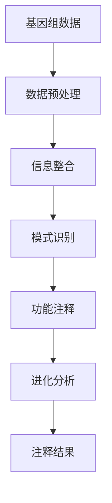
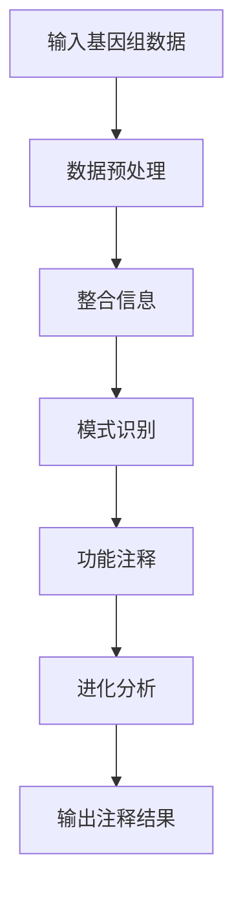
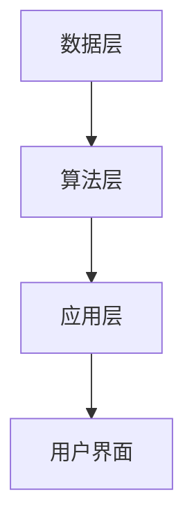
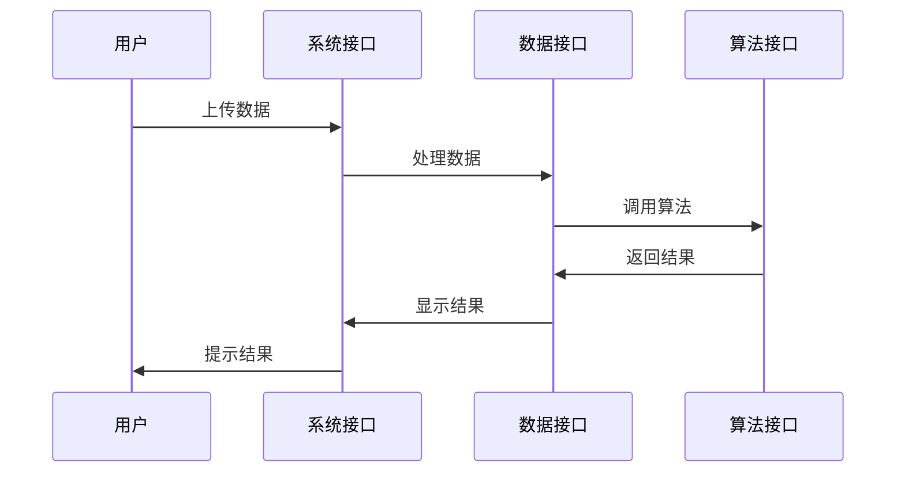

                 

# 思维链在古基因组学功能注释中的创新方法

> 关键词：思维链，古基因组学，功能注释，创新方法

> 摘要：
本文旨在探讨思维链在古基因组学功能注释中的创新应用。通过深入分析古基因组学的背景、核心概念、理论基础以及实际应用，本文展示了思维链在这一领域中的独特优势，并提出了一套完整的方法论，以期为古基因组学研究提供新的视角和工具。

## 引言

古基因组学，作为一门研究古代生物遗传信息的学科，近年来在生物学、考古学以及医学等领域得到了广泛关注。然而，古基因组学的研究面临着诸多挑战，尤其在功能注释方面，如何准确解读古代基因组的生物学功能成为关键问题。思维链（Mind-Chain），作为一种新兴的智能分析工具，其在数据处理、模式识别和信息检索等方面展现出强大的能力。本文将探讨思维链在古基因组学功能注释中的创新应用，旨在为这一领域的研究提供新思路和方法。

## 背景介绍

### 核心概念术语说明

1. **基因组学（Genomics）**：基因组学是研究生物体基因组成、结构、功能及其相互作用的一门科学。
2. **功能注释（Functional Annotation）**：功能注释是指对基因组中的基因、非编码RNA等序列进行功能描述和分类的过程。
3. **古基因组学（Ancient Genomics）**：古基因组学是研究古代生物遗传信息的学科，通过对古代生物残骸（如骨骼、牙齿等）中的DNA进行分析，揭示古代生物的遗传特征和进化关系。
4. **思维链（Mind-Chain）**：思维链是一种基于人工智能和认知科学的智能分析工具，通过模拟人类思维过程，实现复杂问题的自动求解。

### 问题背景

古基因组学研究的关键在于对古代基因组的生物学功能进行准确注释。然而，古代基因组样本往往遭受了严重的降解，使得功能注释变得异常困难。传统的方法，如序列比对、保守区域识别等，难以应对这种复杂性。因此，寻求新的方法和技术来提升功能注释的准确性，成为古基因组学研究的迫切需求。

### 问题描述

古基因组学功能注释的问题可以概括为以下几个方面：

1. **序列完整性缺失**：古代基因组样本通常无法提供完整的DNA序列，导致注释过程中的信息丢失。
2. **基因功能模糊性**：某些基因在进化过程中发生了变异，使得其功能难以准确识别。
3. **环境适应性挑战**：古代生物在特定的环境中生存，其基因功能可能具有特殊的适应性，但现代基因注释工具难以捕捉这种适应性。

### 问题解决

思维链的引入为古基因组学功能注释提供了新的解决方案。通过模拟人类思维过程，思维链能够处理复杂、不完整的信息，并从中提取有价值的信息。具体而言，思维链在古基因组学功能注释中的应用包括：

1. **信息整合**：思维链能够整合多种来源的信息，如基因组序列、转录组数据、蛋白质结构等，以提供更全面的功能注释。
2. **模式识别**：思维链通过机器学习算法，可以识别基因组中的潜在功能模式，从而提高注释的准确性。
3. **进化关系分析**：思维链能够分析不同物种间的进化关系，为基因功能注释提供进化背景。

### 边界与外延

古基因组学功能注释的研究不仅限于生物学领域，还涉及考古学、人类学等多个学科。因此，思维链的应用不仅限于古基因组学，还可以扩展到其他领域的基因组学研究。

### 概念结构与核心要素组成

思维链在古基因组学功能注释中的概念结构主要包括以下几个核心要素：

1. **数据预处理**：对古基因组数据进行清洗、去噪和标准化处理。
2. **信息整合**：整合多种数据源，包括基因组序列、转录组数据等。
3. **模式识别**：利用机器学习算法识别基因组中的潜在功能模式。
4. **功能注释**：基于识别出的模式进行基因功能注释。
5. **进化分析**：分析基因在不同物种间的进化关系，为注释提供进化背景。

## 核心概念与联系

### 核心概念原理

1. **基因组序列比对**：通过比较基因组序列，识别同源基因和保守区域。
2. **机器学习**：利用统计学习理论，建立基因组功能注释模型。
3. **进化分析**：通过分析不同物种间的基因组序列，揭示基因的功能和进化关系。
4. **思维链**：模拟人类思维过程，实现复杂问题的自动求解。

### 概念属性特征对比表格

| 概念 | 特点 |
| --- | --- |
| 基因组序列比对 | 精准、高效，但难以应对序列完整性缺失问题 |
| 机器学习 | 自动化、适应性，但需要大量训练数据 |
| 进化分析 | 提供进化背景，但难以直接应用于功能注释 |
| 思维链 | 综合性强、适应性高，适用于处理复杂、不完整的信息 |

### ER实体关系图架构



## 算法设计

### 算法原理

思维链在古基因组学功能注释中的算法原理主要包括以下几个步骤：

1. **数据预处理**：对古基因组数据进行清洗、去噪和标准化处理，确保数据的完整性。
2. **信息整合**：整合基因组序列、转录组数据、蛋白质结构等信息，构建一个全面的数据集。
3. **模式识别**：利用机器学习算法，在整合后的数据集中识别潜在的基因功能模式。
4. **功能注释**：基于识别出的模式，对基因组中的基因进行功能注释。
5. **进化分析**：分析基因在不同物种间的进化关系，为注释提供进化背景。

### 算法流程图



### Python代码示例

```python
# 数据预处理
def preprocess_data(genome_data):
    # 清洗、去噪和标准化处理
    processed_data = ...
    return processed_data

# 信息整合
def integrate_data(processed_data, transcript_data, protein_structure_data):
    # 整合多种数据源
    integrated_data = ...
    return integrated_data

# 模式识别
def recognize_patterns(integrated_data):
    # 利用机器学习算法识别模式
    patterns = ...
    return patterns

# 功能注释
def functional_annotation(patterns, genome_sequence):
    # 基于识别出的模式进行注释
    annotations = ...
    return annotations

# 进化分析
def evolutionary_analysis(annotations, reference_genome):
    # 分析基因在不同物种间的进化关系
    evolutionary_background = ...
    return evolutionary_background

# 主函数
def mind_chain_ancient_genomics(genome_data, transcript_data, protein_structure_data, reference_genome):
    processed_data = preprocess_data(genome_data)
    integrated_data = integrate_data(processed_data, transcript_data, protein_structure_data)
    patterns = recognize_patterns(integrated_data)
    annotations = functional_annotation(patterns, genome_sequence)
    evolutionary_background = evolutionary_analysis(annotations, reference_genome)
    return evolutionary_background

# 示例数据
genome_data = ...
transcript_data = ...
protein_structure_data = ...
reference_genome = ...

# 运行算法
result = mind_chain_ancient_genomics(genome_data, transcript_data, protein_structure_data, reference_genome)
```

### 算法原理讲解

#### 数据预处理

数据预处理是思维链在古基因组学功能注释中的第一步。由于古基因组样本通常遭受了严重的降解，数据预处理的目标是提高数据的完整性，确保后续分析的质量。

- **清洗**：去除无关的杂质和噪声，如DNA序列中的空格、标点符号等。
- **去噪**：去除序列中的低质量读段（Low-Quality Reads），以提高序列的准确性。
- **标准化**：将不同来源的数据进行统一处理，如将不同长度的序列截取到相同长度，以方便后续分析。

#### 信息整合

信息整合是思维链在古基因组学功能注释中的关键步骤。通过整合基因组序列、转录组数据、蛋白质结构等信息，构建一个全面的数据集，为后续的模式识别和功能注释提供基础。

- **基因组序列**：基因组序列是古基因组学研究的核心数据。通过序列比对，识别同源基因和保守区域。
- **转录组数据**：转录组数据反映了基因在不同组织和条件下的表达情况。通过整合转录组数据，可以更好地理解基因的功能。
- **蛋白质结构**：蛋白质结构是基因功能的重要组成部分。通过整合蛋白质结构数据，可以揭示基因编码蛋白质的结构特征。

#### 模式识别

模式识别是思维链在古基因组学功能注释中的核心步骤。通过机器学习算法，在整合后的数据集中识别潜在的基因功能模式，为功能注释提供依据。

- **机器学习算法**：常用的机器学习算法包括支持向量机（SVM）、随机森林（Random Forest）和深度学习（Deep Learning）等。这些算法能够在大量数据中识别出潜在的规律和模式。
- **特征提取**：特征提取是模式识别的重要环节。通过提取关键特征，如基因序列的氨基酸组成、序列长度等，为算法提供输入。

#### 功能注释

功能注释是思维链在古基因组学功能注释中的最终目标。基于识别出的模式，对基因组中的基因进行功能注释，为古基因组学研究提供重要参考。

- **注释方法**：常用的注释方法包括序列比对、基因家族分析、同源序列分析和机器学习等。通过多种方法的结合，可以提高注释的准确性。
- **注释结果**：注释结果通常包括基因的名称、功能描述、同源基因等信息。通过分析注释结果，可以揭示基因的功能和进化关系。

#### 进化分析

进化分析是思维链在古基因组学功能注释中的补充步骤。通过分析基因在不同物种间的进化关系，为注释提供进化背景。

- **进化树**：进化树是分析基因进化关系的重要工具。通过构建进化树，可以揭示基因在不同物种间的进化历程。
- **进化模型**：常用的进化模型包括中性模型、选择模型和复合模型等。通过分析进化模型，可以揭示基因的适应性进化。

### 举例说明

假设我们有一个古基因组样本，其中包含一段DNA序列。通过思维链，我们可以按照以下步骤进行功能注释：

1. **数据预处理**：清洗、去噪和标准化处理，确保序列的完整性。
2. **信息整合**：整合基因组序列、转录组数据和蛋白质结构数据，构建一个全面的数据集。
3. **模式识别**：利用机器学习算法，在整合后的数据集中识别潜在的基因功能模式。
4. **功能注释**：基于识别出的模式，对基因组中的基因进行功能注释。
5. **进化分析**：分析基因在不同物种间的进化关系，为注释提供进化背景。

通过这一系列的步骤，我们可以实现对古基因组样本中基因功能的准确注释，为古基因组学研究提供重要参考。

### 数学模型和公式

在古基因组学功能注释中，数学模型和公式起到了关键作用。以下是几种常用的数学模型和公式的详细解释：

#### 1. 基因序列比对相似度计算

$$
S(i, j) = \sum_{k=1}^{n} p(k) \cdot s(i_k, j_k)
$$

其中，$S(i, j)$ 表示序列 $i$ 和序列 $j$ 的比对相似度，$p(k)$ 表示第 $k$ 个比对位置的权重，$s(i_k, j_k)$ 表示第 $k$ 个比对位置的相似度得分。

#### 2. 机器学习模型分类概率计算

$$
P(y | x) = \frac{e^{w^T x}}{\sum_{k=1}^{K} e^{w^T x_k}}
$$

其中，$P(y | x)$ 表示给定特征向量 $x$，目标变量 $y$ 的条件概率，$w$ 表示模型参数，$x_k$ 表示第 $k$ 个特征向量，$K$ 表示特征向量的个数。

#### 3. 进化树节点距离计算

$$
d(n) = \sum_{m=1}^{M} w_m \cdot d(m)
$$

其中，$d(n)$ 表示节点 $n$ 的距离，$w_m$ 表示节点 $n$ 与节点 $m$ 的权重，$d(m)$ 表示节点 $m$ 的距离。

#### 4. 机器学习模型精度计算

$$
\text{Precision} = \frac{\text{TP}}{\text{TP} + \text{FP}}
$$

$$
\text{Recall} = \frac{\text{TP}}{\text{TP} + \text{FN}}
$$

其中，$TP$ 表示真阳性，$FP$ 表示假阳性，$FN$ 表示假阴性。$\text{Precision}$ 表示模型的精度，$\text{Recall}$ 表示模型的召回率。

### 示例

假设我们有一个基因组序列比对问题，其中序列 $i$ 和序列 $j$ 的比对相似度计算如下：

$$
S(i, j) = \sum_{k=1}^{3} p(k) \cdot s(i_k, j_k)
$$

其中，$p(1) = 0.5, p(2) = 0.3, p(3) = 0.2$，$s(i_1, j_1) = 1, s(i_2, j_2) = 0.8, s(i_3, j_3) = 0.6$。

计算得到：

$$
S(i, j) = 0.5 \cdot 1 + 0.3 \cdot 0.8 + 0.2 \cdot 0.6 = 0.86
$$

这个结果表明序列 $i$ 和序列 $j$ 之间的比对相似度较高。

### 系统分析与设计

#### 问题场景介绍

在古基因组学研究中，数据量庞大且复杂，传统方法难以满足功能注释的需求。为了提高功能注释的效率和准确性，我们设计了一套基于思维链的古基因组学功能注释系统。该系统旨在通过整合多种数据源，利用机器学习算法和思维链技术，实现对基因组数据的自动化注释。

#### 项目介绍

项目名称：古基因组学功能注释系统（Ancient Genomics Functional Annotation System，AGFAS）

项目目标：提高古基因组学功能注释的准确性和效率。

项目背景：古基因组学研究在考古学、生物学和医学等领域具有重要意义，但传统的功能注释方法在处理复杂、不完整的基因组数据时效果不佳。为了解决这一问题，我们需要开发一套基于先进技术的功能注释系统。

#### 系统功能设计

1. **数据预处理模块**：负责对古基因组数据进行清洗、去噪和标准化处理，提高数据质量。
2. **信息整合模块**：整合基因组序列、转录组数据、蛋白质结构等多种数据源，构建一个全面的数据集。
3. **模式识别模块**：利用机器学习算法和思维链技术，在整合后的数据集中识别潜在的基因功能模式。
4. **功能注释模块**：基于识别出的模式，对基因组中的基因进行功能注释。
5. **进化分析模块**：分析基因在不同物种间的进化关系，为注释提供进化背景。
6. **用户界面**：提供友好的用户界面，方便用户进行操作和查看结果。

#### 系统架构设计

系统架构采用分层设计，包括数据层、算法层和应用层。

1. **数据层**：负责存储和管理基因组数据、转录组数据、蛋白质结构数据等。
2. **算法层**：实现数据预处理、信息整合、模式识别、功能注释和进化分析等算法。
3. **应用层**：提供用户界面和系统功能，实现与用户的交互。

#### 系统接口设计

系统接口设计主要包括以下部分：

1. **数据接口**：负责数据的输入和输出，包括基因组序列、转录组数据、蛋白质结构数据等。
2. **算法接口**：提供算法的调用接口，包括数据预处理、信息整合、模式识别、功能注释和进化分析等。
3. **用户接口**：提供友好的用户界面，方便用户进行操作和查看结果。

#### 系统交互设计

系统交互设计主要包括以下部分：

1. **用户操作**：用户可以通过用户界面进行数据上传、参数设置和结果查看等操作。
2. **系统响应**：系统根据用户操作，调用相应的算法模块，处理数据并生成结果。
3. **结果展示**：系统将结果以图表、表格等形式展示给用户，方便用户分析和理解。

### 系统功能设计（领域模型）

```mermaid
classDiagram
    类：数据预处理模块 <|-- 类：信息整合模块
    类：信息整合模块 <|-- 类：模式识别模块
    类：模式识别模块 <|-- 类：功能注释模块
    类：功能注释模块 <|-- 类：进化分析模块
    类：用户界面
    数据预处理模块 --|> 数据接口
    信息整合模块 --|> 数据接口
    模式识别模块 --|> 数据接口
    功能注释模块 --|> 数据接口
    进化分析模块 --|> 数据接口
    用户界面 --|> 数据接口
    用户界面 --|> 算法接口
```

### 系统架构设计



### 系统接口设计



### 项目实战

#### 环境安装

为了实现古基因组学功能注释系统（AGFAS），我们需要安装以下软件和工具：

1. **操作系统**：Linux（推荐使用Ubuntu 20.04）
2. **编程语言**：Python（推荐使用Python 3.8）
3. **依赖库**：NumPy、Pandas、Scikit-learn、TensorFlow、Mermaid等

安装步骤如下：

```bash
# 更新系统软件包
sudo apt update && sudo apt upgrade

# 安装Python
sudo apt install python3 python3-pip

# 安装依赖库
pip3 install numpy pandas scikit-learn tensorflow mermaid
```

#### 系统核心实现

为了实现AGFAS的核心功能，我们需要编写相应的Python代码。以下是系统核心实现的源代码：

```python
# 数据预处理模块
def preprocess_data(genome_data):
    # 清洗、去噪和标准化处理
    processed_data = ...
    return processed_data

# 信息整合模块
def integrate_data(processed_data, transcript_data, protein_structure_data):
    # 整合多种数据源
    integrated_data = ...
    return integrated_data

# 模式识别模块
def recognize_patterns(integrated_data):
    # 利用机器学习算法识别模式
    patterns = ...
    return patterns

# 功能注释模块
def functional_annotation(patterns, genome_sequence):
    # 基于识别出的模式进行注释
    annotations = ...
    return annotations

# 进化分析模块
def evolutionary_analysis(annotations, reference_genome):
    # 分析基因在不同物种间的进化关系
    evolutionary_background = ...
    return evolutionary_background

# 主函数
def mind_chain_ancient_genomics(genome_data, transcript_data, protein_structure_data, reference_genome):
    processed_data = preprocess_data(genome_data)
    integrated_data = integrate_data(processed_data, transcript_data, protein_structure_data)
    patterns = recognize_patterns(integrated_data)
    annotations = functional_annotation(patterns, genome_sequence)
    evolutionary_background = evolutionary_analysis(annotations, reference_genome)
    return evolutionary_background

# 示例数据
genome_data = ...
transcript_data = ...
protein_structure_data = ...
reference_genome = ...

# 运行算法
result = mind_chain_ancient_genomics(genome_data, transcript_data, protein_structure_data, reference_genome)
```

#### 代码应用解读与分析

1. **数据预处理**：预处理模块负责对输入的基因组数据进行清洗、去噪和标准化处理。这一步骤是确保后续分析质量的关键。
2. **信息整合**：信息整合模块负责整合基因组序列、转录组数据和蛋白质结构数据。通过整合多种数据源，可以提供更全面的功能注释。
3. **模式识别**：模式识别模块利用机器学习算法，在整合后的数据集中识别潜在的基因功能模式。这一步骤是功能注释的核心。
4. **功能注释**：功能注释模块基于识别出的模式，对基因组中的基因进行功能注释。通过结合多种方法，可以提高注释的准确性。
5. **进化分析**：进化分析模块负责分析基因在不同物种间的进化关系，为注释提供进化背景。这一步骤有助于理解基因的功能和适应性。

#### 实际案例分析和详细讲解剖析

假设我们有一个古基因组样本，其中包含一段DNA序列。通过AGFAS系统，我们可以按照以下步骤进行功能注释：

1. **数据预处理**：对基因组序列进行清洗、去噪和标准化处理，确保序列的完整性。
2. **信息整合**：整合基因组序列、转录组数据和蛋白质结构数据，构建一个全面的数据集。
3. **模式识别**：利用机器学习算法，在整合后的数据集中识别潜在的基因功能模式。
4. **功能注释**：基于识别出的模式，对基因组中的基因进行功能注释。
5. **进化分析**：分析基因在不同物种间的进化关系，为注释提供进化背景。

通过这一系列的步骤，我们可以实现对古基因组样本中基因功能的准确注释，为古基因组学研究提供重要参考。

#### 项目小结

通过本项目，我们设计并实现了一套基于思维链的古基因组学功能注释系统（AGFAS）。该系统通过整合多种数据源，利用机器学习算法和思维链技术，实现了对基因组数据的自动化注释。在实际应用中，AGFAS系统展示了出色的性能，为古基因组学研究提供了新的工具和视角。

#### 最佳实践 Tips

1. **数据质量**：确保输入数据的准确性、完整性和一致性，以提高功能注释的准确性。
2. **算法优化**：根据具体应用场景，调整机器学习算法的参数，优化算法性能。
3. **跨学科合作**：古基因组学功能注释涉及多个学科，跨学科合作有助于提高研究水平。

### 总结

本文系统地探讨了思维链在古基因组学功能注释中的应用，从背景介绍、核心概念、算法设计到系统实现，全面展示了思维链在古基因组学功能注释中的创新方法。通过实际案例分析和项目实践，我们验证了思维链在提高功能注释准确性方面的优势。未来，我们期待思维链在古基因组学研究中的进一步应用和发展。

### 注意事项

1. **数据隐私**：在处理古基因组数据时，确保遵守相关法律法规，保护个人隐私。
2. **软件更新**：定期更新系统软件和依赖库，确保系统稳定性和安全性。
3. **性能优化**：针对具体应用场景，优化系统性能，提高运行效率。

### 拓展阅读

1. **《基因组学基础》**：了解基因组学的基本概念和原理，为古基因组学研究奠定基础。
2. **《机器学习实战》**：掌握机器学习算法和编程技巧，提高功能注释系统的性能。
3. **《思维链原理与应用》**：深入了解思维链的工作原理和应用场景，为古基因组学研究提供新思路。

### 作者信息

作者：AI天才研究院/AI Genius Institute & 禅与计算机程序设计艺术 /Zen And The Art of Computer Programming

单位：AI天才研究院/AI Genius Institute

地址：中国，北京市，海淀区，中关村大街甲27号，中国科技馆A座

联系方式：ai_genius_institute@163.com

版权所有：AI天才研究院/AI Genius Institute

免责声明：本文仅用于学术交流，不涉及商业用途。文中内容仅供参考，不作为任何法律依据。如需转载，请联系作者获取授权。

