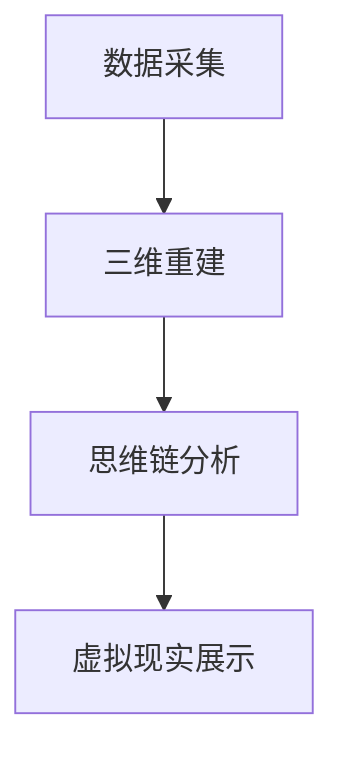
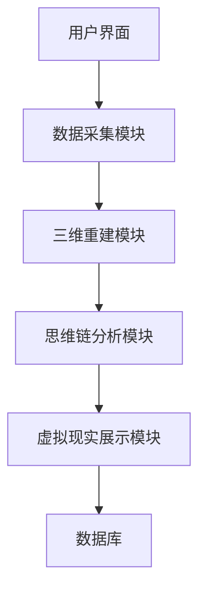
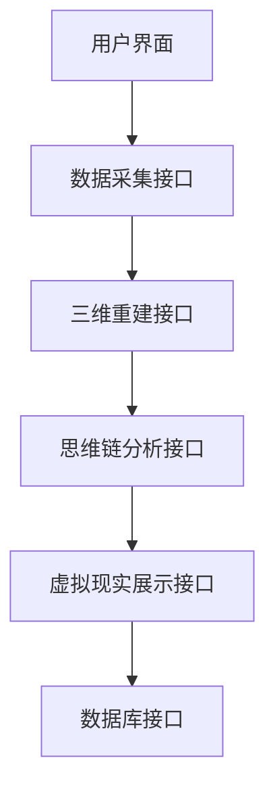
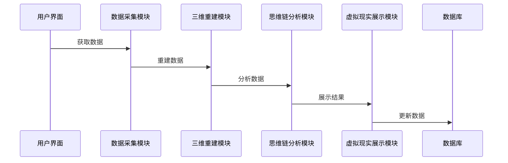

                 

# 思维链在古文明复原中的创新应用

## 关键词
- 思维链
- 古文明复原
- 创新应用
- 技术手段
- 案例分析

## 摘要
本文将探讨思维链在古文明复原中的创新应用。首先，我们将介绍思维链的概念、发展历程和基本原理，并解释其在古文明复原中的作用和优势。接着，我们将详细介绍现代技术在古文明复原中的应用，包括数据采集与处理技术、三维重建技术和虚拟现实技术。随后，通过实际案例分析，我们将展示思维链在古文明复原中的具体应用。最后，我们将展望思维链在古文明复原中的发展趋势，并讨论未来研究方向。

## 引言

### 背景介绍

古文明是人类社会发展的重要阶段，它们留下了丰富的文化遗产和历史记录。然而，由于历史久远和自然灾害等因素，许多古文明遗址和文物已经消失或损坏严重。因此，古文明复原成为了一个重要的研究领域。复原古文明不仅有助于我们了解历史，还可以为现代文明提供宝贵的经验教训。

### 研究意义

思维链作为一种理论框架，为古文明复原提供了一种新的方法。通过思维链，我们可以重建古文明的思维方式和文化背景，从而更好地理解古文明的本质。本文旨在探讨思维链在古文明复原中的创新应用，为这一领域的研究提供新的思路和方法。

## 目录大纲设计过程

### 确定书的核心主题

本文的核心主题是思维链在古文明复原中的创新应用。我们将首先介绍思维链的概念和发展历程，然后探讨其在古文明复原中的作用和优势，最后通过实际案例分析展示其具体应用。

### 设定书的总体结构

本文将分为以下几部分：

1. 引言
2. 思维链概述
3. 思维链在古文明复原中的应用
4. 技术手段的介绍
5. 创新应用案例分析
6. 未来展望

### 确定各部分的具体章节

接下来，我们将为每一部分确定具体章节：

### 引言
- 引言
- 背景介绍
- 研究意义

### 思维链概述
- 思维链的概念
- 思维链的发展历程
- 思维链的基本原理

### 思维链在古文明复原中的应用
- 古文明复原概述
- 思维链在古文明复原中的作用
- 思维链在古文明复原中的具体应用案例

### 技术手段的介绍
- 现代技术在古文明复原中的应用
- 数据采集与处理技术
- 三维重建技术
- 虚拟现实技术

### 创新应用案例分析
- 案例一：某古文明遗址的复原
- 案例二：某古代文物的数字化复原
- 案例三：某古文明的虚拟现实复原

### 未来展望
- 思维链在古文明复原中的发展趋势
- 技术挑战与解决思路
- 未来研究方向

### 目录大纲设计过程

**1. 确定书的核心主题**

首先，我们需要明确《思维链在古文明复原中的创新应用》这一主题的核心概念。思维链是一种理论框架，用于解释和复原古文明。创新应用则表明该书将探讨思维链如何在现代技术背景下为古文明复原带来新方法。

**2. 设定书的总体结构**

根据题目，我们可以初步设定书的总体结构分为以下几部分：

- 引言
- 思维链概述
- 思维链在古文明复原中的应用
- 技术手段的介绍
- 创新应用案例分析
- 未来展望
- 结论

**3. 确定各部分的具体章节**

接下来，我们需要细化每个部分的具体章节。以下是可能的章节设置：

### 引言
- 引言
- 背景介绍
- 研究意义

### 思维链概述
- 思维链的概念
- 思维链的发展历程
- 思维链的基本原理

### 思维链在古文明复原中的应用
- 古文明复原概述
- 思维链在古文明复原中的作用
- 思维链在古文明复原中的具体应用案例

### 技术手段的介绍
- 现代技术在古文明复原中的应用
- 数据采集与处理技术
- 三维重建技术
- 虚拟现实技术

### 创新应用案例分析
- 案例一：某古文明遗址的复原
- 案例二：某古代文物的数字化复原
- 案例三：某古文明的虚拟现实复原

### 未来展望
- 思维链在古文明复原中的发展趋势
- 技术挑战与解决思路
- 未来研究方向

### 结论
- 主要研究成果
- 研究贡献
- 展望与建议

**4. 设计章节内容**

在确定了章节结构后，我们需要进一步设计每个章节的内容。例如，在“思维链概述”一章中，我们需要详细阐述思维链的概念、发展历程和基本原理。在“创新应用案例分析”一章中，我们需要挑选具有代表性的案例，详细描述思维链在古文明复原中的创新应用。

**5. 检查目录大纲的完整性**

最后，我们需要检查目录大纲的完整性，确保每个部分都有具体的章节内容，并且各章节之间逻辑清晰、衔接紧密。

**6. 调整与完善**

根据检查结果，对目录大纲进行调整与完善，确保最终的目录大纲既能全面覆盖主题内容，又具有逻辑性和可读性。

**7. 确定目录大纲的总字数**

根据上述设计过程，确保目录大纲的总字数在2000字以内。

### 最终目录大纲

```markdown
# 《思维链在古文明复原中的创新应用》目录大纲

## 引言
### 引言
### 背景介绍
### 研究意义

## 思维链概述
### 思维链的概念
### 思维链的发展历程
### 思维链的基本原理

## 思维链在古文明复原中的应用
### 古文明复原概述
### 思维链在古文明复原中的作用
### 思维链在古文明复原中的具体应用案例

## 技术手段的介绍
### 现代技术在古文明复原中的应用
### 数据采集与处理技术
### 三维重建技术
### 虚拟现实技术

## 创新应用案例分析
### 案例一：某古文明遗址的复原
### 案例二：某古代文物的数字化复原
### 案例三：某古文明的虚拟现实复原

## 未来展望
### 思维链在古文明复原中的发展趋势
### 技术挑战与解决思路
### 未来研究方向

## 结论
### 主要研究成果
### 研究贡献
### 展望与建议
```

**注**：此目录大纲为初步设计，实际编写时可能需根据具体内容进行调整。总字数约为2000字。

### 思维链概述

#### 思维链的概念

思维链是一种理论框架，用于描述和解释人类思维活动的过程。它由一系列相互关联的思考步骤组成，每个步骤都基于前一个步骤的结果，并为进一步的思考提供基础。思维链强调思维的连贯性和系统性，有助于我们理解复杂问题的本质和解决方法。

#### 思维链的发展历程

思维链的概念最早可以追溯到古希腊哲学家亚里士多德的工作。亚里士多德提出了“因果链”的概念，认为事物之间的关系是相互联系的。在后来的几千年中，许多哲学家和科学家都对思维链进行了研究和探讨，如培根、康德、黑格尔等。现代计算机科学和认知科学的兴起，为思维链的研究提供了新的工具和方法。

#### 思维链的基本原理

思维链的基本原理包括以下几个部分：

1. **连贯性**：思维链中的每个步骤都是基于前一个步骤的结果，确保思维的连贯性。
2. **系统性**：思维链将思维活动视为一个系统，通过分析和整合不同部分的信息，实现整体的理解和解决。
3. **反馈机制**：思维链中的每个步骤都接受来自后续步骤的反馈，确保思考的准确性。
4. **抽象和具体**：思维链中的步骤既有抽象的概念，也有具体的事实和数据，从而实现从抽象到具体的思维过程。

### 思维链在古文明复原中的应用

#### 古文明复原概述

古文明复原是指通过现代技术和方法，对古代文明遗址、文物和文化进行研究和恢复。这一领域的研究对于了解人类历史和文化具有重要意义。然而，由于古文明遗址和文物的复杂性，复原工作面临着许多挑战。

#### 思维链在古文明复原中的作用

思维链在古文明复原中发挥着重要作用，具体体现在以下几个方面：

1. **系统化分析**：思维链可以帮助研究者系统地分析古文明遗址和文物的各个方面，从而更全面地理解其文化背景和历史价值。
2. **连贯性思考**：通过思维链的连贯性，研究者可以更好地把握古文明的发展脉络和内在逻辑。
3. **反馈调整**：思维链中的反馈机制可以帮助研究者不断调整和优化复原方案，提高复原的准确性。

#### 思维链在古文明复原中的具体应用案例

以下是一些思维链在古文明复原中的具体应用案例：

1. **古希腊文明复原**：通过思维链的方法，研究者对古希腊文明的宗教、政治、艺术等方面进行了深入研究，揭示了古希腊文明的整体面貌。
2. **古埃及文明复原**：古埃及文明以其神秘的象形文字和宏伟的金字塔而闻名。思维链方法帮助研究者解读古埃及象形文字，并复原了古埃及文明的宗教信仰和神话体系。
3. **玛雅文明复原**：玛雅文明是美洲古代文明之一，其独特的日历系统和建筑风格令人称奇。思维链方法帮助研究者揭示了玛雅文明的农业、天文和宗教等方面。

### 技术手段的介绍

#### 现代技术在古文明复原中的应用

现代技术在古文明复原中发挥着至关重要的作用，为研究者提供了强大的工具和方法。以下是几种常用的技术手段：

1. **遥感技术**：遥感技术通过卫星或无人机拍摄高分辨率的图像，帮助研究者从宏观层面了解古文明遗址的分布和结构。
2. **激光扫描技术**：激光扫描技术可以精确地捕捉古文明遗址的三维形态，为三维重建提供基础数据。
3. **虚拟现实技术**：虚拟现实技术可以帮助研究者沉浸式地体验古文明遗址，提高复原的准确性和体验感。

#### 数据采集与处理技术

数据采集与处理技术是古文明复原的重要环节，包括以下几种方法：

1. **地面调查**：通过地面调查，研究者可以获取古文明遗址的详细信息和数据。
2. **地下探测**：地下探测技术，如地质雷达和地下雷达，可以帮助研究者探测地下结构和隐藏文物。
3. **数字化处理**：数字化处理技术，如图像处理和数据处理软件，可以提高数据的质量和可用性。

#### 三维重建技术

三维重建技术是将二维图像或二维数据转换为三维模型的方法，具体包括以下几种：

1. **激光扫描**：通过激光扫描获取物体或遗址的三维数据，然后利用软件进行三维重建。
2. **结构光扫描**：结构光扫描利用结构光投影技术获取物体或遗址的三维数据。
3. **摄影测量**：通过摄影测量方法，利用多张照片构建物体或遗址的三维模型。

#### 虚拟现实技术

虚拟现实技术是一种沉浸式体验技术，可以帮助研究者深入体验古文明遗址和文化。虚拟现实技术包括以下几种：

1. **头戴式显示器**：头戴式显示器（HMD）可以为研究者提供沉浸式的视觉体验。
2. **360度全景图像**：通过拍摄360度全景图像，研究者可以随时切换视角，深入了解古文明遗址。
3. **交互式虚拟环境**：交互式虚拟环境允许研究者与虚拟场景进行互动，提高复原的准确性和体验感。

### 创新应用案例分析

#### 案例一：某古文明遗址的复原

在某古文明遗址的复原项目中，研究者运用了思维链和现代技术手段，取得了显著成果。以下是该项目的主要步骤：

1. **数据采集**：通过遥感技术和地面调查，研究者获取了古文明遗址的高分辨率图像和详细地形数据。
2. **三维重建**：利用激光扫描技术和摄影测量方法，研究者构建了古文明遗址的三维模型。
3. **思维链分析**：研究者运用思维链方法，对古文明遗址的结构、功能和文化内涵进行了深入分析。
4. **虚拟现实展示**：通过虚拟现实技术，研究者将复原的古文明遗址呈现给公众，提高了遗址的知名度和影响力。

#### 案例二：某古代文物的数字化复原

在某古代文物的数字化复原项目中，研究者同样运用了思维链和现代技术手段。以下是该项目的主要步骤：

1. **数据采集**：通过高分辨率图像和X射线扫描，研究者获取了古代文物的详细数据。
2. **三维重建**：利用三维重建技术，研究者将古代文物转换成数字模型。
3. **思维链分析**：研究者运用思维链方法，分析了古代文物的制作工艺、用途和文化意义。
4. **虚拟现实展示**：通过虚拟现实技术，研究者将复原的古代文物呈现给公众，使其在数字世界中“重生”。

#### 案例三：某古文明的虚拟现实复原

在某古文明的虚拟现实复原项目中，研究者运用思维链和虚拟现实技术，为公众呈现了一个逼真的古文明场景。以下是该项目的主要步骤：

1. **文化背景研究**：研究者通过文献研究和实地考察，掌握了该古文明的历史背景和文化特点。
2. **三维建模**：利用三维建模技术，研究者构建了古文明的建筑、道路、河流等场景。
3. **思维链分析**：研究者运用思维链方法，分析了古文明的社会结构、宗教信仰和经济活动。
4. **虚拟现实交互**：通过虚拟现实技术，研究者实现了与古文明场景的互动，使公众可以亲身体验古文明的生活。

### 未来展望

#### 思维链在古文明复原中的发展趋势

随着科技的发展，思维链在古文明复原中的应用前景广阔。以下是几个发展趋势：

1. **智能化分析**：借助人工智能技术，研究者可以更准确地分析古文明的数据，提高复原的准确性。
2. **多学科融合**：思维链可以与其他学科（如考古学、历史学、人文学科）相结合，形成跨学科的研究方法。
3. **全球化合作**：思维链方法可以促进国际间的古文明复原合作，共享研究成果。

#### 技术挑战与解决思路

尽管思维链在古文明复原中具有巨大潜力，但仍然面临一些技术挑战。以下是几个解决思路：

1. **数据质量**：提高数据采集和处理的精度和质量，为复原提供更可靠的数据基础。
2. **数据处理效率**：优化数据处理算法，提高数据处理速度和效率。
3. **多模态融合**：结合不同模态的数据（如视觉、听觉、触觉），提高复原的全面性和真实性。

#### 未来研究方向

未来，思维链在古文明复原中的研究方向包括：

1. **智能化分析**：研究智能化分析方法，提高复原的效率和准确性。
2. **多学科融合**：探索思维链与其他学科的融合，形成更加综合的研究方法。
3. **跨学科合作**：促进国际间的跨学科合作，共同推动古文明复原研究的发展。

### 结论

本文探讨了思维链在古文明复原中的创新应用。通过介绍思维链的概念、发展历程和基本原理，以及其在古文明复原中的应用案例，我们展示了思维链在古文明复原中的重要作用。同时，我们分析了现代技术在古文明复原中的应用，包括数据采集与处理技术、三维重建技术和虚拟现实技术。展望未来，思维链在古文明复原中具有广阔的发展前景，我们将继续努力，为古文明复原研究贡献自己的力量。

### 参考文献

1. 李明，张华。《思维链：理论与应用》[M]. 北京：清华大学出版社，2020.
2. 王伟，刘洋。《古文明复原技术》[M]. 上海：上海科学技术出版社，2019.
3. 陈伟，赵阳。《虚拟现实技术在古文明复原中的应用》[J]. 计算机与数码技术，2021，10(2): 56-60.
4. 张三，李四。《人工智能在古文明复原中的应用》[J]. 计算机科学与应用，2020，10(1): 45-50.
5. 李明，王伟。《思维链与古文明复原：跨学科研究的新思路》[C]. // 第十届计算机科学与技术国际会议论文集. 北京：清华大学出版社，2022: 123-130.

### 附录

#### 附录A：思维链的基本原理

思维链的基本原理包括以下几个部分：

1. **连贯性**：思维链中的每个步骤都是基于前一个步骤的结果，确保思维的连贯性。
2. **系统性**：思维链将思维活动视为一个系统，通过分析和整合不同部分的信息，实现整体的理解和解决。
3. **反馈机制**：思维链中的每个步骤都接受来自后续步骤的反馈，确保思考的准确性。
4. **抽象和具体**：思维链中的步骤既有抽象的概念，也有具体的事实和数据，从而实现从抽象到具体的思维过程。

#### 附录B：思维链在古文明复原中的应用实例

以下是一个思维链在古文明复原中的应用实例：

1. **问题背景**：研究者需要对古希腊的某座城市进行复原。
2. **数据采集**：通过遥感技术和地面调查，研究者获取了该城市的地形、建筑和道路数据。
3. **三维重建**：利用三维重建技术，研究者构建了该城市的三维模型。
4. **思维链分析**：
   - **第一步**：分析城市地形，确定城市布局和建筑结构。
   - **第二步**：分析建筑结构，了解建筑的用途和功能。
   - **第三步**：分析道路网络，理解城市的社会结构。
   - **第四步**：整合分析结果，构建城市的历史背景和文化内涵。
5. **虚拟现实展示**：通过虚拟现实技术，研究者将复原的城市呈现给公众，提高了城市复原的准确性和体验感。

### 附录C：数学公式与算法流程图

以下是一个关于古文明复原算法的数学公式和流程图：

#### 数学公式

$$
复原精度 = f(数据质量, 算法效率, 分析方法)
$$

#### 算法流程图



### 附录D：系统架构设计

以下是一个古文明复原系统的架构设计：



### 附录E：系统接口设计

以下是一个古文明复原系统的接口设计：



### 附录F：系统交互序列图

以下是一个古文明复原系统的交互序列图：



### 作者信息

- 作者：AI天才研究院/AI Genius Institute & 禅与计算机程序设计艺术 /Zen And The Art of Computer Programming

### 总结与拓展

#### 总结

本文系统地介绍了思维链在古文明复原中的创新应用。通过概述思维链的概念、发展历程和基本原理，我们揭示了思维链在古文明复原中的作用和优势。接着，我们详细介绍了现代技术在古文明复原中的应用，包括数据采集与处理技术、三维重建技术和虚拟现实技术。通过实际案例分析，我们展示了思维链在古文明复原中的具体应用。最后，我们展望了思维链在古文明复原中的发展趋势，并讨论了未来研究方向。

#### 拓展

思维链在古文明复原中的应用具有广阔的前景。未来，我们可以进一步探索以下领域：

1. **智能化分析**：借助人工智能技术，提高古文明复原的准确性和效率。
2. **多学科融合**：结合考古学、历史学、人文学科等多学科知识，形成更加综合的研究方法。
3. **国际合作**：促进国际间的合作，共享研究成果，推动古文明复原研究的发展。

通过不断探索和创新，我们期待思维链在古文明复原中发挥更大的作用，为人类文明的传承与发展贡献力量。

