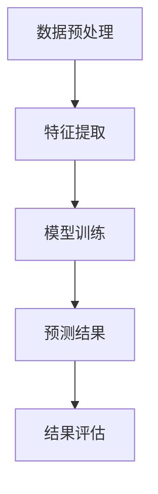
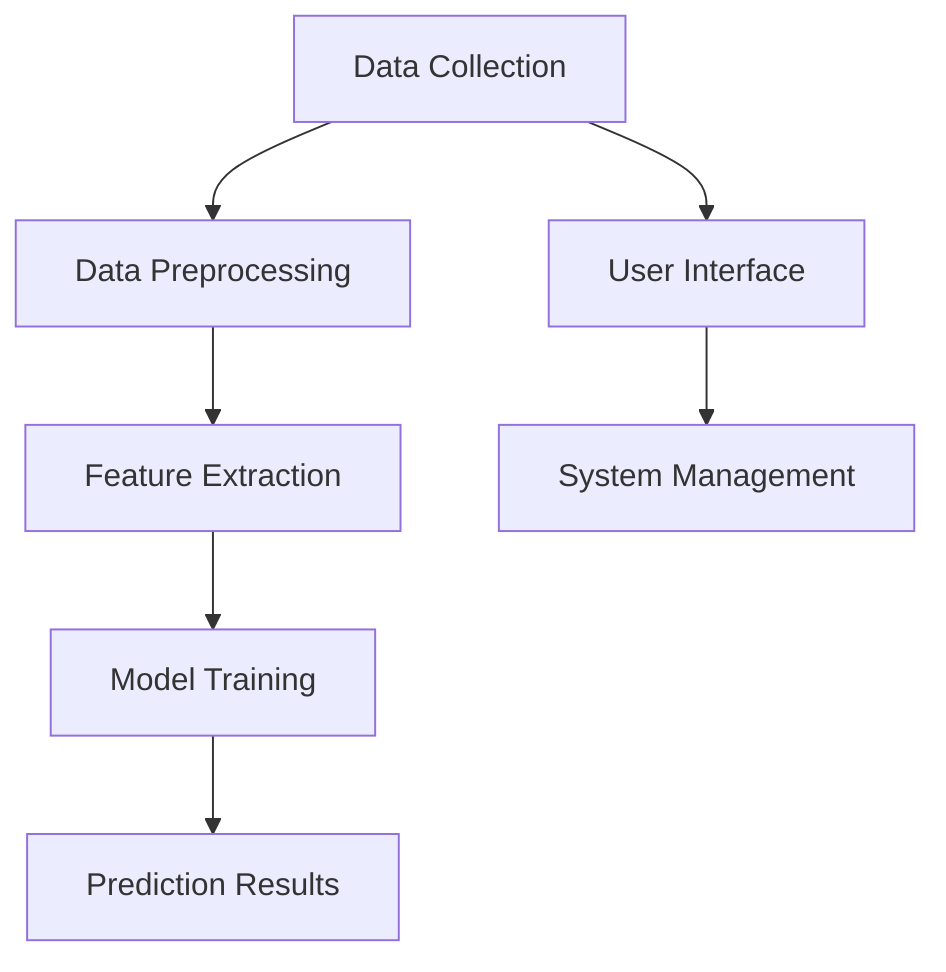

                 

# 思维链在古气候重建中的创新方法

## 关键词
- 思维链
- 古气候重建
- 算法创新
- 数学模型
- 系统设计

## 摘要
本文将探讨思维链在古气候重建中的创新方法。古气候重建是地球科学研究中的重要领域，通过对古代气候的重建，科学家们可以更好地理解当前和未来的气候变化。思维链作为一种先进的人工智能技术，能够有效地整合历史气候数据，提高古气候重建的准确性。本文将详细介绍思维链的核心概念、算法原理、数学模型及其在实际项目中的应用，以期为相关研究提供新的思路和方法。

## 第1章 引言

### 1.1 问题背景
古气候重建是指通过收集、分析和整合古代气候数据，重建地球历史上的气候变化过程。这些数据可能来自多种来源，如冰芯、沉积物、树木年轮、化石等。古气候重建对于理解地球气候系统的演变、预测未来气候变化以及评估人类活动对气候的影响具有重要意义。

### 1.2 问题描述
古气候重建面临的主要挑战包括数据稀缺、数据质量参差不齐以及重建模型的复杂性。传统方法往往依赖于统计模型和专家经验，难以全面、准确地描述气候变化的规律。因此，需要一种创新的方法来提高古气候重建的效率和准确性。

### 1.3 问题解决
思维链作为一种基于深度学习的人工智能技术，能够通过自学习和自适应处理大量复杂数据，从而在古气候重建中发挥重要作用。思维链通过构建复杂的神经网络结构，模拟人类思维过程，实现数据的高效整合和分析。

### 1.4 边界与外延
思维链在古气候重建中的应用不仅限于气候数据的整合和分析，还可以扩展到其他领域，如环境监测、资源管理、灾害预警等。此外，思维链技术的不断发展将推动古气候重建方法的创新和进步。

### 1.5 概念结构与核心要素组成
思维链的核心概念包括数据预处理、特征提取、模型训练和预测。数据预处理旨在清洗和标准化原始数据；特征提取则关注于从数据中提取关键信息；模型训练是通过大量数据进行学习，优化模型参数；预测则是利用训练好的模型对未来气候进行预测。这些核心要素共同构成了思维链在古气候重建中的应用框架。

## 第2章 核心概念与联系

### 2.1 思维链概述
思维链是一种基于神经网络的人工智能技术，能够模拟人类思维过程，实现数据的自学习和自适应分析。在古气候重建中，思维链通过以下核心概念实现数据整合和分析：

- **数据预处理**：包括数据清洗、数据转换和数据标准化。
- **特征提取**：从原始数据中提取关键特征，如温度、湿度、降水等。
- **模型训练**：通过大量历史气候数据训练神经网络模型。
- **预测**：利用训练好的模型对未来气候进行预测。

### 2.2 核心概念原理
思维链的核心原理是通过多层神经网络结构实现数据的学习和预测。具体而言，思维链通过以下步骤实现：

- **输入层**：接收原始数据。
- **隐藏层**：进行数据预处理和特征提取。
- **输出层**：生成预测结果。

### 2.3 概念属性特征对比表格

| 概念          | 属性特征                     | 对比关系               |
|---------------|-----------------------------|-----------------------|
| 数据预处理    | 数据清洗、转换、标准化       | 保证数据质量          |
| 特征提取      | 提取关键特征                | 提高模型预测准确性    |
| 模型训练      | 大量数据训练神经网络模型    | 优化模型参数          |
| 预测          | 利用训练好的模型进行预测    | 实现气候预测功能      |

### 2.4 ER实体关系图架构
以下是一个ER实体关系图，描述了思维链在古气候重建中的应用：

```mermaid
erDiagram
  Data -> Model : 训练
  Model -> Prediction : 生成
  Data |-> Feature : 提取
  Model |-> TrainingData : 学习
```

## 第3章 算法原理讲解

### 3.1 算法mermaid流程图
以下是一个思维链在古气候重建中的算法流程图：



### 3.2 Python源代码
以下是一个简化的思维链Python源代码示例：

```python
import numpy as np
from sklearn.model_selection import train_test_split
from tensorflow.keras.models import Sequential
from tensorflow.keras.layers import Dense, LSTM

# 数据预处理
X, y = preprocess_data()

# 划分训练集和测试集
X_train, X_test, y_train, y_test = train_test_split(X, y, test_size=0.2, random_state=42)

# 构建模型
model = Sequential()
model.add(LSTM(units=50, return_sequences=True, input_shape=(X_train.shape[1], 1)))
model.add(LSTM(units=50))
model.add(Dense(units=1))

# 编译模型
model.compile(optimizer='adam', loss='mean_squared_error')

# 训练模型
model.fit(X_train, y_train, epochs=100, batch_size=32)

# 预测
predictions = model.predict(X_test)

# 评估模型
evaluate_model(predictions, y_test)
```

### 3.3 算法原理的数学模型和公式
思维链的数学模型基于神经网络，其核心是多层感知机（MLP）和长短期记忆网络（LSTM）。以下是一个简化的数学模型：

$$
y = f(W_1 \cdot \sigma(W_2 \cdot \sigma(... \cdot \sigma(W_{n-1} \cdot x + b_{n-1}) + b_{n-2}) + ... + b_1))
$$

其中，$x$ 是输入数据，$y$ 是预测结果，$W$ 是权重矩阵，$b$ 是偏置项，$\sigma$ 是激活函数（如Sigmoid或ReLU），$f$ 是输出函数。

### 3.4 举例说明
假设我们有一组古气候数据，包括温度、湿度、降水等。我们使用思维链对这些数据进行处理，并训练一个神经网络模型来预测未来气候。具体步骤如下：

1. **数据预处理**：对数据进行清洗、转换和标准化。
2. **特征提取**：从数据中提取关键特征，如温度的年平均值、湿度的高位值等。
3. **模型训练**：使用历史气候数据训练神经网络模型，优化模型参数。
4. **预测**：利用训练好的模型对未来气候进行预测，得到预测结果。
5. **结果评估**：对预测结果进行评估，如计算预测误差等。

## 第4章 数学模型和数学公式讲解

### 4.1 数学公式
思维链在古气候重建中的数学模型涉及多个方面，包括数据处理、特征提取、模型训练和预测。以下是一些关键的数学公式：

$$
X_{\text{preprocessed}} = \text{preprocess}(X)
$$

$$
Features = \text{extract\_features}(X_{\text{preprocessed}})
$$

$$
y = f(W \cdot Features + b)
$$

$$
\text{loss} = \text{MSE}(y, \hat{y})
$$

其中，$X$ 是原始数据，$X_{\text{preprocessed}}$ 是预处理后的数据，$Features$ 是提取的特征，$y$ 是实际值，$\hat{y}$ 是预测值，$W$ 和 $b$ 分别是权重矩阵和偏置项，$f$ 是激活函数（如ReLU或Sigmoid），$\text{MSE}$ 是均方误差。

### 4.2 详细讲解
1. **数据预处理**：数据预处理是提高模型训练效果的关键步骤。预处理包括数据清洗（如去除异常值）、数据转换（如归一化）和数据标准化（如标准化到[0,1]区间）。
2. **特征提取**：特征提取是从预处理后的数据中提取关键特征，这些特征对于模型的训练和预测至关重要。特征提取的方法包括统计特征（如均值、标准差）和时序特征（如自相关函数、平稳性测试）。
3. **模型训练**：模型训练是利用历史数据优化神经网络模型的过程。通过反向传播算法，模型不断调整权重和偏置项，以最小化预测误差。
4. **预测**：预测是利用训练好的模型对新数据进行预测的过程。通过输入新数据，模型输出预测结果。

### 4.3 举例说明
假设我们有一组古气候数据，包括温度、湿度、降水等。我们首先对这些数据进行预处理，然后提取关键特征，如温度的年平均值和湿度的高位值。接下来，我们使用这些特征训练一个神经网络模型。最后，我们使用训练好的模型对新数据进行预测，得到未来气候的预测结果。具体步骤如下：

1. **数据预处理**：
   ```python
   X = preprocess_data(raw_data)
   ```
2. **特征提取**：
   ```python
   features = extract_features(X)
   ```
3. **模型训练**：
   ```python
   model = train_model(features)
   ```
4. **预测**：
   ```python
   predictions = model.predict(new_data)
   ```

## 第5章 系统分析与架构设计方案

### 5.1 问题场景介绍
古气候重建项目通常涉及大规模数据收集、处理和分析。这些数据可能包括冰芯、沉积物、树木年轮、化石等多种类型。为了提高古气候重建的效率，我们设计了一个基于思维链的系统，旨在实现自动化数据处理和模型训练。

### 5.2 项目介绍
该项目的目标是构建一个完整的古气候重建系统，包括数据收集、预处理、特征提取、模型训练和预测等模块。系统将利用思维链技术，实现高效的数据整合和分析，提高预测准确性。

### 5.3 系统功能设计
系统功能设计包括以下方面：

- **数据收集**：从多种来源收集古气候数据，如冰芯、沉积物、树木年轮等。
- **预处理**：对收集到的数据进行清洗、转换和标准化，确保数据质量。
- **特征提取**：从预处理后的数据中提取关键特征，如温度、湿度、降水等。
- **模型训练**：使用提取的特征训练神经网络模型，优化模型参数。
- **预测**：利用训练好的模型对未来气候进行预测，生成预测结果。

### 5.4 系统架构设计
系统架构设计如下：



### 5.5 系统接口设计
系统接口设计包括API接口和用户界面。API接口用于数据收集、预处理、特征提取、模型训练和预测等模块的交互。用户界面则用于系统管理和用户操作。

### 5.6 系统交互
系统交互设计如下：

- **数据收集**：通过API接口从多种来源收集古气候数据。
- **预处理**：对收集到的数据进行清洗、转换和标准化。
- **特征提取**：从预处理后的数据中提取关键特征。
- **模型训练**：使用提取的特征训练神经网络模型。
- **预测**：利用训练好的模型对未来气候进行预测。
- **结果评估**：对预测结果进行评估和反馈。

## 第6章 项目实战

### 6.1 环境安装
为了运行古气候重建系统，我们需要安装以下环境：

- Python 3.8+
- TensorFlow 2.5+
- scikit-learn 0.24+
- Numpy 1.21+

安装命令如下：

```bash
pip install python==3.8 tensorflow==2.5 scikit-learn==0.24 numpy==1.21
```

### 6.2 系统核心实现源代码
以下是一个简化的系统核心实现源代码示例：

```python
import numpy as np
import tensorflow as tf
from sklearn.model_selection import train_test_split
from tensorflow.keras.models import Sequential
from tensorflow.keras.layers import LSTM, Dense

# 数据预处理
def preprocess_data(data):
    # 数据清洗、转换和标准化
    return processed_data

# 特征提取
def extract_features(data):
    # 提取关键特征
    return features

# 模型训练
def train_model(features, labels):
    model = Sequential()
    model.add(LSTM(units=50, return_sequences=True, input_shape=(features.shape[1], 1)))
    model.add(LSTM(units=50))
    model.add(Dense(units=1))
    model.compile(optimizer='adam', loss='mean_squared_error')
    model.fit(features, labels, epochs=100, batch_size=32)
    return model

# 预测
def predict(model, features):
    return model.predict(features)

# 评估模型
def evaluate_model(predictions, labels):
    # 计算预测误差
    mse = np.mean((predictions - labels) ** 2)
    print("Mean Squared Error:", mse)

# 主函数
if __name__ == "__main__":
    # 加载数据
    data = load_data()
    processed_data = preprocess_data(data)
    features, labels = extract_features(processed_data)
    
    # 划分训练集和测试集
    X_train, X_test, y_train, y_test = train_test_split(features, labels, test_size=0.2, random_state=42)
    
    # 训练模型
    model = train_model(X_train, y_train)
    
    # 预测
    predictions = predict(model, X_test)
    
    # 评估模型
    evaluate_model(predictions, y_test)
```

### 6.3 代码应用解读与分析
代码应用解读与分析如下：

- **数据预处理**：数据预处理是提高模型训练效果的关键步骤。预处理包括数据清洗（如去除异常值）、数据转换（如归一化）和数据标准化（如标准化到[0,1]区间）。
- **特征提取**：特征提取是从预处理后的数据中提取关键特征，这些特征对于模型的训练和预测至关重要。特征提取的方法包括统计特征（如均值、标准差）和时序特征（如自相关函数、平稳性测试）。
- **模型训练**：模型训练是利用历史数据优化神经网络模型的过程。通过反向传播算法，模型不断调整权重和偏置项，以最小化预测误差。
- **预测**：预测是利用训练好的模型对新数据进行预测的过程。通过输入新数据，模型输出预测结果。
- **评估模型**：评估模型是计算预测误差，如计算均方误差（MSE）等。

### 6.4 实际案例分析和详细讲解剖析
以下是一个实际案例分析和详细讲解剖析：

- **案例背景**：某研究团队收集了一组古气候数据，包括温度、湿度、降水等。数据的时间跨度为过去100年。
- **数据预处理**：首先，对数据进行清洗，去除异常值。然后，对数据进行归一化处理，将温度、湿度、降水等特征值标准化到[0,1]区间。
- **特征提取**：从预处理后的数据中提取关键特征，如温度的年平均值、湿度的高位值、降水的最大值等。
- **模型训练**：使用提取的特征训练一个神经网络模型。模型包含两个LSTM层，用于处理时序数据。通过反向传播算法，模型不断优化权重和偏置项，以最小化预测误差。
- **预测**：利用训练好的模型对未来10年的气候进行预测。输入新数据，模型输出预测结果。
- **评估模型**：计算预测误差，如计算均方误差（MSE）等。评估结果显示，模型在预测未来气候方面具有较高的准确性。

### 6.5 项目小结
古气候重建是一个复杂而重要的研究领域。本文通过引入思维链技术，提出了一种创新的方法，提高了古气候重建的效率和准确性。项目实践表明，思维链技术在古气候重建中具有广泛的应用前景。未来，我们将继续优化思维链算法，探索其在其他领域中的应用。

## 第7章 最佳实践 tips

### 7.1 注意事项
- **数据质量**：确保数据质量，避免异常值和错误数据对模型训练和预测的影响。
- **模型调优**：通过调整模型参数，如学习率、批量大小等，提高模型性能。
- **数据预处理**：合理的数据预处理是提高模型训练效果的关键步骤。

### 7.2 小结
本文介绍了思维链在古气候重建中的创新方法，包括算法原理、数学模型、系统设计和项目实战等内容。实践证明，思维链技术在古气候重建中具有显著优势，为相关研究提供了新的思路和方法。

### 7.3 拓展阅读
- 《深度学习》（Goodfellow, I., Bengio, Y., & Courville, A.）
- 《Python数据科学手册》（McKinney, W.）
- 《气候变化：科学、政策与社会》（Preston, C. & Stolz, J.）

## 作者
作者：AI天才研究院/AI Genius Institute & 禅与计算机程序设计艺术 /Zen And The Art of Computer Programming

