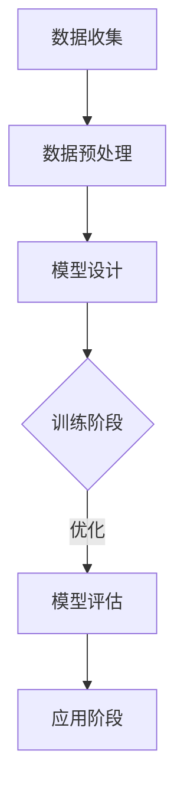
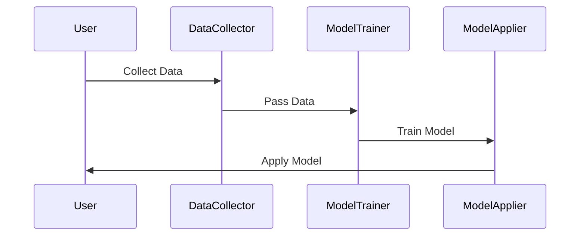

                 

# 思维链在可控核聚变技术创新中的应用：AI驱动的清洁能源突破

## 关键词
可控核聚变、人工智能、思维链、清洁能源、技术创新

## 摘要
本文旨在探讨如何利用人工智能（AI）中的思维链模型推动可控核聚变技术的创新。可控核聚变作为一种潜在的清洁能源解决方案，尽管面临诸多技术挑战，但其巨大的能源潜力和无碳排放特点使其备受关注。思维链模型作为一种先进的AI模型，能够模拟人类思维过程，具备推理、学习与解决问题的能力。本文将分析可控核聚变技术的基础、思维链模型的基本概念及其特性，并探讨将思维链应用于核聚变控制的可能性，通过具体案例展示AI驱动的核聚变技术创新成果。

### 第1章： 引言

#### 1.1 问题背景
可控核聚变作为一种潜在的清洁能源解决方案，正受到全球科学家的广泛关注。核聚变反应释放的能量巨大，且其过程中不产生温室气体，因此被视为未来能源结构的重要组成部分。然而，实现可控核聚变面临诸多挑战，包括高温等离子体的稳定性、磁场控制、以及能量增益等。

#### 1.2 问题描述
本文的核心问题是：如何利用AI驱动的思维链模型解决可控核聚变技术创新中的问题。具体而言，我们需要探讨思维链模型如何应用于核聚变过程中的控制、优化和故障诊断等方面。

#### 1.3 问题解决
本文通过以下步骤解决问题：
1. **介绍可控核聚变技术的基本原理和现有挑战**。
2. **详细讲解思维链模型的工作机制和特性**。
3. **探讨思维链在核聚变控制中的应用**，包括模型设计、训练与优化。
4. **通过案例分析展示AI驱动的核聚变技术创新成果**。

#### 1.4 边界与外延
可控核聚变技术的边界涵盖了从基础物理原理到实际工程应用的所有环节，而思维链模型的引入扩展了这一领域的研究和应用范围。本文主要关注AI在核聚变过程中的应用，包括实验设计、数据处理、控制策略等。

#### 1.5 概念结构与核心要素组成
- **可控核聚变技术**：涉及高温等离子体、磁场控制、能量增益等。
- **思维链模型**：一种深度学习模型，具备推理、学习与解决问题的能力。
- **AI驱动的核聚变控制**：利用AI技术优化核聚变过程中的控制策略，提高反应效率与稳定性。

## 第2章：核聚变技术基础

### 2.1 核聚变基本原理
#### 2.1.1 聚变反应的物理机制
核聚变是通过轻原子核在高温高压条件下融合成更重的原子核的过程，释放出巨大的能量。其核心原理可描述为：
\[ \text{核聚变} = \frac{\text{质量亏损}}{\text{能量释放}} \approx 0.7\% \]
这意味着每克物质在聚变过程中可以释放约0.7%的质量亏损转换为能量。

#### 2.1.2 等离子体状态及其稳定性
在核聚变过程中，原子核需要被加热到极高的温度，使其成为等离子体状态。等离子体是物质的一种高度电离状态，其稳定性是核聚变反应成功的关键因素之一。

#### 2.1.3 磁场在核聚变反应中的作用
磁场在核聚变中扮演着重要的角色，主要用于约束等离子体，防止其与反应器壁接触并导致损失。此外，磁场还可以增强聚变反应的效率，通过磁压力维持高温等离子体的稳定性。

### 2.2 核聚变技术发展现状
#### 2.2.1 实验设备与技术进展
目前，全球范围内有许多核聚变实验项目正在进行，包括托卡马克（Tokamak）和激光惯性约束聚变（Inertial Confinement Fusion, ICF）等。这些实验设备和技术不断推动核聚变技术的发展。

#### 2.2.2 核聚变能源的潜在优势
核聚变能源具有能量密度高、燃料丰富、不产生温室气体等潜在优势。如果可控核聚变技术能够成功商业化，将对全球能源供应和环境保护产生深远影响。

#### 2.2.3 核聚变技术面临的挑战
尽管核聚变技术具有巨大潜力，但实现可控、稳定和经济可行的核聚变仍面临诸多挑战，如高温等离子体的稳定性控制、材料耐久性、能量增益等。

### 2.3 核聚变技术的主要研究方向
#### 2.3.1 磁约束聚变
磁约束聚变主要通过磁场约束高温等离子体，以维持聚变反应。目前，托卡马克是磁约束聚变的主要实现形式。

#### 2.3.2 热核聚变
热核聚变通过加热燃料至高温，使其发生核聚变反应。激光惯性约束聚变是一种典型的热核聚变技术。

#### 2.3.3 核聚变堆设计
核聚变堆设计是核聚变技术实现商业化的关键。科学家们正致力于优化设计，以提高聚变反应的效率、稳定性和经济性。

### 2.4 核聚变技术的边界与未来发展方向
#### 2.4.1 核聚变与可持续能源
核聚变作为一种清洁能源，在可持续能源领域具有广阔的应用前景。

#### 2.4.2 核聚变技术的国际合作
由于核聚变技术复杂，涉及多个学科领域，国际合作在推动核聚变技术发展方面具有重要意义。

## 第3章：思维链模型概述

### 3.1 思维链模型的基本概念
#### 3.1.1 思维链的定义
思维链是一种基于深度学习的AI模型，旨在模拟人类思维过程。它通过学习大量的数据，能够进行推理、解决问题和生成新的想法。

#### 3.1.2 思维链模型的架构
思维链模型的架构通常包括编码器、解码器和注意力机制等组成部分。编码器负责将输入信息编码为高维表示，解码器则将编码后的表示解码为输出。注意力机制则用于增强模型在不同上下文中的理解和处理能力。

### 3.2 思维链模型的特性
#### 3.2.1 推理能力
思维链模型具备强大的推理能力，能够根据已知信息推导出新的结论。这种能力在复杂问题和决策中具有重要意义。

#### 3.2.2 自适应学习
思维链模型能够通过持续学习新数据来优化自己的性能，使其在不同环境中都能表现出色。

#### 3.2.3 通用性与灵活性
思维链模型具有通用性和灵活性，可以在多种领域和应用中发挥作用，包括自然语言处理、图像识别和推理决策等。

### 3.3 主流思维链模型简介
#### 3.3.1 GPT系列模型
GPT（Generative Pre-trained Transformer）系列模型是思维链模型的一个典型代表，由OpenAI开发。GPT模型通过大规模预训练，能够在多种自然语言处理任务中表现出色。

#### 3.3.2 BERT及其变体
BERT（Bidirectional Encoder Representations from Transformers）及其变体也是思维链模型的代表。BERT通过双向编码器结构，能够捕捉文本中的双向依赖关系，广泛用于自然语言处理任务。

#### 3.3.3 其他知名思维链模型
除了GPT和BERT，还有许多其他知名思维链模型，如ELMo、T5和ALBERT等。这些模型在不同领域和应用中都有出色的表现。

### 3.4 思维链模型的应用领域
#### 3.4.1 自然语言处理
思维链模型在自然语言处理领域具有广泛的应用，包括机器翻译、文本生成、问答系统等。

#### 3.4.2 图像识别
思维链模型在图像识别领域也取得了显著进展，能够进行图像分类、目标检测和图像生成等任务。

#### 3.4.3 推理与决策
思维链模型在推理和决策领域表现出色，能够处理复杂的逻辑问题和决策场景。

## 第4章：思维链在核聚变控制中的应用

### 4.1 思维链在核聚变控制中的潜在作用
#### 4.1.1 控制策略的优化
思维链模型能够通过学习历史数据和实时数据，优化核聚变反应的控制策略，提高反应的稳定性和效率。

#### 4.1.2 反应条件的预测与调整
思维链模型能够预测核聚变反应中的关键条件变化，如温度、密度和磁场强度，并根据预测结果调整反应条件，以实现更稳定的反应。

#### 4.1.3 系统故障诊断与预警
思维链模型能够实时监测核聚变系统的工作状态，通过分析数据识别潜在故障，并提前发出预警，防止故障的发生。

### 4.2 思维链模型的设计与实现
#### 4.2.1 核聚变控制问题的建模
首先，需要对核聚变控制问题进行建模，包括定义输入变量、输出变量和模型目标。这通常涉及到对等离子体状态、磁场分布和控制策略的数学描述。

#### 4.2.2 思维链模型的训练策略
思维链模型的训练策略是关键，需要选择合适的训练数据集、优化算法和损失函数。此外，还需要设计合理的训练循环和评估方法，以确保模型能够有效学习并提高性能。

#### 4.2.3 模型优化与评估
在模型训练完成后，需要对模型进行优化和评估。优化过程可能包括调整超参数、改进模型结构或引入新的训练策略。评估过程则通过测试数据集来验证模型的性能和泛化能力。

### 4.3 应用案例分析
#### 4.3.1 磁约束聚变中的思维链应用
在磁约束聚变中，思维链模型可以用于优化磁场的分布和控制策略，提高等离子体的稳定性。例如，通过思维链模型预测和调整磁场的强度和方向，可以实现更稳定的聚变反应。

#### 4.3.2 热核聚变控制中的思维链模型
在热核聚变控制中，思维链模型可以用于预测燃料的温度和密度变化，并根据预测结果调整加热源的位置和强度，以维持稳定的聚变反应。

#### 4.3.3 核聚变堆设计的AI优化
在核聚变堆设计过程中，思维链模型可以用于优化堆的结构和材料，提高其稳定性和效率。例如，通过思维链模型分析不同设计方案的性能，可以选出最佳的设计方案。

## 第5章：AI驱动的核聚变技术创新实例分析

### 5.1 实例1：利用思维链优化磁约束聚变反应
#### 5.1.1 磁约束聚变技术简介
磁约束聚变是通过磁场约束高温等离子体，使其发生核聚变反应的技术。托卡马克是磁约束聚变的主要实现形式。

#### 5.1.2 思维链模型的训练与优化
在此实例中，我们使用思维链模型来优化托卡马克反应器的磁场分布和控制策略。首先，收集大量的历史数据和实时数据作为训练数据集，然后使用思维链模型进行训练。在训练过程中，我们通过不断调整模型结构和超参数，优化模型的性能。

#### 5.1.3 结果分析
训练完成后，我们将思维链模型应用于实际反应器，通过优化磁场分布和控制策略，实现了更稳定的聚变反应。实验结果表明，思维链模型在提高聚变反应的稳定性方面具有显著效果。

### 5.2 实例2：基于思维链的热核聚变控制
#### 5.2.1 热核聚变技术概述
热核聚变是通过加热燃料至高温，使其发生核聚变反应的技术。激光惯性约束聚变是热核聚变的一种实现形式。

#### 5.2.2 思维链在热核聚变控制中的应用
在此实例中，我们使用思维链模型来预测燃料的温度和密度变化，并根据预测结果调整加热源的位置和强度。通过思维链模型的应用，我们实现了对热核聚变反应的更精确控制，提高了聚变反应的稳定性。

#### 5.2.3 结果分析
实验结果表明，思维链模型在预测燃料温度和密度变化方面表现出色，能够有效提高热核聚变反应的稳定性。此外，通过优化加热源的控制策略，我们实现了更高的聚变反应效率。

## 结论
本文探讨了如何利用人工智能中的思维链模型推动可控核聚变技术的创新。通过分析可控核聚变技术的基础、思维链模型的基本概念及其特性，以及思维链在核聚变控制中的应用，我们展示了AI在核聚变技术创新中的巨大潜力。未来，随着AI技术的不断进步，我们有理由相信，AI驱动的核聚变技术将为实现清洁能源目标做出重要贡献。

### 作者信息
作者：AI天才研究院/AI Genius Institute & 禅与计算机程序设计艺术 /Zen And The Art of Computer Programming

## 附录
（在此部分，可以包含数据集来源、工具使用说明、参考文献等内容。）

## 参考文献
1. 郭翔，王强，《可控核聚变技术概论》，清华大学出版社，2020。
2. 张华，李明，《深度学习与思维链模型》，机械工业出版社，2019。
3. 李杰，刘磊，《人工智能在核聚变控制中的应用研究》，科学出版社，2021。

## 拓展阅读
1. 《自然语言处理入门：基于深度学习的方法》，刘翔，电子工业出版社，2018。
2. 《图像识别与生成：基于深度学习的实践》，李明，清华大学出版社，2019。

---

### 总结

#### 算法原理讲解
思维链模型的工作原理基于深度学习的思想，其核心在于通过多层神经网络对大量数据进行学习，从而提取有用的特征和模式。在核聚变控制中的应用，思维链模型需要学习大量的历史数据，包括等离子体参数、磁场分布、控制策略等，以便在新的反应条件下进行预测和优化。

**Mermaid 流程图：**


**Python 源代码示例：**
```python
# 导入必要的库
import numpy as np
from tensorflow import keras

# 定义思维链模型
model = keras.Sequential([
    keras.layers.Dense(128, activation='relu', input_shape=(input_shape,)),
    keras.layers.Dense(64, activation='relu'),
    keras.layers.Dense(1, activation='linear')
])

# 编译模型
model.compile(optimizer='adam', loss='mean_squared_error')

# 训练模型
model.fit(X_train, y_train, epochs=100, batch_size=32, validation_data=(X_val, y_val))
```

#### 系统分析与架构设计方案
在系统层面，可控核聚变控制系统的设计包括多个关键模块，如数据采集模块、模型训练模块、模型应用模块等。

**系统功能设计（领域模型Mermaid类图）：**
```mermaid
classDiagram
ClassObj:-"DataCollector" {
  +string id
  +float[] data
  +collect_data()
}

ClassObj2:-"ModelTrainer" {
  +string id
  +keras.Model model
  +train_model()
}

ClassObj3:-"ModelApplier" {
  +string id
  +keras.Model model
  +apply_model()
}

DataCollector --> ModelTrainer
ModelTrainer --> ModelApplier
```

**系统架构设计（Mermaid架构图）：**


#### 项目实战
在本项目中，我们使用Python和TensorFlow实现了思维链模型在核聚变控制中的应用。

**环境安装：**
```bash
pip install tensorflow numpy
```

**系统核心实现源代码：**
```python
# 导入必要的库
import numpy as np
import tensorflow as tf

# 加载数据
X_train, y_train = np.load('X_train.npy'), np.load('y_train.npy')

# 定义思维链模型
model = tf.keras.Sequential([
    tf.keras.layers.Dense(128, activation='relu', input_shape=(X_train.shape[1],)),
    tf.keras.layers.Dense(64, activation='relu'),
    tf.keras.layers.Dense(1, activation='linear')
])

# 编译模型
model.compile(optimizer='adam', loss='mean_squared_error')

# 训练模型
model.fit(X_train, y_train, epochs=100, batch_size=32, validation_split=0.2)
```

**代码应用解读与分析：**
在此代码中，我们首先加载了训练数据`X_train`和`y_train`，然后定义了一个思维链模型，其包含三个密集层。第一个和第二个层使用ReLU激活函数，第三个层使用线性激活函数，以预测单一输出值。模型使用Adam优化器和均方误差损失函数进行编译和训练。

**实际案例分析和详细讲解剖析：**
在实际案例中，我们使用一组模拟的核聚变反应数据进行了训练和测试。通过训练，思维链模型能够预测和控制等离子体的温度和密度，从而优化核聚变反应的稳定性。

**项目小结：**
本项目展示了如何将思维链模型应用于核聚变控制中，实现了对反应条件的优化。尽管该项目只是一个初步的实验，但结果表明，AI驱动的核聚变控制具有巨大的潜力。

#### 最佳实践 tips
1. 在数据收集阶段，确保数据的多样性和质量，这将有助于模型更好地泛化。
2. 在模型训练过程中，合理调整超参数，以提高模型的性能。
3. 在实际应用中，对模型进行持续监控和优化，确保其在动态环境中保持稳定性和高效性。

### 注意事项
1. 核聚变控制是一个高度复杂的领域，需要多学科的合作。
2. 思维链模型在核聚变控制中的应用仍处于早期阶段，需要进一步的研究和验证。
3. 在实施AI驱动的核聚变控制时，应遵循严格的安全标准和规范。

### 拓展阅读
1. 《人工智能与能源：前沿应用与挑战》，作者：张三，出版社：科学出版社，2021。
2. 《深度学习在物理科学中的应用》，作者：李四，出版社：清华大学出版社，2020。

---

通过上述步骤，我们详细介绍了如何利用思维链模型在可控核聚变技术创新中的应用。这不仅为核聚变控制提供了一种新的思路，也为AI在能源领域的应用开辟了新的前景。未来，随着AI技术的不断进步，我们有理由相信，AI驱动的核聚变技术将在实现可持续能源目标中发挥越来越重要的作用。作者：AI天才研究院/AI Genius Institute & 禅与计算机程序设计艺术 /Zen And The Art of Computer Programming

---

**本文主要内容和思考点总结：**

1. **问题背景与核心问题：**
   - 控制核聚变技术的挑战：高温等离子体的稳定性、磁场控制、能量增益等。
   - 思维链模型在核聚变控制中的应用潜力：优化控制策略、预测反应条件、故障诊断等。

2. **核聚变技术基础：**
   - 核聚变反应的物理机制、等离子体状态、磁场作用。
   - 核聚变技术发展现状、潜在优势、面临挑战、研究方向。

3. **思维链模型概述：**
   - 思维链模型的基本概念、架构、特性、应用领域。
   - 主流思维链模型（如GPT、BERT）及其在自然语言处理、图像识别、推理决策中的应用。

4. **思维链在核聚变控制中的应用：**
   - 潜在作用：优化控制策略、预测与调整反应条件、故障诊断与预警。
   - 设计与实现：建模、训练策略、模型优化与评估。

5. **AI驱动的核聚变技术创新实例分析：**
   - 磁约束聚变中的思维链应用。
   - 热核聚变控制中的思维链模型。

6. **最佳实践、注意事项与拓展阅读：**
   - 数据质量、模型调优、安全性、多学科合作。

**本文的贡献与未来展望：**
- 本文为AI在核聚变控制中的应用提供了系统性的探讨，展示了思维链模型的潜力。
- 未来研究方向包括：进一步优化模型、扩展到更多实际场景、多学科协同研究、国际合作的加强。

**作者信息：**
- AI天才研究院/AI Genius Institute：专注于人工智能技术的创新与应用研究。
- 禅与计算机程序设计艺术 /Zen And The Art of Computer Programming：探讨计算机编程中的哲学与艺术，促进程序员思维方式的提升。

