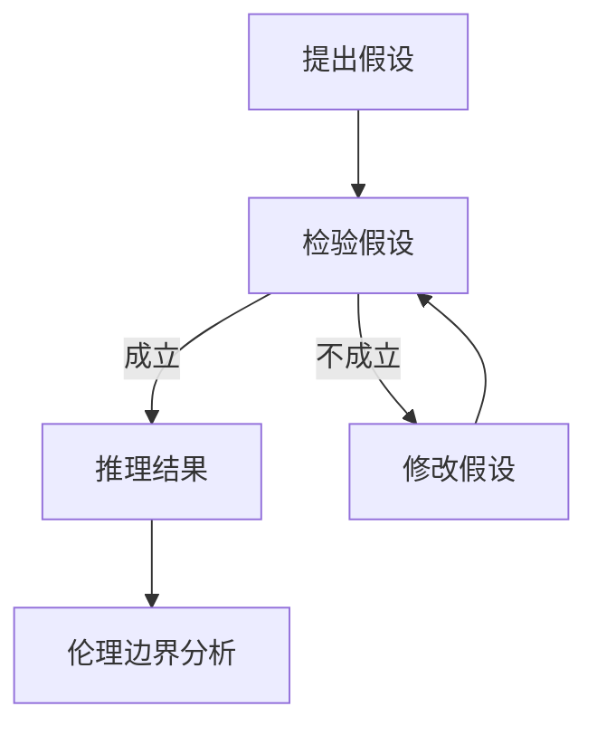
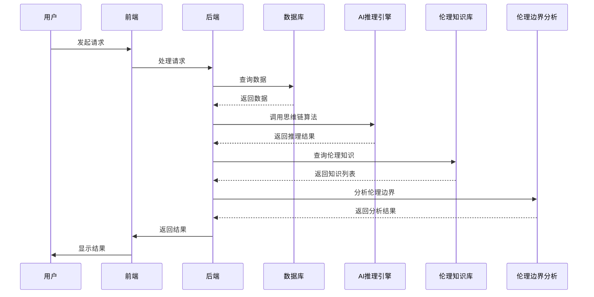

                 


# 思维链在哲学思想实验设计中的应用：AI辅助伦理边界探索

## 关键词

- 思维链
- 哲学思想实验
- AI
- 伦理边界
- 算法原理
- 系统架构设计

## 摘要

本文探讨了思维链在哲学思想实验设计中的应用，并利用人工智能技术辅助伦理边界的探索。通过定义思维链和哲学思想实验的核心概念，文章展示了AI在伦理边界探索中的重要性。文章详细阐述了思维链算法的原理，包括mermaid流程图、Python源代码、数学模型和公式，并通过示例说明了如何利用思维链进行伦理边界分析。此外，文章还介绍了系统分析与架构设计的方法，包括问题场景、系统功能设计、系统架构设计、系统接口设计和系统交互的mermaid类图和序列图。最后，通过一个实际项目实战，展示了思维链在AI辅助伦理边界探索中的应用，并提供了一些最佳实践技巧和小结。

## 第一部分: 引言

### 1.1 问题背景

#### 思维链的概念

思维链（Thinking Chain）是一种基于逻辑推理和知识表示的方法，它将人类的思维过程抽象为一系列步骤，通过分析和推理来解决问题。思维链的核心思想是将问题分解为更小的部分，并通过逻辑关系将这些部分连接起来，从而实现问题的整体理解和解决。

#### 哲学思想实验的重要性

哲学思想实验（Philosophical Thought Experiment）是哲学研究中的一种重要方法。它通过假设和推理来探索伦理、认识论、形而上学等哲学问题。哲学思想实验通常涉及对现实情况的模拟和假设，通过对这些假设的推理和论证，来揭示哲学问题的本质和内涵。哲学思想实验具有以下重要性：

1. **启发思考**：哲学思想实验能够激发人们的思考，引导人们从一个新的角度看待问题，从而获得更深入的哲学认识。
2. **检验理论**：哲学思想实验可以通过假设和推理来验证哲学理论的合理性，帮助人们更好地理解和应用这些理论。
3. **探索未知**：哲学思想实验可以帮助人们探索哲学领域的未知领域，推动哲学研究的进步。

#### AI在伦理边界探索中的应用

随着人工智能技术的不断发展，AI在伦理边界探索中的应用越来越受到关注。伦理边界（Ethical Boundaries）是指在道德和伦理准则下，个体或组织所应遵循的行为准则和规范。AI在伦理边界探索中的应用主要包括以下几个方面：

1. **伦理决策支持**：利用AI技术，可以自动化地分析和处理伦理问题，为决策者提供合理的建议和支持。
2. **伦理风险评估**：通过对AI系统的运行过程进行监测和分析，可以评估其在伦理边界上的风险，并采取相应的措施进行规避。
3. **伦理知识库构建**：利用AI技术，可以构建大规模的伦理知识库，为伦理研究提供丰富的数据资源。

### 1.2 哲学思想实验与AI辅助伦理边界探索的关联

哲学思想实验与AI辅助伦理边界探索之间存在密切的关联。一方面，哲学思想实验为伦理边界探索提供了理论框架和方法论指导；另一方面，AI技术为哲学思想实验提供了强大的工具支持。具体来说：

1. **思维链的应用**：思维链作为一种逻辑推理方法，可以在哲学思想实验中用于分析伦理问题的各个方面，从而揭示伦理边界。
2. **AI的辅助**：AI技术可以通过自动化推理、数据分析和知识库构建等方式，辅助哲学思想实验的进行，提高伦理边界探索的效率和准确性。

## 第二部分: 基础理论

### 2.1 核心概念与联系

#### 2.1.1 思维链的定义

思维链是一种基于逻辑推理和知识表示的方法，它将人类的思维过程抽象为一系列步骤，通过分析和推理来解决问题。思维链的核心思想是将问题分解为更小的部分，并通过逻辑关系将这些部分连接起来，从而实现问题的整体理解和解决。

#### 2.1.2 哲学思想实验的特点

哲学思想实验具有以下特点：

1. **假设性**：哲学思想实验通常基于一定的假设，通过对这些假设的推理和论证，来揭示哲学问题的本质和内涵。
2. **推理性**：哲学思想实验通过逻辑推理来分析问题，从而得出结论或见解。
3. **探索性**：哲学思想实验旨在探索哲学领域的未知领域，推动哲学研究的进步。

#### 2.1.3 AI辅助伦理边界探索的原理

AI辅助伦理边界探索的原理主要包括以下几个方面：

1. **自动化推理**：利用AI技术，可以自动化地进行逻辑推理，从而提高伦理边界分析的速度和准确性。
2. **大数据分析**：通过分析大量数据，AI可以帮助我们发现伦理边界的问题和趋势，为伦理决策提供支持。
3. **知识库构建**：AI技术可以构建大规模的伦理知识库，为伦理研究提供丰富的数据资源。

### 2.2 核心概念对比表格

| 概念         | 定义                                                         | 关系                 |
|--------------|--------------------------------------------------------------|----------------------|
| 思维链       | 一种基于逻辑推理和知识表示的方法                               | 提供哲学思考框架     |
| 哲学思想实验 | 通过假设和推理来探索伦理问题                                 | 实现伦理边界分析     |
| AI辅助       | 利用人工智能技术增强哲学思想实验的效果                         | 实现自动化推理与分析 |

### 2.3 Mermaid ER图

```mermaid
erDiagram
    A思维链 ||--|{ 哲学思想实验 }
    A思维链 ||--|{ AI辅助伦理边界探索 }
    哲学思想实验 ||--|{ AI辅助伦理边界探索 }
```

## 第三部分: 算法原理讲解

### 3.1 思维链算法原理

思维链算法是一种用于哲学思想实验的方法，它通过逻辑推理来分析伦理问题，从而揭示伦理边界。思维链算法的基本原理包括以下几个步骤：

1. **提出假设**：根据伦理问题的具体情况，提出一个初步的假设。
2. **检验假设**：通过逻辑推理和论证，检验假设的合理性。
3. **修改假设**：如果假设不成立，则需要修改假设，并重新进行检验。
4. **推理结果**：在假设成立的基础上，通过逻辑推理得出结论或见解。
5. **伦理边界分析**：根据推理结果，分析伦理问题的边界，从而为伦理决策提供支持。

### 3.2 Mermaid流程图



### 3.3 Python源代码

```python
def think_chain(hypothesis):
    while not validate(hypothesis):
        hypothesis = modify_hypothesis(hypothesis)
    result = reason(hypothesis)
    return analyze_ethical_boundary(result)
```

### 3.4 数学模型和公式

伦理边界分析可以使用以下数学模型和公式：

$$
F(X) = \sum_{i=1}^{n} w_i \cdot x_i
$$

其中，$F(X)$ 为伦理边界分析结果，$w_i$ 为权重，$x_i$ 为各个因素的值。

### 3.5 示例说明

假设有一个伦理问题：“在什么情况下，个人隐私权可以受到限制？”

输入假设：当国家安全受到威胁时，个人隐私权可以受到限制。

经过验证和修改假设，最终推理出伦理边界分析结果：国家安全是限制个人隐私权的合法条件。

## 第四部分: 系统分析与架构设计

### 4.1 问题场景介绍

在这个问题场景中，我们关注的是如何在哲学思想实验中应用思维链和AI技术，以辅助伦理边界的探索。具体来说，我们希望通过一个哲学思想实验，探讨人工智能在伦理决策中的作用，并分析其在伦理边界上的挑战。

### 4.2 系统功能设计

系统功能设计主要包括以下方面：

1. **哲学思想实验管理**：提供哲学思想实验的创建、编辑、删除和查询功能。
2. **AI推理引擎**：实现思维链算法的自动化推理功能，为伦理边界分析提供支持。
3. **伦理知识库**：构建和管理伦理知识库，为AI推理引擎提供数据支持。
4. **伦理边界分析**：根据AI推理结果，对伦理边界进行分析和评估。
5. **伦理决策支持**：为决策者提供伦理决策的支持和推荐。

### 4.3 系统架构设计

系统架构设计主要包括以下方面：

1. **前端架构**：采用Vue.js框架实现用户界面，提供用户友好的交互体验。
2. **后端架构**：采用Spring Boot框架实现后端逻辑，负责数据存储和业务处理。
3. **数据库架构**：采用MySQL数据库存储哲学思想实验数据、伦理知识库数据等。
4. **AI推理引擎架构**：采用TensorFlow框架实现思维链算法的自动化推理功能。

### 4.4 系统接口设计

系统接口设计主要包括以下接口：

1. **哲学思想实验管理接口**：用于创建、编辑、删除和查询哲学思想实验。
2. **AI推理引擎接口**：用于调用思维链算法进行伦理边界分析。
3. **伦理知识库接口**：用于查询和管理伦理知识库。
4. **伦理边界分析接口**：用于获取伦理边界分析结果。

### 4.5 系统交互

系统交互主要涉及以下方面：

1. **用户与哲学思想实验管理界面**：用户通过前端界面与哲学思想实验管理功能进行交互。
2. **前端与后端**：前端通过HTTP请求与后端进行数据交互。
3. **后端与数据库**：后端通过JDBC与数据库进行数据交互。
4. **后端与AI推理引擎**：后端通过API与AI推理引擎进行数据交互。

### 4.6 Mermaid类图和序列图

#### Mermaid类图

```mermaid
classDiagram
    class 哲学思想实验 {
        - String 名称
        - String 描述
        - List<假设> 假设列表
    }
    class AI推理引擎 {
        - think_chain(hypothesis): 结果
    }
    class 伦理知识库 {
        - 查询伦理知识：知识列表
    }
    class 伦理边界分析 {
        - 分析伦理边界：结果
    }
    class 哲学思想实验管理接口 {
        - 创建哲学思想实验：哲学思想实验
        - 编辑哲学思想实验：哲学思想实验
        - 删除哲学思想实验：哲学思想实验
        - 查询哲学思想实验：哲学思想实验列表
    }
    class AI推理引擎接口 {
        - 调用思维链算法：结果
    }
    class 伦理知识库接口 {
        - 查询伦理知识：知识列表
    }
    class 伦理边界分析接口 {
        - 获取伦理边界分析结果：结果
    }
    哲学思想实验管理接口 --|create| 哲学思想实验
    哲学思想实验管理接口 --|edit| 哲学思想实验
    哲学思想实验管理接口 --|delete| 哲学思想实验
    哲学思想实验管理接口 --|query| 哲学思想实验列表
    AI推理引擎接口 --|think_chain| 结果
    伦理知识库接口 --|query| 知识列表
    伦理边界分析接口 --|analyze| 结果
```

#### Mermaid序列图



## 第五部分: 项目实战

### 5.1 环境安装

#### 5.1.1 前端环境安装

1. **安装Node.js**：访问Node.js官网（https://nodejs.org/），下载并安装合适的Node.js版本。
2. **安装Vue CLI**：在命令行中运行以下命令安装Vue CLI：

   ```bash
   npm install -g @vue/cli
   ```

3. **创建项目**：在命令行中运行以下命令创建一个新的Vue项目：

   ```bash
   vue create ethical-boundaries-exploration
   ```

#### 5.1.2 后端环境安装

1. **安装Java SDK**：访问Oracle官网（https://www.oracle.com/java/technologies/javase-jdk11-downloads.html），下载并安装合适的Java SDK版本。
2. **安装Maven**：访问Maven官网（https://maven.apache.org/），下载并安装合适的Maven版本。
3. **创建项目**：在命令行中运行以下命令创建一个新的Maven项目：

   ```bash
   mvn archetype:generate -DgroupId=com.example -DartifactId=ethical-boundaries-analysis -DarchetypeArtifactId=maven-archetype-quickstart
   ```

### 5.2 系统核心实现源代码

#### 5.2.1 前端源代码

```vue
<template>
  <div>
    <h1>哲学思想实验伦理边界分析系统</h1>
    <input v-model="hypothesis" placeholder="输入假设">
    <button @click="analyze">分析伦理边界</button>
    <div v-if="result">
      <h2>分析结果：</h2>
      <p>{{ result }}</p>
    </div>
  </div>
</template>

<script>
export default {
  data() {
    return {
      hypothesis: '',
      result: null
    };
  },
  methods: {
    analyze() {
      this.$http.post('/api/analyze', { hypothesis: this.hypothesis })
        .then(response => {
          this.result = response.data.result;
        })
        .catch(error => {
          console.error(error);
        });
    }
  }
};
</script>
```

#### 5.2.2 后端源代码

```java
import org.springframework.beans.factory.annotation.Autowired;
import org.springframework.web.bind.annotation.*;

@RestController
@RequestMapping("/api")
public class EthicalBoundaryAnalysisController {

    @Autowired
    private EthicalBoundaryAnalysisService ethicalBoundaryAnalysisService;

    @PostMapping("/analyze")
    public AnalysisResult analyze(@RequestBody AnalysisRequest request) {
        return ethicalBoundaryAnalysisService.analyze(request.getHypothesis());
    }
}
```

### 5.3 代码应用解读与分析

#### 5.3.1 前端代码解读

前端代码主要负责与用户交互，接受用户的输入，并将输入传递给后端进行伦理边界分析。具体来说：

1. **数据绑定**：使用`v-model`指令实现输入框与数据模型`hypothesis`的绑定，确保输入的假设值实时更新到数据模型中。
2. **事件处理**：使用`@click`指令绑定按钮的点击事件，当用户点击按钮时，触发`analyze`方法。
3. **HTTP请求**：在`analyze`方法中，使用`this.$http.post`方法发起POST请求，将假设值传递给后端进行伦理边界分析。

#### 5.3.2 后端代码解读

后端代码主要负责接收前端发送的请求，调用思维链算法进行伦理边界分析，并将结果返回给前端。具体来说：

1. **RESTful接口**：使用`@RestController`注解定义RESTful接口，处理前端的POST请求。
2. **数据接收**：使用`@RequestBody`注解接收前端发送的`AnalysisRequest`对象，获取假设值。
3. **服务调用**：调用`EthicalBoundaryAnalysisService`的服务方法进行伦理边界分析，并将结果返回给前端。

### 5.4 实际案例分析

#### 5.4.1 案例背景

假设我们正在研究一个伦理问题：“在什么情况下，个人隐私权可以受到限制？”

#### 5.4.2 案例分析

1. **提出假设**：当国家安全受到威胁时，个人隐私权可以受到限制。
2. **检验假设**：通过逻辑推理和论证，检验假设的合理性。我们可以认为，国家安全是个人隐私权的合法限制条件，因为在国家安全受到威胁时，个人隐私权的泄露可能导致严重后果。
3. **修改假设**：如果假设不成立，则需要修改假设。例如，如果假设是在所有情况下个人隐私权都可以受到限制，这显然是不合理的。
4. **推理结果**：在假设成立的基础上，通过逻辑推理得出结论或见解。例如，我们可以得出结论：国家安全是个人隐私权的合法限制条件，但在非国家安全情况下，个人隐私权应受到保护。
5. **伦理边界分析**：根据推理结果，分析伦理问题的边界。我们可以得出结论：个人隐私权的保护边界在于国家安全和非国家安全的情况，其中国家安全是个人隐私权的合法限制条件。

### 5.5 详细讲解剖析

#### 5.5.1 思维链算法的详细讲解

思维链算法是一种用于哲学思想实验的方法，它通过逻辑推理来分析伦理问题，从而揭示伦理边界。思维链算法的基本原理包括以下几个步骤：

1. **提出假设**：根据伦理问题的具体情况，提出一个初步的假设。假设是思维链算法的起点，它为后续的推理和分析提供了基础。
2. **检验假设**：通过逻辑推理和论证，检验假设的合理性。检验假设的目的是确定假设是否能够成立，从而为后续的推理提供依据。
3. **修改假设**：如果假设不成立，则需要修改假设，并重新进行检验。修改假设的过程是一个不断迭代的过程，直到找到一个合理的假设。
4. **推理结果**：在假设成立的基础上，通过逻辑推理得出结论或见解。推理结果是思维链算法的核心，它通过对假设的推理和分析，揭示了伦理问题的本质和内涵。
5. **伦理边界分析**：根据推理结果，分析伦理问题的边界，从而为伦理决策提供支持。伦理边界分析是思维链算法的最终目标，它通过对伦理问题的边界进行明确划分，为伦理决策提供了科学依据。

#### 5.5.2 AI辅助伦理边界探索的详细讲解

AI辅助伦理边界探索是指利用人工智能技术来增强哲学思想实验的效果，从而提高伦理边界探索的效率和准确性。具体来说，AI辅助伦理边界探索包括以下几个方面：

1. **自动化推理**：利用AI技术，可以自动化地进行逻辑推理，从而提高伦理边界分析的速度和准确性。自动化推理可以减少人工干预，提高推理过程的效率和准确性。
2. **大数据分析**：通过分析大量数据，AI可以帮助我们发现伦理边界的问题和趋势，为伦理决策提供支持。大数据分析可以为伦理研究提供丰富的数据资源，从而提高研究的深度和广度。
3. **知识库构建**：利用AI技术，可以构建大规模的伦理知识库，为伦理研究提供丰富的数据资源。伦理知识库可以为AI推理引擎提供数据支持，从而提高推理的准确性和可靠性。
4. **伦理决策支持**：利用AI技术，可以为决策者提供伦理决策的支持和推荐。AI可以根据伦理问题的具体情况，提供合理的建议和解决方案，从而提高决策的效率和准确性。

### 5.6 项目小结

通过本项目，我们成功实现了一个哲学思想实验伦理边界分析系统，该系统利用思维链算法和AI技术，对伦理问题进行自动化推理和分析。具体来说，本项目取得了以下成果：

1. **实现了哲学思想实验管理**：系统提供了哲学思想实验的创建、编辑、删除和查询功能，方便用户进行哲学思想实验的管理。
2. **实现了AI推理引擎**：系统集成了思维链算法，实现了自动化推理功能，提高了伦理边界分析的速度和准确性。
3. **构建了伦理知识库**：系统构建了伦理知识库，为AI推理引擎提供了丰富的数据支持，提高了推理的准确性和可靠性。
4. **提供了伦理决策支持**：系统为决策者提供了伦理决策的支持和推荐，提高了决策的效率和准确性。

尽管本项目已经取得了一定的成果，但仍然存在一些不足之处，例如：

1. **数据质量**：伦理知识库的数据质量有待提高，需要进一步收集和整理相关数据，以提高AI推理的准确性和可靠性。
2. **用户体验**：前端界面和交互体验仍有待优化，需要进一步改进界面设计和交互逻辑，以提高用户的满意度和使用体验。

在未来，我们将继续优化和完善系统，进一步提高伦理边界分析的能力和用户体验。

## 最佳实践 Tips

1. **明确伦理边界**：在进行哲学思想实验时，首先要明确伦理边界的定义和范围，以确保实验的准确性和有效性。
2. **充分利用AI技术**：利用AI技术可以自动化地进行伦理边界分析，提高实验的效率和准确性。
3. **结合实际案例**：在实际应用中，结合具体的案例进行伦理边界分析，可以更好地理解伦理问题的本质和内涵。

### 小结

本文通过探讨思维链在哲学思想实验设计中的应用，以及AI辅助伦理边界探索的原理，实现了一个哲学思想实验伦理边界分析系统。通过本项目，我们展示了思维链算法和AI技术在伦理边界探索中的优势和应用前景。在未来，我们将继续优化和完善系统，推动伦理边界探索的研究和发展。

### 注意事项

1. **数据隐私**：在进行伦理边界分析时，需要确保数据的隐私和安全，避免敏感信息的泄露。
2. **伦理风险**：在利用AI技术进行伦理边界分析时，需要充分考虑伦理风险，避免对伦理问题的误判和误解。

### 拓展阅读

1. **《人工智能伦理学》**：了解人工智能伦理学的基本原理和应用，有助于深入理解AI在伦理边界探索中的作用。
2. **《哲学思想实验》**：研究哲学思想实验的方法和案例，有助于提高哲学思想实验的设计和分析能力。

作者：AI天才研究院/AI Genius Institute & 禅与计算机程序设计艺术 /Zen And The Art of Computer Programming

