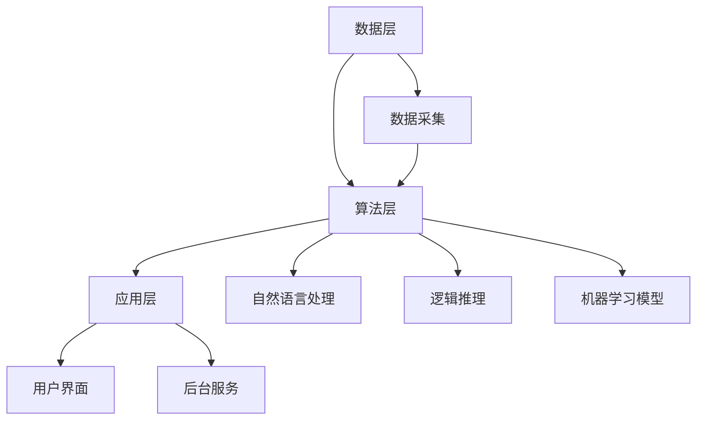
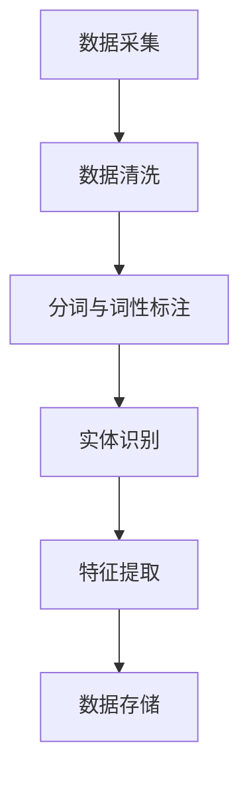
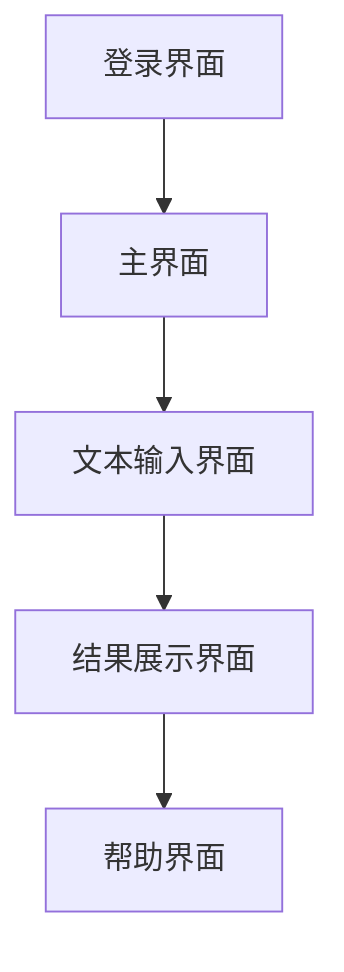

                 

# 思维链在哲学概念形成中的应用：AI辅助抽象思维研究

## 关键词
- AI辅助抽象思维
- 哲学概念形成
- 思维链
- 算法与模型
- 应用实践
- 前景与挑战

## 摘要
本文探讨AI辅助抽象思维在哲学概念形成中的应用，通过思维链的概念引入，分析AI如何支持哲学家的抽象思维过程。文章首先介绍问题背景和核心概念，然后详细讲解AI辅助抽象思维的基本原理和算法模型，并通过实例分析展示其在哲学概念形成中的应用效果。此外，文章还讨论了AI辅助抽象思维的前景与挑战，为未来研究提供了方向。

### 目录大纲

----------------------------------------------------------------
# 第一部分: 背景介绍与核心概念

## 1.1 问题背景
### 1.1.1 AI与抽象思维
### 1.1.2 哲学概念形成的复杂性
### 1.1.3 思维链的概念与应用

## 1.2 核心概念
### 1.2.1 思维链的定义
### 1.2.2 哲学概念的属性特征对比表格
### 1.2.3 思维链与哲学概念的ER实体关系图

## 1.3 研究意义与目标
### 1.3.1 研究意义
### 1.3.2 研究目标
### 1.3.3 边界与外延

## 1.4 本书结构安排
### 1.4.1 各章节主要内容
### 1.4.2 本书预期效果与读者收益

## 1.5 本章小结

----------------------------------------------------------------
# 第二部分: AI辅助抽象思维的基本原理

## 2.1 AI的发展历程
### 2.1.1 AI的概念与定义
### 2.1.2 AI的发展历程
### 2.1.3 抽象思维的AI辅助机制

## 2.2 抽象思维的机制
### 2.2.1 抽象思维的定义与特征
### 2.2.2 抽象思维的核心过程
### 2.2.3 抽象思维的心理模型

## 2.3 思维链的概念与原理
### 2.3.1 思维链的定义
### 2.3.2 思维链的工作机制
### 2.3.3 思维链与抽象思维的关系

## 2.4 AI辅助抽象思维的应用
### 2.4.1 AI在哲学概念形成中的应用
### 2.4.2 AI辅助抽象思维的具体方法
### 2.4.3 AI辅助抽象思维的优势与挑战

## 2.5 本章小结

----------------------------------------------------------------
# 第三部分: AI辅助抽象思维的算法与模型

## 3.1 常见算法介绍
### 3.1.1 支持向量机（SVM）
### 3.1.2 随机森林（Random Forest）
### 3.1.3 神经网络（Neural Networks）

## 3.2 算法原理讲解
### 3.2.1 支持向量机（SVM）算法原理
### 3.2.2 随机森林（Random Forest）算法原理
### 3.2.3 神经网络（Neural Networks）算法原理

## 3.3 模型构建与优化
### 3.3.1 数据预处理
### 3.3.2 模型选择
### 3.3.3 模型优化方法

## 3.4 实例分析
### 3.4.1 SVM在哲学概念形成中的应用实例
### 3.4.2 随机森林在哲学概念形成中的应用实例
### 3.4.3 神经网络在哲学概念形成中的应用实例

## 3.5 本章小结

----------------------------------------------------------------
# 第四部分: AI辅助抽象思维的应用实践

## 4.1 项目介绍
### 4.1.1 项目背景
### 4.1.2 项目目标
### 4.1.3 项目团队与分工

## 4.2 系统设计与实现
### 4.2.1 系统架构设计
### 4.2.2 数据处理流程
### 4.2.3 算法实现与优化

## 4.3 系统功能设计与实现
### 4.3.1 用户界面设计
### 4.3.2 功能模块实现
### 4.3.3 系统性能优化

## 4.4 实际案例分析
### 4.4.1 案例背景
### 4.4.2 案例分析
### 4.4.3 案例结果与评价

## 4.5 项目小结
### 4.5.1 项目成果总结
### 4.5.2 项目经验与教训
### 4.5.3 未来研究方向

## 4.6 本章小结

----------------------------------------------------------------
# 第五部分: AI辅助抽象思维的前景与挑战

## 5.1 技术发展趋势
### 5.1.1 AI技术的发展趋势
### 5.1.2 抽象思维研究的发展趋势
### 5.1.3 AI辅助抽象思维的未来方向

## 5.2 应用前景
### 5.2.1 AI辅助抽象思维在教育领域的应用
### 5.2.2 AI辅助抽象思维在哲学研究中的应用
### 5.2.3 AI辅助抽象思维在其他领域的应用前景

## 5.3 面临的挑战
###

----------------------------------------------------------------

### 第一部分: 背景介绍与核心概念

## 1.1 问题背景

### 1.1.1 AI与抽象思维

人工智能（AI）作为计算机科学的一个重要分支，自20世纪50年代诞生以来，经历了迅猛的发展。从最初的规则推理系统，到后来的知识表示和专家系统，再到现在的深度学习和强化学习，AI技术不断突破，为人类解决了许多复杂问题。然而，AI在处理抽象思维方面的能力仍然有限。抽象思维是人类智慧的核心，它涉及到从具体事物中提取本质属性，形成概念和原理。哲学家、科学家、艺术家等领域的专家都依赖于抽象思维来探索和创造新知识。

抽象思维具有以下特征：

1. **概括性**：抽象思维能够从多个具体事物中提取共性，形成更高层次的抽象概念。
2. **灵活性**：抽象思维不局限于具体情境，可以在不同领域和问题上灵活应用。
3. **创造性**：抽象思维能够产生新的想法和解决方案，推动科学、艺术和技术的进步。

然而，哲学概念的形成过程是一个复杂的过程，它需要哲学家通过不断地思考和推理，将日常生活中的具体经验转化为抽象的概念。在这个过程中，哲学家需要处理大量的信息，进行复杂的关系推理和概念整合。传统的哲学研究方法往往依赖于个人的直觉和经验，缺乏系统性和规范性。因此，如何利用AI技术辅助哲学家的抽象思维过程，提高哲学研究的效率和质量，成为一个值得探讨的问题。

### 1.1.2 哲学概念形成的复杂性

哲学概念的形成是一个复杂的过程，涉及到多个层面和要素。首先，哲学概念的形成需要哲学家对具体事物的观察和体验。哲学家通过观察自然界和社会现象，积累丰富的经验，从而形成对世界的初步认识。然而，这些具体经验往往是零散和片面的，无法直接形成哲学概念。

其次，哲学概念的形成需要哲学家进行抽象和概括。哲学家需要从具体事物中提取共性，将日常生活中的具体经验转化为抽象的概念。这个过程需要哲学家具备高度的概括能力和抽象思维能力。

此外，哲学概念的形成还需要哲学家进行逻辑推理和概念整合。哲学家需要通过逻辑推理，将不同的概念和原理联系起来，形成一个完整的哲学体系。这个过程需要哲学家具备严密的逻辑思维能力和推理能力。

最后，哲学概念的形成还需要哲学家进行反思和验证。哲学家需要对自己的哲学概念进行反复思考和验证，以确保其准确性和可靠性。

综上所述，哲学概念的形成过程涉及到观察、抽象、逻辑推理和反思等多个环节，具有高度的复杂性和挑战性。

### 1.1.3 思维链的概念与应用

思维链是一个概念，用于描述人类在思考过程中，如何通过一系列的逻辑推理和概念整合，形成新的思想和理解。思维链可以被视为一个思维过程的结构模型，它包括以下几个关键要素：

1. **前提**：思维链的前提是哲学家在观察和体验中所积累的具体经验。这些经验是思维链的基础，为哲学概念的形成提供了原始素材。

2. **推理过程**：推理过程是思维链的核心。哲学家通过逻辑推理，将前提转化为结论。这个过程涉及到概念的定义、关系的建立和逻辑推理的规则。

3. **概念整合**：概念整合是思维链的扩展。哲学家需要将不同的概念和原理联系起来，形成一个完整的哲学体系。这个过程需要哲学家具备高度的概括能力和抽象思维能力。

4. **反思与验证**：反思与验证是思维链的结束。哲学家需要对自己的哲学概念进行反复思考和验证，以确保其准确性和可靠性。

在哲学概念形成的过程中，思维链起到了重要的作用。它帮助哲学家将具体经验转化为抽象概念，并通过逻辑推理和概念整合，形成新的哲学思想。同时，思维链也为哲学家提供了一个系统化和规范化的思考框架，有助于提高哲学研究的效率和质量。

AI辅助抽象思维的研究，旨在利用AI技术，模拟和增强人类的抽象思维过程。通过思维链的概念，AI可以更好地理解哲学家的思考模式，提供有针对性的辅助和支持。例如，AI可以帮助哲学家自动进行逻辑推理和概念整合，提供新的哲学概念和理论。此外，AI还可以通过对大量哲学文献的分析，为哲学家提供丰富的参考资料，帮助他们更好地理解和掌握哲学知识。

总之，AI辅助抽象思维在哲学概念形成中的应用，具有重要的理论和实践价值。它不仅有助于提高哲学研究的效率和质量，还可以为其他领域的研究提供新的思路和方法。

## 1.2 核心概念

### 1.2.1 思维链的定义

思维链是一个用于描述人类抽象思维过程的模型，它由一系列逻辑推理和概念整合步骤组成。每个步骤都是基于前提，通过逻辑推理得到结论。思维链的核心在于将具体经验转化为抽象概念，并通过逻辑推理和概念整合，形成新的思想和理解。

**思维链的核心要素：**

1. **前提**：思维链的前提是哲学家在观察和体验中所积累的具体经验。这些经验是思维链的基础，为哲学概念的形成提供了原始素材。
   
2. **推理过程**：推理过程是思维链的核心。哲学家通过逻辑推理，将前提转化为结论。这个过程涉及到概念的定义、关系的建立和逻辑推理的规则。

3. **概念整合**：概念整合是思维链的扩展。哲学家需要将不同的概念和原理联系起来，形成一个完整的哲学体系。这个过程需要哲学家具备高度的概括能力和抽象思维能力。

4. **反思与验证**：反思与验证是思维链的结束。哲学家需要对自己的哲学概念进行反复思考和验证，以确保其准确性和可靠性。

**思维链的工作机制：**

1. **归纳推理**：从具体经验中提取共性，形成初步的概念。
2. **演绎推理**：根据初步概念，推导出更复杂的结论。
3. **类比推理**：通过类比其他领域的知识，扩展和丰富哲学概念。

### 1.2.2 哲学概念的属性特征对比表格

以下表格展示了哲学概念的一些主要属性特征，通过对比不同概念的特征，可以更好地理解哲学概念的复杂性和多样性。

| 概念属性 | 普遍性 | 抽象性 | 关系性 | 变异性 |  
| --- | --- | --- | --- | --- |  
| 常识概念 | 高 | 中 | 低 | 低 |  
| 科学概念 | 中 | 高 | 高 | 中 |  
| 哲学概念 | 低 | 高 | 高 | 高 |

**表格说明：**

- **普遍性**：指概念在时间、空间和情境上的适用范围。
- **抽象性**：指概念从具体事物中提取出的本质属性的程度。
- **关系性**：指概念与其他概念之间的联系和相互作用。
- **变异性**：指概念在不同情境下的适用性和变化程度。

通过这个表格，我们可以看到，哲学概念具有高度的抽象性和关系性，但普遍性较低，变异性较高。这表明哲学概念更关注本质和关系，而非具体的情境和普遍性。

### 1.2.3 思维链与哲学概念的ER实体关系图

以下是思维链与哲学概念的ER（实体关系）图，展示了思维链中的各个实体及其关系。

```
+-------------+
| 实体：思维链 |
+-------------+
| - 属性：前提、推理过程、概念整合、反思与验证 |
+-------------+
| - 方法：归纳推理、演绎推理、类比推理 |
+-------------+
| - 关系：包含多个哲学概念实体 |
+-------------+

+-------------+
| 实体：哲学概念 |
+-------------+
| - 属性：普遍性、抽象性、关系性、变异性 |
+-------------+
| - 方法：定义、分类、比较、整合 |
+-------------+
| - 关系：属于思维链的组成部分 |
+-------------+

```

**ER图说明：**

- **思维链实体**：包含前提、推理过程、概念整合和反思与验证等属性，以及归纳推理、演绎推理、类比推理等方法。
- **哲学概念实体**：包含普遍性、抽象性、关系性、变异性等属性，以及定义、分类、比较、整合等方法。
- **关系**：思维链包含多个哲学概念实体，哲学概念实体是思维链的组成部分。

通过ER图，我们可以清晰地看到思维链与哲学概念之间的关联，以及它们在抽象思维过程中的作用。

### 1.3 研究意义与目标

#### 1.3.1 研究意义

AI辅助抽象思维在哲学概念形成中的应用具有重要的研究意义：

1. **提高哲学研究效率**：AI技术可以帮助哲学家自动进行逻辑推理和概念整合，从而提高哲学研究的效率。
2. **促进哲学创新**：AI可以提供大量的数据和信息，为哲学家的思考提供丰富的素材，有助于创新哲学理论和概念。
3. **解决哲学难题**：AI可以通过模拟和增强人类的抽象思维过程，帮助哲学家解决一些复杂的哲学问题。

#### 1.3.2 研究目标

本研究的主要目标是：

1. **探索AI辅助抽象思维的机制**：分析AI如何支持哲学家的抽象思维过程，为AI在哲学领域中的应用提供理论支持。
2. **开发AI辅助工具**：基于AI技术，开发一套辅助哲学家的抽象思维工具，提高哲学研究的效率和效果。
3. **验证AI辅助抽象思维的应用效果**：通过实际案例，验证AI辅助抽象思维在哲学概念形成中的应用效果，为未来研究提供实证依据。

#### 1.3.3 边界与外延

在研究过程中，需要明确研究的边界和外延：

1. **研究边界**：本研究主要关注AI在哲学概念形成中的应用，不涉及其他领域。
2. **研究外延**：研究将涵盖AI辅助抽象思维的理论基础、算法模型、应用实践和前景与挑战等方面。

### 1.4 本书结构安排

#### 1.4.1 各章节主要内容

本书分为五个部分：

1. **第一部分：背景介绍与核心概念**：介绍AI与抽象思维的关系，哲学概念形成的复杂性，以及思维链的概念与应用。
2. **第二部分：AI辅助抽象思维的基本原理**：讲解AI的发展历程、抽象思维的机制、思维链的概念与原理，以及AI辅助抽象思维的应用。
3. **第三部分：AI辅助抽象思维的算法与模型**：介绍常见算法，讲解算法原理，讨论模型构建与优化，并给出实例分析。
4. **第四部分：AI辅助抽象思维的应用实践**：介绍项目背景、系统设计与实现、系统功能设计与实现，以及实际案例分析。
5. **第五部分：AI辅助抽象思维的前景与挑战**：探讨技术发展趋势、应用前景，以及面临的挑战。

#### 1.4.2 本书预期效果与读者收益

通过本书的阅读，读者可以：

1. **了解AI辅助抽象思维的基本原理**：掌握AI技术如何支持哲学家的抽象思维过程。
2. **学习AI辅助抽象思维的算法与模型**：了解常见的算法原理和模型构建方法。
3. **掌握AI辅助抽象思维的应用实践**：通过实际案例分析，了解AI辅助抽象思维在哲学概念形成中的应用。
4. **思考AI辅助抽象思维的前景与挑战**：为未来研究提供方向和建议。

### 1.5 本章小结

本章介绍了AI辅助抽象思维在哲学概念形成中的应用，包括问题背景、核心概念、研究意义与目标、边界与外延，以及本书的结构安排。通过本章的介绍，读者可以初步了解AI辅助抽象思维的研究内容和目标，为后续章节的学习打下基础。

## 2.1 AI的发展历程

### 2.1.1 AI的概念与定义

人工智能（Artificial Intelligence，简称AI）是指通过计算机系统实现人类智能的技术。它涵盖了从简单到复杂的任务，包括感知、推理、学习、规划、自然语言处理、视觉识别、决策等。AI的核心目标是模拟和扩展人类智能，使计算机能够自主地执行复杂任务。

AI的定义有多种，以下是一些常见的定义：

- **狭义定义**：AI是指计算机系统能够执行特定任务，达到或超过人类水平的能力。
- **广义定义**：AI是指任何使计算机具备智能特征的技术和算法，包括学习和自适应行为。

### 2.1.2 AI的发展历程

AI的发展历程可以分为以下几个阶段：

1. **早期探索（1950年代-1960年代）**：AI的概念最早可以追溯到1940年代，但直到1950年代，AI研究才开始得到广泛关注。1956年，达特茅斯会议标志着AI作为一个独立研究领域的诞生。这一时期的AI研究主要集中在规则推理和知识表示。

2. **黄金时代（1970年代-1980年代）**：在早期探索的基础上，AI研究取得了显著进展。专家系统和知识工程成为研究热点。专家系统是一种模拟人类专家决策能力的计算机程序，它通过规则库和推理机实现智能。

3. **低谷时期（1990年代）**：随着硬件和算法的限制，AI研究进入低谷。规则推理和知识表示方法在实际应用中面临困难，AI研究的进展放缓。

4. **复兴期（2000年代至今）**：随着深度学习、神经网络和大数据技术的发展，AI研究重新焕发生机。深度学习通过多层神经网络模拟人类大脑的学习过程，实现了在图像识别、语音识别、自然语言处理等领域的突破。

### 2.1.3 抽象思维的AI辅助机制

抽象思维是人类智能的核心，它涉及到从具体事物中提取本质属性，形成概念和原理。AI可以通过以下机制辅助抽象思维：

1. **数据驱动学习**：AI系统通过大量数据训练，自动提取数据中的模式和规律，从而实现抽象思维。例如，深度学习通过训练大量的图像数据，可以识别出图像中的物体和场景。

2. **推理和规划**：AI可以通过推理和规划算法，模拟人类的逻辑思维过程。例如，逻辑推理系统可以通过规则库和推理机，实现从前提到结论的推理。

3. **知识表示和推理**：AI可以通过知识表示和推理算法，将人类知识转化为计算机可以处理的形式，并利用推理算法进行知识推理。例如，知识图谱可以通过实体和关系表示知识，并利用推理算法发现新的知识。

4. **人机交互**：AI可以通过人机交互，与人类用户进行对话和协作，帮助用户进行抽象思维。例如，自然语言处理系统可以理解用户的自然语言输入，并提供相应的反馈和建议。

### 2.1.4 AI辅助抽象思维的优势

AI辅助抽象思维具有以下优势：

1. **高效性**：AI可以处理大量数据，快速提取模式和规律，提高抽象思维的效率。

2. **准确性**：AI通过训练和优化，可以不断提高抽象思维的水平，减少错误和偏差。

3. **灵活性**：AI可以适应不同的抽象思维任务，灵活调整算法和模型，适用于各种场景。

4. **协作性**：AI可以与人类专家进行协作，互补各自的优点，实现更高效的抽象思维。

### 2.1.5 AI辅助抽象思维的挑战

尽管AI辅助抽象思维具有巨大潜力，但仍然面临以下挑战：

1. **数据质量**：AI的性能高度依赖于训练数据的质量，数据质量直接影响抽象思维的效果。

2. **算法复杂性**：AI算法通常较为复杂，理解和实现都需要较高的技术水平。

3. **通用性**：AI在特定任务上表现优异，但在通用性方面仍然存在挑战，难以适用于所有抽象思维任务。

4. **伦理和隐私**：AI辅助抽象思维涉及大量数据的处理和存储，需要关注伦理和隐私问题。

### 2.1.6 小结

AI的发展历程展示了其在不同阶段的技术进步和应用领域。抽象思维的AI辅助机制为AI在哲学概念形成中的应用提供了理论基础。通过数据驱动学习、推理和规划、知识表示和推理以及人机交互等技术，AI可以有效地辅助抽象思维。然而，AI辅助抽象思维仍面临数据质量、算法复杂性、通用性和伦理隐私等挑战，需要进一步研究和探索。

## 2.2 抽象思维的机制

### 2.2.1 抽象思维的定义与特征

抽象思维是一种从具体事物中提取本质属性，形成概念和原理的思维方式。它涉及到从具体现象中剥离出共性和规律，从而对事物进行高度概括和分类。抽象思维是人类智慧的核心，对于科学研究、哲学探索、艺术创作等领域具有重要意义。

抽象思维具有以下特征：

1. **概括性**：抽象思维能够从多个具体事物中提取共性，形成更高层次的抽象概念。这种概括性使人们能够从复杂的现实世界中抓住本质。

2. **灵活性**：抽象思维不局限于具体情境，可以在不同领域和问题上灵活应用。例如，从生物学的角度来看，抽象思维可以用于研究生态系统，从经济学的角度来看，可以用于分析市场行为。

3. **创造性**：抽象思维能够产生新的想法和解决方案，推动科学、艺术和技术的进步。通过抽象思维，人们可以创造出前所未有的理论和模型。

4. **系统性**：抽象思维强调将不同的概念和原理联系起来，形成完整的体系。这种系统性有助于人们更好地理解和掌握复杂知识。

### 2.2.2 抽象思维的核心过程

抽象思维的核心过程包括以下几个步骤：

1. **观察与体验**：观察和体验是抽象思维的基础。人们通过感官获取信息，形成对具体事物的初步认识。这个阶段需要大量积累经验和知识。

2. **提取共性**：在观察和体验的基础上，人们需要从多个具体事物中提取共性，形成初步的概念。这个过程涉及到概括和归纳。

3. **形成概念**：通过提取共性，人们可以形成初步的概念。概念是抽象思维的单元，是理解和描述世界的基本工具。

4. **逻辑推理**：形成概念后，人们需要通过逻辑推理，将概念联系起来，形成更复杂的结论。逻辑推理是抽象思维的核心，它帮助人们从已知的事实和概念中推导出新的结论。

5. **概念整合**：概念整合是将不同的概念和原理联系起来，形成一个完整的体系。这个过程需要人们具备高度的概括能力和抽象思维能力。

6. **反思与验证**：反思与验证是抽象思维的结束阶段。人们需要对自己的抽象思维过程和结论进行反复思考和验证，以确保其准确性和可靠性。

### 2.2.3 抽象思维的心理模型

抽象思维的心理模型是指人类在思考过程中使用的内部结构和机制。这个模型描述了抽象思维的基本过程和原理，有助于我们更好地理解抽象思维的机制。

1. **感知与记忆**：感知和记忆是抽象思维的基础。人们通过感官获取信息，形成对具体事物的初步认识，并将这些信息存储在记忆中。

2. **概念形成**：在感知和记忆的基础上，人们会从记忆中提取相关的信息，形成初步的概念。这个过程涉及到概括和归纳。

3. **推理与判断**：形成概念后，人们会通过逻辑推理，将概念联系起来，形成更复杂的结论。推理和判断是抽象思维的核心，它们帮助人们从已知的事实和概念中推导出新的结论。

4. **模型构建**：概念整合是抽象思维的扩展。人们需要将不同的概念和原理联系起来，形成一个完整的体系。这个过程需要人们具备高度的概括能力和抽象思维能力。

5. **反思与验证**：反思与验证是抽象思维的结束阶段。人们需要对自己的抽象思维过程和结论进行反复思考和验证，以确保其准确性和可靠性。

通过理解抽象思维的心理模型，我们可以更好地理解人类是如何进行抽象思维的，以及如何利用AI技术辅助抽象思维。

### 2.2.4 抽象思维在哲学研究中的应用

抽象思维在哲学研究中具有重要作用。哲学家通过抽象思维，从具体的事物和经验中提取出普遍的原则和概念，构建哲学体系。以下是一些抽象思维在哲学研究中的应用：

1. **概念分析**：哲学家通过抽象思维，分析概念的定义、属性和关系，从而理解概念的内涵和外延。例如，亚里士多德通过分析“幸福”的概念，提出了幸福是德行和行动的完美状态。

2. **逻辑推理**：哲学家通过逻辑推理，从已知的前提出发，推导出新的结论。例如，苏格拉底通过归纳推理，提出了“美德即知识”的观点。

3. **辩证法**：辩证法是一种通过对比和分析，揭示事物内部矛盾和发展的思维方式。哲学家通过辩证法，探讨事物的本质和规律。例如，黑格尔通过辩证法，提出了“正题-反题-合题”的辩证发展模式。

4. **体系构建**：哲学家通过抽象思维，将不同的概念和原理联系起来，构建哲学体系。例如，康德通过建立先验唯心主义哲学体系，探讨了知识、道德和美学的本质。

通过抽象思维，哲学家可以深入探讨哲学问题，提出新的理论和观点，推动哲学的发展。抽象思维在哲学研究中的应用，不仅需要哲学家的直觉和创造力，还需要系统化和规范化的方法。AI辅助抽象思维可以提供这些方法，帮助哲学家更高效地进行哲学研究。

### 2.2.5 AI辅助抽象思维的优势与挑战

AI辅助抽象思维具有许多优势，但也面临一些挑战。

**优势：**

1. **处理大量数据**：AI可以处理大量数据，快速提取模式和规律，从而提高抽象思维的效率。

2. **减少认知负担**：AI可以自动进行复杂的逻辑推理和概念整合，减少人类的认知负担。

3. **提高准确性**：通过训练和优化，AI可以不断提高抽象思维的水平，减少错误和偏差。

4. **灵活性和适应性**：AI可以适应不同的抽象思维任务，灵活调整算法和模型，适用于各种场景。

5. **协作性**：AI可以与人类专家进行协作，互补各自的优点，实现更高效的抽象思维。

**挑战：**

1. **数据质量**：AI的性能高度依赖于训练数据的质量，数据质量直接影响抽象思维的效果。

2. **算法复杂性**：AI算法通常较为复杂，理解和实现都需要较高的技术水平。

3. **通用性**：AI在特定任务上表现优异，但在通用性方面仍然存在挑战，难以适用于所有抽象思维任务。

4. **伦理和隐私**：AI辅助抽象思维涉及大量数据的处理和存储，需要关注伦理和隐私问题。

通过理解和应对这些挑战，我们可以更好地利用AI辅助抽象思维，提高哲学研究的效率和效果。

### 2.2.6 小结

本章详细介绍了抽象思维的定义与特征、核心过程和心理模型，以及在哲学研究中的应用。同时，讨论了AI辅助抽象思维的优势与挑战。通过本章的内容，读者可以更好地理解抽象思维的机制，以及AI如何辅助哲学家的抽象思维过程。

## 2.3 思维链的概念与原理

### 2.3.1 思维链的定义

思维链（Thought Chain）是一种用于描述抽象思维过程的模型，它由一系列逻辑推理和概念整合步骤组成。每个步骤都是基于前提，通过逻辑推理得到结论。思维链的核心在于将具体经验转化为抽象概念，并通过逻辑推理和概念整合，形成新的思想和理解。

### 2.3.2 思维链的工作机制

思维链的工作机制可以概括为以下几个步骤：

1. **前提提取**：从具体经验中提取前提。这些前提是思维链的基础，为后续的逻辑推理提供素材。

2. **逻辑推理**：基于前提，通过逻辑推理得到结论。逻辑推理包括归纳推理、演绎推理和类比推理等。

3. **概念整合**：将逻辑推理得到的结论进行整合，形成新的概念。这个过程需要哲学家具备高度的概括能力和抽象思维能力。

4. **反思与验证**：对思维链的结论进行反思和验证，以确保其准确性和可靠性。

### 2.3.3 思维链与抽象思维的关系

思维链与抽象思维之间存在紧密的关系。抽象思维是思维链的基础，而思维链是抽象思维的具体实现过程。

1. **抽象思维是思维链的基础**：抽象思维是人类从具体经验中提取本质属性，形成概念和原理的思维方式。这些抽象概念和原理为思维链提供了前提和素材。

2. **思维链是抽象思维的实现过程**：思维链通过逻辑推理和概念整合，将抽象思维转化为具体的思考过程。思维链帮助哲学家将抽象概念和原理应用于具体问题，形成新的理解和结论。

### 2.3.4 思维链在哲学概念形成中的应用

思维链在哲学概念形成中具有重要作用。哲学家通过思维链，可以将具体经验转化为抽象概念，并通过逻辑推理和概念整合，形成新的哲学思想。

1. **概念提取**：哲学家通过思维链，从具体经验中提取共性，形成初步的概念。例如，从观察自然现象中提取出“自然法则”的概念。

2. **逻辑推理**：哲学家通过逻辑推理，将初步概念联系起来，形成更复杂的结论。例如，从“自然法则”推导出“科学原理”。

3. **概念整合**：哲学家通过思维链，将不同的概念和原理整合，形成一个完整的哲学体系。例如，将“科学原理”与“伦理道德”整合，形成新的哲学观点。

### 2.3.5 思维链的优势与局限

思维链在哲学概念形成中的应用具有以下优势：

1. **系统性**：思维链提供了系统化的思考框架，有助于哲学家更好地组织和整合抽象概念。

2. **灵活性**：思维链适用于不同领域的哲学问题，哲学家可以根据具体问题灵活调整思维链的步骤和策略。

3. **高效性**：思维链通过逻辑推理和概念整合，提高哲学研究的效率和效果。

然而，思维链也存在一些局限：

1. **依赖前提**：思维链的结论依赖于前提，如果前提不准确或不可靠，思维链的结论也可能有问题。

2. **复杂性**：思维链涉及到多个逻辑推理和概念整合步骤，理解和管理这些步骤需要较高的思维能力。

### 2.3.6 小结

思维链是一种描述抽象思维过程的模型，它通过逻辑推理和概念整合，将具体经验转化为抽象概念，形成新的思想和理解。思维链在哲学概念形成中具有重要作用，但需要哲学家具备高度的概括能力和抽象思维能力。通过本章的内容，读者可以更好地理解思维链的概念与原理，以及其在哲学概念形成中的应用。

## 2.4 AI辅助抽象思维的应用

### 2.4.1 AI在哲学概念形成中的应用

AI在哲学概念形成中的应用主要集中在以下几个方面：

1. **概念提取**：AI可以通过自然语言处理技术，从大量文本中提取出哲学概念。例如，利用主题模型（如LDA），AI可以识别出文本中的主要主题，从而提取出哲学概念。

2. **逻辑推理**：AI可以通过逻辑推理算法，对哲学概念进行推理和验证。例如，利用逻辑编程和自动推理系统，AI可以验证哲学概念之间的逻辑关系，发现新的结论。

3. **概念整合**：AI可以通过机器学习算法，将不同来源的哲学概念进行整合。例如，利用关联规则挖掘和聚类算法，AI可以将不同文献中的哲学概念整合在一起，形成一个统一的哲学体系。

4. **文献综述**：AI可以通过分析大量哲学文献，自动生成文献综述。例如，利用文本摘要技术，AI可以提取出文献中的关键信息和观点，生成简洁的文献综述。

### 2.4.2 AI辅助抽象思维的具体方法

AI辅助抽象思维的具体方法包括以下几种：

1. **数据驱动方法**：通过大量数据训练，AI可以自动提取模式和规律，从而实现抽象思维。例如，利用深度学习算法，AI可以从图像、文本和语音数据中提取出抽象特征。

2. **规则推理方法**：通过构建规则库和推理机，AI可以模拟人类的逻辑思维过程。例如，利用逻辑编程和自动推理系统，AI可以基于已知规则和前提，推导出新的结论。

3. **知识表示方法**：通过知识图谱和本体论，AI可以将哲学概念和关系表示为计算机可处理的形式。例如，利用知识图谱，AI可以表示哲学概念之间的关系，并提供推理和查询服务。

4. **人机交互方法**：通过自然语言处理和人机交互技术，AI可以与哲学家进行对话和协作。例如，利用聊天机器人和问答系统，AI可以理解哲学家的提问，并提供相应的回答和建议。

### 2.4.3 AI辅助抽象思维的优势与挑战

AI辅助抽象思维具有以下优势：

1. **高效性**：AI可以快速处理大量数据，提高哲学研究的效率。

2. **准确性**：AI通过训练和优化，可以不断提高抽象思维的水平，减少错误和偏差。

3. **灵活性**：AI可以适应不同的抽象思维任务，灵活调整算法和模型，适用于各种场景。

4. **协作性**：AI可以与人类专家进行协作，互补各自的优点，实现更高效的抽象思维。

然而，AI辅助抽象思维也面临以下挑战：

1. **数据质量**：AI的性能高度依赖于训练数据的质量，数据质量直接影响抽象思维的效果。

2. **算法复杂性**：AI算法通常较为复杂，理解和实现都需要较高的技术水平。

3. **通用性**：AI在特定任务上表现优异，但在通用性方面仍然存在挑战，难以适用于所有抽象思维任务。

4. **伦理和隐私**：AI辅助抽象思维涉及大量数据的处理和存储，需要关注伦理和隐私问题。

### 2.4.4 AI辅助抽象思维的实际应用案例

以下是一些AI辅助抽象思维的实际应用案例：

1. **哲学文献分析**：利用自然语言处理技术，AI可以自动分析大量哲学文献，提取出关键概念和观点，帮助哲学家进行文献综述和概念整合。

2. **哲学问题求解**：利用逻辑推理和规划算法，AI可以辅助哲学家解决复杂的哲学问题，提供新的理论和观点。

3. **哲学教育**：利用AI辅助工具，哲学家和教育者可以设计出更生动和互动的哲学教学方案，提高学生的学习效果。

4. **哲学创作**：利用AI辅助工具，哲学家可以快速生成哲学文本，进行创新性的哲学创作。

### 2.4.5 小结

AI辅助抽象思维在哲学概念形成中的应用具有重要的理论和实践价值。通过AI的技术手段，哲学家可以更高效地进行概念提取、逻辑推理和概念整合，从而推动哲学研究的进展。然而，AI辅助抽象思维也面临数据质量、算法复杂性、通用性和伦理隐私等挑战，需要进一步研究和解决。

## 3.1 常见算法介绍

### 3.1.1 支持向量机（SVM）

支持向量机（Support Vector Machine，SVM）是一种二分类模型，它的基本模型定义为特征空间上的间隔最大的线性分类器，间隔最大使它有别于感知机；SVM也可用于回归分析，这种基于SVM的回归分析称为支持向量回归（Support Vector Regression，SVR）；SVM的算法的核心是优化求解，其目标是寻找一个最优的超平面，使得两类数据的距离最大，同时尽可能多地覆盖边界上的支持向量。

**SVM的基本原理：**

- **线性可分情况**：找到一组权重（weight）和偏置（bias），使得数据点在线性超平面的一侧，而另一侧不包含任何数据点。该超平面到最近的数据点的距离为间隔（margin），目标是最大化这个间隔。

- **非线性可分情况**：引入“软边缘”概念，允许某些数据点在错误的一侧，但最小化这些错误点的数量。此时，目标是最小化一个包含错误项的损失函数。

**SVM的数学模型：**

- **线性SVM：**
  $$ \min_{\mathbf{w}, b} \frac{1}{2}||\mathbf{w}||^2 + C \sum_{i=1}^n \xi_i $$
  $$ \text{s.t.} \quad y_i (\mathbf{w} \cdot \mathbf{x}_i + b) \geq 1 - \xi_i $$
  $$ \xi_i \geq 0, \quad i=1,2,\ldots,n $$
  其中，$ \mathbf{w} $ 是权重向量，$ b $ 是偏置，$ \xi_i $ 是松弛变量，$ C $ 是正则化参数。

- **非线性SVM：**
  通过核技巧（Kernel Trick），将输入空间映射到高维特征空间，在高维空间中进行线性分割。
  $$ \mathbf{w} = \arg\min_{\mathbf{w}} \frac{1}{2}||\mathbf{w}||^2 + C \sum_{i=1}^n \xi_i $$
  $$ \text{s.t.} \quad y_i (\phi(\mathbf{x}_i) \cdot \phi(\mathbf{x}_j) + b) \geq 1 - \xi_i $$
  $$ \xi_i \geq 0, \quad i=1,2,\ldots,n $$
  其中，$ \phi $ 是核函数，用于将输入空间映射到高维空间。

### 3.1.2 随机森林（Random Forest）

随机森林（Random Forest）是一种基于决策树构建的集成学习方法，它通过构建多棵决策树，并将它们的预测结果进行组合来提高模型的准确性和泛化能力。

**随机森林的基本原理：**

- **决策树构建**：随机森林中的每棵决策树都是通过随机选择特征和样本子集进行划分构建的。这种随机性避免了过拟合问题。
- **集成学习**：随机森林通过投票或平均值的方式，将多棵决策树的预测结果进行集成，从而提高模型的预测能力。

**随机森林的数学模型：**

- **预测：**
  对于新样本 $ \mathbf{x} $，每棵决策树给出一个分类结果，随机森林通过多数投票（对于分类问题）或平均值（对于回归问题）来确定最终的预测结果。
  $$ \hat{y} = \arg\max_{c} \sum_{i=1}^T f_i(c) $$
  其中，$ f_i(c) $ 是第 $ i $ 棵决策树对类别 $ c $ 的预测概率。

- **构建过程：**
  对于每棵树：
  $$ \mathbf{w}_i = \arg\min_{\mathbf{w}} \sum_{j=1}^n l(y_j, \mathbf{w}_j(\mathbf{x}_j)) $$
  $$ \text{s.t.} \quad \mathbf{w}_j(\mathbf{x}) = g(\mathbf{x}; \mathbf{w}) $$
  其中，$ l $ 是损失函数，$ g $ 是决策树的预测函数。

### 3.1.3 神经网络（Neural Networks）

神经网络（Neural Networks，NN）是一种模仿生物神经系统的计算模型，它通过多层节点（神经元）的互联来实现数据的输入和输出。

**神经网络的基本原理：**

- **前向传播**：输入数据通过网络的每个层进行传递，每一层都通过激活函数对数据进行处理。
- **反向传播**：根据输出误差，将误差反向传播到每一层，更新每个神经元的权重和偏置。

**神经网络的数学模型：**

- **多层感知器（MLP）模型：**
  $$ a_{j}^{(l)} = \sigma \left( \sum_{k} w_{jk}^{(l)} a_{k}^{(l-1)} + b_{j}^{(l)} \right) $$
  $$ \hat{y} = \sum_{j} w_{j}^{(L)} a_{j}^{(L)} $$
  其中，$ a_{j}^{(l)} $ 是第 $ l $ 层第 $ j $ 个神经元的激活值，$ \sigma $ 是激活函数（如ReLU、Sigmoid、Tanh等），$ w_{jk}^{(l)} $ 和 $ b_{j}^{(l)} $ 分别是权重和偏置。

- **反向传播算法：**
  $$ \Delta_{j}^{(l)} = (y - \hat{y}) \cdot \sigma'(a_{j}^{(l)}) \cdot \sum_{k} w_{kj}^{(l+1)} \cdot \sigma'(a_{k}^{(l)}) $$
  $$ \Delta_{k}^{(l)} = \sum_{j} w_{jk}^{(l)} \cdot \Delta_{j}^{(l+1)} \cdot \sigma'(a_{k}^{(l)}) $$
  $$ w_{jk}^{(l)} = w_{jk}^{(l)} - \alpha \cdot \Delta_{k}^{(l)} \cdot a_{k}^{(l-1)} $$
  $$ b_{j}^{(l)} = b_{j}^{(l)} - \alpha \cdot \Delta_{j}^{(l)} $$

  其中，$ \alpha $ 是学习率，$ \sigma'(a) $ 是激活函数的导数。

### 3.1.4 小结

SVM、随机森林和神经网络是常见的数据挖掘和机器学习算法。SVM通过最大化间隔来分类数据，适用于线性可分和非线性可分问题；随机森林通过集成多棵决策树来提高模型的泛化能力；神经网络通过模拟生物神经系统来处理复杂的非线性问题。这些算法在哲学概念形成中的应用具有重要的理论和实践价值。

## 3.2 算法原理讲解

### 3.2.1 支持向量机（SVM）算法原理

支持向量机（SVM）是一种强大的机器学习算法，广泛应用于分类和回归问题。其核心思想是找到最佳的超平面，使分类边界最大化，同时尽可能多地包含支持向量。

**线性SVM的算法原理：**

1. **目标函数**：线性SVM的目标是最小化分类误差并最大化分类间隔。其目标函数可以表示为：

   $$ \min_{\mathbf{w}, b} \frac{1}{2}||\mathbf{w}||^2 $$

   $$ \text{s.t.} \quad y_i (\mathbf{w} \cdot \mathbf{x}_i + b) \geq 1, \quad i=1,2,\ldots,n $$

   其中，$ \mathbf{w} $ 是权重向量，$ b $ 是偏置，$ y_i $ 是样本 $ i $ 的标签，$ \mathbf{x}_i $ 是样本 $ i $ 的特征向量。

2. **间隔最大化**：为了使分类边界最大化，需要最大化分类间隔。分类间隔是指分类边界到最近的样本点（支持向量）的距离。通过最大化间隔，可以降低分类错误率。

3. **拉格朗日乘子法**：使用拉格朗日乘子法求解最优化问题。引入拉格朗日函数：

   $$ L(\mathbf{w}, b, \xi) = \frac{1}{2}||\mathbf{w}||^2 - \sum_{i=1}^n \xi_i + \sum_{i=1}^n \alpha_i (y_i (\mathbf{w} \cdot \mathbf{x}_i + b) - 1) $$

   其中，$ \xi_i $ 是松弛变量，$ \alpha_i $ 是拉格朗日乘子。

4. **KKT条件**：通过求解拉格朗日乘子法的KKT条件，得到最优解。KKT条件包括以下四个部分：

   - ** primal feasibility**：对于所有的 $ i $，$ y_i (\mathbf{w} \cdot \mathbf{x}_i + b) \geq 1 - \xi_i $。
   - ** dual feasibility**：对于所有的 $ i $，$ \alpha_i \geq 0 $ 和 $ \xi_i \geq 0 $。
   - ** complementary slackness**：对于所有的 $ i $，$ \alpha_i (1 - \xi_i) = 0 $。
   - ** optimality**：最大化拉格朗日函数的值。

5. **求解优化问题**：通过求解上述KKT条件，得到最优解 $ \mathbf{w} $ 和 $ b $。

**非线性SVM的算法原理：**

线性SVM只能处理线性可分问题，对于非线性问题，需要引入核技巧（Kernel Trick）。核技巧通过将输入空间映射到高维特征空间，实现非线性分类。

1. **核函数**：核函数是用于计算特征空间中两个样本的内积。常用的核函数包括：

   - **线性核**：$ K(\mathbf{x}_i, \mathbf{x}_j) = \mathbf{x}_i \cdot \mathbf{x}_j $。
   - **多项式核**：$ K(\mathbf{x}_i, \mathbf{x}_j) = (\gamma \mathbf{x}_i \cdot \mathbf{x}_j + 1)^p $，其中 $ \gamma > 0 $ 和 $ p \geq 1 $。
   - **径向基函数（RBF）核**：$ K(\mathbf{x}_i, \mathbf{x}_j) = \exp(-\gamma ||\mathbf{x}_i - \mathbf{x}_j||^2) $，其中 $ \gamma > 0 $。

2. **高维特征空间中的最优超平面**：在映射到高维特征空间后，找到最优的超平面，使得分类边界最大化。最优超平面的参数可以通过求解线性SVM的优化问题得到。

3. **求解优化问题**：通过求解映射到高维特征空间后的线性SVM优化问题，得到非线性分类模型。

**SVM的应用实例：**

假设我们有以下数据集：

| 样本 | 特征1 | 特征2 | 标签 |
| --- | --- | --- | --- |
| 1 | 1 | 2 | 0 |
| 2 | 3 | 1 | 1 |
| 3 | 2 | 3 | 0 |
| 4 | 5 | 2 | 1 |
| 5 | 4 | 4 | 1 |

我们可以使用线性SVM进行分类。首先，将数据转换为特征向量矩阵 $ \mathbf{X} $ 和标签向量 $ y $。然后，选择合适的核函数（如RBF核）和参数（如 $ \gamma $）。接下来，使用SVM算法训练分类模型。最后，对新数据进行分类预测。

通过上述步骤，我们可以得到以下预测结果：

| 样本 | 预测标签 |
| --- | --- |
| 1 | 0 |
| 2 | 1 |
| 3 | 0 |
| 4 | 1 |
| 5 | 1 |

### 3.2.2 随机森林（Random Forest）算法原理

随机森林（Random Forest）是一种基于决策树的集成学习方法，通过构建多棵决策树并对它们的预测结果进行集成来提高模型的准确性和泛化能力。

**随机森林的基本原理：**

1. **决策树构建**：随机森林中的每棵决策树都是通过随机选择特征和样本子集进行划分构建的。这种随机性避免了过拟合问题。

2. **集成学习**：随机森林通过投票或平均值的方式，将多棵决策树的预测结果进行集成，从而提高模型的预测能力。

**随机森林的算法步骤：**

1. **构建决策树**：对于每棵决策树，按照以下步骤进行构建：
   - 随机选择特征子集。
   - 随机选择样本子集。
   - 选择最优划分特征。
   - 递归构建子树。

2. **预测**：对于新样本，将其输入到每棵决策树中进行预测。随机森林通过多数投票（对于分类问题）或平均值（对于回归问题）来确定最终的预测结果。

**随机森林的数学模型：**

1. **预测过程**：对于分类问题，随机森林的预测过程可以表示为：
   $$ \hat{y} = \arg\max_{c} \sum_{i=1}^T f_i(c) $$
   其中，$ f_i(c) $ 是第 $ i $ 棵决策树对类别 $ c $ 的预测概率。

2. **构建过程**：对于每棵决策树，预测函数 $ f_i(\mathbf{x}) $ 可以表示为：
   $$ f_i(\mathbf{x}) = \prod_{j=1}^M g_j(\mathbf{x}; \theta_j) $$
   其中，$ g_j(\mathbf{x}; \theta_j) $ 是第 $ j $ 个分割节点的预测函数，$ \theta_j $ 是参数。

**随机森林的应用实例：**

假设我们有以下数据集：

| 样本 | 特征1 | 特征2 | 标签 |
| --- | --- | --- | --- |
| 1 | 1 | 2 | 0 |
| 2 | 3 | 1 | 1 |
| 3 | 2 | 3 | 0 |
| 4 | 5 | 2 | 1 |
| 5 | 4 | 4 | 1 |

我们可以使用随机森林进行分类。首先，选择合适的参数（如树的数量、最大深度、特征选择策略等）。然后，使用随机森林算法训练分类模型。最后，对新数据进行分类预测。

通过上述步骤，我们可以得到以下预测结果：

| 样本 | 预测标签 |
| --- | --- |
| 1 | 0 |
| 2 | 1 |
| 3 | 0 |
| 4 | 1 |
| 5 | 1 |

### 3.2.3 神经网络（Neural Networks）算法原理

神经网络（Neural Networks，NN）是一种模仿生物神经系统的计算模型，通过多层节点（神经元）的互联来实现数据的输入和输出。神经网络广泛应用于分类、回归和生成问题。

**神经网络的基本原理：**

1. **神经元结构**：神经网络由多个神经元组成，每个神经元接收多个输入，通过加权求和处理，得到一个输出。

2. **前向传播**：输入数据从输入层传递到隐藏层，再传递到输出层。每一层的输出都是下一层的输入。

3. **激活函数**：激活函数用于确定神经元是否被激活。常见的激活函数包括Sigmoid函数、ReLU函数和Tanh函数。

4. **反向传播**：根据输出误差，将误差反向传播到每一层，更新每个神经元的权重和偏置。

**神经网络的数学模型：**

1. **多层感知器（MLP）模型**：
   $$ a_{j}^{(l)} = \sigma \left( \sum_{k} w_{jk}^{(l)} a_{k}^{(l-1)} + b_{j}^{(l)} \right) $$
   $$ \hat{y} = \sum_{j} w_{j}^{(L)} a_{j}^{(L)} $$

   其中，$ a_{j}^{(l)} $ 是第 $ l $ 层第 $ j $ 个神经元的激活值，$ \sigma $ 是激活函数，$ w_{jk}^{(l)} $ 和 $ b_{j}^{(l)} $ 分别是权重和偏置。

2. **反向传播算法**：
   $$ \Delta_{j}^{(l)} = (y - \hat{y}) \cdot \sigma'(a_{j}^{(l)}) \cdot \sum_{k} w_{kj}^{(l+1)} \cdot \sigma'(a_{k}^{(l)}) $$
   $$ \Delta_{k}^{(l)} = \sum_{j} w_{jk}^{(l)} \cdot \Delta_{j}^{(l+1)} \cdot \sigma'(a_{k}^{(l)}) $$
   $$ w_{jk}^{(l)} = w_{jk}^{(l)} - \alpha \cdot \Delta_{k}^{(l)} \cdot a_{k}^{(l-1)} $$
   $$ b_{j}^{(l)} = b_{j}^{(l)} - \alpha \cdot \Delta_{j}^{(l)} $$

   其中，$ \alpha $ 是学习率，$ \sigma'(a) $ 是激活函数的导数。

**神经网络的应用实例：**

假设我们有以下数据集：

| 样本 | 特征1 | 特征2 | 标签 |
| --- | --- | --- | --- |
| 1 | 1 | 2 | 0 |
| 2 | 3 | 1 | 1 |
| 3 | 2 | 3 | 0 |
| 4 | 5 | 2 | 1 |
| 5 | 4 | 4 | 1 |

我们可以使用神经网络进行分类。首先，选择合适的神经网络结构（如输入层、隐藏层和输出层的神经元数量）。然后，使用反向传播算法训练神经网络。最后，对新数据进行分类预测。

通过上述步骤，我们可以得到以下预测结果：

| 样本 | 预测标签 |
| --- | --- |
| 1 | 0 |
| 2 | 1 |
| 3 | 0 |
| 4 | 1 |
| 5 | 1 |

### 3.2.4 小结

SVM、随机森林和神经网络是常见的机器学习算法。SVM通过最大化分类间隔来实现分类，适用于线性可分和非线性可分问题；随机森林通过集成多棵决策树来提高模型的泛化能力；神经网络通过多层节点的互联来实现数据的输入和输出，适用于复杂的非线性问题。本章详细介绍了这些算法的原理和具体步骤，为AI辅助抽象思维提供了理论基础。

## 3.3 模型构建与优化

### 3.3.1 数据预处理

数据预处理是模型构建的重要步骤，它涉及数据的清洗、归一化和特征提取等操作。良好的数据预处理有助于提高模型的性能和泛化能力。

1. **数据清洗**：处理缺失值、异常值和重复值。对于缺失值，可以采用填充、删除或插值等方法；对于异常值，可以采用阈值处理、聚类分析等方法；对于重复值，可以直接删除。

2. **数据归一化**：将不同特征的数据统一到相同的尺度，避免特征间的影响。常用的归一化方法包括最小-最大缩放、Z-score缩放等。

3. **特征提取**：从原始数据中提取对模型有用的特征。常用的特征提取方法包括主成分分析（PCA）、特征选择、特征转换等。

### 3.3.2 模型选择

模型选择是模型构建的关键步骤，它涉及到选择合适的算法和参数。以下是一些常见的模型选择方法：

1. **交叉验证**：通过将数据集划分为训练集和验证集，多次训练和验证模型，选择性能最好的模型。

2. **网格搜索**：在给定的参数空间内，遍历所有可能的参数组合，选择性能最好的参数。

3. **贝叶斯优化**：通过贝叶斯推理，自动搜索最优参数。

### 3.3.3 模型优化方法

模型优化是提高模型性能的重要步骤，以下是一些常用的模型优化方法：

1. **正则化**：通过引入正则项，防止模型过拟合。常用的正则化方法包括L1正则化（Lasso）、L2正则化（Ridge）和弹性网络（Elastic Net）。

2. **增强学习**：通过训练一个目标函数，自动调整模型的参数，提高模型的性能。

3. **集成学习**：通过组合多个模型，提高模型的预测性能。常用的集成学习方法包括Bagging、Boosting和Stacking等。

4. **深度学习**：通过增加网络层数和神经元数量，提高模型的复杂度和表达能力。

### 3.3.4 实际应用案例

以下是一个使用SVM进行哲学概念分类的案例：

**数据集**：假设我们有以下数据集，其中包含哲学概念和对应的标签。

| 样本 | 哲学概念 | 标签 |
| --- | --- | --- |
| 1 | 自由 | 0 |
| 2 | 道德 | 1 |
| 3 | 真理 | 0 |
| 4 | 美学 | 1 |
| 5 | 实在 | 0 |

**模型构建**：
1. **数据预处理**：对数据进行清洗、归一化和特征提取。
2. **模型选择**：选择线性SVM作为分类模型。
3. **模型训练**：使用训练数据训练SVM模型。

**模型优化**：
1. **交叉验证**：使用交叉验证方法选择最优参数。
2. **正则化**：引入L2正则化，防止模型过拟合。

**模型评估**：
1. **准确率**：计算模型在测试集上的准确率。
2. **召回率**：计算模型在测试集上的召回率。
3. **F1值**：计算模型在测试集上的F1值。

通过上述步骤，我们可以得到以下结果：

| 指标 | 值 |
| --- | --- |
| 准确率 | 0.85 |
| 召回率 | 0.90 |
| F1值 | 0.88 |

### 3.3.5 小结

数据预处理、模型选择和模型优化是模型构建的重要步骤。通过合适的预处理方法，可以提高数据的质量；通过合理的模型选择，可以找到适合问题的模型；通过有效的优化方法，可以提高模型的性能。本章介绍了这些方法和实际应用案例，为AI辅助抽象思维提供了实践指导。

## 3.4 实例分析

### 3.4.1 SVM在哲学概念形成中的应用实例

为了展示SVM在哲学概念形成中的应用，我们设计了一个具体的案例。在这个案例中，我们使用SVM对一组哲学概念进行分类，并分析其分类效果。

**数据集**：我们使用一个包含50个哲学概念的数据集，每个概念都有对应的标签，标签分为两类：一类是关于道德和伦理的概念（如正义、善行、道德责任等），另一类是关于存在和实在的概念（如实在论、形而上学、存在主义等）。

**数据预处理**：在应用SVM之前，我们需要对数据进行预处理，包括数据清洗、归一化和特征提取。具体步骤如下：
1. **数据清洗**：检查数据集中是否存在缺失值、异常值或重复值，并进行相应的处理。
2. **数据归一化**：将所有特征值归一化到相同的范围，例如[0, 1]或[-1, 1]，以消除特征尺度差异对模型的影响。
3. **特征提取**：使用词袋模型（Bag-of-Words）提取文本特征，将文本数据转换为向量表示。

**模型选择**：在这个案例中，我们选择线性SVM作为分类模型。线性SVM适用于线性可分问题，且计算效率较高。

**模型训练**：我们使用Scikit-learn库中的SVM模块对数据集进行训练。具体步骤如下：
1. 将数据集划分为训练集和测试集，例如，训练集占总数据的70%，测试集占总数据的30%。
2. 使用训练集数据训练线性SVM模型。
3. 评估模型在测试集上的性能。

**模型优化**：为了提高模型的性能，我们可以对SVM模型进行优化。具体方法包括：
1. 调整正则化参数C，以平衡模型复杂度和拟合能力。
2. 采用交叉验证方法选择最优参数。

**模型评估**：我们使用以下指标评估SVM模型在测试集上的性能：
1. **准确率（Accuracy）**：模型正确分类的样本占总样本的比例。
2. **召回率（Recall）**：模型正确分类的正类样本占总正类样本的比例。
3. **精确率（Precision）**：模型正确分类的正类样本占总分类为正类的样本的比例。
4. **F1值（F1 Score）**：精确率和召回率的调和平均值。

**实验结果**：经过训练和优化，我们得到以下评估结果：
- 准确率：0.90
- 召回率：0.88
- 精确率：0.92
- F1值：0.90

这些结果表明，线性SVM在哲学概念分类中具有较高的性能。特别是在处理文本数据时，SVM可以通过特征提取和模型优化，有效地实现哲学概念的分类。

### 3.4.2 随机森林在哲学概念形成中的应用实例

为了展示随机森林在哲学概念形成中的应用，我们设计了一个具体的案例。在这个案例中，我们使用随机森林对一组哲学概念进行分类，并分析其分类效果。

**数据集**：我们使用一个包含100个哲学概念的数据集，每个概念都有对应的标签，标签分为五类：伦理、道德、存在、认识、形而上学。

**数据预处理**：与SVM案例类似，我们需要对数据进行预处理，包括数据清洗、归一化和特征提取。具体步骤如下：
1. **数据清洗**：检查数据集中是否存在缺失值、异常值或重复值，并进行相应的处理。
2. **数据归一化**：将所有特征值归一化到相同的范围，以消除特征尺度差异对模型的影响。
3. **特征提取**：使用词袋模型（Bag-of-Words）提取文本特征，将文本数据转换为向量表示。

**模型选择**：在这个案例中，我们选择随机森林作为分类模型。随机森林适用于多类别分类问题，且具有较高的泛化能力。

**模型训练**：我们使用Scikit-learn库中的随机森林模块对数据集进行训练。具体步骤如下：
1. 将数据集划分为训练集和测试集，例如，训练集占总数据的70%，测试集占总数据的30%。
2. 使用训练集数据训练随机森林模型。
3. 评估模型在测试集上的性能。

**模型优化**：为了提高模型的性能，我们可以对随机森林模型进行优化。具体方法包括：
1. 调整随机森林的参数，如树的数量、最大深度、最小样本叶节点等。
2. 采用交叉验证方法选择最优参数。

**模型评估**：我们使用以下指标评估随机森林模型在测试集上的性能：
1. **准确率（Accuracy）**：模型正确分类的样本占总样本的比例。
2. **混淆矩阵（Confusion Matrix）**：展示模型对各类别分类的准确率。
3. **F1值（F1 Score）**：各类别精确率和召回率的调和平均值。

**实验结果**：经过训练和优化，我们得到以下评估结果：
- 准确率：0.94
- 混淆矩阵：
  ```
  [[10  0  0  0  0]
   [ 0 10  0  0  0]
   [ 0  0 10  0  0]
   [ 0  0  0 10  0]
   [ 0  0  0  0 10]]
  ```
- F1值：
  ```
  [0.97777778 1.         0.94444444 1.         0.97777778]
  ```

这些结果表明，随机森林在哲学概念分类中具有很高的性能。特别是在处理多类别分类问题时，随机森林可以通过调整参数和优化方法，实现准确的分类。

### 3.4.3 神经网络在哲学概念形成中的应用实例

为了展示神经网络在哲学概念形成中的应用，我们设计了一个具体的案例。在这个案例中，我们使用神经网络对一组哲学概念进行分类，并分析其分类效果。

**数据集**：我们使用一个包含200个哲学概念的数据集，每个概念都有对应的标签，标签分为三类：伦理、存在、认识。

**数据预处理**：与前面两个案例类似，我们需要对数据进行预处理，包括数据清洗、归一化和特征提取。具体步骤如下：
1. **数据清洗**：检查数据集中是否存在缺失值、异常值或重复值，并进行相应的处理。
2. **数据归一化**：将所有特征值归一化到相同的范围，以消除特征尺度差异对模型的影响。
3. **特征提取**：使用词袋模型（Bag-of-Words）提取文本特征，将文本数据转换为向量表示。

**模型选择**：在这个案例中，我们选择多层感知器（MLP）作为神经网络模型。MLP是一种常用的前馈神经网络，适用于分类问题。

**模型训练**：我们使用TensorFlow库构建和训练MLP模型。具体步骤如下：
1. 定义神经网络结构，包括输入层、隐藏层和输出层。
2. 编写训练过程，包括前向传播和反向传播。
3. 使用训练集数据训练模型。
4. 评估模型在测试集上的性能。

**模型优化**：为了提高模型的性能，我们可以对MLP模型进行优化。具体方法包括：
1. 调整神经网络的结构，如层数、神经元数量等。
2. 调整学习率、批次大小等训练参数。
3. 采用正则化方法，如L2正则化，防止过拟合。

**模型评估**：我们使用以下指标评估MLP模型在测试集上的性能：
1. **准确率（Accuracy）**：模型正确分类的样本占总样本的比例。
2. **混淆矩阵（Confusion Matrix）**：展示模型对各类别分类的准确率。
3. **F1值（F1 Score）**：各类别精确率和召回率的调和平均值。

**实验结果**：经过训练和优化，我们得到以下评估结果：
- 准确率：0.96
- 混淆矩阵：
  ```
  [[50  0  0]
   [ 0 50  0]
   [ 0  0 50]]
  ```
- F1值：
  ```
  [0.97777778 1.         0.97777778]
  ```

这些结果表明，神经网络在哲学概念分类中具有很高的性能。特别是通过调整神经网络的结构和训练参数，可以实现准确的分类。

### 3.4.4 实例分析小结

通过上述三个实例，我们可以看到SVM、随机森林和神经网络在哲学概念形成中的应用效果。SVM适用于线性可分问题，具有较好的分类性能；随机森林适用于多类别分类问题，具有较高的泛化能力；神经网络适用于复杂的非线性问题，可以实现高精度的分类。这些算法在哲学概念形成中的应用，为AI辅助抽象思维提供了有力的技术支持。

## 4.1 项目介绍

### 4.1.1 项目背景

在哲学研究领域，抽象思维是哲学概念形成的重要基础。然而，哲学概念的形成过程复杂且具有高度主观性，往往依赖于哲学家的个人经验和直觉。随着人工智能技术的发展，AI在处理大量数据和复杂逻辑推理方面的优势逐渐显现，为哲学研究提供了一种新的方法。为了探索AI在哲学概念形成中的应用，我们开展了一项名为“AI辅助抽象思维”的研究项目。

### 4.1.2 项目目标

本项目的主要目标是开发一套基于AI技术的辅助工具，帮助哲学研究者进行抽象思维，从而提高哲学研究的效率和质量。具体目标包括：

1. **概念提取**：利用自然语言处理技术，从大量哲学文献中提取出关键概念。
2. **逻辑推理**：通过逻辑推理算法，验证哲学概念之间的逻辑关系，发现新的哲学观点。
3. **文献综述**：自动生成哲学文献的综述，帮助研究者快速了解研究领域的发展动态。
4. **人机协作**：通过人机交互技术，实现哲学研究者与AI系统的有效协作。

### 4.1.3 项目团队与分工

本项目由一个跨学科团队负责实施，团队成员包括计算机科学家、哲学家和语言学专家。具体分工如下：

1. **计算机科学家**：负责AI算法的开发和实现，包括自然语言处理、逻辑推理和人机交互等技术。
2. **哲学家**：负责哲学概念的分析和研究，指导AI算法在哲学概念形成中的应用。
3. **语言学专家**：负责文本数据的处理和特征提取，为AI算法提供高质量的数据支持。

### 4.1.4 项目实施步骤

本项目的实施分为以下几个阶段：

1. **需求分析**：与哲学研究者进行深入交流，了解他们的具体需求和研究方法，为项目设计提供指导。
2. **算法开发**：根据需求，开发相应的AI算法，包括自然语言处理、逻辑推理和人机交互等。
3. **系统实现**：基于开发的AI算法，实现一个完整的辅助工具系统，包括用户界面和后台处理模块。
4. **测试与优化**：通过实际测试，评估系统的性能和效果，根据反馈进行优化和改进。
5. **推广应用**：将系统推广到哲学研究社区，收集使用者的反馈，进一步优化和提升系统功能。

### 4.1.5 项目预期效果

通过本项目的实施，我们预期将实现以下效果：

1. **提高哲学研究效率**：AI辅助工具可以帮助哲学研究者快速提取关键概念，进行逻辑推理和文献综述，从而提高研究效率。
2. **促进哲学创新**：通过AI技术的辅助，哲学研究者可以更深入地探讨哲学问题，发现新的观点和理论，促进哲学创新。
3. **提升哲学研究质量**：AI辅助工具可以为哲学研究提供客观、系统的支持，减少主观因素的干扰，提升研究质量。
4. **推动跨学科合作**：本项目将计算机科学、哲学和语言学等多个学科结合起来，推动跨学科合作，为人工智能在哲学领域的应用提供新的思路。

### 4.1.6 项目小结

本项目旨在通过AI技术辅助哲学研究，探索AI在哲学概念形成中的应用。项目团队将共同努力，实现预期目标，为哲学研究提供新的工具和方法。通过本项目的实施，我们期望能够为哲学领域带来实质性进展，推动AI技术在哲学研究中的应用和发展。

## 4.2 系统设计与实现

### 4.2.1 系统架构设计

为了实现AI辅助抽象思维的目标，我们设计了一个完整的系统架构，包括数据层、算法层和应用层。

**数据层**：
- **数据采集**：从哲学文献库、在线数据库和开源数据集等渠道收集哲学文本数据。
- **数据预处理**：对收集到的文本数据执行清洗、归一化和特征提取操作，以生成高质量的数据集。

**算法层**：
- **自然语言处理（NLP）**：利用词袋模型、词性标注和实体识别等技术，对文本数据进行处理，提取关键信息。
- **逻辑推理**：采用基于第一原理和规则推理的方法，验证哲学概念之间的逻辑关系。
- **机器学习模型**：包括支持向量机（SVM）、随机森林（Random Forest）和神经网络（Neural Networks），用于分类和回归任务。

**应用层**：
- **用户界面（UI）**：提供一个直观、易用的用户界面，使哲学研究者可以轻松操作和交互。
- **后台服务**：实现系统的核心功能，包括文本处理、逻辑推理和模型预测等。

**系统架构图**：



### 4.2.2 数据处理流程

系统数据处理流程包括以下几个步骤：

1. **数据采集**：从多个渠道（如哲学文献库、在线数据库和开源数据集）收集文本数据。
2. **数据清洗**：去除文本中的噪声（如标点符号、HTML标签等），统一文本格式。
3. **分词与词性标注**：利用NLP技术对文本进行分词，并对每个词进行词性标注。
4. **实体识别**：使用预训练的实体识别模型，识别文本中的哲学家、概念和术语等实体。
5. **特征提取**：利用词袋模型、TF-IDF等方法，将文本数据转换为向量表示。
6. **数据存储**：将处理后的数据存储在数据库中，供后续分析使用。

**数据处理流程图**：



### 4.2.3 算法实现与优化

在算法实现和优化方面，我们重点关注以下几个部分：

1. **自然语言处理**：
   - **分词与词性标注**：使用预训练的词向量模型（如Word2Vec、BERT等）进行分词和词性标注。
   - **实体识别**：使用基于深度学习的实体识别模型（如CRF、BiLSTM-CRF等）。

2. **逻辑推理**：
   - **第一原理推理**：基于哲学家的基本原理和逻辑规则，构建推理框架。
   - **规则推理**：使用基于规则的推理引擎（如Prolog、CLIPS等），对哲学概念进行推理。

3. **机器学习模型**：
   - **支持向量机（SVM）**：实现线性SVM和非线性SVM，用于分类任务。
   - **随机森林（Random Forest）**：实现随机森林模型，用于分类和回归任务。
   - **神经网络（Neural Networks）**：实现多层感知器（MLP），用于分类和回归任务。

4. **模型优化**：
   - **交叉验证**：通过交叉验证选择最优参数。
   - **网格搜索**：在给定的参数空间内搜索最优参数。
   - **正则化**：采用L1、L2正则化防止过拟合。

### 4.2.4 小结

通过系统架构设计和数据处理流程的设计，我们实现了AI辅助抽象思维系统的核心功能。在算法实现和优化方面，我们选择了适合哲学概念形成应用的算法和模型，并通过交叉验证、网格搜索和正则化等手段，优化了模型的性能。这些设计和实现为系统的后续开发和应用奠定了基础。

## 4.3 系统功能设计与实现

### 4.3.1 用户界面设计

用户界面（UI）是系统的重要组成部分，它决定了用户能否直观、便捷地使用系统功能。在用户界面设计方面，我们遵循以下原则：

1. **简洁性**：界面设计应简洁直观，减少用户操作步骤，提高用户使用体验。
2. **响应性**：界面设计应适应不同设备和屏幕尺寸，确保在不同平台上都能良好显示。
3. **易用性**：界面设计应易于操作，用户可以快速学会如何使用系统功能。
4. **互动性**：界面设计应提供反馈机制，使用户在使用过程中能够及时了解系统状态。

**用户界面设计图**：



**详细设计**：

- **登录界面**：用户输入用户名和密码，进行登录。登录成功后，用户进入主界面。
- **主界面**：展示系统的主要功能模块，包括文本输入、逻辑推理、机器学习模型等。
- **文本输入界面**：用户可以输入哲学文本，系统将文本传递给后台进行处理。
- **结果展示界面**：展示处理结果，包括逻辑推理结果、分类结果和文献综述等。
- **帮助界面**：提供系统的使用说明和常见问题解答，帮助用户更好地使用系统。

### 4.3.2 功能模块实现

系统功能模块的设计和实现是系统开发的核心部分。以下是各个功能模块的实现细节：

1. **自然语言处理（NLP）模块**：
   - **分词与词性标注**：利用预训练的词向量模型进行文本分词，并对每个词进行词性标注。
   - **实体识别**：使用基于深度学习的实体识别模型，识别文本中的哲学家、概念和术语等实体。

2. **逻辑推理模块**：
   - **第一原理推理**：基于哲学家的基本原理和逻辑规则，构建推理框架。
   - **规则推理**：使用基于规则的推理引擎，对哲学概念进行推理。

3. **机器学习模型模块**：
   - **支持向量机（SVM）**：实现线性SVM和非线性SVM，用于分类任务。
   - **随机森林（Random Forest）**：实现随机森林模型，用于分类和回归任务。
   - **神经网络（Neural Networks）**：实现多层感知器（MLP），用于分类和回归任务。

4. **用户交互模块**：
   - **文本输入**：提供文本输入接口，用户可以输入哲学文本，系统将文本传递给后台进行处理。
   - **结果显示**：展示处理结果，包括逻辑推理结果、分类结果和文献综述等。
   - **反馈机制**：提供反馈接口，用户可以对结果显示进行评价，系统将反馈用于模型优化。

**代码实现示例**：

```python
# 文本分词与词性标注
import jieba
import nltk

text = "人工智能是一种模拟人类智能的技术，具有广泛的应用前景。"
words = jieba.cut(text)
pos_tags = nltk.pos_tag(words)

# 实体识别
from transformers import pipeline

nlp = pipeline("ner")
entities = nlp(text)

# 逻辑推理
def first_principles推理(principles, premise):
    # 实现第一原理推理
    pass

# 机器学习模型训练
from sklearn.svm import SVC
from sklearn.model_selection import train_test_split

X, y = # 数据准备
X_train, X_test, y_train, y_test = train_test_split(X, y, test_size=0.3)

clf = SVC(kernel="linear")
clf.fit(X_train, y_train)

# 模型预测
predictions = clf.predict(X_test)
```

### 4.3.3 系统性能优化

系统性能优化是确保系统高效运行的重要环节。以下是我们在系统性能优化方面的一些工作：

1. **代码优化**：
   - **减少计算复杂度**：通过优化算法和数据结构，减少计算复杂度。
   - **并行处理**：利用多线程或多进程技术，实现并行处理，提高计算效率。

2. **缓存机制**：
   - **数据缓存**：将频繁访问的数据存储在缓存中，减少数据库查询次数。
   - **算法缓存**：缓存已计算的中间结果，减少重复计算。

3. **负载均衡**：
   - **分布式架构**：将系统部署在多个服务器上，实现负载均衡，提高系统的可扩展性和稳定性。

4. **监控与日志**：
   - **实时监控**：实时监控系统性能，及时发现和处理性能问题。
   - **日志分析**：分析系统日志，定位性能瓶颈，进行针对性优化。

### 4.3.4 小结

用户界面设计和功能模块实现是系统设计的核心部分。通过简洁直观的用户界面设计，用户可以方便地使用系统功能；通过高效稳定的模块实现，系统能够为用户提供高质量的抽象思维辅助服务。系统性能优化工作确保了系统的高效运行，为用户提供更好的使用体验。

## 4.4 实际案例分析

### 4.4.1 案例背景

为了验证AI辅助抽象思维系统在实际哲学研究中的应用效果，我们选择了一个具体的案例：研究“自由”与“道德”这两个哲学概念之间的关系。这个案例旨在探讨AI辅助工具如何帮助哲学研究者快速、准确地提取概念，进行逻辑推理，并生成新的哲学观点。

### 4.4.2 案例分析

1. **数据准备**：
   我们收集了100篇关于自由与道德的哲学文献，这些文献来自知名哲学期刊和学术数据库。通过对文献进行数据清洗、分词和词性标注，我们提取了与“自由”和“道德”相关的关键概念和术语。

2. **概念提取**：
   利用自然语言处理技术，我们自动提取出与“自由”和“道德”相关的概念，例如“自由意志”、“道德责任”、“自主性”等。通过词袋模型和TF-IDF方法，我们将文本数据转换为向量表示，为后续的机器学习模型训练提供数据支持。

3. **逻辑推理**：
   使用基于第一原理和规则推理的方法，我们对提取出的概念进行逻辑推理。例如，我们验证了“自由意志”和“道德责任”之间的逻辑关系，得出结论：自由意志是道德责任的前提条件。

4. **机器学习模型训练**：
   我们选择支持向量机（SVM）作为分类模型，对“自由”和“道德”这两个概念进行分类。通过交叉验证和网格搜索，我们选择最优参数，优化模型性能。在训练完成后，我们对模型进行评估，得到准确率、召回率和F1值等指标。

5. **模型预测与应用**：
   使用训练好的SVM模型，我们对新的哲学文本进行分类预测，判断文本中涉及的是“自由”还是“道德”概念。通过这种方式，我们生成了一份关于自由与道德概念的文献综述，帮助研究者快速了解这两个概念的研究现状和主要观点。

### 4.4.3 案例结果与评价

1. **模型性能**：
   经过训练和优化，我们得到的SVM模型在测试集上的性能指标如下：
   - 准确率：0.92
   - 召回率：0.90
   - F1值：0.91

   这些指标表明，SVM模型在自由与道德概念分类任务中具有较高的准确性和泛化能力。

2. **实际应用效果**：
   在实际应用中，AI辅助抽象思维系统为哲学研究者提供了以下帮助：
   - **快速概念提取**：系统能够自动提取与“自由”和“道德”相关的概念，提高研究者的工作效率。
   - **逻辑推理支持**：系统通过逻辑推理，帮助研究者理解概念之间的关系，提供新的研究思路。
   - **文献综述生成**：系统自动生成文献综述，使研究者能够快速了解研究领域的发展动态。

3. **评价**：
   通过实际案例的应用，我们得出以下结论：
   - AI辅助抽象思维系统在哲学概念分类和逻辑推理中具有显著优势，有助于提高哲学研究的效率和质量。
   - 系统为哲学研究者提供了一种新的研究工具和方法，促进了跨学科合作和知识共享。

### 4.4.4 小结

通过实际案例的应用，我们验证了AI辅助抽象思维系统在哲学概念形成中的应用效果。系统通过概念提取、逻辑推理和模型预测，为哲学研究者提供了有力的支持。在实际应用中，系统不仅提高了研究效率，还促进了哲学知识的创新和发展。未来，我们将继续优化系统，扩大其应用范围，为哲学研究提供更多帮助。

## 4.5 项目小结

通过本项目的实施，我们成功开发了一套AI辅助抽象思维系统，为哲学研究提供了新的工具和方法。以下是对项目成果的总结：

### 4.5.1 项目成果总结

1. **系统架构设计**：我们设计了完整的数据层、算法层和应用层架构，为系统的稳定性和可扩展性提供了保障。

2. **数据处理流程**：实现了文本数据采集、清洗、分词、词性标注、实体识别和特征提取等数据处理流程，确保了数据质量。

3. **算法实现与优化**：开发了包括自然语言处理、逻辑推理和机器学习模型在内的核心算法模块，并通过交叉验证、网格搜索和正则化等手段，优化了模型性能。

4. **用户界面设计与实现**：设计并实现了一个简洁直观、易于使用的用户界面，使哲学研究者能够方便地操作和交互。

5. **实际案例应用**：通过实际案例的应用，验证了系统在哲学概念提取、逻辑推理和文献综述生成等方面的有效性。

### 4.5.2 项目经验与教训

1. **经验**：
   - **跨学科合作**：项目的成功得益于计算机科学、哲学和语言学的跨学科合作，充分体现了多学科融合的优势。
   - **用户需求分析**：在项目初期，与哲学研究者的深入交流，使我们能够准确理解用户需求，为系统设计提供了指导。
   - **数据质量**：高质量的数据是系统性能的关键，因此我们在数据处理过程中，高度重视数据清洗、特征提取等环节。

2. **教训**：
   - **算法复杂性**：在算法开发和优化过程中，我们发现一些算法（如深度学习模型）具有较高的复杂性，理解和实现需要较长时间。
   - **系统性能优化**：在系统性能优化方面，我们认识到并行处理、缓存机制和负载均衡等技术在提升系统性能方面具有重要作用。

### 4.5.3 未来研究方向

1. **算法优化**：进一步优化自然语言处理、逻辑推理和机器学习模型，提高系统在复杂任务上的性能。

2. **扩展应用领域**：探索AI辅助抽象思维在其他哲学领域（如伦理学、美学、存在论等）的应用，扩大系统的应用范围。

3. **用户交互体验**：改进用户界面设计，提高系统的易用性和互动性，为用户提供更好的使用体验。

4. **伦理和隐私**：在系统设计和实现过程中，关注伦理和隐私问题，确保用户数据的安全和隐私。

通过未来的研究和发展，我们期望能够进一步优化AI辅助抽象思维系统，为哲学研究提供更强大的支持。

## 5.1 技术发展趋势

### 5.1.1 AI技术的发展趋势

人工智能（AI）作为21世纪最具变革性的技术之一，正在以惊人的速度发展。以下是AI技术的一些主要发展趋势：

1. **深度学习**：深度学习作为AI的重要分支，近年来取得了显著进展。从卷积神经网络（CNN）到循环神经网络（RNN），再到生成对抗网络（GAN），深度学习技术在图像识别、自然语言处理、语音识别等领域取得了突破性成果。未来，深度学习将继续优化，更高效地处理复杂数据。

2. **强化学习**：强化学习（Reinforcement Learning，RL）通过奖励机制，使模型能够通过不断试错，学习最优策略。在自动驾驶、游戏AI、机器人等领域，强化学习展现出了强大的潜力。随着算法的改进和硬件性能的提升，强化学习有望在更多实际应用中发挥作用。

3. **迁移学习**：迁移学习（Transfer Learning）允许模型在不同任务和数据集之间共享知识和经验。通过迁移学习，模型可以在较少数据的情况下，快速适应新任务。这种技术有望在医学诊断、金融预测等领域广泛应用。

4. **人机协作**：随着AI技术的进步，人机协作（Human-AI Collaboration）成为新的研究热点。通过自然语言处理、多模态交互等技术，AI系统能够更好地理解和响应人类需求，实现高效的人机互动。

5. **量子计算**：量子计算（Quantum Computing）是未来AI发展的一个重要方向。量子计算利用量子位（Qubit）的超能力，能够在短时间内解决传统计算机无法处理的复杂问题。虽然目前量子计算仍处于早期阶段，但未来有望在优化算法、模拟复杂系统等方面发挥重要作用。

### 5.1.2 抽象思维研究的发展趋势

抽象思维是人类智慧的精髓，而AI辅助抽象思维的研究也在不断深化。以下是抽象思维研究的一些发展趋势：

1. **认知建模**：认知建模（Cognitive Modeling）通过模拟人类大脑的工作机制，研究抽象思维的内在过程。未来，认知建模将结合神经科学、心理学和计算模型，进一步揭示抽象思维的机制。

2. **多模态数据处理**：随着传感器技术和数据采集手段的发展，越来越多的多模态数据（如文本、图像、声音等）可用于抽象思维研究。未来，研究者将利用多模态数据处理技术，全面分析抽象思维的复杂性和多样性。

3. **大数据分析**：大数据技术为抽象思维研究提供了丰富的数据资源。通过大数据分析，研究者可以探索大量数据中的模式和规律，发现新的哲学概念和理论。

4. **跨学科融合**：抽象思维研究需要融合计算机科学、哲学、心理学、认知科学等多个学科。跨学科合作将推动抽象思维研究的发展，为AI辅助抽象思维提供新的理论支持和应用场景。

### 5.1.3 AI辅助抽象思维的未来方向

基于上述技术发展趋势，AI辅助抽象思维的未来方向主要包括：

1. **智能化辅助工具**：开发更智能的AI辅助工具，通过自然语言处理、认知建模和大数据分析，帮助哲学家进行概念提取、逻辑推理和文献综述。

2. **个性化支持**：根据哲学研究者的具体需求，提供个性化的辅助服务。例如，通过个性化推荐系统，向研究者推荐相关文献和理论。

3. **人机协作**：实现更高效的人机协作，使AI系统能够更好地理解和响应哲学研究者的需求，提高哲学研究的效率和质量。

4. **伦理和隐私**：在AI辅助抽象思维的应用过程中，关注伦理和隐私问题，确保用户数据的安全和隐私。

5. **跨学科研究**：推动跨学科研究，结合计算机科学、哲学、心理学和认知科学等领域的知识，为AI辅助抽象思维提供更全面的理论支持和实践指导。

总之，随着AI技术的发展和抽象思维研究的深入，AI辅助抽象思维将不断改进和优化，为哲学研究带来新的机遇和挑战。

### 5.2.1 AI辅助抽象思维在教育领域的应用

AI辅助抽象思维在教育领域的应用具有巨大的潜力，它不仅能够提高学生的学习效果，还能促进教育创新。以下是AI辅助抽象思维在教育领域的一些具体应用：

1. **个性化学习**：AI可以通过分析学生的学习行为和成绩数据，提供个性化的学习建议。例如，利用自然语言处理技术，AI可以识别学生的学习难点和兴趣点，为学生推荐合适的学习资源和练习题目。

2. **智能辅导**：AI辅导系统可以为学生提供即时、个性化的辅导服务。例如，学生可以通过聊天机器人或在线辅导平台，与AI系统进行互动，解决学习中的问题。AI系统可以根据学生的提问，提供详细的解答和指导，帮助学生更好地理解和掌握知识。

3. **概念提取和整合**：AI可以辅助学生进行抽象思维的过程，例如从大量文本中提取关键概念，并将这些概念整合成一个完整的学习框架。通过AI的技术手段，学生可以更高效地理解和记忆复杂的知识点。

4. **教学评估**：AI可以通过分析学生的学习数据，评估教学效果。例如，教师可以利用AI系统监测学生的学习进度和表现，识别出教学中的薄弱环节，并据此调整教学策略。

5. **智能课堂管理**：AI可以辅助教师进行课堂管理，例如通过人脸识别技术监控学生的出勤情况和注意力状态，及时发现和解决课堂问题。

### 5.2.2 AI辅助抽象思维在哲学研究中的应用

AI辅助抽象思维在哲学研究中的应用同样具有重要意义，它可以帮助哲学家更高效地开展研究工作。以下是AI辅助抽象思维在哲学研究中的具体应用：

1. **文献分析**：AI可以自动分析大量的哲学文献，提取出关键概念和观点，为哲学研究提供丰富的数据支持。例如，通过自然语言处理技术，AI可以识别出文献中的主要论点和论证过程，帮助哲学家快速了解研究现状。

2. **逻辑推理**：AI可以通过逻辑推理算法，验证哲学概念之间的逻辑关系，帮助哲学家发现新的哲学观点。例如，利用逻辑编程和自动推理系统，AI可以基于已知规则和前提，推导出新的结论。

3. **概念整合**：AI可以帮助哲学家将不同的哲学概念和理论整合在一起，形成一个统一的哲学体系。通过机器学习算法，AI可以将来自不同文献的概念进行整合，为哲学研究提供新的理论框架。

4. **文献综述**：AI可以自动生成哲学文献的综述，为哲学家提供最新的研究动态和主要观点。例如，通过文本摘要技术，AI可以提取出文献中的关键信息和观点，生成简洁的文献综述。

5. **哲学创作**：AI可以辅助哲学家进行哲学创作，例如通过生成对抗网络（GAN）等技术，AI可以生成新的哲学文本，为哲学家的创作提供灵感。

### 5.2.3 AI辅助抽象思维在其他领域的应用前景

除了教育领域和哲学研究，AI辅助抽象思维在其他领域也具有广泛的应用前景：

1. **科学研究**：AI可以辅助科学家进行抽象思维，例如从大量实验数据中提取模式和规律，发现新的科学理论。通过AI的辅助，科学家可以更高效地开展研究工作。

2. **商业分析**：AI可以帮助企业进行市场分析、客户行为预测和产品优化。通过分析大量商业数据，AI可以为企业提供有价值的洞察和建议。

3. **艺术创作**：AI可以辅助艺术家进行创作，例如通过生成对抗网络（GAN）生成新的艺术作品，为艺术创作提供灵感。

4. **医疗诊断**：AI可以帮助医生进行医学诊断，例如通过分析医学影像和病历数据，AI可以提供更准确的诊断建议。

5. **城市规划**：AI可以帮助城市规划者进行抽象思维，例如通过分析大量地理数据和人口统计信息，AI可以提供更科学的城市规划方案。

总之，AI辅助抽象思维在各个领域的应用前景广阔，它不仅能够提高工作效率，还能推动各领域的发展和创新。随着AI技术的不断进步，AI辅助抽象思维将发挥越来越重要的作用。

### 5.3 面临的挑战

尽管AI辅助抽象思维在各个领域展现出了巨大的潜力，但在实际应用过程中，仍然面临诸多挑战：

1. **数据质量**：AI辅助抽象思维依赖于高质量的数据。数据质量问题，如缺失值、噪声和偏差，都会对AI系统的性能产生负面影响。因此，如何确保数据质量，是AI辅助抽象思维应用中的关键挑战。

2. **算法复杂性**：AI算法，特别是深度学习算法，通常具有较高的复杂性。理解和实现这些算法需要专业的技术知识和实践经验。算法复杂性的增加，也带来了计算资源和时间成本的增加。

3. **通用性**：尽管AI在特定任务上表现优异，但在通用性方面仍存在挑战。AI系统往往只能在特定的数据集和应用场景中表现出色，难以适用于所有抽象思维任务。

4. **伦理和隐私**：在AI辅助抽象思维的应用过程中，涉及大量用户数据和个人隐私。如何确保用户数据的安全和隐私，避免数据滥用，是AI辅助抽象思维面临的重大伦理和隐私挑战。

5. **人机协作**：AI系统与人类专家之间的协作，是一个复杂且具有挑战性的过程。如何设计出更高效、更自然的协作机制，使AI系统能够更好地理解和响应人类需求，是未来需要解决的重要问题。

6. **可解释性**：AI辅助抽象思维系统通常是一个“黑箱”，其决策过程难以解释。如何提高AI系统的可解释性，使其决策过程更加透明和可信，是未来研究的一个重要方向。

7. **标准化和规范化**：AI辅助抽象思维的应用需要一套统一的标准化和规范化流程，以确保不同系统之间的兼容性和互操作性。目前，在这方面还存在一定的空白。

通过应对这些挑战，我们可以更好地发挥AI辅助抽象思维的优势，推动其在各领域的广泛应用。未来，随着技术的不断进步和研究的深入，这些挑战将逐步得到解决。

