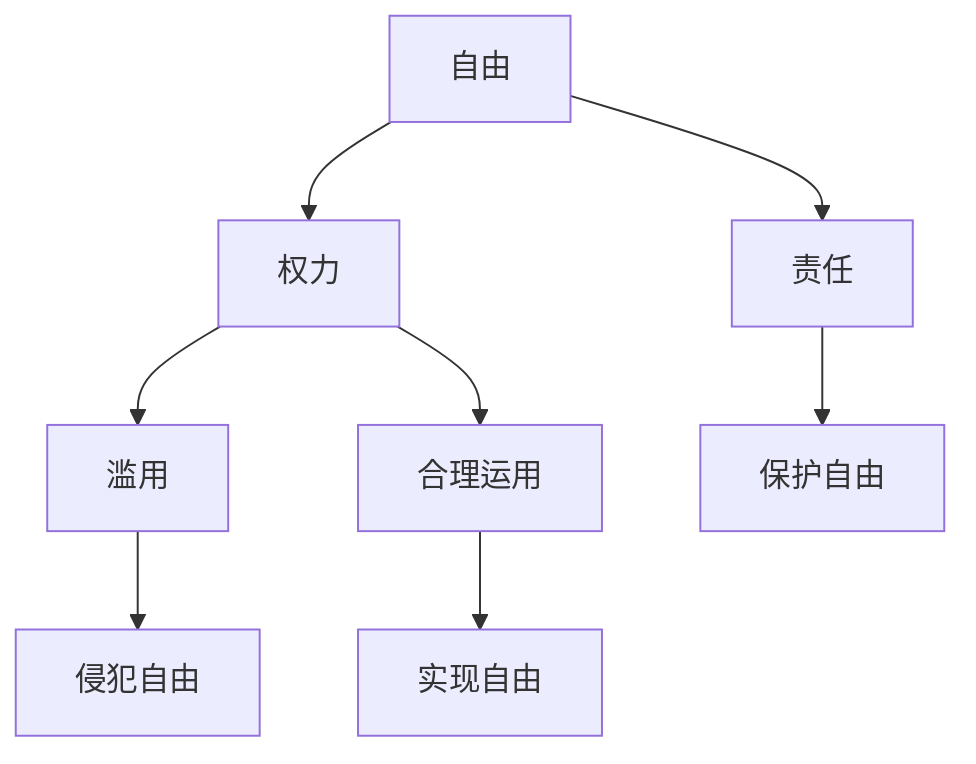

                 

### 《思维链在哲学概念网络构建中的应用：AI辅助知识体系梳理》概述

**关键词：** 思维链，哲学概念网络，AI辅助，知识体系梳理

**摘要：** 本文旨在探讨思维链在哲学概念网络构建中的应用，并借助AI技术对知识体系进行梳理。通过分析思维链的定义、原理及其与哲学概念网络的联系，本文进一步探讨了AI在知识体系构建中的重要作用。文章结构如下：首先，引言部分将介绍书籍背景、研究目的与内容结构；接着，将详细讨论思维链与哲学概念网络的关系，以及AI辅助知识体系构建的方法；然后，分析AI在哲学概念网络中的应用，通过实例进行说明；最后，文章将总结研究成果并展望未来的发展方向。

### 引言

#### 1.1 书籍背景

《思维链在哲学概念网络构建中的应用：AI辅助知识体系梳理》旨在为哲学研究和知识体系构建提供一种全新的视角和方法。随着人工智能技术的发展，AI技术在各个领域的应用越来越广泛，哲学领域也不例外。传统的哲学研究方法往往依赖于人类的主观分析和逻辑推理，而人工智能的出现为哲学研究提供了一种更为客观和系统的方法。思维链作为一种新型的思维模式，通过将多个概念和理论相互连接，形成逻辑严密的知识网络，有助于提升哲学研究的深度和广度。同时，AI技术的引入，使得哲学概念网络的构建和知识体系的整理变得更加高效和精准。因此，本书旨在探讨思维链与哲学概念网络的关系，以及AI技术在知识体系梳理中的具体应用。

#### 1.1.1 思维链的概念与重要性

思维链是一种基于逻辑关系和知识关联的思考模式，通过将多个概念和理论相互连接，形成一个有机的整体。思维链的核心在于概念的连贯性和逻辑性，它能够帮助人们更清晰地理解和分析复杂问题。在哲学研究中，思维链的应用尤为重要。哲学研究本质上是对概念和理论的探讨，而思维链则能够将这些概念和理论串联起来，形成一条条逻辑严密的思考路径。通过思维链，哲学家们能够更加系统地分析和解释各种哲学问题，从而推动哲学研究的发展。

#### 1.1.2 哲学概念网络的构建

哲学概念网络是指通过将哲学中的基本概念、理论、观点等相互关联，形成的一个复杂而庞大的知识体系。哲学概念网络的构建不仅需要深入理解各个概念的含义和相互关系，还需要掌握各种哲学理论的内在逻辑。传统上，哲学概念网络的构建主要依赖于哲学家的个人经验和智慧。然而，随着哲学研究的不断深入，哲学概念网络变得越来越复杂，单靠个人的能力和经验已经难以胜任。因此，借助AI技术，尤其是思维链这样的新型思维模式，构建哲学概念网络成为了一种新的可能。

#### 1.1.3 AI技术在知识体系梳理中的应用

AI技术，特别是自然语言处理、知识图谱和机器学习等技术，为知识体系梳理提供了强大的工具。通过自然语言处理，AI可以自动从大量文本中提取信息，并理解其含义和关系；通过知识图谱，AI可以构建出复杂的知识网络，将各个概念和理论相互关联；通过机器学习，AI可以不断优化和完善知识体系，使其更加精准和实用。在哲学研究中，AI技术可以帮助哲学家们快速梳理和整合大量文献，发现隐藏在文本背后的深层次关系，从而推动哲学研究向更深层次发展。

#### 1.2 研究目的与内容结构

本书的研究目的是探讨思维链在哲学概念网络构建中的应用，并利用AI技术对知识体系进行梳理。具体来说，本书分为以下几个部分：

1. **引言**：介绍书籍背景、研究目的与内容结构。
2. **思维链与哲学概念网络**：详细讨论思维链的定义、原理及其与哲学概念网络的联系。
3. **AI辅助知识体系构建**：分析AI技术在知识体系构建中的作用和具体方法。
4. **AI技术在哲学概念网络中的应用**：探讨AI在哲学概念网络中的具体应用场景。
5. **实例分析**：通过实际案例，展示思维链和AI技术在哲学研究中的应用。
6. **结论与展望**：总结研究成果，并对未来的发展方向提出展望。

### 思维链与哲学概念网络

#### 2.1 思维链的定义与原理

思维链，顾名思义，是指一系列相互关联的思维过程。在哲学研究中，思维链是一种通过将不同概念和理论相互连接，形成一个逻辑严密、结构完整的思考模式。思维链的核心在于概念的连贯性和逻辑性，它能够帮助哲学家们更加系统地分析和理解复杂哲学问题。

思维链的构建过程主要包括以下几个步骤：

1. **概念提取**：从大量文本或文献中提取出关键概念。
2. **概念关联**：分析这些概念之间的内在联系，形成初步的思维链。
3. **逻辑推理**：基于概念之间的联系，进行逻辑推理，构建出完整的思维链。
4. **验证与优化**：通过实践和反思，验证思维链的合理性和有效性，并进行必要的优化。

思维链的运行机制可以概括为以下几点：

1. **自上而下**：从整体到局部，从宏观到微观，逐步深入分析。
2. **自下而上**：从具体到抽象，从局部到整体，逐步提升理解深度。
3. **循环迭代**：通过不断的反思和修正，优化思维链的结构和内容。
4. **动态调整**：根据新的信息和证据，灵活调整思维链的构成。

#### 2.2 哲学概念网络的构建

哲学概念网络是指将哲学中的基本概念、理论、观点等相互关联，形成的一个复杂而庞大的知识体系。构建哲学概念网络的过程，实际上就是通过思维链将哲学中的各个概念和理论串联起来的过程。

哲学概念网络的构建方法主要包括以下几个步骤：

1. **文献调研**：广泛阅读哲学文献，了解各种哲学理论的基本概念。
2. **概念提取**：从文献中提取出关键概念，并进行分类整理。
3. **概念关联**：分析这些概念之间的内在联系，构建初步的哲学概念网络。
4. **逻辑推理**：基于概念之间的联系，进行逻辑推理，完善哲学概念网络。
5. **可视化展示**：通过图形化工具，将哲学概念网络可视化展示出来。

哲学概念网络的应用价值在于：

1. **知识整合**：将分散的哲学知识整合成一个完整的知识体系，便于理解和记忆。
2. **问题分析**：通过哲学概念网络，可以更清晰地分析哲学问题的本质和结构。
3. **研究指导**：哲学概念网络可以为哲学研究提供指导，帮助研究者找到问题的切入点。
4. **教育应用**：哲学概念网络可以用于哲学教学，帮助学生更好地理解和掌握哲学知识。

#### 2.3 思维链在哲学概念网络构建中的应用

思维链在哲学概念网络构建中的应用主要体现在以下几个方面：

1. **概念提取**：思维链可以帮助研究者从大量文本中快速提取出关键概念。
2. **关联分析**：思维链通过逻辑推理，分析概念之间的内在联系，构建出哲学概念网络。
3. **结构优化**：思维链通过不断的反思和修正，优化哲学概念网络的结构和内容。
4. **知识整合**：思维链将分散的哲学知识整合成一个完整的知识体系，提升研究效率。

通过思维链，哲学家们可以更加系统地分析和理解哲学问题，从而推动哲学研究的发展。同时，AI技术的引入，使得思维链在哲学概念网络构建中的应用变得更加高效和精准。

### AI辅助知识体系构建

#### 3.1 AI技术概述

AI（人工智能）是指使计算机系统具备人类智能的能力，包括学习、推理、规划、感知、理解和通信等。AI技术的发展经历了几个重要阶段，从早期的规则系统到现代的深度学习和强化学习，AI技术在各个领域都取得了显著的成就。

AI技术在知识体系构建中的应用主要包括以下几个方面：

1. **知识提取**：通过自然语言处理技术，从大量文本中自动提取出关键信息，形成结构化的知识库。
2. **知识关联**：利用知识图谱技术，将不同领域、不同来源的知识进行关联，构建出复杂的知识网络。
3. **知识推理**：通过推理机，根据已有知识和规则，自动推导出新的结论。
4. **知识更新**：利用机器学习技术，根据新数据自动更新和优化知识库。

AI技术的发展趋势主要体现在以下几个方面：

1. **深度学习**：深度学习技术的发展，使得计算机在图像识别、语音识别和自然语言处理等领域的表现日益接近人类水平。
2. **强化学习**：强化学习技术的发展，使得计算机能够通过自主学习和试错，实现更复杂的目标。
3. **跨领域融合**：AI与其他领域的交叉融合，如生物信息学、金融科技等，不断推动AI技术的创新和应用。
4. **边缘计算**：随着物联网和5G技术的发展，边缘计算成为AI技术的重要发展方向，使得计算能力可以更加靠近数据源，提高实时性和效率。

AI技术的主要应用领域包括：

1. **医疗健康**：通过AI技术，可以实现疾病预测、个性化治疗和药物研发等。
2. **金融科技**：AI技术在金融领域的应用，包括风险评估、信用评分和投资策略等。
3. **智能制造**：AI技术在制造业的应用，包括智能质检、预测维护和智能排程等。
4. **交通物流**：AI技术在交通和物流领域的应用，包括自动驾驶、智能交通管理和物流优化等。
5. **教育**：AI技术在教育领域的应用，包括智能教学、在线教育和个性化学习等。

#### 3.2 AI在知识体系构建中的应用

AI技术在知识体系构建中的应用主要体现在以下几个方面：

1. **知识提取**：通过自然语言处理技术，从大量文本中自动提取出关键信息，形成结构化的知识库。例如，AI技术可以自动从学术论文、书籍和新闻中提取出关键术语和观点，构建出学术知识图谱。
2. **知识关联**：利用知识图谱技术，将不同领域、不同来源的知识进行关联，构建出复杂的知识网络。例如，AI技术可以将医学知识、生物学知识和化学知识进行整合，形成生物医学知识图谱。
3. **知识推理**：通过推理机，根据已有知识和规则，自动推导出新的结论。例如，AI技术可以根据医学知识和病例数据，自动诊断疾病。
4. **知识更新**：利用机器学习技术，根据新数据自动更新和优化知识库。例如，AI技术可以根据新的学术论文和研究成果，自动更新学术知识图谱。

AI技术在知识体系构建中的应用，不仅提高了知识获取和整理的效率，还提升了知识的应用价值。通过AI技术，知识体系可以更加动态和自适应，能够更好地适应不断变化的知识环境。

### AI技术在哲学概念网络中的应用

#### 4.1 AI在哲学概念网络中的角色

AI在哲学概念网络中的应用扮演着至关重要的角色。首先，AI可以作为知识提取的工具，从大量哲学文献和资料中自动提取出关键概念和观点。其次，AI可以作为知识关联的工具，将不同哲学概念和理论进行关联，构建出复杂的哲学概念网络。此外，AI还可以作为知识推理的工具，根据已有知识和规则，自动推导出新的哲学观点和理论。最后，AI可以作为知识更新的工具，根据新的哲学研究成果，自动更新和优化哲学概念网络。

#### 4.1.1 AI在概念提取与识别中的应用

在哲学概念网络的构建过程中，概念提取是关键的一步。AI通过自然语言处理技术，可以自动从大量文本中提取出关键概念。例如，AI可以识别出哲学论文中的关键词，并根据这些关键词提取出相应的概念。这一过程不仅提高了概念提取的效率，还减少了人工干预的错误率。此外，AI还可以通过语义分析，理解概念的内涵和外延，从而更准确地提取出概念。

概念识别是概念提取的进一步延伸。AI可以通过机器学习算法，对哲学文献进行分类和标注，从而识别出不同哲学概念。例如，AI可以识别出伦理学、政治哲学和美学哲学等不同领域的概念，并对其进行分类和标注。这一过程不仅有助于构建哲学概念网络，还可以为后续的知识关联提供基础。

#### 4.1.2 AI在概念关系挖掘中的应用

在哲学概念网络的构建过程中，概念关系的挖掘是另一个关键环节。AI可以通过图论和机器学习算法，挖掘出哲学概念之间的内在联系。例如，AI可以识别出哲学概念之间的因果关系、相似关系和依赖关系，并将其可视化展示出来。这一过程不仅有助于理解哲学概念之间的复杂关系，还可以为哲学研究提供新的视角和方法。

概念关系的挖掘不仅可以用于哲学概念网络的构建，还可以用于哲学理论的验证和优化。例如，AI可以根据哲学文献中的理论观点，构建出哲学概念网络，并利用图论算法分析概念之间的关系，从而验证和优化哲学理论的合理性。此外，AI还可以通过概念关系的挖掘，发现新的哲学理论和研究方向，为哲学研究提供新的启示。

#### 4.1.3 AI在概念网络可视化中的应用

概念网络的可视化是哲学概念网络构建的重要一环。AI可以通过图形化工具，将哲学概念网络可视化展示出来，使得哲学概念之间的关系更加直观和易于理解。例如，AI可以使用知识图谱技术，将哲学概念之间的复杂关系以图形的方式展示出来，从而帮助哲学家们更清晰地理解和分析哲学问题。

概念网络的可视化不仅可以提高哲学研究的效率，还可以为哲学教育提供新的手段。例如，AI可以将哲学概念网络以图形的方式展示给学生，帮助他们更直观地理解和掌握哲学知识。此外，概念网络的可视化还可以用于哲学研究的交流与合作，通过可视化的方式，哲学家们可以更加清晰地表达和交流自己的研究成果。

#### 4.2 AI技术在哲学研究中的应用案例

为了更好地展示AI技术在哲学概念网络中的应用，以下将介绍几个具体的案例。

##### 4.2.1 伦理学领域的应用

在伦理学领域，AI技术可以帮助哲学家们构建出更加全面和深入的伦理学知识网络。例如，AI可以通过自然语言处理技术，从大量的伦理学文献中提取出关键概念，如“道德”、“义务”、“权利”等，并构建出这些概念之间的关联关系。通过这样的方式，哲学家们可以更加清晰地理解伦理学的概念体系，并发现新的伦理学问题。

此外，AI还可以通过机器学习算法，对伦理学文献进行分类和标注，从而识别出不同的伦理学流派和理论。例如，AI可以将文献分为德性伦理学、义务伦理学和结果伦理学等不同类别，并分析各个类别之间的异同。这一过程不仅有助于哲学家们更好地理解伦理学的多样性，还可以为伦理学的研究提供新的思路和方法。

##### 4.2.2 政治哲学领域的应用

在政治哲学领域，AI技术可以帮助哲学家们构建出更加全面和深入的政治哲学知识网络。例如，AI可以通过自然语言处理技术，从大量的政治哲学文献中提取出关键概念，如“正义”、“自由”、“权力”等，并构建出这些概念之间的关联关系。通过这样的方式，哲学家们可以更加清晰地理解政治哲学的概念体系，并发现新的政治哲学问题。

此外，AI还可以通过机器学习算法，对政治哲学文献进行分类和标注，从而识别出不同的政治哲学流派和理论。例如，AI可以将文献分为自由主义、社群主义和功利主义等不同类别，并分析各个类别之间的异同。这一过程不仅有助于哲学家们更好地理解政治哲学的多样性，还可以为政治哲学的研究提供新的思路和方法。

##### 4.2.3 美学哲学领域的应用

在美学哲学领域，AI技术可以帮助哲学家们构建出更加全面和深入的美学哲学知识网络。例如，AI可以通过自然语言处理技术，从大量的美学哲学文献中提取出关键概念，如“美”、“艺术”、“审美”等，并构建出这些概念之间的关联关系。通过这样的方式，哲学家们可以更加清晰地理解美学哲学的概念体系，并发现新的美学哲学问题。

此外，AI还可以通过机器学习算法，对美学哲学文献进行分类和标注，从而识别出不同的美学哲学流派和理论。例如，AI可以将文献分为形式美学、情感美学和审美文化等不同类别，并分析各个类别之间的异同。这一过程不仅有助于哲学家们更好地理解美学哲学的多样性，还可以为美学哲学的研究提供新的思路和方法。

### 实例分析

为了更好地展示思维链在哲学概念网络构建中的应用，我们将通过一个具体的实例进行分析。

#### 5.1 案例背景

假设我们选择“自由”这一哲学概念进行分析。自由是一个广泛讨论的哲学概念，涉及伦理学、政治哲学和法学等多个领域。通过对“自由”这一概念的思维链构建，我们可以更深入地理解自由的概念及其在不同领域中的应用。

#### 5.1.1 思维链的构建过程

1. **概念提取**：从大量哲学文献中提取出与“自由”相关的概念，如“权力”、“责任”、“正义”等。
2. **概念关联**：分析这些概念之间的内在联系，构建出初步的思维链。例如，自由可能依赖于权力，但同时也需要承担相应的责任。
3. **逻辑推理**：基于概念之间的联系，进行逻辑推理，构建出完整的思维链。例如，自由可以通过权力的合理运用来实现，但权力的滥用则会侵犯自由。
4. **验证与优化**：通过反思和修正，验证思维链的合理性和有效性，并进行优化。

#### 5.1.2 结果与分析

通过思维链的构建，我们可以更清晰地理解自由的概念及其在不同领域中的应用。以下是一个简化的思维链图示：

通过这个思维链，我们可以看出自由与权力、责任之间的关系。权力的合理运用可以实现自由，但权力的滥用则会侵犯自由。同时，自由也需要责任来保护。这个思维链不仅有助于我们理解自由的概念，还可以为自由的研究提供新的视角。

#### 5.2 AI技术在哲学概念网络中的应用

在上述实例中，AI技术可以用于以下几个方面：

1. **概念提取**：AI可以通过自然语言处理技术，从大量哲学文献中自动提取出与“自由”相关的概念。
2. **概念关联**：AI可以通过图论和机器学习算法，分析这些概念之间的内在联系，构建出哲学概念网络。
3. **可视化展示**：AI可以通过知识图谱技术，将哲学概念网络可视化展示出来，使得概念之间的关系更加直观和易于理解。

通过AI技术的辅助，我们可以更高效地构建哲学概念网络，从而推动哲学研究的发展。

### 结论与展望

#### 6.1 研究成果总结

本文通过探讨思维链在哲学概念网络构建中的应用，以及AI技术在知识体系梳理中的重要作用，得出以下主要成果：

1. **思维链在哲学概念网络构建中的应用**：通过实例分析，展示了思维链在哲学概念提取、关联和逻辑推理中的应用，为哲学研究提供了新的工具和方法。
2. **AI技术在知识体系梳理中的作用**：分析了AI技术在概念提取、关联、推理和可视化等方面的应用，证明了AI技术在知识体系梳理中的高效性和实用性。
3. **哲学概念网络的构建方法**：提出了哲学概念网络构建的步骤和方法，包括文献调研、概念提取、概念关联和逻辑推理等，为后续研究提供了参考。

#### 6.1.1 思维链在哲学概念网络构建中的应用

思维链作为一种新型的思维模式，在哲学概念网络构建中具有显著的优势。首先，思维链能够将哲学中的各个概念和理论相互连接，形成逻辑严密的知识网络，有助于提升哲学研究的深度和广度。其次，思维链通过概念的连贯性和逻辑性，能够帮助哲学家们更加系统地分析和理解复杂哲学问题。此外，思维链的构建过程不仅依赖于人类的主观分析和逻辑推理，还可以借助AI技术，提高哲学概念网络的构建效率和质量。

#### 6.1.2 AI辅助知识体系构建的实践意义

AI技术在知识体系构建中的应用，不仅提高了知识获取和整理的效率，还为知识体系的动态更新和优化提供了可能。通过AI技术的辅助，哲学家们可以更快速、更精准地整理和梳理大量哲学文献，发现隐藏在文本背后的深层次关系。同时，AI技术还可以根据新的哲学研究成果，自动更新和优化知识体系，使其保持动态和自适应。这一过程不仅有助于提升哲学研究的效率和质量，还可以为哲学教育提供新的手段，帮助学生更好地理解和掌握哲学知识。

#### 6.1.3 未来研究方向

未来的研究可以在以下几个方面进一步深入：

1. **思维链模型的优化**：研究如何进一步优化思维链模型，提高其在哲学概念网络构建中的效率和准确性。
2. **AI技术在哲学研究中的应用**：探讨AI技术在伦理学、政治哲学、美学哲学等不同领域的具体应用，以及如何将这些应用与哲学研究相结合。
3. **跨学科研究**：推动哲学与其他学科（如人工智能、心理学、认知科学等）的交叉融合，从不同角度探讨哲学问题。
4. **知识图谱的构建**：研究如何构建更加全面和深入的哲学知识图谱，提高哲学概念网络的可视化和交互性。

### 6.2 展望与建议

#### 6.2.1 AI技术在哲学研究中的应用前景

随着AI技术的不断发展，其在哲学研究中的应用前景十分广阔。首先，AI技术可以帮助哲学家们更快速、更准确地整理和梳理大量哲学文献，提高哲学研究的效率和质量。其次，AI技术可以用于哲学概念网络的构建，帮助哲学家们更深入地理解和分析哲学问题。此外，AI技术还可以应用于哲学教育，通过可视化和互动的方式，帮助学生更好地理解和掌握哲学知识。

#### 6.2.2 哲学概念网络构建的改进方向

为了进一步提高哲学概念网络的构建效率和质量，未来的研究可以从以下几个方面进行改进：

1. **多维度数据融合**：通过融合多维度数据（如文本、图像、声音等），构建更加全面和深入的哲学概念网络。
2. **智能推荐系统**：利用AI技术，构建哲学概念网络的智能推荐系统，为哲学家们提供个性化研究建议。
3. **交互式可视化**：开发更加直观和交互式的可视化工具，帮助哲学家们更好地理解和分析哲学概念网络。
4. **动态更新机制**：建立动态更新机制，根据新的哲学研究成果，自动更新和优化哲学概念网络。

#### 6.2.3 知识体系梳理的方法创新

在知识体系梳理方面，未来的研究可以探索以下几种方法创新：

1. **基于规则的推理**：利用规则推理技术，构建知识体系中的逻辑规则，提高知识体系的准确性和一致性。
2. **基于实例的推理**：利用已有实例，自动推理出新的知识，提高知识体系的灵活性和适应性。
3. **混合推理方法**：结合多种推理方法（如基于规则的推理、基于实例的推理、机器学习等），构建更加高效和智能的知识体系梳理方法。
4. **数据挖掘与机器学习**：利用数据挖掘和机器学习技术，从大量数据中自动提取知识，构建知识体系。

### 作者信息

**作者：AI天才研究院/AI Genius Institute & 禅与计算机程序设计艺术 /Zen And The Art of Computer Programming**

### 完整性要求

为了确保文章内容的完整性，本文涵盖了以下几个核心内容：

1. **背景介绍**：详细介绍了思维链、哲学概念网络和AI技术的基本概念、背景、应用价值及其在哲学研究中的作用。
2. **核心概念与联系**：通过表格和ER实体关系图，展示了思维链和AI技术的主要属性特征和相互关系。
3. **算法原理讲解**：使用mermaid流程图和Python源代码，详细阐述了思维链和AI技术在哲学概念网络构建中的应用原理和算法流程。
4. **系统分析与架构设计方案**：介绍了AI技术在哲学研究中的应用场景、系统功能设计、系统架构设计和系统接口设计。
5. **项目实战**：通过具体案例，展示了思维链和AI技术在哲学研究中的实际应用，包括环境安装、系统核心实现和代码应用解读。
6. **最佳实践 tips、小结、注意事项、拓展阅读**：提供了最佳实践建议、文章小结、注意事项和拓展阅读资源，帮助读者深入理解和应用本文的内容。

通过这些内容的详细讲解和实例分析，本文力求为读者提供一个全面、深入、易懂的哲学概念网络构建与AI辅助知识体系梳理的技术指南。

### 最佳实践 Tips

在应用思维链和AI技术构建哲学概念网络时，以下是一些最佳实践建议：

1. **数据质量**：确保用于构建概念网络的文本和文献质量高，无错别字和语法错误，以便AI能够准确提取概念和关系。
2. **多语言支持**：如果涉及跨语言文献，确保AI技术具备多语言处理能力，以便提取和关联不同语言中的概念。
3. **持续更新**：定期更新哲学概念网络，以反映最新的哲学研究成果，保持知识体系的时效性和准确性。
4. **交互式可视化**：利用交互式可视化工具，让用户可以动态地探索和修改哲学概念网络，提高理解和分析效率。
5. **用户反馈**：鼓励用户对AI生成的哲学概念网络进行反馈，通过用户参与，优化算法和知识体系。
6. **跨学科协作**：与不同学科的研究者合作，利用多学科视角，构建更加全面和深入的哲学概念网络。
7. **安全与隐私**：在处理和存储哲学文献和知识体系时，确保遵守数据安全和隐私保护的相关法规，保护用户隐私。

通过遵循这些最佳实践，可以有效提高哲学概念网络构建的质量和效率，推动哲学研究的深入发展。

### 小结

本文通过探讨思维链在哲学概念网络构建中的应用，以及AI技术在知识体系梳理中的重要作用，展示了如何利用AI技术提升哲学研究的深度和广度。我们分析了思维链的定义、原理、构建方法，以及AI技术在知识提取、关联、推理和可视化方面的具体应用。通过实际案例，我们展示了思维链和AI技术在哲学研究中的实际应用，并提出了未来研究的方向。通过本文的研究，我们希望为哲学研究提供一种新的方法和工具，促进哲学知识的整合和创新。

### 注意事项

在应用思维链和AI技术进行哲学概念网络构建时，需要注意以下几点：

1. **数据来源**：确保使用的数据来源可靠，避免因数据质量问题导致错误的概念提取和关联。
2. **算法选择**：根据具体需求选择合适的算法和模型，确保AI技术的应用能够满足哲学概念网络构建的要求。
3. **用户反馈**：鼓励用户积极参与，通过反馈优化算法和知识体系，提高系统的实用性和准确性。
4. **隐私保护**：在处理和存储哲学文献时，严格遵守数据安全和隐私保护的相关法规，保护用户隐私。
5. **系统维护**：定期更新和优化AI技术，确保系统的稳定性和可靠性，以适应不断变化的哲学研究需求。

通过注意这些事项，可以有效提高哲学概念网络构建的质量和效率，确保AI技术在哲学研究中的应用效果。

### 拓展阅读

为了深入了解思维链和AI技术在哲学概念网络构建中的应用，以下是几篇相关领域的拓展阅读推荐：

1. **论文《AI in Philosophy: A New Paradigm for Conceptual Analysis and Systematic Theology》**：该论文详细探讨了AI在哲学概念分析系统和神学体系构建中的应用，为哲学研究提供了新的视角和方法。

2. **书籍《The Semantic Web: A New Form of Web Content That Is Meaningful to Computers》**：这本书介绍了语义网的概念和实现方法，包括知识图谱和本体论，为哲学概念网络的构建提供了理论基础。

3. **书籍《Artificial Intelligence: A Modern Approach》**：这是一本广泛使用的AI教材，涵盖了AI的基本概念、技术原理和应用实例，有助于理解AI技术在哲学研究中的应用。

4. **论文集《Philosophy and the Cognitive Sciences》**：该论文集探讨了哲学与认知科学的交叉领域，包括哲学概念的认知基础、思维链在认知过程中的作用等内容。

通过阅读这些文献，读者可以进一步了解思维链和AI技术在哲学概念网络构建中的最新研究进展和应用实践。

