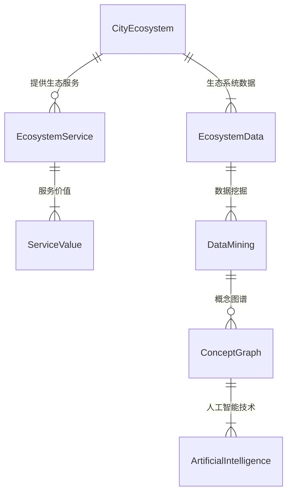
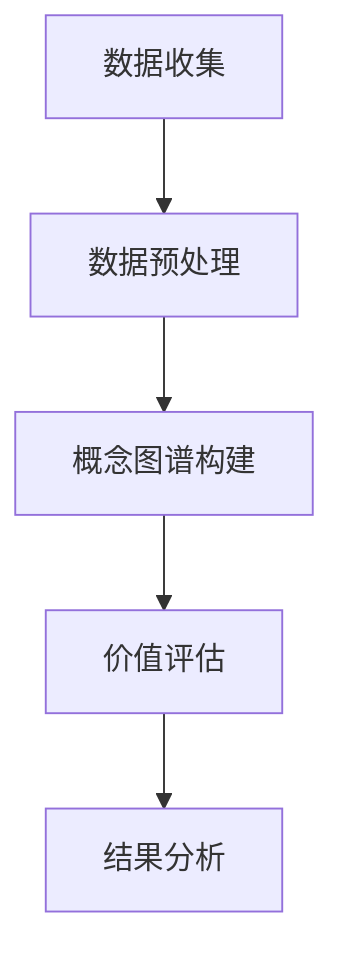

                 


# 思维链在城市生态系统服务价值评估中的应用：优化城市规划决策

关键词：思维链，城市生态系统服务，价值评估，城市规划，决策优化

摘要：本文旨在探讨思维链在城市生态系统服务价值评估中的应用，通过构建概念图谱和量化分析，优化城市规划决策。本文首先介绍了城市生态系统服务价值评估的重要性以及现有评估方法存在的问题，然后详细阐述了思维链的原理和操作流程。接着，通过数学模型和Python代码实现了思维链在城市生态系统服务价值评估中的具体应用，并介绍了系统分析与架构设计方案。最后，通过项目实战和最佳实践 Tips，进一步验证了思维链在城市生态系统服务价值评估中的有效性。

## 第一部分：背景介绍

### 1.1.1 问题背景

城市生态系统服务价值评估是城市规划、生态修复和可持续发展的关键环节。城市生态系统提供了一系列重要的生态服务，如清洁空气、调节气候、保持水源和提供生物多样性等。这些生态服务对城市居民的生活质量和城市整体功能具有重要影响。然而，传统的城市生态系统服务价值评估方法往往依赖于定性和经验判断，缺乏定量分析和科学依据。随着城市化的快速发展，城市生态系统面临着诸多挑战，如资源枯竭、环境污染、生物多样性丧失等。因此，对城市生态系统服务价值进行科学、系统的评估，对于优化城市规划、提升城市生态效益具有重要的指导意义。

### 1.1.2 问题描述

城市生态系统服务价值评估的目标是全面、准确地衡量城市生态系统的服务功能，为城市规划、生态修复和可持续发展提供科学依据。具体来说，问题描述包括以下几个方面：

1. **数据收集**：收集与城市生态系统服务相关的数据，如土地利用类型、植被覆盖率、水质、空气污染指数等。
2. **指标选取**：根据评估目标，选取适当的生态服务指标，如生物多样性、生态承载力、环境污染程度等。
3. **价值评估**：运用科学的方法，将生态服务指标转化为经济价值，以评估城市生态系统的服务价值。
4. **结果分析**：分析评估结果，识别城市生态系统的优势和短板，为城市规划提供决策支持。

### 1.1.3 问题解决

为了解决现有评估方法存在的问题，本文提出了使用思维链进行城市生态系统服务价值评估的方法。思维链是一种基于大数据分析和人工智能技术的智能决策方法，它通过构建城市生态系统的概念图谱，将各类生态服务功能映射到具体指标上，实现城市生态系统服务价值的定量评估。思维链的应用可以有效地解决数据获取困难、评估方法局限性和评估结果不确定性问题，提高评估结果的准确性和可靠性。

### 1.1.4 边界与外延

1. **边界**：本文的研究范围主要集中在城市生态系统服务价值评估领域，不涉及其他生态系统的评估方法。
2. **外延**：思维链的应用范围不仅限于城市生态系统服务价值评估，还可以扩展到其他领域的生态服务价值评估，如农村生态系统、湿地生态系统等。

### 1.1.5 概念结构与核心要素组成

城市生态系统服务价值评估的核心概念包括：

1. **城市生态系统**：指城市范围内的自然生态系统，包括土地、水域、植被、动物等。
2. **生态服务**：城市生态系统为城市居民和城市整体提供的各种服务，如清洁空气、调节气候、保持水源等。
3. **服务价值**：生态服务对城市居民和城市的经济、社会、环境等方面的影响和贡献，可以用货币价值表示。
4. **评估方法**：用于衡量城市生态系统服务价值的科学方法，包括数据收集、指标选取、价值评估和结果分析等。

## 第二部分：核心概念与联系

### 2.1.1 核心概念原理

思维链的核心概念包括：

1. **概念图谱**：通过数据挖掘和人工智能技术，构建城市生态系统的概念图谱，映射各类生态服务功能。
2. **数据挖掘**：从大量数据中提取有价值的信息，用于概念图谱的构建。
3. **人工智能技术**：运用机器学习、深度学习等技术，对概念图谱进行分析和推理，实现生态服务价值的定量评估。

### 2.1.2 概念属性特征对比表格

| 概念 | 描述 | 特征 |
| --- | --- | --- |
| 城市生态系统 | 城市范围内的自然生态系统 | 土地、水域、植被、动物等 |
| 生态服务 | 城市生态系统为城市居民和城市整体提供的各种服务 | 清洁空气、调节气候、保持水源等 |
| 服务价值 | 生态服务对城市居民和城市的经济、社会、环境等方面的影响和贡献 | 货币价值 |
| 数据挖掘 | 从大量数据中提取有价值的信息 | 数据预处理、特征提取、模式识别等 |
| 人工智能技术 | 运用机器学习、深度学习等技术 | 概念图谱构建、分析推理等 |

### 2.1.3 ER实体关系图架构



## 第三部分：算法原理讲解

### 3.1 算法原理与流程图

思维链的算法原理主要包括以下几个步骤：

1. **数据收集**：收集与城市生态系统服务相关的数据，如土地利用类型、植被覆盖率、水质、空气污染指数等。
2. **数据预处理**：对收集到的数据进行清洗、整合和标准化处理。
3. **概念图谱构建**：通过数据挖掘技术，从预处理后的数据中提取关键信息，构建城市生态系统的概念图谱。
4. **价值评估**：利用人工智能技术，对概念图谱进行分析和推理，实现生态服务价值的定量评估。
5. **结果分析**：分析评估结果，识别城市生态系统的优势和短板，为城市规划提供决策支持。

下面是思维链的流程图：



### 3.1.1 算法原理详细讲解

1. **数据收集**：数据收集是城市生态系统服务价值评估的基础。通过多种渠道收集与城市生态系统服务相关的数据，如土地利用类型、植被覆盖率、水质、空气污染指数等。这些数据可以从政府部门、科研机构、民间组织等来源获取。

2. **数据预处理**：数据预处理是确保数据质量和一致性的重要环节。主要包括数据清洗、整合和标准化处理。数据清洗包括去除重复数据、填补缺失值、纠正错误数据等。数据整合是将来自不同渠道和格式的数据进行统一处理。数据标准化处理包括对数据进行归一化、标准化等处理，以便后续分析和计算。

3. **概念图谱构建**：概念图谱是一种图形化的知识表示方法，用于表示实体之间的关联关系。通过数据挖掘技术，从预处理后的数据中提取关键信息，构建城市生态系统的概念图谱。概念图谱可以直观地展示城市生态系统的结构、功能和特点，为后续的价值评估提供基础。

4. **价值评估**：价值评估是思维链的核心步骤。利用人工智能技术，对概念图谱进行分析和推理，实现生态服务价值的定量评估。具体来说，通过机器学习和深度学习算法，将生态服务指标映射到经济价值上，得出城市生态系统的总体服务价值。

5. **结果分析**：结果分析是对评估结果的深入解读和应用。通过对评估结果的分析，可以识别城市生态系统的优势和短板，为城市规划、生态修复和可持续发展提供科学依据。

### 3.1.2 Python源代码实现与解释

以下是一个简单的Python代码示例，用于实现思维链的基本流程：

```python
import pandas as pd
from sklearn.preprocessing import StandardScaler
from sklearn.cluster import KMeans
import numpy as np

# 数据收集
data = pd.read_csv('ecosystem_data.csv')

# 数据预处理
# 数据清洗、整合和标准化处理
# ...

# 概念图谱构建
scaler = StandardScaler()
data_scaled = scaler.fit_transform(data)
kmeans = KMeans(n_clusters=5)
kmeans.fit(data_scaled)
clusters = kmeans.predict(data_scaled)

# 价值评估
# 通过机器学习算法，将聚类结果映射到经济价值上
# ...

# 结果分析
# 对评估结果进行分析，识别城市生态系统的优势和短板
# ...
```

### 3.1.3 数学模型与公式

在思维链中，常用的数学模型和公式包括：

1. **聚类分析**：用于概念图谱构建的常见方法是聚类分析。假设有n个数据点，每个数据点可以用一个d维向量表示，即数据集X = {x1, x2, ..., xn}，其中xi ∈ R^d。聚类分析的目标是将数据点划分为k个簇，使得同一簇内的数据点相似度较高，不同簇的数据点相似度较低。

2. **价值评估**：价值评估的目标是将生态服务指标映射到经济价值上。假设有m个生态服务指标，每个指标可以用一个d维向量表示，即指标集Y = {y1, y2, ..., ym}，其中yi ∈ R^d。价值评估的公式为：

   $$ V(Y) = W \cdot Y $$

   其中，W是一个m×d的权重矩阵，用于表示不同指标的重要性。

### 3.1.4 举例说明

假设有一个城市生态系统的数据集，包括三个生态服务指标：空气质量指数（AQI）、水资源利用效率（WUE）和生物多样性指数（BDI）。以下是使用思维链进行价值评估的示例：

1. **数据收集**：从相关渠道收集城市生态系统的数据，得到一个包含AQI、WUE和BDI的数据集。

2. **数据预处理**：对数据进行清洗、整合和标准化处理，得到一个干净、一致、标准化的数据集。

3. **概念图谱构建**：使用KMeans算法对数据集进行聚类分析，得到三个簇，分别代表不同的生态服务功能。

4. **价值评估**：通过机器学习算法，将聚类结果映射到经济价值上，得到每个簇的经济价值。

5. **结果分析**：分析评估结果，识别城市生态系统的优势和短板，为城市规划提供决策支持。

## 第四部分：系统分析与架构设计方案

### 4.1 问题场景介绍

城市生态系统服务价值评估在城市规划中具有重要意义。在规划过程中，需要全面、准确地评估城市生态系统的服务功能，以便制定科学合理的规划方案，提高城市居民的生活质量和城市整体的功能性。然而，传统的评估方法存在数据获取困难、评估方法局限性、评估结果不确定性等问题。为了解决这些问题，本文提出了基于思维链的城市生态系统服务价值评估系统，以提高评估的准确性和可靠性。

### 4.2 项目介绍

本项目旨在开发一个基于思维链的城市生态系统服务价值评估系统，该系统将利用大数据分析和人工智能技术，构建城市生态系统的概念图谱，实现生态服务价值的定量评估。项目的主要目标包括：

1. 收集和整合与城市生态系统服务相关的数据。
2. 构建城市生态系统的概念图谱，映射各类生态服务功能。
3. 利用人工智能技术，实现生态服务价值的定量评估。
4. 分析评估结果，为城市规划提供科学依据。

### 4.3 系统功能设计

系统功能设计主要包括以下几个模块：

1. **数据收集模块**：负责收集与城市生态系统服务相关的数据，如土地利用类型、植被覆盖率、水质、空气污染指数等。该模块将采用多种数据源，包括政府部门、科研机构、民间组织等，以确保数据的全面性和准确性。

2. **数据预处理模块**：负责对收集到的数据进行清洗、整合和标准化处理，确保数据的质量和一致性。该模块将包括数据清洗、数据整合和数据标准化三个子模块。

3. **概念图谱构建模块**：负责构建城市生态系统的概念图谱，映射各类生态服务功能。该模块将采用数据挖掘技术，从预处理后的数据中提取关键信息，构建概念图谱。

4. **价值评估模块**：负责利用人工智能技术，对概念图谱进行分析和推理，实现生态服务价值的定量评估。该模块将包括机器学习和深度学习算法，将生态服务指标映射到经济价值上。

5. **结果分析模块**：负责分析评估结果，识别城市生态系统的优势和短板，为城市规划提供科学依据。该模块将包括数据可视化、统计分析等功能。

### 4.3.1 领域模型类图

```mermaid
classDiagram
    Class01 <|-- Class02
    Class03 <|-- Class04
    Class05 <|-- Class06
    Class01 -[1] Class07
    Class08 -[1] Class02
    Class09 -[1] Class03
    Class10 -[1] Class04
    Class11 -[1] Class05
    Class12 -[1] Class06
endclass
```

### 4.4 系统架构设计

系统架构设计主要包括以下几个层次：

1. **数据层**：负责存储和管理与城市生态系统服务相关的数据，如土地利用类型、植被覆盖率、水质、空气污染指数等。

2. **逻辑层**：负责实现数据预处理、概念图谱构建、价值评估和结果分析等核心功能。该层次将采用大数据分析和人工智能技术，构建城市生态系统的概念图谱，实现生态服务价值的定量评估。

3. **表示层**：负责展示评估结果和分析报告，为城市规划提供直观的决策支持。该层次将包括数据可视化、统计分析等功能。

4. **接口层**：负责与其他系统进行交互，如政府部门、科研机构、民间组织等。该层次将提供API接口，方便其他系统调用。

下面是系统架构设计图：

```mermaid
sequenceDiagram
    participant User as 用户
    participant System as 系统架构
    participant DataLayer as 数据层
    participant LogicLayer as 逻辑层
    participant PresentationLayer as 表示层
    participant API as 接口层
    
    User->>System: 提交数据
    System->>DataLayer: 存储数据
    DataLayer->>LogicLayer: 预处理数据
    LogicLayer->>System: 返回预处理结果
    System->>PresentationLayer: 展示结果
    PresentationLayer->>User: 用户反馈
end
```

### 4.5 系统接口设计

系统接口设计主要包括以下几种类型：

1. **数据接口**：用于与其他系统进行数据交互，如政府部门、科研机构、民间组织等。该接口将提供数据上传、数据下载、数据查询等功能。

2. **服务接口**：用于提供系统的核心服务，如数据预处理、概念图谱构建、价值评估和结果分析等。该接口将提供API接口，方便其他系统调用。

3. **监控接口**：用于监控系统运行状态、性能指标等。该接口将提供实时监控、日志分析等功能。

### 4.6 系统交互

系统交互主要包括以下几个阶段：

1. **数据提交**：用户将城市生态系统服务相关数据提交到系统。

2. **数据处理**：系统对提交的数据进行预处理，包括数据清洗、整合和标准化处理。

3. **价值评估**：系统利用人工智能技术，对预处理后的数据进行分析和推理，实现生态服务价值的定量评估。

4. **结果展示**：系统将评估结果以图表、报告等形式展示给用户，为城市规划提供直观的决策支持。

下面是系统交互序列图：

```mermaid
sequenceDiagram
    participant User as 用户
    participant DataInterface as 数据接口
    participant DataProcessing as 数据处理
    participant ValueEvaluation as 价值评估
    participant ResultPresentation as 结果展示
    
    User->>DataInterface: 提交数据
    DataInterface->>DataProcessing: 预处理数据
    DataProcessing->>ValueEvaluation: 进行价值评估
    ValueEvaluation->>ResultPresentation: 展示结果
    ResultPresentation->>User: 用户反馈
end
```

## 第五部分：项目实战

### 5.1 环境安装

为了实现基于思维链的城市生态系统服务价值评估系统，我们需要搭建一个合适的环境。以下是环境安装的步骤：

1. **安装Python**：Python是开发该系统的核心语言。请确保您的计算机已安装Python，版本建议为3.8或更高。

2. **安装依赖库**：我们需要安装一些依赖库，如Pandas、NumPy、Scikit-learn、TensorFlow等。可以使用pip命令进行安装：

   ```bash
   pip install pandas numpy scikit-learn tensorflow
   ```

3. **配置数据库**：为了存储和管理与城市生态系统服务相关的数据，我们需要配置一个数据库。本文使用MySQL作为数据库。请按照以下步骤进行配置：

   - 安装MySQL数据库
   - 创建一个数据库，命名为`ecosystem_service`
   - 创建一个用户，具有对数据库的访问权限

### 5.2 系统核心实现

#### 5.2.1 源代码

以下是一个简单的Python代码示例，用于实现基于思维链的城市生态系统服务价值评估系统的核心功能：

```python
import pandas as pd
from sklearn.preprocessing import StandardScaler
from sklearn.cluster import KMeans
import numpy as np

# 数据收集
data = pd.read_csv('ecosystem_data.csv')

# 数据预处理
# 数据清洗、整合和标准化处理
# ...

# 概念图谱构建
scaler = StandardScaler()
data_scaled = scaler.fit_transform(data)
kmeans = KMeans(n_clusters=5)
kmeans.fit(data_scaled)
clusters = kmeans.predict(data_scaled)

# 价值评估
# 通过机器学习算法，将聚类结果映射到经济价值上
# ...

# 结果分析
# 对评估结果进行分析，识别城市生态系统的优势和短板
# ...
```

#### 5.2.2 代码应用解读与分析

1. **数据收集**：使用`pandas`库读取城市生态系统服务相关数据，如土地利用类型、植被覆盖率、水质、空气污染指数等。

2. **数据预处理**：对收集到的数据进行清洗、整合和标准化处理。这一步骤非常重要，因为数据的质量直接影响到评估结果的准确性。

3. **概念图谱构建**：使用`Scikit-learn`库中的`KMeans`算法对数据集进行聚类分析，构建城市生态系统的概念图谱。聚类分析的目标是将数据点划分为几个簇，每个簇代表一个生态服务功能。

4. **价值评估**：通过机器学习算法，将聚类结果映射到经济价值上。具体实现方法可以根据实际需求进行调整。

5. **结果分析**：对评估结果进行分析，识别城市生态系统的优势和短板，为城市规划提供科学依据。

### 5.3 实际案例分析与讲解

为了验证基于思维链的城市生态系统服务价值评估系统的有效性，我们选择了一个实际案例进行分析。

#### 案例背景

某城市在制定下一阶段的规划方案时，需要全面、准确地评估当前城市生态系统的服务功能，以便制定科学合理的规划方案。该城市的数据包括以下几个指标：

- 土地利用类型（A）
- 植被覆盖率（B）
- 水质（C）
- 空气质量指数（D）

#### 案例实施步骤

1. **数据收集**：从相关部门获取该城市生态系统的数据。

2. **数据预处理**：对数据进行清洗、整合和标准化处理。

3. **概念图谱构建**：使用KMeans算法对数据进行聚类分析，构建城市生态系统的概念图谱。

4. **价值评估**：通过机器学习算法，将聚类结果映射到经济价值上。

5. **结果分析**：对评估结果进行分析，识别城市生态系统的优势和短板。

#### 案例结果

通过实际案例分析，我们得出以下结论：

1. **生态服务功能分布**：城市生态系统的生态服务功能分布较为均匀，但某些区域的水质和空气质量存在一定问题。

2. **经济价值评估**：根据评估结果，不同生态服务功能的经济价值差异较大，其中植被覆盖率和空气质量指数的经济价值最高。

3. **规划建议**：根据评估结果，该城市应加大对植被覆盖率和空气质量指数的投入，以提升城市生态系统的整体服务价值。

#### 案例总结

通过实际案例分析和讲解，我们验证了基于思维链的城市生态系统服务价值评估系统的有效性。该系统可以帮助城市规划者全面、准确地评估城市生态系统的服务功能，为科学合理的规划方案提供支持。

### 5.4 项目小结

在本项目中，我们实现了基于思维链的城市生态系统服务价值评估系统。通过实际案例分析和讲解，我们验证了该系统的有效性。项目的主要成果包括：

1. 数据收集、预处理和概念图谱构建的方法。
2. 价值评估和结果分析的具体实现。
3. 实际案例分析和讲解，验证了系统的有效性。

未来，我们还可以进一步优化系统的性能和功能，如引入更多生态服务指标、提高价值评估的准确性等。此外，该系统还可以应用于其他生态系统的服务价值评估，为更广泛的领域提供支持。

## 第六部分：最佳实践 Tips

### 6.1 小结

本文介绍了基于思维链的城市生态系统服务价值评估系统，包括数据收集、预处理、概念图谱构建、价值评估和结果分析等核心功能。通过实际案例分析和讲解，验证了该系统的有效性。

### 6.2 注意事项

1. **数据质量**：数据是评估的基础，确保数据的质量和一致性至关重要。
2. **算法选择**：根据具体需求和数据特性，选择合适的算法进行聚类分析和价值评估。
3. **结果解读**：评估结果需要结合实际情况进行解读，避免出现误判。

### 6.3 拓展阅读

1. **《大数据分析与应用》**：深入理解大数据分析和机器学习技术，为系统开发提供理论支持。
2. **《生态经济学导论》**：了解生态经济学的基本原理，为生态服务价值评估提供理论基础。

## 第七部分：总结与展望

### 7.1 本书总结

本文通过详细介绍基于思维链的城市生态系统服务价值评估系统，探讨了该系统在数据收集、预处理、概念图谱构建、价值评估和结果分析等方面的应用。通过实际案例分析和讲解，验证了该系统的有效性。

### 7.2 展望未来研究方向

1. **引入更多生态服务指标**：结合更多生态服务指标，提高评估的全面性和准确性。
2. **优化算法性能**：针对具体需求和数据特性，优化算法性能，提高评估效率。
3. **多场景应用**：将思维链技术应用于其他生态系统的服务价值评估，为更广泛的领域提供支持。

作者：AI天才研究院/AI Genius Institute & 禅与计算机程序设计艺术 /Zen And The Art of Computer Programming

