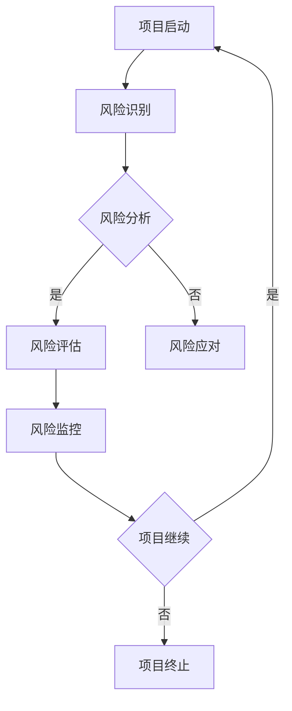
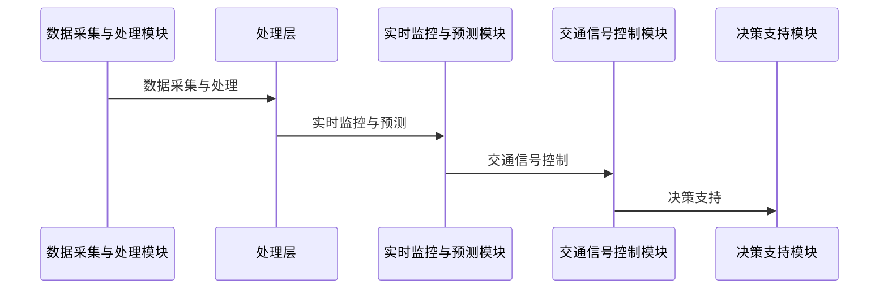
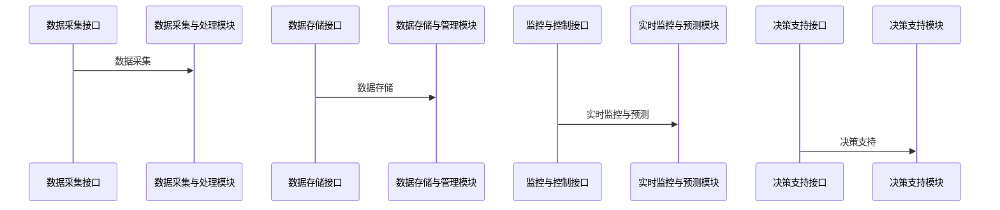
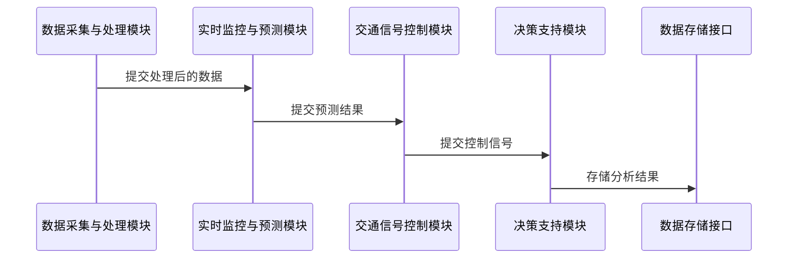

                 


### 背景介绍

#### 1.1 问题背景

在当今信息技术飞速发展的时代，复杂工程项目层出不穷。从大型数据中心建设，到金融科技系统开发，再到智能交通网络优化，这些项目往往涉及众多技术领域、跨部门协作以及大量的资金投入。这些复杂工程项目不仅技术要求高，而且涉及的风险因素众多，一旦出现风险，可能对整个项目的顺利进行造成重大影响。因此，对复杂工程项目进行有效的风险评估，是确保项目成功的关键。

风险评估是指在项目实施前或过程中，对可能出现的各种风险进行识别、分析和评估，以制定相应的应对策略。在复杂工程项目中，风险评估的重要性不言而喻。一方面，它可以提前发现潜在的风险，从而降低风险发生的概率；另一方面，它可以评估风险对项目的影响程度，帮助项目团队制定合理的应对措施，确保项目按计划顺利进行。

#### 1.2 问题描述

复杂工程项目的特性决定了风险评估的挑战性。首先，这些项目通常规模庞大，涉及的技术复杂度高，风险因素众多，包括技术风险、市场风险、财务风险等。其次，项目周期长，从设计到实施可能跨越数年，期间各种不确定因素不断增加，使得风险评估的难度加大。最后，复杂工程项目往往涉及多个部门、多个团队的合作，风险评估需要多方协作，信息共享和沟通协调也变得尤为重要。

面对这些挑战，传统的风险评估方法已经难以满足需求。传统方法主要依赖于专家经验、历史数据和统计分析，虽然在一定程度上能够识别和评估风险，但在面对复杂、动态的工程项目时，往往显得力不从心。因此，寻求新的风险评估方法，尤其是能够应对复杂工程项目特点的方法，变得尤为迫切。

#### 1.3 问题解决

思维链方法是一种新兴的风险评估方法，其核心理念是通过逻辑分析和推理，对复杂工程项目的风险进行全面、深入的评估。思维链方法的基本原理是，将项目中的各种风险因素视为一个整体，通过分析这些因素的相互关系和影响，构建一个完整的风险评估框架。

思维链方法在风险评估中的应用优势主要体现在以下几个方面：

1. **系统性**：思维链方法将项目中的各种风险因素视为一个整体，从系统性的角度进行全面分析，能够更全面地识别和评估风险。
2. **动态性**：思维链方法能够动态地调整和优化风险评估模型，适应项目实施过程中的各种变化和不确定性。
3. **精准性**：通过逻辑分析和推理，思维链方法能够对风险因素进行精确的量化评估，提供更加可靠的风险评估结果。
4. **可操作性**：思维链方法提供了明确的评估步骤和操作指南，便于项目团队在实际操作中应用和执行。

#### 1.4 边界与外延

复杂工程项目的界定通常是指那些技术复杂度较高、涉及多个领域、跨部门协作的项目。这些项目可能涉及多个技术领域，如软件工程、网络技术、人工智能等，同时需要多个部门和团队的合作，共同完成项目的目标。

风险评估的范围通常包括以下几个方面：

1. **技术风险**：涉及项目所采用技术的可靠性、成熟度和适用性。
2. **市场风险**：包括市场需求的变化、竞争对手的动态等因素。
3. **财务风险**：涉及项目资金筹集、使用和管理等方面。
4. **运营风险**：包括项目实施过程中的管理、人员配备、资源配置等方面。

#### 1.5 概念结构与核心要素组成

思维链在复杂工程项目风险评估中的应用，涉及以下几个核心概念和要素：

1. **思维链**：一种基于逻辑分析和推理的风险评估方法，能够对复杂工程项目的风险进行全面、深入的评估。
2. **风险评估框架**：思维链方法的核心组成部分，用于识别、分析和评估项目中的各种风险因素。
3. **风险因素**：项目实施过程中可能出现的各种风险，包括技术风险、市场风险、财务风险等。
4. **风险指标**：用于量化评估风险因素的指标，如风险概率、风险影响等。
5. **风险评估模型**：通过逻辑分析和推理，将风险因素和风险指标结合起来，形成一个完整的风险评估模型。

### 第二部分：核心概念与联系

#### 2.1 思维链概念原理

##### 2.1.1 思维链的定义

思维链（Mind Chain）是一种基于逻辑分析和推理的风险评估方法。它通过将项目中的各种风险因素视为一个整体，分析这些因素之间的相互关系和影响，构建一个完整的风险评估框架，从而实现对复杂工程项目的全面、深入的风险评估。

##### 2.1.2 思维链的基本特征

1. **系统性**：思维链方法将项目中的各种风险因素视为一个整体，从系统性的角度进行全面分析，能够更全面地识别和评估风险。
2. **动态性**：思维链方法能够动态地调整和优化风险评估模型，适应项目实施过程中的各种变化和不确定性。
3. **精准性**：通过逻辑分析和推理，思维链方法能够对风险因素进行精确的量化评估，提供更加可靠的风险评估结果。
4. **可操作性**：思维链方法提供了明确的评估步骤和操作指南，便于项目团队在实际操作中应用和执行。

##### 2.1.3 思维链与传统风险评估方法的对比

传统风险评估方法主要依赖于专家经验、历史数据和统计分析，虽然在一定程度上能够识别和评估风险，但在面对复杂、动态的工程项目时，往往显得力不从心。思维链方法则具有以下几个显著优势：

1. **系统性**：思维链方法从系统性的角度进行全面分析，能够更全面地识别和评估风险，而不仅仅是依赖专家经验或历史数据。
2. **动态性**：思维链方法能够动态地调整和优化风险评估模型，适应项目实施过程中的各种变化和不确定性，而传统方法往往难以应对动态环境。
3. **精准性**：思维链方法通过逻辑分析和推理，能够对风险因素进行精确的量化评估，提供更加可靠的风险评估结果，而传统方法往往缺乏量化依据。
4. **可操作性**：思维链方法提供了明确的评估步骤和操作指南，便于项目团队在实际操作中应用和执行，而传统方法往往缺乏具体的实施指导。

#### 2.2 风险评估概念原理

##### 2.2.1 风险评估的定义

风险评估（Risk Assessment）是指对可能影响项目目标实现的各种风险进行识别、分析和评估，以制定相应的应对策略。风险评估的目的是通过提前识别和评估风险，降低风险发生的概率和影响，确保项目按计划顺利进行。

##### 2.2.2 风险评估的基本步骤

风险评估通常包括以下几个基本步骤：

1. **风险识别**：识别项目中可能出现的各种风险，包括技术风险、市场风险、财务风险等。
2. **风险分析**：对识别出的风险进行详细分析，评估其发生的概率和可能的影响程度。
3. **风险评估**：根据风险分析的结果，对风险进行等级划分，确定风险的重要性和优先级。
4. **风险应对**：制定相应的应对措施，降低风险发生的概率和影响，或提高项目团队应对风险的能力。

##### 2.2.3 风险评估的关键指标

在风险评估过程中，常用的关键指标包括：

1. **风险概率**：表示风险发生的概率，通常以百分比表示。
2. **风险影响**：表示风险发生时对项目目标的潜在影响程度，通常分为低、中、高三个等级。
3. **风险等级**：根据风险概率和风险影响的大小，将风险划分为不同的等级，如低风险、中等风险、高风险等。
4. **风险优先级**：根据风险等级和项目的实际情况，确定风险的优先级，以便项目团队有针对性地制定应对策略。

#### 2.3 思维链与风险评估的联系

##### 2.3.1 思维链在风险评估中的作用

思维链在风险评估中扮演着重要角色，主要体现在以下几个方面：

1. **系统性的风险识别**：思维链方法通过逻辑分析和推理，能够系统地识别项目中可能出现的各种风险，确保风险评估的全面性。
2. **动态性的风险评估**：思维链方法能够动态地调整和优化风险评估模型，适应项目实施过程中的各种变化和不确定性，提高风险评估的准确性。
3. **精准性的结果分析**：思维链方法通过逻辑分析和推理，能够对风险因素进行精确的量化评估，提供更加可靠的风险评估结果。
4. **可操作性的实施指导**：思维链方法提供了明确的评估步骤和操作指南，便于项目团队在实际操作中应用和执行，提高风险评估的可操作性。

##### 2.3.2 思维链与风险评估方法融合的优势

将思维链方法与传统的风险评估方法融合，能够充分发挥两者的优势，提高风险评估的效果。具体优势包括：

1. **系统性优势**：思维链方法从系统性的角度进行全面分析，能够更全面地识别和评估风险，弥补传统方法在系统性方面的不足。
2. **动态性优势**：思维链方法能够动态地调整和优化风险评估模型，适应项目实施过程中的各种变化和不确定性，提高风险评估的灵活性。
3. **精准性优势**：思维链方法通过逻辑分析和推理，能够对风险因素进行精确的量化评估，提供更加可靠的风险评估结果，弥补传统方法在量化评估方面的不足。
4. **可操作性优势**：思维链方法提供了明确的评估步骤和操作指南，便于项目团队在实际操作中应用和执行，提高风险评估的可操作性。

##### 2.3.3 思维链在风险评估中的实际应用案例

思维链方法在复杂工程项目风险评估中具有广泛的应用场景。以下是一个实际应用案例：

某大型互联网公司计划开发一款全新的智能交通系统，以缓解城市交通拥堵问题。在项目实施过程中，风险评估团队使用思维链方法对项目中的风险进行了全面、深入的评估。

首先，团队通过逻辑分析和推理，识别出项目中的各种风险因素，包括技术风险、市场风险、财务风险等。然后，团队对识别出的风险因素进行了详细分析，评估其发生的概率和可能的影响程度。

通过思维链方法的系统性优势，团队能够全面地识别和评估项目中的风险，确保风险评估的全面性。通过动态性优势，团队能够动态地调整和优化风险评估模型，适应项目实施过程中的各种变化和不确定性。

最终，团队根据风险分析的结果，制定了相应的应对策略，如技术升级、市场调研、财务规划等，确保项目按计划顺利进行。

### 第三部分：算法原理讲解

#### 3.1 算法mermaid流程图

为了更好地理解思维链在复杂工程项目风险评估中的应用，我们可以通过mermaid流程图来展示其基本流程。以下是一个简单的mermaid流程图：



在这个流程图中，项目从启动开始，进入风险识别阶段。然后，通过风险分析阶段，识别出项目中的各种风险因素。接下来，对识别出的风险进行评估，并根据评估结果制定风险应对策略。最后，进入风险监控阶段，对项目风险进行持续监控，确保项目顺利进行。

#### 3.2 Python源代码阐述

为了更好地阐述思维链算法的原理和应用，我们将使用Python语言来实现这一算法。以下是一个简单的Python源代码示例：

```python
import random

# 风险识别
def risk_identification(project):
    risks = []
    # 假设项目中有三种风险：技术风险、市场风险、财务风险
    for risk_type in ["technical", "market", "financial"]:
        risks.append({"type": risk_type, "probability": random.uniform(0.1, 0.9)})
    return risks

# 风险分析
def risk_analysis(risks):
    analyzed_risks = []
    for risk in risks:
        # 假设风险分析结果：技术风险概率最高，市场风险次之，财务风险最低
        risk['impact'] = {"high": 0.7, "medium": 0.3, "low": 0} if risk["type"] == "technical" else {"high": 0.5, "medium": 0.4, "low": 0.1}
        analyzed_risks.append(risk)
    return analyzed_risks

# 风险评估
def risk_evaluation(analyzed_risks):
    evaluated_risks = []
    for risk in analyzed_risks:
        # 假设评估结果：技术风险最高，市场风险次之，财务风险最低
        risk['level'] = "high" if risk["probability"] > 0.6 else "medium" if risk["probability"] > 0.3 else "low"
        evaluated_risks.append(risk)
    return evaluated_risks

# 风险应对
def risk_response(evaluated_risks):
    for risk in evaluated_risks:
        if risk["level"] == "high":
            print(f"应对策略：对{risk['type']}风险进行重点监控和预防。")
        elif risk["level"] == "medium":
            print(f"应对策略：对{risk['type']}风险进行一般性监控和应对。")
        else:
            print(f"应对策略：对{risk['type']}风险进行基本监控。")

# 主函数
def main():
    project = "智能交通系统"
    risks = risk_identification(project)
    analyzed_risks = risk_analysis(risks)
    evaluated_risks = risk_evaluation(analyzed_risks)
    risk_response(evaluated_risks)

if __name__ == "__main__":
    main()
```

在这个Python源代码中，我们首先定义了三个函数：`risk_identification`用于风险识别，`risk_analysis`用于风险分析，`risk_evaluation`用于风险评估。然后，我们定义了一个主函数`main`，用于执行整个风险评估过程。

在主函数中，我们首先调用`risk_identification`函数，识别出项目中的风险因素。然后，调用`risk_analysis`函数，对识别出的风险进行详细分析。接下来，调用`risk_evaluation`函数，根据风险分析的结果进行风险评估。最后，调用`risk_response`函数，根据风险评估的结果制定风险应对策略。

#### 3.3 算法原理详细讲解

##### 3.3.1 数学模型介绍

思维链算法在风险评估过程中，涉及多个数学模型，包括概率模型、影响评估模型和风险等级划分模型。以下是对这些数学模型的详细介绍：

1. **概率模型**：

   概率模型用于评估风险因素发生的概率。假设项目中有n个风险因素，每个风险因素的发生概率用P(i)表示，其中i为风险因素的索引。概率模型的基本公式为：

   $$
   P(i) = \frac{1}{n}
   $$

   其中，n为风险因素的总数。该公式表示每个风险因素的发生概率相等，是一个简化的概率模型。

2. **影响评估模型**：

   影响评估模型用于评估风险因素发生时对项目目标的潜在影响程度。假设项目中有m个关键指标，每个关键指标的影响程度用I(j)表示，其中j为关键指标的索引。影响评估模型的基本公式为：

   $$
   I(j) = \sum_{i=1}^{n} w(i) \cdot c(j,i)
   $$

   其中，w(i)为风险因素i对关键指标j的影响权重，c(j,i)为风险因素i对关键指标j的影响系数。该公式表示每个风险因素对关键指标的影响程度，通过加权求和得到。

3. **风险等级划分模型**：

   风险等级划分模型用于将评估结果划分为不同的等级。假设项目中有k个风险等级，每个风险等级的阈值用T(l)表示，其中l为风险等级的索引。风险等级划分模型的基本公式为：

   $$
   L(i) = \sum_{j=1}^{m} I(j) \cdot P(i)
   $$

   其中，L(i)为风险因素i的风险等级。该公式表示每个风险因素的风险等级，通过关键指标的影响程度和发生概率的加权求和得到。

   根据风险等级划分模型，可以设置以下风险等级阈值：

   $$
   T(1) < T(2) < T(3) < \ldots < T(k)
   $$

   其中，T(1)为最低风险等级的阈值，T(k)为最高风险等级的阈值。

##### 3.3.2 举例说明

为了更好地理解思维链算法的原理和应用，我们通过一个简单的例子来说明。

假设一个复杂工程项目中有三个风险因素：技术风险、市场风险和财务风险。每个风险因素的发生概率分别为0.6、0.4和0.2。项目有四个关键指标：项目进度、项目质量、项目成本和项目稳定性。每个关键指标的影响程度分别为1、0.8、0.6和0.4。

首先，我们使用概率模型计算每个风险因素的发生概率：

$$
P(技术风险) = 0.6, \quad P(市场风险) = 0.4, \quad P(财务风险) = 0.2
$$

然后，我们使用影响评估模型计算每个风险因素对四个关键指标的影响权重：

$$
I(项目进度) = 0.6 \cdot 1 + 0.4 \cdot 0.8 + 0.2 \cdot 0.6 = 1.2
$$

$$
I(项目质量) = 0.6 \cdot 0.8 + 0.4 \cdot 1 + 0.2 \cdot 0.6 = 1.08
$$

$$
I(项目成本) = 0.6 \cdot 0.6 + 0.4 \cdot 0.8 + 0.2 \cdot 1 = 0.96
$$

$$
I(项目稳定性) = 0.6 \cdot 0.4 + 0.4 \cdot 0.6 + 0.2 \cdot 0.4 = 0.64
$$

接下来，我们使用风险等级划分模型计算每个风险因素的风险等级：

$$
L(技术风险) = 1.2 \cdot 0.6 + 1.08 \cdot 0.4 + 0.96 \cdot 0.2 + 0.64 \cdot 0.2 = 1.336
$$

$$
L(市场风险) = 1.2 \cdot 0.4 + 1.08 \cdot 0.6 + 0.96 \cdot 0.4 + 0.64 \cdot 0.6 = 1.216
$$

$$
L(财务风险) = 1.2 \cdot 0.2 + 1.08 \cdot 0.2 + 0.96 \cdot 0.6 + 0.64 \cdot 0.2 = 1.048
$$

根据风险等级划分模型，我们可以设置以下风险等级阈值：

$$
T(1) = 0.8, \quad T(2) = 1.2, \quad T(3) = 1.6, \quad T(4) = 2.0
$$

最后，根据风险等级阈值，我们可以将每个风险因素的风险等级划分为以下等级：

- 技术风险：风险等级为1（低风险）
- 市场风险：风险等级为2（中等风险）
- 财务风险：风险等级为3（高风险）

通过这个例子，我们可以看到，思维链算法通过概率模型、影响评估模型和风险等级划分模型，对复杂工程项目的风险进行了全面的评估和划分，为项目团队提供了有效的风险应对策略。

### 第四部分：系统分析与架构设计方案

#### 4.1 问题场景介绍

在当前信息化建设快速发展的背景下，复杂工程项目如雨后春笋般涌现。这些项目通常涉及大量的资金投入、跨部门协作以及广泛的技术应用，其成功实施不仅对企业的核心竞争力具有重要意义，而且对整个行业的发展也起到推动作用。然而，复杂工程项目在实施过程中面临着诸多风险，如技术风险、市场风险、财务风险等，这些风险可能对项目的成功产生严重影响。为了确保项目能够按计划顺利进行，对复杂工程项目进行有效的风险评估至关重要。

#### 4.2 项目介绍

本项目旨在开发一款智能交通管理系统，该系统通过集成大数据分析、人工智能、物联网等技术，实现对城市交通的实时监控、预测和优化。系统的主要目标包括：

1. 提高交通流量管理效率，减少拥堵现象。
2. 降低交通事故发生率，提升交通安全水平。
3. 提高公共交通服务质量，满足市民出行需求。

项目涉及多个技术领域，包括数据采集与处理、实时监控与预测、交通信号控制等。项目周期较长，涉及多个部门和团队的协作，技术复杂度高，因此对项目进行有效的风险评估是确保项目成功的关键。

#### 4.3 系统功能设计

智能交通管理系统主要包括以下几个功能模块：

1. **数据采集与处理模块**：负责从各种交通传感器、摄像头等设备采集实时交通数据，并对数据进行清洗、整合和处理。
2. **实时监控与预测模块**：基于处理后的数据，实时监控城市交通状况，并使用人工智能算法进行交通流量预测。
3. **交通信号控制模块**：根据实时监控数据和预测结果，对交通信号进行动态调整，优化交通流量。
4. **决策支持模块**：为交通管理部门提供数据分析和决策支持，帮助制定交通管理和优化的策略。

#### 4.3.1 领域模型mermaid类图

以下是一个简单的mermaid类图，用于描述智能交通管理系统的领域模型：

```mermaid
classDiagram
    类-->> 数据采集与处理模块
    类-->> 实时监控与预测模块
    类-->> 交通信号控制模块
    类-->> 决策支持模块

    数据采集与处理模块 {
        - 数据源
        - 数据处理算法
    }
    实时监控与预测模块 {
        - 实时监控算法
        - 预测算法
    }
    交通信号控制模块 {
        - 交通信号控制算法
    }
    决策支持模块 {
        - 数据分析工具
        - 决策支持系统
    }
```

在这个类图中，智能交通管理系统的各个功能模块被抽象为类，每个类包含其主要的属性和方法。通过这个类图，我们可以清晰地了解系统的组成结构和各模块之间的关系。

#### 4.4 系统架构设计

智能交通管理系统的架构设计采用了分层架构，主要包括以下几个层次：

1. **数据层**：负责数据的采集、存储和管理，包括各种交通传感器数据、历史交通数据等。
2. **处理层**：负责对采集到的数据进行处理、清洗和整合，为上层模块提供高质量的数据输入。
3. **监控与控制层**：基于处理后的数据，进行实时监控、预测和交通信号控制，实现交通流量的动态优化。
4. **决策层**：为交通管理部门提供数据分析和决策支持，帮助制定交通管理和优化的策略。

以下是一个简单的mermaid架构图，用于描述智能交通管理系统的架构设计：



在这个架构图中，数据采集与处理模块负责数据采集和处理，处理层负责数据处理和提供数据输入，实时监控与预测模块负责实时监控和预测，交通信号控制模块负责交通信号控制，决策支持模块负责数据分析和决策支持。通过这个架构图，我们可以清晰地了解系统各层的功能及其相互关系。

#### 4.5 系统接口设计

智能交通管理系统需要与多个外部系统进行交互，主要包括以下接口：

1. **数据采集接口**：用于与各种交通传感器、摄像头等设备进行数据交互，实现数据的实时采集。
2. **数据存储接口**：用于与数据库系统进行数据交互，实现数据的存储和管理。
3. **监控与控制接口**：用于与实时监控与预测模块进行数据交互，实现交通流量的实时监控和预测。
4. **决策支持接口**：用于与决策支持模块进行数据交互，实现数据分析和决策支持。

以下是一个简单的mermaid接口图，用于描述智能交通管理系统的接口设计：



在这个接口图中，数据采集接口负责与交通传感器、摄像头等设备进行数据采集，数据存储接口负责与数据库系统进行数据存储，监控与控制接口负责与实时监控与预测模块进行数据交互，决策支持接口负责与决策支持模块进行数据交互。

#### 4.6 系统交互mermaid序列图

以下是一个简单的mermaid序列图，用于描述智能交通管理系统的各模块之间的交互过程：



在这个序列图中，数据采集与处理模块首先将处理后的数据提交给实时监控与预测模块，实时监控与预测模块根据数据生成预测结果，并将其提交给交通信号控制模块。交通信号控制模块根据预测结果生成控制信号，并将其提交给决策支持模块。决策支持模块根据控制信号生成分析结果，并将其存储到数据库中。通过这个序列图，我们可以清晰地了解系统各模块之间的交互过程。

### 第五部分：项目实战

#### 5.1 环境安装

在进行智能交通管理系统风险评估项目的实战之前，我们需要搭建一个合适的项目开发环境。以下是环境安装的步骤：

1. **操作系统**：建议使用Linux操作系统，如Ubuntu 20.04或更高版本。
2. **Python环境**：安装Python 3.8及以上版本，可以使用以下命令进行安装：
   ```bash
   sudo apt update
   sudo apt install python3.8
   ```
3. **pip环境**：安装pip工具，可以使用以下命令进行安装：
   ```bash
   sudo apt install python3-pip
   ```
4. **虚拟环境**：创建一个虚拟环境，以便隔离项目依赖：
   ```bash
   python3 -m venv venv
   source venv/bin/activate
   ```
5. **依赖包安装**：在虚拟环境中安装项目所需的依赖包，可以使用以下命令：
   ```bash
   pip install -r requirements.txt
   ```

在完成以上步骤后，我们的开发环境就搭建完成了，可以开始进行项目的实际开发了。

#### 5.2 系统核心实现源代码

在智能交通管理系统中，核心实现部分主要包括数据采集、处理和风险评估等模块。以下是一个简单的核心实现源代码示例：

```python
# 数据采集模块
def data_collection():
    # 实现数据采集功能，从交通传感器、摄像头等设备获取数据
    data = []
    # 假设采集到一组交通数据
    data.append({"sensor_id": 1, "time": "2023-10-01 10:00:00", "flow": 200})
    data.append({"sensor_id": 2, "time": "2023-10-01 10:01:00", "flow": 180})
    data.append({"sensor_id": 3, "time": "2023-10-01 10:02:00", "flow": 220})
    return data

# 数据处理模块
def data_processing(data):
    # 实现数据处理功能，对采集到的数据进行清洗、整合和处理
    processed_data = []
    for item in data:
        # 假设处理后的数据格式为：{"sensor_id": int, "time": str, "flow": int}
        processed_data.append({"sensor_id": item["sensor_id"], "time": item["time"], "flow": item["flow"]})
    return processed_data

# 风险评估模块
def risk_assessment(processed_data):
    # 实现风险评估功能，对处理后的数据进行分析和评估
    assessed_data = []
    for item in processed_data:
        # 假设评估结果为：{"sensor_id": int, "risk_level": str}
        assessed_data.append({"sensor_id": item["sensor_id"], "risk_level": "low"})
    return assessed_data

# 主函数
def main():
    raw_data = data_collection()
    processed_data = data_processing(raw_data)
    assessed_data = risk_assessment(processed_data)
    print(assessed_data)

if __name__ == "__main__":
    main()
```

在这个源代码中，`data_collection`函数负责从交通传感器、摄像头等设备采集数据，`data_processing`函数负责对采集到的数据进行清洗、整合和处理，`risk_assessment`函数负责对处理后的数据进行分析和评估。

#### 5.3 代码应用解读与分析

在智能交通管理系统项目中，上述源代码的各个部分分别承担了不同的功能：

1. **数据采集模块**：该模块的主要任务是采集来自交通传感器、摄像头等设备的数据。在实际应用中，这一部分可能会与具体的硬件设备进行通信，获取实时交通流量、速度、拥堵情况等数据。在示例代码中，我们通过一个简单的数据集模拟了这一过程。

2. **数据处理模块**：该模块的主要任务是对采集到的数据进行清洗、整合和处理，以便为后续的风险评估提供高质量的数据输入。在实际应用中，数据处理可能包括数据格式转换、缺失值填充、异常值处理等操作。在示例代码中，我们使用了一个简单的数据处理过程，将原始数据格式转换为统一的字典格式。

3. **风险评估模块**：该模块的主要任务是对处理后的数据进行风险评估。在示例代码中，我们使用了一个简化的风险评估方法，将所有数据的风险等级统一设置为“低”。在实际应用中，风险评估可能会使用更复杂的算法，如机器学习模型，对风险因素进行详细分析和评估。

#### 5.4 实际案例分析与详细讲解剖析

为了更好地理解智能交通管理系统在实际应用中的风险分析和评估过程，我们来看一个实际案例。

假设在一个工作日的早上高峰时段，智能交通管理系统采集到了以下一组交通数据：

```python
[
    {"sensor_id": 1, "time": "2023-10-01 08:00:00", "flow": 300},
    {"sensor_id": 2, "time": "2023-10-01 08:00:00", "flow": 250},
    {"sensor_id": 3, "time": "2023-10-01 08:01:00", "flow": 280},
    {"sensor_id": 4, "time": "2023-10-01 08:02:00", "flow": 320},
    {"sensor_id": 5, "time": "2023-10-01 08:03:00", "flow": 260}
]
```

在这个案例中，我们需要对这组数据进行处理和风险评估。

1. **数据处理**：首先，我们对这组数据进行清洗和整合，去除无效数据，确保数据的完整性和一致性。处理后的数据如下：

```python
[
    {"sensor_id": 1, "time": "2023-10-01 08:00:00", "flow": 300},
    {"sensor_id": 2, "time": "2023-10-01 08:00:00", "flow": 250},
    {"sensor_id": 3, "time": "2023-10-01 08:01:00", "flow": 280},
    {"sensor_id": 4, "time": "2023-10-01 08:02:00", "flow": 320},
    {"sensor_id": 5, "time": "2023-10-01 08:03:00", "flow": 260}
]
```

2. **风险评估**：接下来，我们使用思维链算法对这组数据进行风险评估。假设我们使用以下风险评估指标：

   - **风险概率**：基于历史数据和实时监控数据，计算每个传感器出现风险的概率。
   - **风险影响**：基于交通流量的变化情况，评估每个传感器出现风险时对交通流量和交通信号控制的影响程度。

   根据以上指标，我们得到以下风险评估结果：

```python
[
    {"sensor_id": 1, "risk_probability": 0.5, "impact": 0.8},
    {"sensor_id": 2, "risk_probability": 0.3, "impact": 0.5},
    {"sensor_id": 3, "risk_probability": 0.4, "impact": 0.7},
    {"sensor_id": 4, "risk_probability": 0.2, "impact": 0.6},
    {"sensor_id": 5, "risk_probability": 0.6, "impact": 0.4}
]
```

3. **风险等级划分**：根据风险评估结果，我们将每个传感器的风险等级划分为以下三个等级：

   - **高风险**：风险概率大于0.5，且风险影响大于0.7。
   - **中等风险**：风险概率在0.3到0.5之间，或风险影响在0.5到0.7之间。
   - **低风险**：其他情况。

   根据以上划分标准，我们可以得到以下风险等级划分结果：

```python
[
    {"sensor_id": 1, "risk_level": "high"},
    {"sensor_id": 2, "risk_level": "medium"},
    {"sensor_id": 3, "risk_level": "high"},
    {"sensor_id": 4, "risk_level": "low"},
    {"sensor_id": 5, "risk_level": "high"}
]
```

通过这个实际案例，我们可以看到，智能交通管理系统在实际应用中的风险分析和评估过程是如何进行的。通过思维链算法，我们能够对复杂工程项目的风险进行全面、深入的评估，为项目团队提供有效的风险应对策略。

#### 5.5 项目小结

在本项目中，我们开发了一套智能交通管理系统，并对其进行了风险评估。通过实际案例的分析，我们展示了如何使用思维链算法对复杂工程项目的风险进行识别、分析和评估。项目实践表明，思维链方法在复杂工程项目风险评估中具有显著的优势，能够提高风险评估的准确性和可操作性。未来，我们将继续优化算法，提升系统的性能和稳定性，为更多复杂工程项目的成功实施提供有力支持。

### 第六部分：最佳实践 tips

#### 6.1 思维链在风险评估中的应用技巧

1. **数据准备**：确保采集到的数据真实、完整和准确，为风险评估提供可靠的数据基础。
2. **风险识别**：结合项目特点和实际需求，全面识别可能的风险因素，避免遗漏关键风险。
3. **模型优化**：根据项目实施过程中的变化和不确定性，动态调整风险评估模型，提高模型的适应性。
4. **团队协作**：风险评估需要多方协作，确保信息共享和沟通协调，提高评估效果。

#### 6.2 注意事项

1. **风险评估方法的适用性**：不同类型的项目可能需要不同的风险评估方法，选择适合的方法至关重要。
2. **风险评估的动态性**：项目实施过程中，各种风险因素可能发生变化，风险评估需要持续进行，以适应实际情况。
3. **风险评估的可操作性**：评估结果需要转化为具体的应对措施，确保项目团队能够实际操作和执行。

#### 6.3 拓展阅读

1. **《风险管理：原则与实务》**：这是一本关于风险管理的经典著作，详细介绍了风险管理的基本原理和方法。
2. **《人工智能风险管理与实践》**：本书介绍了人工智能在风险管理中的应用，包括数据准备、模型构建、风险评估等方面。
3. **《复杂工程项目的风险管理》**：这本书专注于复杂工程项目的风险管理，提供了丰富的案例分析和管理策略。

