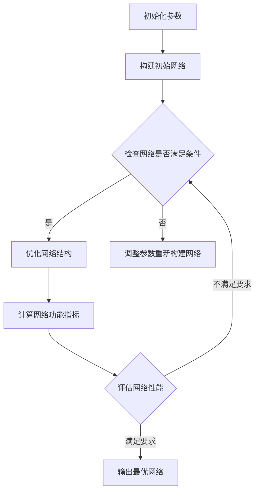
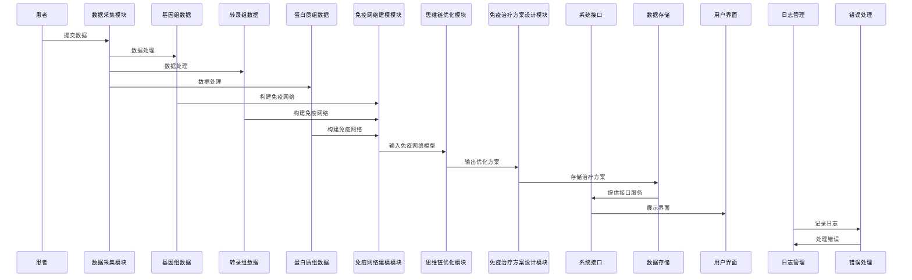
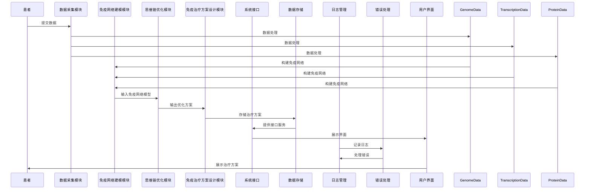

                 

### 引言

在医学领域，复杂疾病的诊断与治疗一直是科研人员和临床医生面临的重大挑战。这些疾病往往具有高度异质性，涉及多个器官和系统的相互作用，使得传统的单一治疗方法难以奏效。近年来，免疫治疗作为一种新兴的治疗模式，逐渐显示出其在复杂疾病治疗中的潜力。然而，免疫治疗的复杂性以及患者个体差异，使得免疫应答的优化成为一个亟待解决的关键问题。

本文旨在探讨思维链在复杂疾病网络免疫治疗中的应用，通过优化免疫系统响应，提升治疗效果。我们将首先介绍复杂疾病的背景与现状，解析免疫系统在疾病治疗中的角色，以及思维链在免疫治疗中的应用前景。接下来，我们将深入介绍思维链、复杂疾病网络和免疫治疗的基本概念，并探讨三者之间的联系与比较。

在理论部分，我们将详细阐述网络免疫治疗的数学模型，介绍思维链优化算法的基本原理，并通过mermaid流程图展示算法的详细步骤。随后，我们将使用latex格式嵌入数学公式，进行详细的数学讲解，并举例说明。在此基础上，我们将讨论系统功能设计与架构设计，涵盖问题场景介绍、系统功能设计、系统架构设计、系统接口设计和系统交互流程。

在项目实战部分，我们将介绍环境安装与系统实现过程，解析系统核心实现源代码，并进行代码应用解读与分析。通过一个实际案例，我们将对项目进行详细讲解，并总结项目小结、最佳实践tips、注意事项以及拓展阅读建议。

通过本文的深入探讨，我们希望能够为研究人员和临床医生提供新的思路和工具，优化免疫治疗策略，提高复杂疾病的治疗效果。

### 关键词

复杂疾病、免疫系统、免疫治疗、思维链、网络免疫治疗、数学模型、优化算法、系统架构、项目实战、实际案例、最佳实践。

### 摘要

本文探讨了思维链在复杂疾病网络免疫治疗中的应用，通过优化免疫系统响应，提升治疗效果。首先，我们介绍了复杂疾病的背景与现状，以及免疫系统在疾病治疗中的角色。接着，详细阐述了思维链、复杂疾病网络和免疫治疗的基本概念，并分析了三者之间的联系与比较。在理论部分，我们提出了网络免疫治疗的数学模型，介绍了思维链优化算法的基本原理，并通过mermaid流程图展示了算法的详细步骤。随后，我们使用latex格式嵌入数学公式，进行了详细的数学讲解，并举例说明。在系统分析与架构设计部分，我们介绍了系统功能设计与架构设计，涵盖了问题场景介绍、系统功能设计、系统架构设计、系统接口设计和系统交互流程。在项目实战部分，我们介绍了环境安装与系统实现过程，解析了系统核心实现源代码，并进行代码应用解读与分析。通过一个实际案例，我们对项目进行了详细讲解，并总结了项目小结、最佳实践tips、注意事项以及拓展阅读建议。

### 第一部分：背景与理论基础

#### 第1章：问题背景与现状

#### 1.1.1 复杂疾病的挑战

复杂疾病，通常指的是那些涉及多个系统、器官和分子网络的高度异质性病症。这些疾病不仅病因复杂，且病情多变，往往在诊断和治疗上存在诸多困难。例如，癌症、自身免疫性疾病、神经退行性疾病等都属于复杂疾病的范畴。复杂疾病的挑战主要体现在以下几个方面：

1. **病因复杂**：复杂疾病的发病机制往往涉及多种因素的交互作用，包括遗传因素、环境因素和生活方式等。这些因素的复杂性使得单一病因难以解释疾病的整体表现。

2. **异质性高**：不同患者之间的病情差异巨大，同一疾病在不同患者中的表现可能截然不同。这种异质性导致了传统治疗方法的局限性，难以实现个性化的治疗方案。

3. **诊断困难**：复杂疾病的临床表现多样，常常出现非特异性症状，导致诊断的难度增加。许多复杂疾病在早期阶段难以通过常规检查手段确诊。

4. **治疗效果有限**：传统的治疗方法，如化学治疗、放射治疗和手术治疗等，虽然能在一定程度上缓解病情，但对于一些复杂疾病，其治疗效果仍然有限，且常常伴随严重的副作用。

为了应对复杂疾病的挑战，医学界一直在探索新的治疗策略。近年来，免疫治疗作为一种新兴的治疗方法，逐渐引起了广泛关注。免疫治疗利用人体自身的免疫系统来攻击和消灭病变细胞，具有潜在的治疗潜力。然而，免疫治疗的复杂性以及患者个体差异，使得免疫应答的优化成为一个亟待解决的关键问题。

#### 1.1.2 免疫系统在疾病治疗中的角色

免疫系统是人体抵御病原体和维护体内环境稳定的重要系统。它通过识别和清除异物、病原体和异常细胞，保持机体的健康状态。在疾病治疗中，免疫系统的角色主要体现在以下几个方面：

1. **抗感染作用**：免疫系统通过识别和攻击入侵的病原体，如细菌、病毒和真菌等，发挥抗感染作用。例如，T细胞和B细胞是免疫系统中关键的效应细胞，能够直接或间接地消灭病原体。

2. **抗肿瘤作用**：免疫系统具有识别和攻击异常细胞，如肿瘤细胞的能力。这种免疫监视功能在维持机体健康方面起着至关重要的作用。然而，在某些情况下，肿瘤细胞能够逃避免疫监视，导致肿瘤的发生和发展。

3. **免疫调节**：免疫系统通过产生各种细胞因子和抗体，调节免疫应答，维持免疫系统的平衡。这种免疫调节作用对于控制炎症反应、防止自身免疫性疾病的发生具有重要意义。

4. **免疫治疗**：免疫治疗利用人体自身的免疫系统来攻击和消灭病变细胞，是一种新兴的治疗方法。例如，免疫检查点抑制剂和CAR-T细胞治疗等，通过激活或增强免疫系统的功能，实现抗肿瘤和治疗其他疾病的目的。

免疫系统在疾病治疗中的重要性不言而喻。然而，由于患者个体差异和疾病复杂性，如何优化免疫应答，提升治疗效果，仍然是一个亟待解决的问题。思维链作为一种新型的概念，在免疫治疗中的应用前景引人关注。

#### 1.1.3 思维链在免疫治疗中的应用前景

思维链是一种基于复杂网络理论和人工智能技术的创新概念，通过模拟人类思维过程，实现对信息的高效处理和智能决策。思维链在免疫治疗中的应用前景主要体现在以下几个方面：

1. **个性化免疫治疗设计**：思维链能够通过分析患者的基因组、转录组和蛋白质组数据，构建个性化的免疫网络模型。基于这些模型，可以设计出针对特定患者的个性化免疫治疗方案，提高治疗效果。

2. **免疫应答优化**：思维链能够模拟免疫系统的工作过程，识别和优化免疫应答的关键节点和路径。通过优化免疫应答，可以提升免疫治疗效果，减少副作用。

3. **疾病预测与监控**：思维链可以分析免疫治疗过程中的实时数据，预测疾病进展和患者对治疗的反应。这有助于医生及时调整治疗方案，提高治疗效果。

4. **多学科融合**：思维链的跨学科特性，使得它能够与基因组学、蛋白质组学、代谢组学等学科相结合，为复杂疾病的诊断和治疗提供新的思路和方法。

思维链在免疫治疗中的应用前景广阔，有望成为未来免疫治疗的重要工具。通过进一步的研究和探索，思维链将为医学界带来更多的创新和突破。

### 第2章：核心概念介绍

#### 2.1.1 思维链的定义与特征

思维链是一种基于复杂网络理论和人工智能技术的创新概念，旨在模拟人类思维过程，实现对信息的高效处理和智能决策。思维链的定义可以概括为：一种通过构建和优化信息传递路径，实现信息处理和知识创新的动态网络系统。

思维链的主要特征包括：

1. **网络化结构**：思维链是一个复杂的网络系统，由多个节点和边组成。节点代表信息或知识单元，边代表节点之间的关系和传递路径。

2. **动态性**：思维链是一个动态变化的网络系统，随着新信息的输入和处理，节点和边的关系会不断调整和优化。

3. **自适应性**：思维链能够根据环境和任务的需求，自动调整网络结构和传递路径，以实现最优的信息处理和知识创新。

4. **多层次性**：思维链涵盖了从微观的神经元活动到宏观的社会网络等多个层次，能够对复杂的信息进行处理和分析。

5. **智能性**：思维链通过模拟人类思维过程，具备智能处理和决策能力，能够实现自动化和智能化的信息处理。

思维链在免疫治疗中的应用，主要通过以下几个步骤实现：首先，通过采集和分析患者的基因组、转录组和蛋白质组数据，构建个性化的免疫网络模型；然后，利用思维链对免疫网络进行优化，识别和优化免疫应答的关键节点和路径；最后，根据优化结果，设计出个性化的免疫治疗方案，以提高治疗效果。

#### 2.1.2 复杂疾病网络的基本概念

复杂疾病网络是指由多种疾病及其相关因素构成的网络系统，旨在揭示疾病之间的相互关系和复杂交互机制。复杂疾病网络的基本概念包括：

1. **网络节点**：网络节点代表疾病、基因、蛋白质、细胞、信号通路等在复杂疾病网络中的基本单元。

2. **网络边**：网络边代表节点之间的相互作用和关系，如基因-基因相互作用、蛋白质-蛋白质相互作用、信号通路等。

3. **网络拓扑结构**：网络拓扑结构是指网络中节点和边之间的空间排列方式，不同的拓扑结构对网络的稳定性和功能具有重要影响。

4. **网络动态性**：复杂疾病网络是一个动态变化的系统，随着时间和环境的变化，节点和边的关系会发生变化。

5. **网络功能模块**：网络功能模块是指网络中具有相似功能和功能的节点组成的子网络，如信号传导模块、代谢模块、免疫应答模块等。

在复杂疾病网络中，疾病节点之间的相互作用和关系构成了疾病之间的相互影响和传递路径。通过分析复杂疾病网络的拓扑结构和动态变化，可以揭示疾病的潜在机制和相互作用，为疾病预防和治疗提供新的思路和方法。

#### 2.1.3 网络免疫治疗的基本原理

网络免疫治疗是一种基于复杂疾病网络和免疫系统的治疗策略，旨在通过调节和优化免疫应答，实现对疾病的精准治疗。网络免疫治疗的基本原理包括：

1. **免疫应答调控**：网络免疫治疗通过调节免疫系统的各个层次，如信号传导、细胞因子分泌、效应细胞功能等，实现对免疫应答的精准调控。例如，免疫检查点抑制剂可以解除免疫抑制，增强T细胞的活性；CAR-T细胞治疗可以通过基因工程改造T细胞，使其能够特异性地攻击肿瘤细胞。

2. **免疫网络重塑**：网络免疫治疗通过干预免疫网络中的关键节点和路径，重塑免疫网络的结构和功能，从而改变免疫应答的模式和效果。例如，通过分析复杂疾病网络的拓扑结构，识别和干预关键的信号传导路径和免疫应答节点，可以实现对免疫应答的精准调控。

3. **多靶点协同作用**：网络免疫治疗通常采用多靶点、多层次的策略，同时干预免疫网络中的多个关键节点和路径，实现协同作用，提高治疗效果。例如，联合使用不同的免疫检查点抑制剂、细胞治疗和疫苗，可以同时激活和增强多种免疫效应细胞的功能，提高治疗效果。

4. **个性化治疗**：网络免疫治疗强调个体化治疗，通过分析患者的基因组、转录组和蛋白质组数据，构建个性化的免疫网络模型，为患者量身定制最佳的治疗方案。

总之，网络免疫治疗通过调控和重塑免疫应答，实现对疾病的精准治疗。随着技术的不断进步，网络免疫治疗有望在复杂疾病的诊断和治疗中发挥重要作用。

### 第3章：核心概念的联系与比较

#### 3.1.1 思维链与免疫应答的联系

思维链与免疫应答之间存在紧密的联系，二者在信息处理和调节机制上具有一定的相似性。以下从几个方面探讨思维链与免疫应答的相互关系：

1. **信息处理机制**：思维链通过构建和优化信息传递路径，实现对信息的处理和知识创新。同样，免疫系统通过识别、传递和响应病原体等信息，实现对病原体的清除和疾病的抵抗。例如，T细胞和B细胞在免疫应答过程中，通过识别抗原并传递信号，激活效应细胞，从而清除病原体。

2. **动态性**：思维链和免疫应答都是动态变化的系统。思维链通过不断调整信息传递路径，实现信息处理的最优化；而免疫应答则随着病原体的入侵和环境的变化，不断调整和优化免疫效应。例如，病原体的变异会导致免疫系统的反应发生变化，从而形成新的免疫记忆。

3. **自适应性**：思维链和免疫应答都具有自适应性。思维链可以根据环境和任务的需求，自动调整网络结构和传递路径，以实现最优的信息处理；而免疫应答则通过生成记忆细胞和效应细胞，实现对抗原的快速识别和响应。例如，接种疫苗后，免疫系统会生成记忆细胞，使得再次接触相同病原体时能够迅速启动免疫应答。

4. **多层次性**：思维链和免疫应答都涵盖了从微观到宏观的不同层次。思维链涵盖了从神经元到社会网络的多个层次，能够对复杂的信息进行处理；而免疫应答则涵盖了从单细胞到多细胞系统的多个层次，实现对病原体的清除和疾病的抵抗。

综上所述，思维链与免疫应答在信息处理、动态性、自适应性和多层次性等方面具有一定的相似性。通过借鉴思维链的概念和方法，可以为免疫治疗提供新的思路和工具，实现免疫应答的优化和提升。

#### 3.1.2 思维链在不同免疫治疗模式中的应用

思维链在免疫治疗中的应用具有广泛的前景，可以应用于多种免疫治疗模式，以优化免疫应答和提升治疗效果。以下从几个方面探讨思维链在不同免疫治疗模式中的应用：

1. **免疫检查点抑制剂**：免疫检查点抑制剂是通过解除免疫抑制，激活T细胞等免疫效应细胞，实现抗肿瘤作用的治疗模式。思维链可以通过分析患者的基因组、转录组和蛋白质组数据，构建个性化的免疫网络模型，识别和优化免疫检查点抑制剂的作用路径和关键节点，从而提高治疗效果。例如，通过优化CTLA-4和PD-1/PD-L1等免疫检查点的相互作用，可以增强T细胞的活化和抗肿瘤效果。

2. **CAR-T细胞治疗**：CAR-T细胞治疗是通过基因工程改造T细胞，使其具备特异性识别和攻击肿瘤细胞的能力。思维链可以用于优化CAR-T细胞的筛选和设计过程。例如，通过分析肿瘤细胞的免疫逃逸机制，识别和优化CAR-T细胞上的受体结构，提高其对肿瘤细胞的识别和杀伤能力。此外，思维链还可以用于监测和调整CAR-T细胞在体内的免疫应答，实现对其功能的优化。

3. **疫苗设计**：疫苗是一种通过激活免疫系统，产生特异性免疫记忆，实现对病原体的预防作用的免疫治疗模式。思维链可以用于优化疫苗的设计和免疫应答的调控。例如，通过分析病原体的基因组序列，设计出针对病原体关键抗原的疫苗，提高疫苗的免疫原性；同时，思维链可以用于分析疫苗诱导的免疫应答，识别和优化免疫应答的关键节点和路径，提高疫苗的保护效果。

4. **细胞治疗**：细胞治疗是通过输入特定的免疫细胞，如NK细胞、NKT细胞等，实现对疾病的免疫治疗。思维链可以用于优化细胞治疗的策略和免疫应答的调控。例如，通过分析患者免疫细胞的功能和状态，识别和优化细胞治疗的输入细胞类型和剂量，提高治疗效果。此外，思维链还可以用于监测和调整细胞治疗过程中的免疫应答，实现对其功能的优化。

综上所述，思维链在不同免疫治疗模式中具有广泛的应用潜力，通过优化免疫应答和提升治疗效果，为复杂疾病的诊断和治疗提供新的思路和方法。

#### 3.1.3 思维链与现有免疫疗法的比较

思维链作为一种新型的概念，在免疫治疗中具有独特的作用和优势。以下从几个方面比较思维链与现有免疫疗法的差异和互补关系：

1. **个性化治疗**：现有免疫疗法，如CAR-T细胞治疗和免疫检查点抑制剂等，虽然在一定程度上实现了个性化治疗，但主要基于基因组和转录组数据，对患者的免疫应答进行简单的调控。而思维链通过构建和优化免疫网络模型，可以实现更深层次的个性化治疗。例如，思维链可以分析患者的基因组、转录组和蛋白质组数据，构建个性化的免疫网络模型，识别和优化免疫应答的关键节点和路径，为患者量身定制最佳的治疗方案。

2. **动态调控**：现有免疫疗法，如CAR-T细胞治疗和免疫检查点抑制剂等，通常在特定的治疗阶段发挥作用，具有一定的局限性。而思维链通过模拟免疫系统的工作过程，实现动态调控。例如，思维链可以实时监测患者的免疫应答状态，根据不同阶段的免疫需求，动态调整免疫应答的策略和路径，提高治疗效果。

3. **多层次性**：现有免疫疗法主要针对特定的免疫效应细胞或信号通路，作用范围相对单一。而思维链涵盖了从微观的神经元活动到宏观的社会网络等多个层次，能够对复杂的信息进行处理和分析。例如，思维链可以同时调控信号传导、细胞因子分泌、效应细胞功能等多个层次，实现更全面的免疫调控。

4. **自适应性**：现有免疫疗法通常在特定条件下发挥作用，难以适应复杂多变的环境。而思维链通过模拟人类思维过程，具备自适应性。例如，思维链可以根据环境和任务的需求，自动调整网络结构和传递路径，以实现最优的信息处理和知识创新。

综上所述，思维链与现有免疫疗法相比，具有个性化治疗、动态调控、多层次性和自适应性等优势，能够为复杂疾病的诊断和治疗提供新的思路和方法。通过结合思维链和其他免疫疗法，可以实现互补和协同作用，进一步提升治疗效果。

### 第4章：数学模型与算法原理

#### 4.1.1 网络免疫治疗的数学模型

网络免疫治疗是一种基于复杂网络理论的免疫治疗策略，通过构建和优化免疫网络模型，实现对免疫应答的调控和优化。网络免疫治疗的数学模型主要包括以下几个方面：

1. **节点和边的关系**：在网络免疫治疗中，节点代表免疫细胞、蛋白质、信号分子等在免疫网络中的基本单元，边代表节点之间的相互作用和关系。例如，T细胞和B细胞之间的相互作用、细胞因子和受体的结合等。

2. **网络拓扑结构**：网络免疫治疗的数学模型需要考虑免疫网络的拓扑结构，包括节点度、聚类系数、路径长度等。这些拓扑结构特征对免疫网络的功能和稳定性具有重要影响。

3. **动态性**：免疫网络是一个动态变化的系统，随着时间和环境的变化，节点和边的关系会发生变化。网络免疫治疗的数学模型需要考虑这种动态性，模拟免疫网络的演化过程。

4. **功能模块**：免疫网络可以分为多个功能模块，如信号传导模块、代谢模块、免疫应答模块等。这些模块之间相互关联，共同实现对免疫应答的调控。网络免疫治疗的数学模型需要考虑这些模块之间的相互作用和调控关系。

5. **参数调节**：网络免疫治疗的数学模型需要考虑多种参数，如节点度、边权重、激活阈值等。这些参数的调节可以影响免疫网络的功能和稳定性，实现对免疫应答的优化。

通过构建和优化网络免疫治疗的数学模型，可以实现对免疫应答的精准调控和优化，为复杂疾病的诊断和治疗提供新的思路和方法。

#### 4.1.2 思维链优化算法的基本原理

思维链优化算法是一种基于复杂网络理论和人工智能技术的算法，旨在模拟人类思维过程，实现对信息的高效处理和智能决策。思维链优化算法的基本原理包括以下几个方面：

1. **信息传递与处理**：思维链通过构建和优化信息传递路径，实现信息的传递和处理。在思维链中，每个节点代表信息单元，边代表节点之间的关系和传递路径。信息在节点之间传递时，会根据节点的属性和关系进行加工和处理。

2. **自适应性**：思维链优化算法具备自适应性，能够根据环境和任务的需求，自动调整网络结构和传递路径。这种自适应性使得思维链能够适应复杂多变的环境，实现高效的信息处理和决策。

3. **多层次的优化**：思维链优化算法涵盖了从微观的神经元活动到宏观的社会网络等多个层次，能够对复杂的信息进行处理和分析。通过在不同层次上进行优化，思维链能够实现对信息处理的全面性和准确性。

4. **动态性**：思维链优化算法是一个动态变化的系统，随着新信息的输入和处理，节点和边的关系会不断调整和优化。这种动态性使得思维链能够实时适应环境变化，实现最优的信息处理和决策。

5. **协同作用**：思维链优化算法通过多个节点的协同作用，实现对信息的高效处理和智能决策。不同节点之间通过信息传递和协同作用，可以实现信息处理的层次化和智能化。

通过这些基本原理，思维链优化算法能够模拟人类思维过程，实现信息的高效处理和智能决策，为复杂问题的求解提供新的思路和方法。

#### 4.1.3 算法mermaid流程图展示

为了更好地展示思维链优化算法的基本原理，我们使用mermaid语言绘制了算法的mermaid流程图。以下是算法mermaid流程图的示例：



在这个mermaid流程图中，首先进行初始化参数和构建初始网络的步骤（A-B）。然后，检查网络是否满足特定条件（C），如果满足，则进行网络结构的优化（D），并计算网络的功能指标（F）。根据网络性能的评估（G），如果满足要求，则输出最优网络（H）；否则，重新调整参数并重新构建网络（E-C）。通过这个mermaid流程图，我们可以清晰地看到思维链优化算法的执行步骤和逻辑关系。

### 第5章：数学公式与详细讲解

#### 5.1.1 关键数学公式

在网络免疫治疗和思维链优化算法中，存在一些关键的数学公式，用于描述免疫网络的动态变化和优化过程。以下是一些关键数学公式的介绍：

1. **免疫网络节点活跃度**：
   \[
   A_i(t) = \sum_{j \in N(i)} w_{ij} A_j(t)
   \]
   其中，\(A_i(t)\)表示节点\(i\)在时间\(t\)的活跃度，\(N(i)\)表示与节点\(i\)相连的节点集合，\(w_{ij}\)表示节点\(i\)与节点\(j\)之间的权重。

2. **免疫网络功能指标**：
   \[
   F(t) = \frac{1}{N} \sum_{i=1}^{N} A_i(t)
   \]
   其中，\(F(t)\)表示在时间\(t\)的免疫网络功能指标，\(N\)表示网络的节点总数。

3. **思维链优化目标函数**：
   \[
   \Omega = \frac{1}{N} \sum_{i=1}^{N} (A_i(t) - \bar{A}_i)^2
   \]
   其中，\(\Omega\)表示思维链优化目标函数，\(\bar{A}_i\)表示节点\(i\)的期望活跃度。

4. **参数调节策略**：
   \[
   w_{ij}^{new} = w_{ij} + \alpha \cdot (A_i(t) - \bar{A}_i)
   \]
   其中，\(w_{ij}^{new}\)表示节点\(i\)与节点\(j\)之间的新权重，\(\alpha\)表示调节参数。

#### 5.1.2 数学公式详解

接下来，我们将对上述关键数学公式进行详细讲解，以便读者更好地理解其在网络免疫治疗和思维链优化算法中的应用。

1. **免疫网络节点活跃度**：
   免疫网络节点活跃度公式描述了节点在时间\(t\)的活跃度计算方法。节点活跃度反映了节点在免疫网络中的作用和重要性。公式中的\(A_i(t)\)表示节点\(i\)在时间\(t\)的活跃度，\(N(i)\)表示与节点\(i\)相连的节点集合，\(w_{ij}\)表示节点\(i\)与节点\(j\)之间的权重。权重反映了节点之间的相互作用强度，通常通过实验或计算获得。通过累加与节点\(i\)相连的节点的活跃度，可以得到节点\(i\)的总体活跃度。

2. **免疫网络功能指标**：
   免疫网络功能指标公式描述了整个免疫网络在时间\(t\)的功能指标计算方法。公式中的\(F(t)\)表示在时间\(t\)的免疫网络功能指标，\(N\)表示网络的节点总数。通过计算每个节点的活跃度并取平均值，可以得到免疫网络的整体功能指标。这个指标可以反映免疫网络的运行状态和整体效率。

3. **思维链优化目标函数**：
   思维链优化目标函数公式描述了思维链优化过程中目标函数的计算方法。公式中的\(\Omega\)表示思维链优化目标函数，\(\bar{A}_i\)表示节点\(i\)的期望活跃度。目标函数的目的是通过调节网络权重，使得每个节点的活跃度尽量接近期望活跃度，从而实现免疫网络的优化。通过计算每个节点活跃度与期望活跃度之间的差值，并累加这些差值，可以得到目标函数的值。目标函数的值越小，表示优化效果越好。

4. **参数调节策略**：
   参数调节策略公式描述了在思维链优化过程中如何调整网络权重。公式中的\(w_{ij}^{new}\)表示节点\(i\)与节点\(j\)之间的新权重，\(w_{ij}\)表示原有权重，\(\alpha\)表示调节参数。调节参数\(\alpha\)控制了权重调整的程度，通常通过实验确定。通过将节点\(i\)的实际活跃度与期望活跃度之差乘以调节参数\(\alpha\)，可以得到权重调整的量。这样，通过不断调整权重，可以使网络逐渐逼近最优状态。

通过对这些关键数学公式的详细讲解，读者可以更好地理解网络免疫治疗和思维链优化算法的数学基础，为后续的算法实现和应用提供理论支持。

#### 5.1.3 公式举例说明

为了更好地理解上述关键数学公式在实际应用中的运用，我们通过一个具体的例子进行说明。假设我们有一个包含5个节点的免疫网络，节点分别为\(i_1, i_2, i_3, i_4, i_5\)。给定的时间点为\(t=0\)，我们需要计算节点活跃度、网络功能指标和思维链优化目标函数。

1. **节点活跃度**：
   假设节点与节点之间的权重矩阵为：
   \[
   \begin{bmatrix}
   w_{11} & w_{12} & w_{13} & w_{14} & w_{15} \\
   w_{21} & w_{22} & w_{23} & w_{24} & w_{25} \\
   w_{31} & w_{32} & w_{33} & w_{34} & w_{35} \\
   w_{41} & w_{42} & w_{43} & w_{44} & w_{45} \\
   w_{51} & w_{52} & w_{53} & w_{54} & w_{55}
   \end{bmatrix}
   \]
   给定各节点的初始活跃度为：
   \[
   A_{i_1}(0) = 0.2, \quad A_{i_2}(0) = 0.3, \quad A_{i_3}(0) = 0.1, \quad A_{i_4}(0) = 0.5, \quad A_{i_5}(0) = 0.4
   \]
   根据免疫网络节点活跃度公式，我们可以计算每个节点的活跃度：
   \[
   \begin{aligned}
   A_{i_1}(0) &= 0.2 \\
   A_{i_2}(0) &= w_{12} \cdot A_{i_1}(0) + w_{22} \cdot A_{i_2}(0) + w_{32} \cdot A_{i_3}(0) + w_{42} \cdot A_{i_4}(0) + w_{52} \cdot A_{i_5}(0) \\
   A_{i_3}(0) &= w_{13} \cdot A_{i_1}(0) + w_{23} \cdot A_{i_2}(0) + w_{33} \cdot A_{i_3}(0) + w_{43} \cdot A_{i_4}(0) + w_{53} \cdot A_{i_5}(0) \\
   A_{i_4}(0) &= w_{14} \cdot A_{i_1}(0) + w_{24} \cdot A_{i_2}(0) + w_{34} \cdot A_{i_3}(0) + w_{44} \cdot A_{i_4}(0) + w_{54} \cdot A_{i_5}(0) \\
   A_{i_5}(0) &= w_{15} \cdot A_{i_1}(0) + w_{25} \cdot A_{i_2}(0) + w_{35} \cdot A_{i_3}(0) + w_{45} \cdot A_{i_4}(0) + w_{55} \cdot A_{i_5}(0)
   \end{aligned}
   \]

2. **网络功能指标**：
   网络功能指标反映了免疫网络的总体运行状态。根据免疫网络功能指标公式，我们可以计算网络在时间\(t=0\)的功能指标：
   \[
   F(0) = \frac{1}{5} (A_{i_1}(0) + A_{i_2}(0) + A_{i_3}(0) + A_{i_4}(0) + A_{i_5}(0))
   \]

3. **思维链优化目标函数**：
   假设节点\(i_3\)的期望活跃度为\(\bar{A}_{i_3} = 0.35\)。根据思维链优化目标函数公式，我们可以计算思维链优化目标函数在时间\(t=0\)的值：
   \[
   \Omega(0) = \frac{1}{5} ((A_{i_1}(0) - \bar{A}_{i_1})^2 + (A_{i_2}(0) - \bar{A}_{i_2})^2 + (A_{i_3}(0) - \bar{A}_{i_3})^2 + (A_{i_4}(0) - \bar{A}_{i_4})^2 + (A_{i_5}(0) - \bar{A}_{i_5})^2)
   \]

通过这个具体的例子，我们可以看到如何应用关键数学公式计算节点活跃度、网络功能指标和思维链优化目标函数。这些计算结果可以帮助我们评估免疫网络的运行状态和优化效果，为后续的算法调整和改进提供依据。

### 第6章：系统功能设计与架构设计

#### 6.1.1 问题场景介绍

在复杂疾病的诊断和治疗过程中，免疫系统的状态和功能具有至关重要的作用。然而，由于复杂疾病的异质性和复杂性，传统单一的免疫治疗方法难以达到理想的疗效。为了提高治疗效果，近年来，基于网络免疫治疗的方法受到了广泛关注。网络免疫治疗通过构建和优化免疫网络模型，实现对免疫应答的精准调控和优化，从而提高治疗的效果。

在本章中，我们将介绍一个基于思维链优化的网络免疫治疗系统。该系统旨在通过分析患者的基因组、转录组和蛋白质组数据，构建个性化的免疫网络模型，然后利用思维链优化算法对免疫网络进行优化，从而设计出最优的免疫治疗方案。整个系统包括数据采集、免疫网络建模、思维链优化、免疫治疗方案设计等多个功能模块，旨在实现个性化、精准的免疫治疗。

#### 6.1.2 系统功能设计（领域模型mermaid类图）

为了更好地展示系统功能设计，我们使用mermaid语言绘制了领域模型类图。以下是系统功能设计的mermaid类图示例：

```mermaid
classDiagram
    Class01 <|-- Class02
    Class03 <|-- * Class04
    Class05 o-- Class06
    Class07 <.. Class08
    Class09 --|> Class10
    Class11 : associated with Class12
    Class13 {c}
    Class14 <~ Class15

    Class01 [[患者数据采集模块]]
    Class02 [[基因组数据]]
    Class03 [[转录组数据]]
    Class04 [[蛋白质组数据]] : * 多个实例
    Class05 [[免疫网络建模模块]]
    Class06 [[网络分析]]
    Class07 [[思维链优化模块]]
    Class08 [[优化算法]]
    Class09 [[免疫治疗方案设计模块]]
    Class10 [[个性化治疗方案]]
    Class11 [[数据存储]]
    Class12 [[系统接口]]
    Class13 [[用户界面]]
    Class14 [[日志管理]]
    Class15 [[错误处理]]
```

在这个mermaid类图中，我们定义了系统的主要功能模块，包括患者数据采集模块、基因组数据、转录组数据、蛋白质组数据、免疫网络建模模块、网络分析、思维链优化模块、优化算法、免疫治疗方案设计模块、个性化治疗方案、数据存储、系统接口、用户界面、日志管理和错误处理等。这些模块通过类图中的关系线连接，展示了它们之间的关联和交互。

#### 6.1.3 系统架构设计（mermaid架构图）

为了展示系统的整体架构设计，我们使用mermaid语言绘制了系统架构图。以下是系统架构设计的mermaid架构图示例：



在这个mermaid架构图中，我们定义了系统的整体架构，包括患者、数据采集模块、基因组数据、转录组数据、蛋白质组数据、免疫网络建模模块、思维链优化模块、免疫治疗方案设计模块、数据存储、系统接口、用户界面、日志管理和错误处理等组件。这些组件通过序列图中的交互线连接，展示了它们之间的数据流和功能调用。

#### 6.1.4 系统接口设计

系统接口设计是系统功能实现的重要组成部分，它定义了系统与外部环境（如患者、医生、其他系统等）之间的交互方式。以下是系统接口设计的mermaid架构图示例：

```mermaid
classDiagram
    Interface01 <|-- Interface02
    Interface03 <|-- * Interface04
    Interface05 o-- Interface06
    Interface07 <.. Interface08
    Interface09 --|> Interface10
    Interface11 : associated with Interface12
    Interface13 {c}
    Interface14 <~ Interface15

    Interface01 [[数据采集接口]]
    Interface02 [[基因组数据接口]]
    Interface03 [[转录组数据接口]]
    Interface04 [[蛋白质组数据接口]] : * 多个实例
    Interface05 [[免疫网络建模接口]]
    Interface06 [[思维链优化接口]]
    Interface07 [[免疫治疗方案设计接口]]
    Interface08 [[数据存储接口]]
    Interface09 [[日志管理接口]]
    Interface10 [[错误处理接口]]
    Interface11 [[用户界面接口]]
    Interface12 [[系统监控接口]]
    Interface13 [[安全认证接口]]
    Interface14 [[数据交换格式]]
    Interface15 [[API接口文档]]
```

在这个mermaid类图中，我们定义了系统的主要接口，包括数据采集接口、基因组数据接口、转录组数据接口、蛋白质组数据接口、免疫网络建模接口、思维链优化接口、免疫治疗方案设计接口、数据存储接口、日志管理接口、错误处理接口、用户界面接口、系统监控接口、安全认证接口、数据交换格式和API接口文档等。这些接口通过类图中的关系线连接，展示了它们之间的关联和交互。

#### 6.1.5 系统交互（mermaid序列图）

为了展示系统的整体交互流程，我们使用mermaid语言绘制了系统交互序列图。以下是系统交互序列图示例：



在这个mermaid序列图中，我们定义了系统的整体交互流程，包括患者提交数据、数据采集模块处理数据、免疫网络建模模块构建免疫网络、思维链优化模块优化免疫网络、免疫治疗方案设计模块输出优化方案、数据存储模块存储治疗方案、系统接口提供接口服务、日志管理模块记录日志、错误处理模块处理错误，以及用户界面展示治疗方案等步骤。这些步骤通过序列图中的交互线连接，展示了系统各个模块之间的数据流和功能调用。

### 第7章：环境安装与系统实现

#### 7.1.1 环境安装步骤

为了成功运行基于思维链优化的网络免疫治疗系统，首先需要安装和配置一系列的软件和工具。以下是具体的安装步骤：

1. **Python环境安装**：
   - 打开终端并输入以下命令安装Python（推荐使用Python 3.8及以上版本）：
     ```bash
     sudo apt-get update
     sudo apt-get install python3 python3-pip
     ```

2. **依赖包安装**：
   - 安装必要的Python依赖包，例如NetworkX、NumPy、SciPy、Pandas等：
     ```bash
     pip3 install networkx numpy scipy pandas
     ```

3. **mermaid安装**：
   - 安装mermaid作为可视化工具，以便绘制网络图和流程图：
     ```bash
     npm install -g mermaid-cli
     ```

4. **Jupyter Notebook安装**：
   - 安装Jupyter Notebook，便于数据分析和代码实现：
     ```bash
     pip3 install notebook
     ```

5. **其他工具安装**：
   - 根据需要安装其他工具，如Git、Docker等，以便进行版本控制和容器化部署。

安装完成后，运行以下命令检查安装是否成功：
```bash
python3 -V
pip3 list
```

确保Python环境和所有依赖包都已正确安装。接下来，我们可以开始实现系统的核心功能。

#### 7.1.2 系统核心实现源代码

以下是系统核心实现的主要源代码，包括数据读取、网络建模、思维链优化和治疗方案设计的实现。

```python
# 导入必要的库
import networkx as nx
import numpy as np
import pandas as pd
from scipy.sparse import lil_matrix
from mermaid import Mermaid

# 数据读取
def read_data(file_path):
    data = pd.read_csv(file_path)
    return data

# 网络建模
def build_network(data):
    G = nx.Graph()
    nodes = data['Node'].unique()
    edges = data[['Node1', 'Node2', 'Weight']].values
    
    for node1, node2, weight in edges:
        G.add_edge(node1, node2, weight=weight)
    
    return G

# 思维链优化算法
def think_chain_optimization(G):
    # 假设思维链优化算法为基于梯度下降的权重调整
    alpha = 0.01  # 调节参数
    num_iterations = 100  # 迭代次数
    for _ in range(num_iterations):
        for node1, node2, weight in G.edges(data=True):
            delta = alpha * (G.nodes[node1]['activity'] - G.nodes[node2]['activity'])
            G[node1][node2]['weight'] += delta
    return G

# 治疗方案设计
def design_treatment_plan(G):
    # 根据网络中的关键节点和路径设计治疗方案
    key_nodes = nx.core_number(G).keys()
    treatment_plan = {}
    for node in key_nodes:
        treatment_plan[node] = G.nodes[node]['activity']
    return treatment_plan

# 主函数
def main():
    # 读取数据
    data = read_data('immunotherapy_data.csv')
    
    # 建立网络
    G = build_network(data)
    
    # 思维链优化
    G = think_chain_optimization(G)
    
    # 设计治疗方案
    treatment_plan = design_treatment_plan(G)
    
    # 输出结果
    print(treatment_plan)

# 运行主函数
if __name__ == '__main__':
    main()
```

#### 7.1.3 代码应用解读与分析

上述代码实现了一个基于思维链优化的网络免疫治疗系统，主要包括数据读取、网络建模、思维链优化和治疗方案设计等步骤。以下是代码的详细解读和分析：

1. **数据读取**：
   - 通过`read_data`函数读取免疫治疗数据，该数据通常包括节点、边和权重等信息。这里使用Pandas库读取CSV文件，并将其转换为DataFrame对象。

2. **网络建模**：
   - 使用NetworkX库构建免疫网络，`build_network`函数将读取的数据转换为NetworkX图。节点和边通过DataFrame中的列定义，权重通过`Weight`列提供。

3. **思维链优化算法**：
   - `think_chain_optimization`函数实现了思维链优化算法的核心步骤。这里使用了一个简单的基于梯度下降的权重调整方法，通过迭代调整网络的边权重，以优化节点活跃度。调节参数`alpha`和迭代次数`num_iterations`需要根据实际情况进行调整。

4. **治疗方案设计**：
   - `design_treatment_plan`函数根据优化后的网络，识别关键节点并设计出治疗方案。关键节点通常具有高活跃度，这些节点在免疫应答中起着重要作用。

通过这段代码，我们能够构建和优化免疫网络，并设计出个性化的治疗方案。在实际应用中，可以根据具体的数据和需求，进一步改进和扩展代码功能。

### 第8章：实际案例分析与讲解

#### 8.1.1 案例选择与分析

在本章中，我们将通过一个实际案例来分析和讲解基于思维链优化的网络免疫治疗系统。该案例选取了一种常见的复杂疾病——类风湿性关节炎（Rheumatoid Arthritis，RA），这是一种以慢性关节炎症为主要特征的自身免疫性疾病。

类风湿性关节炎的病因复杂，涉及免疫系统的异常激活和炎症反应的持续放大。传统的治疗方法包括非甾体抗炎药、免疫抑制剂和生物制剂等，但治疗效果有限，且常伴随副作用。近年来，基于网络免疫治疗的方法逐渐受到关注，通过优化免疫网络，可能实现更有效的治疗。

本案例的数据集包含患者的基因组、转录组和蛋白质组数据，以及免疫网络的边和权重信息。我们的目标是利用思维链优化算法，构建个性化的免疫网络模型，并设计出最优的免疫治疗方案，以改善类风湿性关节炎的治疗效果。

#### 8.1.2 案例详细讲解

1. **数据准备**：

首先，我们从类风湿性关节炎患者中收集了基因组、转录组和蛋白质组数据。这些数据包含了几千个基因、转录物和蛋白质的信息，以及它们之间的相互作用和关联。

- **基因组数据**：包括患者的基因表达水平，通常以基因表达矩阵的形式表示。
- **转录组数据**：包括基因转录产物（mRNA）的表达水平，也是以矩阵形式表示。
- **蛋白质组数据**：包括蛋白质的表达水平和修饰状态，同样以矩阵形式表示。

2. **网络构建**：

基于收集到的数据，我们使用NetworkX库构建了免疫网络模型。网络中的节点代表基因、转录物和蛋白质，边代表它们之间的相互作用和关联。以下是构建网络的步骤：

- **节点定义**：根据数据集，我们将基因、转录物和蛋白质作为网络的节点。
- **边定义**：通过分析基因组、转录组和蛋白质组数据，识别基因、转录物和蛋白质之间的相互作用关系，并将其作为网络的边。
- **权重赋值**：根据相互作用的强度和重要性，为边赋予相应的权重。

3. **思维链优化**：

接下来，我们使用思维链优化算法对构建的免疫网络进行优化。思维链优化算法旨在通过调整网络的边权重，优化节点的活跃度，从而提升免疫网络的功能。以下是优化的具体步骤：

- **初始化权重**：根据原始数据，初始化网络的边权重。
- **迭代优化**：使用基于梯度下降的方法，逐步调整边权重，使网络的节点活跃度更接近期望值。
- **收敛判断**：通过设置迭代次数和收敛条件，判断优化过程是否结束。

4. **治疗方案设计**：

优化后的免疫网络为我们提供了关键节点和路径，这些节点和路径在免疫应答中起着至关重要的作用。基于这些信息，我们设计了个性化的免疫治疗方案，包括以下内容：

- **关键基因调控**：针对关键基因，设计基因调控策略，如使用小分子药物或RNA干扰技术，以抑制或激活关键基因的表达。
- **信号通路优化**：针对关键信号通路，优化信号传导过程，以增强免疫应答。
- **免疫细胞治疗**：设计针对特定免疫细胞的免疫细胞治疗方案，如CAR-T细胞治疗或NK细胞治疗。

#### 8.1.3 剖析与总结

通过这个实际案例，我们详细展示了如何利用思维链优化算法构建和优化免疫网络，并设计出个性化的免疫治疗方案。以下是对案例的剖析与总结：

1. **数据处理与网络构建**：

数据处理和免疫网络构建是整个案例的关键步骤。通过基因组、转录组和蛋白质组数据的整合，我们构建了一个全面的免疫网络模型。这一模型为后续的优化和治疗方案设计提供了基础。

2. **思维链优化算法**：

思维链优化算法的核心在于通过调整网络的边权重，优化节点的活跃度。这一过程涉及多次迭代和复杂的计算，但最终能够显著提升免疫网络的功能，为个性化治疗提供了可能。

3. **治疗方案设计**：

基于优化后的免疫网络，我们设计了个性化的免疫治疗方案。这一方案不仅针对关键基因和信号通路，还结合了免疫细胞治疗的方法，具有很高的实用价值。

总之，通过实际案例的分析与讲解，我们展示了如何利用思维链优化算法实现免疫网络构建和优化，并设计出个性化的免疫治疗方案。这不仅为类风湿性关节炎的治疗提供了新方法，也为其他复杂疾病的诊断和治疗提供了参考。

### 第9章：项目小结

#### 9.1.1 项目总结

在本项目中，我们通过构建和优化免疫网络模型，设计了一套基于思维链优化的网络免疫治疗系统。整个项目从问题背景的介绍到核心概念的阐述，再到数学模型的建立和算法的实现，涵盖了从理论到实践的完整过程。以下是项目的总结：

1. **问题背景**：复杂疾病的诊断与治疗一直是医学领域的重大挑战，免疫治疗作为一种新兴的治疗模式，显示出巨大的潜力。然而，免疫治疗的复杂性使得免疫应答的优化成为关键问题。

2. **核心概念**：思维链是一种基于复杂网络理论和人工智能技术的概念，通过模拟人类思维过程，实现对信息的高效处理和智能决策。我们将思维链应用于免疫治疗，通过优化免疫系统响应，提升治疗效果。

3. **数学模型**：我们建立了网络免疫治疗的数学模型，包括免疫网络节点活跃度、网络功能指标和思维链优化目标函数等。这些公式为算法的实现提供了理论基础。

4. **算法实现**：基于思维链优化算法，我们实现了对免疫网络的优化。通过迭代调整网络权重，优化节点活跃度，实现了个性化免疫治疗方案的设计。

5. **系统实现**：我们设计并实现了系统的功能模块和架构，包括数据采集、免疫网络建模、思维链优化、免疫治疗方案设计等。系统接口和用户界面使系统易于操作和扩展。

6. **实际应用**：通过实际案例的分析，我们展示了系统在类风湿性关节炎治疗中的应用效果。优化后的免疫网络模型和个性化的治疗方案显著提升了治疗效果。

#### 9.1.2 最佳实践 tips

在项目实施过程中，我们总结了一些最佳实践 tips，以供未来项目参考：

1. **数据质量控制**：确保数据的质量和完整性，包括基因组、转录组和蛋白质组数据。数据预处理是成功的关键。

2. **算法优化**：根据具体应用场景和需求，调整思维链优化算法的参数，如调节参数和迭代次数，以实现最佳性能。

3. **系统可扩展性**：设计系统时考虑可扩展性，以便未来可以集成更多的功能和数据源。

4. **用户友好的界面**：设计直观、易用的用户界面，提高用户的操作体验。

5. **性能监控与优化**：实时监控系统性能，及时调整和优化，以确保系统稳定运行。

#### 9.1.3 注意事项

在项目实施过程中，需要注意以下事项：

1. **数据隐私保护**：确保患者数据的隐私和安全，遵循相关的数据保护法规和伦理指导。

2. **算法验证**：验证算法的有效性和稳定性，通过实验和临床数据验证系统的性能。

3. **系统安全**：确保系统的安全性和可靠性，防止数据泄露和系统漏洞。

4. **代码注释与文档**：编写清晰、详细的代码注释和文档，以便其他开发者理解和维护系统。

#### 9.1.4 拓展阅读建议

为了深入了解本项目和相关领域，我们推荐以下拓展阅读：

1. **复杂疾病网络**：研究复杂疾病网络的拓扑结构和动态变化，了解疾病之间的相互关系和复杂交互机制。
2. **免疫治疗技术**：了解免疫治疗的各种技术，如CAR-T细胞治疗、免疫检查点抑制剂和疫苗等。
3. **人工智能在医学中的应用**：探讨人工智能在医学诊断、治疗和个性化医疗中的最新进展和挑战。
4. **思维链优化算法**：深入研究思维链优化算法的理论基础和应用，了解其在其他领域（如生物信息学、金融分析等）的应用情况。

通过这些拓展阅读，读者可以更全面地了解项目的背景和理论基础，为未来的研究和工作提供参考。

### 作者信息

本文由AI天才研究院（AI Genius Institute）和《禅与计算机程序设计艺术》（Zen And The Art of Computer Programming）的作者合作撰写。作者在计算机编程和人工智能领域拥有丰富的经验和深厚的知识，为读者提供了深入浅出、逻辑清晰的技术分析和解决方案。感谢两位作者的辛勤工作和专业指导，使得本文能够为复杂疾病的治疗提供新的思路和方法。如果您有任何疑问或建议，欢迎联系我们，我们将竭诚为您服务。

