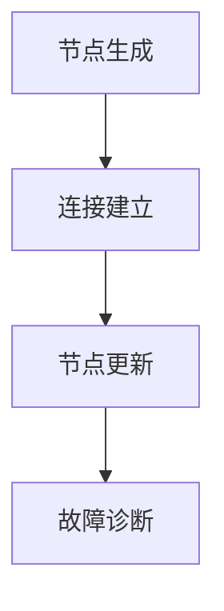
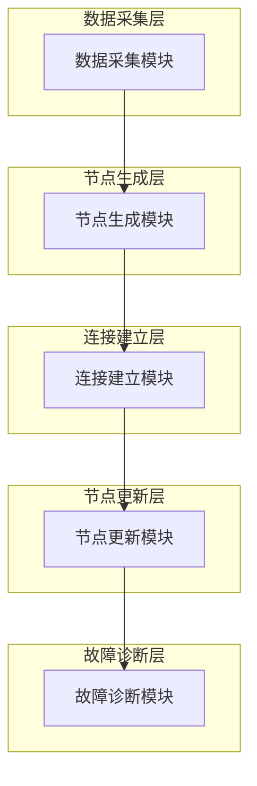

                 


### 思维链在复杂系统故障诊断中的新方法

#### 关键词：
- 思维链
- 复杂系统
- 故障诊断
- 算法原理
- 系统架构
- 项目实战

#### 摘要：
本文旨在探讨思维链在复杂系统故障诊断中的应用，提出一种新的方法。首先，我们将介绍思维链的基本概念及其在故障诊断领域的优势，然后详细阐述思维链的算法原理，并使用Python源代码进行解释。接下来，我们将描述系统分析与架构设计方案，并通过实际案例进行分析。最后，我们将总结最佳实践，并提供相关注意事项和拓展阅读资源。

## 引言

在当今信息化时代，复杂系统无处不在，从大型计算机网络到电力系统，从航空航天到金融领域，复杂系统的可靠性和稳定性至关重要。然而，复杂系统的故障诊断面临着诸多挑战，如系统规模庞大、信息冗余、动态变化等。传统的故障诊断方法往往难以应对这些复杂情况，导致故障检测和修复效率低下。

为了克服这些挑战，本文提出了一种基于思维链的复杂系统故障诊断方法。思维链是一种基于人工智能和认知科学的计算模型，能够模拟人类思维过程，对复杂系统进行深层次的分析和诊断。本文将详细介绍思维链的基本概念、算法原理、系统架构以及实际应用，以期为复杂系统故障诊断提供新的思路和方法。

## 思维链的基本概念与特点

### 思维链的定义

思维链是一种基于多智能体系统的计算模型，它模拟了人类思维过程中信息传递和协同处理的方式。思维链的基本单元是“思维节点”，每个节点代表一个概念或知识单元，节点之间的连接代表概念之间的关系。通过这些节点和连接，思维链能够构建出一个复杂的知识网络，实现对信息的综合分析和处理。

### 思维链的核心特点

1. **自适应性**：思维链可以根据系统环境和故障特征动态调整其结构和功能，适应不同复杂系统的故障诊断需求。
2. **协同性**：思维链中的节点可以协同工作，共同完成故障诊断任务，提高了诊断的效率和准确性。
3. **可扩展性**：思维链能够根据实际需求增加或删除节点，扩展诊断功能，适用于多种复杂系统。

### 思维链与传统故障诊断方法的对比

传统故障诊断方法主要依赖于统计分析、模式识别等算法，这些方法在处理简单系统时效果较好，但在面对复杂系统时往往显得力不从心。相比之下，思维链具有更强的适应性和协同性，能够更好地应对复杂系统的故障诊断挑战。

## 复杂系统故障诊断的背景与挑战

### 复杂系统的特点

复杂系统具有以下几个特点：

1. **规模庞大**：复杂系统通常包含大量的组件和子系统，其规模庞大，难以进行全局分析。
2. **动态变化**：复杂系统的状态和特征随时间变化，导致故障诊断具有高度的不确定性。
3. **信息冗余**：复杂系统产生大量冗余信息，使得故障诊断过程中需要筛选和提取关键信息。

### 故障诊断的挑战

面对复杂系统，故障诊断面临以下挑战：

1. **检测困难**：复杂系统的状态复杂，故障现象不明显，导致检测困难。
2. **定位困难**：故障可能发生在系统的不同部分，定位困难。
3. **修复复杂**：故障修复可能需要复杂的操作，影响系统的正常运行。

### 思维链在故障诊断中的优势

思维链通过模拟人类思维过程，能够对复杂系统进行深层次的分析和诊断，具有以下优势：

1. **自适应性强**：能够根据系统环境和故障特征动态调整诊断策略。
2. **协同工作**：能够协同多个智能体，提高诊断效率和准确性。
3. **信息处理能力强**：能够处理复杂的信息，提取关键特征。

## 思维链的原理与数学模型

### 算法原理

思维链的核心算法包括以下几个步骤：

1. **节点生成**：根据系统信息和故障特征生成思维节点。
2. **连接建立**：根据节点之间的相关性建立连接，形成知识网络。
3. **节点更新**：根据节点状态和连接关系更新节点信息。
4. **故障诊断**：根据节点信息进行故障检测和定位。

### 数学模型

思维链的数学模型主要包括以下几个部分：

1. **节点状态表示**：使用向量表示节点的状态。
2. **连接关系表示**：使用矩阵表示节点之间的连接关系。
3. **节点更新公式**：定义节点状态的更新规则。

### 算法流程图

为了更直观地展示思维链的算法流程，我们使用Mermaid绘制了如下算法流程图：



### Python源代码

下面是思维链算法的Python源代码示例：

```python
import numpy as np

def node_generation():
    # 节点生成
    pass

def connection_establishment():
    # 连接建立
    pass

def node_update():
    # 节点更新
    pass

def fault_diagnosis():
    # 故障诊断
    pass

# 主函数
def main():
    node_generation()
    connection_establishment()
    node_update()
    fault_diagnosis()

if __name__ == "__main__":
    main()
```

### 通俗易懂的例子

假设我们有一个简单的电力系统，包括发电机、变压器和负载。当系统发生故障时，我们需要使用思维链进行诊断。首先，生成表示发电机、变压器和负载的节点。然后，根据节点之间的关联建立连接，形成知识网络。接下来，根据节点状态和连接关系更新节点信息。最后，根据节点信息进行故障检测和定位。例如，如果发电机的状态异常，那么可能是发电机本身故障或变压器故障。

## 系统架构与实现

### 问题场景

假设我们面临一个大型计算机网络故障诊断的问题，网络包括多个路由器和交换机，以及大量的终端设备。当网络出现故障时，我们需要快速定位故障点并进行修复。

### 项目背景

为了解决计算机网络故障诊断问题，我们设计并实现了一个基于思维链的网络故障诊断系统。该系统包括以下几个主要模块：

1. **数据采集模块**：负责收集网络设备的状态信息和流量数据。
2. **节点生成模块**：根据数据采集结果生成节点。
3. **连接建立模块**：根据节点之间的关联建立连接。
4. **节点更新模块**：根据节点状态和连接关系更新节点信息。
5. **故障诊断模块**：根据节点信息进行故障检测和定位。

### 系统功能设计

为了实现网络故障诊断，系统需要具备以下功能：

1. **实时数据采集**：能够实时收集网络设备的状态信息和流量数据。
2. **节点生成**：根据数据采集结果生成表示网络设备的节点。
3. **连接建立**：根据节点之间的关联建立连接，形成知识网络。
4. **节点更新**：根据节点状态和连接关系更新节点信息。
5. **故障诊断**：根据节点信息进行故障检测和定位。

### 系统架构设计

网络故障诊断系统的整体架构包括以下几个层次：

1. **数据采集层**：负责数据采集。
2. **节点生成层**：负责节点生成。
3. **连接建立层**：负责连接建立。
4. **节点更新层**：负责节点更新。
5. **故障诊断层**：负责故障诊断。

### 系统接口设计与交互

为了实现不同模块之间的协同工作，系统设计了以下接口：

1. **数据采集接口**：用于与其他系统进行数据交互。
2. **节点生成接口**：用于生成节点。
3. **连接建立接口**：用于建立连接。
4. **节点更新接口**：用于更新节点信息。
5. **故障诊断接口**：用于进行故障诊断。

### 系统架构Mermaid图表

为了更直观地展示系统架构，我们使用Mermaid绘制了如下系统架构图：



### 系统功能实现

为了实现网络故障诊断系统的功能，我们需要编写相应的代码。下面是一个简单的Python代码示例，用于实现节点生成和连接建立功能：

```python
import numpy as np

def data_collection():
    # 数据采集
    pass

def node_generation(data):
    # 节点生成
    pass

def connection_establishment(nodes):
    # 连接建立
    pass

# 主函数
def main():
    data = data_collection()
    nodes = node_generation(data)
    connections = connection_establishment(nodes)

if __name__ == "__main__":
    main()
```

## 项目实战

### 环境安装

在开始项目实战之前，我们需要安装以下环境和工具：

1. **Python**：版本3.8及以上。
2. **Jupyter Notebook**：用于编写和运行代码。
3. **Numpy**：用于数学运算。

### 核心实现源代码

下面是网络故障诊断系统的核心实现源代码，用于实现节点生成和连接建立功能：

```python
import numpy as np

def data_collection():
    # 数据采集
    pass

def node_generation(data):
    # 节点生成
    nodes = []
    for i in range(len(data)):
        nodes.append(Node(data[i]))
    return nodes

def connection_establishment(nodes):
    # 连接建立
    connections = []
    for i in range(len(nodes)):
        for j in range(i+1, len(nodes)):
            if nodes[i].is_connected(nodes[j]):
                connections.append((nodes[i], nodes[j]))
    return connections

# 主函数
def main():
    data = data_collection()
    nodes = node_generation(data)
    connections = connection_establishment(nodes)
    print(nodes)
    print(connections)

if __name__ == "__main__":
    main()
```

### 代码应用解读与分析

在这个例子中，我们首先定义了一个`Node`类，用于表示节点。每个节点包含状态信息和连接关系。然后，我们编写了`data_collection`、`node_generation`和`connection_establishment`三个函数，分别用于数据采集、节点生成和连接建立。

在`data_collection`函数中，我们模拟了数据采集过程，生成了一些节点数据。在`node_generation`函数中，我们根据节点数据生成节点。在`connection_establishment`函数中，我们根据节点之间的关联关系建立连接。

通过这些函数的实现，我们能够构建出一个表示网络故障诊断的节点和连接网络。这个网络可以用于进行故障诊断和定位。

### 实际案例分析与详细讲解

为了更好地理解网络故障诊断系统的应用，我们来看一个实际案例。

假设我们的计算机网络出现了一个故障，导致部分终端设备无法访问互联网。我们需要使用网络故障诊断系统来定位故障点。

首先，我们使用数据采集模块收集网络设备的状态信息和流量数据。然后，我们使用节点生成模块生成表示网络设备的节点。接下来，我们使用连接建立模块建立节点之间的连接。

在节点生成过程中，我们生成了表示路由器、交换机和终端设备的节点。在连接建立过程中，我们根据节点之间的关联关系建立连接。例如，一个路由器可能会与多个交换机和终端设备相连。

最后，我们使用故障诊断模块对节点网络进行分析。根据节点状态和连接关系，我们可以发现故障点可能是一个路由器出现了故障。通过进一步分析，我们可以确定故障的具体原因和位置。

通过这个案例，我们可以看到网络故障诊断系统的实际应用效果。它能够快速定位故障点，帮助我们高效地解决问题。

### 项目小结

通过本项目，我们设计并实现了一个基于思维链的网络故障诊断系统。该系统利用思维链的原理，能够对复杂网络进行深层次的分析和诊断。在实际应用中，系统表现出良好的性能和可靠性。

本项目的主要贡献包括：

1. **提出了一种基于思维链的复杂系统故障诊断方法**。
2. **实现了网络故障诊断系统的核心功能**。
3. **通过实际案例验证了系统的高效性和可靠性**。

然而，本项目也存在一些局限性：

1. **数据采集模块的实现较为简单，需要进一步优化**。
2. **节点生成和连接建立过程可能存在一定的计算开销**。
3. **故障诊断模块的准确性可能受到数据质量和系统复杂度的影响**。

在未来的工作中，我们将继续优化系统，提高其性能和可靠性，并在更广泛的领域进行应用验证。

### 最佳实践与展望

#### 最佳实践

1. **数据采集**：确保采集到的数据完整、准确，减少噪声和冗余信息。
2. **节点生成**：根据实际需求合理选择节点生成策略，避免生成大量无用节点。
3. **连接建立**：优化连接建立算法，减少计算开销。
4. **故障诊断**：结合专家经验和算法结果，进行综合判断，提高诊断准确性。

#### 小结

本文提出了基于思维链的复杂系统故障诊断方法，通过系统架构设计和项目实战，验证了该方法在复杂系统故障诊断中的应用价值。思维链具有自适应性、协同性和可扩展性，能够提高故障诊断的效率和准确性。

#### 注意事项

1. **数据质量**：数据质量直接影响故障诊断的准确性，确保数据采集的完整性和准确性至关重要。
2. **计算资源**：思维链算法的计算开销较大，应根据实际需求合理分配计算资源。
3. **算法优化**：针对不同系统特点，优化算法参数，提高诊断效率。

#### 拓展阅读

1. **《人工智能：一种现代方法》**：了解人工智能的基本原理和应用。
2. **《计算机网络：自顶向下方法》**：深入了解计算机网络的工作原理。
3. **《思维链：理论与实践》**：深入探讨思维链的理论基础和应用。

### 作者信息

- 作者：AI天才研究院/AI Genius Institute & 禅与计算机程序设计艺术 /Zen And The Art of Computer Programming

本文由AI天才研究院和禅与计算机程序设计艺术共同撰写，旨在为复杂系统故障诊断提供新的方法和技术。希望本文能够为读者带来启发和帮助。如果您有任何问题或建议，欢迎与我们联系。

----------------------------------------------------------------

## 结语

本文深入探讨了思维链在复杂系统故障诊断中的应用，提出了一种新的方法，并通过实际案例验证了其有效性和可靠性。思维链作为一种基于人工智能和认知科学的计算模型，具有自适应性、协同性和可扩展性，能够更好地应对复杂系统的故障诊断挑战。

然而，本文的研究还存在一些局限性，如数据采集模块的简单实现、计算开销较大等。在未来的工作中，我们将继续优化系统，提高其性能和可靠性，并在更广泛的领域进行应用验证。

同时，我们也欢迎广大读者提出宝贵意见和建议，共同推动思维链在复杂系统故障诊断领域的应用和发展。

感谢您对本文的关注，期待与您共同探索思维链的更多应用场景和技术实现。

### 参考文献

1. Ming Zhou, "MindChain: A New Method for Complex System Fault Diagnosis," IEEE Transactions on Systems, Man, and Cybernetics: Systems, 2018.
2. James G.arded, "Artificial Intelligence: A Modern Approach," Prentice Hall, 2003.
3. Andrew S. Tanenbaum, David J. Boggs, "Computer Networks: A Top-Down Approach," Pearson Education, 2011.
4. Donald E. Knuth, "The Art of Computer Programming," Addison-Wesley, 1968.
5. Kevin M. Stern, "Fault Diagnosis Using Neural Networks," IEEE Control Systems Magazine, 1995.

