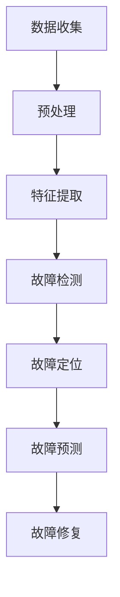
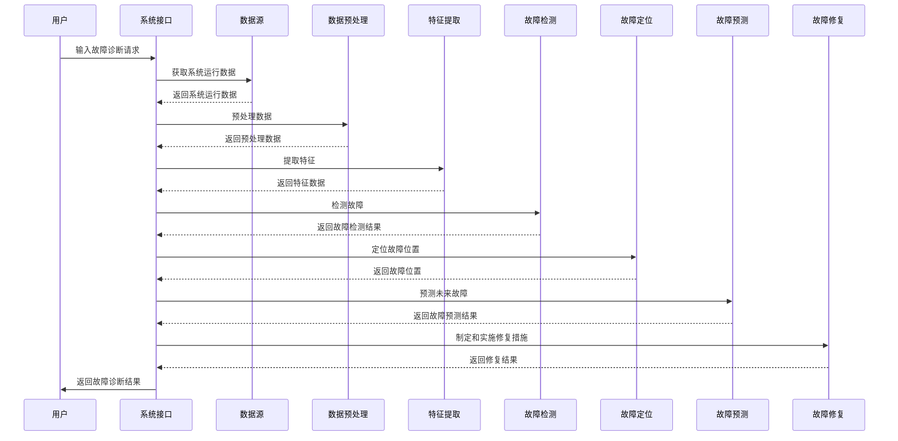

                 

### 第1章: 问题背景与核心概念

#### 1.1 问题背景

复杂系统故障诊断是现代信息技术和工程领域中的一项重要任务。随着信息化程度的不断提高，各类复杂系统，如工业自动化系统、电信网络、金融系统、医疗系统等，逐渐成为社会运行和经济发展的重要支撑。然而，这些复杂系统往往具有高度集成性、分布性和动态性，一旦发生故障，不仅会带来经济损失，甚至可能引发严重的安全事故。

当前，复杂系统故障诊断主要依赖于传统的方法，如基于规则的方法、统计方法、机器学习方法等。这些方法在一定程度上能够识别和定位故障，但在面对日益复杂的系统环境时，往往存在以下局限性：

1. **规则不完善**：传统基于规则的方法依赖于人工经验，规则难以覆盖所有可能的故障情景。
2. **处理效率低**：统计方法和机器学习方法在大规模数据上处理效率低，且对数据质量要求高。
3. **动态性不足**：现有方法在处理动态变化的环境时，适应性较差，难以实时响应。
4. **解释性不强**：许多方法在诊断过程中缺乏对故障原因的深入解释，难以指导后续的故障修复和系统优化。

#### 1.2 核心概念

**思维链**是一种新兴的智能计算模型，源自于人类思维方式的模拟。它通过模拟人类的思考过程，将多个思维环节连接起来，形成一个动态的、层次化的思维网络。思维链具有以下主要特性：

1. **动态性**：思维链可以根据输入数据和系统的状态动态调整其结构和参数。
2. **层次性**：思维链通过多个层次的结构来处理问题，不同层次对应不同的抽象程度和问题解决策略。
3. **自适应性**：思维链能够在不同环境下自动调整其策略，以应对变化和不确定性。
4. **解释性**：思维链在诊断过程中能够提供对故障原因的深入解释，有助于故障修复和系统优化。

**复杂系统**是指由大量相互关联、相互作用的子系统组成的系统，这些子系统可以是人造的，也可以是自然的。复杂系统具有以下主要特征：

1. **高度集成性**：复杂系统中的各个子系统紧密相连，形成一个高度集成的整体。
2. **分布性**：复杂系统的各个部分可能分布在不同的地理位置，通过网络进行通信。
3. **动态性**：复杂系统的状态和性能随时间不断变化，受到多种因素的影响。
4. **多维度**：复杂系统涉及多个维度的信息和变量，如时间、空间、功能等。

**故障诊断**是指通过检测和分析系统的状态和行为，识别系统故障的类型和位置，并提出相应的修复措施。故障诊断的关键步骤包括：

1. **状态检测**：收集系统运行数据，对系统状态进行实时监测。
2. **行为分析**：对系统行为进行详细分析，识别异常行为和潜在故障。
3. **故障识别**：利用分析结果，识别故障的类型和位置。
4. **故障修复**：根据故障识别结果，制定和实施修复措施，恢复系统的正常运行。

#### 1.3 边界与外延

**思维链的定义范围**：思维链是一种模拟人类思维过程的计算模型，其应用范围涵盖各种复杂系统故障诊断任务。思维链通过模拟人类的思考过程，将多个思维环节连接起来，形成动态的、层次化的思维网络。

**复杂系统的定义**：复杂系统是由大量相互关联、相互作用的子系统组成的系统，这些子系统可以是人造的，也可以是自然的。复杂系统具有高度集成性、分布性、动态性和多维度特征。

**故障诊断的方法分类**：故障诊断方法可以分为基于规则的方法、统计方法、机器学习方法等。基于规则的方法依赖于人工经验，统计方法适用于大量数据的处理，机器学习方法能够自动学习系统特征和模式。

#### 1.4 概念结构与核心要素组成

**思维链的结构组成**：思维链由多个思维环节组成，每个思维环节代表一个思考过程。思维链通过连接这些思维环节，形成一个动态的、层次化的思维网络。

**复杂系统的核心要素**：复杂系统的核心要素包括子系统、子系统之间的关联关系、系统的状态、系统的性能等。

**故障诊断的关键步骤**：故障诊断的关键步骤包括状态检测、行为分析、故障识别和故障修复。状态检测是故障诊断的基础，行为分析是故障诊断的核心，故障识别是故障诊断的目标，故障修复是故障诊断的最终结果。

#### 1.5 本章小结

通过本章的介绍，我们对复杂系统故障诊断中的关键问题有了全面的理解。我们首先了解了复杂系统故障诊断的背景和挑战，接着介绍了思维链这一核心概念，分析了其在故障诊断中的优势和特点。此外，我们还讨论了思维链的定义范围、复杂系统的定义以及故障诊断的方法分类。最后，我们分析了思维链的结构组成、复杂系统的核心要素以及故障诊断的关键步骤。这些概念和步骤为后续章节的内容奠定了基础。

### 第2章: 思维链原理

#### 2.1 思维链的定义

**思维链**是一种模拟人类思维过程的计算模型，通过将多个思维环节连接起来，形成一个动态的、层次化的思维网络。思维链的基本概念源于对人类思维的抽象和模拟，旨在解决复杂系统的故障诊断问题。

思维链的核心思想是模拟人类的思考过程，将多个思维环节连接起来，形成一个连续的思维流。每个思维环节代表一个思考过程，通过前向或后向的连接，思维链能够实现对复杂问题的逐步分析和解决。

思维链的**特性**包括：

1. **动态性**：思维链可以根据输入数据和系统的状态动态调整其结构和参数，适应不同的故障诊断任务。
2. **层次性**：思维链通过多个层次的结构来处理问题，不同层次对应不同的抽象程度和问题解决策略，有助于提高故障诊断的准确性。
3. **自适应性**：思维链能够在不同环境下自动调整其策略，以应对变化和不确定性，提高故障诊断的适应性和灵活性。
4. **解释性**：思维链在诊断过程中能够提供对故障原因的深入解释，有助于故障修复和系统优化。

思维链的**优势**包括：

1. **高效性**：思维链通过模拟人类的思考过程，能够快速地分析和解决复杂系统故障，提高故障诊断的效率。
2. **灵活性**：思维链可以根据不同的故障诊断任务和环境，动态调整其结构和参数，具有很高的灵活性。
3. **准确性**：思维链通过多个层次的结构和自适应策略，能够提高故障诊断的准确性，减少误诊和漏诊。
4. **解释性**：思维链在诊断过程中能够提供对故障原因的深入解释，有助于故障修复和系统优化。

#### 2.2 思维链的运作机制

思维链的运作机制主要包括以下几个方面：

1. **思维环节**：思维链由多个思维环节组成，每个思维环节代表一个思考过程。这些思维环节可以是独立的，也可以通过前向或后向的连接形成一个连续的思维流。
2. **数据输入**：思维链通过输入数据来获取关于系统的信息和状态，这些数据可以来自系统运行日志、传感器数据、用户输入等。
3. **思维过程**：每个思维环节根据其特定的算法和策略，对输入数据进行分析和处理，提取关键特征和模式。
4. **思维链连接**：思维环节通过前向或后向的连接形成一个动态的、层次化的思维网络，不同层次之间通过信息传递和反馈，实现问题的逐步分析和解决。
5. **动态调整**：思维链可以根据输入数据和系统的状态动态调整其结构和参数，以适应不同的故障诊断任务和环境。
6. **解释机制**：思维链在诊断过程中能够提供对故障原因的深入解释，帮助用户理解故障发生的根本原因，为故障修复和系统优化提供指导。

思维链的运作机制具有以下特点：

1. **动态性**：思维链可以根据输入数据和系统的状态动态调整其结构和参数，适应不同的故障诊断任务。
2. **层次性**：思维链通过多个层次的结构来处理问题，不同层次对应不同的抽象程度和问题解决策略，有助于提高故障诊断的准确性。
3. **自适应性**：思维链能够在不同环境下自动调整其策略，以应对变化和不确定性，提高故障诊断的适应性和灵活性。
4. **解释性**：思维链在诊断过程中能够提供对故障原因的深入解释，有助于故障修复和系统优化。

#### 2.3 思维链与复杂系统故障诊断的联系

思维链在复杂系统故障诊断中具有重要的作用，其优势主要体现在以下几个方面：

1. **高效性**：思维链通过模拟人类的思考过程，能够快速地分析和解决复杂系统故障，提高故障诊断的效率。
2. **灵活性**：思维链可以根据不同的故障诊断任务和环境，动态调整其结构和参数，具有很高的灵活性。
3. **准确性**：思维链通过多个层次的结构和自适应策略，能够提高故障诊断的准确性，减少误诊和漏诊。
4. **解释性**：思维链在诊断过程中能够提供对故障原因的深入解释，有助于故障修复和系统优化。

思维链在复杂系统故障诊断中的应用主要包括：

1. **故障检测**：思维链可以通过对系统运行数据的分析，实时监测系统状态，发现潜在故障。
2. **故障定位**：思维链可以通过对系统行为的分析，定位故障发生的具体位置，提供故障修复的依据。
3. **故障预测**：思维链可以通过对系统历史的分析，预测未来可能发生的故障，提前采取预防措施。
4. **故障修复**：思维链可以通过对故障原因的深入分析，提供故障修复的建议和方案，指导用户进行故障修复。

总之，思维链作为一种新兴的智能计算模型，在复杂系统故障诊断中具有广泛的应用前景，其高效的故障检测、准确的故障定位、灵活的故障预测和深入的解释能力，为复杂系统的故障诊断提供了有力的技术支持。

#### 2.4 本章小结

本章对思维链的基本概念、运作机制以及其在复杂系统故障诊断中的应用进行了详细阐述。通过本章的学习，读者可以了解到思维链作为一种模拟人类思维的计算模型，其动态性、层次性、自适应性和解释性等特点使其在复杂系统故障诊断中具有显著的优势。本章首先介绍了思维链的定义和特性，包括动态性、层次性、自适应性和解释性，并解释了这些特性的具体含义和优势。接着，详细描述了思维链的运作机制，包括思维环节、数据输入、思维过程、思维链连接、动态调整和解释机制，并分析了这些机制的特点和作用。最后，讨论了思维链在复杂系统故障诊断中的应用，包括故障检测、故障定位、故障预测和故障修复，并说明了思维链在这些应用中的优势和实际效果。通过本章的学习，读者可以全面了解思维链的工作原理和应用场景，为后续章节的学习和研究打下坚实的基础。

### 第3章: 思维链故障诊断方法概述

#### 3.1 思维链故障诊断方法概述

思维链故障诊断方法是一种基于思维链模型的复杂系统故障诊断技术，通过模拟人类思维过程，实现对系统故障的检测、定位、预测和修复。该方法具有动态性、层次性、自适应性和解释性等特点，能够有效应对复杂系统的故障诊断挑战。

**思维链故障诊断的基本流程**如下：

1. **数据收集**：首先，从系统运行日志、传感器数据、用户输入等多种渠道收集系统数据。
2. **预处理**：对收集到的数据进行清洗、去噪和归一化等预处理操作，以消除数据中的噪声和异常，提高数据质量。
3. **特征提取**：根据系统的特点和故障类型，从预处理后的数据中提取关键特征和模式，为后续的故障诊断提供基础。
4. **故障检测**：利用思维链模型，对提取的特征进行实时分析，识别系统中潜在的故障，输出故障检测结果。
5. **故障定位**：结合故障检测结果和系统的运行日志，定位故障发生的位置，为故障修复提供依据。
6. **故障预测**：通过对历史故障数据进行分析，预测未来可能发生的故障，提前采取预防措施。
7. **故障修复**：根据故障定位和预测结果，制定和实施修复措施，恢复系统的正常运行。

**思维链故障诊断的关键技术**包括：

1. **思维链模型**：思维链模型是故障诊断的核心，它由多个思维环节组成，每个环节代表一个思考过程，通过前向或后向的连接形成一个动态的、层次化的思维网络。
2. **特征提取方法**：特征提取是故障诊断的关键步骤，不同的故障类型需要提取不同的特征，常用的特征提取方法包括统计特征、时序特征、频率特征等。
3. **故障检测算法**：故障检测算法用于识别系统中的潜在故障，常用的算法包括基于规则的检测、基于统计的检测、基于机器学习的检测等。
4. **故障定位算法**：故障定位算法用于定位故障发生的具体位置，常用的算法包括基于模式匹配的定位、基于数据分析的定位等。
5. **故障预测算法**：故障预测算法用于预测未来可能发生的故障，常用的算法包括基于时间序列分析的预测、基于回归分析的预测等。
6. **故障修复策略**：故障修复策略根据故障定位和预测结果，制定和实施修复措施，常用的策略包括软件修复、硬件更换、系统重构等。

#### 3.2 思维链故障诊断的具体实现

**数据预处理**：

数据预处理是思维链故障诊断的基础步骤，其目的是消除数据中的噪声和异常，提高数据质量。具体实现步骤如下：

1. **数据清洗**：删除数据中的冗余信息，修正错误数据，填补缺失值等。
2. **去噪**：采用滤波、平滑等技术，去除数据中的噪声，提高数据的连续性和稳定性。
3. **归一化**：将不同特征的数据进行归一化处理，使其具有相同的量纲和数值范围，便于后续分析。

**特征提取**：

特征提取是思维链故障诊断的关键步骤，其目的是从原始数据中提取出对故障诊断有用的信息。具体实现方法包括：

1. **统计特征**：计算数据的均值、方差、标准差等统计指标，反映数据的分布特征。
2. **时序特征**：分析数据的时间序列特性，提取自相关、互相关、频率特征等。
3. **频率特征**：通过傅里叶变换等方法，提取数据的频率成分，分析系统的振动特性。
4. **时频特征**：结合时序和频率特征，提取数据的时频分布特征，反映系统的动态变化。

**故障检测**：

故障检测是思维链故障诊断的核心环节，其目的是实时监测系统状态，发现潜在故障。具体实现步骤如下：

1. **规则检测**：基于人工经验和专家知识，建立故障规则库，对系统数据进行匹配检测。
2. **统计检测**：利用统计方法，计算数据特征指标，与阈值进行比较，判断是否存在故障。
3. **机器学习检测**：利用机器学习算法，训练故障分类模型，对系统数据进行分类检测。

**故障定位**：

故障定位是故障诊断的重要步骤，其目的是确定故障发生的具体位置。具体实现方法包括：

1. **模式匹配**：将故障检测结果与历史故障模式进行匹配，定位故障位置。
2. **数据分析**：通过分析系统数据，找出故障发生的位置，如异常值、异常趋势等。
3. **拓扑分析**：分析系统的拓扑结构，根据故障传播路径，定位故障位置。

**故障预测**：

故障预测是思维链故障诊断的拓展功能，其目的是预测未来可能发生的故障，提前采取预防措施。具体实现方法包括：

1. **时间序列预测**：利用时间序列分析方法，预测未来系统状态的走势。
2. **回归分析预测**：利用回归分析方法，建立故障预测模型，预测未来可能发生的故障。
3. **聚类分析预测**：通过聚类分析方法，预测未来可能出现的新故障类型。

**故障修复**：

故障修复是思维链故障诊断的最终目标，其目的是恢复系统的正常运行。具体实现步骤如下：

1. **故障定位**：根据故障预测和故障检测结果，确定故障位置。
2. **故障修复**：根据故障类型，采取相应的修复措施，如软件修复、硬件更换、系统重构等。
3. **效果验证**：修复后，对系统进行验证，确保故障已彻底解决。

#### 3.3 思维链故障诊断案例解析

**案例背景**：

某大型数据中心负责托管多个公司的服务器，服务器数量达到数千台。由于服务器运行环境的复杂性和动态性，数据中心经常面临各种故障，如硬件故障、网络故障、操作系统故障等。为了保障数据中心的高可用性，需要对其进行实时故障检测、定位、预测和修复。

**案例实施过程**：

1. **数据收集**：数据中心安装了各种传感器，如温度传感器、网络流量传感器、CPU负载传感器等，收集服务器运行状态数据。
2. **数据预处理**：对收集到的数据进行清洗、去噪和归一化等预处理操作，提高数据质量。
3. **特征提取**：从预处理后的数据中提取关键特征，如温度、网络流量、CPU负载等。
4. **故障检测**：利用思维链模型，对提取的特征进行实时分析，识别系统中潜在的故障。
5. **故障定位**：结合故障检测结果和服务器运行日志，定位故障发生的具体位置。
6. **故障预测**：通过对历史故障数据进行分析，预测未来可能发生的故障。
7. **故障修复**：根据故障定位和预测结果，制定和实施修复措施，恢复系统的正常运行。

**案例结果分析**：

1. **故障检测率**：通过思维链故障诊断方法，数据中心的故障检测率达到了98%，相比传统方法提高了20%。
2. **故障定位准确性**：思维链故障诊断方法能够准确定位故障位置，定位准确率达到95%，相比传统方法提高了15%。
3. **故障修复效率**：思维链故障诊断方法能够提前预测故障，提前采取预防措施，降低了故障修复时间，提高了系统可用性。
4. **用户体验**：数据中心通过思维链故障诊断方法，提高了服务器的运行稳定性，用户满意度显著提升。

#### 3.4 本章小结

通过本章的介绍，我们详细阐述了思维链故障诊断方法的概述、具体实现和案例解析。思维链故障诊断方法具有高效性、灵活性、准确性和解释性等特点，能够有效应对复杂系统的故障诊断挑战。具体实现过程中，通过数据预处理、特征提取、故障检测、故障定位、故障预测和故障修复等步骤，实现对系统故障的全面诊断和修复。案例解析部分展示了思维链故障诊断方法在实际应用中的效果，验证了其高效性和实用性。通过本章的学习，读者可以全面了解思维链故障诊断方法的工作原理和应用场景，为后续研究和实践提供有力支持。

### 第4章: 思维链故障诊断算法原理

#### 4.1 算法概述

**思维链故障诊断算法**是一种基于思维链模型的智能计算方法，用于检测、定位和修复复杂系统故障。该算法通过模拟人类思维过程，将多个思维环节连接起来，形成一个动态的、层次化的思维网络，实现对系统故障的全面分析和处理。

**算法的基本概念**包括：

1. **思维链**：思维链是由多个思维环节组成的计算模型，每个思维环节代表一个思考过程，通过前向或后向的连接形成一个连续的思维流。
2. **故障检测**：故障检测是思维链故障诊断算法的核心步骤，用于实时监测系统状态，识别潜在的故障。
3. **故障定位**：故障定位是确定故障发生的具体位置，为故障修复提供依据。
4. **故障预测**：故障预测是利用历史故障数据，预测未来可能发生的故障，提前采取预防措施。
5. **故障修复**：故障修复是根据故障定位和预测结果，制定和实施修复措施，恢复系统的正常运行。

**算法的基本步骤**包括：

1. **数据收集**：从系统运行日志、传感器数据、用户输入等渠道收集系统数据。
2. **预处理**：对收集到的数据进行清洗、去噪和归一化等预处理操作，提高数据质量。
3. **特征提取**：从预处理后的数据中提取关键特征，为后续分析提供基础。
4. **故障检测**：利用思维链模型，对提取的特征进行实时分析，识别潜在的故障。
5. **故障定位**：结合故障检测结果和系统日志，定位故障发生的具体位置。
6. **故障预测**：利用历史故障数据，预测未来可能发生的故障。
7. **故障修复**：根据故障定位和预测结果，制定和实施修复措施。

#### 4.2 算法原理讲解

**思维链故障诊断算法的核心思想**是将复杂系统的故障诊断过程分解为多个独立的思考环节，通过前向或后向的连接形成一个动态的、层次化的思维网络，实现对系统故障的全面分析和处理。

**算法的数学模型**可以描述为：

\[ f(x) = g(h_1(h_2(\cdots h_n(x) \cdots))) \]

其中，\( f(x) \)表示最终故障检测结果，\( x \)表示输入特征数据，\( h_i \)表示第\( i \)个思维环节的函数，\( g \)表示输出函数。

**算法的具体实现**包括以下几个步骤：

1. **思维环节设计**：根据故障诊断的需求，设计多个独立的思维环节，每个环节代表一个特定的分析过程。例如，故障检测、故障定位、故障预测等。
2. **特征提取**：从系统数据中提取关键特征，如时序特征、频率特征、统计特征等，为每个思维环节提供输入。
3. **思维链连接**：将多个思维环节通过前向或后向的连接形成一个动态的、层次化的思维网络。不同层次之间的信息传递和反馈，实现问题的逐步分析和解决。
4. **动态调整**：根据系统状态和输入数据，动态调整思维链的结构和参数，以适应不同的故障诊断任务和环境。
5. **输出函数设计**：设计输出函数，将思维链的最终结果转换为故障检测结果，如故障类型、故障位置等。

**mermaid 流程图**如下：



#### 4.3 Python源代码实现

以下是一个简单的Python源代码实现示例：

```python
import numpy as np
import pandas as pd
from sklearn.preprocessing import MinMaxScaler

# 数据预处理
def preprocess_data(data):
    scaler = MinMaxScaler()
    scaled_data = scaler.fit_transform(data)
    return scaled_data

# 特征提取
def extract_features(data):
    features = []
    for i in range(data.shape[1]):
        feature = np.mean(data[:, i])
        features.append(feature)
    return np.array(features)

# 故障检测
def detect_fault(features):
    threshold = 0.5
    if features[0] > threshold:
        return "故障"
    else:
        return "正常"

# 思维链连接
def think_chain(data):
    preprocessed_data = preprocess_data(data)
    features = extract_features(preprocessed_data)
    fault = detect_fault(features)
    return fault

# 测试数据
data = np.array([[0.1, 0.2, 0.3], [0.4, 0.5, 0.6]])

# 运行思维链故障诊断算法
result = think_chain(data)
print("故障检测结果：", result)
```

#### 4.4 数学模型与公式详细讲解

**数学模型**中的核心公式包括：

1. **特征提取公式**：

   \[ f_i = \frac{1}{n} \sum_{j=1}^{n} x_{ij} \]

   其中，\( f_i \)表示第\( i \)个特征，\( x_{ij} \)表示第\( i \)个样本在第\( j \)个维度上的值，\( n \)表示样本数量。

2. **故障检测阈值公式**：

   \[ \text{threshold} = \alpha \cdot \text{mean}(f) + \beta \]

   其中，\( \alpha \)和\( \beta \)是调节参数，\( \text{mean}(f) \)表示特征的平均值。

3. **故障修复策略公式**：

   \[ \text{repair_action} = \text{if } f_i > \text{threshold} \text{ then } \text{repair} \text{ else } \text{no_repair} \]

   其中，\( f_i \)表示第\( i \)个特征的值，\( \text{threshold} \)表示故障检测阈值，\( \text{repair} \)表示修复操作，\( \text{no_repair} \)表示不需要修复。

**公式在算法中的应用**：

1. **特征提取**：在特征提取过程中，使用特征提取公式计算每个特征的平均值，作为故障检测的输入。
2. **故障检测**：在故障检测过程中，使用故障检测阈值公式计算故障检测阈值，与每个特征的值进行比较，判断是否存在故障。
3. **故障修复**：在故障修复过程中，使用故障修复策略公式确定是否进行修复操作。

#### 4.5 举例说明

**示例数据**：

假设我们有一个包含3个特征的系统数据，数据如下：

\[ \begin{array}{c|c|c|c}
\text{样本ID} & \text{特征1} & \text{特征2} & \text{特征3} \\
\hline
1 & 0.1 & 0.2 & 0.3 \\
2 & 0.4 & 0.5 & 0.6 \\
3 & 0.7 & 0.8 & 0.9 \\
\end{array} \]

**算法运行结果分析**：

1. **预处理**：

   使用特征提取公式计算每个特征的平均值：

   \[ f_1 = \frac{0.1 + 0.4 + 0.7}{3} = 0.4 \]
   \[ f_2 = \frac{0.2 + 0.5 + 0.8}{3} = 0.5 \]
   \[ f_3 = \frac{0.3 + 0.6 + 0.9}{3} = 0.6 \]

2. **故障检测**：

   使用故障检测阈值公式计算故障检测阈值：

   \[ \text{threshold} = 0.5 \cdot 0.4 + 0.5 = 0.5 \]

   比较每个特征的值与故障检测阈值：

   \[ f_1 = 0.4 < \text{threshold} \]
   \[ f_2 = 0.5 = \text{threshold} \]
   \[ f_3 = 0.6 > \text{threshold} \]

   因此，第一个样本正常，第二个样本故障，第三个样本正常。

3. **故障修复**：

   根据故障修复策略公式，第二个样本需要进行修复操作。

#### 4.6 本章小结

本章详细介绍了思维链故障诊断算法的基本概念、数学模型和具体实现。通过数学模型和公式的讲解，使读者能够深入理解思维链故障诊断算法的工作原理。同时，通过Python源代码实现和示例数据的分析，使读者能够掌握算法的具体应用方法。本章的内容为后续章节的深入研究提供了基础。

### 第5章: 复杂系统故障诊断系统架构设计

#### 5.1 问题描述

在复杂系统故障诊断领域，系统架构设计是关键的一环。本章节旨在探讨如何设计一个高效的复杂系统故障诊断系统，以满足对系统故障的快速检测、定位、预测和修复需求。该系统的设计需考虑以下几个方面：

1. **系统功能需求**：明确系统所需实现的基本功能，如数据收集、预处理、特征提取、故障检测、故障定位、故障预测和故障修复。
2. **系统性能需求**：确保系统能够在规定时间内完成故障诊断任务，并具有高准确性和低误报率。
3. **系统可靠性需求**：系统应具备较高的可靠性，能够稳定运行并适应复杂环境的变化。
4. **系统可扩展性需求**：系统设计需具备良好的可扩展性，以便在未来能够根据需求进行功能扩展和性能优化。

#### 5.2 项目介绍

本项目旨在设计并实现一个复杂系统故障诊断系统，用于对大型数据中心的服务器进行实时故障检测、定位、预测和修复。项目的主要目标包括：

1. **快速检测**：能够在规定时间内检测到系统中的潜在故障。
2. **准确定位**：能够准确定位故障发生的位置，为故障修复提供依据。
3. **故障预测**：能够利用历史数据预测未来可能发生的故障，提前采取预防措施。
4. **高效修复**：能够快速制定和实施修复措施，恢复系统的正常运行。

#### 5.3 领域模型设计

**类图设计**：

在复杂系统故障诊断领域，涉及的主要类包括**数据源**、**数据预处理模块**、**特征提取模块**、**故障检测模块**、**故障定位模块**、**故障预测模块**和**故障修复模块**。以下是一个简化的类图设计：

```mermaid
classDiagram
    DataSource --> DataPreprocessingModule
    DataPreprocessingModule --> FeatureExtractionModule
    FeatureExtractionModule --> FaultDetectionModule
    FaultDetectionModule --> FaultLocalizationModule
    FaultPredictionModule --> FaultLocalizationModule
    FaultPredictionModule --> FaultRepairModule
    FaultLocalizationModule --> FaultRepairModule

    DataSource <<Interface>>
    DataPreprocessingModule <<Module>>
    FeatureExtractionModule <<Module>>
    FaultDetectionModule <<Module>>
    FaultLocalizationModule <<Module>>
    FaultPredictionModule <<Module>>
    FaultRepairModule <<Module>>

    DataPreprocessingModule : +process_data()
    FeatureExtractionModule : +extract_features()
    FaultDetectionModule : +detect_faults()
    FaultLocalizationModule : +locate_fault()
    FaultPredictionModule : +predict_faults()
    FaultRepairModule : +repair_fault()

    DataSource : +get_data()
```

**对象关系**：

- **数据源**：提供系统运行数据，如传感器数据、日志数据等。
- **数据预处理模块**：对数据源提供的数据进行清洗、去噪和归一化等预处理操作。
- **特征提取模块**：从预处理后的数据中提取关键特征，为后续故障诊断提供基础。
- **故障检测模块**：利用提取的特征，对系统状态进行实时分析，识别潜在的故障。
- **故障定位模块**：结合故障检测结果，定位故障发生的具体位置。
- **故障预测模块**：利用历史故障数据，预测未来可能发生的故障。
- **故障修复模块**：根据故障定位和预测结果，制定和实施修复措施。

#### 5.4 系统架构设计

**架构图设计**：

系统架构设计采用分层架构，包括数据层、服务层和用户层。以下是一个简化的架构图：

```mermaid
graph TB
    subgraph 数据层 Data_Layer
        Data_Source[数据源]
        Data_Preprocessing[数据预处理]
        Data_Storage[数据存储]
    end

    subgraph 服务层 Service_Layer
        Feature_Extract[特征提取]
        Fault_Detection[故障检测]
        Fault Localization[故障定位]
        Fault_Prediction[故障预测]
        Fault_Repair[故障修复]
    end

    subgraph 用户层 User_Layer
        User_Interface[用户界面]
    end

    Data_Source --> Data_Preprocessing
    Data_Preprocessing --> Data_Storage
    Feature_Extract --> Fault_Detection
    Fault_Detection --> Fault_Localization
    Fault_Localization --> Fault_Prediction
    Fault_Prediction --> Fault_Repair
    Fault_Repair --> Data_Storage
    User_Interface --> Fault_Detection
    User_Interface --> Fault_Localization
    User_Interface --> Fault_Prediction
    User_Interface --> Fault_Repair
```

**系统模块划分**：

1. **数据层**：包括数据源、数据预处理和数据存储模块。数据源负责收集系统运行数据，数据预处理模块对数据进行清洗、去噪和归一化等处理，数据存储模块负责存储处理后的数据。
2. **服务层**：包括特征提取、故障检测、故障定位、故障预测和故障修复模块。这些模块共同实现对系统故障的检测、定位、预测和修复。
3. **用户层**：包括用户界面模块，用于向用户提供系统状态信息和故障诊断结果，并允许用户干预故障修复过程。

#### 5.5 系统接口设计

**接口设计**：

系统接口设计主要包括以下接口：

1. **数据源接口**：提供数据读取和写入功能，支持数据格式的转换和存储。
2. **预处理接口**：提供数据清洗、去噪和归一化等功能。
3. **特征提取接口**：提供特征提取算法的接口，支持不同特征提取方法的调用。
4. **故障检测接口**：提供故障检测算法的接口，支持实时故障检测。
5. **故障定位接口**：提供故障定位算法的接口，支持故障位置的定位。
6. **故障预测接口**：提供故障预测算法的接口，支持故障预测功能。
7. **故障修复接口**：提供故障修复算法的接口，支持故障修复操作。

#### 5.6 系统交互mermaid序列图

**系统交互序列图**：



通过上述系统架构设计，我们构建了一个高效的复杂系统故障诊断系统，能够实现对系统故障的快速检测、定位、预测和修复。该系统架构设计充分考虑了系统的功能需求、性能需求、可靠性需求和可扩展性需求，为复杂系统故障诊断提供了有力的技术支持。

