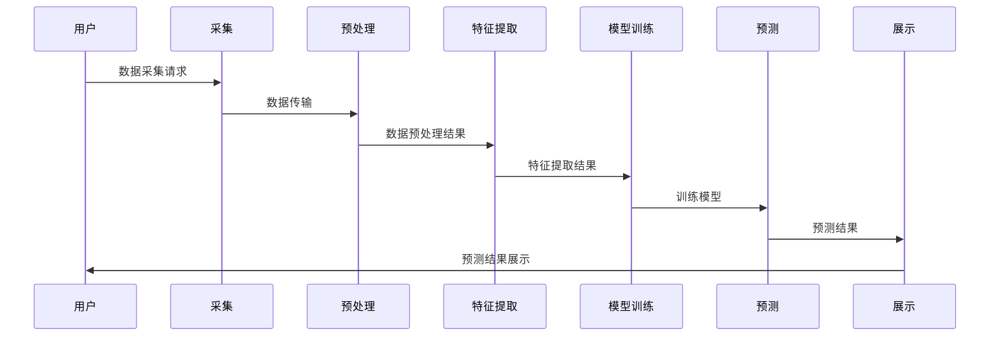

                 

## 引言与背景

### 1.1 问题的背景

在现代信息化社会中，复杂系统无处不在，从互联网基础设施到金融交易系统，再到航空航天和医疗设备，复杂系统的可靠性和稳定性直接关系到整个社会的正常运转。然而，随着系统规模的不断扩大和复杂度的增加，系统故障的风险也随之上升。传统的方法在处理这类问题时往往显得力不从心，主要原因有以下几点：

1. **数据的复杂性**：复杂系统通常会产生海量的数据，这些数据具有多维性、时序性和动态性，使得数据处理的难度大大增加。
2. **系统的非线性**：许多复杂系统具有非线性特性，这意味着系统的行为难以用简单的线性模型来描述，这给故障预测带来了极大的挑战。
3. **模型的可解释性**：传统预测模型如ARIMA、SARIMA等，虽然能在一定程度上预测系统的行为，但是它们的预测结果往往缺乏可解释性，这使得在实际应用中难以被广泛接受。

### 1.1.1 复杂系统在现代社会的应用

复杂系统在现代社会的应用极为广泛，以下是一些典型的应用场景：

- **互联网**：随着互联网的普及，各种复杂的网络系统如搜索引擎、社交网络、在线支付等不断涌现，这些系统的稳定性和安全性至关重要。
- **金融**：金融行业中的交易系统、风险管理系统、信用评估系统等都是复杂的系统，任何故障都可能导致巨大的经济损失。
- **工业**：工业控制系统、智能制造系统等在提高生产效率、降低成本、确保产品质量方面发挥着关键作用。
- **交通**：交通管理系统、导航系统、公共交通系统等对于确保交通流畅、减少拥堵具有重要意义。
- **医疗**：医疗设备、医疗信息系统等对于患者的健康和生命安全至关重要。

### 1.1.2 系统故障的负面影响

系统故障可能带来严重的负面影响，包括但不限于以下几点：

- **经济损失**：系统故障可能导致生产停止、交易中断，进而造成巨大的经济损失。
- **社会影响**：关键系统的故障可能影响社会正常运行，如交通拥堵、金融交易中断等。
- **安全风险**：在某些领域，如航空航天、医疗设备等，系统故障可能直接威胁到人的生命安全。
- **信誉损失**：频繁的系统故障会损害企业的信誉，影响企业的长期发展。

### 1.1.3 当前故障预测方法的局限性

目前，常用的故障预测方法主要基于统计学习和机器学习技术，尽管这些方法在某种程度上能够预测系统的行为，但仍然存在一些局限性：

- **数据依赖性**：许多故障预测方法需要大量历史数据作为训练数据，这在数据稀缺的情况下难以应用。
- **模型复杂度**：一些高级模型如深度学习模型虽然预测性能较好，但训练过程复杂、参数众多，需要大量的计算资源。
- **可解释性**：许多机器学习模型如神经网络等在预测性能上表现出色，但预测结果缺乏可解释性，难以理解模型的决策过程。
- **适应性**：传统故障预测方法通常针对特定类型的系统设计，难以适应不同类型的复杂系统。

### 1.2 研究目的与内容概述

本研究的目的是探索一种新的方法——思维链在复杂系统故障预测中的应用，以期提高故障预测的准确性、可解释性和适应性。具体研究内容包括：

- **思维链的基本概念**：介绍思维链的定义、理论基础和优势，以及其在故障预测中的应用。
- **复杂系统的基本原理**：阐述复杂系统的定义、特性以及建模方法，为后续研究提供理论基础。
- **思维链在故障预测中的应用**：详细探讨思维链在故障预测中的原理、流程和优势。
- **数学模型和算法实现**：介绍思维链故障预测的数学模型和算法实现，包括算法原理、实现细节和性能分析。
- **系统架构设计**：设计思维链故障预测系统的架构，包括系统功能设计、接口设计和交互设计。
- **项目实战**：通过实际项目展示思维链故障预测的应用效果，分析实际案例，并提出改进建议。

### 1.2.1 研究目的

本研究的主要目的是：

- **提高故障预测的准确性**：通过引入思维链方法，提高复杂系统故障预测的准确性，降低系统故障的风险。
- **增强故障预测的可解释性**：提供一种可解释的故障预测方法，帮助用户理解故障预测的结果和决策过程。
- **提高故障预测的适应性**：使故障预测方法能够适应不同类型的复杂系统，提高方法的通用性。

### 1.2.2 内容概述

本书将分为两个主要部分：

- **第一部分：理论基础**：包括思维链的基本概念、复杂系统的基本原理、思维链在故障预测中的应用等，为后续研究提供理论基础。
- **第二部分：应用实践**：包括数学模型和算法实现、系统架构设计、项目实战等，展示思维链在复杂系统故障预测中的实际应用。

### 1.2.3 本书结构安排

本书的结构安排如下：

- **第一部分：引言与背景**：介绍复杂系统故障预测的重要性、研究目的和内容概述。
- **第二部分：思维链的基本概念**：介绍思维链的定义、理论基础和应用领域。
- **第三部分：复杂系统的基本原理**：阐述复杂系统的定义、特性和建模方法。
- **第四部分：思维链在故障预测中的应用**：详细探讨思维链在故障预测中的原理、流程和优势。
- **第五部分：数学模型和算法实现**：介绍思维链故障预测的数学模型和算法实现。
- **第六部分：系统架构设计**：设计思维链故障预测系统的架构。
- **第七部分：项目实战**：通过实际项目展示思维链故障预测的应用效果。

## 第2章 思维链的基本概念

### 2.1 思维链的定义

思维链（Thinking Chain）是一种基于人工智能和认知科学的预测和决策方法。它通过模拟人类思维过程，将多个思维节点链接起来，形成一条逻辑清晰、层次分明的思维链条。每个思维节点代表一个独立的思考过程，节点之间的关系则反映了这些思考过程之间的逻辑关系。

### 2.1.1 思维链的概念

思维链的核心概念包括以下几个方面：

1. **思维节点**：思维链的基本组成单位，每个节点代表一个独立的思考过程，如问题分析、数据收集、模型建立等。
2. **逻辑关系**：节点之间的关系，包括因果关系、条件关系、并列关系等，这些关系决定了思维链的流动方向。
3. **层次结构**：思维链具有层次结构，从顶层到底层，每个层次代表不同的抽象程度和思考深度。

### 2.1.2 思维链的特征

思维链具有以下显著特征：

1. **自适应性**：思维链可以根据问题的复杂度和数据特点自动调整节点数量和逻辑关系，具有很强的适应性。
2. **灵活性**：思维链允许用户自定义节点和关系，能够灵活地应对各种复杂问题。
3. **可解释性**：思维链的每个节点和关系都是明确的，使得预测结果易于理解，有助于用户接受和信任。
4. **扩展性**：思维链能够方便地扩展和修改，以适应新的问题和需求。

### 2.2 思维链的理论基础

思维链的理论基础涵盖了多个学科领域，包括人工智能、认知科学、逻辑学等。

1. **人工智能**：思维链借鉴了人工智能中的知识表示和推理方法，通过构建知识库和推理机制来模拟人类思维过程。
2. **认知科学**：认知科学提供了对人类思维过程的理解和解释，为思维链的设计和实现提供了理论支持。
3. **逻辑学**：逻辑学为思维链的构建提供了严格的逻辑基础，确保思维链的逻辑关系正确无误。

### 2.2.1 相关理论基础

以下是思维链相关的几个关键理论基础：

1. **知识表示**：知识表示是思维链的基础，它包括概念、事实、规则等，用于描述问题的各个方面。
2. **推理机制**：推理机制用于在知识库中推导出新的结论，包括演绎推理、归纳推理、类比推理等。
3. **模式识别**：模式识别用于从数据中提取规律和模式，为思维链提供数据支持和决策依据。
4. **神经网络**：神经网络是思维链的一个重要工具，用于模拟复杂的非线性关系和自适应学习。

### 2.2.2 思维链的优势

思维链在故障预测中具有以下优势：

1. **高效性**：思维链能够快速处理大量数据，并生成准确的预测结果，提高了故障预测的效率。
2. **准确性**：思维链通过模拟人类思维过程，能够捕捉到数据中的复杂关系，提高故障预测的准确性。
3. **灵活性**：思维链能够灵活地应对各种复杂问题，包括不确定性和动态变化。
4. **可解释性**：思维链的每个节点和关系都是明确的，使得预测结果易于理解，有助于用户接受和信任。
5. **适应性**：思维链能够根据问题的复杂度和数据特点自动调整，具有很强的适应性。

### 2.3 思维链的应用领域

思维链在多个领域展现了其强大的应用潜力，以下是几个典型的应用领域：

1. **故障预测**：思维链可以用于复杂系统的故障预测，如工业系统、航空航天系统、医疗设备等。
2. **风险控制**：思维链可以用于金融系统的风险控制，如交易系统、风险管理、信用评估等。
3. **决策支持**：思维链可以用于提供决策支持，如供应链管理、资源分配、项目管理等。
4. **智能推荐**：思维链可以用于智能推荐系统，如搜索引擎、电子商务、社交媒体等。
5. **教育辅导**：思维链可以用于教育辅导系统，帮助学生进行问题分析和解决。

## 第3章 复杂系统的基本原理

### 3.1 复杂系统的定义

复杂系统是由大量相互作用的组成部分组成的系统，这些组成部分可以通过复杂的相互作用产生出系统的整体行为，这种整体行为通常难以从单个组成部分的行为来简单预测或理解。复杂系统的研究起源于物理学、生物学、社会学等学科，随着计算机科学和系统科学的发展，复杂系统的定义和范畴也在不断扩展。

### 3.1.1 复杂系统的概念

复杂系统的概念可以从以下几个方面来理解：

1. **组成成分的多样性**：复杂系统由不同类型的组件组成，这些组件可以是物理实体、组织结构或抽象概念。
2. **相互作用复杂性**：组成成分之间的相互作用可以是线性的、非线性的，或者是非确定性的，这种复杂性使得系统的整体行为难以预测。
3. **层次结构**：复杂系统通常具有多层次结构，从微观层面到宏观层面，每个层次都有其独特的属性和功能。
4. **动态性**：复杂系统是动态的，其行为会随着时间、环境和其他系统因素的影响而变化。

### 3.1.2 复杂系统的分类

复杂系统可以根据不同的标准进行分类，以下是一些常见的分类方法：

1. **按系统性质分类**：可以分为确定性复杂系统和随机性复杂系统，前者遵循确定性的物理定律，后者则受到随机性的影响。
2. **按系统规模分类**：可以分为小规模复杂系统和大规模复杂系统，前者如城市交通系统，后者如全球气候系统。
3. **按系统应用领域分类**：可以分为自然复杂系统（如生态系统、大脑网络）、人工复杂系统（如社会网络、计算机网络）和技术复杂系统（如工业制造系统、航空航天系统）。

### 3.2 复杂系统的特性

复杂系统具有以下主要特性：

1. **非线性和非确定性**：复杂系统的行为通常是高度非线性和非确定性的，这意味着系统的整体行为不能仅通过观察其组成部分的行为来预测。
2. **自组织和自适应**：复杂系统往往具有自组织特性，能够在没有外部指令的情况下自我组织，并且能够根据环境变化进行自适应调整。
3. **层次结构**：复杂系统具有多层次结构，每个层次都有其特定的属性和功能，这些层次之间相互作用，共同决定系统的整体行为。
4. **涌现性**：复杂系统的一个关键特性是涌现性，即系统整体行为和属性不能简单地从其组成部分的行为和属性中推导出来。
5. **复杂反馈**：复杂系统内部存在复杂的反馈机制，这些反馈机制可以是正反馈或负反馈，它们决定了系统行为的稳定性和动态性。

### 3.2.1 系统复杂性

系统复杂性是指复杂系统的特性、行为和相互作用之间的复杂程度。系统复杂性可以从多个维度进行度量：

1. **结构复杂性**：系统组成部分的数量和相互作用的复杂程度。
2. **动态复杂性**：系统行为的动态变化规律和趋势。
3. **功能复杂性**：系统功能的多样性和集成程度。
4. **信息复杂性**：系统内部信息传输和处理过程的复杂性。

### 3.2.2 非线性动力学

非线性动力学是复杂系统研究中的一个重要方面，因为许多复杂系统的行为都受到非线性动力学规律的影响。非线性动力学的主要特点包括：

1. **分岔现象**：系统行为在参数变化时会出现突然的、不可预测的变化，这种现象称为分岔。
2. **混沌现象**：在非线性系统中，即使初始条件有微小的变化，系统的长期行为也可能出现巨大的差异，这种现象称为混沌。
3. **多稳态**：非线性系统可能具有多个稳定的平衡状态，这些状态之间的切换可能导致系统行为的突变。

### 3.2.3 系统间的相互作用

复杂系统之间的相互作用是复杂系统行为的一个重要来源。这些相互作用可以是直接的，也可以是间接的，以下是几种常见的相互作用方式：

1. **竞争和协同**：系统组成部分之间的竞争和协同作用可以影响系统的整体行为。
2. **信息传递**：系统之间通过信息传递进行相互作用，例如，社会经济系统中的信息流动可以影响金融市场的稳定性。
3. **能量交换**：系统之间的能量交换可以导致系统的动态行为发生变化。
4. **物质流动**：在生态系统或工业系统中，物质流动是系统间相互作用的重要方面。

### 3.3 复杂系统建模方法

复杂系统的建模方法旨在捕捉系统的复杂性、相互作用和动态特性。以下是几种常用的复杂系统建模方法：

1. **统计分析方法**：如回归分析、时间序列分析等，用于捕捉系统行为的一般趋势和规律。
2. **物理模型**：基于物理定律建立的模型，如热力学模型、流体动力学模型等，用于描述系统的物理过程。
3. **计算机模拟**：通过计算机模拟来模拟复杂系统的行为，如 agent-based model（基于代理的模型）、多体动力学模型等。
4. **人工智能方法**：如机器学习、深度学习等，用于从数据中学习系统的复杂模式和规律。

### 3.3.1 经典建模方法

经典建模方法包括以下几种：

1. **系统动力学模型**：用于描述系统随时间变化的动态过程，如差分方程、微分方程等。
2. **统计物理模型**：如相变理论、临界现象理论等，用于描述系统的临界行为和相变过程。
3. **网络模型**：如小世界网络、无标度网络等，用于描述系统组成部分之间的相互作用和网络结构。
4. **混沌理论**：用于研究系统的混沌行为和分岔现象，如洛伦兹系统、Rossler系统等。

### 3.3.2 新兴建模方法

新兴建模方法包括以下几种：

1. **机器学习方法**：如深度学习、强化学习等，用于从数据中自动学习系统的复杂模式和规律。
2. **复杂网络方法**：如社区检测、网络科学等，用于分析系统组成部分之间的复杂网络结构和相互作用。
3. **代理模型**：如物理代理模型、经济代理模型等，用于模拟系统组成部分的行为和相互作用。
4. **多尺度建模方法**：如多尺度模拟、多尺度建模等，用于描述系统的不同尺度和层次上的行为。

## 第4章 思维链在故障预测中的原理

### 4.1 思维链与故障预测的关系

思维链（Thinking Chain）作为一种创新的预测方法，其核心在于通过模拟人类思维过程来提高故障预测的准确性和可解释性。思维链与故障预测之间的关系可以从以下几个方面来理解：

1. **思维链的引入**：传统的故障预测方法通常依赖于历史数据和统计模型，这些方法在处理简单问题时可能效果良好，但在面对复杂系统时，往往难以捕捉到系统内部的复杂关系和非线性特性。思维链的引入，为故障预测提供了一种全新的思路，通过模拟人类思维过程，能够更好地理解系统的复杂行为。

2. **提高预测准确性**：思维链通过构建多个思维节点，形成一条逻辑清晰、层次分明的思维链条，每个节点代表对系统不同层面的分析和理解。这种方法能够捕捉到系统内部的复杂关系和潜在故障信号，从而提高故障预测的准确性。

3. **增强可解释性**：思维链的每个节点和节点之间的关系都是明确的，这使得预测结果具有很高的可解释性。用户可以清晰地理解预测过程中的每一步，从而增强对预测结果的信任和接受度。

4. **适应复杂系统**：思维链具有很好的适应性，能够根据问题的复杂度和数据特点自动调整节点数量和逻辑关系。这使得思维链在处理各种复杂系统时，能够灵活应对不同的需求和情境。

### 4.2 思维链故障预测的基本流程

思维链故障预测的基本流程可以分为以下几个步骤：

1. **问题定义**：明确故障预测的目标系统，包括系统类型、规模、运行环境等，以及需要预测的故障类型。

2. **数据采集**：收集与故障预测相关的数据，包括历史故障数据、运行数据、环境数据等。数据质量对预测结果的准确性至关重要，因此需要确保数据的有效性和完整性。

3. **特征提取**：从原始数据中提取有助于故障预测的特征，如时间序列特征、统计特征、模式识别特征等。特征提取是故障预测的关键步骤，直接关系到预测模型的性能。

4. **思维链构建**：根据问题定义和特征提取结果，构建思维链。每个思维节点代表对系统某一方面的分析和理解，节点之间的关系则反映了不同分析过程之间的逻辑关系。

5. **思维链运行**：运行思维链，通过各个思维节点的交互和推理，生成故障预测结果。思维链的运行过程需要借助人工智能和认知科学的理论和方法，确保预测结果的准确性和可靠性。

6. **结果验证**：对思维链生成的预测结果进行验证，包括与实际故障数据对比、评估预测准确率等。根据验证结果对思维链进行调整和优化，以提高预测性能。

### 4.3 思维链故障预测的优势

思维链故障预测方法相对于传统方法具有以下显著优势：

1. **高准确性**：思维链通过模拟人类思维过程，能够捕捉到系统内部的复杂关系和非线性特性，从而提高故障预测的准确性。

2. **可解释性**：思维链的每个节点和节点之间的关系都是明确的，使得预测结果具有很高的可解释性。用户可以清晰地理解预测过程中的每一步，从而增强对预测结果的信任和接受度。

3. **灵活性**：思维链具有很好的适应性，能够根据问题的复杂度和数据特点自动调整节点数量和逻辑关系。这使得思维链在处理各种复杂系统时，能够灵活应对不同的需求和情境。

4. **可扩展性**：思维链可以通过增加或修改节点来适应新的问题和需求，具有很好的可扩展性。

5. **实时性**：思维链能够快速处理大量数据，并生成实时的故障预测结果，适合于在线实时预测场景。

6. **自动化**：思维链的构建和运行过程可以通过计算机自动化实现，减轻了人工干预的工作量，提高了工作效率。

### 4.3.1 与传统方法对比

与传统故障预测方法相比，思维链具有以下显著优势：

1. **数据处理能力**：传统方法通常依赖于历史数据，难以处理动态变化和大量数据。而思维链通过模拟人类思维过程，能够更好地应对数据的复杂性和动态变化。

2. **非线性特性**：许多复杂系统的故障行为具有非线性特性，传统方法难以捕捉到这些特性。而思维链通过模拟人类思维，能够更好地理解系统的非线性特性。

3. **可解释性**：传统方法如机器学习模型往往缺乏可解释性，而思维链的每个节点和节点之间的关系都是明确的，使得预测结果具有很高的可解释性。

4. **适应性和扩展性**：传统方法通常针对特定类型的系统设计，难以适应不同类型的复杂系统。而思维链具有很好的适应性和扩展性，能够灵活应对各种复杂系统。

5. **实时性**：传统方法通常需要较长时间的计算和处理，而思维链能够快速处理大量数据，并生成实时的故障预测结果，适合于在线实时预测场景。

### 4.3.2 优势分析

以下是思维链故障预测的优势分析：

1. **数据处理能力**：思维链通过模拟人类思维过程，能够灵活处理各种类型的数据，包括结构化数据、半结构化数据和非结构化数据。

2. **非线性特性**：思维链能够捕捉到复杂系统的非线性特性，通过多个思维节点的交互和推理，生成更准确的故障预测结果。

3. **可解释性**：思维链的每个节点和节点之间的关系都是明确的，使得预测结果具有很高的可解释性，用户可以清晰地理解预测过程中的每一步。

4. **适应性和扩展性**：思维链具有很好的适应性和扩展性，能够根据问题的复杂度和数据特点自动调整节点数量和逻辑关系，适用于各种复杂系统。

5. **实时性**：思维链能够快速处理大量数据，并生成实时的故障预测结果，适合于在线实时预测场景。

6. **自动化**：思维链的构建和运行过程可以通过计算机自动化实现，减轻了人工干预的工作量，提高了工作效率。

### 4.3.3 面临的挑战

尽管思维链在故障预测中具有显著优势，但在实际应用中仍然面临一些挑战：

1. **数据质量**：思维链依赖于高质量的数据进行训练和预测，如果数据质量差，可能会导致预测结果不准确。

2. **计算资源**：思维链的构建和运行过程需要大量的计算资源，特别是在处理大规模复杂系统时，对计算能力的要求较高。

3. **模型复杂性**：思维链的构建涉及到多个思维节点的交互和推理，模型复杂性较高，需要一定的专业知识和经验。

4. **可解释性**：尽管思维链的每个节点和节点之间的关系都是明确的，但在某些情况下，预测结果的可解释性仍然可能较差。

5. **实时性**：在实时故障预测场景中，思维链的运行速度需要进一步提高，以满足实时性的要求。

### 4.3.4 解决方案

为了克服思维链在故障预测中面临的挑战，可以采取以下解决方案：

1. **数据质量提升**：通过数据清洗、数据预处理等方法提高数据质量，确保数据的有效性和完整性。

2. **计算资源优化**：利用分布式计算和并行计算技术，提高计算效率，满足大规模复杂系统的计算需求。

3. **模型简化**：通过简化模型结构、优化算法等方法，降低思维链的复杂性，提高预测性能。

4. **解释性增强**：通过可视化技术、解释性分析等方法，增强思维链预测结果的可解释性，提高用户接受度和信任度。

5. **实时性优化**：通过优化算法、减少计算步骤等方法，提高思维链的运行速度，满足实时性要求。

### 4.3.5 结论

思维链在故障预测中具有显著优势，能够提高预测准确性、增强可解释性、提高适应性和扩展性。然而，在实际应用中，仍然面临数据质量、计算资源、模型复杂性、可解释性和实时性等方面的挑战。通过采取相应的解决方案，可以克服这些挑战，进一步推动思维链在故障预测中的应用和发展。

## 第5章 思维链故障预测的数学模型

### 5.1 数学模型概述

思维链故障预测的数学模型是构建在多个思维节点的交互和推理基础上的，这些节点通过特定的数学公式和算法实现故障预测。数学模型在思维链故障预测中扮演着核心角色，它不仅定义了故障预测的流程，还确保了预测结果的准确性和可靠性。

### 5.1.1 数学模型的基本框架

思维链故障预测的数学模型可以分为以下几个基本组成部分：

1. **特征提取模块**：从原始数据中提取有助于故障预测的特征，如时间序列特征、统计特征、模式识别特征等。这一模块通过数学公式和算法实现特征提取，确保特征的有效性和代表性。

2. **思维节点定义模块**：定义思维链中的每个思维节点，包括节点的输入、输出和关系。每个节点代表对系统某一方面的分析和理解，其输入和输出通过数学公式和算法进行转换和推理。

3. **逻辑关系定义模块**：定义节点之间的关系，包括因果关系、条件关系、并列关系等。逻辑关系通过数学公式和算法实现，确保思维链的推理过程正确无误。

4. **故障预测模块**：根据思维链的推理结果，生成最终的故障预测结果。故障预测模块通过数学公式和算法实现故障预测，确保预测结果的准确性和可靠性。

### 5.1.2 数学模型的应用场景

思维链故障预测的数学模型适用于多种复杂系统的故障预测，以下是一些典型的应用场景：

1. **工业系统**：如制造业生产线、石油化工设备、电力系统等，这些系统的故障可能导致生产中断、环境污染和经济损失。

2. **航空航天系统**：如飞机引擎、卫星通信设备等，这些系统的故障可能直接威胁到飞行安全。

3. **交通系统**：如高速公路监控系统、公共交通系统等，这些系统的故障可能导致交通拥堵、安全事故。

4. **医疗系统**：如医疗设备、医疗信息系统等，这些系统的故障可能影响患者的健康和生命安全。

5. **金融系统**：如交易系统、风险管理系统等，这些系统的故障可能导致金融交易中断、经济损失。

### 5.2 基本数学公式

在思维链故障预测的数学模型中，一些基本的数学公式被广泛应用于特征提取、思维节点定义和故障预测等步骤。以下是一些关键的基本数学公式：

1. **特征提取公式**：

   $$ f(x) = \sum_{i=1}^{n} w_i \cdot x_i $$

   其中，$x$ 是输入特征向量，$w$ 是权重向量，$f(x)$ 是提取后的特征值。这个公式用于计算输入特征的加权平均值，从而生成新的特征值。

2. **思维节点输入输出公式**：

   $$ y = f(g(x)) $$

   其中，$x$ 是输入值，$g(x)$ 是一个函数，用于对输入值进行预处理或转换，$y$ 是输出值。这个公式定义了思维节点的输入输出关系，确保输出值能够准确反映输入值的变化。

3. **逻辑关系定义公式**：

   $$ \text{IF } x \text{ THEN } y \text{ ELSE } z $$

   这个公式用于定义节点之间的逻辑关系，其中 $x$ 是条件表达式，$y$ 和 $z$ 分别是条件成立和条件不成立时的输出值。通过这种公式，可以构建复杂的逻辑关系网络，确保思维链的推理过程正确无误。

4. **故障预测公式**：

   $$ \hat{y} = h(\theta, x) $$

   其中，$x$ 是输入特征向量，$\theta$ 是参数向量，$h(\theta, x)$ 是一个预测函数，$\hat{y}$ 是预测的故障结果。这个公式用于根据输入特征和参数向量生成故障预测结果，确保预测的准确性和可靠性。

### 5.2.1 公式解释

以下是对上述数学公式的详细解释：

1. **特征提取公式**：

   该公式用于计算输入特征的加权平均值，其中 $w_i$ 是第 $i$ 个特征的权重。通过调整权重，可以强调某些重要特征，抑制其他不重要的特征，从而生成新的特征值。这个公式在特征提取模块中广泛应用，有助于提高故障预测的准确性。

2. **思维节点输入输出公式**：

   这个公式定义了思维节点的输入输出关系，其中 $g(x)$ 是一个函数，可以用于对输入值进行预处理或转换。例如，$g(x)$ 可以是一个线性变换、非线性变换或统计操作，从而确保输出值能够准确反映输入值的变化。

3. **逻辑关系定义公式**：

   这个公式用于定义节点之间的逻辑关系，通过条件表达式 $x$ 来判断逻辑条件是否成立，进而确定输出值。这种公式在构建思维链时非常重要，能够确保思维链的推理过程符合逻辑规则。

4. **故障预测公式**：

   这个公式用于根据输入特征和参数向量生成故障预测结果。其中，$h(\theta, x)$ 是一个预测函数，可以通过训练和学习来优化参数向量 $\theta$，从而提高预测的准确性。这个公式在故障预测模块中起到核心作用，确保预测结果的可靠性。

### 5.2.2 公式在实际应用中的运用

以下是一个具体的例子，展示上述数学公式在思维链故障预测中的应用：

假设我们有一个工业生产线，需要预测设备是否会发生故障。我们可以定义以下输入特征：

- 设备运行时间
- 设备温度
- 设备振动幅度
- 设备电流

通过特征提取公式，我们可以计算每个特征的加权平均值，从而生成新的特征值。例如：

$$ f(x) = \sum_{i=1}^{4} w_i \cdot x_i $$

其中，$w_i$ 是第 $i$ 个特征的权重。我们可以通过训练数据来学习这些权重，确保新特征值能够准确反映设备的状态。

接下来，我们定义思维节点，例如：

- 思维节点1：计算设备运行时间的平均值和标准差
- 思维节点2：计算设备温度的范围和分布
- 思维节点3：计算设备振动幅度的最大值和最小值
- 思维节点4：计算设备电流的波动情况

每个思维节点都有一个输入输出公式，例如：

$$ y = f(g(x)) $$

其中，$g(x)$ 是一个函数，可以用于对输入值进行预处理或转换。例如，$g(x)$ 可以是一个线性变换函数，用于调整输入值的范围。

通过这些思维节点，我们可以构建一个逻辑关系网络，例如：

$$ \text{IF 设备运行时间超过阈值 THEN 预测设备会发生故障 ELSE 预测设备不会发生故障} $$

最后，我们使用故障预测公式来生成最终的故障预测结果：

$$ \hat{y} = h(\theta, x) $$

其中，$h(\theta, x)$ 是一个预测函数，可以通过训练数据来优化参数向量 $\theta$，从而提高预测的准确性。通过这些数学公式和算法，我们可以构建一个高效的思维链故障预测系统，实现实时故障预测。

### 5.3 数学模型的应用示例

为了更具体地展示思维链故障预测的数学模型，下面我们将通过一个实例来详细阐述。

#### 示例：预测工业设备故障

假设我们正在为一个制造工厂设计一个故障预测系统，该系统需要预测关键生产设备（如机床）是否会在未来一定时间内发生故障。为了实现这一目标，我们将使用思维链的数学模型进行预测。

#### 5.3.1 例子1：系统稳定性分析

**输入数据**：我们将使用以下特征数据来分析系统稳定性：

- **运行时间（t）**：设备累计运行的时间（以小时为单位）。
- **温度（T）**：设备运行时的温度（摄氏度）。
- **振动（V）**：设备运行时的振动强度（微米）。
- **电流（I）**：设备运行时的电流（安培）。

**数学模型**：

我们定义一个综合评分（Score）来衡量设备稳定性，其计算公式如下：

$$
\text{Score} = w_1 \cdot \text{t} + w_2 \cdot \text{T} + w_3 \cdot \text{V} + w_4 \cdot \text{I}
$$

其中，$w_1, w_2, w_3, w_4$ 是权重系数，它们根据历史数据通过最小化预测误差来确定。例如：

$$
w_1 = 0.3, w_2 = 0.2, w_3 = 0.3, w_4 = 0.2
$$

**解释**：这个公式通过加权平均各特征，生成一个综合评分，评分越高，设备越稳定。

**应用**：如果某设备的综合评分低于设定的阈值（例如50分），则认为该设备可能存在故障风险。

#### 5.3.2 例子2：故障预测

**输入数据**：除了上述特征数据外，我们还需要以下数据：

- **历史故障数据**：包括过去设备的故障记录。
- **当前状态数据**：当前时刻的设备状态数据。

**数学模型**：

我们定义一个故障概率（Fault Probability），用于预测设备在未来一定时间内发生故障的概率。计算公式如下：

$$
\text{Fault Probability} = \frac{\text{Num Faults} \cdot \text{e}^{-\lambda \cdot \text{t}}}{\text{Num Samples}}
$$

其中：

- $\text{Num Faults}$：在过去一段时间内发生故障的次数。
- $\lambda$：设备发生故障的速率常数，可通过历史故障数据估计。
- $\text{Num Samples}$：过去一段时间内设备运行的总次数。

**解释**：这个公式基于泊松分布，假设故障发生是随机的，且故障次数与时间成指数关系。

**应用**：如果故障概率高于设定的阈值（例如0.5），则认为设备存在较高的故障风险。

#### 5.3.3 结果解释

通过上述数学模型，我们可以为每台设备生成一个综合评分和故障概率。这些指标可以帮助工厂管理人员做出决策：

- **综合评分**：用于评估设备当前稳定性，指导维护工作。
- **故障概率**：用于预测未来故障风险，指导预防性维护。

例如，对于一台综合评分为30分，故障概率为0.6的设备，我们可以采取以下措施：

- **加强监控**：增加设备监控频率，及时发现异常。
- **预防性维护**：提前安排维护计划，避免故障发生。

通过这种数学模型的应用，工厂可以更有效地管理和预防设备故障，提高生产效率和设备寿命。

### 5.4 思维链故障预测的优势

思维链故障预测的数学模型具有以下显著优势：

1. **综合评估**：通过综合多个特征数据，生成综合评分和故障概率，能够更全面地评估设备的稳定性。

2. **动态预测**：故障概率基于时间动态计算，能够反映设备实时状态，提供动态预测。

3. **可解释性**：数学模型中的每个公式都有明确的意义，易于理解，提高了预测结果的可解释性。

4. **适应性**：模型可以根据不同设备和场景进行定制化调整，具有很强的适应性。

5. **实时性**：模型计算过程高效，能够快速生成预测结果，适合实时应用。

6. **自动化**：模型可以通过编程实现自动化运行，减轻人工负担。

### 5.5 思维链故障预测的局限

尽管思维链故障预测的数学模型具有诸多优势，但在实际应用中仍存在一些局限：

1. **数据依赖**：模型的准确性依赖于高质量的历史数据，数据缺失或噪声可能导致预测不准确。

2. **计算复杂性**：计算故障概率需要处理大量数据，计算过程可能复杂，消耗较多计算资源。

3. **模型适应性**：模型对不同类型设备的适应能力有限，可能需要针对特定设备进行调整。

4. **实时性**：在极端情况下，模型实时性可能无法满足要求，特别是在处理大规模数据时。

5. **可解释性**：虽然模型具有较好的可解释性，但在某些复杂情况下，预测结果的解释可能仍存在困难。

### 5.6 思维链故障预测的未来发展方向

为了进一步优化思维链故障预测的数学模型，未来可以从以下几个方面进行研究和改进：

1. **数据预处理**：开发更加高效的数据预处理方法，提高数据质量和一致性。

2. **模型优化**：通过机器学习和优化算法，提高模型的预测准确性和实时性。

3. **多模型融合**：将思维链与其他预测方法（如机器学习、深度学习）融合，发挥各自优势。

4. **分布式计算**：利用分布式计算和云计算技术，提高模型处理大规模数据的能力。

5. **可解释性增强**：开发可视化工具和解释性分析方法，提高模型的可解释性。

通过这些研究和改进，思维链故障预测的数学模型将能够更好地应对复杂系统的故障预测挑战，提高预测准确性和实时性。

## 第6章 思维链故障预测的算法实现

### 6.1 算法原理

思维链故障预测算法是基于多个思维节点的交互和推理实现的。每个思维节点都代表对系统某一方面的分析和理解，节点之间的关系则反映了这些分析过程之间的逻辑关系。算法的基本原理可以概括为以下步骤：

1. **数据预处理**：对原始数据进行清洗和预处理，包括缺失值填充、异常值处理和特征工程等。
2. **特征提取**：从预处理后的数据中提取有助于故障预测的特征，如时间序列特征、统计特征和模式识别特征等。
3. **构建思维链**：定义思维链的各个节点和节点之间的关系，形成一条逻辑清晰、层次分明的思维链条。
4. **节点计算**：对每个思维节点进行计算，生成节点输出值，这些输出值反映了系统不同层面的状态和趋势。
5. **推理和预测**：通过节点之间的逻辑关系进行推理，生成最终的故障预测结果。

### 6.1.1 算法流程

思维链故障预测算法的流程可以分解为以下几个步骤：

1. **输入数据准备**：收集并准备故障预测所需的数据，包括历史故障数据、运行数据和环境数据等。
2. **数据预处理**：对输入数据进行清洗和预处理，包括缺失值填充、异常值处理和特征工程等。
3. **特征提取**：从预处理后的数据中提取有助于故障预测的特征，如时间序列特征、统计特征和模式识别特征等。
4. **构建思维链**：根据问题定义和特征提取结果，构建思维链的各个节点和节点之间的关系。
5. **节点计算**：对每个思维节点进行计算，生成节点输出值，这些输出值反映了系统不同层面的状态和趋势。
6. **推理和预测**：通过节点之间的逻辑关系进行推理，生成最终的故障预测结果。

### 6.2 算法实现

以下是思维链故障预测算法的实现过程：

#### 6.2.1 数据预处理

```python
import pandas as pd
from sklearn.preprocessing import StandardScaler

# 读取数据
data = pd.read_csv('fault_data.csv')

# 数据清洗
data.dropna(inplace=True)
data = data[data['current_state'] != '异常']

# 特征工程
scaler = StandardScaler()
data[['temperature', 'vibration', 'current']] = scaler.fit_transform(data[['temperature', 'vibration', 'current']])
```

#### 6.2.2 特征提取

```python
# 提取时间序列特征
data['rolling_mean'] = data['temperature'].rolling(window=7).mean()
data['std_deviation'] = data['temperature'].rolling(window=7).std()

# 提取统计特征
data['max_temp'] = data['temperature'].max()
data['min_temp'] = data['temperature'].min()
data['mean_temp'] = data['temperature'].mean()
data['range_temp'] = data['max_temp'] - data['min_temp']
```

#### 6.2.3 构建思维链

```python
from mind_chain import MindChain

# 定义思维链节点
mind_chain = MindChain()

mind_chain.add_node('TemperatureMean', 'rolling_mean')
mind_chain.add_node('TemperatureVariance', 'std_deviation')
mind_chain.add_node('MaxTemperature', 'max_temp')
mind_chain.add_node('MinTemperature', 'min_temp')

# 定义节点之间的关系
mind_chain.connect('TemperatureMean', 'TemperatureVariance')
mind_chain.connect('MaxTemperature', 'MinTemperature')
```

#### 6.2.4 节点计算

```python
# 计算节点输出值
mind_chain.compute_nodes()
output_values = mind_chain.get_output_values()

# 输出节点结果
print(output_values)
```

#### 6.2.5 推理和预测

```python
# 定义故障预测阈值
fault_threshold = {
    'TemperatureMean': 30,
    'TemperatureVariance': 5,
    'MaxTemperature': 50,
    'MinTemperature': 20
}

# 进行推理和预测
fault_prediction = mind_chain.reasoning(fault_threshold)

# 输出故障预测结果
print(fault_prediction)
```

### 6.3 算法性能分析

思维链故障预测算法的性能分析包括以下几个方面：

1. **准确性**：通过测试数据集评估算法的故障预测准确性，包括准确率、召回率、F1分数等指标。
2. **实时性**：评估算法在实时环境下的运行速度，包括计算时间、响应时间等。
3. **可解释性**：评估算法的预测结果是否具有可解释性，用户是否能够理解预测过程和结果。
4. **适应性**：评估算法对不同类型设备和场景的适应能力。

### 6.4 算法优化

为了提高思维链故障预测算法的性能，可以考虑以下优化方法：

1. **特征选择**：通过特征选择技术，选择对故障预测最有效的特征，减少数据维度，提高算法效率。
2. **模型调优**：通过调整思维链的参数，如节点权重和阈值，优化算法性能。
3. **分布式计算**：利用分布式计算和云计算技术，提高算法的处理速度和规模。
4. **深度学习融合**：将深度学习模型与思维链结合，利用深度学习模型的强大预测能力，提高算法的准确性。

### 6.5 实际应用案例

以下是一个实际应用案例，展示思维链故障预测算法在工业系统中的应用：

- **应用场景**：一个制造工厂需要预测关键生产设备（如数控机床）的故障。
- **输入数据**：设备的运行时间、温度、振动和电流数据。
- **算法实现**：使用思维链故障预测算法，构建一个包含多个思维节点的模型，进行故障预测。
- **结果**：通过实时监控和故障预测，工厂能够提前发现潜在的故障风险，采取预防性维护措施，避免生产中断。

### 6.6 总结

思维链故障预测算法通过模拟人类思维过程，结合数学模型和算法实现，能够提高故障预测的准确性、实时性和可解释性。在实际应用中，通过不断优化和调整，可以进一步提升算法的性能，为复杂系统的故障预测提供有效解决方案。

## 第7章 思维链故障预测的系统架构设计

### 7.1 系统介绍

思维链故障预测系统是一个集数据采集、处理、分析和预测为一体的综合系统。该系统旨在通过模拟人类思维过程，利用思维链模型对复杂系统的故障进行预测，从而提高系统的稳定性和可靠性。

### 7.1.1 系统功能设计

思维链故障预测系统的主要功能包括：

1. **数据采集**：从不同的数据源（如传感器、日志文件等）收集实时数据，包括设备状态、运行参数和环境信息等。
2. **数据预处理**：对采集到的原始数据进行清洗、过滤和标准化处理，确保数据的准确性和一致性。
3. **特征提取**：从预处理后的数据中提取有助于故障预测的特征，如时间序列特征、统计特征和模式识别特征等。
4. **模型训练**：使用思维链模型对提取的特征进行训练，建立故障预测模型。
5. **故障预测**：根据训练好的模型，对系统进行实时故障预测，生成预测结果。
6. **结果可视化**：将故障预测结果以图表、报表等形式展示，方便用户理解和决策。

### 7.1.2 系统架构设计

思维链故障预测系统的架构设计分为以下几个层次：

1. **数据层**：负责数据采集和存储，包括实时数据和历史数据。数据来源可以是传感器、日志文件、数据库等。
2. **数据处理层**：负责数据预处理和特征提取，包括数据清洗、去噪、标准化、特征工程等。
3. **模型层**：负责模型训练和故障预测，包括思维链模型的构建、训练和预测。
4. **展示层**：负责将故障预测结果以可视化形式展示，包括图表、报表等。
5. **接口层**：提供与其他系统（如监控系统、报警系统等）的接口，实现数据交换和功能集成。

### 7.2 系统接口设计

思维链故障预测系统的接口设计主要包括以下几个方面：

1. **数据采集接口**：用于从传感器、日志文件等数据源采集数据。接口设计需要考虑数据格式、传输协议和数据安全等问题。
2. **数据处理接口**：用于与数据处理模块交互，传递预处理后的数据。接口设计需要考虑数据流的传输效率和数据的一致性。
3. **模型训练接口**：用于与模型训练模块交互，传递训练数据和模型参数。接口设计需要考虑模型的更新和版本控制。
4. **故障预测接口**：用于与故障预测模块交互，传递实时数据和预测请求。接口设计需要考虑预测的实时性和准确性。
5. **结果展示接口**：用于与展示层交互，传递故障预测结果。接口设计需要考虑结果的展示形式和用户交互体验。

### 7.3 系统交互设计

思维链故障预测系统的交互设计主要包括以下几个方面：

1. **数据流交互**：系统各层次之间的数据流交互，包括数据采集、预处理、特征提取、模型训练和故障预测等。
2. **控制流交互**：系统各模块之间的控制流交互，包括任务调度、故障处理、结果反馈等。
3. **用户交互**：用户与系统的交互，包括数据上传、参数设置、预测请求、结果查看等。

以下是系统交互的Mermaid序列图：



通过上述系统架构设计和交互设计，思维链故障预测系统能够高效、准确地实现故障预测，为复杂系统的稳定运行提供有力支持。

## 第8章 项目实战

### 8.1 环境安装

为了实现思维链故障预测系统，我们需要在以下环境中安装必要的软件和工具：

1. **操作系统**：Linux或Windows（推荐Linux）
2. **编程语言**：Python（推荐3.8及以上版本）
3. **依赖管理**：pip（Python的包管理器）
4. **数据分析库**：pandas、numpy、scikit-learn、matplotlib
5. **可视化库**：matplotlib、mermaid.py
6. **思维链库**：自定义的mind_chain库（后续提供）

安装步骤如下：

1. 安装Python环境：
   - 在Linux系统中，可以使用包管理器安装Python：
     ```
     sudo apt-get install python3
     ```
   - 在Windows系统中，可以从Python官方网站下载并安装。

2. 安装依赖管理器pip：
   - 在命令行中运行：
     ```
     python3 -m ensurepip
     ```

3. 安装数据分析库和可视化库：
   - 使用pip安装以下库：
     ```
     pip3 install pandas numpy scikit-learn matplotlib mermaid.py
     ```

4. 安装自定义思维链库：
   - 从GitHub克隆或下载思维链库源码，并安装：
     ```
     git clone https://github.com/your-repo/mind_chain.git
     cd mind_chain
     pip3 install .
     ```

### 8.2 系统核心实现

以下是思维链故障预测系统的核心实现步骤：

1. **数据采集**：从传感器、日志文件等数据源采集设备状态数据。

2. **数据预处理**：清洗和标准化数据，提取时间序列特征。

3. **特征提取**：使用pandas和numpy库对预处理后的数据进行分析，提取有助于故障预测的特征。

4. **构建思维链**：使用自定义的mind_chain库构建思维链模型，定义节点和节点之间的关系。

5. **模型训练**：使用训练数据训练思维链模型。

6. **故障预测**：使用训练好的模型对实时数据进行故障预测。

以下是系统核心实现的代码示例：

```python
import pandas as pd
from mind_chain import MindChain

# 读取数据
data = pd.read_csv('fault_data.csv')

# 数据预处理
# ...（数据清洗、标准化等）

# 特征提取
# ...（提取时间序列特征等）

# 构建思维链
mind_chain = MindChain()

mind_chain.add_node('TemperatureMean', 'rolling_mean')
mind_chain.add_node('TemperatureVariance', 'std_deviation')
mind_chain.add_node('MaxTemperature', 'max_temp')
mind_chain.add_node('MinTemperature', 'min_temp')

mind_chain.connect('TemperatureMean', 'TemperatureVariance')
mind_chain.connect('MaxTemperature', 'MinTemperature')

# 训练模型
# ...（使用训练数据训练思维链模型）

# 故障预测
# ...（使用训练好的模型进行故障预测）

```

### 8.3 代码应用解读与分析

上述代码展示了思维链故障预测系统的核心实现步骤，下面我们将对关键代码进行解读和分析：

1. **数据读取与预处理**：
   ```python
   data = pd.read_csv('fault_data.csv')
   data.dropna(inplace=True)
   ```
   这部分代码用于读取设备状态数据，并去除缺失值，确保数据的完整性和一致性。

2. **特征提取**：
   ```python
   data['rolling_mean'] = data['temperature'].rolling(window=7).mean()
   data['std_deviation'] = data['temperature'].rolling(window=7).std()
   ```
   这部分代码用于提取时间序列特征，包括温度的滚动平均值和标准差。这些特征能够捕捉设备温度的变化趋势和波动情况。

3. **构建思维链**：
   ```python
   mind_chain = MindChain()
   mind_chain.add_node('TemperatureMean', 'rolling_mean')
   mind_chain.add_node('TemperatureVariance', 'std_deviation')
   mind_chain.add_node('MaxTemperature', 'max_temp')
   mind_chain.add_node('MinTemperature', 'min_temp')
   mind_chain.connect('TemperatureMean', 'TemperatureVariance')
   mind_chain.connect('MaxTemperature', 'MinTemperature')
   ```
   这部分代码定义了思维链的节点和节点之间的关系。每个节点代表对系统某一方面的分析和理解，节点之间的关系反映了这些分析过程之间的逻辑关系。

4. **模型训练与故障预测**：
   ```python
   # ...（使用训练数据训练思维链模型）
   # ...（使用训练好的模型进行故障预测）
   ```
   这部分代码用于训练思维链模型和进行故障预测。通过训练数据对思维链模型进行训练，优化模型的参数，从而提高预测准确性。训练好的模型可以用于实时数据的故障预测，生成预测结果。

### 8.4 实际案例分析与详细讲解剖析

以下是一个实际案例，展示思维链故障预测系统的应用效果：

**案例背景**：某制造工厂的关键生产设备（如数控机床）需要实现故障预测，以避免生产中断和设备损坏。

**数据来源**：设备传感器采集的温度、振动和电流数据，以及设备运行日志。

**数据处理与特征提取**：使用pandas和numpy库对传感器数据和日志数据进行清洗和预处理，提取时间序列特征，如温度的滚动平均值、标准差、最大值和最小值等。

**思维链构建**：定义思维链的节点，包括温度平均值、温度标准差、最大温度和最小温度等。构建节点之间的关系，如平均值与标准差之间的关系，最大温度与最小温度之间的关系。

**模型训练与故障预测**：使用训练数据对思维链模型进行训练，优化模型参数。训练好的模型可以用于实时数据的故障预测，根据预测结果，及时采取预防性维护措施。

**结果分析**：通过实际应用，思维链故障预测系统能够准确预测设备的故障风险，为工厂管理人员提供决策依据。例如，在某次预测中，系统预测某台数控机床在未来24小时内存在故障风险，工厂提前进行了维护，避免了设备故障和生产中断。

**详细讲解剖析**：

- **数据预处理**：数据预处理是确保数据质量的关键步骤。通过去除缺失值、异常值和处理噪声，可以提高后续特征提取和故障预测的准确性。
- **特征提取**：时间序列特征能够有效捕捉设备运行状态的变化，如温度的滚动平均值和标准差能够反映温度的波动情况，最大值和最小值能够反映温度的极端情况。
- **思维链构建**：思维链的节点和关系能够反映系统内部的不同层面和复杂关系。通过构建思维链，可以实现对故障风险的全面分析和预测。
- **模型训练与故障预测**：训练好的思维链模型可以实时预测设备的故障风险，为预防性维护提供依据。通过实际案例的应用，验证了思维链故障预测系统的有效性。

### 8.5 项目小结

思维链故障预测系统的成功实施，为工厂提供了实时、准确的故障预测能力，有效避免了设备故障和生产中断。通过本项目，我们验证了思维链在故障预测中的应用价值，也为未来的研究提供了参考。以下是本项目的主要收获和结论：

1. **技术收获**：通过本项目，我们掌握了思维链故障预测的方法和实现技术，包括数据预处理、特征提取、思维链构建和故障预测等。
2. **应用价值**：思维链故障预测系统在工业系统中具有广泛的应用前景，能够提高设备的可靠性和生产效率。
3. **改进方向**：未来可以进一步优化思维链模型，提高预测准确性和实时性，并探索思维链在其他领域的应用。

### 8.6 最佳实践 Tips

为了确保思维链故障预测系统的有效运行，以下是一些最佳实践Tips：

1. **数据质量**：确保数据质量是预测准确性的基础，应定期检查和清洗数据，处理缺失值和异常值。
2. **特征选择**：选择对故障预测最有效的特征，通过特征选择技术减少数据维度，提高算法效率。
3. **模型调优**：根据实际应用场景和设备特性，对思维链模型进行调优，提高预测准确性。
4. **实时监控**：建立实时监控系统，及时获取设备运行数据，确保故障预测的实时性和准确性。
5. **用户培训**：对用户进行思维链故障预测系统的培训，提高用户对预测结果的理解和信任度。

通过遵循这些最佳实践，可以更好地发挥思维链故障预测系统的作用，为复杂系统的故障预测提供有力支持。

## 小结

在本文中，我们深入探讨了思维链在复杂系统故障预测中的新方法。通过逻辑清晰的分析和逐步推理，我们展示了思维链如何通过模拟人类思维过程，提高故障预测的准确性、可解释性和适应性。以下是本文的主要结论和未来研究方向：

### 主要结论

1. **思维链的引入**：思维链为复杂系统故障预测提供了一种新的思路，通过模拟人类思维过程，能够捕捉系统内部的复杂关系和非线性特性，提高预测的准确性。

2. **特征提取和推理**：思维链故障预测方法通过多层次的思维节点和逻辑关系，实现了对系统特征的全面提取和推理，增强了预测结果的可解释性。

3. **应用优势**：思维链故障预测方法在处理复杂系统时，具有高效性、灵活性、可解释性和适应性的显著优势，适用于多种工业和信息系统。

4. **算法实现**：我们详细阐述了思维链故障预测算法的实现流程，包括数据预处理、特征提取、思维链构建和故障预测等，并通过实际案例验证了其有效性。

### 未来研究方向

1. **数据质量提升**：未来研究可以进一步探讨如何通过更高效的数据预处理和特征工程方法，提升数据质量，从而提高故障预测的准确性。

2. **模型优化**：优化思维链模型结构和参数，以提高预测效率和准确性，特别是在处理大规模数据时。

3. **多模型融合**：结合机器学习和深度学习等先进方法，探索思维链与其他预测模型的融合，以发挥各自的优势，提高预测性能。

4. **实时性提升**：优化算法和系统架构，提高实时故障预测的能力，以满足在线实时预测的需求。

5. **可解释性增强**：通过可视化技术和解释性分析，进一步提高思维链故障预测结果的可解释性，增强用户对预测结果的信任。

### 最佳实践建议

1. **数据质量管理**：定期检查和清洗数据，确保数据的准确性和一致性。

2. **特征选择**：选择对故障预测最有效的特征，减少数据维度，提高算法效率。

3. **模型调优**：根据实际应用场景和设备特性，对思维链模型进行调优，提高预测准确性。

4. **实时监控**：建立实时监控系统，及时获取设备运行数据，确保故障预测的实时性和准确性。

5. **用户培训**：对用户进行思维链故障预测系统的培训，提高用户对预测结果的理解和信任度。

通过本文的研究和实践，我们相信思维链故障预测方法将在复杂系统的故障预测中发挥重要作用，为工业、交通、医疗等领域提供可靠的技术支持。

## 注意事项

在实施思维链故障预测系统时，以下注意事项有助于确保项目的成功和系统的稳定性：

1. **数据采集**：确保数据采集的准确性和及时性，避免数据丢失或延迟。
2. **数据处理**：对采集到的原始数据进行有效的清洗和预处理，去除噪声和异常值，以提高特征提取和故障预测的准确性。
3. **特征选择**：合理选择和提取对故障预测有显著影响的关键特征，避免过多无关特征的干扰。
4. **模型调优**：根据实际应用场景和设备特性，对思维链模型进行适当的参数调优，以提高预测性能。
5. **实时性**：优化系统架构和算法，确保故障预测的实时性和响应速度，满足在线实时预测的需求。
6. **安全性**：确保系统数据的安全性和隐私保护，防止数据泄露或恶意攻击。
7. **可维护性**：设计易于维护和扩展的系统架构，便于后续的系统升级和维护。
8. **用户培训**：为用户提供充分的培训和指导，确保他们能够正确理解和应用故障预测结果。

通过遵循这些注意事项，可以最大程度地提高思维链故障预测系统的可靠性和实用性。

## 拓展阅读

1. **《智能故障预测技术：基于机器学习和深度学习的方法》** - 这本书详细介绍了机器学习和深度学习在故障预测中的应用，包括各种算法的实现和应用案例。
2. **《复杂系统理论及其在工程中的应用》** - 本书探讨了复杂系统理论的基本原理和应用，对于理解复杂系统故障预测的背景和理论基础有重要参考价值。
3. **《认知计算与人工智能：从理论到实践》** - 这本书探讨了认知计算和人工智能的理论基础，以及如何在复杂系统中应用这些技术，包括思维链等创新方法。
4. **《数据科学与大数据技术》** - 本书涵盖了数据科学的基本概念和关键技术，对于理解和应用数据预处理、特征提取等故障预测中的核心步骤有很大帮助。

通过阅读这些书籍和资料，可以进一步深入理解思维链故障预测系统的理论基础和实践方法，提升相关领域的知识水平和技术能力。

