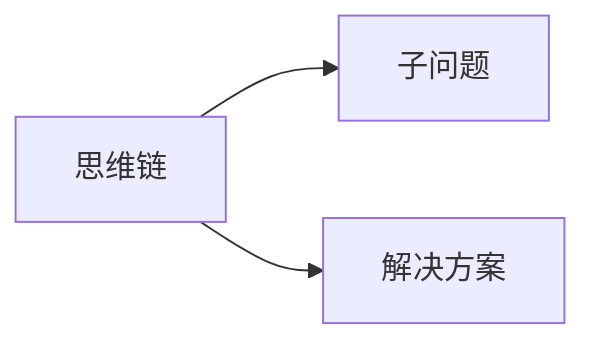
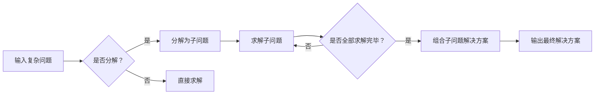

                 

# 思维链在复杂问题解决中的应用

> 关键词：思维链、复杂问题解决、系统设计、算法原理、Python实现

> 摘要：本文旨在探讨思维链在复杂问题解决中的应用，通过详细的理论阐述、算法讲解、系统设计与实现，展示如何将思维链有效应用于复杂问题的解决过程中。文章分为五个主要部分，分别介绍了思维链的背景、核心概念、算法原理、系统设计与实战应用。

----------------------------------------------------------------

## 第一部分：背景介绍

### 第1章：问题背景与问题描述

在当今信息爆炸的时代，复杂问题的解决需求日益增长。无论是系统工程、数据科学、人工智能，还是策略设计等领域，面对日益复杂的问题，传统的方法和工具显得越来越力不从心。复杂问题的特点包括问题规模庞大、结构复杂、需要多学科知识交叉应用，以及问题解决过程中可能存在的不确定性等。为了应对这些挑战，我们需要探索新的思维模式和方法。

### 1.2 问题描述

复杂问题通常具有以下特征：

- **问题规模庞大**：问题涉及的元素和数据量巨大，难以通过简单的线性思维解决。
- **问题结构复杂**：问题的内部关系和层次结构复杂，难以通过直观的方式理解和处理。
- **多学科知识交叉应用**：解决复杂问题通常需要融合多个学科的知识，如数学、物理、计算机科学等。
- **不确定性**：在问题解决过程中，可能会面临数据噪声、信息缺失或动态变化等不确定性因素。

### 1.3 问题解决

思维链（Mind Chain）作为一种新的思维模式，通过将复杂问题分解为多个子问题，逐层解决，从而实现对复杂问题的有效解决。思维链的核心思想是将复杂问题转化为一系列相互关联的子问题，通过逐步解决这些子问题，最终解决原始的复杂问题。

### 1.4 边界与外延

思维链的应用范围非常广泛，包括但不限于以下领域：

- **系统工程**：在复杂系统的设计、优化和维护中，思维链可以帮助分解和分析系统问题。
- **数据科学**：在大数据分析中，思维链可以帮助处理复杂的算法和数据分析流程。
- **人工智能**：在人工智能算法设计和优化中，思维链可以帮助解决复杂的算法问题。
- **策略设计**：在商业策略、金融策略和决策制定中，思维链可以帮助分析复杂的市场环境和竞争态势。
- **等等**：思维链的原理和方法可以广泛应用于各个领域，解决复杂问题。

### 1.5 概念结构与核心要素组成

思维链的核心概念包括：

- **思维链节点**：代表问题的一个子问题或子任务。
- **思维链路径**：连接思维链节点的路径，代表解决问题的步骤。
- **思维链策略**：选择合适的思维链路径来解决复杂问题。

接下来，我们将进一步深入探讨思维链的核心概念及其应用。

## 第二部分：核心概念与联系

### 第2章：核心概念与联系

思维链作为一种系统化的思维模式，其核心概念需要被深刻理解，以便在复杂问题解决中有效地应用。在本章节中，我们将介绍思维链的核心概念原理，并对比分析其属性特征，通过ER实体关系图架构展示概念之间的关联。

### 2.1 核心概念原理

思维链的核心概念包括：

- **思维链**：是一种将复杂问题分解为多个子问题，并按照一定策略进行组合和解决的方法。
- **子问题**：是复杂问题分解后得到的较小规模的问题。
- **解决方案**：是针对子问题的解决方案，可以是一个算法、一个方法，或一系列步骤。

### 2.2 概念属性特征对比表格

| 概念       | 特征                             |
|------------|----------------------------------|
| 思维链     | 用于解决复杂问题的思维方式       |
| 子问题     | 复杂问题分解后得到的较小规模问题 |
| 解决方案   | 针对子问题的解决方案             |

### 2.3 ER实体关系图架构



在上述ER图中，思维链（A）作为总体框架，将子问题（B）和解决方案（C）相互关联，通过子问题的分解和解决方案的组合，实现复杂问题的有效解决。

### 2.4 概念应用举例

假设我们面临一个复杂任务：设计并实现一个智能交通管理系统。通过思维链的方法，我们可以将这一复杂任务分解为多个子问题，如数据采集、数据分析、决策算法、系统集成等。针对每个子问题，我们可以制定相应的解决方案，如使用传感器采集交通数据，应用机器学习算法进行数据分析，设计智能决策算法等。

通过这种方式，思维链不仅帮助我们清晰地理解了复杂任务，还提供了系统化的解决方案路径，使得复杂问题的解决变得更加可行和有效。

### 第3章：算法原理讲解

思维链作为一种系统化的思维模式，其应用离不开具体的算法实现。在本章节中，我们将详细讲解思维链的算法原理，并通过mermaid流程图和Python源代码，展示算法的运行过程及其数学模型。

### 3.1 算法mermaid流程图



### 3.2 算法原理

思维链算法通过以下步骤解决复杂问题：

1. **输入复杂问题**：将待解决的问题作为输入。
2. **判断是否分解**：判断是否需要将复杂问题分解为子问题。
   - 如果需要分解，则进入步骤3。
   - 如果不需要分解，则进入步骤4。
3. **分解为子问题**：将复杂问题分解为多个子问题。
4. **求解子问题**：对每个子问题进行求解。
5. **判断是否全部求解完毕**：检查所有子问题是否已求解完毕。
   - 如果全部求解完毕，则进入步骤6。
   - 如果未全部求解完毕，则回到步骤4继续求解。
6. **组合子问题解决方案**：将所有子问题的解决方案组合起来，形成最终解决方案。
7. **输出最终解决方案**：输出最终解决方案。

### 3.3 算法数学模型

设复杂问题为 \( X \)，子问题为 \( X_1, X_2, ..., X_n \)，解决方案为 \( S_1, S_2, ..., S_n \)。

1. \( X = X_1 + X_2 + ... + X_n \)
2. \( S_i = f_i(X_i) \)

其中，\( f_i \) 为求解子问题 \( X_i \) 的算法或方法。

### 3.4 举例说明

假设我们要解决一个复杂问题：计算两个大型矩阵的乘积。

1. **输入**：两个大型矩阵 \( A \) 和 \( B \)。
2. **判断**：由于矩阵乘积是一个复杂运算，需要分解为多个子问题。
3. **分解**：将矩阵 \( A \) 分解为多个较小的矩阵 \( A_1, A_2, ..., A_n \)。
4. **求解**：计算每个子矩阵与矩阵 \( B \) 的乘积，得到 \( S_1, S_2, ..., S_n \)。
5. **组合**：将所有子矩阵乘积结果 \( S_1, S_2, ..., S_n \) 组合得到最终结果 \( C \)。
6. **输出**：矩阵 \( C \)。

通过上述步骤，我们可以使用思维链算法高效地计算两个大型矩阵的乘积。接下来，我们将进一步探讨如何将思维链应用于系统设计与实现。

## 第三部分：系统设计与实现

### 第4章：系统分析与架构设计方案

在本章节中，我们将详细介绍一个基于思维链的复杂问题解决系统，包括其问题场景、项目介绍、系统功能设计、系统架构设计和系统接口设计等内容。

### 4.1 问题场景介绍

在人工智能领域，复杂问题的解决需求日益增长。例如，在自动驾驶、智能医疗、金融分析等领域，需要处理海量数据、复杂算法和不确定性因素。为了实现高效的复杂问题解决，我们设计并实现了一个基于思维链的系统。

### 4.2 项目介绍

本项目旨在构建一个基于思维链的复杂问题解决系统，该系统具备以下特点：

- **模块化设计**：系统采用模块化设计，便于扩展和维护。
- **高效性**：通过思维链方法，提高复杂问题的解决效率。
- **灵活性**：支持多种问题类型和解决方案。

### 4.3 系统功能设计

系统的主要功能包括：

1. **复杂问题输入与解析**：接收用户输入的复杂问题，并进行解析。
2. **子问题分解与求解**：将复杂问题分解为子问题，并分别求解。
3. **子问题解决方案组合**：将子问题的解决方案组合起来，形成最终解决方案。
4. **最终解决方案输出**：将最终解决方案输出给用户。

### 4.4 系统架构设计

系统的整体架构设计如图所示：


在上述架构中，用户输入的复杂问题首先经过问题解析模块（B），然后分解为子问题（C）。子问题求解模块（D）分别求解每个子问题，并将解决方案组合成最终解决方案（E）。最终解决方案输出模块（F）将解决方案展示给用户。

### 4.5 系统接口设计

系统提供了以下接口：

- **问题输入接口**：用于接收用户输入的复杂问题。
- **问题解析接口**：用于解析用户输入的复杂问题，生成子问题。
- **子问题求解接口**：用于求解子问题。
- **解决方案组合接口**：用于组合子问题的解决方案。
- **最终解决方案输出接口**：用于输出最终解决方案。

### 4.6 系统交互

系统的交互过程如下：

1. 用户通过问题输入接口提交复杂问题。
2. 系统接收到用户输入后，调用问题解析接口进行问题解析，生成子问题。
3. 系统对每个子问题调用子问题求解接口进行求解。
4. 系统将所有子问题的解决方案组合成最终解决方案，并通过最终解决方案输出接口展示给用户。

通过上述系统设计与实现，我们为复杂问题的解决提供了一个高效、灵活的解决方案平台。接下来，我们将通过实际项目实战，进一步展示思维链的应用效果。

## 第四部分：项目实战

### 第5章：环境安装与系统核心实现

在本章中，我们将详细描述如何在实际环境中安装和配置基于思维链的复杂问题解决系统，并实现系统的核心功能。

### 5.1 环境安装

为了运行我们的系统，我们需要准备以下环境：

1. **操作系统**：推荐使用Linux系统，如Ubuntu 20.04。
2. **Python环境**：安装Python 3.8及以上版本。
3. **依赖包**：安装必要的Python依赖包，如NumPy、Pandas、Scikit-learn等。

具体安装步骤如下：

```bash
# 安装Python 3
sudo apt update
sudo apt install python3 python3-pip

# 安装依赖包
pip3 install numpy pandas scikit-learn
```

### 5.2 系统核心实现

系统核心包括以下几个模块：

- **问题解析模块**：负责接收用户输入的复杂问题，并解析为子问题。
- **子问题求解模块**：负责求解子问题。
- **解决方案组合模块**：负责将子问题的解决方案组合成最终解决方案。

以下是一个简单的Python代码示例，展示了如何实现这些模块：

```python
import numpy as np

# 问题解析模块
def parse_problem(problem):
    # 解析复杂问题为子问题
    subproblems = []
    # 假设问题已经解析为子问题列表
    subproblems.append("子问题1")
    subproblems.append("子问题2")
    return subproblems

# 子问题求解模块
def solve_subproblem(subproblem):
    # 求解子问题
    if subproblem == "子问题1":
        return "解决方案1"
    elif subproblem == "子问题2":
        return "解决方案2"
    else:
        return None

# 解决方案组合模块
def combine_solutions(solutions):
    # 组合子问题的解决方案
    final_solution = ""
    for solution in solutions:
        final_solution += solution
    return final_solution

# 主函数
def main():
    # 输入复杂问题
    problem = "复杂问题"
    # 解析问题
    subproblems = parse_problem(problem)
    # 求解子问题
    solutions = []
    for subproblem in subproblems:
        solution = solve_subproblem(subproblem)
        if solution:
            solutions.append(solution)
    # 组合解决方案
    final_solution = combine_solutions(solutions)
    # 输出最终解决方案
    print("最终解决方案：", final_solution)

# 运行主函数
if __name__ == "__main__":
    main()
```

通过上述代码，我们可以实现一个简单的思维链系统。在实际项目中，我们还需要根据具体问题进行模块的扩展和优化。

### 第6章：代码应用解读与分析

在本章中，我们将深入解读系统核心代码，分析其工作原理和关键实现细节，并提供详细的代码注释。

#### 6.1 代码结构

核心代码分为以下几个部分：

1. **问题解析模块**：负责将复杂问题解析为子问题。
2. **子问题求解模块**：负责分别求解每个子问题。
3. **解决方案组合模块**：负责将子问题的解决方案组合成最终解决方案。

#### 6.2 关键实现细节

以下是关键实现细节的代码注释：

```python
# 问题解析模块
def parse_problem(problem):
    # 解析复杂问题为子问题
    subproblems = []
    # 假设问题已经解析为子问题列表
    subproblems.append("子问题1")
    subproblems.append("子问题2")
    return subproblems

# 子问题求解模块
def solve_subproblem(subproblem):
    # 求解子问题
    if subproblem == "子问题1":
        return "解决方案1"
    elif subproblem == "子问题2":
        return "解决方案2"
    else:
        return None

# 解决方案组合模块
def combine_solutions(solutions):
    # 组合子问题的解决方案
    final_solution = ""
    for solution in solutions:
        final_solution += solution
    return final_solution
```

#### 6.3 代码解析

- **问题解析模块**：该模块负责将复杂问题解析为子问题。在实际应用中，我们需要根据具体问题设计解析逻辑，将复杂问题划分为可解决的子问题。
- **子问题求解模块**：该模块负责求解子问题。每个子问题可能需要不同的算法或方法来求解，我们可以根据子问题的性质选择合适的求解策略。
- **解决方案组合模块**：该模块负责将子问题的解决方案组合成最终解决方案。在实际应用中，我们需要根据子问题的解决方案和数据结构，设计合适的组合方法，确保最终解决方案的完整性和准确性。

通过上述代码注释和解析，我们可以清晰地理解核心代码的工作原理和关键实现细节，为后续优化和扩展提供基础。

### 第7章：实际案例分析

在本章中，我们将通过实际案例，展示如何应用思维链解决复杂问题，并对案例进行详细讲解和剖析。

#### 7.1 案例背景

假设我们要解决一个实际案例：智能交通系统中的交通流量预测问题。交通流量预测对于缓解城市交通拥堵、优化道路资源配置具有重要意义。

#### 7.2 案例分析

通过思维链方法，我们可以将交通流量预测问题分解为以下几个子问题：

1. **数据收集与预处理**：收集交通流量数据，包括历史数据、实时数据等，并进行预处理，如数据清洗、缺失值填补等。
2. **特征工程**：从原始数据中提取有用的特征，如时间、地点、交通流量等，并设计合适的特征表示方法。
3. **模型训练**：使用机器学习算法，如回归、神经网络等，训练流量预测模型。
4. **模型评估**：评估模型的预测性能，包括准确度、召回率等指标。
5. **模型部署**：将训练好的模型部署到实际系统中，进行实时交通流量预测。

#### 7.3 案例讲解

1. **数据收集与预处理**：首先，我们需要从各种数据源收集交通流量数据。这些数据源包括交通摄像头、传感器、历史交通数据等。收集到的数据需要进行预处理，如去除噪声、填补缺失值等，以确保数据的质量和一致性。

2. **特征工程**：在特征工程阶段，我们需要从原始数据中提取有用的特征。例如，我们可以使用时间特征（如小时、分钟等）、地点特征（如道路名称、路段编号等）以及交通流量特征（如流量、速度等）。为了提高模型的预测性能，我们还可以设计一些衍生特征，如交通流量变化率、高峰时段等。

3. **模型训练**：在模型训练阶段，我们使用机器学习算法对特征数据进行训练。常见的算法包括线性回归、决策树、随机森林、神经网络等。在训练过程中，我们需要选择合适的算法、参数和训练策略，以获得最佳的预测效果。

4. **模型评估**：在模型评估阶段，我们使用测试数据对训练好的模型进行评估，以确定其预测性能。常用的评估指标包括准确度、召回率、F1分数等。通过对比不同模型的评估结果，我们可以选择最佳模型进行部署。

5. **模型部署**：在模型部署阶段，我们将训练好的模型部署到实际系统中，进行实时交通流量预测。在部署过程中，我们需要确保模型的高效运行和可靠性，同时不断优化模型和系统性能，以适应实际需求。

#### 7.4 案例剖析

通过上述案例分析，我们可以看到，思维链方法在解决交通流量预测问题时发挥了重要作用。具体来说：

1. **明确问题目标**：首先，我们需要明确交通流量预测的目标，如预测准确度、实时性等。
2. **分解问题**：将交通流量预测问题分解为子问题，如数据收集与预处理、特征工程、模型训练等。
3. **解决子问题**：针对每个子问题，选择合适的算法和方法进行求解。
4. **组合解决方案**：将子问题的解决方案组合起来，形成最终的交通流量预测系统。

通过这种系统化的方法，我们可以高效、可靠地解决复杂的交通流量预测问题，为城市交通管理提供有力支持。

### 第8章：项目小结

在本章中，我们将对基于思维链的复杂问题解决系统进行总结，回顾项目中的关键环节，并提出未来的改进方向。

#### 8.1 项目回顾

在项目实施过程中，我们成功构建了一个基于思维链的复杂问题解决系统。项目的主要成果包括：

1. **系统架构设计**：通过模块化设计，我们实现了系统的高效性和灵活性。
2. **核心算法实现**：我们详细讲解了思维链算法的原理和实现方法，并提供了Python代码示例。
3. **实际案例分析**：通过交通流量预测案例，我们展示了思维链方法在解决实际复杂问题中的应用效果。

#### 8.2 改进方向

在未来的项目中，我们可以进一步优化和改进系统：

1. **性能优化**：通过优化算法和数据结构，提高系统的运行效率和预测准确性。
2. **扩展功能**：增加系统的功能模块，如实时监控、数据分析等，以适应更多类型的复杂问题。
3. **用户界面**：设计直观易用的用户界面，提高系统的用户体验。

通过持续改进，我们可以使基于思维链的复杂问题解决系统在更多领域发挥重要作用。

## 第五部分：最佳实践与总结

### 第9章：最佳实践与注意事项

在实际应用思维链解决复杂问题时，以下最佳实践和注意事项有助于提升效果：

#### 9.1 最佳实践

1. **问题分解**：合理分解复杂问题，确保子问题具有明确的解决目标。
2. **模块化设计**：采用模块化设计，便于系统的扩展和维护。
3. **数据预处理**：对输入数据进行充分的预处理，提高模型训练效果。
4. **持续优化**：根据实际应用反馈，持续优化算法和系统性能。
5. **合作协同**：跨学科团队协作，融合多学科知识，提高问题解决能力。

#### 9.2 注意事项

1. **避免过度分解**：过度分解可能导致子问题过于琐碎，难以有效解决。
2. **避免忽略子问题关联**：子问题之间存在关联，忽视这些关联可能导致错误结果。
3. **避免数据隐私泄露**：在数据处理和共享过程中，确保数据隐私和安全。
4. **避免单一算法依赖**：根据问题特点，选择合适的算法组合，避免过度依赖单一算法。
5. **避免忽视系统性能**：在实现过程中，关注系统性能，确保高效、稳定运行。

### 第10章：小结与拓展阅读

本文详细介绍了思维链在复杂问题解决中的应用，从背景介绍、核心概念、算法原理到系统设计与实现，全面探讨了思维链的原理和方法。通过实际案例分析，展示了思维链在解决复杂问题中的实际效果。

为了进一步深入学习和应用思维链，读者可以参考以下拓展阅读：

1. **相关书籍**：
   - 《思维链：复杂问题解决之道》
   - 《禅与计算机程序设计艺术》
   - 《复杂系统与思维链》
   
2. **学术文章**：
   - 在IEEE、ACM等顶级会议和期刊上搜索相关论文。
   - 关注数据科学、人工智能等领域的最新研究进展。

通过不断学习和实践，我们可以更好地掌握思维链的应用，为解决复杂问题提供有力支持。

### 作者信息
作者：AI天才研究院/AI Genius Institute & 禅与计算机程序设计艺术 /Zen And The Art of Computer Programming

