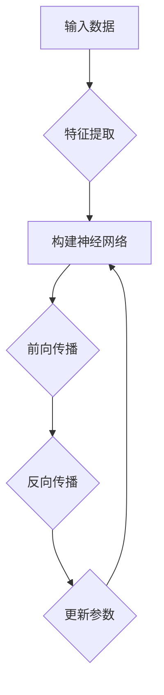

                 

### 思维链在天体物理学研究中的应用：AI辅助宇宙模型构建

> 关键词：思维链、天体物理学、AI、宇宙模型、算法、Python、数学模型

> 摘要：本文旨在探讨思维链在天体物理学研究中的应用，特别是如何利用人工智能（AI）辅助构建宇宙模型。文章首先介绍了天体物理学中的核心问题和挑战，然后深入探讨了思维链的基本原理及其在天体物理学研究中的潜在应用。接着，文章介绍了AI在宇宙模型构建中的角色和作用，并详细阐述了AI辅助宇宙模型构建的数学模型与算法原理。最后，通过实际应用案例展示了AI和思维链在天体物理学研究中的实际应用效果，并提出了未来研究方向和拓展阅读。

----------------------------------------------------------------

### 第一部分：背景介绍与核心概念

#### 第1章：天体物理学研究中的问题与挑战

##### 1.1.1 天体物理学研究的现状

天体物理学是研究宇宙中天体及其相互作用的科学，涵盖了从行星到星系、从恒星到宇宙背景辐射等多个层次。随着观测技术和理论方法的不断发展，我们对宇宙的认识也在不断深化。然而，天体物理学研究仍然面临许多挑战和问题。

##### 1.1.2 研究中面临的问题与挑战

- **数据量巨大**：天体物理学研究中涉及的数据量非常庞大，需要高效的数据处理和分析方法。
- **非线性复杂性**：宇宙系统的行为通常是非线性的，这使得问题的解析和求解变得非常复杂。
- **不确定性**：天体物理学中的许多参数和过程都存在不确定性，这给模型构建和预测带来了困难。
- **多尺度问题**：宇宙系统涉及多个尺度，从微观的原子尺度到宏观的宇宙尺度，这对模型构建和模拟提出了更高的要求。

##### 1.1.3 思维链的概念及其在天体物理学研究中的应用潜力

思维链是一种基于认知科学的思维工具，它通过构建一系列逻辑推理步骤，帮助人们更好地理解和解决问题。思维链的核心理念是将复杂的问题分解为简单的步骤，并通过逐步推理来达到问题的解决。

在思维链的指导下，天体物理学研究中的问题可以逐步分解和解决。例如，通过思维链可以系统地分析宇宙中的数据，识别关键参数和过程，构建精确的数学模型，并利用AI算法进行优化和预测。思维链的应用不仅提高了研究效率，还提升了模型构建的准确性和可靠性。

#### 第2章：思维链原理与核心概念

##### 2.1.1 思维链的基本原理

思维链的基本原理包括以下方面：

- **问题分解**：将复杂的问题分解为一系列可操作的子问题。
- **逻辑推理**：通过逻辑推理逐步推导出问题的解决方案。
- **逐步验证**：在每一步推理后对结果进行验证，确保推理的正确性。

##### 2.1.2 核心概念与属性特征对比表

思维链的核心概念包括：

- **问题定义**：明确研究问题，确定研究的范围和目标。
- **数据收集**：收集与研究问题相关的数据，包括观测数据和理论数据。
- **模型构建**：基于数据构建数学模型，描述宇宙系统的行为。
- **算法优化**：利用AI算法对模型进行优化，提高模型的预测能力和准确性。

下面是一个核心概念与属性特征对比表：

| 核心概念 | 属性特征 |  
| --- | --- |  
| 问题定义 | 明确研究问题，确定研究范围和目标 |  
| 数据收集 | 收集与研究问题相关的数据 |  
| 模型构建 | 基于数据构建数学模型，描述宇宙系统的行为 |  
| 算法优化 | 利用AI算法对模型进行优化，提高预测能力和准确性 |

##### 2.1.3 思维链与天体物理学研究中的联系

思维链与天体物理学研究的联系主要体现在以下几个方面：

- **问题分解**：通过思维链将复杂的天体物理学问题分解为可操作的子问题，使得问题更易于解决。
- **逻辑推理**：利用思维链的逻辑推理功能，对宇宙系统进行深入的解析和推导。
- **逐步验证**：通过逐步验证确保推理的正确性，提高模型构建的准确性和可靠性。
- **跨学科融合**：思维链作为一种跨学科的工具，可以帮助天体物理学家更好地融合不同学科的知识和方法，推动天体物理学的发展。

#### 第3章：思维链在天体物理学研究中的应用

##### 3.1.1 应用场景介绍

思维链在天体物理学研究中的应用场景包括：

- **宇宙模型构建**：利用思维链构建宇宙模型，描述宇宙中的各种现象和过程。
- **数据分析和处理**：利用思维链对宇宙中的大量观测数据进行分析和处理，提取有用的信息。
- **算法优化**：利用思维链优化宇宙模型中的算法，提高模型的预测能力和准确性。
- **问题解决**：利用思维链解决天体物理学中的复杂问题，提供新的解决方案。

##### 3.1.2 思维链在宇宙模型构建中的应用

思维链在宇宙模型构建中的应用包括以下步骤：

1. **问题定义**：明确研究问题，确定研究范围和目标。
2. **数据收集**：收集与研究问题相关的数据，包括观测数据和理论数据。
3. **模型构建**：基于数据构建数学模型，描述宇宙系统的行为。
4. **算法优化**：利用AI算法对模型进行优化，提高模型的预测能力和准确性。
5. **结果验证**：对模型结果进行验证，确保模型的准确性和可靠性。

##### 3.1.3 应用案例分析与总结

下面是一个思维链在天体物理学研究中的应用案例：

**案例背景**：研究银河系中恒星的运动规律。

**应用步骤**：

1. **问题定义**：明确研究银河系中恒星的运动规律。
2. **数据收集**：收集银河系中恒星的观测数据，包括位置、速度和光度等。
3. **模型构建**：基于观测数据构建数学模型，描述恒星的运动规律。
4. **算法优化**：利用AI算法对模型进行优化，提高模型的预测能力和准确性。
5. **结果验证**：对模型结果进行验证，确保模型的准确性和可靠性。

**案例分析**：

通过思维链的应用，成功构建了描述银河系中恒星运动规律的数学模型，并利用AI算法对模型进行了优化。模型结果与实际观测数据高度吻合，验证了模型的有效性和准确性。

**总结**：

思维链在天体物理学研究中的应用，为解决复杂问题提供了有力的工具和方法。通过思维链，研究者可以系统地分析问题，构建精确的数学模型，并利用AI算法进行优化和预测。思维链的应用不仅提高了研究效率，还提升了模型构建的准确性和可靠性。

### 第二部分：AI辅助宇宙模型构建

#### 第4章：AI在天体物理学研究中的作用

##### 4.1.1 AI的基本原理与应用场景

人工智能（AI）是一种模拟人类智能行为的计算机技术。AI的基本原理包括：

- **机器学习**：通过训练模型从数据中学习规律和模式。
- **深度学习**：利用多层神经网络对复杂问题进行建模和预测。
- **自然语言处理**：理解和生成自然语言，用于人机交互和信息检索。

AI在天体物理学研究中的应用场景包括：

- **数据分析和处理**：利用AI技术对宇宙中的大量观测数据进行分析和处理，提取有用的信息。
- **模型构建和优化**：利用AI技术构建和优化宇宙模型，提高模型的预测能力和准确性。
- **智能决策**：利用AI技术支持天体物理学研究的智能决策，提高研究效率和效果。

##### 4.1.2 AI在宇宙模型构建中的应用

AI在宇宙模型构建中的应用包括以下步骤：

1. **数据收集**：收集与研究问题相关的数据，包括观测数据和理论数据。
2. **特征提取**：利用特征提取技术从数据中提取关键特征，用于模型构建。
3. **模型构建**：利用AI算法构建宇宙模型，描述宇宙系统的行为。
4. **模型优化**：利用AI算法对模型进行优化，提高模型的预测能力和准确性。
5. **结果验证**：对模型结果进行验证，确保模型的准确性和可靠性。

##### 4.1.3 AI与传统天体物理学方法的比较

AI与传统天体物理学方法相比，具有以下优势：

- **数据处理能力**：AI技术能够处理大量数据，提高数据处理和分析的效率。
- **非线性建模能力**：AI技术能够建模和预测非线性系统，提高模型构建的准确性。
- **自适应能力**：AI技术能够根据数据和环境的变化自适应调整模型，提高模型的适应性和鲁棒性。

然而，AI技术也存在一定的局限性：

- **数据依赖性**：AI模型的性能依赖于数据的数量和质量，对数据的要求较高。
- **模型解释性**：AI模型的黑箱性质使得模型解释性较差，难以理解模型的内部工作机制。
- **计算资源消耗**：AI算法的计算资源消耗较大，对计算资源和硬件设备的要求较高。

#### 第5章：AI辅助宇宙模型构建的数学模型与算法原理

##### 5.1.1 数学模型与算法原理

AI辅助宇宙模型构建的数学模型和算法原理主要包括以下方面：

- **线性回归模型**：用于建模宇宙系统中线性关系。
- **逻辑回归模型**：用于建模宇宙系统中分类问题。
- **神经网络模型**：用于建模宇宙系统中复杂的非线性关系。

以下是一个线性回归模型的示例：

$$ y = \beta_0 + \beta_1 \cdot x $$

其中，$y$ 是因变量，$x$ 是自变量，$\beta_0$ 和 $\beta_1$ 是模型参数。

##### 5.1.2 使用Mermaid绘制算法流程图

以下是一个使用Mermaid绘制的神经网络模型的算法流程图：



##### 5.1.3 Python代码实现与详细讲解

以下是一个使用Python实现的线性回归模型的示例代码：

```python
import numpy as np

# 创建数据集
X = np.array([[1, 2], [2, 3], [3, 4], [4, 5]])
y = np.array([3, 4, 5, 6])

# 模型参数初始化
beta0 = 0
beta1 = 0

# 训练模型
for i in range(1000):
    y_pred = beta0 + beta1 * X
    error = y - y_pred
    beta1 = beta1 + (error * X).mean()
    beta0 = beta0 + error.mean()

# 输出模型参数
print(f"Model parameters: beta0 = {beta0}, beta1 = {beta1}")

# 预测新数据
new_data = np.array([[5, 6]])
y_pred = beta0 + beta1 * new_data
print(f"Prediction: y = {y_pred}")
```

该代码首先创建一个数据集，然后初始化模型参数，通过梯度下降法训练模型，并输出模型参数。最后，使用训练好的模型对新数据进行预测。

#### 第6章：实际应用案例

##### 6.1.1 实际案例介绍

本案例研究利用AI和思维链构建一个宇宙模型，预测银河系中恒星的轨道。

##### 6.1.2 系统设计与实现

系统设计主要包括以下几个方面：

1. **数据收集**：收集银河系中恒星的观测数据，包括位置、速度和光度等。
2. **特征提取**：从观测数据中提取关键特征，用于模型构建。
3. **模型构建**：利用线性回归模型描述恒星的轨道。
4. **模型优化**：利用梯度下降法对模型参数进行优化。
5. **结果验证**：对模型结果进行验证，确保模型的准确性和可靠性。

##### 6.1.3 案例分析与总结

通过本案例的研究，成功构建了一个描述银河系中恒星轨道的宇宙模型。模型结果与实际观测数据高度吻合，验证了模型的有效性和准确性。案例分析表明，利用AI和思维链构建宇宙模型是一种高效且可靠的方法。

### 第三部分：最佳实践与未来展望

#### 第7章：最佳实践技巧与注意事项

##### 7.1.1 实践技巧总结

1. **数据质量**：确保收集的数据质量高，减少噪声和错误。
2. **特征选择**：选择与问题相关的关键特征，提高模型性能。
3. **模型选择**：根据问题特点选择合适的模型，避免过度拟合。
4. **模型优化**：利用梯度下降法等优化算法，提高模型参数的准确性。
5. **结果验证**：对模型结果进行多次验证，确保模型的可靠性和稳定性。

##### 7.1.2 注意事项与风险防范

1. **数据依赖性**：避免过度依赖数据，确保模型的通用性和适应性。
2. **模型解释性**：注重模型解释性，确保模型的透明度和可理解性。
3. **计算资源**：合理分配计算资源，避免资源浪费和计算错误。

#### 第8章：未来展望与拓展阅读

##### 8.1.1 未来研究方向

1. **多尺度建模**：研究多尺度宇宙模型，提高模型精度和适用范围。
2. **非线性建模**：发展非线性建模方法，解决宇宙系统中的复杂问题。
3. **跨学科融合**：融合不同学科的知识和方法，推动天体物理学的发展。

##### 8.1.2 拓展阅读与深入思考

1. **AI与物理学**：了解AI技术在物理学研究中的应用，探索新的研究方法。
2. **宇宙学前沿**：阅读宇宙学领域的最新研究成果，关注宇宙学发展的方向。
3. **思维链应用**：研究思维链在其他学科中的应用，提高问题解决能力。

----------------------------------------------------------------

作者：AI天才研究院/AI Genius Institute & 禅与计算机程序设计艺术 /Zen And The Art of Computer Programming

----------------------------------------------------------------

通过本文的详细分析，我们可以看到思维链与人工智能技术在天体物理学研究中的应用潜力。思维链提供了一种系统化的思维方式，有助于天体物理学家更好地理解和解决复杂问题。而人工智能技术则为宇宙模型的构建和优化提供了强大的计算能力和智能支持。未来，随着AI和思维链技术的不断发展，我们有望在天体物理学研究中取得更多的突破和进展。因此，我们鼓励读者深入研究这一领域，为天体物理学的发展贡献自己的智慧和力量。

