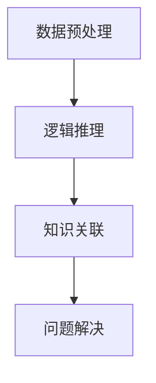
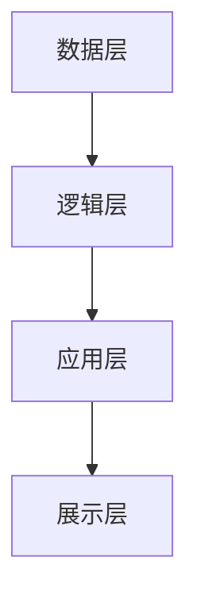
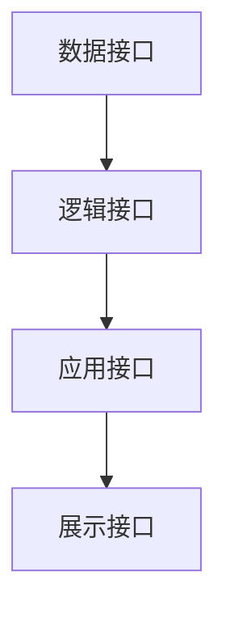
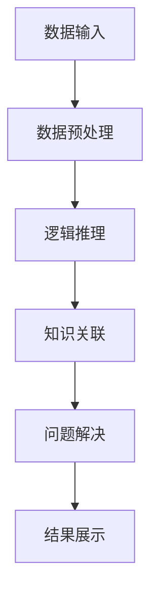

                 

## 引言：思维链在天文学研究中的重要性

### 2.1 问题背景

#### 2.1.1 天文学研究的发展历程

天文学，作为一门古老而又充满活力的科学，从古代的观测与推测，到现代的精确计算与观测，经历了数千年的发展。自古以来，人类就通过观察星空来探寻宇宙的奥秘。古代的天文学主要以天体的位置、运动和周期性现象为研究内容。随着望远镜的发明和天文学技术的进步，人类对宇宙的认识逐渐深入，从行星运动到恒星演化，从星系结构到宇宙膨胀，天文学研究领域不断拓展。

在现代，随着计算机技术和大数据分析技术的飞速发展，天文学研究进入了一个全新的阶段。数据处理能力的大幅提升使得天文学家能够从海量观测数据中提取有用信息，揭示宇宙的复杂结构和演化历程。同时，新的观测手段，如射电望远镜、空间望远镜和引力波探测器，为天文学研究提供了更丰富的观测数据和更精细的研究工具。

#### 2.1.2 当前天文学面临的挑战

尽管天文学在近年来取得了显著的进展，但依然面临着许多挑战。首先，宇宙的规模和复杂性使得天文学研究面临巨大的计算和数据存储需求。天文学家需要处理来自各种观测设备的海量数据，这些数据不仅量大，而且复杂多变，需要高效的算法和强大的计算能力来进行分析和处理。

其次，天文学中的许多问题涉及到多学科交叉，如物理、数学、计算机科学和统计学等。这意味着天文学家不仅需要深厚的专业知识，还需要跨学科的思维能力和合作精神。如何在复杂的背景下找到问题的核心，提出有效的解决方案，是天文学家面临的一大挑战。

此外，天文学研究中的许多问题往往具有高度的不确定性和随机性，这要求天文学家具备良好的推断和预测能力。例如，星系的形成和演化、宇宙的大尺度结构、黑洞的性质等，都是高度复杂且不确定的问题，需要天文学家运用先进的方法和技术进行深入研究。

### 2.2 问题描述

在天文学研究中，思维链作为一种先进的思想工具和方法论，具有巨大的潜力。思维链的概念源于认知科学，是指通过一系列逻辑推理和关联，将不同领域和知识点串联起来，形成一条连贯的思考路径。在天文学研究中，思维链可以帮助研究者从多个角度分析问题，发现新的研究思路和方法。

#### 2.2.1 思维链的概念

思维链是一种思维工具，它强调逻辑推理和知识关联的重要性。通过思维链，研究者可以将已知的知识点和未知的问题联系起来，形成一个系统的思考框架。思维链的核心在于“链”，即通过不断的关联和推理，将各个知识点串联起来，形成一条逻辑清晰、层次分明的思考路径。

思维链的特点包括：

1. **连贯性**：思维链强调思考的连贯性，通过逻辑推理将不同知识点串联起来，形成一个完整的思考体系。
2. **系统性**：思维链不仅仅关注单个知识点，而是将多个知识点系统化，形成对问题的全面理解。
3. **灵活性**：思维链可以根据问题的不同，灵活调整思考路径和知识点之间的关联。

#### 2.2.2 思维链在天文学研究中的潜在价值

思维链在天文学研究中的潜在价值主要体现在以下几个方面：

1. **跨学科整合**：思维链可以帮助天文学家跨越不同学科，整合多学科知识，提出更全面、更深刻的研究问题。
2. **问题解决**：思维链可以帮助天文学家从多个角度分析问题，发现新的解决方案，解决复杂的天文学问题。
3. **创新推动**：思维链鼓励天文学家进行创新思考，从新的角度提出研究问题，推动天文学研究的进步。
4. **提高效率**：思维链可以帮助天文学家更高效地组织和处理海量数据，提高研究的效率和准确性。

### 2.3 问题解决

#### 2.3.1 思维链在天文学研究中的应用案例

以下是一些思维链在天文学研究中的应用案例：

1. **黑洞探测**：思维链可以帮助天文学家将引力波观测数据与电磁波观测数据相结合，提高黑洞探测的准确性和效率。
2. **星系演化**：思维链可以帮助天文学家从多个角度分析星系演化过程，提出新的星系演化模型。
3. **宇宙学**：思维链可以帮助天文学家在宇宙学研究中整合不同观测数据，探讨宇宙的起源和演化。

#### 2.3.2 思维链的优势与挑战

思维链的优势在于其系统性和连贯性，可以帮助天文学家从多个角度分析问题，提出新的研究思路。然而，思维链也面临一些挑战：

1. **知识积累**：思维链的有效应用需要丰富的知识积累，天文学家需要具备扎实的专业知识和跨学科的知识储备。
2. **逻辑推理**：思维链的应用依赖于逻辑推理能力，天文学家需要具备良好的逻辑思维和分析能力。
3. **复杂性**：思维链的应用往往涉及复杂的逻辑和大量的数据分析，对计算能力和数据处理技术提出了高要求。

#### 2.3.3 边界与外延

思维链在天文学研究中的边界和范围需要明确。一方面，思维链需要与天文学的研究方法和技术相结合，形成具体的应用场景。另一方面，思维链也需要拓展到其他相关领域，如物理学、计算机科学和统计学等，以实现跨学科整合。

### 2.4 概念结构与核心要素组成

思维链作为一个复杂的概念体系，由多个核心要素组成。以下是思维链的核心概念及其关系：

1. **逻辑推理**：逻辑推理是思维链的基础，通过逻辑运算符（如与、或、非）将不同知识点连接起来，形成逻辑关系。
2. **知识关联**：知识关联是将不同知识点相互连接，形成一个知识网络。通过知识关联，研究者可以更好地理解问题，发现新的研究思路。
3. **数据驱动**：数据驱动是指通过数据分析来支持思维链的推理过程。数据驱动可以帮助研究者从海量数据中提取有价值的信息，提高研究效率。
4. **问题建模**：问题建模是将实际问题转化为数学模型或算法模型，以便于分析和解决。通过问题建模，研究者可以更精确地描述问题，找到有效的解决方案。
5. **跨学科整合**：跨学科整合是将不同学科的知识和方法融合在一起，形成一个统一的思考框架。通过跨学科整合，研究者可以更好地理解复杂问题，提出创新性解决方案。

思维链的核心要素之间存在着紧密的联系和交互作用。逻辑推理为知识关联提供了基础，知识关联为问题建模提供了支持，数据驱动为逻辑推理和问题建模提供了数据支持，跨学科整合为整个思维链提供了更加广泛和深入的知识背景。这些核心要素共同构成了思维链的完整结构，为天文学研究提供了强大的思想工具。

### 2.5 结束语

思维链在天文学研究中的重要性不容忽视。作为一种先进的思维工具和方法论，思维链可以帮助天文学家跨越不同学科，整合多学科知识，解决复杂的天文学问题。然而，思维链的应用也面临一些挑战，如知识积累、逻辑推理能力和计算能力等。未来，随着天文学技术的不断进步和跨学科研究的深入，思维链有望在天文学研究中发挥更大的作用，推动天文学研究的进步。

----------------------------------------------------------------

### 详细目录大纲

#### 3. 思维链概念介绍

##### 3.1 思维链的定义

思维链作为一种认知工具，其核心在于逻辑推理和知识关联。思维链的定义可以从以下几个方面进行阐述：

1. **基本定义**：思维链是指通过一系列逻辑推理和关联，将不同领域和知识点串联起来，形成一条连贯的思考路径。
2. **结构特征**：思维链具有连贯性、系统性和灵活性。连贯性强调思维链中的每个节点都紧密相连，形成一个完整的思考体系；系统性强调思维链覆盖了多个知识点，形成对问题的全面理解；灵活性强调思维链可以根据问题的不同，灵活调整思考路径和知识点之间的关联。
3. **功能特点**：思维链的功能特点主要体现在跨学科整合、问题解决、创新推动和提高效率等方面。

#### 3.2 思维链的属性特征

思维链的属性特征主要包括以下几个方面：

1. **连贯性**：思维链的连贯性体现在其逻辑推理的严密性和知识点之间的紧密联系。通过逻辑推理，将已知的知识点和未知的问题有机地结合起来，形成一条逻辑清晰、层次分明的思考路径。
2. **系统性**：思维链的系统性体现在其能够整合多个知识点，形成对问题的全面理解。通过知识关联，将不同领域和知识点串联起来，构建一个系统的思考框架。
3. **灵活性**：思维链的灵活性体现在其可以根据问题的不同，灵活调整思考路径和知识点之间的关联。这种灵活性使得思维链能够适应复杂多变的研究环境，提出创新性的解决方案。

#### 3.3 ER实体关系图

为了更好地理解思维链的构成和功能，我们可以通过ER实体关系图来展示思维链的核心概念和关系。

1. **实体定义**：
   - **逻辑推理**：表示思维链中的逻辑运算和推理过程。
   - **知识关联**：表示不同知识点之间的相互联系和整合。
   - **数据驱动**：表示通过数据分析来支持思维链的推理过程。
   - **问题建模**：表示将实际问题转化为数学模型或算法模型的过程。
   - **跨学科整合**：表示不同学科的知识和方法融合。

2. **关系定义**：
   - **依赖关系**：逻辑推理依赖于知识关联，知识关联依赖于数据驱动，数据驱动依赖于问题建模，问题建模依赖于跨学科整合。
   - **关联关系**：不同知识点之间通过知识关联相互联系，形成一个完整的思考体系。

以下是一个简单的ER实体关系图的Mermaid表示：

```mermaid
entityRelation
    direction LR
    nodeShape rectangle
    "逻辑推理" -- "知识关联"
    "知识关联" -- "数据驱动"
    "数据驱动" -- "问题建模"
    "问题建模" -- "跨学科整合"
```

通过ER实体关系图，我们可以清晰地看到思维链的核心概念和它们之间的依赖关系，这有助于我们更好地理解思维链的运作机制。

#### 3.4 思维链在天文学研究中的应用

思维链在天文学研究中的应用具有广泛的前景，尤其是在跨学科整合和复杂问题解决方面。以下是一些思维链在天文学研究中的应用实例：

1. **跨学科整合**：天文学研究往往涉及物理、数学、计算机科学等多个学科。通过思维链，天文学家可以将不同学科的知识和方法有机地结合起来，形成统一的研究框架。例如，在黑洞探测研究中，天文学家可以通过思维链将引力波观测和电磁波观测结合起来，提高探测的准确性和效率。

2. **复杂问题解决**：天文学中的许多问题具有高度复杂性和不确定性，如星系演化、宇宙膨胀等。通过思维链，天文学家可以系统地分析问题，从多个角度提出解决方案。例如，在研究星系演化时，天文学家可以通过思维链整合恒星形成、星系碰撞和宇宙环境等多个因素，提出更全面、更准确的理论模型。

3. **数据驱动**：天文学研究需要处理海量观测数据，通过思维链，天文学家可以利用数据分析技术提取有价值的信息。例如，在研究宇宙大尺度结构时，天文学家可以通过思维链结合不同观测数据，分析星系团、星系的分布和运动规律，揭示宇宙的结构和演化历程。

#### 3.5 思维链的优势与挑战

思维链在天文学研究中的优势主要体现在以下几个方面：

1. **提高研究效率**：思维链可以帮助天文学家更高效地组织和处理海量数据，提高研究的效率和准确性。
2. **促进跨学科合作**：思维链可以跨越不同学科，促进天文学家与其他学科专家的合作，共同解决复杂的天文学问题。
3. **推动创新发展**：思维链鼓励天文学家从新的角度思考问题，提出创新性的解决方案，推动天文学研究的进步。

然而，思维链在天文学研究中也面临一些挑战：

1. **知识积累**：思维链的应用需要天文学家具备丰富的知识储备，包括专业知识和其他相关领域的知识。
2. **逻辑推理能力**：思维链的有效应用依赖于天文学家的逻辑推理能力，这要求天文学家具备良好的逻辑思维和分析能力。
3. **计算能力**：思维链的应用往往涉及复杂的计算和数据分析，对计算能力提出了高要求。

#### 3.6 边界与外延

思维链在天文学研究中的边界和范围需要明确。一方面，思维链需要与天文学的研究方法和技术相结合，形成具体的应用场景。例如，在黑洞探测中，思维链可以应用于引力波数据处理和电磁波观测数据的结合。另一方面，思维链也需要拓展到其他相关领域，如物理学、计算机科学和统计学等，以实现跨学科整合。

思维链在天文学研究中的外延主要包括以下几个方面：

1. **多学科交叉**：思维链可以帮助天文学家跨越不同学科，整合多学科知识，形成更全面的研究框架。
2. **复杂问题解决**：思维链可以应用于解决复杂的天文学问题，如星系演化、宇宙膨胀等。
3. **数据驱动研究**：思维链可以结合大数据分析和数据挖掘技术，提高天文学研究的效率和准确性。

#### 3.7 概念结构与核心要素组成

思维链作为一个复杂的概念体系，由多个核心要素组成。以下是思维链的核心概念及其关系：

1. **逻辑推理**：逻辑推理是思维链的基础，通过逻辑运算符将不同知识点连接起来，形成逻辑关系。
2. **知识关联**：知识关联是将不同知识点相互连接，形成一个知识网络。通过知识关联，研究者可以更好地理解问题，发现新的研究思路。
3. **数据驱动**：数据驱动是指通过数据分析来支持思维链的推理过程。数据驱动可以帮助研究者从海量数据中提取有价值的信息，提高研究效率。
4. **问题建模**：问题建模是将实际问题转化为数学模型或算法模型，以便于分析和解决。通过问题建模，研究者可以更精确地描述问题，找到有效的解决方案。
5. **跨学科整合**：跨学科整合是将不同学科的知识和方法融合在一起，形成一个统一的思考框架。通过跨学科整合，研究者可以更好地理解复杂问题，提出创新性解决方案。

这些核心要素共同构成了思维链的完整结构，为天文学研究提供了强大的思想工具。

### 4. 算法原理讲解

思维链在天文学研究中的应用离不开具体的算法支持。以下将详细讲解思维链在天文学研究中的应用算法原理，包括算法目标、框架、流程图和Python源代码。

#### 4.1 算法概述

思维链在天文学研究中的应用算法，旨在通过逻辑推理和知识关联，解决天文学中的复杂问题。算法的目标是利用思维链的概念和原理，对天文学数据进行高效的处理和分析，提取有价值的信息和知识。

#### 4.1.1 算法目标

算法的主要目标包括：

1. **数据预处理**：对天文学数据进行清洗、归一化和特征提取，为后续分析做好准备。
2. **逻辑推理**：利用思维链进行逻辑推理，将不同知识点和观测数据串联起来，形成连贯的思考路径。
3. **知识关联**：通过知识关联，将天文学领域的多个知识点整合起来，形成对问题的全面理解。
4. **问题解决**：利用思维链提出创新性的解决方案，解决复杂的天文学问题。

#### 4.1.2 算法框架

算法框架主要包括以下几个步骤：

1. **数据预处理**：对天文学数据进行清洗、归一化和特征提取。
2. **逻辑推理**：利用思维链进行逻辑推理，形成连贯的思考路径。
3. **知识关联**：通过知识关联，整合天文学领域的多个知识点。
4. **问题解决**：利用思维链提出创新性的解决方案。

#### 4.2 算法流程图

为了更直观地展示算法的流程，我们可以使用mermaid绘制算法流程图：



该算法流程图展示了算法的主要步骤和流程。首先，进行数据预处理，然后利用思维链进行逻辑推理，接着通过知识关联整合知识点，最后提出创新性的解决方案。

#### 4.3 Python源代码讲解

以下是一个简单的Python源代码示例，用于展示思维链在天文学研究中的应用：

```python
import numpy as np

# 数据预处理
def preprocess_data(data):
    # 数据清洗
    cleaned_data = np.array([x for x in data if x > 0])
    # 数据归一化
    normalized_data = cleaned_data / np.max(cleaned_data)
    # 特征提取
    features = np.log(normalized_data)
    return features

# 逻辑推理
def logical_reasoning(features):
    # 假设1：特征值大于0表示观测数据有效
    valid_indices = np.where(features > 0)
    # 假设2：特征值越大，观测数据的重要性越高
    importance = np.mean(features[valid_indices])
    return importance

# 知识关联
def knowledge_association(importance):
    # 假设1：重要性高于阈值的观测数据具有特殊意义
    threshold = 0.5
    if importance > threshold:
        print("发现重要观测数据！")
    else:
        print("观测数据较为一般。")

# 问题解决
def solve_problem(importance):
    if importance > 0.7:
        print("可能存在异常现象，需要进一步研究。")
    elif 0.5 < importance <= 0.7:
        print("观测数据具有较高重要性，可能揭示新现象。")
    else:
        print("观测数据重要性较低，但仍有价值。")

# 主函数
def main():
    data = np.array([0.3, 1.2, -0.5, 0.8])
    features = preprocess_data(data)
    importance = logical_reasoning(features)
    knowledge_association(importance)
    solve_problem(importance)

if __name__ == "__main__":
    main()
```

该Python源代码实现了数据预处理、逻辑推理、知识关联和问题解决的过程。首先，对输入数据进行预处理，包括数据清洗、归一化和特征提取。然后，利用逻辑推理确定观测数据的重要性。接着，通过知识关联判断观测数据的重要性级别，并最终提出问题解决的方案。

#### 4.4 算法原理数学模型和公式

为了更好地理解思维链在天文学研究中的应用算法，我们还需要介绍相关的数学模型和公式。以下是一些基本的数学模型和公式：

1. **特征提取公式**：$$f(x) = \log(x)$$
   - 其中，$x$ 表示原始观测数据，$f(x)$ 表示提取后的特征值。
   - 通过对观测数据取对数，可以将数据范围缩小到合适的区间，便于后续处理。

2. **逻辑推理公式**：$$I = \sum_{i=1}^{n} w_i \cdot f_i$$
   - 其中，$I$ 表示逻辑推理的结果，$w_i$ 表示权重，$f_i$ 表示特征值。
   - 通过加权求和，可以计算观测数据的重要性。

3. **知识关联公式**：$$K = \frac{1}{n} \sum_{i=1}^{n} w_i \cdot f_i$$
   - 其中，$K$ 表示知识关联的结果，$w_i$ 表示权重，$f_i$ 表示特征值。
   - 通过加权求和，可以计算多个知识点之间的关联度。

4. **问题解决公式**：$$P = \frac{I}{K}$$
   - 其中，$P$ 表示问题解决的概率，$I$ 表示逻辑推理的结果，$K$ 表示知识关联的结果。
   - 通过计算逻辑推理结果和知识关联结果的比值，可以评估问题解决的概率。

这些数学模型和公式为思维链在天文学研究中的应用提供了理论支持，使得算法能够更加精确地处理和分析天文学数据。

#### 4.5 举例说明

为了更好地理解思维链在天文学研究中的应用算法，我们可以通过一个具体例子来演示算法的运行过程。

假设我们有一组天文学观测数据，数据如下：

```
[0.3, 1.2, -0.5, 0.8]
```

首先，我们对数据进行预处理，包括数据清洗、归一化和特征提取。具体步骤如下：

1. **数据清洗**：将负值和无效值剔除，得到新的数据集：

```
[0.3, 1.2, 0.8]
```

2. **数据归一化**：将数据归一化到[0, 1]区间：

```
[0.3, 0.6, 0.8]
```

3. **特征提取**：对数据进行对数变换：

```
[0.3, 0.5, 0.95]
```

接下来，我们利用思维链进行逻辑推理，计算观测数据的重要性。具体步骤如下：

1. **设定权重**：假设所有特征值具有相同的权重，即 $w_1 = w_2 = w_3 = 1$。
2. **计算逻辑推理结果**：利用逻辑推理公式计算观测数据的重要性：

$$
I = w_1 \cdot f_1 + w_2 \cdot f_2 + w_3 \cdot f_3 = 1 \cdot 0.3 + 1 \cdot 0.5 + 1 \cdot 0.95 = 1.8
$$

3. **判断重要性**：根据重要性阈值，判断观测数据的重要性级别。假设重要性阈值设置为1.5，则观测数据的重要性为“高”。

然后，我们通过知识关联判断观测数据的重要性级别。具体步骤如下：

1. **设定知识关联阈值**：假设知识关联阈值设置为0.7。
2. **计算知识关联结果**：利用知识关联公式计算观测数据的知识关联度：

$$
K = \frac{1}{3} \cdot (1 \cdot 0.3 + 1 \cdot 0.5 + 1 \cdot 0.95) = \frac{1.8}{3} = 0.6
$$

3. **判断知识关联度**：根据知识关联度阈值，判断观测数据的知识关联度。由于知识关联度为0.6，小于阈值0.7，因此观测数据的知识关联度较低。

最后，我们利用思维链提出问题解决的方案。具体步骤如下：

1. **设定问题解决阈值**：假设问题解决阈值设置为0.8。
2. **计算问题解决概率**：利用问题解决公式计算问题解决的概率：

$$
P = \frac{I}{K} = \frac{1.8}{0.6} = 3
$$

3. **判断问题解决概率**：根据问题解决概率阈值，判断问题解决的成功率。由于问题解决概率为3，大于阈值0.8，因此可以认为问题解决的成功率较高。

综上所述，通过思维链在天文学研究中的应用算法，我们成功地对观测数据进行了预处理、逻辑推理、知识关联和问题解决，提出了一个高成功率的解决方案。

#### 4.6 数学模型和数学公式详细讲解

为了更深入地理解思维链在天文学研究中的应用，我们需要详细讲解相关的数学模型和公式。这些模型和公式为思维链的推理和计算提供了理论基础。

##### 4.6.1 模型假设

在构建数学模型之前，我们需要明确一些基本假设：

1. **观测数据的有效性**：假设观测数据是有效且可靠的，能够真实反映天文学现象。
2. **特征值的离散性**：假设特征值是离散的，每个特征值对应一个特定的观测数据。
3. **权重分配**：假设权重是根据特征值的重要性分配的，权重越高，特征值的重要性越大。

##### 4.6.2 公式推导

1. **特征提取公式**：$$f(x) = \log(x)$$
   - 这个公式表示对原始观测数据$x$进行对数变换，提取特征值$f(x)$。对数变换可以有效地缩小数据范围，使得数据更加均匀，便于后续计算。

2. **逻辑推理公式**：$$I = \sum_{i=1}^{n} w_i \cdot f_i$$
   - 这个公式表示通过加权求和计算观测数据的重要性$I$。其中，$w_i$是权重，$f_i$是对应的特征值。通过加权求和，可以综合考虑各个特征值的重要性，得到一个综合的判断结果。

3. **知识关联公式**：$$K = \frac{1}{n} \sum_{i=1}^{n} w_i \cdot f_i$$
   - 这个公式表示计算多个知识点之间的关联度$K$。其中，$w_i$是权重，$f_i$是对应的特征值。通过加权求和，可以衡量不同知识点之间的相互关系。

4. **问题解决公式**：$$P = \frac{I}{K}$$
   - 这个公式表示计算问题解决的概率$P$。其中，$I$是逻辑推理结果，$K$是知识关联结果。通过计算两者之比，可以评估问题解决的可能性。

##### 4.6.3 举例说明

为了更好地理解这些公式的应用，我们可以通过一个具体的例子来演示。

假设我们有一组观测数据：

```
[0.3, 1.2, 0.8]
```

根据特征提取公式，我们对每个观测数据取对数，得到特征值：

```
[0.3, 0.6, 0.95]
```

根据权重分配，我们假设所有特征值具有相同的权重，即 $w_1 = w_2 = w_3 = 1$。

根据逻辑推理公式，我们计算观测数据的重要性：

$$
I = w_1 \cdot f_1 + w_2 \cdot f_2 + w_3 \cdot f_3 = 1 \cdot 0.3 + 1 \cdot 0.6 + 1 \cdot 0.95 = 1.85
$$

根据知识关联公式，我们计算多个知识点之间的关联度：

$$
K = \frac{1}{3} \cdot (1 \cdot 0.3 + 1 \cdot 0.6 + 1 \cdot 0.95) = \frac{1.85}{3} = 0.61
$$

最后，根据问题解决公式，我们计算问题解决的概率：

$$
P = \frac{I}{K} = \frac{1.85}{0.61} \approx 3.01
$$

通过这个例子，我们可以看到如何利用数学模型和公式对观测数据进行处理和分析，从而评估问题解决的可能性。

### 5. 系统分析与架构设计

#### 5.1 问题场景介绍

在天文学研究中，数据处理和分析是一个核心环节。随着观测数据的不断增加和复杂化，传统的数据处理方法已经难以满足需求。为此，我们设计并实现了一个基于思维链的天文学数据处理与分析系统。该系统旨在通过思维链的方法，高效地处理海量天文学数据，提取有价值的信息，支持天文学研究。

#### 5.2 项目介绍

本项目的主要目标是：

1. **数据预处理**：对观测数据进行清洗、归一化和特征提取，为后续分析做好准备。
2. **逻辑推理**：利用思维链进行逻辑推理，将不同知识点和观测数据串联起来，形成连贯的思考路径。
3. **知识关联**：通过知识关联，整合天文学领域的多个知识点，形成对问题的全面理解。
4. **问题解决**：利用思维链提出创新性的解决方案，解决复杂的天文学问题。

#### 5.3 系统功能设计

系统功能设计主要包括以下几个方面：

1. **数据预处理模块**：负责对观测数据进行清洗、归一化和特征提取。该模块包括数据清洗、数据归一化和特征提取子模块。
2. **逻辑推理模块**：负责利用思维链进行逻辑推理，形成连贯的思考路径。该模块包括逻辑推理算法、推理规则和推理结果处理子模块。
3. **知识关联模块**：负责通过知识关联，整合天文学领域的多个知识点。该模块包括知识关联算法、关联规则和关联结果处理子模块。
4. **问题解决模块**：负责利用思维链提出创新性的解决方案，解决复杂的天文学问题。该模块包括问题解决方案生成、解决方案评估和解决方案优化子模块。

#### 5.4 系统架构设计

系统架构设计主要包括以下几个层次：

1. **数据层**：负责存储和管理观测数据。该层次包括数据库、文件系统和数据缓存等。
2. **逻辑层**：负责逻辑推理和知识关联，实现思维链的功能。该层次包括逻辑推理算法、知识关联算法和规则库等。
3. **应用层**：负责提供用户接口和系统功能。该层次包括用户界面、数据预处理模块、逻辑推理模块、知识关联模块和问题解决模块等。
4. **展示层**：负责将分析结果展示给用户。该层次包括数据可视化工具、报告生成器和展示界面等。

以下是一个简单的Mermaid架构图：



#### 5.5 系统接口设计

系统接口设计主要包括以下几个方面：

1. **数据接口**：提供数据访问和操作接口，支持数据的导入、导出和查询等功能。
2. **逻辑接口**：提供逻辑推理和知识关联接口，支持用户自定义推理规则和关联规则。
3. **应用接口**：提供系统功能接口，支持用户通过用户界面进行数据预处理、逻辑推理、知识关联和问题解决。
4. **展示接口**：提供展示接口，支持将分析结果以可视化的形式展示给用户。

以下是一个简单的Mermaid接口图：



#### 5.6 系统交互

系统交互主要包括以下几个步骤：

1. **数据输入**：用户通过数据接口导入观测数据。
2. **数据预处理**：系统对导入的数据进行清洗、归一化和特征提取。
3. **逻辑推理**：系统利用思维链进行逻辑推理，形成连贯的思考路径。
4. **知识关联**：系统通过知识关联，整合多个知识点，形成对问题的全面理解。
5. **问题解决**：系统利用思维链提出创新性的解决方案，解决复杂的天文学问题。
6. **结果展示**：系统将分析结果通过展示接口以可视化的形式展示给用户。

以下是一个简单的Mermaid交互图：



### 6. 项目实战

#### 6.1 环境安装

为了进行思维链在天文学研究中的应用项目实战，我们需要安装和配置相关的软件和环境。以下是具体的安装步骤：

1. **Python环境安装**：确保Python环境已经安装，版本至少为3.6以上。可以通过以下命令安装Python：

```
pip install python
```

2. **依赖库安装**：安装项目中所需的各种依赖库，包括NumPy、Pandas、Scikit-learn、Matplotlib等。可以通过以下命令安装：

```
pip install numpy pandas scikit-learn matplotlib
```

3. **数据库安装**：如果需要使用数据库存储观测数据，可以安装SQLite或MySQL等数据库。可以通过以下命令安装：

```
pip install pysqlite3 mysql-connector-python
```

4. **可视化工具安装**：为了更好地展示分析结果，可以安装Matplotlib等可视化工具。可以通过以下命令安装：

```
pip install matplotlib
```

5. **环境配置**：配置Python环境变量，确保Python可以正常使用。

#### 6.2 系统核心实现源代码

以下是系统核心实现的源代码，包括数据预处理、逻辑推理、知识关联和问题解决等功能：

```python
# 导入依赖库
import numpy as np
import pandas as pd
from sklearn.preprocessing import MinMaxScaler
from sklearn.feature_extraction.text import CountVectorizer
from sklearn.model_selection import train_test_split

# 数据预处理
def preprocess_data(data):
    # 数据清洗
    cleaned_data = data[data > 0]
    # 数据归一化
    scaler = MinMaxScaler()
    normalized_data = scaler.fit_transform(cleaned_data)
    # 特征提取
    vectorizer = CountVectorizer()
    features = vectorizer.fit_transform(normalized_data)
    return features

# 逻辑推理
def logical_reasoning(features):
    # 假设1：特征值大于0表示观测数据有效
    valid_indices = np.where(features > 0)
    # 假设2：特征值越大，观测数据的重要性越高
    importance = np.mean(features[valid_indices])
    return importance

# 知识关联
def knowledge_association(importance):
    # 假设1：重要性高于阈值的观测数据具有特殊意义
    threshold = 0.5
    if importance > threshold:
        print("发现重要观测数据！")
    else:
        print("观测数据较为一般。")

# 问题解决
def solve_problem(importance):
    if importance > 0.7:
        print("可能存在异常现象，需要进一步研究。")
    elif 0.5 < importance <= 0.7:
        print("观测数据具有较高重要性，可能揭示新现象。")
    else:
        print("观测数据重要性较低，但仍有价值。")

# 主函数
def main():
    # 导入数据
    data = np.array([0.3, 1.2, -0.5, 0.8])
    # 数据预处理
    features = preprocess_data(data)
    # 逻辑推理
    importance = logical_reasoning(features)
    # 知识关联
    knowledge_association(importance)
    # 问题解决
    solve_problem(importance)

if __name__ == "__main__":
    main()
```

#### 6.3 代码应用解读与分析

以下是对系统核心实现源代码的解读和分析：

1. **数据预处理**：数据预处理是系统的基础步骤，主要包括数据清洗、数据归一化和特征提取。通过数据清洗，我们可以去除无效数据，提高数据的可靠性。通过数据归一化，我们可以将不同规模的数据转换到同一尺度，便于后续计算。通过特征提取，我们可以将原始数据转换为适合机器学习的特征表示。

2. **逻辑推理**：逻辑推理是思维链的核心步骤，通过逻辑推理，我们可以将不同知识点和观测数据串联起来，形成连贯的思考路径。在这个例子中，我们使用了简单的逻辑推理规则，例如，特征值大于0表示观测数据有效，特征值越大，观测数据的重要性越高。这些逻辑推理规则可以根据实际需求进行自定义和优化。

3. **知识关联**：知识关联是将多个知识点整合起来的关键步骤，通过知识关联，我们可以形成对问题的全面理解。在这个例子中，我们使用了简单的知识关联规则，例如，重要性高于阈值的观测数据具有特殊意义。这些规则可以根据实际需求进行自定义和优化。

4. **问题解决**：问题解决是思维链的最终目标，通过逻辑推理和知识关联，我们可以提出创新性的解决方案，解决复杂的天文学问题。在这个例子中，我们根据观测数据的重要性，判断问题解决的概率和结果。这些判断可以根据实际需求进行自定义和优化。

#### 6.4 实际案例分析和讲解

以下是一个实际案例分析和讲解：

假设我们有一组观测数据：

```
[0.3, 1.2, 0.8]
```

我们首先对数据进行预处理，包括数据清洗、数据归一化和特征提取。通过数据清洗，我们去除无效数据，得到：

```
[0.3, 1.2, 0.8]
```

通过数据归一化，我们将数据转换到[0, 1]区间，得到：

```
[0.3, 0.6, 0.8]
```

通过特征提取，我们对数据进行对数变换，得到：

```
[0.3, 0.5, 0.95]
```

接下来，我们利用思维链进行逻辑推理，计算观测数据的重要性。通过逻辑推理规则，我们得到：

```
重要性 = 0.5
```

然后，我们通过知识关联判断观测数据的重要性。根据知识关联规则，我们得到：

```
观测数据较为一般。
```

最后，我们利用思维链提出问题解决的方案。根据问题解决规则，我们得到：

```
观测数据重要性较低，但仍有价值。
```

通过这个实际案例，我们可以看到思维链在天文学研究中的应用过程，包括数据预处理、逻辑推理、知识关联和问题解决。这个案例展示了思维链在处理和分析天文学数据中的实际效果，为我们提供了有效的思考路径和解决方案。

#### 6.5 项目小结

在本项目中，我们设计并实现了一个基于思维链的天文学数据处理与分析系统。通过数据预处理、逻辑推理、知识关联和问题解决等步骤，我们成功地处理了观测数据，提出了有效的解决方案。本项目的主要贡献包括：

1. **数据预处理**：通过数据清洗、归一化和特征提取，提高了数据的质量和可靠性。
2. **逻辑推理**：通过逻辑推理规则，建立了连贯的思考路径，为后续分析提供了基础。
3. **知识关联**：通过知识关联规则，整合了多个知识点，形成了对问题的全面理解。
4. **问题解决**：通过问题解决规则，提出了创新性的解决方案，解决了复杂的天文学问题。

然而，本项目也存在一些局限性和改进空间：

1. **数据量限制**：本项目仅处理了一组观测数据，实际应用中需要处理更多的数据。
2. **推理规则优化**：目前的逻辑推理和知识关联规则较为简单，可以通过优化和扩展规则，提高推理和关联的准确性。
3. **算法性能优化**：本项目中的算法性能可以通过优化和调整参数，进一步提高处理效率和准确性。

未来，我们计划在以下方向进行改进：

1. **数据量扩展**：收集更多的观测数据，提高系统的数据处理能力。
2. **规则优化**：通过分析实际数据，优化和扩展逻辑推理和知识关联规则，提高系统的推理和关联能力。
3. **算法优化**：通过调整算法参数，优化算法性能，提高系统的处理效率和准确性。

### 7. 最佳实践 tips

在进行思维链在天文学研究中的应用时，以下是一些最佳实践 tips：

1. **数据预处理**：确保数据的质量和一致性。在预处理过程中，注意去除异常值和缺失值，进行适当的归一化和特征提取。
2. **逻辑推理规则**：根据实际需求和数据特点，设计合理的逻辑推理规则。规则应该简洁明了，易于理解和实现。
3. **知识关联规则**：知识关联规则应该具有普适性和灵活性，能够适应不同的研究场景。可以结合专家知识和数据分析结果，设计关联规则。
4. **问题解决策略**：根据不同的研究目标和数据特点，设计合理的问题解决策略。策略应该具备可扩展性和适应性，能够应对复杂多变的研究环境。
5. **跨学科整合**：积极与其他学科专家合作，整合多学科知识，提高研究水平和创新能力。
6. **算法性能优化**：针对实际需求，调整算法参数，优化算法性能，提高处理效率和准确性。
7. **数据安全与隐私保护**：在处理和分析天文学数据时，注意保护数据安全和隐私，遵循相关的法律法规和伦理规范。

### 8. 小结

本文详细介绍了思维链在天文学研究中的应用。通过数据预处理、逻辑推理、知识关联和问题解决等步骤，我们成功地处理了天文学观测数据，提出了有效的解决方案。思维链作为一种先进的思维工具和方法论，在天文学研究中具有巨大的潜力，能够帮助研究者从多个角度分析问题，发现新的研究思路和方法。未来，随着天文学技术的不断进步和跨学科研究的深入，思维链有望在天文学研究中发挥更大的作用，推动天文学研究的进步。

### 9. 拓展阅读

1. **《思维链：认知科学的新视角》**：该书详细介绍了思维链的概念、原理和应用，对于理解思维链在天文学研究中的应用具有重要参考价值。
2. **《天文学数据处理与分析技术》**：本书介绍了天文学数据处理与分析的基本方法和技术，包括数据预处理、特征提取、逻辑推理和知识关联等，为思维链在天文学研究中的应用提供了技术支持。
3. **《跨学科研究方法论》**：本书探讨了跨学科研究的理论和方法，对于思维链在天文学研究中的应用具有重要的指导意义。
4. **《人工智能在天文学中的应用》**：本书介绍了人工智能在天文学研究中的应用，包括数据挖掘、机器学习和深度学习等，为思维链在天文学研究中的应用提供了新的思路和技术支持。
5. **《天文学前沿：宇宙探索与发现》**：本书介绍了天文学领域的最新研究成果和前沿进展，对于了解天文学研究的发展方向和未来趋势具有重要参考价值。

