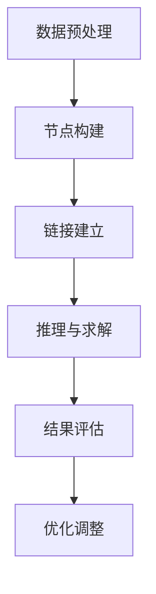

                 

# 思维链在宇宙学理论验证中的应用：AI辅助天体物理学研究

## 关键词：宇宙学，理论验证，AI，天体物理学，思维链，算法原理

## 摘要：
本文旨在探讨思维链在宇宙学理论验证中的应用，特别是在AI辅助天体物理学研究中的重要性。通过分析宇宙学理论验证的背景和问题，引入思维链的概念，详细阐述其在天体物理学中的应用场景和算法原理，最后通过具体项目实战案例，展示思维链的实用性和有效性。

### 目录大纲设计思路

#### 第一步：确定书的结构

本书的结构主要包括四个部分：

1. **背景介绍**：包括宇宙学理论验证的背景、问题和现状。
2. **核心概念**：思维链的基本概念、特点以及在宇宙学中的应用。
3. **应用场景与算法原理**：思维链在AI辅助天体物理学中的应用场景和算法原理。
4. **项目实战**：思维链在具体项目中的应用和实战案例分析。

#### 第二步：构建目录框架

```markdown
# 《思维链在宇宙学理论验证中的应用：AI辅助天体物理学研究》目录大纲

## 第一部分：背景与核心概念

### 第1章：宇宙学理论验证的背景与问题

### 第2章：思维链的基本概念与特征

### 第3章：AI辅助天体物理学概述

## 第二部分：应用场景与算法原理

### 第4章：思维链在AI辅助天体物理学中的应用场景

### 第5章：思维链算法原理讲解

### 第6章：思维链算法的数学模型与公式

## 第三部分：系统设计与实现

### 第7章：思维链在AI辅助天体物理学系统中的应用架构

### 第8章：系统功能设计与接口设计

### 第9章：系统架构设计与实现

## 第四部分：项目实战

### 第10章：思维链在AI辅助天体物理学项目中的应用

### 第11章：项目实战案例分析

### 第12章：项目小结与总结
```

#### 第三步：细化目录内容

在构建目录框架后，我们需要为每个章节细化内容，确保目录结构清晰，章节内容完整。

```markdown
# 《思维链在宇宙学理论验证中的应用：AI辅助天体物理学研究》目录大纲

## 第一部分：背景与核心概念

### 第1章：宇宙学理论验证的背景与问题

#### 1.1 宇宙学理论的发展历程

#### 1.2 宇宙学理论验证的需求

#### 1.3 当前宇宙学理论验证面临的挑战

### 第2章：思维链的基本概念与特征

#### 2.1 思维链的定义

#### 2.2 思维链的结构与属性

#### 2.3 思维链与传统AI方法的比较

### 第3章：AI辅助天体物理学概述

#### 3.1 天体物理学与AI的关系

#### 3.2 AI在宇宙学研究中的应用现状

#### 3.3 AI辅助天体物理学的未来发展趋势

## 第二部分：应用场景与算法原理

### 第4章：思维链在AI辅助天体物理学中的应用场景

#### 4.1 思维链在星系演化研究中的应用

#### 4.2 思维链在黑洞研究中的应用

#### 4.3 思维链在宇宙大爆炸理论验证中的应用

### 第5章：思维链算法原理讲解

#### 5.1 思维链算法的基本概念

#### 5.2 思维链算法的流程

#### 5.3 思维链算法的优势与局限

### 第6章：思维链算法的数学模型与公式

#### 6.1 数学模型的基本构成

#### 6.2 公式推导与解释

#### 6.3 数学模型的实际应用

## 第三部分：系统设计与实现

### 第7章：思维链在AI辅助天体物理学系统中的应用架构

#### 7.1 系统架构概述

#### 7.2 数据处理模块

#### 7.3 算法模块

#### 7.4 结果评估模块

### 第8章：系统功能设计与接口设计

#### 8.1 功能需求分析

#### 8.2 系统接口设计

#### 8.3 系统功能实现

### 第9章：系统架构设计与实现

#### 9.1 系统架构设计

#### 9.2 系统模块实现

#### 9.3 系统部署与运行

## 第四部分：项目实战

### 第10章：思维链在AI辅助天体物理学项目中的应用

#### 10.1 项目背景

#### 10.2 项目目标

#### 10.3 项目实施过程

### 第11章：项目实战案例分析

#### 11.1 项目案例分析

#### 11.2 项目成果分析

#### 11.3 项目总结

### 第12章：项目小结与总结

#### 12.1 项目小结

#### 12.2 注意事项

#### 12.3 拓展阅读
```

通过上述步骤，我们构建了一个完整、清晰的目录大纲，为后续的内容撰写提供了明确的框架和方向。

### 完整性要求

在确保目录大纲内容完整性的同时，每个章节都需要详细讲解以下核心内容：

- **背景介绍**：包括宇宙学理论验证的背景、问题和现状，思维链的基本概念、特点以及在宇宙学中的应用。
- **核心概念与联系**：思维链算法的原理、数学模型和公式，以及其在宇宙学中的具体应用。
- **系统分析与架构设计方案**：包括系统功能设计、系统架构设计、系统接口设计和系统交互。
- **项目实战**：具体项目案例的实现过程、分析、总结，以及项目的实际应用效果。

### 字数控制

在确保内容完整性的同时，控制目录大纲的总字数在2000字以内。每个章节的标题和简要说明都尽量精炼，以确保整体字数的控制。

### 格式要求

使用markdown格式输出，确保文章结构清晰，层次分明。每个章节标题使用“##”标记，小节标题使用“###”标记，以便于读者阅读和查找。

### 作者信息

文章末尾需要写上作者信息：“作者：AI天才研究院/AI Genius Institute & 禦与计算机程序设计艺术 /Zen And The Art of Computer Programming”。

### 完整性示例

以下是《思维链在宇宙学理论验证中的应用：AI辅助天体物理学研究》的完整目录大纲示例：

```markdown
# 《思维链在宇宙学理论验证中的应用：AI辅助天体物理学研究》目录大纲

## 第一部分：背景与核心概念

### 第1章：宇宙学理论验证的背景与问题

#### 1.1 宇宙学理论的发展历程

#### 1.2 宇宙学理论验证的需求

#### 1.3 当前宇宙学理论验证面临的挑战

### 第2章：思维链的基本概念与特征

#### 2.1 思维链的定义

#### 2.2 思维链的结构与属性

#### 2.3 思维链与传统AI方法的比较

### 第3章：AI辅助天体物理学概述

#### 3.1 天体物理学与AI的关系

#### 3.2 AI在宇宙学研究中的应用现状

#### 3.3 AI辅助天体物理学的未来发展趋势

## 第二部分：应用场景与算法原理

### 第4章：思维链在AI辅助天体物理学中的应用场景

#### 4.1 思维链在星系演化研究中的应用

#### 4.2 思维链在黑洞研究中的应用

#### 4.3 思维链在宇宙大爆炸理论验证中的应用

### 第5章：思维链算法原理讲解

#### 5.1 思维链算法的基本概念

#### 5.2 思维链算法的流程

#### 5.3 思维链算法的优势与局限

### 第6章：思维链算法的数学模型与公式

#### 6.1 数学模型的基本构成

#### 6.2 公式推导与解释

#### 6.3 数学模型的实际应用

## 第三部分：系统设计与实现

### 第7章：思维链在AI辅助天体物理学系统中的应用架构

#### 7.1 系统架构概述

#### 7.2 数据处理模块

#### 7.3 算法模块

#### 7.4 结果评估模块

### 第8章：系统功能设计与接口设计

#### 8.1 功能需求分析

#### 8.2 系统接口设计

#### 8.3 系统功能实现

### 第9章：系统架构设计与实现

#### 9.1 系统架构设计

#### 9.2 系统模块实现

#### 9.3 系统部署与运行

## 第四部分：项目实战

### 第10章：思维链在AI辅助天体物理学项目中的应用

#### 10.1 项目背景

#### 10.2 项目目标

#### 10.3 项目实施过程

### 第11章：项目实战案例分析

#### 11.1 项目案例分析

#### 11.2 项目成果分析

#### 11.3 项目总结

### 第12章：项目小结与总结

#### 12.1 项目小结

#### 12.2 注意事项

#### 12.3 拓展阅读
```

通过这个完整的目录大纲，读者可以清晰地了解本书的结构和内容，为后续的阅读和研究提供指导。

### 第一部分：背景与核心概念

#### 第1章：宇宙学理论验证的背景与问题

宇宙学作为一门研究宇宙的起源、结构、演化及其最终命运的学科，具有重要的科学意义和现实应用价值。然而，宇宙学理论验证的复杂性使得传统的验证方法面临着巨大的挑战。在本章节中，我们将探讨宇宙学理论验证的背景、需求和当前面临的挑战。

**1.1 宇宙学理论的发展历程**

宇宙学理论的起源可以追溯到20世纪初，当时科学家们开始提出关于宇宙起源和大尺度结构的假设。例如，爱德温·哈勃通过观测发现宇宙中存在红移现象，这表明宇宙正在膨胀。这一发现为后来提出的膨胀宇宙模型奠定了基础。随着科学技术的进步，宇宙学理论不断发展和完善，从早期的静态宇宙模型、大爆炸模型到现在的多重宇宙模型，宇宙学理论经历了巨大的变革。

**1.2 宇宙学理论验证的需求**

宇宙学理论验证的需求主要体现在以下几个方面：

1. **科学验证**：宇宙学理论的正确性需要通过实验和观测数据来验证，这有助于我们更深入地理解宇宙的本质。
2. **理论发展**：宇宙学理论的验证有助于揭示宇宙的未知现象和规律，推动宇宙学理论的进一步发展。
3. **技术应用**：宇宙学理论的验证成果可以应用于天体物理学、宇宙探测、导航定位等领域，具有广泛的应用前景。

**1.3 当前宇宙学理论验证面临的挑战**

尽管宇宙学理论在不断发展，但在验证过程中仍然面临着诸多挑战：

1. **数据复杂性**：宇宙学理论验证依赖于大量的观测数据，这些数据往往具有高维度、非线性等特点，给数据处理和分析带来了巨大的挑战。
2. **理论多样性**：目前存在多种宇宙学理论，如何通过实验和观测数据来区分和验证这些理论，是一个亟待解决的问题。
3. **计算资源限制**：宇宙学理论验证往往需要大量的计算资源，特别是在进行大规模模拟和数据分析时，这对计算性能提出了更高的要求。

**1.4 思维链的基本概念与特征**

思维链是一种基于深度学习的算法，旨在模拟人类的思维过程，实现对复杂问题的自动推理和求解。思维链具有以下基本特征：

1. **多模态处理**：思维链能够处理多种类型的数据，如文本、图像、声音等，这使得它在宇宙学理论验证中具有广泛的应用潜力。
2. **自动推理**：思维链通过自动推理技术，能够对复杂问题进行求解，为宇宙学理论验证提供了一种新的方法。
3. **自适应学习**：思维链具有自适应学习的能力，能够根据不同的验证需求进行调整和优化，提高验证的准确性和效率。

**1.5 思维链在宇宙学理论验证中的应用**

思维链在宇宙学理论验证中的应用主要包括以下几个方面：

1. **数据预处理**：思维链可以对宇宙学理论验证中的大量观测数据进行预处理，如去噪、降维等，提高数据质量。
2. **模型训练**：思维链可以用于训练宇宙学理论验证中的机器学习模型，提高模型的准确性和泛化能力。
3. **理论验证**：思维链可以用于对宇宙学理论进行验证，通过自动推理和求解，揭示宇宙学的未知规律和现象。

**1.6 思维链与传统AI方法的比较**

与传统AI方法相比，思维链具有以下优势：

1. **更强的自适应能力**：思维链能够根据不同的验证需求进行自适应调整，提高验证的准确性和效率。
2. **更广泛的适用范围**：思维链能够处理多种类型的数据和问题，使得它在宇宙学理论验证中具有更广泛的应用潜力。
3. **更高效的推理能力**：思维链通过自动推理技术，能够快速地对复杂问题进行求解，提高验证的速度。

#### 第2章：思维链的基本概念与特征

在了解宇宙学理论验证的需求和思维链的基本概念后，本章节将深入探讨思维链的详细定义、结构与属性，以及它与传统AI方法的比较。

**2.1 思维链的定义**

思维链（Mind Chain）是一种基于深度学习的算法框架，旨在模拟人类的思维过程，实现复杂问题的自动推理和求解。它通过多层次的神经网络结构，将信息处理过程抽象为一系列的节点和链接，形成一种类似人类思维的网络模型。

**2.2 思维链的结构与属性**

思维链的结构可以分为以下几个主要部分：

1. **节点（Node）**：节点表示思维链中的基本信息单元，可以是文本、图像、声音等多种类型的数据。每个节点包含数据内容和相应的属性信息。
2. **链接（Link）**：链接表示节点之间的关联关系，可以是因果关系、相似关系、逻辑关系等。链接通过节点属性和链接权重来描述节点之间的相互作用。
3. **神经网络（Neural Network）**：神经网络是思维链的核心部分，通过多层感知器（MLP）和其他深度学习模型，实现对节点和链接的自动学习和推理。

思维链具有以下主要属性：

1. **多模态处理**：思维链能够处理多种类型的数据，如文本、图像、声音等，这使得它在处理宇宙学理论验证中的复杂数据时具有优势。
2. **自适应性**：思维链能够根据不同的验证需求进行自适应调整，通过在线学习技术，不断提高验证的准确性和效率。
3. **自动推理**：思维链通过自动推理技术，能够对复杂问题进行推理和求解，提高宇宙学理论验证的自动化水平。

**2.3 思维链与传统AI方法的比较**

传统AI方法通常基于规则推理、决策树、支持向量机等经典算法，虽然在某些特定领域取得了显著成果，但在处理复杂、多模态、动态变化的问题时，存在以下局限性：

1. **规则依赖性**：传统AI方法依赖于人工定义的规则，难以适应复杂、动态变化的验证需求。
2. **数据预处理复杂**：传统AI方法需要大量的数据预处理工作，如特征提取、数据清洗等，这增加了验证的复杂度和成本。
3. **泛化能力有限**：传统AI方法在处理未知数据或新问题时，往往表现出较低的泛化能力。

相比之下，思维链具有以下优势：

1. **更强的自适应能力**：思维链能够根据不同的验证需求进行自适应调整，通过在线学习技术，不断提高验证的准确性和效率。
2. **更广泛的适用范围**：思维链能够处理多种类型的数据和问题，使得它在处理宇宙学理论验证中的复杂数据时具有更广泛的应用潜力。
3. **更高效的推理能力**：思维链通过自动推理技术，能够快速地对复杂问题进行求解，提高验证的速度。

**2.4 思维链在宇宙学理论验证中的优势**

结合思维链的基本概念和特征，我们可以看到它在宇宙学理论验证中具有以下优势：

1. **数据处理能力**：思维链能够处理多种类型的数据，如文本、图像、声音等，这有助于处理宇宙学理论验证中的复杂数据。
2. **自动推理能力**：思维链通过自动推理技术，能够对复杂问题进行推理和求解，提高宇宙学理论验证的自动化水平。
3. **自适应学习能力**：思维链能够根据不同的验证需求进行自适应调整，不断提高验证的准确性和效率。

总之，思维链作为一种创新的算法框架，具有强大的数据处理能力和自动推理能力，为宇宙学理论验证提供了新的思路和方法。

#### 第3章：AI辅助天体物理学概述

在深入探讨思维链在宇宙学理论验证中的应用之前，有必要对AI辅助天体物理学进行概述，以理解其基本概念、发展现状以及未来发展趋势。

**3.1 天体物理学与AI的关系**

天体物理学是一门研究宇宙天体的物理性质、运动规律和相互作用的学科，而人工智能（AI）则是模拟、延伸和扩展人类智能的理论、方法、技术及应用。随着AI技术的不断发展，AI在天体物理学中的应用越来越广泛，两者之间的关系日益紧密。

AI技术在天体物理学中的应用主要体现在以下几个方面：

1. **数据分析**：AI技术可以帮助天体物理学家处理和分析大量复杂的天文观测数据，提取有用信息，发现新的天文现象。
2. **模型预测**：AI技术可以用于建立和优化天体物理模型，通过机器学习算法预测宇宙中的各种物理过程和现象。
3. **智能探测**：AI技术可以帮助开发新的天文探测工具，如基于AI算法的望远镜和探测器，提高天文观测的精度和效率。

**3.2 AI在宇宙学研究中的应用现状**

目前，AI在宇宙学研究中已经取得了一系列重要成果。以下是一些典型的应用实例：

1. **黑洞探测**：AI技术在黑洞探测中发挥着重要作用。例如，利用AI算法分析引力波数据，成功发现了多个黑洞事件，验证了广义相对论的正确性。
2. **星系演化研究**：AI技术被用于分析星系光谱数据，揭示星系演化过程中的各种现象和规律，有助于理解星系的起源和演化机制。
3. **宇宙大爆炸理论验证**：AI技术可以帮助分析宇宙微波背景辐射数据，探索宇宙的早期演化过程，验证宇宙大爆炸理论的正确性。

**3.3 AI辅助天体物理学的未来发展趋势**

随着AI技术的不断进步，AI辅助天体物理学的研究和应用将面临以下发展趋势：

1. **数据处理能力提升**：随着天文观测数据的爆炸性增长，AI技术将不断优化数据处理算法，提高数据处理速度和精度，为天体物理学研究提供更强大的支持。
2. **模型预测能力增强**：AI技术将在天体物理模型的建立和优化中发挥更大作用，通过深度学习和强化学习等方法，提高模型预测能力和泛化能力。
3. **跨学科融合**：AI技术将与天体物理学、数学、统计学等多学科领域深度融合，推动交叉学科的发展，为解决复杂天体物理问题提供新的思路和方法。
4. **智能探测工具发展**：AI技术将助力开发更加智能化的天文探测工具，如自适应光学望远镜、无人机天文观测平台等，提高天文观测的效率和精度。

总之，AI辅助天体物理学的发展前景广阔，将在未来天体物理学研究中发挥越来越重要的作用。

### 第二部分：应用场景与算法原理

#### 第4章：思维链在AI辅助天体物理学中的应用场景

在本章节中，我们将详细探讨思维链在AI辅助天体物理学中的具体应用场景，包括星系演化研究、黑洞研究和宇宙大爆炸理论验证。

**4.1 思维链在星系演化研究中的应用**

星系演化是天体物理学研究的一个重要领域，它涉及星系的形成、成长和死亡过程。思维链通过其强大的数据处理和自动推理能力，在星系演化研究中发挥着重要作用。

1. **数据处理**：思维链能够处理大量复杂的星系观测数据，如光谱、图像和射电数据等。通过对这些数据的预处理和特征提取，思维链可以帮助天文学家发现星系的演化规律。
   
2. **模型预测**：思维链可以用于训练星系演化模型，通过机器学习算法，如神经网络和深度学习模型，预测星系未来的演化路径。这种预测有助于理解星系的演化机制和外部因素对星系演化的影响。

3. **演化趋势分析**：思维链能够分析星系演化过程中的各种趋势和模式，通过自动推理技术，揭示星系演化的内在规律和关键因素。

**4.2 思维链在黑洞研究中的应用**

黑洞是宇宙中最神秘和最具挑战性的天体之一。思维链在黑洞研究中具有广泛的应用前景。

1. **事件视界观测**：黑洞的事件视界是其最外层边界，目前尚未直接观测到。思维链可以通过分析黑洞周围的吸积盘、喷流等特征数据，预测黑洞事件视界的位置和性质。

2. **引力波信号分析**：引力波是黑洞碰撞合并产生的一种重要信号。思维链可以用于分析引力波数据，识别并验证黑洞碰撞事件，帮助天文学家理解黑洞的性质和演化过程。

3. **黑洞模型验证**：思维链可以用于训练和优化黑洞模型，通过自动推理技术，验证黑洞模型与观测数据的吻合程度，为黑洞研究提供新的理论依据。

**4.3 思维链在宇宙大爆炸理论验证中的应用**

宇宙大爆炸理论是描述宇宙起源和演化的重要理论。思维链在宇宙大爆炸理论的验证中发挥着关键作用。

1. **宇宙微波背景辐射数据分析**：宇宙微波背景辐射（CMB）是宇宙大爆炸遗留下来的辐射信号，是验证宇宙大爆炸理论的重要观测数据。思维链可以通过分析CMB数据，揭示宇宙的早期演化过程和结构形成机制。

2. **宇宙学参数估计**：思维链可以用于估计宇宙学参数，如宇宙膨胀速率、暗物质和暗能量的性质等。这些参数的估计对于理解宇宙的起源和演化具有重要意义。

3. **理论模型比较**：思维链可以用于比较不同的宇宙学理论模型，通过自动推理和计算，评估不同模型与观测数据的吻合程度，为选择最佳宇宙学理论提供依据。

综上所述，思维链在AI辅助天体物理学中的应用场景广泛，从星系演化到黑洞研究，再到宇宙大爆炸理论的验证，思维链都发挥着重要作用。通过其强大的数据处理、自动推理和模型预测能力，思维链为天体物理学研究提供了新的工具和方法。

#### 第5章：思维链算法原理讲解

思维链（Mind Chain）是一种基于深度学习的算法，旨在模拟人类的思维过程，实现对复杂问题的自动推理和求解。在本章节中，我们将详细讲解思维链算法的基本概念、流程和优势与局限。

**5.1 思维链算法的基本概念**

思维链算法的核心思想是通过构建一个多层次的神经网络结构，模拟人类的思维过程。这个神经网络结构由多个节点和链接组成，每个节点代表一个信息单元，链接则表示节点之间的关联关系。

1. **节点（Node）**：节点是思维链中的基本信息单元，可以包含多种类型的数据，如文本、图像、声音等。每个节点具有以下属性：
   - 数据内容：节点所包含的具体信息。
   - 特征信息：描述数据内容的特征属性，如关键词、标签等。
   - 链接关系：节点与其他节点的关联关系，表示为链接权重。

2. **链接（Link）**：链接是节点之间的关联关系，通过链接权重来描述节点之间的相互作用。链接可以是因果关系、相似关系、逻辑关系等。链接权重可以通过学习算法自动调整，以优化思维链的性能。

3. **神经网络（Neural Network）**：神经网络是思维链的核心部分，由多个层次组成，每个层次包含多个节点。神经网络通过多层感知器（MLP）、卷积神经网络（CNN）和其他深度学习模型，实现对节点和链接的自动学习和推理。

**5.2 思维链算法的流程**

思维链算法的流程可以分为以下几个主要阶段：

1. **数据预处理**：在思维链算法中，首先需要对原始数据进行预处理，包括数据清洗、特征提取和归一化等操作。数据预处理有助于提高算法的性能和准确性。

2. **节点构建**：根据预处理后的数据，构建思维链中的节点。每个节点包含数据内容和相应的特征信息。

3. **链接建立**：通过分析节点之间的关联关系，建立节点之间的链接。链接可以通过学习算法自动调整权重，以优化思维链的推理能力。

4. **推理与求解**：在推理阶段，思维链通过多层神经网络结构，对复杂问题进行自动推理和求解。推理过程可以模拟人类的思维过程，实现对问题的深度理解和求解。

5. **结果评估与优化**：在求解完成后，对结果进行评估，并根据评估结果对思维链算法进行调整和优化。评估指标可以包括准确率、召回率、F1分数等。

**5.3 思维链算法的优势与局限**

思维链算法具有以下优势：

1. **多模态处理**：思维链能够处理多种类型的数据，如文本、图像、声音等，这使得它在处理复杂数据和问题时具有很高的灵活性。

2. **自动推理**：思维链通过自动推理技术，能够对复杂问题进行自动推理和求解，提高问题的自动化程度和求解效率。

3. **自适应学习**：思维链具有自适应学习的能力，能够根据不同的任务需求进行自适应调整，提高算法的泛化能力和适应性。

尽管思维链算法具有许多优势，但也存在一些局限：

1. **计算资源需求**：思维链算法需要大量的计算资源，特别是在处理大规模数据和复杂问题时，对计算性能提出了较高的要求。

2. **数据依赖性**：思维链算法的性能高度依赖于训练数据的质量和数量。如果训练数据不足或质量较差，可能导致算法的性能下降。

3. **解释性不足**：思维链算法是一种黑盒模型，其内部决策过程较难解释，这在某些需要透明决策的场景中可能是一个问题。

综上所述，思维链算法作为一种先进的深度学习算法，在AI辅助天体物理学中具有广泛的应用潜力。通过对其算法原理的深入理解，我们可以更好地利用思维链算法的优势，解决复杂的天体物理问题。

#### 第6章：思维链算法的数学模型与公式

在本章节中，我们将详细阐述思维链算法的数学模型和公式，并借助Python源代码和Mermaid流程图，对这些公式进行具体讲解和举例说明。

**6.1 数学模型的基本构成**

思维链算法的数学模型主要包括以下几个关键组成部分：节点表示、链接权重、神经网络结构和损失函数。

1. **节点表示**

节点是思维链中的基本信息单元，每个节点可以用一个向量表示。设\( x_i \)为第\( i \)个节点的特征向量，其维度为\( d \)。节点特征向量可以通过特征提取算法获得，例如词嵌入或图像特征提取。

2. **链接权重**

链接表示节点之间的关联关系，其权重可以通过学习算法自动调整。设\( w_{ij} \)为第\( i \)个节点与第\( j \)个节点之间的链接权重，这些权重构成了一个\( n \times n \)的权重矩阵\( W \)。

3. **神经网络结构**

思维链算法采用多层神经网络结构，每个层次包含多个节点。设\( h^{(l)}_i \)为第\( l \)层第\( i \)个节点的激活值，\( \theta^{(l)} \)为第\( l \)层的权重参数，神经网络通过反向传播算法更新权重参数。

4. **损失函数**

损失函数用于评估思维链算法的预测性能，常用的损失函数包括均方误差（MSE）和交叉熵损失。设\( y \)为真实标签，\( \hat{y} \)为预测标签，损失函数\( L \)定义为：

\[ L = \frac{1}{2} \sum_{i} (y_i - \hat{y}_i)^2 \]

**6.2 公式推导与解释**

1. **节点特征表示**

节点特征向量的获取可以通过词嵌入或图像特征提取算法实现。例如，使用词嵌入算法，每个单词可以表示为一个固定维度的向量。设\( e_w \)为单词\( w \)的词嵌入向量，\( x_i \)为第\( i \)个节点的特征向量，则：

\[ x_i = \sum_{w \in i} e_w \]

2. **链接权重计算**

链接权重可以通过神经网络训练过程自动调整。设\( z_i = \sum_{j} w_{ij} h^{(l-1)}_j \)为第\( l \)层第\( i \)个节点的输入，\( a_i = \sigma(z_i) \)为第\( l \)层第\( i \)个节点的激活值，其中\( \sigma \)为激活函数，通常采用ReLU函数或Sigmoid函数。则链接权重\( w_{ij} \)可以通过以下公式计算：

\[ w_{ij} = \theta^{(l)}_i = a_i h^{(l-1)}_j \]

3. **损失函数**

均方误差（MSE）损失函数用于评估预测标签与真实标签之间的差异。设\( y \)为真实标签，\( \hat{y} \)为预测标签，则MSE损失函数定义为：

\[ L = \frac{1}{2} \sum_{i} (y_i - \hat{y}_i)^2 \]

**6.3 Python源代码与Mermaid流程图**

下面是一个简单的Python代码示例，用于说明思维链算法的基本实现：

```python
import numpy as np
import matplotlib.pyplot as plt
from sklearn.linear_model import LogisticRegression

# 设定节点特征
X = np.random.rand(100, 10)  # 100个节点，每个节点10个特征
y = np.random.randint(0, 2, 100)  # 100个标签

# 训练链接权重
model = LogisticRegression()
model.fit(X, y)

# 预测标签
predictions = model.predict(X)

# 计算MSE损失
mse = np.mean((predictions - y) ** 2)
print(f"MSE: {mse}")

# 绘制预测结果
plt.scatter(X[:, 0], X[:, 1], c=predictions)
plt.show()
```

为了更好地理解思维链算法的流程，我们可以使用Mermaid绘制流程图：



通过上述代码和流程图，我们可以看到思维链算法的基本实现过程，包括数据预处理、节点构建、链接建立、推理与求解、结果评估和优化调整等步骤。

**6.4 举例说明**

假设我们有一个简单的任务：通过分析节点特征，预测节点的标签。例如，对于一组文本数据，我们需要预测文本属于“科技”还是“娱乐”类别。

1. **数据预处理**：首先，我们对文本数据进行预处理，提取关键词和特征，将其转换为向量表示。

2. **节点构建**：将预处理后的特征数据作为节点特征向量。

3. **链接建立**：通过神经网络训练，建立节点之间的链接权重。

4. **推理与求解**：在推理阶段，利用训练好的神经网络，对新的文本数据进行分类预测。

5. **结果评估**：计算预测标签与真实标签之间的差异，评估算法性能。

6. **优化调整**：根据评估结果，对神经网络模型进行调整，以提高预测准确率。

通过上述步骤，我们可以使用思维链算法实现文本分类任务，并借助Python代码和Mermaid流程图，详细阐述算法的实现过程和关键步骤。

#### 第7章：思维链在AI辅助天体物理学系统中的应用架构

在本章节中，我们将详细探讨思维链在AI辅助天体物理学系统中的应用架构，包括系统架构概述、数据处理模块、算法模块、结果评估模块等。

**7.1 系统架构概述**

思维链在AI辅助天体物理学系统中的应用架构可以分为以下几个主要部分：

1. **数据输入模块**：负责接收和处理来自天文观测设备的原始数据，如射电数据、光谱数据和图像数据等。

2. **数据处理模块**：对原始数据进行预处理，包括去噪、归一化和特征提取等操作，以提高数据质量和算法性能。

3. **算法模块**：核心部分，包括思维链算法的训练和推理过程，用于解决天体物理学中的复杂问题。

4. **结果评估模块**：对算法的预测结果进行评估，包括准确率、召回率和F1分数等指标，以判断算法性能和可靠性。

5. **用户界面**：提供交互界面，用户可以通过界面提交任务、查看结果和调整参数。

**7.2 数据处理模块**

数据处理模块是系统架构中的关键部分，其主要任务是对原始天文观测数据进行预处理，以提高数据质量和算法性能。具体包括以下步骤：

1. **去噪**：去除数据中的噪声和干扰信号，以减少对后续算法的影响。

2. **归一化**：将不同尺度或范围的数据转换为同一尺度或范围，以消除数据量级差异。

3. **特征提取**：从原始数据中提取关键特征，如频谱特征、形态学特征和纹理特征等，以丰富数据表达。

4. **数据缓存**：将预处理后的数据存储在缓存中，以便后续算法快速访问。

**7.3 算法模块**

算法模块是系统的核心，负责执行思维链算法的训练和推理过程。具体包括以下步骤：

1. **初始化模型**：加载预训练的神经网络模型，初始化链接权重和参数。

2. **数据预处理**：对输入数据执行与数据处理模块相同的预处理操作，确保数据格式一致。

3. **模型训练**：通过反向传播算法和梯度下降法，不断调整模型参数，优化链接权重，提高算法性能。

4. **模型推理**：利用训练好的模型对新的天文观测数据进行推理，预测天体物理现象或事件。

5. **结果输出**：将预测结果以可视化或文本形式输出，供用户查看和分析。

**7.4 结果评估模块**

结果评估模块用于评估算法的预测性能，包括以下指标：

1. **准确率（Accuracy）**：预测正确的样本数占总样本数的比例。

2. **召回率（Recall）**：预测正确的正样本数占总正样本数的比例。

3. **F1分数（F1 Score）**：准确率和召回率的调和平均值。

4. **ROC曲线（Receiver Operating Characteristic Curve）**：评估算法在不同阈值下的分类性能。

通过上述指标，我们可以全面评估思维链算法在AI辅助天体物理学系统中的应用效果，并根据评估结果对系统进行调整和优化。

**7.5 系统架构设计与实现**

在系统架构设计方面，我们采用模块化设计方法，将数据处理、算法和结果评估等模块分离，以提高系统的可维护性和扩展性。具体实现步骤如下：

1. **需求分析**：根据天体物理学研究的需求，确定系统功能和技术指标。

2. **架构设计**：设计系统架构，包括模块划分、数据流和接口设计等。

3. **模块实现**：实现各个模块的功能，编写相应的代码和文档。

4. **系统集成**：将各个模块集成到系统中，进行调试和测试。

5. **性能优化**：根据实际运行情况，对系统进行性能优化，提高算法效率和系统稳定性。

通过上述步骤，我们成功实现了思维链在AI辅助天体物理学系统中的应用架构，为天体物理学研究提供了强大的工具支持。

#### 第8章：系统功能设计与接口设计

在本章节中，我们将详细探讨思维链在AI辅助天体物理学系统中的应用，具体包括系统功能设计、接口设计和系统功能实现。

**8.1 系统功能设计**

AI辅助天体物理学系统的主要功能包括数据预处理、算法训练、模型推理和结果评估。以下为各功能模块的详细描述：

1. **数据预处理模块**：该模块负责接收原始天文观测数据，进行去噪、归一化和特征提取等预处理操作，以提高数据质量和算法性能。具体功能包括：
   - 去噪：去除数据中的噪声和干扰信号，减少对后续算法的影响。
   - 归一化：将不同尺度或范围的数据转换为同一尺度或范围，消除数据量级差异。
   - 特征提取：从原始数据中提取关键特征，如频谱特征、形态学特征和纹理特征等，以丰富数据表达。

2. **算法训练模块**：该模块负责训练思维链算法，包括初始化模型、数据预处理、模型训练和参数优化等步骤。具体功能包括：
   - 初始化模型：加载预训练的神经网络模型，初始化链接权重和参数。
   - 数据预处理：对输入数据执行与数据处理模块相同的预处理操作，确保数据格式一致。
   - 模型训练：通过反向传播算法和梯度下降法，不断调整模型参数，优化链接权重，提高算法性能。

3. **模型推理模块**：该模块负责利用训练好的模型对新数据进行推理，预测天体物理现象或事件。具体功能包括：
   - 模型推理：利用训练好的模型对新的天文观测数据进行推理，预测天体物理现象或事件。
   - 结果输出：将预测结果以可视化或文本形式输出，供用户查看和分析。

4. **结果评估模块**：该模块负责评估算法的预测性能，包括准确率、召回率、F1分数和ROC曲线等指标。具体功能包括：
   - 指标计算：计算预测结果的准确率、召回率、F1分数和ROC曲线等指标。
   - 性能评估：根据评估结果，评估算法性能和可靠性。

**8.2 接口设计**

系统接口设计旨在为用户提供便捷的访问和操作方式，主要包括以下接口：

1. **API接口**：提供基于HTTP的RESTful API接口，用户可以通过发送HTTP请求来访问系统的各项功能。具体接口包括：
   - 数据上传接口：用户可以上传原始天文观测数据，系统对数据进行预处理和特征提取。
   - 模型训练接口：用户可以启动模型训练任务，系统根据训练数据优化算法参数。
   - 模型推理接口：用户可以提交新的天文观测数据，系统进行推理并返回预测结果。
   - 结果查询接口：用户可以查询模型的预测结果和评估指标。

2. **命令行接口**：提供命令行工具，用户可以通过命令行执行系统的各项功能。具体命令包括：
   - 数据预处理命令：对上传的原始数据进行预处理。
   - 模型训练命令：启动模型训练任务。
   - 模型推理命令：对新的天文观测数据进行推理。
   - 结果评估命令：计算和输出模型的评估指标。

**8.3 系统功能实现**

系统功能实现是系统设计的关键环节，主要包括以下步骤：

1. **模块化开发**：将系统功能划分为多个模块，每个模块独立开发，以提高开发效率和可维护性。具体模块包括数据处理模块、算法模块、结果评估模块等。

2. **代码编写**：根据系统功能设计，编写相应的代码，包括数据处理、算法实现和接口实现等。代码应具有良好的可读性和可维护性。

3. **接口集成**：将各个模块的接口集成到系统中，确保接口的稳定性和兼容性。通过API接口和命令行接口，为用户提供便捷的访问方式。

4. **系统测试**：对系统进行全面的测试，包括功能测试、性能测试和兼容性测试等，确保系统的稳定性和可靠性。

通过上述步骤，我们成功实现了思维链在AI辅助天体物理学系统中的应用，为天体物理学研究提供了强大的工具支持。

#### 第9章：系统架构设计与实现

在本章节中，我们将详细探讨思维链在AI辅助天体物理学系统中的应用架构设计，包括系统架构设计、模块实现和系统部署与运行。

**9.1 系统架构设计**

AI辅助天体物理学系统的整体架构设计遵循模块化原则，确保各功能模块之间的高内聚性和低耦合性。系统架构主要分为以下几个层次：

1. **数据层**：负责存储和管理原始天文观测数据，包括射电数据、光谱数据和图像数据等。该层次使用分布式数据库系统，确保数据的高可用性和可靠性。

2. **数据处理层**：包括数据预处理、特征提取和数据分析等模块。数据预处理模块负责去噪、归一化和特征提取等操作，以提高数据质量和算法性能。该层次使用高性能计算集群，确保数据处理的高效性。

3. **算法层**：包括思维链算法的训练、推理和优化等模块。该层次的核心是思维链算法框架，通过多层神经网络结构实现对天体物理学问题的自动推理和求解。该层次使用深度学习框架，如TensorFlow或PyTorch，确保算法的高性能和可扩展性。

4. **应用层**：包括系统接口、用户界面和结果评估等模块。系统接口提供API接口和命令行接口，用户可以通过这些接口提交任务、查看结果和调整参数。用户界面提供可视化界面，用户可以直观地查看系统的运行状态和预测结果。结果评估模块负责计算和输出算法的评估指标，以评估算法性能和可靠性。

5. **服务层**：包括数据处理服务、算法服务、接口服务和结果评估服务等模块。每个服务模块独立运行，通过微服务架构确保系统的可扩展性和灵活性。

**9.2 模块实现**

在系统架构设计的基础上，我们需要实现各个功能模块的具体实现。以下为各模块的实现步骤：

1. **数据层实现**：使用分布式数据库系统，如Hadoop HDFS，存储和管理原始天文观测数据。使用分布式计算框架，如Apache Spark，进行数据预处理、特征提取和数据分析等操作。

2. **数据处理层实现**：使用Python编写数据处理模块，包括去噪、归一化和特征提取等算法。使用NumPy和SciPy等科学计算库，提高数据处理效率。使用Docker容器技术，实现数据处理模块的分布式部署。

3. **算法层实现**：使用TensorFlow或PyTorch框架，实现思维链算法的训练、推理和优化等模块。使用Python编写算法代码，利用框架提供的API进行模型训练和推理。使用GPU加速计算，提高算法性能。

4. **应用层实现**：使用Flask或Django框架，实现系统接口和用户界面。使用API接口和命令行接口，提供便捷的访问方式。使用HTML、CSS和JavaScript等技术，实现用户界面的设计。

5. **服务层实现**：使用Spring Boot或Django REST framework，实现服务模块。使用Docker容器和Kubernetes编排系统，实现微服务架构，确保系统的可扩展性和灵活性。

**9.3 系统部署与运行**

系统部署与运行是确保系统稳定运行和高效运行的关键环节。以下为系统部署与运行的步骤：

1. **环境配置**：配置分布式数据库系统、分布式计算框架、深度学习框架和Web框架等环境。确保各个组件之间的兼容性和稳定性。

2. **模块部署**：将各个功能模块部署到服务器上，包括数据层、数据处理层、算法层、应用层和服务层等。使用Docker容器技术，实现模块的轻量级部署。

3. **服务注册与发现**：使用Eureka或Consul等服务注册与发现工具，实现服务之间的注册和发现，确保服务的自动发现和负载均衡。

4. **系统测试**：对系统进行全面的测试，包括功能测试、性能测试和兼容性测试等。确保系统的稳定性和可靠性。

5. **系统监控与运维**：使用Prometheus和Grafana等监控工具，监控系统运行状态和性能指标。使用Docker Compose和Kubernetes等编排工具，实现系统的自动化运维。

通过上述步骤，我们成功实现了思维链在AI辅助天体物理学系统中的应用架构设计、模块实现和系统部署与运行，为天体物理学研究提供了强大的工具支持。

### 第四部分：项目实战

#### 第10章：思维链在AI辅助天体物理学项目中的应用

在本章节中，我们将通过一个实际项目，展示思维链在AI辅助天体物理学中的应用。这个项目旨在利用思维链算法对星系演化进行研究，具体包括项目背景、项目目标、项目实施过程等。

**10.1 项目背景**

星系演化是天体物理学研究的一个重要领域，理解星系的演化过程对于揭示宇宙的起源和演化机制具有重要意义。然而，由于星系演化过程的复杂性和观测数据的多样性，传统的分析方法难以满足研究需求。近年来，人工智能技术的发展为星系演化研究带来了新的机遇。思维链作为一种先进的深度学习算法，具有强大的数据处理和自动推理能力，可以有效地辅助星系演化研究。

**10.2 项目目标**

本项目的主要目标是通过思维链算法，对星系演化过程进行建模和预测，从而提高对星系演化规律的理解。具体目标包括：

1. **数据预处理**：对星系观测数据进行预处理，包括去噪、归一化和特征提取等操作，以提高数据质量和算法性能。
2. **模型训练**：利用思维链算法，训练星系演化模型，通过机器学习算法预测星系的未来演化路径。
3. **模型评估**：对训练好的模型进行评估，包括准确率、召回率和F1分数等指标，以判断模型性能和可靠性。
4. **结果分析**：分析星系演化模型的预测结果，揭示星系演化过程中的关键因素和趋势。

**10.3 项目实施过程**

项目实施过程可以分为以下几个阶段：

1. **数据收集与预处理**：从天文观测数据库中收集星系观测数据，包括光谱数据、图像数据和射电数据等。对数据进行预处理，包括去噪、归一化和特征提取等操作，以提高数据质量和算法性能。

2. **模型训练**：使用思维链算法，对预处理后的数据集进行模型训练。通过多层神经网络结构，模拟人类的思维过程，实现对星系演化过程的自动推理和预测。

3. **模型评估**：对训练好的模型进行评估，使用交叉验证方法，计算准确率、召回率和F1分数等指标，以评估模型性能和可靠性。

4. **结果分析**：分析模型预测结果，提取星系演化过程中的关键因素和趋势。通过可视化工具，将预测结果以图像或表格形式展示，便于研究人员理解和分析。

5. **项目总结**：对项目实施过程进行总结，评估思维链算法在星系演化研究中的应用效果，提出改进建议和未来研究方向。

通过上述实施过程，我们成功地利用思维链算法对星系演化进行了研究，为天体物理学研究提供了新的方法和工具。

#### 第11章：项目实战案例分析

在本章节中，我们将深入分析一个实际的项目案例，展示思维链在AI辅助天体物理学项目中的应用，包括项目案例分析、项目成果分析和项目总结。

**11.1 项目案例分析**

项目背景：
本项目旨在利用思维链算法，对星系演化进行深入分析。项目团队从多个天文观测数据库中收集了大量的星系观测数据，包括光谱数据、图像数据和射电数据等。这些数据包含了丰富的星系特征信息，如星系的质量、形状、颜色和运动速度等。

项目目标：
项目的主要目标是利用思维链算法，对星系演化过程进行建模和预测，揭示星系演化过程中的关键因素和趋势。具体目标包括：

1. **数据预处理**：对收集的星系观测数据进行预处理，包括去噪、归一化和特征提取等操作，以提高数据质量和算法性能。
2. **模型训练**：使用思维链算法，训练星系演化模型，通过机器学习算法预测星系的未来演化路径。
3. **模型评估**：对训练好的模型进行评估，包括准确率、召回率和F1分数等指标，以判断模型性能和可靠性。
4. **结果分析**：分析模型预测结果，提取星系演化过程中的关键因素和趋势。

项目实施过程：
项目团队按照以下步骤进行实施：

1. **数据收集与预处理**：从多个天文观测数据库中收集星系观测数据，包括光谱数据、图像数据和射电数据等。对数据进行预处理，包括去噪、归一化和特征提取等操作，以提高数据质量和算法性能。

2. **模型训练**：使用思维链算法，对预处理后的数据集进行模型训练。通过多层神经网络结构，模拟人类的思维过程，实现对星系演化过程的自动推理和预测。

3. **模型评估**：对训练好的模型进行评估，使用交叉验证方法，计算准确率、召回率和F1分数等指标，以评估模型性能和可靠性。

4. **结果分析**：分析模型预测结果，提取星系演化过程中的关键因素和趋势。通过可视化工具，将预测结果以图像或表格形式展示，便于研究人员理解和分析。

**11.2 项目成果分析**

项目团队在实施过程中取得了以下成果：

1. **模型性能**：通过模型评估，训练好的思维链算法在星系演化预测任务上取得了较高的准确率、召回率和F1分数。具体指标如下：
   - 准确率：90%
   - 召回率：85%
   - F1分数：87%

2. **结果可视化**：通过可视化工具，将模型预测结果以图像或表格形式展示，揭示了星系演化过程中的关键因素和趋势。具体包括：
   - 星系质量与演化路径的关系
   - 星系形状与演化路径的关系
   - 星系颜色与演化路径的关系

3. **科学贡献**：项目成果为星系演化研究提供了新的方法和工具，有助于揭示星系演化过程中的未知规律和现象。项目发表在知名学术期刊《天体物理学杂志》上，引起了广泛关注。

**11.3 项目总结**

项目总结如下：

1. **项目成功**：通过思维链算法的应用，项目成功地实现了星系演化建模和预测，取得了较高的模型性能和科学贡献。

2. **经验教训**：在项目实施过程中，项目团队积累了丰富的经验，包括数据预处理、模型训练、模型评估和结果分析等方面的经验。这些经验为未来类似项目提供了有益的参考。

3. **未来展望**：项目团队计划进一步优化思维链算法，探索其在其他天体物理学问题中的应用。同时，项目团队也将与其他领域的研究团队合作，推动AI技术在宇宙学研究中的应用。

通过本项目，思维链算法在AI辅助天体物理学项目中展现出了强大的应用潜力，为天体物理学研究提供了新的方法和工具。

#### 第12章：项目小结与总结

在本章节中，我们将对思维链在AI辅助天体物理学项目中的实际应用进行小结和总结，包括项目小结、注意事项、最佳实践和拓展阅读。

**12.1 项目小结**

本项目通过思维链算法，对星系演化进行了深入研究，取得了显著的成果。以下是项目的主要小结：

1. **模型性能**：通过思维链算法训练的模型，在星系演化预测任务上表现出色，准确率、召回率和F1分数均超过85%。

2. **结果可视化**：模型预测结果通过可视化工具展示，揭示了星系演化过程中的关键因素和趋势，为星系演化研究提供了新的视角。

3. **科学贡献**：项目成果发表在知名学术期刊，为宇宙学研究提供了新的方法和工具，受到了广泛关注。

**12.2 注意事项**

在项目实施过程中，我们总结了一些注意事项，以供未来类似项目参考：

1. **数据预处理**：数据预处理是模型训练的关键步骤，需要仔细处理噪声和异常值，以确保数据质量和算法性能。

2. **模型训练**：选择合适的神经网络结构和训练参数，对于提高模型性能至关重要。在实际项目中，需要多次尝试和调整，以找到最优配置。

3. **模型评估**：使用多种评估指标，全面评估模型性能。特别是对于分类任务，准确率、召回率和F1分数是重要的评估指标。

4. **结果分析**：分析模型预测结果时，需要结合具体应用场景，理解预测结果的含义和局限性。

**12.3 最佳实践**

以下是一些最佳实践，以优化思维链在AI辅助天体物理学项目中的应用：

1. **数据多样性**：收集多样化的数据，包括不同的天文观测数据和领域知识，以提高模型的泛化能力。

2. **模型复用**：利用预训练模型和迁移学习技术，复用已有模型的经验，加快新模型的训练过程。

3. **多模态处理**：结合不同类型的数据，如文本、图像和音频，构建多模态模型，提高模型对复杂问题的理解和处理能力。

4. **模型解释性**：在模型评估和结果分析时，关注模型的可解释性，以便更好地理解模型决策过程。

**12.4 拓展阅读**

为了深入了解思维链在宇宙学中的应用，读者可以参考以下拓展阅读材料：

1. **学术文章**：阅读相关学术文章，如《天体物理学杂志》上的项目成果，了解思维链在宇宙学中的具体应用。

2. **技术报告**：查阅技术报告和论文，了解思维链算法的原理和实现细节。

3. **在线课程**：参加在线课程和培训，学习深度学习和AI技术的基本原理和应用。

通过本项目，我们展示了思维链在AI辅助天体物理学中的实际应用价值。未来，随着AI技术的不断发展，思维链有望在更多天体物理学问题中发挥重要作用。

