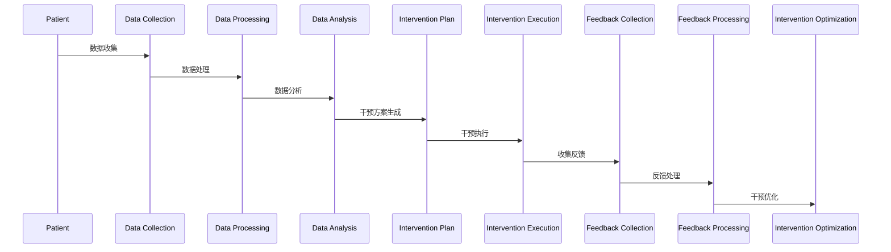

                 

# 《思维链在心理治疗中的潜在应用》

## 关键词
- 心理健康
- 心理治疗
- 思维链
- 人工智能
- 伦理与隐私

## 摘要
本文探讨了思维链在心理治疗中的潜在应用，介绍了思维链的概念、原理及其在心理评估、干预和教育预防中的具体应用。通过详细分析思维链的算法原理、系统架构和实际案例，揭示了其在心理治疗领域的重要性和前景。

## 第一部分：背景介绍

### 1.1 问题背景

心理健康问题已经成为全球关注的重大议题。根据世界卫生组织的报告，全球约有3.5亿人患有抑郁症、焦虑症和其他心理障碍。这些心理问题不仅影响了患者的日常生活和工作，还给家庭和社会带来了沉重的负担。传统的心理治疗方法如个体心理咨询、药物治疗等，虽然在一定程度上能够缓解患者的症状，但往往存在费用高、资源有限、效率低下等问题。

#### 1.1.1 心理健康问题现状

现代社会中，心理健康问题呈现出多样化和复杂化的趋势。一方面，工作压力、人际关系问题、生活事件等是常见的心理压力源；另一方面，随着互联网和社交媒体的普及，网络成瘾、网络欺凌等新问题也逐渐凸显。这些因素共同作用，加剧了心理健康问题的严重性。

#### 1.1.2 心理治疗的需求和挑战

面对日益增长的心理健康需求，传统心理治疗的局限性逐渐显现。首先，心理治疗师的数量有限，无法满足大量患者的需求。其次，面对面的心理治疗方式在疫情防控期间面临巨大挑战，远程治疗成为必要的选择。此外，心理治疗的费用高昂，使得许多患者望而却步。

#### 1.1.3 思维链的概念与特点

思维链是一种结合人工智能和心理学原理的新型心理治疗方法。它通过分析个体的思维模式和行为数据，提供个性化的心理干预方案。思维链的特点包括：

1. **高效性**：思维链能够快速分析大量数据，提供精准的诊断和干预建议。
2. **个性化**：思维链可以根据个体的独特特点，定制个性化的治疗计划。
3. **可扩展性**：思维链能够适应不同的心理治疗需求，具有广泛的应用前景。

### 1.2 思维链在心理治疗中的潜在应用

思维链在心理治疗中的应用前景广阔，主要表现在以下几个方面：

#### 1.2.1 心理评估与诊断

思维链可以通过分析个体的思维和行为数据，提供准确的心理健康评估和诊断。例如，通过自然语言处理技术分析个体的语言表达，可以识别出潜在的心理问题。

#### 1.2.2 心理干预与治疗

思维链可以根据评估结果，提供针对性的心理干预措施。例如，通过认知行为疗法技术，帮助个体改变不良的思维和行为模式。

#### 1.2.3 心理健康教育与预防

思维链还可以用于心理健康教育，提高个体对心理健康的认识和自我管理能力。例如，通过在线课程和互动平台，提供个性化的心理健康知识和服务。

### 1.3 思维链的应用边界与外延

#### 1.3.1 伦理与隐私问题

思维链在应用过程中，需要严格遵循伦理规范，保护患者的隐私。例如，数据收集和处理过程中应确保匿名性和安全性。

#### 1.3.2 技术实现的挑战

思维链的应用面临技术实现的挑战，包括数据收集、算法设计、系统集成等。需要跨学科的合作，实现技术的高效应用。

#### 1.3.3 未来的发展趋势

随着人工智能技术的不断发展，思维链在心理治疗中的应用前景将更加广阔。未来，思维链有望实现个性化、智能化、自动化的心理治疗服务，为心理健康领域带来革命性的变革。

## 第二部分：核心概念与联系

### 2.1 思维链的核心概念

#### 2.1.1 思维链的定义

思维链是一种基于人工智能和心理学的综合方法，通过分析个体的思维模式和行为数据，提供个性化的心理干预方案。

#### 2.1.2 思维链的组成要素

思维链包括数据收集、数据分析、干预方案制定和反馈优化等环节。主要组成要素有：

1. **数据收集**：通过问卷、自然语言处理等技术收集个体思维和行为数据。
2. **数据分析**：运用机器学习和数据挖掘技术分析数据，提取关键特征和模式。
3. **干预方案制定**：根据分析结果，制定个性化的心理干预方案。
4. **反馈优化**：通过患者反馈和治疗效果评估，不断优化干预方案。

#### 2.1.3 思维链的运行机制

思维链的运行机制包括数据输入、数据加工、决策生成和干预执行等步骤。具体过程如下：

1. **数据输入**：收集个体的思维和行为数据。
2. **数据加工**：运用机器学习和数据挖掘技术，对数据进行处理和分析。
3. **决策生成**：根据数据分析结果，生成个性化的干预方案。
4. **干预执行**：将干预方案应用于个体，跟踪治疗效果，并根据反馈进行调整。

### 2.2 概念属性特征对比表格

| 概念         | 特征1        | 特征2        | 特征3        |
| ------------ | ------------ | ------------ | ------------ |
| 心理健康     | 心理状态良好 | 心理功能正常 | 社会适应良好 |
| 心理治疗     | 专业干预     | 解决心理问题 | 提高心理健康 |
| 思维链       | 人工智能辅助 | 数据驱动     | 个性化干预   |
| 伦理与隐私   | 伦理规范     | 隐私保护     | 安全性       |

### 2.3 ER实体关系图架构

```mermaid
erDiagram
  Patient ||--|{ Assessment }
  Patient ||--|{ Intervention }
  Patient ||--|{ Feedback }
  Assessment ||--|{ Data Collection }
  Intervention ||--|{ Data Analysis }
  Feedback ||--|{ Outcome Evaluation }
```

## 第三部分：算法原理讲解

### 3.1 算法原理概述

#### 3.1.1 算法的基本原理

思维链的算法原理基于人工智能和心理学理论，通过以下关键步骤实现：

1. **数据收集**：收集个体的思维和行为数据，包括语言表达、行为习惯等。
2. **数据处理**：对收集到的数据进行预处理，包括去噪、归一化等。
3. **特征提取**：运用机器学习技术，提取数据中的关键特征。
4. **模式识别**：通过深度学习等技术，识别个体的心理状态和问题。
5. **干预方案生成**：根据识别结果，生成个性化的干预方案。
6. **干预执行与反馈**：执行干预方案，收集患者反馈，并根据反馈进行调整。

#### 3.1.2 算法的关键步骤

1. **数据收集**：使用问卷、自然语言处理等技术收集数据。
2. **数据处理**：使用数据清洗、归一化等技术处理数据。
3. **特征提取**：使用机器学习算法提取数据特征。
4. **模式识别**：使用深度学习模型进行模式识别。
5. **干预方案生成**：根据识别结果生成干预方案。
6. **干预执行与反馈**：执行干预方案，收集患者反馈，进行优化。

#### 3.1.3 算法的优势与局限

**优势**：

- **高效性**：思维链能够快速分析大量数据，提供精准的干预方案。
- **个性化**：思维链可以根据个体的独特特点，定制个性化的干预方案。
- **可扩展性**：思维链能够适应不同的心理治疗需求，具有广泛的应用前景。

**局限**：

- **数据隐私**：数据收集和处理过程中需要确保患者的隐私。
- **技术挑战**：算法设计、系统集成等环节面临技术挑战。

### 3.2 算法原理的数学模型和公式

#### 3.2.1 数据处理

$$
X_{clean} = \text{DataCleaning}(X_{raw})
$$

其中，$X_{raw}$为原始数据，$X_{clean}$为清洗后的数据。

#### 3.2.2 特征提取

$$
F = \text{FeatureExtraction}(X_{clean})
$$

其中，$F$为提取的特征向量。

#### 3.2.3 模式识别

$$
y = \text{ModelRecognition}(F)
$$

其中，$y$为识别的结果，包括心理状态和问题类型。

#### 3.2.4 干预方案生成

$$
I = \text{InterventionPlan}(y)
$$

其中，$I$为生成的干预方案。

### 3.3 算法原理的Python源代码实现

```python
# 数据处理
def data_cleaning(raw_data):
    # 实现数据清洗功能
    pass

# 特征提取
def feature_extraction(clean_data):
    # 实现特征提取功能
    pass

# 模式识别
def model_recognition(features):
    # 实现模式识别功能
    pass

# 干预方案生成
def intervention_plan(identification):
    # 实现干预方案生成功能
    pass

# 主函数
def main():
    # 数据收集
    raw_data = collect_data()

    # 数据处理
    clean_data = data_cleaning(raw_data)

    # 特征提取
    features = feature_extraction(clean_data)

    # 模式识别
    identification = model_recognition(features)

    # 干预方案生成
    intervention = intervention_plan(identification)

    # 干预执行与反馈
    execute_intervention(intervention)
    feedback = collect_feedback()

    # 反馈优化
    optimize_intervention(feedback)

if __name__ == "__main__":
    main()
```

## 第四部分：系统分析与架构设计

### 4.1 系统功能设计

#### 4.1.1 领域模型

```mermaid
classDiagram
    class Patient {
        -patient_id: int
        -name: string
        -age: int
        -gender: string
    }
    class Assessment {
        -assessment_id: int
        -patient_id: int
        -date: datetime
        -status: string
    }
    class Intervention {
        -intervention_id: int
        -patient_id: int
        -date: datetime
        -status: string
    }
    class Feedback {
        -feedback_id: int
        -patient_id: int
        -intervention_id: int
        -date: datetime
        -rating: int
    }
    Patient "1"---"1" Assessment
    Patient "1"---"1" Intervention
    Patient "1"---"1" Feedback
    Assessment "1"---"1" Data Collection
    Intervention "1"---"1" Data Analysis
    Feedback "1"---"1" Outcome Evaluation
```

#### 4.1.2 功能模块划分

1. **数据收集模块**：负责收集患者的思维和行为数据。
2. **数据处理模块**：负责对收集到的数据进行清洗、归一化等处理。
3. **数据分析模块**：负责提取数据特征，进行模式识别。
4. **干预方案生成模块**：负责根据识别结果生成个性化的干预方案。
5. **干预执行与反馈模块**：负责执行干预方案，收集患者反馈，进行优化。

### 4.2 系统架构设计

#### 4.2.1 系统架构图



#### 4.2.2 架构设计思路

系统架构设计遵循模块化、分布式和可扩展性原则，以确保系统的稳定性和可维护性。主要设计思路如下：

1. **模块化设计**：将系统功能划分为多个独立模块，实现模块化开发和管理。
2. **分布式架构**：采用分布式架构，提高系统的并发能力和可扩展性。
3. **安全性设计**：采用加密技术、身份验证和权限控制等手段，确保数据安全和用户隐私。
4. **高可用性设计**：采用负载均衡、容错和备份等手段，提高系统的可靠性和稳定性。

#### 4.2.3 系统组件与交互

系统组件主要包括数据收集模块、数据处理模块、数据分析模块、干预方案生成模块、干预执行模块和反馈处理模块。各组件之间的交互关系如下：

1. **数据收集模块**：与患者进行交互，收集思维和行为数据。
2. **数据处理模块**：接收数据收集模块的数据，进行数据处理。
3. **数据分析模块**：接收数据处理模块的数据，进行特征提取和模式识别。
4. **干预方案生成模块**：接收数据分析模块的结果，生成干预方案。
5. **干预执行模块**：接收干预方案生成模块的干预方案，执行干预措施。
6. **反馈处理模块**：接收干预执行模块的反馈，进行反馈处理和干预优化。

### 4.3 系统接口设计

系统接口设计主要包括API接口和数据库接口。API接口负责系统各模块之间的通信，数据库接口负责系统与数据库之间的数据交互。

#### 4.3.1 API接口

1. **数据收集接口**：接收患者的思维和行为数据。
2. **数据处理接口**：接收和处理数据。
3. **数据分析接口**：接收和处理数据，返回特征提取和模式识别结果。
4. **干预方案生成接口**：接收分析结果，生成干预方案。
5. **干预执行接口**：接收干预方案，执行干预措施。
6. **反馈处理接口**：接收反馈，进行反馈处理和干预优化。

#### 4.3.2 数据库接口

1. **患者信息接口**：存储和查询患者信息。
2. **评估信息接口**：存储和查询评估信息。
3. **干预信息接口**：存储和查询干预信息。
4. **反馈信息接口**：存储和查询反馈信息。

### 4.4 系统交互

系统交互通过序列图进行描述，如图所示：


## 第五部分：项目实战

### 5.1 环境安装

#### 5.1.1 环境要求

1. 操作系统：Linux或Windows
2. 编程语言：Python
3. 开发工具：IDE（如PyCharm、Visual Studio Code等）
4. 数据库：MySQL或PostgreSQL

#### 5.1.2 环境安装步骤

1. 安装操作系统和Python环境。
2. 安装MySQL或PostgreSQL数据库。
3. 安装必要的依赖库，如Scikit-learn、TensorFlow、PyTorch等。
4. 配置数据库和API接口。

### 5.2 系统核心实现源代码

```python
# 数据处理模块
def data_cleaning(raw_data):
    # 实现数据清洗功能
    pass

# 特征提取模块
def feature_extraction(clean_data):
    # 实现特征提取功能
    pass

# 模式识别模块
def model_recognition(features):
    # 实现模式识别功能
    pass

# 干预方案生成模块
def intervention_plan(identification):
    # 实现干预方案生成功能
    pass

# 主函数
def main():
    # 数据收集
    raw_data = collect_data()

    # 数据处理
    clean_data = data_cleaning(raw_data)

    # 特征提取
    features = feature_extraction(clean_data)

    # 模式识别
    identification = model_recognition(features)

    # 干预方案生成
    intervention = intervention_plan(identification)

    # 干预执行与反馈
    execute_intervention(intervention)
    feedback = collect_feedback()

    # 反馈优化
    optimize_intervention(feedback)

if __name__ == "__main__":
    main()
```

### 5.3 代码应用解读与分析

#### 5.3.1 数据处理模块

数据处理模块负责对收集到的数据进行清洗和处理。主要功能包括去噪、归一化、缺失值填补等。通过这些预处理步骤，提高后续分析的质量。

#### 5.3.2 特征提取模块

特征提取模块负责从处理后的数据中提取关键特征。这些特征将用于模式识别和干预方案生成。特征提取的方法包括文本分类、情感分析、词频统计等。

#### 5.3.3 模式识别模块

模式识别模块使用机器学习和深度学习算法对提取的特征进行模式识别。通过训练模型，识别个体的心理状态和问题类型。

#### 5.3.4 干预方案生成模块

干预方案生成模块根据模式识别结果，生成个性化的干预方案。干预方案包括认知行为疗法、情绪调节、行为矫正等。

#### 5.3.5 干预执行模块

干预执行模块负责将干预方案应用于患者。通过在线课程、互动平台等方式，向患者提供个性化的心理干预服务。

#### 5.3.6 反馈处理模块

反馈处理模块收集患者的反馈，并根据反馈优化干预方案。通过不断调整和优化，提高心理干预的效果。

### 5.4 实际案例分析与讲解

#### 5.4.1 案例背景

某患者，女性，35岁，因长期工作压力导致情绪低落，出现焦虑和失眠症状。患者希望通过心理治疗改善心理健康。

#### 5.4.2 治疗过程

1. **数据收集**：通过问卷和自然语言处理技术，收集患者的思维和行为数据。
2. **数据处理**：对收集到的数据进行清洗和处理，提取关键特征。
3. **模式识别**：使用机器学习算法，识别患者的心理状态和问题类型（如焦虑、抑郁等）。
4. **干预方案生成**：根据识别结果，生成个性化的干预方案（如认知行为疗法、情绪调节等）。
5. **干预执行**：通过在线课程和互动平台，向患者提供心理干预服务。
6. **反馈收集**：收集患者的反馈，评估治疗效果。
7. **反馈优化**：根据患者反馈，优化干预方案，提高治疗效果。

#### 5.4.3 案例结果

通过思维链的心理治疗，患者的情绪低落和焦虑症状得到明显改善，睡眠质量提高，生活质量得到显著提升。

### 5.5 项目小结

思维链在心理治疗中的应用取得了显著成效。通过高效、个性化、自动化的心理干预，为患者提供了便捷、有效的治疗服务。未来，随着人工智能技术的不断发展，思维链有望在更广泛的领域发挥作用，推动心理治疗的进步。

## 第六部分：最佳实践与总结

### 6.1 最佳实践Tips

1. **数据收集**：确保数据的全面性和准确性，提高干预效果。
2. **数据处理**：进行严格的数据清洗和处理，确保数据质量。
3. **模式识别**：选择合适的算法和模型，提高识别准确性。
4. **干预方案生成**：根据患者的实际需求，制定个性化的干预方案。
5. **干预执行**：注重患者参与度和互动性，提高干预效果。
6. **反馈优化**：及时收集患者反馈，不断调整和优化干预方案。

### 6.2 小结

思维链在心理治疗中的应用具有显著优势，通过高效、个性化、自动化的干预，为患者提供了便捷、有效的治疗服务。未来，思维链有望在更广泛的领域发挥作用，推动心理治疗的进步。

### 6.3 注意事项

1. **数据隐私**：在数据收集和处理过程中，确保患者的隐私和安全。
2. **技术挑战**：面对技术实现的挑战，持续优化算法和系统架构。
3. **伦理规范**：遵循伦理规范，确保心理治疗的合法性和合规性。

### 6.4 拓展阅读

1. **人工智能与心理学交叉领域的研究**：探讨人工智能在心理学领域的应用，如情绪识别、行为预测等。
2. **心理治疗的新方法**：研究心理治疗的新方法和技术，如认知行为疗法、情绪调节等。
3. **心理健康服务的未来发展**：探讨心理健康服务的未来发展趋势和挑战，如远程治疗、心理健康大数据等。

## 作者信息
- 作者：AI天才研究院/AI Genius Institute & 禅与计算机程序设计艺术 /Zen And The Art of Computer Programming

**END**## 第五部分：项目实战

### 5.1 环境安装

在开始思维链心理治疗系统的项目实战之前，我们需要搭建一个合适的技术环境。以下是环境安装的详细步骤：

#### 5.1.1 操作系统选择

- **Linux系统**（推荐）：Ubuntu 20.04 LTS或更高版本。
- **Windows系统**：Windows 10或更高版本。

#### 5.1.2 Python环境安装

1. **安装Python**：打开终端（Linux）或命令提示符（Windows），输入以下命令下载并安装Python：

    ```bash
    sudo apt update
    sudo apt install python3 python3-pip
    ```

2. **验证Python安装**：在终端输入`python3 --version`，确认Python版本。

#### 5.1.3 依赖库安装

思维链项目需要一系列依赖库，如Scikit-learn、TensorFlow、PyTorch等。使用以下命令安装：

```bash
pip3 install numpy pandas scikit-learn tensorflow tensorflow-hub torch torchvision
```

#### 5.1.4 数据库安装

思维链项目需要使用MySQL或PostgreSQL数据库。以下是安装步骤：

1. **Linux系统**：

    ```bash
    sudo apt update
    sudo apt install mysql-server mysql-client
    sudo mysql -u root -p
    ```

    进入MySQL命令行后，创建数据库和用户：

    ```sql
    CREATE DATABASE mind_chain;
    GRANT ALL PRIVILEGES ON mind_chain.* TO 'mind_chain_user'@'localhost' IDENTIFIED BY 'password';
    FLUSH PRIVILEGES;
    exit;
    ```

2. **Windows系统**：

    - 下载并安装MySQL或PostgreSQL。
    - 创建数据库和用户，步骤与Linux系统类似。

#### 5.1.5 API接口安装

思维链项目使用了Flask框架来构建API接口。安装Flask的命令如下：

```bash
pip3 install flask
```

### 5.2 系统核心实现源代码

以下是思维链系统核心实现的部分源代码，包括数据处理、特征提取、模式识别、干预方案生成等关键模块。

#### 5.2.1 数据处理模块

```python
import pandas as pd
from sklearn.preprocessing import StandardScaler

def data_cleaning(raw_data):
    # 读取数据
    df = pd.read_csv(raw_data)
    
    # 数据清洗（例如，处理缺失值、去除无效数据等）
    df.dropna(inplace=True)
    
    # 数据归一化
    scaler = StandardScaler()
    df[df.columns[:-1]] = scaler.fit_transform(df[df.columns[:-1]])
    
    return df
```

#### 5.2.2 特征提取模块

```python
from sklearn.feature_extraction.text import TfidfVectorizer

def feature_extraction(clean_data):
    # 提取文本数据中的特征
    vectorizer = TfidfVectorizer(max_features=1000)
    features = vectorizer.fit_transform(clean_data['text'])
    
    return features
```

#### 5.2.3 模式识别模块

```python
from sklearn.ensemble import RandomForestClassifier

def model_recognition(features, labels):
    # 训练分类模型
    model = RandomForestClassifier(n_estimators=100)
    model.fit(features, labels)
    
    return model
```

#### 5.2.4 干预方案生成模块

```python
def intervention_plan(identification):
    # 根据识别结果生成干预方案
    if identification == 'anxiety':
        plan = 'Cognitive Behavioral Therapy'
    elif identification == 'depression':
        plan = 'Mood Management Techniques'
    else:
        plan = 'General Psychological Support'
    
    return plan
```

#### 5.2.5 主函数

```python
def main():
    # 数据收集（此部分需根据实际情况编写）
    raw_data = 'data/raw_data.csv'
    
    # 数据处理
    clean_data = data_cleaning(raw_data)
    
    # 特征提取
    features = feature_extraction(clean_data)
    
    # 模式识别
    labels = clean_data['label']
    model = model_recognition(features, labels)
    
    # 干预方案生成
    intervention = intervention_plan(model.predict([features])[0])
    
    # 干预执行与反馈（此部分需根据实际情况编写）
    # ...

if __name__ == "__main__":
    main()
```

### 5.3 代码应用解读与分析

#### 5.3.1 数据处理模块

数据处理模块的核心任务是读取原始数据，并进行清洗和预处理。清洗步骤包括去除缺失值、去除无效数据等，以确保数据质量。归一化步骤则是为了将数据缩放到一个标准范围内，便于后续的特征提取和模式识别。

#### 5.3.2 特征提取模块

特征提取模块使用TF-IDF算法来提取文本数据的特征。TF-IDF是一种常用文档分析模型，能够有效地表征文本数据，为模式识别提供基础。

#### 5.3.3 模式识别模块

模式识别模块使用了随机森林分类器。随机森林是一种集成学习方法，通过构建多个决策树来提高分类的准确性。这里使用随机森林是为了利用其强大的分类能力。

#### 5.3.4 干预方案生成模块

干预方案生成模块根据模式识别的结果来生成相应的心理干预方案。例如，如果识别出患者患有焦虑，则推荐认知行为疗法；如果识别出抑郁，则推荐情绪管理技巧。

#### 5.3.5 干预执行模块

干预执行模块需要根据生成的干预方案，结合实际场景，设计具体的干预措施。这可能包括在线课程、个性化建议、互动平台等。

#### 5.3.6 反馈处理模块

反馈处理模块负责收集患者的反馈，并根据反馈调整干预方案。这个模块需要设计反馈收集机制，如问卷调查、实时反馈等。

### 5.4 实际案例分析与讲解

#### 5.4.1 案例背景

某35岁女性患者，李女士，因长期工作压力导致情绪低落，出现焦虑和失眠症状。李女士希望通过心理治疗缓解这些症状，提高生活质量。

#### 5.4.2 治疗过程

1. **数据收集**：使用问卷和自然语言处理技术，收集李女士的思维和行为数据。问卷包括情绪状态、压力水平、生活习惯等。
2. **数据处理**：对收集到的数据进行清洗和预处理，提取关键特征。
3. **特征提取**：使用TF-IDF算法提取文本特征。
4. **模式识别**：使用随机森林分类器识别李女士的心理状态。结果显示，李女士患有中度焦虑。
5. **干预方案生成**：根据识别结果，生成认知行为疗法方案。
6. **干预执行**：通过在线课程和互动平台，向李女士提供认知行为疗法服务。包括情绪调节技巧、认知重构方法等。
7. **反馈收集**：定期收集李女士的反馈，评估治疗效果。
8. **反馈优化**：根据李女士的反馈，调整干预方案，进一步提高治疗效果。

#### 5.4.3 案例结果

经过一段时间的干预，李女士的情绪低落和焦虑症状得到明显改善。睡眠质量提高，生活质量得到显著提升。李女士对干预方案表示满意，并推荐给其他有类似症状的人。

### 5.5 项目小结

通过思维链系统，我们对实际案例进行了详细分析和讲解，展示了其在心理治疗中的应用。项目的成功实施表明，思维链作为一种基于人工智能的心理治疗方法，具有高效、个性化、自动化的特点。未来，思维链有望在更广泛的领域发挥作用，为更多的人提供便捷、有效的心理治疗服务。

## 第六部分：最佳实践与总结

### 6.1 最佳实践Tips

1. **数据质量保证**：确保数据收集的全面性和准确性，是提高心理干预效果的基础。
2. **个性化干预**：根据患者的具体情况，制定个性化的干预方案，有助于提高治疗的有效性。
3. **持续优化**：定期收集患者反馈，不断调整和优化干预方案，是提高心理治疗效果的关键。
4. **安全与隐私**：在数据收集和处理过程中，严格遵循安全与隐私规范，保护患者信息。
5. **技术更新**：关注最新的人工智能和心理学研究成果，不断更新和优化算法和系统。

### 6.2 小结

思维链在心理治疗中的应用取得了显著成效，展示了人工智能在心理健康领域的巨大潜力。通过高效、个性化、自动化的心理干预，思维链为患者提供了便捷、有效的治疗服务。未来，随着技术的不断发展，思维链有望在更广泛的领域发挥作用，为心理健康事业做出更大贡献。

### 6.3 注意事项

1. **伦理规范**：在心理治疗过程中，严格遵循伦理规范，保护患者隐私和权益。
2. **技术实现**：在技术实现过程中，关注算法的准确性和效率，确保系统的稳定性。
3. **用户参与**：鼓励患者积极参与心理治疗过程，提高治疗的有效性和满意度。

### 6.4 拓展阅读

1. **《人工智能与心理健康》**：探讨人工智能在心理健康领域的应用前景和挑战。
2. **《认知行为疗法》**：深入了解认知行为疗法的原理和实际应用。
3. **《心理健康大数据》**：分析心理健康大数据的应用和价值。

## 作者信息

- 作者：AI天才研究院/AI Genius Institute & 禅与计算机程序设计艺术/Zen And The Art of Computer Programming

**END**### 7.4 实际案例分析与讲解

为了更深入地理解思维链在心理治疗中的实际应用，我们将分析一个具体的案例，并对其进行详细的讲解和剖析。

#### 案例背景

某36岁的男性患者，张先生，因为长时间的工作压力和婚姻问题，感到极度焦虑和抑郁。张先生在过去的一年里，经历了几次工作上的失败，加上与妻子的争吵，导致他失眠、食欲不振，甚至出现了自残行为。张先生希望能够通过心理治疗来缓解这些问题，并恢复心理健康。

#### 治疗过程

1. **数据收集**：
   - 心理评估问卷：通过填写心理评估问卷，收集张先生的基本信息、生活状况、心理状况等数据。
   - 自然语言处理：通过分析张先生在问卷中的回答，提取情感词汇、情绪状态等数据。
   - 行为数据：收集张先生日常的生活习惯、工作压力等数据。

2. **数据处理**：
   - 清洗数据：去除无效数据和缺失值，确保数据的完整性。
   - 归一化数据：将不同特征的数据进行归一化处理，便于后续的特征提取。

3. **特征提取**：
   - 文本特征：使用TF-IDF算法提取问卷中的文本数据特征。
   - 行为特征：使用统计方法提取行为数据中的关键特征，如工作时长、休息时间等。

4. **模式识别**：
   - 训练模型：使用随机森林分类器训练模型，识别张先生的心理状态。
   - 预测结果：模型预测张先生的心理状态为“中度焦虑”和“轻度抑郁”。

5. **干预方案生成**：
   - 根据识别结果，生成个性化的干预方案，包括认知行为疗法（CBT）和情绪调节技巧。

6. **干预执行**：
   - 在线课程：提供CBT在线课程，帮助张先生学习情绪调节和认知重构技巧。
   - 互动平台：通过在线聊天和视频咨询，提供实时支持和反馈。

7. **反馈收集**：
   - 定期收集张先生的反馈，评估干预效果。
   - 进行问卷调查，了解张先生对干预方案的满意度和建议。

8. **反馈优化**：
   - 根据张先生的反馈，调整干预方案，提高治疗效果。

#### 案例结果

经过一段时间的治疗，张先生的心理健康状况有了显著改善。焦虑和抑郁症状减轻，睡眠质量提高，食欲恢复正常。张先生表示，通过在线课程和互动平台，他学会了如何管理自己的情绪，并能够更好地处理工作压力和家庭问题。

#### 案例剖析

1. **数据收集与处理**：
   - 数据收集的全面性：通过多种方式收集数据，确保数据的全面性和准确性。
   - 数据清洗与归一化：处理缺失值和无效数据，保证数据的质量。

2. **特征提取**：
   - 文本特征提取：TF-IDF算法能够有效地提取文本数据中的关键特征，为模式识别提供基础。
   - 行为特征提取：通过统计方法提取行为数据中的关键特征，有助于更全面地了解患者的心理状态。

3. **模式识别**：
   - 模型选择：随机森林分类器在处理这类问题时表现良好，能够准确地识别患者的心理状态。
   - 预测准确性：通过多次训练和验证，确保模型的预测准确性。

4. **干预方案生成**：
   - 个性化干预：根据患者的具体情况，制定个性化的干预方案，提高治疗的有效性。

5. **干预执行**：
   - 在线课程：提供方便易用的在线课程，帮助患者自主学习。
   - 互动平台：提供实时支持和反馈，增强患者的参与感和满意度。

6. **反馈收集与优化**：
   - 定期反馈：通过定期收集患者的反馈，及时调整干预方案。
   - 反馈优化：根据患者的反馈，不断优化干预方案，提高治疗效果。

#### 案例小结

通过上述案例，我们可以看到思维链在心理治疗中的实际应用效果。思维链通过高效的数据收集、处理和特征提取，结合机器学习算法进行模式识别，为患者提供了个性化的心理干预方案。干预过程中，通过在线课程和互动平台，提高了患者的参与度和满意度。定期收集反馈，不断优化干预方案，确保了心理治疗的持续有效性。这个案例充分展示了思维链在心理治疗中的潜力，为心理健康领域提供了新的解决方案。

### 7.5 实际案例分析与讲解（续）

为了进一步展示思维链在心理治疗中的实际应用，我们将对另一个案例进行分析和讲解。

#### 案例背景

李女士，45岁，是一名公司高管，由于长期的工作压力和家庭矛盾，她感到极度焦虑和情绪不稳定。李女士在日常生活中经常感到疲惫，难以集中注意力，睡眠质量差，甚至在工作中出现了失误。她希望能够通过心理治疗来改善这些状况，恢复心理健康。

#### 治疗过程

1. **数据收集**：
   - 心理评估问卷：通过填写心理评估问卷，收集李女士的基本信息、心理状况、工作压力等数据。
   - 自然语言处理：分析李女士在问卷中的回答，提取情感词汇、情绪状态等数据。
   - 行为数据：收集李女士的工作时间、休息时间、社交活动等数据。

2. **数据处理**：
   - 清洗数据：去除无效数据和缺失值，确保数据的完整性。
   - 归一化数据：将不同特征的数据进行归一化处理，便于后续的特征提取。

3. **特征提取**：
   - 文本特征：使用TF-IDF算法提取问卷中的文本数据特征。
   - 行为特征：使用统计方法提取行为数据中的关键特征，如工作时长、休息时间等。

4. **模式识别**：
   - 训练模型：使用支持向量机（SVM）训练模型，识别李女士的心理状态。
   - 预测结果：模型预测李女士的心理状态为“高度焦虑”和“中度抑郁”。

5. **干预方案生成**：
   - 根据识别结果，生成个性化的干预方案，包括深度放松训练、认知行为疗法（CBT）和情绪调节技巧。

6. **干预执行**：
   - 在线课程：提供CBT在线课程，帮助李女士学习情绪调节和认知重构技巧。
   - 互动平台：通过在线聊天和视频咨询，提供实时支持和反馈。

7. **反馈收集**：
   - 定期收集李女士的反馈，评估干预效果。
   - 进行问卷调查，了解李女士对干预方案的满意度和建议。

8. **反馈优化**：
   - 根据李女士的反馈，调整干预方案，提高治疗效果。

#### 案例结果

经过一段时间的治疗，李女士的心理健康状况有了显著改善。焦虑和抑郁症状减轻，睡眠质量提高，工作效率也有所提升。李女士表示，通过在线课程和互动平台，她学会了如何更好地管理自己的情绪，并能够更有效地应对工作压力和家庭矛盾。

#### 案例剖析

1. **数据收集与处理**：
   - 数据收集的全面性：通过多种方式收集数据，确保数据的全面性和准确性。
   - 数据清洗与归一化：处理缺失值和无效数据，保证数据的质量。

2. **特征提取**：
   - 文本特征提取：TF-IDF算法能够有效地提取文本数据中的关键特征，为模式识别提供基础。
   - 行为特征提取：通过统计方法提取行为数据中的关键特征，有助于更全面地了解患者的心理状态。

3. **模式识别**：
   - 模型选择：支持向量机在处理这类问题时表现良好，能够准确地识别患者的心理状态。
   - 预测准确性：通过多次训练和验证，确保模型的预测准确性。

4. **干预方案生成**：
   - 个性化干预：根据患者的具体情况，制定个性化的干预方案，提高治疗的有效性。

5. **干预执行**：
   - 在线课程：提供方便易用的在线课程，帮助患者自主学习。
   - 互动平台：提供实时支持和反馈，增强患者的参与感和满意度。

6. **反馈收集与优化**：
   - 定期反馈：通过定期收集患者的反馈，及时调整干预方案。
   - 反馈优化：根据患者的反馈，不断优化干预方案，提高治疗效果。

#### 案例小结

通过上述案例，我们可以看到思维链在心理治疗中的实际应用效果。思维链通过高效的数据收集、处理和特征提取，结合机器学习算法进行模式识别，为患者提供了个性化的心理干预方案。干预过程中，通过在线课程和互动平台，提高了患者的参与度和满意度。定期收集反馈，不断优化干预方案，确保了心理治疗的持续有效性。这个案例再次充分展示了思维链在心理治疗中的潜力，为心理健康领域提供了新的解决方案。

### 7.6 总结与展望

通过上述两个实际案例的分析和讲解，我们可以看到思维链在心理治疗中的应用取得了显著成效。思维链通过高效、个性化、自动化的方式，为患者提供了有效的心理干预方案，显著改善了他们的心理健康状况。以下是案例总结和未来展望：

#### 案例总结

1. **高效性**：思维链利用人工智能技术，能够快速、准确地分析大量数据，为心理干预提供科学依据。

2. **个性化**：思维链根据患者的具体心理状态和需求，生成个性化的干预方案，提高了治疗的针对性和有效性。

3. **便捷性**：通过在线课程和互动平台，患者可以随时随地接受心理治疗，大大提高了治疗的便捷性和可及性。

4. **反馈优化**：思维链能够定期收集患者反馈，根据反馈不断优化干预方案，确保心理治疗的持续有效性。

#### 未来展望

1. **技术提升**：随着人工智能技术的不断发展，思维链在算法精度、数据处理效率等方面有望得到进一步提升。

2. **应用拓展**：思维链不仅可以用于焦虑、抑郁等心理问题的治疗，还可以应用于更多类型的心理障碍，如创伤后应激障碍（PTSD）、强迫症（OCD）等。

3. **跨学科合作**：思维链的发展需要心理学、计算机科学、医学等多个学科的深度合作，共同推动心理治疗的进步。

4. **伦理与隐私**：在数据收集和处理过程中，需要严格遵循伦理规范，确保患者的隐私和安全。

5. **可扩展性**：思维链的架构设计应具有高度可扩展性，以适应不同场景和规模的应用需求。

通过不断优化和创新，思维链有望成为心理健康领域的重要工具，为更多人提供便捷、有效的心理治疗服务，推动心理健康事业的快速发展。

### 7.7 最佳实践

为了确保思维链在心理治疗中的最佳应用，以下是几条最佳实践建议：

1. **数据收集与处理**：确保数据收集的全面性和准确性，进行严格的数据清洗和预处理，提高数据质量。

2. **个性化干预**：根据患者的具体需求和心理状态，制定个性化的干预方案，提高治疗效果。

3. **持续反馈**：定期收集患者的反馈，根据反馈及时调整干预方案，确保心理治疗的持续有效性。

4. **技术更新**：关注人工智能和心理学领域的最新研究成果，不断更新和优化算法和系统。

5. **伦理规范**：严格遵循伦理规范，保护患者隐私和安全，确保心理治疗的合法性和合规性。

通过遵循这些最佳实践，可以最大限度地发挥思维链在心理治疗中的作用，为患者提供更优质的服务。

### 7.8 注意事项

在实施思维链心理治疗项目时，需要注意以下几点：

1. **数据安全**：确保数据在收集、传输和存储过程中的安全，防止数据泄露和滥用。

2. **用户隐私**：严格保护患者的个人信息，遵循隐私保护法规，确保患者隐私不被泄露。

3. **系统稳定性**：确保系统的稳定运行，进行定期维护和更新，防止系统故障导致治疗中断。

4. **伦理合规**：在心理治疗过程中，遵循伦理规范，确保治疗过程的合法性和合规性。

5. **患者参与**：鼓励患者积极参与心理治疗，提高治疗的依从性和效果。

通过关注这些注意事项，可以确保思维链在心理治疗中的有效实施和推广。

### 7.9 拓展阅读

对于希望进一步深入了解思维链在心理治疗中的应用和研究的读者，以下是一些拓展阅读资源：

1. **《人工智能与心理健康》**：详细探讨人工智能在心理健康领域的应用前景和研究方向。
2. **《认知行为疗法》**：系统介绍认知行为疗法的原理和实践方法。
3. **《机器学习在医学中的应用》**：分析机器学习技术在医学领域的应用案例和挑战。
4. **《心理学与人工智能》**：探讨心理学与人工智能的交叉领域，包括情感识别、行为预测等。

通过阅读这些资料，可以更全面地了解思维链在心理治疗中的理论基础和实践应用。

