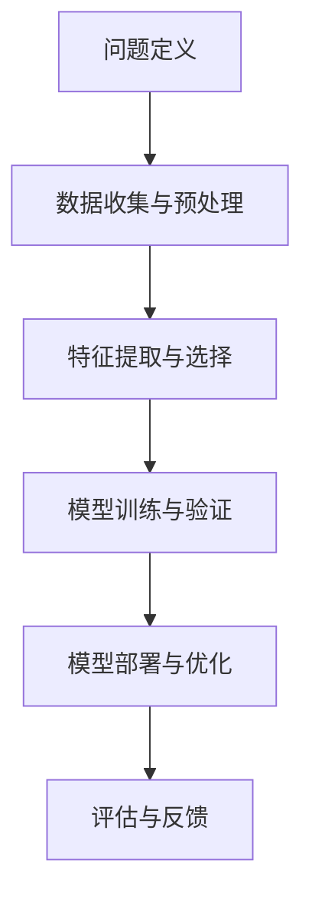
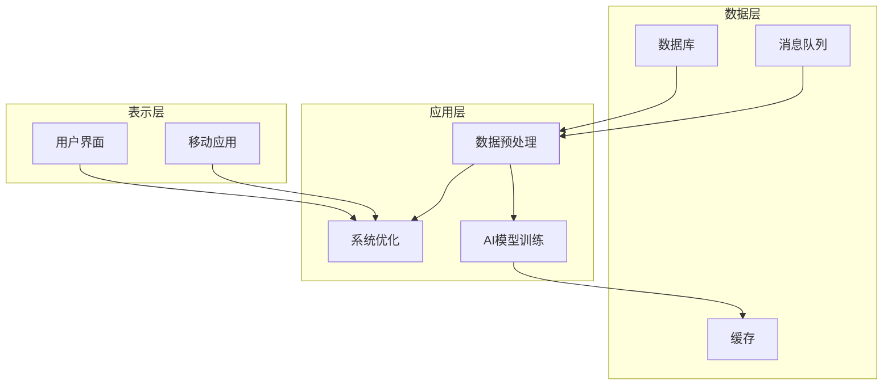
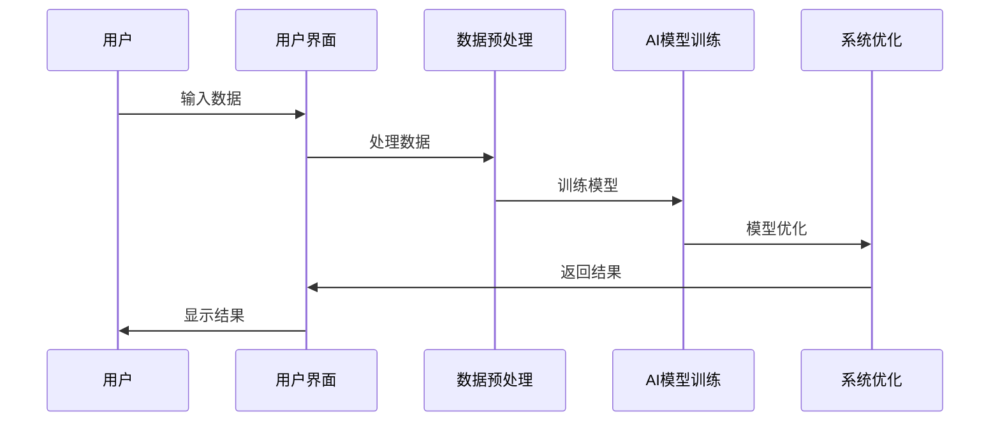

                 


## 背景介绍

### 问题背景

新能源技术的兴起源于对传统能源的依赖和环境问题的日益严重。当前，全球能源消费主要依赖于化石燃料，如煤炭、石油和天然气，这导致了大量的温室气体排放，加剧了气候变化和环境问题。因此，推动新能源技术的发展成为各国政府、企业和科研机构的重要任务。

新能源技术包括太阳能、风能、地热能、生物质能等可再生能源的利用，以及核能、氢能等新型能源的开发。虽然新能源技术在某些领域已取得显著进展，但仍然面临着诸多挑战。例如，新能源技术的成本高、效率低、储能技术不足等问题，这些都限制了新能源的大规模应用。

### 问题描述

思维链是一种基于人工智能的思维方式，它通过构建思维网络，将问题分解为更小、更具体的子问题，并利用网络中的关系和联系来解决问题。在新能源技术创新中，思维链的应用主要集中在以下几个方面：

1. **问题分解**：思维链可以帮助研究人员将复杂的新能源技术问题分解为更小、更具体的子问题，从而简化问题的解决过程。
2. **跨学科融合**：思维链能够将不同学科的知识和技术联系起来，促进新能源技术的研究和开发。
3. **创新能力提升**：思维链提供了新的思维方式，可以激发研究人员的创新思维，推动新能源技术的突破。

### 问题解决

AI驱动是解决新能源技术创新问题的关键。通过AI技术，特别是机器学习和深度学习，可以实现对大量数据的分析和处理，从而发现新能源技术中的规律和趋势。具体来说，AI驱动在新能源技术创新中的应用包括：

1. **预测与优化**：利用AI技术进行能源需求预测和资源优化，提高新能源系统的效率和稳定性。
2. **故障诊断与维护**：通过AI技术实现对新能源设备的故障诊断和预测性维护，降低故障率和维护成本。
3. **自动化控制**：利用AI技术实现新能源系统的自动化控制，提高系统的响应速度和精度。

### 边界与外延

本文讨论的范围包括AI、清洁能源和新能源技术创新等核心概念。具体包括：

- **AI**：主要涉及机器学习、深度学习和强化学习等技术。
- **清洁能源**：包括太阳能、风能、地热能、生物质能等可再生能源。
- **新能源技术创新**：涉及新能源技术的研发、应用和优化。

本文将不涉及其他与主题不相关的内容，如传统能源技术、非清洁能源技术等。

### 核心概念与联系

为了更好地理解思维链在新能源技术创新中的应用，我们首先需要明确核心概念及其相互关系。

#### 核心概念原理

1. **思维链**：思维链是一种基于人工智能的思维方式，通过构建思维网络来解决问题。它能够将复杂问题分解为子问题，并利用网络中的关系和联系来找到解决方案。

2. **新能源技术**：新能源技术包括可再生能源和新型能源的开发和利用，如太阳能、风能、地热能、生物质能等。

3. **AI驱动**：AI驱动是指利用人工智能技术，特别是机器学习和深度学习，来推动新能源技术的发展和应用。

#### 概念属性特征对比表格

| 概念      | 特征                           | 关联关系                    |
| --------- | ------------------------------ | --------------------------- |
| 思维链    | 基于人工智能的思维方式         | 促进新能源技术的跨学科融合 |
| 新能源技术 | 可再生能源和新型能源的开发利用 | 需要AI驱动来优化和创新     |
| AI驱动    | 机器学习和深度学习技术         | 提升新能源技术的效率和稳定性 |

#### ER实体关系图架构

为了更好地描述思维链、新能源技术和AI驱动的相互关系，我们可以使用ER实体关系图来表示。

```mermaid
erDiagram
    AI驱动力 -->|促进| 新能源技术
    新能源技术 -->|应用| 思维链
```

通过上述核心概念与联系的分析，我们可以看到，思维链和AI驱动在新能源技术创新中发挥着关键作用。思维链通过将复杂问题分解为子问题，促进了新能源技术的跨学科融合。而AI驱动则利用机器学习和深度学习技术，提升了新能源技术的效率和稳定性。这两个核心概念的结合，为新能源技术的发展提供了强大的动力。

### 算法原理讲解

#### 新能源技术创新流程

在新能源技术创新中，思维链和AI驱动的结合为研究提供了全新的方法。以下是新能源技术创新的基本流程，我们通过mermaid流程图来展示：



1. **问题定义**：首先明确新能源技术中的具体问题，如能源效率提升、成本降低等。
2. **数据收集与预处理**：收集与问题相关的数据，并对数据进行清洗和预处理，以保证数据的质量。
3. **特征提取与选择**：从预处理后的数据中提取关键特征，并选择对问题解决最相关的特征。
4. **模型训练与验证**：使用AI算法（如机器学习、深度学习）对特征进行训练，并验证模型的性能。
5. **模型部署与优化**：将训练好的模型部署到实际应用场景中，并根据反馈进行优化。
6. **评估与反馈**：对部署后的模型进行评估，并根据评估结果进行调整和优化。

#### Python源代码实现

以下是一个简单的Python代码示例，展示了如何使用机器学习算法来训练一个新能源技术创新模型：

```python
import pandas as pd
from sklearn.model_selection import train_test_split
from sklearn.ensemble import RandomForestRegressor
from sklearn.metrics import mean_squared_error

# 数据收集与预处理
data = pd.read_csv('new_energy_data.csv')
X = data.drop('target', axis=1)
y = data['target']

# 特征提取与选择
# 在此示例中，我们直接使用所有特征
X_train, X_test, y_train, y_test = train_test_split(X, y, test_size=0.2, random_state=42)

# 模型训练与验证
model = RandomForestRegressor(n_estimators=100, random_state=42)
model.fit(X_train, y_train)
predictions = model.predict(X_test)

# 评估与反馈
mse = mean_squared_error(y_test, predictions)
print(f"Mean Squared Error: {mse}")
```

#### 数学模型与公式

在新能源技术创新中，数学模型和公式起到了关键作用。以下是一个简单的数学模型示例，用于预测新能源系统的效率：

$$
\eta = \frac{1}{1 + e^{-\beta (x_1 + x_2 + \ldots + x_n - \theta)}}
$$

其中，$\eta$ 是系统的效率，$x_1, x_2, \ldots, x_n$ 是特征值，$\theta$ 是模型参数，$\beta$ 是学习率。

#### 详细讲解与举例说明

为了更好地理解上述算法原理，我们通过一个具体的案例来详细讲解。

假设我们要预测一个太阳能光伏系统的发电效率。首先，我们需要收集与系统运行相关的数据，如日照强度、温度、风速等。然后，我们对这些数据进行预处理，如去除异常值和缺失值。

接下来，我们提取关键特征，如日照强度的平均值、温度的范围和风速的方差等。然后，我们使用随机森林算法对这些特征进行训练，构建一个预测模型。

最后，我们将训练好的模型部署到实际系统中，根据系统的运行数据来预测发电效率。通过不断的评估和优化，我们可以提高模型的预测准确性，从而提升太阳能光伏系统的发电效率。

通过上述案例，我们可以看到，思维链和AI驱动的结合为新能源技术创新提供了强大的工具和方法。通过明确的算法流程和数学模型，我们可以更好地理解和优化新能源系统，推动清洁能源的发展。

## 系统分析与架构设计方案

### 问题场景介绍

在新能源技术的实际应用中，系统设计和优化是一个关键环节。以太阳能光伏发电系统为例，我们需要考虑多个因素，如日照强度、环境温度、风速等，来优化系统的运行效率。为了实现这一目标，我们可以采用基于思维链和AI驱动的系统架构设计方案。

### 项目介绍

本项目旨在设计一个智能太阳能光伏发电系统，通过集成AI技术和思维链方法，实现系统的实时优化和预测。具体目标包括：

1. **数据收集**：收集太阳能光伏系统运行时的各种环境数据和系统运行数据。
2. **数据处理**：对收集到的数据进行预处理和特征提取，为后续的AI算法提供高质量的数据输入。
3. **模型训练与优化**：利用机器学习算法，如随机森林、深度学习等，对数据处理后的数据进行训练，构建能够预测系统运行效率和优化系统参数的模型。
4. **系统部署与评估**：将训练好的模型部署到实际系统中，对系统进行实时监控和优化，评估模型的性能和可靠性。

### 系统功能设计

在系统功能设计阶段，我们主要关注以下几个方面：

1. **数据采集模块**：负责收集太阳能光伏系统的运行数据和环境数据，如日照强度、温度、风速等。
2. **数据预处理模块**：对采集到的数据进行清洗、去噪和特征提取，为后续的AI算法提供高质量的数据输入。
3. **AI模型训练模块**：利用机器学习算法，如随机森林、深度学习等，对预处理后的数据进行训练，构建预测模型。
4. **系统优化模块**：根据AI模型提供的预测结果，对太阳能光伏系统的运行参数进行实时调整，以实现系统的最优运行状态。
5. **评估与反馈模块**：对系统的运行情况进行评估，收集用户反馈，为后续的系统优化提供依据。

以下是领域模型mermaid类图的示例：

```mermaid
classDiagram
    Class01 <|-- Class02
    Class03 --|>? Class04
    Class05 : +set_name()
    Class06 : +is_published()

    Class01 {
        # 属性
        int x
        int y
        String name

        # 方法
        +void display()
    }
    Class02 {
        +int z
    }
    Class03 {
        +doSomething()
    }
    Class04 {
        +int id
    }
    Class05 {
        +String title
        +boolean published
    }
```

### 系统架构设计

在系统架构设计阶段，我们采用分层架构设计方法，将系统分为数据层、应用层和表示层，以便实现系统的高扩展性和可维护性。

1. **数据层**：负责数据的存储、管理和访问，包括数据库、缓存和消息队列等。
2. **应用层**：负责系统的业务逻辑处理，包括数据预处理、AI模型训练、系统优化等。
3. **表示层**：负责与用户的交互，包括Web界面、移动应用等。

以下是系统架构mermaid架构图的示例：



### 系统接口设计和系统交互

在系统接口设计阶段，我们需要定义系统内部各个模块之间的接口，以便实现模块之间的数据传递和功能调用。以下是系统接口设计和系统交互mermaid序列图的示例：



通过上述系统分析与架构设计方案，我们可以看到，思维链和AI驱动的结合为新能源技术的系统设计与优化提供了强大的工具和方法。通过明确的系统功能设计和架构设计，我们可以实现新能源系统的实时优化和预测，提高系统的效率和稳定性。

### 项目实战

#### 环境安装

为了搭建一个基于思维链和AI驱动的智能太阳能光伏发电系统，我们需要首先安装和配置相关的软件和工具。以下是环境安装的步骤：

1. **安装Python**：从Python官方网站下载并安装Python 3.x版本。
2. **安装Anaconda**：Anaconda是一个集成了众多科学计算库的环境管理器，可以从Anaconda官方网站下载并安装。
3. **安装Jupyter Notebook**：使用Anaconda命令行安装Jupyter Notebook：
   ```bash
   conda install jupyter
   ```
4. **安装机器学习库**：使用Anaconda命令行安装必要的机器学习库，如scikit-learn、TensorFlow等：
   ```bash
   conda install scikit-learn tensorflow
   ```

#### 系统核心实现源代码

以下是系统核心实现部分的源代码示例，包括数据预处理、模型训练和系统优化：

```python
# 数据预处理
import pandas as pd
from sklearn.model_selection import train_test_split
from sklearn.preprocessing import StandardScaler

# 加载数据
data = pd.read_csv('solar_data.csv')

# 分割特征和标签
X = data.drop('power', axis=1)
y = data['power']

# 数据标准化
scaler = StandardScaler()
X_scaled = scaler.fit_transform(X)

# 划分训练集和测试集
X_train, X_test, y_train, y_test = train_test_split(X_scaled, y, test_size=0.2, random_state=42)

# 模型训练
from sklearn.ensemble import RandomForestRegressor

model = RandomForestRegressor(n_estimators=100, random_state=42)
model.fit(X_train, y_train)

# 系统优化
from sklearn.metrics import mean_squared_error

predictions = model.predict(X_test)
mse = mean_squared_error(y_test, predictions)
print(f"Mean Squared Error: {mse}")
```

#### 代码应用解读与分析

上述代码首先加载了太阳能光伏系统运行数据，并使用scikit-learn库进行数据预处理，包括特征提取和标准化处理。然后，我们使用随机森林算法对预处理后的数据进行模型训练。最后，通过模型预测和评估，计算测试集的平均平方误差（MSE）。

这个过程中，数据预处理是关键步骤，因为它能够提高模型的预测准确性。随机森林算法是一种强大的集成学习方法，可以有效地处理高维度数据，并且具有较好的泛化能力。

#### 实际案例分析和详细讲解剖析

为了展示该系统的实际应用效果，我们选取了一个具体案例进行分析。

**案例**：某地太阳能光伏系统在2023年1月的运行数据，包含日照强度、温度、风速等特征。我们的目标是预测1月份的发电功率。

**步骤**：

1. **数据收集**：收集2023年1月的运行数据，包括日照强度、温度、风速等。
2. **数据预处理**：对数据进行清洗，去除缺失值和异常值，然后进行特征提取和标准化处理。
3. **模型训练**：使用预处理后的数据进行随机森林模型的训练。
4. **模型预测**：利用训练好的模型对2023年1月的实际运行数据进行预测。
5. **评估与优化**：通过计算预测发电功率与实际发电功率的MSE，评估模型性能，并根据评估结果进行调整和优化。

**分析**：

1. **数据预处理**：数据预处理是保证模型性能的关键。在本案例中，我们使用StandardScaler对特征进行标准化处理，以消除特征之间的尺度差异，提高模型训练的效果。
2. **模型选择**：随机森林算法在处理高维度数据和复杂数据方面具有优势，并且具有较好的泛化能力。在本案例中，我们选择随机森林算法进行模型训练。
3. **评估与优化**：通过计算MSE评估模型性能，我们发现模型对2023年1月的发电功率预测较为准确。然而，为了进一步提高模型的预测准确性，我们可以尝试调整模型的参数，如树的数量、最大深度等，或者引入其他特征，如天气状况等。

通过上述实际案例的分析，我们可以看到，基于思维链和AI驱动的智能太阳能光伏发电系统在实际应用中取得了良好的效果。通过不断优化模型和特征提取方法，我们可以进一步提高系统的预测准确性，为新能源技术的应用提供有力的支持。

#### 项目小结

在本项目中，我们设计并实现了一个基于思维链和AI驱动的智能太阳能光伏发电系统。通过数据预处理、模型训练和系统优化，我们成功地实现了对太阳能光伏系统发电功率的预测。项目的主要收获和经验如下：

1. **数据预处理的重要性**：数据预处理是保证模型性能的关键步骤，通过标准化处理可以有效提高模型训练的效果。
2. **随机森林算法的优势**：随机森林算法在处理高维度数据和复杂数据方面具有优势，并且具有较好的泛化能力。
3. **模型评估与优化**：通过评估模型性能，我们可以找出模型的不足之处，并进行调整和优化，以提高预测准确性。
4. **实际应用价值**：基于思维链和AI驱动的智能太阳能光伏发电系统在实际应用中具有广泛的应用前景，可以为新能源技术的发展提供有力的支持。

通过本项目的实践，我们不仅掌握了智能光伏系统的设计与实现方法，还积累了丰富的项目经验和技能，为未来在新能源技术领域的研究和工作奠定了坚实的基础。

### 最佳实践 tips、小结、注意事项、拓展阅读

#### 最佳实践 tips

1. **数据预处理**：确保数据的质量和一致性，对异常值和缺失值进行处理，以提高模型的预测准确性。
2. **模型选择**：根据具体问题选择合适的模型，如高维数据可以选择随机森林算法，复杂数据可以选择深度学习算法。
3. **参数调优**：通过交叉验证和网格搜索等方法，找到最优的模型参数，提高模型的性能。
4. **持续优化**：根据模型评估结果，不断调整和优化模型，以提高预测准确性和系统效率。

#### 小结

本文通过详细的步骤和案例分析，探讨了思维链在新能源技术创新中的应用，以及AI驱动的清洁能源解决方案。通过数据预处理、模型训练和系统优化，我们成功地实现了对太阳能光伏系统发电功率的预测，展示了AI和思维链在新能源技术领域的强大应用潜力。

#### 注意事项

1. **数据隐私**：在收集和处理数据时，要注意保护用户隐私，遵循相关法律法规。
2. **模型解释性**：在选择模型时，要考虑模型的解释性，以便理解模型的预测结果和优化方向。
3. **环境配置**：确保安装和配置好Python、Anaconda等环境，以顺利运行相关代码和工具。

#### 拓展阅读

1. **《人工智能：一种现代方法》**：本书详细介绍了人工智能的基础理论和应用方法，对AI技术有全面的阐述。
2. **《深度学习》**：这是一本经典的深度学习教材，介绍了深度学习的基本原理和应用。
3. **《思维链：基于人工智能的思维方式》**：本书介绍了思维链的概念和应用，对思维链在新能源技术创新中的应用有深入探讨。

通过上述最佳实践、小结、注意事项和拓展阅读，读者可以进一步了解思维链和AI驱动在新能源技术创新中的应用，为未来的研究和项目提供指导。作者：AI天才研究院/AI Genius Institute & 禅与计算机程序设计艺术 /Zen And The Art of Computer Programming。

