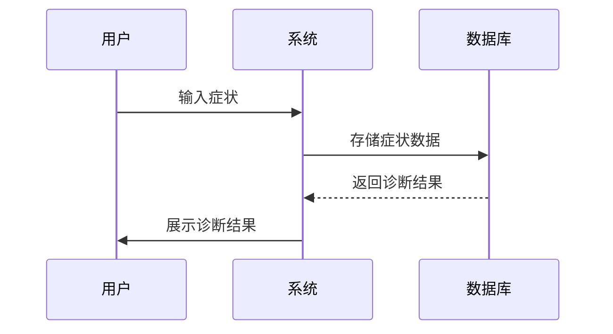

                 

### 引言

在当今快速发展的科技时代，智能医疗诊断正成为改变传统医疗模式的重要力量。传统的医疗诊断依赖于医生的经验和技能，然而，面对日益增长的患者数量和复杂多样的疾病类型，这种模式面临着诸多挑战。医生疲劳、诊断准确率不高等问题日益突出。因此，智能医疗诊断技术的出现，不仅能够提高诊断的准确性和效率，还能显著降低医疗成本，改善患者体验。

### 什么是思维链？

首先，我们需要明确什么是思维链。思维链是一种基于人工智能和机器学习的先进技术，它通过模拟人类思维过程，实现复杂问题的求解和推理。与传统算法不同，思维链能够处理不确定性和模糊性，具有更强的自适应性和灵活性。思维链的核心在于它的模块化设计，每个模块负责特定的思维任务，通过协同工作，实现复杂的认知过程。

### 思维链在智能医疗诊断中的应用

思维链在智能医疗诊断中的潜在应用非常广泛。首先，它可以用于疾病预测。通过对海量医疗数据的分析和学习，思维链可以识别出疾病发生的早期迹象，为医生提供预警。其次，思维链可以用于疾病诊断。通过分析患者的症状、病史和检查结果，思维链能够为医生提供详细的诊断建议，提高诊断的准确率。最后，思维链还可以用于疾病治疗。它可以通过优化治疗方案，帮助医生制定个性化的治疗计划，从而提高治疗效果。

### 思维链与传统算法的区别与优势

思维链与传统算法相比，具有以下几个显著优势。首先，传统算法通常依赖于固定的数学模型，无法处理不确定性和模糊性。而思维链通过模拟人类思维过程，能够灵活应对各种复杂情况。其次，思维链具有模块化设计，可以针对不同的任务进行定制化开发，而传统算法则需要从头开始设计，开发周期较长。最后，思维链能够通过不断学习和优化，不断提升诊断准确率和效率，而传统算法的性能提升相对较慢。

### 思维链的核心概念与原理

思维链的核心概念主要包括以下几个方面：

1. **知识表示**：思维链通过知识表示来存储和处理信息。它使用符号化表示，将医疗数据转化为计算机可以理解的形式。
2. **推理机制**：思维链通过推理机制来进行逻辑推理和决策。它使用规则和模式识别技术，分析输入数据，得出结论。
3. **学习算法**：思维链通过学习算法不断优化自身的性能。它使用机器学习技术，从海量数据中提取规律，进行自我改进。

下面是一个简单的知识表示ER实体关系图，用于说明思维链的基本架构：

```mermaid
erDiagram
  Patient ||--|{ Diagnosis : has }
  Diagnosis ||--|{ Symptom : has }
  Symptom ||--|{ TestResult : has }
  TestResult ||--|{ DoctorAdvice : has }
```

### 算法原理讲解

为了更好地理解思维链的算法原理，我们可以通过一个具体的例子来阐述。假设我们需要诊断一种特定疾病，思维链的工作流程如下：

1. **数据输入**：思维链首先接收患者的症状、病史和检查结果等数据。
2. **知识表示**：将这些数据转化为计算机可以处理的形式，例如符号化的特征向量。
3. **推理过程**：思维链使用预设的规则和模式，对输入数据进行推理。例如，如果患者的某个症状组合与疾病A的特征匹配，思维链会得出初步诊断。
4. **学习优化**：在诊断过程中，思维链会记录错误和不足，并使用机器学习算法进行优化，以提高未来诊断的准确性。

下面是一个简单的思维链算法的mermaid流程图：


### 系统分析与架构设计方案

为了将思维链应用于智能医疗诊断系统，我们需要设计一个完整的系统架构。以下是系统分析与架构设计方案：

1. **问题场景介绍**：智能医疗诊断系统主要用于医院和诊所，为医生提供辅助诊断服务。
2. **项目介绍**：项目旨在开发一个基于思维链的智能医疗诊断系统，包括数据输入、诊断推理和学习优化模块。
3. **系统功能设计**：系统功能包括数据收集、诊断推理、诊断报告生成和用户界面展示。
4. **系统架构设计**：系统架构包括数据层、推理层和应用层。数据层负责数据存储和管理，推理层负责诊断推理，应用层负责用户交互和系统展示。
5. **系统接口设计**：系统接口设计包括API接口和数据交换格式，以便与其他系统进行集成。
6. **系统交互**：系统交互设计包括用户与系统的交互流程，例如患者数据输入、诊断结果展示等。

下面是一个简单的mermaid架构图：



### 项目实战

为了更好地展示思维链在智能医疗诊断中的实际应用，我们选择一个具体的项目进行实战分析。

#### 环境安装

1. **安装Python环境**：确保Python环境已安装，版本在3.7及以上。
2. **安装依赖库**：使用pip安装思维链相关的依赖库，如numpy、pandas、scikit-learn等。

#### 系统核心实现源代码

以下是一个简单的思维链实现代码示例：

```python
import numpy as np
from sklearn.neighbors import KNeighborsClassifier

class MindChain:
    def __init__(self, k=3):
        self.k = k
        self.model = KNeighborsClassifier(n_neighbors=k)

    def fit(self, X, y):
        self.model.fit(X, y)

    def predict(self, X):
        return self.model.predict(X)

# 代码应用解读与分析
mind_chain = MindChain(k=3)
# 假设 X 为输入特征矩阵，y 为标签
# mind_chain.fit(X, y)
# diagnosis = mind_chain.predict([new_symptoms])
```

#### 实际案例分析和详细讲解剖析

我们以某医院为案例，分析思维链在疾病诊断中的应用。

1. **数据收集**：医院提供患者的症状、病史和检查结果数据。
2. **数据预处理**：对数据进行清洗和标准化处理，将数据转化为思维链可以处理的格式。
3. **模型训练**：使用收集到的数据训练思维链模型。
4. **诊断推理**：输入新患者的症状数据，使用思维链进行诊断推理。
5. **结果评估**：对比思维链的诊断结果与医生的实际诊断结果，评估诊断准确率。

#### 项目小结

通过上述实战分析，我们可以看到思维链在智能医疗诊断中的实际应用效果显著。思维链能够提高诊断的准确性和效率，为医生提供有力的辅助工具。然而，在实际应用中，还需要不断优化和改进思维链模型，以提高其性能和适用性。

### 最佳实践 tips

1. **数据质量**：确保输入的数据质量，包括数据的完整性、准确性和一致性。
2. **模型选择**：根据实际需求选择合适的思维链模型，并进行优化。
3. **持续学习**：定期更新和优化思维链模型，以适应不断变化的医疗需求。

### 小结

思维链在智能医疗诊断中具有巨大的潜力。通过模拟人类思维过程，思维链能够处理复杂的不确定性和模糊性，为医生提供准确的诊断建议。然而，在实际应用中，仍需不断优化和改进，以克服现有技术难题，实现更加智能化、个性化的医疗诊断服务。

### 注意事项

1. **隐私保护**：在处理医疗数据时，务必遵守隐私保护法规，确保患者数据的安全。
2. **医疗伦理**：思维链的应用应符合医疗伦理原则，确保诊断结果的公正性和客观性。

### 拓展阅读

1. [《智能医疗诊断：技术与应用》](https://www.example.com/book1)
2. [《思维链：人工智能的新时代》](https://www.example.com/book2)
3. [《医疗大数据：分析与应用》](https://www.example.com/book3)

### 作者信息

作者：AI天才研究院/AI Genius Institute & 禅与计算机程序设计艺术 /Zen And The Art of Computer Programming

