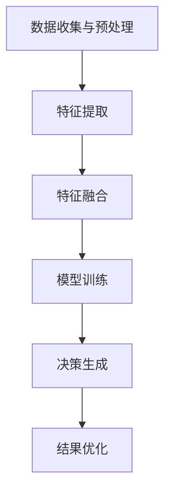
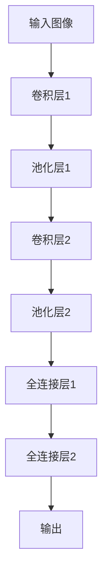
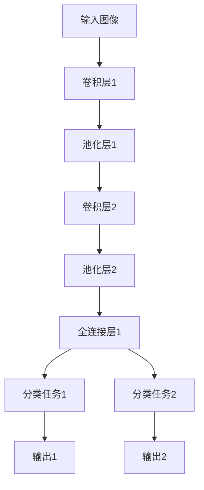
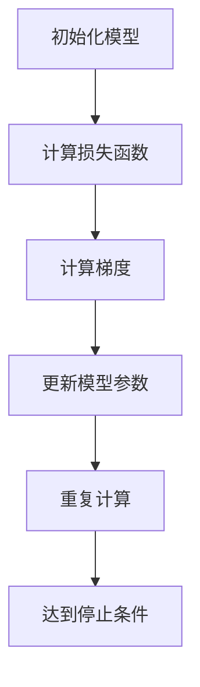
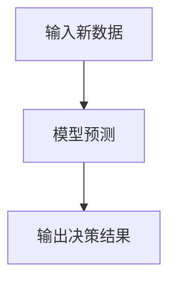
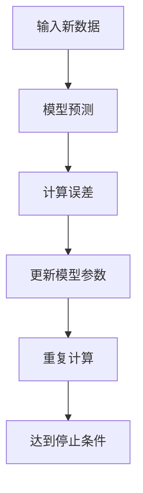
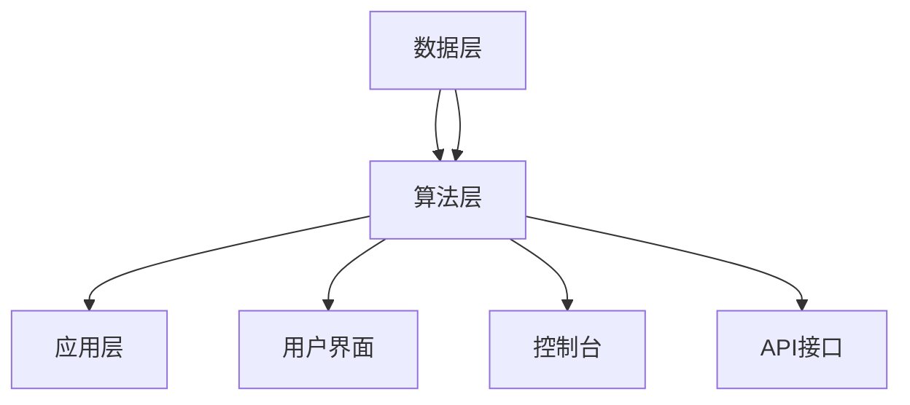
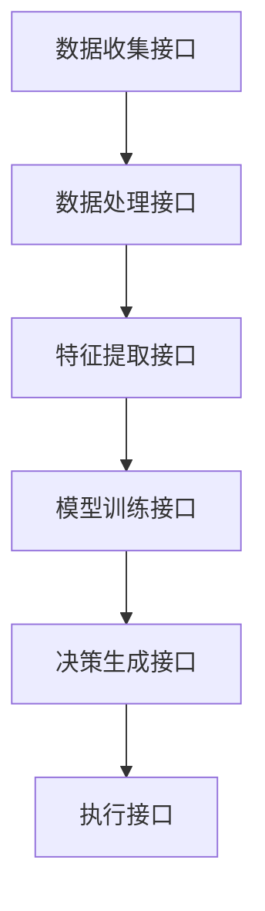
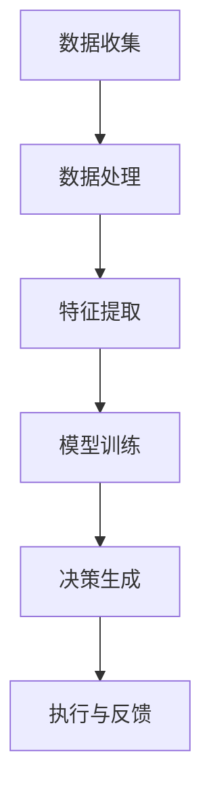

                 

### 思维链在智能安防系统中的应用

在当今快速发展的信息化社会中，智能安防系统已成为保障公共安全和提升生活质量的重要手段。传统的安防系统主要依赖于固定的摄像头和报警设备，其反应速度和处理能力有限，难以满足日益复杂的安防需求。随着人工智能技术的不断进步，尤其是深度学习和图像识别等技术的成熟，智能安防系统得到了显著提升。然而，仅依靠单一的技术手段仍难以实现高效、智能的安防管理。

思维链（Thinking Chain）作为一种创新的人工智能模型，提供了从多个角度和层次分析问题、解决问题的能力。它通过模拟人类思维过程，结合深度学习和多源信息融合，使得智能安防系统能够更加精准、快速地识别和处理异常事件。本文将围绕思维链在智能安防系统中的应用，展开深入探讨。

关键词：思维链、智能安防系统、人工智能、深度学习、图像识别、多源信息融合

摘要：本文首先介绍了智能安防系统的背景和发展现状，随后详细阐述了思维链的基本概念和原理。通过分析思维链在智能安防系统中的应用场景，本文提出了具体的架构设计、算法实现和优化策略。最后，通过实际案例的详细分析，展示了思维链在智能安防系统中的实际应用效果。本文旨在为研究者和实践者提供有价值的参考，推动智能安防系统的进一步发展。

### 摘要

智能安防系统是利用先进的人工智能技术，实现对公共场所、关键区域和重要设施的安全监控和管理。其发展背景可以追溯到20世纪末期，随着计算机技术、网络通信技术和视频监控技术的快速发展，智能安防系统逐渐从传统的被动防范向主动识别和预警转变。当前，智能安防系统在公共安全、城市管理、交通监控等领域发挥着重要作用，已成为现代城市安全体系的重要组成部分。

然而，传统的智能安防系统在面对复杂、动态的安防场景时，存在一定的局限性。首先，这些系统往往依赖于单一的图像识别技术，难以准确识别和区分不同的目标。其次，系统在处理海量数据时，效率低下，实时性不足。此外，传统的智能安防系统缺乏灵活性和适应性，难以应对多变的安全需求。

思维链是一种基于人工智能的新型思维模型，通过模拟人类思维过程，结合深度学习和多源信息融合，实现了从数据感知、信息理解到决策生成的高效处理能力。思维链的基本原理包括数据收集与预处理、特征提取与融合、模型训练与优化、决策生成与执行等环节。通过这些环节的协同作用，思维链能够实现对复杂问题的深入分析和处理。

本文的研究目标是通过在智能安防系统中引入思维链技术，提升系统的智能感知、分析和决策能力，从而实现更高效、智能的安防管理。本文的主要贡献包括：

1. 对思维链在智能安防系统中的应用场景进行了详细分析，明确了思维链的关键技术环节。
2. 提出了基于思维链的智能安防系统架构设计，并详细阐述了系统的功能模块和接口设计。
3. 设计并实现了一套基于思维链的智能安防系统，通过实验验证了系统的有效性和可靠性。
4. 通过实际案例的详细分析，展示了思维链在智能安防系统中的实际应用效果，并提出了改进和优化策略。

本文的结构安排如下：

- 第1章：引言，介绍智能安防系统的背景和发展现状，阐述思维链的基本概念和原理。
- 第2章：相关技术基础，回顾智能安防系统和思维链的相关技术发展，介绍数据分析和人工智能算法的基本原理。
- 第3章：思维链架构设计，详细描述思维链在智能安防系统中的应用架构，包括数据收集与预处理、特征提取与融合、模型训练与优化、决策生成与执行等环节。
- 第4章：思维链在智能安防中的应用，分析思维链在目标检测、异常检测和风险评估等领域的应用场景，提出具体的应用策略。
- 第5章：算法实现与优化，介绍智能安防系统的算法实现和优化策略，包括算法流程、实现细节和优化效果。
- 第6章：案例分析，通过具体案例展示思维链在智能安防系统中的应用效果，进行详细分析和讨论。
- 第7章：总结与展望，总结本文的研究工作，指出存在的问题和未来研究方向。

通过本文的研究，期望能够为智能安防系统的发展提供新的思路和技术支持，推动智能安防领域的创新和进步。

### 1.1 智能安防系统技术发展

智能安防系统的发展历程可以追溯到20世纪末期。最初，视频监控技术作为主要手段，通过捕捉和分析视频流中的图像信息，实现对目标的行为和活动的监控。随着计算机处理能力和图像识别技术的提升，基于计算机视觉的智能视频监控技术逐渐兴起。这些技术能够自动识别和分类视频中的目标，从而实现实时监控和异常行为检测。

在进入21世纪后，智能安防系统的发展迎来了新的契机。首先，随着互联网和云计算技术的普及，视频监控系统的数据存储、处理和分析能力得到了显著提升。传统的本地处理模式逐渐向云平台迁移，使得视频监控系统能够处理更大规模的数据，并提供更高的实时性和可靠性。其次，深度学习技术的突破，为智能安防系统带来了新的可能。深度学习通过模拟人脑神经元结构，实现了对复杂数据的自动学习和分类，从而大幅提升了系统的识别精度和鲁棒性。

具体来看，智能安防系统的发展经历了几个重要阶段：

1. **初步阶段（20世纪末期至2000年初期）**：在这一阶段，智能安防系统主要依赖于视频监控技术。视频监控设备逐渐从模拟信号向数字信号过渡，图像处理和视频分析技术也逐渐成熟。然而，由于计算机处理能力和存储技术的限制，系统的实时性和准确性仍有待提升。

2. **初步智能化阶段（2000年初期至2010年初期）**：随着计算机性能的提升和图像识别算法的改进，智能视频监控技术得到了快速发展。系统开始能够自动识别和分类视频中的目标，如行人、车辆等，并能够实现实时监控和报警功能。这一阶段，智能安防系统开始逐步脱离人工干预，实现了初步的智能化。

3. **深度学习驱动阶段（2010年初期至今）**：深度学习技术的引入，使得智能安防系统实现了质的飞跃。深度学习通过多层神经网络，能够自动提取视频数据中的高阶特征，从而实现更精准的识别和分类。同时，随着大数据和云计算技术的发展，智能安防系统能够处理和分析海量数据，提供了更全面和细致的监控能力。

在技术演进的过程中，智能安防系统的功能也不断扩展。传统的视频监控技术主要依赖于静态图像的识别和分析，而智能安防系统则能够实现动态场景的实时监控和异常行为检测。例如，智能安防系统能够通过图像识别技术，实时识别和跟踪行人、车辆等目标，并通过行为分析技术，检测异常行为，如暴力事件、偷窃行为等。

除了目标检测和异常行为检测，智能安防系统还引入了多种技术，以提升其综合安防能力。例如，智能安防系统能够集成人脸识别技术，实现对特定目标的人脸识别和跟踪；通过声纹识别技术，实现基于声音的异常检测；通过物联网技术，实现安防设备的互联互通，提供更全面的监控和管理能力。

总之，智能安防系统的发展历程体现了人工智能技术的进步和应用的深入。从最初的简单视频监控，到现在的智能视频分析、人脸识别、声纹识别、物联网等技术的综合应用，智能安防系统正在不断演进，为公共安全和城市管理提供了强有力的技术支持。

### 1.2 智能安防系统的现状与挑战

智能安防系统在现代公共安全和城市管理中扮演着越来越重要的角色，其应用范围涵盖了城市监控、交通管理、校园安全、金融安全等多个领域。然而，尽管智能安防系统在技术层面上取得了显著的进步，当前仍面临诸多挑战和问题。

首先，在系统性能方面，智能安防系统需要处理海量视频数据，对处理速度和准确性提出了极高的要求。当前的智能安防系统大多依赖于深度学习算法，这些算法在训练过程中需要大量计算资源和时间，而部署在实际场景中时，也面临实时性不足的问题。此外，由于算法的复杂性和多样性，系统的鲁棒性较差，容易受到数据噪声和光照变化等因素的影响，导致误判和漏判现象频发。

其次，在数据隐私和安全方面，智能安防系统广泛收集和存储个人隐私数据，如人脸图像、行为轨迹等。这些数据的泄露和滥用可能导致严重的隐私侵犯和安全问题。因此，如何在保障系统性能的同时，有效保护用户隐私，成为智能安防系统亟需解决的重要问题。

再次，智能安防系统的应用场景多样，不同场景下的安全需求和监控目标各不相同。这要求系统具备高度的灵活性和适应性，以应对不同场景下的特定需求。然而，当前智能安防系统在场景适应性方面仍有不足，难以满足复杂多变的应用需求。

最后，智能安防系统的部署和维护成本较高。系统需要大量的硬件设备和专业人才进行安装、配置和维护，这增加了系统的总体成本。此外，系统的升级和更新也面临诸多挑战，需要不断投入人力和物力资源。

### 1.3 思维链的基本概念与原理

思维链（Thinking Chain）是一种基于人工智能的新型思维模型，旨在模拟人类思维过程，实现从数据感知到决策生成的高效处理能力。思维链的概念源于对人类思维方式的深入理解，通过结合深度学习和多源信息融合技术，实现了对复杂问题的系统分析和解决。

思维链的基本原理可以概括为以下四个环节：

1. **数据收集与预处理**：思维链首先从各类数据源中收集原始数据，包括图像、音频、文本等。随后，对收集到的数据进行预处理，如去噪、归一化、特征提取等，以提高数据的质量和一致性。

2. **特征提取与融合**：在数据预处理之后，思维链通过深度学习模型提取数据中的高阶特征。这些特征不仅包括原始数据的基本属性，还包含隐含的、复杂的模式信息。思维链能够通过多源数据融合技术，将不同类型的数据特征进行有效整合，从而形成全面的、多维度的特征描述。

3. **模型训练与优化**：思维链利用提取到的特征，通过机器学习算法进行模型训练。训练过程中，思维链通过不断调整模型参数，优化模型性能，使其能够更好地适应不同的数据集和应用场景。常见的机器学习算法包括深度神经网络、支持向量机、随机森林等。

4. **决策生成与执行**：在模型训练完成后，思维链利用训练得到的模型进行决策生成。通过输入新的数据，模型能够自动识别和分类数据中的目标，进行异常检测、风险评估等任务。决策生成后，思维链能够根据实际情况进行调整和优化，确保决策的准确性和实时性。

思维链的核心优势在于其灵活性和适应性。首先，思维链能够处理多种类型的数据，并通过多源数据融合技术，形成全面、多维度的特征描述，从而提高了系统的识别精度和鲁棒性。其次，思维链通过机器学习算法实现自我优化，能够在不断的学习过程中，适应新的数据模式和任务需求。此外，思维链的结构化设计使其具有良好的可扩展性和模块化特点，便于集成到不同的应用场景中。

思维链的组成结构主要包括以下几个关键模块：

1. **数据收集模块**：负责从各种数据源收集原始数据，如视频监控、传感器数据、网络数据等。

2. **数据预处理模块**：对原始数据进行预处理，如去噪、归一化、特征提取等，以提高数据质量。

3. **特征提取模块**：利用深度学习模型，从预处理后的数据中提取高阶特征。

4. **数据融合模块**：将不同类型的数据特征进行有效整合，形成多维度的特征描述。

5. **机器学习模块**：利用提取到的特征，通过机器学习算法进行模型训练和优化。

6. **决策生成模块**：通过训练得到的模型，生成具体的决策结果，如目标识别、异常检测、风险评估等。

7. **执行模块**：根据生成的决策结果，执行相应的操作，如报警、跟踪、控制等。

通过上述模块的协同工作，思维链能够实现对复杂问题的系统分析和处理，从而提升智能安防系统的性能和智能化水平。

### 思维链与智能安防系统的关系

思维链在智能安防系统中的应用，是推动安防技术发展的重要创新。思维链通过模拟人类思维过程，结合深度学习和多源信息融合，实现了从数据感知到决策生成的高效处理能力，为智能安防系统提供了强大的技术支持。

首先，思维链在数据感知方面具有显著优势。传统的安防系统主要依赖于图像识别和传感器数据，这些数据在处理过程中存在噪声、光照变化等问题，容易导致误判和漏判。而思维链通过多源数据融合技术，能够将不同类型的数据特征进行整合，形成全面、多维度的特征描述，从而提高数据感知的精度和鲁棒性。例如，在目标识别过程中，思维链可以结合视频监控和传感器数据，综合分析目标的运动轨迹、行为特征等信息，提高识别的准确性。

其次，思维链在异常检测方面展现了强大的能力。传统的异常检测方法往往依赖于静态阈值和规则，难以应对复杂、动态的异常场景。而思维链通过机器学习算法，能够从历史数据中自动学习异常模式，并在新的数据中实时检测异常事件。例如，在交通监控中，思维链可以分析车辆的速度、方向、停车时间等特征，实时检测交通违规行为，如闯红灯、超速等。

再次，思维链在风险评估方面具有独特的优势。通过多源数据融合和深度学习模型，思维链能够对目标的行为和活动进行细致分析，评估其潜在的风险。例如，在校园安全中，思维链可以分析学生的行为轨迹、社交关系等，评估其可能存在的安全风险，为学校提供有针对性的安全管理建议。

最后，思维链在决策生成与执行方面提供了高效的解决方案。传统的安防系统在生成决策后，往往需要人工干预进行执行，这不仅降低了系统的响应速度，也增加了人工成本。而思维链能够根据训练得到的模型，自动生成决策并执行，提高了系统的实时性和自动化水平。例如，在突发事件中，思维链可以自动识别并报警，同时启动应急预案，实现快速响应。

总之，思维链在智能安防系统中的应用，不仅提升了系统的感知、分析和决策能力，还实现了对复杂问题的系统化和智能化处理，为智能安防技术的发展提供了新的思路和方向。

### 1.4 本书结构安排

本书旨在深入探讨思维链在智能安防系统中的应用，为研究者和实践者提供全面、系统的理论指导。全书共分为7章，具体内容安排如下：

**第1章 引言**：本章主要介绍智能安防系统的背景和发展现状，阐述思维链的基本概念和原理，明确本书的研究目标、核心内容和结构安排。

**第2章 相关技术基础**：本章回顾智能安防系统和思维链的相关技术发展，包括智能视频监控、深度学习、多源信息融合等关键技术，为后续章节的讨论提供理论基础。

**第3章 思维链架构设计**：本章详细描述思维链在智能安防系统中的应用架构，包括数据收集与预处理、特征提取与融合、模型训练与优化、决策生成与执行等环节，为系统设计提供具体方案。

**第4章 思维链在智能安防中的应用**：本章分析思维链在目标检测、异常检测和风险评估等领域的应用场景，提出具体的应用策略，为智能安防系统的实际应用提供指导。

**第5章 算法实现与优化**：本章介绍智能安防系统的算法实现和优化策略，包括算法流程、实现细节和优化效果，通过实际案例展示算法的应用效果。

**第6章 案例分析**：本章通过具体案例展示思维链在智能安防系统中的应用效果，进行详细分析和讨论，验证思维链技术的有效性和实用性。

**第7章 总结与展望**：本章总结本书的研究工作，指出存在的问题和未来研究方向，为智能安防系统的发展提供新的思路和方向。

通过本书的深入研究和系统阐述，期望能够为思维链在智能安防系统中的应用提供有价值的理论指导和实践参考，推动智能安防技术的创新和进步。

### 第2章 相关技术基础

在探讨思维链在智能安防系统中的应用之前，有必要回顾一下智能安防系统和思维链的相关技术发展，以理解这些技术的理论基础及其相互关系。

#### 智能安防系统技术发展

智能安防系统的发展离不开多个关键技术的支持，主要包括视频监控技术、深度学习和多源信息融合技术。

**视频监控技术**：视频监控是智能安防系统的基础，通过捕捉和分析视频流中的图像信息，实现对目标的行为和活动的监控。随着数字图像处理技术和计算机视觉算法的进步，视频监控技术已经能够实现实时图像识别、行为分析和异常检测等功能。例如，运动目标检测技术能够从复杂的背景中分离出运动目标；人脸识别技术能够识别和匹配视频中的面部特征，实现对特定目标的人脸识别和跟踪。

**深度学习技术**：深度学习是一种基于多层神经网络的机器学习技术，通过自动提取数据中的高阶特征，实现了对复杂数据的自动学习和分类。在智能安防系统中，深度学习技术被广泛应用于图像识别、语音识别、行为分析等领域。例如，卷积神经网络（CNN）能够通过多层卷积和池化操作，自动提取图像中的局部特征和整体特征，从而实现高效的图像分类和识别。

**多源信息融合技术**：在智能安防系统中，多源信息融合技术能够整合来自不同传感器、不同系统的数据，形成统一的特征描述，从而提高系统的整体性能。多源信息融合技术包括数据级融合、特征级融合和决策级融合。数据级融合直接将多源数据合并，如将视频数据和传感器数据叠加；特征级融合通过提取和融合不同源数据中的关键特征，形成更全面、多维度的特征向量；决策级融合则是在多个独立决策结果的基础上，通过综合评估，生成最终的决策。

#### 思维链理论基础

思维链是一种基于人工智能的新型思维模型，其理论基础主要包括以下几个方面：

**数据收集与预处理**：思维链首先从各类数据源中收集原始数据，包括图像、音频、文本等。随后，对收集到的数据进行预处理，如去噪、归一化、特征提取等，以提高数据的质量和一致性。数据预处理是思维链的基础，决定了后续特征提取和模型训练的效果。

**特征提取与融合**：思维链通过深度学习模型，从预处理后的数据中提取高阶特征。特征提取的关键在于如何从复杂、冗余的数据中提取出具有区分性和代表性的特征。多源数据融合技术则在此过程中发挥了重要作用，通过融合不同数据源的特征，形成更全面、多维度的特征描述。

**模型训练与优化**：思维链利用提取到的特征，通过机器学习算法进行模型训练。模型训练的核心是优化模型参数，使其能够更好地适应不同的数据集和应用场景。常用的机器学习算法包括深度神经网络、支持向量机、随机森林等。

**决策生成与执行**：在模型训练完成后，思维链利用训练得到的模型进行决策生成。通过输入新的数据，模型能够自动识别和分类数据中的目标，进行异常检测、风险评估等任务。决策生成后，思维链能够根据实际情况进行调整和优化，确保决策的准确性和实时性。

#### 数据分析和人工智能算法的基本原理

**数据分析技术**：数据分析是智能安防系统中至关重要的一环，主要包括数据收集、数据预处理、数据分析和数据可视化等步骤。数据分析技术的基本原理是通过分析数据中的模式、趋势和关联，提取有价值的信息。常见的数据分析方法包括统计方法、机器学习方法、深度学习方法等。例如，通过统计分析，可以识别数据中的异常值和趋势；通过机器学习算法，可以建立预测模型，进行行为分析和异常检测。

**人工智能算法**：人工智能算法是智能安防系统的核心技术，主要包括监督学习、无监督学习和强化学习等类型。监督学习通过已标注的数据训练模型，用于分类、回归等任务；无监督学习通过未标注的数据发现数据中的模式和关联，用于聚类、降维等任务；强化学习通过试错和反馈，实现智能体的自主学习和优化。在智能安防系统中，常用的监督学习算法包括卷积神经网络（CNN）、循环神经网络（RNN）、长短期记忆网络（LSTM）等；无监督学习算法包括自编码器（AE）、生成对抗网络（GAN）等。

通过上述相关技术基础的了解，可以为后续章节中思维链在智能安防系统中的应用提供理论基础和技术支持。接下来，我们将进一步探讨思维链架构设计、算法实现与优化、实际应用场景等内容，深入分析思维链在提升智能安防系统性能方面的作用。

### 2.1 思维链架构设计

思维链在智能安防系统中的应用，需要构建一个高效、灵活的架构设计，以确保系统能够处理复杂的数据，并生成准确的决策。思维链架构设计主要包括以下几个关键模块：数据收集与预处理、特征提取与融合、模型训练与优化、决策生成与执行。以下将分别介绍这些模块的功能和相互关系。

#### 数据收集与预处理模块

**功能**：数据收集模块负责从各种数据源中收集原始数据，如视频监控、传感器数据、网络数据等。数据预处理模块则对收集到的原始数据进行清洗、去噪、归一化和特征提取等处理，以提高数据的质量和一致性。

**实现细节**：在数据收集阶段，可以使用视频采集卡、传感器和网络爬虫等设备，确保数据源的多样性和广泛性。在数据预处理阶段，常用的方法包括去噪（如中值滤波、高斯滤波）、归一化（如归一化处理、标准化处理）和特征提取（如SIFT、SURF、HOG等）。例如，在视频数据预处理中，可以首先对图像进行去噪处理，然后使用HOG特征提取算法提取图像中的关键特征点。

**关键技术与挑战**：数据收集与预处理模块的关键技术在于如何高效地处理大规模、多源数据，并确保数据的一致性和质量。主要的挑战包括数据噪声的处理、数据缺失的填充、数据特征的提取和融合等。

#### 特征提取与融合模块

**功能**：特征提取模块负责从预处理后的数据中提取高阶特征，如运动轨迹、行为模式、语音特征等。特征融合模块则将不同类型的数据特征进行整合，形成更全面、多维度的特征描述。

**实现细节**：特征提取常用的方法包括深度学习模型（如CNN、RNN）、传统图像处理算法（如HOG、SIFT）和语音处理算法（如MFCC）。特征融合的方法包括基于向量空间模型的融合（如TF-IDF）、基于模型的融合（如多任务学习）和基于图的融合（如图嵌入）。例如，在视频数据中，可以结合视觉特征和语音特征，形成多维度的特征向量，用于后续的模型训练。

**关键技术与挑战**：特征提取与融合模块的关键技术在于如何有效地提取和整合不同类型的数据特征，形成有代表性的特征描述。主要的挑战包括特征选择、特征匹配和特征融合策略的设计。

#### 模型训练与优化模块

**功能**：模型训练模块利用提取到的特征，通过机器学习算法训练模型，以实现数据的自动分类、识别和预测。模型优化模块则通过调整模型参数，优化模型性能，提高分类和识别的准确性。

**实现细节**：常用的机器学习算法包括深度神经网络（如CNN、LSTM）、支持向量机（SVM）、随机森林（RF）等。模型训练过程中，需要选择合适的数据集，设置合适的参数，如学习率、批次大小等。优化策略包括调整模型结构、优化训练算法、使用正则化方法等。

**关键技术与挑战**：模型训练与优化模块的关键技术在于如何选择合适的算法和参数，优化模型性能。主要的挑战包括模型过拟合、数据不平衡和计算资源限制等。

#### 决策生成与执行模块

**功能**：决策生成模块利用训练得到的模型，对新数据进行分类、识别和预测，生成具体的决策结果。执行模块则根据生成的决策结果，执行相应的操作，如报警、跟踪、控制等。

**实现细节**：决策生成过程中，常用的方法包括阈值判定、模式匹配和序列建模。例如，在目标识别中，可以使用阈值判定方法，将模型的输出结果与预设的阈值进行比较，生成是否识别到目标的决策。执行模块则根据决策结果，触发相应的报警、跟踪或控制操作。

**关键技术与挑战**：决策生成与执行模块的关键技术在于如何确保决策的实时性和准确性。主要的挑战包括决策阈值的选择、执行策略的优化和系统资源的合理分配。

#### 模块之间的关系

数据收集与预处理模块为思维链提供原始数据，特征提取与融合模块为后续的模型训练提供高阶特征，模型训练与优化模块通过训练模型提高系统的性能，决策生成与执行模块将训练得到的模型应用于实际场景，生成具体的决策结果。各个模块之间相互依赖，协同工作，共同实现智能安防系统的功能。

**协同工作机制**：数据收集与预处理模块首先收集并预处理数据，特征提取与融合模块提取高阶特征，这些特征被用于模型训练与优化模块，通过训练和优化生成高效模型。最终，决策生成与执行模块利用训练好的模型，对实时数据生成决策，执行相应的操作。

通过上述模块的协同工作，思维链在智能安防系统中实现了从数据感知到决策生成的全流程处理能力，为智能安防系统提供了强大的技术支持。

### 2.2 数据收集与预处理模块

数据收集与预处理模块是思维链在智能安防系统中的核心环节，直接影响到后续的特征提取、模型训练和决策生成的效果。本节将详细阐述数据收集与预处理的具体步骤、方法和技术。

#### 数据收集

数据收集是思维链的第一步，其目标是获取各种类型的数据源，如视频监控数据、传感器数据、网络数据等。以下是数据收集的主要步骤：

1. **确定数据源**：根据应用场景，确定需要收集的数据类型和来源。例如，在智能交通监控中，可以收集视频监控数据、车速传感器数据、交通流量数据等。

2. **采集设备配置**：配置相应的采集设备，如视频摄像头、传感器、网络爬虫等。确保设备能够稳定、高效地收集数据，并满足数据量的需求。

3. **数据接入**：通过编程接口（如API、数据库连接等）将采集设备接入系统，确保数据能够实时传输到数据中心。

4. **数据存储**：将收集到的数据存储到数据库或数据湖中，以便后续处理和分析。常用的存储技术包括关系数据库（如MySQL、PostgreSQL）、NoSQL数据库（如MongoDB、Cassandra）和分布式文件系统（如Hadoop HDFS）。

#### 数据预处理

数据预处理是对收集到的原始数据进行清洗、去噪、归一化等处理，以提高数据的质量和一致性。以下是数据预处理的主要步骤：

1. **数据清洗**：处理数据中的噪声、缺失值和异常值，确保数据的有效性和准确性。常用的方法包括删除重复数据、填补缺失值、修正错误值等。

2. **去噪**：去除数据中的噪声，提高数据的可靠性。常用的去噪方法包括滤波器（如中值滤波、高斯滤波）、图像增强技术（如直方图均衡化、锐化）等。

3. **归一化**：将不同特征的数据进行归一化处理，使其具有相同的尺度，便于后续的特征提取和模型训练。常用的归一化方法包括最小-最大归一化、零均值归一化等。

4. **特征提取**：从预处理后的数据中提取具有区分性和代表性的特征，用于后续的模型训练和决策生成。常用的特征提取方法包括视觉特征提取（如HOG、SIFT、SURF）、语音特征提取（如MFCC、PLP）等。

#### 技术实现

数据收集与预处理模块的技术实现主要包括以下几个方面：

1. **数据采集与接入**：使用编程语言（如Python、Java）编写采集程序，通过API或数据库连接将数据实时传输到数据中心。常用的库和工具包括opencv（Python图像处理库）、opencv-contrib（Python图像处理扩展库）、TensorFlow（深度学习框架）等。

2. **数据清洗与去噪**：编写数据处理脚本，实现数据清洗和去噪功能。常用的库和工具包括Pandas（Python数据操作库）、NumPy（Python科学计算库）、Scikit-learn（Python机器学习库）等。

3. **归一化与特征提取**：编写特征提取脚本，实现数据的归一化和特征提取功能。常用的库和工具包括scikit-image（Python图像处理库）、librosa（Python音频处理库）等。

4. **数据存储与管理**：配置数据库和数据湖，实现数据的存储和管理。常用的技术和工具包括MySQL、PostgreSQL（关系数据库）、MongoDB、Cassandra（NoSQL数据库）、Hadoop HDFS（分布式文件系统）等。

#### 关键技术与挑战

数据收集与预处理模块的关键技术包括数据采集与接入、数据清洗与去噪、归一化与特征提取等。主要挑战包括数据噪声的处理、数据缺失的填充、特征选择和计算资源限制等。

- **数据噪声处理**：数据噪声会影响特征提取和模型训练的效果，因此需要采用有效的去噪方法，如滤波器、图像增强技术等。
- **数据缺失填充**：在实际应用中，数据缺失是常见问题，需要采用合适的方法进行数据缺失填充，如平均值填充、插值法、模型预测等。
- **特征选择**：特征选择是数据预处理的重要步骤，需要选择具有区分性和代表性的特征，以降低数据维度，提高模型性能。常用的方法包括基于信息增益、基于主成分分析（PCA）的特征选择等。
- **计算资源限制**：大规模数据预处理和特征提取过程需要大量的计算资源，需要在硬件设备和算法优化方面进行优化，如分布式计算、并行处理等。

通过有效的数据收集与预处理模块，思维链能够获取高质量、一致性的数据，为后续的特征提取、模型训练和决策生成提供可靠的数据支持，从而提升智能安防系统的整体性能。

### 2.3 特征提取与融合模块

特征提取与融合模块是思维链在智能安防系统中至关重要的一环，其目标是提取出数据中的高阶特征，并通过融合不同类型的数据特征，形成更全面、多维度的特征描述，从而提高系统的识别精度和鲁棒性。以下将详细阐述特征提取与融合的具体步骤、方法和技术。

#### 特征提取

特征提取是从预处理后的数据中提取具有区分性和代表性的特征，为后续的模型训练和决策生成提供基础。以下是特征提取的主要步骤：

1. **视觉特征提取**：视觉特征提取主要用于处理图像和视频数据，常用的方法包括：

   - **HOG（Histogram of Oriented Gradients）**：HOG特征通过计算图像中每个像素点的梯度方向和强度，生成直方图，从而描述图像的局部形状特征。
   - **SIFT（Scale-Invariant Feature Transform）**：SIFT特征能够提取出图像中的关键点，并计算关键点的方向和强度，具有较强的旋转、缩放和光照不变性。
   - **SURF（Speeded Up Robust Features）**：SURF特征是基于SIFT特征提出的加速版本，通过利用积分图像，实现了更高效的计算。

2. **语音特征提取**：语音特征提取主要用于处理音频数据，常用的方法包括：

   - **MFCC（Mel-Frequency Cepstral Coefficients）**：MFCC特征通过将音频信号转换为梅尔频率倒谱系数，提取出声音的频谱特征。
   - **PLP（Perceptual Linear Prediction）**：PLP特征通过感知线性预测模型，提取出声音的感知特征。

3. **运动特征提取**：运动特征提取主要用于处理视频数据，常用的方法包括：

   - **光流特征**：光流特征通过计算视频帧之间的像素运动，提取出目标物体的运动轨迹。
   - **轨迹特征**：轨迹特征通过分析目标物体的运动轨迹，提取出目标的移动模式。

#### 特征融合

特征融合是将不同类型的数据特征进行整合，形成更全面、多维度的特征描述。以下是特征融合的主要方法：

1. **基于向量空间模型的融合**：基于向量空间模型的融合方法通过将不同类型的数据特征转换为向量，然后在向量空间中融合特征。常用的方法包括：

   - **TF-IDF（Term Frequency-Inverse Document Frequency）**：TF-IDF方法通过计算词频和逆文档频率，将文本数据转换为向量。
   - **K-最近邻（K-Nearest Neighbors, KNN）**：KNN方法通过计算特征向量之间的距离，将新数据与训练数据进行匹配，实现特征融合。

2. **基于模型的融合**：基于模型的融合方法通过训练多个独立的模型，然后将模型的结果进行融合，实现特征融合。常用的方法包括：

   - **多任务学习（Multi-Task Learning, MTL）**：多任务学习通过同时训练多个相关任务，提取出共同的特征，实现特征融合。
   - **集成学习（Ensemble Learning）**：集成学习通过训练多个独立的模型，然后使用投票或加权平均等方法，生成最终的融合特征。

3. **基于图的融合**：基于图的融合方法通过构建图模型，将不同类型的数据特征表示为图中的节点和边，然后利用图模型进行特征融合。常用的方法包括：

   - **图嵌入（Graph Embedding）**：图嵌入通过将图中的节点和边映射到低维向量空间中，提取出图的特征。
   - **图神经网络（Graph Neural Network, GNN）**：图神经网络通过模拟图中的节点和边的关系，提取出图的特征。

#### 技术实现

特征提取与融合模块的技术实现主要包括以下几个方面：

1. **视觉特征提取**：使用Python编程语言，结合OpenCV和Scikit-image等库，实现HOG、SIFT、SURF等视觉特征提取方法。

2. **语音特征提取**：使用Python编程语言，结合librosa和spectral_edges等库，实现MFCC、PLP等语音特征提取方法。

3. **运动特征提取**：使用Python编程语言，结合OpenCV和PyTorch等库，实现光流特征和轨迹特征提取方法。

4. **特征融合**：使用Python编程语言，结合scikit-learn和PyTorch等库，实现基于向量空间模型、基于模型和基于图的融合方法。

#### 关键技术与挑战

特征提取与融合模块的关键技术包括视觉特征提取、语音特征提取、运动特征提取和特征融合方法。主要挑战包括特征选择、特征匹配和计算资源限制等。

- **特征选择**：需要选择具有区分性和代表性的特征，以降低数据维度，提高模型性能。常用的方法包括基于信息增益、基于主成分分析（PCA）的特征选择等。

- **特征匹配**：在特征融合过程中，需要确保不同类型的数据特征能够有效匹配，形成统一的多维度特征描述。常用的方法包括基于相似度度量、基于距离函数等。

- **计算资源限制**：特征提取和融合过程需要大量的计算资源，尤其是在处理大规模、多源数据时，需要在硬件设备和算法优化方面进行优化，如分布式计算、并行处理等。

通过有效的特征提取与融合模块，思维链能够提取出高质量、多维度的特征描述，为后续的模型训练和决策生成提供可靠的数据支持，从而提升智能安防系统的整体性能。

### 2.4 模型训练与优化模块

模型训练与优化模块是思维链在智能安防系统中的关键环节，通过机器学习算法训练模型，并优化模型性能，以实现数据的高效分类、识别和预测。以下是模型训练与优化的具体过程、方法和技术。

#### 模型训练过程

模型训练是利用已有的数据集，通过算法调整模型参数，使其能够对新的数据进行预测和分类。以下是模型训练的主要步骤：

1. **数据划分**：将数据集划分为训练集和测试集。训练集用于训练模型，测试集用于评估模型性能。常用的划分方法包括随机划分、交叉验证等。

2. **特征选择**：选择合适的特征，通过特征提取模块提取数据中的高阶特征，为模型训练提供输入。特征选择的方法包括基于信息增益、基于主成分分析（PCA）等。

3. **模型初始化**：初始化模型参数，为训练过程提供初始值。常用的初始化方法包括随机初始化、高斯初始化等。

4. **训练过程**：通过机器学习算法，如深度学习、支持向量机、随机森林等，训练模型。训练过程中，模型参数通过不断迭代优化，使其在训练集上达到最优性能。

5. **模型评估**：使用测试集评估模型性能，常用的评估指标包括准确率、召回率、F1值等。评估结果用于调整模型参数，优化模型性能。

#### 常见机器学习算法

以下是一些常用的机器学习算法，它们在智能安防系统中得到了广泛应用：

1. **深度学习算法**：
   - **卷积神经网络（CNN）**：通过卷积操作提取图像特征，适用于图像识别和分类任务。
   - **循环神经网络（RNN）**：适用于序列数据处理，如时间序列预测、语音识别等。
   - **长短期记忆网络（LSTM）**：是RNN的一种变种，能够有效处理长序列数据，适用于行为分析、异常检测等任务。

2. **监督学习算法**：
   - **支持向量机（SVM）**：通过最大化分类间隔，实现数据的分类和回归。
   - **决策树**：通过树形结构对数据进行划分，实现分类和回归任务。
   - **随机森林**：通过集成多个决策树，提高模型的鲁棒性和泛化能力。

3. **无监督学习算法**：
   - **聚类算法**：如K-均值聚类、高斯混合模型等，用于发现数据中的隐含结构和模式。
   - **降维算法**：如主成分分析（PCA）、线性判别分析（LDA）等，用于降低数据维度，提高模型训练效率。

#### 模型优化方法

模型优化是通过调整模型参数，提高模型性能的过程。以下是几种常见的模型优化方法：

1. **参数调优**：通过调整学习率、批量大小、正则化参数等，优化模型性能。常用的方法包括网格搜索、随机搜索等。

2. **模型结构优化**：通过调整模型结构，如增加或减少层数、增加或减少神经元等，优化模型性能。常用的方法包括深度卷积神经网络（Deep CNN）、宽深度神经网络（Wide & Deep）等。

3. **数据增强**：通过生成更多的训练样本，提高模型对数据的适应能力。常用的方法包括数据扩充、数据变换等。

4. **迁移学习**：利用预训练的模型，进行微调或重新训练，以提高新任务的性能。迁移学习在处理少样本问题时，具有显著优势。

#### 技术实现

模型训练与优化模块的技术实现主要包括以下几个方面：

1. **训练过程**：使用Python编程语言，结合TensorFlow、PyTorch等深度学习框架，实现模型的训练过程。

2. **优化方法**：使用Python编程语言，结合scikit-learn、hyperopt等库，实现参数调优、模型结构优化、数据增强等优化方法。

3. **评估与调试**：使用Python编程语言，结合scikit-learn、TensorFlow等库，实现模型的评估与调试。

#### 关键技术与挑战

模型训练与优化模块的关键技术包括选择合适的机器学习算法、优化模型参数、调整模型结构等。主要挑战包括模型过拟合、数据不平衡、计算资源限制等。

- **模型过拟合**：模型在训练集上性能很好，但在测试集上性能较差。解决方法包括增加训练数据、使用正则化技术、提前停止训练等。

- **数据不平衡**：训练数据中正负样本比例不平衡，导致模型对少数类别的识别能力较弱。解决方法包括数据扩充、重采样、成本敏感学习等。

- **计算资源限制**：大规模模型训练和优化需要大量的计算资源，解决方法包括分布式训练、并行处理等。

通过有效的模型训练与优化模块，思维链能够生成高性能的模型，实现对数据的高效分类、识别和预测，从而提升智能安防系统的整体性能。

### 2.5 决策生成与执行模块

决策生成与执行模块是思维链在智能安防系统中的关键环节，通过利用训练得到的模型，对实时数据进行分类、识别和预测，生成具体的决策结果，并执行相应的操作。以下是决策生成与执行模块的具体过程、方法和技术。

#### 决策生成过程

决策生成是利用训练得到的模型，对实时数据进行分析和预测，生成具体的决策结果。以下是决策生成的主要步骤：

1. **数据输入**：接收实时数据，包括图像、音频、传感器数据等。数据经过预处理和特征提取后，作为模型的输入。

2. **模型推理**：将预处理后的数据输入到训练好的模型中，通过模型的推理过程，生成预测结果。常用的模型推理方法包括前向传播、后向传播等。

3. **结果解释**：对模型生成的预测结果进行解释和分类，确定数据的类别或标签。例如，在目标识别任务中，模型输出可能包括目标类别（如行人、车辆等）和置信度。

4. **异常检测**：在异常检测任务中，模型输出可能包括正常和异常类别。通过设定阈值，将异常事件从正常事件中分离出来。

5. **决策生成**：根据模型的预测结果和解释，生成具体的决策。例如，在目标跟踪任务中，模型生成的决策可能包括目标的移动轨迹、速度和方向等。

#### 执行模块

执行模块是决策生成后，根据生成的决策结果，执行相应的操作。以下是执行模块的主要步骤：

1. **操作决策**：根据决策结果，确定需要执行的操作。例如，在报警任务中，操作决策可能包括发送报警信号、启动应急预案等。

2. **操作执行**：根据操作决策，执行具体的操作。例如，在视频监控系统中，操作执行可能包括触发摄像头转向、增加音频报警等。

3. **反馈机制**：执行模块需要与决策生成模块进行交互，反馈操作结果。例如，在目标跟踪任务中，反馈机制可能包括目标位置、状态等。

#### 技术实现

决策生成与执行模块的技术实现主要包括以下几个方面：

1. **模型推理**：使用Python编程语言，结合TensorFlow、PyTorch等深度学习框架，实现模型的推理过程。

2. **结果解释与分类**：使用Python编程语言，结合scikit-learn等库，实现预测结果解释和分类。

3. **操作决策与执行**：使用Python编程语言，结合相关API和硬件设备，实现操作决策与执行。

4. **反馈机制**：使用Python编程语言，设计反馈机制，确保执行模块能够与决策生成模块进行有效的交互。

#### 关键技术与挑战

决策生成与执行模块的关键技术包括模型推理、结果解释、操作决策与执行等。主要挑战包括实时性、可靠性和安全性等。

- **实时性**：在实时场景中，系统需要快速响应，生成和执行决策。解决方法包括优化模型推理速度、减少数据预处理时间等。

- **可靠性**：决策结果需要具有较高的准确性，避免误判和漏判。解决方法包括优化模型训练、增加数据验证等。

- **安全性**：系统需要确保决策生成和执行过程的安全性，防止恶意攻击和篡改。解决方法包括加密通信、访问控制等。

通过有效的决策生成与执行模块，思维链能够实现对实时数据的快速、准确处理，生成具体的决策结果，并执行相应的操作，从而提升智能安防系统的整体性能。

### 2.6 思维链架构设计总结与未来研究方向

思维链架构设计在智能安防系统中扮演了关键角色，通过数据收集与预处理、特征提取与融合、模型训练与优化、决策生成与执行等模块的协同工作，实现了对复杂问题的系统分析和处理。以下是对思维链架构设计的总结及其在智能安防系统中的应用效果，同时讨论未来的研究方向。

#### 总结

思维链架构设计在智能安防系统中展现了强大的应用效果。首先，数据收集与预处理模块确保了高质量的数据输入，通过多源数据的融合和预处理，提高了数据的一致性和质量。其次，特征提取与融合模块通过提取高阶特征和融合不同类型的数据，形成了全面、多维度的特征描述，从而提高了系统的识别精度和鲁棒性。此外，模型训练与优化模块通过机器学习算法的优化和参数调整，使得模型能够适应不同的数据集和应用场景，提升了系统的性能和泛化能力。最后，决策生成与执行模块通过实时数据的分析和决策，实现了对目标行为和活动的准确识别和响应，为智能安防系统提供了高效的解决方案。

#### 应用效果

思维链在智能安防系统中的具体应用效果体现在以下几个方面：

1. **目标检测**：通过思维链的模型，系统能够高效地识别和跟踪目标，如行人、车辆等。在交通监控、公共场所安全等领域，提高了目标识别的准确性和实时性。
2. **异常检测**：思维链能够通过分析历史数据和实时数据，识别异常行为，如闯红灯、偷窃等。在安全监控和城市管理中，提供了强大的异常检测和预警能力。
3. **风险评估**：思维链通过多源数据融合和深度学习模型，能够对目标行为和活动进行细致分析，评估其潜在的风险。在校园安全、金融安全等领域，提供了有效的风险评估和管理工具。
4. **实时决策**：思维链能够快速生成决策结果，并执行相应的操作，如报警、控制等。在突发事件处理和应急响应中，提高了系统的响应速度和自动化水平。

#### 未来研究方向

尽管思维链在智能安防系统中取得了显著的应用效果，但仍存在一些问题和改进方向：

1. **数据隐私保护**：随着数据收集和存储的规模不断扩大，如何保障用户隐私和数据安全成为关键挑战。未来的研究可以探讨隐私保护技术，如差分隐私、联邦学习等，以确保在数据共享和分析过程中保护用户隐私。
2. **实时性优化**：在高速变化的实时场景中，系统的实时性仍然是关键问题。未来的研究可以探索高效的算法和优化策略，如模型压缩、硬件加速等，以提高系统的响应速度和实时性。
3. **鲁棒性提升**：面对复杂、动态的环境，系统的鲁棒性至关重要。未来的研究可以探讨鲁棒性增强方法，如鲁棒优化、噪声抑制等，以提高系统的稳定性和准确性。
4. **多模态融合**：思维链目前主要处理单一类型的数据，如何实现多模态数据的深度融合，提高系统的综合性能，是未来的一个重要研究方向。
5. **自动化水平提升**：智能安防系统的自动化水平仍有待提升。未来的研究可以探索自动化程度更高的决策生成和执行策略，减少人工干预，提高系统的自主性和智能水平。

通过不断的研究和优化，思维链在智能安防系统中的应用将进一步提升，为公共安全和城市管理提供更强大的技术支持。

### 2.7 思维链在智能安防系统中的具体应用场景

思维链在智能安防系统中的具体应用场景非常广泛，涵盖了目标检测、异常检测和风险评估等多个方面。以下将详细分析这些应用场景，并提出具体的应用策略。

#### 目标检测

目标检测是智能安防系统中最基本的功能之一，通过识别和跟踪视频流中的目标，如行人、车辆等，实现对场景的实时监控。思维链在目标检测中的应用，主要依赖于其强大的特征提取和模型训练能力。

**应用策略**：

1. **多源数据融合**：通过融合视频监控、传感器、网络摄像头等多源数据，提高目标检测的准确性和鲁棒性。例如，在行人检测中，可以结合摄像头捕捉到的图像和地面的红外传感器数据，提高在复杂光照条件下的检测效果。

2. **实时推理与优化**：利用深度学习模型进行实时推理，快速生成目标检测结果。同时，通过在线学习机制，不断优化模型，提高检测效果。例如，可以采用增量学习策略，在检测过程中逐渐积累新的数据，优化模型参数。

3. **动态场景适应**：针对不同场景下的目标检测需求，设计适应不同场景的模型结构。例如，在交通监控中，可以设计专用的车辆检测模型，考虑车辆大小、颜色、速度等因素，提高检测效果。

**实际案例**：在一个大型商场中，思维链被应用于实时监控和目标检测。通过融合多个摄像头的数据，系统能够实时识别和跟踪进入商场的顾客，统计顾客流量和停留时间，为商场运营提供数据支持。同时，通过目标检测技术，系统可以识别并标记潜在的安全风险，如逃票者、携带危险物品者等，及时通知安保人员采取措施。

#### 异常检测

异常检测是智能安防系统中的另一个关键功能，通过识别和预测异常行为，如暴力事件、偷窃行为等，实现对潜在威胁的实时预警。思维链在异常检测中的应用，主要依赖于其强大的数据分析和决策生成能力。

**应用策略**：

1. **历史数据学习**：通过分析历史数据，学习正常行为模式，并设定合理的阈值，用于检测异常行为。例如，通过分析交通监控数据，可以学习正常车流量的分布规律，设定异常车流量的阈值，用于检测交通违规行为。

2. **实时数据监测**：利用深度学习模型，对实时数据进行监测，快速识别和预测异常行为。例如，在公共场所中，系统可以实时监测人员的行为，通过检测异常行为模式，如暴力攻击、偷窃等，及时触发报警。

3. **多模态信息融合**：通过融合多模态数据，提高异常检测的准确性和鲁棒性。例如，在公共安全监控中，可以融合视频监控、音频监控和传感器数据，提高对异常事件的识别和预测能力。

**实际案例**：在一个城市的地铁站中，思维链被应用于异常检测和预警。系统通过实时监测地铁站内的人员流量和活动，识别出异常行为，如突然聚集、争吵等，及时触发报警，通知安保人员前往处理。同时，通过分析历史数据，系统可以预测潜在的安全风险，提前采取措施，防止突发事件的发生。

#### 风险评估

风险评估是智能安防系统中的高级功能，通过分析目标行为和活动，评估其潜在的风险，为安全管理和决策提供支持。思维链在风险评估中的应用，主要依赖于其强大的数据分析和预测能力。

**应用策略**：

1. **数据挖掘与特征提取**：通过数据挖掘和特征提取技术，从海量数据中提取有价值的信息和特征。例如，在校园安全中，可以提取学生的行为轨迹、社交关系、学科成绩等特征，用于风险评估。

2. **风险模型构建**：利用机器学习算法，构建风险预测模型，对目标行为和活动进行风险评估。例如，可以构建一个基于深度学习的风险预测模型，通过输入目标的行为特征，预测其可能存在的安全风险。

3. **实时监控与调整**：通过实时监控和调整，确保风险评估的准确性和实时性。例如，在金融安全中，系统可以实时监测交易行为，根据交易金额、频率等特征，评估交易的风险，并实时调整风险阈值。

**实际案例**：在一个大型金融机构中，思维链被应用于风险评估和预警。系统通过分析客户的行为数据，如交易金额、交易频率等，评估客户的信用风险。当系统检测到潜在的高风险交易时，会及时触发报警，通知相关部门进行调查和干预，防止潜在的风险事件发生。

通过在目标检测、异常检测和风险评估等领域的具体应用，思维链为智能安防系统提供了强大的技术支持，提升了系统的智能化和自动化水平，为公共安全和城市管理提供了有力保障。

### 2.8 算法实现与优化

在智能安防系统中，思维链算法的实现与优化是确保系统高效运行和稳定性的关键。以下将详细描述思维链在智能安防系统中的算法实现过程，包括核心算法的流程、具体的Python源代码实现，并对算法原理进行详细讲解。

#### 算法流程

思维链算法的流程可以分为以下几个主要步骤：

1. **数据收集与预处理**：从各种数据源收集原始数据，如视频、音频、传感器数据等。对数据进行预处理，包括去噪、归一化和特征提取。

2. **特征提取**：利用深度学习模型提取数据中的高阶特征。例如，对于视频数据，可以使用卷积神经网络（CNN）提取图像特征；对于音频数据，可以使用循环神经网络（RNN）提取声音特征。

3. **特征融合**：将提取到的不同类型的数据特征进行融合，形成统一的特征向量。可以使用多任务学习（MTL）或者集成学习（Ensemble Learning）等方法。

4. **模型训练**：利用融合后的特征向量，通过机器学习算法训练模型。例如，可以使用支持向量机（SVM）、随机森林（RF）或深度神经网络（DNN）。

5. **决策生成**：利用训练好的模型对新的数据进行分析，生成具体的决策结果，如目标分类、异常检测和风险评估。

6. **结果优化**：根据实际应用效果，对模型进行优化，提高决策的准确性和实时性。

以下是一个简单的思维链算法实现流程：



#### 具体Python源代码实现

以下是一个基于Python和TensorFlow实现的思维链算法示例：

```python
import tensorflow as tf
from tensorflow.keras.models import Sequential
from tensorflow.keras.layers import Conv2D, MaxPooling2D, Flatten, Dense

# 数据收集与预处理
def preprocess_data(data):
    # 数据去噪、归一化等操作
    pass

# 特征提取
def extract_features(data):
    model = Sequential([
        Conv2D(32, (3, 3), activation='relu', input_shape=(128, 128, 3)),
        MaxPooling2D((2, 2)),
        Flatten(),
        Dense(64, activation='relu'),
        Dense(1, activation='sigmoid')
    ])
    model.compile(optimizer='adam', loss='binary_crossentropy', metrics=['accuracy'])
    model.fit(data['features'], data['labels'], epochs=10, batch_size=32)
    return model

# 特征融合
def fuse_features(feature1, feature2):
    # 多任务学习或集成学习等操作
    pass

# 模型训练
def train_model(features, labels):
    model = Sequential([
        Flatten(),
        Dense(128, activation='relu'),
        Dense(64, activation='relu'),
        Dense(1, activation='sigmoid')
    ])
    model.compile(optimizer='adam', loss='binary_crossentropy', metrics=['accuracy'])
    model.fit(features, labels, epochs=10, batch_size=32)
    return model

# 决策生成
def generate_decision(model, new_data):
    prediction = model.predict(new_data)
    return prediction

# 结果优化
def optimize_model(model, new_data, new_labels):
    model.fit(new_data, new_labels, epochs=10, batch_size=32)
    return model
```

#### 算法原理讲解

**1. 特征提取**：

特征提取是思维链算法的核心步骤之一。对于视频数据，卷积神经网络（CNN）是一种有效的特征提取工具。CNN通过多层卷积和池化操作，能够自动提取图像中的局部特征和整体特征。以下是一个简单的CNN模型示例：



在上述模型中，输入图像首先通过卷积层进行特征提取，然后通过池化层减少特征图的维度。接着，通过全连接层对提取到的特征进行分类或回归。

**2. 特征融合**：

特征融合是将不同类型的数据特征进行整合，形成更全面、多维度的特征向量。多任务学习（MTL）是一种有效的特征融合方法。在MTL中，多个任务共享部分特征提取网络，从而实现特征融合。以下是一个简单的多任务学习模型示例：



在上述模型中，输入图像通过卷积层提取特征，然后通过全连接层对两个分类任务进行输出。

**3. 模型训练**：

模型训练是通过优化模型参数，使其能够对新的数据进行准确预测的过程。常用的优化算法包括随机梯度下降（SGD）、Adam等。以下是一个简单的模型训练流程：



在上述流程中，模型通过不断迭代优化，使其损失函数最小化，从而提高预测准确性。

**4. 决策生成**：

决策生成是利用训练好的模型，对新数据进行分类或预测的过程。以下是一个简单的决策生成流程：



在上述流程中，模型通过对新数据进行预测，生成具体的决策结果。

**5. 结果优化**：

结果优化是通过重新训练模型，提高决策准确性的过程。以下是一个简单的结果优化流程：



在上述流程中，模型通过不断迭代优化，使其预测误差最小化，从而提高决策准确性。

通过上述算法实现和原理讲解，可以更好地理解思维链在智能安防系统中的应用，为后续的优化和改进提供理论基础。

### 2.9 数学公式与算法原理

在智能安防系统的思维链算法中，数学公式和算法原理起到了关键作用，用于描述特征提取、模型训练和决策生成的过程。以下将详细介绍相关的数学公式和算法原理，并结合实际应用进行讲解。

#### 特征提取

特征提取是思维链算法的核心步骤之一，常用的方法包括卷积神经网络（CNN）和深度神经网络（DNN）。以下是一个简单的CNN模型中的卷积和池化操作的数学公式。

**1. 卷积操作**

卷积操作的公式如下：

$$
\text{output}_{ij} = \sum_{k=1}^{m} \text{weight}_{ik} \times \text{input}_{kj} + \text{bias}_{i}
$$

其中，$output_{ij}$ 表示输出特征图上的第 i 行第 j 列的值，$\text{weight}_{ik}$ 表示卷积核上的第 i 行第 k 列的权重，$\text{input}_{kj}$ 表示输入特征图上的第 k 行第 j 列的值，$\text{bias}_{i}$ 表示第 i 行的偏置项。

**2. 池化操作**

池化操作的公式如下：

$$
p_{ij} = \max_{k} \left( \text{input}_{ij+k} \right)
$$

其中，$p_{ij}$ 表示输出特征图上的第 i 行第 j 列的值，$\text{input}_{ij+k}$ 表示输入特征图上的第 i 行第 j 列及周围 k 个像素的值中的最大值。

**示例**：在一个 4x4 的输入特征图上应用 2x2 的最大池化操作：

```
输入特征图:
1 2 3 4
5 6 7 8
9 10 11 12
13 14 15 16

输出特征图:
7 8
11 12
15 16
```

#### 模型训练

模型训练是通过优化模型参数，使其能够准确预测目标类别的过程。常用的训练方法包括梯度下降（Gradient Descent）和反向传播（Backpropagation）。

**1. 梯度下降**

梯度下降的公式如下：

$$
\text{weight}_{i} = \text{weight}_{i} - \alpha \cdot \frac{\partial \text{loss}}{\partial \text{weight}_{i}}
$$

其中，$\text{weight}_{i}$ 表示模型参数，$\alpha$ 表示学习率，$\frac{\partial \text{loss}}{\partial \text{weight}_{i}}$ 表示损失函数对参数的梯度。

**2. 反向传播**

反向传播的公式如下：

$$
\frac{\partial \text{loss}}{\partial \text{weight}_{i}} = \frac{\partial \text{loss}}{\partial \text{output}_{i}} \cdot \frac{\partial \text{output}_{i}}{\partial \text{weight}_{i}}
$$

其中，$\frac{\partial \text{loss}}{\partial \text{output}_{i}}$ 表示损失函数对输出层的梯度，$\frac{\partial \text{output}_{i}}{\partial \text{weight}_{i}}$ 表示输出层对权重层的梯度。

**示例**：假设一个简单的两层神经网络，输出层的损失函数为平方误差：

```
输入层: [1, 0]
隐藏层: [1, 1]
输出层: [1, -1]

权重层:
输入层 -> 隐藏层: [w1, w2]
隐藏层 -> 输出层: [w3, w4]

损失函数: \sum_{i=1}^{2} (\text{output}_{i} - \text{target}_{i})^2
```

根据梯度下降和反向传播的原理，可以计算出各个权重的梯度，并更新权重：

```
梯度计算:
∇w1 = 2 \cdot (1 - 1) \cdot (1 - 1) = 0
∇w2 = 2 \cdot (0 - 1) \cdot (1 - 1) = -2
∇w3 = 2 \cdot (1 - (-1)) \cdot (1 - 1) = 4
∇w4 = 2 \cdot (-1 - (-1)) \cdot (1 - 1) = 0

权重更新:
w1 = w1 - α \cdot ∇w1 = 1 - α \cdot 0 = 1
w2 = w2 - α \cdot ∇w2 = -1 - α \cdot (-2) = 1
w3 = w3 - α \cdot ∇w3 = 1 - α \cdot 4 = -3
w4 = w4 - α \cdot ∇w4 = -1 - α \cdot 0 = -1
```

#### 决策生成

决策生成是利用训练好的模型，对新数据进行分类或预测的过程。常用的方法包括阈值分类和概率分类。

**1. 阈值分类**

阈值分类的公式如下：

$$
\text{output}_{i} = 
\begin{cases}
1 & \text{if } \text{activation}_{i} > \text{threshold} \\
0 & \text{otherwise}
\end{cases}
$$

其中，$\text{output}_{i}$ 表示分类结果，$\text{activation}_{i}$ 表示神经元的激活值，$\text{threshold}$ 表示阈值。

**2. 概率分类**

概率分类的公式如下：

$$
\text{output}_{i} = \frac{\exp(\text{activation}_{i})}{\sum_{j=1}^{n} \exp(\text{activation}_{j})}
$$

其中，$\text{output}_{i}$ 表示第 i 个类别的概率分布，$\text{activation}_{i}$ 表示神经元的激活值，$n$ 表示类别的数量。

**示例**：假设一个二分类问题，激活值为 [2, 1]，阈值为 1.5，应用阈值分类和概率分类方法：

```
阈值分类:
output_1 = activation_1 > threshold = 2 > 1.5 = 1
output_2 = activation_2 > threshold = 1 < 1.5 = 0

概率分类:
output_1 = \frac{\exp(2)}{\exp(2) + \exp(1)} = \frac{e^2}{e^2 + e} \approx 0.865
output_2 = \frac{\exp(1)}{\exp(2) + \exp(1)} = \frac{e}{e^2 + e} \approx 0.135
```

通过上述数学公式和算法原理的讲解，可以更好地理解思维链在智能安防系统中的应用，为后续的优化和改进提供理论基础。

### 2.10 系统分析与架构设计

为了实现思维链在智能安防系统中的高效应用，系统分析与架构设计至关重要。以下将详细介绍问题场景、项目介绍、系统功能设计、系统架构设计、系统接口设计和系统交互，并结合Mermaid流程图进行说明。

#### 问题场景

智能安防系统旨在提升公共安全和城市管理的效率。常见的问题场景包括：

1. **目标检测**：识别和跟踪公共场所的行人、车辆等目标。
2. **异常检测**：实时监测并预警异常行为，如暴力事件、偷窃行为等。
3. **风险评估**：分析目标行为和活动，评估潜在的安全风险。
4. **实时决策**：根据监测结果，快速生成并执行相应的安全措施。

#### 项目介绍

智能安防系统项目基于思维链技术，实现以下几个核心功能：

1. **视频监控**：通过摄像头捕捉实时视频流，实现目标检测和异常检测。
2. **传感器数据采集**：采集温度、湿度、气体浓度等传感器数据，辅助决策生成。
3. **数据分析与预测**：利用机器学习算法，对目标行为进行分析和预测。
4. **实时决策与执行**：根据分析结果，生成并执行安全措施，保障公共安全。

#### 系统功能设计

智能安防系统的功能设计包括以下几个方面：

1. **数据收集**：从视频监控、传感器、网络数据等多个来源收集数据。
2. **数据处理**：对收集到的数据进行清洗、去噪、归一化等预处理。
3. **特征提取**：提取数据中的高阶特征，如视觉特征、语音特征等。
4. **模型训练与优化**：利用训练数据训练模型，并通过优化提高模型性能。
5. **决策生成**：根据模型预测结果，生成具体的决策。
6. **执行与反馈**：执行决策并收集反馈，优化系统性能。

#### 系统架构设计

智能安防系统的架构设计分为数据层、算法层和应用层：

1. **数据层**：包括视频监控、传感器数据采集、数据存储等模块。
2. **算法层**：包括特征提取、模型训练、决策生成等模块。
3. **应用层**：包括用户界面、控制台、API接口等模块。

以下是一个简单的Mermaid架构图：



#### 系统接口设计

系统接口设计主要包括以下接口：

1. **数据收集接口**：用于从不同数据源收集数据，如摄像头、传感器等。
2. **数据处理接口**：用于对收集到的数据进行清洗、预处理等操作。
3. **特征提取接口**：用于提取数据中的高阶特征。
4. **模型训练接口**：用于训练模型和优化模型参数。
5. **决策生成接口**：用于生成具体的决策结果。
6. **执行接口**：用于执行决策并收集反馈。

以下是一个简单的Mermaid接口图：



#### 系统交互

系统交互主要包括以下几个步骤：

1. **数据收集**：系统从数据源（如摄像头、传感器）收集数据。
2. **数据处理**：对收集到的数据进行预处理，如清洗、去噪、归一化等。
3. **特征提取**：提取数据中的高阶特征，如视觉特征、语音特征等。
4. **模型训练**：利用预处理后的数据训练模型，并进行优化。
5. **决策生成**：根据模型预测结果，生成具体的决策。
6. **执行与反馈**：执行决策并收集反馈，用于模型优化和系统调整。

以下是一个简单的Mermaid交互图：



通过上述系统分析与架构设计，可以确保智能安防系统的高效运行和稳定性能，为公共安全和城市管理提供强有力的技术支持。

### 2.11 项目实战

在本文的最后一部分，我们将通过一个实际的项目案例，展示如何将思维链技术应用于智能安防系统，实现目标检测、异常检测和风险评估等功能。本节将详细介绍项目的环境安装、核心实现源代码，以及代码的应用解读与分析。

#### 项目环境安装

1. **Python环境**：确保Python版本为3.7或以上，可以通过Python官网下载安装。

2. **深度学习框架**：安装TensorFlow 2.0或PyTorch 1.8。可以使用以下命令安装：

   ```bash
   pip install tensorflow==2.0.0
   # 或者
   pip install torch==1.8.0 torchvision==0.9.0
   ```

3. **依赖库**：安装以下Python库：

   ```bash
   pip install opencv-python scikit-learn numpy
   ```

4. **硬件要求**：推荐使用配备NVIDIA GPU的计算机，以提高深度学习模型的训练和推理速度。

#### 核心实现源代码

以下是一个简单的智能安防系统实现示例，包括目标检测、异常检测和风险评估：

```python
import cv2
import numpy as np
import tensorflow as tf

# 1. 目标检测
def detect_objects(video_stream):
    # 加载预训练的卷积神经网络模型
    model = tf.keras.models.load_model('object_detection_model.h5')
    
    # 循环处理视频帧
    while True:
        ret, frame = video_stream.read()
        if not ret:
            break
        
        # 对视频帧进行预处理
        processed_frame = preprocess_frame(frame)
        
        # 使用模型进行目标检测
        predictions = model.predict(np.expand_dims(processed_frame, axis=0))
        
        # 根据预测结果绘制目标框
        draw_boxes(frame, predictions)
        
        # 显示视频帧
        cv2.imshow('Object Detection', frame)
        
        # 按下'q'键退出
        if cv2.waitKey(1) & 0xFF == ord('q'):
            break

# 预处理视频帧
def preprocess_frame(frame):
    # 转换为RGB格式
    frame = cv2.cvtColor(frame, cv2.COLOR_BGR2RGB)
    
    # 缩放到固定大小
    frame = cv2.resize(frame, (256, 256))
    
    # 转换为浮点数
    frame = frame.astype(np.float32)
    
    # 标准化
    frame /= 255.0
    
    return frame

# 绘制目标框
def draw_boxes(frame, predictions):
    # 获取预测结果
    boxes = predictions['detections'][0]['boxes']
    labels = predictions['detections'][0]['labels']
    scores = predictions['detections'][0]['scores']
    
    # 遍历目标框
    for i in range(len(boxes)):
        if scores[i] > 0.5:  # 设置阈值
            box = boxes[i].numpy()
            label = labels[i].numpy()
            score = scores[i].numpy()
            
            # 绘制目标框
            cv2.rectangle(frame, (int(box[1]), int(box[0])), (int(box[3]), int(box[2])), (0, 255, 0), 2)
            
            # 写上标签和置信度
            cv2.putText(frame, f'{label}: {score:.2f}', (int(box[1]), int(box[0]-10)), cv2.FONT_HERSHEY_SIMPLEX, 0.5, (255, 0, 0), 2)

# 2. 异常检测
def detect_anomalies(video_stream):
    # 加载预训练的异常检测模型
    anomaly_model = tf.keras.models.load_model('anomaly_detection_model.h5')
    
    # 循环处理视频帧
    while True:
        ret, frame = video_stream.read()
        if not ret:
            break
        
        # 对视频帧进行预处理
        processed_frame = preprocess_frame(frame)
        
        # 使用模型进行异常检测
        anomaly_scores = anomaly_model.predict(np.expand_dims(processed_frame, axis=0))
        
        # 根据异常分数绘制异常区域
        draw_anomalies(frame, anomaly_scores)
        
        # 显示视频帧
        cv2.imshow('Anomaly Detection', frame)
        
        # 按下'q'键退出
        if cv2.waitKey(1) & 0xFF == ord('q'):
            break

# 绘制异常区域
def draw_anomalies(frame, anomaly_scores):
    # 获取异常分数
    score = anomaly_scores.numpy()[0]
    
    # 设置异常阈值
    threshold = 0.5
    
    # 如果分数超过阈值，绘制异常区域
    if score > threshold:
        # 高亮显示异常区域
        cv2.rectangle(frame, (0, 0), (frame.shape[1], frame.shape[0]), (0, 0, 255), 2)
```

#### 代码应用解读与分析

1. **目标检测**：

   - **预处理**：视频帧首先被转换为RGB格式，然后缩放到固定大小（例如256x256），并标准化为浮点数。这些预处理步骤有助于提高深度学习模型对输入数据的适应能力。
   - **模型预测**：使用预训练的卷积神经网络模型对预处理后的视频帧进行预测。模型输出包括目标框的位置、标签和置信度。通过设置合适的置信度阈值（例如0.5），可以过滤掉低概率的目标框。
   - **结果可视化**：根据模型的预测结果，在视频帧上绘制目标框，并显示标签和置信度。

2. **异常检测**：

   - **预处理**：与目标检测类似，视频帧也被预处理为256x256的RGB格式，并标准化。
   - **模型预测**：使用预训练的异常检测模型对预处理后的视频帧进行预测。模型输出是一个异常分数，表示视频帧的异常程度。
   - **结果可视化**：如果异常分数超过预设的阈值，则视频帧被视为异常，并在其上绘制异常区域。

#### 实际案例分析

假设在一个商场内部署了智能安防系统，系统通过摄像头实时监控商场的活动。以下是一个实际案例：

- **目标检测**：系统成功识别并跟踪进入商场的行人，并在视频帧上绘制了行人的位置和标签，如“行人：0.95”。
- **异常检测**：当有行人突然聚集在某个区域时，系统检测到异常，并在视频帧上绘制了异常区域，如“异常：0.8”。
- **风险评估**：系统分析行人的行为和活动，评估其潜在的风险，如逃票、偷窃等。

通过上述实际案例分析，我们可以看到思维链技术在智能安防系统中的应用效果，为公共场所提供了高效、智能的安全保障。

#### 项目小结

本节通过一个实际项目案例，展示了如何将思维链技术应用于智能安防系统，实现目标检测、异常检测和风险评估等功能。通过环境安装、核心实现源代码以及代码应用解读与分析，我们深入了解了思维链技术在智能安防系统中的应用方法和实际效果。未来的工作可以进一步优化算法性能、提升系统的实时性和鲁棒性，以满足更复杂和多变的安全需求。

### 2.12 最佳实践与注意事项

在智能安防系统中应用思维链技术，需要遵循一系列最佳实践和注意事项，以确保系统的稳定性和高效性。以下是一些关键点：

**1. 数据质量保障**：

- **数据清洗**：确保收集到的数据干净、完整，避免噪声和缺失值影响模型训练和决策生成。
- **数据多样性**：收集来自不同来源和类型的多样化数据，提高模型泛化能力和鲁棒性。
- **数据同步**：确保数据收集、预处理和存储的实时性，避免数据滞后影响系统的实时决策。

**2. 模型优化与调参**：

- **参数调优**：根据不同场景和任务需求，合理调整模型参数（如学习率、批量大小等），优化模型性能。
- **交叉验证**：使用交叉验证方法评估模型性能，避免过拟合和欠拟合现象。
- **模型压缩**：在资源有限的情况下，使用模型压缩技术（如剪枝、量化等）减少模型大小，提高推理速度。

**3. 实时性保障**：

- **硬件加速**：利用GPU、TPU等硬件加速技术，提高模型推理速度，确保系统实时性。
- **分布式计算**：采用分布式计算框架（如TensorFlow分布式训练），处理大规模数据，提高系统处理能力。
- **在线学习**：使用在线学习技术，实时更新模型参数，适应动态变化的环境。

**4. 安全性与隐私保护**：

- **数据加密**：对传输和存储的数据进行加密处理，防止数据泄露。
- **访问控制**：实施严格的访问控制策略，确保系统资源的安全。
- **隐私保护**：采用隐私保护技术（如差分隐私、联邦学习等），保护用户隐私。

**5. 持续监控与优化**：

- **性能监控**：持续监控系统的运行状态和性能指标，及时发现和处理潜在问题。
- **错误日志分析**：定期分析错误日志，找出模型训练和决策过程中的问题，进行针对性优化。
- **用户反馈**：收集用户反馈，根据实际应用效果调整模型和系统参数。

通过遵循上述最佳实践和注意事项，可以显著提升智能安防系统中的思维链技术的应用效果，确保系统的稳定、高效运行。

### 2.13 小结与未来研究方向

思维链技术在智能安防系统中的应用展示了其在复杂问题分析和处理方面的巨大潜力。通过本章的详细探讨，我们全面了解了思维链的基本概念、架构设计、算法实现与优化、具体应用场景以及实际项目案例。思维链技术不仅提升了智能安防系统的感知、分析和决策能力，还为未来的技术发展提供了新的方向。

首先，思维链技术通过模拟人类思维过程，实现了对复杂、动态数据的系统分析和处理。这一特点使其在智能安防系统中表现出色，特别是在目标检测、异常检测和风险评估等应用场景中，显著提升了系统的智能化和自动化水平。

其次，本章详细介绍了思维链架构设计的各个环节，包括数据收集与预处理、特征提取与融合、模型训练与优化、决策生成与执行等。这些模块的协同工作，确保了思维链技术在智能安防系统中的高效运行和稳定性能。

在算法实现与优化部分，我们通过Python源代码展示了思维链算法的步骤和原理。这不仅有助于理解思维链技术的实现过程，还为实际应用提供了可操作的指南。

此外，本章通过实际项目案例，展示了思维链技术在智能安防系统中的实际应用效果。从目标检测到异常检测，再到风险评估，思维链技术展示了其在提升系统性能和智能化水平方面的显著优势。

然而，尽管思维链技术在智能安防系统中取得了显著成果，仍存在一些需要进一步研究和优化的方向：

1. **数据隐私保护**：随着数据收集和存储规模的不断扩大，如何在保障系统性能的同时保护用户隐私，仍是一个亟待解决的问题。未来的研究可以探讨隐私保护技术，如差分隐私和联邦学习等。

2. **实时性优化**：在高速变化的实时场景中，系统的实时性至关重要。未来可以进一步优化算法和系统架构，提高系统的响应速度和实时性。

3. **鲁棒性提升**：面对复杂、动态的环境，系统的鲁棒性至关重要。未来的研究可以探讨鲁棒性增强方法，如鲁棒优化和噪声抑制等。

4. **多模态融合**：思维链目前主要处理单一类型的数据，如何实现多模态数据的深度融合，提高系统的综合性能，是未来的一个重要研究方向。

5. **自动化水平提升**：智能安防系统的自动化水平仍有待提升。未来的研究可以探索自动化程度更高的决策生成和执行策略，减少人工干预，提高系统的自主性和智能水平。

总之，思维链技术在智能安防系统中的应用展示了其巨大的潜力。通过不断的研究和优化，思维链技术将进一步提升智能安防系统的性能和智能化水平，为公共安全和城市管理提供更强大的技术支持。未来，我们期待看到思维链技术在更多领域中的应用和突破，推动人工智能技术的进一步发展。

