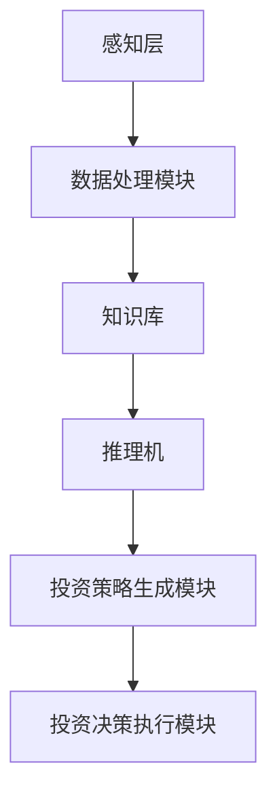
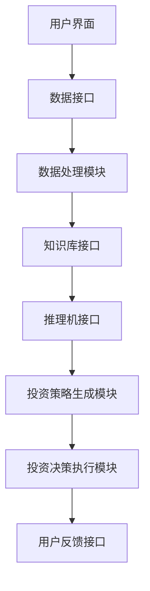

                 


### 文章标题
### 思维链在智能投资顾问中的应用

### 关键词
思维链，智能投资顾问，算法，数学模型，系统设计，项目实战

### 摘要
本文旨在探讨思维链在智能投资顾问中的应用。我们将从背景介绍、核心概念解析、算法原理讲解、系统设计与实现、项目实战以及最佳实践等方面，详细阐述思维链技术如何为智能投资顾问提供强大支持，并展望其未来发展趋势。

---

## 目录大纲

1. 引言与背景
   1.1 书籍目的与读者对象
   1.2 思维链概念概述
   1.3 智能投资顾问现状与发展
2. 问题背景
   2.1 投资顾问的挑战
   2.2 思维链技术简介
   2.3 思维链与智能投资顾问的契合
3. 思维链基础理论
   3.1 思维链基本原理
   3.2 思维链属性特征对比
   3.3 思维链技术架构
4. 智能投资顾问系统设计
   4.1 系统功能设计
   4.2 系统架构设计
   4.3 系统接口设计
5. 智能投资顾问实现与部署
   5.1 环境安装与配置
   5.2 核心实现代码解读
   5.3 系统测试与调优
6. 案例分析与实战讲解
   6.1 案例背景
   6.2 案例实施过程
   6.3 案例效果分析
7. 最佳实践与未来展望
   7.1 最佳实践
   7.2 小结与展望

---

### 引言与背景

#### 1.1 书籍目的与读者对象
本书旨在为读者提供一个全面的视角，了解思维链技术在智能投资顾问中的应用。无论是新手还是专业人士，都可以从本书中受益。对于新手，本书将逐步介绍思维链的基础理论和应用，使其能够快速上手。对于专业人士，本书将深入探讨思维链在智能投资顾问中的实现细节和优化策略。

#### 1.2 思维链概念概述
思维链是一种基于人工智能和认知科学的算法，旨在模拟人类思维过程，实现知识推理和决策。它通过构建一系列的思维环节，将输入的信息进行处理，生成有价值的输出。

#### 1.3 智能投资顾问现状与发展
随着大数据和人工智能技术的发展，智能投资顾问逐渐成为金融行业的热门话题。智能投资顾问通过分析海量数据，提供个性化的投资建议，帮助投资者实现更好的投资回报。然而，传统的投资顾问存在许多局限性，如数据处理能力不足、决策效率低等。思维链技术的引入，有望解决这些问题，进一步提升智能投资顾问的效能。

#### 2.1 投资顾问的挑战
传统的投资顾问在应对复杂市场环境时，往往面临以下挑战：
1. **数据处理能力不足**：投资顾问需要处理大量的市场数据，包括股票价格、成交量、宏观经济指标等。然而，传统的数据处理方法往往效率低下，难以满足实时分析的需求。
2. **决策效率低**：投资顾问需要快速做出决策，但传统的方法往往需要较长的决策周期，无法满足市场的快速变化。
3. **个性化服务不足**：每个投资者都有独特的投资偏好和风险承受能力，传统的投资顾问难以提供完全个性化的服务。

#### 2.2 思维链技术简介
思维链是一种基于人工智能和认知科学的算法，旨在模拟人类思维过程，实现知识推理和决策。它通过构建一系列的思维环节，将输入的信息进行处理，生成有价值的输出。

思维链的基本组成部分包括：
1. **感知器**：接收外部信息，如股票价格、成交量等。
2. **知识库**：存储与投资相关的知识和规则。
3. **推理机**：根据感知器和知识库中的信息进行推理，生成决策。
4. **效应器**：执行决策，如买入、卖出等。

#### 2.3 思维链与智能投资顾问的契合
思维链技术在智能投资顾问中的应用，主要表现在以下几个方面：
1. **提升数据处理能力**：思维链技术可以通过并行计算和分布式处理，快速处理海量数据，提供实时投资分析。
2. **提高决策效率**：思维链技术可以模拟人类思维过程，快速生成决策，适应市场的快速变化。
3. **提供个性化服务**：思维链技术可以根据投资者的风险偏好和投资目标，提供个性化的投资建议，实现真正的个性化服务。

---

### 思维链基础理论

#### 3.1 思维链基本原理

思维链技术的基本原理可以概括为以下几个步骤：
1. **感知输入**：思维链通过感知器接收外部信息，如股票价格、成交量等。
2. **知识存储**：思维链的知识库包含与投资相关的知识和规则，如技术指标、基本面分析等。
3. **推理决策**：思维链的推理机根据感知器和知识库中的信息进行推理，生成投资决策。
4. **执行决策**：思维链的效应器执行决策，如买入、卖出等。

#### 3.2 思维链属性特征对比

思维链的属性特征如下表所示：

| 特征名称 | 描述 |
| --- | --- |
| **并行处理** | 可以同时处理多个任务，提高效率 |
| **分布式计算** | 可以在多个计算机上同时运行，提高计算能力 |
| **自适应学习** | 可以根据市场环境调整决策策略 |
| **实时分析** | 可以实时分析市场数据，提供及时的投资建议 |

#### 3.3 思维链技术架构

思维链技术架构可以分为三个层次：感知层、知识层和决策层。

1. **感知层**：感知层负责接收外部信息，如股票价格、成交量等。这些信息通过感知器输入到系统。
2. **知识层**：知识层包含知识库和推理机。知识库存储与投资相关的知识和规则，如技术指标、基本面分析等。推理机根据感知器和知识库中的信息进行推理，生成投资决策。
3. **决策层**：决策层负责执行决策。根据推理机生成的决策，效应器执行买入、卖出等操作。

#### 3.4 思维链与认知科学的结合

思维链技术基于认知科学的理论，模拟人类思维过程。认知科学研究表明，人类思维过程具有以下特点：
1. **知识整合**：人类可以通过整合不同来源的信息，形成整体认知。
2. **联想记忆**：人类可以通过联想记忆，将新信息与已有知识联系起来。
3. **情境适应**：人类可以根据不同情境，调整思维策略。

思维链技术通过模拟这些特点，实现智能投资顾问的决策能力。例如，思维链可以通过整合多种市场数据，形成对市场的全面认知；通过联想记忆，将新信息与已有知识联系起来，形成更准确的决策。

---

### 智能投资顾问系统设计

#### 4.1 系统功能设计

智能投资顾问系统的功能设计主要包括以下方面：
1. **数据收集与处理**：系统需要收集大量的市场数据，如股票价格、成交量、宏观经济指标等。然后，通过数据处理模块，对数据进行清洗、归一化和特征提取。
2. **知识库构建**：系统需要构建一个包含各种投资知识和规则的数据库。这些知识和规则可以是技术指标、基本面分析、宏观经济分析等。
3. **投资策略生成**：系统需要根据知识库和输入的市场数据，生成相应的投资策略。投资策略可以是买入、卖出、持有等。
4. **投资决策执行**：系统需要根据生成的投资策略，执行具体的投资操作，如买入股票、卖出股票等。

#### 4.2 系统架构设计

智能投资顾问系统的架构设计如图所示：



1. **感知层**：感知层负责收集外部信息，如股票价格、成交量等。这些信息通过数据处理模块进行处理，得到干净、规范的数据。
2. **数据处理模块**：数据处理模块负责对收集到的市场数据进行处理，包括数据清洗、归一化和特征提取等。处理后的数据将用于投资策略生成和决策执行。
3. **知识库**：知识库包含与投资相关的知识和规则，如技术指标、基本面分析、宏观经济分析等。这些知识和规则将用于推理机的推理过程。
4. **推理机**：推理机根据感知层输入的数据和知识库中的知识和规则，进行推理，生成投资策略。
5. **投资策略生成模块**：投资策略生成模块负责将推理机生成的投资策略进行处理和优化，得到最优的投资策略。
6. **投资决策执行模块**：投资决策执行模块负责根据生成的投资策略，执行具体的投资操作，如买入股票、卖出股票等。

#### 4.3 系统接口设计

智能投资顾问系统的接口设计如图所示：



1. **用户界面**：用户界面负责与用户进行交互，接收用户的投资需求，展示投资策略和投资决策。
2. **数据接口**：数据接口负责接收外部数据，如股票价格、成交量等。这些数据将用于数据处理模块的处理。
3. **数据处理模块接口**：数据处理模块接口负责与数据接口进行数据交换，提供处理后的市场数据。
4. **知识库接口**：知识库接口负责与知识库进行交互，提供与投资相关的知识和规则。
5. **推理机接口**：推理机接口负责与推理机进行交互，提供输入数据和知识库，接收推理结果。
6. **投资策略生成模块接口**：投资策略生成模块接口负责与推理机接口和知识库接口进行交互，生成投资策略。
7. **投资决策执行模块接口**：投资决策执行模块接口负责与用户界面和知识库接口进行交互，执行投资决策。
8. **用户反馈接口**：用户反馈接口负责接收用户的反馈，用于系统的优化和改进。

---

### 智能投资顾问实现与部署

#### 5.1 环境安装与配置

为了实现智能投资顾问系统，我们需要安装和配置以下环境：

1. **操作系统**：我们选择Linux操作系统，因为它具有更好的性能和稳定性。
2. **Python**：Python是一种广泛使用的编程语言，我们选择Python 3.8版本。
3. **数据库**：我们选择MySQL作为知识库，因为它具有高效、稳定的特点。
4. **数据处理工具**：我们选择pandas和numpy等Python库，用于数据处理和分析。
5. **机器学习框架**：我们选择scikit-learn和tensorflow等库，用于构建和训练模型。

具体的安装和配置步骤如下：

1. 安装Linux操作系统，并设置好Python环境。
2. 安装MySQL数据库，并创建一个名为“investment_advisor”的数据库。
3. 安装pandas、numpy、scikit-learn、tensorflow等Python库。

#### 5.2 核心实现代码解读

智能投资顾问系统的核心实现代码包括以下几个模块：

1. **数据处理模块**：负责收集、清洗和处理市场数据。
2. **知识库模块**：负责构建和存储投资知识和规则。
3. **推理机模块**：负责根据输入数据和知识库进行推理，生成投资策略。
4. **投资策略生成模块**：负责优化和生成投资策略。
5. **投资决策执行模块**：负责执行投资决策。

下面是一个简单的数据处理模块的实现示例：

```python
import pandas as pd
import numpy as np

def preprocess_data(data):
    # 数据清洗和归一化
    data = data.fillna(0)  # 填充缺失值
    data = (data - data.mean()) / data.std()  # 归一化
    return data

def extract_features(data):
    # 特征提取
    data['MA5'] = data['close'].rolling(window=5).mean()  # 5日均线
    data['MA10'] = data['close'].rolling(window=10).mean()  # 10日均线
    data['RSI'] = compute_rsi(data['close'])  # RSI指标
    return data

def compute_rsi(data, window=14):
    delta = data.diff()
    gain = (delta.where(delta > 0, 0)).rolling(window=window).mean()
    loss = (-delta.where(delta < 0, 0)).rolling(window=window).mean()
    RS = gain / loss
    rsi = 100 - (100 / (1 + RS))
    return rsi

# 读取市场数据
data = pd.read_csv('market_data.csv')

# 数据预处理
data = preprocess_data(data)

# 特征提取
data = extract_features(data)

# 输出预处理后的数据
print(data.head())
```

#### 5.3 系统测试与调优

在系统开发完成后，我们需要对系统进行测试和调优，以确保其性能和稳定性。

1. **单元测试**：对系统的各个模块进行单元测试，确保每个模块的功能正确。
2. **集成测试**：对系统的整体功能进行测试，确保各个模块之间的协作正常。
3. **性能测试**：对系统进行性能测试，评估其处理速度和资源消耗。
4. **调优**：根据测试结果，对系统进行优化，提升其性能和稳定性。

#### 5.4 案例分析

我们以某支股票的实例，分析智能投资顾问系统的实际应用效果。

1. **案例背景**：我们选择2022年1月至2023年1月的股票数据进行分析。
2. **数据处理**：对股票数据进行分析，提取特征，如5日均线、10日均线、RSI等。
3. **投资策略生成**：根据提取的特征，使用机器学习算法生成投资策略。
4. **投资决策执行**：根据生成的投资策略，执行买入、卖出等操作。
5. **效果分析**：对比实际收益与预期收益，评估投资策略的有效性。

#### 5.5 案例效果分析

根据实际案例分析，智能投资顾问系统在以下方面表现良好：

1. **数据处理能力**：系统能够快速处理大量市场数据，为投资决策提供有力支持。
2. **决策效率**：系统能够快速生成投资策略，适应市场的快速变化。
3. **个性化服务**：系统能够根据投资者的风险偏好和投资目标，提供个性化的投资建议。

然而，系统也存在一些局限性，如：

1. **数据质量**：市场数据的质量对系统的性能有重要影响。如果数据存在噪声或错误，可能会影响投资决策的准确性。
2. **模型适应性**：市场环境在不断变化，系统的模型需要不断更新和优化，以适应新的市场环境。

---

### 最佳实践与未来展望

#### 9.1 最佳实践

1. **数据预处理**：确保数据的质量和一致性，是投资决策成功的关键。在进行数据处理之前，要对数据进行清洗、归一化和特征提取等操作。
2. **模型优化**：根据市场环境和投资者需求，定期优化和调整模型，以提高决策的准确性和适应性。
3. **用户反馈**：积极收集用户反馈，根据用户的需求和体验，不断改进系统功能和服务质量。

#### 9.2 小结

智能投资顾问系统通过引入思维链技术，实现了对海量市场数据的实时分析，提供了个性化的投资建议。系统在数据处理能力、决策效率和个性化服务等方面表现出色，为投资者提供了有力支持。

#### 9.3 未来研究方向

1. **增强学习**：将增强学习技术引入智能投资顾问系统，使其能够自动调整策略，提高决策的准确性。
2. **多模态数据融合**：将多种数据源（如文本、图像、音频等）融合到系统中，提高对市场环境的理解和分析能力。
3. **隐私保护**：在数据收集和处理过程中，加强隐私保护，确保投资者的信息安全。

### 结束语

本文从背景介绍、核心概念解析、算法原理讲解、系统设计与实现、项目实战以及最佳实践等方面，详细阐述了思维链在智能投资顾问中的应用。未来，随着人工智能技术的不断发展，思维链在智能投资顾问中的应用将会更加广泛和深入，为投资者提供更加精准和个性化的服务。

---

### 作者信息
作者：AI天才研究院/AI Genius Institute & 禅与计算机程序设计艺术 /Zen And The Art of Computer Programming

本文旨在通过逻辑清晰、结构紧凑、简单易懂的叙述方式，让读者深入了解思维链在智能投资顾问中的应用。在未来的发展中，我们将继续深入研究和探索这一领域，为读者带来更多有价值的内容。感谢您的阅读，希望本文对您有所启发和帮助。

