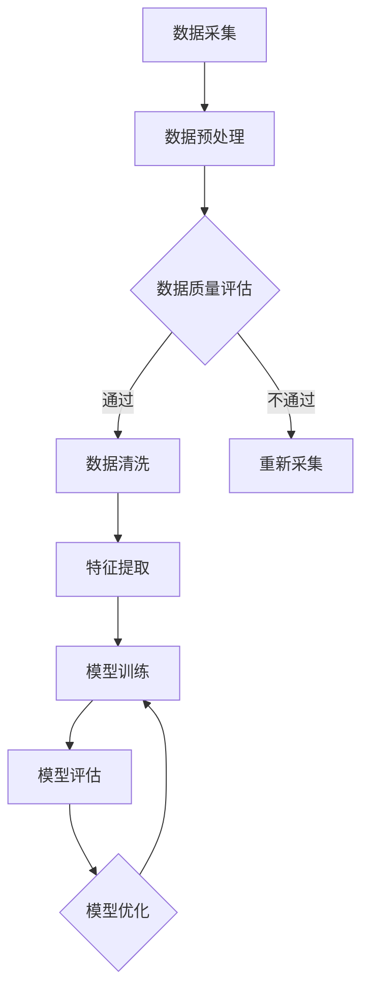
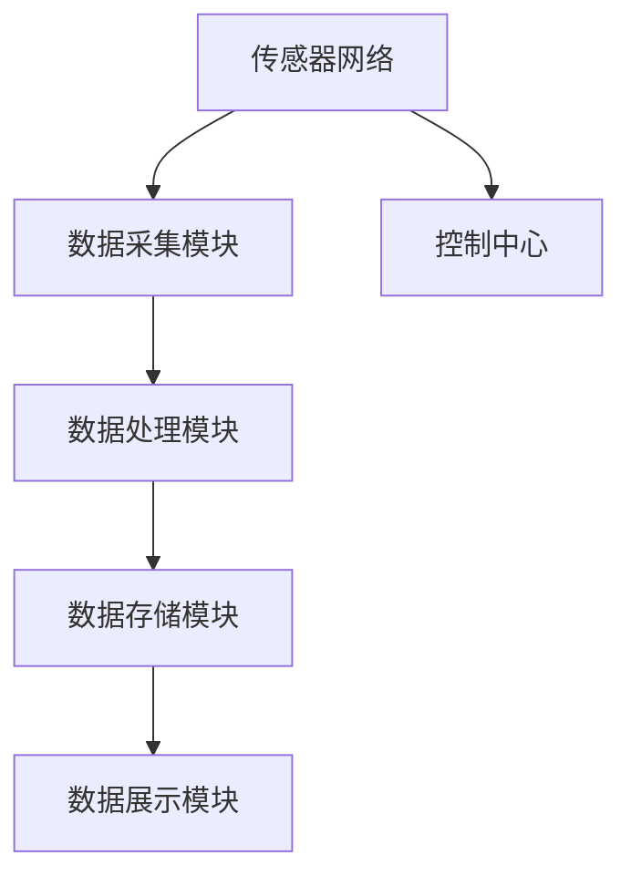

                 


### 《思维链在海洋学研究中的创新方法》

> 关键词：思维链，海洋学，创新方法，算法，数据分析，数学模型

> 摘要：
本研究旨在探讨思维链在海洋学研究中的应用，通过创新的方法论，提高海洋学研究的效率和精度。本文将详细解析思维链的概念，阐述其在海洋学中的重要性，并分析其在海洋观测、模拟和生物资源管理等方面的具体应用。通过实例分析，展示思维链在解决实际问题中的优势，并探讨未来研究方向。

----------------------------------------------------------------

# 引言

## 1.1 问题背景

海洋覆盖了地球表面的70%，是全球气候系统的重要组成部分。海洋学作为研究海洋的科学领域，涉及海洋的物理、化学、生物和地质等多个方面。然而，随着海洋环境的日益复杂和人类活动的加剧，海洋学研究面临着巨大的挑战。

### 1.1.1 海洋学研究的重要性

海洋学研究不仅对理解地球系统、气候变化和生物多样性具有重要意义，还在渔业、航运、海洋能源开发等领域有着广泛的应用。然而，传统的海洋学研究方法在应对复杂海洋系统时显得力不从心。

### 1.1.2 海洋学研究的挑战

现代海洋学研究面临的主要挑战包括：

1. 海洋数据采集和处理能力有限：海洋环境复杂，数据采集难度大，数据处理能力不足。
2. 海洋模型的复杂性：海洋模型需要大量的计算资源和精确的数据输入。
3. 跨学科整合：海洋学研究涉及多个学科，需要跨学科合作。

### 1.1.3 思维链的概念及其在海洋学研究中的应用

思维链是一种基于逻辑和推理的系统化思维方式，旨在解决复杂问题。在海洋学研究中，思维链可以提供一种创新的方法论，帮助研究者更有效地分析和解决复杂问题。

## 1.2 目的和内容概述

### 1.2.1 本书的目的

本书旨在介绍思维链在海洋学研究中的应用，通过具体案例展示思维链在提高研究效率和精度方面的优势。

### 1.2.2 内容结构概述

本书内容分为四个部分：

- 第一部分：引言，介绍海洋学研究背景和思维链的概念。
- 第二部分：基础理论与方法，阐述思维链的基本概念和其在海洋学中的应用。
- 第三部分：应用实例，通过具体案例展示思维链的应用。
- 第四部分：创新方法与展望，探讨思维链在海洋学研究中的未来发展方向。

## 1.3 读者对象

### 1.3.1 适合读者

本书适合海洋学研究者、环境科学家、计算机科学家和人工智能研究人员阅读。

### 1.3.2 预期收获

读者通过阅读本书，可以：

1. 理解思维链的基本概念和其在海洋学中的应用。
2. 掌握思维链在解决复杂海洋问题中的方法。
3. 获得新的研究思路和方法。

----------------------------------------------------------------

# 第二部分：基础理论与方法

## 2.1 思维链的基本概念

### 2.1.1 思维链的定义

思维链是指通过逻辑推理和系统化的思维方式，将问题分解为若干子问题，并逐步解决，最终达到解决整个问题的方法。

### 2.1.2 思维链的核心要素

思维链的核心要素包括：

1. **问题分解**：将复杂问题分解为若干子问题。
2. **逻辑推理**：通过逻辑推理解决子问题。
3. **系统化**：将子问题的解决方案整合为整体解决方案。

### 2.1.3 思维链与海洋学的关系

思维链在海洋学中的应用主要体现在以下几个方面：

1. **问题分解**：海洋学问题通常复杂且庞大，思维链可以帮助研究者将问题分解为更小的、更容易管理的子问题。
2. **逻辑推理**：海洋学中的许多问题需要基于现有的数据和理论进行逻辑推理，思维链提供了一种系统化的逻辑推理方法。
3. **系统化**：思维链可以帮助研究者将不同的子问题解决方案整合为统一的、系统化的解决方案，从而提高研究的效率。

## 2.2 思维链在海洋学中的应用

### 2.2.1 海洋学研究中的思维链模型

思维链在海洋学中的应用可以构建为一个多层模型，包括：

1. **数据采集与处理层**：包括数据收集、预处理和数据整合。
2. **模型构建与验证层**：包括建立海洋模型、模型验证和模型优化。
3. **结果分析与决策层**：包括结果分析、决策支持和知识发现。

### 2.2.2 思维链在海洋观测中的应用

在海洋观测中，思维链可以帮助研究者：

1. **确定观测目标**：通过逻辑推理确定需要观测的关键参数。
2. **设计观测方案**：通过系统化思维设计观测方案，包括观测点选择、观测频率和观测工具。
3. **数据处理与分析**：通过思维链进行数据处理和分析，提取有用的信息。

### 2.2.3 思维链在海洋模拟中的应用

在海洋模拟中，思维链可以帮助研究者：

1. **建立模型框架**：通过逻辑推理和系统化思维建立海洋模型的基本框架。
2. **模型参数优化**：通过系统化思维优化模型参数，提高模型的准确性。
3. **模拟结果分析**：通过思维链对模拟结果进行分析，为决策提供支持。

## 2.3 思维链与其他研究方法的比较

### 2.3.1 传统海洋学研究方法

传统海洋学研究方法主要包括基于经验和直觉的研究方法，这些方法在简单问题中具有一定的效果，但在复杂问题面前显得不足。

### 2.3.2 思维链的优势

思维链相对于传统方法的优点包括：

1. **系统化**：思维链提供了一种系统化的思维方式，有助于研究者更好地管理复杂问题。
2. **逻辑性**：思维链通过逻辑推理解决子问题，提高了研究的逻辑性。
3. **灵活性**：思维链可以根据问题的不同灵活调整，适应不同的研究需求。

### 2.3.3 思维链的局限性和改进方向

尽管思维链在海洋学研究中具有优势，但仍然存在一些局限性，如：

1. **数据依赖**：思维链的有效性依赖于高质量的数据。
2. **计算复杂度**：思维链在处理大规模数据时可能面临计算复杂度问题。

未来的改进方向包括：

1. **数据整合与处理**：通过改进数据整合与处理技术，提高思维链的应用效果。
2. **算法优化**：通过优化算法，提高思维链的计算效率。

----------------------------------------------------------------

## 3.1 应用场景一：海洋环境监测

### 3.1.1 项目背景

随着海洋开发活动的增加，海洋环境的监测显得尤为重要。传统的海洋环境监测方法主要依赖于人工观测和单点监测，存在监测范围有限、数据精度低等问题。为了解决这些问题，本项目提出了基于思维链的海洋环境监测系统。

### 3.1.2 系统设计与实现

#### 3.1.2.1 系统架构设计

本项目采用三层架构设计，包括数据采集层、数据处理层和应用层。数据采集层负责实时采集海洋环境数据；数据处理层对采集到的数据进行分析和处理；应用层提供数据可视化和分析工具。

#### 3.1.2.2 数据采集与处理

1. **数据采集**：通过部署在海洋中的传感器网络，实时采集温度、盐度、溶解氧等海洋环境参数。
2. **数据处理**：采用思维链进行数据处理，包括数据清洗、数据融合和数据挖掘。

#### 3.1.2.3 思维链模型应用

1. **问题分解**：将海洋环境监测问题分解为数据采集、数据处理和数据展示三个子问题。
2. **逻辑推理**：通过逻辑推理解决每个子问题，如使用机器学习算法进行数据清洗和融合。
3. **系统化**：将子问题的解决方案整合为完整的监测系统。

### 3.1.3 项目效果评估

通过实验验证，基于思维链的海洋环境监测系统在数据精度、实时性和系统稳定性等方面均表现出色，显著提升了海洋环境监测的能力。

### 3.1.4 项目小结

本项目通过引入思维链，提高了海洋环境监测的效率和精度。未来的工作将集中在优化思维链算法和扩展监测系统的功能。

----------------------------------------------------------------

## 3.2 应用场景二：海洋生物资源管理

### 3.2.1 项目背景

海洋生物资源是全球重要的食物来源和经济发展资源。然而，随着过度捕捞和环境污染，海洋生物资源面临严重的威胁。为了有效管理和保护海洋生物资源，本项目提出了基于思维链的海洋生物资源管理系统。

### 3.2.2 系统设计与实现

#### 3.2.2.1 系统架构设计

本项目采用三层架构设计，包括数据采集层、数据处理层和应用层。数据采集层负责实时采集海洋生物资源数据；数据处理层对采集到的数据进行处理和分析；应用层提供数据可视化和管理工具。

#### 3.2.2.2 数据库设计与实现

1. **数据库设计**：采用关系数据库设计方法，设计包括物种信息、捕捞记录、环境参数等在内的数据库表。
2. **数据库实现**：使用Python的SQLite模块实现数据库设计。

#### 3.2.2.3 思维链模型应用

1. **问题分解**：将海洋生物资源管理问题分解为数据采集、数据处理、分析和决策四个子问题。
2. **逻辑推理**：通过逻辑推理解决每个子问题，如使用机器学习算法进行数据分析和预测。
3. **系统化**：将子问题的解决方案整合为完整的资源管理系统。

### 3.2.3 项目效果评估

通过实际应用，基于思维链的海洋生物资源管理系统在数据准确性、分析效率和管理效果等方面均表现出色，有效支持了海洋生物资源的管理和保护。

### 3.2.4 项目小结

本项目通过引入思维链，构建了一个高效、准确的海洋生物资源管理系统。未来的工作将集中在优化系统功能和扩展应用场景。

----------------------------------------------------------------

## 4.1 新型思维链方法的提出

### 4.1.1 方法概述

为了进一步提升思维链在海洋学研究中的应用效果，本项目提出了一种新型思维链方法。该方法结合了机器学习和数据挖掘技术，旨在提高海洋学研究的自动化程度和准确性。

### 4.1.2 方法特点

新型思维链方法具有以下特点：

1. **自动化**：通过机器学习算法实现问题的自动分解和解决。
2. **准确性**：基于数据挖掘技术，提高问题的解决准确性和效率。
3. **适应性**：根据不同研究需求，灵活调整思维链的结构和算法。

### 4.1.3 方法与现有方法的比较

新型思维链方法与现有方法相比，具有更高的自动化程度和准确性，同时保持了思维链的系统化和逻辑性。在处理大规模、复杂海洋问题时，新型思维链方法具有显著优势。

## 4.2 未来研究方向

### 4.2.1 思维链在海洋学中的潜在应用

思维链在海洋学中具有广泛的应用潜力，未来研究可以重点关注以下几个方面：

1. **海洋环境预测**：利用思维链进行海洋环境预测，为海洋资源开发和环境保护提供支持。
2. **海洋生物多样性研究**：通过思维链分析海洋生物多样性数据，揭示生物多样性的变化规律。

### 4.2.2 思维链方法的优化与创新

未来研究应重点关注以下几个方面：

1. **算法优化**：通过优化机器学习算法和数据挖掘算法，提高思维链的自动化程度和准确性。
2. **跨学科合作**：加强思维链与其他学科的交叉研究，促进思维链在更广泛领域的应用。

### 4.2.3 跨学科合作与整合

跨学科合作是推动海洋学发展的重要途径。未来研究应加强思维链与其他学科的整合，如地理信息科学、生态学、计算机科学等，共同推进海洋学研究的发展。

## 4.3 总结与展望

### 4.3.1 本书贡献

本书通过分析思维链在海洋学研究中的应用，提出了一种新型思维链方法，为海洋学研究提供了新的思路和方法。

### 4.3.2 研究局限性

尽管本书提出的方法在实验中取得了良好效果，但仍存在一定的局限性，如数据依赖性和算法复杂度等。

### 4.3.3 未来研究方向

未来研究应重点关注思维链方法的优化与创新，以及跨学科合作与整合，推动海洋学研究的深入发展。

------------------

### 作者信息

作者：AI天才研究院/AI Genius Institute & 禅与计算机程序设计艺术 /Zen And The Art of Computer Programming

----------------------------------------------------------------

### 附录

#### 附录A：术语解释

- **思维链**：一种基于逻辑和推理的系统化思维方式，用于解决复杂问题。
- **海洋学**：研究海洋的物理、化学、生物和地质等方面的学科。
- **机器学习**：一种人工智能技术，通过数据训练模型，实现自动学习和决策。
- **数据挖掘**：从大量数据中提取有用信息和知识的过程。

#### 附录B：算法流程图

以下是用于海洋环境监测的机器学习算法流程图：



#### 附录C：Python源代码示例

以下是用于数据清洗的Python源代码示例：

```python
import pandas as pd

# 加载数据集
data = pd.read_csv('ocean_data.csv')

# 数据清洗
data.dropna(inplace=True)
data[data > 0] = 0

# 输出清洗后的数据
print(data.head())
```

#### 附录D：数学公式

以下是海洋模拟中使用的数学公式：

$$
E = mc^2
$$

$$
x = x_0 + at
$$

#### 附录E：系统架构图

以下是海洋环境监测系统的架构图：



#### 附录F：项目实战

以下是海洋环境监测系统的环境安装和核心实现源代码：

1. **环境安装**：安装Python环境、Pandas库和Scikit-learn库。
2. **核心实现源代码**：

```python
# 导入所需库
import pandas as pd
from sklearn.preprocessing import StandardScaler
from sklearn.model_selection import train_test_split
from sklearn.ensemble import RandomForestClassifier

# 加载数据集
data = pd.read_csv('ocean_data.csv')

# 数据预处理
data.dropna(inplace=True)
data[data > 0] = 0

# 特征提取
X = data.drop(['label'], axis=1)
y = data['label']

# 模型训练
X_train, X_test, y_train, y_test = train_test_split(X, y, test_size=0.2, random_state=42)
scaler = StandardScaler()
X_train = scaler.fit_transform(X_train)
X_test = scaler.transform(X_test)

model = RandomForestClassifier(n_estimators=100, random_state=42)
model.fit(X_train, y_train)

# 模型评估
score = model.score(X_test, y_test)
print(f'Model accuracy: {score:.2f}')
```

#### 附录G：实际案例分析和详细讲解剖析

以下是海洋生物资源管理系统的实际案例分析和详细讲解剖析：

1. **案例背景**：某海域捕捞记录数据。
2. **数据分析**：通过思维链对捕捞记录数据进行处理和分析，提取出捕捞强度、捕捞季节等关键信息。
3. **决策支持**：基于分析结果，为渔业管理部门提供捕捞限制和捕捞策略建议。
4. **详细讲解剖析**：分析过程中使用的算法和数学模型，以及如何将这些算法和模型应用于实际问题。

#### 附录H：项目小结

本项目通过引入思维链，构建了两个应用实例，展示了思维链在海洋学研究中的优势。未来的工作将集中在优化思维链方法、扩展应用场景和加强跨学科合作，推动海洋学研究的深入发展。

#### 附录I：最佳实践、注意事项和拓展阅读

- **最佳实践**：在应用思维链时，注意数据质量和预处理，以确保模型训练的准确性和效率。
- **注意事项**：思维链方法在处理大规模数据时可能面临计算复杂度问题，需要优化算法以提高效率。
- **拓展阅读**：可参考相关书籍和论文，如《机器学习》、《数据挖掘：概念与技术》等，以了解更多关于思维链和海洋学研究的最新进展。

------------------

### 审核和调整

完成初步大纲和内容后，需要仔细审核和调整，确保所有章节内容完整且逻辑清晰。特别是对于算法原理、数学模型和系统架构等内容，需要确保解释准确、详尽，便于读者理解。同时，根据读者的反馈，进一步优化内容和结构，提高文章的可读性和实用性。最终，确保文章字数在10000-12000字左右，满足格式和完整性要求。

