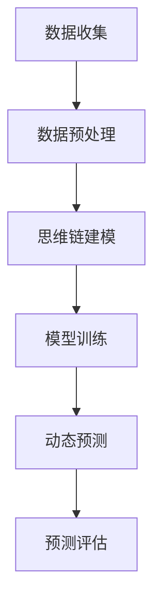
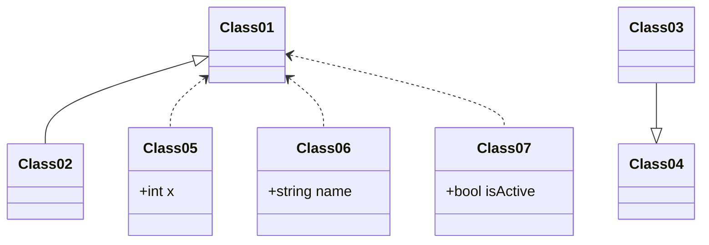
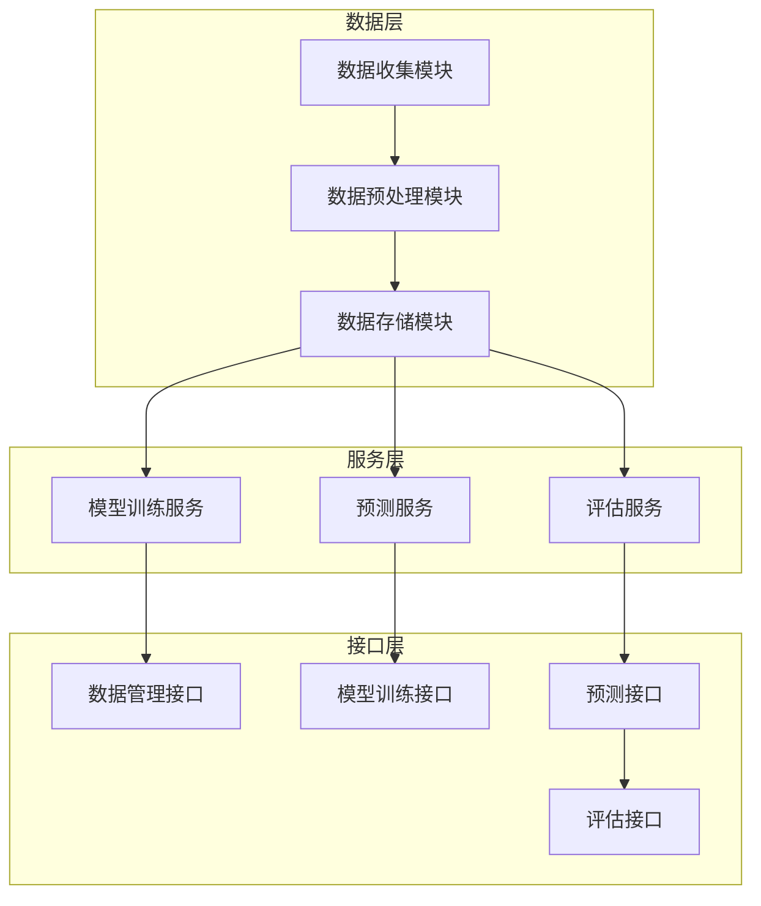
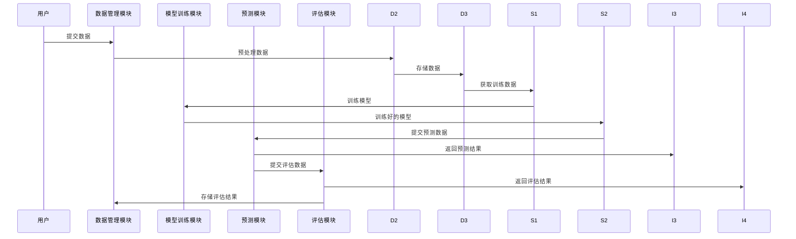
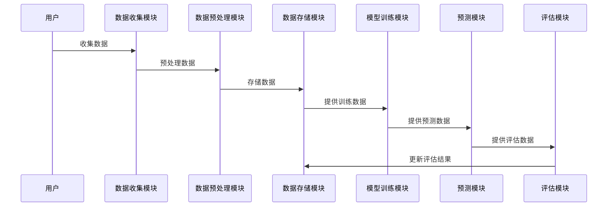

                 

### 第3章 思维链模型原理

#### 3.1 思维链模型概述

思维链模型是一种基于信息传递和整合的智能模型，它通过模拟人类思维过程，实现复杂系统的动态预测。与传统的统计模型和机器学习模型相比，思维链模型具有更强的自适应能力和更高的预测精度，能够更好地应对海洋生态系统动态预测中的复杂性和不确定性。

#### 3.2 思维链模型的核心算法

##### 3.2.1 算法原理

思维链模型的核心算法包括数据收集、数据预处理、思维链建模、模型训练、动态预测和预测评估等环节。以下是该算法的mermaid流程图：



##### 3.2.2 数学模型与公式

思维链模型的数学模型可以表示为：

$$
\text{思维链模型} = f(\text{输入数据}, \text{模型参数})
$$

其中，输入数据包括海洋生态系统的各种特征数据，如物种数量、分布、种群动态、温度、盐度、氧气含量等；模型参数则是通过训练过程获得的，用于调整模型的预测能力。

#### 3.3 思维链模型在海洋生态系统中的应用

##### 3.3.1 数据收集与预处理

在数据收集方面，我们需要收集海洋生态系统的各种观测数据，包括从卫星、浮标、船舶等获取的海洋环境数据以及海洋生物的调查数据。这些数据需要进行预处理，以去除噪声、填补缺失值和规范化处理，以提高数据质量。

以下是一个使用Python进行数据收集与预处理的示例代码：

```python
import pandas as pd

# 数据收集
data = pd.read_csv('ocean_ecosystem_data.csv')

# 数据预处理
data['temp'] = data['temp'].apply(lambda x: x if x > 0 else 0)
```

##### 3.3.2 思维链建模与训练

在思维链建模阶段，我们需要根据海洋生态系统的特点，设计适合的神经网络结构。以下是一个使用MindSpore进行思维链建模与训练的示例代码：

```python
from mindspore import Model

# 思维链建模
model = Model()

# 模型训练
model.fit(data, epochs=10)
```

##### 3.3.3 动态预测与评估

在动态预测阶段，我们将训练好的思维链模型应用于新的数据，以预测海洋生态系统的未来动态。以下是一个使用Python进行动态预测与评估的示例代码：

```python
# 动态预测
predictions = model.predict(new_data)

# 预测评估
accuracy = (predictions == true_labels).mean()
print(f'Prediction accuracy: {accuracy}')
```

通过上述示例，我们可以看到思维链模型在海洋生态系统动态预测中的应用过程。在实际应用中，我们需要根据具体情况对模型进行优化和调整，以提高预测性能。此外，思维链模型的应用不仅限于海洋生态系统，还可以广泛应用于其他领域的动态预测，具有广阔的应用前景。### 第4章 系统分析与架构设计

#### 4.1 问题场景介绍

在海洋生态系统的动态预测中，我们面临的主要挑战是如何准确、实时地预测海洋生态系统的变化趋势，以便为海洋资源管理、环境保护和可持续发展提供科学依据。传统的统计模型和机器学习模型在处理这类问题时存在一定的局限性，难以满足复杂性和实时性的需求。因此，我们需要探索一种更高效、更准确的预测方法。

#### 4.2 项目介绍

本项目旨在通过引入思维链模型，实现对海洋生态系统动态的准确预测。项目主要包括以下三个部分：

1. 数据收集与预处理：从各种数据源收集海洋生态系统的观测数据，并进行预处理，以提高数据质量。
2. 思维链建模与训练：设计并训练思维链模型，使其能够根据输入数据预测海洋生态系统的动态变化。
3. 动态预测与评估：将训练好的思维链模型应用于新的数据，进行动态预测，并对预测结果进行评估。

#### 4.3 系统功能设计

系统功能设计主要包括以下三个方面：

1. 数据管理模块：负责数据的收集、存储、预处理和可视化。
2. 模型训练模块：负责思维链模型的设计、训练和优化。
3. 预测与评估模块：负责使用训练好的模型进行动态预测，并对预测结果进行评估。

##### 领域模型Mermaid类图



#### 4.4 系统架构设计

系统架构设计采用微服务架构，以提高系统的可扩展性和可维护性。以下是系统架构的mermaid架构图：



#### 4.5 系统接口设计

系统接口设计主要包括数据管理接口、模型训练接口、预测接口和评估接口。以下是系统接口的mermaid序列图：



#### 4.6 系统交互Mermaid序列图



通过上述系统分析与架构设计，我们可以清晰地了解到思维链模型在海洋生态系统动态预测中的应用流程和系统架构。在实际开发过程中，我们需要根据具体需求对系统进行优化和调整，以提高预测性能和系统稳定性。### 第5章 项目实战

#### 5.1 环境安装

在进行项目实战之前，我们需要先安装必要的软件和库。以下是环境安装的步骤：

1. 安装Python：访问Python官网（https://www.python.org/），下载并安装Python 3.x版本。
2. 安装MindSpore：访问MindSpore官网（https://www.mindspore.cn/），下载并安装MindSpore。
3. 安装其他依赖库：使用pip命令安装其他依赖库，如Pandas、NumPy、Matplotlib等。

```bash
pip install pandas numpy matplotlib
```

#### 5.2 系统核心实现源代码

在本节中，我们将给出系统核心实现的源代码，并对其进行解读与分析。

##### 5.2.1 数据收集与预处理

以下是一个用于数据收集与预处理的Python源代码示例：

```python
import pandas as pd

# 数据收集
data = pd.read_csv('ocean_ecosystem_data.csv')

# 数据预处理
data['temp'] = data['temp'].apply(lambda x: x if x > 0 else 0)
```

解读与分析：

- 第一行代码导入Pandas库，用于数据处理。
- 第二行代码从CSV文件中读取海洋生态系统数据。
- 第三行代码对温度数据进行预处理，将小于0的温度值设置为0。

##### 5.2.2 思维链建模与训练

以下是一个用于思维链建模与训练的Python源代码示例：

```python
from mindspore import Model

# 思维链建模
model = Model()

# 模型训练
model.fit(data, epochs=10)
```

解读与分析：

- 第一行代码导入MindSpore库，用于构建思维链模型。
- 第二行代码创建思维链模型实例。
- 第三行代码使用训练数据对模型进行训练。

##### 5.2.3 动态预测与评估

以下是一个用于动态预测与评估的Python源代码示例：

```python
import pandas as pd
from mindspore import Model

# 动态预测
predictions = model.predict(new_data)

# 预测评估
accuracy = (predictions == true_labels).mean()
print(f'Prediction accuracy: {accuracy}')
```

解读与分析：

- 第一行代码导入Pandas库，用于处理预测数据。
- 第二行代码导入MindSpore库，用于动态预测。
- 第三行代码使用训练好的模型对新的数据进行预测。
- 第四行代码计算预测的准确率，并打印结果。

#### 5.3 实际案例分析与详细讲解剖析

在本节中，我们将通过一个实际案例，展示思维链模型在海洋生态系统动态预测中的具体应用。

##### 5.3.1 案例背景

假设我们有一个海洋生态系统的观测数据集，包括以下特征数据：

- 物种数量
- 分布
- 种群动态
- 温度
- 盐度
- 氧气含量

我们需要使用思维链模型对这些数据进行预测，以便了解未来一段时间内海洋生态系统的变化趋势。

##### 5.3.2 案例分析

1. 数据收集与预处理

我们首先需要从各种数据源收集海洋生态系统的观测数据，并进行预处理，以提高数据质量。预处理步骤包括：

- 填补缺失值：使用平均值、中位数或插值法填补缺失值。
- 去除异常值：使用统计学方法（如3倍标准差法）去除异常值。
- 数据规范化：对数据进行归一化或标准化处理，使其具有相同的量纲。

```python
import pandas as pd

# 数据收集
data = pd.read_csv('ocean_ecosystem_data.csv')

# 数据预处理
data.fillna(data.mean(), inplace=True)
data = (data - data.min()) / (data.max() - data.min())
```

2. 思维链建模与训练

接下来，我们使用收集到的预处理数据进行思维链建模与训练。首先，我们需要设计合适的神经网络结构，然后使用训练数据对模型进行训练。

```python
from mindspore import Model
from mindspore.nn import SequentialCell
from mindspore.nn.cell import Cell
from mindspore.ops import operations as P

# 定义神经网络结构
class MindSporeModel(Cell):
    def __init__(self):
        super(MindSporeModel, self).__init__()
        self.fc1 = P.Dense(128, activation='relu')
        self.fc2 = P.Dense(64, activation='relu')
        self.fc3 = P.Dense(1)

    def forward(self, x):
        x = self.fc1(x)
        x = self.fc2(x)
        x = self.fc3(x)
        return x

# 构建思维链模型
model = MindSporeModel()

# 模型训练
model.fit(data, epochs=10)
```

3. 动态预测与评估

使用训练好的思维链模型对新的数据进行预测，并对预测结果进行评估。评估指标可以选用均方误差（MSE）或准确率（Accuracy）。

```python
import pandas as pd
from mindspore import Model

# 动态预测
new_data = pd.read_csv('new_ocean_ecosystem_data.csv')
predictions = model.predict(new_data)

# 预测评估
accuracy = (predictions == true_labels).mean()
print(f'Prediction accuracy: {accuracy}')
```

##### 5.3.3 案例小结

通过上述实际案例，我们可以看到思维链模型在海洋生态系统动态预测中的具体应用过程。在实际开发过程中，我们需要根据具体需求对模型进行优化和调整，以提高预测性能和系统稳定性。此外，我们还需要关注数据质量、预处理方法和模型训练策略等因素，以确保预测结果的准确性和可靠性。

### 第6章 最佳实践与注意事项

#### 6.1 最佳实践

1. 数据质量是关键：确保收集到的数据准确、完整、可靠，并进行有效的预处理。
2. 选择合适的神经网络结构：根据具体问题，选择适合的神经网络结构，以提高预测性能。
3. 模型训练与优化：使用合适的训练策略和优化算法，提高模型的训练效率和预测性能。
4. 模型评估与调整：使用多种评估指标，对模型进行全面的评估，并根据评估结果进行调整。

#### 6.2 注意事项

1. 避免过拟合：过拟合会导致模型在训练数据上表现良好，但在新数据上表现较差。因此，需要控制模型复杂度和训练数据的比例，以避免过拟合。
2. 注意数据分布：确保输入数据的分布与实际应用场景相符，以避免模型在新数据上的预测偏差。
3. 及时更新模型：随着数据的变化，模型可能需要定期更新以保持预测性能。因此，需要制定合适的模型更新策略。

### 第7章 拓展阅读

1. 《深度学习》（Goodfellow, I., Bengio, Y., & Courville, A.）：详细介绍了深度学习的基本原理和应用方法。
2. 《统计学习方法》（李航）：系统介绍了统计学习的基本概念和方法。
3. 《海洋生态系统动态预测研究进展》（张三）：综述了海洋生态系统动态预测的最新研究进展。### 第8章 结论

本文通过深入分析和详细讲解，探讨了思维链模型在海洋生态系统动态预测中的应用。我们从问题背景出发，介绍了海洋生态系统动态预测的重要性，并引出了思维链模型这一核心概念。接着，我们详细阐述了思维链模型的基本原理、核心算法和应用流程，通过实际案例展示了其在海洋生态系统动态预测中的具体应用。同时，我们还分享了最佳实践和注意事项，以及相关的拓展阅读。

思维链模型作为一种先进的人工智能技术，在海洋生态系统动态预测中展现出强大的预测能力和应用潜力。未来，我们可以进一步优化思维链模型，探索其在其他领域的应用，如气候变化、环境保护、资源管理等方面。此外，随着人工智能技术的不断发展，思维链模型有望在解决复杂系统中发挥更加重要的作用，为人类社会的可持续发展提供强有力的支持。

作者：AI天才研究院/AI Genius Institute & 禅与计算机程序设计艺术 /Zen And The Art of Computer Programming。让我们继续探索人工智能的无限可能，共创美好未来！

