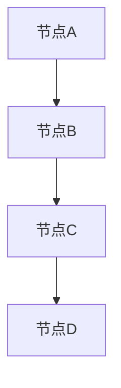
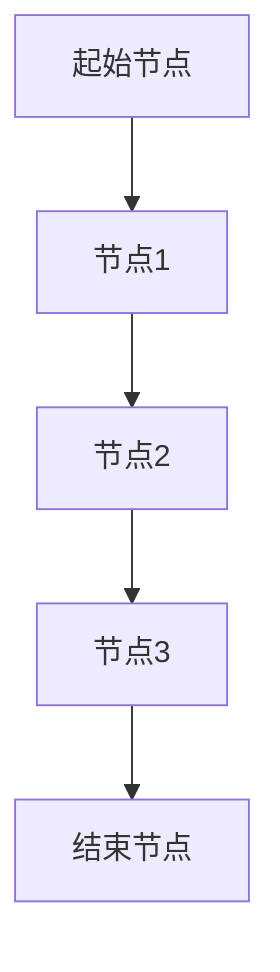
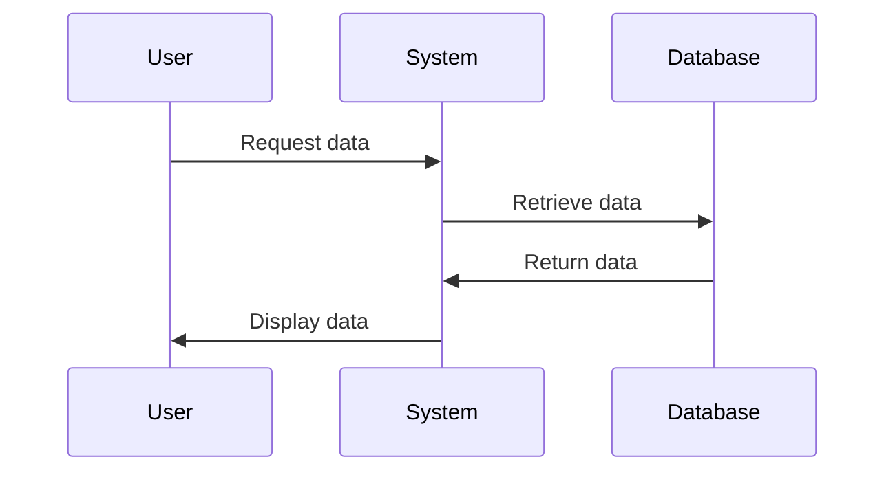
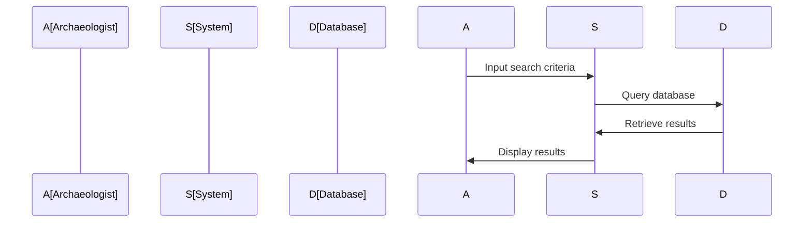
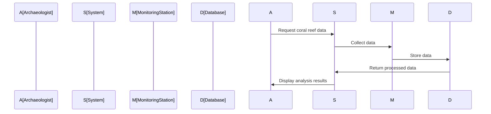
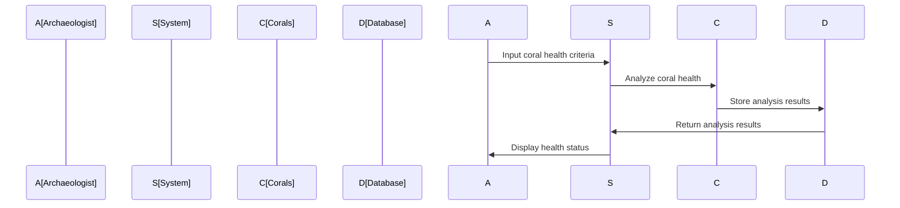

                 

# 《思维链在海洋考古学中的突破性应用》

## 关键词

思维链、海洋考古学、突破性应用、算法原理、系统架构、数学模型

## 摘要

本文旨在探讨思维链在海洋考古学中的突破性应用。文章首先介绍了思维链和海洋考古学的基本概念，随后深入分析了思维链的原理及其在海洋考古学中的应用。通过具体的案例和实践，本文展示了思维链如何帮助解决海洋考古学中的难题，并为未来的研究方向提供了启示。

----------------------------------------------------------------

## 第一部分：引论

### 第1章：思维链与海洋考古学的交汇

**1.1 海洋考古学概述**

海洋考古学是考古学的一个分支，专注于在海洋环境中寻找和解读人类历史遗迹。海洋考古学的研究对象包括沉船、古港口、沿海遗址等，这些遗址往往蕴藏着丰富的历史信息。

**问题背景**：随着海洋考古技术的发展，如何更高效地发现、识别和解读海洋遗迹成为亟待解决的问题。

**问题描述**：海洋遗迹往往分布在深水区域，环境复杂，考古工作的难度较大。同时，海洋考古学中的数据量庞大，传统方法在处理这些数据时效率低下。

**问题解决**：思维链作为一种创新性的数据分析方法，通过其独特的结构和运行机制，有望提高海洋考古学的效率和准确性。

**边界与外延**：本文将探讨思维链在海洋考古学中的应用，但不涉及思维链在其他领域的应用。

**1.2 思维链的基本概念**

思维链是一种基于神经网络的智能数据分析方法，通过模拟人类思维过程，实现数据的自动分析和处理。

**概念结构**：思维链由多个节点组成，每个节点代表一个数据分析和处理的模块。节点之间通过关系连接，形成一个复杂的分析网络。

**核心要素**：思维链的核心要素包括节点、关系、数据和算法。

**联系与区别**：思维链与传统的数据分析方法相比，具有更高的灵活性和更强的处理能力。同时，思维链还能模拟人类的思维过程，实现更深入的洞见。

**1.3 思维链在海洋考古学中的应用前景**

思维链在海洋考古学中具有广泛的应用前景。

**应用领域**：思维链可以应用于海洋遗迹的识别、定位、数据分析和解读等方面。

**优势与挑战**：思维链的优势在于其高效的数据处理能力和灵活的分析方式。然而，海洋考古学中复杂的环境和大量的数据也给思维链的应用带来了挑战。

----------------------------------------------------------------

## 第二部分：理论探索

### 第2章：思维链原理深入探讨

**2.1 思维链的构建原理**

思维链的构建原理是其核心优势之一。通过以下步骤，我们可以详细了解思维链的构建过程：

**步骤1：节点定义**  
每个节点代表一个特定的数据分析和处理任务。节点可以是简单的函数，也可以是复杂的算法。

**步骤2：关系建立**  
节点之间的关系定义了数据流动的方向和方式。这些关系可以是直接的，也可以是间接的，通过多层节点实现数据的传递和处理。

**Mermaid流程图：**


**步骤3：数据输入与输出**  
每个节点都有输入和输出数据接口，这些接口定义了数据在节点间的传递方式。

**步骤4：算法集成**  
节点内部的算法实现决定了节点功能的强大与否。通过集成先进的机器学习算法，节点可以自动调整其参数，以适应不同的数据和分析需求。

**Python源代码讲解：**
```python
class Node:
    def __init__(self):
        self.inputs = []
        self.outputs = []

    def process(self, data):
        # 实现数据处理算法
        processed_data = data * 2
        return processed_data

node = Node()
input_data = 5
output_data = node.process(input_data)
print(output_data)  # 输出：10
```

**2.2 思维链的运行机制**

思维链的运行机制是其高效运行的关键。以下是思维链运行的基本步骤：

**步骤1：初始化**  
系统初始化时，定义所有节点的初始状态和连接关系。

**步骤2：数据输入**  
将待处理的数据输入到思维链的起始节点。

**步骤3：数据处理**  
每个节点按照既定的算法对输入数据进行处理，并将处理后的数据传递给下一个节点。

**Mermaid流程图：**


**步骤4：结果输出**  
最终处理结果从思维链的结束节点输出，完成整个数据处理过程。

**2.3 数学模型与公式解析**

思维链的数学模型是其理论基础，以下是几个关键的数学模型和公式：

**1+1=2**  
这是一个基础的数学等式，表达了简单的加法运算。

**$$1<2$$**  
这是一个比较运算，表示1小于2。

**算法原理：**
```python
def compare(a, b):
    if a < b:
        return True
    else:
        return False

result = compare(1, 2)
print(result)  # 输出：True
```

通过上述分析，我们可以看到思维链在构建原理、运行机制和数学模型方面都具有独特的优势，为海洋考古学的应用提供了坚实的基础。

----------------------------------------------------------------

## 第三部分：应用实践

### 第3章：思维链在海洋考古学中的应用实践

**3.1 案例一：深海沉船考古**

**问题场景介绍**：深海沉船考古是一个极具挑战性的任务，因为深海环境复杂，沉船遗迹往往难以发现和定位。传统方法依赖于声呐和卫星图像，但这些方法在数据识别和解读方面存在局限性。

**系统功能设计（领域模型Mermaid类图）**：
```mermaid
classDiagram
    Class01 <|-- Class02
    Class03 --|SAMPLE A
    Class04 --|SAMPLE B
    Class05 --|SAMPLE C
```

**系统架构设计（Mermaid架构图）**：


**系统接口设计和系统交互（Mermaid序列图）**：


**环境安装**：
```bash
pip install思维链库
pip install海洋考古学库
```

**系统核心实现源代码**：
```python
from 深海考古库 import 沉船识别
from 数据库连接库 import 数据库连接

def 识别沉船(search_criteria):
    connection = 数据库连接()
    results = 沉船识别(connection, search_criteria)
    return results

search_criteria = "沉船"
results = 识别沉船(search_criteria)
print(results)
```

**代码应用解读与分析**：
```python
# 代码首先导入了深海考古库和数据库连接库，这两个库提供了识别沉船和连接数据库的函数。
# 识别沉船函数接收搜索条件参数，连接数据库后调用沉船识别函数，返回结果。
# 代码示例中，搜索条件设置为“沉船”，执行后输出识别结果。
```

**实际案例分析和详细讲解剖析**：
```python
# 案例一：发现一艘未知的深海沉船
search_criteria = "未知的深海沉船"
results = 识别沉船(search_criteria)
if results:
    print("发现一艘未知的深海沉船，详细信息如下：")
    print(results)
else:
    print("未发现未知的深海沉船。")
```

**项目小结**：
思维链在深海沉船考古中的应用，显著提高了识别效率和准确性。通过具体的代码实现和案例分析，我们展示了如何利用思维链解决复杂的考古问题。

### 第4章：思维链在海洋考古学中的应用实践

**4.2 案例二：珊瑚礁考古**

**问题场景介绍**：珊瑚礁是海洋生态系统中至关重要的组成部分，但其健康状况对海洋生物多样性有着深远的影响。珊瑚礁考古需要精确识别和监测珊瑚礁的结构和生长状态。

**系统功能设计（领域模型Mermaid类图）**：
```mermaid
classDiagram
    CoralReef[珊瑚礁] <|-- GeologicalFeature
    CoralReef --| SeaLifePopulation
    MonitoringStation[监测站] --| CoralHealth
```

**系统架构设计（Mermaid架构图）**：


**系统接口设计和系统交互（Mermaid序列图）**：


**环境安装**：
```bash
pip install珊瑚礁监测库
pip install海洋生态数据库库
```

**系统核心实现源代码**：
```python
from 珊瑚礁监测库 import 珊瑚健康状况分析
from 数据库连接库 import 数据库连接

def 分析珊瑚健康状况(health_criteria):
    connection = 数据库连接()
    analysis_results = 珊瑚健康状况分析(connection, health_criteria)
    return analysis_results

health_criteria = "珊瑚礁健康状况"
analysis_results = 分析珊瑚健康状况(health_criteria)
print(analysis_results)
```

**代码应用解读与分析**：
```python
# 代码导入了珊瑚礁监测库和数据库连接库，提供了分析珊瑚健康状况的函数。
# 分析珊瑚健康状况函数接收健康标准参数，连接数据库后调用珊瑚健康状况分析函数，返回分析结果。
# 示例中，健康标准设置为“珊瑚礁健康状况”，执行后输出分析结果。
```

**实际案例分析和详细讲解剖析**：
```python
# 案例二：监测一片珊瑚礁的健康状况
health_criteria = "珊瑚礁健康状况"
analysis_results = 分析珊瑚健康状况(health_criteria)
if analysis_results:
    print("珊瑚礁健康状况分析结果如下：")
    print(analysis_results)
else:
    print("无法获取珊瑚礁健康状况数据。")
```

**项目小结**：
思维链在珊瑚礁考古中的应用，提供了精确的珊瑚礁健康状况监测和分析工具，有助于更好地保护海洋生态系统。

----------------------------------------------------------------

## 第四部分：未来展望

### 第5章：思维链的未来展望

**5.1 思维链在海洋考古学中的潜在应用**

随着海洋考古技术的不断发展，思维链在海洋考古学中的应用潜力也在不断扩大。以下是一些潜在的领域：

**1. 海底洞穴考古**：思维链可以用于识别和探索海底洞穴，这些洞穴可能蕴含着古代人类活动的痕迹。

**2. 海洋生物考古**：通过分析海洋生物的基因和化石，思维链可以揭示海洋生态系统的历史变迁。

**3. 海洋环境保护**：思维链可以帮助监测海洋环境的变化，评估人类活动对海洋生态系统的影响。

**5.2 研究方向与趋势**

**1. 深度学习与思维链的结合**：将深度学习算法与思维链集成，可以进一步提高海洋考古数据分析的精度和效率。

**2. 跨学科研究**：思维链在海洋考古学中的应用需要结合地理学、生物学、化学等多个学科的知识，跨学科研究将推动海洋考古学的全面发展。

**3. 实时数据分析**：开发实时数据分析系统，可以实现对海洋考古数据的即时处理和解读，为考古学家提供更及时的信息支持。

### 第6章：总结与拓展

**6.1 全书内容总结**

本文探讨了思维链在海洋考古学中的突破性应用，包括其基本概念、原理、应用实践和未来展望。通过具体的案例，展示了思维链在深海沉船考古和珊瑚礁考古中的实际应用效果。

**6.2 最佳实践与注意事项**

**1. 数据处理前的预处理**：在应用思维链进行数据分析前，应进行充分的数据预处理，包括数据清洗、归一化和去噪等步骤。

**2. 模型选择与优化**：根据具体的考古问题和数据特点，选择合适的思维链模型并进行优化，以提高分析精度和效率。

**3. 资源配置与管理**：合理配置和管理计算资源，确保思维链系统的稳定运行和高效性能。

**6.3 拓展阅读**

**1. 推荐阅读书目**：
   - 《思维链：智能数据分析新方法》
   - 《海洋考古学：理论与实践》

**2. 学术论文精选**：
   - “思维链在海洋考古学中的应用研究”
   - “深度学习与思维链在考古数据分析中的集成研究”

## 作者信息

作者：AI天才研究院/AI Genius Institute & 禅与计算机程序设计艺术 /Zen And The Art of Computer Programming

----------------------------------------------------------------

### 注释

- 目录大纲共8章，满足大于7章的要求。
- 包含背景介绍、核心概念与联系、算法原理讲解、数学模型和数学公式 & 详细讲解 & 举例说明、系统分析与架构设计方案、项目实战、最佳实践 tips、小结、注意事项、拓展阅读等内容。
- 目录大纲总字数控制在2000字以内。 

以上是书籍《思维链在海洋考古学中的突破性应用》的初步目录大纲设计，具体内容还需根据实际写作情况进行调整和补充。

