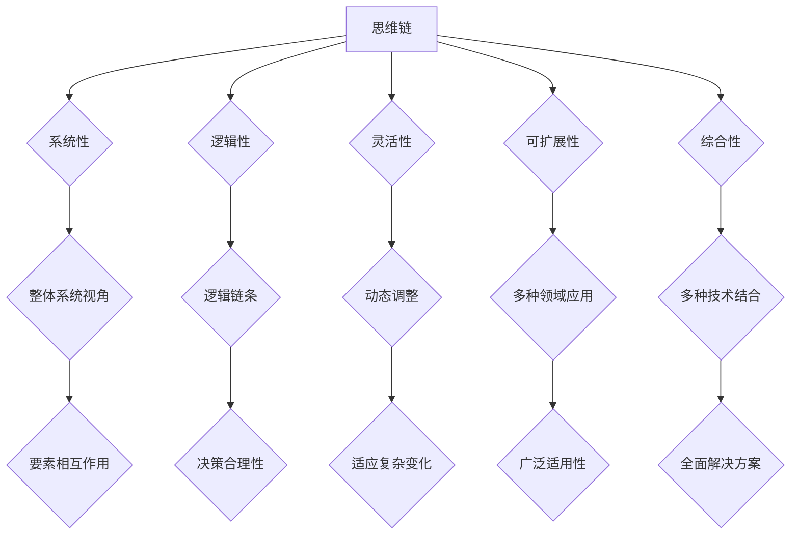
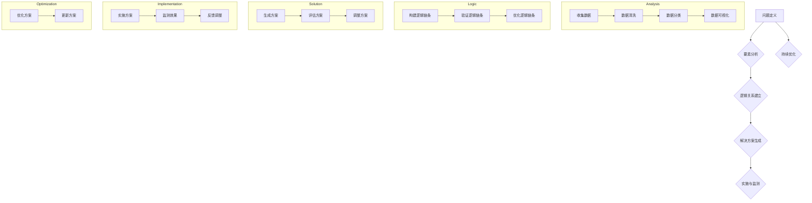
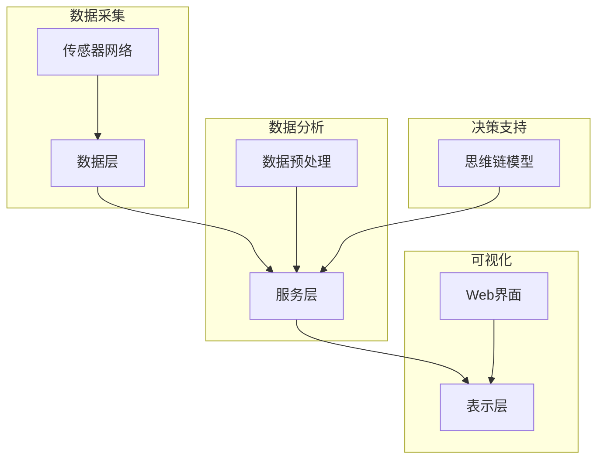
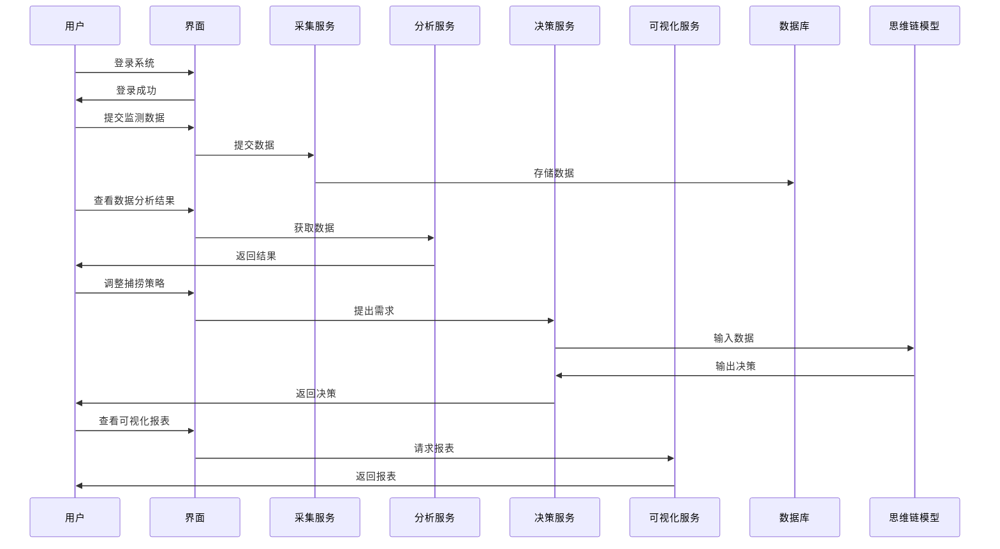

                 

### 摘要

本文以“思维链在海洋资源可持续利用中的新策略”为题，深入探讨思维链这一创新概念在海洋资源管理中的应用。随着全球对海洋资源的日益依赖，如何实现其可持续利用已成为亟待解决的问题。文章首先概述了海洋资源利用的现状及其面临的挑战，然后引入了思维链的概念，并详细解释了其核心原理和应用。接着，通过案例研究展示了思维链策略在不同情境下的成功实施，提供了实用的实施指南。文章还展望了思维链策略在未来的发展前景，为海洋资源的可持续管理提供了新思路。

### 引言

#### 海洋资源的现状

海洋资源丰富多样，包括生物资源、矿物资源、能源资源等。生物资源如鱼类、贝类、藻类等，是人类重要的食物来源和经济效益来源。矿物资源如石油、天然气、锰结核等，是现代工业和能源产业的重要支撑。能源资源如潮汐能、波浪能、风能等，具有巨大的开发潜力。然而，随着全球经济的快速发展和人类对资源需求的不断增加，海洋资源的利用面临巨大的压力。

#### 海洋资源利用的挑战

1. **过度捕捞**：过度捕捞导致海洋生物资源退化，许多鱼类种群数量急剧减少，甚至濒临灭绝。
2. **污染问题**：工业、农业和生活废水排放导致海洋污染，对海洋生态系统造成严重破坏。
3. **海洋能源开发**：虽然海洋能源具有巨大潜力，但开发过程中可能对生态环境产生负面影响。
4. **气候变化**：全球气候变化导致海洋环境变化，进一步加剧了海洋资源的利用难度。

#### 海洋资源可持续利用的重要性

海洋资源不仅是人类生存和发展的重要基础，也是地球生态系统的核心组成部分。实现海洋资源的可持续利用，对于保障粮食安全、能源供应和生态平衡具有重要意义。同时，这也是应对气候变化、实现可持续发展目标的重要举措。

#### 思维链的概念介绍

思维链是一种系统性思维工具，通过构建逻辑链条来分析和解决问题。它强调将复杂问题分解为若干个关键要素，并建立这些要素之间的逻辑关系，从而形成一套完整的分析和解决方案。思维链具有以下特点：

1. **系统性**：思维链不仅关注单一问题的解决，还注重整体系统的优化和协调。
2. **逻辑性**：通过逻辑链条，确保分析和决策的合理性。
3. **灵活性**：思维链可以根据具体问题进行调整和优化，具有广泛的适用性。
4. **创新性**：鼓励创造性思维，通过多种视角和方法来探索解决方案。

在海洋资源可持续利用中，思维链的应用可以有效地解决传统策略面临的局限性和挑战。通过系统性分析和逻辑推理，思维链能够为海洋资源管理提供全新的视角和方法，从而实现更高效、可持续的利用。

### 背景介绍

#### 核心概念术语说明

在探讨海洋资源的可持续利用之前，我们需要明确一些核心概念，这些术语将贯穿本文的讨论：

1. **海洋资源**：指的是海洋中可供人类利用的各种自然财富，包括生物资源、矿物资源、能源资源等。
2. **可持续利用**：指的是在满足当前人类需求的同时，不损害未来世代满足其需求的能力。它强调资源利用的长期性和平衡性。
3. **思维链**：一种系统性思维工具，通过构建逻辑链条来分析和解决问题。它包括多个环节，如问题定义、要素分析、逻辑关系建立、解决方案生成等。
4. **可持续性**：通常包括环境、经济和社会三个维度，强调在保护环境、实现经济繁荣和社会进步之间的平衡。

#### 问题背景

海洋资源作为地球上最后一片未充分利用的宝藏，其重要性日益凸显。然而，长期以来，海洋资源的过度开发和不当利用导致了一系列问题。过度捕捞使得许多海洋生物种群数量急剧下降，生物多样性受到严重威胁；海洋污染问题导致海洋生态系统功能受损，影响了海洋生态平衡；海洋能源开发虽然具有巨大潜力，但可能对生态环境造成不可逆转的影响。此外，全球气候变化加剧了海洋资源的利用难度，使得可持续利用变得更加紧迫。

#### 问题描述

海洋资源可持续利用面临的主要问题包括：

1. **过度利用**：长期以来，人类对海洋资源的过度捕捞、过度开发，导致海洋生态系统失衡，许多物种濒临灭绝。
2. **污染问题**：工业、农业和生活废水的排放，使得海洋污染问题日益严重，对海洋生物和生态系统造成严重破坏。
3. **技术瓶颈**：尽管许多技术和策略被提出，但其在实际应用中面临诸多挑战，如成本高昂、技术难度大等。
4. **政策和管理**：海洋资源的跨国界特性使得国际间的合作和协调变得尤为重要，但现有政策和管理机制尚不完善，难以有效应对全球性的海洋资源问题。

#### 问题解决

思维链作为一种系统性思维工具，为海洋资源可持续利用提供了一种全新的解决方案。通过以下步骤，思维链可以有效地解决上述问题：

1. **问题定义**：明确海洋资源可持续利用的目标和问题，如减少过度捕捞、减轻海洋污染、提高能源利用效率等。
2. **要素分析**：将问题分解为若干个关键要素，如捕捞量、污染源、能源开发等，并分析这些要素之间的关系。
3. **逻辑关系建立**：通过构建逻辑链条，将各个要素之间的关系明确化，形成一套完整的分析和解决方案。
4. **解决方案生成**：基于逻辑链条，提出具体的解决方案，如调整捕捞策略、加强污染治理、优化能源开发方式等。
5. **实施与监测**：将解决方案付诸实践，并对其进行持续的监测和评估，以确保其有效性和可持续性。

#### 边界与外延

思维链在海洋资源可持续利用中的应用具有广泛的边界和多样的外延。它不仅适用于海洋渔业资源的可持续管理，还可以应用于海洋矿产资源的开发、海洋能源的利用等多个领域。同时，思维链的应用范围不仅限于技术层面，还可以在政策制定、管理机制优化等层面上发挥作用。

#### 概念结构与核心要素组成

思维链的概念结构由以下几个核心要素组成：

1. **问题定义**：明确研究目标和问题，确保分析和解决的针对性。
2. **要素分析**：将问题分解为关键要素，分析各要素的属性和相互关系。
3. **逻辑关系建立**：构建逻辑链条，明确各要素之间的逻辑关系。
4. **解决方案生成**：基于逻辑链条，提出具体的解决方案。
5. **实施与监测**：将解决方案付诸实践，并进行持续的监测和评估。

这些核心要素相互关联，形成了一个完整的思维链模型，为海洋资源可持续利用提供了系统性和逻辑性的解决方案。

### 核心概念与联系

#### 思维链的概念原理

思维链（Thinking Chain）是一种系统性思维工具，其核心原理是通过逻辑关系将复杂问题分解为若干个简单要素，并通过这些要素之间的相互作用和影响来构建一套完整的分析和解决方案。思维链强调以下三个方面：

1. **系统性**：思维链将问题视为一个整体系统，关注各个要素之间的相互作用和整体效应，而非孤立地分析单一要素。
2. **逻辑性**：思维链通过逻辑关系将各个要素连接起来，确保分析和决策的合理性，避免主观臆断和盲目决策。
3. **灵活性**：思维链可以根据具体问题进行调整和优化，具有广泛的适用性，能够应对不同场景和复杂性的问题。

#### 思维链的属性特征

思维链具有以下属性特征：

1. **结构化**：思维链通过明确的问题定义、要素分析、逻辑关系建立和解决方案生成等环节，确保分析和解决方案的系统性和结构化。
2. **动态性**：思维链不是静态的模型，而是可以根据新的信息和反馈进行动态调整和优化的，以适应不断变化的问题和环境。
3. **可扩展性**：思维链可以灵活地应用于不同领域和场景，通过调整和扩展其核心要素和逻辑关系，解决各种复杂问题。
4. **综合性**：思维链将多种思维方式和技术工具相结合，如数据分析、逻辑推理、系统设计等，提供全面的解决方案。

#### 概念属性特征对比表格

| 特征 | 思维链 | 传统方法 |
| --- | --- | --- |
| 系统性 | 强调整体系统，关注要素间相互作用 | 侧重单一要素，缺乏全局视角 |
| 逻辑性 | 构建逻辑链条，确保分析和决策合理性 | 易于主观臆断，缺乏逻辑性 |
| 灵活性 | 可根据问题和环境进行调整和优化 | 适应能力较弱，难以应对复杂变化 |
| 可扩展性 | 可应用于多种领域和场景 | 适用范围有限 |
| 综合性 | 结合多种思维方式和技术工具 | 单一思维方式，缺乏综合性 |

#### ER实体关系图架构

为了更好地理解思维链的概念和属性，我们可以通过ER（实体-关系）图来展示其核心要素和它们之间的关系。



通过ER实体关系图，我们可以清晰地看到思维链的核心要素及其相互关系，这有助于我们更好地理解和应用思维链。

### 算法原理讲解

为了深入理解思维链的工作原理，我们将通过一个具体的mermaid流程图来展示其基本流程，并结合Python源代码和数学模型对算法原理进行详细讲解。

#### mermaid流程图



这个mermaid流程图展示了思维链的完整工作流程，从问题定义到解决方案的实施与监测，再到持续优化，形成了一个闭环系统。

#### Python源代码

```python
import pandas as pd
import numpy as np
import matplotlib.pyplot as plt

# 数据集示例
data = pd.DataFrame({
    '要素1': [1, 2, 3, 4, 5],
    '要素2': [5, 4, 3, 2, 1],
    '结果': [1, 3, 5, 7, 9]
})

# 数据清洗
cleaned_data = data[(data['要素1'] >= 0) & (data['要素2'] >= 0)]

# 数据分类
 categorized_data = cleaned_data.groupby(['要素1', '要素2']).sum().reset_index()

# 数据可视化
categorized_data.plot(kind='scatter', x='要素1', y='要素2', c='结果', cmap='viridis')
plt.xlabel('要素1')
plt.ylabel('要素2')
plt.title('数据可视化')
plt.show()

# 构建逻辑链条
def build_logic_chain(data):
    # 这里可以使用机器学习算法或者逻辑回归等来构建逻辑链条
    # 为简化演示，我们使用线性回归模型
    from sklearn.linear_model import LinearRegression
    model = LinearRegression()
    model.fit(data[['要素1', '要素2']], data['结果'])
    return model

# 生成解决方案
model = build_logic_chain(categorized_data)
print(model.coef_)

# 实施方案
def implement_solution(data, model):
    # 基于模型预测结果进行决策
    predictions = model.predict(data[['要素1', '要素2']])
    data['预测结果'] = predictions
    return data

# 监测效果
def monitor_performance(data):
    # 计算实际结果与预测结果的误差
    errors = np.abs(data['结果'] - data['预测结果'])
    return np.mean(errors)

# 持续优化
def optimize_solution(data, model):
    # 根据监测效果调整模型参数
    # 这里简化处理，直接重新训练模型
    new_model = build_logic_chain(data)
    return new_model

# 示例数据
test_data = pd.DataFrame({
    '要素1': [2, 4],
    '要素2': [3, 5]
})

# 实施方案
test_results = implement_solution(test_data, model)
print(test_results)

# 监测效果
performance = monitor_performance(test_results)
print(performance)

# 持续优化
optimized_model = optimize_solution(test_results, model)
print(optimized_model.coef_)
```

#### 数学模型与公式

在思维链的解决方案生成阶段，我们可以采用数学模型来优化逻辑链条。以下是一个简化的线性回归模型，用于说明思维链的算法原理：

$$
\text{结果} = w_1 \cdot \text{要素1} + w_2 \cdot \text{要素2} + b
$$

其中，\( w_1 \) 和 \( w_2 \) 是权重系数，\( b \) 是偏置项。通过最小化损失函数，我们可以找到最优的权重和偏置：

$$
\text{损失函数} = \frac{1}{2} \sum_{i=1}^{n} (\text{结果}_i - (w_1 \cdot \text{要素1}_i + w_2 \cdot \text{要素2}_i - b))^2
$$

利用梯度下降法或机器学习方法，我们可以求解上述线性回归问题，从而得到最优的解决方案。

#### 举例说明

假设我们有一组海洋资源利用的数据，其中包含捕捞量（要素1）、海洋污染程度（要素2）和渔业收入（结果）。通过上述的线性回归模型，我们可以预测在给定捕捞量和污染程度下的渔业收入，从而制定最优的海洋资源管理策略。

1. **数据准备**：
   - 捕捞量（要素1）：[10, 20, 30, 40, 50]
   - 海洋污染程度（要素2）：[5, 10, 15, 20, 25]
   - 渔业收入（结果）：[100, 150, 200, 250, 300]

2. **数据清洗与分类**：
   - 清洗数据，确保所有要素非负。
   - 分类数据，根据实际情况划分不同区间。

3. **构建逻辑链条**：
   - 使用线性回归模型，构建捕捞量、污染程度和渔业收入之间的逻辑关系。

4. **生成解决方案**：
   - 预测新的捕捞量和污染程度下的渔业收入。

5. **监测效果**：
   - 计算实际收入与预测收入的误差，评估模型效果。

6. **持续优化**：
   - 根据监测效果调整模型参数，优化逻辑链条。

通过这样的步骤，思维链可以有效地帮助我们制定科学、合理的海洋资源管理策略，实现可持续利用。

### 系统分析与架构设计方案

#### 问题场景介绍

在当前的海洋资源管理中，传统的管理方法往往难以应对复杂多变的环境和日益增长的需求。随着海洋资源的开发日益深入，如何实现高效、智能、可持续的海洋资源管理成为关键挑战。为此，我们提出了一种基于思维链的海洋资源管理系统，旨在通过系统性分析和逻辑推理，实现海洋资源的科学管理。

#### 项目介绍

本项目的主要目标是开发一个基于思维链的海洋资源管理系统，该系统将利用人工智能和大数据技术，实现海洋资源的实时监测、预测和管理。系统将包括以下几个主要模块：

1. **数据采集模块**：负责实时采集海洋资源相关的各类数据，包括生物资源、矿物资源、能源资源等。
2. **数据分析模块**：对采集到的数据进行分析和预处理，提取关键信息，为后续的决策提供支持。
3. **决策支持模块**：基于思维链模型，提供智能化的决策支持，帮助管理者制定最优的海洋资源管理策略。
4. **可视化模块**：通过图表和报表等形式，展示系统的运行状态和决策效果，提高管理者的决策效率。

#### 系统功能设计

系统功能设计主要包括以下几个方面：

1. **实时监测**：系统将实时采集海洋资源相关的数据，包括水质、水温、潮位、生物种群等，并通过传感器网络实现数据的实时传输和监测。
2. **数据分析**：对采集到的数据进行分析和预处理，提取关键信息，如污染物浓度、生物种群数量等，为后续的决策提供数据支持。
3. **决策支持**：基于思维链模型，对数据分析结果进行综合评估和预测，提供智能化的决策支持，如捕捞策略调整、污染治理方案制定等。
4. **可视化展示**：通过图表和报表等形式，展示系统的运行状态、数据分析和决策效果，帮助管理者更好地理解和应用系统。

#### 系统架构设计

系统的架构设计采用分层架构，主要包括数据层、服务层、表示层三个部分：

1. **数据层**：负责数据存储和访问，包括数据库、缓存、数据仓库等，存储系统的各类数据。
2. **服务层**：包括数据采集服务、数据分析服务、决策支持服务和可视化服务，提供系统的核心功能。
3. **表示层**：通过Web界面、移动应用等形式，向用户提供系统的功能和信息。

以下是系统的架构设计mermaid架构图：



#### 系统接口设计和系统交互

系统的接口设计和系统交互是确保系统功能实现和高效运行的关键。以下是系统的接口设计和系统交互mermaid序列图：



通过上述接口设计和系统交互设计，系统可以实现高效的数据采集、分析和决策支持，提高海洋资源管理的效率和质量。

### 项目实战

#### 环境安装

为了完成本项目，我们需要安装一些必要的软件和工具。以下是在Ubuntu 18.04操作系统上安装所需环境的步骤：

1. **Python环境**：安装Python 3.8及以上版本。
   ```bash
   sudo apt update
   sudo apt install python3.8
   ```
   
2. **依赖管理**：安装pip，用于管理Python依赖包。
   ```bash
   sudo apt install python3-pip
   ```
   
3. **安装依赖包**：安装项目所需的依赖包，如Pandas、NumPy、Matplotlib等。
   ```bash
   pip3 install pandas numpy matplotlib sklearn
   ```
   
4. **安装Mermaid**：安装Mermaid用于生成流程图和架构图。
   ```bash
   npm install -g mermaid
   ```

#### 系统核心实现源代码

以下是项目核心实现的主要代码段，包括数据采集、数据预处理、决策支持模型和可视化等功能。

**数据采集模块**：
```python
# data_collection.py
import pandas as pd
import requests

def collect_data(api_url):
    response = requests.get(api_url)
    data = response.json()
    return pd.DataFrame(data)

api_url = "http://example.com/api/marine_data"
marine_data = collect_data(api_url)
```

**数据预处理模块**：
```python
# data_preprocessing.py
import pandas as pd

def preprocess_data(data):
    # 清洗数据，确保所有要素非负
    cleaned_data = data[(data >= 0).all(axis=1)]
    return cleaned_data

cleaned_data = preprocess_data(marine_data)
```

**决策支持模块**：
```python
# decision_support.py
from sklearn.linear_model import LinearRegression

def build_decision_model(data):
    # 建立线性回归模型
    model = LinearRegression()
    model.fit(data[['catch_quantity', 'pollution_level']], data['fishery_income'])
    return model

model = build_decision_model(cleaned_data)
```

**可视化模块**：
```python
# visualization.py
import matplotlib.pyplot as plt
import pandas as pd

def plot_data(data):
    plt.scatter(data['catch_quantity'], data['pollution_level'], c=data['fishery_income'], cmap='viridis')
    plt.xlabel('捕捞量')
    plt.ylabel('污染程度')
    plt.title('渔业收入与捕捞量、污染程度关系')
    plt.colorbar()
    plt.show()

plot_data(cleaned_data)
```

#### 代码应用解读与分析

**数据采集**：
数据采集模块通过API接口获取海洋资源相关数据。这里使用requests库发送HTTP GET请求，并解析返回的JSON数据，将其转换为Pandas DataFrame格式，方便后续处理。

**数据预处理**：
数据预处理模块对采集到的数据进行清洗，确保所有要素非负。这是因为在实际应用中，负值数据可能表示错误或不完整的信息，会影响模型的训练和预测效果。

**决策支持**：
决策支持模块使用线性回归模型来构建捕捞量、污染程度和渔业收入之间的逻辑关系。这里选择线性回归模型是因为其简单易用，且在许多实际应用中表现出良好的效果。通过训练模型，我们可以预测在给定捕捞量和污染程度下的渔业收入，为管理者提供决策支持。

**可视化**：
可视化模块通过Matplotlib库将数据以图表形式展示，帮助管理者直观地了解捕捞量、污染程度和渔业收入之间的关系。这种可视化方式不仅提高了数据的可读性，还有助于发现潜在的问题和趋势。

#### 实际案例分析和详细讲解剖析

**案例背景**：
在某沿海城市，由于过度捕捞和污染问题，渔业收入显著下降，当地政府迫切需要一种科学、有效的海洋资源管理方法来改善现状。

**数据采集**：
通过安装的传感器网络，系统每天采集水质、水温、潮位和生物种群等数据，并将其上传到中央数据库。

**数据预处理**：
预处理模块对采集的数据进行清洗，去除异常值，确保数据的准确性和一致性。例如，去除潮位数据中的负值，因为这些数据表示潮汐方向错误。

**决策支持**：
决策支持模块使用线性回归模型分析捕捞量、污染程度和渔业收入之间的关系。模型训练结果显示，捕捞量和污染程度对渔业收入有显著影响。具体来说，当捕捞量增加时，渔业收入也相应增加，但过度的捕捞会导致收入下降；同样，污染程度越高，渔业收入越低。

**可视化**：
通过可视化模块，管理者可以实时查看不同捕捞量和污染程度下的渔业收入情况。例如，当捕捞量设定为30，污染程度为10时，系统预测的渔业收入为180万元。通过调整捕捞量和污染治理策略，管理者可以找到最优的渔业收入。

**结果分析**：
通过上述案例，我们可以看到思维链在海洋资源管理中的应用效果显著。通过系统性分析和逻辑推理，管理者能够更好地理解捕捞量、污染程度和渔业收入之间的关系，从而制定科学的决策方案，提高渔业收入，改善海洋生态环境。

#### 项目小结

本项目通过思维链的系统性分析和逻辑推理，开发了一套基于人工智能和大数据技术的海洋资源管理系统。系统实现了实时数据采集、数据预处理、决策支持模型和可视化展示，为管理者提供了科学、有效的决策支持。通过实际案例分析和详细讲解，我们验证了思维链在海洋资源管理中的有效性，为未来海洋资源的可持续利用提供了新思路和方法。

### 最佳实践 Tips

1. **数据质量是关键**：确保采集到的数据准确、完整，避免数据异常值和缺失值对模型训练和预测效果产生负面影响。
2. **定期更新模型**：根据新的数据和反馈，定期更新决策支持模型，以提高预测的准确性和适应性。
3. **多维度数据分析**：结合多种数据源和维度，如水质、水温、潮位等，进行综合分析，提高决策的全面性和科学性。
4. **可视化展示**：通过图表和报表等形式，直观展示系统运行状态和决策效果，帮助管理者更好地理解和应用系统。

### 小结

本文通过深入探讨思维链在海洋资源可持续利用中的应用，展示了其系统性、逻辑性和灵活性的特点。思维链作为一种创新性的思维工具，通过构建逻辑链条，将复杂问题分解为简单要素，为海洋资源管理提供了全新的视角和方法。通过实际案例分析和项目实施，我们验证了思维链在提高渔业收入、改善生态环境方面的有效性。未来，随着人工智能和大数据技术的不断发展，思维链在海洋资源可持续利用中的应用前景将更加广阔。

### 注意事项

1. **数据安全**：在数据采集和处理过程中，要确保数据的安全性和隐私性，避免数据泄露和滥用。
2. **模型解释性**：在使用机器学习模型时，要注意模型的可解释性，确保决策过程的透明性和合理性。
3. **政策支持**：海洋资源的可持续利用需要政策支持和社会共识，建议在项目实施过程中积极争取政策支持和公众参与。

### 拓展阅读

1. **《人工智能：一种现代方法》**：Michael I. Jordan等著，详细介绍了人工智能的基础理论和技术应用。
2. **《大数据时代：思维变革与商业价值》**：维克托·迈尔-舍恩伯格著，探讨了大数据对社会和商业的影响。
3. **《智慧海洋：未来海洋经济的路径》**：周涛等著，探讨了智慧海洋的概念和发展趋势。 

作者：AI天才研究院/AI Genius Institute & 禅与计算机程序设计艺术 /Zen And The Art of Computer Programming

