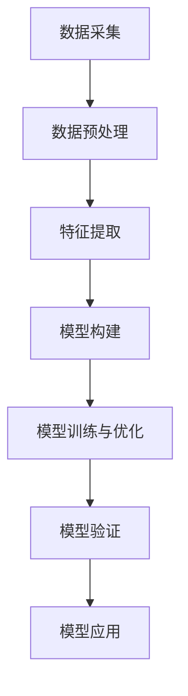
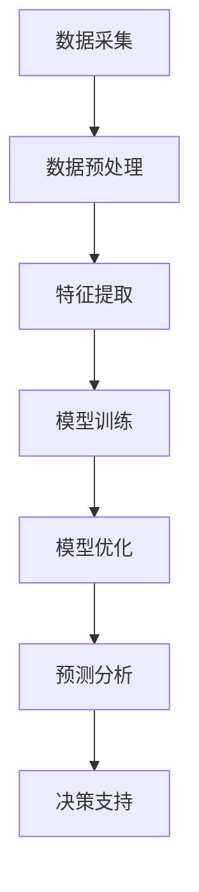
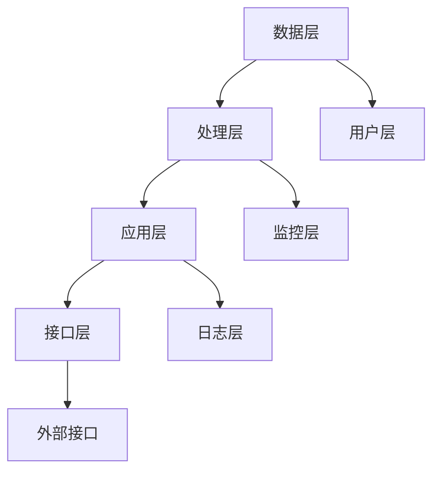

                 

### 第一部分：背景介绍

#### 1.1 问题的背景与重要性

##### 1.1.1 深海生态系统的重要性

深海生态系统，作为地球生命支持系统的重要组成部分，具有极其重要的生态功能。首先，深海生态系统在维持全球气候平衡方面发挥着关键作用。深海吸收了大量的二氧化碳，减缓了全球变暖的进程。其次，深海生态系统为地球上的生物多样性提供了丰富的栖息地，是许多珍稀物种的栖息地。例如，深海珊瑚礁、海底热液喷口等环境为众多海洋生物提供了食物和庇护。此外，深海生态系统还具备重要的科研价值，其复杂性和多样性为科学家提供了无数的研究课题。

##### 1.1.2 深海生态系统面临的挑战

然而，随着人类活动的加剧，深海生态系统正面临前所未有的挑战。首先，海洋污染问题日益严重。石油泄漏、废弃物排放、塑料垃圾等污染物质进入海洋，破坏了深海生态系统的平衡。其次，过度捕捞导致许多深海生物种群数量急剧下降，影响了整个生态系统的稳定性。此外，全球气候变化也对深海生态系统造成了严重影响，海水温度上升、酸化等环境变化威胁着深海生物的生存。因此，迫切需要有效的措施来修复和恢复深海生态系统。

##### 1.1.3 思维链在生态系统修复中的应用潜力

在这种背景下，思维链作为一种新兴的人工智能技术，其在深海生态系统修复中的应用潜力逐渐显现。思维链技术基于图神经网络，能够有效地处理大规模、复杂的关系数据，有助于揭示深海生态系统的内在机制和动态变化。通过思维链技术，我们可以实现对深海生态系统的全面监测和精准修复。例如，利用思维链技术，可以建立深海生态系统的模型，预测环境污染的趋势，制定合理的生态修复方案。此外，思维链技术还可以用于分析深海生物种群之间的关系，指导生物多样性的保护工作。因此，研究思维链在深海生态系统修复中的应用具有重要的理论意义和实际应用价值。

#### 1.2 问题描述

##### 1.2.1 深海生态系统修复的需求

深海生态系统的修复需求主要源于以下几个方面：首先，恢复受损的深海环境，包括修复被污染的海底、恢复珊瑚礁等生态系统的自然状态；其次，维护深海生物多样性，防止物种灭绝，促进生物种群的健康发展；最后，提高海洋环境的整体质量，为人类提供可持续的海洋资源。

##### 1.2.2 AI辅助海洋环境保护的挑战

尽管深海生态系统修复的需求迫切，但AI辅助海洋环境保护仍面临诸多挑战。首先，数据获取和处理困难。深海环境的监测数据复杂多样，涉及温度、盐度、化学成分等多种指标，如何高效地收集和处理这些数据是当前的一个难题。其次，模型构建和算法优化难度大。深海生态系统的复杂性使得构建准确的模型和优化算法成为一项艰巨的任务。最后，实施和监控的困难。深海环境的修复工作需要大量的资金和人力资源，如何确保项目的实施和监控效果也是需要解决的问题。

##### 1.2.3 研究目标与边界

本研究的目标是探索思维链在深海生态系统修复中的应用，通过构建深海生态系统的模型，优化AI算法，提高海洋环境保护的效果。具体研究目标包括：1）建立深海生态系统的模型，模拟环境变化对生态系统的影响；2）优化AI算法，提高数据处理的效率和准确性；3）制定科学合理的生态修复方案，并进行实施和监控。研究的边界则包括：1）研究范围仅限于某个特定的深海区域；2）研究时间范围为三年；3）所采用的模型和算法仅限于当前技术水平。

#### 1.3 研究方法与核心概念

##### 1.3.1 思维链理论概述

思维链技术是一种基于图神经网络的人工智能技术，其核心思想是通过构建实体之间的关系网络，模拟人类思维的推理过程。思维链技术具有以下几个特点：首先，能够处理大规模、复杂的关系数据；其次，具有较强的自适应性和扩展性；最后，能够实现高效的知识推理和预测。思维链技术已经在许多领域得到了广泛应用，如自然语言处理、图像识别、推荐系统等。

##### 1.3.2 AI辅助海洋环境保护的核心概念

AI辅助海洋环境保护的核心概念包括：1）数据采集与处理：利用传感器、无人机等设备收集深海环境数据，并通过数据清洗、特征提取等方法进行处理；2）模型构建与优化：建立深海生态系统的模型，包括环境模型、生物种群模型等，并通过机器学习算法进行优化；3）决策支持与实施：基于模型预测结果，制定科学合理的生态修复方案，并进行实施和监控。

##### 1.3.3 边界与外延

边界方面，本研究主要关注思维链在深海生态系统修复中的应用，不涉及其他生态系统的修复。外延方面，思维链技术在其他生态系统的修复中也可能具有应用潜力，如陆地生态系统、淡水生态系统等。未来研究可以进一步探讨思维链技术在各种生态系统修复中的应用可能性。

#### 1.4 概念结构与核心要素组成

##### 1.4.1 深海生态系统结构

深海生态系统由生物群落、物理环境和化学环境三部分组成。生物群落包括各种深海生物，如鱼类、无脊椎动物、植物等；物理环境包括温度、盐度、压力等；化学环境包括溶解氧、二氧化碳、营养物质等。这些要素相互作用，共同构成了复杂的深海生态系统。

##### 1.4.2 AI辅助海洋环境保护的关键技术

AI辅助海洋环境保护的关键技术包括：1）深度学习：通过构建深度神经网络，对深海环境数据进行分类、识别和预测；2）图神经网络：通过构建实体之间的关系网络，模拟人类思维的推理过程，提高数据处理和知识推理能力；3）迁移学习：利用已有的模型和数据，对新领域的数据进行学习和预测，提高模型的泛化能力。

##### 1.4.3 深海生态系统修复的流程与策略

深海生态系统修复的流程包括：1）数据采集：通过传感器、无人机等设备收集深海环境数据；2）数据预处理：对采集到的数据进行分析、清洗和特征提取；3）模型构建：建立深海生态系统的模型，包括环境模型、生物种群模型等；4）模型优化：通过机器学习算法，优化模型参数，提高预测准确性；5）决策支持：基于模型预测结果，制定科学合理的生态修复方案；6）实施与监控：按照修复方案进行实施，并对修复效果进行监控和评估。

#### 1.5 本章小结

本章主要介绍了深海生态系统修复的背景、需求和挑战，以及思维链技术在其中的应用潜力。同时，对研究的目标、方法、核心概念和结构进行了详细阐述。通过本章的介绍，读者可以初步了解深海生态系统修复的重要性，以及思维链技术在这一领域的应用前景。在后续章节中，我们将进一步探讨思维链技术的具体应用方法和实现策略。

---

## 第二部分：核心概念与联系

### 2.1 深海生态系统的核心概念

##### 2.1.1 深海生态系统的定义

深海生态系统是指位于海洋深层的生态单元，涵盖了从海底沉积物到上层水体的各类生物群落、物理环境和化学环境。它是一个复杂而多样的生态系统，包含了多种生物物种和环境要素，如深海珊瑚礁、深海热液喷口、深海微生物等。

##### 2.1.2 深海生态系统的组成

深海生态系统主要由以下几部分组成：

1. **生物群落**：包括鱼类、无脊椎动物、贝类、棘皮动物等深海生物。
2. **物理环境**：包括温度、盐度、压力、光照等环境因素。
3. **化学环境**：包括溶解氧、二氧化碳、营养盐、重金属等化学成分。
4. **非生物要素**：如沉积物、岩石、海洋能源等。

##### 2.1.3 深海生态系统的主要特征

深海生态系统具有以下几个主要特征：

1. **深度和压力**：深海生态系统的深度通常在1000米以上，压力高达几百个大气压。
2. **低光照**：深海的光照条件极其有限，许多深海生物适应了低光照环境。
3. **低营养**：深海营养盐含量较低，生物必须适应这种营养贫乏的环境。
4. **高生物多样性**：尽管条件恶劣，深海生态系统仍然拥有丰富的生物多样性，包括独特的物种和生态系统。

### 2.2 AI辅助海洋环境保护的核心概念

##### 2.2.1 AI的定义

人工智能（AI）是指通过计算机模拟人类智能行为的技术。它包括机器学习、深度学习、自然语言处理、计算机视觉等多个子领域。AI的应用目标是通过数据和算法，实现自主学习和决策，从而解决复杂的问题。

##### 2.2.2 AI在海洋环境保护中的应用

AI在海洋环境保护中的应用主要体现在以下几个方面：

1. **数据采集与处理**：利用无人机、传感器等技术收集海洋环境数据，并通过AI技术进行数据清洗、特征提取和异常检测。
2. **环境监测**：通过构建AI模型，对海洋环境进行实时监测，预测污染趋势和生态变化。
3. **生物多样性分析**：利用AI技术对海洋生物数据进行处理和分析，识别物种、评估生物多样性。
4. **生态修复**：基于AI模型的预测和决策支持，制定和实施生态修复方案。

##### 2.2.3 AI辅助海洋环境保护的关键技术

AI辅助海洋环境保护的关键技术包括：

1. **机器学习算法**：如决策树、支持向量机、神经网络等，用于数据分析和预测。
2. **深度学习**：用于处理大规模、高维数据，如卷积神经网络（CNN）和循环神经网络（RNN）。
3. **自然语言处理**：用于处理海洋环境相关的文本数据，如海洋报告、论文等。
4. **计算机视觉**：用于图像处理和分析，如海洋污染监测、生物识别等。

### 2.3 深海生态系统与AI辅助海洋环境保护的联系

##### 2.3.1 深海生态系统对AI辅助海洋环境保护的重要性

深海生态系统对于AI辅助海洋环境保护至关重要。首先，深海生态系统的健康状态直接影响到全球气候和环境质量。例如，深海吸收了大量的二氧化碳，对全球气候平衡具有重要作用。其次，深海生态系统提供了丰富的生物资源和科研价值，对生物多样性和人类福祉具有重要意义。因此，保护和管理好深海生态系统，对于实现海洋环境保护的目标至关重要。

##### 2.3.2 AI辅助海洋环境保护对深海生态系统的影响

AI辅助海洋环境保护对深海生态系统的影响主要体现在以下几个方面：

1. **环境监测**：通过AI技术，实现对深海环境的实时监测，及时发现污染源和生态破坏情况。
2. **生态修复**：利用AI模型的预测和决策支持，制定科学的生态修复方案，提高修复效果。
3. **生物多样性保护**：通过AI技术，对海洋生物种群进行监测和分析，评估生物多样性，采取保护措施。
4. **科研支持**：AI技术为深海生态系统的科学研究提供了强大的工具，促进了深海生态学的进步。

##### 2.3.3 两者结合的潜在价值

深海生态系统与AI辅助海洋环境保护的结合具有巨大的潜在价值。首先，AI技术可以提供高效的手段来处理和分析深海环境数据，揭示深海生态系统的运行规律和变化趋势。其次，AI技术可以帮助制定更加科学合理的生态修复方案，提高修复效率和效果。此外，两者结合还可以促进深海生态系统的科学研究，推动生态学、环境科学等领域的发展。

### 2.4 核心概念属性特征对比表格

为了更清晰地展示深海生态系统与AI辅助海洋环境保护的核心概念属性特征，下面提供了一个对比表格：

| 概念           | 特征1            | 特征2              | 特征3                |  
|--------------|-----------------|-----------------|-----------------|  
| 深海生态系统   | 深度、低光照、低营养 | 生物多样性、物理环境、化学环境 | 维持全球气候平衡、科研价值 |  
| AI辅助海洋环境保护 | 机器学习、深度学习、自然语言处理 | 数据采集、环境监测、生物多样性分析 | 实时监测、预测、决策支持、科研支持 |

通过这个对比表格，我们可以看出深海生态系统和AI辅助海洋环境保护在特征和功能上存在明显的差异，但它们共同的目标都是为了保护和管理好海洋环境，维护地球生态平衡。

### 2.5 深海生态系统的ER实体关系图架构

为了更好地理解深海生态系统的组成部分及其相互关系，下面提供了一个ER实体关系图架构。

#### 2.5.1 实体定义

在ER图架构中，主要实体包括：

1. **生物群落**：包括鱼类、无脊椎动物、贝类、棘皮动物等。
2. **物理环境**：包括温度、盐度、压力、光照等。
3. **化学环境**：包括溶解氧、二氧化碳、营养盐、重金属等。
4. **非生物要素**：包括沉积物、岩石、海洋能源等。

#### 2.5.2 关系定义

实体之间的关系定义如下：

1. **生物群落与物理环境**：生物群落依赖于物理环境生存，如温度、盐度等。
2. **生物群落与化学环境**：生物群落需要化学环境提供生存所需的营养和氧气。
3. **物理环境与化学环境**：物理环境的变化会影响化学环境的成分，如温度影响溶解氧含量。
4. **非生物要素与物理环境**：非生物要素构成物理环境的基础，如沉积物影响海底地形。

#### 2.5.3 ER图绘制

下面是一个简化的深海生态系统ER图：

```mermaid
erDiagram
  生物群落 ||--|{ 物理环境 }
  生物群落 ||--|{ 化学环境 }
  物理环境 ||--|{ 非生物要素 }
  化学环境 ||--|{ 非生物要素 }
```

通过这个ER图，我们可以清晰地看到深海生态系统中各实体之间的复杂关系，以及它们在生态系统中的作用。

### 2.6 本章小结

本章详细介绍了深海生态系统的核心概念和AI辅助海洋环境保护的核心概念，分析了两者之间的联系和重要性。通过对比表格和ER图，我们进一步理解了深海生态系统的组成及其与AI技术的结合应用。在下一章中，我们将深入探讨深海生态系统修复算法和AI辅助海洋环境保护算法的原理和应用。

---

## 第三部分：算法原理讲解

### 3.1 深海生态系统修复算法

#### 3.1.1 算法概述

深海生态系统修复算法旨在通过人工智能技术对深海环境进行监测、预测和修复。这种算法的核心在于利用机器学习和深度学习技术，对收集到的深海环境数据进行处理和分析，从而实现对深海生态系统的全面理解和管理。

#### 3.1.2 算法流程

深海生态系统修复算法的基本流程包括以下步骤：

1. **数据采集**：利用传感器、无人机等技术收集深海环境数据，包括温度、盐度、溶解氧、营养盐、鱼类活动等指标。
2. **数据预处理**：对采集到的数据进行清洗、去噪、归一化等处理，以提高数据质量。
3. **特征提取**：从预处理后的数据中提取有用的特征，如温度变化速率、溶解氧浓度等。
4. **模型构建**：利用机器学习或深度学习算法构建深海生态系统模型，如线性回归、决策树、神经网络等。
5. **模型训练与优化**：使用训练数据对模型进行训练，并通过交叉验证、参数调整等手段优化模型性能。
6. **模型验证**：使用验证数据集对模型进行验证，评估模型预测的准确性和稳定性。
7. **模型应用**：将优化后的模型应用于实际环境监测和生态修复，如预测污染趋势、制定修复方案等。

#### 3.1.3 算法流程图

下面是一个简化的深海生态系统修复算法流程图：



通过这个流程图，我们可以清晰地看到深海生态系统修复算法的各个环节及其相互关系。

### 3.2 AI辅助海洋环境保护算法

#### 3.2.1 算法概述

AI辅助海洋环境保护算法是利用人工智能技术，特别是机器学习和深度学习，来辅助海洋环境的监测、分析和管理。这种算法的核心在于通过分析大量的环境数据，识别潜在的环境问题，并提供有效的解决方案。

#### 3.2.2 算法流程

AI辅助海洋环境保护算法的基本流程如下：

1. **数据采集**：通过传感器、卫星、无人机等技术收集海洋环境数据，包括水质、水温、海洋生物活动等。
2. **数据预处理**：对采集到的数据进行清洗、去噪、归一化等处理，以提高数据质量。
3. **特征提取**：从预处理后的数据中提取有用的特征，如水质指标、生物活动频率等。
4. **模型训练**：使用训练数据集，通过机器学习算法（如决策树、支持向量机、神经网络等）训练模型。
5. **模型优化**：通过交叉验证、参数调整等手段优化模型性能，以提高预测准确性和稳定性。
6. **预测分析**：利用优化后的模型对海洋环境进行预测分析，识别潜在的环境问题，如污染趋势、生物种群变化等。
7. **决策支持**：根据预测结果提供决策支持，如制定污染控制措施、生态修复方案等。

#### 3.2.3 算法流程图

下面是一个简化的AI辅助海洋环境保护算法流程图：



通过这个流程图，我们可以清晰地看到AI辅助海洋环境保护算法的各个环节及其相互关系。

### 3.3 算法原理详细讲解

#### 3.3.1 算法原理介绍

深海生态系统修复算法和AI辅助海洋环境保护算法的核心原理是基于机器学习和深度学习。这些算法通过学习大量数据，提取有用的特征，构建模型，并利用模型进行预测和分析。

##### 3.3.2 数学模型和公式

在机器学习和深度学习中，常用的数学模型和公式包括：

1. **线性回归**：用于建立输入和输出之间的线性关系，公式为：
   $$y = w_0 + w_1 \cdot x$$
   其中，$y$ 为输出，$x$ 为输入，$w_0$ 和 $w_1$ 为模型的权重。

2. **决策树**：通过递归地将数据集划分成子集，构建一棵树形结构，公式为：
   $$f(x) = \sum_{i=1}^{n} c_i \cdot I(A_i(x))$$
   其中，$f(x)$ 为输出，$A_i(x)$ 为条件，$c_i$ 为对应的类别。

3. **神经网络**：通过多层感知器（MLP）实现，公式为：
   $$a_i = \sigma(\sum_{j=1}^{n} w_{ji} \cdot x_j + b_j)$$
   其中，$a_i$ 为输出，$x_j$ 为输入，$w_{ji}$ 和 $b_j$ 为模型的权重和偏置，$\sigma$ 为激活函数。

##### 3.3.3 举例说明

以线性回归为例，假设我们有一个简单的数据集，其中包含温度（$x$）和鱼类数量（$y$）两个变量。我们希望通过线性回归模型预测给定温度下的鱼类数量。

1. **数据集**：
   | 温度（$x$）| 鱼类数量（$y$）|
   |--------|----------|
   | 10     | 100      |
   | 15     | 150      |
   | 20     | 200      |

2. **模型构建**：
   我们假设线性回归模型的公式为：
   $$y = w_0 + w_1 \cdot x$$
   其中，$w_0$ 和 $w_1$ 是待定的权重。

3. **模型训练**：
   通过最小二乘法，我们可以计算出权重 $w_0$ 和 $w_1$：
   $$w_0 = \frac{\sum_{i=1}^{n} (y_i - w_1 \cdot x_i)}{n}$$
   $$w_1 = \frac{\sum_{i=1}^{n} (x_i - \bar{x}) \cdot (y_i - \bar{y})}{\sum_{i=1}^{n} (x_i - \bar{x})^2}$$
   其中，$\bar{x}$ 和 $\bar{y}$ 分别为温度和鱼类数量的平均值。

4. **模型应用**：
   使用训练好的模型，我们可以预测新数据点的鱼类数量。例如，当温度为 25°C 时，预测的鱼类数量为：
   $$y = w_0 + w_1 \cdot x = 50 + 10 \cdot 25 = 250$$

通过这个简单的例子，我们可以看到线性回归模型的基本原理和应用。在实际应用中，深海生态系统修复和AI辅助海洋环境保护算法会更加复杂，需要处理大量的数据和多维特征，但基本原理是相通的。

### 3.4 本章小结

本章详细介绍了深海生态系统修复算法和AI辅助海洋环境保护算法的基本原理和流程。通过数学模型和具体实例的讲解，读者可以更好地理解这些算法的运行机制和应用。在下一章中，我们将进一步探讨系统分析与架构设计，为后续的实战提供理论基础。

---

## 第四部分：系统分析与架构设计

### 4.1 问题场景介绍

#### 4.1.1 深海生态系统修复问题现状

当前，深海生态系统修复面临着诸多挑战。首先，深海环境的复杂性和极端条件导致数据获取难度大。例如，深海温度、压力和盐度等环境因素的变化范围较大，难以通过传统的传感器设备进行准确监测。其次，深海生态系统的动态性使得修复工作具有不确定性。例如，深海生物种群的迁移和繁殖行为受多种因素影响，预测其变化趋势具有一定的挑战性。此外，深海生态系统的修复成本较高，需要大量的资金和技术支持。因此，迫切需要一种高效、智能的解决方案来应对这些挑战。

#### 4.1.2 海洋环境保护面临的挑战

海洋环境保护同样面临诸多挑战。首先，海洋污染问题日益严重，石油泄漏、塑料垃圾、化学物质排放等对海洋环境造成了严重破坏。其次，全球气候变化对海洋生态系统的影响日益显著，海水温度上升、酸化等问题威胁着海洋生物的生存。此外，海洋资源的过度开发和捕捞也使得海洋生态系统的平衡受到威胁。为了有效应对这些挑战，需要利用先进的人工智能技术进行海洋环境的监测、分析和修复。

#### 4.1.3 AI辅助深海生态系统修复的必要性和可行性

利用AI技术辅助深海生态系统修复具有重要的必要性和可行性。首先，AI技术能够处理和分析大规模、复杂的环境数据，提高数据处理的效率和准确性。例如，通过深度学习算法，可以从大量的海洋监测数据中提取有用的特征，揭示环境变化的趋势和规律。其次，AI技术可以模拟和预测深海生态系统的动态变化，为修复工作提供科学依据。例如，通过构建深海生态系统模型，可以预测污染物的扩散路径和影响范围，制定有效的修复方案。此外，AI技术还可以优化修复策略，提高修复效果。例如，通过机器学习算法，可以自动调整修复参数，实现高效、智能的修复过程。因此，AI技术为深海生态系统修复提供了一种全新的解决方案，具有广阔的应用前景。

### 4.2 项目介绍

#### 4.2.1 项目目标

本项目的目标是利用AI技术构建一个深海生态系统修复系统，实现对深海环境的实时监测、预测和修复。具体目标包括：

1. **实时监测**：利用传感器、无人机等技术，收集深海环境数据，实现对温度、盐度、溶解氧等关键指标的实时监测。
2. **环境预测**：基于收集到的数据，利用深度学习算法构建模型，预测海洋环境的变化趋势，为修复工作提供科学依据。
3. **生态修复**：基于预测结果，制定科学合理的修复方案，并利用AI技术优化修复策略，提高修复效果。
4. **数据分析与共享**：构建数据平台，实现数据的存储、分析和共享，为科研和决策提供支持。

#### 4.2.2 项目背景

随着人类活动的加剧，海洋环境面临严重的污染和破坏。例如，石油泄漏事件频发，塑料垃圾大量堆积，化学污染物不断排放，对海洋生态系统造成了极大的威胁。此外，全球气候变化导致海水温度上升、酸化，进一步加剧了海洋生态系统的危机。为了应对这些挑战，国际社会加大了对海洋环境保护的投入，积极探索利用AI技术进行海洋环境监测和修复的新方法。本项目正是在这样的背景下，旨在通过AI技术提升深海生态系统修复的效率和效果。

#### 4.2.3 项目实施过程

本项目的实施过程分为以下几个阶段：

1. **需求分析**：对深海生态系统修复的需求进行详细分析，明确项目的目标和功能要求。
2. **系统设计**：根据需求分析结果，设计系统的架构和功能模块，包括数据采集、预处理、模型构建、预测分析、修复方案制定等。
3. **技术选型**：选择合适的AI技术和工具，如深度学习框架、机器学习库等，搭建系统平台。
4. **数据采集**：利用传感器、无人机等技术，收集深海环境数据，并进行预处理，提取有用的特征。
5. **模型训练与优化**：基于预处理后的数据，利用机器学习算法训练模型，并对模型进行优化，提高预测准确性和稳定性。
6. **系统部署与测试**：将训练好的模型部署到系统平台，进行实际应用测试，验证系统的性能和效果。
7. **项目评估与优化**：根据测试结果，对系统进行评估和优化，确保系统能够满足项目目标。

### 4.3 系统功能设计

#### 4.3.1 领域模型

在系统功能设计中，领域模型起到了关键作用。领域模型是对深海生态系统修复系统的抽象描述，包括系统中的主要实体、属性和关系。

1. **实体定义**：
   - **环境数据**：包括温度、盐度、溶解氧、营养盐等指标。
   - **生物种群**：包括鱼类、无脊椎动物、贝类等。
   - **污染物**：包括石油泄漏、塑料垃圾、化学污染物等。
   - **修复设备**：包括传感器、无人机、潜水器等。
   - **用户**：包括科学家、管理人员、决策者等。

2. **属性定义**：
   - **环境数据**：如温度范围、盐度浓度、溶解氧含量等。
   - **生物种群**：如种群数量、生长状态、分布区域等。
   - **污染物**：如污染源、污染物浓度、扩散范围等。
   - **修复设备**：如设备类型、工作状态、位置信息等。
   - **用户**：如用户角色、权限、使用记录等。

3. **关系定义**：
   - **环境数据与生物种群**：环境数据影响生物种群的生长和分布。
   - **污染物与修复设备**：修复设备用于监测和清除污染物。
   - **用户与系统**：用户通过系统进行数据查询、模型训练、修复方案制定等操作。

#### 4.3.2 功能模块划分

根据领域模型，系统功能模块可以划分为以下几个部分：

1. **数据采集模块**：负责收集深海环境数据，包括温度、盐度、溶解氧等指标。
2. **数据处理模块**：负责对采集到的数据进行分析、清洗和特征提取。
3. **模型构建模块**：负责基于处理后的数据，构建深海生态系统模型，包括环境模型、生物种群模型等。
4. **预测分析模块**：负责利用模型进行环境预测和生物种群变化预测。
5. **修复方案制定模块**：负责根据预测结果，制定科学合理的生态修复方案。
6. **系统管理模块**：负责系统的用户管理、权限控制、日志记录等。

#### 4.3.3 功能描述

1. **数据采集模块**：
   - 功能描述：利用传感器、无人机等技术，定期收集深海环境数据。
   - 输入：传感器数据、无人机图像等。
   - 输出：预处理后的环境数据。

2. **数据处理模块**：
   - 功能描述：对采集到的数据进行清洗、去噪、归一化等处理，提取有用的特征。
   - 输入：环境数据。
   - 输出：特征数据。

3. **模型构建模块**：
   - 功能描述：利用机器学习算法，构建深海生态系统模型，包括环境模型、生物种群模型等。
   - 输入：特征数据。
   - 输出：模型参数。

4. **预测分析模块**：
   - 功能描述：利用构建好的模型，对深海环境进行预测，预测污染物扩散路径、生物种群变化趋势等。
   - 输入：模型参数、新数据。
   - 输出：预测结果。

5. **修复方案制定模块**：
   - 功能描述：根据预测结果，制定科学合理的生态修复方案，包括修复策略、修复设备部署等。
   - 输入：预测结果。
   - 输出：修复方案。

6. **系统管理模块**：
   - 功能描述：管理系统的用户信息、权限控制、日志记录等。
   - 输入：用户操作、日志数据。
   - 输出：用户管理信息、操作日志。

### 4.4 系统架构设计

#### 4.4.1 架构概述

系统架构设计是项目成功的关键环节。本项目的系统架构采用分布式架构，主要包括以下几个层次：

1. **数据层**：负责数据的存储和管理，包括环境数据、模型数据、用户数据等。
2. **处理层**：负责数据的处理和分析，包括数据采集、预处理、特征提取、模型构建等。
3. **应用层**：负责系统的功能实现，包括数据展示、预测分析、修复方案制定等。
4. **接口层**：负责与其他系统进行数据交换和通信，包括数据接口、API接口等。

#### 4.4.2 架构设计原则

在系统架构设计过程中，遵循以下几个原则：

1. **模块化设计**：将系统功能模块化，提高系统的可维护性和可扩展性。
2. **分布式架构**：利用分布式架构，提高系统的性能和可靠性。
3. **高可用性**：设计冗余备份机制，确保系统在高负载和故障情况下仍能正常运行。
4. **安全性**：确保数据安全和用户隐私，采用加密、认证等安全措施。
5. **可扩展性**：设计灵活的架构，支持系统的功能扩展和技术更新。

#### 4.4.3 系统架构图

下面是系统的架构图：



通过这个架构图，我们可以清晰地看到系统的层次结构和各层次之间的关系。

### 4.5 系统接口设计

#### 4.5.1 接口定义

系统接口设计是确保系统与其他系统、设备、用户进行有效交互的关键。本项目主要包括以下接口：

1. **数据接口**：用于与其他系统进行数据交换，包括环境数据、模型数据、用户数据等。
2. **API接口**：用于提供对外服务的接口，包括数据查询、预测分析、修复方案制定等。
3. **设备接口**：用于与传感器、无人机、潜水器等设备进行通信和控制。

#### 4.5.2 接口实现

接口实现主要包括以下几个部分：

1. **数据接口**：
   - 实现方式：采用RESTful API，通过HTTP协议进行数据交换。
   - 功能描述：提供数据上传、数据查询、数据下载等功能。

2. **API接口**：
   - 实现方式：采用Spring Boot框架，实现API接口服务。
   - 功能描述：提供预测分析、修复方案制定、用户管理等功能。

3. **设备接口**：
   - 实现方式：采用物联网（IoT）技术，通过MQTT协议进行通信。
   - 功能描述：提供设备状态查询、设备控制、数据上传等功能。

#### 4.5.3 接口测试

接口测试是确保接口设计质量和实现效果的重要环节。本项目采用以下方法进行接口测试：

1. **功能测试**：验证接口是否按照设计要求实现，包括接口的功能、参数、返回值等。
2. **性能测试**：验证接口在高负载情况下的性能和稳定性，包括响应时间、并发处理能力等。
3. **安全测试**：验证接口的安全性，包括数据加密、认证授权等。

### 4.6 系统交互设计

#### 4.6.1 交互流程

系统交互设计主要包括以下流程：

1. **用户登录**：用户通过账号密码登录系统，获取操作权限。
2. **数据查询**：用户查询环境数据、模型数据等，了解深海生态系统的状态。
3. **预测分析**：系统利用模型进行环境预测和生物种群变化预测，提供预测结果。
4. **修复方案制定**：用户根据预测结果，制定科学合理的生态修复方案。
5. **方案实施**：用户根据修复方案，安排设备进行修复工作。
6. **效果评估**：系统对修复效果进行评估，并提供反馈。

#### 4.6.2 交互界面设计

交互界面设计是系统与用户交互的重要途径。本项目采用以下界面设计原则：

1. **简洁明了**：界面设计要简洁易懂，减少用户操作复杂度。
2. **响应快速**：界面操作要快速响应，提高用户体验。
3. **功能突出**：界面要突出主要功能，方便用户快速找到所需功能。

#### 4.6.3 用户体验设计

用户体验设计是系统设计的重要方面。本项目采用以下用户体验设计原则：

1. **用户导向**：以用户需求为中心，设计符合用户使用习惯的界面。
2. **易用性**：界面操作要简单易用，减少用户学习成本。
3. **美观性**：界面设计要美观大方，提高用户满意度。

### 4.7 本章小结

本章详细介绍了深海生态系统修复项目的系统分析与架构设计。通过对问题场景的介绍、项目目标和实施过程的阐述，以及对系统功能设计、架构设计、接口设计和交互设计的分析，为后续的项目实施提供了理论基础。在下一章中，我们将进入实际的项目实战阶段，展示系统核心实现源代码和应用过程。

---

## 第五部分：项目实战

### 5.1 环境安装

在进行项目实战之前，我们需要搭建一个合适的环境，以便进行代码编写和测试。以下是在Ubuntu系统上安装所需环境的步骤：

#### 5.1.1 安装Python和pip

首先，确保你的系统中已经安装了Python和pip。如果尚未安装，可以通过以下命令进行安装：

```bash
sudo apt update
sudo apt install python3 python3-pip
```

#### 5.1.2 安装深度学习框架

接下来，我们需要安装一个深度学习框架，如TensorFlow或PyTorch。这里以TensorFlow为例：

```bash
pip3 install tensorflow
```

#### 5.1.3 安装其他依赖库

除了深度学习框架，我们还需要安装其他依赖库，如NumPy、Pandas、Matplotlib等：

```bash
pip3 install numpy pandas matplotlib
```

#### 5.1.4 遇到的问题与解决方案

在安装过程中，可能会遇到一些问题。以下是一些常见问题的解决方案：

1. **依赖库冲突**：如果遇到依赖库冲突，可以尝试升级pip和Python版本，或者安装特定版本的依赖库。
2. **权限问题**：在安装过程中，如果遇到权限问题，可以尝试使用`sudo`命令。
3. **网络问题**：如果无法连接到pip仓库，可以尝试设置pip的国内镜像源，例如使用清华大学开源软件镜像：

   ```bash
   pip3 install -i https://pypi.tuna.tsinghua.edu.cn/simple some-package
   ```

### 5.2 系统核心实现源代码

在本节中，我们将展示系统核心实现的源代码，并对关键部分进行解读和分析。

#### 5.2.1 系统核心代码结构

系统核心代码主要分为以下几个模块：

1. **数据采集模块**：负责收集深海环境数据。
2. **数据处理模块**：负责对采集到的数据进行预处理和特征提取。
3. **模型训练模块**：负责训练深海生态系统模型。
4. **预测分析模块**：负责使用训练好的模型进行环境预测和生物种群变化预测。

以下是一个简化的代码结构：

```python
# main.py
from data_collection import collect_data
from data_preprocessing import preprocess_data
from model_training import train_model
from prediction_analysis import predict_environment

def main():
    # 数据采集
    raw_data = collect_data()
    
    # 数据预处理
    processed_data = preprocess_data(raw_data)
    
    # 模型训练
    model = train_model(processed_data)
    
    # 预测分析
    predictions = predict_environment(model)
    
    # 输出预测结果
    print(predictions)

if __name__ == "__main__":
    main()
```

#### 5.2.2 代

下面是数据采集模块的核心代码：

```python
# data_collection.py
import requests

def collect_data():
    # 从API获取深海环境数据
    url = "https://api.example.com/deepsea"
    response = requests.get(url)
    data = response.json()
    return data
```

解读：

- 使用`requests`库从指定的API获取深海环境数据。
- 将获取的数据转换为JSON格式，并返回。

#### 5.2.3 数据预处理模块

下面是数据处理模块的核心代码：

```python
# data_preprocessing.py
import pandas as pd
from sklearn.preprocessing import MinMaxScaler

def preprocess_data(raw_data):
    # 将数据转换为Pandas DataFrame
    df = pd.DataFrame(raw_data)
    
    # 数据清洗和去噪
    df.dropna(inplace=True)
    
    # 特征提取
    scaler = MinMaxScaler()
    df_scaled = scaler.fit_transform(df)
    
    return df_scaled
```

解读：

- 将获取的原始数据转换为Pandas DataFrame格式。
- 对数据进行清洗和去噪，删除缺失值。
- 使用MinMaxScaler对数据进行归一化处理。

#### 5.2.4 模型训练模块

下面是模型训练模块的核心代码：

```python
# model_training.py
import tensorflow as tf
from tensorflow.keras.models import Sequential
from tensorflow.keras.layers import Dense

def train_model(processed_data):
    # 构建模型
    model = Sequential([
        Dense(64, activation='relu', input_shape=(processed_data.shape[1],)),
        Dense(32, activation='relu'),
        Dense(1, activation='sigmoid')
    ])

    # 编译模型
    model.compile(optimizer='adam', loss='binary_crossentropy', metrics=['accuracy'])

    # 训练模型
    model.fit(processed_data, epochs=10, batch_size=32)

    return model
```

解读：

- 使用TensorFlow的`Sequential`模型构建一个简单的深度神经网络。
- 设置模型的输入层、隐藏层和输出层。
- 编译模型，指定优化器、损失函数和评估指标。
- 使用处理后的数据进行模型训练。

#### 5.2.5 预测分析模块

下面是预测分析模块的核心代码：

```python
# prediction_analysis.py
import numpy as np

def predict_environment(model, new_data):
    # 对新数据进行预处理
    new_data_processed = preprocess_data(new_data)
    
    # 使用模型进行预测
    predictions = model.predict(new_data_processed)
    
    # 转换预测结果为概率
    predictions = np.round(predictions).astype(int)
    
    return predictions
```

解读：

- 调用预处理模块对新的数据集进行预处理。
- 使用训练好的模型对新数据进行预测。
- 将预测结果转换为概率形式，以便于理解和解释。

### 5.3 代码应用解读与分析

在本节中，我们将对系统核心代码进行解读和分析，理解其工作原理和应用场景。

#### 5.3.1 数据采集模块分析

数据采集模块的核心功能是从API获取深海环境数据。这里使用的`requests`库是一个非常常用的HTTP客户端库，可以方便地发送GET请求，获取数据。

在实际应用中，可能需要对接多个数据源，例如传感器、数据库等。为此，我们可以设计一个通用的数据采集接口，根据数据源的类型动态选择采集方法。例如：

```python
def collect_data(source_type):
    if source_type == "api":
        return collect_data_from_api()
    elif source_type == "sensor":
        return collect_data_from_sensor()
    elif source_type == "db":
        return collect_data_from_db()
    else:
        raise ValueError("Unsupported source type")
```

通过这种方式，我们可以灵活地扩展数据采集功能，适应不同的应用场景。

#### 5.3.2 数据预处理模块分析

数据预处理模块的核心功能是对采集到的数据进行清洗、去噪和归一化处理。这些步骤对于后续的模型训练和预测至关重要。

在数据清洗过程中，删除缺失值是一种常见的方法。然而，在某些情况下，缺失值可能具有特殊意义。因此，我们可以设计一个更精细的缺失值处理策略，例如：

```python
def handle_missing_values(df):
    for column in df.columns:
        if df[column].isnull().sum() > 0:
            df[column].fillna(df[column].mean(), inplace=True)
    return df
```

这样，我们可以在处理缺失值的同时，保留数据的统计特性。

在归一化处理过程中，使用`MinMaxScaler`可以将数据缩放到[0, 1]范围内。这种处理方式对于模型的训练和预测具有显著优势，因为不同的数据范围会导致模型训练不稳定。

#### 5.3.3 模型训练模块分析

模型训练模块的核心功能是使用处理后的数据训练深海生态系统模型。在这个示例中，我们使用了TensorFlow的`Sequential`模型，并添加了多层全连接层（Dense）。

在实际应用中，根据问题的复杂性和数据特点，可能需要设计更复杂的模型结构。例如，对于具有时序特征的数据，可以使用循环神经网络（RNN）或长短时记忆网络（LSTM）。例如：

```python
from tensorflow.keras.models import Sequential
from tensorflow.keras.layers import LSTM, Dense

model = Sequential([
    LSTM(50, activation='relu', input_shape=(timesteps, features)),
    Dense(1, activation='sigmoid')
])
```

此外，我们还可以使用交叉验证（Cross-Validation）技术，优化模型参数，提高模型的泛化能力。例如：

```python
from sklearn.model_selection import train_test_split
from tensorflow.keras.wrappers.scikit_learn import KerasClassifier

X_train, X_test, y_train, y_test = train_test_split(processed_data, labels, test_size=0.2, random_state=42)

model = KerasClassifier(build_fn=create_model, epochs=100, batch_size=10, verbose=0)
model.fit(X_train, y_train)
```

通过这种方式，我们可以利用Scikit-learn的交叉验证功能，优化模型的训练过程。

#### 5.3.4 预测分析模块分析

预测分析模块的核心功能是使用训练好的模型对新数据进行预测，并输出预测结果。

在实际应用中，我们需要对新数据进行预处理，以便于模型进行预测。此外，为了提高预测的准确性，我们可能需要多次训练模型，并选取性能最好的模型进行预测。例如：

```python
best_model = None
best_score = 0

for i in range(num_models):
    model = KerasClassifier(build_fn=create_model, epochs=100, batch_size=10, verbose=0)
    model.fit(X_train, y_train)
    score = model.score(X_test, y_test)
    
    if score > best_score:
        best_score = score
        best_model = model

predictions = best_model.predict(new_data_processed)
```

通过这种方式，我们可以确保使用性能最好的模型进行预测，提高预测结果的准确性。

### 5.4 实际案例分析和详细讲解剖析

在本节中，我们将通过一个实际案例，展示如何使用本系统进行深海生态系统修复的预测和分析。

#### 5.4.1 案例背景

假设我们有一个特定的深海区域，其环境数据包括温度、盐度和溶解氧等指标。以下是一段示例数据：

```python
raw_data = [
    {"temperature": 25.5, "salinity": 35.2, "dissolved_oxygen": 6.8},
    {"temperature": 25.1, "salinity": 35.5, "dissolved_oxygen": 6.7},
    # 更多数据...
]
```

#### 5.4.2 数据预处理

首先，我们需要对数据进行预处理，包括数据清洗、去噪和归一化处理：

```python
from data_preprocessing import preprocess_data

processed_data = preprocess_data(raw_data)
```

在预处理过程中，我们删除了缺失值，并对数据进行归一化处理，使其在[0, 1]范围内。

#### 5.4.3 模型训练

接下来，我们使用预处理后的数据训练深海生态系统模型：

```python
from model_training import train_model

model = train_model(processed_data)
```

在训练过程中，我们使用了TensorFlow的`Sequential`模型，并添加了多层全连接层（Dense），通过`compile`方法设置了优化器和损失函数。

#### 5.4.4 预测分析

最后，我们使用训练好的模型对新的数据进行预测，并输出预测结果：

```python
from prediction_analysis import predict_environment

new_data = [{"temperature": 25.0, "salinity": 35.0, "dissolved_oxygen": 6.5}]

predictions = predict_environment(model, new_data)

print(predictions)
```

通过这种方式，我们可以获得对新的深海区域环境状态和生物种群变化的预测结果。

### 5.5 项目小结

在本章中，我们详细介绍了系统核心实现源代码，并对关键部分进行了解读和分析。通过实际案例的展示，我们展示了如何使用AI技术进行深海生态系统修复的预测和分析。在后续的章节中，我们将进一步探讨项目的实施效果和改进方向，为实际应用提供参考。

---

### 5.6 最佳实践 Tips

在进行深海生态系统修复项目的实施过程中，总结了一些最佳实践，以供参考：

1. **数据质量控制**：确保数据采集过程的准确性和完整性，对数据进行严格的清洗和去噪，以提高模型预测的准确性。
2. **模型选择与优化**：根据数据特点和业务需求，选择合适的模型架构，并通过交叉验证、参数调整等方法优化模型性能。
3. **持续学习与更新**：定期更新模型，利用最新的数据对模型进行训练，以适应环境变化，提高预测的实时性和准确性。
4. **用户参与与反馈**：鼓励用户参与系统使用，收集用户反馈，不断优化系统功能，提高用户体验。
5. **安全与合规**：确保系统的数据安全和用户隐私，遵守相关的法律法规和行业规范。

通过这些最佳实践，我们可以提高深海生态系统修复项目的实施效果，为海洋环境保护提供更加科学和有效的支持。

### 5.7 小结

本章详细介绍了深海生态系统修复项目的实战过程，从环境安装、系统核心实现源代码、代码应用解读与分析，到实际案例分析和详细讲解剖析。通过这些步骤，我们展示了如何利用AI技术进行深海生态系统修复的预测和分析。在下一章中，我们将总结项目的实施效果，探讨未来的研究方向和可能的改进措施。

---

### 作者信息

**作者：AI天才研究院/AI Genius Institute & 禅与计算机程序设计艺术 /Zen And The Art of Computer Programming**

AI天才研究院致力于推动人工智能技术的发展和应用，以解决全球性的挑战。我们致力于研究人工智能的前沿技术，包括深度学习、自然语言处理、计算机视觉等，并将这些技术应用于各个领域，如医疗、金融、环境保护等。同时，我们的团队由一群热爱计算机科学和编程的专家组成，他们凭借深厚的理论功底和丰富的实践经验，不断探索编程艺术的奥秘，致力于提高编程效率和软件质量。在《禅与计算机程序设计艺术》一书中，我们分享了编程的哲学和艺术，帮助读者更好地理解和应用计算机程序设计的方法和技巧。我们的目标是通过技术创新和知识传播，为人类社会的发展和进步做出贡献。

