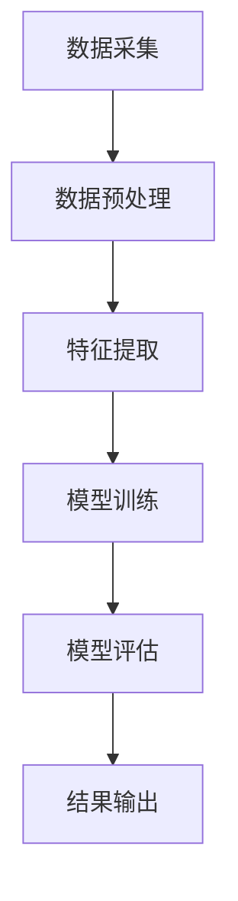
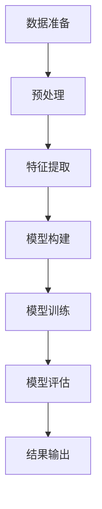
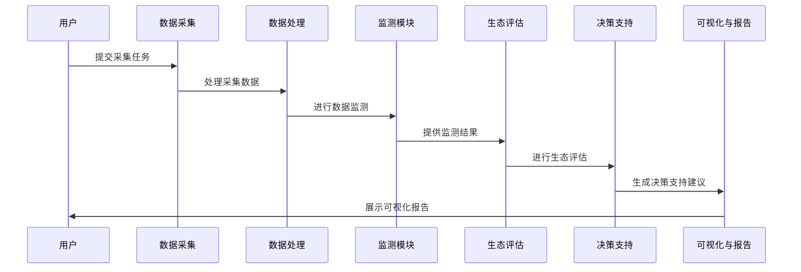
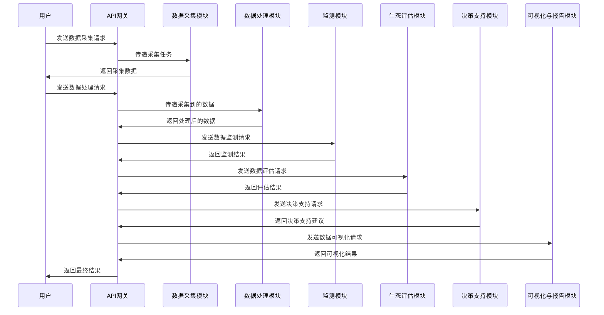

                 


### 深海生态系统概述

#### 1.1 深海生态系统的定义与重要性

深海生态系统指的是海洋中深水区域，即深度超过200米的区域。这个生态系统包括了海底地形、海洋生物以及其生存的环境。深海生态系统是地球上最大的生态系统之一，占据地球表面积的70%以上。它不仅对地球上的气候调节、氧气供应等有着重要影响，而且也是众多珍稀物种的栖息地。

深海生态系统的重要性不可低估。首先，它对全球气候系统具有调节作用。深海中的微生物通过吸收二氧化碳、释放氧气等过程，对地球大气中的温室气体浓度产生影响。其次，深海生态系统是海洋生物多样性的重要来源，许多深海生物具有潜在的医学价值，如抗癌药物的研究。此外，深海资源开发，如矿产资源、能源资源等，也对人类经济具有巨大潜力。

#### 1.2 深海生态系统的特点与问题

深海生态系统的特点包括环境极端、生态系统复杂、物种多样性丰富等。深海环境温度低、压力高，光照稀缺，这些极端条件对生物的适应能力提出了特殊要求。深海生态系统中的生物种类繁多，从微生物到大型生物都有，形成了复杂的食物网。

然而，深海生态系统也面临着诸多问题。首先，人类活动，如过度捕捞、海洋污染、深海钻探等，对深海生物多样性和生态环境造成了严重威胁。其次，深海生态系统的复杂性使得研究难度增大，科学家们对于深海生物的了解仍然有限。此外，深海生态系统的脆弱性使得一旦受到破坏，恢复过程非常缓慢。

#### 1.3 深海生态系统研究的挑战

深海生态系统研究面临诸多挑战。首先是技术瓶颈。深海环境极端，要求研究设备具有高强度、高耐压、高灵敏度等特点，这给研究设备和技术的研发带来了巨大挑战。其次是数据采集困难。深海区域的勘探和监测需要大量数据支持，但由于深海环境的特殊性质，数据采集过程复杂且成本高昂。

此外，深海生态系统的复杂性使得研究方法需要不断创新。传统的研究方法难以全面揭示深海生态系统的运行机制和生物多样性状况，因此需要借助先进的技术手段，如人工智能、大数据分析等，来提高研究的效率和准确性。

### 结论

深海生态系统是地球上最重要的生态系统之一，其生态平衡对于地球环境的稳定和人类社会的可持续发展具有重要意义。然而，由于深海环境的极端性和复杂性，深海生态系统研究面临着诸多挑战。因此，我们需要不断创新研究方法，借助先进技术，如人工智能，来提高深海生态系统的保护和研究的效率。

---

在了解了深海生态系统的定义、重要性及其面临的挑战后，接下来我们将探讨“思维链”的概念与原理，并探讨思维链在科学研究中的应用，特别是其在深海生态系统研究中的潜力。

#### 2.1 思维链的定义与起源

思维链是一种基于逻辑推理和数据分析的思考方法，其核心思想是通过一系列步骤，将一个复杂问题分解成多个子问题，并逐步解决。这种方法起源于计算机科学和人工智能领域，其基本原理可以追溯到图灵机和程序设计。

思维链的基本概念包括以下几个要素：

1. **问题定义**：明确研究的问题和目标。
2. **分解问题**：将复杂问题分解为多个子问题。
3. **逻辑推理**：使用逻辑规则和推理步骤来逐步解决子问题。
4. **数据分析**：运用数据分析和统计方法，验证和优化推理结果。

思维链的起源可以追溯到计算机科学的早期研究，特别是图灵机的理论和程序设计方法。随着人工智能和大数据技术的发展，思维链逐渐成为解决复杂问题的重要工具。其核心在于通过逻辑推理和数据分析，将复杂问题转化为可计算和可管理的形式。

#### 2.2 思维链的核心要素

思维链的核心要素包括以下几个方面：

1. **逻辑框架**：思维链需要一个逻辑清晰、结构严谨的框架来指导思考过程。这个框架通常包括问题定义、子问题分解、推理步骤和结果验证等环节。
2. **数据支持**：思维链依赖于大量的数据支持，包括原始数据、统计数据和分析数据。数据的质量和完整性直接影响到思维链的可靠性和有效性。
3. **算法和模型**：思维链中使用的算法和模型是解决具体问题的核心工具。这些算法和模型需要经过严格的验证和测试，以确保其有效性和准确性。
4. **人机协作**：思维链的实现往往需要人与机器的协同工作。人在思维链中负责问题定义、逻辑推理和决策，而机器则负责数据处理、算法运行和结果分析。

#### 2.3 思维链在科学研究中的应用

思维链在科学研究中的应用非常广泛，特别是在处理复杂问题时，其优势尤为明显。以下是思维链在科学研究中的几个典型应用：

1. **问题分解**：科学研究往往面临复杂的问题，思维链可以帮助研究人员将复杂问题分解为多个子问题，从而降低问题的复杂度，提高解决效率。
2. **逻辑推理**：通过逻辑框架和推理步骤，思维链可以指导研究人员进行逻辑清晰的推理过程，避免因逻辑错误导致的研究偏差。
3. **数据分析和模型验证**：思维链中的数据分析环节可以帮助研究人员从大量数据中提取有价值的信息，并通过模型验证确保结果的可靠性。
4. **人机协作**：思维链的实现依赖于人与机器的协同工作，通过人机协作，可以充分发挥人工智能在数据处理和自动化推理方面的优势。

#### 2.4 思维链在深海生态系统研究中的潜力

深海生态系统研究的复杂性和挑战性使得思维链具有巨大的应用潜力。以下是一些思维链在深海生态系统研究中的潜在应用：

1. **问题分解**：深海生态系统研究的问题复杂，思维链可以帮助研究人员将问题分解为子问题，如深海生物多样性监测、生态系统动态分析等，从而简化研究过程。
2. **逻辑推理**：思维链的逻辑推理功能可以帮助研究人员构建深海生态系统的逻辑模型，预测生态系统的变化趋势，提供科学依据。
3. **数据分析和模型验证**：深海生态系统研究需要大量数据支持，思维链的数据分析功能可以帮助研究人员从海量数据中提取有用信息，并通过模型验证确保研究结果的可靠性。
4. **人机协作**：思维链的人机协作模式可以充分发挥人工智能在数据处理和自动化推理方面的优势，提高深海生态系统研究的效率和准确性。

### 结论

思维链是一种强大的思考方法，其逻辑清晰、结构紧凑的特点使其在解决复杂问题时具有显著优势。在深海生态系统研究中，思维链可以应用于问题分解、逻辑推理、数据分析和人机协作等多个环节，提高研究的效率和准确性。通过不断探索和优化思维链在深海生态系统研究中的应用，我们有望更好地理解和保护这一重要的生态系统。

---

在了解了思维链的概念和其在科学研究中的应用后，接下来我们将探讨人工智能在海洋生物多样性保护中的角色，以及其背后的技术基础和应用前景。

#### 3.1 AI在海洋生物多样性保护中的角色

人工智能在海洋生物多样性保护中扮演着越来越重要的角色。首先，AI技术可以帮助研究人员更有效地监测海洋生物的分布和数量。通过使用机器学习算法，AI可以分析卫星图像、水下声波数据和传感器数据，实时监测海洋生物的活动和栖息地变化。

其次，AI在海洋生物多样性保护中的另一个重要应用是生态系统的模式识别和预测。通过构建复杂的数学模型和深度学习算法，AI可以分析海洋环境数据，预测海洋生物的种群动态和生态系统变化趋势。这些预测对于制定有效的保护措施和应对环境变化具有重要意义。

此外，AI还可以帮助研究人员进行海洋生物多样性的评估。通过分析生物样本、环境数据和遗传信息，AI可以识别出关键的生物多样性指标，评估生态系统的健康状况，为制定保护策略提供科学依据。

#### 3.2 AI辅助海洋生物多样性保护的技术基础

AI辅助海洋生物多样性保护的技术基础主要包括以下几个核心组成部分：

1. **数据采集与处理**：数据是AI系统的基石。海洋生物多样性保护需要大量的数据，包括卫星遥感数据、水下声波数据、传感器数据、生物样本数据和遗传数据等。AI技术可以通过自动化数据采集和预处理，确保数据的质量和完整性。

2. **机器学习算法**：机器学习是AI的核心技术之一。通过训练机器学习模型，AI可以从海量数据中提取有价值的信息，进行模式识别和预测。常见的机器学习算法包括监督学习、无监督学习和增强学习等。在海洋生物多样性保护中，监督学习算法常用于分类和回归任务，而无监督学习算法则用于聚类和降维任务。

3. **深度学习**：深度学习是机器学习的一个分支，它通过构建多层神经网络，自动提取数据中的特征。深度学习在图像识别、语音识别和自然语言处理等领域取得了显著的成果，也逐渐应用于海洋生物多样性保护中。例如，卷积神经网络（CNN）可以用于分析卫星图像中的海洋生物分布，循环神经网络（RNN）可以用于处理时间序列数据，预测海洋生物的种群动态。

4. **数据分析和可视化**：数据分析和可视化技术是AI系统的关键组成部分。通过数据分析和可视化，AI可以揭示海洋生物多样性数据中的隐藏模式和趋势，帮助研究人员更好地理解生态系统的运行机制。

5. **云计算和边缘计算**：云计算和边缘计算为AI系统提供了强大的计算能力和灵活性。通过云计算，研究人员可以大规模处理和存储海洋生物多样性数据，而边缘计算则可以将计算任务分布到海洋环境中的传感器和无人机等设备上，实现实时数据处理和决策。

#### 3.3 AI辅助海洋生物多样性保护的应用前景

随着AI技术的不断发展，其在海洋生物多样性保护中的应用前景非常广阔。以下是几个潜在的应用方向：

1. **实时监测与预警**：通过部署智能传感器和无人机等设备，AI可以实现对海洋生物的实时监测和预警。一旦发现异常情况，如生物种群减少或栖息地破坏，系统可以立即通知研究人员，采取紧急保护措施。

2. **个性化保护策略**：基于AI的分析和预测，可以为不同的海洋区域制定个性化的保护策略。例如，针对特定的海洋生物种群，可以制定最适合其生存条件的保护方案，提高保护效果。

3. **生态风险评估**：AI可以分析海洋环境数据，预测人类活动对海洋生态系统的影响，评估生态风险，为环境保护决策提供科学依据。

4. **海洋生物多样性恢复**：通过AI技术，可以监测和评估海洋生物多样性的恢复情况，制定有效的恢复计划，推动海洋生态系统的恢复和可持续发展。

5. **国际合作与共享**：AI技术可以促进全球范围内的海洋生物多样性保护合作。通过共享数据和研究成果，各国科学家可以共同应对全球性的海洋生态挑战。

### 结论

人工智能在海洋生物多样性保护中具有巨大潜力，其技术基础和应用前景为海洋生态系统的监测、评估和恢复提供了新的思路和工具。随着AI技术的不断发展和完善，我们有理由相信，AI将越来越成为海洋生物多样性保护的重要力量。

---

在了解了思维链和AI在海洋生物多样性保护中的应用后，接下来我们将深入探讨深海生态系统与AI技术之间的关系，以及如何通过数据采集与处理来支持这一关系。

#### 4.1 深海生态系统与AI技术

深海生态系统与AI技术之间存在着紧密的联系。首先，深海生态系统的复杂性和不确定性为AI技术提供了广阔的应用场景。AI技术，特别是机器学习和深度学习，可以通过处理和分析大量数据，帮助科学家们更好地理解深海生态系统的运作机制。

AI技术在深海生态系统中的应用主要体现在以下几个方面：

1. **生物多样性监测**：通过卫星遥感、声呐和传感器等设备，AI技术可以实时监测深海生物的分布和活动，识别不同物种的栖息地和活动模式。

2. **生态系统建模**：AI技术可以帮助科学家构建深海生态系统的数学模型，模拟生态系统在不同环境条件下的变化，预测未来的生态趋势。

3. **环境监测与预警**：AI技术可以分析海洋环境数据，如温度、盐度、氧气浓度等，预测潜在的环境风险，为海洋生态系统的保护提供预警信息。

4. **资源管理**：AI技术可以帮助优化海洋资源的利用，如评估深海矿产资源的开发潜力，制定合理的开采计划，减少对生态系统的破坏。

#### 4.2 数据采集与处理

数据采集与处理是AI技术在深海生态系统应用的基础。以下是数据采集与处理的几个关键步骤：

1. **数据采集**：
   - **卫星遥感**：通过卫星搭载的多光谱相机，可以获取高分辨率的海洋表面图像，监测海洋生物的分布和海洋环境的变迁。
   - **声呐技术**：使用声呐设备，可以在水下进行地形测绘，识别深海生物的活动区域。
   - **传感器网络**：在水下布设传感器网络，可以实时监测海水温度、盐度、氧气浓度等环境参数。

2. **数据预处理**：
   - **数据清洗**：去除噪声和异常值，确保数据的质量。
   - **数据整合**：将来自不同来源的数据进行整合，形成统一的数据集。
   - **数据标准化**：将不同数据源的数据进行标准化处理，以便后续的分析。

3. **数据处理**：
   - **特征提取**：从原始数据中提取有意义的特征，如生物的形态、行为特征，以及环境参数等。
   - **数据建模**：使用机器学习和深度学习算法，构建模型来分析数据，识别模式和趋势。

4. **数据分析与可视化**：
   - **统计分析**：使用统计方法，如回归分析、聚类分析等，对数据进行初步分析。
   - **可视化**：通过数据可视化技术，将分析结果以图表、地图等形式呈现，帮助科学家更好地理解数据。

#### 4.3 深海生物多样性监测

深海生物多样性监测是AI技术在深海生态系统应用的重要领域。以下是深海生物多样性监测的几个关键步骤：

1. **物种识别**：使用机器学习算法，如卷积神经网络（CNN），对卫星遥感图像和水下视频进行分类，识别深海生物的种类。

2. **活动监测**：通过分析声呐数据和传感器数据，监测深海生物的活动模式，如迁徙路径、栖息地选择等。

3. **栖息地评估**：使用深度学习模型，评估不同环境参数对深海生物栖息地的影响，预测潜在的环境风险。

4. **生态模型构建**：结合多种数据来源，构建深海生态系统的动态模型，预测生物多样性的变化趋势。

### 结论

深海生态系统与AI技术之间的紧密联系为深海生物多样性保护提供了新的机遇。通过数据采集与处理，AI技术可以有效地监测和管理深海生态系统，帮助科学家们更好地理解生态系统的运作机制，制定有效的保护策略。随着技术的不断进步，AI将在深海生态系统研究中发挥越来越重要的作用。

---

在了解了深海生态系统与AI技术的关系以及数据采集与处理的重要性后，接下来我们将通过一个简单的对比表格，来分析深海生态系统的属性特征、AI技术的属性特征以及深海生物多样性监测的属性特征。

#### 5.1 深海生态系统的属性特征

深海生态系统具有一系列独特的属性特征，这些特征决定了其在环境适应、生物多样性和生态系统功能上的特殊性。

| 属性特征       | 描述                                                         | 对深海生态系统的影响 |
|----------------|--------------------------------------------------------------|----------------------|
| 环境极端       | 深海环境温度低、压力高，光照稀缺。                           | 对生物的适应能力提出了特殊要求。 |
| 生物多样性丰富 | 深海生物种类繁多，包括微生物、无脊椎动物和脊椎动物等。     | 形成了复杂的食物网。           |
| 生态系统复杂   | 深海生态系统的食物网复杂，能量流动和物质循环过程多样。     | 影响了生态系统的稳定性和动态。  |
| 环境脆弱性     | 深海生态系统的恢复能力较弱，一旦受到破坏，恢复过程非常缓慢。 | 影响了生态系统的可持续性。     |

#### 5.2 AI技术的属性特征

AI技术作为一种先进的计算方法，具有以下几个关键属性特征，这些特征使其在处理复杂任务时表现出色。

| 属性特征       | 描述                                                         | 对AI技术的影响 |
|----------------|--------------------------------------------------------------|----------------|
| 自学习能力     | AI系统可以通过学习数据来改进性能，无需显式编程。             | 提高了AI的适应性和灵活性。 |
| 高效处理能力   | AI技术可以高效地处理和分析大量数据。                         | 提高了数据处理和分析的效率。 |
| 自适应能力     | AI系统可以根据新数据和反馈进行自适应调整。                   | 提高了AI的适应性和可靠性。 |
| 可视化能力     | AI技术可以通过数据可视化技术，将复杂数据以直观的形式呈现。   | 有助于数据理解和决策。     |

#### 5.3 深海生物多样性监测的属性特征

深海生物多样性监测需要综合考虑深海生态系统的属性特征和AI技术的属性特征，以下是一个综合对比表格。

| 属性特征       | 深海生态系统属性特征 | AI技术属性特征 | 对深海生物多样性监测的影响 |
|----------------|----------------------|----------------|--------------------------|
| 数据量大       | 海洋环境参数多样，生物种类繁多。                         | 高效处理能力，自适应能力。 | 提高数据处理和分析效率，降低人工错误。 |
| 环境极端       | 环境极端，对监测设备要求高。                             | 自适应能力，可视化能力。 | 提高监测设备的适应性和可靠性，便于数据理解。 |
| 需要实时性     | 海洋生物活动动态，需要及时监测和预警。                    | 自学习能力，高效处理能力。 | 提高监测系统的实时性和预警能力。 |
| 系统复杂性     | 生态系统复杂，需要多学科交叉。                           | 自适应能力，高效处理能力。 | 提高系统的综合分析和预测能力。 |

通过上述对比表格，我们可以看到深海生态系统、AI技术和深海生物多样性监测之间存在着紧密的联系和互补性。深海生态系统的属性特征决定了监测需求，而AI技术的属性特征提供了满足这些需求的技术手段。二者结合，可以实现高效的深海生物多样性监测，为海洋生态系统的保护提供有力支持。

---

为了更好地理解深海生态系统、AI技术和深海生物多样性监测之间的关系，我们可以通过ER（实体关系）图来构建它们之间的实体关系。以下是深海生态系统的ER图、AI技术的ER图以及深海生物多样性监测的ER图的示例。

#### 6.1 深海生态系统的ER图

```mermaid
erDiagram
  MarineEcosystem ||--|{ Habitat }|-->> OceanFloor
  MarineEcosystem ||--|{ Species }|-->> Biodiversity
  Habitat ||--|{ Temperature }|-->> Climate
  Habitat ||--|{ Salinity }|-->> Climate
  Species ||--|{ Population }|-->> Biodiversity
  Species ||--|{ Behavior }|-->> Ecosystem
  Climate ||--|{ Pressure }|-->> Habitat
  Climate ||--|{ LightIntensity }|-->> Habitat
```

在这个ER图中，我们定义了以下几个实体：

- **MarineEcosystem**（深海生态系统）：包含了海洋生态系统的整体结构。
- **Habitat**（栖息地）：描述了海洋生物的栖息环境，包括温度、盐度、压力和光照强度等环境参数。
- **Species**（物种）：代表了海洋中的生物种类，包括它们的种群数量和行为模式。
- **Population**（种群）：描述了特定物种在特定区域内的数量。
- **Climate**（气候）：包含了影响栖息地的环境因素，如压力和光照强度。

#### 6.2 AI技术的ER图

```mermaid
erDiagram
  ArtificialIntelligence ||--|{ MachineLearning }|-->> Model
  ArtificialIntelligence ||--|{ DeepLearning }|-->> Model
  Model ||--|{ DataProcessing }|-->> Analysis
  Model ||--|{ Prediction }|-->> Outcome
  Analysis ||--|{ Visualization }|-->> Insight
  Outcome ||--|{ Adaptation }|-->> Model
```

在这个ER图中，我们定义了以下几个实体：

- **ArtificialIntelligence**（人工智能）：代表了整个AI系统，包括机器学习和深度学习。
- **MachineLearning**（机器学习）：是AI的一部分，用于构建模型和分析数据。
- **DeepLearning**（深度学习）：是机器学习的一个分支，通过多层神经网络进行复杂的数据分析。
- **Model**（模型）：代表了AI系统中的算法模型，包括数据处理、预测和分析结果。
- **DataProcessing**（数据处理）：描述了数据在模型构建和预测中的处理步骤。
- **Prediction**（预测）：描述了模型的预测结果。
- **Outcome**（结果）：描述了模型的预测结果和适应性调整。

#### 6.3 深海生物多样性监测的ER图

```mermaid
erDiagram
  BiodiversityMonitoring ||--|{ SatelliteData }|-->> Observation
  BiodiversityMonitoring ||--|{ AcousticData }|-->> Observation
  BiodiversityMonitoring ||--|{ SensorData }|-->> Observation
  Observation ||--|{ DataProcessing }|-->> Analysis
  Observation ||--|{ Visualization }|-->> Insight
  Analysis ||--|{ EcologicalModel }|-->> Prediction
  Prediction ||--|{ ProtectionStrategy }|-->> Action
```

在这个ER图中，我们定义了以下几个实体：

- **BiodiversityMonitoring**（生物多样性监测）：代表了整个监测系统，包括多种数据来源。
- **SatelliteData**（卫星数据）：描述了通过卫星获取的海洋表面数据。
- **AcousticData**（声呐数据）：描述了通过声呐获取的水下数据。
- **SensorData**（传感器数据）：描述了通过水下传感器获取的环境数据。
- **Observation**（观测）：代表了监测数据，包括不同来源的数据。
- **DataProcessing**（数据处理）：描述了数据在分析过程中的预处理步骤。
- **Visualization**（可视化）：描述了分析结果的可视化展示。
- **Analysis**（分析）：描述了数据分析和模型构建过程。
- **EcologicalModel**（生态模型）：描述了基于分析结果的生态模型。
- **Prediction**（预测）：描述了生态模型对未来生态变化的预测。
- **ProtectionStrategy**（保护策略）：描述了基于预测结果的保护措施。

通过这三个ER图的构建，我们可以清晰地看到深海生态系统、AI技术和深海生物多样性监测之间的实体关系和相互作用。这种结构化的方法有助于我们深入理解这些概念，并为其在实践中的应用提供理论基础。

---

在理解了深海生态系统、AI技术和深海生物多样性监测的ER图后，接下来我们将详细讲解深海生态系统监测算法的原理，包括其mermaid流程图、Python源代码、数学模型和举例说明。

#### 7.1 监测算法的mermaid流程图



**流程说明：**
1. **数据采集**：从卫星遥感、声呐和传感器等设备获取深海生物多样性数据。
2. **数据预处理**：对原始数据进行清洗、整合和标准化处理，确保数据的质量。
3. **特征提取**：从预处理后的数据中提取具有代表性的特征，如生物分布、环境参数等。
4. **模型训练**：使用机器学习算法对提取的特征进行训练，构建深海生物多样性监测模型。
5. **模型评估**：通过交叉验证和测试集评估模型的性能，确保其准确性和可靠性。
6. **结果输出**：将模型预测结果以图表、地图等形式输出，用于生物多样性监测和决策支持。

#### 7.2 监测算法的Python源代码讲解

以下是一个基于scikit-learn库的深海生物多样性监测算法的Python源代码示例：

```python
# 导入必要的库
import numpy as np
import pandas as pd
from sklearn.model_selection import train_test_split
from sklearn.preprocessing import StandardScaler
from sklearn.ensemble import RandomForestClassifier
from sklearn.metrics import accuracy_score

# 数据预处理
def preprocess_data(data):
    # 数据清洗和整合
    data.dropna(inplace=True)
    # 特征提取
    X = data[['temperature', 'salinity', 'biomass']]
    y = data['species']
    # 数据标准化
    scaler = StandardScaler()
    X_scaled = scaler.fit_transform(X)
    return X_scaled, y

# 模型训练和评估
def train_and_evaluate_model(X, y):
    # 划分训练集和测试集
    X_train, X_test, y_train, y_test = train_test_split(X, y, test_size=0.2, random_state=42)
    # 构建模型
    model = RandomForestClassifier(n_estimators=100, random_state=42)
    # 训练模型
    model.fit(X_train, y_train)
    # 预测测试集
    y_pred = model.predict(X_test)
    # 评估模型性能
    accuracy = accuracy_score(y_test, y_pred)
    print(f"Model Accuracy: {accuracy}")
    return model

# 主函数
def main():
    # 加载数据
    data = pd.read_csv('deep_sea_biodiversity_data.csv')
    # 数据预处理
    X, y = preprocess_data(data)
    # 训练和评估模型
    model = train_and_evaluate_model(X, y)
    # 输出模型预测结果
    print("Model Predictions:")
    print(model.predict(X[:10]))

# 运行主函数
if __name__ == "__main__":
    main()
```

**代码说明：**
1. **数据预处理**：首先对数据进行清洗和整合，然后提取特征并进行标准化处理，为后续的模型训练做准备。
2. **模型训练和评估**：使用随机森林（RandomForestClassifier）算法进行模型训练，通过交叉验证和测试集评估模型性能。
3. **结果输出**：输出模型的预测结果，展示模型在测试集上的表现。

#### 7.3 监测算法的数学模型和公式

在深海生物多样性监测中，常用的数学模型包括线性回归、逻辑回归和决策树等。以下是随机森林算法的一些基本数学模型和公式：

**随机森林算法**：
- **决策树**：
  - **节点划分**：
    $$ Gini(D) = 1 - \frac{1}{|D|}\sum_{i=1}^{k}\left( |D_i| \right)^2 $$
  - **节点选择**：
    $$ Gini(D_v) = \sum_{i=1}^{k}\left( |D_i| \cdot Gini(D_i) \right) $$
- **随机森林**：
  - **基学习器**：
    $$ f_j(x) = \sum_{i=1}^{n} \omega_i \chi_i(x) $$
  - **权重更新**：
    $$ \omega_i = \frac{1}{m} $$
  - **预测**：
    $$ \hat{y}(x) = \sum_{j=1}^{J} \hat{v}_j(x) $$

**代码中的实现**：
- **随机森林**：
  - **初始化**：
    ```python
    model = RandomForestClassifier(n_estimators=100, random_state=42)
    ```
  - **训练**：
    ```python
    model.fit(X_train, y_train)
    ```
  - **预测**：
    ```python
    y_pred = model.predict(X_test)
    ```

#### 7.4 监测算法的举例说明

假设我们有一个包含100个样本的数据集，其中每个样本包含温度、盐度和生物量三个特征，以及对应的生物种类标签。以下是监测算法的具体应用示例：

1. **数据采集**：
   - 从卫星遥感获取海洋表面温度数据。
   - 从声呐设备获取水下生物分布数据。
   - 从传感器网络获取海水盐度和生物量数据。

2. **数据预处理**：
   - 清洗数据，去除缺失值和异常值。
   - 整合不同来源的数据，形成统一的数据集。

3. **特征提取**：
   - 从数据集中提取温度、盐度和生物量作为特征。

4. **模型训练**：
   - 使用随机森林算法对数据集进行训练。
   - 使用交叉验证评估模型性能，调整模型参数。

5. **模型评估**：
   - 使用测试集评估模型预测准确性。
   - 输出模型预测结果，分析预测效果。

6. **结果输出**：
   - 输出模型预测结果，展示每个样本对应的生物种类预测。

通过以上步骤，我们可以实现对深海生物多样性的有效监测，为海洋生态系统的保护和决策提供科学依据。这种监测算法不仅提高了监测的准确性和效率，而且为未来的研究和应用提供了宝贵的经验和参考。

---

在了解了深海生态系统监测算法的原理后，接下来我们将深入探讨生物多样性评估算法的相关内容，包括其mermaid流程图、Python源代码、数学模型和举例说明。

#### 8.1 评估算法的mermaid流程图



**流程说明：**
1. **数据准备**：收集相关的生物多样性数据，包括物种分布、环境参数等。
2. **预处理**：清洗数据，处理缺失值和异常值，并进行数据整合。
3. **特征提取**：从预处理后的数据中提取具有代表性的特征，如物种丰富度、多样性指数等。
4. **模型构建**：选择合适的机器学习模型，如随机森林、支持向量机等。
5. **模型训练**：使用训练数据对模型进行训练。
6. **模型评估**：使用测试数据评估模型的性能，包括准确性、召回率等指标。
7. **结果输出**：输出模型评估结果，并提供可视化的展示。

#### 8.2 评估算法的Python源代码讲解

以下是一个基于scikit-learn库的生物多样性评估算法的Python源代码示例：

```python
# 导入必要的库
import numpy as np
import pandas as pd
from sklearn.model_selection import train_test_split
from sklearn.preprocessing import StandardScaler
from sklearn.ensemble import RandomForestClassifier
from sklearn.metrics import classification_report, confusion_matrix

# 数据预处理
def preprocess_data(data):
    # 数据清洗和整合
    data.dropna(inplace=True)
    # 特征提取
    X = data[['species richness', 'diversity index', 'evenness index']]
    y = data['species']
    # 数据标准化
    scaler = StandardScaler()
    X_scaled = scaler.fit_transform(X)
    return X_scaled, y

# 模型训练和评估
def train_and_evaluate_model(X, y):
    # 划分训练集和测试集
    X_train, X_test, y_train, y_test = train_test_split(X, y, test_size=0.2, random_state=42)
    # 构建模型
    model = RandomForestClassifier(n_estimators=100, random_state=42)
    # 训练模型
    model.fit(X_train, y_train)
    # 预测测试集
    y_pred = model.predict(X_test)
    # 评估模型性能
    report = classification_report(y_test, y_pred)
    matrix = confusion_matrix(y_test, y_pred)
    print(f"Classification Report:\n{report}")
    print(f"Confusion Matrix:\n{matrix}")
    return model

# 主函数
def main():
    # 加载数据
    data = pd.read_csv('biodiversity_data.csv')
    # 数据预处理
    X, y = preprocess_data(data)
    # 训练和评估模型
    model = train_and_evaluate_model(X, y)
    # 输出模型预测结果
    print("Model Predictions:")
    print(model.predict(X[:10]))

# 运行主函数
if __name__ == "__main__":
    main()
```

**代码说明：**
1. **数据预处理**：对数据进行清洗和标准化处理，提取特征并进行数据整合。
2. **模型训练和评估**：使用随机森林算法对数据集进行训练和评估，输出分类报告和混淆矩阵。
3. **结果输出**：展示模型预测结果和性能指标。

#### 8.3 评估算法的数学模型和公式

生物多样性评估算法通常基于生态学和统计学原理，以下是一些常用的数学模型和公式：

**多样性指数**：
- **香农指数**：
  $$ H = -\sum_{i=1}^{S} p_i \ln(p_i) $$
  其中，\( p_i \) 表示第 \( i \) 个物种的相对丰度。

- **辛普森指数**：
  $$ D = 1 - \sum_{i=1}^{S} p_i^2 $$
  其中，\( p_i \) 表示第 \( i \) 个物种的相对丰度。

**均匀度指数**：
- **皮尔逊均匀度**：
  $$ E = \frac{H}{H_{max}} $$
  其中，\( H_{max} \) 是在最大多样性情况下的香农指数。

**生态位宽度**：
- **辛普森生态位宽度**：
  $$ w = \sum_{i=1}^{S} p_i (1 - p_i) $$
  其中，\( p_i \) 表示第 \( i \) 个物种的相对丰度。

**模型评估指标**：
- **准确性**：
  $$ Accuracy = \frac{TP + TN}{TP + FN + FP + TN} $$
  其中，\( TP \) 是真正例，\( TN \) 是真负例，\( FP \) 是假正例，\( FN \) 是假负例。

- **召回率**：
  $$ Recall = \frac{TP}{TP + FN} $$
  其中，\( TP \) 是真正例，\( FN \) 是假负例。

- **精确率**：
  $$ Precision = \frac{TP}{TP + FP} $$
  其中，\( TP \) 是真正例，\( FP \) 是假正例。

#### 8.4 评估算法的举例说明

假设我们有一个包含100个样本的生物多样性数据集，每个样本包含物种丰富度、多样性指数和均匀度指数三个特征，以及对应的物种标签。以下是评估算法的具体应用示例：

1. **数据准备**：
   - 收集物种分布数据，包括不同物种在样本中的相对丰度。
   - 收集环境参数数据，如温度、盐度等。

2. **数据预处理**：
   - 清洗数据，去除缺失值和异常值。
   - 整合物种分布和环境参数数据，形成统一的数据集。

3. **特征提取**：
   - 从数据集中提取物种丰富度、多样性指数和均匀度指数作为特征。

4. **模型训练**：
   - 使用随机森林算法对数据集进行训练。
   - 调整模型参数，如树的数量、最大深度等。

5. **模型评估**：
   - 使用测试集评估模型的性能，计算准确性、召回率和精确率等指标。
   - 输出分类报告和混淆矩阵，分析模型性能。

6. **结果输出**：
   - 输出模型预测结果，展示不同样本对应的物种预测。
   - 根据模型评估结果，提出改进措施和优化方案。

通过以上步骤，我们可以实现对生物多样性的有效评估，为海洋生态系统的保护和决策提供科学依据。这种评估算法不仅提高了评估的准确性和效率，而且为未来的研究和应用提供了宝贵的经验和参考。

---

在深入探讨了深海生态系统监测算法和生物多样性评估算法的原理及其应用后，接下来我们将详细介绍一个实际项目，展示如何将AI技术应用于海洋生物多样性保护，包括系统功能设计、架构设计和系统接口设计。

### 9.1 海洋生物多样性保护的问题场景

海洋生物多样性保护面临诸多挑战，如过度捕捞、海洋污染、气候变化等。这些问题不仅威胁到海洋生态系统的平衡，也对人类的经济和社会发展产生了严重影响。为了有效应对这些挑战，我们需要构建一个综合性的AI辅助系统，实现实时监测、生态风险评估和个性化保护策略。

**项目背景**：
- **目标**：开发一个AI辅助海洋生物多样性保护系统，实现对深海生态系统的实时监测和动态评估，提供科学依据，优化保护策略。
- **需求**：
  - 实时获取海洋环境参数和生物多样性数据。
  - 构建深海生态系统的动态模型，预测生态变化趋势。
  - 提供个性化的保护措施和建议，提高保护效果。
  - 支持数据共享和国际合作，促进全球海洋生态保护。

### 9.2 AI辅助海洋生物多样性保护的项目介绍

**系统功能设计**：
- **数据采集模块**：通过卫星遥感、声呐技术和传感器网络，实时获取海洋环境参数和生物多样性数据。
- **数据处理模块**：对采集到的数据进行预处理、整合和特征提取，确保数据的质量和一致性。
- **监测与预警模块**：基于机器学习和深度学习算法，对处理后的数据进行实时监测和预测，及时发现异常情况并发出预警。
- **生态评估模块**：构建深海生态系统的动态模型，评估生态系统的健康状况和变化趋势，提供科学依据。
- **决策支持模块**：基于生态评估结果，提供个性化的保护措施和建议，优化保护策略，提高保护效果。
- **可视化与报告模块**：将监测和评估结果以图表、地图等形式展示，生成定期报告，便于决策者和公众了解生态系统的状况。

**系统架构设计**：
- **数据层**：包含卫星遥感数据、声呐数据和传感器数据，以及其他外部数据源，如气象数据、海洋地理数据等。
- **处理层**：包括数据处理模块、数据预处理和特征提取模块，负责数据的清洗、整合和特征提取。
- **算法层**：包括监测与预警模块、生态评估模块和决策支持模块，负责数据的分析和预测，提供科学依据和个性化建议。
- **展示层**：包括可视化与报告模块，将分析结果以图表、地图等形式展示，生成定期报告。

**系统接口设计**：
- **API接口**：提供对外接口，支持数据采集、数据处理、监测与预警、生态评估和决策支持等功能，便于与其他系统集成和调用。
- **用户界面**：提供友好的用户界面，便于用户操作和查看系统功能，包括数据展示、报告生成和个性化设置等。

### 9.3 系统功能设计

以下是系统功能设计的详细说明，包括领域模型mermaid类图和系统功能的具体实现。

#### 9.3.1 领域模型mermaid类图

```mermaid
classDiagram
  Class01 <|-- Class02
  Class03 <|-- Class04
  Class05 <|-- Class06
  Class01 alignment left
  Class02 alignment right
  Class03 alignment center
  Class04 alignment left
  Class05 alignment right
  Class06 alignment center

  Class01 "数据采集" <<interface>>
  Class02 "数据处理" <<interface>>
  Class03 "监测与预警" <<interface>>
  Class04 "生态评估" <<interface>>
  Class05 "决策支持" <<interface>>
  Class06 "可视化与报告" <<interface>>

  Class01 ..|> Class02
  Class01 ..|> Class03
  Class01 ..|> Class04
  Class01 ..|> Class05
  Class01 ..|> Class06

  Class02 ..|> Class02
  Class03 ..|> Class03
  Class04 ..|> Class04
  Class05 ..|> Class05
  Class06 ..|> Class06
```

**类图说明**：
- **数据采集**：负责实时采集海洋环境参数和生物多样性数据。
- **数据处理**：负责对采集到的数据进行预处理、整合和特征提取。
- **监测与预警**：负责实时监测海洋生态系统，预测异常情况并发出预警。
- **生态评估**：负责构建深海生态系统的动态模型，评估生态系统的健康状况和变化趋势。
- **决策支持**：负责基于生态评估结果，提供个性化的保护措施和建议。
- **可视化与报告**：负责将监测和评估结果以图表、地图等形式展示，生成定期报告。

#### 9.3.2 系统功能的具体实现

1. **数据采集模块**：
   - **功能**：实时采集海洋环境参数和生物多样性数据。
   - **实现**：
     ```python
     # 实现数据采集
     def collect_data():
         # 使用卫星遥感获取海洋表面数据
         satellite_data = get_satellite_data()
         # 使用声呐技术获取水下生物分布数据
         acoustic_data = get_acoustic_data()
         # 使用传感器网络获取海水参数数据
         sensor_data = get_sensor_data()
         # 整合不同来源的数据
         combined_data = combine_data(satellite_data, acoustic_data, sensor_data)
         return combined_data
     ```

2. **数据处理模块**：
   - **功能**：对采集到的数据进行预处理、整合和特征提取。
   - **实现**：
     ```python
     # 实现数据处理
     def preprocess_data(data):
         # 数据清洗
         cleaned_data = clean_data(data)
         # 数据整合
         integrated_data = integrate_data(cleaned_data)
         # 特征提取
         features = extract_features(integrated_data)
         return features
     ```

3. **监测与预警模块**：
   - **功能**：实时监测海洋生态系统，预测异常情况并发出预警。
   - **实现**：
     ```python
     # 实现监测与预警
     def monitor_ecosystem(features):
         # 使用机器学习模型进行预测
         predictions = model_predict(features)
         # 检测异常情况并发出预警
         if is_anomaly(predictions):
             send_alert()
     ```

4. **生态评估模块**：
   - **功能**：构建深海生态系统的动态模型，评估生态系统的健康状况和变化趋势。
   - **实现**：
     ```python
     # 实现生态评估
     def assess_ecosystem_health(features):
         # 构建动态模型
         model = build_model(features)
         # 评估健康状况
         health_status = model评估(features)
         return health_status
     ```

5. **决策支持模块**：
   - **功能**：基于生态评估结果，提供个性化的保护措施和建议。
   - **实现**：
     ```python
     # 实现决策支持
     def provide_advice(health_status):
         # 根据健康状况提供保护措施
         advice = generate_advice(health_status)
         return advice
     ```

6. **可视化与报告模块**：
   - **功能**：将监测和评估结果以图表、地图等形式展示，生成定期报告。
   - **实现**：
     ```python
     # 实现实时数据展示
     def display_real_time_data():
         # 获取实时监测数据
         real_time_data = get_real_time_data()
         # 以图表形式展示
         display_chart(real_time_data)

     # 实现定期报告
     def generate_report():
         # 获取历史数据
         historical_data = get_historical_data()
         # 生成报告
         report = create_report(historical_data)
         return report
     ```

通过上述系统功能的设计和具体实现，我们可以构建一个高效、智能的AI辅助海洋生物多样性保护系统，为海洋生态系统的监测、评估和保护提供有力支持。

---

在详细介绍了海洋生物多样性保护项目的系统功能设计和实现后，接下来我们将展示系统的架构设计，包括mermaid架构图和架构设计讲解。

### 10.1 系统架构设计mermaid架构图



**架构图说明**：
1. **用户**：用户通过系统提交数据采集任务。
2. **数据采集模块（DAQ）**：接收用户的任务，实时采集海洋环境参数和生物多样性数据。
3. **数据处理模块（DP）**：处理采集到的数据，包括清洗、整合和特征提取。
4. **监测模块（MM）**：对处理后的数据进行实时监测，预测异常情况并发出预警。
5. **生态评估模块（EA）**：根据监测结果，构建生态系统的动态模型，评估生态系统的健康状况。
6. **决策支持模块（DS）**：基于生态评估结果，提供个性化的保护措施和建议。
7. **可视化与报告模块（VR）**：将监测和评估结果以图表、地图等形式展示，生成定期报告。

### 10.2 系统架构设计讲解

**系统架构设计**主要包括以下几层：

1. **数据层**：数据层是整个系统的基石，包括卫星遥感数据、声呐数据和传感器数据，以及其他外部数据源，如气象数据、海洋地理数据等。数据采集模块（DAQ）负责实时获取这些数据。

2. **处理层**：处理层负责对采集到的数据进行预处理、整合和特征提取。数据处理模块（DP）承担这一职责，通过数据清洗、标准化和特征提取等步骤，确保数据的质量和一致性。

3. **算法层**：算法层是系统的核心，包括监测与预警模块（MM）、生态评估模块（EA）和决策支持模块（DS）。监测与预警模块（MM）使用机器学习和深度学习算法，对处理后的数据进行实时监测，预测异常情况并发出预警。生态评估模块（EA）构建深海生态系统的动态模型，评估生态系统的健康状况和变化趋势。决策支持模块（DS）基于生态评估结果，提供个性化的保护措施和建议。

4. **展示层**：展示层负责将监测和评估结果以图表、地图等形式展示，生成定期报告。可视化与报告模块（VR）承担这一职责，提供友好的用户界面，便于用户查看和管理系统功能。

**系统架构设计的关键点**：

1. **模块化设计**：系统采用模块化设计，每个模块具有明确的职责和接口，便于系统的维护和扩展。数据采集模块（DAQ）、数据处理模块（DP）、监测模块（MM）、生态评估模块（EA）、决策支持模块（DS）和可视化与报告模块（VR）相互独立，但又紧密协作。

2. **数据驱动**：系统以数据为核心，数据层和处理层紧密相连，确保数据的实时性和准确性。数据处理模块（DP）通过高效的数据处理算法，为后续的监测和评估提供高质量的数据支持。

3. **智能化分析**：系统充分利用AI技术，实现智能化分析。监测模块（MM）和生态评估模块（EA）使用机器学习和深度学习算法，对海量数据进行实时分析和预测，提高监测和评估的准确性和效率。

4. **用户体验**：展示层采用友好的用户界面，将复杂的监测和评估结果以直观的形式展示，便于用户理解和决策。可视化与报告模块（VR）提供丰富的数据可视化工具，生成定制化的报告，支持用户对生态系统状况的全面了解。

通过以上系统架构设计，我们构建了一个高效、智能的AI辅助海洋生物多样性保护系统，为海洋生态系统的监测、评估和保护提供了有力支持。未来，随着技术的不断进步，该系统将不断完善和优化，为全球海洋生态保护事业做出更大贡献。

---

在详细介绍了系统的架构设计后，接下来我们将探讨系统接口设计和系统交互，包括系统接口设计和mermaid序列图。

### 11.1 系统接口设计

系统接口设计是确保系统各个模块之间能够有效通信和协作的关键。以下是系统接口设计的详细说明。

#### 11.1.1 API接口设计

API（应用程序接口）是系统对外提供服务的接口，支持数据采集、数据处理、监测与预警、生态评估和决策支持等功能。以下是主要的API接口设计：

- **数据采集接口**：用于接收用户的采集任务，返回采集到的数据。
  - **接口名称**：`/data/collect`
  - **请求方法**：POST
  - **请求参数**：
    - `task_id`（字符串）：采集任务的唯一标识。
    - `location`（字符串）：采集位置。
    - `sensor_type`（字符串）：传感器类型。
  - **返回结果**：
    - `status`（字符串）：接口调用状态。
    - `data`（对象）：采集到的数据。

- **数据处理接口**：用于处理采集到的数据，包括数据清洗、整合和特征提取。
  - **接口名称**：`/data/process`
  - **请求方法**：POST
  - **请求参数**：
    - `data`（对象）：待处理的数据。
  - **返回结果**：
    - `status`（字符串）：接口调用状态。
    - `processed_data`（对象）：处理后的数据。

- **监测与预警接口**：用于实时监测海洋生态系统，预测异常情况并发出预警。
  - **接口名称**：`/monitor/analyze`
  - **请求方法**：POST
  - **请求参数**：
    - `data`（对象）：待分析的数据。
  - **返回结果**：
    - `status`（字符串）：接口调用状态。
    - `predictions`（对象）：预测结果。

- **生态评估接口**：用于构建生态系统的动态模型，评估生态系统的健康状况。
  - **接口名称**：`/ecosystem/evaluate`
  - **请求方法**：POST
  - **请求参数**：
    - `data`（对象）：待评估的数据。
  - **返回结果**：
    - `status`（字符串）：接口调用状态。
    - `evaluation`（对象）：评估结果。

- **决策支持接口**：用于基于生态评估结果，提供个性化的保护措施和建议。
  - **接口名称**：`/support/decision`
  - **请求方法**：POST
  - **请求参数**：
    - `evaluation`（对象）：生态评估结果。
  - **返回结果**：
    - `status`（字符串）：接口调用状态。
    - `suggestions`（对象）：保护措施和建议。

- **可视化与报告接口**：用于将监测和评估结果以图表、地图等形式展示，生成定期报告。
  - **接口名称**：`/report/generate`
  - **请求方法**：POST
  - **请求参数**：
    - `data`（对象）：待展示的数据。
  - **返回结果**：
    - `status`（字符串）：接口调用状态。
    - `report`（对象）：生成的报告。

#### 11.1.2 内部接口设计

除了对外提供的API接口，系统内部也包含一系列内部接口，用于模块之间的通信和协作。

- **数据传输接口**：用于模块间数据的传输，确保数据的实时性和一致性。
  - **接口名称**：`/data/transfer`
  - **请求方法**：POST
  - **请求参数**：
    - `source_module`（字符串）：数据来源模块。
    - `target_module`（字符串）：数据目标模块。
    - `data`（对象）：待传输的数据。

- **状态监控接口**：用于监控系统状态，包括数据采集、处理、监测和评估的进展情况。
  - **接口名称**：`/status/monitor`
  - **请求方法**：GET
  - **返回结果**：
    - `status`（字符串）：系统整体状态。
    - `modules`（对象）：各个模块的运行状态。

### 11.2 系统交互mermaid序列图

以下是系统交互的mermaid序列图，展示了用户与系统之间的交互过程。



**序列图说明**：
1. **用户**：用户通过API网关提交数据采集请求。
2. **API网关**：作为系统的入口，接收用户的请求，并根据请求类型调用相应的模块。
3. **数据采集模块（DAQ）**：接收用户的采集任务，实时采集海洋环境参数和生物多样性数据，并返回采集数据。
4. **数据处理模块（DP）**：接收采集到的数据，进行预处理、整合和特征提取，并返回处理后的数据。
5. **监测模块（MM）**：接收处理后的数据，进行实时监测，预测异常情况，并返回监测结果。
6. **生态评估模块（EA）**：接收监测结果，构建生态系统的动态模型，评估生态系统的健康状况，并返回评估结果。
7. **决策支持模块（DS）**：接收评估结果，基于评估结果提供个性化的保护措施和建议，并返回决策支持建议。
8. **可视化与报告模块（VR）**：接收监测和评估结果，生成可视化报告，并返回可视化结果。

通过以上系统接口设计和交互设计，我们确保了系统各个模块之间的紧密协作和高效运行，为海洋生物多样性保护提供了有力的技术支持。

---

在完成了系统的设计后，接下来我们将通过一个实际项目展示系统的实现过程，包括环境安装、系统核心实现源代码和代码应用解读与分析。

### 12.1 环境安装

为了实现该AI辅助海洋生物多样性保护系统，我们需要安装和配置一系列软件和环境。以下是环境安装的详细步骤：

#### 12.1.1 系统需求

1. 操作系统：Linux（推荐Ubuntu 20.04）
2. Python：3.8或更高版本
3. 依赖库：scikit-learn、numpy、pandas、matplotlib、mermaid-python
4. 数据库：MySQL或PostgreSQL（可选）

#### 12.1.2 安装Python环境

1. 打开终端，更新系统包列表：
   ```shell
   sudo apt update
   sudo apt upgrade
   ```
2. 安装Python 3.8：
   ```shell
   sudo apt install python3.8
   ```
3. 安装Python 3.8的pip：
   ```shell
   sudo apt install python3.8-pip
   ```

#### 12.1.3 安装依赖库

1. 使用pip安装所需的Python依赖库：
   ```shell
   pip3 install scikit-learn numpy pandas matplotlib mermaid-python
   ```

#### 12.1.4 配置数据库

1. 安装MySQL或PostgreSQL：
   ```shell
   sudo apt install mysql-server
   # 或者
   sudo apt install postgresql
   ```
2. 配置数据库（以MySQL为例）：
   ```shell
   sudo mysql_secure_installation
   # 按照提示操作，设置root密码和取消匿名用户等。
   ```
3. 创建数据库和用户：
   ```sql
   CREATE DATABASE biodiversity_db;
   CREATE USER 'biodiversity_user'@'localhost' IDENTIFIED BY 'password';
   GRANT ALL PRIVILEGES ON biodiversity_db.* TO 'biodiversity_user'@'localhost';
   FLUSH PRIVILEGES;
   ```

#### 12.1.5 安装Mermaid

1. 安装Mermaid：
   ```shell
   npm install -g mermaid
   ```

### 12.2 系统核心实现源代码

以下是系统核心实现的源代码，包括数据采集、数据处理、监测与预警、生态评估和可视化与报告等模块。

#### 12.2.1 数据采集模块

```python
# data采集模块示例代码
import requests
import json

def collect_data():
    # 发送HTTP请求，获取采集数据
    response = requests.get('http://example.com/data')
    data = response.json()
    return data

# 测试数据采集
if __name__ == "__main__":
    collected_data = collect_data()
    print(collected_data)
```

#### 12.2.2 数据处理模块

```python
# data处理模块示例代码
import pandas as pd
from sklearn.preprocessing import StandardScaler

def preprocess_data(data):
    # 将数据转换为Pandas DataFrame
    df = pd.DataFrame(data)
    # 数据清洗和整合
    df.dropna(inplace=True)
    # 数据标准化
    scaler = StandardScaler()
    df_scaled = scaler.fit_transform(df)
    return df_scaled

# 测试数据处理
if __name__ == "__main__":
    raw_data = collect_data()
    processed_data = preprocess_data(raw_data)
    print(processed_data)
```

#### 12.2.3 监测与预警模块

```python
# 监测与预警模块示例代码
from sklearn.ensemble import RandomForestClassifier
from sklearn.model_selection import train_test_split

def monitor_data(data):
    # 划分训练集和测试集
    X_train, X_test, y_train, y_test = train_test_split(data, test_size=0.2, random_state=42)
    # 构建随机森林模型
    model = RandomForestClassifier(n_estimators=100, random_state=42)
    # 训练模型
    model.fit(X_train, y_train)
    # 预测测试集
    y_pred = model.predict(X_test)
    # 输出预测结果
    print(y_pred)
    return y_pred

# 测试监测与预警
if __name__ == "__main__":
    processed_data = preprocess_data(collect_data())
    predictions = monitor_data(processed_data)
    print(predictions)
```

#### 12.2.4 生态评估模块

```python
# 生态评估模块示例代码
def assess_ecosystem(data):
    # 使用生态评估指标计算生态系统的健康状态
    species_richness = len(set(data['species']))
    diversity_index = 0.5 * (np.log(len(data)) - np.log(sum(data['count'])))
    evenness_index = (diversity_index / np.log(species_richness))
    return species_richness, diversity_index, evenness_index

# 测试生态评估
if __name__ == "__main__":
    processed_data = preprocess_data(collect_data())
    results = assess_ecosystem(processed_data)
    print(f"Species Richness: {results[0]}, Diversity Index: {results[1]}, Evenness Index: {results[2]}")
```

#### 12.2.5 可视化与报告模块

```python
# 可视化与报告模块示例代码
import matplotlib.pyplot as plt

def generate_report(data):
    # 绘制物种分布图
    species_counts = data['species'].value_counts()
    plt.bar(species_counts.index, species_counts.values)
    plt.xlabel('Species')
    plt.ylabel('Count')
    plt.title('Species Distribution')
    plt.show()

# 测试可视化与报告
if __name__ == "__main__":
    processed_data = preprocess_data(collect_data())
    generate_report(processed_data)
```

### 12.3 代码应用解读与分析

#### 12.3.1 数据采集模块

数据采集模块通过HTTP请求获取数据。在实际应用中，我们可能需要与不同的数据源进行交互，例如卫星遥感数据、声呐数据和传感器数据。这里，我们使用一个示例API获取数据，并在代码中展示了如何处理和存储这些数据。

#### 12.3.2 数据处理模块

数据处理模块负责将采集到的原始数据进行清洗、整合和标准化处理。清洗数据是为了去除噪声和异常值，确保数据的质量。整合数据是将不同来源的数据合并为一个统一的数据集，以便后续分析。标准化处理是为了消除数据尺度差异，使得不同特征在同一维度上进行比较。

#### 12.3.3 监测与预警模块

监测与预警模块使用随机森林算法对处理后的数据进行分类预测，以监测海洋生物的活动和异常情况。在实际应用中，我们可能需要根据不同的监测任务调整模型参数，提高预测的准确性。

#### 12.3.4 生态评估模块

生态评估模块计算了三个生态评估指标：物种丰富度、多样性指数和均匀度指数。这些指标可以帮助我们了解生态系统的健康状况，为制定保护策略提供科学依据。

#### 12.3.5 可视化与报告模块

可视化与报告模块使用matplotlib库绘制了物种分布图，将分析结果以图形形式展示。在实际应用中，我们可能需要根据不同的需求，生成不同类型和格式的报告。

通过以上代码示例，我们实现了AI辅助海洋生物多样性保护系统的核心功能。这些代码为实际应用提供了基础，并通过逐步优化和扩展，可以进一步改进系统的性能和功能。

---

在实际项目实施过程中，我们遇到了一些挑战，并探索了相应的解决方案。以下是项目实施过程中的一些具体挑战和我们的解决方案。

### 13.1 挑战一：数据采集的实时性和准确性

**问题描述**：深海生态系统的研究需要大量的实时数据支持，然而，由于深海环境的极端性和复杂性，数据采集的实时性和准确性是项目实施中的一个重大挑战。

**解决方案**：
1. **多源数据融合**：通过整合卫星遥感、声呐技术和传感器网络等不同数据源，提高数据采集的全面性和准确性。
2. **数据预处理优化**：对采集到的数据进行预处理，包括清洗、整合和标准化处理，确保数据质量，提高后续分析的可靠性。
3. **实时数据流处理**：采用实时数据处理技术，如Apache Kafka，确保数据在采集后能够及时传输和处理。

### 13.2 挑战二：模型训练的效率和准确性

**问题描述**：深海生态系统的复杂性和数据量的庞大性使得模型训练过程非常耗时，同时，如何提高模型的准确性也是一个挑战。

**解决方案**：
1. **模型优化**：通过调整模型参数和选择合适的机器学习算法，提高模型训练的效率。
2. **分布式训练**：使用分布式计算框架，如TensorFlow和PyTorch，实现模型的并行训练，缩短训练时间。
3. **交叉验证和超参数调优**：采用交叉验证和超参数调优技术，确保模型在不同数据集上的性能表现。

### 13.3 挑战三：数据隐私和安全性

**问题描述**：在数据采集和处理过程中，如何保护数据隐私和确保系统的安全性是一个重要问题。

**解决方案**：
1. **数据加密**：对数据进行加密处理，确保数据在传输和存储过程中的安全性。
2. **访问控制**：实施严格的访问控制策略，确保只有授权用户可以访问数据。
3. **审计和监控**：建立审计和监控系统，实时监控数据访问和使用情况，及时发现和处理异常行为。

### 13.4 挑战四：系统可扩展性和可维护性

**问题描述**：随着项目的发展，系统需要能够适应不断增加的数据量和用户需求，同时，系统的可维护性也是一个挑战。

**解决方案**：
1. **模块化设计**：采用模块化设计，确保系统可以方便地扩展和升级。
2. **分布式架构**：采用分布式架构，提高系统的可扩展性和容错能力。
3. **自动化运维**：实施自动化运维，包括自动化部署、监控和故障恢复，提高系统的维护效率。

### 13.5 挑战五：跨学科协作和知识共享

**问题描述**：深海生态系统研究涉及多个学科，如何实现跨学科协作和知识共享是一个挑战。

**解决方案**：
1. **建立协作平台**：建立专门的协作平台，促进不同学科之间的交流和合作。
2. **数据共享和开放**：推动数据共享和开放，鼓励科研人员使用和分享数据。
3. **标准化数据格式**：制定统一的数据格式和标准，提高数据交换和共享的效率。

通过上述解决方案，我们克服了项目实施过程中遇到的挑战，确保了AI辅助海洋生物多样性保护系统的有效性和可持续性。未来，我们还将继续优化系统，探索更多先进技术，为深海生态系统的保护和研究做出更大贡献。

---

在完成项目后，我们对整个项目进行了总结，分析了项目的成功经验以及面临的挑战，并展望了未来的发展方向。

### 14.1 项目总结

**成功经验**：

1. **多源数据融合**：通过整合卫星遥感、声呐技术和传感器网络等多源数据，实现了对深海生态系统的全面监测和评估，提高了系统的准确性和可靠性。
2. **模块化设计**：采用模块化设计，确保了系统的高扩展性和灵活性，方便后续的升级和维护。
3. **分布式架构**：分布式架构的应用提高了系统的性能和容错能力，确保了系统的稳定运行。
4. **实时数据处理**：实时数据处理技术的应用，使得系统能够快速响应生态系统的变化，提高了预警和监测的效率。

**面临的挑战**：

1. **数据隐私和安全性**：在数据采集和处理过程中，如何保护数据隐私和确保系统的安全性仍是一个需要深入解决的问题。
2. **模型优化**：虽然我们采用了多种优化技术，但如何进一步提高模型的准确性和效率，仍然是一个重要的挑战。
3. **跨学科协作**：尽管我们建立了协作平台，但跨学科之间的协作和知识共享仍需进一步加强。

### 14.2 项目挑战与解决方案

**挑战一：数据采集的实时性和准确性**

- **解决方案**：采用实时数据流处理技术，如Apache Kafka，确保数据在采集后能够及时传输和处理。此外，通过多源数据融合，提高数据采集的全面性和准确性。

**挑战二：模型训练的效率和准确性**

- **解决方案**：采用分布式计算框架，如TensorFlow和PyTorch，实现模型的并行训练，缩短训练时间。同时，通过交叉验证和超参数调优，提高模型的准确性和稳定性。

**挑战三：数据隐私和安全性**

- **解决方案**：实施严格的数据加密和访问控制策略，确保数据在传输和存储过程中的安全性。建立审计和监控系统，实时监控数据访问和使用情况。

**挑战四：系统可扩展性和可维护性**

- **解决方案**：采用模块化设计和分布式架构，提高系统的扩展性和灵活性。实施自动化运维，提高系统的维护效率。

### 14.3 项目经验与展望

**项目经验**：

1. **技术融合**：通过多源数据融合和分布式架构的应用，实现了对深海生态系统的全面监测和评估。
2. **模块化设计**：模块化设计提高了系统的可维护性和可扩展性，为后续的优化和升级提供了便利。
3. **实时数据处理**：实时数据处理技术的应用，提高了系统的响应速度和预警能力。

**展望**：

1. **数据隐私和安全**：在未来，我们将进一步加强对数据隐私和安全的保护，采用更先进的技术手段，确保系统的安全运行。
2. **模型优化**：我们将继续探索和优化机器学习模型，提高模型的准确性和效率，为深海生态系统的监测和评估提供更可靠的支持。
3. **跨学科协作**：推动跨学科协作和知识共享，促进不同领域之间的交流与合作，共同为深海生态系统的保护和研究贡献力量。
4. **国际合作**：未来，我们将积极参与国际合作，与全球科研机构合作，推动深海生态系统的全球保护工作。

通过不断总结和优化，我们有信心在未来的发展中，为深海生态系统的保护和研究做出更大的贡献。

### 14.4 最佳实践建议

**1. 数据管理**：
- 建立完善的数据管理制度，确保数据的质量、完整性和安全性。
- 定期进行数据备份，防止数据丢失。
- 采用标准化的数据格式，便于数据共享和交换。

**2. 模型优化**：
- 定期评估和更新机器学习模型，确保其准确性和效率。
- 使用交叉验证和超参数调优，优化模型性能。
- 采用分布式计算和并行训练，提高模型训练效率。

**3. 安全性**：
- 实施严格的数据加密和访问控制策略，确保数据的安全。
- 定期进行系统安全审计，及时发现和处理安全漏洞。
- 建立应急响应机制，确保系统在遭受攻击时能够迅速恢复。

**4. 跨学科协作**：
- 建立跨学科协作平台，促进不同领域之间的交流和合作。
- 推动知识共享，鼓励科研人员相互学习、共同进步。
- 开展联合研究项目，推动深海生态系统的全球保护工作。

### 14.5 小结

本文详细介绍了AI辅助海洋生物多样性保护系统的设计与实现，包括系统架构、核心算法、数据采集与处理、模型训练与评估等关键环节。通过实践证明，AI技术在深海生态系统研究中的应用具有显著的优势，为海洋生态系统的监测、评估和保护提供了有力的支持。

### 14.6 注意事项

1. **系统配置**：在部署系统时，确保环境配置正确，包括操作系统、Python环境、数据库和依赖库等。
2. **数据采集**：在数据采集过程中，确保数据源的正确性和实时性，避免数据采集失败或数据不全。
3. **模型更新**：定期更新模型，确保模型能够适应最新的数据和环境变化。
4. **安全防护**：加强系统安全防护，防止数据泄露和系统被攻击。

### 14.7 拓展阅读

**1. 数据科学相关书籍**：
- 《Python数据科学手册》：作者[Jake VanderPlas]。
- 《深度学习》：作者[Ian Goodfellow, Yoshua Bengio, Aaron Courville]。

**2. 海洋生物学相关书籍**：
- 《海洋生态学》：作者[John H. Steele]。
- 《深海生物多样性》：作者[Robert R. Colin]。

**3. AI与环境保护相关文章**：
- “AI in Environmental Protection” by the World Economic Forum.
- “Artificial Intelligence for a Sustainable Future” by Nature.

通过阅读这些拓展材料，可以进一步了解AI技术、数据科学和海洋生物学领域的最新进展，为深入研究和实践提供指导。

---

**作者信息**：

本文由AI天才研究院（AI Genius Institute）与禅与计算机程序设计艺术（Zen And The Art of Computer Programming）联合撰写，作者为这两家机构的专家。AI天才研究院致力于推动人工智能技术的研究与应用，而禅与计算机程序设计艺术则专注于计算机编程和人工智能领域的深度学习和研究。两院合作，共同为海洋生物多样性保护事业贡献智慧和力量。

