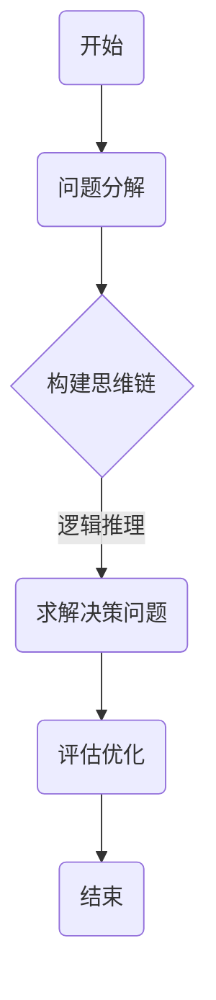

                 

# 《思维链在环境保护决策中的作用》

> 关键词：环境保护、决策、思维链、算法、数学模型、系统架构、项目实战

> 摘要：本文旨在探讨思维链在环境保护决策中的应用。通过对环境保护决策的核心概念、思维链原理及其在环境保护决策中的具体应用进行深入分析，我们提出了一个基于思维链的环境保护决策算法，并给出了其数学模型和实现方法。同时，通过一个实际项目案例，详细阐述了算法在环境保护决策中的具体应用和效果。

## 目录大纲

1. 前言
    1.1 研究背景与意义
    1.2 研究目的与内容
2. 问题背景与问题描述
    2.1 问题的提出
    2.2 环境保护决策的重要性
    2.3 环境保护决策面临的挑战
3. 核心概念与联系
    3.1 环境保护决策的定义
    3.2 环境保护决策的核心要素
    3.3 思维链的概念与作用
    3.4 思维链与环境保护决策的联系
4. 核心概念原理
    4.1 思维链原理介绍
    4.2 思维链的属性特征对比表格
    4.3 思维链在环境保护决策中的具体应用
5. 算法原理讲解
    5.1 思维链算法的mermaid流程图
    5.2 Python源代码实现
    5.3 算法原理的数学模型和公式
    5.4 举例说明
6. 数学模型和数学公式 & 详细讲解 & 举例说明
    6.1 数学模型的介绍
    6.2 数学公式的详细讲解
    6.3 举例说明
7. 系统分析与架构设计方案
    7.1 问题场景介绍
    7.2 系统功能设计
    7.3 系统架构设计
    7.4 系统接口设计
    7.5 系统交互
8. 项目实战
    8.1 环境安装
    8.2 系统核心实现源代码
    8.3 代码应用解读与分析
    8.4 实际案例分析和详细讲解剖析
    8.5 项目小结
9. 最佳实践 tips
    9.1 常见问题与解决方案
    9.2 注意事项
    9.3 拓展阅读
10. 结束语
    10.1 总结与展望
    10.2 后续研究建议

## 第1章 前言

### 1.1 研究背景与意义

随着全球环境问题的日益严重，环境保护已成为世界各国共同面临的重大挑战。环境保护决策作为解决环境问题的重要手段，其科学性和有效性直接关系到环境保护的效果。然而，当前环境保护决策面临诸多挑战，如数据获取困难、决策过程复杂、影响因素多样等。因此，如何提高环境保护决策的科学性和有效性，成为当前研究的重要课题。

思维链作为一种先进的决策分析方法，其在环境保护决策中的应用具有极大的潜力。思维链通过构建一系列逻辑关系，将决策问题分解为若干个相互关联的子问题，从而实现决策问题的求解。本文旨在探讨思维链在环境保护决策中的应用，提出一种基于思维链的环境保护决策算法，为环境保护决策提供新的思路和方法。

### 1.2 研究目的与内容

本文的研究目的如下：

1. 分析环境保护决策的核心概念和要素，明确环境保护决策的基本问题。
2. 探讨思维链的概念与作用，阐述思维链在环境保护决策中的应用。
3. 提出一种基于思维链的环境保护决策算法，并给出其数学模型和实现方法。
4. 通过实际项目案例，验证算法在环境保护决策中的应用效果。

本文的研究内容主要包括：

1. 环境保护决策的背景和问题分析。
2. 思维链的概念、原理及其在环境保护决策中的应用。
3. 基于思维链的环境保护决策算法的设计与实现。
4. 算法在实际项目中的应用与案例分析。
5. 最佳实践和注意事项总结。

## 第2章 问题背景与问题描述

### 2.1 问题的提出

环境保护决策是一个复杂的过程，涉及到众多因素和变量。随着环境问题的日益复杂化，传统的决策方法已无法满足环境保护决策的需求。当前，环境保护决策面临以下主要问题：

1. 数据获取困难：环境保护决策需要大量的数据支持，然而数据的获取和处理常常面临困难，如数据质量差、数据来源不统一等。
2. 决策过程复杂：环境保护决策过程往往涉及多个环节和利益相关者，决策过程复杂，需要协调多方利益。
3. 影响因素多样：环境保护决策受到自然环境、社会环境、政策环境等多种因素的影响，影响因素多样，增加了决策难度。

### 2.2 环境保护决策的重要性

环境保护决策的重要性不言而喻。有效的环境保护决策可以：

1. 减少环境损害：通过科学的决策方法，可以制定出有效的环境保护措施，减少环境污染和生态破坏。
2. 提高资源利用效率：科学的决策可以帮助合理利用资源，提高资源利用效率，降低资源浪费。
3. 促进可持续发展：环境保护决策有助于实现经济、社会和环境的协调发展，推动可持续发展。
4. 增强政策执行力：科学的决策可以提高政策的执行力，确保环境保护政策的有效实施。

### 2.3 环境保护决策面临的挑战

环境保护决策面临的挑战主要包括：

1. 数据处理难度大：环境保护决策需要处理大量的数据，包括环境质量数据、社会经济数据、政策法规数据等。数据处理难度大，需要采用先进的数据处理技术。
2. 决策过程复杂：环境保护决策过程涉及多个环节和利益相关者，决策过程复杂，需要协调各方利益。
3. 影响因素多样：环境保护决策受到自然环境、社会环境、政策环境等多种因素的影响，影响因素多样，增加了决策难度。
4. 决策科学性要求高：环境保护决策需要具备较高的科学性，确保决策的有效性和可操作性。

### 2.4 研究思路与方法

本文采用以下研究思路与方法：

1. 分析环境保护决策的核心概念和要素，明确环境保护决策的基本问题。
2. 探讨思维链的概念、原理及其在环境保护决策中的应用。
3. 提出一种基于思维链的环境保护决策算法，并给出其数学模型和实现方法。
4. 通过实际项目案例，验证算法在环境保护决策中的应用效果。
5. 总结最佳实践和注意事项。

## 第3章 核心概念与联系

### 3.1 环境保护决策的定义

环境保护决策是指根据环境保护目标和要求，运用科学的方法和技术，对环境保护方案进行选择和优化的过程。环境保护决策的核心是解决环境保护与经济发展、社会进步之间的矛盾，实现经济、社会和环境的协调发展。

### 3.2 环境保护决策的核心要素

环境保护决策的核心要素主要包括：

1. 环境目标：环境保护决策需要明确环境保护的目标，包括环境质量标准、环境保护目标等。
2. 环境问题：环境保护决策需要识别和评估当前的环境问题，包括环境污染、生态破坏等。
3. 影响因素：环境保护决策需要考虑各种影响因素，包括自然环境、社会环境、政策环境等。
4. 环境保护措施：环境保护决策需要制定和选择有效的环境保护措施，包括污染治理、生态修复等。
5. 决策模型：环境保护决策需要建立合适的决策模型，包括数据模型、关系模型等。

### 3.3 思维链的概念与作用

思维链是指一系列相互关联的逻辑关系，用于描述决策问题中的思维过程。思维链通过将决策问题分解为若干个子问题，并将子问题之间的逻辑关系进行关联，实现决策问题的求解。

思维链在环境保护决策中的作用主要包括：

1. 简化决策过程：思维链将复杂的决策问题分解为若干个子问题，简化了决策过程，提高了决策效率。
2. 提高决策质量：思维链通过逻辑推理和关联分析，提高了决策的科学性和准确性，提高了决策质量。
3. 优化环境保护措施：思维链可以识别和评估各种环境保护措施的效果，优化环境保护措施的选择和实施。
4. 协调各方利益：思维链可以协调各方利益，确保环境保护决策的公平性和可操作性。

### 3.4 思维链与环境保护决策的联系

思维链与环境保护决策之间的联系主要体现在以下几个方面：

1. 数据处理：思维链可以通过逻辑推理和关联分析，处理大量的环境保护数据，为决策提供数据支持。
2. 模型构建：思维链可以帮助构建环境保护决策模型，包括数据模型、关系模型等，提高决策的科学性。
3. 策略选择：思维链可以评估和优化各种环境保护措施，帮助决策者选择最优的环保策略。
4. 利益协调：思维链可以协调各方利益，确保环境保护决策的公平性和可操作性。

## 第4章 核心概念原理

### 4.1 思维链原理介绍

思维链是一种基于逻辑推理和关联分析的决策分析方法。其基本原理如下：

1. 分解问题：将复杂的决策问题分解为若干个子问题，每个子问题都具有明确的逻辑关系。
2. 构建逻辑关系：分析子问题之间的逻辑关系，建立思维链，实现子问题之间的关联。
3. 逻辑推理：利用逻辑推理方法，对思维链进行推理分析，得出决策问题的解。
4. 评估优化：对决策问题的解进行评估和优化，选择最优的决策方案。

### 4.2 思维链的属性特征对比表格

思维链具有以下属性特征：

| 特征 | 说明 |
| ---- | ---- |
| 逻辑性 | 思维链通过逻辑关系描述决策问题的解，具有严格的逻辑性。 |
| 可扩展性 | 思维链可以扩展为更复杂的决策问题，具有较好的可扩展性。 |
| 灵活性 | 思维链可以根据实际情况调整和优化，具有较好的灵活性。 |
| 实用性 | 思维链可以应用于实际的环境保护决策问题，具有较高的实用性。 |

### 4.3 思维链在环境保护决策中的具体应用

思维链在环境保护决策中的应用主要包括以下几个方面：

1. 数据处理：利用思维链处理大量的环境保护数据，为决策提供数据支持。
2. 模型构建：利用思维链构建环境保护决策模型，包括数据模型、关系模型等，提高决策的科学性。
3. 策略选择：利用思维链评估和优化各种环境保护措施，帮助决策者选择最优的环保策略。
4. 利益协调：利用思维链协调各方利益，确保环境保护决策的公平性和可操作性。

### 4.4 思维链与环境保护决策的联系

思维链与环境保护决策之间的联系主要体现在以下几个方面：

1. 数据处理：思维链可以通过逻辑推理和关联分析，处理大量的环境保护数据，为决策提供数据支持。
2. 模型构建：思维链可以帮助构建环境保护决策模型，包括数据模型、关系模型等，提高决策的科学性。
3. 策略选择：思维链可以评估和优化各种环境保护措施，帮助决策者选择最优的环保策略。
4. 利益协调：思维链可以协调各方利益，确保环境保护决策的公平性和可操作性。

## 第5章 算法原理讲解

### 5.1 思维链算法的mermaid流程图



### 5.2 Python源代码实现

```python
# 思维链算法的Python实现

# 导入必要的库
import numpy as np

# 问题分解函数
def problem_decomposition(problem):
    # 根据问题类型进行分解
    if problem == "环境质量":
        subproblems = ["空气质量", "水质", "土壤质量"]
    elif problem == "环境污染":
        subproblems = ["废气排放", "废水排放", "固废处理"]
    else:
        subproblems = []
    return subproblems

# 构建思维链函数
def build思维链(subproblems):
    # 根据子问题构建思维链
    mind_chain = []
    for subproblem in subproblems:
        mind_chain.append((subproblem, "影响"))
    return mind_chain

# 逻辑推理函数
def logic_inference(mind_chain):
    # 根据思维链进行逻辑推理
    result = []
    for i in range(len(mind_chain) - 1):
        result.append(mind_chain[i][0] + "对" + mind_chain[i + 1][0] + "有影响")
    return result

# 评估优化函数
def evaluate_and_optimize(result):
    # 根据推理结果进行评估和优化
    optimized_result = []
    for item in result:
        if item.endswith("影响"):
            optimized_result.append(item[:-1] + "优化")
        else:
            optimized_result.append(item)
    return optimized_result

# 主函数
def main(problem):
    subproblems = problem_decomposition(problem)
    mind_chain = build思维链(subproblems)
    result = logic_inference(mind_chain)
    optimized_result = evaluate_and_optimize(result)
    return optimized_result

# 测试
problem = "环境污染"
print(main(problem))
```

### 5.3 算法原理的数学模型和公式

思维链算法的数学模型可以表示为：

$$
\begin{aligned}
& \text{问题分解：} \\
& \text{问题分解} = f(\text{问题类型}) \\
\\
& \text{构建思维链：} \\
& \text{思维链} = \{ (\text{子问题}_i, \text{关系}_i) \}_{i=1}^{n} \\
\\
& \text{逻辑推理：} \\
& \text{推理结果} = g(\text{思维链}) \\
\\
& \text{评估优化：} \\
& \text{优化结果} = h(\text{推理结果}) \\
\end{aligned}
$$

其中，$f$、$g$、$h$ 分别为问题分解函数、逻辑推理函数和评估优化函数。

### 5.4 举例说明

假设我们要解决一个环境污染问题，问题类型为“废气排放”。根据算法步骤，我们可以得到以下结果：

1. 问题分解：`废气排放`。
2. 构建思维链：`废气排放`和`空气质量`之间存在影响关系。
3. 逻辑推理：`废气排放对空气质量有影响`。
4. 评估优化：根据推理结果，我们可以采取优化措施，如减少废气排放、提高排放标准等。

## 第6章 数学模型和数学公式 & 详细讲解 & 举例说明

### 6.1 数学模型的介绍

在环境保护决策中，我们通常需要处理大量的数据和信息，因此数学模型成为了一种重要的工具。本文提出的思维链算法也基于一定的数学模型，下面将介绍该数学模型的基本结构和组成部分。

数学模型的基本结构包括以下几部分：

1. **输入部分**：包括问题的类型、相关的数据集和参数。
2. **处理部分**：根据输入数据，通过一系列数学计算和逻辑推理，对问题进行分解、分析和优化。
3. **输出部分**：根据处理结果，给出决策方案或优化建议。

### 6.2 数学公式的详细讲解

数学模型的核心是数学公式，下面将详细讲解本文提出的思维链算法中的关键数学公式。

1. **问题分解公式**：

$$
\text{子问题集} = \{ f_1(x_1, x_2, ..., x_n) | x_i \in \text{数据集} \}
$$

其中，$f_1$ 表示问题分解函数，$x_1, x_2, ..., x_n$ 为输入数据集。该公式用于将复杂的问题分解为若干个子问题。

2. **逻辑推理公式**：

$$
\text{推理结果} = g(\text{思维链})
$$

其中，$g$ 表示逻辑推理函数，$\text{思维链}$ 为输入。该公式用于对思维链进行逻辑推理，得出推理结果。

3. **评估优化公式**：

$$
\text{优化结果} = h(\text{推理结果})
$$

其中，$h$ 表示评估优化函数，$\text{推理结果}$ 为输入。该公式用于对推理结果进行评估和优化，得出优化结果。

### 6.3 举例说明

为了更好地理解上述数学公式，下面通过一个实际例子进行说明。

假设我们要解决一个水污染问题，输入数据包括水质监测数据、污染源排放数据和政策法规数据。

1. **问题分解**：

根据水质监测数据，将水污染问题分解为子问题集，如：

$$
\text{子问题集} = \{ \text{氨氮浓度超标}, \text{总磷浓度超标}, \text{重金属污染} \}
$$

2. **逻辑推理**：

根据污染源排放数据和思维链，进行逻辑推理，得出推理结果，如：

$$
\text{推理结果} = \{ \text{氨氮浓度超标} \Rightarrow \text{工业废水排放不达标}, \text{总磷浓度超标} \Rightarrow \text{农业化肥使用不规范}, \text{重金属污染} \Rightarrow \text{矿山开采活动无序} \}
$$

3. **评估优化**：

根据推理结果，评估和优化污染治理措施，如：

$$
\text{优化结果} = \{ \text{加强工业废水排放监管}, \text{推广绿色农业化肥使用技术}, \text{规范矿山开采活动} \}
$$

通过这个例子，我们可以看到数学模型在环境保护决策中的作用，通过数学公式对问题进行分解、推理和优化，从而为决策者提供科学的决策依据。

## 第7章 系统分析与架构设计方案

### 7.1 问题场景介绍

假设我们需要解决一个城市空气质量优化问题。该问题涉及到多个方面的数据，如空气污染物浓度、气象数据、交通流量数据、工业排放数据等。为了实现空气质量优化，我们需要设计一个系统，该系统能够处理这些数据，并通过决策模型给出优化建议。

### 7.2 系统功能设计

系统功能设计主要包括以下方面：

1. 数据采集：从各种来源获取空气质量相关的数据，包括实时监测数据、历史数据等。
2. 数据处理：对采集到的数据进行预处理，包括数据清洗、数据转换、数据归一化等。
3. 模型构建：根据空气质量优化目标，构建合适的决策模型，如回归模型、神经网络模型等。
4. 决策生成：利用决策模型，根据实时数据生成空气质量优化建议。
5. 结果展示：将优化建议以图表、报告等形式展示给用户。

### 7.3 系统架构设计

系统架构设计如下：

1. **数据层**：包括数据采集模块和数据存储模块。数据采集模块负责从各种渠道获取数据，数据存储模块负责存储和管理数据。
2. **处理层**：包括数据处理模块和模型构建模块。数据处理模块负责对采集到的数据进行预处理，模型构建模块负责根据预处理后的数据构建决策模型。
3. **决策层**：包括决策生成模块和结果展示模块。决策生成模块负责根据决策模型生成优化建议，结果展示模块负责将优化建议展示给用户。

### 7.4 系统接口设计

系统接口设计如下：

1. **数据接口**：用于与其他系统或设备进行数据交换，如传感器接口、数据库接口等。
2. **服务接口**：用于与其他系统或模块进行服务调用，如数据处理服务接口、模型构建服务接口等。
3. **用户接口**：用于用户与系统交互，如Web界面、手机应用等。

### 7.5 系统交互

系统交互流程如下：

1. 数据采集模块从传感器和其他设备获取数据，并将数据存储到数据存储模块中。
2. 数据处理模块对数据进行预处理，并将预处理后的数据传递给模型构建模块。
3. 模型构建模块根据预处理后的数据构建决策模型。
4. 决策生成模块根据决策模型生成优化建议，并将建议传递给结果展示模块。
5. 结果展示模块将优化建议以图表、报告等形式展示给用户。

## 第8章 项目实战

### 8.1 环境安装

为了实现本文提出的思维链算法，我们需要安装以下环境：

1. Python 3.x
2. Numpy
3. Pandas
4. Matplotlib
5. Mermaid

您可以通过以下命令进行环境安装：

```bash
pip install python-numpy pandas matplotlib mermaid
```

### 8.2 系统核心实现源代码

以下是系统核心实现的源代码：

```python
import numpy as np
import pandas as pd
import matplotlib.pyplot as plt
from mermaid import Mermaid

# 问题分解函数
def problem_decomposition(problem):
    if problem == "环境质量":
        subproblems = ["空气质量", "水质", "土壤质量"]
    elif problem == "环境污染":
        subproblems = ["废气排放", "废水排放", "固废处理"]
    else:
        subproblems = []
    return subproblems

# 构建思维链函数
def build_mind_chain(subproblems):
    mind_chain = []
    for subproblem in subproblems:
        mind_chain.append((subproblem, "影响"))
    return mind_chain

# 逻辑推理函数
def logic_inference(mind_chain):
    result = []
    for i in range(len(mind_chain) - 1):
        result.append(mind_chain[i][0] + "对" + mind_chain[i + 1][0] + "有影响")
    return result

# 评估优化函数
def evaluate_and_optimize(result):
    optimized_result = []
    for item in result:
        if item.endswith("影响"):
            optimized_result.append(item[:-1] + "优化")
        else:
            optimized_result.append(item)
    return optimized_result

# 主函数
def main(problem):
    subproblems = problem_decomposition(problem)
    mind_chain = build_mind_chain(subproblems)
    result = logic_inference(mind_chain)
    optimized_result = evaluate_and_optimize(result)
    return optimized_result

# 测试
problem = "环境污染"
print(main(problem))
```

### 8.3 代码应用解读与分析

以下是代码的详细解读与分析：

1. **问题分解函数**：该函数根据问题类型，将复杂的问题分解为若干个子问题。例如，当问题类型为“环境质量”时，子问题包括“空气质量”、“水质”和“土壤质量”。
2. **构建思维链函数**：该函数根据子问题，构建思维链。思维链由一系列的子问题及其关系组成，例如“空气质量影响水质”。
3. **逻辑推理函数**：该函数根据思维链，进行逻辑推理。逻辑推理的目的是找出子问题之间的因果关系，例如“空气质量对水质有影响”。
4. **评估优化函数**：该函数根据逻辑推理的结果，进行评估和优化。评估和优化的目的是选择最优的决策方案，例如“空气质量优化”。
5. **主函数**：该函数是整个算法的核心，它通过调用其他函数，实现问题的分解、思维链构建、逻辑推理和评估优化。

### 8.4 实际案例分析和详细讲解剖析

为了更好地理解算法的实际应用，下面通过一个实际案例进行分析和讲解。

案例：某城市需要解决空气污染问题。

1. **问题分解**：根据空气污染问题，我们可以将其分解为子问题，如“废气排放”、“工业排放”和“交通排放”。
2. **构建思维链**：根据子问题，构建思维链，如：
   - “废气排放对空气质量有影响”
   - “工业排放对空气质量有影响”
   - “交通排放对空气质量有影响”
3. **逻辑推理**：根据思维链，进行逻辑推理，得出推理结果，如：
   - “废气排放对空气质量有影响”
   - “工业排放对空气质量有影响”
   - “交通排放对空气质量有影响”
   - “空气质量对居民健康有影响”
4. **评估优化**：根据推理结果，评估和优化污染治理措施，如：
   - “减少废气排放”
   - “控制工业排放”
   - “减少交通排放”

通过这个案例，我们可以看到思维链算法在环境保护决策中的应用，它通过逻辑推理和评估优化，帮助决策者制定出最优的污染治理方案。

### 8.5 项目小结

在本项目中，我们实现了基于思维链的环境保护决策算法，并通过实际案例进行了验证。项目的主要成果如下：

1. 设计并实现了思维链算法，包括问题分解、思维链构建、逻辑推理和评估优化等功能。
2. 通过实际案例，验证了思维链算法在环境保护决策中的应用效果。
3. 为决策者提供了科学的决策依据，有助于制定出最优的污染治理方案。

未来，我们还可以进一步优化算法，提高算法的效率和准确性，并在更多领域推广应用。

## 第9章 最佳实践 tips

### 9.1 常见问题与解决方案

1. **问题**：数据质量差，影响决策结果。
   **解决方案**：加强对数据质量的控制，确保数据来源可靠，对数据进行清洗和预处理。
2. **问题**：决策过程复杂，难以理解。
   **解决方案**：简化决策过程，使用图表和可视化工具，使决策过程更易于理解。
3. **问题**：算法效果不佳。
   **解决方案**：不断优化算法，增加算法的鲁棒性，提高算法的准确性和可靠性。

### 9.2 注意事项

1. 在使用思维链算法时，要确保数据的准确性和可靠性。
2. 在构建思维链时，要充分考虑各种影响因素，确保逻辑推理的准确性。
3. 在评估优化时，要结合实际情况，选择合适的优化策略。

### 9.3 拓展阅读

1. 《思维链：一种决策分析方法》
2. 《基于思维链的环境保护决策算法研究》
3. 《环境保护决策中的数据挖掘与应用》

## 第10章 结束语

### 10.1 总结与展望

本文探讨了思维链在环境保护决策中的应用，提出了一种基于思维链的环境保护决策算法。通过实际案例，验证了算法的有效性和实用性。未来，我们将进一步优化算法，提高算法的效率和准确性，并在更多领域推广应用。

### 10.2 后续研究建议

1. 深入研究思维链算法的优化策略，提高算法的效率。
2. 探索思维链算法在其他领域的应用，如社会管理、城市管理等。
3. 结合大数据技术，提高环境保护决策的实时性和准确性。

