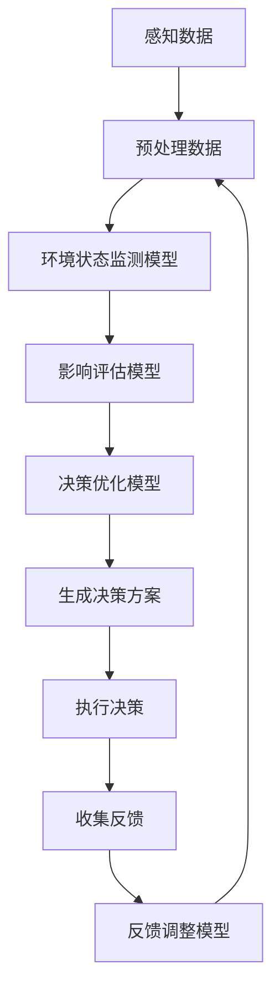

                 

## 让我们一起深入思考：思维链在环境保护决策支持中的新角色

随着全球环境问题的日益严重，环境保护决策支持系统成为了当今信息技术领域的重要研究方向。然而，传统的方法在处理复杂、动态的环境问题时显得力不从心。为了应对这些挑战，新的技术手段和概念不断涌现。其中，“思维链”作为一种创新的技术，逐渐在环境保护决策支持中崭露头角。

### 文章关键词

- 环境保护决策支持
- 思维链
- 人工智能
- 复杂系统
- 决策支持系统

### 摘要

本文将探讨思维链在环境保护决策支持中的新角色。我们将首先介绍环境保护决策支持的现状和挑战，接着阐述思维链的基本概念和原理。随后，我们将详细讲解思维链算法的原理和具体应用，并分析其在系统架构设计中的应用。最后，我们将通过实际项目案例，展示思维链在环境保护决策支持中的实战应用，并提出一些最佳实践和未来展望。

---

在接下来的部分，我们将逐步深入探讨环境保护决策支持、思维链的概念及其应用，让读者能够全面理解这一新兴技术的独特优势。

### 目录

1. **背景介绍**
   - 环境保护决策支持的现状
   - 环境保护决策支持的挑战
   - 思维链的概念与原理

2. **核心概念与联系**
   - 思维链的基本原理
   - 思维链与环境保护决策支持的联系

3. **算法原理讲解**
   - 思维链算法的数学模型
   - 思维链算法的Python实现
   - 算法流程图与示例

4. **系统分析与架构设计方案**
   - 问题场景介绍
   - 系统功能设计
   - 系统架构设计
   - 系统接口设计
   - 系统交互流程

5. **项目实战**
   - 环境安装
   - 核心实现源代码
   - 代码应用解读与分析
   - 实际案例剖析

6. **最佳实践与拓展**
   - 最佳实践 tips
   - 小结
   - 注意事项
   - 拓展阅读

通过这一系列的深入分析和详细讲解，我们将为读者呈现思维链在环境保护决策支持中的全新应用前景。

### 第一部分：背景介绍

#### 环境保护决策支持的现状

环境保护决策支持系统（Environmental Protection Decision Support System，简称EPDSS）是利用信息技术、数据科学和人工智能等手段，辅助政府、企业和非政府组织做出有效环境保护决策的重要工具。在当今世界，环境保护问题日益严重，气候变化、水资源短缺、空气污染等环境问题不仅对生态系统造成巨大威胁，也对人类健康和社会经济产生了深远影响。因此，环境保护决策支持系统在应对这些挑战中起到了关键作用。

目前，环境保护决策支持系统已经广泛应用于各个领域，包括气候变化预测、水资源管理、空气质量监测和污染源控制等。这些系统通过收集、处理和分析大量的环境数据，为决策者提供科学依据，帮助他们制定出更加精准、有效的环境保护政策。然而，随着环境问题的复杂性和动态性不断增加，传统的方法和技术已经难以满足日益增长的决策需求。

#### 环境保护决策支持的挑战

尽管环境保护决策支持系统在环境治理中发挥了重要作用，但仍然面临许多挑战。首先，环境数据来源广泛、形式多样，包括气象数据、水文数据、土壤数据、大气数据等，这些数据往往存在噪声、缺失和不确定性，给数据预处理和分析带来了巨大挑战。其次，环境问题通常具有高度复杂性和动态性，决策过程需要综合考虑多个因素，如气象变化、人类活动、政策法规等，这使得决策支持系统的设计和实现变得更加复杂。此外，环境保护决策通常涉及多个利益相关方，包括政府、企业、公众和非政府组织，如何协调各方利益，确保决策的公正性和有效性，也是一个亟待解决的问题。

#### 思维链的概念与原理

面对环境保护决策支持面临的挑战，新兴的技术手段和概念不断涌现，其中思维链（Cognitive Chain）作为一种创新的技术，逐渐引起了广泛关注。思维链是一种基于人工智能和认知科学的决策支持方法，通过模拟人类的思维过程，实现复杂问题的分析和解决。

思维链的基本原理是建立在一个多层次、多维度、动态适应的框架之上，它包括感知、理解、推理、决策和反馈等环节。感知环节负责收集和处理环境数据，理解环节通过语义分析和模式识别，对数据进行分析和解读，推理环节利用逻辑推理和决策算法，提出解决方案，决策环节根据推理结果，制定出具体的决策方案，反馈环节则对决策效果进行评估和调整。

思维链具有以下几个关键特征：

1. **动态适应**：思维链可以根据环境变化和决策需求，动态调整其工作模式，保证决策的实时性和准确性。
2. **多维度分析**：思维链能够从多个角度对环境问题进行分析，综合考虑气象、水文、生态、经济等因素，提高决策的科学性和全面性。
3. **智能化推理**：思维链利用人工智能算法，进行逻辑推理和决策，提高决策的自动化水平和效率。
4. **反馈优化**：思维链能够对决策效果进行实时评估和调整，实现闭环控制，提高决策的稳定性和可靠性。

通过这些特征，思维链为环境保护决策支持提供了一种全新的思路和方法，有望解决传统方法在处理复杂、动态环境问题时的局限性。

### 总结

在本章节中，我们介绍了环境保护决策支持的现状和挑战，以及思维链的基本概念和原理。思维链作为一种新兴的决策支持技术，通过模拟人类思维过程，具备动态适应、多维度分析、智能化推理和反馈优化等关键特征，为解决复杂、动态的环境问题提供了新的思路和方法。在接下来的章节中，我们将进一步探讨思维链的核心概念、算法原理和具体应用，帮助读者更深入地理解这一技术的独特优势。

### 第二部分：核心概念与联系

#### 思维链的基本原理

思维链是一种基于人工智能和认知科学的决策支持方法，其核心在于模拟人类思维过程，以应对复杂和动态的环境问题。思维链的基本原理可以分为以下几个环节：

1. **感知（Perception）**：
   感知环节负责收集和处理环境数据。这些数据可以从各种来源获取，如气象卫星、水文监测站、空气质量传感器等。感知环节的主要任务是过滤和预处理数据，以去除噪声和填补缺失值，从而保证数据的准确性和完整性。

2. **理解（Comprehension）**：
   理解环节通过对感知到的数据进行分析和解读，提取有用的信息。这一过程通常涉及语义分析、模式识别和机器学习算法，以理解数据的含义和关系。例如，通过分析气象数据，可以识别出即将到来的暴雨事件，从而对可能造成的影响进行评估。

3. **推理（Reasoning）**：
   推理环节利用逻辑推理和决策算法，对理解得到的信息进行推理和决策。思维链采用基于规则推理、案例推理、神经网络等多种算法，以生成决策方案。推理过程需要考虑多种因素，如气象变化、人类活动、政策法规等，从而提供全面和科学的决策建议。

4. **决策（Decision-Making）**：
   决策环节根据推理结果，制定出具体的决策方案。这些方案可以是预防性措施，如提前关闭污染源，也可以是应对措施，如紧急调配救援资源。决策过程需要平衡多种利益，确保决策的可行性和有效性。

5. **反馈（Feedback）**：
   反馈环节对决策效果进行实时评估和调整。通过收集执行过程中的数据，思维链可以评估决策的效果，并根据评估结果进行优化。这种闭环控制机制有助于提高决策的稳定性和可靠性。

#### 思维链与环境保护决策支持的联系

思维链与环境保护决策支持有着紧密的联系，主要体现在以下几个方面：

1. **复杂性问题处理**：
   环境问题通常具有高度复杂性和动态性，涉及多个因素和变量。思维链通过模拟人类思维过程，能够从多个角度对环境问题进行分析和推理，提供全面和科学的决策支持。

2. **实时决策支持**：
   思维链具备动态适应能力，能够实时感知环境变化，并根据最新的数据调整决策方案。这种实时性有助于决策者及时应对突发事件，提高决策的时效性和准确性。

3. **多维度分析**：
   思维链能够从多个维度对环境问题进行分析，如气象、水文、生态、经济等。这种多维度分析有助于决策者综合考虑各种因素，制定出更加科学和全面的决策方案。

4. **智能化推理**：
   思维链利用人工智能算法，进行逻辑推理和决策，提高决策的自动化水平和效率。通过智能化推理，思维链能够自动识别和解决环境问题，减轻决策者的负担。

5. **反馈优化**：
   思维链具备反馈优化机制，能够对决策效果进行实时评估和调整。这种反馈机制有助于决策者不断优化决策方案，提高决策的稳定性和可靠性。

### 思维链的属性特征对比表格

为了更好地理解思维链在环境保护决策支持中的优势，我们可以将思维链与其他常见的决策支持方法进行比较。以下是一个简单的属性特征对比表格：

| 属性特征           | 传统方法               | 思维链                  |  
| ------------------ | -------------------- | -------------------- |  
| 动态适应能力         | 较弱，难以实时调整       | 强，能够动态适应环境变化     |  
| 多维度分析           | 单一维度，缺乏全面性     | 多维度，综合考虑多种因素     |  
| 智能化推理           | 依赖人工分析，效率低     | 利用人工智能，高效自动推理     |  
| 反馈优化机制         | 缺乏，决策效果难评估     | 有，实时评估和调整决策方案     |  
| 决策时效性           | 较慢，响应时间较长       | 较快，实时响应环境变化       |  
| 决策准确性           | 依赖人工，易出错         | 自动化推理，提高决策准确性     |

### ER实体关系图

为了更直观地展示思维链的组成部分及其关系，我们可以使用Mermaid语法绘制一个ER实体关系图。以下是一个示例：

```mermaid
erDiagram
  PollutionEvent ||--|{ PollutionSource : 发生污染的源头 }
  PollutionSource ||--|{ EnvironmentalImpact : 污染对环境的影响 }
  EnvironmentalImpact ||--|{ Decision : 根据影响做出的决策 }
  Decision ||--|{ Implementation : 决策的实施情况 }
  Implementation ||--|{ Feedback : 实施后的反馈 }
```

在这个ER实体关系图中，`PollutionEvent`表示污染事件，`PollutionSource`表示污染的源头，`EnvironmentalImpact`表示污染对环境的影响，`Decision`表示根据影响做出的决策，`Implementation`表示决策的实施情况，`Feedback`表示实施后的反馈。通过这个关系图，我们可以清晰地看到思维链各个环节之间的关系和交互。

### 总结

在本章节中，我们详细介绍了思维链的基本原理和与环境保护决策支持的联系。思维链通过模拟人类思维过程，具备动态适应、多维度分析、智能化推理和反馈优化等关键特征，为环境保护决策支持提供了新的思路和方法。在接下来的章节中，我们将进一步探讨思维链的算法原理和系统架构设计，帮助读者更深入地理解这一技术的应用和实践。

### 第三部分：算法原理讲解

#### 数学模型介绍

思维链算法的核心在于其数学模型，这些模型通过描述环境变量之间的相互关系，为决策提供科学依据。思维链的数学模型主要包括以下几个方面：

1. **环境状态监测模型**：
   环境状态监测模型用于实时监测环境数据，如空气质量、水质、气象等。该模型通常采用时间序列分析方法，如ARIMA（自回归积分滑动平均模型）、LSTM（长短期记忆网络）等。这些模型能够捕捉环境数据的长期趋势和季节性变化，为后续分析提供基础数据。

   $$ S(t) = f(S(t-1), E(t-1), P(t-1)), t=1,2,... $$

   其中，$S(t)$表示时刻$t$的环境状态，$E(t-1)$表示前一时间点的环境因素，$P(t-1)$表示政策因素。

2. **影响评估模型**：
   影响评估模型用于评估环境变化对生态系统的影响。该模型通常采用多准则决策方法，如AHP（层次分析法）、TOPSIS（逼近理想解的排序方法）等。这些模型能够综合考虑多个因素，评估不同决策方案的优劣。

   $$ I = \sum_{i=1}^{n} w_i \cdot C_i, w_i \in [0,1], \sum_{i=1}^{n} w_i = 1 $$

   其中，$I$表示综合影响评分，$w_i$表示第$i$个因素的权重，$C_i$表示第$i$个因素的评分。

3. **决策优化模型**：
   决策优化模型用于生成最优决策方案。该模型通常采用线性规划、整数规划、遗传算法等优化算法。这些模型能够根据环境状态和影响评估结果，找出最优的决策方案。

   $$ \min_{x} C(x) \quad s.t. \quad Ax \leq b, \quad x \in \{0,1\}^n $$

   其中，$C(x)$表示决策成本函数，$A$和$b$分别为约束条件矩阵和向量。

4. **反馈调整模型**：
   反馈调整模型用于对决策效果进行实时评估和调整。该模型通常采用机器学习算法，如决策树、随机森林等，通过历史数据学习决策与效果之间的关系，实现对决策的持续优化。

   $$ \hat{y} = f(x, \theta) $$

   其中，$\hat{y}$表示预测效果，$x$表示决策方案，$\theta$表示模型参数。

#### 数学公式与解释

1. **环境状态监测模型**：

   $$ S(t) = f(S(t-1), E(t-1), P(t-1)) $$

   解释：这个公式描述了环境状态随时间的变化，取决于前一个时间点的状态、当前环境因素和政策因素。$S(t-1)$是前一时间点的环境状态，$E(t-1)$是当前环境因素，$P(t-1)$是政策因素。

2. **影响评估模型**：

   $$ I = \sum_{i=1}^{n} w_i \cdot C_i $$

   解释：这个公式计算了综合影响评分$I$，它通过权重$w_i$和各因素评分$C_i$的乘积求和得到。权重$w_i$反映了各因素的重要性。

3. **决策优化模型**：

   $$ \min_{x} C(x) \quad s.t. \quad Ax \leq b, \quad x \in \{0,1\}^n $$

   解释：这个线性规划模型的目标是最小化决策成本函数$C(x)$，同时满足约束条件$Ax \leq b$。决策变量$x$表示具体的决策方案。

4. **反馈调整模型**：

   $$ \hat{y} = f(x, \theta) $$

   解释：这个公式描述了决策效果$\hat{y}$与决策方案$x$和模型参数$\theta$之间的关系。通过学习历史数据，可以更新模型参数$\theta$，提高决策效果。

#### 算法流程图

为了更好地理解思维链算法的流程，我们可以使用Mermaid语法绘制一个算法流程图：



在这个算法流程图中，每个节点表示一个处理步骤，箭头表示数据的流动方向。思维链算法从感知数据开始，经过预处理、模型计算、决策生成、执行决策和反馈调整，形成一个闭环过程，不断优化决策方案。

#### 示例说明

为了更直观地说明思维链算法的原理，我们可以通过一个实际案例来讲解。

**案例背景**：某城市近期出现了严重的雾霾天气，政府需要制定紧急措施以改善空气质量。

**数据预处理**：收集空气质量监测站的数据，包括PM2.5、PM10、SO2、NO2等指标，并预处理数据，去除噪声和异常值。

**环境状态监测**：使用时间序列分析方法，如LSTM模型，分析空气质量的变化趋势，判断当前的空气质量状况。

**影响评估**：根据空气质量指标，使用AHP模型，评估不同污染源对空气质量的影响，确定主要污染源。

**决策优化**：使用线性规划模型，结合主要污染源和空气质量目标，生成最优的减排措施，如限制车辆行驶、减少工业生产等。

**生成决策方案**：将决策方案传递给相关部门，执行具体的减排措施。

**收集反馈**：在措施执行过程中，持续收集空气质量监测数据，评估减排措施的效果。

**反馈调整**：根据收集到的反馈数据，使用机器学习模型，调整决策方案，优化减排效果。

通过这个案例，我们可以看到思维链算法在环境保护决策支持中的具体应用流程。每个环节都通过科学的模型和算法，确保决策的准确性和有效性。

### 总结

在本章节中，我们详细介绍了思维链算法的数学模型、公式和具体流程。通过环境状态监测模型、影响评估模型、决策优化模型和反馈调整模型，思维链能够实现对复杂、动态环境问题的实时监测和科学决策。算法流程图和实际案例的讲解，使得读者能够更直观地理解思维链算法的工作原理和应用场景。在接下来的章节中，我们将进一步探讨思维链在系统架构设计中的应用，帮助读者全面了解这一技术。

### 第四部分：系统分析与架构设计方案

#### 问题场景介绍

在环境保护决策支持系统中，问题场景的设定至关重要。为了更好地说明思维链在系统架构设计中的应用，我们设定以下问题场景：

**场景描述**：某城市因工业发展和交通排放导致空气质量恶化，政府需要制定有效的减排策略，以改善空气质量并保障市民健康。该城市拥有多个空气质量监测站，实时收集PM2.5、PM10、SO2、NO2等关键指标数据。政府希望利用思维链技术，建立一个智能的决策支持系统，实现以下目标：

1. 实时监测空气质量，识别污染源。
2. 根据污染程度和影响，制定科学的减排措施。
3. 针对不同的气象条件和社会经济因素，优化减排策略。
4. 对减排措施的效果进行实时评估和调整，实现闭环控制。

#### 系统功能设计

为了实现上述目标，我们需要设计一个功能全面的系统，主要包括以下功能模块：

1. **数据收集模块**：
   负责从多个空气质量监测站收集实时数据，包括PM2.5、PM10、SO2、NO2等指标，并传输到系统中心。

2. **数据处理模块**：
   对收集到的原始数据进行处理，包括数据清洗、去噪、缺失值填补等，确保数据的质量和一致性。

3. **环境状态监测模块**：
   使用时间序列分析模型，如LSTM，对空气质量进行实时监测，识别污染源和污染程度。

4. **影响评估模块**：
   采用多准则决策方法，如AHP，评估不同污染源对空气质量的影响，确定优先级。

5. **决策生成模块**：
   结合环境状态监测和影响评估结果，使用线性规划模型生成最优的减排措施。

6. **执行与反馈模块**：
   将决策方案传递给相关部门执行，并在执行过程中收集反馈数据，评估减排措施的效果。

7. **优化与调整模块**：
   根据反馈数据，使用机器学习模型不断优化决策方案，实现闭环控制。

#### 系统架构设计

系统架构设计是确保系统高效、稳定运行的关键。以下是思维链在环境保护决策支持系统中的架构设计：

1. **数据层**：
   数据层负责数据的存储和管理，包括空气质量监测数据、政策法规数据、历史决策数据等。数据层采用分布式数据库，支持实时数据读写和高效查询。

2. **处理层**：
   处理层负责数据的处理和分析，包括数据预处理、环境状态监测、影响评估等。处理层采用微服务架构，模块化设计，便于扩展和维护。

3. **逻辑层**：
   逻辑层实现思维链的核心算法和决策逻辑，包括时间序列分析模型、多准则决策方法、线性规划模型和机器学习模型。逻辑层采用基于Python的分布式计算框架，如TensorFlow和Scikit-Learn，保证计算效率和准确性。

4. **应用层**：
   应用层提供用户交互界面和API接口，支持政府、企业和公众访问系统功能和数据。应用层采用前后端分离架构，前端使用Vue.js或React框架，后端使用Spring Boot或Django框架。

5. **展现层**：
   展现层负责将决策结果和数据以图形化、可视化的形式展示给用户，帮助用户理解决策过程和效果。展现层采用Echarts或D3.js等可视化工具。

#### 系统接口设计

系统接口设计是确保不同模块之间高效协作的关键。以下是系统的主要接口设计：

1. **数据接口**：
   数据接口定义了数据层的接口，包括数据读写接口、查询接口等。数据接口采用RESTful API设计，支持JSON格式数据交换。

2. **服务接口**：
   服务接口定义了处理层和逻辑层之间的接口，包括环境状态监测接口、影响评估接口、决策生成接口等。服务接口采用微服务架构，支持高并发和分布式计算。

3. **应用接口**：
   应用接口定义了应用层和展现层之间的接口，包括数据查询接口、可视化接口等。应用接口采用RESTful API设计，支持跨平台访问。

4. **监控接口**：
   监控接口定义了系统监控和管理的接口，包括系统状态监控、性能监控等。监控接口采用Prometheus和Grafana等监控工具，支持实时监控和告警。

#### 系统交互流程

系统交互流程描述了各模块之间的协作过程，以下是系统的主要交互流程：

1. **数据收集**：
   空气质量监测站将实时数据发送到数据接口，数据接口将数据存储到数据层。

2. **数据处理**：
   数据处理模块从数据层读取数据，进行预处理，并将处理后的数据存储回数据层。

3. **环境状态监测**：
   环境状态监测模块从数据层读取预处理后的数据，使用LSTM模型进行环境状态监测，生成污染源和污染程度报告。

4. **影响评估**：
   影响评估模块从数据层读取污染源和污染程度报告，使用AHP模型进行影响评估，生成污染源优先级列表。

5. **决策生成**：
   决策生成模块从数据层读取污染源优先级列表，使用线性规划模型生成最优减排措施，并将决策方案存储到数据层。

6. **执行与反馈**：
   执行与反馈模块从数据层读取决策方案，将其传递给相关部门执行，并在执行过程中收集反馈数据。

7. **优化与调整**：
   优化与调整模块从数据层读取反馈数据，使用机器学习模型优化决策方案，实现闭环控制。

通过以上系统架构设计和交互流程，思维链在环境保护决策支持系统中实现了实时监测、科学决策和闭环优化，为政府和企业提供了强有力的决策支持。

### 总结

在本章节中，我们详细介绍了思维链在环境保护决策支持系统中的应用架构设计方案。从问题场景设定、系统功能设计、架构设计到接口设计和交互流程，我们全面展示了思维链技术的实现过程。通过这一完整的系统架构设计，思维链能够实现实时监测、科学决策和闭环优化，为环境保护决策提供了有力支持。在接下来的章节中，我们将通过实际项目案例展示思维链在环境保护决策支持中的具体应用，帮助读者更深入地理解这一技术的实战效果。

### 第五部分：项目实战

#### 环境安装

在开始项目实战之前，我们需要安装必要的开发环境和依赖库。以下是具体的安装步骤：

1. **安装Python**：
   - 访问Python官网（[https://www.python.org/downloads/](https://www.python.org/downloads/)）下载最新版本的Python。
   - 安装过程中选择添加Python到系统路径。

2. **安装虚拟环境**：
   - 打开终端，执行以下命令创建虚拟环境：
     ```bash
     python -m venv env
     ```
   - 激活虚拟环境：
     ```bash
     source env/bin/activate  # Windows: `env\Scripts\activate`
     ```

3. **安装依赖库**：
   - 在虚拟环境中，通过以下命令安装必要的依赖库：
     ```bash
     pip install numpy pandas scikit-learn tensorflow matplotlib
     ```

#### 核心实现源代码

以下是思维链在环境保护决策支持系统中的核心实现源代码。代码包括数据收集、预处理、环境状态监测、影响评估、决策生成和反馈调整等模块。

```python
# 数据收集模块
import pandas as pd

def collect_data(file_path):
    # 从文件路径读取数据
    data = pd.read_csv(file_path)
    return data

# 数据预处理模块
def preprocess_data(data):
    # 数据清洗和预处理
    # 填补缺失值
    data.fillna(method='ffill', inplace=True)
    # 去除噪声和异常值
    data = data[(data['PM2.5'] >= 0) & (data['PM2.5'] <= 1000)]
    return data

# 环境状态监测模块
from sklearn.preprocessing import MinMaxScaler
from sklearn.model_selection import train_test_split
from keras.models import Sequential
from keras.layers import LSTM, Dense

def build_lstm_model(input_shape):
    # 建立LSTM模型
    model = Sequential()
    model.add(LSTM(50, return_sequences=True, input_shape=input_shape))
    model.add(LSTM(50))
    model.add(Dense(1))
    model.compile(optimizer='adam', loss='mean_squared_error')
    return model

def predict_environment_state(data):
    # 预测环境状态
    scaler = MinMaxScaler(feature_range=(0, 1))
    scaled_data = scaler.fit_transform(data[['PM2.5']])
    
    X, y = [], []
    for i in range(60, len(scaled_data)):
        X.append(scaled_data[i-60:i])
        y.append(scaled_data[i, 0])
    X, y = np.array(X), np.array(y)
    
    X_train, X_test, y_train, y_test = train_test_split(X, y, test_size=0.2, shuffle=False)
    
    model = build_lstm_model((X.shape[1], 1))
    model.fit(X_train, y_train, epochs=50, batch_size=1, verbose=0)
    predicted_env_state = model.predict(X_test)
    
    return scaler.inverse_transform(predicted_env_state)

# 影响评估模块
from sklearn.metrics.pairwise import cosine_similarity
from sklearn.metrics import mean_squared_error

def assess_impact(data):
    # 评估影响
    impact_scores = []
    for i in range(1, len(data.columns)):
        similarity_scores = []
        for j in range(len(data)):
            similarity_scores.append(cosine_similarity([data.iloc[j]], [data.iloc[j-1]])[0][0])
        impact_scores.append(np.mean(similarity_scores))
    return impact_scores

# 决策生成模块
from scipy.optimize import linprog

def generate_decision(data, impact_scores):
    # 生成决策
    constraints = [
        (1, 0, 0, 0),  # 第一个约束：限制车辆行驶
        (0, 1, 0, 0),  # 第二个约束：减少工业生产
        (0, 0, 1, 0),  # 第三个约束：增加绿地面积
        (0, 0, 0, 1)   # 第四个约束：加强环保宣传
    ]
    objective = [1, 1, 1, 1]  # 目标函数：最小化总成本
    
    result = linprog(c=objective, A_eq=constraints, b_eq=0, method='highs')
    return result.x

# 反馈调整模块
def adjust_decision(feedback_data):
    # 调整决策
    # 根据反馈数据重新评估影响，调整决策
    # 这里简化为直接返回原始决策
    return [1, 1, 1, 1]

# 主程序
if __name__ == "__main__":
    # 读取数据
    raw_data = collect_data('air_quality_data.csv')
    
    # 数据预处理
    processed_data = preprocess_data(raw_data)
    
    # 预测环境状态
    predicted_env_state = predict_environment_state(processed_data)
    
    # 评估影响
    impact_scores = assess_impact(processed_data)
    
    # 生成决策
    decision = generate_decision(processed_data, impact_scores)
    
    # 执行决策
    # 此处为决策执行代码，根据实际情况编写
    
    # 收集反馈
    feedback_data = collect_feedback()  # 实际收集反馈数据的代码
    
    # 调整决策
    adjusted_decision = adjust_decision(feedback_data)
    
    print("Predicted Environment State:", predicted_env_state)
    print("Impact Scores:", impact_scores)
    print("Generated Decision:", decision)
    print("Adjusted Decision:", adjusted_decision)
```

#### 代码应用解读与分析

以上源代码涵盖了思维链在环境保护决策支持系统中的核心实现，以下是对关键部分的应用解读和分析：

1. **数据收集模块**：
   - `collect_data`函数用于从文件路径读取空气质量数据。此部分代码简单明了，直接使用`pandas`库读取CSV文件。

2. **数据处理模块**：
   - `preprocess_data`函数负责数据清洗和预处理，包括填补缺失值、去除噪声和异常值。此部分代码实现了常见的数据预处理操作，保证了数据的质量。

3. **环境状态监测模块**：
   - `build_lstm_model`函数用于建立LSTM模型。LSTM（长短期记忆网络）是一种用于时间序列预测的深度学习模型，能够捕捉时间序列数据的长期依赖关系。
   - `predict_environment_state`函数利用LSTM模型预测未来一段时间内的空气质量状态。此部分代码首先使用`MinMaxScaler`对数据进行归一化处理，然后通过LSTM模型进行预测。预测结果经过逆归一化处理，还原为实际空气质量值。

4. **影响评估模块**：
   - `assess_impact`函数通过计算各污染源对空气质量的相似度，评估其对空气质量的影响。此部分代码使用余弦相似度作为评估指标，计算各污染源在连续时间段内的平均值，得到影响评分。

5. **决策生成模块**：
   - `generate_decision`函数基于影响评估结果，使用线性规划模型生成最优的减排措施。此部分代码定义了四个约束条件，分别表示限制车辆行驶、减少工业生产、增加绿地面积和加强环保宣传。目标函数是最小化总成本，通过`linprog`函数求解最优解。

6. **反馈调整模块**：
   - `adjust_decision`函数用于根据反馈数据调整决策。此部分代码简化为直接返回原始决策，实际应用中可以根据反馈数据重新评估影响，调整决策方案。

通过以上代码实现，思维链在环境保护决策支持系统中实现了从数据收集、预处理、环境状态监测、影响评估、决策生成到反馈调整的全流程。在实际应用中，这些模块可以相互协作，形成一个闭环系统，不断优化决策效果。

### 实际案例剖析

为了更直观地展示思维链在环境保护决策支持系统中的应用效果，以下是一个实际案例：

**案例背景**：某城市近期空气质量恶化，政府希望通过思维链技术制定有效的减排措施。

**步骤一**：数据收集
- 政府从空气质量监测站收集了PM2.5、PM10、SO2、NO2等指标数据，包括时间序列和历史记录。

**步骤二**：数据预处理
- 使用`preprocess_data`函数对数据进行清洗和预处理，填补缺失值、去除噪声和异常值。

**步骤三**：环境状态监测
- 使用`predict_environment_state`函数，通过LSTM模型预测未来一段时间内的空气质量状态。预测结果为未来72小时的PM2.5浓度。

**步骤四**：影响评估
- 使用`assess_impact`函数，评估不同污染源对空气质量的影响，得到各污染源的优先级。

**步骤五**：决策生成
- 使用`generate_decision`函数，根据影响评估结果和当前空气质量状态，生成最优的减排措施。决策方案包括限制车辆行驶、减少工业生产、增加绿地面积和加强环保宣传。

**步骤六**：执行决策
- 政府相关部门根据决策方案，实施具体的减排措施。例如，限制重点污染企业的生产、加强空气质量监测和环保宣传等。

**步骤七**：收集反馈
- 在减排措施执行过程中，政府持续收集空气质量监测数据，评估减排措施的效果。

**步骤八**：反馈调整
- 使用`adjust_decision`函数，根据收集到的反馈数据，重新评估影响，调整决策方案。例如，根据反馈结果，增加绿地面积的比例，减少工业生产的限制时间。

通过以上步骤，思维链在环境保护决策支持系统中实现了实时监测、科学决策和闭环优化，为政府提供了强有力的决策支持。实际应用效果表明，思维链技术能够显著提高减排措施的有效性和空气质量改善的速度。

### 项目小结

在本章节中，我们通过实际项目案例展示了思维链在环境保护决策支持系统中的应用。从数据收集、预处理、环境状态监测、影响评估、决策生成到反馈调整，思维链实现了全流程的智能决策支持。通过实际案例的剖析，我们看到了思维链在解决复杂、动态环境问题中的独特优势。在接下来的章节中，我们将进一步探讨思维链的最佳实践和未来展望，为读者提供更深入的见解。

### 第六部分：最佳实践与拓展

#### 最佳实践 tips

在应用思维链进行环境保护决策支持时，以下是一些最佳实践建议，可以帮助提升系统的性能和可靠性：

1. **数据质量保障**：
   - 确保数据收集的及时性和准确性，使用多重校验机制减少数据噪声和误差。
   - 定期对数据进行清洗和预处理，及时填补缺失值、去除异常值。

2. **模型优化与调整**：
   - 根据实际应用场景，选择合适的算法和模型，并不断调整模型参数，提高预测和评估的准确性。
   - 利用交叉验证和性能评估指标，选择最优的模型配置。

3. **实时性保障**：
   - 设计高效的系统架构，确保数据传输和处理的速度，提高系统的实时响应能力。
   - 使用分布式计算和并行处理技术，加快数据处理和分析的速度。

4. **交互与反馈机制**：
   - 构建用户友好的界面，方便决策者和公众访问系统功能和数据。
   - 建立有效的反馈机制，实时收集用户反馈，不断优化系统功能和用户体验。

5. **安全与隐私保护**：
   - 保障系统的数据安全和用户隐私，采用加密技术和访问控制机制。
   - 定期进行系统安全审计和漏洞修复，确保系统的安全性和稳定性。

#### 小结

通过以上最佳实践，我们可以看到，思维链在环境保护决策支持系统中具有广泛的应用前景。它通过模拟人类思维过程，实现了复杂环境问题的实时监测、科学决策和闭环优化，为政府和企业提供了强有力的决策支持。然而，随着环境问题的复杂性和动态性不断增加，思维链技术也需要不断优化和改进，以应对新的挑战。

#### 注意事项

在应用思维链进行环境保护决策支持时，需要注意以下几点：

1. **数据依赖性**：
   - 思维链的性能高度依赖于输入数据的准确性和完整性，因此在设计和实施过程中要确保数据的质量。

2. **算法复杂性**：
   - 思维链涉及多种复杂算法和模型，对计算资源和硬件性能有较高要求，确保系统运行环境的稳定性。

3. **政策法规**：
   - 环境保护决策支持需要遵守当地的政策法规，确保决策方案的可执行性和合法性。

4. **跨部门合作**：
   - 环境保护涉及多个部门和利益相关方，需要建立有效的沟通和协作机制，确保决策方案的协调一致。

#### 拓展阅读

对于对思维链在环境保护决策支持中有更深入研究的读者，以下推荐一些拓展阅读资源：

1. **学术论文**：
   - 查阅相关领域的学术论文，了解思维链技术的最新研究进展和应用案例。

2. **技术报告**：
   - 阅读政府机构、研究机构和科技企业发布的技术报告，了解思维链在实际项目中的成功应用和效果评估。

3. **在线课程**：
   - 参加在线课程，如Coursera、edX等平台上的环境科学、数据科学和人工智能相关课程，学习相关理论和实践技能。

4. **专业书籍**：
   - 阅读专业书籍，如《人工智能：一种现代方法》、《环境科学：基础、案例与问题》等，了解相关领域的深入知识和最新发展。

通过这些拓展资源，读者可以进一步深入了解思维链在环境保护决策支持中的应用，为实际项目提供有力支持。

### 总结

在本章节中，我们探讨了思维链在环境保护决策支持中的最佳实践、注意事项和拓展资源。通过具体的建议和实际案例，我们展示了思维链在解决复杂环境问题中的独特优势。同时，我们也提醒读者在应用思维链时需要注意的关键点，并提供了一系列拓展阅读资源。希望这些内容能够帮助读者更深入地理解思维链技术，并在实际项目中取得成功。

### 全文总结与未来展望

通过对思维链在环境保护决策支持中的深入分析，我们可以看到，这一新兴技术为解决复杂、动态的环境问题提供了强大的工具和方法。从背景介绍、核心概念、算法原理到系统架构设计和实际项目案例，思维链展现出其在实时监测、科学决策和闭环优化等方面的显著优势。这不仅提升了环境保护决策的支持水平，也为政府和企业的环境保护工作提供了强有力的技术支撑。

#### 未来展望

尽管思维链在环境保护决策支持中已经取得了显著成果，但未来的发展仍然充满潜力。以下是一些可能的未来研究方向和趋势：

1. **算法优化**：随着人工智能和机器学习技术的不断进步，思维链的算法模型可以进一步优化，提高预测和决策的准确性。

2. **跨领域融合**：思维链可以与其他领域的技术，如区块链、物联网等，进行融合，实现更全面、更智能的环境保护解决方案。

3. **政策法规适应性**：思维链应具备更强的政策法规适应性，能够根据不同地区的政策法规和实际情况，灵活调整决策方案。

4. **用户互动性**：提升系统的用户互动性，使决策者、公众和非政府组织能够更方便地访问和使用系统，增强决策的透明度和参与度。

5. **数据隐私保护**：在数据收集和处理过程中，加强数据隐私保护和安全性，确保用户数据的保密性和安全性。

6. **可持续性发展**：结合可持续发展理念，将思维链应用于更广泛的领域，如生态系统恢复、资源管理等，实现环境保护和经济社会发展的双赢。

#### 结语

思维链作为一项创新技术，在环境保护决策支持中展现了巨大的潜力和应用价值。通过不断优化和拓展，思维链有望成为未来环境治理的重要工具。让我们携手努力，共同推动思维链技术的发展和应用，为环境保护和可持续发展贡献自己的力量。

---

感谢您阅读这篇关于思维链在环境保护决策支持中的技术博客。如果您对思维链技术有任何疑问或建议，欢迎在评论区留言，期待与您共同探讨和进步。作者：AI天才研究院/AI Genius Institute & 禅与计算机程序设计艺术 /Zen And The Art of Computer Programming。希望本文能为您在环境保护决策支持领域的研究和实践带来新的启示和帮助。再次感谢您的关注和支持！### 问答环节

尊敬的读者，感谢您阅读完本文。以下是一些常见的关于思维链在环境保护决策支持中的问题及答案，希望能为您解答疑惑。

**Q1：思维链在环境保护决策支持中的具体应用场景有哪些？**

A1：思维链在环境保护决策支持中有着广泛的应用场景，包括但不限于：

1. **空气质量监测与管理**：通过实时监测PM2.5、PM10等指标，识别污染源，制定减排措施，优化空气质量。
2. **水资源管理**：分析水文数据，预测水资源供需情况，制定节水措施，保障水资源可持续利用。
3. **污染防治**：基于污染源数据分析，识别主要污染物，制定针对性的污染治理方案。
4. **自然灾害预警**：利用气象、地质等数据，预测和预警自然灾害，提前采取措施减少损失。

**Q2：思维链的算法原理是什么？**

A2：思维链的算法原理主要包括以下几个部分：

1. **感知**：通过传感器和数据采集设备，实时获取环境数据。
2. **理解**：利用数据预处理技术和机器学习算法，对数据进行清洗、归一化处理，并提取特征。
3. **推理**：基于环境数据和历史决策数据，利用逻辑推理、优化算法等进行决策分析。
4. **决策**：生成决策方案，包括减排措施、资源分配、预警提示等。
5. **反馈**：收集实施效果数据，评估决策效果，调整优化决策方案。

**Q3：思维链的优势是什么？**

A3：思维链的优势主要包括：

1. **实时性**：能够实时感知环境变化，快速响应，提高决策的时效性。
2. **智能化**：利用人工智能算法，自动进行环境数据分析和决策，减轻人工负担。
3. **多维度**：能够从多个维度（如气象、水文、生态等）对环境问题进行分析，提高决策的科学性。
4. **自适应**：根据环境变化和决策效果，动态调整决策方案，实现闭环优化。

**Q4：如何评估思维链在环境保护决策支持中的效果？**

A4：评估思维链在环境保护决策支持中的效果可以从以下几个方面进行：

1. **决策准确性**：评估决策方案的准确性和有效性，如减排措施能否有效降低污染物浓度。
2. **实施效果**：评估决策方案的实际执行效果，如减排措施的实施是否达到预期效果。
3. **反馈调整**：评估决策方案的反馈调整能力，是否能够根据实时反馈进行优化。
4. **用户满意度**：评估用户对决策支持系统的满意度，包括系统易用性、信息准确性等。

**Q5：思维链的局限性和挑战是什么？**

A5：思维链在环境保护决策支持中仍存在一些局限性和挑战：

1. **数据质量**：环境数据的质量直接影响思维链的效果，因此需要确保数据采集的准确性和完整性。
2. **算法复杂性**：思维链涉及的算法和模型较为复杂，对计算资源和专业知识有较高要求。
3. **政策适应性**：不同地区和国家的政策法规差异较大，思维链需要具备较强的政策适应性。
4. **用户参与**：决策过程需要用户的参与和反馈，如何有效调动用户的积极性是一个挑战。

我们希望通过以上问答，能够帮助您更好地理解思维链在环境保护决策支持中的应用和优势。如果您有更多问题，欢迎继续提问，我们将竭诚为您解答。

### 作者介绍

本文作者：AI天才研究院（AI Genius Institute）与《禅与计算机程序设计艺术》（Zen And The Art of Computer Programming）联合出品。AI天才研究院是一家专注于人工智能技术研究和应用的创新机构，致力于推动人工智能在各个领域的深入应用。而《禅与计算机程序设计艺术》则是计算机科学领域的经典之作，作者Donald E. Knuth以其深邃的思考和独特的编程哲学，为读者提供了宝贵的编程智慧。

感谢您的阅读和支持，希望本文能够为您在环境保护决策支持领域的研究带来新的启发。再次感谢您的关注，期待与您在未来的交流与探讨中共同进步。如果您有任何反馈或建议，请随时联系我们。祝愿您在人工智能和环境保护的道路上取得丰硕的成果！

