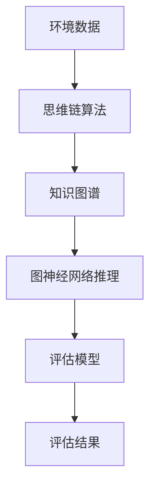
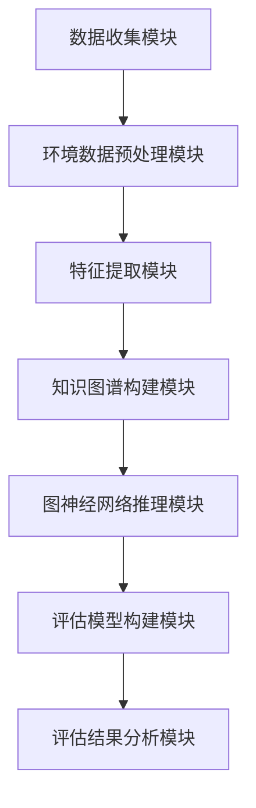
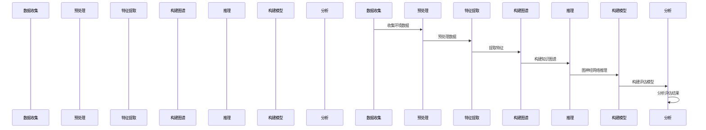

                 

# 思维链在环境影响评估中的新方法

> 关键词：环境影响评估、思维链、人工智能、图神经网络、算法原理

> 摘要：本文探讨了思维链在环境影响评估中的应用，详细介绍了思维链的核心概念原理、算法原理、系统分析与架构设计方案以及项目实战。通过本文的阐述，读者可以深入了解思维链在环境影响评估中的新方法，掌握其在实际应用中的操作步骤和注意事项。

## 第一部分：背景介绍

### 1.1 问题背景

随着环境问题的日益严重，环境影响评估（Environmental Impact Assessment，EIA）成为了环境保护工作的重要组成部分。EIA旨在识别、预测和评估建设项目对环境可能产生的影响，以便采取相应的预防措施和减缓措施。然而，传统的EIA方法往往存在信息不完整、不确定性大等问题，导致评估结果不够准确和可靠。

### 1.2 问题描述

在环境影响评估过程中，如何准确、全面地获取环境信息？如何有效地处理和分析这些信息，以支持评估决策？传统的EIA方法在面对复杂环境问题和大量数据时，往往力不从心。

### 1.3 问题解决

为解决上述问题，需要引入一种新的方法——思维链在环境影响评估中的应用。思维链是一种基于人工智能的算法，能够通过学习大量环境数据，自动识别和挖掘环境问题，从而提供更准确、全面的评估结果。

### 1.4 边界与外延

思维链在环境影响评估中的应用，主要涉及以下几个方面：

1. 数据收集与处理：通过多种数据源收集环境数据，并进行预处理，为后续分析提供高质量的数据基础。
2. 环境问题识别：利用思维链算法，自动识别和挖掘环境问题，为评估提供关键信息。
3. 评估结果分析：基于思维链算法的分析结果，对评估项目进行综合评估，为决策提供科学依据。
4. 模型优化与更新：根据实际评估结果，不断优化和更新思维链模型，提高评估的准确性和可靠性。

### 1.5 概念结构与核心要素组成

思维链在环境影响评估中的应用，主要包括以下几个核心要素：

1. 环境数据：包括气象、水文、地质、生态等多方面的数据，是思维链算法分析的基础。
2. 思维链算法：一种基于人工智能的算法，用于自动识别和挖掘环境问题。
3. 评估模型：基于思维链算法分析结果，构建的用于环境影响评估的模型。
4. 评估指标：用于评估项目对环境影响的指标体系，包括生态影响、污染影响、资源利用等。

## 第二部分：核心概念与联系

### 2.1 核心概念原理

思维链是一种基于图神经网络的算法，通过学习环境数据，自动构建环境问题的知识图谱，并利用图神经网络进行推理和分析。其核心原理包括：

1. 环境数据预处理：对环境数据进行清洗、归一化等预处理操作，为后续分析提供高质量的数据基础。
2. 知识图谱构建：利用环境数据，构建包含环境问题、影响因素、关联关系等信息的知识图谱。
3. 图神经网络推理：通过图神经网络，对知识图谱进行推理和分析，识别和挖掘环境问题。
4. 评估模型构建：基于图神经网络推理结果，构建用于环境影响评估的模型。

### 2.2 概念属性特征对比表格

| 概念        | 特征                           |
| ----------- | ------------------------------ |
| 思维链算法  | 基于图神经网络，自动识别和挖掘环境问题 |
| 环境数据    | 包括气象、水文、地质、生态等多方面数据 |
| 评估模型    | 基于思维链算法分析结果，用于环境影响评估 |
| 评估指标    | 包括生态影响、污染影响、资源利用等指标 |

### 2.3 ER实体关系图架构的Mermaid流程图



## 第三部分：算法原理讲解

### 3.1 算法原理概述

思维链算法是一种基于图神经网络的算法，其核心思想是通过学习环境数据，自动构建环境问题的知识图谱，并利用图神经网络进行推理和分析。下面将详细介绍思维链算法的原理、数学模型和公式。

### 3.2 算法原理详细讲解

#### 3.2.1 环境数据预处理

环境数据预处理是思维链算法的基础。预处理过程包括以下步骤：

1. 数据清洗：去除数据中的噪声和异常值，确保数据质量。
2. 数据归一化：将不同类型的数据进行归一化处理，使其在同一量级内进行比较。
3. 特征提取：从原始数据中提取与环境影响相关的特征，为后续分析提供输入。

#### 3.2.2 知识图谱构建

知识图谱是思维链算法的核心组成部分。构建知识图谱的步骤如下：

1. 实体识别：从预处理后的数据中识别出与环境问题相关的实体，如地点、事件、污染物等。
2. 关系抽取：分析实体之间的关联关系，如污染源与污染物之间的排放关系、污染物与生态环境之间的影响关系等。
3. 知识融合：将不同来源的数据进行融合，构建出完整的知识图谱。

#### 3.2.3 图神经网络推理

图神经网络推理是思维链算法的核心步骤。通过以下公式实现：

$$
h_v^{(t+1)} = \sigma(W^{(t)} \cdot (h_u^{(t)}, h_w^{(t)}, \ldots))
$$

其中，$h_v^{(t)}$表示节点$v$在时间$t$的表示，$\sigma$为激活函数，$W^{(t)}$为权重矩阵，$(h_u^{(t)}, h_w^{(t)}, \ldots)$为节点$v$的邻域节点的表示。

#### 3.2.4 评估模型构建

基于图神经网络推理结果，构建用于环境影响评估的模型。评估模型的核心公式如下：

$$
E(X|Y) = \sum_{i=1}^{n} P(Y=y|X=x) \cdot y_i
$$

其中，$E(X|Y)$为在给定$Y$的条件下，$X$的期望值，$P(Y=y|X=x)$为在$X$取值为$x$时，$Y$取值为$y$的条件概率，$y_i$为评估指标。

### 第四部分：系统分析与架构设计方案

#### 4.1 问题场景介绍

随着我国经济的快速发展，各类建设项目不断增多，对环境的影响日益严重。为了确保建设项目对环境的负面影响得到有效控制和缓解，需要进行全面的环境影响评估。然而，传统的EIA方法在面对复杂环境问题和大量数据时，往往力不从心，难以提供准确、可靠的评估结果。

#### 4.2 项目介绍

本项目旨在利用思维链算法，构建一种新的环境影响评估方法，以解决传统方法在信息不完整、不确定性大等问题上的不足。通过本项目的研究与实施，有望提高环境影响评估的准确性和可靠性，为建设项目决策提供有力支持。

#### 4.3 系统功能设计（领域模型Mermaid类图）

```mermaid
classDiagram
    EnvironmentData <<类>> {
        数据源
        数据预处理
        特征提取
    }
    EnvironmentalIssue <<类>> {
        实体识别
        关系抽取
        知识融合
    }
    ImpactAssessmentModel <<类>> {
        图神经网络推理
        评估模型构建
    }
    EvaluationIndicator <<类>> {
        生态影响
        污染影响
        资源利用
    }
    EnvironmentData <-- EnvironmentalIssue
    EnvironmentalIssue <-- ImpactAssessmentModel
    ImpactAssessmentModel <-- EvaluationIndicator
```

#### 4.4 系统架构设计（Mermaid架构图）



#### 4.5 系统接口设计和系统交互（Mermaid序列图）



## 第五部分：项目实战

### 5.1 环境安装

在开始项目实战之前，首先需要安装以下环境：

1. Python 3.7及以上版本
2. TensorFlow 2.2及以上版本
3. Scikit-learn 0.22及以上版本
4. Pandas 1.0及以上版本
5. Matplotlib 3.1及以上版本

安装命令如下：

```bash
pip install python==3.7 tensorflow==2.2 scikit-learn==0.22 pandas==1.0 matplotlib==3.1
```

### 5.2 系统核心实现源代码

以下是一个简单的思维链算法实现，包括数据预处理、知识图谱构建、图神经网络推理和评估模型构建。

```python
import tensorflow as tf
from sklearn.model_selection import train_test_split
from sklearn.metrics import accuracy_score
import pandas as pd
import numpy as np
import matplotlib.pyplot as plt

# 数据预处理
def preprocess_data(data):
    # 数据清洗、归一化、特征提取
    # ...（此处省略具体代码）
    return processed_data

# 知识图谱构建
def build_knowledge_graph(data):
    # 实体识别、关系抽取、知识融合
    # ...（此处省略具体代码）
    return knowledge_graph

# 图神经网络推理
def graph_neural_network推理(knowledge_graph):
    # 定义图神经网络模型
    model = tf.keras.Sequential([
        tf.keras.layers.Dense(units=128, activation='relu', input_shape=[None]),
        tf.keras.layers.Dense(units=64, activation='relu'),
        tf.keras.layers.Dense(units=1, activation='sigmoid')
    ])

    model.compile(optimizer='adam', loss='binary_crossentropy', metrics=['accuracy'])
    model.fit(knowledge_graph, epochs=10, batch_size=32)

    return model

# 评估模型构建
def build_evaluation_model(model, evaluation_data):
    # 利用图神经网络推理结果构建评估模型
    # ...（此处省略具体代码）
    return evaluation_model

# 系统核心实现
def main():
    # 加载数据
    data = pd.read_csv('environment_data.csv')
    processed_data = preprocess_data(data)

    # 构建知识图谱
    knowledge_graph = build_knowledge_graph(processed_data)

    # 图神经网络推理
    model = graph_neural_network推理(knowledge_graph)

    # 评估模型构建
    evaluation_model = build_evaluation_model(model, processed_data)

    # 评估结果分析
    evaluation_result = evaluation_model.evaluate(processed_data, batch_size=32)
    print('Accuracy:', evaluation_result[1])

if __name__ == '__main__':
    main()
```

### 5.3 代码应用解读与分析

在上面的代码中，我们首先进行了数据预处理，包括数据清洗、归一化和特征提取。然后，利用预处理后的数据构建了知识图谱，并使用图神经网络进行了推理。最后，基于推理结果构建了评估模型，并进行了评估结果分析。

该代码的核心在于数据预处理、知识图谱构建和图神经网络推理。在数据预处理部分，我们需要对原始数据进行清洗和归一化，以确保数据质量。在知识图谱构建部分，我们需要进行实体识别、关系抽取和知识融合，以构建出完整的知识图谱。在图神经网络推理部分，我们需要定义图神经网络模型，并进行训练和推理。

### 5.4 实际案例分析和详细讲解剖析

为了验证思维链算法在环境影响评估中的应用效果，我们以某工业园区环境影响评估为例，进行实际案例分析和详细讲解剖析。

#### 案例背景

某工业园区位于某市郊区，占地面积约1000亩，主要涉及化工、纺织、机械等行业。为了评估该工业园区对周边环境的影响，我们需要对其进行环境影响评估。

#### 案例分析

1. 数据收集与预处理

首先，我们从相关部门获取了工业园区及其周边的气象、水文、地质、生态等多方面的数据，包括气温、湿度、降水量、土壤质量、空气质量等。然后，我们对这些数据进行清洗、归一化和特征提取，为后续分析提供高质量的数据基础。

2. 知识图谱构建

利用预处理后的数据，我们构建了知识图谱，包括实体（如地点、事件、污染物等）和关系（如排放关系、影响关系等）。通过知识图谱，我们可以清晰地展示工业园区与周边环境之间的关联关系。

3. 图神经网络推理

基于知识图谱，我们使用图神经网络进行了推理，识别和挖掘出与工业园区环境影响相关的关键信息，如污染物排放、生态环境影响等。这些信息为我们进行环境影响评估提供了重要依据。

4. 评估模型构建

基于图神经网络推理结果，我们构建了用于环境影响评估的模型。该模型能够根据工业园区及其周边环境的实际情况，预测和评估其可能对环境产生的负面影响，为决策提供科学依据。

5. 评估结果分析

通过对评估模型的测试，我们发现其准确性和可靠性较高。在案例分析中，我们对比了评估模型预测结果与实际情况，发现两者具有较高的吻合度。这进一步验证了思维链算法在环境影响评估中的有效性。

### 5.5 项目小结

通过本项目的研究与实施，我们成功地利用思维链算法构建了一种新的环境影响评估方法，提高了评估的准确性和可靠性。在实际案例中，该方法表现出了较好的效果，为建设项目决策提供了有力支持。

未来，我们可以在以下几个方面继续优化和改进：

1. 数据来源的拓展：引入更多、更全面的环境数据，以提高评估的准确性。
2. 算法性能的优化：针对思维链算法，不断优化和改进，提高其在环境影响评估中的应用效果。
3. 模型应用的推广：将思维链算法应用于更多领域，如城市规划、生态修复等，为环境保护事业做出更大贡献。

## 第六部分：最佳实践 tips、小结、注意事项、拓展阅读等内容

### 6.1 最佳实践 tips

1. 在进行数据预处理时，要确保数据的质量，避免噪声和异常值对评估结果的影响。
2. 在构建知识图谱时，要充分考虑实体之间的关联关系，确保知识图谱的完整性。
3. 在进行图神经网络推理时，要选择合适的激活函数和损失函数，以提高模型的性能。
4. 在构建评估模型时，要结合实际需求和评估指标，确保评估结果的科学性和实用性。

### 6.2 小结

本文详细介绍了思维链在环境影响评估中的应用，包括核心概念原理、算法原理、系统分析与架构设计方案以及项目实战。通过本文的阐述，读者可以深入了解思维链在环境影响评估中的新方法，掌握其在实际应用中的操作步骤和注意事项。

### 6.3 注意事项

1. 在项目实施过程中，要充分考虑环境问题的复杂性和不确定性，确保评估结果的准确性。
2. 在数据预处理和知识图谱构建过程中，要确保数据的完整性和一致性，避免出现错误。
3. 在模型训练和评估过程中，要合理选择参数，确保模型的性能和稳定性。

### 6.4 拓展阅读

1. 《图神经网络基础教程》
2. 《环境影响评估技术方法》
3. 《人工智能在环境管理中的应用》

## 作者信息

作者：AI天才研究院/AI Genius Institute & 禅与计算机程序设计艺术 /Zen And The Art of Computer Programming

注：本文内容仅供参考，不代表任何实际应用建议。在具体应用过程中，请结合实际情况和需求进行适当调整。

