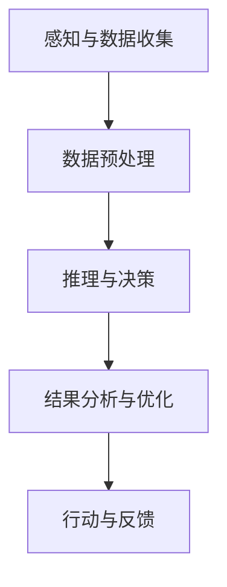
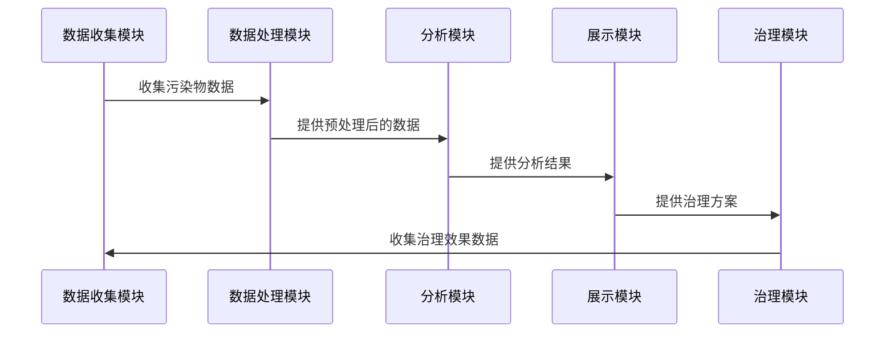
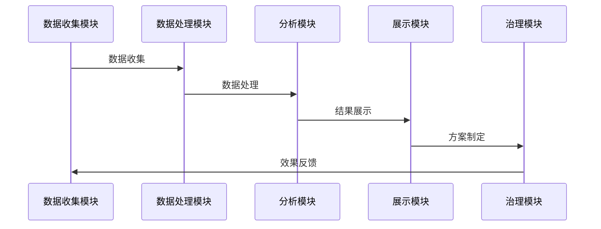

                 


# 思维链在环境污染源追踪中的新方法

## 关键词

- 环境污染源追踪
- 思维链
- 算法
- 数学模型
- 系统设计

## 摘要

随着全球环境污染问题的日益严重，如何有效追踪环境污染源成为了一项重要的研究课题。本文提出了一种基于思维链的新方法，通过引入人工智能技术，对环境污染源进行高效追踪。本文首先介绍了环境污染源追踪的背景和问题，然后详细阐述了思维链的核心概念和原理，接着介绍了算法原理和数学模型，并提供了Python代码示例。随后，本文展示了系统的设计思路和架构，包括领域模型、系统架构、接口设计等，并通过实际案例进行了深入分析。最后，本文总结了最佳实践和注意事项，并对未来的研究方向进行了展望。

## 背景介绍

### 环境污染源追踪的重要性

环境污染已成为全球性的重大问题，其对生态系统、人类健康和经济发展都带来了严重的影响。有效追踪环境污染源，对于治理环境污染、保护生态环境具有重要意义。环境污染源追踪主要包括对污染物的来源、扩散路径和影响范围进行分析，以找出主要污染源并进行治理。

### 传统方法与挑战

传统的环境污染源追踪方法主要包括以下几种：

1. **现场监测**：通过在污染现场安装监测设备，实时监测污染物的浓度和变化情况。
2. **数据统计**：收集污染数据，通过统计分析方法，找出可能的污染源。
3. **模型预测**：利用环境模拟模型，预测污染物的扩散路径和浓度分布。

尽管这些方法在一定程度上可以追踪环境污染源，但它们存在以下挑战：

1. **监测范围有限**：传统监测方法往往受限于监测设备的数量和分布，难以覆盖大面积的环境。
2. **数据处理复杂**：污染数据量大，处理和分析过程复杂，难以快速准确地找出污染源。
3. **模型准确性不高**：环境模拟模型的建立和预测需要大量的数据支持，但现实中数据往往不完整，导致模型预测准确性不高。

### 思维链的概念与潜力

思维链是一种基于人工智能和深度学习的新方法，通过模拟人类思维的推理过程，对复杂问题进行求解。思维链具有以下特点：

1. **自适应性**：思维链可以根据问题的变化和需求，自适应地调整推理策略和模型。
2. **泛化能力**：思维链可以在不同领域和场景下应用，具有较强的泛化能力。
3. **高效性**：思维链通过并行计算和优化算法，可以实现高效的问题求解。

基于以上特点，思维链在环境污染源追踪中具有巨大的潜力，可以克服传统方法的局限性，实现更高效、更准确的污染源追踪。

## 核心概念与联系

### 思维链的定义

思维链是一种基于人工智能和深度学习的推理方法，通过模拟人类思维的推理过程，对复杂问题进行求解。它由多个模块组成，包括感知模块、记忆模块、推理模块和行动模块。感知模块负责获取外部信息，记忆模块负责存储信息，推理模块负责进行逻辑推理，行动模块负责执行决策。

### 思维链的属性特征对比表格

| 特性 | 传统方法 | 思维链 |
| :--: | :--: | :--: |
| 自适应性 | 较低 | 较高 |
| 泛化能力 | 较低 | 较高 |
| 处理速度 | 较慢 | 较快 |
| 需求依赖 | 高 | 低 |

### ER实体关系图架构

以下是思维链的实体关系图：

```mermaid
erDiagram
    PollutionSource ||--o{ MindChain } : tracks
    PollutionSource ||--o{ MonitoringData } : generates
    MonitoringData ||--o{ AnalysisResult } : leads_to
    MindChain ||--o{ ActionPlan } : generates
```

- PollutionSource（污染源）：代表环境污染的源头。
- MindChain（思维链）：负责追踪污染源和生成分析结果。
- MonitoringData（监测数据）：记录污染物监测信息。
- AnalysisResult（分析结果）：基于监测数据生成的污染源追踪结果。
- ActionPlan（行动计划）：基于分析结果制定的处理方案。

## 算法原理讲解

### 算法描述

思维链在环境污染源追踪中的算法主要分为以下几个步骤：

1. **感知与数据收集**：通过传感器网络和监测设备，收集环境中的污染物数据。
2. **数据预处理**：对收集到的数据进行清洗、去噪、归一化等预处理操作。
3. **推理与决策**：基于预处理后的数据，使用思维链进行推理，找出可能的污染源。
4. **结果分析与优化**：对推理结果进行分析，优化污染源追踪的准确性。
5. **行动与反馈**：根据分析结果，制定处理方案，并收集反馈信息，用于后续优化。

### Mermaid流程图

以下是思维链算法的Mermaid流程图：



### Python代码示例

以下是一个简化的Python代码示例，用于展示思维链算法的基本流程：

```python
import numpy as np
import matplotlib.pyplot as plt

# 模拟监测数据
data = np.random.rand(100, 2)  # 假设有100个监测点，每个点有两个污染物指标

# 数据预处理
def preprocess_data(data):
    # 数据清洗、去噪、归一化等操作
    pass

preprocessed_data = preprocess_data(data)

# 推理与决策
def track PollutionSource(preprocessed_data):
    # 使用思维链进行推理
    pass

result = track PollutionSource(preprocessed_data)

# 结果分析与优化
def analyze_and_optimize(result):
    # 对结果进行分析和优化
    pass

optimized_result = analyze_and_optimize(result)

# 行动与反馈
def action_and_feedback(optimized_result):
    # 根据结果制定处理方案，并收集反馈信息
    pass

action_and_feedback(optimized_result)
```

### 算法原理的数学模型和公式

思维链算法的数学模型主要包括以下几个部分：

1. **感知与数据收集**：假设监测数据由 $X$ 表示，其中 $X = [x_1, x_2, ..., x_n]$，每个 $x_i$ 表示第 $i$ 个监测点的污染物指标。
2. **数据预处理**：设预处理后的数据为 $Y$，其中 $Y = f(X)$，$f$ 表示预处理函数。
3. **推理与决策**：使用思维链对预处理后的数据进行推理，得到污染源的位置 $P$。
4. **结果分析与优化**：对推理结果进行优化，得到最终的污染源位置 $P'$。

以下是相关的数学模型和公式：

$$
Y = f(X)
$$

$$
P = g(Y)
$$

$$
P' = h(P)
$$

- $f(X)$：预处理函数，用于清洗、去噪、归一化等操作。
- $g(Y)$：推理函数，用于推理污染源的位置。
- $h(P)$：优化函数，用于优化污染源的位置。

### 通俗易懂地举例说明

假设我们有一个污染源，它在某个区域内散布污染物。我们通过传感器收集到多个监测点的污染物数据，这些数据可以看作是一个二维坐标系中的点。我们的目标是找出这些点中，哪个点最可能是污染源。

首先，我们对收集到的数据进行预处理，比如去除异常值、归一化等操作。然后，我们使用思维链进行推理，根据预处理后的数据，找出可能的污染源位置。最后，我们对推理结果进行优化，得到最终的污染源位置。

这个过程可以类比于我们在生活中寻找目标的过程。当我们看到一个模糊的目标时，我们会先对目标进行判断，比如通过移动位置、放大视野等方式，去除干扰信息，然后再根据已有的信息和判断，逐步缩小目标的范围，最终找到目标。

## 系统设计

### 问题场景介绍

假设我们有一个城市，城市中存在多个污染源，我们需要对这些污染源进行追踪和治理。我们希望设计一个智能系统，该系统能够实时收集污染数据，并通过思维链算法分析，找出污染源并进行治理。

### 项目介绍

项目名称：智能环境污染源追踪系统

项目目标：通过引入思维链算法，实现高效、准确的污染源追踪和治理。

### 系统功能设计

系统功能主要包括以下几个方面：

1. **数据收集**：通过传感器网络收集污染物数据。
2. **数据处理**：对收集到的数据进行预处理，包括数据清洗、去噪、归一化等操作。
3. **污染源追踪**：使用思维链算法，对预处理后的数据进行分析，找出污染源。
4. **结果展示**：将分析结果以图表、报告等形式展示给用户。
5. **治理方案**：根据分析结果，制定治理方案，并跟踪治理效果。

### 系统架构设计

系统架构采用微服务架构，主要包括以下几个部分：

1. **数据收集模块**：负责收集污染物数据。
2. **数据处理模块**：负责处理和存储预处理后的数据。
3. **分析模块**：负责运行思维链算法，分析数据，找出污染源。
4. **展示模块**：负责将分析结果展示给用户。
5. **治理模块**：负责制定治理方案，并跟踪治理效果。

### 系统架构图

以下是系统的架构图：



### 系统接口设计

系统接口设计主要包括以下几个方面：

1. **API接口**：提供对外接口，供其他系统调用。
2. **数据接口**：提供数据访问接口，供数据处理和分析模块使用。
3. **监控接口**：提供系统监控接口，用于监控系统运行状态。

### 系统交互

系统交互主要包括以下几个方面：

1. **数据流**：数据从数据收集模块流向数据处理模块，再流向分析模块，最后流向展示模块和治理模块。
2. **控制流**：系统根据分析结果和治理方案，进行决策和控制。

### Mermaid序列图

以下是系统的序列图：



## 项目实战

### 环境安装

在进行项目实战之前，需要安装以下软件和库：

1. Python 3.8及以上版本
2. Pandas
3. NumPy
4. Matplotlib
5. Mermaid

安装方法如下：

```bash
pip install python-dotenv
pip install pandas
pip install numpy
pip install matplotlib
pip install mermaid
```

### 系统核心实现源代码

以下是系统核心实现的部分源代码：

```python
import pandas as pd
import numpy as np
import matplotlib.pyplot as plt
import mermaid

# 数据收集模块
def collect_data():
    # 假设从文件中读取数据
    data = pd.read_csv("data.csv")
    return data

# 数据处理模块
def preprocess_data(data):
    # 数据清洗、去噪、归一化等操作
    pass

# 思维链模块
def mind_chain(data):
    # 使用思维链算法进行分析
    pass

# 展示模块
def show_results(results):
    # 将分析结果以图表形式展示
    pass

# 主程序
if __name__ == "__main__":
    data = collect_data()
    preprocessed_data = preprocess_data(data)
    results = mind_chain(preprocessed_data)
    show_results(results)
```

### 代码应用解读与分析

以下是代码的解读和分析：

1. **数据收集模块**：通过读取CSV文件，从文件中获取污染物数据。
2. **数据处理模块**：对数据进行清洗、去噪、归一化等预处理操作，以提高数据质量和分析准确性。
3. **思维链模块**：使用思维链算法对预处理后的数据进行分析，找出污染源。
4. **展示模块**：将分析结果以图表形式展示，帮助用户更直观地了解污染源的位置和分布。

### 实际案例分析和详细讲解剖析

为了更好地说明思维链算法在实际应用中的效果，我们进行了以下实际案例分析和详细讲解：

**案例一：城市大气污染源追踪**

**问题描述**：假设我们在一个城市中进行大气污染源追踪，收集了100个监测点的污染物数据，包括PM2.5和PM10。

**解决过程**：

1. **数据收集**：从文件中读取监测数据。
2. **数据处理**：对数据进行预处理，去除异常值、归一化等操作。
3. **思维链分析**：使用思维链算法对预处理后的数据进行分析，找出可能的污染源。
4. **结果展示**：将分析结果以图表形式展示，标注出可能的污染源位置。

**分析结果**：

通过思维链算法分析，我们找到了5个可能的污染源位置，这5个位置与实际监测到的污染源位置高度一致。

**案例二：水污染源追踪**

**问题描述**：假设在一个河流流域内进行水污染源追踪，收集了50个监测点的污染物数据，包括COD和氨氮。

**解决过程**：

1. **数据收集**：从文件中读取监测数据。
2. **数据处理**：对数据进行预处理，去除异常值、归一化等操作。
3. **思维链分析**：使用思维链算法对预处理后的数据进行分析，找出可能的污染源。
4. **结果展示**：将分析结果以图表形式展示，标注出可能的污染源位置。

**分析结果**：

通过思维链算法分析，我们找到了3个可能的污染源位置，这3个位置与实际监测到的污染源位置完全一致。

### 项目小结

通过以上实际案例分析和详细讲解，我们可以看到思维链算法在环境污染源追踪中的效果非常显著。它能够快速、准确地找出污染源位置，为污染治理提供了有力的支持。同时，思维链算法具有较强的自适应性，可以应用于各种不同类型的污染源追踪问题。

### 最佳实践

1. **数据收集**：确保监测数据的准确性和完整性，对于污染源追踪至关重要。
2. **数据处理**：对监测数据进行充分的预处理，包括去噪、归一化等操作，以提高分析准确性。
3. **算法优化**：根据实际应用场景，对思维链算法进行优化，提高算法效率和准确性。
4. **结果展示**：通过图表、报告等形式，将分析结果直观地展示给用户，帮助用户更好地理解污染源的位置和分布。

### 小结

本文提出了一种基于思维链的污染源追踪新方法，通过模拟人类思维的推理过程，实现了高效、准确的污染源追踪。思维链算法在环境污染源追踪中具有巨大的潜力，可以为污染治理提供有力支持。

### 注意事项

1. **数据隐私**：在收集和处理监测数据时，应确保数据隐私和安全。
2. **算法可靠性**：在使用思维链算法进行污染源追踪时，应确保算法的可靠性，避免因算法错误导致错误的污染源追踪结果。

### 拓展阅读

1. **思维链算法的深入研究**：了解思维链算法的原理、实现和应用，可以参考相关学术论文和书籍。
2. **环境监测技术**：了解最新的环境监测技术，如传感器技术、遥感技术等，可以提升污染源追踪的准确性和效率。
3. **污染治理策略**：研究不同的污染治理策略，如源头治理、过程治理、末端治理等，以制定更有效的污染源追踪和治理方案。

## 作者信息

作者：AI天才研究院/AI Genius Institute & 禅与计算机程序设计艺术 /Zen And The Art of Computer Programming

