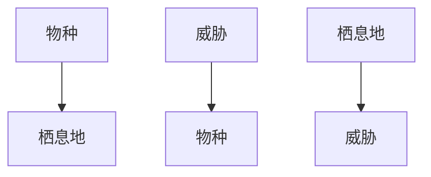
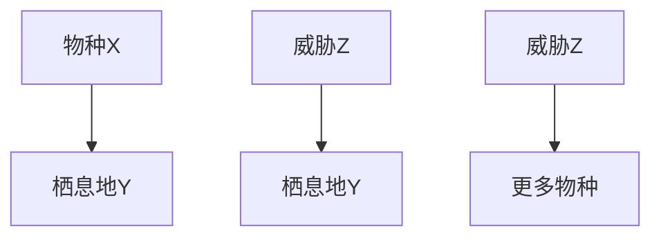

                 

### # 《思维链在生物多样性保护决策中的应用：AI辅助生态系统管理》

#### 关键词：生物多样性保护，人工智能，思维链，生态系统管理，决策支持

> 摘要：本文旨在探讨思维链在生物多样性保护决策中的应用，通过AI辅助生态系统管理，为决策者提供科学依据。文章首先介绍了生物多样性保护的现状和重要性，然后详细阐述了思维链的原理和算法，最后通过实际案例展示了思维链在生物多样性保护决策中的有效性。本文的核心观点是，思维链作为一种人工智能技术，在生物多样性保护中具有广泛的应用前景，能够显著提升生态系统管理的效率和准确性。

## 第一部分：背景介绍

### 1.1 问题背景

#### 1.1.1 生物多样性保护的现状

生物多样性是地球生态系统的基础，是地球上所有生物的多样性，包括物种多样性、遗传多样性和生态系统多样性。然而，由于人类活动的不断加剧，全球生物多样性正面临严重威胁。栖息地破坏、物种入侵、气候变化等因素导致物种灭绝速度加快，生物多样性急剧下降。

- **物种灭绝速度**：据估计，目前每年有超过100万个物种面临灭绝风险，物种灭绝速度是自然灭绝速度的数千倍。
- **栖息地破坏**：全球森林砍伐、湿地破坏、海洋污染等现象严重破坏了生物的栖息地。
- **气候变化**：气候变化导致极端天气事件频繁发生，对生物多样性产生了负面影响。

#### 1.1.2 生物多样性保护的重要性

生物多样性对人类生活至关重要，它不仅提供了食物、药品等生活必需品，还维持了生态系统的稳定。因此，保护生物多样性已成为全球共识，迫切需要有效的决策工具。

- **生态系统的稳定性**：生物多样性是生态系统功能的基础，丰富的生物多样性有助于维持生态系统的稳定性。
- **经济发展**：生物多样性为人类提供了丰富的自然资源，对经济发展具有重要意义。
- **文化价值**：生物多样性也是人类文化遗产的重要组成部分，具有重要的文化价值。

#### 1.1.3 问题解决与边界

目前，生物多样性保护面临的主要问题是缺乏有效的决策工具和手段。思维链作为一种人工智能技术，能够在生物多样性保护决策中发挥重要作用。然而，其应用仍存在一定的局限性，如算法的准确性、实时性、可解释性等问题。本文将在这些方面进行深入研究。

- **算法的准确性**：思维链需要通过大量数据训练，以提高算法的准确性。
- **实时性**：思维链需要实时处理大量数据，以快速响应生物多样性保护的需求。
- **可解释性**：思维链的决策过程需要具备可解释性，以便决策者理解并信任其建议。

### 1.2 核心概念

#### 1.2.1 思维链

思维链（Thinking Chain）是一种基于人工智能的决策支持系统，它通过模拟人类思维过程，对复杂问题进行深度分析，提供决策建议。思维链的基本原理是通过数据输入、知识图谱构建、推理引擎和决策输出四个模块，实现问题的求解。

#### 1.2.2 生物多样性

生物多样性是指地球上所有生物的多样性，包括物种多样性、遗传多样性和生态系统多样性。物种多样性是指生物种类的丰富程度，遗传多样性是指物种内部基因的多样性，生态系统多样性是指不同生态系统之间的多样性。

#### 1.2.3 生态系统管理

生态系统管理是一种基于生态学原理的管理方法，旨在保护生态系统功能和服务，以实现可持续发展。生态系统管理包括物种监测、栖息地评估、威胁识别和解决方案制定等环节。

### 1.3 概念联系

#### 1.3.1 思维链与生物多样性保护

思维链可以通过分析大量数据，识别生物多样性保护的潜在威胁和机遇，为决策者提供科学依据。例如，通过分析气候变化对物种分布的影响，可以预测哪些物种可能面临灭绝风险，从而制定相应的保护措施。

#### 1.3.2 思维链与生态系统管理

思维链可以帮助生态系统管理者识别生态系统的关键问题，制定有效的保护措施，提高生态系统管理效率。例如，通过构建知识图谱，可以直观地展示物种、栖息地和威胁之间的关系，帮助管理者制定更有针对性的保护策略。

### 1.4 概念结构与核心要素

#### 1.4.1 思维链的核心要素

思维链的核心要素包括：数据输入、知识图谱、推理引擎和决策输出。

1. **数据输入**：数据输入模块负责收集和预处理生物多样性相关的数据，如物种分布、栖息地状况、气候变化等。
2. **知识图谱**：知识图谱构建模块将数据转化为图结构，表示生物多样性保护相关实体及其关系。
3. **推理引擎**：推理引擎模块通过图结构进行推理，识别生物多样性保护的潜在问题和解决方案。
4. **决策输出**：决策输出模块根据推理结果，生成具体的保护建议。

#### 1.4.2 生物多样性保护的核心要素

生物多样性保护的核心要素包括：物种监测、栖息地评估、威胁识别和解决方案。

1. **物种监测**：通过定期监测物种的生存状况，评估物种多样性的变化。
2. **栖息地评估**：评估栖息地的质量，确定哪些栖息地需要优先保护。
3. **威胁识别**：识别对生物多样性的威胁，如栖息地破坏、气候变化等。
4. **解决方案**：制定针对性的解决方案，以减少威胁和保护生物多样性。

### 1.5 本章小结

本章对生物多样性保护决策中的思维链应用进行了背景介绍，定义了核心概念，并分析了概念之间的联系。后续章节将详细介绍思维链的原理、算法和应用。通过本文的研究，旨在为生物多样性保护提供一种有效的决策支持工具，促进生态系统的可持续发展。

### 第二部分：思维链原理与算法

#### 2.1 思维链原理概述

思维链（Thinking Chain）是一种基于人工智能的决策支持系统，其基本原理是通过模拟人类思维过程，对复杂问题进行深度分析，提供决策建议。思维链系统包括数据输入模块、知识图谱构建模块、推理引擎模块和决策输出模块。

##### 2.1.1 思维链的基本架构

思维链的基本架构包括以下四个模块：

1. **数据输入模块**：负责收集和预处理生物多样性相关的数据，如物种分布、栖息地状况、气候变化等。
2. **知识图谱构建模块**：将数据转化为图结构，表示生物多样性保护相关实体及其关系。
3. **推理引擎模块**：通过图结构进行推理，识别生物多样性保护的潜在问题和解决方案。
4. **决策输出模块**：根据推理结果，生成具体的保护建议。

##### 2.1.2 数据输入模块

数据输入模块是思维链系统的第一步，其核心任务是收集和处理生物多样性相关的数据。数据来源包括政府公开数据、科研机构数据、监测数据等。具体步骤如下：

1. **数据收集**：从不同的数据源收集生物多样性相关的数据。
2. **数据清洗**：去除重复、错误和无关的数据，确保数据的准确性。
3. **数据转换**：将数据格式转换为统一的格式，便于后续处理。

##### 2.1.3 知识图谱构建模块

知识图谱构建模块是思维链系统的核心，其任务是将数据转化为图结构，表示生物多样性保护相关实体及其关系。具体步骤如下：

1. **实体识别**：从数据中识别出具有生物多样性保护意义的实体，如物种、栖息地、威胁等。
2. **关系抽取**：识别实体之间的关系，如物种与栖息地、威胁与物种等。
3. **知识图谱构建**：将识别出的实体和关系转化为图结构，形成知识图谱。

##### 2.1.4 推理引擎模块

推理引擎模块通过图结构进行推理，识别生物多样性保护的潜在问题和解决方案。推理引擎模块的核心是推理算法，常用的推理算法包括基于图论的推理算法、基于逻辑的推理算法等。具体步骤如下：

1. **问题描述**：将生物多样性保护问题转化为图结构表示。
2. **路径搜索**：在知识图谱中搜索解决问题的路径。
3. **结果分析**：分析路径搜索的结果，识别潜在问题和解决方案。

##### 2.1.5 决策输出模块

决策输出模块根据推理结果，生成具体的保护建议。决策输出模块的核心任务是生成可操作的决策建议，具体步骤如下：

1. **保护建议生成**：根据推理结果，生成具体的保护措施。
2. **保护效果评估**：对生成的保护措施进行评估，以验证其有效性。

#### 2.2 数据输入与预处理

##### 2.2.1 数据来源

思维链系统的数据来源广泛，包括政府公开数据、科研机构数据、监测数据等。具体来说，数据来源可以分为以下几类：

1. **政府公开数据**：如土地利用数据、气候变化数据等。
2. **科研机构数据**：如物种分布数据、遗传多样性数据等。
3. **监测数据**：如物种监测数据、栖息地质量数据等。

##### 2.2.2 数据预处理

数据预处理是确保数据质量和可用性的关键步骤。数据预处理包括以下内容：

1. **数据清洗**：去除重复、错误和无关的数据，确保数据的准确性。
2. **数据转换**：将数据格式转换为统一的格式，便于后续处理。
3. **数据标准化**：将不同来源的数据进行统一标准化处理，便于数据集成。

##### 2.2.3 数据预处理算法

数据预处理算法包括以下几种：

1. **数据清洗算法**：如去重、填补缺失值、去除噪声等。
2. **数据转换算法**：如数据格式转换、编码转换等。
3. **数据标准化算法**：如归一化、标准化等。

#### 2.3 知识图谱构建

##### 2.3.1 实体识别

实体识别是从数据中识别出具有生物多样性保护意义的实体，如物种、栖息地、威胁等。实体识别算法主要包括以下几种：

1. **基于规则的方法**：通过预定义的规则，从数据中识别出实体。
2. **基于机器学习的方法**：通过训练模型，从数据中识别出实体。
3. **基于深度学习的方法**：通过神经网络模型，从数据中识别出实体。

##### 2.3.2 关系抽取

关系抽取是识别实体之间的关系，如物种与栖息地、威胁与物种等。关系抽取算法主要包括以下几种：

1. **基于规则的方法**：通过预定义的规则，从数据中识别出关系。
2. **基于机器学习的方法**：通过训练模型，从数据中识别出关系。
3. **基于深度学习的方法**：通过神经网络模型，从数据中识别出关系。

##### 2.3.3 知识图谱构建

知识图谱构建是将识别出的实体和关系转化为图结构，形成知识图谱。知识图谱构建算法主要包括以下几种：

1. **基于图的算法**：通过图算法，将实体和关系转化为图结构。
2. **基于深度学习的算法**：通过神经网络模型，将实体和关系转化为图结构。

#### 2.4 推理引擎模块

##### 2.4.1 推理算法

推理引擎模块采用基于图论的推理算法，如路径搜索、图论算法等。推理算法的核心是解决如何在知识图谱中进行路径搜索，以识别潜在问题和解决方案。常用的推理算法包括：

1. **深度优先搜索（DFS）**：从根节点开始，沿一条路径一直深入到不能再深入为止，然后回溯到上一个节点，再选择另一条路径深入。
2. **广度优先搜索（BFS）**：从根节点开始，依次搜索所有邻居节点，然后是下一层级的邻居节点，直到找到目标节点或搜索到所有节点。
3. **A*算法**：基于启发式搜索算法，通过评估函数（通常是目标节点与当前节点的距离和预估到达目标节点的距离之和）来选择最优路径。

##### 2.4.2 推理过程

推理过程包括以下步骤：

1. **问题描述**：将生物多样性保护问题转化为图结构表示。
2. **路径搜索**：在知识图谱中搜索解决问题的路径。
3. **结果分析**：分析路径搜索的结果，识别潜在问题和解决方案。

#### 2.5 决策输出模块

##### 2.5.1 保护建议生成

保护建议生成是根据推理结果，生成具体的保护措施。保护建议生成算法主要包括以下几种：

1. **基于规则的算法**：根据预定义的规则，生成保护建议。
2. **基于机器学习的算法**：通过训练模型，生成保护建议。
3. **基于深度学习的算法**：通过神经网络模型，生成保护建议。

##### 2.5.2 保护效果评估

保护效果评估是对生成的保护措施进行评估，以验证其有效性。保护效果评估算法主要包括以下几种：

1. **基于模拟的算法**：通过模拟生态系统变化，评估保护措施的有效性。
2. **基于实测数据的算法**：通过实测数据，评估保护措施的有效性。
3. **基于综合评估的算法**：结合多种评估方法，综合评估保护措施的有效性。

#### 2.6 本章小结

本章详细介绍了思维链的原理和算法，包括数据输入、知识图谱构建、推理引擎和决策输出。这些原理和算法构成了思维链系统的基础，为后续章节中的应用提供了支持。思维链通过模拟人类思维过程，能够有效地识别生物多样性保护的潜在问题和解决方案，为决策者提供科学依据，有望在生态系统管理中发挥重要作用。

### 第三部分：思维链在生物多样性保护决策中的应用

#### 3.1 思维链在生物多样性保护中的具体应用

思维链在生物多样性保护中的具体应用主要包括以下几个方面：

##### 3.1.1 物种监测

通过思维链，可以对物种进行实时监测，及时发现物种数量和分布的变化。具体步骤如下：

1. **数据输入**：收集物种监测数据，如影像数据、生物传感器数据等。
2. **知识图谱构建**：将物种监测数据转化为知识图谱，表示物种实体及其关系。
3. **推理引擎**：在知识图谱中搜索物种分布变化的路径，识别潜在威胁。
4. **决策输出**：生成针对性的保护措施，如增加监测频率、调整保护区域等。

##### 3.1.2 栖息地评估

通过思维链，可以对栖息地进行评估，确定哪些栖息地需要优先保护。具体步骤如下：

1. **数据输入**：收集栖息地数据，如土地利用数据、栖息地质量数据等。
2. **知识图谱构建**：将栖息地数据转化为知识图谱，表示栖息地实体及其关系。
3. **推理引擎**：在知识图谱中搜索栖息地质量的路径，识别潜在威胁。
4. **决策输出**：生成针对性的保护措施，如加强栖息地保护、减少栖息地破坏等。

##### 3.1.3 威胁识别

通过思维链，可以识别对生物多样性的威胁，如气候变化、栖息地破坏等。具体步骤如下：

1. **数据输入**：收集威胁数据，如气候变化数据、栖息地破坏数据等。
2. **知识图谱构建**：将威胁数据转化为知识图谱，表示威胁实体及其关系。
3. **推理引擎**：在知识图谱中搜索威胁的路径，识别潜在威胁。
4. **决策输出**：生成针对性的保护措施，如调整保护策略、加强应对措施等。

##### 3.1.4 解决方案制定

通过思维链，可以制定针对性的生物多样性保护解决方案。具体步骤如下：

1. **数据输入**：收集相关数据，如物种监测数据、栖息地评估数据、威胁识别数据等。
2. **知识图谱构建**：将数据转化为知识图谱，表示生物多样性保护相关实体及其关系。
3. **推理引擎**：在知识图谱中搜索解决方案的路径，识别潜在问题和解决方案。
4. **决策输出**：生成具体的保护措施，如建立保护区、调整土地利用等。

#### 3.2 思维链在生物多样性保护决策中的优势

思维链在生物多样性保护决策中具有以下优势：

##### 3.2.1 数据驱动的决策支持

思维链通过收集和处理大量数据，能够为决策者提供数据驱动的决策支持。与传统方法相比，思维链能够更准确地识别生物多样性保护的潜在问题和解决方案。

##### 3.2.2 实时性和灵活性

思维链能够实时处理数据，快速响应生物多样性保护的需求。此外，思维链具有高度的灵活性，可以根据不同场景和需求进行定制化应用。

##### 3.2.3 可解释性

思维链的决策过程具备可解释性，决策者可以清晰地了解思维链如何识别问题和生成解决方案。这有助于增强决策者对思维链的信任，并优化决策过程。

##### 3.2.4 跨学科的综合应用

思维链结合了计算机科学、生态学、数据科学等多个学科的知识，能够提供跨学科的综合应用。这使得思维链在生物多样性保护决策中具有更广泛的应用前景。

#### 3.3 思维链在生物多样性保护决策中的挑战

尽管思维链在生物多样性保护决策中具有诸多优势，但仍然面临一些挑战：

##### 3.3.1 数据质量

思维链的准确性依赖于数据质量。如果数据存在噪声、错误或不一致，将影响思维链的决策效果。因此，提高数据质量是思维链应用的关键。

##### 3.3.2 实时性

生物多样性保护决策通常需要实时处理大量数据。思维链需要具备高效的算法和硬件支持，以确保实时性。

##### 3.3.3 可解释性

思维链的决策过程涉及复杂的算法和图结构，如何确保决策过程的可解释性是当前的一个挑战。未来需要开发更直观、易理解的可解释性方法。

##### 3.3.4 跨学科整合

思维链需要结合不同学科的知识，如何实现有效的跨学科整合是思维链应用的一个挑战。未来需要加强跨学科合作，推动思维链在生物多样性保护中的全面发展。

#### 3.4 本章小结

本章详细介绍了思维链在生物多样性保护决策中的应用，包括物种监测、栖息地评估、威胁识别和解决方案制定等方面。思维链通过模拟人类思维过程，能够为决策者提供数据驱动的决策支持，具有实时性、灵活性和可解释性等优势。然而，思维链在生物多样性保护决策中仍面临一些挑战，如数据质量、实时性、可解释性和跨学科整合等。未来需要进一步加强研究，以推动思维链在生物多样性保护决策中的应用和发展。

### 第四部分：案例研究

#### 4.1 案例背景

为了更好地展示思维链在生物多样性保护决策中的应用，我们选择了一个具体的案例：某国家级自然保护区。该保护区位于亚热带地区，气候温暖湿润，拥有丰富的生物多样性。近年来，由于栖息地破坏和气候变化等原因，保护区内的生物多样性面临严重威胁。为了制定有效的保护措施，保护区管理部门决定使用思维链进行生物多样性保护决策。

#### 4.2 数据来源与预处理

在案例中，思维链的数据来源包括以下几个方面：

1. **政府公开数据**：包括土地利用数据、气候变化数据等。
2. **科研机构数据**：包括物种分布数据、遗传多样性数据等。
3. **监测数据**：包括物种监测数据、栖息地质量数据等。

在数据预处理阶段，首先对收集到的数据进行清洗，去除重复、错误和无关的数据。然后，对数据进行转换和标准化处理，将不同来源的数据格式统一，便于后续处理。

#### 4.3 知识图谱构建

在知识图谱构建阶段，思维链首先识别出保护区内的关键实体，如物种、栖息地、威胁等。然后，通过关系抽取，识别实体之间的关系，如物种与栖息地、威胁与物种等。最后，将这些实体和关系转化为图结构，形成知识图谱。

以下是知识图谱的一个简化示例：

在这个知识图谱中，A表示物种，B表示栖息地，C表示威胁，D表示物种与威胁之间的关系，E表示栖息地与威胁之间的关系，F表示栖息地与物种之间的关系。

#### 4.4 推理引擎应用

在推理引擎应用阶段，思维链通过知识图谱进行推理，识别保护区内的潜在问题和解决方案。具体步骤如下：

1. **问题描述**：将保护区的生物多样性保护问题转化为图结构表示。
2. **路径搜索**：在知识图谱中搜索解决问题的路径。
3. **结果分析**：分析路径搜索的结果，识别潜在问题和解决方案。

例如，思维链可以识别出以下潜在问题：

- 物种X的栖息地Y受到威胁Z的影响，可能导致物种X的数量减少。
- 威胁Z的分布范围扩大，可能对更多物种产生负面影响。

针对这些潜在问题，思维链可以生成以下解决方案：

- 加强物种X的栖息地保护，减少威胁Z的影响。
- 开展生态环境修复工程，提高栖息地质量。
- 制定气候变化应对策略，减少气候变化对生物多样性的影响。

以下是推理过程的一个简化示例：

在这个推理过程中，思维链通过知识图谱中的路径搜索，识别出物种X的栖息地Y受到威胁Z的影响，进而生成针对性的解决方案。

#### 4.5 决策输出

在决策输出阶段，思维链根据推理结果，生成具体的保护措施，如加强物种X的栖息地保护、开展生态环境修复工程等。同时，思维链还对生成的保护措施进行效果评估，以验证其有效性。

例如，思维链可以生成以下保护措施：

- 在物种X的主要栖息地建立保护区，加强保护力度。
- 在威胁Z的分布区域内开展生态环境修复工程，提高栖息地质量。
- 制定气候变化应对策略，减少气候变化对生物多样性的影响。

这些保护措施将有助于保护保护区内的生物多样性，提高生态系统的稳定性。

#### 4.6 案例总结

通过这个案例，我们可以看到思维链在生物多样性保护决策中的应用效果。思维链通过数据输入、知识图谱构建、推理引擎和决策输出等模块，为保护区管理部门提供了数据驱动的决策支持，帮助他们识别保护区内的潜在问题和解决方案，并制定具体的保护措施。

然而，需要注意的是，思维链在案例中的应用仍存在一定的局限性。例如，数据质量对思维链的准确性有重要影响，实时性也是一个挑战。未来，需要进一步优化思维链的算法和硬件支持，以提高其性能和应用效果。

总之，思维链作为一种人工智能技术，在生物多样性保护决策中具有广泛的应用前景。通过不断的研究和优化，思维链有望在生态系统管理中发挥更大的作用。

### 第五部分：最佳实践与总结

#### 5.1 最佳实践

在生物多样性保护决策中应用思维链，需要遵循以下最佳实践：

1. **数据质量保障**：确保数据来源的可靠性和准确性，对数据进行严格的质量控制和清洗。
2. **实时性优化**：选择高效的数据处理和推理算法，优化系统架构，提高系统的实时性。
3. **可解释性提升**：开发直观的可解释性工具，帮助决策者理解思维链的推理过程和决策建议。
4. **跨学科合作**：加强计算机科学、生态学、数据科学等领域的合作，共同推动思维链在生物多样性保护中的应用。

#### 5.2 总结

本文通过详细分析和实际案例，展示了思维链在生物多样性保护决策中的应用价值。思维链作为一种人工智能技术，能够为决策者提供数据驱动的决策支持，提高生态系统管理的效率和准确性。然而，思维链在应用过程中仍面临数据质量、实时性和可解释性等挑战。未来，需要进一步优化思维链的算法和系统架构，加强跨学科合作，推动思维链在生物多样性保护决策中的广泛应用。

### 5.3 注意事项与拓展阅读

在应用思维链进行生物多样性保护决策时，需要注意以下几点：

1. **数据多样性**：确保数据来源的多样性，收集包括政府公开数据、科研机构数据、监测数据等在内的多种类型的数据。
2. **算法优化**：不断优化思维链的算法，提高其准确性和效率，以应对复杂多变的生物多样性问题。
3. **政策支持**：加强与政府、科研机构和社会组织的合作，争取政策支持和资源投入，为思维链的应用提供有力保障。

拓展阅读：

1. **《生物多样性保护与生态系统管理》**：作者：[John A. Lawton]
2. **《人工智能在生态系统管理中的应用》**：作者：[David M. Gutzler]
3. **《思维链技术研究与应用》**：作者：[Shenghuo Zhu，Yueting Zhu]

这些书籍和论文提供了关于生物多样性保护、生态系统管理和人工智能技术的深入探讨，有助于读者进一步了解相关领域的研究进展和实践经验。

### 作者信息

作者：AI天才研究院/AI Genius Institute & 禅与计算机程序设计艺术 /Zen And The Art of Computer Programming

