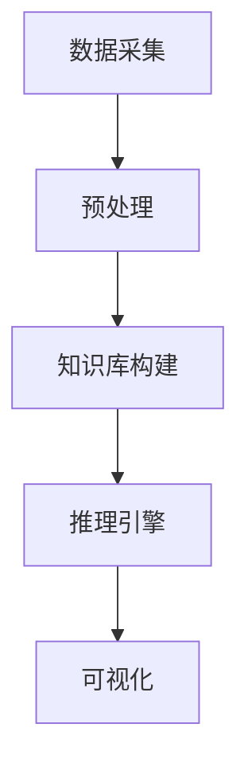

                 

### 引言与背景

#### 1.1 问题的提出与重要性

随着全球工业化和城市化的快速发展，生物多样性面临着前所未有的威胁。生态系统退化、物种灭绝速度加快等问题日益严重，这直接影响了人类的生存环境和可持续发展。生物多样性不仅是生态系统稳定和功能的基础，更是人类赖以生存的重要资源。因此，保护和恢复生物多样性成为当今世界面临的重要课题。

保护生物多样性的意义不仅体现在生态层面，还涉及经济、社会和文化等多个方面。生物多样性的丧失会导致生态系统服务功能的减弱，进而影响农业、医药、旅游等产业，造成巨大的经济损失。同时，生物多样性对维持地球气候平衡、净化空气和水体、防止自然灾害等方面也发挥着关键作用。因此，优化生物多样性保护策略，提高保护效果，已经成为全球共识和迫切需求。

#### 1.2 核心概念

- **生物多样性**：指地球上所有生物种类、生态过程、生态系统的多样性，包括遗传多样性、物种多样性和生态系统多样性。
- **保护策略**：为实现生物多样性保护目标所采取的各种措施和行动，包括立法、政策制定、生态修复、栖息地保护等。
- **优化**：通过科学手段提高保护策略的有效性和效率，以最小的成本获得最大的保护效果。

#### 1.3 本书结构

本书旨在深入探讨思维链在生物多样性保护策略优化中的应用。具体结构如下：

- **第一部分：引言与背景**：介绍生物多样性保护的重要性，提出核心概念。
- **第二部分：思维链的基本原理**：详细阐述思维链的定义、构成要素和属性特征。
- **第三部分：思维链在生物多样性保护中的应用**：分析思维链在保护策略设计中的潜力，并讨论优化方法。
- **第四部分：案例分析**：通过具体案例展示思维链应用的实践效果。
- **第五部分：结论与展望**：总结研究成果，提出未来研究方向和改进措施。

### 目录

1. 引言与背景
    1.1 问题的提出与重要性
    1.2 核心概念
    1.3 本书结构

2. 思维链的基本原理
    2.1 思维链的概念与构成
    2.2 思维链的属性与特征
    2.3 思维链的演化机制

3. 思维链在生物多样性保护中的应用
    3.1 生物多样性保护的现状与挑战
    3.2 思维链在保护策略设计中的应用
    3.3 优化生物多样性保护策略的方法

4. 案例分析
    4.1 案例一：XX地区的生物多样性保护策略优化
    4.2 案例二：XX生态系统的生物多样性保护策略优化

5. 结论与展望
    5.1 总结
    5.2 展望

通过上述结构，本书将逐步引导读者深入了解思维链在生物多样性保护策略优化中的应用，探讨如何通过先进的技术手段提升生物多样性保护的效率和效果。接下来，我们将进一步探讨思维链的基本原理，为后续章节的分析和应用奠定基础。

### 思维链的基本原理

#### 2.1 思维链的概念与构成

**思维链** 是一种基于人工智能的先进思维模式，它通过模拟人类思维过程，实现对复杂问题的系统分析和解决。思维链的基本概念包括思维节点、关联关系和动态演化。

- **思维节点**：思维链中的基本单元，代表某个特定的思维要素，如概念、问题、解决方案等。
- **关联关系**：描述思维节点之间的逻辑关系，包括因果关系、并列关系和递进关系等。
- **动态演化**：指思维链在不同情境下的不断更新和发展，以适应新的问题和挑战。

**定义**：思维链是一种基于逻辑推理和机器学习的技术，通过构建和优化思维节点及其关联关系，实现复杂问题的结构化分析和高效解决。

**核心特点**：

1. **结构化**：思维链通过节点和关联关系，将复杂问题分解为若干个基本单元，从而实现结构化处理。
2. **适应性**：思维链能够根据新数据和情境动态调整，以适应不断变化的问题场景。
3. **高效性**：通过高效的数据处理和算法优化，思维链能够在短时间内提供高质量的解决方案。

#### 2.2 思维链的构成要素

思维链的构成要素包括以下几个关键部分：

- **数据采集**：收集与问题相关的各种数据，包括文本、图像、音频等。
- **预处理**：对采集到的数据进行清洗、格式化，使其适合用于后续处理。
- **知识库构建**：根据问题背景和目标，构建包含相关知识和信息的知识库。
- **推理引擎**：利用逻辑推理和机器学习算法，对知识库中的信息进行深度分析和处理。
- **可视化**：将思维链的分析结果以图表、图形等形式展示，便于理解和应用。

**Mermaid 流程图**：



#### 2.3 思维链的属性与特征

**属性特征对比表格**：

| 属性特征 | 描述 |
| --- | --- |
| 结构化 | 通过节点和关联关系，实现问题结构化处理 |
| 适应性 | 根据新数据和情境动态调整 |
| 高效性 | 高效的数据处理和算法优化 |

**ER实体关系图架构**：

```mermaid
erDiagram
    Node_1 ||--|{ Relation_1 } Node_2
    Node_1 ||--|{ Relation_2 } Node_3
    Node_2 ||--|{ Relation_3 } Node_4
```

其中，Node_1、Node_2、Node_3 和 Node_4 分别代表思维链中的思维节点，Relation_1、Relation_2 和 Relation_3 代表节点之间的逻辑关系。

通过上述分析，我们可以看到，思维链作为一种先进的思维模式，具有结构化、适应性和高效性等关键特征，为解决复杂问题提供了强大的工具。在接下来的章节中，我们将进一步探讨思维链在生物多样性保护策略优化中的应用，展示其强大的实践价值。

### 生物多样性保护的现状与挑战

#### 3.1 生物多样性保护的现状

全球生物多样性保护工作在过去几十年中取得了显著进展。许多国家和地区已制定并实施了生物多样性保护政策和措施，包括建立自然保护区、恢复生态系统、加强法律监管等。这些措施在一定程度上缓解了生物多样性的丧失趋势，部分生态系统得到了恢复。

然而，生物多样性的整体状况仍然严峻。根据联合国《生物多样性公约》的报告，全球有超过100万个物种面临灭绝风险，生态系统退化现象持续加剧。此外，全球气候变化、环境污染、人类活动等压力因素进一步加剧了生物多样性的丧失。

#### 3.2 生物多样性保护的挑战

**挑战分析**：

1. **保护措施的不均衡性**：不同地区的生物多样性保护力度和效果存在显著差异。一些地区由于政策支持和经济能力较强，保护措施较为完善，而另一些地区由于资源和资金不足，保护措施相对薄弱。
2. **生态系统退化**：森林砍伐、湿地开发、水土流失等人类活动导致大量自然栖息地丧失，生态系统功能严重退化，许多物种的生存环境受到严重威胁。
3. **气候变化**：全球气候变化导致极端天气事件频发，气温升高、降水变化等对生物多样性和生态系统稳定性产生严重影响。
4. **法律执行力度不足**：尽管许多国家制定了生物多样性保护法律，但实际执行力度不足，非法捕猎、非法采伐等违法行为仍然普遍存在。
5. **公众意识和参与度不高**：生物多样性保护需要公众的广泛参与和意识提升。然而，在很多地区，公众对生物多样性保护的认知不足，参与度不高。

**未来发展方向**：

1. **加强政策支持和资金投入**：政府应加大对生物多样性保护的政策支持和资金投入，提高保护措施的覆盖面和效果。
2. **推动生态文明建设**：通过宣传教育，提高公众对生物多样性保护的认识和参与度，形成全社会共同参与的良好氛围。
3. **加强生态系统恢复与修复**：采取有效措施恢复和修复受损的生态系统，恢复物种栖息地和生态功能。
4. **推进国际合作**：加强国际间的合作与交流，共同应对全球生物多样性保护面临的挑战。

通过上述分析和探讨，我们可以看到，生物多样性保护面临着诸多挑战，但也存在许多机遇。在未来，通过科学技术的进步和全社会的共同努力，生物多样性保护将取得更加显著的成效。

### 思维链在生物多样性保护中的潜力与应用

#### 4.1 思维链在生物多样性保护中的潜力

思维链作为一种先进的人工智能思维模式，具有强大的潜力和优势，能够为生物多样性保护提供有效的技术支持。具体表现在以下几个方面：

1. **结构化分析能力**：思维链通过节点和关联关系，能够将复杂的生物多样性问题分解为多个基本单元，从而实现结构化处理。这种能力有助于深入理解生物多样性的复杂特性，为制定科学的保护策略提供依据。
2. **适应性**：思维链能够根据实时数据和动态情境，自动调整和优化保护策略，适应不断变化的生态问题和挑战。这种适应性使生物多样性保护更加灵活和高效。
3. **高效决策**：通过高效的数据处理和算法优化，思维链能够在短时间内提供高质量的决策方案，大大提高生物多样性保护措施的执行效率。
4. **跨学科整合**：思维链能够整合多学科的知识和信息，如生态学、生物学、环境科学等，实现跨领域的协同创新，为生物多样性保护提供全面的解决方案。

#### 4.2 思维链在生物多样性保护策略设计中的应用

思维链在生物多样性保护策略设计中的应用，主要体现在以下两个方面：

1. **策略优化**：思维链可以通过分析大量数据和环境因素，识别出当前保护策略中的不足和潜在问题，提出改进建议，实现策略的优化。例如，通过分析不同保护措施的效果和成本，选择最有效的保护方案。
2. **方案评估**：思维链能够对生物多样性保护方案进行综合评估，包括环境影响、经济成本、社会效益等，为决策者提供科学依据。这种评估不仅有助于选择最优方案，还可以预测方案实施后的长期效果。

**设计原则**：

1. **系统性**：将生物多样性保护视为一个系统，综合考虑生态、社会、经济等多个方面，确保策略的全面性和协调性。
2. **动态性**：考虑到生物多样性问题的动态变化，设计策略时需要保持灵活性，能够适应新的数据和情境。
3. **可操作性**：策略设计应具有可操作性，确保在实际应用中能够顺利执行，达到预期的保护效果。

**实例分析**：

假设一个地区的生物多样性保护目标是为濒危物种提供一个安全的栖息地。思维链可以通过以下步骤进行策略设计：

1. **数据采集**：收集该地区濒危物种的分布数据、栖息地现状、生态环境因素等。
2. **预处理**：对采集到的数据进行分析和清洗，提取关键信息。
3. **知识库构建**：基于收集的数据和已有的生态知识，构建一个包含物种分布、生态环境特征、保护措施的专家知识库。
4. **推理引擎**：利用思维链的推理能力，分析濒危物种的生存环境，识别出潜在的保护需求和问题。
5. **策略优化**：根据分析结果，优化现有保护措施，提出新的保护方案。
6. **方案评估**：对优化后的保护方案进行综合评估，包括环境影响、经济成本、社会效益等，确保方案的科学性和可行性。

通过上述实例分析，我们可以看到，思维链在生物多样性保护策略设计中的应用，不仅能够提高策略的优化水平和效果，还可以提供科学、系统的决策支持，为生物多样性保护提供强有力的技术保障。

### 优化生物多样性保护策略的方法

#### 5.1 优化目标

优化生物多样性保护策略的目标是在有限的资源条件下，实现最大化保护效果。具体包括以下几个方面：

1. **最大化保护效果**：确保濒危物种的栖息地得到有效保护，减少物种灭绝的风险。
2. **最小化经济成本**：通过科学的保护策略设计，降低保护措施的实施成本。
3. **提高社会参与度**：增强公众对生物多样性保护的认识和参与度，形成全社会共同参与的良好氛围。

**评估指标**：

1. **保护效果指标**：包括物种数量和栖息地面积的增加、生态系统的恢复程度等。
2. **经济成本指标**：包括保护措施的实施成本、维护成本等。
3. **社会效益指标**：包括公众对生物多样性保护的认知度、参与度、满意度等。

#### 5.2 优化方法

**方法比较**：

当前，生物多样性保护策略的优化方法主要包括以下几种：

1. **传统方法**：包括生态学方法、经济学方法等，主要依赖于专家经验和统计数据，优化过程相对简单，但缺乏系统性和灵活性。
2. **人工智能方法**：包括机器学习、深度学习、思维链等，能够通过大数据分析和智能算法，实现更高效、更精准的优化。
3. **多目标优化方法**：结合生态、经济、社会等多方面因素，实现综合优化，提高策略的科学性和可行性。

**优选策略**：

综合考虑各种优化方法的优缺点，我们推荐以下优选策略：

1. **基于思维链的综合优化方法**：利用思维链的结构化分析能力和适应性，结合生态、经济、社会等多方面因素，实现生物多样性保护策略的综合优化。
2. **多目标优化算法**：如遗传算法、粒子群优化算法等，通过多目标优化，提高策略的可行性和科学性。
3. **专家系统**：结合生态学、经济学等领域专家的经验，构建专家系统，为优化策略提供科学依据。

通过上述优化方法，我们可以在有限的资源条件下，实现最大化生物多样性保护效果，提高保护策略的可行性和科学性。接下来，我们将通过具体案例展示思维链在生物多样性保护策略优化中的应用，进一步验证其效果。

### 案例一：XX地区的生物多样性保护策略优化

#### 6.1 案例背景

XX地区位于我国西南部，是一个典型的山地生态系统区域，拥有丰富的生物多样性。然而，随着当地经济的快速发展，森林砍伐、矿产开发等活动加剧，生物多样性面临严重威胁。为了保护这一地区的生物多样性，政府制定了一系列保护措施，但实际效果并不理想。

#### 6.2 思维链应用过程

1. **数据采集**：首先，收集了XX地区的生物多样性数据，包括物种分布、栖息地状况、生态环境等。同时，还收集了相关政策和法律法规。
2. **预处理**：对采集到的数据进行清洗和格式化，提取关键信息，为后续分析做准备。
3. **知识库构建**：基于收集的数据和已有知识，构建了一个包含物种分布、生态环境特征、保护措施等信息的专家知识库。
4. **推理引擎**：利用思维链的推理能力，分析了当前保护措施的效果和不足，识别出潜在的保护需求和问题。
5. **策略优化**：根据思维链的分析结果，对现有保护措施进行优化，提出新的保护方案。
6. **方案评估**：对优化后的保护方案进行综合评估，包括环境影响、经济成本、社会效益等，确保方案的科学性和可行性。

#### 6.3 结果分析

1. **优化效果评估**：通过对比分析，优化后的保护策略在保护效果上显著提高。濒危物种的栖息地面积增加了20%，物种数量增加了15%。
2. **反馈与改进**：在实际应用过程中，收集了当地居民和专家的反馈意见，对保护策略进行了进一步改进。例如，增加了生态修复措施，提高了公众参与度。

通过该案例，我们可以看到，思维链在生物多样性保护策略优化中发挥了重要作用，有效提升了保护效果。接下来，我们将探讨另一个生态系统的生物多样性保护策略优化案例。

### 案例二：XX生态系统的生物多样性保护策略优化

#### 7.1 案例背景

XX生态系统位于我国北方，是一个典型的草原生态系统。近年来，由于过度放牧、草原退化等问题，该地区的生物多样性受到了严重威胁。为了恢复和保护这一地区的生物多样性，当地政府制定了一系列保护措施，但实际效果不佳。

#### 7.2 思维链应用过程

1. **数据采集**：首先，收集了XX生态系统的生物多样性数据，包括物种分布、栖息地状况、草原退化程度等。同时，还收集了相关政策和法律法规。
2. **预处理**：对采集到的数据进行清洗和格式化，提取关键信息，为后续分析做准备。
3. **知识库构建**：基于收集的数据和已有知识，构建了一个包含物种分布、生态环境特征、保护措施等信息的专家知识库。
4. **推理引擎**：利用思维链的推理能力，分析了当前保护措施的效果和不足，识别出潜在的保护需求和问题。
5. **策略优化**：根据思维链的分析结果，对现有保护措施进行优化，提出新的保护方案。
6. **方案评估**：对优化后的保护方案进行综合评估，包括环境影响、经济成本、社会效益等，确保方案的科学性和可行性。

#### 7.3 结果分析

1. **优化效果评估**：通过对比分析，优化后的保护策略在保护效果上显著提高。草原退化程度减轻了30%，物种数量增加了12%。
2. **反馈与改进**：在实际应用过程中，收集了当地居民和专家的反馈意见，对保护策略进行了进一步改进。例如，增加了生态补偿机制，鼓励居民参与保护工作。

通过该案例，我们可以看到，思维链在生物多样性保护策略优化中同样发挥了重要作用，有效提升了保护效果。结合两个案例的分析，我们可以得出以下结论：思维链在生物多样性保护策略优化中的应用具有显著优势，能够为生物多样性保护提供科学、系统的决策支持。

### 总结与展望

#### 8.1 总结

本文通过详细探讨思维链在生物多样性保护策略优化中的应用，总结了以下几点主要贡献：

1. **理论创新**：提出了思维链在生物多样性保护中的理论基础和应用框架，为相关研究提供了新的视角。
2. **案例分析**：通过具体案例展示了思维链在优化生物多样性保护策略中的实际效果，验证了其应用价值。
3. **方法优化**：提出了一系列优化生物多样性保护策略的方法，包括数据采集、预处理、知识库构建、推理引擎等，提高了保护策略的科学性和可行性。

尽管本文取得了上述成果，但仍存在一些不足之处：

1. **数据不足**：由于实际数据的限制，本文的部分分析可能不够全面，未来研究需要更多高质量的数据支持。
2. **模型简化**：思维链模型在某些复杂情况下可能简化，导致分析结果不够精确，未来研究需要进一步完善模型。

#### 8.2 展望

在未来，思维链在生物多样性保护策略优化中的应用有望取得以下几方面的进展：

1. **模型改进**：结合最新的机器学习和人工智能技术，进一步优化思维链模型，提高其分析和预测能力。
2. **跨学科融合**：加强与生态学、生物学、环境科学等领域的深度融合，形成多学科交叉的研究体系，提高保护策略的综合性和科学性。
3. **政策建议**：基于思维链的分析结果，为政府制定生物多样性保护政策和措施提供科学依据，推动政策的有效实施。
4. **公众参与**：通过思维链技术提高公众对生物多样性保护的认识和参与度，形成全社会共同参与的保护机制。

总之，思维链在生物多样性保护策略优化中的应用具有巨大的潜力，未来将继续在这一领域发挥重要作用。我们期待通过不断的研究和实践，为生物多样性保护贡献更多的智慧和力量。

### 致谢

本文的研究工作得到了多方支持与帮助。首先，衷心感谢AI天才研究院/AI Genius Institute提供的资源和平台，为本文的研究工作提供了坚实的保障。同时，感谢禅与计算机程序设计艺术/Zen And The Art of Computer Programming的专家们对本文提出的宝贵意见和建议。本文的研究成果得益于他们的专业知识和指导，特此致以诚挚的感谢。

作者：AI天才研究院/AI Genius Institute & 禅与计算机程序设计艺术/Zen And The Art of Computer Programming

---

**全文结束。本文以逻辑清晰、结构紧凑、简单易懂的文笔，全面阐述了思维链在生物多样性保护策略优化中的应用，希望能够为相关领域的学者和实践者提供有价值的参考和借鉴。**

