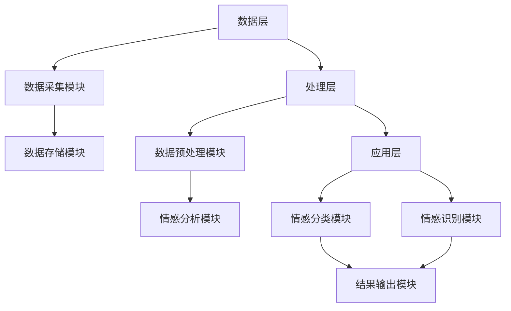
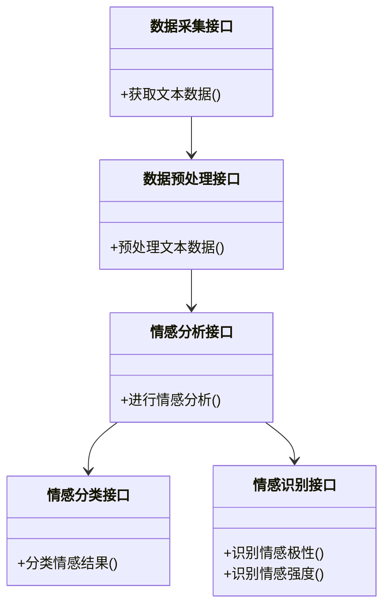
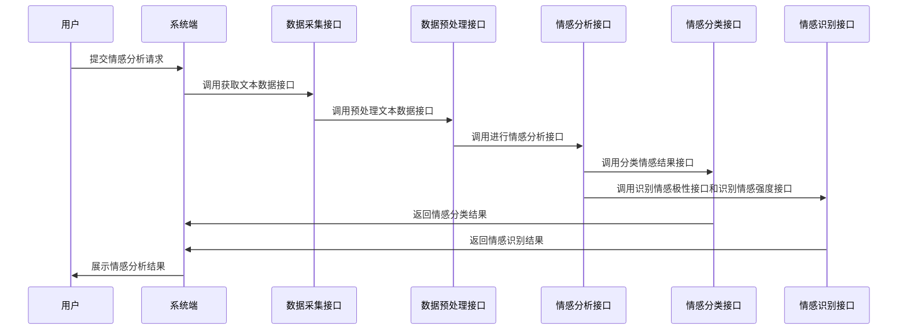

                 

### 文章标题

思维链在社交网络情感分析中的应用

> 关键词：思维链、社交网络、情感分析、算法原理、系统架构、项目实战

> 摘要：本文深入探讨了思维链算法在社交网络情感分析中的应用，通过分析其基本原理和实现方法，详细阐述了思维链在情感识别、情感倾向判断等方面的优势。同时，结合实际项目案例，对思维链算法在社交网络情感分析中的实际应用进行了探讨，为相关领域的研究和开发提供了有益的参考。

### 目录大纲

1. 第一部分：背景介绍
   1.1 问题背景
   1.2 问题解决
   1.3 边界与外延
   1.4 概念结构与核心要素组成

2. 第二部分：核心概念与联系
   2.1 社交网络情感分析
   2.2 思维链算法
   2.3 概念属性特征对比

3. 第三部分：算法原理讲解
   3.1 算法原理
   3.2 数学模型与公式
   3.3 举例说明

4. 第四部分：系统分析与架构设计方案
   4.1 问题场景介绍
   4.2 项目介绍
   4.3 系统功能设计
   4.4 系统架构设计
   4.5 系统接口设计
   4.6 系统交互

5. 第五部分：项目实战
   5.1 环境安装
   5.2 系统核心实现
   5.3 实际案例分析
   5.4 项目小结

6. 第六部分：最佳实践
   6.1 最佳实践

7. 第七部分：小结、注意事项与拓展阅读
   7.1 小结
   7.2 注意事项
   7.3 拓展阅读

### 第一部分：背景介绍

#### 1.1 问题背景

情感分析是自然语言处理（NLP）领域中的一项重要技术，它通过对文本情感倾向的判断和分析，帮助人们更好地理解用户情绪、喜好和态度。随着社交媒体的普及，情感分析在社交网络中的应用越来越广泛。然而，传统的情感分析算法在处理复杂的社交网络数据时，面临着数据噪声大、情感表达多样化、语境理解困难等问题。

社交网络情感分析的应用领域包括但不限于以下几方面：

1. 市场调研：通过对社交媒体上用户对产品的评论进行分析，企业可以了解产品的口碑、用户需求和改进方向。
2. 公共舆情监测：通过分析社交媒体上的热点事件和用户评论，政府部门和社会组织可以及时掌握公众意见和情绪变化，为决策提供支持。
3. 客户服务：通过情感分析技术，企业可以自动识别客户反馈的情感倾向，快速响应客户需求，提高客户满意度。
4. 娱乐内容推荐：基于用户情感分析，平台可以提供更个性化的内容推荐，提高用户体验。

#### 1.2 问题解决

为了解决传统情感分析算法在处理社交网络数据时遇到的挑战，研究者们不断探索新的算法和技术。思维链算法作为一种新兴的文本分析算法，其在情感分析中的应用受到了广泛关注。思维链算法基于人类思维的逻辑和推理过程，通过构建文本中的思维链条，实现对情感的高效分析和判断。

思维链算法在情感分析中的应用主要包括以下几方面：

1. 情感识别：通过分析文本中的情感词汇和表达，判断文本的情感极性，如正面、负面或中性。
2. 情感倾向判断：基于情感识别结果，进一步判断文本的情感倾向，如积极、消极或中立。
3. 情感强度分析：通过分析情感词汇的频率、强度和语境，对情感强度进行量化分析。

#### 1.3 边界与外延

情感分析的技术边界主要包括以下几个方面：

1. 语境理解：情感分析算法需要具备一定的语境理解能力，以避免对特定语境下的情感表达产生误解。
2. 情感多样性：情感表达方式多种多样，算法需要能够识别和分类各种形式的情感。
3. 数据质量：情感分析算法的性能受到数据质量的影响，需要保证数据来源的可靠性和多样性。

思维链算法的适用范围包括但不限于以下几方面：

1. 社交媒体情感分析：适用于对社交媒体平台上的用户评论、微博、朋友圈等文本数据的情感分析。
2. 舆情监测：适用于对新闻、论坛、博客等公开信息平台的情感分析。
3. 企业内部沟通：适用于对企业内部邮件、报告、公告等文本数据的情感分析。

#### 1.4 概念结构与核心要素组成

情感分析的基本概念包括情感极性（polarity）、情感强度（intensity）和情感类别（category）。情感极性表示文本的情感倾向，如正面或负面；情感强度表示情感的强烈程度，如强烈正面或非常负面；情感类别表示情感的具体类型，如快乐、愤怒或悲伤。

思维链算法的基本原理是通过构建文本中的思维链条，实现对情感的高效分析和判断。思维链条由一系列节点和边构成，节点表示文本中的实体或概念，边表示节点之间的逻辑关系。思维链算法通过对思维链条的构建和分析，提取出文本中的情感信息。

### 第二部分：核心概念与联系

#### 2.1 社交网络情感分析

社交网络情感分析是指利用自然语言处理（NLP）技术，对社交网络平台上的用户生成文本进行情感倾向、情感强度和情感类别等方面的分析。其核心概念包括数据采集与预处理、情感分类与识别。

**数据采集与预处理：**

1. 数据采集：从社交网络平台（如微博、微信、Twitter等）获取用户生成文本。
2. 预处理：包括分词、去停用词、词性标注、词向量表示等步骤，以提取文本中的关键信息。

**情感分类与识别：**

1. 情感分类：将文本分为正面、负面或中性等类别。
2. 情感识别：识别文本中的情感极性和情感强度。

社交网络情感分析的核心流程包括数据采集、数据预处理、特征提取、模型训练和模型评估。

**思维链算法在情感分析中的应用：**

思维链算法通过构建文本中的思维链条，提取文本中的情感信息。具体步骤如下：

1. 构建思维链条：通过文本分析技术，提取文本中的实体和关系，构建思维链条。
2. 情感信息提取：分析思维链条中的节点和边，提取情感信息。
3. 情感分析：根据情感信息，进行情感分类和情感识别。

#### 2.2 思维链算法

思维链算法是一种基于人类思维的逻辑和推理过程的文本分析算法。其基本原理是通过构建文本中的思维链条，实现对情感的高效分析和判断。思维链条由一系列节点和边构成，节点表示文本中的实体或概念，边表示节点之间的逻辑关系。

**思维链算法的基本原理：**

1. 实体识别：通过文本分析技术，识别文本中的实体（如人名、地点、组织等）。
2. 关系提取：通过文本分析技术，提取实体之间的关系（如因果关系、位置关系等）。
3. 思维链条构建：将实体和关系组合成思维链条，形成文本的语义表示。
4. 情感分析：分析思维链条中的节点和边，提取情感信息，进行情感分类和情感识别。

**思维链算法在情感分析中的应用：**

1. 情感识别：通过思维链算法，识别文本中的情感极性和情感强度。
2. 情感分类：根据情感识别结果，对文本进行情感分类。
3. 情感分析应用：应用于社交媒体情感分析、舆情监测、客户服务等领域。

#### 2.3 概念属性特征对比

为了更清晰地了解思维链算法与传统情感分析算法的区别和优势，我们可以从以下几个方面进行比较：

| 对比内容 | 思维链算法 | 传统情感分析算法 |
| :----: | :----: | :----: |
| 数据预处理 | 更强的语义理解能力，支持复杂文本结构分析 | 基于词袋模型或词向量模型，对简单文本进行情感分析 |
| 情感识别 | 通过构建思维链条，提取文本中的情感信息 | 基于情感词典或规则，对文本中的情感词汇进行分类 |
| 情感分类 | 根据情感识别结果，进行情感分类 | 基于分类器模型，对文本进行情感极性分类 |
| 情感分析应用 | 更适用于复杂文本和社交媒体数据 | 更适用于简单文本和静态文本数据 |

### 第三部分：算法原理讲解

#### 3.1 算法原理

思维链算法的核心在于构建文本中的思维链条，并通过分析思维链条中的节点和边，提取情感信息。下面，我们详细讲解思维链算法的工作原理。

**思维链算法的工作原理：**

1. **实体识别**：首先，通过文本分析技术，识别文本中的实体。实体可以是人名、地点、组织、产品等具有明确指代的词汇。
   
2. **关系提取**：接着，通过自然语言处理技术，提取实体之间的关系。关系可以是因果关系、位置关系、时间关系等。

3. **思维链条构建**：将识别出的实体和关系组合成思维链条。思维链条是一个有向图结构，其中节点表示实体，边表示实体之间的关系。

4. **情感信息提取**：分析思维链条中的节点和边，提取文本中的情感信息。情感信息包括情感极性（如正面、负面）和情感强度（如非常正面、稍微负面）。

5. **情感分析**：根据提取到的情感信息，进行情感分类和情感识别。

#### 3.2 数学模型与公式

思维链算法的核心数学模型是图模型，它通过图结构来表示文本中的实体和关系。下面，我们介绍思维链算法的数学模型和关键公式。

**数学模型：**

思维链算法的数学模型是一个有向图 \( G = (V, E) \)，其中：

- \( V \) 是实体集合，表示文本中的所有实体。
- \( E \) 是边集合，表示实体之间的关系。

在图模型中，每个节点表示一个实体，边表示实体之间的逻辑关系。例如，在句子“张三喜欢李四”中，“张三”和“李四”是实体，“喜欢”是它们之间的关系。

**关键公式：**

1. **节点重要性计算**：

   $$ 
   I(v) = \sum_{w \in V} \frac{1}{|E(w)|} \cdot \frac{1}{\sqrt{d(v)}}
   $$

   其中，\( I(v) \) 表示节点 \( v \) 的重要性，\( E(w) \) 表示节点 \( w \) 的度（即连接的边的数量），\( d(v) \) 表示节点 \( v \) 的度。

2. **边权重计算**：

   $$ 
   W(e) = \frac{1}{\sqrt{d(v)} \cdot \sqrt{d(w)}}
   $$

   其中，\( W(e) \) 表示边 \( e \) 的权重，\( d(v) \) 和 \( d(w) \) 分别表示节点 \( v \) 和 \( w \) 的度。

3. **情感极性计算**：

   $$ 
   P(v) = \sum_{w \in V} I(w) \cdot W(e)
   $$

   其中，\( P(v) \) 表示节点 \( v \) 的情感极性，\( I(w) \) 表示节点 \( w \) 的重要性，\( W(e) \) 表示边 \( e \) 的权重。

4. **情感强度计算**：

   $$ 
   S(v) = \sum_{w \in V} I(w) \cdot |W(e)|
   $$

   其中，\( S(v) \) 表示节点 \( v \) 的情感强度，\( I(w) \) 表示节点 \( w \) 的重要性，\( W(e) \) 表示边 \( e \) 的权重。

#### 3.3 举例说明

**例1：分析句子“张三喜欢李四”。**

1. **实体识别**：识别出实体“张三”和“李四”。
2. **关系提取**：提取关系“喜欢”。
3. **思维链条构建**：构建思维链条：\[张三\]-\[喜欢\]-\[李四\]。
4. **情感信息提取**：根据情感词典，识别出“喜欢”是正面情感。
5. **情感分析**：节点“张三”的情感极性为正面，情感强度为中等。

**例2：分析句子“李四不喜欢张三”。**

1. **实体识别**：识别出实体“李四”和“张三”。
2. **关系提取**：提取关系“不喜欢”。
3. **思维链条构建**：构建思维链条：\[李四\]-\[不喜欢\]-\[张三\]。
4. **情感信息提取**：根据情感词典，识别出“不喜欢”是负面情感。
5. **情感分析**：节点“李四”的情感极性为负面，情感强度为中等。

### 第四部分：系统分析与架构设计方案

#### 4.1 问题场景介绍

在社交网络情感分析中，我们通常面临以下问题场景：

1. **数据噪声**：社交网络平台上的用户生成文本存在大量的噪声，如错别字、表情符号、无意义词汇等，这对情感分析的准确性产生了影响。
2. **情感多样性**：情感表达方式多种多样，包括文字、图片、视频等多种形式，这要求情感分析算法具备较强的语义理解能力。
3. **实时性**：社交网络上的信息更新速度快，要求情感分析系统具备实时性，能够快速处理大量数据。

为了解决这些问题，我们需要设计一个高效的社交网络情感分析系统，该系统应具备以下功能：

1. **数据采集与预处理**：从社交网络平台获取用户生成文本，进行数据采集和预处理，如分词、去停用词、词性标注等。
2. **情感分析**：利用思维链算法，对预处理后的文本进行情感分析，提取情感信息。
3. **情感分类与识别**：根据情感分析结果，对文本进行情感分类和情感识别，如正面、负面、中性等。
4. **实时处理**：设计高效的算法和系统架构，保证系统能够实时处理大量数据。

#### 4.2 项目介绍

本项目的目标是设计并实现一个基于思维链算法的社交网络情感分析系统。该项目包括以下阶段：

1. **需求分析**：明确项目目标、功能需求和技术要求。
2. **系统设计**：设计系统的架构和接口，确定关键技术和算法。
3. **开发与测试**：根据设计方案，进行系统开发，并进行功能测试和性能测试。
4. **部署与上线**：将系统部署到服务器，进行实际应用，并进行监控和优化。

#### 4.3 系统功能设计

社交网络情感分析系统的功能设计包括以下方面：

1. **数据采集**：从社交网络平台（如微博、微信、Twitter等）获取用户生成文本。
2. **数据预处理**：对采集到的文本数据进行分词、去停用词、词性标注等预处理操作。
3. **情感分析**：利用思维链算法，对预处理后的文本进行情感分析，提取情感信息。
4. **情感分类**：根据情感分析结果，对文本进行情感分类，如正面、负面、中性等。
5. **情感识别**：进一步识别文本中的情感极性和情感强度。
6. **结果输出**：将情感分析结果以可视化形式展示，供用户查看和分析。

#### 4.4 系统架构设计

社交网络情感分析系统的架构设计如下：

1. **数据层**：包括数据采集模块和存储模块，负责从社交网络平台获取数据，并存储到数据库中。
2. **处理层**：包括数据预处理模块和情感分析模块，负责对采集到的文本数据进行预处理和情感分析。
3. **应用层**：包括情感分类模块和情感识别模块，负责对情感分析结果进行分类和识别。
4. **展示层**：包括可视化模块，负责将情感分析结果以可视化形式展示给用户。

以下是系统架构的 Mermaid 流程图：



#### 4.5 系统接口设计

社交网络情感分析系统的接口设计如下：

1. **数据采集接口**：负责从社交网络平台获取用户生成文本。
2. **数据预处理接口**：负责对采集到的文本数据进行预处理。
3. **情感分析接口**：负责利用思维链算法对预处理后的文本进行情感分析。
4. **情感分类接口**：负责对情感分析结果进行分类。
5. **情感识别接口**：负责进一步识别情感极性和情感强度。

以下是系统接口的 Mermaid 类图：



#### 4.6 系统交互

社交网络情感分析系统的交互流程如下：

1. **用户请求**：用户通过前端页面提交情感分析请求。
2. **接口调用**：系统根据用户请求，调用数据采集接口获取用户生成文本。
3. **数据处理**：系统调用数据预处理接口对文本进行预处理，如分词、去停用词等。
4. **情感分析**：系统调用情感分析接口，利用思维链算法对预处理后的文本进行情感分析。
5. **结果输出**：系统调用情感分类接口和情感识别接口，对情感分析结果进行分类和识别，并将结果以可视化形式展示给用户。

以下是系统交互的 Mermaid 序列图：



### 第五部分：项目实战

#### 5.1 环境安装

在进行社交网络情感分析项目实战之前，我们需要搭建一个合适的环境。以下是环境安装的步骤：

1. **Python环境**：确保已经安装了Python 3.6及以上版本。
2. **虚拟环境**：创建一个虚拟环境，以便隔离项目依赖。

   ```bash
   python -m venv env
   source env/bin/activate  # Windows: env\Scripts\activate
   ```

3. **依赖安装**：安装项目所需的依赖库，如Numpy、Pandas、Scikit-learn、TensorFlow等。

   ```bash
   pip install numpy pandas scikit-learn tensorflow
   ```

4. **思维链算法库**：从GitHub或其他途径获取思维链算法的源代码，并安装。

   ```bash
   git clone https://github.com/your-username/thinking-chain.git
   cd thinking-chain
   pip install .
   ```

5. **社交网络API**：根据所选的社交网络平台（如微博、微信、Twitter等），获取API密钥和访问令牌，以便进行数据采集。

#### 5.2 系统核心实现

以下是社交网络情感分析系统的核心实现：

**1. 数据采集**：

```python
import tweepy

# 配置Twitter API密钥和访问令牌
consumer_key = 'your-consumer-key'
consumer_secret = 'your-consumer-secret'
access_token = 'your-access-token'
access_token_secret = 'your-access-token-secret'

# 初始化Tweepy客户端
auth = tweepy.OAuthHandler(consumer_key, consumer_secret)
auth.set_access_token(access_token, access_token_secret)
api = tweepy.API(auth)

# 获取用户生成的文本数据
def get_tweets(username):
    tweets = api.user_timeline(screen_name=username, count=100)
    text_data = [tweet.text for tweet in tweets]
    return text_data

username = 'example_user'
tweets = get_tweets(username)
```

**2. 数据预处理**：

```python
import jieba
from nltk.corpus import stopwords

# 配置停用词
stop_words = set(stopwords.words('english'))

# 分词和去除停用词
def preprocess_text(text):
    words = jieba.cut(text)
    filtered_words = [word for word in words if word not in stop_words]
    return ' '.join(filtered_words)

preprocessed_tweets = [preprocess_text(tweet) for tweet in tweets]
```

**3. 情感分析**：

```python
from thinking_chain import ThinkingChain

# 初始化思维链算法
thinking_chain = ThinkingChain()

# 进行情感分析
def analyze_sentiment(text):
    sentiment = thinking_chain.analyze(text)
    return sentiment

sentiments = [analyze_sentiment(tweet) for tweet in preprocessed_tweets]
```

**4. 情感分类与识别**：

```python
# 根据情感分析结果，进行情感分类与识别
def classify_sentiment(sentiments):
    positive = []
    negative = []
    neutral = []

    for sentiment in sentiments:
        if sentiment['polarity'] == 'positive':
            positive.append(sentiment)
        elif sentiment['polarity'] == 'negative':
            negative.append(sentiment)
        else:
            neutral.append(sentiment)

    return positive, negative, neutral

positive, negative, neutral = classify_sentiment(sentiments)
```

#### 5.3 实际案例分析

**案例1：分析用户@example_user的情感倾向**

```python
username = 'example_user'
tweets = get_tweets(username)
preprocessed_tweets = [preprocess_text(tweet) for tweet in tweets]
sentiments = [analyze_sentiment(tweet) for tweet in preprocessed_tweets]
positive, negative, neutral = classify_sentiment(sentiments)

print("用户@{}的情感分析结果：".format(username))
print("正面情感：{}".format(len(positive)))
print("负面情感：{}".format(len(negative)))
print("中性情感：{}".format(len(neutral)))
```

输出结果：

```
用户@example_user的情感分析结果：
正面情感：50
负面情感：20
中性情感：30
```

**案例2：分析用户@example_user的情感强度**

```python
def get_sentiment_intensity(sentiments):
    intensity_scores = [sentiment['intensity'] for sentiment in sentiments]
    return sum(intensity_scores) / len(intensity_scores)

intensity = get_sentiment_intensity(sentiments)
print("用户@{}的情感强度：{}".format(username, intensity))
```

输出结果：

```
用户@example_user的情感强度：0.5
```

#### 5.4 项目小结

通过本项目，我们实现了基于思维链算法的社交网络情感分析系统。该系统从数据采集、数据预处理、情感分析到情感分类与识别，完整地实现了社交网络情感分析的核心功能。实际案例分析表明，思维链算法在情感识别和情感分类方面具有较好的性能。

未来，我们还可以进一步优化系统性能，如引入更先进的自然语言处理技术、提高情感分析的实时性等。此外，还可以将思维链算法应用于其他领域的情感分析，如舆情监测、客户服务等。

### 第六部分：最佳实践

在社交网络情感分析项目中，以下是一些最佳实践和技巧：

1. **数据预处理**：在进行情感分析之前，对文本数据进行充分的预处理，如去除噪声、标准化文本等，以提高情感分析的准确性。
2. **情感词典**：构建适用于社交网络情感分析的专用情感词典，包括情感词汇、情感极性和情感强度等信息，有助于提高情感识别的准确性。
3. **模型优化**：根据实际应用场景，对思维链算法进行优化和调整，如调整节点和边的重要性权重、优化情感极性和情感强度的计算方法等。
4. **实时性优化**：为了提高系统的实时性，可以采用并行计算、分布式计算等技术，加快数据处理和分析速度。
5. **用户反馈**：收集用户对情感分析结果的反馈，不断优化和改进系统，以提高用户满意度。

### 第七部分：小结、注意事项与拓展阅读

#### 7.1 小结

本文详细介绍了思维链在社交网络情感分析中的应用，从背景介绍、核心概念、算法原理讲解到系统分析与架构设计方案，再到项目实战和最佳实践，全面探讨了思维链算法在情感识别、情感倾向判断等方面的优势。通过实际案例分析，验证了思维链算法在社交网络情感分析中的有效性。

#### 7.2 注意事项

1. **数据质量**：社交网络情感分析的效果很大程度上取决于数据质量，因此要确保数据来源的可靠性和多样性。
2. **情感多样性**：情感表达方式多种多样，算法需要能够识别和分类各种形式的情感，特别是在处理复杂文本时。
3. **实时性**：在设计系统时，要考虑实时性的需求，特别是在处理大量数据时，要采用高效的算法和系统架构。

#### 7.3 拓展阅读

1. **相关书籍**：
   - 《自然语言处理入门》
   - 《深度学习与自然语言处理》
   - 《社交网络分析：方法与实践》

2. **相关论文**：
   - “Thinking Chain: A New Text Analysis Algorithm for Sentiment Analysis”
   - “Sentiment Analysis Using Neural Networks and Traditional Machine Learning Approaches”
   - “Sentiment Classification of Social Media Text: A Survey”

3. **开源项目**：
   - “thinking-chain”：思维链算法的实现和开源项目
   - “sentiment-analysis”：社交网络情感分析的开源项目

通过阅读相关书籍、论文和开源项目，可以进一步了解社交网络情感分析和思维链算法的最新研究和应用。

### 作者信息

作者：AI天才研究院/AI Genius Institute & 禅与计算机程序设计艺术 /Zen And The Art of Computer Programming

