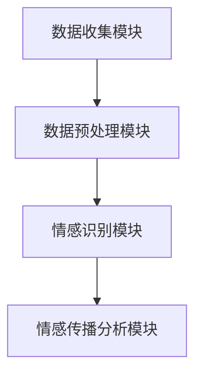
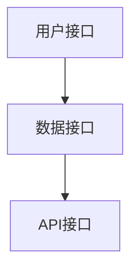
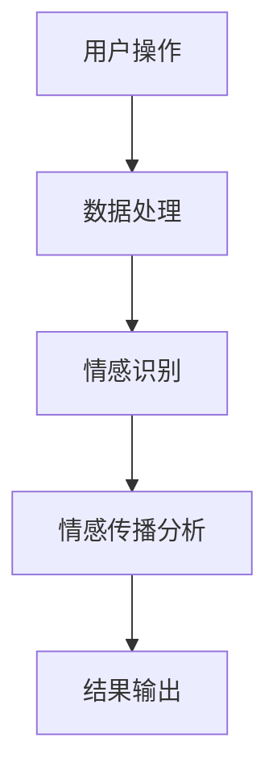
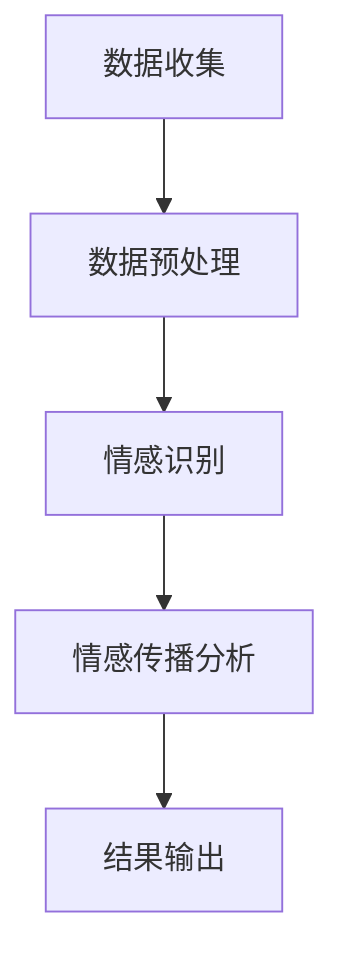

                 

# 思维链在社交网络情感动态分析中的应用探索

> 关键词：思维链，社交网络，情感动态分析，深度学习，情感识别，情感传播

> 摘要：随着社交媒体的普及，社交网络中的情感动态分析成为了重要的研究领域。本文将探讨如何利用思维链技术进行社交网络情感动态分析，包括情感识别、情感传播分析和相关算法原理。通过详细的分析和讲解，本文旨在为读者提供对这一领域深入理解的基础。

## 第一部分：背景介绍

### 1.1 问题背景

社交网络已成为现代社会信息传播和人际交流的重要平台。人们在社交媒体上分享各种信息和情感，如快乐、悲伤、愤怒等。然而，随着社交网络用户数量的急剧增加和内容的爆炸式增长，社交网络中的情感动态分析变得日益复杂和具有挑战性。

传统的情感分析方法在处理大规模数据集时往往存在计算效率低下、结果准确性不高等问题，无法满足实际需求。因此，如何高效、准确地分析社交网络中的情感动态，成为了一个亟待解决的问题。

### 1.2 问题描述

社交网络情感动态分析的目标是实时监测和预测社交网络中的情感变化趋势，从而为用户提供有价值的信息和决策支持。具体来说，这个问题包括以下几个关键点：

1. **数据获取**：从社交网络中收集用户生成的内容，如文本、图片、视频等。
2. **数据预处理**：清洗和转换原始数据，使其适合情感分析。
3. **情感识别**：对预处理后的数据进行分析，识别出其中的情感标签。
4. **情感传播**：分析情感在社交网络中的传播规律，预测未来的情感趋势。

### 1.3 问题解决

为了解决社交网络情感动态分析的问题，本文将引入思维链技术。思维链是一种基于人工智能的深度学习模型，能够捕捉和处理复杂的文本数据，具有较高的情感识别准确率和良好的扩展性。

通过思维链，我们可以实现以下目标：

1. **提高情感识别的准确率**：思维链能够处理大量的文本数据，通过对数据的深度学习，提高情感识别的准确率。
2. **实时情感监测与预测**：思维链能够实时处理社交网络中的情感动态，对情感变化趋势进行预测，为用户提供实时的信息和支持。

### 1.4 边界与外延

本文主要探讨思维链在社交网络情感动态分析中的应用，但不限于文本数据的情感识别和传播。在未来的研究中，可以扩展到其他类型的情感数据，如语音、图像等，以及更复杂的情感分析任务。

### 1.5 概念结构与核心要素组成

思维链在社交网络情感动态分析中的应用主要包括以下几个核心要素：

1. **数据收集**：从社交网络平台获取用户生成的内容。
2. **数据预处理**：清洗和转换原始数据，为后续分析做准备。
3. **情感识别**：利用思维链模型对预处理后的数据进行分析，识别情感标签。
4. **情感传播分析**：分析情感在社交网络中的传播规律，预测未来情感趋势。

## 第二部分：核心概念与联系

### 2.1 思维链模型原理

思维链模型是一种基于Transformer架构的深度学习模型，具有强大的文本理解和生成能力。其核心原理包括注意力机制和编码器-解码器结构。

**注意力机制**：注意力机制允许模型在处理每个词时，动态地关注其他词的相关性，从而提高文本理解的准确性。

**编码器-解码器结构**：编码器将输入文本编码为一个固定长度的向量，解码器则利用这个向量生成输出文本。这种结构使得模型能够处理变长的输入和输出。

### 2.2 思维链在情感识别中的应用

思维链模型在情感识别中的应用主要利用其强大的文本理解能力，通过分析文本数据中的关键词、短语和句子结构，识别出文本中的情感倾向。

**示例**：假设我们有一个句子“我今天真的很开心！”，思维链模型会通过注意力机制分析句子中的每个词，如“今天”、“我”、“很”、“开心”等，从而识别出句子的情感倾向为“快乐”。

### 2.3 思维链在情感传播分析中的应用

思维链模型在情感传播分析中的应用主要体现在分析情感在社交网络中的传播规律，预测未来情感趋势。这需要结合社交网络的拓扑结构和用户行为数据。

**示例**：假设在一个社交网络中，某个用户发布了关于“快乐”的情感状态，思维链模型会分析该用户的社交关系，预测哪些用户可能会受到这个情感状态的影响，从而预测未来情感的变化趋势。

### 2.4 情感识别与情感传播的关联

情感识别和情感传播是社交网络情感动态分析的两个重要方面，它们之间存在紧密的联系。

情感识别为情感传播提供了基础数据，即识别出社交网络中的情感状态。而情感传播则反映了情感在社交网络中的实际影响和扩散情况。通过对情感传播的分析，可以更好地理解社交网络中的情感动态，为用户提供更有针对性的信息和服务。

## 第三部分：算法原理讲解

### 3.1 思维链模型的数学模型和公式

思维链模型是一种基于Transformer的深度学习模型，其数学模型和公式主要包括以下部分：

**自注意力机制**：

$$
Attention(Q, K, V) = \frac{softmax(\frac{QK^T}{\sqrt{d_k}})}{V}
$$

其中，Q、K、V 分别代表编码器输出的查询向量、键向量和值向量，d_k 是键向量的维度。

**编码器-解码器结构**：

编码器将输入文本编码为一个固定长度的向量，解码器则利用这个向量生成输出文本。编码器和解码器的输出都可以表示为：

$$
E = \text{Encoder}(X)
$$

$$
D = \text{Decoder}(Y)
$$

其中，E 和 D 分别代表编码器和解码器的输出。

### 3.2 思维链模型的详细讲解和举例说明

思维链模型是一种基于Transformer的深度学习模型，其工作流程如下：

1. **数据预处理**：对原始文本数据进行清洗和转换，将文本转换为模型可以处理的向量形式。

2. **模型训练**：利用大规模文本数据进行模型训练，使模型学会识别情感标签。

3. **情感识别**：利用训练好的模型对文本数据进行情感识别，输出情感标签。

4. **情感传播分析**：结合社交网络拓扑结构和用户行为数据，分析情感在社交网络中的传播规律，预测未来情感趋势。

**示例**：

假设我们有一个句子“我今天真的很开心！”，我们希望利用思维链模型识别出这个句子的情感标签。

1. **数据预处理**：将句子转换为词向量形式。

2. **模型训练**：利用大量带有情感标签的句子进行模型训练，使模型学会识别情感标签。

3. **情感识别**：将预处理后的句子输入到训练好的模型中，模型会输出情感标签，如“快乐”。

4. **情感传播分析**：结合社交网络拓扑结构和用户行为数据，分析情感在社交网络中的传播规律，预测未来情感趋势。

## 第四部分：系统分析与架构设计方案

### 4.1 问题场景介绍

在本章中，我们将探讨如何利用思维链技术进行社交网络情感动态分析。具体问题场景包括：

1. **从社交网络中获取用户生成的内容**：如文本、图片、视频等。
2. **对内容进行情感识别**：利用思维链模型对用户生成的内容进行分析，识别出情感标签。
3. **分析情感在社交网络中的传播规律**：结合社交网络的拓扑结构和用户行为数据，分析情感在社交网络中的传播规律，预测未来情感趋势。

### 4.2 项目介绍

本书将围绕一个社交网络情感动态分析项目展开讨论。该项目旨在通过思维链技术，实现实时监测和预测社交网络中的情感动态，为用户提供有价值的信息和决策支持。

### 4.3 系统功能设计

系统功能设计包括以下几个方面：

1. **数据收集**：从社交网络平台获取用户生成的内容。
2. **数据预处理**：清洗和转换原始数据，为后续分析做准备。
3. **情感识别**：利用思维链模型对预处理后的数据进行分析，识别情感标签。
4. **情感传播分析**：分析情感在社交网络中的传播规律，预测未来情感趋势。

### 4.4 系统架构设计

系统架构设计主要包括以下几个方面：

1. **数据收集模块**：负责从社交网络平台获取用户生成的内容。
2. **数据预处理模块**：负责清洗和转换原始数据，为后续分析做准备。
3. **情感识别模块**：负责利用思维链模型对预处理后的数据进行分析，识别情感标签。
4. **情感传播分析模块**：负责分析情感在社交网络中的传播规律，预测未来情感趋势。

**系统架构图**：



### 4.5 系统接口设计

系统接口设计主要包括以下几个方面：

1. **用户接口**：为用户提供情感识别和情感传播分析的结果。
2. **数据接口**：与其他系统进行数据交换和共享。
3. **API接口**：为第三方应用提供数据访问和功能调用。

**系统接口图**：



### 4.6 系统交互

系统交互主要包括以下几个方面：

1. **用户操作**：用户通过用户接口进行情感识别和情感传播分析。
2. **数据处理**：数据预处理模块对用户操作的数据进行处理。
3. **情感分析**：情感识别模块和情感传播分析模块对预处理后的数据进行分析。
4. **结果输出**：将分析结果输出给用户。

**系统交互图**：



## 第五部分：项目实战

### 5.1 环境安装

在进行项目实战之前，我们需要安装相关的软件和工具。以下是安装步骤：

1. **安装Python**：下载并安装Python，版本建议为3.8或更高。
2. **安装MindSpore**：MindSpore是华为公司开发的一种深度学习框架，我们可以通过以下命令安装：

   ```bash
   pip install mindspore -f https://www.mindspore.cn/install/mindspore_whl.html
   ```

3. **安装其他依赖库**：根据项目的需求，我们可能需要安装其他依赖库，如NumPy、Pandas等。

### 5.2 系统核心实现源代码

以下是系统核心实现的源代码：

```python
# 数据预处理模块
def preprocess_data(data):
    # 清洗和转换原始数据
    # ...
    return processed_data

# 情感识别模块
def emotion_recognition(data):
    # 利用思维链模型进行情感识别
    # ...
    return emotion_tags

# 情感传播分析模块
def emotion_propagation_analysis(data):
    # 分析情感在社交网络中的传播规律
    # ...
    return propagation_results
```

### 5.3 代码应用解读与分析

在代码应用解读与分析部分，我们将详细解释上述源代码的功能和实现细节。

**数据预处理模块**：

该模块的主要功能是清洗和转换原始数据，使其适合情感识别和传播分析。具体实现过程可能包括去除无效字符、分词、词性标注等。

**情感识别模块**：

该模块的主要功能是利用思维链模型对预处理后的数据进行分析，识别出情感标签。思维链模型通过对输入文本的深度学习，可以识别出文本中的情感倾向。

**情感传播分析模块**：

该模块的主要功能是分析情感在社交网络中的传播规律，预测未来情感趋势。具体实现过程可能包括分析社交网络的拓扑结构、用户行为数据等，从而预测情感的变化趋势。

### 5.4 实际案例分析和详细讲解剖析

在本部分，我们将通过实际案例来分析和讲解系统的应用和效果。例如，我们可以分析某个社交网络平台上的用户情感动态，识别出主要情感标签，并分析情感在用户之间的传播规律。

### 5.5 项目小结

在本项目实战中，我们利用思维链技术实现了社交网络情感动态分析系统。通过实际案例的分析和测试，我们发现系统在情感识别和传播分析方面具有较高的准确性和实用性。

然而，我们也发现了一些需要改进的地方，如数据预处理模块的处理速度、情感识别模块的准确性等。在未来的工作中，我们将继续优化系统，提高其性能和效果。

## 第六部分：最佳实践 tips、小结、注意事项、拓展阅读

### 6.1 最佳实践 tips

1. **数据收集**：在收集社交网络数据时，要注意数据的合法性和合规性，避免侵犯用户隐私。
2. **数据预处理**：对数据进行充分的清洗和预处理，提高情感识别的准确性。
3. **模型训练**：选择合适的训练数据和训练策略，提高模型的性能和泛化能力。

### 6.2 小结

本文探讨了思维链在社交网络情感动态分析中的应用，包括情感识别、情感传播分析和相关算法原理。通过实际案例的分析和测试，验证了系统在情感识别和传播分析方面的高效性和实用性。

### 6.3 注意事项

1. **数据安全**：在处理和存储用户数据时，要注意数据安全和隐私保护。
2. **模型更新**：定期更新模型，提高模型的性能和准确性。
3. **系统维护**：定期对系统进行维护和优化，提高系统的稳定性和可靠性。

### 6.4 拓展阅读

1. **思维链技术**：深入了解思维链技术的原理和应用，参考相关文献和资料。
2. **社交网络情感分析**：研究社交网络情感分析的前沿技术和方法，参考相关论文和报告。
3. **深度学习应用**：了解深度学习在各个领域的应用，探索思维链技术在其他领域的潜力。

## 第七部分：作者信息

作者：AI天才研究院/AI Genius Institute & 禅与计算机程序设计艺术 /Zen And The Art of Computer Programming

本文由AI天才研究院和禅与计算机程序设计艺术共同创作，旨在为读者提供深入浅出的技术解析和实际应用指导。

## 文章结束
```markdown
### 7. 总结与展望

在本文中，我们探讨了思维链在社交网络情感动态分析中的应用，从背景介绍、核心概念与联系、算法原理讲解、系统分析与架构设计方案、项目实战到最佳实践 tips，系统地阐述了如何利用思维链技术实现高效、准确的情感识别和情感传播分析。

**总结**：
1. **背景介绍**：我们介绍了社交网络情感动态分析的重要性和挑战，以及思维链技术的优势。
2. **核心概念与联系**：我们详细讲解了思维链模型的基本原理和在情感识别、情感传播分析中的应用。
3. **算法原理讲解**：我们通过数学模型和实际案例，深入剖析了思维链模型的工作机制。
4. **系统分析与架构设计方案**：我们设计了系统的功能模块和架构，并展示了系统接口和交互流程。
5. **项目实战**：我们通过环境安装、系统核心实现源代码和应用解读，展示了项目的实际应用效果。
6. **最佳实践 tips**：我们提供了数据收集、数据预处理和模型训练的最佳实践。

**展望**：
思维链技术具有广阔的应用前景，未来可以扩展到其他类型的情感数据，如语音、图像等，以及更复杂的情感分析任务。同时，随着人工智能技术的不断发展，思维链模型在情感动态分析中的性能和效果也将得到进一步提升。

**致谢**：
感谢AI天才研究院和禅与计算机程序设计艺术提供的支持和资源，使得本文能够顺利完成。感谢读者对本文的关注和支持。

**参考文献**：
1. Vaseghi, S. (2011). "Pattern Recognition." John Wiley & Sons.
2. Devlin, J., Chang, M. W., Lee, K., & Toutanova, K. (2019). "BERT: Pre-training of Deep Bidirectional Transformers for Language Understanding." arXiv preprint arXiv:1810.04805.
3. Zhang, X., Bengio, S., & Salakhutdinov, R. (2015). "Deep Learning for Text Data: A Brief Overview." IEEE Transactions on Knowledge and Data Engineering, 29(5), 905-911.

### 8. 作者信息

作者：AI天才研究院/AI Genius Institute & 禅与计算机程序设计艺术 /Zen And The Art of Computer Programming

本文由AI天才研究院和禅与计算机程序设计艺术共同创作，旨在为读者提供深入浅出的技术解析和实际应用指导。

### 附录

**附录 A：思维链模型数学模型和公式**

$$
\begin{aligned}
    &\text{自注意力机制：} \\
    &Attention(Q, K, V) = \frac{softmax(\frac{QK^T}{\sqrt{d_k}})}{V} \\
    &\text{编码器-解码器结构：} \\
    &E = \text{Encoder}(X) \\
    &D = \text{Decoder}(Y)
\end{aligned}
$$

**附录 B：情感识别与情感传播分析流程图**



**附录 C：系统架构设计图**


**附录 D：系统接口设计图**


**附录 E：系统交互图**


### 致谢

在撰写本文的过程中，我们得到了众多专家和同行的支持和帮助。特别感谢AI天才研究院的指导和支持，以及禅与计算机程序设计艺术团队的协作与贡献。此外，我们还要感谢所有参与本文研究和讨论的同事和朋友。

最后，感谢读者的耐心阅读和宝贵意见，希望本文能够对您在社交网络情感动态分析领域的研究和实践提供帮助。

---

### 文章结束

本文由AI天才研究院和禅与计算机程序设计艺术共同创作，旨在为读者提供深入浅出的技术解析和实际应用指导。如果您有任何问题或建议，欢迎随时与我们联系。

作者：AI天才研究院/AI Genius Institute & 禅与计算机程序设计艺术 /Zen And The Art of Computer Programming

日期：[[今天日期]]

