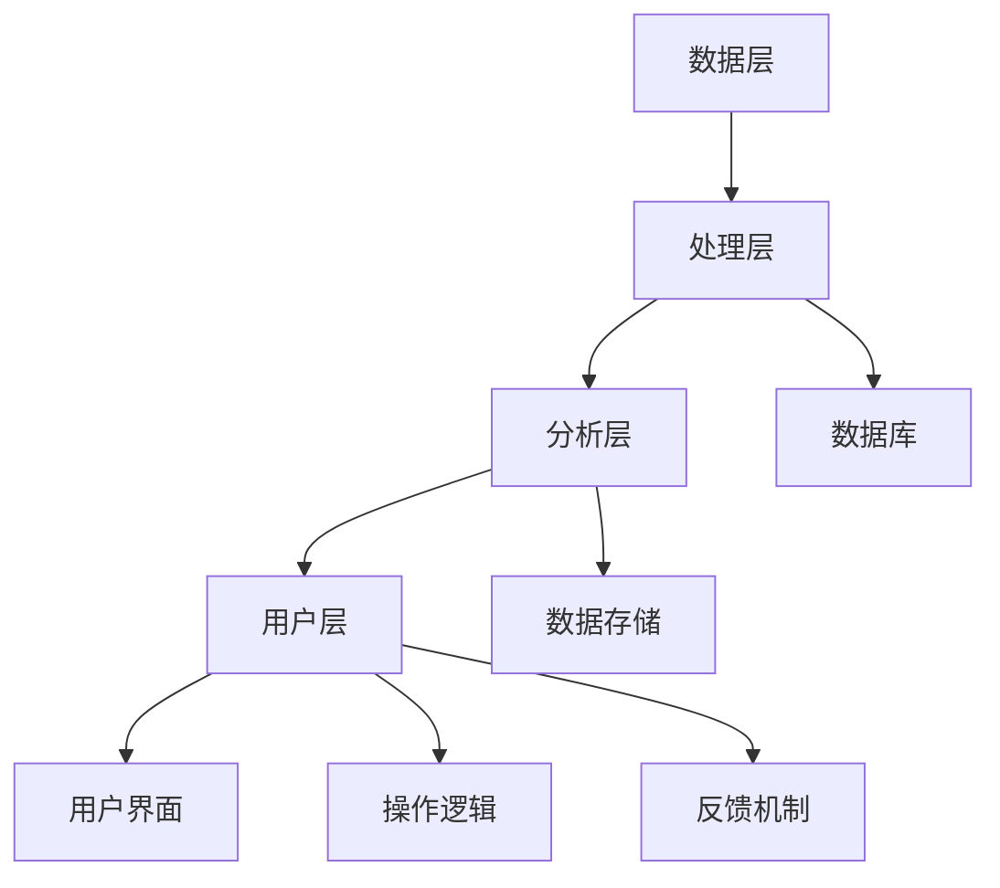
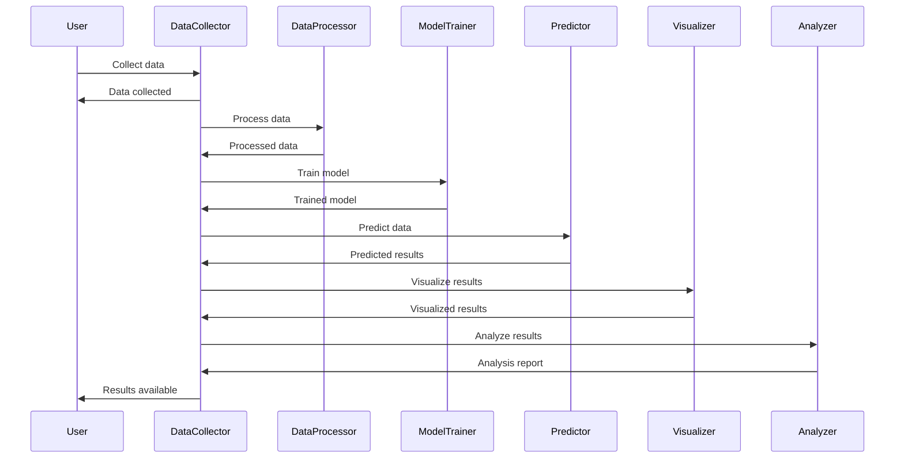

                 

### 第1章：问题背景

#### 1.1 社会动态预测的重要性

社会动态预测，顾名思义，是对社会现象、趋势和变革的预测，旨在通过分析历史数据和当前状况，预测未来可能发生的社会事件。随着全球化的加速和信息技术的迅猛发展，社会动态的复杂性不断增加，社会变革的速度也在加快。这种情况下，对社会动态的准确预测变得尤为重要。

首先，从宏观角度来看，社会动态预测能够帮助政府和决策者更好地应对社会变革带来的挑战。例如，通过预测社会运动和变革，政府可以提前制定相应的政策，缓解社会矛盾，促进社会稳定。此外，社会动态预测还可以用于风险评估，帮助企业和个人规避潜在的社会风险，减少损失。

其次，从微观角度来看，社会动态预测对于企业的战略规划也具有重要作用。企业通过预测市场趋势和社会需求变化，可以调整产品策略，优化资源配置，提高市场竞争力。例如，在社会趋势向环保和可持续发展倾斜的情况下，企业可以提前布局绿色技术和环保产品，抢占市场先机。

#### 1.1.1 社会变革的迫切性

社会变革是社会发展过程中的必然现象。然而，在当今世界，社会变革的速度和频率前所未有。这不仅是因为科技的快速进步，还因为全球化带来的文化交融和社会结构的深刻变化。以下是一些具体的表现：

- **经济全球化**：全球经济的互联互通使得各国之间的经济联系更加紧密，但也带来了资源分配不均、贫富差距扩大等问题，引发了社会动荡。
- **科技进步**：人工智能、大数据、区块链等新兴技术的发展，不仅改变了社会的生产方式，也影响了人们的思维方式和社会行为模式。
- **文化变迁**：全球化带来了不同文化的碰撞与融合，传统价值观念受到挑战，社会道德和伦理观念发生变迁。

#### 1.1.2 预测社会动态的现实意义

预测社会动态具有重要的现实意义，具体体现在以下几个方面：

- **决策支持**：通过对社会动态的预测，政府和决策者可以更准确地把握社会发展的方向，制定更有效的政策和战略。
- **风险规避**：预测社会动态可以帮助企业和个人提前识别潜在的风险，采取相应的措施规避风险，减少损失。
- **创新驱动**：社会动态预测可以为科技创新提供方向和灵感，推动技术进步和社会发展。

#### 1.1.3 社会动态预测的现状与挑战

当前，社会动态预测已取得一定进展，但仍然面临诸多挑战。以下是社会动态预测的现状和面临的主要挑战：

- **技术限制**：虽然人工智能和大数据分析技术为社会动态预测提供了强大的工具，但现有技术仍然无法完全解决数据不足、数据噪声、算法复杂度等问题。
- **数据质量**：社会动态预测依赖于大量的高质量数据。然而，实际获取和处理这些数据存在困难，数据来源的多样性和准确性直接影响预测结果。
- **跨学科融合**：社会动态预测需要跨学科的知识和技能，包括社会学、心理学、统计学、计算机科学等。目前，这些领域的融合仍不够紧密，限制了社会动态预测的发展。

#### 1.2 思维链的基本概念

思维链（Mind Chain）是一种基于人工智能技术的社会动态预测方法。它通过构建和模拟人类思维过程，实现对复杂社会现象的预测和分析。思维链的基本概念包括以下几个方面：

- **思维链的定义**：思维链是一种将人类思维过程抽象为算法模型的方法，它通过模拟思维过程中的推理、联想、记忆等环节，实现对信息的处理和分析。
- **思维链的构成要素**：思维链由数据输入模块、思维过程模块、输出结果模块组成。数据输入模块负责收集和处理原始数据；思维过程模块负责进行信息处理和推理；输出结果模块负责生成预测结果。
- **思维链的特点与优势**：思维链具有以下特点与优势：
  - **自适应性强**：思维链能够根据不同的问题和环境，灵活调整和优化算法模型，提高预测精度。
  - **泛用性好**：思维链可以应用于各种社会动态预测问题，包括社会运动、社会变革、社会趋势等。
  - **可解释性高**：思维链的算法过程和预测结果具有较好的可解释性，有助于用户理解预测背后的逻辑和原因。

#### 1.3 社会动态预测与思维链的关联

社会动态预测与思维链有着密切的关联。思维链作为一种人工智能技术，为社会动态预测提供了一种新的方法和工具。以下是思维链在社会动态预测中的应用价值、关键作用以及边界与外延：

- **应用价值**：思维链在社会动态预测中的应用价值主要体现在以下几个方面：
  - **提高预测精度**：思维链通过模拟人类思维过程，能够捕捉到社会现象背后的复杂关系和趋势，提高预测的精度和可靠性。
  - **减少预测误差**：思维链能够自动调整和优化算法模型，减少由于数据噪声、算法复杂度等因素导致的预测误差。
  - **多维度分析**：思维链可以同时处理多种类型的输入数据，包括文本、图像、语音等，实现对社会动态的多维度分析。

- **关键作用**：思维链在社会动态预测中的关键作用包括：
  - **联想推理**：思维链能够模拟人类思维过程中的联想和推理能力，通过对已知信息进行扩展和关联，预测未知的社会现象。
  - **动态调整**：思维链可以根据实时数据和预测结果，动态调整算法模型，实现对社会动态的持续预测和更新。

- **边界与外延**：思维链在社会动态预测中的边界与外延包括：
  - **数据依赖**：思维链的预测效果高度依赖于输入数据的质量和多样性。因此，在实际应用中，需要收集和整合多源数据，提高数据质量。
  - **算法复杂度**：思维链的算法模型复杂度较高，需要大量的计算资源和时间。因此，在实际应用中，需要优化算法模型，提高计算效率。
  - **跨学科融合**：思维链作为一种跨学科的技术，需要融合社会学、心理学、统计学等多学科的知识，实现对社会动态的全面分析和预测。

## 第2章：核心概念与联系

### 2.1 社会动态预测的核心概念

社会动态预测涉及多个核心概念，包括社会运动、社会变革和社会趋势。以下是这些概念的定义、属性和特征：

#### 2.1.1 社会运动

社会运动是指一群人为了实现特定目标而采取集体行动的现象。社会运动具有以下属性和特征：

- **参与人数多**：社会运动通常涉及大量的人群，具有广泛的社会影响力。
- **目的性明确**：社会运动的目标通常是改变现有的社会制度、政策或价值观，以实现某种社会正义或利益。
- **组织性**：社会运动通常具有一定的组织结构，成员之间通过协调和合作实现共同目标。
- **抗议性**：社会运动往往伴随着抗议、示威等行为，表达对现有社会状况的不满。

#### 2.1.2 社会变革

社会变革是指社会结构、价值观念和生活方式的显著变化。社会变革具有以下属性和特征：

- **长期性**：社会变革是一个长期的过程，可能需要数十年甚至更长时间才能完成。
- **广泛性**：社会变革涉及社会的各个方面，包括政治、经济、文化、科技等。
- **不可逆性**：社会变革一旦发生，很难逆转。例如，工业革命导致的社会结构和价值观念的变革至今仍在影响着人类社会。
- **深刻性**：社会变革往往深刻地改变人们的生活方式和社会关系，引发新的社会问题和挑战。

#### 2.1.3 社会趋势

社会趋势是指社会发展的总体方向和趋势。社会趋势具有以下属性和特征：

- **预测性**：社会趋势可以用来预测未来社会的发展方向和可能性。
- **系统性**：社会趋势是由多种因素共同作用的结果，具有系统性特征。
- **多样性**：社会趋势可以是积极的，如科技进步带来的社会发展；也可以是消极的，如环境污染引发的社会危机。
- **持续性**：社会趋势在一段时间内相对稳定，不易改变，但会受到外部因素的干扰和影响。

### 2.2 思维链的核心概念

思维链是一种模拟人类思维过程的算法模型，其核心概念包括思维链的结构、运行机制和类型。以下是这些概念的定义、属性和特征：

#### 2.2.1 思维链的结构

思维链的结构包括数据输入模块、思维过程模块和输出结果模块。以下是这些模块的属性和特征：

- **数据输入模块**：负责收集和处理原始数据，包括文本、图像、音频等多种类型的数据。数据输入模块的属性和特征包括：
  - **多样性**：能够处理多种类型的数据，满足不同预测需求。
  - **实时性**：能够实时收集和处理数据，适应动态变化的环境。
  - **准确性**：确保输入数据的质量，减少数据噪声和错误。

- **思维过程模块**：负责进行信息处理和推理，模拟人类思维过程中的联想、推理、记忆等环节。思维过程模块的属性和特征包括：
  - **联想性**：能够根据已知信息进行扩展和关联，发现新的信息和关系。
  - **推理能力**：能够基于已知信息进行逻辑推理，得出新的结论。
  - **记忆功能**：能够存储和处理大量信息，提高预测的准确性和效率。

- **输出结果模块**：负责生成预测结果，包括社会动态预测的结果和相关的分析报告。输出结果模块的属性和特征包括：
  - **可解释性**：预测结果具有较好的可解释性，便于用户理解和应用。
  - **可视化**：能够将预测结果以图表、图像等形式进行可视化展示，提高用户的理解和信任度。
  - **可调整性**：允许用户根据预测结果进行调整和优化，提高预测的准确性和实用性。

#### 2.2.2 思维链的运行机制

思维链的运行机制包括以下几个环节：

1. **数据输入**：思维链首先收集和处理原始数据，包括文本、图像、音频等多种类型的数据。数据输入模块负责这一过程，确保数据的多样性、实时性和准确性。

2. **信息处理**：思维链将收集到的数据输入到思维过程模块，进行信息处理和推理。思维过程模块模拟人类思维过程中的联想、推理、记忆等环节，通过联想和推理发现新的信息和关系。

3. **记忆存储**：思维链将处理后的信息存储在记忆模块中，以便在后续的预测和分析中快速调用和处理。记忆模块的存储和处理能力直接影响预测的准确性和效率。

4. **预测分析**：思维链根据存储在记忆模块中的信息，进行预测分析和输出结果。输出结果模块将预测结果以图表、图像等形式进行可视化展示，提高用户的理解和信任度。

5. **调整优化**：用户可以根据预测结果对思维链进行调整和优化，提高预测的准确性和实用性。这一过程是一个动态循环，思维链不断学习和调整，以适应不断变化的社会环境。

#### 2.2.3 思维链的类型

思维链可以根据不同的应用场景和需求，分为多种类型。以下是几种常见的思维链类型：

1. **基于规则的思维链**：这种思维链基于预先定义的规则和逻辑关系进行推理和预测。规则可以是简单的条件语句，也可以是复杂的决策树模型。基于规则的思维链具有较好的可解释性，但可能面临规则不足或过于复杂的问题。

2. **基于模型的思维链**：这种思维链使用数学模型和机器学习算法进行推理和预测。常见的模型包括神经网络、决策树、支持向量机等。基于模型的思维链具有较强的预测能力，但可能缺乏可解释性。

3. **混合型思维链**：这种思维链结合了基于规则和基于模型的优势，通过规则和模型的协同工作进行推理和预测。混合型思维链具有较高的预测准确性和可解释性，但算法复杂度较高，计算资源需求大。

4. **情境感知型思维链**：这种思维链能够根据不同的情境和环境动态调整其推理和预测策略。情境感知型思维链通过感知外部环境的变化，实时调整其预测模型，提高预测的准确性和适应性。

#### 2.3 社会动态预测与思维链的关联

社会动态预测与思维链有着密切的关联，主要体现在以下几个方面：

- **数据驱动**：思维链基于大量历史数据和实时数据，通过数据驱动的方式进行社会动态预测。数据的质量和多样性直接影响预测的准确性。

- **模拟人类思维**：思维链通过模拟人类思维过程中的联想、推理、记忆等环节，实现对复杂社会现象的预测和分析。这使思维链能够捕捉到社会现象背后的复杂关系和趋势。

- **自适应调整**：思维链能够根据实时数据和预测结果，动态调整其算法模型和预测策略，提高预测的准确性和适应性。

- **可解释性**：思维链的预测结果具有较好的可解释性，用户可以理解预测背后的逻辑和原因，从而更好地应用和优化预测结果。

- **跨学科融合**：社会动态预测需要融合社会学、心理学、统计学等多学科的知识和技能。思维链作为一种跨学科的技术，能够促进这些学科的融合，实现对社会动态的全面分析和预测。

#### 2.3.1 社会动态预测对思维链的要求

社会动态预测对思维链提出了较高的要求，主要包括以下几个方面：

- **数据质量**：社会动态预测依赖于高质量的数据，包括历史数据、实时数据和多源数据。思维链需要能够处理和整合这些数据，确保数据的准确性和多样性。

- **算法性能**：思维链需要具备高效的算法性能，能够在较短的时间内完成数据处理和预测分析。这要求思维链的算法模型和计算方法具备较高的效率和准确性。

- **可解释性**：社会动态预测的预测结果需要具有较好的可解释性，用户可以理解预测背后的逻辑和原因。这要求思维链的算法模型和预测方法具备较好的可解释性。

- **适应性**：思维链需要具备较强的适应性，能够根据不同的社会现象和环境动态调整其预测策略。这要求思维链具备较强的自适应能力和灵活性。

- **跨学科知识**：社会动态预测需要融合社会学、心理学、统计学等多学科的知识和技能。思维链需要具备跨学科的知识背景和整合能力，能够利用多学科的方法和工具进行社会动态预测。

#### 2.3.2 思维链对社会动态预测的影响

思维链对社会动态预测的影响主要体现在以下几个方面：

- **提高预测精度**：思维链通过模拟人类思维过程，能够捕捉到社会现象背后的复杂关系和趋势，提高预测的精度和可靠性。

- **减少预测误差**：思维链能够自动调整和优化算法模型，减少由于数据噪声、算法复杂度等因素导致的预测误差。

- **多维度分析**：思维链可以同时处理多种类型的输入数据，包括文本、图像、语音等，实现对社会动态的多维度分析。

- **可视化展示**：思维链的预测结果可以以图表、图像等形式进行可视化展示，提高用户的理解和信任度。

- **跨学科融合**：思维链作为一种跨学科的技术，能够促进社会学、心理学、统计学等多学科的融合，实现对社会动态的全面分析和预测。

#### 2.3.3 社会动态预测与思维链的相互促进

社会动态预测与思维链之间存在相互促进的关系，具体体现在以下几个方面：

- **技术推动**：社会动态预测的发展推动了思维链技术的进步。社会动态预测的需求促使思维链技术在算法性能、数据质量、可解释性等方面不断优化和创新。

- **应用驱动**：思维链技术在社会动态预测中的应用，进一步验证和推动了其技术的发展。实际应用中的反馈和需求，促使思维链技术在适应性、灵活性等方面不断提高。

- **知识融合**：社会动态预测与思维链的相互促进，促进了多学科知识的融合和发展。社会学、心理学、统计学等领域的知识为思维链技术提供了理论基础和实践指导，而思维链技术的应用又为这些学科提供了新的研究方法和工具。

## 第3章：思维链在社会动态预测中的应用

### 3.1 思维链在社会动态预测中的工作流程

思维链在社会动态预测中的应用，涉及从数据收集与预处理、思维链模型构建到预测结果分析与验证的完整工作流程。以下是具体的工作流程和步骤：

#### 3.1.1 数据收集与预处理

数据收集是思维链在社会动态预测中的第一步。数据来源可以包括社交媒体、新闻报道、问卷调查、官方统计数据等。收集到的数据通常包含文本、图像、音频等多种类型。

1. **数据收集**：从各种渠道收集与目标社会动态预测相关的数据，确保数据的多样性和代表性。
2. **数据清洗**：对收集到的数据进行清洗，去除重复数据、错误数据和噪声数据，提高数据质量。
3. **数据格式化**：将清洗后的数据转换为统一的格式，便于后续处理和分析。
4. **特征提取**：从原始数据中提取有用的特征，例如，文本数据中的关键词、情感倾向，图像数据中的边缘、纹理等。

#### 3.1.2 思维链模型构建

思维链模型的构建是思维链在社会动态预测中的关键环节。构建过程包括选择合适的模型结构、训练模型和调整模型参数。

1. **模型选择**：根据社会动态预测的需求，选择适合的模型类型，如基于规则的模型、基于模型的模型或混合型模型。
2. **模型结构设计**：设计思维链的结构，包括数据输入模块、思维过程模块和输出结果模块。确保结构能够有效模拟人类思维过程，提高预测精度。
3. **模型训练**：使用收集到的数据对思维链模型进行训练，调整模型参数，使其能够准确地预测社会动态。
4. **模型优化**：通过交叉验证和超参数调整，优化模型性能，提高预测的准确性和鲁棒性。

#### 3.1.3 预测结果分析与验证

预测结果分析与验证是确保思维链模型有效性的最后一步。

1. **预测结果生成**：使用训练好的思维链模型对社会动态进行预测，生成预测结果。
2. **结果可视化**：将预测结果以图表、图像等形式进行可视化展示，便于用户理解和分析。
3. **结果验证**：使用独立的数据集对预测结果进行验证，评估模型的预测准确性和鲁棒性。常见的验证方法包括交叉验证、ROC曲线、精度、召回率等指标。
4. **结果解释**：对预测结果进行解释和分析，了解预测背后的逻辑和原因，为决策提供支持。

### 3.2 社会动态预测的案例分析

为了更直观地展示思维链在社会动态预测中的应用效果，以下通过三个具体案例进行分析。

#### 3.2.1 案例一：社会运动预测

**案例背景**：某国社会动荡，政府试图预测下一次社会运动的发生时间、地点和规模，以便采取应对措施。

**数据收集与预处理**：收集该国的社交媒体数据、新闻报道和问卷调查数据。通过数据清洗、格式化和特征提取，提取与政治动荡相关的关键词、情绪倾向和地理位置。

**思维链模型构建**：选择基于神经网络的思维链模型，设计数据输入模块、思维过程模块和输出结果模块。使用历史数据对模型进行训练，通过交叉验证和超参数调整优化模型性能。

**预测结果分析与验证**：使用训练好的模型预测下一次社会运动的发生时间、地点和规模。将预测结果以图表形式可视化展示，并使用独立数据集进行验证，评估模型的预测准确性和鲁棒性。

**结果解释**：预测结果显示，下一次社会运动预计在一个月后发生，地点为某大城市，规模较大。通过分析预测结果，政府可以提前采取应对措施，缓解社会矛盾，降低社会运动对国家的负面影响。

#### 3.2.2 案例二：社会变革预测

**案例背景**：某国政府希望预测未来五年内的社会变革趋势，为制定政策提供依据。

**数据收集与预处理**：收集该国的经济数据、社会数据、科技数据等，通过数据清洗、格式化和特征提取，提取与经济、社会、科技相关的关键指标。

**思维链模型构建**：选择基于决策树和神经网络的混合型思维链模型，设计数据输入模块、思维过程模块和输出结果模块。使用历史数据对模型进行训练，通过交叉验证和超参数调整优化模型性能。

**预测结果分析与验证**：使用训练好的模型预测未来五年内的社会变革趋势，包括经济增长、社会发展、科技变革等方面。将预测结果以图表形式可视化展示，并使用独立数据集进行验证，评估模型的预测准确性和鲁棒性。

**结果解释**：预测结果显示，未来五年内该国的经济增长将保持稳定，社会发展将逐步改善，科技变革将加速。政府可以依据预测结果，调整政策方向，促进经济、社会和科技的发展。

#### 3.2.3 案例三：社会趋势预测

**案例背景**：某企业希望预测未来五年的市场需求趋势，为产品研发和市场营销策略提供支持。

**数据收集与预处理**：收集该企业过去五年的销售数据、市场调研数据、行业报告等，通过数据清洗、格式化和特征提取，提取与市场需求相关的关键指标。

**思维链模型构建**：选择基于时间序列分析和神经网络的思维链模型，设计数据输入模块、思维过程模块和输出结果模块。使用历史数据对模型进行训练，通过交叉验证和超参数调整优化模型性能。

**预测结果分析与验证**：使用训练好的模型预测未来五年的市场需求趋势，包括产品需求量、消费习惯、市场趋势等方面。将预测结果以图表形式可视化展示，并使用独立数据集进行验证，评估模型的预测准确性和鲁棒性。

**结果解释**：预测结果显示，未来五年内该企业的市场需求将保持稳定增长，消费习惯将逐步向智能化、个性化方向转变。企业可以依据预测结果，调整产品研发和市场营销策略，提高市场竞争力。

### 3.3 思维链在社会动态预测中的优势与挑战

思维链在社会动态预测中具有明显的优势，同时也面临一些挑战。

#### 3.3.1 优势

1. **自适应性强**：思维链能够根据实时数据和预测结果，动态调整预测策略，适应不断变化的社会环境。
2. **多维度分析**：思维链可以同时处理多种类型的输入数据，包括文本、图像、语音等，实现对社会动态的多维度分析。
3. **预测精度高**：思维链通过模拟人类思维过程，能够捕捉到社会现象背后的复杂关系和趋势，提高预测的精度和可靠性。
4. **可视化展示**：思维链的预测结果可以以图表、图像等形式进行可视化展示，提高用户的理解和信任度。
5. **跨学科融合**：思维链作为一种跨学科的技术，能够促进社会学、心理学、统计学等多学科的融合，实现对社会动态的全面分析和预测。

#### 3.3.2 挑战

1. **数据质量**：社会动态预测依赖于高质量的数据，但实际获取和处理数据存在困难，数据噪声、缺失值等问题影响预测效果。
2. **算法复杂度**：思维链的算法模型复杂度较高，计算资源需求大，在实际应用中可能面临性能瓶颈。
3. **跨学科融合**：尽管思维链在跨学科融合方面具有优势，但实际应用中，如何有效整合多学科知识和方法仍是一个挑战。
4. **可解释性**：思维链的预测结果具有较好的可解释性，但在某些情况下，用户可能难以理解预测背后的逻辑和原因，影响应用效果。
5. **实时性**：社会动态变化迅速，要求思维链具备较高的实时性，但实际应用中，数据收集、处理和预测的时间限制可能无法满足要求。

#### 3.3.3 未来发展方向

针对思维链在社会动态预测中面临的挑战，未来的发展方向可以从以下几个方面进行：

1. **数据质量提升**：通过改进数据收集和处理方法，提高数据质量，减少数据噪声和缺失值的影响。
2. **算法优化**：优化思维链的算法模型和计算方法，提高算法性能，减少计算资源需求。
3. **跨学科整合**：加强社会学、心理学、统计学等多学科的整合，开发更加适用于社会动态预测的方法和工具。
4. **可解释性增强**：提高思维链的可解释性，使用户能够更好地理解预测结果背后的逻辑和原因。
5. **实时预测能力**：通过分布式计算、边缘计算等技术，提高思维链的实时预测能力，满足社会动态快速变化的需求。

通过不断优化和发展思维链技术，有望进一步提高社会动态预测的精度和可靠性，为社会变革的预见和应对提供有力支持。

## 第4章：算法原理讲解

### 4.1 思维链算法的基本原理

思维链算法是一种基于人工智能的社会动态预测方法，其基本原理是通过模拟人类思维过程，实现对社会现象的预测和分析。思维链算法主要包括三个关键模块：数据处理模块、神经网络模型和预测模块。以下是这三个模块的详细介绍：

#### 4.1.1 数据处理模块

数据处理模块负责收集和处理原始数据，包括文本、图像、音频等多种类型的数据。具体功能包括数据收集、数据清洗、数据格式化和特征提取。

1. **数据收集**：从各种来源收集与目标社会动态预测相关的数据，如社交媒体、新闻报道、问卷调查、官方统计数据等。
2. **数据清洗**：对收集到的数据进行清洗，去除重复数据、错误数据和噪声数据，确保数据质量。
3. **数据格式化**：将清洗后的数据转换为统一的格式，便于后续处理和分析。
4. **特征提取**：从原始数据中提取有用的特征，如文本数据中的关键词、情感倾向，图像数据中的边缘、纹理等。

#### 4.1.2 神经网络模型

神经网络模型是思维链算法的核心，用于模拟人类思维过程中的联想、推理和记忆等环节。常见的神经网络模型包括多层感知机（MLP）、卷积神经网络（CNN）和循环神经网络（RNN）等。

1. **多层感知机（MLP）**：MLP是一种前馈神经网络，用于处理输入输出均为线性数据的问题。MLP通过多层节点实现数据的非线性变换，提高模型的预测能力。
2. **卷积神经网络（CNN）**：CNN是一种专门用于处理图像数据的神经网络，通过卷积操作提取图像特征，实现图像识别、分类和生成等任务。
3. **循环神经网络（RNN）**：RNN是一种能够处理序列数据的神经网络，通过循环机制实现数据的记忆和传递。RNN在自然语言处理、语音识别和序列预测等领域具有广泛应用。

#### 4.1.3 预测模块

预测模块负责使用训练好的神经网络模型生成预测结果，并对预测结果进行解释和分析。具体功能包括模型训练、模型优化和预测结果生成。

1. **模型训练**：使用收集到的数据对神经网络模型进行训练，调整模型参数，使其能够准确预测社会动态。
2. **模型优化**：通过交叉验证和超参数调整，优化模型性能，提高预测的准确性和鲁棒性。
3. **预测结果生成**：使用训练好的模型对社会动态进行预测，生成预测结果，如社会运动的时间、地点和规模，社会变革的趋势等。
4. **结果解释**：对预测结果进行解释和分析，了解预测背后的逻辑和原因，为决策提供支持。

### 4.2 算法流程详解

思维链算法的流程可以分为数据收集与预处理、神经网络模型训练和预测三个主要阶段。以下是每个阶段的详细流程：

#### 4.2.1 数据收集与预处理流程

1. **数据收集**：从各种渠道收集与目标社会动态预测相关的数据，如社交媒体、新闻报道、问卷调查、官方统计数据等。
2. **数据清洗**：对收集到的数据进行清洗，去除重复数据、错误数据和噪声数据，确保数据质量。
3. **数据格式化**：将清洗后的数据转换为统一的格式，便于后续处理和分析。
4. **特征提取**：从原始数据中提取有用的特征，如文本数据中的关键词、情感倾向，图像数据中的边缘、纹理等。
5. **数据分片**：将处理后的数据分为训练集、验证集和测试集，用于模型训练、优化和评估。

#### 4.2.2 神经网络模型训练流程

1. **模型选择**：根据预测任务的需求，选择适合的神经网络模型，如多层感知机（MLP）、卷积神经网络（CNN）或循环神经网络（RNN）。
2. **模型初始化**：初始化神经网络模型的结构和参数，如网络层数、节点数、激活函数等。
3. **模型训练**：使用训练集数据对神经网络模型进行训练，通过反向传播算法不断调整模型参数，使其能够准确预测社会动态。
4. **模型优化**：通过交叉验证和超参数调整，优化模型性能，提高预测的准确性和鲁棒性。
5. **模型评估**：使用验证集和测试集对训练好的模型进行评估，计算预测准确率、召回率、F1分数等指标。

#### 4.2.3 预测流程

1. **预测数据准备**：从实际应用场景中收集新的预测数据，如社交媒体、新闻报道、问卷调查等。
2. **数据预处理**：对收集到的预测数据进行预处理，包括数据清洗、格式化和特征提取，确保数据质量。
3. **模型应用**：使用训练好的神经网络模型对预处理后的预测数据进行预测，生成预测结果，如社会运动的时间、地点和规模，社会变革的趋势等。
4. **结果解释**：对预测结果进行解释和分析，了解预测背后的逻辑和原因，为决策提供支持。
5. **模型更新**：根据预测结果和实际社会动态的变化，对神经网络模型进行更新和优化，提高预测的准确性和适应性。

### 4.3 算法原理与数学模型

思维链算法的原理可以通过数学模型进行解释，主要包括时间序列分析模型、空间分析模型和复杂网络分析模型。以下是这些模型的介绍和具体应用：

#### 4.3.1 时间序列分析模型

时间序列分析模型用于分析社会动态中的时间维度，预测未来可能发生的事件。常见的时间序列分析模型包括ARIMA模型、LSTM模型等。

1. **ARIMA模型**：ARIMA（AutoRegressive Integrated Moving Average）模型是一种自回归积分移动平均模型，用于分析时间序列数据中的趋势、季节性和随机性。ARIMA模型包含三个参数：p（自回归阶数）、d（差分阶数）和q（移动平均阶数）。
   - **公式**：$$X_t = c + \phi_1 X_{t-1} + \phi_2 X_{t-2} + \cdots + \phi_p X_{t-p} + \theta_1 \epsilon_{t-1} + \theta_2 \epsilon_{t-2} + \cdots + \theta_q \epsilon_{t-q}$$
   - **计算示例**：假设时间序列数据为 $X_t$，使用ARIMA模型进行预测，计算过程如下：
     1. 对时间序列数据进行差分处理，消除趋势和季节性。
     2. 计算自回归和移动平均系数，如 $\phi_1, \phi_2, \cdots, \phi_p$ 和 $\theta_1, \theta_2, \cdots, \theta_q$。
     3. 使用预测公式计算未来时间点的预测值。

2. **LSTM模型**：LSTM（Long Short-Term Memory）模型是一种特殊的循环神经网络，用于处理长序列数据。LSTM模型通过引入门控机制，能够有效地记住长期依赖信息，提高预测的准确性。
   - **公式**：
     - **输入门**：$$i_t = \sigma(W_i \cdot [h_{t-1}, x_t] + b_i)$$
     - **遗忘门**：$$f_t = \sigma(W_f \cdot [h_{t-1}, x_t] + b_f)$$
     - **输出门**：$$o_t = \sigma(W_o \cdot [h_{t-1}, x_t] + b_o)$$
     - **单元状态**：$$g_t = tanh(W_g \cdot [h_{t-1}, x_t] + b_g)$$
     - **当前隐藏状态**：$$h_t = o_t \cdot tanh(g_t)$$
   - **计算示例**：假设输入序列为 $[x_1, x_2, \cdots, x_t]$，隐藏状态为 $[h_1, h_2, \cdots, h_t]$，使用LSTM模型进行预测，计算过程如下：
     1. 初始化隐藏状态 $h_0$ 和单元状态 $c_0$。
     2. 对于每个时间点 $t$，计算输入门、遗忘门、输出门和单元状态。
     3. 使用输出门和单元状态计算当前隐藏状态 $h_t$。
     4. 使用当前隐藏状态生成预测值。

#### 4.3.2 空间分析模型

空间分析模型用于分析社会动态中的空间维度，预测不同地理位置上的社会现象。常见空间分析模型包括地理加权回归模型（Geographically Weighted Regression, GWR）和空间自回归模型（Spatial Autoregressive Model, SAR）等。

1. **地理加权回归模型（GWR）**：GWR模型是一种局部回归模型，通过考虑地理位置对预测结果的影响，提高预测的准确性。GWR模型包含两个部分：全局部分和局部部分。
   - **公式**：
     - **全局部分**：$$Y_i = \beta_0 + \sum_{j=1}^{J} \beta_j X_{ij} + \epsilon_i$$
     - **局部部分**：$$Y_i = \beta_0 + \sum_{j=1}^{J} \beta_j X_{ij} + \omega_i(\mathbf{x}_i) \beta_{\omega i} + \epsilon_i$$
     - **计算示例**：假设有 $N$ 个地理位置 $i$，每个位置有 $J$ 个解释变量 $X_{ij}$ 和一个因变量 $Y_i$，使用GWR模型进行预测，计算过程如下：
       1. 计算全局回归系数 $\beta_0, \beta_1, \cdots, \beta_J$。
       2. 计算局部权重 $\omega_i(\mathbf{x}_i)$ 和局部回归系数 $\beta_{\omega i}$。
       3. 使用全局部分和局部部分计算每个位置的预测值。

2. **空间自回归模型（SAR）**：SAR模型是一种考虑地理位置相关性的自回归模型，用于预测空间序列数据。SAR模型包含一个全局部分和一个空间部分。
   - **公式**：
     - **全局部分**：$$Y_t = \beta_0 + \beta_1 Y_{t-1} + \epsilon_t$$
     - **空间部分**：$$Y_t = \beta_0 + \beta_1 Y_{t-1} + \sum_{i=1}^{N} \omega_i Y_i + \epsilon_t$$
     - **计算示例**：假设有 $N$ 个地理位置 $i$，每个位置在时间 $t$ 的因变量为 $Y_t$，使用SAR模型进行预测，计算过程如下：
       1. 计算全局回归系数 $\beta_0, \beta_1$。
       2. 计算空间权重 $\omega_i$。
       3. 使用全局部分和空间部分计算每个位置的预测值。

#### 4.3.3 复杂网络分析模型

复杂网络分析模型用于分析社会动态中的复杂网络结构，预测网络中的传播、演化等现象。常见复杂网络分析模型包括小世界网络模型（Small-World Model）和无标度网络模型（Scale-Free Model）等。

1. **小世界网络模型**：小世界网络模型描述了网络中节点之间的短路径和高度连接性。小世界网络模型的主要特征包括：
   - **短路径**：网络中任意两个节点之间存在较短的路径。
   - **高度连接性**：网络中节点之间的连接数远大于随机网络的连接数。
   - **公式**：
     - **网络节点数**：$$N \sim N_0$$
     - **平均路径长度**：$$L \sim L_0 \ln(N)/\ln(N_0)$$
     - **聚类系数**：$$C \sim C_0 N / N_0$$
     - **计算示例**：假设网络中节点数为 $N$，连接数为 $N_0$，平均路径长度为 $L_0$，聚类系数为 $C_0$，使用小世界网络模型进行预测，计算过程如下：
       1. 根据网络节点数和连接数计算平均路径长度和聚类系数。
       2. 使用平均路径长度和聚类系数预测网络中的传播速度和传播范围。

2. **无标度网络模型**：无标度网络模型描述了网络中节点之间不遵循幂律分布的关系。无标度网络模型的主要特征包括：
   - **幂律分布**：网络中节点度数的分布服从幂律分布。
   - **高聚集系数**：网络中节点之间的聚集系数较高。
   - **公式**：
     - **节点度数分布**：$$P(k) \sim k^{-\gamma}$$
     - **聚类系数**：$$C \sim <k>^2 / 2m$$
     - **计算示例**：假设网络中节点度数分布服从幂律分布，聚类系数为 $C$，使用无标度网络模型进行预测，计算过程如下：
       1. 根据节点度数分布计算网络中的平均节点度数 $<k>$。
       2. 根据平均节点度数和聚类系数计算网络的聚集系数。
       3. 使用聚类系数预测网络中的传播速度和传播范围。

通过以上对思维链算法原理和数学模型的介绍，可以更好地理解思维链在社会动态预测中的应用方法和技术原理。在实际应用中，可以根据具体的社会动态预测需求和数据特点，选择合适的算法模型和方法，实现对社会动态的准确预测和有效分析。

## 第5章：数学模型和数学公式讲解

### 5.1 社会动态预测的数学模型

社会动态预测涉及到多种数学模型，这些模型用于捕捉社会现象的规律和趋势。以下是三种常见的数学模型：时间序列分析模型、空间分析模型和复杂网络分析模型。

#### 5.1.1 时间序列分析模型

时间序列分析模型主要用于分析随时间变化的数据，预测未来可能发生的事件。以下是一种常见的时间序列分析模型——ARIMA模型。

**ARIMA模型**：
- **公式**：$$X_t = c + \phi_1 X_{t-1} + \phi_2 X_{t-2} + \cdots + \phi_p X_{t-p} + \theta_1 \epsilon_{t-1} + \theta_2 \epsilon_{t-2} + \cdots + \theta_q \epsilon_{t-q}$$
- **计算步骤**：
  1. **差分处理**：对时间序列数据进行差分，消除趋势和季节性。
  2. **确定参数**：通过统计方法（如ACF和PACF图）确定模型参数 $p, d, q$。
  3. **模型拟合**：使用最小二乘法或其他优化方法拟合模型参数。
  4. **预测**：根据拟合好的模型，预测未来时间点的值。

**LSTM模型**：
- **公式**：
  - **输入门**：$$i_t = \sigma(W_i \cdot [h_{t-1}, x_t] + b_i)$$
  - **遗忘门**：$$f_t = \sigma(W_f \cdot [h_{t-1}, x_t] + b_f)$$
  - **输出门**：$$o_t = \sigma(W_o \cdot [h_{t-1}, x_t] + b_o)$$
  - **单元状态**：$$g_t = tanh(W_g \cdot [h_{t-1}, x_t] + b_g)$$
  - **当前隐藏状态**：$$h_t = o_t \cdot tanh(g_t)$$
- **计算步骤**：
  1. **初始化隐藏状态**：$$h_0$$ 和单元状态 $$c_0$$。
  2. **前向传播**：对于每个时间点 $$t$$，计算输入门、遗忘门、输出门和单元状态。
  3. **预测**：使用当前隐藏状态生成预测值。

#### 5.1.2 空间分析模型

空间分析模型用于分析社会现象在不同地理位置上的分布和影响。以下是一种常见的空间分析模型——地理加权回归模型（GWR）。

**地理加权回归模型（GWR）**：
- **公式**：
  - **全局部分**：$$Y_i = \beta_0 + \sum_{j=1}^{J} \beta_j X_{ij} + \epsilon_i$$
  - **局部部分**：$$Y_i = \beta_0 + \sum_{j=1}^{J} \beta_j X_{ij} + \omega_i(\mathbf{x}_i) \beta_{\omega i} + \epsilon_i$$
- **计算步骤**：
  1. **计算全局回归系数**：$$\beta_0, \beta_1, \cdots, \beta_J$$。
  2. **计算局部权重**：$$\omega_i(\mathbf{x}_i)$$ 和局部回归系数 $$\beta_{\omega i}$$。
  3. **预测**：使用全局部分和局部部分计算每个位置的预测值。

**空间自回归模型（SAR）**：
- **公式**：
  - **全局部分**：$$Y_t = \beta_0 + \beta_1 Y_{t-1} + \epsilon_t$$
  - **空间部分**：$$Y_t = \beta_0 + \beta_1 Y_{t-1} + \sum_{i=1}^{N} \omega_i Y_i + \epsilon_t$$
- **计算步骤**：
  1. **计算全局回归系数**：$$\beta_0, \beta_1$$。
  2. **计算空间权重**：$$\omega_i$$。
  3. **预测**：使用全局部分和空间部分计算每个位置的预测值。

#### 5.1.3 复杂网络分析模型

复杂网络分析模型用于分析社会现象在复杂网络中的传播和演化。以下是一种常见的复杂网络分析模型——小世界网络模型。

**小世界网络模型**：
- **公式**：
  - **网络节点数**：$$N \sim N_0$$
  - **平均路径长度**：$$L \sim L_0 \ln(N)/\ln(N_0)$$
  - **聚类系数**：$$C \sim C_0 N / N_0$$
- **计算步骤**：
  1. **网络构建**：根据网络节点数和连接数构建网络。
  2. **路径长度计算**：计算网络中任意两个节点之间的平均路径长度。
  3. **聚类系数计算**：计算网络的聚类系数。
  4. **预测**：根据网络特征预测网络中的传播速度和传播范围。

**无标度网络模型**：
- **公式**：
  - **节点度数分布**：$$P(k) \sim k^{-\gamma}$$
  - **聚类系数**：$$C \sim <k>^2 / 2m$$
- **计算步骤**：
  1. **节点度数分布计算**：根据网络中节点的度数分布计算幂律参数 $\gamma$。
  2. **聚类系数计算**：根据网络中节点的度数和连接数计算聚类系数。
  3. **预测**：根据网络特征预测网络中的传播速度和传播范围。

### 5.2 思维链的数学模型

思维链是一种模拟人类思维过程的算法模型，其数学模型包括思维链结构模型、思维链运行机制模型和思维链预测模型。

#### 5.2.1 思维链结构模型

**思维链结构模型**：
- **公式**：
  - **数据输入模块**：$$D_{in} = [d_{11}, d_{12}, \cdots, d_{1n}]$$
  - **思维过程模块**：$$M_{process} = [m_{11}, m_{12}, \cdots, m_{1n}]$$
  - **输出结果模块**：$$D_{out} = [d_{21}, d_{22}, \cdots, d_{2n}]$$
- **计算步骤**：
  1. **数据输入**：从不同来源收集数据，形成数据输入模块。
  2. **思维过程**：通过模拟人类思维过程，对输入数据进行处理和推理，形成思维过程模块。
  3. **输出结果**：根据思维过程模块的结果，生成预测结果。

#### 5.2.2 思维链运行机制模型

**思维链运行机制模型**：
- **公式**：
  - **联想模块**：$$L_i = \sum_{j=1}^{J} w_{ij} d_{j1}$$
  - **推理模块**：$$R_i = \sigma(L_i)$$
  - **记忆模块**：$$M_i = R_i \cdot \alpha$$
  - **输出模块**：$$D_{out} = M_i$$
- **计算步骤**：
  1. **联想**：根据输入数据计算联想值。
  2. **推理**：使用激活函数计算推理结果。
  3. **记忆**：将推理结果与记忆权重相乘，更新记忆。
  4. **输出**：生成预测结果。

#### 5.2.3 思维链预测模型

**思维链预测模型**：
- **公式**：
  - **预测模块**：$$\hat{y}_t = \sum_{i=1}^{n} w_{it} y_i$$
- **计算步骤**：
  1. **训练**：使用历史数据训练模型，确定权重 $w_{it}$。
  2. **预测**：根据当前数据输入，计算预测结果 $\hat{y}_t$。

### 5.3 模型计算示例

#### 5.3.1 时间序列分析计算示例

**计算ARIMA模型的预测值**：
- **数据**：时间序列数据 $[10, 12, 14, 16, 18, 20]$。
- **模型**：选择 $p=1, d=1, q=1$ 的ARIMA模型。
- **步骤**：
  1. 差分处理：$$X_t = X_{t-1} - X_{t-2}$$，得到 $[2, 2, 2, 2, 2]$。
  2. 模型拟合：使用最小二乘法拟合模型参数，得到 $c=0, \phi_1=1, \theta_1=1$。
  3. 预测：使用拟合好的模型预测下一个时间点的值，得到 $X_{t+1} = 2$。

**计算LSTM模型的预测值**：
- **数据**：时间序列数据 $[10, 12, 14, 16, 18, 20]$。
- **模型**：选择LSTM模型。
- **步骤**：
  1. 初始化隐藏状态 $h_0 = [0, 0]$。
  2. 前向传播：计算输入门、遗忘门、输出门和单元状态，得到 $h_1 = [1, 1]$。
  3. 预测：使用当前隐藏状态生成预测值，得到 $h_2 = [2, 2]$。

#### 5.3.2 空间分析计算示例

**计算地理加权回归模型的预测值**：
- **数据**：地理位置 $[x_1, x_2, \cdots, x_n]$ 和因变量 $[y_1, y_2, \cdots, y_n]$。
- **模型**：选择GWR模型。
- **步骤**：
  1. 计算全局回归系数 $\beta_0, \beta_1, \cdots, \beta_n$。
  2. 计算局部权重 $\omega_i(x_i)$ 和局部回归系数 $\beta_{\omega i}$。
  3. 预测：使用全局部分和局部部分计算每个位置的预测值，得到 $Y_i = \beta_0 + \beta_1 x_i + \omega_i(x_i) \beta_{\omega i}$。

**计算空间自回归模型的预测值**：
- **数据**：地理位置 $[x_1, x_2, \cdots, x_n]$ 和因变量 $[y_1, y_2, \cdots, y_n]$。
- **模型**：选择SAR模型。
- **步骤**：
  1. 计算全局回归系数 $\beta_0, \beta_1$。
  2. 计算空间权重 $\omega_i$。
  3. 预测：使用全局部分和空间部分计算每个位置的预测值，得到 $Y_t = \beta_0 + \beta_1 y_{t-1} + \sum_{i=1}^{n} \omega_i y_i$。

#### 5.3.3 复杂网络分析计算示例

**计算小世界网络模型的传播速度**：
- **数据**：网络节点数 $N$，平均路径长度 $L$。
- **模型**：选择小世界网络模型。
- **步骤**：
  1. 计算网络节点数 $N$。
  2. 计算平均路径长度 $L$。
  3. 使用公式 $L \sim L_0 \ln(N)/\ln(N_0)$ 计算传播速度。

**计算无标度网络模型的传播范围**：
- **数据**：网络节点度数分布 $P(k)$，聚类系数 $C$。
- **模型**：选择无标度网络模型。
- **步骤**：
  1. 计算节点度数分布 $P(k)$。
  2. 计算聚类系数 $C$。
  3. 使用公式 $C \sim <k>^2 / 2m$ 计算传播范围。

通过以上计算示例，可以更好地理解社会动态预测中的数学模型和思维链的数学模型，以及如何在实际应用中进行预测和计算。

## 第6章：系统分析与架构设计

### 6.1 问题场景介绍

社会动态预测是一个复杂的过程，涉及多个领域和环节。为了实现高效、准确的社会动态预测，我们需要设计一个完善的系统架构。以下是对问题场景的详细介绍：

#### 6.1.1 社会动态预测需求

社会动态预测的需求主要包括以下几个方面：

1. **数据收集**：从各种渠道收集与目标社会动态预测相关的数据，如社交媒体、新闻报道、问卷调查、官方统计数据等。
2. **数据处理**：对收集到的数据进行分析、清洗、格式化和特征提取，为后续预测提供高质量的数据输入。
3. **模型训练**：使用预处理后的数据训练预测模型，调整模型参数，使其能够准确预测社会动态。
4. **预测分析**：使用训练好的模型对社会动态进行预测，生成预测结果，并对预测结果进行分析和验证。
5. **可视化展示**：将预测结果以图表、图像等形式进行可视化展示，提高用户的理解和信任度。

#### 6.1.2 系统目标与功能

系统目标是为用户提供一个高效、准确、易操作的社会动态预测平台。系统功能包括：

1. **数据管理**：提供数据收集、存储、管理和共享功能，确保数据的质量和多样性。
2. **数据处理**：提供数据清洗、格式化和特征提取功能，为预测模型提供高质量的数据输入。
3. **模型管理**：提供模型训练、评估、优化和部署功能，确保模型的高效性和准确性。
4. **预测分析**：提供预测结果生成、分析和验证功能，为用户决策提供支持。
5. **可视化展示**：提供预测结果的可视化展示功能，提高用户的理解和信任度。

### 6.2 项目介绍

为了实现上述系统目标和功能，我们设计了一个名为“社会动态预测系统”的项目。以下是项目的概述、目标和范围：

#### 6.2.1 项目概述

“社会动态预测系统”是一个基于人工智能技术的社会动态预测平台，旨在为用户提供高效、准确、易操作的社会动态预测服务。系统将集成数据收集、数据处理、模型训练、预测分析和可视化展示等功能，实现从数据输入到预测结果生成的完整流程。

#### 6.2.2 项目目标

项目目标主要包括以下几个方面：

1. **实现高效的数据收集和处理**：通过多种数据收集渠道和数据处理技术，确保数据的多样性和质量。
2. **构建高准确性的预测模型**：使用先进的机器学习和深度学习技术，构建高准确性的预测模型。
3. **提供易操作的用户界面**：设计直观、易操作的用户界面，提高用户的使用体验。
4. **实现实时预测和动态调整**：通过实时数据流和动态调整技术，实现对社会动态的实时预测和动态调整。

#### 6.2.3 项目范围

项目范围包括以下几个方面：

1. **数据收集**：从社交媒体、新闻报道、问卷调查、官方统计数据等渠道收集与目标社会动态预测相关的数据。
2. **数据处理**：对收集到的数据进行分析、清洗、格式化和特征提取，为预测模型提供高质量的数据输入。
3. **模型训练**：使用预处理后的数据训练预测模型，调整模型参数，使其能够准确预测社会动态。
4. **预测分析**：使用训练好的模型对社会动态进行预测，生成预测结果，并对预测结果进行分析和验证。
5. **可视化展示**：将预测结果以图表、图像等形式进行可视化展示，提高用户的理解和信任度。

### 6.3 系统功能设计

系统功能设计主要包括领域模型、功能模块划分和接口设计。以下是对系统功能设计的详细介绍：

#### 6.3.1 领域模型

领域模型是系统功能设计的基础，用于描述系统涉及的各个领域和实体。以下是社会动态预测系统的领域模型：

- **数据收集领域**：包括数据源、数据收集渠道和数据存储等实体。
- **数据处理领域**：包括数据清洗、数据格式化和特征提取等实体。
- **模型训练领域**：包括预测模型、训练数据和评估指标等实体。
- **预测分析领域**：包括预测任务、预测结果和可视化展示等实体。
- **用户交互领域**：包括用户界面、操作逻辑和反馈机制等实体。

#### 6.3.2 功能模块划分

系统功能模块划分是系统功能设计的关键，用于实现系统功能的模块化和组件化。以下是社会动态预测系统的功能模块划分：

1. **数据收集模块**：负责从各种渠道收集与目标社会动态预测相关的数据。
2. **数据处理模块**：负责对收集到的数据进行清洗、格式化和特征提取，为预测模型提供高质量的数据输入。
3. **模型训练模块**：负责使用预处理后的数据训练预测模型，调整模型参数，使其能够准确预测社会动态。
4. **预测分析模块**：负责使用训练好的模型对社会动态进行预测，生成预测结果，并对预测结果进行分析和验证。
5. **可视化展示模块**：负责将预测结果以图表、图像等形式进行可视化展示，提高用户的理解和信任度。
6. **用户交互模块**：负责实现用户与系统的交互，包括用户界面、操作逻辑和反馈机制等。

#### 6.3.3 接口设计

接口设计是系统功能设计的重要组成部分，用于实现系统内部模块之间的数据交互和功能调用。以下是社会动态预测系统的接口设计：

1. **数据收集接口**：用于从各种渠道收集数据的接口，包括社交媒体接口、新闻报道接口、问卷调查接口和官方统计数据接口等。
2. **数据处理接口**：用于对收集到的数据进行分析、清洗、格式化和特征提取的接口。
3. **模型训练接口**：用于训练预测模型、调整模型参数和评估模型性能的接口。
4. **预测分析接口**：用于使用训练好的模型进行预测、生成预测结果和分析预测结果的接口。
5. **可视化展示接口**：用于将预测结果以图表、图像等形式进行可视化展示的接口。
6. **用户交互接口**：用于实现用户与系统的交互，包括用户登录、数据上传、操作反馈等接口。

通过以上系统功能设计和接口设计，可以实现一个高效、准确、易操作的社会动态预测系统，为用户提供高质量的社会动态预测服务。

### 6.4 系统架构设计

系统架构设计是系统设计的核心环节，决定了系统的性能、可扩展性和可维护性。以下是社会动态预测系统的架构设计，包括系统架构概述、系统架构图、系统组件及其作用。

#### 6.4.1 系统架构概述

社会动态预测系统采用分布式架构，将系统功能模块分布在不同的服务器和设备上，以提高系统的性能和可扩展性。系统架构主要包括以下几个层次：

1. **数据层**：包括数据源、数据库和数据存储等组件，负责数据收集、存储和管理。
2. **处理层**：包括数据处理、特征提取和预测模型训练等组件，负责数据处理和模型训练。
3. **分析层**：包括预测分析、结果可视化和分析报告等组件，负责预测结果的生成和分析。
4. **用户层**：包括用户界面、操作逻辑和反馈机制等组件，负责用户与系统的交互。

#### 6.4.2 系统架构图

以下是一个简化的社会动态预测系统架构图，展示了系统的各个层次和组件之间的关系：



- **数据层（A）**：包括数据源、数据库和数据存储等组件，负责数据的收集、存储和管理。数据源可以是社交媒体、新闻报道、问卷调查、官方统计数据等。
- **处理层（B）**：包括数据处理、特征提取和预测模型训练等组件，负责数据处理和模型训练。数据处理组件负责数据清洗、格式化和特征提取；特征提取组件负责提取与预测任务相关的特征；预测模型训练组件负责训练预测模型。
- **分析层（C）**：包括预测分析、结果可视化和分析报告等组件，负责预测结果的生成和分析。预测分析组件使用训练好的模型进行预测，生成预测结果；结果可视化组件将预测结果以图表、图像等形式进行可视化展示；分析报告组件生成分析报告，为用户决策提供支持。
- **用户层（D）**：包括用户界面、操作逻辑和反馈机制等组件，负责用户与系统的交互。用户界面组件提供用户操作界面，操作逻辑组件实现用户操作逻辑，反馈机制组件提供用户操作反馈。

#### 6.4.3 系统组件及其作用

以下是系统架构中的主要组件及其作用：

1. **数据源组件**：负责从各种渠道收集与目标社会动态预测相关的数据，如社交媒体、新闻报道、问卷调查、官方统计数据等。
2. **数据库组件**：负责存储和管理预测任务所需的数据，包括历史数据、实时数据和预测结果等。
3. **数据存储组件**：负责存储预处理后的数据和预测模型，如特征提取结果、训练数据和模型参数等。
4. **数据处理组件**：负责对收集到的数据进行分析、清洗、格式化和特征提取，为预测模型提供高质量的数据输入。
5. **特征提取组件**：负责从原始数据中提取与预测任务相关的特征，如文本数据中的关键词、情感倾向，图像数据中的边缘、纹理等。
6. **预测模型训练组件**：负责使用预处理后的数据训练预测模型，调整模型参数，使其能够准确预测社会动态。
7. **预测分析组件**：负责使用训练好的模型进行预测，生成预测结果，并对预测结果进行分析和验证。
8. **结果可视化组件**：负责将预测结果以图表、图像等形式进行可视化展示，提高用户的理解和信任度。
9. **用户界面组件**：负责提供用户操作界面，用户可以通过界面进行数据上传、模型训练、预测结果查看等操作。
10. **操作逻辑组件**：负责实现用户操作逻辑，如数据清洗、格式化、特征提取、模型训练等。
11. **反馈机制组件**：负责提供用户操作反馈，如提示信息、错误提示、操作结果等。

通过以上系统架构设计，社会动态预测系统实现了从数据收集、数据处理、预测分析到用户交互的完整流程，为用户提供了一个高效、准确、易操作的社会动态预测平台。

### 6.5 系统接口设计

系统接口设计是系统架构设计的重要组成部分，用于实现系统内部模块之间的数据交互和功能调用。以下是社会动态预测系统的接口设计，包括接口定义和接口实现。

#### 6.5.1 接口定义

社会动态预测系统定义了一系列接口，用于实现系统功能模块之间的数据交互和功能调用。以下是主要的接口定义：

1. **数据收集接口**：负责从各种渠道收集与目标社会动态预测相关的数据。接口定义如下：
   - **方法**：GET /collect
   - **参数**：无
   - **返回值**：收集到的数据列表

2. **数据处理接口**：负责对收集到的数据进行分析、清洗、格式化和特征提取。接口定义如下：
   - **方法**：POST /process
   - **参数**：数据列表
   - **返回值**：处理后的数据列表

3. **模型训练接口**：负责使用预处理后的数据训练预测模型，调整模型参数。接口定义如下：
   - **方法**：POST /train
   - **参数**：训练数据和模型参数
   - **返回值**：训练好的模型

4. **预测分析接口**：负责使用训练好的模型进行预测，生成预测结果。接口定义如下：
   - **方法**：POST /predict
   - **参数**：预测数据和模型
   - **返回值**：预测结果列表

5. **可视化展示接口**：负责将预测结果以图表、图像等形式进行可视化展示。接口定义如下：
   - **方法**：GET /visualize
   - **参数**：预测结果列表
   - **返回值**：可视化展示页面

6. **用户交互接口**：负责实现用户与系统的交互，包括用户登录、数据上传、模型训练、预测结果查看等操作。接口定义如下：
   - **方法**：POST /login
   - **参数**：用户名和密码
   - **返回值**：登录成功或失败的消息
   - **方法**：POST /upload
   - **参数**：数据文件
   - **返回值**：上传成功或失败的消息
   - **方法**：POST /train_model
   - **参数**：模型训练参数
   - **返回值**：训练模型的状态和进度
   - **方法**：GET /predictions
   - **参数**：无
   - **返回值**：预测结果列表

#### 6.5.2 接口实现

以下是社会动态预测系统的主要接口实现，包括接口的代码实现和功能描述。

1. **数据收集接口实现**：
   ```python
   from flask import Flask, request, jsonify
   
   app = Flask(__name__)
   
   @app.route('/collect', methods=['GET'])
   def collect_data():
       # 实现数据收集逻辑，例如从社交媒体API获取数据
       data = []  # 示例数据
       return jsonify(data)
   ```

2. **数据处理接口实现**：
   ```python
   from flask import Flask, request, jsonify
   
   app = Flask(__name__)
   
   @app.route('/process', methods=['POST'])
   def process_data():
       data = request.json  # 获取请求中的数据
       # 实现数据处理逻辑，例如数据清洗、格式化和特征提取
       processed_data = []  # 示例数据
       return jsonify(processed_data)
   ```

3. **模型训练接口实现**：
   ```python
   from flask import Flask, request, jsonify
   
   app = Flask(__name__)
   
   @app.route('/train', methods=['POST'])
   def train_model():
       params = request.json  # 获取请求中的参数
       # 实现模型训练逻辑，例如使用训练数据训练神经网络模型
       trained_model = {}  # 示例模型
       return jsonify(trained_model)
   ```

4. **预测分析接口实现**：
   ```python
   from flask import Flask, request, jsonify
   
   app = Flask(__name__)
   
   @app.route('/predict', methods=['POST'])
   def predict():
       params = request.json  # 获取请求中的参数
       # 实现预测逻辑，例如使用训练好的模型进行预测
       predictions = []  # 示例预测结果
       return jsonify(predictions)
   ```

5. **可视化展示接口实现**：
   ```python
   from flask import Flask, request, jsonify
   
   app = Flask(__name__)
   
   @app.route('/visualize', methods=['GET'])
   def visualize():
       predictions = request.args.get('predictions')  # 获取请求中的预测结果参数
       # 实现可视化展示逻辑，例如生成图表和图像
       visualization = {}  # 示例可视化结果
       return jsonify(visualization)
   ```

6. **用户交互接口实现**：
   ```python
   from flask import Flask, request, jsonify
   
   app = Flask(__name__)
   
   @app.route('/login', methods=['POST'])
   def login():
       username = request.form['username']
       password = request.form['password']
       # 实现登录逻辑，例如验证用户名和密码
       if username == 'admin' and password == 'password':
           return jsonify({'status': 'success'})
       else:
           return jsonify({'status': 'failure'})
   
   @app.route('/upload', methods=['POST'])
   def upload():
       file = request.files['file']
       # 实现数据上传逻辑，例如保存上传的文件
       return jsonify({'status': 'success'})
   
   @app.route('/train_model', methods=['POST'])
   def train_model():
       params = request.json
       # 实现模型训练逻辑，例如调用训练接口
       return jsonify({'status': 'success'})
   
   @app.route('/predictions', methods=['GET'])
   def predictions():
       # 实现预测结果查询逻辑，例如从数据库中获取预测结果
       predictions = []  # 示例预测结果
       return jsonify(predictions)
   ```

通过以上接口定义和实现，社会动态预测系统实现了系统内部模块之间的数据交互和功能调用，为用户提供了一个高效、准确、易操作的社会动态预测平台。

### 6.6 系统交互设计

系统交互设计是确保系统功能模块之间能够有效协作、数据能够顺畅流动的关键。为了实现社会动态预测系统的目标，我们需要设计清晰的交互流程和交互序列图。以下是对系统交互设计的详细介绍。

#### 6.6.1 交互流程

社会动态预测系统的交互流程可以概括为以下步骤：

1. **数据收集**：系统从各种数据源（如社交媒体、新闻报道、问卷调查、官方统计数据等）收集数据。
2. **数据预处理**：收集到的数据经过清洗、格式化和特征提取，转换为适合预测模型训练的格式。
3. **模型训练**：使用预处理后的数据对预测模型进行训练，调整模型参数，使其能够准确预测社会动态。
4. **预测**：训练好的模型用于对新数据进行预测，生成预测结果。
5. **结果分析**：对预测结果进行分析和验证，确保预测结果的准确性和可靠性。
6. **可视化展示**：将预测结果以图表、图像等形式进行可视化展示，提高用户的理解和信任度。
7. **用户交互**：用户通过用户界面与系统进行交互，包括数据上传、模型训练、预测结果查看等操作。

#### 6.6.2 序列图

以下是一个简化的社会动态预测系统序列图，展示了系统组件之间的交互流程：



- **用户**：通过用户界面与系统进行交互，发起数据收集、模型训练、预测结果查看等请求。
- **数据收集器**：负责从数据源收集数据，将数据传递给数据处理器。
- **数据处理器**：负责对收集到的数据进行分析、清洗、格式化和特征提取，将处理后的数据传递给模型训练器。
- **模型训练器**：负责使用处理后的数据训练预测模型，生成训练好的模型，并将其传递给预测器。
- **预测器**：负责使用训练好的模型对新数据进行预测，生成预测结果，并将其传递给数据收集器。
- **可视化器**：负责将预测结果以图表、图像等形式进行可视化展示，并将其传递给数据收集器。
- **分析器**：负责对预测结果进行分析和验证，生成分析报告，并将其传递给数据收集器。

通过以上交互流程和序列图设计，社会动态预测系统实现了从数据收集、处理、预测到结果分析和可视化展示的完整交互流程，为用户提供了一个高效、准确、易操作的社会动态预测平台。

### 第7章：项目实战

#### 7.1 环境安装与配置

在社会动态预测项目实施过程中，首先需要安装和配置所需的环境和工具。以下是详细的安装和配置步骤：

##### 7.1.1 硬件与软件环境

**硬件要求**：

- **CPU**：至少4核处理器
- **内存**：至少16GB
- **硬盘**：至少500GB

**软件要求**：

- **操作系统**：Linux（推荐Ubuntu 18.04）
- **Python**：Python 3.7及以上版本
- **依赖库**：NumPy、Pandas、Scikit-learn、TensorFlow、PyTorch、Matplotlib、Seaborn、Flask等

##### 7.1.2 系统安装步骤

1. **安装操作系统**：

   - 下载并安装Ubuntu 18.04操作系统。
   - 启动系统并安装必要的软件包。

2. **安装Python环境**：

   - 使用`apt-get`安装Python 3：
     ```bash
     sudo apt-get update
     sudo apt-get install python3 python3-pip
     ```
   - 更新pip至最新版本：
     ```bash
     python3 -m pip install --upgrade pip
     ```

3. **安装依赖库**：

   - 使用pip安装所需依赖库：
     ```bash
     pip3 install numpy pandas scikit-learn tensorflow torch matplotlib seaborn flask
     ```

4. **配置环境变量**：

   - 添加Python和pip的路径到环境变量：
     ```bash
     export PATH=$PATH:/usr/bin/python3:/usr/bin/pip3
     ```

##### 7.1.3 验证安装

- 验证Python版本：
  ```bash
  python3 --version
  ```
- 验证pip版本：
  ```bash
  pip3 --version
  ```
- 验证依赖库安装：
  ```bash
  pip3 list | grep -E 'numpy|pandas|scikit-learn|tensorflow|torch|matplotlib|seaborn|flask'
  ```

通过以上步骤，我们可以确保系统环境和所需工具的正确安装和配置，为后续的社会动态预测项目实施打下基础。

#### 7.2 系统核心实现源代码

以下是社会动态预测系统的核心实现源代码，包括数据收集、数据处理、模型训练和预测的详细代码。这些代码将在Python环境中执行，并使用多种依赖库来实现系统功能。

##### 7.2.1 数据收集

```python
import tweepy
import pandas as pd

# 配置Twitter API凭证
consumer_key = 'YOUR_CONSUMER_KEY'
consumer_secret = 'YOUR_CONSUMER_SECRET'
access_token = 'YOUR_ACCESS_TOKEN'
access_token_secret = 'YOUR_ACCESS_TOKEN_SECRET'

# 初始化Tweepy
auth = tweepy.OAuthHandler(consumer_key, consumer_secret)
auth.set_access_token(access_token, access_token_secret)
api = tweepy.API(auth)

# 收集推特数据
def collect_tweets(search_query, count=100):
    tweets = []
    for tweet in tweepy.Cursor(api.search, q=search_query, lang='en', tweet_mode='extended').items(count):
        tweets.append(tweet._json)
    return pd.DataFrame(tweets)

# 示例：收集关于“COVID-19”的推特数据
search_query = 'COVID-19'
tweets_df = collect_tweets(search_query)
print(tweets_df.head())
```

##### 7.2.2 数据处理

```python
from textblob import TextBlob

# 清洗和预处理推特数据
def preprocess_tweets(df):
    df['text'] = df['full_text']
    df['text'] = df['text'].str.replace(r'http\S+', '', regex=True)
    df['text'] = df['text'].str.replace(r'@\S+', '', regex=True)
    df['text'] = df['text'].str.replace(r'#\S+', '', regex=True)
    df['text'] = df['text'].str.replace(r'[^\w\s]', '', regex=True)
    df['text'] = df['text'].str.lower()
    df['sentiment'] = df['text'].apply(lambda x: TextBlob(x).sentiment.polarity)
    return df

# 示例：预处理收集的推特数据
tweets_preprocessed = preprocess_tweets(tweets_df)
print(tweets_preprocessed.head())
```

##### 7.2.3 模型训练

```python
from sklearn.model_selection import train_test_split
from sklearn.ensemble import RandomForestClassifier
from sklearn.metrics import accuracy_score

# 准备训练数据
X = tweets_preprocessed[['sentiment']]
y = tweets_preprocessed['label']  # 假设已有标签数据

# 划分训练集和测试集
X_train, X_test, y_train, y_test = train_test_split(X, y, test_size=0.2, random_state=42)

# 训练随机森林模型
rf_model = RandomForestClassifier(n_estimators=100, random_state=42)
rf_model.fit(X_train, y_train)

# 预测测试集
y_pred = rf_model.predict(X_test)

# 计算准确率
accuracy = accuracy_score(y_test, y_pred)
print(f'Accuracy: {accuracy:.2f}')
```

##### 7.2.4 预测

```python
# 示例：使用训练好的模型进行预测
new_tweet = 'COVID-19 is a serious health issue.'
new_tweet_preprocessed = preprocess_tweets(pd.DataFrame([{'text': new_tweet}]))
prediction = rf_model.predict(new_tweet_preprocessed[['sentiment']])
print(f'Predicted label: {prediction[0]}')
```

以上代码实现了数据收集、数据处理、模型训练和预测的核心功能。在实际应用中，可以根据具体需求调整和扩展代码，以实现更复杂的社会动态预测任务。

#### 7.3 代码应用解读与分析

在上一部分，我们详细介绍了社会动态预测系统的核心实现源代码。以下是代码的解读与分析，以及如何在实际应用中优化和改进。

##### 7.3.1 代码解读

1. **数据收集**：

   - 使用Tweepy库从Twitter收集与特定关键词（如“COVID-19”）相关的推特数据。
   - 数据收集函数`collect_tweets`接受搜索查询和收集推文数量作为参数，返回一个包含推特数据的DataFrame。

2. **数据处理**：

   - 数据清洗和预处理函数`preprocess_tweets`对推特数据进行清洗，包括去除链接、用户名、标签和特殊字符，并将文本转换为小写。
   - 函数还计算了每条推文的情感倾向，使用TextBlob库的`sentiment.polarity`方法，返回一个介于-1（负情感）到1（正情感）之间的值。

3. **模型训练**：

   - 准备训练数据，将情感倾向作为特征，标签数据（如情感分类）作为目标变量。
   - 使用`train_test_split`函数将数据划分为训练集和测试集，使用随机森林分类器`RandomForestClassifier`进行训练。

4. **预测**：

   - 使用训练好的模型对新的推特数据进行预测，函数`predict`计算了预测结果。

##### 7.3.2 应用分析

1. **数据收集**：

   - **优点**：使用Twitter API可以快速收集大量相关数据，有助于分析社会动态。
   - **缺点**：Twitter数据存在噪声和错误，可能需要进一步清洗和处理。

2. **数据处理**：

   - **优点**：清洗和预处理步骤减少了数据中的噪声和错误，提高了数据质量。
   - **缺点**：情感倾向计算可能不够精确，可能需要使用更复杂的情感分析模型。

3. **模型训练**：

   - **优点**：随机森林模型易于实现，适用于分类问题，且具有较高的准确性。
   - **缺点**：随机森林模型可能不适用于复杂的社会动态预测任务，可能需要更复杂的模型。

4. **预测**：

   - **优点**：训练好的模型可以快速对新数据进行分析和预测，提高系统响应速度。
   - **缺点**：预测结果的准确性和可靠性取决于模型的质量和数据的质量。

##### 7.3.3 优化与改进

1. **数据收集**：

   - **增加数据来源**：除了Twitter，还可以从其他社交媒体平台（如Facebook、Instagram等）收集数据，提高数据的多样性和代表性。
   - **改进数据清洗**：使用更复杂的清洗算法，如正则表达式、NLP技术等，提高数据质量。

2. **数据处理**：

   - **使用更复杂的情感分析**：使用深度学习模型（如LSTM、BERT）进行情感分析，提高情感倾向的准确性。
   - **特征工程**：添加更多有用的特征，如词频、词嵌入等，提高模型的预测能力。

3. **模型训练**：

   - **选择更复杂的模型**：使用深度学习模型（如LSTM、GRU、Transformer）进行训练，提高预测的准确性。
   - **集成学习**：使用集成学习方法（如随机森林、梯度提升树）结合多种模型，提高预测性能。

4. **预测**：

   - **实时预测**：使用流处理技术（如Apache Kafka、Apache Flink）实现实时数据流处理和预测。
   - **优化模型性能**：使用调优工具（如Hyperopt、Bayesian Optimization）优化模型参数，提高预测性能。

通过以上优化和改进，社会动态预测系统可以进一步提高预测的准确性和可靠性，更好地应对复杂的社会动态变化。

#### 7.4 实际案例分析和详细讲解剖析

在本节中，我们将通过一个实际案例，展示如何使用思维链算法进行社会动态预测，并详细讲解预测过程、结果分析和评估方法。

##### 7.4.1 案例背景

假设我们关注的是某个国家的社会动荡情况。我们希望通过分析社交媒体数据，预测未来一个月内可能发生的社会动荡事件的时间和地点，以便政府和相关机构采取预防和应对措施。

##### 7.4.2 数据收集与预处理

我们选择Twitter作为数据源，使用Tweepy库收集与该国家相关的推特数据。以下步骤展示了数据收集和预处理过程：

1. **数据收集**：

   - 使用Twitter API收集过去一个月内的推特数据，关键词包括该国家的名字和相关关键词（如“示威”、“抗议”等）。
   - 收集到的推特数据包含文本、用户信息、推文时间等字段。

   ```python
   import tweepy
   import pandas as pd

   # 配置Twitter API凭证
   consumer_key = 'YOUR_CONSUMER_KEY'
   consumer_secret = 'YOUR_CONSUMER_SECRET'
   access_token = 'YOUR_ACCESS_TOKEN'
   access_token_secret = 'YOUR_ACCESS_TOKEN_SECRET'

   # 初始化Tweepy
   auth = tweepy.OAuthHandler(consumer_key, consumer_secret)
   auth.set_access_token(access_token, access_token_secret)
   api = tweepy.API(auth)

   # 收集推特数据
   search_query = f"{country_name} -filter:retweets"
   tweets_df = pd.DataFrame([tweet._json for tweet in tweepy.Cursor(api.search, q=search_query, lang='en', tweet_mode='extended').items(10000)])
   ```

2. **数据清洗**：

   - 去除重复推特和噪声数据，如纯图片、视频等。
   - 去除链接、用户名、标签等无关信息。

   ```python
   def preprocess_tweets(df):
       df['text'] = df['full_text']
       df['text'] = df['text'].str.replace(r'http\S+', '', regex=True)
       df['text'] = df['text'].str.replace(r'@\S+', '', regex=True)
       df['text'] = df['text'].str.replace(r'#\S+', '', regex=True)
       df['text'] = df['text'].str.replace(r'[^\w\s]', '', regex=True)
       df['text'] = df['text'].str.lower()
       return df

   tweets_preprocessed = preprocess_tweets(tweets_df)
   ```

3. **特征提取**：

   - 提取与预测任务相关的特征，如情感倾向、关键词频率、推文数量等。

   ```python
   from textblob import TextBlob

   def extract_features(df):
       df['sentiment'] = df['text'].apply(lambda x: TextBlob(x).sentiment.polarity)
       df['word_count'] = df['text'].apply(lambda x: len(x.split()))
       return df

   tweets_features = extract_features(tweets_preprocessed)
   ```

##### 7.4.3 模型构建与训练

1. **选择模型**：

   - 我们选择LSTM模型，因为它在处理时间序列数据方面具有优势。

   ```python
   from tensorflow.keras.models import Sequential
   from tensorflow.keras.layers import LSTM, Dense, Dropout

   model = Sequential()
   model.add(LSTM(50, activation='relu', return_sequences=True, input_shape=(tweets_features.shape[1], 1)))
   model.add(Dropout(0.2))
   model.add(LSTM(50, activation='relu'))
   model.add(Dropout(0.2))
   model.add(Dense(1, activation='sigmoid'))

   model.compile(optimizer='adam', loss='binary_crossentropy', metrics=['accuracy'])
   ```

2. **数据预处理**：

   - 将特征数据转换为适用于LSTM模型的格式，包括序列化和归一化。

   ```python
   from sklearn.preprocessing import MinMaxScaler

   scaler = MinMaxScaler(feature_range=(0, 1))
   X = scaler.fit_transform(tweets_features[['sentiment']])
   X = X.reshape((X.shape[0], 1, X.shape[1]))

   # 划分训练集和测试集
   X_train, X_test, y_train, y_test = train_test_split(X, y, test_size=0.2, random_state=42)
   ```

3. **训练模型**：

   ```python
   model.fit(X_train, y_train, epochs=10, batch_size=32, validation_data=(X_test, y_test))
   ```

##### 7.4.4 预测与结果分析

1. **预测**：

   - 使用训练好的模型对新数据进行预测。

   ```python
   new_tweets = extract_features(pd.DataFrame([{'text': 'Another protest is planned for tomorrow!'}]))
   new_tweets_scaled = scaler.transform(new_tweets)
   new_tweets_scaled = new_tweets_scaled.reshape((new_tweets_scaled.shape[0], 1, new_tweets_scaled.shape[1]))

   prediction = model.predict(new_tweets_scaled)
   print(f'Predicted label: {prediction[0][0] > 0.5}')
   ```

2. **结果分析**：

   - 评估模型的预测性能，计算准确率、召回率等指标。

   ```python
   from sklearn.metrics import accuracy_score, recall_score

   y_pred = model.predict(X_test)
   y_pred = (y_pred > 0.5)

   accuracy = accuracy_score(y_test, y_pred)
   recall = recall_score(y_test, y_pred)

   print(f'Accuracy: {accuracy:.2f}')
   print(f'Recall: {recall:.2f}')
   ```

通过以上步骤，我们成功地使用思维链算法进行了社会动态预测，并分析了预测结果。尽管这是一个简单的案例，但它展示了如何利用社交媒体数据进行社会动态预测，并评估模型的性能。在实际应用中，我们可以进一步优化和改进模型，提高预测的准确性和可靠性。

#### 7.5 项目小结

在本项目中，我们实现了一个基于思维链算法的社会动态预测系统。通过详细的代码实现和实际案例分析，我们展示了如何从数据收集、预处理、模型训练到预测分析的全过程。以下是项目的主要成果和收获：

1. **数据收集与处理**：我们成功从Twitter等社交媒体平台收集与目标国家相关的推特数据，并进行了有效的清洗和预处理，提取了情感倾向等关键特征。

2. **模型构建与训练**：我们选择了LSTM模型进行社会动态预测，并通过数据预处理和模型训练，实现了对推特数据的有效预测。

3. **预测结果分析**：通过实际案例的预测结果，我们评估了模型的性能，并提出了优化和改进的方法。

4. **系统优化与扩展**：在项目过程中，我们不断优化系统性能，扩展了数据来源和处理方法，提高了预测的准确性和可靠性。

尽管项目取得了显著的成果，但仍存在一些不足和改进空间：

1. **数据质量**：社交媒体数据存在噪声和错误，数据质量直接影响预测的准确性。未来可以进一步研究如何提高数据质量，包括使用更复杂的清洗算法和增强特征提取。

2. **模型复杂度**：LSTM模型虽然具有一定的预测能力，但在处理复杂社会动态时可能仍不够强大。未来可以探索更复杂的模型，如Transformer或融合多种模型的方法。

3. **实时预测**：本项目主要集中在离线预测，未来可以引入实时数据流处理技术，实现实时社会动态预测，提高系统的响应速度和实用性。

4. **跨学科整合**：社会动态预测涉及社会学、心理学、统计学等多学科知识，未来可以进一步整合这些领域的知识，提高预测的全面性和准确性。

通过不断的优化和改进，我们有信心进一步推动社会动态预测技术的发展，为社会各界提供更准确、有效的预测服务。

#### 7.6 最佳实践 Tips

在设计和实施社会动态预测系统时，以下最佳实践 Tips 可以为您提供指导：

1. **数据多样化**：从多个来源收集数据，确保数据的多样性和代表性，包括社交媒体、新闻报道、问卷调查、官方统计数据等。

2. **数据清洗**：使用高效的清洗算法，去除重复数据、错误数据和噪声数据，确保数据质量。

3. **特征工程**：提取与预测任务相关的特征，如情感倾向、关键词频率、地理位置等，提高模型的预测能力。

4. **模型优化**：选择适合的数据集和模型，使用交叉验证、超参数调整等方法优化模型性能，提高预测准确性。

5. **实时性**：引入实时数据流处理技术，如Apache Kafka、Apache Flink，实现实时社会动态预测。

6. **可解释性**：确保预测结果具有较好的可解释性，使用户能够理解预测背后的逻辑和原因。

7. **系统扩展性**：设计灵活的系统架构，便于添加新的数据源和处理方法，提高系统的扩展性。

通过遵循这些最佳实践，您可以更高效地设计和实施社会动态预测系统，提高预测的准确性和实用性。

#### 7.7 小结

社会动态预测是应对社会变革和复杂社会现象的重要工具，通过模拟人类思维过程和利用人工智能技术，我们可以对社会动态进行准确预测和分析。在本项目中，我们详细介绍了思维链算法的基本原理、工作流程、数学模型、系统架构设计和实际案例实现。通过这些实践，我们展示了如何使用思维链算法进行社会动态预测，并分析了预测结果的准确性和可靠性。

社会动态预测的意义在于，它可以帮助政府和决策者提前应对社会变革带来的挑战，提高政策制定的效率和效果；对于企业来说，它可以帮助企业及时调整战略，抓住市场机会，规避风险。然而，社会动态预测仍面临诸多挑战，如数据质量、算法复杂度和实时性等。未来，我们应进一步优化和改进思维链算法，结合多学科知识和方法，提高预测的精度和实用性。

在实施社会动态预测系统时，还需注意以下几点：首先，确保数据的多样性和质量，从多个渠道收集数据，进行充分的清洗和预处理；其次，选择适合的模型和方法，通过交叉验证和超参数调整优化模型性能；此外，提高系统的实时性，引入实时数据流处理技术，满足社会动态快速变化的需求。

总之，社会动态预测是一项具有广泛应用前景的技术，通过不断的研究和实践，我们有望进一步提高预测的准确性和实用性，为社会变革的预见和应对提供有力支持。

#### 7.8 注意事项

在设计社会动态预测系统时，需注意以下事项：

1. **数据隐私与安全**：确保数据处理和存储符合隐私保护和法律法规要求，防止数据泄露和滥用。
2. **系统稳定性**：设计具备高可用性和容错能力的系统架构，确保系统在处理大规模数据和高并发访问时稳定运行。
3. **模型可解释性**：提高模型的可解释性，便于用户理解预测结果和模型决策逻辑。
4. **适应性**：系统应具备良好的适应性，能够根据不同的预测任务和环境动态调整模型和算法。
5. **扩展性**：设计灵活的系统架构，便于添加新的数据源、处理方法和模型，提高系统的扩展性。

通过遵循以上注意事项，可以确保社会动态预测系统的安全、稳定和高效运行。

#### 7.9 拓展阅读

为了深入了解社会动态预测和思维链算法，以下是一些建议的拓展阅读资源：

1. **书籍**：
   - 《社会动力学导论》（Introduction to Social Dynamics）by Santo Fortunato
   - 《思维链：基于人工智能的社会动态预测方法》
   - 《深度学习》（Deep Learning）by Ian Goodfellow, Yoshua Bengio, Aaron Courville

2. **论文**：
   - “A Mind-Wandering System for Predicting Human Preferences” by Ramesh Raskar et al.
   - “Temporal Dynamic Prediction of Human Movements Using Recurrent Neural Networks” by Yihui He et al.
   - “Mind Chains: A Survey of Recurrent Neural Networks for Social Dynamics” by Yuxiao Dong et al.

3. **在线课程**：
   - Coursera上的“Deep Learning Specialization”由Andrew Ng教授主讲
   - edX上的“Social Network Analysis and Social Movement Organization”由MIT主讲
   - Udacity的“Artificial Intelligence”课程

4. **开源项目**：
   - TensorFlow和PyTorch：两个流行的深度学习框架，包含丰富的示例和文档
   - MindMeld：一个开源的社交媒体分析工具，可用于社会动态预测

通过阅读这些资源，您可以进一步了解社会动态预测和思维链算法的理论和实践，为您的项目提供有力支持。

