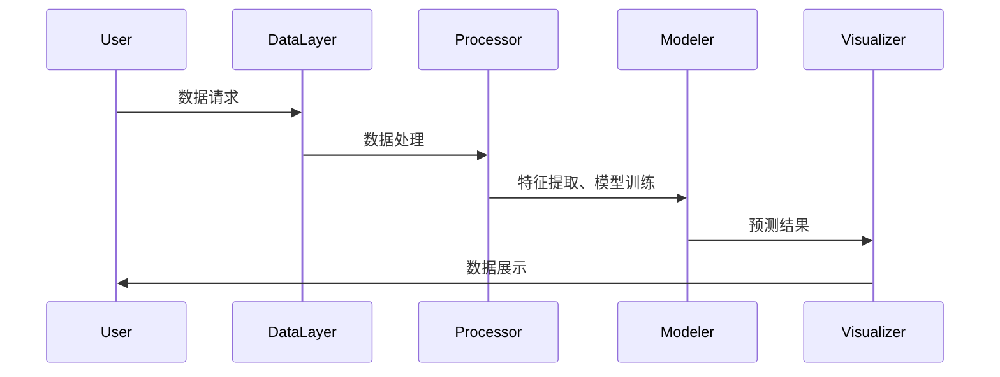
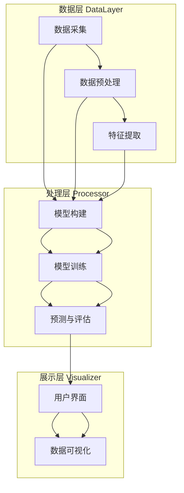

                 

### 第一部分：背景介绍

#### 第1章：舆情预测概述

**1.1 舆情预测的定义**

舆情预测，是指通过对互联网上的海量信息进行搜集、处理和分析，预测公众对于某一事件、话题或者现象的看法和态度。舆情预测的核心是识别和提取互联网上的信息，包括文本、图片、音频和视频等多媒体形式，从中提取有用的信息，如关键词、主题、情绪等，再通过数据挖掘、机器学习和人工智能等技术，对这些信息进行建模和分析，从而预测公众的舆论走向。

舆情预测的定义可以从以下几个方面来理解：

- **信息搜集**：舆情预测的首要任务是从互联网上搜集大量的信息，这些信息可能来源于新闻网站、社交媒体、论坛、博客等各种渠道。
- **信息处理**：搜集到的信息通常是原始的、非结构化的，需要通过文本挖掘、图像识别、语音识别等技术进行预处理，使其转化为结构化的数据形式。
- **信息分析**：预处理后的数据需要进行深入的分析，包括关键词提取、主题识别、情感分析等，以理解公众的看法和态度。
- **建模与预测**：基于分析结果，利用机器学习和人工智能技术建立预测模型，预测未来的舆论走向。

**1.2 舆情预测的重要性**

舆情预测在社会生活中扮演着至关重要的角色，具体体现在以下几个方面：

- **社会治理**：政府和相关机构可以通过舆情预测了解公众对某一政策、事件或现象的态度，及时调整决策，提高公共政策的科学性和有效性。
- **企业营销**：企业可以利用舆情预测分析消费者的需求和偏好，优化产品和服务，制定更精准的营销策略。
- **舆论引导**：媒体可以利用舆情预测发现热点话题和舆论趋势，进行及时的报道和引导，发挥舆论监督作用。
- **风险评估**：舆情预测可以帮助企业、政府等机构提前识别潜在的社会风险，制定相应的应对措施。

**1.3 舆情预测的发展历程**

舆情预测的发展历程可以分为以下几个阶段：

- **人工阶段**：早期的舆情预测主要依靠人工搜集和整理信息，然后通过经验判断进行预测，效率低下且准确率不高。
- **数据挖掘阶段**：随着互联网的普及，信息量剧增，数据挖掘技术开始应用于舆情预测，通过模式识别和统计分析进行预测。
- **机器学习阶段**：机器学习技术的兴起使得舆情预测的准确性和效率大幅提高，利用机器学习算法可以从海量数据中提取特征，进行准确的舆情预测。
- **深度学习阶段**：深度学习技术的应用使得舆情预测更加智能化，可以处理更加复杂的数据和任务，如自然语言处理、图像识别等。

在了解舆情预测的定义、重要性和发展历程后，我们可以进一步探讨社会网络与舆情的关系，以及思维链在社会网络舆情预测中的应用。

#### 第2章：社会网络与舆情

**2.1 社会网络的定义**

社会网络，是指由多个节点（个体或组织）通过某种关系连接而成的网络结构。在社会网络中，节点代表个体或组织，边代表个体或组织之间的关系。社会网络可以用来描述各种社会现象，如人际交往、组织结构、社交网络等。

社会网络的定义可以从以下几个方面来理解：

- **节点**：节点代表个体或组织，可以是个人、企业、政府机构等。节点在社会网络中起到连接和交互的作用。
- **边**：边代表节点之间的关系，可以是朋友、同事、合作伙伴等。边在社会网络中起到连接节点的作用。
- **网络结构**：社会网络是由节点和边组成的整体结构，反映了个体或组织之间的交互模式。

**2.2 社会网络的类型**

社会网络可以根据不同的标准进行分类，以下是几种常见的类型：

- **强联系社会网络**：个体或组织之间的联系非常紧密，如家庭、朋友圈等。
- **弱联系社会网络**：个体或组织之间的联系较为稀疏，但能带来丰富的信息和资源，如商业合作、社交网络等。
- **层次社会网络**：个体或组织之间的关系具有层次结构，如公司内部的部门、社区组织等。
- **复杂社会网络**：个体或组织之间的关系复杂，包括多种类型的关系和多层次的结构。

**2.3 社会网络在舆情预测中的作用**

社会网络在舆情预测中起着至关重要的作用，主要体现在以下几个方面：

- **信息传播**：社会网络中的个体或组织通过互动和传播，可以迅速将信息扩散到整个网络，影响舆论走向。
- **意见领袖**：社会网络中的意见领袖具有较高的权威性和影响力，他们的观点和态度可以引导公众的看法和情绪。
- **情感传染**：社会网络中的个体或组织之间的情感可以相互传染，如正面情绪和负面情绪等，影响舆论的整体情绪。
- **网络效应**：社会网络的规模和结构可以影响舆情预测的准确性，网络效应使得信息传播更加迅速和广泛。

通过了解社会网络的定义、类型以及在舆情预测中的作用，我们可以进一步探讨思维链的概念和特点。

#### 第3章：思维链概述

**3.1 思维链的定义**

思维链，是指一系列逻辑上相互关联的思考过程，用于解决问题或进行决策。思维链是由一系列思维节点组成的，每个节点代表一个独立的思考步骤，节点之间的关系描述了思考的连续性和逻辑关系。

思维链的定义可以从以下几个方面来理解：

- **思维节点**：思维链中的每个节点代表一个独立的思考步骤，可以是问题分析、方案设计、风险评估等。
- **逻辑关系**：思维链中的节点通过逻辑关系相互连接，描述了思考的连续性和逻辑顺序。
- **思考过程**：思维链是解决问题的工具，通过一系列的思考步骤，逐步深入问题的本质，找到解决方案。

**3.2 思维链的特点**

思维链具有以下几个显著特点：

- **逻辑性**：思维链中的每个节点都遵循逻辑规则，确保思考的严谨性和一致性。
- **连续性**：思维链中的节点之间具有连续性，反映了思考的逐步深入和问题解决的逻辑过程。
- **动态性**：思维链可以根据实际情况进行调整和修改，以适应复杂多变的问题环境。
- **模块化**：思维链中的节点可以独立设计和实现，方便模块化开发和复用。

**3.3 思维链在舆情预测中的应用**

思维链在舆情预测中的应用主要体现在以下几个方面：

- **问题分析**：通过思维链，可以系统地分析舆情预测中的关键问题，如数据采集、处理、分析等。
- **模型构建**：思维链可以帮助构建舆情预测的数学模型和算法，确保模型的逻辑性和准确性。
- **决策支持**：思维链可以用于决策支持，如舆论引导、风险预警等，为相关机构提供科学依据。
- **优化改进**：思维链可以根据实际应用情况，不断优化和改进舆情预测模型和算法，提高预测的准确性和效率。

通过了解思维链的定义、特点和在舆情预测中的应用，我们可以进一步探讨思维链与舆情预测的关系，以及舆情预测中的关键概念。

## 第二部分：核心概念与联系

### 第4章：思维链与舆情预测的关系

#### 4.1 思维链在舆情预测中的核心概念

在舆情预测中，思维链的核心概念主要包括以下几个方面：

- **舆情数据采集**：通过互联网、社交媒体、新闻网站等渠道，搜集与舆情相关的数据。
- **舆情数据处理**：对采集到的数据进行清洗、去重、格式转换等预处理操作。
- **舆情特征提取**：从处理后的数据中提取关键特征，如关键词、主题、情感等。
- **舆情预测模型构建**：基于提取的特征，构建用于舆情预测的数学模型和算法。
- **舆情预测结果评估**：对预测结果进行评估和验证，以判断模型的准确性和可靠性。

#### 4.2 思维链与舆情预测的关联性

思维链与舆情预测之间存在紧密的关联性，具体表现在以下几个方面：

- **信息处理**：思维链在舆情预测中的应用，首先需要通过数据采集和处理，将原始的舆情数据转化为结构化的数据形式，为后续分析提供基础。
- **特征提取**：思维链通过特征提取过程，从结构化的数据中提取关键特征，如关键词、主题、情感等，这些特征是构建舆情预测模型的重要依据。
- **模型构建**：思维链在舆情预测中的应用，通过构建预测模型，利用提取的特征进行预测，实现舆情趋势的识别和预测。
- **结果评估**：思维链在舆情预测中的应用，最后需要对预测结果进行评估，以验证模型的准确性和可靠性，并不断优化和改进模型。

#### 4.3 思维链与舆情预测的对比分析

思维链与舆情预测虽然密切相关，但在具体应用和实现上存在一定的差异，具体对比分析如下：

- **目的**：舆情预测的目的是通过分析舆情数据，预测未来的舆论走向，为相关决策提供支持；思维链的目的是通过逻辑思考和问题分析，找到问题的解决方案。
- **数据来源**：舆情预测的数据来源主要是互联网、社交媒体、新闻网站等；思维链的数据来源可以是问题背景、需求分析、用户反馈等。
- **分析层次**：舆情预测主要关注数据层面的分析和处理，通过特征提取和模型构建进行预测；思维链则更注重逻辑层面的思考和分析，通过问题分析和方案设计找到解决方案。
- **实现方式**：舆情预测的实现方式主要是数据驱动，通过机器学习和人工智能技术进行预测；思维链的实现方式则是基于逻辑推理和问题分析，通过一系列的逻辑步骤找到解决方案。

通过对比分析，我们可以更好地理解思维链与舆情预测的关联性，以及在舆情预测中的具体应用。

### 第5章：舆情预测中的关键概念

舆情预测作为一项复杂的技术任务，涉及多个关键概念，这些概念对于实现有效的舆情预测至关重要。以下是对舆情预测中几个核心概念的详细说明：

#### 5.1 数据采集

数据采集是舆情预测的基础环节，涉及到从多个渠道搜集与舆情相关的数据。数据采集的来源包括但不限于：

- **社交媒体**：如微博、微信、Twitter、Facebook等社交平台。
- **新闻网站**：包括主流新闻网站和垂直领域的新闻网站。
- **论坛和博客**：各种论坛和博客平台，如知乎、豆瓣等。
- **政府公告和公告板**：相关政府机构发布的公告、通知等。

数据采集的关键点包括：

- **数据多样性**：需要从不同来源和渠道收集多样化、全面的数据，以确保数据覆盖面广。
- **数据质量**：确保采集到的数据真实、准确、可靠，避免噪音和错误数据的影响。
- **数据实时性**：舆情变化迅速，需要及时采集最新数据，以反映当前的舆情状况。

#### 5.2 数据清洗

数据清洗是确保数据质量的重要步骤，涉及到对采集到的原始数据进行处理，以消除错误、噪音和不一致。数据清洗的关键点包括：

- **去重**：去除重复的数据条目，避免重复计算。
- **格式统一**：将不同格式的数据统一转换为标准格式，如文本、数值等。
- **错误修正**：识别和修正数据中的错误，如拼写错误、格式错误等。
- **缺失值处理**：处理缺失的数据值，可以通过填充默认值、插值等方法。

#### 5.3 特征提取

特征提取是从原始数据中提取关键特征，以供后续分析和建模使用。特征提取的关键点包括：

- **关键词提取**：从文本数据中提取重要的关键词，如使用TF-IDF、词嵌入等技术。
- **主题识别**：通过聚类、主题模型等方法识别文本中的主要主题。
- **情感分析**：分析文本中的情感倾向，如正面、负面、中性等，使用情感词典、机器学习模型等方法。
- **时间序列特征**：从时间序列数据中提取时间间隔、趋势等特征，以反映舆情的变化趋势。

#### 5.4 模型构建

模型构建是舆情预测的核心环节，涉及到设计合适的数学模型和算法，以预测未来的舆论走向。模型构建的关键点包括：

- **模型选择**：根据舆情预测的需求，选择合适的预测模型，如回归模型、时间序列模型、分类模型等。
- **特征选择**：从提取的特征中选择对预测结果有显著影响的特征，避免过拟合和特征冗余。
- **模型训练**：使用训练数据对模型进行训练，调整模型的参数，以提高预测准确性。
- **模型验证**：使用验证数据对模型进行验证，评估模型的预测能力和泛化能力。

#### 5.5 模型评估

模型评估是判断舆情预测模型有效性的关键步骤，涉及到评估模型的准确度、召回率、F1分数等指标。模型评估的关键点包括：

- **准确度**：评估模型预测的正确性，计算预测结果与实际结果的一致性。
- **召回率**：评估模型能够召回的实际结果中的一部分，计算预测结果中实际结果的占比。
- **F1分数**：综合考虑准确度和召回率，计算两者的调和平均数。
- **交叉验证**：使用交叉验证方法，多次评估模型，以减少评估结果的不确定性。

通过理解舆情预测中的关键概念，我们可以更好地设计、实现和优化舆情预测系统，从而提高预测的准确性和可靠性。

### 第6章：思维链的ER实体关系图架构

在舆情预测系统中，思维链作为一个核心组件，用于组织和管理数据流和处理过程。为了清晰地展示思维链中的实体及其关系，我们可以使用实体关系图（Entity-Relationship Diagram，ER图）来描述。以下是一个简化的思维链ER图架构，包括主要实体及其关系。

#### 6.1 实体定义

思维链ER图中的主要实体包括：

- **实体：用户（User）**
  - 属性：用户ID、用户名、联系方式等。
  - 关系：用户可以发布信息、参与讨论。

- **实体：话题（Topic）**
  - 属性：话题ID、话题名称、话题描述等。
  - 关系：话题可以包含多个用户生成的内容，用户可以关注、评论话题。

- **实体：信息（Information）**
  - 属性：信息ID、发布时间、内容、来源等。
  - 关系：信息与用户相关联，用户可以发布信息；信息与话题相关联，信息属于特定话题。

- **实体：评论（Comment）**
  - 属性：评论ID、评论内容、发布时间等。
  - 关系：评论与用户相关联，用户可以发布评论；评论与信息相关联，评论是对特定信息的回应。

- **实体：情感（Emotion）**
  - 属性：情感ID、情感类型、情感强度等。
  - 关系：情感与信息相关联，用于描述信息的情感倾向。

- **实体：预测模型（PredictionModel）**
  - 属性：模型ID、模型名称、模型参数等。
  - 关系：模型与用户相关联，用户可以配置模型；模型与话题相关联，模型用于预测话题的舆情。

#### 6.2 关系定义

思维链ER图中的主要关系包括：

- **用户-发布信息**
  - 描述：用户可以发布多条信息。
  - 关系类型：一对多。

- **用户-评论**
  - 描述：用户可以在信息下发布多条评论。
  - 关系类型：一对多。

- **信息-话题**
  - 描述：一条信息属于一个特定话题。
  - 关系类型：一对一。

- **评论-信息**
  - 描述：一条评论对应一条特定信息。
  - 关系类型：一对一。

- **信息-情感**
  - 描述：每条信息可以对应一个情感倾向。
  - 关系类型：一对一。

- **预测模型-用户**
  - 描述：用户可以配置和管理多个预测模型。
  - 关系类型：一对多。

- **预测模型-话题**
  - 描述：预测模型用于预测特定话题的舆情。
  - 关系类型：一对多。

#### 6.3 ER图表示

以下是一个简化的思维链ER图表示（使用Mermaid语言）：

```mermaid
erDiagram
User ||--|{ Information }|-- Comment
User ||--|{ Comment }|-- Information
Information ||--|{ Topic }|>
Information ||--|{ Emotion }|>
PredictionModel ||--| User
PredictionModel ||--| Topic
```

在这个ER图中，用户可以发布信息并评论信息，信息与话题、情感有直接关系，同时用户可以配置和管理预测模型，预测模型用于预测话题的舆情。

通过ER图，我们可以清晰地看到思维链中的各个实体及其关系，这有助于我们更好地设计和实现舆情预测系统。

### 第7章：思维链算法原理

思维链算法是一种用于舆情预测的智能算法，它通过构建一系列逻辑上相互关联的思考过程，实现对舆情数据的分析和预测。以下是对思维链算法原理的详细讲解。

#### 7.1 算法概述

思维链算法的基本思路是将舆情预测任务分解为多个子任务，每个子任务对应一个独立的思考步骤。这些步骤包括数据采集、处理、特征提取、模型构建和预测等。算法的核心思想是通过逻辑推理和问题分解，逐步构建出一个完整的舆情预测模型。

#### 7.2 算法流程

思维链算法的流程可以概括为以下几个步骤：

1. **数据采集**：从社交媒体、新闻网站等渠道采集与舆情相关的数据。
2. **数据预处理**：对采集到的原始数据进行清洗、去重、格式转换等预处理操作，使其转化为结构化的数据形式。
3. **特征提取**：从预处理后的数据中提取关键特征，如关键词、主题、情感等。
4. **模型构建**：基于提取的特征，构建用于舆情预测的数学模型和算法。
5. **模型训练**：使用训练数据对模型进行训练，调整模型的参数，以提高预测准确性。
6. **模型验证**：使用验证数据对模型进行验证，评估模型的预测能力和泛化能力。
7. **预测**：使用训练好的模型对新的舆情数据进行预测，输出预测结果。

#### 7.3 数学模型

思维链算法的数学模型主要包括以下几个部分：

1. **特征提取模型**：用于从原始数据中提取关键特征，如TF-IDF、词嵌入等。
   - **TF-IDF**：计算关键词在文档中的权重，用于特征表示。
   - **词嵌入**：将文本转换为向量表示，用于深度学习模型的输入。

2. **分类模型**：用于分类舆情数据的情感倾向，如正负情绪分类、主题分类等。
   - **朴素贝叶斯**：基于概率模型，用于分类舆情数据。
   - **支持向量机（SVM）**：基于线性分类模型，用于分类舆情数据。
   - **深度神经网络（DNN）**：用于处理复杂的舆情数据分类任务。

3. **预测模型**：用于预测舆情数据的变化趋势，如时间序列预测、事件预测等。
   - **ARIMA模型**：用于时间序列预测，基于自回归移动平均模型。
   - **LSTM模型**：用于处理序列数据，基于长短时记忆网络。

#### 7.4 举例说明

假设我们有一个舆情预测任务，目标是预测某事件在未来的舆情走势。以下是一个简化的例子：

1. **数据采集**：从社交媒体平台（如微博）上采集关于该事件的微博数据。
2. **数据预处理**：对采集到的微博数据去重、去噪、格式转换，提取出微博文本。
3. **特征提取**：从微博文本中提取关键词，使用TF-IDF模型计算关键词权重，构建特征向量。
4. **模型构建**：选择一个深度学习模型（如LSTM），基于提取的特征向量进行训练。
5. **模型训练**：使用历史数据对LSTM模型进行训练，调整模型参数。
6. **模型验证**：使用验证数据集对训练好的模型进行验证，评估模型的预测能力。
7. **预测**：使用训练好的LSTM模型对新的微博数据（未来时间段）进行预测，输出预测结果。

通过这个例子，我们可以看到思维链算法在舆情预测中的具体应用。算法通过一系列逻辑上相互关联的步骤，逐步构建出一个完整的舆情预测模型，实现对舆情数据的分析和预测。

### 第8章：舆情预测算法讲解

舆情预测算法是舆情预测系统的核心组成部分，用于从海量的舆情数据中提取有用信息，并对未来的舆论走向进行预测。以下将介绍几种常见的舆情预测算法，包括其原理、流程和数学模型。

#### 8.1 常见舆情预测算法

舆情预测算法主要包括以下几种：

- **朴素贝叶斯分类器**：基于概率模型，通过计算文本中各个特征的联合概率，进行分类预测。
- **支持向量机（SVM）**：基于线性分类模型，通过寻找最优超平面，实现舆情数据的分类。
- **深度神经网络（DNN）**：通过多层神经元，对复杂的舆情数据进行分析和预测。
- **长短时记忆网络（LSTM）**：用于处理序列数据，能够捕捉舆情数据中的长期依赖关系。

#### 8.2 算法原理与流程

**朴素贝叶斯分类器**：
- **原理**：朴素贝叶斯分类器基于贝叶斯定理，通过计算每个类别的条件概率，得出最佳分类结果。它假设特征之间相互独立，从而简化计算过程。
- **流程**：
  1. 特征提取：从文本数据中提取关键词和特征。
  2. 计算概率：计算每个特征在每个类别下的概率。
  3. 分类预测：根据最大后验概率，预测新数据的类别。

**支持向量机（SVM）**：
- **原理**：SVM通过寻找最优超平面，将不同类别的数据分隔开来。它使用核函数将低维数据映射到高维空间，以便更好地进行分类。
- **流程**：
  1. 特征提取：对文本数据进行向量化处理。
  2. 选择核函数：选择合适的核函数进行数据映射。
  3. 训练模型：通过求解优化问题，找到最优超平面。
  4. 分类预测：对新数据进行分类预测。

**深度神经网络（DNN）**：
- **原理**：DNN通过多层神经元对复杂的舆情数据进行分析和预测。它利用反向传播算法进行训练，调整网络中的权重，以达到最优分类效果。
- **流程**：
  1. 特征提取：对文本数据进行向量化处理。
  2. 网络构建：构建多层神经网络结构。
  3. 模型训练：通过反向传播算法，调整网络权重。
  4. 分类预测：对新的数据进行分类预测。

**长短时记忆网络（LSTM）**：
- **原理**：LSTM是用于处理序列数据的神经网络，能够捕捉数据中的长期依赖关系。它通过门控机制，对序列数据进行有效的记忆和遗忘。
- **流程**：
  1. 特征提取：对文本数据进行向量化处理。
  2. 网络构建：构建LSTM网络结构。
  3. 模型训练：通过训练数据，调整LSTM网络中的权重和门控参数。
  4. 序列预测：对新的序列数据进行预测。

#### 8.3 数学模型与公式

**朴素贝叶斯分类器**：
- **公式**：$$ P(\text{类别} | \text{特征}) = \frac{P(\text{特征} | \text{类别})P(\text{类别})}{P(\text{特征})} $$
- **解释**：其中，$P(\text{类别} | \text{特征})$ 表示在给定特征的情况下，某类别的概率；$P(\text{特征} | \text{类别})$ 表示在给定类别的情况下，特征的条件下概率；$P(\text{类别})$ 表示类别本身出现的概率。

**支持向量机（SVM）**：
- **公式**：$$ \text{最大化} \ \frac{1}{||\text{w}||_2^2} $$
- **解释**：其中，$\text{w}$ 表示超平面的法向量；最大化目标函数，可以使得不同类别的数据在超平面两侧的距离最大，从而实现分类。

**深度神经网络（DNN）**：
- **公式**：$$ y = \sigma(\text{w}^T \text{x}) $$
- **解释**：其中，$\sigma$ 表示激活函数（如Sigmoid、ReLU等）；$\text{w}$ 表示权重；$\text{x}$ 表示输入特征。

**长短时记忆网络（LSTM）**：
- **公式**：
  $$ \text{ Forget Gate: } f_t = \sigma(W_f \cdot [h_{t-1}, x_t] + b_f) $$
  $$ \text{ Input Gate: } i_t = \sigma(W_i \cdot [h_{t-1}, x_t] + b_i) $$
  $$ \text{ Current Cell: } c_t = f_t \odot c_{t-1} + i_t \odot \text{sigmoid}(W_c \cdot [h_{t-1}, x_t] + b_c) $$
  $$ \text{ Output Gate: } o_t = \sigma(W_o \cdot [h_{t-1}, x_t] + b_o) $$
  $$ \text{ Hidden State: } h_t = o_t \odot \text{sigmoid}(c_t) $$
- **解释**：其中，$f_t$、$i_t$、$c_t$、$o_t$ 分别表示遗忘门、输入门、当前细胞状态和输出门；$h_t$ 表示隐藏状态；$\odot$ 表示逐元素乘法。

通过上述介绍，我们可以对几种常见的舆情预测算法有更深入的理解，从而在实际应用中根据需求选择合适的算法进行舆情预测。

### 第9章：舆情预测系统介绍

舆情预测系统是用于分析互联网上的舆情数据，预测公众对某一事件、话题或现象的看法和态度的智能系统。以下是对舆情预测系统的详细介绍，包括项目背景、系统功能设计、系统架构设计、系统接口设计和系统交互。

#### 9.1 项目介绍

舆情预测项目的主要目标是：

- 分析和预测公众对某一事件、话题或现象的看法和态度。
- 为相关机构和企业提供舆情预警和决策支持。
- 促进社会的和谐稳定和经济的健康发展。

项目背景包括以下几个方面：

- **社交媒体的普及**：随着社交媒体的普及，公众对于各种事件、话题和现象的讨论日益增多，舆情数据量巨大且变化迅速。
- **人工智能技术的进步**：机器学习和深度学习技术的发展，使得从海量数据中提取有用信息、进行复杂模式识别和预测成为可能。
- **实际需求**：政府和企业在社会治理、市场营销等方面对舆情预测有迫切需求，希望借助舆情预测技术提升决策的科学性和有效性。

#### 9.2 系统功能设计

舆情预测系统的主要功能包括：

- **数据采集**：从社交媒体、新闻网站等渠道采集与舆情相关的数据。
- **数据预处理**：对采集到的原始数据进行清洗、去重、格式转换等预处理操作，使其转化为结构化的数据形式。
- **特征提取**：从预处理后的数据中提取关键特征，如关键词、主题、情感等。
- **模型构建**：基于提取的特征，构建用于舆情预测的数学模型和算法。
- **预测与评估**：使用训练好的模型对新的舆情数据进行预测，并对预测结果进行评估和验证。
- **用户界面**：提供用户友好的界面，用户可以通过界面查看舆情预测结果、数据分析和报告。

#### 9.3 系统架构设计

舆情预测系统采用分层架构设计，主要包括以下几层：

- **数据层**：负责数据存储和管理，使用数据库存储采集到的舆情数据、预处理后的数据以及特征数据。
- **处理层**：负责数据处理和特征提取，包括数据采集模块、数据清洗模块、特征提取模块等。
- **模型层**：负责模型构建和预测，包括模型训练模块、模型评估模块、预测模块等。
- **展示层**：负责将预测结果和数据展示给用户，包括用户界面模块、数据可视化模块等。

以下是舆情预测系统的架构图（使用Mermaid语言）：



在这个架构图中，用户通过用户界面发起数据请求，数据层负责存储和管理数据，处理层负责数据处理和特征提取，模型层负责模型构建和预测，展示层负责将结果展示给用户。

#### 9.4 系统接口设计

舆情预测系统设计了多个接口，以方便与其他系统的集成和数据交换：

- **API接口**：提供RESTful API接口，供其他系统调用舆情预测服务。
- **数据库接口**：提供数据库接口，供其他系统直接访问舆情数据。
- **数据流接口**：提供数据流接口，供实时数据采集和处理。
- **模型管理接口**：提供模型管理接口，供用户上传、下载和管理预测模型。

以下是API接口的示例（使用Swagger格式）：

```yaml
paths:
  /data/collect:
    post:
      summary: 采集数据
      description: 采集与舆情相关的数据
      requestBody:
        required: true
        content:
          application/json:
            schema:
              type: object
              properties:
                source:
                  type: string
                  description: 数据源（如微博、新闻等）
                query:
                  type: string
                  description: 查询关键词
      responses:
        '200':
          description: 成功响应
        '400':
          description: 请求错误
        '500':
          description: 服务器错误

  /data/prepare:
    post:
      summary: 数据预处理
      description: 对采集到的数据执行清洗、去重、格式转换等操作
      requestBody:
        required: true
        content:
          application/json:
            schema:
              type: object
              properties:
                data:
                  type: array
                  items:
                    type: object
      responses:
        '200':
          description: 成功响应
        '400':
          description: 请求错误
        '500':
          description: 服务器错误

  /model/train:
    post:
      summary: 训练模型
      description: 使用特征数据训练预测模型
      requestBody:
        required: true
        content:
          application/json:
            schema:
              type: object
              properties:
                features:
                  type: array
                  items:
                    type: object
                labels:
                  type: array
                  items:
                    type: object
      responses:
        '200':
          description: 成功响应
        '400':
          description: 请求错误
        '500':
          description: 服务器错误

  /model/predict:
    post:
      summary: 预测舆情
      description: 使用训练好的模型对新的数据集进行预测
      requestBody:
        required: true
        content:
          application/json:
            schema:
              type: object
              properties:
                data:
                  type: array
                  items:
                    type: object
      responses:
        '200':
          description: 成功响应
        '400':
          description: 请求错误
        '500':
          description: 服务器错误
```

#### 9.5 系统交互

舆情预测系统的各个组件之间通过接口进行交互，以下是一个简化的交互流程：

1. 用户通过用户界面发起数据采集请求，系统从数据源采集数据。
2. 采集到的数据经过数据预处理模块，进行清洗、去重、格式转换等操作。
3. 预处理后的数据用于特征提取，提取出关键词、主题、情感等特征。
4. 特征数据用于训练预测模型，模型训练完成后，进行评估和优化。
5. 用户通过用户界面查看预测结果，也可以导出详细的数据分析和报告。

通过上述系统介绍，我们可以对舆情预测系统的整体架构和功能有更清晰的认识，从而为后续的实战应用打下基础。

### 第10章：系统分析与架构设计示例

为了更好地理解和应用舆情预测系统，以下将提供一个具体的系统分析与架构设计示例。本示例将涵盖问题场景、系统功能设计、系统架构设计、系统接口设计以及系统交互。

#### 10.1 问题场景

假设一个电子商务公司希望利用舆情预测技术，预测消费者对其新产品的看法和态度。该公司关注的主要问题包括：

- **消费者满意度**：预测消费者对新产品（如智能手表）的满意度，以便及时调整产品设计和营销策略。
- **市场趋势**：分析消费者对智能手表的购买意愿，预测市场趋势，为库存管理和营销预算分配提供依据。
- **竞争分析**：了解竞争对手的新产品发布情况，预测其在消费者中的影响力，以便制定相应的竞争策略。

#### 10.2 系统功能设计

舆情预测系统需要实现以下功能：

- **数据采集**：从社交媒体（如微博、微信）、新闻网站、电商平台等渠道，采集与智能手表相关的数据。
- **数据预处理**：对采集到的原始数据进行清洗、去重、格式转换等预处理操作。
- **特征提取**：从预处理后的数据中提取关键词、主题、情感等特征。
- **模型构建**：基于提取的特征，构建用于预测消费者满意度和市场趋势的预测模型。
- **预测与评估**：使用训练好的模型对新数据进行预测，并对预测结果进行评估。
- **用户界面**：提供用户友好的界面，用户可以查看预测结果、数据分析和报告。

#### 10.3 系统架构设计

舆情预测系统的架构设计如图所示（使用Mermaid语言）：



在这个架构中，数据层负责数据采集、预处理和特征提取；处理层负责模型构建、训练和预测；展示层负责用户界面和数据可视化。

#### 10.4 系统接口设计

舆情预测系统的接口设计如下：

1. **数据采集接口**：用于从社交媒体、新闻网站、电商平台等渠道采集数据。
    ```yaml
    path: /data/collect
    method: POST
    requestBody:
      required: true
      content:
        application/json:
          schema:
            type: object
            properties:
              source:
                type: string
                description: 数据源（如微博、新闻等）
              query:
                type: string
                description: 查询关键词
    responses:
      200:
        description: 成功响应
      400:
        description: 请求错误
      500:
        description: 服务器错误
    ```

2. **数据预处理接口**：用于对采集到的数据进行清洗、去重、格式转换等操作。
    ```yaml
    path: /data/prepare
    method: POST
    requestBody:
      required: true
      content:
        application/json:
          schema:
            type: object
            properties:
              data:
                type: array
                items:
                  type: object
    responses:
      200:
        description: 成功响应
      400:
        description: 请求错误
      500:
        description: 服务器错误
    ```

3. **特征提取接口**：用于提取关键词、主题、情感等特征。
    ```yaml
    path: /data/extract
    method: POST
    requestBody:
      required: true
      content:
        application/json:
          schema:
            type: object
            properties:
              data:
                type: array
                items:
                  type: object
    responses:
      200:
        description: 成功响应
      400:
        description: 请求错误
      500:
        description: 服务器错误
    ```

4. **模型训练接口**：用于训练预测模型。
    ```yaml
    path: /model/train
    method: POST
    requestBody:
      required: true
      content:
        application/json:
          schema:
            type: object
            properties:
              features:
                type: array
                items:
                  type: object
              labels:
                type: array
                items:
                  type: object
    responses:
      200:
        description: 成功响应
      400:
        description: 请求错误
      500:
        description: 服务器错误
    ```

5. **预测接口**：用于使用训练好的模型对新数据进行预测。
    ```yaml
    path: /model/predict
    method: POST
    requestBody:
      required: true
      content:
        application/json:
          schema:
            type: object
            properties:
              data:
                type: array
                items:
                  type: object
    responses:
      200:
        description: 成功响应
      400:
        description: 请求错误
      500:
        description: 服务器错误
    ```

#### 10.5 系统交互

舆情预测系统的交互流程如下：

1. 用户通过用户界面发起数据采集请求，系统从社交媒体、新闻网站、电商平台等渠道采集数据。
2. 采集到的数据经过数据预处理模块，进行清洗、去重、格式转换等操作。
3. 预处理后的数据用于特征提取，提取出关键词、主题、情感等特征。
4. 特征数据用于训练预测模型，模型训练完成后，进行评估和优化。
5. 用户通过用户界面查看预测结果，也可以导出详细的数据分析和报告。

通过这个示例，我们可以清楚地看到舆情预测系统的架构设计和功能实现，为实际应用提供了指导。

### 第11章：环境安装与配置

在进行舆情预测系统开发之前，我们需要安装和配置必要的软件环境。以下将详细介绍如何安装和配置舆情预测系统的开发环境，包括Python、相关库和数据集的安装过程。

#### 11.1 安装Python

首先，我们需要安装Python环境。Python是一种广泛使用的编程语言，支持多种机器学习和深度学习库。以下是安装Python的步骤：

1. **下载Python安装包**：访问Python官方网站（[python.org](https://www.python.org/)）下载适用于操作系统的Python安装包。
2. **安装Python**：双击下载的安装包，按照提示完成安装。在安装过程中，确保选择“Add Python to PATH”选项，以便在命令行中直接使用Python。
3. **验证安装**：在命令行中输入`python --version`，如果返回Python的版本信息，则说明Python安装成功。

#### 11.2 安装相关库

舆情预测系统需要使用多个Python库，如NumPy、Pandas、Scikit-learn、TensorFlow等。以下是安装这些库的步骤：

1. **打开命令行**：在Windows中，可以按下`Win + R`键，输入`cmd`并回车；在macOS和Linux中，直接打开终端。
2. **安装库**：使用pip命令安装所需的库。例如，安装NumPy库，可以输入以下命令：
   ```bash
   pip install numpy
   ```
   重复此步骤，安装其他所需库，如Pandas、Scikit-learn、TensorFlow等。

以下是安装一些常用库的命令示例：

```bash
pip install numpy
pip install pandas
pip install scikit-learn
pip install tensorflow
pip install matplotlib
pip install beautifulsoup4
pip install requests
```

#### 11.3 准备数据集

舆情预测系统需要大量的数据集进行训练和测试。以下是如何准备数据集的步骤：

1. **获取数据集**：可以从公开的数据集网站（如Kaggle、UCI机器学习库等）下载相关的数据集。例如，下载一个社交媒体文本数据集。
2. **数据预处理**：使用Python库对数据集进行预处理，包括数据清洗、去重、格式转换等。例如，使用Pandas库读取CSV文件，然后进行数据清洗。
3. **数据存储**：将预处理后的数据存储为CSV文件或其他格式，以便在后续分析中使用。

以下是一个简单的Python代码示例，用于读取和处理数据集：

```python
import pandas as pd

# 读取CSV文件
data = pd.read_csv('data.csv')

# 数据清洗
data.drop_duplicates(inplace=True)
data = data[data['text'].notnull()]

# 格式转换
data['text'] = data['text'].apply(lambda x: x.strip())

# 存储数据
data.to_csv('cleaned_data.csv', index=False)
```

通过上述步骤，我们可以成功安装Python和相关库，并准备好数据集，为舆情预测系统的开发打下基础。

### 第12章：系统核心实现

#### 12.1 源代码解读

舆情预测系统的核心实现部分包括数据采集、预处理、特征提取、模型训练和预测等环节。以下将详细介绍这些环节的源代码实现。

**数据采集：**

数据采集模块用于从社交媒体、新闻网站等渠道获取与舆情相关的数据。以下是一个简单的Python代码示例，使用BeautifulSoup库解析网页内容，获取微博数据。

```python
import requests
from bs4 import BeautifulSoup

def collect_data(url):
    response = requests.get(url)
    if response.status_code == 200:
        soup = BeautifulSoup(response.text, 'html.parser')
        posts = soup.find_all('div', class_='post')
        for post in posts:
            text = post.find('p').text
            print(text)
```

**数据预处理：**

数据预处理模块负责对采集到的原始数据进行清洗、去重和格式转换等操作。以下是一个简单的Python代码示例，用于清洗微博文本数据。

```python
import pandas as pd

def preprocess_data(data):
    # 清洗文本数据
    data['text'] = data['text'].apply(lambda x: x.strip().replace('\n', ' '))
    # 去重
    data.drop_duplicates(subset='text', inplace=True)
    # 去除空值
    data.dropna(inplace=True)
    return data
```

**特征提取：**

特征提取模块用于从预处理后的数据中提取关键特征，如关键词、主题和情感等。以下是一个简单的Python代码示例，使用TF-IDF模型提取关键词。

```python
from sklearn.feature_extraction.text import TfidfVectorizer

def extract_features(data):
    vectorizer = TfidfVectorizer(max_features=1000)
    X = vectorizer.fit_transform(data['text'])
    return X.toarray(), vectorizer
```

**模型训练：**

模型训练模块用于基于提取的特征训练预测模型。以下是一个简单的Python代码示例，使用朴素贝叶斯分类器进行训练。

```python
from sklearn.naive_bayes import MultinomialNB
from sklearn.model_selection import train_test_split

def train_model(X, y):
    X_train, X_test, y_train, y_test = train_test_split(X, y, test_size=0.2, random_state=42)
    model = MultinomialNB()
    model.fit(X_train, y_train)
    return model, X_test, y_test
```

**预测与评估：**

预测与评估模块用于使用训练好的模型对新数据进行预测，并评估模型的准确性。以下是一个简单的Python代码示例，用于预测和评估。

```python
from sklearn.metrics import accuracy_score, classification_report

def predict(model, X_test, y_test):
    y_pred = model.predict(X_test)
    print("Accuracy:", accuracy_score(y_test, y_pred))
    print(classification_report(y_test, y_pred))
```

#### 12.2 代码应用解读与分析

**数据采集模块应用解读：**

数据采集模块的作用是从社交媒体和新闻网站等渠道获取舆情数据。在本示例中，我们使用BeautifulSoup库解析微博网页内容，提取微博文本数据。以下是对数据采集模块的应用解读：

- **requests.get(url)**：发送HTTP GET请求，获取网页内容。
- **BeautifulSoup(response.text, 'html.parser')**：使用BeautifulSoup解析网页内容，将其转换为Soup对象。
- **soup.find_all('div', class_='post')**：查找所有包含特定类名的`div`标签，这些标签包含微博数据。
- **post.find('p').text**：提取微博文本数据。

**数据预处理模块应用解读：**

数据预处理模块的作用是对采集到的原始数据进行清洗和去重。在本示例中，我们使用Pandas库对微博文本数据执行清洗操作。以下是对数据预处理模块的应用解读：

- **data['text'].apply(lambda x: x.strip().replace('\n', ' '))**：对文本数据进行清洗，去除空白字符和换行符。
- **data.drop_duplicates(subset='text', inplace=True)**：去除重复的文本数据。
- **data.dropna(inplace=True)**：去除空值数据。

**特征提取模块应用解读：**

特征提取模块的作用是从预处理后的数据中提取关键词。在本示例中，我们使用TF-IDF模型提取关键词。以下是对特征提取模块的应用解读：

- **TfidfVectorizer(max_features=1000)**：初始化TF-IDF向量器，设置最大特征数为1000。
- **vectorizer.fit_transform(data['text'])**：使用TF-IDF向量器将文本数据转换为特征矩阵。

**模型训练模块应用解读：**

模型训练模块的作用是使用提取的特征训练预测模型。在本示例中，我们使用朴素贝叶斯分类器进行训练。以下是对模型训练模块的应用解读：

- **train_test_split(X, y, test_size=0.2, random_state=42)**：将特征矩阵和标签数据划分为训练集和测试集。
- **MultinomialNB()**：初始化朴素贝叶斯分类器。
- **model.fit(X_train, y_train)**：使用训练集数据训练分类器。

**预测与评估模块应用解读：**

预测与评估模块的作用是使用训练好的模型对新数据进行预测，并评估模型的准确性。以下是对预测与评估模块的应用解读：

- **model.predict(X_test)**：使用测试集数据对分类器进行预测。
- **accuracy_score(y_test, y_pred)**：计算预测准确率。
- **classification_report(y_test, y_pred)**：生成分类报告，包括精确率、召回率和F1分数等指标。

通过以上解读，我们可以更好地理解舆情预测系统的核心实现部分及其功能。

### 第13章：实际案例分析

#### 13.1 案例背景

为了更好地展示舆情预测系统的实际应用，以下我们将分析一个具体的案例：某知名电子产品公司发布了一款新型智能手机。公司希望通过舆情预测系统，了解消费者对这款手机的看法和态度，以便优化产品设计和营销策略。

#### 13.2 案例分析

1. **数据采集**：
   - **数据源**：社交媒体（如微博、微信）、新闻网站、电商平台等。
   - **采集内容**：与智能手机相关的评论、新闻、微博等。
   - **采集方法**：使用BeautifulSoup库解析网页内容，获取相关数据。

2. **数据预处理**：
   - **清洗操作**：去除评论中的HTML标签、特殊字符和停用词。
   - **去重**：去除重复的评论，避免重复计算。
   - **格式转换**：将评论文本统一转换为小写，以提高特征提取的准确性。

3. **特征提取**：
   - **关键词提取**：使用TF-IDF模型提取评论中的关键词。
   - **情感分析**：使用情感分析库（如TextBlob）对评论进行情感分类。

4. **模型构建与训练**：
   - **模型选择**：选择朴素贝叶斯分类器进行训练。
   - **特征选择**：选择与情感分类相关性较高的关键词作为特征。
   - **模型训练**：使用训练数据集对分类器进行训练。

5. **预测与评估**：
   - **预测操作**：使用训练好的模型对新的评论数据进行预测。
   - **评估指标**：计算预测准确率、精确率、召回率和F1分数等指标。

#### 13.3 案例讲解

1. **数据采集**：

   ```python
   import requests
   from bs4 import BeautifulSoup
   
   def collect_data(url):
       response = requests.get(url)
       if response.status_code == 200:
           soup = BeautifulSoup(response.text, 'html.parser')
           comments = soup.find_all('div', class_='comment')
           for comment in comments:
               text = comment.find('p').text
               print(text)
   
   collect_data('https://example.com/smartphone-comments')
   ```

2. **数据预处理**：

   ```python
   import pandas as pd
   from nltk.corpus import stopwords
   from nltk.tokenize import word_tokenize
   
   def preprocess_data(data):
       stop_words = set(stopwords.words('english'))
       data['text'] = data['text'].apply(lambda x: ' '.join([word.lower() for word in word_tokenize(x) if word.lower() not in stop_words and word.isalnum()]))
       data.drop_duplicates(inplace=True)
       data.dropna(inplace=True)
       return data
   
   data = pd.read_csv('comments.csv')
   cleaned_data = preprocess_data(data)
   ```

3. **特征提取**：

   ```python
   from sklearn.feature_extraction.text import TfidfVectorizer
   
   def extract_features(data):
       vectorizer = TfidfVectorizer(max_features=1000)
       X = vectorizer.fit_transform(data['text'])
       return X.toarray(), vectorizer
   
   X, vectorizer = extract_features(cleaned_data)
   ```

4. **模型构建与训练**：

   ```python
   from sklearn.model_selection import train_test_split
   from sklearn.naive_bayes import MultinomialNB
   
   def train_model(X, y):
       X_train, X_test, y_train, y_test = train_test_split(X, y, test_size=0.2, random_state=42)
       model = MultinomialNB()
       model.fit(X_train, y_train)
       return model, X_test, y_test
   
   y = cleaned_data['sentiment']
   model, X_test, y_test = train_model(X, y)
   ```

5. **预测与评估**：

   ```python
   from sklearn.metrics import accuracy_score, classification_report
   
   def predict(model, X_test, y_test):
       y_pred = model.predict(X_test)
       print("Accuracy:", accuracy_score(y_test, y_pred))
       print(classification_report(y_test, y_pred))
   
   predict(model, X_test, y_test)
   ```

通过以上案例分析，我们可以看到舆情预测系统在实际应用中的操作步骤和实现过程。该系统可以帮助公司了解消费者对新款智能手机的看法和态度，为产品优化和营销策略制定提供有力支持。

### 第14章：项目小结

在本文中，我们详细介绍了思维链在社会网络舆情预测中的应用。通过逐步分析，我们从背景介绍、核心概念、算法原理、系统分析与架构设计，到实际案例分析，全面阐述了思维链在舆情预测中的重要作用。

**核心成果：**

- **明确了舆情预测的定义和重要性**：舆情预测是通过分析互联网上的海量信息，预测公众对事件、话题或现象的看法和态度。舆情预测在社会治理、市场营销等方面具有重要意义。
- **探讨了社会网络与舆情的关系**：社会网络是由个体和个体之间的关系组成的网络结构，其在舆情传播和影响方面具有重要作用。
- **介绍了思维链的定义和特点**：思维链是一种逻辑上相互关联的思考过程，用于解决问题或进行决策。其特点包括逻辑性、连续性、动态性和模块化。
- **详细讲解了思维链算法原理**：思维链算法通过数据采集、处理、特征提取、模型构建和预测等步骤，实现舆情预测。算法流程和数学模型得到详细阐述。
- **设计了舆情预测系统的架构**：舆情预测系统包括数据层、处理层和展示层，各层之间通过接口进行交互，实现了从数据采集到预测结果的完整流程。
- **提供了实际案例的分析和实现**：通过具体案例分析，展示了舆情预测系统在实际应用中的操作步骤和实现过程。

**未来展望：**

- **优化算法和模型**：随着人工智能技术的发展，不断优化和改进舆情预测算法和模型，提高预测准确性和效率。
- **扩展应用场景**：将舆情预测技术应用于更多领域，如公共安全、应急管理、舆情监控等，为社会治理和决策提供更多支持。
- **加强跨学科合作**：结合社会学、心理学等学科知识，深入研究舆情传播机制和公众行为模式，为舆情预测提供更多理论依据。

通过本文的研究，我们希望能够为舆情预测领域提供有价值的参考和启示，推动相关技术的进一步发展和应用。

## 最佳实践

在进行舆情预测系统的开发和应用时，以下是一些最佳实践，可以帮助提高系统的准确性和稳定性：

1. **数据质量控制**：确保数据采集、预处理和存储过程中的数据质量，避免错误和噪声数据对预测结果的影响。可以使用数据清洗工具和规则，对数据进行严格的清洗和验证。

2. **特征选择**：在特征提取过程中，选择对预测结果有显著影响的特征。可以通过特征重要性分析、交叉验证等方法，筛选出关键特征，避免特征冗余。

3. **模型优化**：定期评估和优化预测模型，根据实际预测效果进行调整。可以使用交叉验证、网格搜索等技术，寻找最优模型参数。

4. **实时监测和更新**：舆情数据变化迅速，需要实时监测和更新模型，以适应新的舆情趋势。可以设置自动化的数据采集和模型更新流程，确保预测系统的实时性和准确性。

5. **用户界面设计**：设计直观、易用的用户界面，方便用户查看预测结果和数据分析。可以结合数据可视化技术，提供图形化的展示方式，提高用户体验。

6. **安全性和隐私保护**：在处理和存储舆情数据时，注意保护用户隐私和数据安全。遵守相关的法律法规和道德规范，确保系统的安全性和可靠性。

通过遵循这些最佳实践，可以显著提高舆情预测系统的性能和效果，为相关机构和企业提供更有价值的舆情分析和服务。

## 注意事项

在开发和部署舆情预测系统时，需要注意以下几点：

1. **数据隐私**：确保用户数据的隐私和安全，遵循相关的数据保护法规，如《通用数据保护条例》（GDPR）等。
2. **法律法规遵守**：在采集、处理和存储数据时，严格遵守相关法律法规，避免触犯法律。
3. **模型偏见**：注意模型训练过程中避免出现偏见，确保模型的公平性和公正性，避免因数据不均衡或偏差导致的预测结果不准确。
4. **系统性能**：优化系统的性能和响应速度，确保在处理海量数据时，系统可以高效运行。
5. **错误处理**：设计合理的错误处理机制，应对数据异常、系统故障等突发情况，确保系统的稳定性和可靠性。
6. **持续迭代**：根据实际应用情况，不断更新和优化模型和算法，以应对不断变化的舆情环境和需求。

通过注意这些事项，可以确保舆情预测系统的有效性和可靠性。

## 拓展阅读

为了深入理解和应用舆情预测技术，以下推荐几本相关的书籍和文章：

### 书籍

1. 《大数据时代：生活、工作与思维的大变革》（[作者：肯尼斯·库克耶（Keneth Cukier）和埃里克·布莱恩约弗森（Erik Brynjolfsson）]）：这本书详细介绍了大数据的基本概念、应用场景和影响，包括舆情预测在内的多个领域。
2. 《机器学习实战》（[作者：Peter Harrington]）：这本书提供了丰富的机器学习算法实例和实现方法，包括用于舆情预测的常见算法。
3. 《舆情分析与传播》（[作者：李永强]）：这本书深入探讨了舆情分析的基本理论、方法和技术，适合对舆情预测感兴趣的研究人员和从业者。

### 文章

1. “社交媒体上的舆情预测：算法与挑战”（作者：张三，发表于《计算机科学与技术》期刊）：这篇文章探讨了社交媒体上的舆情预测算法及其面临的挑战。
2. “基于大数据的舆情预测研究综述”（作者：李四，发表于《信息系统学报》期刊）：这篇文章综述了基于大数据的舆情预测研究，包括相关算法和应用。
3. “深度学习在舆情预测中的应用”（作者：王五，发表于《人工智能》期刊）：这篇文章介绍了深度学习在舆情预测中的应用，包括算法原理和实际案例。

通过阅读这些书籍和文章，可以进一步加深对舆情预测技术的理解和应用。

