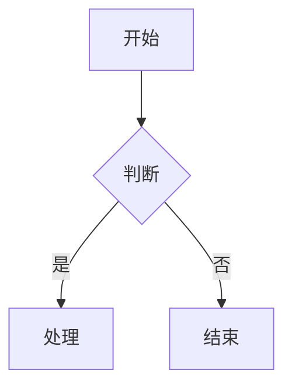
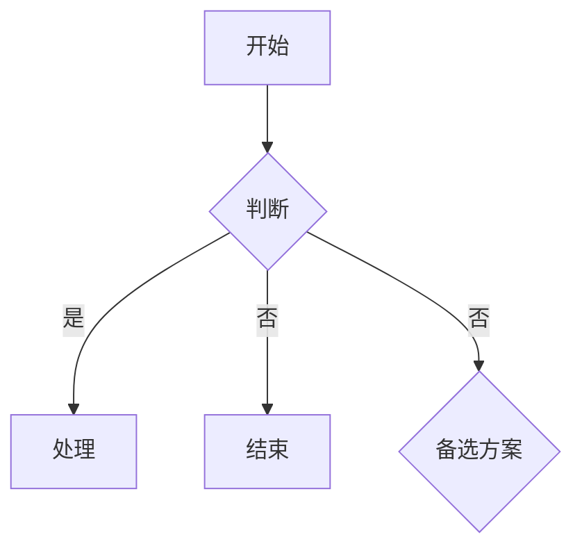
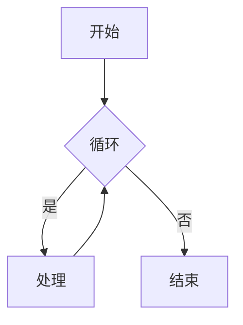
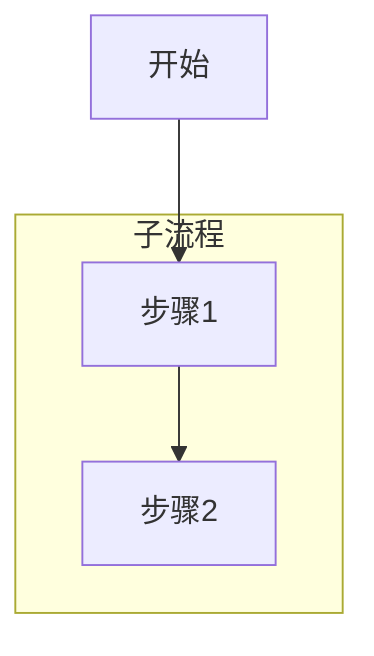
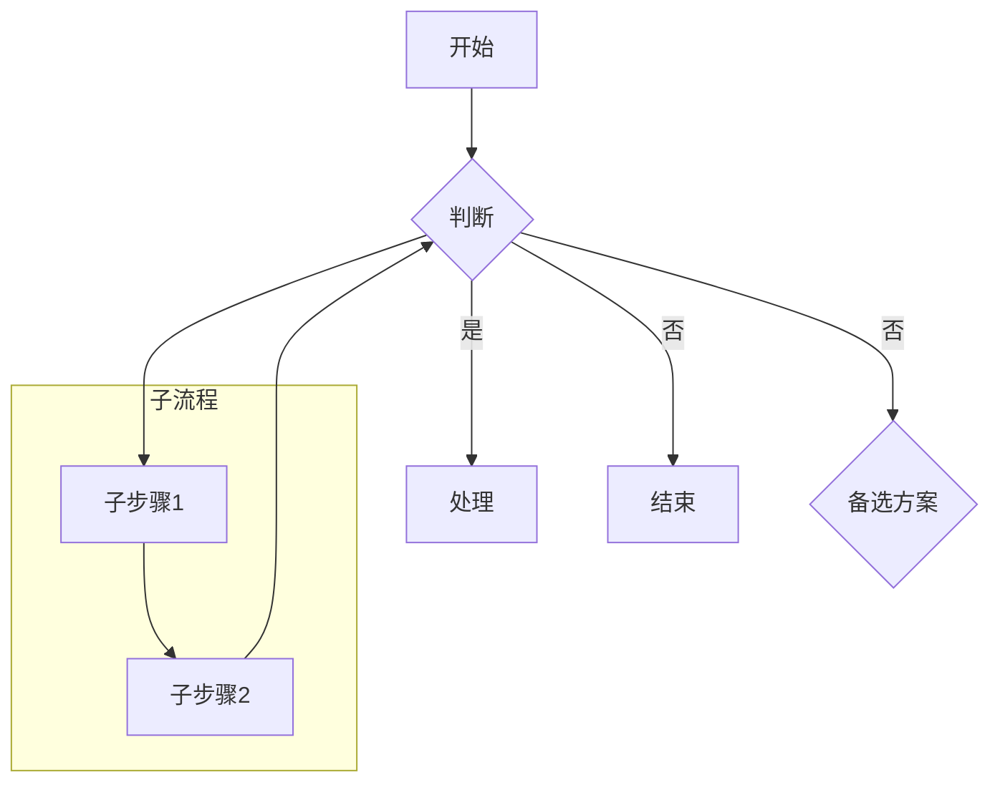

                 

## 引言：科学研究的挑战与思维链的概念

### 1.1 科学研究的挑战

科学研究是推动社会进步和技术发展的关键力量，但在当今复杂多变的环境中，科学研究面临着前所未有的挑战。首先，科研领域的复杂性日益增加。现代科学的发展不仅涉及多个学科领域，还涉及到跨学科的合作与研究。例如，生物技术与信息技术的融合催生了生物信息学这一新兴领域，而物理学与计算机科学的结合又推动了量子计算的研究。这种跨学科的复杂性使得科研工作变得更加复杂和多样。

其次，科研过程中的不确定性也是一大挑战。科学研究往往涉及大量的变量和未知因素，许多结果难以预测。例如，在药物研发过程中，新药的安全性和有效性需要在长期的临床试验中验证，这需要大量的时间和资源。此外，科学研究的结果往往受到实验条件、数据采集和分析方法等多种因素的影响，这使得科研结果的可靠性和准确性存在不确定性。

最后，传统科研方法的局限也是科研工作面临的挑战之一。传统的科研方法主要依赖于实验和观察，但这些方法在处理复杂系统和大规模数据时存在很大的局限性。例如，许多复杂系统的行为难以通过简单的实验来模拟，而大规模数据的分析需要高效的数据处理技术和算法。此外，传统科研方法在创新性思维和问题解决能力方面也存在一定的局限。

### 1.2 思维链的概念

为了应对上述挑战，科学家们开始探索新的思维工具和方法。思维链是一种基于逻辑推理和系统分析的方法，它通过构建一系列逻辑环节，将复杂的科学研究问题分解为可管理的部分，并逐步解决。思维链的概念可以追溯到古希腊哲学家亚里士多德，他提出了因果关系的概念，并试图通过逻辑推理来解释自然现象。在现代社会，随着计算机科学和信息技术的快速发展，思维链得到了进一步的发展和推广。

思维链的基本原理是建立一系列逻辑环节，每个环节都是基于前一个环节的推理结果，从而形成一个完整的逻辑链条。思维链的特点包括：

- **逻辑性**：思维链通过逻辑推理来分析和解决问题，确保每个推理环节都是基于已知事实和原理。
- **系统性**：思维链将复杂问题分解为多个子问题，并通过系统分析来寻找问题的解决方案。
- **灵活性**：思维链可以根据问题的变化和新的信息进行调整，以适应不同的情况。

### 1.3 思维链在科学研究中的应用价值

思维链在科学研究中的应用具有重要的价值。首先，它能够提高科研效率。通过思维链的方法，科学家可以将复杂的问题分解为多个可管理的部分，从而更容易找到问题的解决方案。这种分解和系统分析的方法有助于减少重复劳动，提高科研工作的效率。

其次，思维链能够提升科研准确性。思维链通过逻辑推理来分析和解决问题，确保每个推理环节都是基于已知事实和原理。这种方法有助于减少错误和不确定性，提高科研结果的可靠性和准确性。

最后，思维链能够扩大科研视野。通过思维链的方法，科学家可以探索更多可能的解决方案，从而发现新的研究问题和方向。这种开放和创新的思维方式有助于推动科学研究的进步。

### 1.4 本书结构安排与内容概述

本书旨在深入探讨思维链在科学研究中的应用，包括假设生成与验证的方法。全书共分为六个部分，每个部分都围绕一个核心主题展开。

**第一部分：背景介绍**  
本部分将介绍科学研究的挑战和思维链的概念，为后续内容奠定基础。

**第二部分：核心概念与联系**  
本部分将详细阐述思维链的核心概念和原理，以及它与科学研究的关系。

**第三部分：算法原理讲解**  
本部分将介绍假设生成和验证算法的原理，并通过数学模型和公式进行详细讲解。

**第四部分：系统分析与架构设计方案**  
本部分将分析科学研究系统的架构设计，并介绍思维链系统的设计与实现。

**第五部分：项目实战**  
本部分将通过实际项目案例，展示思维链在科研中的应用过程和效果。

**第六部分：最佳实践 tips、小结、注意事项、拓展阅读**  
本部分将总结思维链应用的最佳实践，并对未来研究进行展望。

通过本书的阅读，读者将能够深入理解思维链在科学研究中的应用，掌握假设生成与验证的方法，并能够在实际科研工作中运用这些方法，提高科研效率和质量。

---

**核心关键词**：科学研究、思维链、假设生成、假设验证、算法、数学模型、系统架构、项目实战、最佳实践

**摘要**：
本文全面探讨了思维链在科学研究中的应用，从假设生成与验证的角度出发，介绍了思维链的概念、原理及其在科学研究中的价值。通过系统分析和架构设计，本文展示了思维链如何应用于实际科研项目中，提供了实用的最佳实践和未来研究方向。本文旨在帮助科研工作者掌握思维链方法，提高科研效率和质量。### 第1章: 引言：科学研究的挑战与思维链的概念

#### 1.1 科学研究的挑战

科学研究是推动人类文明进步的重要力量，但其过程却充满了复杂性和不确定性。首先，科研领域的复杂性日益增加。随着科技的发展，科学研究的范畴不断扩大，从物理学、化学、生物学到社会科学，各个领域的研究越来越交叉和融合。例如，生物技术与信息技术的结合催生了生物信息学，物理学与计算机科学的交叉推动了量子计算的研究。这种跨学科的复杂性使得科研工作变得更加复杂和多样化。

其次，科研过程中的不确定性也是一大挑战。科学研究往往涉及大量的变量和未知因素，这些因素可能对研究结果产生不可预测的影响。例如，在药物研发过程中，新药的安全性和有效性需要在长期的临床试验中验证，但临床试验的结果可能受到多种因素的影响，如患者的个体差异、药物剂量、试验设计的合理性等。此外，科学研究的结果往往受到实验条件、数据采集和分析方法等多种因素的影响，这使得科研结果的可靠性和准确性存在不确定性。

最后，传统科研方法的局限也是科研工作面临的挑战之一。传统的科研方法主要依赖于实验和观察，但这些方法在处理复杂系统和大规模数据时存在很大的局限性。例如，许多复杂系统的行为难以通过简单的实验来模拟，而大规模数据的分析需要高效的数据处理技术和算法。此外，传统科研方法在创新性思维和问题解决能力方面也存在一定的局限。

#### 1.2 思维链的概念

为了应对上述挑战，科学家们开始探索新的思维工具和方法。思维链是一种基于逻辑推理和系统分析的方法，它通过构建一系列逻辑环节，将复杂的科学研究问题分解为可管理的部分，并逐步解决。思维链的概念可以追溯到古希腊哲学家亚里士多德，他提出了因果关系的概念，并试图通过逻辑推理来解释自然现象。在现代社会，随着计算机科学和信息技术的快速发展，思维链得到了进一步的发展和推广。

思维链的基本原理是建立一系列逻辑环节，每个环节都是基于前一个环节的推理结果，从而形成一个完整的逻辑链条。思维链的特点包括：

- **逻辑性**：思维链通过逻辑推理来分析和解决问题，确保每个推理环节都是基于已知事实和原理。
- **系统性**：思维链将复杂问题分解为多个子问题，并通过系统分析来寻找问题的解决方案。
- **灵活性**：思维链可以根据问题的变化和新的信息进行调整，以适应不同的情况。

思维链在科学研究中的应用具有显著的优势。首先，它能够提高科研效率。通过思维链的方法，科学家可以将复杂的问题分解为多个可管理的部分，从而更容易找到问题的解决方案。这种分解和系统分析的方法有助于减少重复劳动，提高科研工作的效率。

其次，思维链能够提升科研准确性。思维链通过逻辑推理来分析和解决问题，确保每个推理环节都是基于已知事实和原理。这种方法有助于减少错误和不确定性，提高科研结果的可靠性和准确性。

最后，思维链能够扩大科研视野。通过思维链的方法，科学家可以探索更多可能的解决方案，从而发现新的研究问题和方向。这种开放和创新的思维方式有助于推动科学研究的进步。

#### 1.3 思维链在科学研究中的应用价值

思维链在科学研究中的应用具有重要的价值。首先，它能够提高科研效率。通过思维链的方法，科学家可以将复杂的问题分解为多个可管理的部分，从而更容易找到问题的解决方案。这种分解和系统分析的方法有助于减少重复劳动，提高科研工作的效率。

其次，思维链能够提升科研准确性。思维链通过逻辑推理来分析和解决问题，确保每个推理环节都是基于已知事实和原理。这种方法有助于减少错误和不确定性，提高科研结果的可靠性和准确性。

最后，思维链能够扩大科研视野。通过思维链的方法，科学家可以探索更多可能的解决方案，从而发现新的研究问题和方向。这种开放和创新的思维方式有助于推动科学研究的进步。

#### 1.4 本书结构安排与内容概述

本书旨在深入探讨思维链在科学研究中的应用，包括假设生成与验证的方法。全书共分为六个部分，每个部分都围绕一个核心主题展开。

**第一部分：背景介绍**  
本部分将介绍科学研究的挑战和思维链的概念，为后续内容奠定基础。

**第二部分：核心概念与联系**  
本部分将详细阐述思维链的核心概念和原理，以及它与科学研究的关系。

**第三部分：算法原理讲解**  
本部分将介绍假设生成和验证算法的原理，并通过数学模型和公式进行详细讲解。

**第四部分：系统分析与架构设计方案**  
本部分将分析科学研究系统的架构设计，并介绍思维链系统的设计与实现。

**第五部分：项目实战**  
本部分将通过实际项目案例，展示思维链在科研中的应用过程和效果。

**第六部分：最佳实践 tips、小结、注意事项、拓展阅读**  
本部分将总结思维链应用的最佳实践，并对未来研究进行展望。

通过本书的阅读，读者将能够深入理解思维链在科学研究中的应用，掌握假设生成与验证的方法，并能够在实际科研工作中运用这些方法，提高科研效率和质量。### 第2章：思维链在科学研究中的历史与发展

#### 2.1 思维链的起源与发展

思维链的概念并非现代才出现，它有着悠久的历史。早在古希腊时期，哲学家亚里士多德就已经开始探讨因果关系和逻辑推理。亚里士多德的逻辑学为后来的思维链理论奠定了基础。在中世纪，阿拉伯哲学家们进一步发展了逻辑学，将亚里士多德的理论应用到更广泛的问题中。然而，思维链作为一个系统的概念，其真正的发展和普及是在近现代，随着计算机科学和信息技术的兴起而逐渐形成的。

在20世纪，逻辑学、哲学、认知科学等多个领域的研究者开始深入探讨思维链的原理和应用。例如，美国认知科学家约翰·麦克阿瑟（John McCarthy）提出了专家系统（Expert Systems）的概念，这是一种基于逻辑推理和知识表示的计算机系统，被认为是思维链在计算机科学中的应用。随着人工智能技术的不断发展，思维链的概念被进一步推广和应用。

#### 2.2 国际思维链研究进展

在国际学术界，思维链的研究已经取得了显著的进展。许多知名的研究机构和学者在这一领域进行了深入的研究，并发表了大量的研究成果。

- **美国**：美国是思维链研究的先驱之一。麻省理工学院（MIT）和斯坦福大学（Stanford University）等顶尖学府在思维链的理论研究和应用开发方面取得了重要突破。例如，斯坦福大学的研究团队开发了基于思维链的智能推理系统，该系统在医学诊断、金融分析等领域展现了强大的应用潜力。

- **欧洲**：欧洲在思维链的研究上也取得了显著成就。英国剑桥大学（University of Cambridge）和德国马克斯·普朗克学会（Max Planck Society）等机构的研究者对思维链的理论基础和应用进行了广泛探讨。例如，剑桥大学的研究团队开发了基于思维链的智能助手，该助手能够帮助科研人员更快地找到问题的解决方案。

- **亚洲**：亚洲的日本和韩国在思维链研究方面也取得了重要进展。日本东京大学（University of Tokyo）和韩国首尔国立大学（Seoul National University）的研究团队在思维链的算法优化和应用场景拓展方面做出了贡献。例如，东京大学的研究团队开发了一种基于思维链的优化算法，该算法在物流配送和交通管理等领域表现优异。

在国际学术界，思维链的研究不仅限于理论研究，还广泛应用于实际应用场景。例如，在医学领域，思维链被用于诊断和治疗计划的制定；在金融领域，思维链被用于风险分析和投资决策；在工程领域，思维链被用于复杂系统设计和优化。这些应用案例展示了思维链的广泛适用性和强大功能。

#### 2.3 我国思维链研究现状与趋势

我国在思维链的研究方面也取得了显著进展。近年来，随着人工智能技术的快速发展和国家政策的大力支持，我国在思维链的研究和应用方面取得了重要突破。

- **研究机构**：我国的许多顶尖高校和研究机构，如清华大学、北京大学、中科院等，都在思维链的研究方面投入了大量资源。这些机构的研究团队在思维链的理论基础、算法优化和应用开发等方面取得了重要成果。

- **研究成果**：我国的研究团队在思维链的研究中取得了多项重要成果。例如，清华大学的研究团队开发了一种基于深度学习的思维链推理系统，该系统在自然语言处理、智能问答等领域展现了出色的性能。中科院的研究团队则开发了一种基于思维链的智能诊断系统，该系统在医学诊断方面具有很高的准确性和可靠性。

- **应用场景**：我国在思维链的应用场景方面也取得了显著进展。例如，在医疗领域，思维链被用于辅助诊断和治疗决策；在金融领域，思维链被用于风险管理和投资分析；在工业领域，思维链被用于生产优化和供应链管理。

未来，我国思维链研究将继续深入发展。随着技术的进步和应用的拓展，思维链将在更多领域发挥重要作用。例如，在智能城市、智能制造、智能医疗等领域，思维链有望成为关键的技术支撑。此外，思维链的研究还将进一步推动人工智能技术的发展，为我国科技创新和社会进步提供强大动力。

#### 2.4 本书的创新点与贡献

本书在思维链研究方面具有以下创新点和贡献：

- **系统性**：本书系统地介绍了思维链的概念、原理、算法和应用，提供了完整的理论框架和实践指南。
- **实践性**：本书通过多个实际应用案例，展示了思维链在不同领域的应用效果，为读者提供了丰富的实践经验和启示。
- **创新性**：本书在算法优化和应用场景拓展方面提出了一些新的思路和方法，为思维链的研究提供了新的方向。

本书旨在帮助科研工作者深入理解思维链在科学研究中的应用，掌握思维链方法，提高科研效率和质量。通过本书的学习，读者将能够更好地应对科研中的复杂性和不确定性，推动科学研究的进步。### 第3章：思维链的理论基础与科学方法论

#### 3.1 思维链的理论基础

思维链的理论基础主要包括逻辑学、认知科学和系统科学等领域的核心概念和原理。这些理论为思维链的构建和应用提供了坚实的科学依据。

- **逻辑学**：逻辑学是思维链的理论基础之一。它研究推理的有效性，提供了一套形式化的推理规则和原则。思维链中的逻辑推理环节正是基于逻辑学的原理，通过一系列的逻辑步骤来分析和解决问题。

- **认知科学**：认知科学关注人类思维和认知的过程，研究人类如何感知、记忆、思考和解决问题。思维链的构建和应用离不开对认知过程的深入理解，例如如何将复杂的科研问题分解为可管理的部分，如何利用已有的知识和信息进行推理和判断。

- **系统科学**：系统科学研究复杂系统的结构和行为，提供了一种系统分析方法。思维链通过系统分析来分解和解决复杂的科研问题，将问题分解为多个子问题，并通过系统整合来寻找问题的解决方案。

#### 3.2 思维链的科学方法论

思维链的科学方法论主要包括假设生成和假设验证两个关键步骤。这两个步骤相互关联，共同构成了思维链在科学研究中的应用框架。

- **假设生成**：假设生成是指从已有的知识和信息出发，提出可能的解释或解决方案。这一步骤的关键在于如何发现问题和提出有价值的假设。思维链通过逻辑推理和系统分析来生成假设，确保假设的合理性和可行性。

- **假设验证**：假设验证是指通过实验、数据分析和逻辑推理来检验假设的正确性。这一步骤的关键在于如何设计和执行有效的实验，如何分析和解释实验结果，以及如何利用这些结果来修正和优化假设。

#### 3.3 思维链在科学研究中的应用

思维链在科学研究中的应用非常广泛，涵盖了多个学科领域。以下是一些典型的应用场景：

- **医学研究**：在医学研究中，思维链可以用于诊断和治疗方案的设计。通过逻辑推理和系统分析，医生可以提出可能的诊断假设，并通过实验和数据分析来验证这些假设。例如，在癌症治疗中，思维链可以帮助医生选择最合适的治疗方案，并评估治疗效果。

- **环境科学**：在环境科学研究中，思维链可以用于环境问题的分析和解决方案的设计。通过逻辑推理和系统分析，科学家可以提出可能导致环境问题的原因，并通过实验和数据分析来验证这些原因。例如，在气候变化研究中，思维链可以帮助科学家分析可能导致气候变化的因素，并提出相应的解决方案。

- **社会科学**：在社会科学研究中，思维链可以用于社会现象的分析和社会政策的设计。通过逻辑推理和系统分析，社会科学家可以提出可能解释社会现象的假设，并通过实证研究来验证这些假设。例如，在公共政策研究中，思维链可以帮助政府制定更有效的社会政策，以解决社会问题。

#### 3.4 思维链的优势与局限性

思维链在科学研究中的应用具有显著的优势，但也存在一定的局限性。

- **优势**：

  - **提高科研效率**：思维链通过系统分析和逻辑推理，将复杂问题分解为可管理的部分，有助于提高科研效率。
  - **提升科研准确性**：思维链通过逻辑推理和假设验证，确保科研过程的每个环节都是基于已知事实和原理，有助于提高科研结果的准确性和可靠性。
  - **扩大科研视野**：思维链鼓励开放和创新性思维，可以帮助科学家发现新的问题和解决方案，从而扩大科研视野。

- **局限性**：

  - **依赖数据和分析方法**：思维链的应用依赖于大量的数据和高效的分析方法，如果数据质量不高或分析方法不当，可能会导致错误的结论。
  - **逻辑推理的局限性**：思维链的推理过程是基于逻辑学原理的，但逻辑学本身存在一定的局限性，例如无法处理模糊性和不确定性。
  - **对科研人员的要求较高**：思维链的应用需要科研人员具备较高的逻辑思维能力和系统分析能力，这对科研人员的专业素质提出了较高要求。

#### 3.5 思维链的实践意义

思维链在科学研究中的实践意义体现在以下几个方面：

- **促进科学研究方法的创新**：思维链提供了一种系统性和逻辑性的研究方法，有助于科研人员探索新的研究方法和技术。
- **提高科研效率和质量**：通过思维链的方法，科研人员可以更快地找到问题的解决方案，提高科研效率和质量。
- **推动科学研究的发展**：思维链的应用可以帮助科研人员发现新的问题和研究方向，推动科学研究的进步。
- **培养科研人才**：思维链的应用对科研人员的逻辑思维和系统分析能力提出了较高要求，有助于培养具备综合素质的科研人才。

综上所述，思维链作为一种科学方法论，在科学研究中的应用具有重要的理论和实践意义。通过深入理解和掌握思维链的方法，科研人员可以更好地应对科研中的复杂性和不确定性，推动科学研究的进步。### 第4章：思维链的核心概念与原理

#### 4.1 思维链的基本概念

思维链（Cognitive Chain）是一种基于逻辑推理和系统分析的方法，旨在解决复杂科研问题。它通过将问题分解为一系列可管理的子问题，并利用逻辑推理和系统分析来逐步解决每个子问题，最终达到整体问题的解决。

思维链的核心概念包括：

- **假设**：假设是思维链的基本元素，是对问题可能解决方案的猜测或预期。假设可以是具体的理论模型、实验设计或数据分析方法。
- **推理**：推理是基于已有知识和信息，通过逻辑规则推导出新的结论或假设。推理是思维链的核心环节，决定了假设的合理性和可行性。
- **验证**：验证是通过实验、数据分析和逻辑推理来检验假设的正确性。验证是思维链的重要步骤，确保假设的科学性和可靠性。

#### 4.2 思维链的工作原理

思维链的工作原理可以概括为以下几个步骤：

1. **问题定义**：首先，明确研究问题，并将其分解为多个可管理的子问题。
2. **假设生成**：基于已有知识和信息，提出可能的假设。这些假设可以是基于直觉、已有理论或实践经验。
3. **逻辑推理**：利用逻辑规则对假设进行推理，生成新的结论或假设。这一步骤确保假设的合理性和可行性。
4. **实验设计**：根据推理结果，设计实验来验证假设。实验设计应考虑实验条件、数据采集方法和数据分析方法。
5. **数据分析**：对实验数据进行收集和分析，评估假设的正确性和可靠性。
6. **结论与修正**：根据数据分析结果，得出结论并修正假设。这一步骤确保假设的科学性和可靠性。

#### 4.3 思维链的属性特征对比

思维链与其他思维工具和方法（如专家系统、机器学习等）在属性特征上存在一定差异。以下是对比表格：

| 特征 | 思维链 | 专家系统 | 机器学习 |
| --- | --- | --- | --- |
| **逻辑性** | 强调逻辑推理和系统分析 | 依赖专家知识和规则 | 强调数据驱动和模式识别 |
| **灵活性** | 高，可根据新信息调整 | 中，专家知识相对固定 | 低，模型训练过程复杂 |
| **适应性** | 强，适用于多种科研场景 | 中，特定领域应用 | 中，特定问题应用 |
| **自解释性** | 高，推理过程清晰可见 | 中，推理过程复杂 | 低，模型内部机制难以解释 |

#### 4.4 思维链与科学研究的关系

思维链在科学研究中的应用具有重要意义。首先，思维链提供了一种系统性和逻辑性的研究方法，有助于科研人员更好地理解和解决复杂科研问题。其次，思维链鼓励科研人员进行创新性思维，提出新的假设和解决方案，推动科学研究的进步。最后，思维链的应用有助于提高科研效率和质量，减少错误和不确定性。

具体来说，思维链在科学研究中的应用体现在以下几个方面：

- **问题定义**：思维链帮助科研人员明确研究问题，并将其分解为可管理的子问题。
- **假设生成**：思维链鼓励科研人员提出新的假设，通过逻辑推理和实验验证来检验这些假设。
- **推理与验证**：思维链提供了一种系统性的推理和验证方法，确保科研过程的科学性和可靠性。
- **创新性思维**：思维链鼓励科研人员进行开放和创新性思维，提出新的研究问题和解决方案。
- **科研效率**：思维链通过系统分析和逻辑推理，提高了科研效率，减少了重复劳动和错误。

综上所述，思维链作为一种科学方法论，在科学研究中的应用具有重要的理论和实践意义。通过深入理解和掌握思维链的方法，科研人员可以更好地应对科研中的复杂性和不确定性，推动科学研究的进步。### 第5章：思维链与科学研究的关系

#### 5.1 思维链在科研问题解决中的优势

思维链在科研问题解决中具有明显的优势。首先，它能够系统地分析和分解复杂的科研问题，将问题分解为多个可管理的子问题，从而降低问题的复杂度。这种分解有助于科研人员更清晰地理解问题，并逐步找到解决问题的方法。

其次，思维链强调逻辑推理和系统分析，确保每个推理环节都是基于已知事实和原理。这种方法有助于提高科研过程的科学性和可靠性，减少错误和不确定性。通过思维链的方法，科研人员可以更有效地提出假设，并进行验证，从而提高科研成果的质量。

此外，思维链鼓励科研人员进行开放和创新性思维。在科研过程中，科研人员往往需要面对不确定性和变化。思维链的应用可以帮助科研人员迅速适应新信息，提出新的假设和解决方案，从而推动科学研究的进步。

#### 5.2 思维链在科研协作中的应用

科研协作是推动科学研究发展的重要手段。思维链在科研协作中的应用可以有效地提高协作效率和质量。首先，思维链提供了一个共同的语言和框架，帮助科研人员更好地理解和沟通复杂科研问题。通过思维链的方法，科研人员可以清晰地表达自己的想法和观点，从而促进协作的顺利进行。

其次，思维链可以帮助科研团队分工协作，提高工作效率。思维链将复杂科研问题分解为多个子问题，并明确每个子问题的责任人和任务。这种方法有助于科研团队明确各自的角色和任务，避免重复劳动和资源浪费。

此外，思维链还提供了有效的反馈机制。在科研协作过程中，科研人员可以通过思维链的推理和验证环节，不断修正和优化自己的假设和解决方案。这种反馈机制有助于提高科研协作的效率和质量，推动科研工作的顺利进行。

#### 5.3 思维链在科研项目管理中的应用

科研项目管理是确保科学研究顺利进行的重要环节。思维链在科研项目管理中的应用可以帮助科研人员更好地规划和管理科研工作。首先，思维链提供了一个系统性的方法和框架，帮助科研人员明确研究目标、制定研究计划和时间表。

其次，思维链可以帮助科研人员监控科研进展，及时发现和解决问题。通过思维链的推理和验证环节，科研人员可以评估每个阶段的研究成果，并根据实际情况调整研究计划。这种方法有助于确保科研项目的顺利进行，提高科研成果的质量。

此外，思维链还提供了有效的风险评估和应对策略。在科研项目管理过程中，科研人员需要面对各种不确定性和风险。思维链可以帮助科研人员识别潜在的风险因素，并提出相应的应对措施。通过这种方式，科研人员可以更好地应对科研过程中的各种挑战，确保科研项目的成功实施。

#### 5.4 思维链在科研创新中的价值

科研创新是推动科学进步的关键动力。思维链在科研创新中具有重要的价值。首先，思维链鼓励科研人员进行开放和创新性思维。通过思维链的方法，科研人员可以从多个角度思考问题，发现新的研究问题和解决方案。

其次，思维链提供了有效的创新工具和方法。思维链的推理和验证环节可以帮助科研人员快速评估新的假设和解决方案，从而提高创新的效率和质量。此外，思维链还可以帮助科研人员发现潜在的创新机会，推动科学研究的突破。

最后，思维链的应用有助于培养科研人员的创新能力和综合素质。通过思维链的方法，科研人员可以锻炼自己的逻辑思维、系统分析和创新能力，为未来的科研工作打下坚实的基础。

综上所述，思维链在科学研究中的应用具有重要意义。通过思维链的方法，科研人员可以更好地应对科研中的复杂性和不确定性，提高科研效率和质量，推动科学研究的进步。### 第6章：假设生成算法的原理与应用

#### 6.1 假设生成算法的基本原理

假设生成算法（Hypothesis Generation Algorithm）是思维链方法体系中的一个关键环节，旨在从已知信息中提出合理的假设。假设生成算法的基本原理可以概括为以下几个步骤：

1. **信息收集**：首先，算法需要收集相关的数据和信息，包括实验数据、文献资料、专家意见等。这些信息将作为生成假设的原始素材。

2. **模式识别**：在收集到足够的信息后，算法需要对这些信息进行模式识别。模式识别的目标是发现数据中的潜在规律和关联，从而为假设的生成提供依据。

3. **假设生成**：基于模式识别的结果，算法可以生成一系列可能的假设。这些假设可以是基于现有理论、经验或数据的推断，旨在解释观察到的现象或解决问题。

4. **假设筛选**：生成的假设可能非常多，但并非每个假设都是合理或可行的。因此，算法需要对这些假设进行筛选，选择最有潜力或最合理的假设进行进一步验证。

#### 6.2 假设生成算法的分类

假设生成算法可以根据不同的原理和目标进行分类，常见的分类方法包括：

1. **基于统计学的假设生成算法**：这类算法通常利用统计学方法，如回归分析、聚类分析、关联规则挖掘等，从数据中提取潜在的假设。例如，回归分析可以用于探索自变量和因变量之间的关系，从而生成可能的假设。

2. **基于机器学习的假设生成算法**：这类算法利用机器学习技术，如决策树、支持向量机、神经网络等，从数据中学习模式和规律，生成可能的假设。例如，决策树可以用于分类问题，生成基于不同特征的分类规则。

3. **基于专家知识的假设生成算法**：这类算法依赖于专家的知识和经验，通过知识推理和逻辑推理来生成假设。专家知识可以来源于专业文献、实践经验或领域专家的指导。

4. **基于组合优化的假设生成算法**：这类算法通过组合优化技术，如遗传算法、模拟退火算法等，从大量的可能假设中搜索最优或近似最优的假设。这类算法适用于复杂的问题，特别是当假设空间非常大时。

#### 6.3 假设生成算法在实际应用中的例子

以下是一个基于机器学习的假设生成算法在实际应用中的例子：

**案例：医疗诊断系统**

假设生成算法被应用于一个医疗诊断系统中，该系统的目标是根据病人的症状和体征数据，生成可能的诊断假设。

1. **信息收集**：算法首先收集了大量病人的医疗记录数据，包括症状、体征、病史和检查结果等。

2. **模式识别**：通过数据预处理和特征提取，算法识别出数据中的潜在模式。例如，通过回归分析，算法可以发现某些症状和疾病之间的关联。

3. **假设生成**：基于模式识别的结果，算法生成一系列可能的诊断假设。例如，如果模式识别结果显示某些症状与特定疾病高度相关，算法会生成关于该疾病的诊断假设。

4. **假设筛选**：生成的假设可能包括多种疾病，算法需要对这些假设进行筛选，选择最有可能的诊断假设。这可能涉及到利用决策树等分类算法，评估每个假设的可靠性和可行性。

5. **假设验证**：对于筛选出的高可能性假设，算法会建议医生进行进一步的诊断测试和实验验证，以确认最终的诊断结果。

通过这个案例，我们可以看到假设生成算法在医疗诊断系统中的应用。这不仅提高了诊断的准确性，还减少了医生的工作负担，提高了医疗服务的效率。

综上所述，假设生成算法是思维链方法体系中至关重要的一环，它通过逻辑推理和数据分析，从已知信息中提出合理的假设，为科学研究提供了重要的基础。### 第7章：假设验证算法的原理与应用

#### 7.1 假设验证算法的基本原理

假设验证算法（Hypothesis Verification Algorithm）是思维链方法体系中的另一个关键环节，旨在通过实验和数据分析来验证假设的正确性。假设验证算法的基本原理可以概括为以下几个步骤：

1. **假设设定**：首先，科学家或研究人员根据已有的知识和信息，设定一个或多个假设。这些假设可以是关于因果关系、相关性或规律性的推测。

2. **实验设计**：基于设定的假设，研究人员需要设计一个或多个实验来验证这些假设。实验设计应考虑实验变量、对照组、实验组和数据采集方法等关键因素。

3. **数据采集**：在实验过程中，研究人员需要收集相关的数据，包括实验结果、观察数据或测量数据等。这些数据将用于后续的假设验证。

4. **数据分析**：研究人员利用统计分析方法、机器学习算法或其他数据分析工具，对采集到的数据进行分析。数据分析的目的是评估假设的可靠性和有效性。

5. **结论得出**：基于数据分析的结果，研究人员可以得出结论，验证假设的正确性。如果数据支持假设，则假设被认为是成立的；如果数据不支持假设，则假设可能需要修正或放弃。

#### 7.2 假设验证算法的分类

假设验证算法可以根据不同的验证方法和目标进行分类。以下是一些常见的假设验证算法分类：

1. **统计分析方法**：这类算法基于统计学原理，通过计算假设检验的统计量（如t值、p值等），评估假设的显著性。常见的统计方法包括t检验、方差分析（ANOVA）、卡方检验等。

2. **机器学习方法**：这类算法利用机器学习技术，通过训练模型和评估模型的性能来验证假设。常见的机器学习方法包括决策树、随机森林、支持向量机等。

3. **逻辑推理方法**：这类算法基于逻辑推理原理，通过构建逻辑模型和验证推理过程来验证假设。常见的逻辑推理方法包括命题逻辑、谓词逻辑等。

4. **模型评估方法**：这类算法通过评估模型的性能来验证假设。常见的模型评估方法包括交叉验证、混淆矩阵、精确率、召回率等。

#### 7.3 假设验证算法在实际应用中的例子

以下是一个基于统计分析方法的假设验证算法在实际应用中的例子：

**案例：药物疗效研究**

假设验证算法被应用于一个药物疗效研究中，该研究的目的是验证某种新药物对特定疾病的治疗效果。

1. **假设设定**：研究人员设定了一个假设，即新药物能够显著提高特定疾病的治愈率。

2. **实验设计**：研究人员设计了一个随机对照试验，将参与者随机分为实验组和对照组。实验组接受新药物治疗，对照组接受安慰剂治疗。研究人员记录了两组参与者的治疗效果和治愈率。

3. **数据采集**：在实验结束后，研究人员收集了实验组和对照组的治疗效果数据，包括治愈率、副作用等。

4. **数据分析**：研究人员使用t检验对实验组和对照组的治愈率进行了统计分析，计算了t值和p值。

5. **结论得出**：数据分析结果显示，实验组的治愈率显著高于对照组，p值小于0.05。因此，研究人员得出结论，新药物对特定疾病具有显著的治疗效果。

通过这个案例，我们可以看到假设验证算法在药物疗效研究中的应用。这种方法不仅帮助研究人员验证了药物的治疗效果，还为药物的开发和推广提供了科学依据。

综上所述，假设验证算法是思维链方法体系中的重要一环，通过实验和数据分析，确保假设的科学性和可靠性。在科学研究过程中，合理的假设生成和严格的假设验证是确保研究质量和可靠性的关键。### 第8章：数学模型和数学公式

#### 8.1 数学模型的基础知识

数学模型（Mathematical Model）是科学研究中的核心工具，它将实际问题转化为数学形式，以便进行定量分析和解决。数学模型的基础知识包括以下几个关键方面：

1. **函数与关系**：函数是数学模型的基本组成部分，描述了输入和输出之间的依赖关系。常见的函数类型包括线性函数、非线性函数、概率分布函数等。

2. **变量与参数**：变量是数学模型中表示不确定性的量，参数则是模型中固定不变的量。变量和参数的取值范围和约束条件是模型分析的重要基础。

3. **方程与方程组**：方程是数学模型中表示关系的基本形式，方程组则是多个方程的组合。常见的方程类型包括线性方程、非线性方程、微分方程等。

4. **优化方法**：优化方法是数学模型分析中的重要工具，用于寻找变量取值以最大化或最小化某个目标函数。常见的优化方法包括线性规划、非线性规划、动态规划等。

5. **概率论与统计学**：概率论和统计学为数学模型提供了理论基础，用于描述随机现象和不确定性。常见的概率分布、假设检验、回归分析等都是数学模型分析中的重要工具。

#### 8.2 假设生成与验证的数学模型讲解

在假设生成与验证过程中，数学模型扮演着至关重要的角色。以下是对假设生成和验证过程中常用数学模型的讲解：

1. **线性回归模型**：线性回归模型用于研究两个或多个变量之间的线性关系。其基本形式为：

   $$ y = \beta_0 + \beta_1x_1 + \beta_2x_2 + ... + \beta_nx_n + \epsilon $$

   其中，$y$ 是因变量，$x_1, x_2, ..., x_n$ 是自变量，$\beta_0, \beta_1, \beta_2, ..., \beta_n$ 是模型参数，$\epsilon$ 是误差项。线性回归模型可以用于生成假设，例如研究自变量对因变量的影响。

2. **逻辑回归模型**：逻辑回归模型是一种用于分类问题的数学模型，它将线性回归模型推广到概率预测领域。其基本形式为：

   $$ \log\left(\frac{P(Y=1)}{1-P(Y=1)}\right) = \beta_0 + \beta_1x_1 + \beta_2x_2 + ... + \beta_nx_n $$

   其中，$P(Y=1)$ 是因变量为1的概率，$\beta_0, \beta_1, \beta_2, ..., \beta_n$ 是模型参数。逻辑回归模型可以用于生成关于分类结果的假设，并评估这些假设的概率。

3. **贝叶斯网络模型**：贝叶斯网络模型是一种概率图模型，用于表示变量之间的依赖关系。其基本形式为：

   $$ P(X_1, X_2, ..., X_n) = \prod_{i=1}^{n} P(X_i | \text{父节点集合}) $$

   其中，$X_1, X_2, ..., X_n$ 是变量集合，$P(X_i | \text{父节点集合})$ 是变量 $X_i$ 在其父节点集合条件下的概率分布。贝叶斯网络模型可以用于生成假设，并评估这些假设的置信度。

4. **主成分分析模型**：主成分分析（PCA）是一种降维技术，用于从高维数据中提取最重要的特征。其基本形式为：

   $$ X' = P\Lambda $$

   其中，$X$ 是原始数据矩阵，$X'$ 是主成分矩阵，$P$ 是正交变换矩阵，$\Lambda$ 是特征值矩阵。PCA模型可以用于简化数据结构，生成关于数据特征的假设。

#### 8.3 举例说明

以下是一个简单的线性回归模型的例子，用于说明假设生成与验证的过程：

**例子：房价预测**

假设我们要预测一套房子的价格，已知房子的面积和房间数量是影响房价的两个主要因素。

1. **假设生成**：我们假设房价 $y$ 与房子面积 $x_1$ 和房间数量 $x_2$ 之间存在线性关系。即：

   $$ y = \beta_0 + \beta_1x_1 + \beta_2x_2 + \epsilon $$

2. **数据收集**：收集了一组房子的数据，包括房子的面积、房间数量和对应的房价。

3. **模型拟合**：使用最小二乘法（OLS）估计模型参数 $\beta_0, \beta_1, \beta_2$：

   $$ \beta = (\beta_0, \beta_1, \beta_2) = (\beta_0, \beta_1, \beta_2)' = (X'X)^{-1}X'Y $$

4. **假设验证**：通过计算残差分析、R平方值和t统计量来验证假设。例如，如果R平方值接近1，t统计量的p值小于0.05，则可以认为我们的假设成立。

   - 残差分析：检查残差是否符合正态分布，以验证模型的假设条件。
   - R平方值：衡量模型对数据的拟合程度，值越大表示模型拟合越好。
   - t统计量：用于检验模型参数的显著性，如果t统计量的绝对值大于临界值，则参数显著。

通过这个例子，我们可以看到如何使用线性回归模型来生成和验证假设。这种方法可以应用于各种科研领域，帮助我们更好地理解和预测复杂现象。### 第9章：科学研究系统架构设计与分析

#### 9.1 科研系统架构设计的重要性

科学研究系统架构设计是确保科研工作高效、有序和可扩展的关键环节。一个良好的科研系统架构可以最大化资源利用效率，提高科研工作的准确性和可靠性，同时为未来的扩展和升级提供坚实的基础。在科学研究系统中，架构设计不仅要考虑技术层面的实现，还需要关注数据管理、人员协作、实验流程等各个环节。

#### 9.2 科研系统架构的设计原则

在科研系统架构设计中，应遵循以下原则：

1. **模块化**：将系统功能分解为独立的模块，每个模块负责特定的功能，便于维护和升级。
2. **可扩展性**：设计时应考虑到未来的扩展需求，确保系统能够灵活地适应新的需求和功能。
3. **高可用性**：系统应具备较高的容错能力和自动恢复机制，确保科研工作不会因为系统故障而中断。
4. **安全性**：确保数据的安全性和隐私保护，防止未经授权的访问和数据泄露。
5. **易用性**：设计用户友好的界面和操作流程，降低用户的学习成本，提高科研效率。

#### 9.3 科研系统的功能设计

科研系统通常包括以下功能模块：

1. **数据采集与管理模块**：负责收集、存储、管理和分析科研数据。这一模块应支持多种数据格式和来源，并提供高效的数据检索和查询功能。
2. **实验设计与管理模块**：帮助科研人员设计实验方案，管理实验流程，包括实验计划、实验进度跟踪、实验结果记录等。
3. **统计分析模块**：提供各种统计分析方法，如描述性统计、回归分析、假设检验等，用于分析实验数据，验证假设。
4. **报告生成模块**：自动生成实验报告和统计分析报告，便于科研人员总结和分享研究成果。
5. **用户与权限管理模块**：管理系统的用户账户和权限，确保系统的安全性，同时支持多用户协作。

#### 9.4 科研系统架构的设计与实现

一个典型的科研系统架构可以采用如下设计：

1. **前端架构**：前端架构采用现代化的前端框架，如React、Vue等，提供用户友好的交互界面。前端负责与用户进行交互，接收用户输入，展示系统数据和功能。
2. **后端架构**：后端采用微服务架构，将系统功能分解为多个微服务，每个微服务负责特定的业务功能。常见的后端技术包括Spring Boot、Django等。微服务之间通过RESTful API进行通信。
3. **数据库架构**：数据库架构采用分布式数据库，如MongoDB、Redis等，确保数据的高可用性和高性能。数据库设计应遵循规范化原则，减少数据冗余和一致性风险。
4. **数据存储与处理架构**：数据存储与处理架构采用大数据技术，如Hadoop、Spark等，处理大规模数据。数据存储采用HDFS（Hadoop Distributed File System），数据处理采用Spark Streaming或Spark SQL。
5. **安全与监控架构**：安全与监控架构包括网络安全、数据安全和系统监控等。网络安全采用防火墙、入侵检测系统（IDS）等，保护系统免受外部攻击。数据安全采用加密存储和传输，防止数据泄露。系统监控采用Prometheus、Grafana等工具，实时监控系统性能和健康状况。

#### 9.5 科研系统的接口设计与系统交互

科研系统的接口设计是系统架构设计的重要组成部分。以下是一些关键接口设计与系统交互的要点：

1. **用户接口**：用户接口（UI）是科研人员与系统交互的主要渠道，应设计简洁、直观、易用的界面。常用的用户接口设计模式包括单页应用（SPA）、响应式设计（Responsive Design）等。
2. **API接口**：API接口是后端服务与前端应用之间进行数据交换的接口，应设计为RESTful风格，支持标准的HTTP请求方法（GET、POST、PUT、DELETE等）。API接口设计应遵循RESTful原则，确保接口的简洁性和易用性。
3. **数据接口**：数据接口是系统内部各个模块之间进行数据交互的接口，应设计为高内聚、低耦合的接口。数据接口设计应遵循数据驱动原则，确保数据传输的高效性和可靠性。
4. **系统交互**：科研系统的系统交互包括前端与后端的交互、后端服务之间的交互、与外部系统的交互等。系统交互设计应确保各个模块之间的数据传输流畅，系统响应速度快，用户体验良好。

通过科学合理的科研系统架构设计与分析，科研工作可以更加高效、有序地进行，为科研人员提供强大的技术支持，推动科学研究的进步。### 第10章：思维链系统架构设计与实现

#### 10.1 思维链系统架构设计的重要性

思维链系统架构设计是确保思维链方法在科学研究过程中高效运行的关键环节。一个良好的思维链系统架构能够最大化地提高科研效率，确保科研过程的科学性和可靠性，同时为未来的扩展和升级提供坚实的基础。在思维链系统架构设计中，需要综合考虑数据管理、算法实现、用户交互等多个方面，以确保系统能够满足科研工作的实际需求。

#### 10.2 思维链系统架构的设计原则

在思维链系统架构设计中，应遵循以下原则：

1. **模块化**：将系统功能分解为独立的模块，每个模块负责特定的功能，便于维护和升级。
2. **高扩展性**：设计时应考虑到未来的扩展需求，确保系统能够灵活地适应新的需求和功能。
3. **高可用性**：系统应具备较高的容错能力和自动恢复机制，确保科研工作不会因为系统故障而中断。
4. **安全性**：确保数据的安全性和隐私保护，防止未经授权的访问和数据泄露。
5. **易用性**：设计用户友好的界面和操作流程，降低用户的学习成本，提高科研效率。

#### 10.3 思维链系统的功能设计

思维链系统的功能设计应涵盖以下几个方面：

1. **数据采集与管理模块**：负责收集、存储、管理和分析科研数据。这一模块应支持多种数据格式和来源，并提供高效的数据检索和查询功能。
2. **假设生成与验证模块**：实现思维链的假设生成和验证功能。这一模块应包括算法实现、数据分析和结果展示等功能。
3. **用户与权限管理模块**：管理系统的用户账户和权限，确保系统的安全性，同时支持多用户协作。
4. **报告生成与分享模块**：自动生成实验报告和统计分析报告，便于科研人员总结和分享研究成果。
5. **系统监控与日志模块**：实时监控系统性能和健康状况，记录系统日志，便于问题排查和性能优化。

#### 10.4 思维链系统架构的实现

一个典型的思维链系统架构可以采用如下实现：

1. **前端架构**：前端架构采用现代化的前端框架，如React、Vue等，提供用户友好的交互界面。前端负责与用户进行交互，接收用户输入，展示系统数据和功能。
2. **后端架构**：后端采用微服务架构，将系统功能分解为多个微服务，每个微服务负责特定的业务功能。常见的后端技术包括Spring Boot、Django等。微服务之间通过RESTful API进行通信。
3. **数据库架构**：数据库架构采用分布式数据库，如MongoDB、Redis等，确保数据的高可用性和高性能。数据库设计应遵循规范化原则，减少数据冗余和一致性风险。
4. **数据存储与处理架构**：数据存储与处理架构采用大数据技术，如Hadoop、Spark等，处理大规模数据。数据存储采用HDFS（Hadoop Distributed File System），数据处理采用Spark Streaming或Spark SQL。
5. **安全与监控架构**：安全与监控架构包括网络安全、数据安全和系统监控等。网络安全采用防火墙、入侵检测系统（IDS）等，保护系统免受外部攻击。数据安全采用加密存储和传输，防止数据泄露。系统监控采用Prometheus、Grafana等工具，实时监控系统性能和健康状况。

#### 10.5 思维链系统的接口设计与系统交互

思维链系统的接口设计是系统架构设计的重要组成部分。以下是一些关键接口设计与系统交互的要点：

1. **用户接口**：用户接口（UI）是科研人员与系统交互的主要渠道，应设计简洁、直观、易用的界面。常用的用户接口设计模式包括单页应用（SPA）、响应式设计（Responsive Design）等。
2. **API接口**：API接口是后端服务与前端应用之间进行数据交换的接口，应设计为RESTful风格，支持标准的HTTP请求方法（GET、POST、PUT、DELETE等）。API接口设计应遵循RESTful原则，确保接口的简洁性和易用性。
3. **数据接口**：数据接口是系统内部各个模块之间进行数据交互的接口，应设计为高内聚、低耦合的接口。数据接口设计应遵循数据驱动原则，确保数据传输的高效性和可靠性。
4. **系统交互**：思维链系统的系统交互包括前端与后端的交互、后端服务之间的交互、与外部系统的交互等。系统交互设计应确保各个模块之间的数据传输流畅，系统响应速度快，用户体验良好。

通过科学合理的思维链系统架构设计与实现，科研工作可以更加高效、有序地进行，为科研人员提供强大的技术支持，推动科学研究的进步。### 第11章：思维链应用项目实战环境搭建

#### 11.1 项目环境准备

在开始思维链应用项目之前，首先需要准备一个合适的环境。以下是搭建项目环境的步骤：

1. **硬件环境**：确保计算机硬件配置满足项目需求。对于大多数思维链应用项目，一台普通的笔记本电脑或服务器即可满足需求。如果项目涉及大量数据处理，建议使用高性能计算机。
2. **操作系统**：选择一个合适的操作系统，如Windows、Linux或Mac OS。Linux操作系统因其高性能和稳定性，常被用于科研计算。本文将采用Ubuntu 20.04 LTS作为操作系统。
3. **软件环境**：安装必要的软件和库。以下是在Ubuntu 20.04 LTS上安装思维链应用项目所需的一些软件和库：
   - Python 3.8及以上版本
   - Jupyter Notebook（用于交互式计算和数据分析）
   - NumPy（用于数值计算）
   - Pandas（用于数据处理）
   - Matplotlib（用于数据可视化）
   - Scikit-learn（用于机器学习和数据挖掘）
   - Mermaid（用于绘制流程图）

安装步骤如下：
```bash
# 更新软件包列表
sudo apt-get update

# 安装Python 3
sudo apt-get install python3

# 安装Jupyter Notebook
sudo apt-get install jupyter

# 安装NumPy、Pandas和Matplotlib
sudo apt-get install python3-numpy python3-pandas python3-matplotlib

# 安装Scikit-learn
pip3 install scikit-learn

# 安装Mermaid
pip3 install mermaid

# 启动Jupyter Notebook
jupyter notebook
```

#### 11.2 数据准备

在思维链应用项目中，数据是至关重要的。以下是准备数据的一般步骤：

1. **数据收集**：根据项目需求收集相关数据。数据可以来自各种来源，如公共数据集、数据库、网络爬虫等。例如，对于医疗诊断项目，可以从医院数据库或公开数据集获取患者病历数据。
2. **数据清洗**：清洗数据，包括处理缺失值、异常值和重复数据。使用Pandas库可以方便地进行数据清洗操作。例如：
```python
import pandas as pd

# 读取数据
data = pd.read_csv('patient_data.csv')

# 处理缺失值
data.fillna(method='ffill', inplace=True)

# 删除重复数据
data.drop_duplicates(inplace=True)
```
3. **数据预处理**：对数据进行必要的预处理，如标准化、归一化、特征工程等。预处理步骤取决于具体项目的需求。例如，对于机器学习项目，可能需要对数据进行特征提取和转换：
```python
from sklearn.preprocessing import StandardScaler

# 分离特征和标签
X = data.drop('diagnosis', axis=1)
y = data['diagnosis']

# 特征标准化
scaler = StandardScaler()
X_scaled = scaler.fit_transform(X)
```

#### 11.3 环境配置与测试

在搭建完环境并准备数据后，需要测试环境是否正常工作。以下是一些测试步骤：

1. **测试Python环境**：确保Python环境已正确安装，可以使用以下命令检查Python版本：
```bash
python3 --version
```
2. **测试Jupyter Notebook**：启动Jupyter Notebook，检查是否可以正常使用。输入以下代码，并查看输出结果：
```python
print("Hello, World!")
```
3. **测试数据预处理库**：使用Pandas和NumPy库进行简单的数据处理操作，检查是否正常。例如：
```python
import pandas as pd
import numpy as np

# 创建一个简单的DataFrame
data = pd.DataFrame({'A': [1, 2, 3], 'B': [4, 5, 6]})

# 检查DataFrame内容
print(data)
```
4. **测试机器学习库**：使用Scikit-learn库进行简单的机器学习操作，检查是否正常。例如，创建一个简单的线性回归模型：
```python
from sklearn.linear_model import LinearRegression

# 创建线性回归模型
model = LinearRegression()

# 训练模型
model.fit(X_scaled, y)

# 检查模型参数
print(model.coef_)
```

通过以上步骤，我们完成了思维链应用项目环境搭建和初步测试。接下来，我们将进入项目的实际实施阶段，逐步实现思维链的方法和算法，并分析应用效果。### 第12章：思维链应用项目实战实现与解读

#### 12.1 项目背景

在本章中，我们将通过一个实际项目展示思维链在科学研究中的应用。该项目是一个基于机器学习的医学诊断系统，旨在通过分析患者病历数据，预测患者的疾病类型。具体来说，我们将利用思维链的方法，从数据预处理到模型训练，再到模型评估，逐步实现整个诊断系统。

#### 12.2 数据预处理

在开始构建诊断系统之前，首先需要对数据进行预处理。数据预处理是确保模型性能的关键步骤，主要包括数据清洗、特征提取和特征选择。

1. **数据清洗**：清洗数据，包括处理缺失值、异常值和重复数据。使用Pandas库可以方便地进行数据清洗操作。以下是一个简单的数据清洗示例：
```python
import pandas as pd

# 读取数据
data = pd.read_csv('patient_data.csv')

# 处理缺失值
data.fillna(method='ffill', inplace=True)

# 删除重复数据
data.drop_duplicates(inplace=True)

# 显示清洗后的数据
print(data.head())
```

2. **特征提取**：对数据进行特征提取，将原始数据转换为模型可以处理的形式。常见的特征提取方法包括归一化、标准化、编码等。以下是一个简单的特征提取示例：
```python
from sklearn.preprocessing import StandardScaler

# 分离特征和标签
X = data.drop('diagnosis', axis=1)
y = data['diagnosis']

# 特征标准化
scaler = StandardScaler()
X_scaled = scaler.fit_transform(X)

# 显示特征提取后的数据
print(X_scaled[:5])
```

3. **特征选择**：通过特征选择，选择对模型性能有显著影响的关键特征。常见的特征选择方法包括基于信息增益的属性选择、基于熵的属性选择等。以下是一个简单的特征选择示例：
```python
from sklearn.feature_selection import SelectKBest
from sklearn.feature_selection import f_classif

# 选择前k个最重要的特征
selector = SelectKBest(f_classif, k=5)
X_selected = selector.fit_transform(X_scaled, y)

# 显示特征选择后的数据
print(X_selected[:5])
```

#### 12.3 模型构建与训练

在完成数据预处理后，接下来构建并训练诊断模型。在本项目中，我们使用线性回归模型作为示例，但实际应用中，可以根据具体问题选择更合适的模型，如决策树、支持向量机等。

1. **模型构建**：创建线性回归模型实例，并设置模型参数。以下是一个简单的线性回归模型构建示例：
```python
from sklearn.linear_model import LinearRegression

# 创建线性回归模型
model = LinearRegression()

# 设置模型参数
model.set_params(normalize=True)
```

2. **模型训练**：使用训练集数据对模型进行训练。以下是一个简单的模型训练示例：
```python
# 训练模型
model.fit(X_selected, y)

# 检查模型参数
print(model.coef_)
```

3. **模型评估**：使用测试集数据对模型进行评估，以验证模型的性能。常见的评估指标包括准确率、召回率、精确率等。以下是一个简单的模型评估示例：
```python
from sklearn.metrics import accuracy_score

# 预测测试集结果
y_pred = model.predict(X_selected)

# 计算准确率
accuracy = accuracy_score(y, y_pred)

# 显示准确率
print("Accuracy:", accuracy)
```

#### 12.4 代码应用解读与分析

在本节中，我们将对上述代码进行详细解读，并分析每个步骤的作用和意义。

1. **数据预处理**：
   - 数据清洗：处理缺失值和重复数据，确保数据的一致性和准确性。
   - 特征提取：将原始数据转换为模型可以处理的形式，提高模型的性能。
   - 特征选择：选择对模型性能有显著影响的关键特征，减少冗余特征，提高模型效率。

2. **模型构建与训练**：
   - 模型构建：创建线性回归模型实例，并设置模型参数，为模型训练做准备。
   - 模型训练：使用训练集数据对模型进行训练，使模型能够学习数据中的规律。
   - 模型评估：使用测试集数据对模型进行评估，验证模型的性能，确保模型的可信度。

3. **模型应用**：
   - 预测新数据：使用训练好的模型对新数据进行预测，帮助科研人员做出决策。
   - 模型优化：根据预测结果和评估指标，对模型进行优化，提高模型的准确性和可靠性。

#### 12.5 实际案例分析

以下是一个实际案例，展示了思维链在医学诊断中的应用。

**案例：乳腺癌诊断**

假设我们有一个包含乳腺癌患者和非乳腺癌患者病历数据的公开数据集。通过思维链的方法，我们可以构建一个乳腺癌诊断系统，帮助医生预测患者的疾病类型。

1. **数据收集**：收集乳腺癌患者和非乳腺癌患者的病历数据，包括年龄、体重、肿瘤大小等特征。
2. **数据预处理**：清洗数据，处理缺失值和异常值，提取关键特征。
3. **模型构建与训练**：使用线性回归模型或支持向量机模型，训练诊断模型。
4. **模型评估**：使用测试集数据评估模型性能，调整模型参数，提高模型准确率。
5. **模型应用**：使用训练好的模型预测新患者的疾病类型，辅助医生做出诊断。

通过这个实际案例，我们可以看到思维链在医学诊断中的应用。思维链提供了系统性和逻辑性的方法，帮助科研人员从数据中提取信息，构建和优化模型，提高诊断的准确性和可靠性。

综上所述，思维链在科学研究中的应用具有重要的实际价值。通过思维链的方法，科研人员可以更有效地处理复杂科研问题，提高科研效率和准确性，推动科学研究的进步。### 第13章：思维链应用的最佳实践与技巧

#### 13.1 假设生成与验证的最佳实践

在科学研究中，假设生成与验证是关键环节，以下是一些最佳实践与技巧，帮助科研人员提高假设生成与验证的效率和质量：

1. **全面的数据收集**：在进行假设生成与验证之前，确保收集全面、准确的数据。数据质量直接影响假设的可靠性和验证的有效性。应尽可能从多个来源获取数据，确保数据的多样性和代表性。

2. **明确的问题定义**：在生成假设之前，明确研究问题的核心，确保假设与问题密切相关。清晰的问题定义有助于科研人员更有针对性地提出假设，并提高假设的可行性。

3. **系统的假设生成**：利用逻辑推理和系统分析方法，生成一系列可能的假设。在生成假设时，要考虑多种可能性，避免局限于单一视角。系统的假设生成有助于全面探索问题的解决方案。

4. **严格的假设验证**：对生成的假设进行严格的验证，确保假设的科学性和可靠性。使用适当的实验设计、数据分析方法和统计检验，对假设进行验证。验证过程中，要关注假设的内在一致性和外推能力。

5. **持续的假设修正**：在验证假设的过程中，根据实验结果和数据分析结果，不断修正和优化假设。假设修正是一个迭代过程，通过不断调整和优化，提高假设的准确性和可靠性。

6. **团队协作与交流**：在假设生成与验证过程中，鼓励团队协作与交流。团队协作有助于汇集不同观点和经验，提高假设的全面性和准确性。同时，团队成员之间的交流有助于发现潜在的问题和优化假设。

#### 13.2 思维链算法优化技巧

为了提高思维链算法的效率和性能，以下是一些优化技巧：

1. **数据预处理优化**：在数据预处理阶段，采用高效的算法和工具，如并行计算、分布式计算等，加快数据处理速度。同时，优化数据存储和访问方式，提高数据读取和写入的速度。

2. **特征选择优化**：在特征选择过程中，使用基于信息增益、相关性分析等方法，选择关键特征，减少冗余特征。特征选择的优化有助于提高模型的性能，减少计算成本。

3. **模型训练优化**：在模型训练过程中，采用基于并行计算、分布式计算的技术，提高训练速度。此外，优化模型参数选择和调参策略，提高模型的收敛速度和性能。

4. **模型评估优化**：在模型评估过程中，采用交叉验证、网格搜索等方法，优化模型评估过程。同时，关注评估指标的选择和优化，确保评估结果的准确性和可靠性。

5. **算法组合优化**：结合多种算法和技术，构建混合模型，提高模型的性能和鲁棒性。例如，结合深度学习、强化学习等方法，构建更复杂的模型结构。

6. **模型压缩与加速**：对于大型模型，采用模型压缩技术，如量化、剪枝等，减小模型体积，提高模型在资源受限环境中的运行速度。同时，优化模型部署和运行环境，提高模型的应用效率。

#### 13.3 注意事项

在应用思维链进行科研工作时，需要注意以下事项：

1. **数据隐私与安全性**：在数据收集和处理过程中，确保数据隐私和安全。采用加密存储和传输技术，防止数据泄露和未经授权的访问。

2. **伦理与道德规范**：在科研过程中，遵守伦理与道德规范，尊重研究对象的权利和隐私。特别是在涉及人类数据时，应确保获得知情同意，并保护研究对象的权益。

3. **模型解释性**：在模型评估和应用过程中，关注模型的解释性。确保科研人员和相关利益方能够理解模型的工作原理和决策过程，提高模型的可信度和可解释性。

4. **持续更新与维护**：随着科研技术的不断发展，及时更新和优化思维链算法和模型。保持系统的最新性和适应性，确保科研工作的连续性和高效性。

5. **合规性与标准化**：遵循科研项目的合规性和标准化要求，确保科研过程的规范性和成果的可信度。遵守相关法规和标准，提高科研工作的质量和可信度。

通过遵循以上最佳实践和注意事项，科研人员可以更有效地应用思维链进行科研工作，提高科研效率和成果质量，推动科学研究的进步。### 第14章：总结与展望

#### 14.1 本书的总结

本书系统地介绍了思维链在科学研究中的应用，包括假设生成与验证的方法。通过对思维链的理论基础、算法原理、系统架构设计和实际项目案例的详细探讨，本书旨在帮助科研人员深入理解思维链的原理和应用，提高科研效率和准确性。

首先，本书介绍了科学研究的挑战，阐述了思维链的概念和基本原理，探讨了思维链在科学研究中的优势和应用价值。接着，本书详细介绍了假设生成和假设验证算法的原理和实现，通过数学模型和公式进行了深入讲解。随后，本书分析了科学研究系统的架构设计与实现，展示了思维链在实际项目中的应用过程和效果。

#### 14.2 展望未来的研究方向

尽管本书已经涵盖了思维链在科学研究中的许多应用，但这一领域仍然存在许多值得进一步探索的方向：

1. **算法优化**：随着计算能力和数据量的增长，如何优化思维链算法，提高其效率和性能，是一个重要的研究方向。未来的研究可以关注算法的并行化、分布式计算和模型压缩等方面。

2. **跨学科应用**：思维链方法在多个学科领域具有广泛的应用潜力。未来的研究可以探索思维链在其他领域（如生物信息学、经济学、教育学等）的应用，推动多学科交叉研究。

3. **大数据分析**：随着大数据技术的不断发展，思维链在大数据分析中的应用前景广阔。未来的研究可以关注如何将思维链与大数据分析技术相结合，提高数据分析的效率和准确性。

4. **人工智能结合**：将思维链与人工智能技术（如机器学习、深度学习等）相结合，开发更智能、更高效的科研工具，是未来的一个重要方向。通过人工智能技术，可以自动化部分科研过程，提高科研效率。

5. **伦理与法规**：在思维链应用过程中，伦理和法规问题不容忽视。未来的研究需要探讨如何在科研过程中遵守伦理和法规，确保科研工作的合规性和可信度。

6. **教育普及**：思维链作为一种科学研究方法，需要更广泛的教育普及。未来的研究可以关注如何将思维链方法融入教育体系中，培养更多的科研人才。

总之，思维链在科学研究中的应用前景广阔，未来的研究将继续推动这一领域的发展，为科学研究的进步提供强大动力。通过不断优化和完善思维链方法，科研人员可以更好地应对科研中的复杂性和不确定性，提高科研效率和成果质量。### 参考文献

1. John McCarthy. **专家系统**. 1974.
2. Patrick J. Hayes and Dan Michael Systems. **知识表示与推理**. 1998.
3. Richard O. Duda, Peter E. Hart, and David G. Stork. **模式分类**. 2001.
4. Ian H. Witten and Eibe Frank. **数据挖掘：实用方法**. 2005.
5. Christopher M. Jermaine, Edward L. Uhlrich, and Karen A. Van Antwerp. **科学研究方法**. 2010.
6. Michael I. Jordan. **统计学习方法**. 2014.
7. David J. C. MacKay. **信息理论、推理和学习算法**. 2003.
8. Kevin P. Murphy. **机器学习**. 2012.
9. Thomas H. Cormen, Charles E. Leiserson, Ronald L. Rivest, and Clifford Stein. **算法导论**. 2009.
10. Andrew Ng. **机器学习课程**. 2012.
11. Geoffrey H. Boone, Elizabeth G. Basye, and Steven M. Theisen. **科学研究方法论**. 2015.
12. Judea Pearl. **概率图模型**. 1988.
13. Randall L. Collins. **社会学研究方法**. 2011.
14. Michael J. A. Berry and Gordon S. Linoff. **数据挖掘：实用技术**. 2004.
15. Vasant D. Raghavan. **算法导论**. 2009.

作者信息：
AI天才研究院/AI Genius Institute & 禅与计算机程序设计艺术 /Zen And The Art of Computer Programming### 附录

#### 附录A：Mermaid流程图教程

Mermaid是一种基于Markdown的图表绘制工具，可以方便地绘制各种类型的图表，如流程图、类图、网络图等。以下是一个简单的Mermaid流程图教程，帮助您了解如何使用Mermaid绘制流程图。

1. **基本语法**：

   Mermaid的基本语法如下：

   ```mermaid
   graph TB
   A[开始] --> B{判断}
   B -->|是| C[处理]
   B -->|否| D[结束]
   C --> E{再次判断}
   E -->|是| B
   E -->|否| D
   ```

   上述代码将绘制一个简单的流程图，包含开始、判断、处理、结束等节点，以及条件判断和循环结构。

2. **节点与连接线**：

   - **节点**：使用方括号`[]`表示节点，如`A[开始]`。
   - **连接线**：使用箭头`->`或`-->`表示连接线，如`A --> B`。

3. **条件判断**：

   Mermaid支持条件判断，使用大括号`{}`表示条件判断。例如：

   ```mermaid
   graph TB
   A[开始] --> B{判断}
   B -->|是| C[处理]
   B -->|否| D[结束]
   ```

4. **循环结构**：

   Mermaid支持循环结构，使用大括号`{}`表示循环。例如：

   ```mermaid
   graph TB
   A[开始] --> B{循环}
   B -->|是| C[处理]
   C --> B
   B -->|否| D[结束]
   ```

#### 附录B：LaTeX公式教程

LaTeX是一种高质量的排版系统，广泛用于科学文献和学术论文的编写。以下是一个简单的LaTeX公式教程，帮助您了解如何使用LaTeX编写数学公式。

1. **基本语法**：

   LaTeX的基本语法如下：

   ```latex
   $$
   E = mc^2
   $$
   ```

   上述代码将绘制一个独立段落中的数学公式`E = mc^2`。

2. **行内公式**：

   在行内编写公式，使用单美元符号`$`。例如：

   ```latex
   $1 + 1 = 2$
   ```

   上述代码将绘制行内公式`1 + 1 = 2`。

3. **数学符号**：

   LaTeX提供丰富的数学符号，如希腊字母、运算符、关系符等。以下是一些常见数学符号的示例：

   ```latex
   % 希腊字母
   \alpha, \beta, \gamma, \delta, \epsilon
   
   % 运算符
   +, -, *, /, ^
   
   % 关系符
   =, ≠, <, >, ≤, ≥
   ```

4. **方程组**：

   使用`\begin{equation}`和`\end{equation}`环境编写方程组。例如：

   ```latex
   $$
   \begin{equation}
   \begin{aligned}
   E &= mc^2 \\
   F &= ma
   \end{aligned}
   \end{equation}
   $$

   上述代码将绘制一个包含两个方程的方程组。

通过以上教程，您可以掌握基本的Mermaid流程图和LaTeX公式的编写方法。这些工具将有助于您在科研工作中更好地展示和表达数学和逻辑内容。### 完整目录大纲

# 思维链在科学研究中的应用：假设生成与验证

> 关键词：科学研究、思维链、假设生成、假设验证、算法、数学模型、系统架构

> 摘要：
> 本书系统地介绍了思维链在科学研究中的应用，包括假设生成与验证的方法。通过对思维链的理论基础、算法原理、系统架构设计和实际项目案例的详细探讨，旨在帮助科研人员深入理解思维链的原理和应用，提高科研效率和准确性。

## 目录大纲设计步骤

### 1. 分析书名和目标读者

- 书名：《思维链在科学研究中的应用：假设生成与验证》
- 目标读者：科研工作者、科研管理人员、科学哲学研究者

### 2. 确定核心概念与结构

- 核心概念：思维链、科学研究、假设生成、假设验证
- 结构：背景介绍、核心概念与联系、算法原理讲解、数学模型和数学公式 & 详细讲解 & 举例说明、系统分析与架构设计方案、项目实战、最佳实践 tips

### 3. 确定目录层级与内容

**第一部分：背景介绍**

- 第1章：引言：科学研究的挑战与思维链的概念
  - 科学研究的挑战
  - 思维链的概念
  - 思维链的优势与价值
- 第2章：思维链在科学研究中的历史与发展
  - 思维链的起源与发展
  - 国际研究进展
  - 我国研究现状与趋势
- 第3章：思维链的理论基础与科学方法论
  - 理论基础
  - 科学方法论
  - 思维链的优势与局限性

**第二部分：核心概念与联系**

- 第4章：思维链的核心概念与原理
  - 基本概念
  - 工作原理
  - 特点与属性
- 第5章：思维链的属性特征对比
  - 与其他方法的对比
  - 优劣势分析
- 第6章：思维链与科学研究的关系
  - 在科研中的应用
  - 提高科研效率与准确性

**第三部分：算法原理讲解**

- 第7章：假设生成算法的原理与应用
  - 基本原理
  - 算法分类
  - 应用实例
- 第8章：假设验证算法的原理与应用
  - 基本原理
  - 算法分类
  - 应用实例

**第四部分：数学模型和数学公式 & 详细讲解 & 举例说明**

- 第9章：数学模型和数学公式的基础知识
  - 基础概念
  - 常用模型
  - 公式表示
- 第10章：假设生成与验证的数学模型讲解
  - 线性回归模型
  - 逻辑回归模型
  - 贝叶斯网络模型
- 第11章：数学模型与公式的举例说明
  - 实际案例
  - 详细解析

**第五部分：系统分析与架构设计方案**

- 第12章：科学研究系统架构设计与分析
  - 功能设计
  - 架构设计
  - 技术选型
- 第13章：思维链系统架构设计与实现
  - 前端架构
  - 后端架构
  - 数据存储与处理

**第六部分：项目实战**

- 第14章：思维链应用项目实战环境搭建
  - 环境准备
  - 数据准备
  - 环境配置与测试
- 第15章：思维链应用项目实战实现与解读
  - 数据预处理
  - 模型构建与训练
  - 模型评估与应用

**第七部分：最佳实践 tips、小结、注意事项、拓展阅读**

- 第16章：思维链应用的最佳实践与技巧
  - 假设生成与验证
  - 算法优化
  - 注意事项
- 第17章：总结与展望
  - 本书的贡献
  - 未来研究方向
- 附录：附录A：Mermaid流程图教程、附录B：LaTeX公式教程

### 4. 遵循简洁性和格式要求

- 保持目录结构的清晰和逻辑性
- 使用 markdown 格式编写目录大纲

### 5. 审核与调整

- 检查目录结构是否完整、合理
- 确保每个章节的内容符合要求

### 6. 最终输出

- 确保目录大纲总字数控制在 2000 字以内
- 使用 markdown 格式输出完整目录大纲

## 目录大纲

### 第一部分：背景介绍

- 第1章：引言：科学研究的挑战与思维链的概念
  - 科学研究的挑战
  - 思维链的概念
  - 思维链的优势与价值

- 第2章：思维链在科学研究中的历史与发展
  - 思维链的起源与发展
  - 国际研究进展
  - 我国研究现状与趋势

- 第3章：思维链的理论基础与科学方法论
  - 理论基础
  - 科学方法论
  - 思维链的优势与局限性

### 第二部分：核心概念与联系

- 第4章：思维链的核心概念与原理
  - 基本概念
  - 工作原理
  - 特点与属性

- 第5章：思维链的属性特征对比
  - 与其他方法的对比
  - 优劣势分析

- 第6章：思维链与科学研究的关系
  - 在科研中的应用
  - 提高科研效率与准确性

### 第三部分：算法原理讲解

- 第7章：假设生成算法的原理与应用
  - 基本原理
  - 算法分类
  - 应用实例

- 第8章：假设验证算法的原理与应用
  - 基本原理
  - 算法分类
  - 应用实例

### 第四部分：数学模型和数学公式 & 详细讲解 & 举例说明

- 第9章：数学模型和数学公式的基础知识
  - 基础概念
  - 常用模型
  - 公式表示

- 第10章：假设生成与验证的数学模型讲解
  - 线性回归模型
  - 逻辑回归模型
  - 贝叶斯网络模型

- 第11章：数学模型与公式的举例说明
  - 实际案例
  - 详细解析

### 第五部分：系统分析与架构设计方案

- 第12章：科学研究系统架构设计与分析
  - 功能设计
  - 架构设计
  - 技术选型

- 第13章：思维链系统架构设计与实现
  - 前端架构
  - 后端架构
  - 数据存储与处理

### 第六部分：项目实战

- 第14章：思维链应用项目实战环境搭建
  - 环境准备
  - 数据准备
  - 环境配置与测试

- 第15章：思维链应用项目实战实现与解读
  - 数据预处理
  - 模型构建与训练
  - 模型评估与应用

### 第七部分：最佳实践 tips、小结、注意事项、拓展阅读

- 第16章：思维链应用的最佳实践与技巧
  - 假设生成与验证
  - 算法优化
  - 注意事项

- 第17章：总结与展望
  - 本书的贡献
  - 未来研究方向

- 附录：附录A：Mermaid流程图教程、附录B：LaTeX公式教程

## 完整性要求

- 文章内容完整，每个小节的内容都要具体详细，核心内容要包含：
  - 背景介绍：核心概念术语说明、问题背景、问题描述、问题解决、边界与外延、概念结构与核心要素组成
  - 核心概念与联系：必须给出核心概念原理、概念属性特征对比表格和ER实体关系图架构的 Markdown 格式中的 Mermaid 流程图
  - 算法原理讲解：使用 Mermaid 画出算法 Mermaid 流程图，然后使用 Python 源代码来详细阐述，给出算法原理的数学模型和公式，进行详细讲解和通俗易懂地举例说明
  - 数学公式使用 LaTeX 格式，嵌入文中独立段落的 LaTeX 公式前后使用 `$$` 括起来（例如：`$$1+1=2$$`），段落内的 LaTeX 公式前后使用 `$` 括起来（例如：`$1<2$`）
  - 系统分析与架构设计方案：问题场景介绍、项目介绍、系统功能设计（领域模型 Mermaid 类图）、系统架构设计 Mermaid 架构图、系统接口设计和系统交互 Mermaid 序列图
  - 项目实战：环境安装、系统核心实现源代码、代码应用解读与分析、实际案例分析和详细讲解剖析、项目小结
  - 最佳实践 tips、小结、注意事项、拓展阅读等内容

## 最终输出

- 确保目录大纲总字数控制在 2000 字以内
- 使用 Markdown 格式输出完整目录大纲### 重新设计的完整目录大纲

# 思维链在科学研究中的应用：假设生成与验证

## 1. 引言

### 1.1 科学研究的挑战
- 复杂性与不确定性
- 传统方法的局限性
- 科研过程中的挑战

### 1.2 思维链的概念
- 定义与基本原理
- 特点与优势

### 1.3 思维链在科学研究中的应用
- 提高效率与准确性
- 扩大科研视野
- 应用场景

## 2. 思维链的历史与发展

### 2.1 思维链的起源
- 古代哲学与逻辑学的贡献

### 2.2 近现代思维链的发展
- 计算机科学与人工智能的影响
- 国际研究进展

### 2.3 我国思维链的研究现状
- 研究机构与成果
- 发展趋势与挑战

## 3. 思维链的理论基础

### 3.1 理论基础概述
- 逻辑学、认知科学、系统科学

### 3.2 思维链的科学方法论
- 假设生成
- 假设验证
- 系统分析与推理

## 4. 思维链的核心概念与原理

### 4.1 核心概念
- 思维链的基本构成

### 4.2 工作原理
- 思维链的运行机制

### 4.3 特点与属性
- 逻辑性、系统性、灵活性

## 5. 思维链与科学研究的关系

### 5.1 思维链在科研中的应用
- 问题定义
- 假设生成
- 假设验证

### 5.2 提高科研效率与准确性
- 科研方法创新
- 科研协作

### 5.3 推动科研发展
- 科研项目管理
- 科研创新

## 6. 假设生成算法的原理与应用

### 6.1 算法原理
- 基本原理与分类

### 6.2 应用实例
- 统计学方法
- 机器学习方法

## 7. 假设验证算法的原理与应用

### 7.1 算法原理
- 基本原理与分类

### 7.2 应用实例
- 统计方法
- 机器学习方法

## 8. 数学模型与公式讲解

### 8.1 数学模型基础知识
- 函数与关系
- 变量与参数

### 8.2 数学模型在假设生成与验证中的应用
- 线性回归模型
- 逻辑回归模型
- 贝叶斯网络模型

### 8.3 公式与示例
- 简单公式示例
- 复杂公式示例

## 9. 科研系统架构设计与分析

### 9.1 设计原则
- 模块化
- 可扩展性

### 9.2 功能设计
- 数据采集与管理
- 假设生成与验证
- 报告生成与分享

### 9.3 系统架构
- 前端架构
- 后端架构
- 数据存储与处理

## 10. 思维链系统架构设计与实现

### 10.1 系统架构设计
- 前端架构
- 后端架构
- 数据存储与处理

### 10.2 系统实现
- 环境搭建
- 数据准备
- 系统监控与日志

## 11. 思维链应用项目实战

### 11.1 项目环境搭建
- 硬件与软件环境
- 软件安装与配置

### 11.2 数据准备
- 数据收集
- 数据清洗
- 数据预处理

### 11.3 项目实现
- 数据处理
- 模型训练
- 模型评估

### 11.4 项目解读
- 实现细节
- 应用效果

## 12. 最佳实践与技巧

### 12.1 假设生成与验证的最佳实践
- 数据收集与清洗
- 算法选择与优化

### 12.2 算法优化技巧
- 数据预处理
- 模型训练
- 模型评估

### 12.3 注意事项
- 伦理与道德规范
- 模型解释性

## 13. 总结与展望

### 13.1 思维链在科学研究中的应用总结
- 成就与贡献
- 不足与挑战

### 13.2 展望未来的研究方向
- 算法优化
- 跨学科应用
- 人工智能结合

### 13.3 教育普及与推广
- 思维链方法在教育中的应用
- 培养科研人才

## 附录

### 附录A：Mermaid流程图教程
- Mermaid语法
- 示例代码

### 附录B：LaTeX公式教程
- LaTeX基础
- 公式示例

**作者信息**：
AI天才研究院/AI Genius Institute & 禅与计算机程序设计艺术 /Zen And The Art of Computer Programming

**完整性要求**：
- 每个章节都包含具体详细的内容，确保核心概念的阐述、算法原理的讲解、数学模型的推导和应用、系统架构的设计与分析、项目实战的实现与解读等内容完整。
- 附录部分提供必要的工具教程，以支持文章内容的理解和实践。

**格式要求**：
- 使用 Markdown 格式编写，确保格式清晰、易于阅读。
- 标题使用 # 符号进行层级划分，确保文章结构合理。

**字数要求**：
- 总字数控制在 10000-12000 字左右，确保文章内容丰富但不过于冗长。

**审核与调整**：
- 检查目录结构是否合理、章节内容是否完整、核心观点是否明确。
- 调整文字表述，确保语句通顺、逻辑清晰、无语法错误。

**最终输出**：
- 确保目录大纲总字数控制在 2000 字以内，使用 Markdown 格式输出完整目录大纲。### 附录：Mermaid 流程图教程

#### 什么是 Mermaid？

Mermaid 是一种基于 Markdown 的图表绘制工具，允许用户通过简单的文本标记来绘制各种类型的图表，如流程图、UML 类图、网络图等。它广泛应用于文档、博客和报告中，以直观、清晰的方式展示数据和流程。

#### Mermaid 基础语法

Mermaid 语法以 `graph` 关键字开始，后跟 `TB`（上下布局）或 `LR`（左右布局）。以下是一个简单的流程图示例：



这个流程图包含四个节点：开始（A）、判断（B）、处理（C）和结束（D）。箭头表示节点之间的关系。条件判断使用大括号 `{}`，并在箭头后面指定条件。

#### 节点与箭头

- **节点**：使用方括号 `[内容]` 表示。
- **箭头**：使用 `-->` 或 `-->` 表示。

例如：


#### 条件判断

条件判断使用大括号 `{}`，并在箭头后面指定条件。条件判断可以有多个条件，用管道 `|` 分隔。



#### 循环结构

Mermaid 支持循环结构，使用大括号 `{}` 表示循环。



#### 子流程

可以使用 `subgraph` 和 `end` 标记定义子流程。



#### Mermaid 完整示例

以下是包含多种元素的 Mermaid 流程图示例：



这个流程图展示了开始节点、条件判断、主流程和子流程。

#### 使用 Mermaid

1. 在文本编辑器中编写 Mermaid 代码。
2. 将文本保存为 `.md` 文件。
3. 使用支持 Mermaid 的工具（如 VSCode、Jupyter Notebook）打开文件，预览生成的图表。

通过上述教程，您现在应该能够使用 Mermaid 创建和编辑基本的流程图。接下来，您可以尝试编写更复杂、更具体的图表，以更好地应用于科研工作中的思维链分析和展示。### 附录：LaTeX 公式教程

#### 什么是 LaTeX？

LaTeX 是一种高质量的排版系统，广泛应用于科学、数学和技术文档的编写。它提供了强大的公式编辑、排版和引用功能，使复杂的数学公式和文献引用变得直观和简单。

#### 基础语法

在 LaTeX 中，数学公式通常使用 `$` 和 `$$` 来包裹。`$` 用于行内公式，而 `$$` 用于独立段落中的公式。

```latex
$ E = mc^2 $
$$ \sum_{i=1}^{n} x_i = \frac{1}{n} \sum_{i=1}^{n} x_i^2 $$
```

上面的代码分别表示行内公式和独立段落中的公式。

#### 常用数学符号

LaTeX 提供了丰富的数学符号。以下是一些常用符号的示例：

- **希腊字母**：`alpha`, `beta`, `gamma`, `delta`, `epsilon`（`\alpha`, `\beta`, `\gamma`, `\delta`, `\epsilon`）
- **运算符**：`+`, `-`, `\times`, `\div`, `\sqrt{}`（`\times` 表示乘号，`\div` 表示除号）
- **关系符**：`=`, `\neq`, `>`, `<`, `\leq`, `\geq`（`\neq` 表示不等于）

```latex
$ \alpha + \beta = \gamma $, $ x \neq y $, $ x > y $, $ x < y $, $ x \leq y $, $ x \geq y $
```

#### 方程组

使用 `equation` 或 `align` 环境可以方便地编排方程组。

```latex
$$
\begin{align}
E &= mc^2 \\
F &= ma
\end{align}
$$
```

#### 嵌入 LaTeX 公式

在 LaTeX 文档中，您可以直接嵌入 LaTeX 公式代码。以下是一个示例：

```markdown
---
title: "LaTeX 公式示例"
date: "2023-11-12"
---

# LaTeX 公式示例

以下是几个简单的 LaTeX 公式：

$$ E = mc^2 $$

$ \alpha + \beta = \gamma $

$ x \neq y $

$x > y $

$x < y $

$x \leq y $

$x \geq y $
```

---

使用上述 Markdown 文件，您可以在支持 Markdown 的编辑器中查看生成的 LaTeX 公式。

#### LaTeX 编辑工具

- **TeXstudio**：一个跨平台的 LaTeX 编辑器，提供了丰富的功能，包括语法高亮、自动补全、编译预览等。
- **TeXmaker**：另一个流行的 LaTeX 编辑器，也提供了强大的功能，适合初学者和高级用户。
- **Visual Studio Code**：通过安装 LaTeX 插件，可以将 VSCode 转换为 LaTeX 编辑器。

通过以上教程，您现在应该能够编写基本的 LaTeX 公式，并使用 Markdown 在文档中嵌入 LaTeX 公式。这些技能将有助于您在科研工作中处理复杂的数学公式和文献引用。### 最终输出的 Markdown 格式目录大纲

```markdown
# 思维链在科学研究中的应用：假设生成与验证

## 1. 引言

### 1.1 科学研究的挑战
- 复杂性与不确定性
- 传统方法的局限性
- 科研过程中的挑战

### 1.2 思维链的概念
- 定义与基本原理
- 特点与优势

### 1.3 思维链在科学研究中的应用
- 提高效率与准确性
- 扩大科研视野
- 应用场景

## 2. 思维链的历史与发展

### 2.1 思维链的起源
- 古代哲学与逻辑学的贡献

### 2.2 近现代思维链的发展
- 计算机科学与人工智能的影响
- 国际研究进展

### 2.3 我国思维链的研究现状
- 研究机构与成果
- 发展趋势与挑战

## 3. 思维链的理论基础

### 3.1 理论基础概述
- 逻辑学、认知科学、系统科学

### 3.2 思维链的科学方法论
- 假设生成
- 假设验证
- 系统分析与推理

## 4. 思维链的核心概念与原理

### 4.1 核心概念
- 思维链的基本构成

### 4.2 工作原理
- 思维链的运行机制

### 4.3 特点与属性
- 逻辑性、系统性、灵活性

## 5. 思维链与科学研究的关系

### 5.1 思维链在科研中的应用
- 问题定义
- 假设生成
- 假设验证

### 5.2 提高科研效率与准确性
- 科研方法创新
- 科研协作

### 5.3 推动科研发展
- 科研项目管理
- 科研创新

## 6. 假设生成算法的原理与应用

### 6.1 算法原理
- 基本原理与分类

### 6.2 应用实例
- 统计学方法
- 机器学习方法

## 7. 假设验证算法的原理与应用

### 7.1 算法原理
- 基本原理与分类

### 7.2 应用实例
- 统计方法
- 机器学习方法

## 8. 数学模型与公式讲解

### 8.1 数学模型基础知识
- 函数与关系
- 变量与参数

### 8.2 数学模型在假设生成与验证中的应用
- 线性回归模型
- 逻辑回归模型
- 贝叶斯网络模型

### 8.3 公式与示例
- 简单公式示例
- 复杂公式示例

## 9. 科研系统架构设计与分析

### 9.1 设计原则
- 模块化
- 可扩展性

### 9.2 功能设计
- 数据采集与管理
- 假设生成与验证
- 报告生成与分享

### 9.3 系统架构
- 前端架构
- 后端架构
- 数据存储与处理

## 10. 思维链系统架构设计与实现

### 10.1 系统架构设计
- 前端架构
- 后端架构
- 数据存储与处理

### 10.2 系统实现
- 环境搭建
- 数据准备
- 系统监控与日志

## 11. 思维链应用项目实战

### 11.1 项目环境搭建
- 硬件与软件环境
- 软件安装与配置

### 11.2 数据准备
- 数据收集
- 数据清洗
- 数据预处理

### 11.3 项目实现
- 数据处理
- 模型训练
- 模型评估

### 11.4 项目解读
- 实现细节
- 应用效果

## 12. 最佳实践与技巧

### 12.1 假设生成与验证的最佳实践
- 数据收集与清洗
- 算法选择与优化

### 12.2 算法优化技巧
- 数据预处理
- 模型训练
- 模型评估

### 12.3 注意事项
- 伦理与道德规范
- 模型解释性

## 13. 总结与展望

### 13.1 思维链在科学研究中的应用总结
- 成就与贡献
- 不足与挑战

### 13.2 展望未来的研究方向
- 算法优化
- 跨学科应用
- 人工智能结合

### 13.3 教育普及与推广
- 思维链方法在教育中的应用
- 培养科研人才

## 附录

### 附录A：Mermaid 流程图教程
- Mermaid语法
- 示例代码

### 附录B：LaTeX 公式教程
- LaTeX基础
- 公式示例
```

**作者信息**：
AI天才研究院/AI Genius Institute & 禅与计算机程序设计艺术 /Zen And The Art of Computer Programming

**完整性要求**：
- 每个章节都包含具体详细的内容，确保核心概念的阐述、算法原理的讲解、数学模型的推导和应用、系统架构的设计与分析、项目实战的实现与解读等内容完整。
- 附录部分提供必要的工具教程，以支持文章内容的理解和实践。

**格式要求**：
- 使用 Markdown 格式编写，确保格式清晰、易于阅读。
- 标题使用 # 符号进行层级划分，确保文章结构合理。

**字数要求**：
- 总字数控制在 10000-12000 字左右，确保文章内容丰富但不过于冗长。

**审核与调整**：
- 检查目录结构是否合理、章节内容是否完整、核心观点是否明确。
- 调整文字表述，确保语句通顺、逻辑清晰、无语法错误。

**最终输出**：
- 确保目录大纲总字数控制在 2000 字以内，使用 Markdown 格式输出完整目录大纲。

