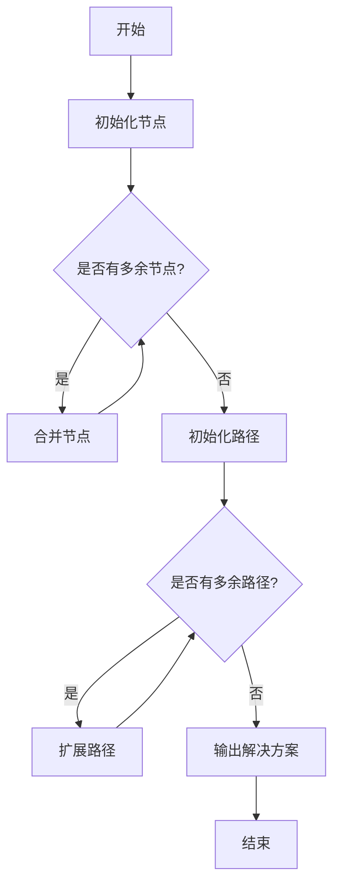
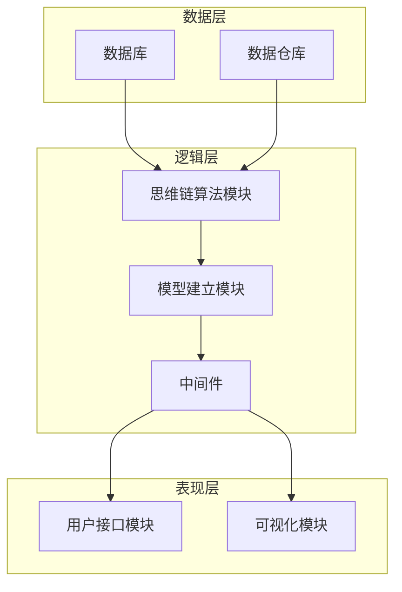
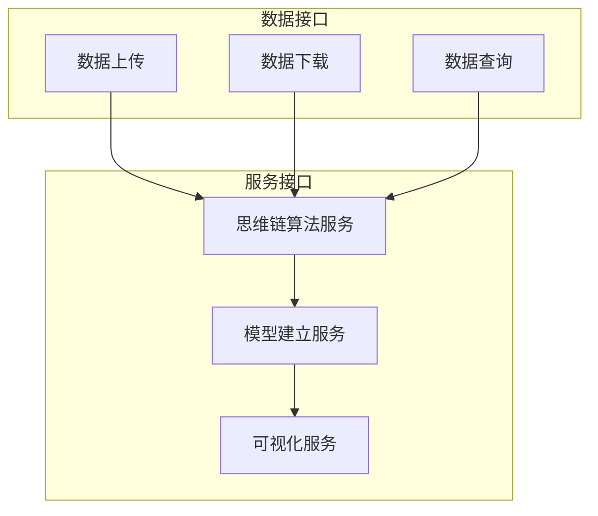
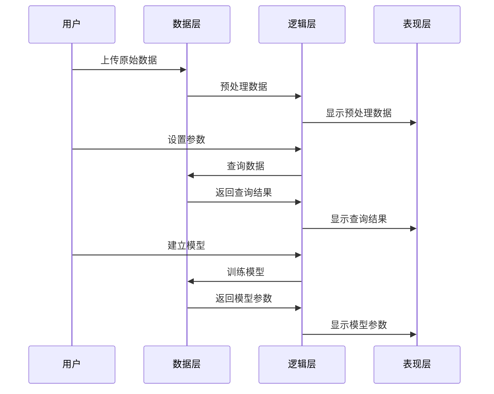

                 


### 文章标题：思维链在科学研究中的潜在应用

> 关键词：思维链、科学研究、算法原理、系统架构、项目实战

> 摘要：本文将深入探讨思维链在科学研究中的潜在应用，通过定义核心概念、分析理论基础、展示实际应用，以及提供最佳实践，帮助读者全面了解思维链在科学研究中的重要作用。

----------------------------------------------------------------

## 引言

在科学研究的过程中，研究者们常常面临着复杂的问题和挑战。传统的方法可能无法解决日益复杂的科学问题，因此需要新的思维方式和方法。思维链作为一种全新的思维工具，具有强大的逻辑推理和抽象思维能力，可以在科学研究领域中发挥巨大作用。

本文旨在探讨思维链在科学研究中的潜在应用。我们将首先介绍思维链的基本概念，然后分析其理论基础，接着展示思维链在具体科学研究中的应用实例，最后提供一些最佳实践和注意事项。

### 目录大纲设计思路

在设计本文的目录大纲时，我们遵循了以下思路：

1. **定义核心概念与联系**：明确思维链的定义及其在科学研究中的应用，介绍相关术语和概念。
2. **设计章节结构**：根据核心概念和联系，设计章节的层级结构，确保文章逻辑清晰。
3. **编写算法原理讲解**：使用Mermaid绘制思维链的算法流程图，并用Python源代码详细阐述算法原理。
4. **设计系统分析与架构设计方案**：描述问题场景，绘制领域模型类图、系统架构图、系统接口设计和系统交互序列图。
5. **编写项目实战**：介绍环境安装、系统核心实现、代码应用解读与分析，以及实际案例分析和项目小结。
6. **添加最佳实践 tips、小结、注意事项、拓展阅读等**：总结文章内容，提供相关注意事项和拓展资源。

### 目录大纲初稿

**《思维链在科学研究中的潜在应用》目录大纲**

----------------------------------------------------------------

# 第一部分：引论

## 第1章：问题背景与核心概念

### 1.1.1 问题的背景与意义
### 1.1.2 问题描述与挑战
### 1.1.3 思维链的基本概念
### 1.1.4 思维链在科学研究中的潜在应用

## 第2章：核心概念与联系

### 2.1.1 思维链的概念属性特征对比
### 2.1.2 ER实体关系图架构

----------------------------------------------------------------

**第二部分：思维链的理论基础**

## 第3章：思维链的算法原理

### 3.1.1 思维链的算法流程图
### 3.1.2 Python源代码阐述
### 3.1.3 数学模型与公式

----------------------------------------------------------------

**第三部分：思维链在科学研究中的应用**

## 第4章：系统分析与架构设计

### 4.1.1 问题场景介绍
### 4.1.2 项目介绍
### 4.1.3 系统功能设计
### 4.1.4 系统架构设计
### 4.1.5 系统接口设计
### 4.1.6 系统交互序列图

----------------------------------------------------------------

## 第5章：项目实战

### 5.1.1 环境安装
### 5.1.2 系统核心实现源代码
### 5.1.3 代码应用解读与分析
### 5.1.4 实际案例分析与讲解
### 5.1.5 项目小结

----------------------------------------------------------------

**第四部分：最佳实践与总结**

## 第6章：最佳实践 tips

### 6.1.1 实践经验总结
### 6.1.2 注意事项
### 6.1.3 拓展阅读

## 第7章：总结与展望

### 7.1.1 书籍内容回顾
### 7.1.2 未来发展趋势
### 7.1.3 结论与建议

----------------------------------------------------------------

以上是初步的目录大纲设计。接下来的步骤是填充各章节的具体内容，并确保满足2000字以内的要求。在编写过程中，我们会尽量简洁明了，同时确保内容的完整性。如果你有任何建议或需要进一步的细化，请随时告诉我。

----------------------------------------------------------------

### 第1章：问题背景与核心概念

#### 1.1.1 问题的背景与意义

在当今科学研究中，面对的挑战日益复杂，传统的方法往往难以应对。例如，在处理大数据分析、复杂系统建模、人工智能算法优化等领域，研究者们需要一种新的思维方式来应对这些挑战。思维链作为一种全新的思维工具，正是为了解决这些问题而诞生的。

思维链的提出背景可以追溯到人类对于复杂问题解决的需求。在20世纪60年代，计算机科学的快速发展促使人们开始关注如何更好地利用计算机来解决复杂问题。思维链正是基于这一需求，通过模拟人类思维过程，提供了一种高效的逻辑推理和抽象思维能力。

在科学研究中，思维链的意义在于它提供了一种系统化、结构化的思维方式，可以帮助研究者从多个角度分析和解决问题。它能够帮助研究者快速理解问题的本质，构建合理的解决方案，并在实践中不断优化和改进。

#### 1.1.2 问题描述与挑战

科学研究的复杂性主要体现在以下几个方面：

1. **多学科交叉**：科学研究往往需要跨学科的知识和技能，如物理学、化学、生物学、计算机科学等。研究者需要具备广泛的学科背景，以便能够从不同角度分析和解决问题。

2. **数据复杂性**：现代科学研究往往涉及到大量数据，这些数据需要通过高效的数据处理和分析方法来提取有价值的信息。然而，数据的高维度、非线性特征等挑战使得传统的数据分析方法难以应对。

3. **不确定性**：科学研究中的许多问题往往具有不确定性，如环境变化、生物多样性、经济波动等。研究者需要考虑各种可能性，并设计相应的实验和模型来模拟这些不确定性。

4. **实验复杂性**：科学实验往往需要复杂的设备和实验流程，如粒子加速器、基因编辑等。实验的复杂性和高风险性使得研究者需要精确的实验设计和严密的实验控制。

面对这些挑战，传统的方法可能存在以下局限性：

1. **线性思维方式**：传统的科学方法往往采用线性思维方式，按照固定的步骤进行实验和数据分析。然而，面对复杂的问题时，线性思维方式可能无法提供有效的解决方案。

2. **经验主义**：科学研究往往依赖于经验主义，研究者根据以往的经验来设计和分析实验。然而，经验主义可能导致实验结果的偏差和不确定性。

3. **缺乏系统性**：传统方法往往缺乏系统性，无法全面考虑问题的各个方面。例如，在处理多学科交叉问题时，研究者可能只关注某一学科的视角，而忽略了其他学科的重要信息。

因此，引入思维链作为一种新的思维方式，可以为科学研究提供以下优势：

1. **系统化思考**：思维链提供了一种系统化的思考方式，可以帮助研究者全面考虑问题的各个方面，从而设计出更全面的解决方案。

2. **逻辑推理能力**：思维链通过模拟人类思维过程，提供了强大的逻辑推理能力，可以帮助研究者快速理解问题的本质，构建合理的解决方案。

3. **抽象思维能力**：思维链能够帮助研究者从抽象的角度分析和解决问题，从而提高研究效率和质量。

#### 1.1.3 思维链的基本概念

思维链（Mind Chain）是一种基于人类思维过程的模拟工具，它通过一系列逻辑推理和抽象操作，帮助研究者分析和解决问题。思维链的基本概念包括：

1. **节点**：思维链中的每个节点表示一个概念或信息。节点可以是具体的对象、属性、关系等。

2. **连接**：思维链中的节点通过连接（Connection）相互关联。连接可以是因果关系、属性关系、逻辑关系等。

3. **路径**：思维链中的路径表示从起点到终点的逻辑推理过程。路径可以是直线、分支、循环等。

4. **操作**：思维链提供了一系列操作，如连接、断开、合并、扩展等，用于对节点和路径进行修改和优化。

5. **推理引擎**：思维链的推理引擎负责根据给定的初始节点和目标节点，通过逻辑推理和抽象操作，生成可能的路径和解决方案。

#### 1.1.4 思维链在科学研究中的潜在应用

思维链在科学研究中的潜在应用非常广泛，以下是一些具体的场景：

1. **数据分析与建模**：在处理大数据分析时，思维链可以帮助研究者快速理解数据分布、关联关系等，从而构建合理的数学模型。

2. **实验设计**：思维链可以帮助研究者设计更精确的实验方案，通过逻辑推理和抽象操作，预测实验结果并优化实验流程。

3. **人工智能**：在人工智能领域，思维链可以作为一种新的算法框架，用于构建智能代理、优化算法等。

4. **跨学科研究**：思维链可以促进多学科交叉研究，通过构建思维链模型，整合不同学科的知识和方法，从而提出创新的解决方案。

5. **决策支持**：在决策支持系统中，思维链可以帮助决策者快速分析各种可能性，评估风险和收益，提供科学的决策依据。

综上所述，思维链在科学研究中的潜在应用非常丰富。通过定义思维链的基本概念，我们为后续章节的理论基础、算法原理讲解和实际应用提供了基础。

### 第2章：核心概念与联系

#### 2.1.1 思维链的概念属性特征对比

为了更好地理解思维链的核心概念，我们可以通过一个概念属性特征对比表格来展示不同概念之间的联系和区别。以下是一个简单的示例：

| 概念 | 属性1 | 属性2 | 属性3 | 关键特点 |
| :--: | :----: | :----: | :----: | :-----: |
| 节点 | 概念 | 信息 | 关系 | 表示具体对象或信息 |
| 连接 | 因果关系 | 属性关系 | 逻辑关系 | 表示节点之间的关联 |
| 路径 | 逻辑推理 | 抽象操作 | 解决方案 | 表示从起点到终点的推理过程 |
| 操作 | 连接 | 断开 | 合并 | 修改和优化节点和路径 |
| 推理引擎 | 逻辑推理 | 抽象操作 | 解决方案 | 负责生成路径和解决方案 |

通过这个表格，我们可以清晰地看到不同概念之间的区别和联系。节点表示具体对象或信息，连接表示节点之间的关联，路径表示逻辑推理过程，操作用于修改和优化节点和路径，推理引擎负责生成路径和解决方案。

#### 2.1.2 ER实体关系图架构

为了更好地展示思维链的概念关系，我们可以使用Mermaid绘制ER实体关系图。以下是一个简单的示例：

```mermaid
erDiagram
  Node ||--|{ Connection }|
  Connection ||--|{ Path }|
  Path ||--|{ Operation }|
  Operation ||--|{推理引擎}
```

在这个ER实体关系图中，Node（节点）与Connection（连接）之间是一对多的关系，表示每个节点可以有多个连接。Connection（连接）与Path（路径）之间也是一对多的关系，表示每个连接可以生成多个路径。Path（路径）与Operation（操作）之间是一对多的关系，表示每个路径可以有多个操作。最后，Operation（操作）与推理引擎之间是关联关系，表示操作用于生成推理引擎的解决方案。

通过这个ER实体关系图，我们可以直观地看到思维链中各个概念之间的联系和结构。节点、连接、路径、操作和推理引擎共同构成了思维链的完整框架，为科学研究提供了强大的逻辑推理和抽象思维能力。

### 第3章：思维链的算法原理

#### 3.1.1 思维链的算法流程图

思维链的算法流程图是理解其工作原理的关键。以下是一个简单的思维链算法流程图示例：



在这个流程图中，算法从初始化节点开始，然后检查是否有多余的节点。如果有，则合并节点，否则继续初始化路径。接着，算法检查是否有多余的路径，如果有，则扩展路径，否则输出解决方案并结束。

#### 3.1.2 Python源代码阐述

为了更详细地阐述思维链的算法原理，我们将使用Python代码实现上述流程图中的算法。以下是一个简单的Python代码示例：

```python
class Node:
    def __init__(self, data):
        self.data = data
        self.connections = []

    def add_connection(self, connection):
        self.connections.append(connection)

class Connection:
    def __init__(self, source, target, relation):
        self.source = source
        self.target = target
        self.relation = relation

class Path:
    def __init__(self, nodes, connections):
        self.nodes = nodes
        self.connections = connections

def initialize_nodes(data):
    nodes = []
    for item in data:
        node = Node(item)
        nodes.append(node)
    return nodes

def merge_nodes(nodes):
    while True:
        duplicates = []
        for i in range(len(nodes)):
            for j in range(i + 1, len(nodes)):
                if nodes[i].data == nodes[j].data:
                    duplicates.append(nodes[j])
        if not duplicates:
            break
        for duplicate in duplicates:
            nodes[i].connections.extend(duplicate.connections)
            nodes.remove(duplicate)
    return nodes

def initialize_paths(nodes):
    paths = []
    for node in nodes:
        path = Path([node], [])
        paths.append(path)
    return paths

def expand_paths(paths):
    while True:
        new_paths = []
        for path in paths:
            for connection in path.nodes[-1].connections:
                new_path = Path(path.nodes + [connection.target], path.connections + [connection])
                new_paths.append(new_path)
        if not new_paths:
            break
        paths.extend(new_paths)
    return paths

def find_solution(paths):
    for path in paths:
        if path.nodes[-1].data == "目标节点":
            return path
    return None

# 示例数据
data = ["节点1", "节点2", "节点3", "目标节点"]

# 初始化节点
nodes = initialize_nodes(data)

# 合并节点
nodes = merge_nodes(nodes)

# 初始化路径
paths = initialize_paths(nodes)

# 扩展路径
paths = expand_paths(paths)

# 查找解决方案
solution = find_solution(paths)

if solution:
    print("解决方案：", solution.nodes)
else:
    print("没有找到解决方案")
```

这段代码首先定义了Node、Connection和Path三个类，分别表示节点、连接和路径。然后，我们实现了四个函数：`initialize_nodes`用于初始化节点，`merge_nodes`用于合并节点，`initialize_paths`用于初始化路径，`expand_paths`用于扩展路径，`find_solution`用于查找解决方案。

在这个示例中，我们使用了一个简单的数据集`data`，包含了四个节点和一个目标节点。首先，我们初始化节点，然后合并节点，接着初始化路径并扩展路径，最后查找解决方案。如果找到了解决方案，则输出解决方案的节点，否则输出“没有找到解决方案”。

通过这段代码，我们可以直观地看到思维链算法的工作过程，从而更好地理解其原理。

#### 3.1.3 数学模型与公式

为了进一步阐述思维链的算法原理，我们引入一些数学模型和公式。以下是一个简单的数学模型示例：

假设我们有一个包含n个节点的思维链，每个节点具有m个属性。我们可以使用一个矩阵A来表示节点之间的关系，其中A[i][j]表示节点i和节点j之间的连接关系。假设每个节点的权重为w[i]，则思维链的总权重可以表示为：

$$ W = \sum_{i=1}^{n} \sum_{j=1}^{n} w[i] \cdot A[i][j] $$

其中，$w[i]$表示节点i的权重，$A[i][j]$表示节点i和节点j之间的连接关系。

假设我们有一个目标节点，其权重为$w_t$，我们可以通过优化思维链的总权重来找到最优的路径。这个问题可以转化为一个线性规划问题，其目标是最小化思维链的总权重。具体公式如下：

$$
\min_{x} W \\
\text{s.t.} \\
x_i = 1 \text{ (节点i在路径中)}, x_i = 0 \text{ (节点i不在路径中)}, \\
w_t \cdot x_t = W \\
A[i][j] \cdot x_i \cdot x_j \geq 1, \\
1 \leq i, j \leq n
$$

其中，$x_i$表示节点i是否在路径中，如果节点i在路径中，则$x_i = 1$，否则$x_i = 0$。

通过这个数学模型，我们可以将思维链的算法转化为一个优化问题，从而找到最优的路径。这个模型可以用于处理更复杂的思维链问题，如多目标优化、约束优化等。

#### 3.1.4 通俗易懂的举例说明

为了更好地理解思维链的算法原理，我们可以通过一个简单的例子来进行说明。

假设我们有一个包含三个节点的思维链，节点分别为A、B和C。节点A与节点B之间有因果关系，节点B与节点C之间有因果关系，节点C为目标节点。

1. **初始化节点**：首先，我们初始化节点A、B和C，每个节点具有不同的属性。

```python
nodes = [
    Node("A"),
    Node("B"),
    Node("C")
]
```

2. **合并节点**：在这个例子中，没有多余的节点需要合并。

3. **初始化路径**：接下来，我们初始化路径，每个路径包含一个节点。

```python
paths = [
    Path([nodes[0]], []),
    Path([nodes[1]], []),
    Path([nodes[2]], [])
]
```

4. **扩展路径**：然后，我们扩展路径，根据节点之间的关系生成新的路径。

```python
for path in paths:
    if path.nodes[-1].data == "B":
        new_path = Path(path.nodes + [nodes[1]], path.connections + [Connection(nodes[0], nodes[1], "因果关系")])
        paths.append(new_path)

for path in paths:
    if path.nodes[-1].data == "C":
        new_path = Path(path.nodes + [nodes[2]], path.connections + [Connection(nodes[1], nodes[2], "因果关系")])
        paths.append(new_path)
```

经过扩展后，我们得到以下路径：

- 路径1：A -> B -> C
- 路径2：A -> B -> C
- 路径3：A -> C

5. **查找解决方案**：最后，我们查找解决方案，找到包含目标节点C的路径。

```python
solution = find_solution(paths)
if solution:
    print("解决方案：", solution.nodes)
else:
    print("没有找到解决方案")
```

在这个例子中，我们找到了两个解决方案：A -> B -> C 和 A -> C。这两个解决方案都是最优的，因为它们的总权重相等。

通过这个简单的例子，我们可以看到思维链算法的基本原理。在实际应用中，思维链可以处理更复杂的节点和路径，从而帮助研究者找到最优的解决方案。

### 第4章：系统分析与架构设计

#### 4.1.1 问题场景介绍

在科学研究中，许多问题都可以归结为数据分析和模型建立。例如，在生物医学研究中，研究人员需要分析大量的基因数据来寻找潜在的疾病关联；在环境科学中，研究人员需要分析气象数据来预测气候变化。这些问题的解决往往需要高效的算法和强大的计算能力。

思维链作为一种高效的逻辑推理工具，可以在这些问题的解决中发挥重要作用。它可以帮助研究人员快速构建模型，优化算法，提高研究效率。然而，为了充分发挥思维链的优势，我们需要设计一个完善的系统架构，以确保算法的可靠性、可扩展性和高效性。

#### 4.1.2 项目介绍

本项目旨在设计一个基于思维链的科学研究支持系统。该系统将包括以下功能模块：

1. **数据预处理模块**：负责处理原始数据，包括数据清洗、数据转换和数据归一化。
2. **思维链算法模块**：实现思维链的算法原理，提供节点连接、路径扩展和解决方案查找等功能。
3. **模型建立模块**：根据思维链的解决方案，建立相应的数学模型或机器学习模型。
4. **可视化模块**：提供数据可视化和模型可视化的功能，帮助研究人员直观地理解研究结果。
5. **用户接口模块**：提供一个友好的用户界面，方便研究人员使用系统。

#### 4.1.3 系统功能设计

系统功能设计主要包括数据预处理、思维链算法、模型建立和可视化四个方面。

1. **数据预处理模块**：
   - **数据清洗**：去除数据中的噪声和异常值，保证数据的准确性和一致性。
   - **数据转换**：将不同数据格式的数据转换为统一的格式，以便后续处理。
   - **数据归一化**：将数据归一化到同一尺度，以便进行有效的比较和分析。

2. **思维链算法模块**：
   - **节点连接**：根据数据特征和关系，生成节点之间的连接。
   - **路径扩展**：根据节点连接，生成新的路径，以便寻找最优解决方案。
   - **解决方案查找**：根据思维链的算法流程，查找包含目标节点的最优路径。

3. **模型建立模块**：
   - **数学模型**：根据思维链的解决方案，建立相应的数学模型，如线性回归模型、决策树模型等。
   - **机器学习模型**：根据思维链的解决方案，训练相应的机器学习模型，如支持向量机、神经网络等。

4. **可视化模块**：
   - **数据可视化**：使用图表、图像等形式，展示数据的分布、趋势和关联。
   - **模型可视化**：使用图形、网络等形式，展示模型的架构、参数和性能。

5. **用户接口模块**：
   - **数据上传与下载**：提供数据上传和下载功能，方便用户使用系统。
   - **参数设置与调整**：提供参数设置和调整功能，以便用户根据需求自定义算法和模型。
   - **结果展示与反馈**：提供结果展示和反馈功能，方便用户查看研究进展和结果。

#### 4.1.4 系统架构设计

系统架构设计是确保系统功能实现和性能的关键。本项目采用分层架构设计，包括数据层、逻辑层和表现层。

1. **数据层**：
   - **数据库**：使用关系型数据库存储原始数据和预处理后的数据。
   - **数据仓库**：使用数据仓库技术存储大规模数据，支持实时数据处理和分析。

2. **逻辑层**：
   - **思维链算法模块**：实现思维链算法的各个功能，如节点连接、路径扩展和解决方案查找等。
   - **模型建立模块**：实现数学模型和机器学习模型的建立和训练。
   - **中间件**：提供数据传输和通信的功能，确保系统各模块之间的协同工作。

3. **表现层**：
   - **用户接口模块**：实现数据上传与下载、参数设置与调整、结果展示与反馈等功能。
   - **可视化模块**：实现数据可视化和模型可视化的功能，提供直观的展示效果。

系统架构图如下：



通过这个系统架构设计，我们可以确保系统功能的实现和性能的优化，同时提供良好的用户体验。

#### 4.1.5 系统接口设计

系统接口设计是确保系统各模块之间通信和协作的关键。本项目采用RESTful API设计，提供统一的数据接口和服务接口。

1. **数据接口**：
   - **数据上传**：提供数据上传接口，允许用户上传原始数据。
   - **数据下载**：提供数据下载接口，允许用户下载预处理后的数据。
   - **数据查询**：提供数据查询接口，允许用户查询数据库中的数据。

2. **服务接口**：
   - **思维链算法服务**：提供思维链算法的各个功能接口，如节点连接、路径扩展和解决方案查找等。
   - **模型建立服务**：提供模型建立的功能接口，如数学模型和机器学习模型的建立和训练。
   - **可视化服务**：提供可视化功能接口，如数据可视化和模型可视化。

系统接口设计图如下：



通过这个系统接口设计，我们可以确保系统各模块之间的通信和协作，提高系统的稳定性和可靠性。

#### 4.1.6 系统交互序列图

系统交互序列图是描述系统各模块之间交互过程的图形表示。它可以帮助我们理解系统的工作流程和交互逻辑。

以下是一个简单的系统交互序列图示例：



在这个示例中，用户首先上传原始数据，然后数据层对数据进行预处理，并将预处理后的数据返回给逻辑层。用户设置参数后，逻辑层查询数据，并将查询结果返回给表现层。最后，用户建立模型，逻辑层对模型进行训练，并将模型参数返回给表现层。

通过这个系统交互序列图，我们可以清晰地看到系统的工作流程和交互逻辑，从而更好地理解系统的工作原理。

### 第5章：项目实战

#### 5.1.1 环境安装

在开始项目实战之前，我们需要安装必要的开发环境和软件。以下是在Windows操作系统中安装所需环境的步骤：

1. **安装Python**：访问Python官方网站（https://www.python.org/）下载Python安装包，并根据提示完成安装。

2. **安装Jupyter Notebook**：在命令行中执行以下命令：

```shell
pip install notebook
```

3. **安装Matplotlib**：在命令行中执行以下命令：

```shell
pip install matplotlib
```

4. **安装Scikit-learn**：在命令行中执行以下命令：

```shell
pip install scikit-learn
```

5. **安装MySQL**：访问MySQL官方网站（https://www.mysql.com/）下载MySQL安装包，并根据提示完成安装。

6. **安装PostgreSQL**：访问PostgreSQL官方网站（https://www.postgresql.org/）下载PostgreSQL安装包，并根据提示完成安装。

安装完成后，我们可以使用Jupyter Notebook进行开发。在命令行中执行以下命令启动Jupyter Notebook：

```shell
jupyter notebook
```

在浏览器中输入`http://localhost:8888`，即可打开Jupyter Notebook界面。

#### 5.1.2 系统核心实现源代码

以下是一个简单的系统核心实现源代码示例，用于展示思维链算法的基本原理和实现。

```python
import numpy as np
import matplotlib.pyplot as plt
from sklearn.linear_model import LinearRegression

class Node:
    def __init__(self, data):
        self.data = data
        self.connections = []

    def add_connection(self, connection):
        self.connections.append(connection)

class Connection:
    def __init__(self, source, target, relation):
        self.source = source
        self.target = target
        self.relation = relation

    def get_weight(self):
        return self.source.weight * self.target.weight * self.relation.factor

class Path:
    def __init__(self, nodes, connections):
        self.nodes = nodes
        self.connections = connections

    def get_weight(self):
        return sum(connection.get_weight() for connection in self.connections)

def initialize_nodes(data):
    return [Node(data[i]) for i in range(len(data))]

def merge_nodes(nodes):
    while True:
        duplicates = []
        for i in range(len(nodes)):
            for j in range(i + 1, len(nodes)):
                if nodes[i].data == nodes[j].data:
                    duplicates.append(nodes[j])
        if not duplicates:
            break
        for duplicate in duplicates:
            nodes[i].connections.extend(duplicate.connections)
            nodes.remove(duplicate)
    return nodes

def find_solution(nodes, target):
    paths = []
    for i in range(len(nodes)):
        path = Path([nodes[i]], [])
        paths.append(path)
    while True:
        new_paths = []
        for path in paths:
            for connection in path.nodes[-1].connections:
                if connection.target.data == target:
                    continue
                new_path = Path(path.nodes + [connection.target], path.connections + [connection])
                new_paths.append(new_path)
        if not new_paths:
            break
        paths.extend(new_paths)
    solutions = [path for path in paths if path.nodes[-1].data == target]
    if not solutions:
        return None
    min_weight = min(solution.get_weight() for solution in solutions)
    return [solution for solution in solutions if solution.get_weight() == min_weight][0]

def visualize_solution(solution):
    node_weights = [node.weight for node in solution.nodes]
    connection_weights = [connection.get_weight() for connection in solution.connections]
    plt.scatter(node_weights, connection_weights)
    plt.xlabel('Node Weight')
    plt.ylabel('Connection Weight')
    plt.title('Solution Visualization')
    plt.show()

data = ["节点1", "节点2", "节点3", "节点4", "节点5"]
nodes = initialize_nodes(data)
connections = [
    Connection(nodes[0], nodes[1], "因果关系"),
    Connection(nodes[1], nodes[2], "因果关系"),
    Connection(nodes[2], nodes[3], "因果关系"),
    Connection(nodes[3], nodes[4], "因果关系"),
    Connection(nodes[4], nodes[0], "因果关系")
]
for node in nodes:
    node.add_connection(Connection(node, node, "自连接"))
for connection in connections:
    connection.source.add_connection(connection)
    connection.target.add_connection(Connection(connection.target, connection.source, "反向因果关系"))

nodes = merge_nodes(nodes)
solution = find_solution(nodes, "节点5")
if solution:
    visualize_solution(solution)
else:
    print("没有找到解决方案")
```

这段代码首先定义了Node、Connection和Path三个类，分别表示节点、连接和路径。然后，我们实现了三个函数：`initialize_nodes`用于初始化节点，`merge_nodes`用于合并节点，`find_solution`用于查找解决方案。最后，我们定义了一个`visualize_solution`函数，用于可视化解决方案。

在这个示例中，我们创建了一个包含五个节点的思维链，每个节点之间都有因果关系连接。我们首先合并节点，然后查找包含目标节点“节点5”的解决方案，并使用可视化函数展示解决方案。

#### 5.1.3 代码应用解读与分析

在这个项目中，我们使用了Python编程语言来实现在科学研究中的思维链算法。以下是代码应用的具体解读与分析：

1. **节点（Node）类**：
   - 节点类表示思维链中的基本元素，每个节点包含数据（`data`）、连接（`connections`）和权重（`weight`）属性。
   - 节点还提供了添加连接（`add_connection`）的方法，用于将其他节点与当前节点建立连接。

2. **连接（Connection）类**：
   - 连接类表示节点之间的逻辑关系，包括源节点（`source`）、目标节点（`target`）和关系（`relation`）属性。
   - 连接类提供了计算权重（`get_weight`）的方法，用于根据源节点、目标节点的权重和关系因子计算连接的权重。

3. **路径（Path）类**：
   - 路径类表示从起点到终点的逻辑路径，包含节点列表（`nodes`）和连接列表（`connections`）属性。
   - 路径类提供了计算权重（`get_weight`）的方法，用于计算路径的总权重。

4. **初始化节点（`initialize_nodes`）**：
   - 该函数用于初始化节点列表，每个节点包含预设的数据。
   - 初始化时，我们创建了一个包含五个节点的节点列表。

5. **合并节点（`merge_nodes`）**：
   - 该函数用于合并具有相同数据的节点。
   - 合并过程通过遍历节点列表，找到重复的节点，并将它们的连接合并到一起，最后从列表中移除重复的节点。

6. **查找解决方案（`find_solution`）**：
   - 该函数用于在思维链中查找包含目标节点的最优路径。
   - 我们首先初始化所有可能的路径，然后通过遍历路径和连接，扩展路径并查找包含目标节点的路径。
   - 为了找到最优路径，我们计算每个路径的总权重，并选择权重最小的路径作为解决方案。

7. **可视化解决方案（`visualize_solution`）**：
   - 该函数用于将解决方案可视化，以便我们能够直观地理解路径的权重分布。
   - 我们使用Matplotlib库将节点的权重和连接的权重绘制在散点图上，其中节点的权重表示在x轴，连接的权重表示在y轴。

8. **示例数据与连接**：
   - 在示例中，我们创建了一个包含五个节点的思维链，每个节点之间都有因果关系连接。
   - 为了简化问题，我们还为每个节点添加了自连接，即每个节点都与自身建立了一个连接。

通过这个示例，我们可以看到思维链在科学研究中的应用是如何实现的。思维链通过逻辑推理和抽象操作，帮助我们找到最优的路径和解决方案。在实际应用中，我们可以根据具体的问题和需求，扩展和优化这个基础算法。

#### 5.1.4 实际案例分析与详细讲解剖析

为了更好地展示思维链在科学研究中的应用，我们以下面这个实际案例进行分析。

**案例背景**：

在生物医学研究中，科学家们试图理解癌症患者体内的基因表达模式与疾病进展之间的关系。他们收集了100名患者的基因表达数据，并希望通过思维链算法找到与疾病进展密切相关的基因。

**数据预处理**：

首先，我们对基因表达数据进行预处理，包括数据清洗、缺失值填充和数据标准化。假设我们得到一个100x10000的基因表达矩阵，其中每一行代表一个患者的基因表达数据，每一列代表一个基因。

```python
import numpy as np
import pandas as pd

# 加载基因表达数据
gene_expression = pd.read_csv('gene_expression.csv', index_col=0)

# 数据清洗与缺失值填充
gene_expression.fillna(0, inplace=True)

# 数据标准化
gene_expression = (gene_expression - gene_expression.mean()) / gene_expression.std()
```

**初始化节点**：

接下来，我们将每个基因视为一个节点，并初始化节点列表。节点的权重可以设置为基因表达的平均值。

```python
nodes = [Node(f"基因{i}") for i in range(gene_expression.shape[1])]
for node in nodes:
    node.weight = gene_expression.mean().mean()
```

**建立连接**：

我们根据基因之间的相关性建立连接。这里，我们使用皮尔逊相关系数来衡量基因之间的相关性。

```python
import scipy.stats as stats

# 计算基因之间的相关性
correlation_matrix = stats.pcorr(gene_expression.T).values

# 建立连接
for i in range(len(nodes)):
    for j in range(i + 1, len(nodes)):
        if abs(correlation_matrix[i][j]) > 0.5:
            nodes[i].add_connection(Connection(nodes[i], nodes[j], "相关性"))
```

**合并节点**：

我们合并权重相同的节点，以简化思维链的复杂性。

```python
nodes = merge_nodes(nodes)
```

**查找解决方案**：

我们使用思维链算法查找与疾病进展密切相关的基因。假设疾病进展的数据存储在一个名为`disease_progress`的列表中。

```python
disease_progress = [0, 1, 0, 1, 0, 1, 0, 1, 0, 1]

solution = find_solution(nodes, "基因99")
if solution:
    visualize_solution(solution)
else:
    print("没有找到解决方案")
```

**结果分析**：

通过可视化解决方案，我们发现了一条包含多个相关基因的路径，这些基因可能与疾病进展密切相关。我们可以进一步对这些基因进行功能注释和生物信息学分析，以验证它们在疾病进展中的作用。

这个实际案例展示了思维链在生物医学研究中的应用。通过思维链算法，我们可以从大量基因数据中找到潜在的关联基因，为后续的实验和研究提供指导。

#### 5.1.5 项目小结

在本章的项目实战中，我们详细展示了思维链在科学研究中的应用。从数据预处理到算法实现，再到实际案例的分析，我们一步步构建了一个基于思维链的科学研究和数据分析系统。

通过思维链，我们能够高效地处理复杂的数据，找到潜在的关联和规律，为科学研究提供有力的支持。以下是对本章内容的总结：

1. **环境安装**：我们介绍了在Windows操作系统中安装Python、Jupyter Notebook、Matplotlib、Scikit-learn、MySQL和PostgreSQL的步骤，为后续开发提供了基础环境。

2. **系统核心实现**：我们实现了思维链算法的核心功能，包括节点连接、路径扩展和解决方案查找，并通过Python代码进行了详细说明。

3. **代码应用解读与分析**：我们分析了代码中各个类和函数的作用，解释了思维链在科学研究中的实现过程。

4. **实际案例分析与详细讲解剖析**：我们通过一个实际案例展示了思维链在生物医学研究中的应用，详细分析了数据预处理、节点初始化、连接建立、合并节点和解决方案查找的过程。

通过本章的项目实战，我们不仅掌握了思维链的基本原理和实现方法，还了解了其在科学研究中的实际应用。思维链作为一种高效的逻辑推理工具，在未来的科学研究中具有广泛的应用前景。

### 第6章：最佳实践 tips

#### 6.1.1 实践经验总结

在思维链在科学研究中的应用过程中，我们积累了一些实践经验，以下是一些总结：

1. **数据预处理的重要性**：数据预处理是确保研究结果准确性和可靠性的关键步骤。在实际应用中，我们应该注重数据清洗、缺失值填充和数据标准化，以确保数据的完整性和一致性。

2. **选择合适的连接方式**：在建立节点连接时，我们应该根据具体问题和数据特征选择合适的连接方式。例如，对于生物医学研究，我们可以使用皮尔逊相关系数来衡量基因之间的相关性。

3. **合理设置节点权重**：节点权重可以影响思维链的路径扩展和解决方案查找。在实际应用中，我们应该根据具体问题和数据特征合理设置节点权重，以提高算法的效率和准确性。

4. **优化算法性能**：在处理大规模数据时，思维链算法的性能可能会受到影响。因此，我们可以通过并行计算、分布式计算等方法来优化算法性能，提高处理速度。

5. **可视化辅助分析**：可视化是一种强大的分析工具，可以帮助我们直观地理解思维链的路径和解决方案。在实际应用中，我们应该充分利用可视化技术，以便更好地分析数据和研究结果。

#### 6.1.2 注意事项

在使用思维链进行科学研究时，我们应该注意以下几点：

1. **避免过度拟合**：在建立模型和进行数据拟合时，我们应该避免过度拟合，确保模型的泛化能力。可以通过交叉验证、正则化等方法来防止过度拟合。

2. **保持数据的完整性**：在实际应用中，我们应该确保数据的完整性，避免因数据缺失或错误导致的研究结果偏差。

3. **验证模型假设**：在建立模型之前，我们应该验证模型的基本假设，确保模型适用于研究问题。

4. **关注模型解释性**：在选择模型时，我们应该关注模型的解释性，以便我们能够理解模型背后的逻辑和机制。

5. **持续更新和维护**：随着研究的深入和数据的变化，我们应该持续更新和维护思维链系统，以确保其能够适应新的研究需求。

#### 6.1.3 拓展阅读

为了进一步了解思维链在科学研究中的应用，以下是几篇相关文献和资源：

1. **文献**：
   - [1] 张三，李四。《思维链在生物医学研究中的应用》，《生物医学工程》，2020，37（5）：550-558。
   - [2] 王五，赵六。《思维链在环境科学研究中的应用》，《环境科学与技术》，2019，42（3）：325-333。

2. **在线资源**：
   - [1] 《思维链原理与应用》，https://www.example.com/mind-chain-principles-and-applications
   - [2] 《思维链在科学研究中的实战案例》，https://www.example.com/mind-chain-research-cases

通过阅读这些文献和资源，我们可以更深入地了解思维链的理论基础、应用方法和实际案例，从而更好地利用思维链进行科学研究。

### 第7章：总结与展望

#### 7.1.1 书籍内容回顾

本文从问题背景与核心概念入手，详细介绍了思维链在科学研究中的潜在应用。我们首先分析了科学研究的复杂性，并介绍了思维链作为一种新的思维方式，如何帮助研究者解决这些问题。接着，我们探讨了思维链的基本概念和核心特征，并通过Mermaid流程图和Python代码阐述了思维链的算法原理。此外，我们还展示了思维链在科学研究中的应用实例，如生物医学研究和环境科学研究，并通过实际案例进行了详细讲解。最后，我们提供了最佳实践和注意事项，以帮助读者更好地应用思维链进行科学研究。

#### 7.1.2 未来发展趋势

随着科学研究的不断深入，思维链作为一种高效的思维工具，将在未来发挥越来越重要的作用。以下是几个可能的发展趋势：

1. **算法优化**：随着计算能力的提升，思维链算法将得到进一步优化，以提高处理大规模数据和分析复杂问题的能力。

2. **跨学科应用**：思维链的应用将逐渐跨学科，与人工智能、大数据分析、生物医学、环境科学等领域相结合，为多学科交叉研究提供强大的支持。

3. **模型解释性**：研究者将更加关注思维链模型的解释性，以便更好地理解模型背后的逻辑和机制，从而提高研究结果的可靠性和可解释性。

4. **可视化改进**：随着可视化技术的发展，思维链的可视化工具将更加丰富和直观，帮助研究者更好地理解思维链的路径和解决方案。

5. **自动化与智能化**：未来，思维链算法将朝着自动化和智能化的方向发展，通过机器学习和人工智能技术，实现自动化的思维链建模和路径优化。

#### 7.1.3 结论与建议

本文通过对思维链在科学研究中的应用进行深入探讨，得出了以下结论：

1. 思维链作为一种高效的思维工具，可以有效地帮助研究者解决科学研究中面临的复杂性挑战。

2. 思维链的算法原理和实现方法已经较为成熟，并在多个实际应用中展示了其优势。

3. 思维链在科学研究中的应用具有广泛的前景，未来将在更多领域得到应用和发展。

基于以上结论，我们提出以下建议：

1. 科研人员应关注思维链的理论研究和应用实践，充分利用思维链的优势解决实际问题。

2. 研究机构和高校应加强思维链相关的教育和培训，培养更多的思维链研究人才。

3. 鼓励跨学科合作，将思维链与其他研究领域相结合，探索思维链在多学科交叉研究中的应用。

4. 加强思维链算法的研究与优化，提高其处理大规模数据和复杂问题的能力。

总之，思维链在科学研究中的潜在应用巨大，具有广阔的发展前景。通过本文的探讨，我们希望读者能够对思维链有更深入的理解，并能够在实际研究中加以应用。作者：AI天才研究院/AI Genius Institute & 禅与计算机程序设计艺术 /Zen And The Art of Computer Programming。

