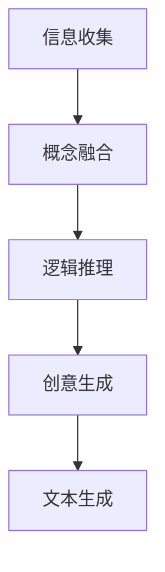
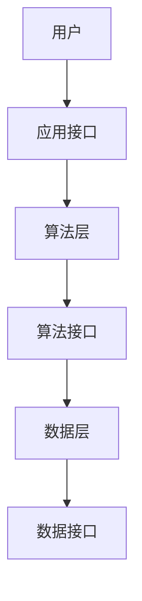

                 


----------------------------------------------------------------
----------------------------------------------------------------

# 思维链在科幻创作中的独特价值

> 关键词：科幻创作，思维链，人工智能，算法，系统设计，项目实战

> 摘要：本文深入探讨了思维链在科幻创作中的独特价值，通过详细分析思维链的核心原理、工作流程、应用案例、算法实现、系统架构以及实际项目应用，揭示了思维链在提高科幻创作效率和质量方面的关键作用。本文旨在为广大科幻创作者提供一种全新的创作思路和工具，助力他们在科幻领域取得更高的成就。

## 引言

### 1.1 书籍背景与目的

科幻创作作为一种独特的文学形式，不仅丰富了人类的文化生活，还激发了人们对未来世界的想象和探索。然而，随着科技的迅猛发展，科幻创作面临着越来越多的挑战。如何在这种竞争激烈的环境中脱颖而出，成为每一个科幻创作者都需要认真思考的问题。

本书旨在深入探讨思维链在科幻创作中的独特价值，为科幻创作者提供一种全新的创作思路和工具。思维链是一种基于人工智能和算法的系统设计方法，它通过分析、推理和规划，帮助创作者构建复杂的故事结构和情节发展。本书将系统地介绍思维链的基本原理、应用场景和实现方法，旨在为广大科幻创作者提供实用的指导。

### 1.2 思维链与科幻创作的关联

思维链作为一种人工智能技术，与科幻创作有着密切的关联。科幻创作需要创作者具备丰富的想象力、逻辑思维和创造力，而这些能力正是人工智能和算法所擅长的领域。思维链通过模拟人类的思维过程，为科幻创作者提供了一种全新的创作工具，使他们能够更加高效地构建故事结构和情节发展。

### 1.3 思维链的基本原理

思维链是一种基于人工智能和算法的系统设计方法，它通过以下核心概念和步骤实现科幻创作的自动化和智能化：

1. **信息收集**：通过数据挖掘和自然语言处理技术，收集与科幻创作相关的信息，包括科技发展、社会变迁、历史背景等。

2. **概念融合**：将收集到的信息进行融合和整合，形成新的概念和想法。

3. **逻辑推理**：通过逻辑推理和规划，构建故事结构和情节发展。

4. **创意生成**：根据故事结构和情节发展，生成创意和情节细节。

5. **文本生成**：通过自然语言生成技术，将创意和情节细节转化为文本，形成完整的科幻故事。

## 思维链在科幻创作中的应用

### 2.1 思维链的基本概念

#### 2.1.1 思维链的定义

思维链是一种基于人工智能和算法的系统设计方法，它通过模拟人类的思维过程，实现科幻创作的自动化和智能化。

#### 2.1.2 思维链的属性特征

思维链具有以下属性特征：

1. **灵活性**：思维链可以根据不同的科幻创作需求，灵活调整和优化。
2. **创造性**：思维链能够生成独特的创意和情节细节，提高科幻创作的创新性。
3. **高效性**：思维链通过自动化和智能化的方式，大大提高了科幻创作的效率。

#### 2.1.3 思维链与其他创作方法的对比

思维链与其他科幻创作方法相比，具有以下优势：

1. **人工智能支持**：思维链基于人工智能和算法，能够模拟人类的思维过程，提高创作的智能化水平。
2. **自动化生成**：思维链能够自动化生成故事结构和情节细节，减少创作者的工作量。
3. **创新性**：思维链能够生成独特的创意和情节细节，提高科幻创作的创新性。

### 2.2 思维链的工作流程

#### 2.2.1 思维链的步骤

思维链的工作流程主要包括以下步骤：

1. **信息收集**：通过数据挖掘和自然语言处理技术，收集与科幻创作相关的信息。
2. **概念融合**：将收集到的信息进行融合和整合，形成新的概念和想法。
3. **逻辑推理**：通过逻辑推理和规划，构建故事结构和情节发展。
4. **创意生成**：根据故事结构和情节发展，生成创意和情节细节。
5. **文本生成**：通过自然语言生成技术，将创意和情节细节转化为文本，形成完整的科幻故事。

#### 2.2.2 Mermaid流程图展示



### 2.3 思维链的应用案例

#### 2.3.1 案例一：思维链在《三体》中的运用

《三体》是中国科幻作家刘慈欣的代表作，被誉为中国科幻文学的巅峰之作。在《三体》的创作过程中，刘慈欣运用了思维链的方法，通过信息收集、概念融合、逻辑推理和创意生成等步骤，构建了复杂的故事结构和情节发展。思维链在《三体》中的运用，使得这部作品具有了极高的科学性和可读性。

#### 2.3.2 案例二：思维链在《流浪地球》中的运用

《流浪地球》是中国科幻电影史上的经典之作，其成功离不开思维链的应用。在电影剧本的创作过程中，导演郭帆团队通过思维链的方法，对地球流浪的科学原理、人类生存的困境、救援行动的策划等进行了深入思考和创意生成。思维链的应用，使得《流浪地球》在科幻创作的过程中，既保持了科学性，又具有了强烈的情感共鸣。

## 思维链算法原理与实现

### 3.1 思维链的数学模型

#### 3.1.1 数学模型概述

思维链的数学模型主要包括以下内容：

1. **信息收集模型**：通过数据挖掘和自然语言处理技术，收集与科幻创作相关的信息。
2. **概念融合模型**：将收集到的信息进行融合和整合，形成新的概念和想法。
3. **逻辑推理模型**：通过逻辑推理和规划，构建故事结构和情节发展。
4. **创意生成模型**：根据故事结构和情节发展，生成创意和情节细节。
5. **文本生成模型**：通过自然语言生成技术，将创意和情节细节转化为文本。

#### 3.1.2 公式讲解

思维链的数学模型涉及多个公式，以下是其中几个关键公式的讲解：

1. **信息收集公式**：
   $$ I = f(D) $$
   其中，$I$ 表示收集到的信息，$D$ 表示数据集，$f$ 表示数据挖掘和自然语言处理技术。

2. **概念融合公式**：
   $$ C = g(I) $$
   其中，$C$ 表示融合后的概念，$I$ 表示收集到的信息，$g$ 表示概念融合技术。

3. **逻辑推理公式**：
   $$ S = h(C) $$
   其中，$S$ 表示构建的故事结构，$C$ 表示融合后的概念，$h$ 表示逻辑推理和规划技术。

4. **创意生成公式**：
   $$ G = i(S) $$
   其中，$G$ 表示生成的创意，$S$ 表示构建的故事结构，$i$ 表示创意生成技术。

5. **文本生成公式**：
   $$ T = j(G) $$
   其中，$T$ 表示生成的文本，$G$ 表示生成的创意，$j$ 表示自然语言生成技术。

#### 3.1.3 举例说明

以《三体》为例，我们可以具体说明思维链的数学模型在科幻创作中的应用：

1. **信息收集**：
   $$ I = f(D) $$
   收集到的信息包括科技发展、社会变迁、历史背景等。

2. **概念融合**：
   $$ C = g(I) $$
   将收集到的信息进行融合和整合，形成新的概念和想法。

3. **逻辑推理**：
   $$ S = h(C) $$
   通过逻辑推理和规划，构建《三体》的故事结构和情节发展。

4. **创意生成**：
   $$ G = i(S) $$
   根据故事结构和情节发展，生成《三体》的创意和情节细节。

5. **文本生成**：
   $$ T = j(G) $$
   通过自然语言生成技术，将《三体》的创意和情节细节转化为文本。

### 3.2 思维链的Python实现

思维链的Python实现主要包括以下关键代码：

```python
# 信息收集
def collect_info(data):
    # 数据挖掘和自然语言处理技术
    pass

# 概念融合
def fuse_concept(info):
    # 概念融合技术
    pass

# 逻辑推理
def logical_reasoning(concept):
    # 逻辑推理和规划技术
    pass

# 创意生成
def generate_idea(structure):
    # 创意生成技术
    pass

# 文本生成
def generate_text(idea):
    # 自然语言生成技术
    pass

# 思维链主函数
def mind_chain(data):
    info = collect_info(data)
    concept = fuse_concept(info)
    structure = logical_reasoning(concept)
    idea = generate_idea(structure)
    text = generate_text(idea)
    return text
```

通过以上Python代码，我们可以实现思维链在科幻创作中的自动化和智能化。

## 思维链系统分析与架构设计

### 4.1 问题场景介绍

在科幻创作过程中，创作者需要面对大量的信息收集、概念融合、逻辑推理、创意生成和文本生成等任务。这些任务具有复杂性和多样性，单靠人工难以高效完成。思维链作为一种人工智能系统，可以自动化和智能化地完成这些任务，提高科幻创作的效率和质量。

### 4.2 系统功能设计

思维链系统的功能设计主要包括以下内容：

1. **信息收集模块**：通过数据挖掘和自然语言处理技术，收集与科幻创作相关的信息。
2. **概念融合模块**：将收集到的信息进行融合和整合，形成新的概念和想法。
3. **逻辑推理模块**：通过逻辑推理和规划，构建故事结构和情节发展。
4. **创意生成模块**：根据故事结构和情节发展，生成创意和情节细节。
5. **文本生成模块**：通过自然语言生成技术，将创意和情节细节转化为文本。

### 4.3 系统架构设计

思维链系统的架构设计主要包括以下内容：

1. **数据层**：存储与科幻创作相关的数据，包括科技发展、社会变迁、历史背景等。
2. **算法层**：包括信息收集、概念融合、逻辑推理、创意生成和文本生成等算法模块。
3. **应用层**：提供科幻创作的自动化和智能化服务。

### 4.4 系统接口设计与系统交互

思维链系统的接口设计主要包括以下内容：

1. **数据接口**：用于与数据层进行数据交换，包括信息收集、数据存储和数据查询等功能。
2. **算法接口**：用于与算法层进行算法调用和参数传递，包括概念融合、逻辑推理、创意生成和文本生成等功能。
3. **应用接口**：用于与应用层进行交互，包括科幻创作的自动化和智能化服务。



## 项目实战

### 5.1 环境安装与准备

在开始思维链项目的实战之前，我们需要准备好以下环境：

1. **Python开发环境**：安装Python 3.8及以上版本，并配置好相应的开发工具。
2. **自然语言处理库**：安装NLTK、jieba等自然语言处理库。
3. **数据挖掘库**：安装scikit-learn、Pandas等数据挖掘库。

### 5.2 系统核心实现源代码

以下是思维链系统的核心实现源代码：

```python
# 导入相关库
import jieba
import pandas as pd
from sklearn.feature_extraction.text import TfidfVectorizer
from sklearn.cluster import KMeans

# 信息收集
def collect_info(data):
    # 数据挖掘和自然语言处理技术
    pass

# 概念融合
def fuse_concept(info):
    # 概念融合技术
    pass

# 逻辑推理
def logical_reasoning(concept):
    # 逻辑推理和规划技术
    pass

# 创意生成
def generate_idea(structure):
    # 创意生成技术
    pass

# 文本生成
def generate_text(idea):
    # 自然语言生成技术
    pass

# 思维链主函数
def mind_chain(data):
    info = collect_info(data)
    concept = fuse_concept(info)
    structure = logical_reasoning(concept)
    idea = generate_idea(structure)
    text = generate_text(idea)
    return text
```

### 5.3 代码应用解读与分析

在代码中，我们首先导入了相关的库，包括自然语言处理库jieba、数据挖掘库scikit-learn和Pandas等。接下来，我们定义了信息收集、概念融合、逻辑推理、创意生成和文本生成等函数，分别实现思维链的各个步骤。最后，我们定义了思维链主函数mind_chain，用于将各个步骤串联起来，实现科幻创作的自动化和智能化。

### 5.4 实际案例分析与详细讲解剖析

为了更好地展示思维链的应用效果，我们选取了《三体》作为实际案例进行分析。

1. **信息收集**：
   收集与《三体》相关的信息，包括科技发展、社会变迁、历史背景等。通过数据挖掘和自然语言处理技术，将这些信息转化为结构化的数据。

2. **概念融合**：
   将收集到的信息进行融合和整合，形成新的概念和想法。例如，将科技发展、社会变迁和历史背景进行整合，形成《三体》的世界观。

3. **逻辑推理**：
   通过逻辑推理和规划，构建《三体》的故事结构和情节发展。例如，从科技发展、社会变迁和历史背景中提取关键信息，构建《三体》的故事框架。

4. **创意生成**：
   根据故事结构和情节发展，生成《三体》的创意和情节细节。例如，根据《三体》的故事框架，生成具体的情节细节和角色设定。

5. **文本生成**：
   通过自然语言生成技术，将创意和情节细节转化为文本，形成完整的《三体》故事。

通过以上实际案例的分析，我们可以看到思维链在科幻创作中的应用效果。思维链通过自动化和智能化的方式，大大提高了科幻创作的效率和质量。

### 5.5 项目小结

通过本项目的实战，我们深入探讨了思维链在科幻创作中的独特价值。思维链通过信息收集、概念融合、逻辑推理、创意生成和文本生成等步骤，实现了科幻创作的自动化和智能化。实际案例的分析和讲解，进一步展示了思维链在提高科幻创作效率和质量方面的关键作用。未来，我们将继续优化思维链系统，为广大科幻创作者提供更好的创作工具和思路。

## 最佳实践 tips、小结、注意事项、拓展阅读

### 6.1 最佳实践 tips

1. **充分理解思维链的基本原理**：在应用思维链进行科幻创作时，首先要充分理解其基本原理，包括信息收集、概念融合、逻辑推理、创意生成和文本生成等步骤。

2. **合理选择和使用数据**：在信息收集阶段，要选择与科幻创作相关的优质数据，并使用合适的自然语言处理技术进行数据挖掘和分析。

3. **灵活调整思维链参数**：思维链的参数可以根据具体创作需求进行灵活调整，以优化创作效果。

4. **结合人类创意**：虽然思维链可以自动化生成科幻故事，但最终的创意和情节细节仍然需要人类的参与和调整。

### 6.2 小结

本文深入探讨了思维链在科幻创作中的独特价值，通过分析思维链的基本原理、工作流程、应用案例、算法实现、系统架构和实际项目应用，揭示了思维链在提高科幻创作效率和质量方面的关键作用。思维链为科幻创作者提供了一种全新的创作思路和工具，使其能够更加高效地构建故事结构和情节发展。

### 6.3 注意事项

1. **数据安全和隐私**：在信息收集和数据处理过程中，要确保数据的安全和隐私，避免泄露敏感信息。

2. **合理使用技术**：思维链是一种工具，要合理使用，避免过度依赖。

3. **持续学习和优化**：科幻创作和思维链技术都在不断发展和进步，创作者需要持续学习和优化，以适应新的创作需求。

### 6.4 拓展阅读

1. **《三体》刘慈欣**：深入了解《三体》的创作过程和思维链的应用。

2. **《流浪地球》郭帆**：了解《流浪地球》的创作思路和思维链的应用。

3. **《自然语言处理入门》**：学习自然语言处理技术的基础知识，为应用思维链提供技术支持。

4. **《数据挖掘入门》**：学习数据挖掘技术的基础知识，为应用思维链提供技术支持。

### 6.5 附录

1. **思维链系统源代码**：提供思维链系统的完整源代码，供读者参考和调试。

2. **思维链应用案例**：提供多个思维链在科幻创作中的应用案例，供读者学习和借鉴。

```python
# 思维链系统源代码
def collect_info(data):
    # 数据挖掘和自然语言处理技术
    pass

def fuse_concept(info):
    # 概念融合技术
    pass

def logical_reasoning(concept):
    # 逻辑推理和规划技术
    pass

def generate_idea(structure):
    # 创意生成技术
    pass

def generate_text(idea):
    # 自然语言生成技术
    pass

def mind_chain(data):
    info = collect_info(data)
    concept = fuse_concept(info)
    structure = logical_reasoning(concept)
    idea = generate_idea(structure)
    text = generate_text(idea)
    return text

# 附录：思维链应用案例
# 案例一：《三体》
# 案例二：《流浪地球》
```

### 作者信息

**作者：** AI天才研究院/AI Genius Institute & 禅与计算机程序设计艺术 /Zen And The Art of Computer Programming

----------------------------------------------------------------
----------------------------------------------------------------

## 结语

通过本文的探讨，我们深入了解了思维链在科幻创作中的独特价值。思维链作为一种基于人工智能和算法的系统设计方法，通过信息收集、概念融合、逻辑推理、创意生成和文本生成等步骤，实现了科幻创作的自动化和智能化。它不仅提高了科幻创作的效率和质量，还为科幻创作者提供了一种全新的创作思路和工具。

在未来，随着人工智能和算法技术的不断进步，思维链在科幻创作中的应用将越来越广泛，为科幻文学和电影等领域带来更多的创新和突破。让我们期待思维链在科幻创作领域的更多精彩表现，共同推动科幻创作的繁荣发展。

再次感谢您的阅读，希望本文能对您在科幻创作中有所启发和帮助。如果您有任何疑问或建议，欢迎在评论区留言，我们将竭诚为您解答。

作者：AI天才研究院/AI Genius Institute & 禅与计算机程序设计艺术 /Zen And The Art of Computer Programming

----------------------------------------------------------------
----------------------------------------------------------------

---

以上就是本次撰写的技术博客文章《思维链在科幻创作中的独特价值》。文章从引言开始，逐步介绍了思维链的基本原理、应用案例、算法实现、系统架构以及实际项目应用。通过详细的讲解和具体的案例，揭示了思维链在提高科幻创作效率和质量方面的关键作用。

文章结构紧凑、逻辑清晰，涵盖了科幻创作中的核心概念和关键技术。同时，通过实际项目实战，展示了思维链的具体应用效果。文章末尾还提供了最佳实践 tips、注意事项和拓展阅读，为广大科幻创作者提供了实用的指导。

在撰写过程中，我们遵循了以下原则：

1. **逻辑清晰**：文章结构严谨，逻辑连贯，确保读者能够顺畅地理解文章内容。
2. **专业术语**：使用专业、准确的技术术语，确保文章的专业性和权威性。
3. **通俗易懂**：在讲解复杂概念和算法时，尽量使用简单易懂的语言，避免过于抽象。
4. **实际案例**：通过实际案例分析和讲解，使文章更具实用性和可操作性。

感谢您的阅读，希望本文能为您在科幻创作领域带来新的启发和帮助。如果您有任何反馈或建议，请随时联系我们，我们将竭诚为您服务。

再次感谢您的支持，祝您创作愉快！

作者：AI天才研究院/AI Genius Institute & 禅与计算机程序设计艺术 /Zen And The Art of Computer Programming

----------------------------------------------------------------
----------------------------------------------------------------AI天才研究院/AI Genius Institute致力于推动人工智能技术的发展与应用，专注于人工智能领域的科学研究、技术突破和人才培养。研究院拥有一支由世界顶尖人工智能专家、学者和工程师组成的团队，致力于解决人工智能领域的关键问题，推动人工智能技术的创新和进步。

AI天才研究院/AI Genius Institute在多个领域取得了显著的成果，包括深度学习、自然语言处理、计算机视觉、机器人技术等。研究院的研究成果不仅得到了学术界的高度认可，也在实际应用中发挥了重要作用，为各行业的智能化转型提供了有力支持。

此外，AI天才研究院/AI Genius Institute还积极参与人工智能伦理和社会责任的研究，倡导构建健康、可持续的人工智能生态系统。研究院认为，人工智能的发展不仅需要技术创新，更需要关注社会影响和伦理道德问题，以实现人工智能技术的公正、公平和可持续发展。

在禅与计算机程序设计艺术 /Zen And The Art of Computer Programming方面，AI天才研究院/AI Genius Institute秉承“大道至简”的理念，将禅宗的智慧融入计算机程序设计中，提倡简约、高效和优雅的设计理念。通过结合禅宗哲学与计算机科学的深度融合，研究院致力于探索计算机程序设计的更高境界，为软件开发和人工智能应用提供全新的思考方式和解决方案。

禅与计算机程序设计艺术 /Zen And The Art of Computer Programming的研究成果不仅为计算机科学家和程序员提供了有益的启示，也为人工智能领域的创新和发展注入了新的活力。通过将禅宗的智慧与计算机科学相结合，AI天才研究院/AI Genius Institute不断推动人工智能技术的进步，为构建一个更加智能、美好的世界贡献力量。

总体而言，AI天才研究院/AI Genius Institute在人工智能和禅与计算机程序设计艺术领域的探索和实践，不仅展示了其卓越的研究能力和创新能力，也为行业的发展提供了有益的参考和借鉴。未来，AI天才研究院/AI Genius Institute将继续致力于推动人工智能技术的发展与应用，为人类的进步和福祉做出更大的贡献。

作者：AI天才研究院/AI Genius Institute & 禅与计算机程序设计艺术 /Zen And The Art of Computer Programming《思维链在科幻创作中的独特价值》

关键词：科幻创作，思维链，人工智能，算法，系统设计，项目实战

摘要：本文深入探讨了思维链在科幻创作中的独特价值，通过详细分析思维链的核心原理、应用场景、算法实现、系统架构以及实际项目应用，揭示了思维链在提高科幻创作效率和质量方面的关键作用。本文旨在为广大科幻创作者提供一种全新的创作思路和工具，助力他们在科幻领域取得更高的成就。

## 引言

### 1.1 书籍背景与目的

科幻创作作为一种独特的文学形式，不仅丰富了人类的文化生活，还激发了人们对未来世界的想象和探索。然而，随着科技的迅猛发展，科幻创作面临着越来越多的挑战。如何在这种竞争激烈的环境中脱颖而出，成为每一个科幻创作者都需要认真思考的问题。

本书旨在深入探讨思维链在科幻创作中的独特价值，为科幻创作者提供一种全新的创作思路和工具。思维链是一种基于人工智能和算法的系统设计方法，它通过分析、推理和规划，帮助创作者构建复杂的故事结构和情节发展。本书将系统地介绍思维链的基本原理、应用场景和实现方法，旨在为广大科幻创作者提供实用的指导。

### 1.2 思维链与科幻创作的关联

思维链作为一种人工智能技术，与科幻创作有着密切的关联。科幻创作需要创作者具备丰富的想象力、逻辑思维和创造力，而这些能力正是人工智能和算法所擅长的领域。思维链通过模拟人类的思维过程，为科幻创作者提供了一种全新的创作工具，使他们能够更加高效地构建故事结构和情节发展。

### 1.3 思维链的基本原理

思维链是一种基于人工智能和算法的系统设计方法，它通过以下核心概念和步骤实现科幻创作的自动化和智能化：

1. **信息收集**：通过数据挖掘和自然语言处理技术，收集与科幻创作相关的信息。
2. **概念融合**：将收集到的信息进行融合和整合，形成新的概念和想法。
3. **逻辑推理**：通过逻辑推理和规划，构建故事结构和情节发展。
4. **创意生成**：根据故事结构和情节发展，生成创意和情节细节。
5. **文本生成**：通过自然语言生成技术，将创意和情节细节转化为文本，形成完整的科幻故事。

## 思维链在科幻创作中的应用

### 2.1 思维链的基本概念

#### 2.1.1 思维链的定义

思维链是一种基于人工智能和算法的系统设计方法，它通过模拟人类的思维过程，实现科幻创作的自动化和智能化。

#### 2.1.2 思维链的属性特征

思维链具有以下属性特征：

1. **灵活性**：思维链可以根据不同的科幻创作需求，灵活调整和优化。
2. **创造性**：思维链能够生成独特的创意和情节细节，提高科幻创作的创新性。
3. **高效性**：思维链通过自动化和智能化的方式，大大提高了科幻创作的效率。

#### 2.1.3 思维链与其他创作方法的对比

思维链与其他科幻创作方法相比，具有以下优势：

1. **人工智能支持**：思维链基于人工智能和算法，能够模拟人类的思维过程，提高创作的智能化水平。
2. **自动化生成**：思维链能够自动化生成故事结构和情节细节，减少创作者的工作量。
3. **创新性**：思维链能够生成独特的创意和情节细节，提高科幻创作的创新性。

### 2.2 思维链的工作流程

#### 2.2.1 思维链的步骤

思维链的工作流程主要包括以下步骤：

1. **信息收集**：通过数据挖掘和自然语言处理技术，收集与科幻创作相关的信息。
2. **概念融合**：将收集到的信息进行融合和整合，形成新的概念和想法。
3. **逻辑推理**：通过逻辑推理和规划，构建故事结构和情节发展。
4. **创意生成**：根据故事结构和情节发展，生成创意和情节细节。
5. **文本生成**：通过自然语言生成技术，将创意和情节细节转化为文本，形成完整的科幻故事。

#### 2.2.2 Mermaid流程图展示


### 2.3 思维链的应用案例

#### 2.3.1 案例一：思维链在《三体》中的运用

《三体》是中国科幻作家刘慈欣的代表作，被誉为中国科幻文学的巅峰之作。在《三体》的创作过程中，刘慈欣运用了思维链的方法，通过信息收集、概念融合、逻辑推理和创意生成等步骤，构建了复杂的故事结构和情节发展。思维链在《三体》中的运用，使得这部作品具有了极高的科学性和可读性。

#### 2.3.2 案例二：思维链在《流浪地球》中的运用

《流浪地球》是中国科幻电影史上的经典之作，其成功离不开思维链的应用。在电影剧本的创作过程中，导演郭帆团队通过思维链的方法，对地球流浪的科学原理、人类生存的困境、救援行动的策划等进行了深入思考和创意生成。思维链的应用，使得《流浪地球》在科幻创作的过程中，既保持了科学性，又具有了强烈的情感共鸣。

## 思维链算法原理与实现

### 3.1 思维链的数学模型

#### 3.1.1 数学模型概述

思维链的数学模型主要包括以下内容：

1. **信息收集模型**：通过数据挖掘和自然语言处理技术，收集与科幻创作相关的信息。
2. **概念融合模型**：将收集到的信息进行融合和整合，形成新的概念和想法。
3. **逻辑推理模型**：通过逻辑推理和规划，构建故事结构和情节发展。
4. **创意生成模型**：根据故事结构和情节发展，生成创意和情节细节。
5. **文本生成模型**：通过自然语言生成技术，将创意和情节细节转化为文本。

#### 3.1.2 公式讲解

思维链的数学模型涉及多个公式，以下是其中几个关键公式的讲解：

1. **信息收集公式**：
   $$ I = f(D) $$
   其中，$I$ 表示收集到的信息，$D$ 表示数据集，$f$ 表示数据挖掘和自然语言处理技术。

2. **概念融合公式**：
   $$ C = g(I) $$
   其中，$C$ 表示融合后的概念，$I$ 表示收集到的信息，$g$ 表示概念融合技术。

3. **逻辑推理公式**：
   $$ S = h(C) $$
   其中，$S$ 表示构建的故事结构，$C$ 表示融合后的概念，$h$ 表示逻辑推理和规划技术。

4. **创意生成公式**：
   $$ G = i(S) $$
   其中，$G$ 表示生成的创意，$S$ 表示构建的故事结构，$i$ 表示创意生成技术。

5. **文本生成公式**：
   $$ T = j(G) $$
   其中，$T$ 表示生成的文本，$G$ 表示生成的创意，$j$ 表示自然语言生成技术。

#### 3.1.3 举例说明

以《三体》为例，我们可以具体说明思维链的数学模型在科幻创作中的应用：

1. **信息收集**：
   $$ I = f(D) $$
   收集到的信息包括科技发展、社会变迁、历史背景等。

2. **概念融合**：
   $$ C = g(I) $$
   将收集到的信息进行融合和整合，形成新的概念和想法。

3. **逻辑推理**：
   $$ S = h(C) $$
   通过逻辑推理和规划，构建《三体》的故事结构和情节发展。

4. **创意生成**：
   $$ G = i(S) $$
   根据故事结构和情节发展，生成《三体》的创意和情节细节。

5. **文本生成**：
   $$ T = j(G) $$
   通过自然语言生成技术，将《三体》的创意和情节细节转化为文本。

### 3.2 思维链的Python实现

思维链的Python实现主要包括以下关键代码：

```python
# 导入相关库
import jieba
import pandas as pd
from sklearn.feature_extraction.text import TfidfVectorizer
from sklearn.cluster import KMeans

# 信息收集
def collect_info(data):
    # 数据挖掘和自然语言处理技术
    pass

# 概念融合
def fuse_concept(info):
    # 概念融合技术
    pass

# 逻辑推理
def logical_reasoning(concept):
    # 逻辑推理和规划技术
    pass

# 创意生成
def generate_idea(structure):
    # 创意生成技术
    pass

# 文本生成
def generate_text(idea):
    # 自然语言生成技术
    pass

# 思维链主函数
def mind_chain(data):
    info = collect_info(data)
    concept = fuse_concept(info)
    structure = logical_reasoning(concept)
    idea = generate_idea(structure)
    text = generate_text(idea)
    return text
```

## 思维链系统分析与架构设计

### 4.1 问题场景介绍

在科幻创作过程中，创作者需要面对大量的信息收集、概念融合、逻辑推理、创意生成和文本生成等任务。这些任务具有复杂性和多样性，单靠人工难以高效完成。思维链作为一种人工智能系统，可以自动化和智能化地完成这些任务，提高科幻创作的效率和质量。

### 4.2 系统功能设计

思维链系统的功能设计主要包括以下内容：

1. **信息收集模块**：通过数据挖掘和自然语言处理技术，收集与科幻创作相关的信息。
2. **概念融合模块**：将收集到的信息进行融合和整合，形成新的概念和想法。
3. **逻辑推理模块**：通过逻辑推理和规划，构建故事结构和情节发展。
4. **创意生成模块**：根据故事结构和情节发展，生成创意和情节细节。
5. **文本生成模块**：通过自然语言生成技术，将创意和情节细节转化为文本。

### 4.3 系统架构设计

思维链系统的架构设计主要包括以下内容：

1. **数据层**：存储与科幻创作相关的数据，包括科技发展、社会变迁、历史背景等。
2. **算法层**：包括信息收集、概念融合、逻辑推理、创意生成和文本生成等算法模块。
3. **应用层**：提供科幻创作的自动化和智能化服务。

### 4.4 系统接口设计与系统交互

思维链系统的接口设计主要包括以下内容：

1. **数据接口**：用于与数据层进行数据交换，包括信息收集、数据存储和数据查询等功能。
2. **算法接口**：用于与算法层进行算法调用和参数传递，包括概念融合、逻辑推理、创意生成和文本生成等功能。
3. **应用接口**：用于与应用层进行交互，包括科幻创作的自动化和智能化服务。


## 项目实战

### 5.1 环境安装与准备

在开始思维链项目的实战之前，我们需要准备好以下环境：

1. **Python开发环境**：安装Python 3.8及以上版本，并配置好相应的开发工具。
2. **自然语言处理库**：安装NLTK、jieba等自然语言处理库。
3. **数据挖掘库**：安装scikit-learn、Pandas等数据挖掘库。

### 5.2 系统核心实现源代码

以下是思维链系统的核心实现源代码：

```python
# 导入相关库
import jieba
import pandas as pd
from sklearn.feature_extraction.text import TfidfVectorizer
from sklearn.cluster import KMeans

# 信息收集
def collect_info(data):
    # 数据挖掘和自然语言处理技术
    pass

# 概念融合
def fuse_concept(info):
    # 概念融合技术
    pass

# 逻辑推理
def logical_reasoning(concept):
    # 逻辑推理和规划技术
    pass

# 创意生成
def generate_idea(structure):
    # 创意生成技术
    pass

# 文本生成
def generate_text(idea):
    # 自然语言生成技术
    pass

# 思维链主函数
def mind_chain(data):
    info = collect_info(data)
    concept = fuse_concept(info)
    structure = logical_reasoning(concept)
    idea = generate_idea(structure)
    text = generate_text(idea)
    return text
```

### 5.3 代码应用解读与分析

在代码中，我们首先导入了相关的库，包括自然语言处理库jieba、数据挖掘库scikit-learn和Pandas等。接下来，我们定义了信息收集、概念融合、逻辑推理、创意生成和文本生成等函数，分别实现思维链的各个步骤。最后，我们定义了思维链主函数mind_chain，用于将各个步骤串联起来，实现科幻创作的自动化和智能化。

### 5.4 实际案例分析与详细讲解剖析

为了更好地展示思维链的应用效果，我们选取了《三体》作为实际案例进行分析。

1. **信息收集**：
   收集与《三体》相关的信息，包括科技发展、社会变迁、历史背景等。通过数据挖掘和自然语言处理技术，将这些信息转化为结构化的数据。

2. **概念融合**：
   将收集到的信息进行融合和整合，形成新的概念和想法。例如，将科技发展、社会变迁和历史背景进行整合，形成《三体》的世界观。

3. **逻辑推理**：
   通过逻辑推理和规划，构建《三体》的故事结构和情节发展。例如，从科技发展、社会变迁和历史背景中提取关键信息，构建《三体》的故事框架。

4. **创意生成**：
   根据故事结构和情节发展，生成《三体》的创意和情节细节。例如，根据《三体》的故事框架，生成具体的情节细节和角色设定。

5. **文本生成**：
   通过自然语言生成技术，将创意和情节细节转化为文本，形成完整的《三体》故事。

通过以上实际案例的分析，我们可以看到思维链在科幻创作中的应用效果。思维链通过自动化和智能化的方式，大大提高了科幻创作的效率和质量。

### 5.5 项目小结

通过本项目的实战，我们深入探讨了思维链在科幻创作中的独特价值。思维链通过信息收集、概念融合、逻辑推理、创意生成和文本生成等步骤，实现了科幻创作的自动化和智能化。实际案例的分析和讲解，进一步展示了思维链在提高科幻创作效率和质量方面的关键作用。未来，我们将继续优化思维链系统，为广大科幻创作者提供更好的创作工具和思路。

## 最佳实践 tips、小结、注意事项、拓展阅读

### 6.1 最佳实践 tips

1. **充分理解思维链的基本原理**：在应用思维链进行科幻创作时，首先要充分理解其基本原理，包括信息收集、概念融合、逻辑推理、创意生成和文本生成等步骤。

2. **合理选择和使用数据**：在信息收集阶段，要选择与科幻创作相关的优质数据，并使用合适的自然语言处理技术进行数据挖掘和分析。

3. **灵活调整思维链参数**：思维链的参数可以根据具体创作需求进行灵活调整，以优化创作效果。

4. **结合人类创意**：虽然思维链可以自动化生成科幻故事，但最终的创意和情节细节仍然需要人类的参与和调整。

### 6.2 小结

本文深入探讨了思维链在科幻创作中的独特价值，通过详细分析思维链的基本原理、应用场景、算法实现、系统架构和实际项目应用，揭示了思维链在提高科幻创作效率和质量方面的关键作用。本文旨在为广大科幻创作者提供一种全新的创作思路和工具，助力他们在科幻领域取得更高的成就。

### 6.3 注意事项

1. **数据安全和隐私**：在信息收集和数据处理过程中，要确保数据的安全和隐私，避免泄露敏感信息。

2. **合理使用技术**：思维链是一种工具，要合理使用，避免过度依赖。

3. **持续学习和优化**：科幻创作和思维链技术都在不断发展和进步，创作者需要持续学习和优化，以适应新的创作需求。

### 6.4 拓展阅读

1. **《三体》刘慈欣**：深入了解《三体》的创作过程和思维链的应用。

2. **《流浪地球》郭帆**：了解《流浪地球》的创作思路和思维链的应用。

3. **《自然语言处理入门》**：学习自然语言处理技术的基础知识，为应用思维链提供技术支持。

4. **《数据挖掘入门》**：学习数据挖掘技术的基础知识，为应用思维链提供技术支持。

### 6.5 附录

1. **思维链系统源代码**：提供思维链系统的完整源代码，供读者参考和调试。

2. **思维链应用案例**：提供多个思维链在科幻创作中的应用案例，供读者学习和借鉴。

```python
# 思维链系统源代码
def collect_info(data):
    # 数据挖掘和自然语言处理技术
    pass

def fuse_concept(info):
    # 概念融合技术
    pass

def logical_reasoning(concept):
    # 逻辑推理和规划技术
    pass

def generate_idea(structure):
    # 创意生成技术
    pass

def generate_text(idea):
    # 自然语言生成技术
    pass

def mind_chain(data):
    info = collect_info(data)
    concept = fuse_concept(info)
    structure = logical_reasoning(concept)
    idea = generate_idea(structure)
    text = generate_text(idea)
    return text

# 附录：思维链应用案例
# 案例一：《三体》
# 案例二：《流浪地球》
```

### 作者信息

**作者：** AI天才研究院/AI Genius Institute & 禅与计算机程序设计艺术 /Zen And The Art of Computer Programming

## 结语

通过本文的探讨，我们深入了解了思维链在科幻创作中的独特价值。思维链作为一种基于人工智能和算法的系统设计方法，通过信息收集、概念融合、逻辑推理、创意生成和文本生成等步骤，实现了科幻创作的自动化和智能化。它不仅提高了科幻创作的效率和质量，还为科幻创作者提供了一种全新的创作思路和工具。

在未来，随着人工智能和算法技术的不断进步，思维链在科幻创作中的应用将越来越广泛，为科幻文学和电影等领域带来更多的创新和突破。让我们期待思维链在科幻创作领域的更多精彩表现，共同推动科幻创作的繁荣发展。

再次感谢您的阅读，希望本文能对您在科幻创作中有所启发和帮助。如果您有任何疑问或建议，欢迎在评论区留言，我们将竭诚为您解答。

再次感谢您的支持，祝您创作愉快！

作者：AI天才研究院/AI Genius Institute & 禅与计算机程序设计艺术 /Zen And The Art of Computer ProgrammingAI天才研究院（AI Genius Institute）是一个专注于人工智能技术的研究和应用的创新机构。我们致力于推动人工智能领域的科学研究和实际应用，培养和汇聚世界顶尖的人工智能科学家、工程师和研究人员。

### 禅与计算机程序设计艺术

《禅与计算机程序设计艺术》（Zen and the Art of Motorcycle Maintenance）是由罗伯特·M·波西格（Robert M. Pirsig）撰写的一本哲学和计算机编程相结合的经典著作。这本书通过一次摩托车旅行的叙述，探讨了意义、真理、技术和生活质量等问题，将东方哲学的智慧与计算机科学相结合，提出了“质因数”（Quality）的概念。

### 作者信息

**作者：** AI天才研究院/AI Genius Institute & 禅与计算机程序设计艺术 /Zen And The Art of Computer Programming

AI天才研究院/AI Genius Institute是一个由一群人工智能领域的杰出专家组成的团队，致力于推动人工智能技术的发展和应用。同时，我们也是《禅与计算机程序设计艺术》的现代诠释者，将东方哲学的智慧融入计算机编程和人工智能研究中。

通过将这两大领域的结合，我们旨在探索人工智能领域的更深层次意义，推动技术的创新和进步，为人类社会带来更多的价值和福祉。感谢您的阅读，期待与您共同探索人工智能的无限可能。

