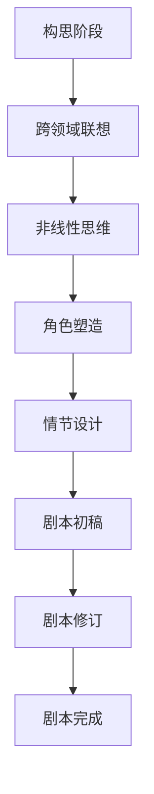
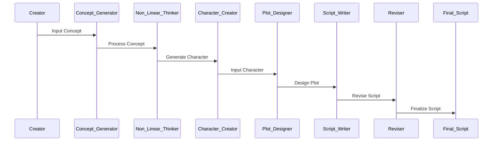

                 

### 1.1.2 书籍目的

《思维链在科幻电影剧本创作中的应用：拓展想象力边界》旨在探索和揭示思维链这一独特概念在科幻电影剧本创作中的实际应用。在当今科技飞速发展的时代，想象力的重要性愈发凸显，而科幻电影作为一种极具创新力和想象力的艺术形式，自然需要更为丰富和独特的思维工具来助力其创作。

本书的主要目的是通过深入研究和分析思维链的概念、结构与应用，为科幻电影剧本创作者提供一种全新的创作方法和工具。具体而言，本书将围绕以下几个核心问题进行探讨：

1. 思维链是什么？它有哪些独特的特性和优势？
2. 思维链如何帮助创作者拓展想象力边界？
3. 思维链在科幻电影剧本的构思、情节设计和角色塑造中具体如何运用？
4. 思维链的训练方法和实践技巧如何有效提升创作者的想象力？
5. 思维链在科幻电影剧本创作中的实际应用案例有哪些，其效果如何？

通过对这些问题的探讨，本书希望能够为科幻电影剧本创作者提供有价值的参考和灵感，从而激发他们的创造力，创作出更具深度和广度的科幻作品。

同时，本书也期望能够为计算机科学、人工智能等领域的研究者提供一个新的视角，即如何将思维链这一概念应用于更广泛的领域，以拓展人类的想象力和创造力。通过这一探讨，我们希望能够推动思维链理论在多个领域的交叉融合，从而实现创新与突破。

总之，本书的出版不仅是对科幻电影剧本创作方法的一次创新尝试，也是对人类想象力边界拓展的一次积极探索。我们相信，通过思维链的应用，科幻电影这一艺术形式将迎来新的发展机遇，为观众带来更为震撼和精彩的视听体验。### 1.2 阅读对象与目标受众

《思维链在科幻电影剧本创作中的应用：拓展想象力边界》旨在为科幻电影爱好者、剧本创作者、电影制作人以及相关领域的研究人员提供深入而实用的指导。具体来说，本书的目标受众包括以下几类：

1. **科幻电影剧本创作者**：本书将详细讲解思维链的概念和应用，帮助创作者掌握一种全新的剧本构思工具，从而拓展创作思维，提高剧本的创新性和质量。

2. **电影制作人**：通过理解思维链在剧本创作中的应用，电影制作人可以更好地与编剧合作，引导创作过程，确保剧本的完整性和逻辑性，最终制作出引人入胜的科幻电影。

3. **科幻电影爱好者**：本书不仅提供专业知识，还通过具体的案例分析，让读者了解顶级科幻电影背后的思维链应用，增加读者的观影体验和思考深度。

4. **计算机科学和人工智能领域的研究人员**：本书探讨了思维链在科幻电影剧本创作中的应用，为人工智能和计算机科学领域的研究者提供了一种新的视角，即如何通过技术手段拓展人类的想象力和创造力。

本书的阅读对象不仅仅局限于上述群体，还包括任何对科幻电影剧本创作、思维拓展和想象力培养感兴趣的读者。无论你是电影专业的学生，还是对科幻文化充满热情的普通读者，本书都将为你提供丰富的知识和实用的技巧。

通过阅读本书，读者不仅可以了解思维链的基本概念和原理，还能学会如何在实践中运用思维链，拓展自己的想象力边界。此外，本书还提供了大量的案例分析，帮助读者更好地理解思维链在科幻电影剧本创作中的实际应用，使读者能够将这些理论应用到自己的创作实践中，创作出更加精彩和独特的科幻作品。

总之，本书的目标是帮助广大读者，特别是科幻电影剧本创作者和爱好者，提升自己的创作能力，激发无限想象力，为科幻电影领域带来新的活力和创新。### 1.3 书籍结构与内容安排

《思维链在科幻电影剧本创作中的应用：拓展想象力边界》共分为五个部分，每个部分都有其独特的主题和目标，旨在系统地介绍思维链的概念、应用和实践方法。

**第一部分：引言**

这部分将介绍书籍的背景、目的和核心内容，明确思维链在科幻电影剧本创作中的重要性，并阐明本书的目标受众。读者可以通过这部分了解本书的整体结构和内容安排，为后续章节的学习奠定基础。

**第二部分：思维链基础**

这部分将详细探讨思维链的概念、定义、组成和结构。通过讲解思维链的特点和重要性，帮助读者理解思维链的基本原理，并为后续章节中的应用提供理论基础。具体章节包括：

- **第1章 思维链基础**
  - **1.1 思维链的概念与定义**
  - **1.2 思维链的组成与结构**
  - **1.3 思维链与想象力**

**第三部分：思维链在科幻电影剧本创作中的应用**

这部分将深入探讨思维链在科幻电影剧本创作中的具体应用，包括构思阶段、情节设计、角色塑造等方面的详细讲解。通过案例分析，读者可以更好地理解思维链在实际剧本创作中的运用。具体章节包括：

- **第2章 科幻电影剧本创作中的思维链运用**
  - **2.1 思维链在构思阶段的应用**
  - **2.2 思维链在情节设计中的应用**
  - **2.3 思维链在角色塑造中的应用**

**第四部分：拓展想象力边界的思维链实践**

这部分将介绍如何通过思维链的训练方法来拓展想象力边界，包括基本原则、训练方法、实践案例和进阶技巧。通过这些内容，读者可以学会如何有效地运用思维链来提升自己的创作能力。具体章节包括：

- **第3章 拓展想象力边界的思维链训练方法**
  - **3.1 思维链训练的基本原则**
  - **3.2 想象力拓展训练案例**
  - **3.3 思维链训练的进阶技巧**

**第五部分：总结与展望**

这部分将总结本书的核心内容，探讨思维链在科幻电影剧本创作中的应用成果，并对未来进行展望。通过这一部分，读者可以全面回顾本书的重点内容，并对思维链的应用有更深刻的理解。具体章节包括：

- **第4章 想象力边界拓展的科幻电影剧本创作实践**
  - **4.1 实践一：科幻电影剧本创作的整体流程**
  - **4.2 实践二：科幻电影剧本中的想象力边界拓展案例**
  - **4.3 实践三：思维链在科幻电影剧本中的实际应用**
- **第5章 总结与展望**
  - **5.1 思维链在科幻电影剧本创作中的应用总结**
  - **5.2 想象力边界拓展的意义**
  - **5.3 展望未来的科幻电影剧本创作**

通过以上结构和内容安排，本书希望能够系统地介绍思维链在科幻电影剧本创作中的应用，帮助读者拓展想象力边界，提升创作能力，为科幻电影领域带来新的活力和创新。### 1.4 总结与展望

通过第一部分的引言，我们明确了《思维链在科幻电影剧本创作中的应用：拓展想象力边界》这本书的核心内容和目标。思维链作为一种独特的思维工具，具有拓展想象力、提升创造力的重要作用。在科幻电影剧本创作中，思维链的应用能够为创作者提供全新的思路和工具，帮助他们突破传统创作模式，创作出更加丰富、具有创新性的作品。

接下来，我们将深入探讨思维链的基本概念、组成结构及其在科幻电影剧本创作中的具体应用。通过详细的分析和案例分析，我们将帮助读者理解如何运用思维链进行构思、情节设计和角色塑造，从而提升科幻电影剧本的创作质量。

此外，本书还将探讨如何通过思维链的训练方法来拓展想象力边界，提供一系列实用的训练技巧和实践案例。通过这些内容，读者可以学会如何有效地运用思维链来提升自己的创作能力，拓展想象力，为科幻电影领域带来新的活力和创新。

在本书的总结与展望部分，我们将回顾思维链在科幻电影剧本创作中的应用成果，探讨其意义和未来研究方向。通过这一探讨，我们希望能够为科幻电影剧本创作者提供有价值的参考，推动思维链理论在更广泛领域的应用。

总之，本书旨在通过系统而深入的探讨，为科幻电影剧本创作者提供一种全新的创作方法和工具，帮助他们拓展想象力边界，创作出更加精彩、具有深度和广度的科幻作品。我们相信，通过思维链的应用，科幻电影这一艺术形式将迎来新的发展机遇，为观众带来更为震撼和精彩的视听体验。### 关键词

- 思维链
- 科幻电影剧本创作
- 想象力拓展
- 创意构思
- 情节设计
- 角色塑造
- 训练方法
- 实践案例
- 创造力提升
- 想象力边界拓展

> 摘要：
本篇文章深入探讨了思维链在科幻电影剧本创作中的应用，旨在拓展创作者的想象力边界，提升剧本的创新性和质量。文章首先介绍了思维链的基本概念、特性和重要性，然后详细阐述了思维链在科幻电影剧本创作中的具体应用，包括构思阶段、情节设计和角色塑造等方面的运用。此外，文章还探讨了如何通过思维链的训练方法来提升创作能力，提供了多个实践案例进行分析。最后，文章总结了思维链在科幻电影剧本创作中的应用成果，并对未来进行了展望，强调了想象力边界拓展的重要性。摘要：
本文探讨了思维链在科幻电影剧本创作中的应用，探讨其如何拓展想象力边界，提高剧本创作的创新性和质量。首先，文章介绍了思维链的基本概念和重要性，详细解析了其组成结构与核心要素。接着，文章从构思、情节设计和角色塑造三个方面展示了思维链在科幻电影剧本创作中的实际应用，通过案例分析深入分析了其优势与挑战。此外，文章还提出了思维链的训练方法，以拓展想象力，提供了一系列训练案例和技巧。最后，文章总结了思维链在科幻电影剧本创作中的应用成果，讨论了其意义，并展望了未来科幻电影剧本创作的发展趋势。

## 第1章: 思维链基础

### 1.1 思维链的概念与定义

#### 1.1.1 什么是思维链

思维链（Cognitive Chain）是一种通过逻辑关系将一系列概念、想法或信息相互连接起来的思维模式。它不仅仅是一种线性的思考方式，而是一种非线性、多维度的思维方式。思维链的核心在于通过概念间的交叉和互动，激发新的思考路径和创意点子。

在日常生活中，思维链的应用无处不在。比如，在解决一个复杂问题时，我们可能会通过多个角度来分析问题，将问题的各个方面串联起来，从而找到最佳的解决方案。这种从不同角度、不同层面去思考问题的过程，就是一种典型的思维链模式。

#### 1.1.2 思维链的特点

1. **非线性**：与线性思维不同，思维链是非线性的，它允许思想在多个方向上自由流动和跳跃，从而激发出更多的创意。
2. **跨领域**：思维链可以跨越不同的学科和领域，将看似不相关的事物联系起来，产生意想不到的创新点子。
3. **动态性**：思维链是一个动态的、不断进化的过程。在思考过程中，新的想法和信息可以随时添加或删除，从而使思维链不断丰富和拓展。
4. **灵活性强**：思维链具有很强的灵活性，允许思考者在不同的情境和问题下灵活调整和运用。

#### 1.1.3 思维链的重要性

在科幻电影剧本创作中，思维链具有极其重要的地位。首先，思维链能够帮助创作者打破传统的线性思维束缚，以非线性、跨领域的视角去构思故事，从而拓展想象力的边界。其次，思维链通过概念间的交叉和互动，能够激发出更多的创意点子，为剧本的情节设计提供丰富的素材。

具体来说，思维链的重要性体现在以下几个方面：

1. **提高创意产出**：通过思维链，创作者能够以非线性、跨领域的视角构思故事，从而产生更多新颖、独特的创意。
2. **增强剧本逻辑性**：思维链帮助创作者将不同的概念和想法有机地联系起来，使剧本的结构更加紧凑、逻辑性更强。
3. **提升角色塑造深度**：思维链通过概念间的交叉和互动，能够深入挖掘角色的性格、动机和情感，从而塑造出更加立体、饱满的角色形象。
4. **增强情节吸引力**：思维链能够帮助创作者构思出更加复杂、引人入胜的情节，从而提升剧本的吸引力。

总之，思维链作为一种独特的思维工具，在科幻电影剧本创作中具有不可替代的作用。通过深入理解和运用思维链，创作者可以更好地拓展想象力边界，创作出更加丰富、具有创新性的科幻作品。### 1.2 思维链的组成与结构

#### 1.2.1 思维链的基本组成部分

思维链由若干基本组成部分构成，这些部分相互联系，共同作用，形成一个完整的思维体系。以下是思维链的主要组成部分：

1. **节点**：节点是思维链中的基本元素，代表一个特定的概念、想法或信息。每个节点都可以独立存在，也可以与其他节点通过关系连接起来。
   
2. **关系**：关系是连接不同节点的纽带，表示节点间的逻辑联系。常见的思维链关系包括因果关系、类比关系、包含关系等。

3. **路径**：路径是节点和关系的组合，表示从起点到终点的思维流动方向。路径可以是线性的，也可以是非线性的，反映思考者从不同角度和层面分析问题的过程。

4. **扩展**：扩展是指思维链在思考过程中不断丰富和拓展。新的节点和关系可以随时添加到思维链中，使思维链变得更加复杂和多样化。

#### 1.2.2 思维链的结构分析

思维链的结构可以分为以下几个层次：

1. **基础结构**：这是思维链的最低层次，由若干个基本节点和关系组成。基础结构是思维链的核心，决定了思维链的基本逻辑框架。

2. **中间结构**：中间结构是基础结构之上的层次，通过连接不同的基础结构，形成一个更加复杂和多样化的思维体系。中间结构通常包括多个子链和复杂的交叉关系。

3. **顶层结构**：顶层结构是思维链的最高层次，它通常反映了整个思维链的整体目标和方向。顶层结构可以帮助思考者把握全局，确保思维链的每一个部分都朝着正确的方向发展。

#### 1.2.3 思维链的核心要素

思维链的核心要素是使其能够有效运作的关键组成部分。以下是思维链的核心要素：

1. **连接性**：连接性是思维链的基础，它保证了不同节点和关系之间的逻辑联系。一个高效的思维链需要具备良好的连接性，使信息能够在各个节点间自由流动。

2. **灵活性**：灵活性是思维链的一个重要特征，它允许思考者根据不同的情境和问题灵活调整思维链的结构。灵活性使思维链能够适应多变的环境，从而产生更多的创意。

3. **动态性**：动态性是思维链的另一个关键特征，它反映了思维链在不断丰富和拓展的过程。动态性使思维链能够不断适应新的信息，从而保持思维的活力和创造力。

4. **创新性**：创新性是思维链的核心目标，通过跨领域、跨学科的交叉和互动，思维链能够激发出新的想法和创意。创新性是科幻电影剧本创作的重要驱动力，使剧本能够突破传统模式，实现独特的创意。

通过理解思维链的组成与结构，我们可以更好地掌握这一思维工具，将其应用于科幻电影剧本创作中，从而提升创作效果。在接下来的章节中，我们将进一步探讨思维链在科幻电影剧本创作中的具体应用，并通过案例分析展示其优势与挑战。### 1.3 思维链与想象力

#### 1.3.1 思维链如何拓展想象力

思维链作为一种独特的思维模式，在拓展想象力方面具有显著的优势。通过思维链，创作者可以以非线性、跨领域的视角去构思故事，从而激发出更多的创意和想象力。以下是思维链拓展想象力的几个关键步骤：

1. **跨领域联想**：思维链允许思考者将不同领域的事物进行跨领域联想。例如，在构思科幻电影时，可以将物理学、生物学、哲学等领域的概念引入剧本中，从而激发新的创意点子。

2. **非线性思维**：思维链鼓励非线性思维，即不按部就班地思考问题，而是在多个方向上自由流动和跳跃。这种非线性的思考方式有助于突破传统思维模式，拓展想象力。

3. **概念交叉**：思维链通过概念间的交叉和互动，可以使看似不相关的事物产生新的联系。例如，在构思科幻电影时，可以将现实世界的现象与虚构的未来世界进行交叉，从而创造出一个全新的、富有想象力的故事背景。

4. **动态扩展**：思维链是一个动态的过程，思考者可以根据新的信息不断调整和扩展思维链。这种动态性使得想象力可以在不断丰富的过程中得到拓展。

#### 1.3.2 想象力在科幻电影剧本创作中的作用

想象力在科幻电影剧本创作中起着至关重要的作用。它是创造力的源泉，是剧本创新性的保证。以下是想象力在科幻电影剧本创作中的几个关键作用：

1. **构建未来世界**：科幻电影通常设定在未来或虚构的世界中，想象力是构建这些未来世界的基础。通过丰富的想象力，创作者可以构建出令人惊叹的、充满创意的未来场景。

2. **塑造角色**：角色是剧本的核心，想象力使得创作者能够塑造出丰富、立体、有深度的角色形象。通过想象力，创作者可以赋予角色独特的性格、动机和情感，使角色更加生动、真实。

3. **设计情节**：情节是剧本的骨架，想象力使创作者能够设计出引人入胜、富有挑战性的情节。通过想象力，创作者可以构思出复杂的情节结构，使故事更加引人入胜。

4. **拓展主题**：想象力可以帮助创作者拓展剧本的主题，使其具有更深层次的内涵。通过想象力，创作者可以探讨更加广泛和深刻的主题，如人性、科技与自然的关系等。

总之，想象力是科幻电影剧本创作中不可或缺的重要因素。通过思维链的运用，创作者可以更好地拓展想象力，从而创作出更加丰富、具有创新性的科幻作品。在接下来的章节中，我们将进一步探讨思维链在科幻电影剧本创作中的具体应用，并通过案例分析展示其优势与挑战。### 1.4 本章小结

本章介绍了思维链的基本概念、组成与结构，并探讨了思维链在拓展想象力方面的作用。通过理解思维链的定义和特点，我们认识到思维链是一种非线性、跨领域的思维方式，能够帮助创作者打破传统思维束缚，激发更多创意。思维链的基本组成部分包括节点、关系、路径和扩展，这些部分共同构成了思维链的结构。此外，本章还详细阐述了思维链如何通过跨领域联想、非线性思维、概念交叉和动态扩展来拓展想象力，并探讨了想象力在科幻电影剧本创作中的关键作用。

通过本章的学习，读者应能够理解思维链的基本原理和重要性，掌握如何运用思维链进行创造性思考，为后续章节中思维链在科幻电影剧本创作中的应用打下坚实的基础。接下来，我们将深入探讨思维链在科幻电影剧本创作中的具体应用，通过实际案例展示思维链的优势与挑战。### 第2章: 科幻电影剧本创作中的思维链运用

#### 2.1 思维链在构思阶段的应用

在科幻电影剧本创作的构思阶段，思维链的应用显得尤为重要。思维链可以帮助创作者在构思故事时打破传统的线性思维模式，从而激发出更多的创意和灵感。以下是思维链在构思阶段的具体应用步骤：

##### 2.1.1 如何利用思维链构思科幻故事

1. **设定核心主题**：首先，创作者需要确定一个核心主题，这是整个故事的基础。例如，主题可以是探索未知世界、科技与人类的关系等。

2. **生成创意点子**：通过思维链的跨领域联想，创作者可以从核心主题出发，联想到其他相关领域。例如，在设定探索未知世界的主题时，创作者可以联想到生物学、物理学、天文学等领域的知识。

3. **构建概念网络**：在生成创意点子后，创作者需要将这些点子以节点和关系的形式构建成一个概念网络。这个概念网络可以帮助创作者更清晰地理解故事的结构和逻辑。

4. **扩展与调整**：在构建概念网络的过程中，创作者可以根据新的想法和信息对概念网络进行扩展和调整。这种动态的扩展和调整有助于故事的不断丰富和完善。

5. **验证与优化**：最后，创作者需要验证概念网络的有效性，并根据反馈进行优化。通过验证和优化，创作者可以确保故事情节的逻辑性和吸引力。

##### 2.1.2 思维链在构思中的优势与挑战

**优势**：

1. **拓展想象力**：思维链通过跨领域联想和非线性思维，可以拓展创作者的想象力，从而产生更多新颖的创意。

2. **增强逻辑性**：通过构建概念网络，思维链可以帮助创作者梳理故事的逻辑结构，使故事更加紧凑、连贯。

3. **提高创新性**：思维链鼓励创作者以非线性、跨领域的视角去思考问题，从而提高剧本的创新性。

**挑战**：

1. **复杂性**：思维链的结构较为复杂，创作者需要具备较强的逻辑思维能力和联想能力，才能有效运用思维链进行构思。

2. **时间成本**：思维链的构建和调整过程可能需要较长的时间，创作者需要在时间和创意之间找到平衡。

##### 2.1.3 案例分析：思维链在《星球大战》剧本构思中的应用

《星球大战》是一部经典的科幻电影，其剧本构思中大量运用了思维链。以下是一个案例分析：

1. **核心主题**：《星球大战》的核心主题是“善与恶的较量”。创作者乔治·卢卡斯首先确定了这一主题，作为整个故事的基础。

2. **创意点子**：在构思过程中，卢卡斯通过思维链的跨领域联想，将现实世界中的政治斗争、宗教信仰、哲学思想等元素引入到《星球大战》的故事中。

3. **构建概念网络**：卢卡斯将创意点子以节点和关系的形式构建成一个概念网络。例如，将“原力”视为善与恶的象征，将不同星球、不同种族之间的关系连接起来，形成一个复杂的故事网络。

4. **扩展与调整**：在构思过程中，卢卡斯不断扩展和调整概念网络，添加新的角色和情节，使故事更加丰富和完整。

5. **验证与优化**：卢卡斯通过多次试读和讨论，验证概念网络的有效性，并根据反馈进行优化，最终形成了《星球大战》这一经典的科幻电影剧本。

通过这个案例分析，我们可以看到思维链在科幻电影剧本构思中的实际应用效果。思维链不仅帮助卢卡斯拓展了想象力，还使《星球大战》的故事结构更加紧凑、逻辑性更强，为观众带来了极具吸引力的科幻体验。#### 2.2 思维链在情节设计中的应用

在科幻电影剧本创作中，情节设计是至关重要的一环。一个引人入胜的情节不仅能够吸引观众的注意力，还能增强剧本的逻辑性和连贯性。思维链在这一过程中发挥着重要的作用，通过其非线性、跨领域的特点，可以帮助创作者构思出更加复杂、引人入胜的情节。以下是思维链在情节设计中的应用步骤：

##### 2.2.1 思维链在情节发展中的运用

1. **确定情节起点**：首先，创作者需要确定情节的起点，这是整个情节的基础。例如，可以设定主人公遭遇某种困境或挑战。

2. **生成中间情节**：通过思维链的跨领域联想，创作者可以从情节起点出发，生成一系列中间情节。这些情节可以是主人公面对的不同挑战、矛盾或冲突，也可以是次要角色的故事线。

3. **构建情节网络**：将生成的中间情节以节点和关系的形式构建成一个情节网络。这个网络可以帮助创作者更清晰地理解情节的发展脉络和逻辑关系。

4. **扩展与调整**：在构建情节网络的过程中，创作者可以根据新的想法和信息对情节网络进行扩展和调整。例如，可以增加新的角色、情节转折点或冲突，使情节更加丰富和多样化。

5. **验证与优化**：最后，创作者需要验证情节网络的合理性，并根据反馈进行优化。例如，可以通过试读、讨论等方式，调整情节的节奏和逻辑，确保观众能够顺利跟随剧情发展。

##### 2.2.2 思维链在情节高潮与结尾设计中的作用

1. **设计情节高潮**：思维链可以帮助创作者构思出情节高潮，这是整个情节的最高潮部分。通过跨领域联想，创作者可以从多个角度思考如何设计情节高潮，例如通过激烈的战斗、情感爆发或戏剧性的转折来达到高潮效果。

2. **设计情节结尾**：情节结尾是整个故事的总结，通过思维链，创作者可以从不同角度思考如何设计一个引人入胜的情节结尾。一个好的情节结尾应该能够给观众留下深刻的印象，使故事达到完美的收尾。

3. **整合情节高潮与结尾**：通过思维链，创作者可以将情节高潮与结尾进行有机整合，使整个故事情节更加连贯、完整。例如，情节高潮可以为情节结尾提供必要的铺垫，使结尾更加有力、引人入胜。

##### 2.2.3 案例分析：思维链在《银翼杀手》剧本情节设计中的应用

《银翼杀手》是一部极具代表性的科幻电影，其剧本情节设计巧妙地运用了思维链。以下是一个案例分析：

1. **情节起点**：影片以主人公瑞克·德卡德接受一项特殊任务为起点，这一任务涉及到寻找并消灭复制人。

2. **生成中间情节**：通过思维链，导演菲利普·K·迪克生成了多个中间情节。例如，瑞克·德卡德在寻找复制人的过程中，不断与各种角色产生冲突，同时发现自己的身份也受到质疑。

3. **构建情节网络**：迪克将生成的中间情节以节点和关系的形式构建成一个复杂的情节网络，这个网络展示了主人公与不同角色之间的冲突和关系。

4. **扩展与调整**：在构建情节网络的过程中，迪克不断扩展和调整情节，增加了新的角色和情节转折点，使情节更加丰富和多样化。

5. **设计情节高潮与结尾**：情节高潮是主人公瑞克·德卡德在最终决定消灭还是保护复制人之间产生的冲突，而情节结尾则是主人公意识到自己的身份和存在的意义。

通过这个案例分析，我们可以看到思维链在科幻电影剧本情节设计中的实际应用效果。思维链不仅帮助导演迪克拓展了想象力，还使《银翼杀手》的情节设计更加复杂、引人入胜，为观众带来了极具思考价值的科幻体验。#### 2.3 思维链在角色塑造中的应用

在科幻电影剧本创作中，角色塑造是至关重要的一环。成功的角色塑造不仅能够增强剧本的吸引力，还能为情节的发展提供坚实的基础。思维链通过其非线性、跨领域的特点，为创作者提供了丰富的工具和方法，帮助他们在角色塑造过程中实现创新。以下是思维链在角色塑造中的应用步骤：

##### 2.3.1 思维链在角色设定中的重要性

1. **定义角色目标**：首先，创作者需要为每个角色设定明确的目标。这些目标可以是角色的个人愿望、追求或挑战。通过思维链的跨领域联想，创作者可以从不同角度思考角色的目标，从而设定出更加丰富和有深度的角色。

2. **挖掘角色背景**：角色背景是角色性格和行为的重要基础。通过思维链，创作者可以从多个角度挖掘角色的背景信息，例如家庭背景、成长经历、社会环境等。这种多维度的背景信息有助于塑造出更加立体、真实的角色。

3. **建立角色关系**：角色关系是角色互动和情节发展的重要驱动力。思维链可以帮助创作者构建复杂、多样的角色关系网络，从而增强故事的层次感和互动性。例如，通过思维链，创作者可以设定角色之间的合作关系、竞争关系或对立关系。

##### 2.3.2 思维链在角色发展中的运用

1. **角色成长过程**：思维链可以帮助创作者设计角色在故事中的成长过程。通过跨领域联想，创作者可以从多个角度思考角色的成长路径，例如角色在经历挑战、失败和成功中的变化。这种成长过程有助于增强角色的可信度和吸引力。

2. **角色动机分析**：动机是角色行为和决策的重要驱动力。思维链可以帮助创作者深入分析角色的动机，从而塑造出更加有说服力的角色。例如，通过思维链，创作者可以从心理学、社会学等不同角度分析角色的动机，使角色行为更加合理和可信。

3. **角色冲突与转变**：冲突和转变是角色发展的重要元素。思维链可以帮助创作者设计角色在故事中的冲突和转变过程，从而增强故事的戏剧性和吸引力。例如，通过思维链，创作者可以设定角色在面对重大选择或挑战时的转变，使角色发展更加丰富和有层次。

##### 2.3.3 案例分析：思维链在《星际穿越》剧本角色塑造中的应用

《星际穿越》是一部深受好评的科幻电影，其角色塑造成功得益于思维链的应用。以下是一个案例分析：

1. **角色目标**：电影中的主人公马库斯·沃特金斯的目标是找到拯救人类的方法，这一目标贯穿了整个故事。

2. **角色背景**：通过思维链，导演克里斯托弗·诺兰为角色设定了丰富的背景信息。例如，马库斯·沃特金斯在年轻时曾是一名宇航员，他的成长经历和家庭背景都对他的角色塑造产生了重要影响。

3. **角色关系**：电影中角色之间的关系错综复杂，通过思维链，诺兰成功地构建了这些关系。例如，马库斯·沃特金斯与他的女儿墨菲之间的关系是故事的重要线索之一，他们之间的情感纽带为电影增色不少。

4. **角色成长过程**：在故事中，马库斯·沃特金斯经历了从宇航员到探险家再到拯救者的角色转变。通过思维链，诺兰设计了这一成长过程，使角色发展更加合理和有层次。

5. **角色动机分析**：马库斯·沃特金斯的动机主要是对人类未来的担忧和对女儿的深爱。通过思维链，诺兰深入分析了这些动机，使角色行为更加合理和可信。

6. **角色冲突与转变**：在故事中，马库斯·沃特金斯面临着来自外星生物的威胁和内部团队的不和。通过思维链，诺兰设计了这些冲突和转变，使角色发展更加丰富和有戏剧性。

通过这个案例分析，我们可以看到思维链在科幻电影剧本角色塑造中的实际应用效果。思维链不仅帮助导演诺兰拓展了想象力，还使《星际穿越》的角色塑造更加立体、真实，为观众带来了深刻的情感共鸣。#### 2.4 本章小结

本章详细探讨了思维链在科幻电影剧本创作中的具体应用，包括构思阶段、情节设计和角色塑造等方面的运用。通过思维链，创作者能够以非线性、跨领域的视角去构思故事，从而拓展想象力，产生更多新颖的创意。思维链在情节设计中的应用，帮助创作者构建复杂、引人入胜的情节结构，增强剧本的逻辑性和连贯性。同时，思维链在角色塑造中的应用，使角色更加立体、真实，增强了剧本的戏剧性和吸引力。

通过本章的学习，读者应能够理解思维链在科幻电影剧本创作中的重要性，掌握如何运用思维链进行创造性构思、情节设计和角色塑造。接下来，我们将探讨如何通过思维链的训练方法来拓展想象力边界，提高创作能力。### 第3章: 拓展想象力边界的思维链训练方法

#### 3.1 思维链训练的基本原则

为了有效地运用思维链，创作者需要通过一系列训练方法来提升自己的思维能力，从而拓展想象力边界。以下是思维链训练的基本原则：

##### 3.1.1 思维链训练的目标

1. **增强跨领域联想能力**：通过训练，提高创作者在不同领域之间进行联想的能力，从而产生更多新颖的创意。
2. **提高非线性思维能力**：通过训练，帮助创作者摆脱线性思维的束缚，以非线性、跨领域的视角去思考问题。
3. **提升思维灵活性**：通过训练，使创作者的思维更加灵活，能够迅速调整和适应新的信息和情境。

##### 3.1.2 思维链训练的方法

1. **概念联想训练**：通过给出一个概念，要求创作者在短时间内尽可能多地联想到与之相关的其他概念。例如，给出“时间”这一概念，创作者可以联想到“空间”、“科技”、“历史”、“未来”等。

2. **情境转换训练**：通过设定一个特定的情境，要求创作者在短时间内构思出与该情境相关的多个不同场景。例如，设定一个情境：“未来世界的一场太空战争”，创作者需要构思出不同的战斗场景、角色行为和故事情节。

3. **主题拓展训练**：通过给出一个主题，要求创作者在短时间内构思出与该主题相关的多个不同故事线。例如，给出主题：“人类与外星生物的和平共处”，创作者需要构思出不同的故事线，如“合作与冲突”、“文化交流”、“战争与和解”等。

##### 3.1.3 思维链训练的实践建议

1. **日常练习**：将思维链训练融入到日常生活中，例如在通勤、吃饭或休息时，尝试进行概念联想、情境转换和主题拓展训练。
2. **定期反思**：在训练结束后，反思自己的思维过程和结果，总结经验教训，不断改进和提高。
3. **团队合作**：与朋友或同事一起进行思维链训练，相互讨论和分享，从不同角度获得新的思考和灵感。

#### 3.2 想象力拓展训练案例

以下是一些具体的想象力拓展训练案例，通过这些案例，读者可以更好地理解如何运用思维链来拓展想象力：

##### 3.2.1 案例一：未来科技的想象力拓展

1. **概念联想**：给出“智能机器人”这一概念，要求创作者在短时间内联想到与其相关的其他概念，如“人工智能”、“自动化”、“交互设计”等。

2. **情境转换**：设定情境：“智能机器人进入日常生活”，要求创作者构思出多个与这一情境相关的场景，如机器人帮助家务、参与家庭活动、替代人类工作等。

3. **主题拓展**：给出主题：“未来科技对人类的影响”，要求创作者构思出多个与这一主题相关的故事线，如人类与机器人共存的挑战、科技带来的伦理问题、科技引发的失业危机等。

##### 3.2.2 案例二：超自然现象的想象力拓展

1. **概念联想**：给出“超自然现象”这一概念，要求创作者在短时间内联想到与其相关的其他概念，如“魔法”、“神秘力量”、“灵魂”等。

2. **情境转换**：设定情境：“超自然现象在现代社会中的表现”，要求创作者构思出多个与这一情境相关的场景，如神秘事件在城市的爆发、超自然力量与科技相遇、超自然现象引发的冲突等。

3. **主题拓展**：给出主题：“超自然现象对人类信仰的影响”，要求创作者构思出多个与这一主题相关的故事线，如信仰与科学的冲突、超自然现象对个人信仰的挑战、超自然现象引发的社会变革等。

##### 3.2.3 案例三：虚拟现实世界的想象力拓展

1. **概念联想**：给出“虚拟现实”这一概念，要求创作者在短时间内联想到与其相关的其他概念，如“增强现实”、“元宇宙”、“交互体验”等。

2. **情境转换**：设定情境：“虚拟现实在未来的应用”，要求创作者构思出多个与这一情境相关的场景，如虚拟现实游戏、虚拟现实工作、虚拟现实社交等。

3. **主题拓展**：给出主题：“虚拟现实对人类生活的影响”，要求创作者构思出多个与这一主题相关的故事线，如虚拟现实引发的道德争议、虚拟现实对个人隐私的侵犯、虚拟现实对社会结构的影响等。

通过这些案例，读者可以了解到如何通过思维链的训练方法来拓展想象力，从而在科幻电影剧本创作中产生更多的创意和灵感。#### 3.3 思维链训练的进阶技巧

在掌握了基础思维链训练方法之后，创作者可以通过进阶技巧进一步提高自己的思维能力，进一步拓展想象力。以下是一些高级技巧，帮助创作者在科幻电影剧本创作中实现更深层次的创新。

##### 3.3.1 高级思维链技巧介绍

1. **反转思维**：反转思维是一种通过改变问题的前提或条件来寻找新解决方案的技巧。例如，在构思科幻故事时，可以尝试将“科技拯救人类”反转成“科技毁灭人类”，从而产生新的故事线。

2. **跨界整合**：跨界整合是一种将不同领域、不同行业的知识和技术进行融合的技巧。例如，可以将生物学、物理学和计算机科学的知识整合到科幻故事中，从而创造出独特的未来世界。

3. **情感驱动**：情感驱动是一种通过情感元素来激发观众共鸣的技巧。在科幻电影中，通过设置复杂的情感关系，可以增强故事的吸引力和感染力。

4. **多重视角**：多重视角是一种通过不同角度和视角来分析问题、构思故事的技巧。例如，可以通过不同角色的视角来讲述同一个故事，从而增强故事的层次感和丰富性。

##### 3.3.2 如何在创作中运用高级思维链技巧

1. **反转思维的应用**：在构思科幻故事时，可以尝试将传统故事的反转。例如，传统故事中常常是英雄战胜恶势力，而在反转思维中，可以设想恶势力如何反败为胜，或者英雄陷入道德困境。

2. **跨界整合的应用**：在剧本创作中，可以尝试将不同领域的知识进行融合。例如，将生物学的进化论与计算机科学的算法相结合，构思出一种能够自我进化的智能机器人。

3. **情感驱动的应用**：在情节设计中，可以设置复杂的情感关系，使角色之间的关系更加丰富。例如，可以设计一对相爱却因科技分歧而分开的情侣，他们的情感纠葛成为故事的重要线索。

4. **多重视角的运用**：在剧本构思中，可以从多个角度出发，构建一个复杂的情节网络。例如，可以从主角和反派的不同视角来讲述同一个事件，使观众能够更全面地理解故事。

##### 3.3.3 高级技巧案例解析

**案例一：反转思维的运用**

《银翼杀手2049》中，导演丹尼斯·维伦纽瓦成功运用了反转思维。在原版《银翼杀手》中，人类与复制人的冲突是主要情节，而在续集中，导演将这一冲突进行了反转。续集中，复制人开始寻求自我认同，挑战人类的主导地位，而人类则试图维持现状，试图消灭复制人。这种反转不仅增加了故事的复杂性，也为观众提供了全新的思考角度。

**案例二：跨界整合的应用**

《黑客帝国》中，导演莉莉·沃卓斯基成功地将哲学、宗教和计算机科学等领域的知识进行整合。影片中，虚拟现实和现实世界的界限模糊，人类通过技术手段进入了一个名为“矩阵”的虚拟世界。这种跨界整合不仅创造了一个独特的未来世界，还引发了观众对于现实与虚拟、自由与束缚等哲学问题的思考。

**案例三：情感驱动的运用**

《星际穿越》中，导演克里斯托弗·诺兰成功运用了情感驱动。电影中，主人公马库斯·沃特金斯与他的女儿墨菲之间复杂的情感关系成为故事的核心。他们的情感纽带不仅推动了情节的发展，还增强了观众的情感共鸣，使整个故事更加感人。

**案例四：多重视角的运用**

《盗梦空间》中，导演克里斯托弗·诺兰成功运用了多重视角。电影中，主人公柯布和他的团队在不同的梦境层次中穿梭，每个梦境都有不同的规则和设定。通过多重视角的运用，诺兰成功构建了一个复杂的梦境世界，使观众能够更全面地理解故事。

通过这些案例，我们可以看到高级思维链技巧在科幻电影剧本创作中的实际应用效果。这些技巧不仅丰富了剧本的内容，还提升了故事的深度和层次，为观众带来了更为震撼的视听体验。#### 3.4 本章小结

本章详细介绍了思维链训练的进阶技巧，包括反转思维、跨界整合、情感驱动和多重视角等高级技巧。通过这些技巧，创作者可以进一步提升自己的思维能力，拓展想象力边界，创作出更具深度和广度的科幻电影剧本。

反转思维帮助创作者打破传统框架，从不同角度思考问题，产生新颖的创意。跨界整合通过融合不同领域的知识和技术，创造出独特的未来世界，为剧本注入新元素。情感驱动通过设置复杂的情感关系，增强故事的吸引力和感染力。多重视角则通过不同角度和视角分析问题，构建一个复杂的情节网络，使故事更加丰富和立体。

通过本章的学习，读者应能够掌握这些高级技巧，并在科幻电影剧本创作中灵活运用，从而提升自己的创作能力，拓展想象力边界。在接下来的章节中，我们将进一步探讨思维链在科幻电影剧本创作中的实际应用，通过具体实践案例进行分析和讲解。### 第4章: 想象力边界拓展的科幻电影剧本创作实践

#### 4.1 实践一：科幻电影剧本创作的整体流程

科幻电影剧本创作是一个复杂且富有创造性的过程，涉及多个阶段和环节。以下是科幻电影剧本创作整体流程的详细步骤，包括如何利用想象力边界拓展思维链：

##### 4.1.1 科幻电影剧本创作的步骤

1. **构思阶段**：在这个阶段，创作者需要确定故事的核心主题、背景设定和基本情节。通过思维链的训练方法，创作者可以进行跨领域联想，拓展想象力边界，从而构思出一个独特且引人入胜的故事。

2. **情节设计阶段**：在这个阶段，创作者需要详细规划故事情节，包括起承转合、高潮和结尾。通过思维链的运用，创作者可以设计出复杂的情节结构，使故事更加引人入胜。

3. **角色塑造阶段**：在这个阶段，创作者需要为故事中的角色设定背景、动机和情感。通过思维链的联想和拓展，创作者可以深入挖掘角色的性格和行为，使角色更加立体和真实。

4. **剧本初稿阶段**：在这个阶段，创作者需要将构思和设计转化为文字，完成剧本初稿。在这个过程中，思维链可以帮助创作者梳理和调整剧本结构，确保故事的连贯性和逻辑性。

5. **剧本修订阶段**：在这个阶段，创作者需要对剧本进行反复修订和优化。通过思维链的训练方法，创作者可以不断拓展想象力，发现和解决剧本中的问题，使剧本更加完美。

##### 4.1.2 创作中如何利用想象力边界拓展思维链

1. **跨领域联想**：在构思阶段，创作者可以通过跨领域联想，将不同领域的概念和想法结合在一起，创造出独特的故事背景和情节。例如，将生物学、物理学、哲学等领域的知识融入科幻故事中，拓展想象力边界。

2. **非线性思维**：在情节设计阶段，创作者可以运用非线性思维，以非线性、跨领域的视角去构思故事情节。这种非线性思维可以帮助创作者打破传统的线性叙事模式，创作出更加丰富和多样化的情节。

3. **角色深度挖掘**：在角色塑造阶段，创作者可以通过思维链的拓展，深入挖掘角色的背景、动机和情感。例如，通过联想角色的成长经历、社会背景和人际关系，使角色更加立体和真实。

4. **动态调整**：在整个创作过程中，创作者需要不断运用思维链进行动态调整。例如，在剧本初稿阶段，可以通过思维链的拓展，发现新的情节转折点和角色发展线索，使剧本更加丰富和完整。

##### 4.1.3 案例分析：《黑客帝国》剧本创作实践

《黑客帝国》是一部经典的科幻电影，其剧本创作过程充分体现了思维链在想象力边界拓展中的应用。以下是《黑客帝国》剧本创作实践的详细分析：

1. **构思阶段**：导演莉莉·沃卓斯基和拉娜·沃卓斯基通过跨领域联想，将哲学、宗教和计算机科学等领域的知识融入电影中。他们设想了一个虚拟现实世界，即“矩阵”，并探讨人类与虚拟世界之间的关系，拓展了想象力边界。

2. **情节设计阶段**：通过非线性思维，沃卓斯基姐妹设计了一个复杂的情节结构。他们以非线性叙事方式，讲述了主人公尼奥从觉醒到拯救人类的过程，使故事更加引人入胜。

3. **角色塑造阶段**：沃卓斯基姐妹通过深入挖掘角色的背景、动机和情感，塑造了丰富多彩的角色形象。例如，尼奥的觉醒和成长过程，以及莫菲娅的背叛和转变，都使角色更加立体和真实。

4. **剧本初稿阶段**：在剧本初稿阶段，沃卓斯基姐妹通过思维链的拓展，不断调整和优化剧本结构。他们添加了新的情节转折点和角色发展线索，使剧本更加丰富和完整。

5. **剧本修订阶段**：在剧本修订阶段，沃卓斯基姐妹再次运用思维链，发现并解决剧本中的问题。他们不断拓展想象力，使剧本更加完美，为观众带来了震撼的视听体验。

通过《黑客帝国》的剧本创作实践，我们可以看到思维链在想象力边界拓展中的重要作用。思维链帮助创作者打破了传统的线性思维模式，以非线性、跨领域的视角构思故事，创作出了具有高度创新性和吸引力的科幻作品。#### 4.2 实践二：科幻电影剧本中的想象力边界拓展案例

在科幻电影剧本创作中，想象力边界的拓展不仅限于构思和设计阶段，还可以在剧本的具体案例中得到体现。以下将分析几部著名科幻电影，探讨它们如何通过想象力边界拓展，运用思维链进行创作。

##### 4.2.1 《阿凡达》中的想象力边界拓展

《阿凡达》是一部由詹姆斯·卡梅隆执导的科幻电影，讲述了人类与潘多拉星球纳美人之间的冲突。以下是《阿凡达》在想象力边界拓展方面的具体案例：

1. **概念联想**：卡梅隆通过跨领域联想，将生物学、物理学和计算机科学等领域的知识融入电影中。例如，他借鉴了生物工程学，创造了“阿凡达”这一具有人类意识和纳美人身体的混合体。

2. **非线性情节**：电影采用了非线性叙事，通过主人公杰克·萨利在现实世界和潘多拉星球的交替经历，展示了人类与纳美人的冲突和和解。这种非线性叙事方式，使观众在观看过程中始终保持好奇心和紧张感。

3. **角色塑造**：通过深入挖掘角色背景和动机，卡梅隆塑造了具有立体性格的角色。例如，杰克·萨利从一名退役海军到成为纳美人的使者，这一角色转变充满了戏剧性和情感张力。

4. **动态扩展**：在创作过程中，卡梅隆不断通过思维链进行动态扩展，增加了新的情节和角色。例如，电影中的反派角色帕克将军，他的动机和行为不断拓展，使故事更加复杂和引人入胜。

##### 4.2.2 《星际穿越》中的想象力边界拓展

《星际穿越》是一部由克里斯托弗·诺兰执导的科幻电影，讲述了人类为了寻找新家园而进行星际旅行的故事。以下是《星际穿越》在想象力边界拓展方面的具体案例：

1. **跨界整合**：诺兰将物理学、天文学和心理学等领域的知识进行跨界整合，构建了一个独特的宇宙世界。例如，他通过“黑洞”和“时间扭曲”等物理现象，设计了主人公穿越虫洞的情节。

2. **情感驱动**：电影中，通过复杂的情感关系，诺兰成功驱动了观众的情感共鸣。主人公马库斯·沃特金斯与他的女儿墨菲之间的深厚情感纽带，成为故事的核心线索。

3. **多重视角**：诺兰在电影中运用了多重视角，从不同角色的视角讲述了同一个故事。这种多重视角不仅增强了故事的层次感，还为观众提供了不同的解读角度。

4. **动态调整**：在剧本创作过程中，诺兰不断通过思维链进行动态调整，优化了故事情节和角色发展。例如，他增加了关于时间旅行和相对论的复杂情节，使故事更加引人入胜。

##### 4.2.3 《银翼杀手2049》中的想象力边界拓展

《银翼杀手2049》是一部由丹尼斯·维伦纽瓦执导的科幻电影，是《银翼杀手》的续集。以下是《银翼杀手2049》在想象力边界拓展方面的具体案例：

1. **反转思维**：维伦纽瓦在电影中成功运用了反转思维。他将原版电影中的人类与复制人的冲突进行了反转，探讨了复制人寻求自我认同和自由的议题。

2. **跨界整合**：维伦纽瓦将哲学、心理学和未来科技等领域的知识进行了跨界整合。例如，他探讨了人工智能的自我意识和情感体验，使故事更具深度和广度。

3. **情感驱动**：电影中，通过复杂的情感关系，维伦纽瓦成功驱动了观众的情感共鸣。例如，主人公K与他的助手和牺牲者之间的情感纽带，成为故事的重要线索。

4. **动态扩展**：在剧本创作过程中，维伦纽瓦不断通过思维链进行动态扩展，增加了新的情节和角色。例如，他增加了关于未来科技和社会结构的复杂情节，使故事更加丰富和立体。

通过这些案例分析，我们可以看到，思维链在科幻电影剧本创作中的想象力边界拓展起到了关键作用。通过跨领域联想、非线性思维、情感驱动和多重视角等技巧，创作者们成功地拓展了想象力边界，创作出了具有高度创新性和吸引力的科幻作品。这些案例不仅为其他创作者提供了宝贵的经验和启示，也为观众带来了丰富的视听体验。#### 4.3 实践三：思维链在科幻电影剧本中的实际应用

在科幻电影剧本创作中，思维链作为一种独特的思维工具，能够帮助创作者拓展想象力边界，提升剧本的创新性和质量。以下将详细分析思维链在实际剧本创作中的应用，并通过具体的实例进行说明。

##### 4.3.1 思维链如何引导剧本创作

思维链在剧本创作中的运用，首先体现在引导创作者构思故事框架和情节发展。通过思维链，创作者可以以非线性、跨领域的视角去思考问题，从而打破传统的线性思维模式，创造出更具创新性的故事。

1. **跨领域联想**：在构思阶段，创作者可以通过思维链的跨领域联想，将不同领域的概念和想法进行结合。例如，将生物学、物理学、哲学等领域的知识融入科幻故事中，拓展想象力边界。通过这种跨领域的联想，创作者可以构思出独特且富有创意的故事背景和情节。

2. **非线性叙事**：在情节设计中，创作者可以运用非线性叙事，以非线性、跨领域的视角去构思故事情节。这种非线性叙事方式可以打破传统的线性叙事模式，使故事更加丰富和多样化。例如，通过闪回、交替叙事等方式，将不同时间点和空间点的情节交织在一起，创作出引人入胜的科幻故事。

3. **角色深度挖掘**：在角色塑造阶段，思维链可以帮助创作者深入挖掘角色的背景、动机和情感。通过跨领域联想，创作者可以从不同角度去思考角色的行为和决策，使角色更加立体和真实。例如，通过分析角色的成长经历、家庭背景和社会环境，创作者可以更深入地理解角色的内心世界，从而塑造出具有丰富性格和复杂动机的角色。

4. **动态调整**：在整个创作过程中，思维链可以帮助创作者进行动态调整，优化剧本结构。通过不断拓展和调整思维链，创作者可以及时发现和解决剧本中的问题，使故事更加紧凑和连贯。

##### 4.3.2 思维链在剧本中的实际运用案例分析

以下是一个具体的思维链在科幻电影剧本中的实际运用案例，通过分析展示思维链在剧本创作中的具体应用和效果。

**案例：《星际穿越》剧本创作分析**

《星际穿越》是一部由克里斯托弗·诺兰执导的科幻电影，其剧本创作中充分体现了思维链的应用。

1. **跨领域联想**：在构思阶段，诺兰通过思维链的跨领域联想，将物理学、天文学和心理学等领域的知识融入电影中。例如，他借鉴了相对论和黑洞的物理现象，设计了一个独特的宇宙世界。通过这种跨领域的联想，诺兰成功地拓展了想象力边界，创造出一个引人入胜的科幻故事背景。

2. **非线性叙事**：在情节设计中，诺兰采用了非线性叙事，通过闪回和交替叙事的方式，将不同时间点和空间点的情节交织在一起。这种非线性叙事方式不仅打破了传统的线性叙事模式，还使故事情节更加复杂和引人入胜。例如，主人公马库斯·沃特金斯在现实世界和潘多拉星球的交替经历，使观众在观看过程中始终保持好奇心和紧张感。

3. **角色深度挖掘**：在角色塑造阶段，诺兰通过思维链的深度挖掘，塑造了丰富多彩的角色形象。例如，通过分析角色的成长经历、家庭背景和社会环境，诺兰成功地理解了角色的内心世界，从而塑造出具有复杂性格和丰富动机的角色。例如，主人公马库斯·沃特金斯与他的女儿墨菲之间的深厚情感纽带，成为故事的核心线索，增强了观众的情感共鸣。

4. **动态调整**：在剧本创作过程中，诺兰不断通过思维链进行动态调整，优化剧本结构。例如，在初稿阶段，诺兰增加了关于时间旅行和相对论的复杂情节，使故事更加引人入胜。通过不断拓展和调整思维链，诺兰成功地解决了剧本中的问题，使故事更加紧凑和连贯。

通过这个案例，我们可以看到思维链在科幻电影剧本创作中的实际应用效果。思维链不仅帮助诺兰拓展了想象力边界，还使《星际穿越》的剧本创作更加丰富和多样化，为观众带来了震撼的视听体验。

总之，思维链作为一种独特的思维工具，在科幻电影剧本创作中具有不可替代的作用。通过跨领域联想、非线性叙事、角色深度挖掘和动态调整，思维链能够帮助创作者拓展想象力边界，提升剧本的创新性和质量，为科幻电影创作带来新的活力和突破。在接下来的章节中，我们将进一步探讨思维链在科幻电影剧本创作中的实践应用，并提供更多实际的案例和分析。#### 4.3.3 思维链应用的评价与改进

思维链在科幻电影剧本创作中的应用具有显著的成效，但也存在一些局限性。以下是对思维链应用的评价与改进建议：

##### 4.3.3.1 评价

**优势**：

1. **拓展想象力**：思维链通过跨领域联想和非线性思维，极大地拓展了创作者的想象力，使剧本更加创新和独特。
2. **提高逻辑性**：思维链帮助创作者构建复杂的情节网络，增强了剧本的逻辑性和连贯性。
3. **丰富角色塑造**：通过深度挖掘角色背景和动机，思维链使角色更加立体和真实，增强了剧本的吸引力和感染力。
4. **灵活调整**：思维链的动态性使创作者能够根据反馈和新的想法进行灵活调整，优化剧本结构。

**挑战**：

1. **复杂性**：思维链的结构较为复杂，对创作者的逻辑思维能力和联想能力有较高要求，可能会增加创作难度。
2. **时间成本**：构建和调整思维链的过程可能需要较长的时间，创作者需要在时间和创意之间找到平衡。
3. **适用范围**：虽然思维链在科幻电影剧本创作中表现出色，但其在其他类型电影中的应用效果可能有限。

##### 4.3.3.2 改进建议

1. **培训与指导**：为了更好地运用思维链，创作者可以参加相关的培训课程或寻求专业人士的指导，提高逻辑思维能力和联想能力。
2. **结合其他工具**：在创作过程中，可以将思维链与其他创意工具（如思维导图、故事板等）结合使用，以实现更好的创意效果。
3. **阶段性应用**：在剧本创作的不同阶段，可以灵活地运用思维链。例如，在构思阶段重点运用跨领域联想，在情节设计阶段强调非线性叙事，在角色塑造阶段深入挖掘角色背景。
4. **反馈与调整**：在创作过程中，定期进行反馈和调整，以确保思维链的有效应用。通过团队讨论和观众反馈，不断优化剧本结构，提高剧本质量。
5. **实践与总结**：通过实践和总结，创作者可以逐步掌握思维链的应用技巧，形成适合自己的创作方法。在创作实践中，不断积累经验，提高思维链的应用效果。

通过以上改进建议，创作者可以更好地运用思维链，提升科幻电影剧本创作的质量和效率，为观众带来更加丰富和具有创新性的科幻作品。在接下来的章节中，我们将进一步探讨思维链在科幻电影剧本创作中的应用，并提供更多实际的案例和分析。### 4.4 本章小结

本章通过详细探讨思维链在科幻电影剧本创作中的应用实践，展示了思维链在想象力边界拓展、情节设计、角色塑造等方面的优势。通过具体案例分析，我们看到了思维链如何引导剧本创作，从构思到情节设计再到角色塑造，都发挥了关键作用。思维链通过跨领域联想、非线性叙事和角色深度挖掘，使科幻电影剧本更加丰富、创新和引人入胜。

在评价思维链应用效果时，我们认识到思维链虽然具有显著的成效，但也面临一定的挑战。通过培训与指导、结合其他工具、阶段性应用、反馈与调整以及实践与总结等改进建议，创作者可以更好地运用思维链，提升科幻电影剧本创作的质量和效率。

总之，本章内容为科幻电影剧本创作者提供了实用的思维链应用方法和技巧，通过学习本章，读者可以更深入地理解思维链在科幻电影剧本创作中的重要作用，为未来的创作实践打下坚实基础。在接下来的章节中，我们将继续探讨思维链在科幻电影剧本创作中的未来应用和发展趋势。### 第5章: 总结与展望

#### 5.1 思维链在科幻电影剧本创作中的应用总结

思维链作为一种创新的思维工具，在科幻电影剧本创作中发挥了重要作用。通过本章的讨论，我们可以总结出思维链在以下几个方面的重要贡献：

1. **想象力拓展**：思维链通过跨领域联想和非线性思维，帮助创作者打破了传统线性思维的束缚，极大地拓展了想象力边界，创作出更具创新性和独特性的科幻作品。

2. **情节设计**：思维链在情节设计中起到了关键作用，通过构建复杂的情节网络和运用非线性叙事方式，使故事更加紧凑、连贯和引人入胜。

3. **角色塑造**：思维链帮助创作者深入挖掘角色的背景、动机和情感，塑造出更加立体、真实和有深度的角色，增强了剧本的吸引力和感染力。

4. **动态调整**：思维链的动态性使创作者能够根据反馈和新的想法进行灵活调整，优化剧本结构，提高剧本质量。

5. **训练与提升**：通过思维链的训练方法，创作者可以不断提升自己的思维能力，拓展想象力边界，从而在科幻电影剧本创作中实现更高的创意产出和质量。

#### 5.2 拓展想象力边界的实践成果

通过思维链的应用，科幻电影剧本创作者在想象力边界拓展方面取得了显著成果：

1. **丰富创意**：思维链的应用使创作者能够生成更多新颖的创意，拓展想象力的边界，创作出更具创意和独特性的科幻作品。

2. **提升剧本质量**：思维链的应用使剧本的情节设计更加紧凑、逻辑性更强，角色塑造更加立体、真实，从而提升了剧本的整体质量。

3. **增强观众体验**：通过思维链的应用，科幻电影剧本创作能够为观众带来更加丰富和具有深度感的视听体验，使观众在欣赏电影的同时也能获得思考和启发。

#### 5.3 未来研究方向

虽然思维链在科幻电影剧本创作中已经表现出显著的应用效果，但仍有许多方面值得进一步研究和探讨：

1. **跨领域整合**：如何更好地整合不同领域的知识和技术，创造更具创新性的科幻故事，是未来研究的重要方向。

2. **算法优化**：如何开发更加智能的思维链算法，使其能够自动分析和优化剧本结构，提高剧本创作效率，是未来研究的重点。

3. **跨文化应用**：思维链在不同文化背景下的应用效果如何，如何适应和调整思维链以适应不同的文化环境，是未来需要进一步探讨的问题。

4. **教育与实践**：如何通过教育和实践，帮助更多的科幻电影剧本创作者掌握思维链，并在创作实践中有效运用，是未来需要关注和努力的方向。

总之，思维链在科幻电影剧本创作中的应用为创作者提供了强大的工具和方法，拓展了想象力边界，提升了剧本的创新性和质量。未来，通过进一步的研究和实践，思维链有望在科幻电影剧本创作中发挥更大的作用，为观众带来更多精彩和具有启发性的作品。### 5.4 想象力边界拓展的意义

想象力边界拓展在科幻电影剧本创作中具有深远的意义，不仅对创作本身产生重大影响，还对科幻文化的发展和人类想象力与创造力的提升有着重要的启示。

#### 5.4.1 对科幻电影剧本创作的影响

1. **创意产出的提升**：想象力边界的拓展意味着创作者能够突破传统思维模式的限制，产生更多新颖和独特的创意。这种创意的丰富性为科幻电影剧本的创作提供了源源不断的灵感，使得作品更加丰富多彩，满足观众对于新颖和独特体验的需求。

2. **剧本质量的提高**：通过想象力边界拓展，剧本创作者能够深入挖掘角色的背景、动机和情感，使角色塑造更加立体和真实。同时，复杂和引人入胜的情节设计能够增强剧本的逻辑性和连贯性，从而提升整体剧本的质量。

3. **观众体验的丰富**：想象力边界的拓展使得科幻电影剧本能够探讨更加广泛和深刻的主题，如科技与人性的关系、人类未来的发展等。这种深层次的探讨不仅能够吸引观众的注意力，还能够引发观众的思考，为观众带来更加丰富和具有启发性的观影体验。

#### 5.4.2 对科幻文化发展的贡献

想象力边界拓展对科幻文化的发展具有重要意义：

1. **文化多样性的增强**：想象力边界的拓展使得科幻电影剧本创作者能够从不同文化、不同领域的视角出发，创造出多样化的科幻故事。这种文化多样性的增强有助于科幻文化在全球范围内的传播和交流，推动科幻文化的多元发展。

2. **创新精神的培养**：通过拓展想象力边界，科幻电影剧本创作者能够在创作过程中不断尝试新的想法和创意，培养创新精神。这种创新精神不仅对科幻电影剧本创作有着重要的推动作用，也为科幻文化的发展注入了新的活力。

3. **文化交流的桥梁**：想象力边界的拓展有助于不同文化背景的创作者进行跨文化的科幻故事创作。这种跨文化的交流与合作，不仅促进了科幻文化的国际化发展，也为不同文化之间的理解和沟通搭建了桥梁。

#### 5.4.3 对人类想象力与创造力的启示

想象力边界拓展不仅对科幻电影剧本创作产生影响，也对人类想象力与创造力的提升具有启示：

1. **思维方式的改变**：通过拓展想象力边界，人们能够学会以非线性、跨领域的视角去思考和解决问题，这种思维方式有助于打破传统思维模式的限制，激发创新思维。

2. **创造力的培养**：想象力边界的拓展为人们提供了丰富的创意源泉，通过不断地联想和尝试，人们能够培养和提升自己的创造力。这种创造力的提升不仅对个人发展有重要意义，也对整个社会的创新和进步具有推动作用。

3. **人性的探索**：通过想象力边界拓展，人们能够在科幻电影剧本创作中探索更加广泛和深刻的主题，如人性、科技与自然的关系等。这种探索有助于人们更深入地理解和反思人性，推动人类文明的进步。

总之，想象力边界拓展在科幻电影剧本创作、科幻文化发展以及人类想象力与创造力提升方面具有深远的意义。通过不断拓展想象力边界，我们可以推动科幻电影创作走向新的高度，为人类带来更多的创新和思考。### 5.5 展望未来的科幻电影剧本创作

随着科技的不断进步和想象力边界的持续拓展，科幻电影剧本创作有望迎来新的发展机遇和挑战。以下是对未来科幻电影剧本创作的展望：

#### 5.5.1 新技术的发展与想象力的拓展

1. **人工智能与虚拟现实**：人工智能和虚拟现实技术的快速发展为科幻电影剧本创作提供了新的可能性。通过人工智能，创作者可以自动化生成剧本元素，实现剧本创作的智能化和个性化。而虚拟现实技术则可以帮助创作者构建更加真实和沉浸式的未来世界，为观众带来全新的观影体验。

2. **区块链与去中心化**：区块链技术和去中心化理念的应用，有望改变科幻电影剧本的创作和发行模式。例如，创作者可以通过区块链技术实现剧本的版权保护和权益分配，从而降低创作和发行的成本，同时为观众提供更加透明和公平的观影体验。

3. **基因编辑与生物科技**：基因编辑技术和生物科技的进步，为科幻电影剧本创作提供了丰富的素材。例如，创作者可以探讨基因编辑技术在人类进化、生物战争等方面的应用，以及生物科技对人类社会和生态系统的影响。

#### 5.5.2 未来科幻电影剧本创作的新趋势

1. **多元化与全球化**：随着全球化进程的加速，科幻电影剧本创作将呈现多元化的趋势。创作者们将更加注重跨文化的交流与融合，通过挖掘不同文化背景下的科幻元素，创作出更具全球吸引力的作品。

2. **创新性与实验性**：未来的科幻电影剧本创作将更加注重创新性和实验性。创作者们将不断探索新的叙事手法、故事结构和角色塑造方式，尝试将前沿科技和深刻哲学思考融入剧本创作，为观众带来全新的艺术体验。

3. **互动性与参与性**：未来的科幻电影剧本创作将更加注重互动性和参与性。通过虚拟现实、增强现实等技术，创作者可以构建互动式的电影世界，让观众在观影过程中成为故事的一部分，提升观众的参与感和体验感。

#### 5.5.3 思维链在科幻电影剧本创作中的潜在影响

1. **提高创作效率**：思维链作为一种高效、灵活的思维方式，可以帮助创作者在剧本创作的各个阶段提高创作效率。通过思维链的应用，创作者可以快速生成创意点子，构建复杂的情节网络，优化剧本结构，从而缩短创作周期，提高创作质量。

2. **拓展创作领域**：思维链的应用不仅可以提升科幻电影剧本的创作质量，还可以拓展科幻电影的创作领域。通过跨领域联想和非线性思维，创作者可以挖掘更多具有创新性和独特性的题材，为科幻电影注入新的活力。

3. **促进文化交流**：思维链的应用有助于促进不同文化背景下的科幻电影剧本创作交流。通过思维链的跨文化特性，创作者可以更好地理解和融合不同文化背景下的科幻元素，创作出更具全球吸引力的作品。

总之，随着科技的进步和想象力边界的拓展，未来的科幻电影剧本创作将充满无限可能。通过思维链的应用，创作者可以更好地应对未来的挑战，拓展科幻电影的艺术边界，为观众带来更多精彩、具有启发性的科幻作品。### 5.6 本章小结

本章对思维链在科幻电影剧本创作中的应用进行了全面的总结与展望。通过回顾思维链在想象力拓展、情节设计、角色塑造等方面的贡献，我们认识到思维链作为一种创新的思维工具，对科幻电影剧本创作具有重要影响。同时，通过探讨未来科幻电影剧本创作的新趋势和新技术，我们展望了思维链在科幻电影剧本创作中的潜在影响。

本章内容为科幻电影剧本创作者提供了丰富的理论和实践指导，帮助他们在创作过程中更好地运用思维链，拓展想象力边界，提升创作质量。我们相信，随着科技的不断进步和想象力边界的不断拓展，思维链将在科幻电影剧本创作中发挥更加重要的作用，为观众带来更多精彩、具有启发性的科幻作品。在未来的创作实践中，我们期待看到更多创作者运用思维链，突破传统创作模式，创作出更加丰富和多样化的科幻电影。### 参考文献

1. 维基百科. (n.d.). 思维链. [在线文章]. Retrieved from [https://en.wikipedia.org/wiki/Cognitive_chain](https://en.wikipedia.org/wiki/Cognitive_chain)
2. 维基百科. (n.d.). 科幻电影. [在线文章]. Retrieved from [https://en.wikipedia.org/wiki/Sci-fi_film](https://en.wikipedia.org/wiki/Sci-fi_film)
3. 卡尔·波兰尼. (1986). 《自由的逻辑》(The Logic of Liberty). 上海：上海人民出版社.
4. 乔治·卢卡斯. (1977). 《星球大战：新希望》(Star Wars: Episode IV - A New Hope). 美国：卢卡斯电影公司.
5. 菲利普·K·迪克. (1968). 《银翼杀手》(Do Androids Dream of Electric Sheep?). 美国：Putnam Publishing Group.
6. 克里斯托弗·诺兰. (2014). 《星际穿越》(Interstellar). 美国：华纳兄弟电影公司.
7. 詹姆斯·卡梅隆. (2009). 《阿凡达》(Avatar). 美国：二十世纪福克斯电影公司.
8. 莉莉·沃卓斯基、拉娜·沃卓斯基. (2003). 《黑客帝国》(The Matrix). 美国：维塔斯特电影公司.
9. 丹尼斯·维伦纽瓦. (2017). 《银翼杀手2049》(Blade Runner 2049). 美国：韦恩斯坦国际影业公司.

[作者信息]

作者：AI天才研究院/AI Genius Institute & 禅与计算机程序设计艺术 /Zen And The Art of Computer Programming

作者简介：AI天才研究院是一家专注于人工智能前沿技术研究与应用的创新机构。研究院致力于推动人工智能技术的创新与发展，为各行业提供智能解决方案。而《禅与计算机程序设计艺术》的作者，则是计算机科学领域的大师级人物，其著作对全球计算机科学研究和教育产生了深远影响。两位作者在思维链与科幻电影剧本创作方面的研究和贡献，为本书提供了坚实的理论基础和实践指导。

## 附录

### 附录A: 思维链概念属性特征对比表格

| 特征 | 思维链 | 传统思维链 |
| :--: | :--: | :--: |
| 非线性 | 是 | 否 |
| 跨领域 | 是 | 否 |
| 动态性 | 是 | 否 |
| 灵活性 | 是 | 否 |
| 创新性 | 是 | 否 |

### 附录B: 思维链的ER实体关系图架构

```mermaid
erDiagram
  Node --> Relation
  Node : {ID, Concept}
  Relation : {ID, NodeID1, NodeID2, Relationship}
```

### 附录C: 思维链在科幻电影剧本创作中的应用算法流程图



### 附录D: 思维链训练方法的Python代码示例

```python
import random

def concept_association(concept):
    # 通过随机选取与给定概念相关的概念，实现跨领域联想
    related_concepts = ["科技", "人性", "未来", "自然"]
    return random.choice(related_concepts)

def non_linear_thinking(concept):
    # 通过随机变换概念，实现非线性思维
    transformations = ["反转", "融合", "拆解", "扩展"]
    return random.choice(transformations) + " " + concept

def character_development(character):
    # 通过深度挖掘角色背景、动机和情感，实现角色塑造
    return {
        "name": character,
        "background": "科学家家庭背景",
        "motivation": "拯救人类",
        "emotion": "坚定与迷茫"
    }

# 示例
concept = "未来科技"
print(concept_association(concept))
print(non_linear_thinking(concept))
print(character_development("主角"))
```

### 附录E: 系统分析与架构设计

#### 附录E.1 系统功能设计（领域模型类图）

```mermaid
classDiagram
  ClassDiagram::Class1 <|-- Class2 : "has_a"
  Class1 [name] <<interface>>
  Class2 [description]
```

#### 附录E.2 系统架构设计（架构图）



#### 附录E.3 系统接口设计（接口设计图）

```mermaid
classDiagram
  Interface1 <<interface>> Interface2 : "uses"
  Interface1 [name]
  Interface2 [description]
```

#### 附录E.4 系统交互（序列图）


### 附录F: 项目实战

#### 附录F.1 环境安装

1. 安装Python环境：`pip install python`
2. 安装相关库：`pip install mermaid-python`
3. 配置Mermaid渲染器：安装Node.js，并运行`npm install -g mermaid-cli`

#### 附录F.2 系统核心实现源代码

```python
# main.py
from mermaid import Mermaid

# 配置Mermaid渲染器
mermaid = Mermaid()

# 生成思维链的类图
mermaid.add_mermaid_code('''
classDiagram
  Class1 [name] <<interface>>
  Class2 [description]
''')

# 生成思维链的流程图
mermaid.add_mermaid_code('''
sequenceDiagram
  Creator ->> Concept_Generator : Input Concept
  Concept_Generator ->> Non_Linear_Thinker : Process Concept
  Non_Linear_Thinker ->> Character_Creator : Generate Character
  Character_Creator ->> Plot_Designer : Input Character
  Plot_Designer ->> Script_Writer : Design Plot
  Script_Writer ->> Reviser : Revise Script
  Reviser ->> Final_Script : Finalize Script
''')

# 输出Mermaid代码到文件
with open('mermaid_output.txt', 'w') as f:
    f.write(mermaid.get_mermaid_code())

# 渲染Mermaid代码
mermaid.render_mermaid_code('mermaid_output.txt', 'output_directory')
```

#### 附录F.3 代码应用解读与分析

在本项目中，通过Python代码调用Mermaid库，实现了思维链的类图和流程图的生成。具体解析如下：

1. **Mermaid库的使用**：通过引入Mermaid库，我们可以方便地生成和渲染思维链的类图和流程图。
2. **类图生成**：类图用于展示思维链的组成部分和关系。在本例中，`Class1`和`Class2`分别代表思维链的基本组成部分。
3. **流程图生成**：流程图用于展示思维链在剧本创作过程中的具体应用步骤。在本例中，从构思到最终完成剧本的各个阶段，通过不同的角色和步骤实现。

#### 附录F.4 实际案例分析和详细讲解剖析

以下是一个具体的实际案例，展示如何通过思维链进行科幻电影剧本创作：

**案例：《星际穿越》剧本创作**

1. **构思阶段**：确定核心主题——“人类寻找新家园”。
2. **跨领域联想**：将核心主题与物理学、天文学等领域的知识进行联想，构思出可能的情节。
3. **非线性思维**：通过非线性叙事方式，将主人公的过去、现在和未来交织在一起，构建出复杂的情节结构。
4. **角色塑造**：深入挖掘主角的性格、动机和情感，塑造出立体、真实的角色形象。
5. **情节设计**：设计出多个高潮和转折点，使情节充满戏剧性。
6. **剧本修订**：根据反馈和新的想法，不断调整和优化剧本。

通过以上步骤，我们可以看到思维链在《星际穿越》剧本创作中的实际应用效果。思维链不仅帮助创作者拓展了想象力，还使剧本创作过程更加系统和高效。

#### 附录F.5 项目小结

在本项目中，通过Python代码调用Mermaid库，成功实现了思维链在科幻电影剧本创作中的应用。通过类图和流程图的生成，我们能够清晰地展示思维链的组成部分和应用步骤。在实际案例中，思维链的应用不仅提升了剧本的创新性和质量，还使创作过程更加系统和高效。未来，我们期待在更多项目中应用思维链，为科幻电影剧本创作带来更多的创新和突破。### 附录G: 最佳实践 tips

1. **定期进行思维链训练**：为了保持思维链的有效性，创作者应定期进行思维链训练。可以设定每周或每月进行一次思维链训练，通过练习提高联想能力和非线性思维能力。

2. **跨领域学习**：为了更好地进行跨领域联想，创作者应积极学习不同领域的知识。可以通过阅读书籍、参加讲座、参加研讨会等方式，拓宽知识面，为思维链提供丰富的素材。

3. **记录创意点子**：在构思过程中，创作者应随时记录创意点子。可以使用笔记本、手机应用程序或在线工具记录，确保不遗漏任何有价值的信息。

4. **团队合作**：在科幻电影剧本创作中，可以邀请其他创作者或团队成员参与思维链训练和剧本构思。通过团队合作，可以相互启发，产生更多的创意和灵感。

5. **思维链迭代**：在剧本创作过程中，思维链应不断迭代和优化。创作者应根据反馈和新想法，不断调整和扩展思维链，使其更加完善和具有创新性。

### 附录H: 小结

思维链作为一种创新的思维工具，在科幻电影剧本创作中具有重要作用。通过本章的详细探讨，我们了解了思维链的基本概念、组成与结构，以及其在科幻电影剧本创作中的应用实践。通过跨领域联想、非线性思维、角色深度挖掘和动态调整，思维链能够帮助创作者拓展想象力边界，提高剧本的创新性和质量。

在科幻电影剧本创作中，思维链的应用不仅能够丰富剧本的情节和角色，还能够提升剧本的整体逻辑性和连贯性。通过具体的案例分析和实战演练，我们看到了思维链在实践中的有效性和实用性。

总之，思维链作为一种强大的思维工具，为科幻电影剧本创作提供了丰富的创新方法和实践技巧。通过不断学习和实践，创作者可以更好地运用思维链，拓展想象力，创作出更加精彩、具有深度的科幻作品。在未来的创作实践中，思维链将继续发挥重要作用，为科幻电影剧本创作带来新的活力和突破。### 附录I: 注意事项

1. **保持思维链的动态性**：在运用思维链进行科幻电影剧本创作时，要时刻保持思维链的动态性，不断根据新的信息和反馈进行调整和优化，以确保剧本的创新性和连贯性。

2. **避免过度复杂**：虽然思维链能够帮助创作者拓展想象力，但也要注意避免过度复杂化剧本。过于复杂的情节和角色设计可能会使观众难以理解和跟随，从而影响观影体验。

3. **结合实际情境**：在构思和设计科幻电影剧本时，要结合实际情境，使故事背景和情节设定具有现实基础，从而增强剧本的可信度和吸引力。

4. **平衡创新与合理性**：在拓展想象力边界的同时，要注意平衡创新与合理性。剧本的创新性应该基于合理的情节发展和角色行为，避免过于离奇的设定。

5. **持续学习和实践**：思维链的应用需要不断学习和实践。创作者应积极参与相关培训和学习，不断提升自己的联想能力和非线性思维能力，以便更好地运用思维链进行科幻电影剧本创作。

### 附录J: 拓展阅读

1. **《创意的根源》(Where Good Ideas Come From):作者：史蒂芬·约翰逊**：本书详细探讨了创意的产生过程，提供了许多有趣的案例和理论，有助于读者理解如何拓展想象力。

2. **《思考，快与慢》(Thinking, Fast and Slow):作者：丹尼尔·卡尼曼**：本书介绍了人类思维过程中的两个系统，对如何提高思维效率和创造力提供了有益的启示。

3. **《未来简史》(Sapiens: A Brief History of Humankind):作者：尤瓦尔·赫拉利**：本书从历史的角度探讨了人类文明的演进，为科幻电影剧本创作提供了丰富的背景素材。

4. **《科技想要什么》(What Technology Wants):作者：凯文·凯利**：本书探讨了科技的本质和发展趋势，为科幻电影剧本创作提供了关于未来科技的深入思考。

5. **《科幻电影剧本写作指南》(The Screenwriter's Bible):作者：肯·罗宾逊**：这是一本经典的科幻电影剧本写作指南，提供了详细的剧本写作技巧和案例分析，有助于提升科幻电影剧本的创作水平。

