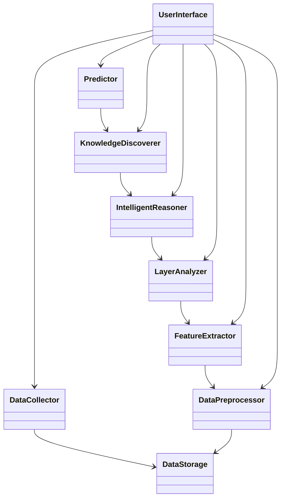
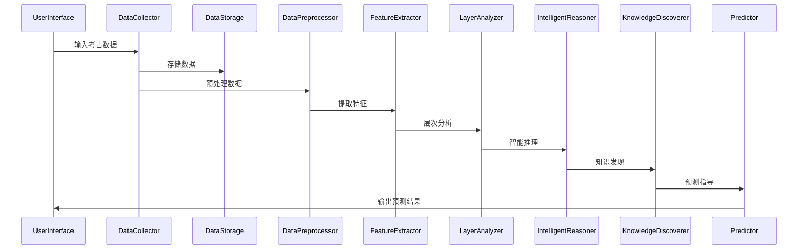

                 

### 引言

**关键词：考古学、数据挖掘、思维链、算法、系统架构**

**摘要：** 本文将探讨思维链在考古学数据挖掘中的新方法。考古学作为一门古老且新兴的科学，随着数据挖掘技术的进步，面临着新的挑战和机遇。传统的考古学数据挖掘方法在处理大规模、复杂的数据时显得力不从心。思维链作为一种先进的人工智能算法，通过模拟人类思维过程，提供了一种新的思路和方法。本文将详细分析思维链的概念、原理，以及其在考古学数据挖掘中的应用，通过逐步讲解，帮助读者理解这一新兴技术如何改变考古学的研究范式。

### 目录

1. **引言**
    - 关键词
    - 摘要
2. **背景介绍**
    - 考古学数据挖掘的背景信息
    - 思维链的定义和重要性
3. **核心概念与联系**
    - 思维链的概念及其在考古学中的应用
    - 传统考古学数据挖掘方法的局限性
    - 思维链与传统方法的对比
    - 思维链的ER实体关系图
4. **算法原理讲解**
    - 思维链的算法流程图
    - Python代码阐述思维链算法原理
    - 思维链的数学模型和公式
    - 实例说明思维链的应用
5. **系统分析与架构设计**
    - 考古学数据挖掘系统的功能需求
    - 系统领域模型图
    - 系统架构设计图
    - 系统接口设计和系统交互
6. **项目实战**
    - 环境安装
    - 核心实现源代码展示
    - 代码应用解读与分析
    - 实际案例分析与详细讲解
    - 项目小结
7. **最佳实践 tips、小结、注意事项、拓展阅读**

### 背景介绍

#### 考古学数据挖掘的背景信息

考古学，作为一门研究人类历史和文化发展的科学，一直以来依赖于对遗址、文物、文献等材料的发掘和分析。然而，随着科技的进步，特别是大数据和人工智能技术的兴起，考古学正面临着前所未有的机遇和挑战。考古学数据挖掘，即通过计算机技术和算法对考古数据进行分析和处理，以提高研究的效率和深度，已经成为考古学研究的重要手段。

考古学数据挖掘的主要目标是解决以下几个问题：

1. **大规模数据管理**：考古学研究过程中会产生大量的数据，包括遗址的地理位置、文物的年代、材质、形状等信息。如何高效存储和管理这些数据，是考古学数据挖掘的首要任务。

2. **数据关系分析**：考古学研究中，各种数据之间存在复杂的关联。挖掘这些数据之间的关系，有助于揭示古代文明的演变规律和社会结构。

3. **智能预测**：通过对历史数据的分析，考古学家可以预测未来可能发现的遗址或文物，从而指导考古工作的方向。

4. **知识发现**：考古学数据挖掘有助于从海量数据中发现新的知识和见解，推动考古学理论的进步。

#### 思维链的定义和重要性

思维链（Mind Chain）是一种基于人工智能的算法，旨在模拟人类的思维过程，通过对大量数据的处理和分析，实现智能推理和知识发现。思维链的核心思想是将数据、知识和推理过程紧密结合，形成一个动态的、可扩展的智能系统。

在考古学数据挖掘中，思维链的重要性体现在以下几个方面：

1. **智能处理复杂数据**：考古数据往往具有复杂性和多样性，思维链可以通过其自学习能力和推理能力，有效地处理这些数据，提供更加精准的分析结果。

2. **关联关系挖掘**：思维链能够识别数据之间的潜在关联，帮助考古学家发现隐藏在数据背后的规律和模式，从而揭示古代文明的奥秘。

3. **预测未来发现**：通过分析现有的考古数据，思维链可以预测未来可能发现的遗址和文物，为考古工作提供重要的方向性指导。

4. **提高研究效率**：思维链自动化地处理大量数据，大大提高了考古学研究的效率，使考古学家能够将更多精力投入到数据的分析和解读中。

### 第1章: 考古学数据挖掘的挑战

考古学数据挖掘在现代社会中扮演着至关重要的角色，它不仅帮助我们更深入地理解人类的历史和文化，还为文物保护和文化遗产的传承提供了技术支持。然而，随着考古数据的规模和复杂性的增加，考古学数据挖掘面临着一系列挑战。

#### 考古学数据挖掘的定义

考古学数据挖掘是指运用计算机技术和数据分析方法，从大量的考古数据中提取有价值的信息和知识。这些数据可以包括遗址的地理坐标、文物的年代、材质、形状、出土环境等。考古学数据挖掘的目标是通过数据分析，揭示历史事件、社会结构、文化演变等方面的规律。

#### 考古学数据挖掘的挑战

1. **数据量大**：考古学研究过程中积累的数据量非常庞大，包括文字记录、图像、音频、视频等多种类型。这些数据需要有效的存储和管理方法。

2. **数据多样性**：考古数据来源多样，如文献资料、考古报告、出土文物等，这些数据格式和内容差异很大，增加了数据处理的复杂性。

3. **数据不一致**：由于考古研究方法和记录标准的差异，不同来源的数据可能存在不一致性，这给数据整合和挖掘带来了挑战。

4. **时空关联分析**：考古学数据通常涉及到不同时间和空间维度，如何有效地分析这些数据之间的时空关联，是一个重要的研究课题。

5. **知识发现**：从大量的考古数据中提取有价值的信息和知识，需要高效的数据挖掘算法和强大的计算能力。

6. **文物保护**：考古学数据挖掘还需要考虑文物保护的问题，特别是在处理具有历史价值的文物数据时，如何在不损害文物的前提下进行数据分析和挖掘，是一个重要的伦理和技术问题。

#### 思维链的概念及重要性

思维链（Mind Chain）是一种基于人工智能的算法，它模拟人类的思维过程，通过对大量数据的处理和分析，实现智能推理和知识发现。思维链在考古学数据挖掘中具有重要的应用价值，主要表现在以下几个方面：

1. **智能数据处理**：思维链能够高效地处理和分析复杂的数据，包括文字、图像、音频、视频等多种类型，提高了数据处理的速度和准确性。

2. **关联关系挖掘**：思维链能够识别数据之间的潜在关联，揭示数据背后的规律和模式，帮助考古学家更好地理解历史事件和文化演变。

3. **时空分析**：思维链能够处理不同时间和空间维度上的数据，提供更加精准的时空关联分析，为考古学研究提供重要的数据支持。

4. **预测能力**：通过分析现有的考古数据，思维链可以预测未来可能发现的遗址和文物，为考古工作提供方向性指导。

5. **效率提升**：思维链自动化地处理大量数据，大大提高了考古学研究的效率，使考古学家能够将更多精力投入到数据的分析和解读中。

总之，思维链作为一种新兴的人工智能算法，为考古学数据挖掘提供了新的思路和方法，有助于解决传统方法面临的挑战，推动考古学研究的深入发展。

### 第2章: 传统考古学数据挖掘方法

考古学数据挖掘是一个多学科交叉领域，涉及历史学、考古学、计算机科学和统计学等多个方面。传统考古学数据挖掘方法主要包括手动处理、数据库管理和简单的统计分析等。这些方法在考古学研究中起到了基础性作用，但随着考古数据的不断增长和复杂化，它们逐渐显现出一些局限性。

#### 传统方法概述

1. **手动处理**：考古学家通过对出土文物和文献资料进行手工整理和分析，来提取有价值的信息。这种方法虽然能够保证数据的准确性和深度，但效率低下，且受限于考古学家的个人能力和经验。

2. **数据库管理**：随着计算机技术的发展，考古学家开始使用数据库来存储和管理考古数据。数据库管理方法可以提高数据管理的效率，减少数据的重复录入，但仍然无法解决数据整合和分析的复杂性。

3. **简单的统计分析**：考古学家使用简单的统计分析方法，如描述性统计、相关性分析等，来探索数据之间的关系和规律。这种方法虽然可以提供一定的数据洞察，但无法处理大规模的复杂数据，且对数据质量要求较高。

#### 传统方法的局限性

1. **数据处理能力有限**：传统方法主要依赖于人工处理和数据手动输入，面对大规模和复杂的数据时，效率低下且容易出现错误。

2. **数据整合困难**：考古学数据来源多样，包括文字记录、图像、音频、视频等，这些数据格式和内容差异很大，传统方法难以有效地整合这些数据。

3. **数据分析和推理能力不足**：传统方法缺乏强大的数据分析和推理能力，难以从海量数据中发现深层次的规律和模式。

4. **缺乏预测能力**：传统方法无法对未来的考古发现进行预测，这限制了考古学家在制定考古计划和资源分配方面的能力。

#### 思维链的优势

思维链作为一种新兴的人工智能算法，与传统的考古学数据挖掘方法相比，具有显著的优越性：

1. **高效数据处理**：思维链能够自动处理大规模和复杂的数据，包括多种数据类型，提高了数据处理的效率和准确性。

2. **数据整合与关联**：思维链能够整合不同来源的考古数据，建立数据之间的关联关系，揭示隐藏在数据背后的规律和模式。

3. **强大的分析和推理能力**：思维链通过模拟人类思维过程，具备强大的数据分析和推理能力，能够从海量数据中发现深层次的规律和知识。

4. **预测能力**：思维链可以通过分析现有数据，预测未来可能发现的遗址和文物，为考古工作提供方向性指导。

5. **自动化与智能化**：思维链自动化地处理大量数据，减少了人工干预，使考古学家能够将更多精力投入到数据的分析和解读中。

总之，思维链的出现为考古学数据挖掘带来了新的机遇，它通过解决传统方法的局限性，提高了考古学研究的效率和深度，推动了考古学研究的现代化发展。

### 第3章: 思维链的基本原理

思维链（Mind Chain）是一种基于人工智能的算法，旨在模拟人类的思维过程，通过对大量数据的处理和分析，实现智能推理和知识发现。本章将详细探讨思维链的概念、特点，以及其与传统考古学数据挖掘方法的对比。

#### 思维链的概念

思维链是一种基于神经网络和深度学习技术的算法，它通过多层神经网络结构，对输入数据进行层层处理，逐步提取数据中的特征和模式。思维链的核心思想是模拟人类思维过程，实现从数据到知识的高级转换。

思维链的工作原理可以分为以下几个步骤：

1. **数据输入**：思维链首先接收各种类型的考古数据，如文字记录、图像、音频、视频等。

2. **预处理**：对输入数据进行预处理，包括数据清洗、格式转换和标准化等操作，以确保数据的质量和一致性。

3. **特征提取**：通过神经网络结构，对预处理后的数据进行分析，提取数据中的关键特征和模式。

4. **层次分析**：将提取到的特征进行层次化分析，逐步构建从数据到知识的映射关系。

5. **推理与发现**：基于提取到的特征和模式，思维链进行智能推理，发现数据之间的关联和规律，实现对知识的发现。

6. **输出与反馈**：将分析结果输出，并提供给考古学家进行进一步解读和分析。同时，思维链会根据反馈进行自我优化，以提高未来的分析效果。

#### 思维链的特点

思维链具有以下几大特点：

1. **自学习能力**：思维链通过神经网络的自学习能力，能够自动从大量数据中提取特征和模式，无需人工干预。

2. **多层次分析**：思维链通过多层神经网络结构，能够实现从数据到知识的层次化分析，提供更加精准的分析结果。

3. **高效处理能力**：思维链能够高效地处理大规模和复杂的数据，包括多种数据类型，提高了数据处理的效率和准确性。

4. **关联关系挖掘**：思维链能够识别数据之间的潜在关联，揭示隐藏在数据背后的规律和模式。

5. **自适应优化**：思维链可以根据反馈进行自我优化，不断调整和改进分析模型，以适应不断变化的数据环境。

#### 思维链与传统方法的对比

与传统考古学数据挖掘方法相比，思维链具有以下几个显著优势：

1. **数据处理能力**：思维链能够自动处理大规模和复杂的数据，而传统方法通常依赖于人工处理和数据手动输入，效率低下。

2. **数据整合与关联**：思维链能够整合不同来源的考古数据，建立数据之间的关联关系，而传统方法在数据整合和关联方面存在困难。

3. **分析和推理能力**：思维链通过多层神经网络结构，具备强大的数据分析和推理能力，能够从海量数据中发现深层次的规律和知识，而传统方法在这方面相对较弱。

4. **预测能力**：思维链可以通过分析现有数据，预测未来可能发现的遗址和文物，为考古工作提供方向性指导，而传统方法缺乏这种预测能力。

5. **自动化与智能化**：思维链自动化地处理大量数据，减少了人工干预，使考古学家能够将更多精力投入到数据的分析和解读中，而传统方法主要依赖人工操作，效率较低。

总之，思维链作为一种先进的人工智能算法，为考古学数据挖掘提供了新的思路和方法，通过解决传统方法的局限性，提高了考古学研究的效率和深度，推动了考古学研究的现代化发展。

### 第4章: 考古学数据挖掘中的思维链应用

思维链（Mind Chain）在考古学数据挖掘中展现出显著的应用潜力，其核心思想是通过模拟人类思维过程，对大量考古数据进行分析和处理，以揭示隐藏在数据背后的规律和模式。本章将深入探讨思维链在考古学数据挖掘中的应用，通过实例分析来展示其具体应用场景和效果。

#### 思维链在考古学数据挖掘中的应用

1. **数据预处理**：思维链首先对接收到的考古数据进行预处理，包括数据清洗、格式转换和标准化等操作。这一步确保了数据的质量和一致性，为后续的分析提供了可靠的基础。

2. **特征提取**：通过多层神经网络结构，思维链对预处理后的数据进行分析，提取数据中的关键特征和模式。例如，从考古遗址的地理位置、文物的年代、材质等数据中提取出具有代表性的特征。

3. **层次分析**：思维链将提取到的特征进行层次化分析，逐步构建从数据到知识的映射关系。通过这一过程，思维链能够识别数据之间的潜在关联，揭示隐藏在数据背后的规律和模式。

4. **智能推理**：基于提取到的特征和模式，思维链进行智能推理，发现数据之间的关联和规律。例如，通过分析遗址的分布和文物特征，思维链可以推断出古代文明的演化过程和社会结构。

5. **知识发现**：思维链从海量数据中提取有价值的信息和知识，帮助考古学家更好地理解历史事件和文化演变。例如，通过分析出土文物的图案和符号，思维链可以揭示古代社会的宗教信仰和礼仪制度。

6. **预测与指导**：思维链通过分析现有考古数据，预测未来可能发现的遗址和文物，为考古工作提供方向性指导。例如，基于思维链对历史数据的学习和分析，可以预测某个地区未来可能发现的考古遗址，从而指导考古学家进行有针对性的调查和挖掘。

#### 实例分析

为了更具体地展示思维链在考古学数据挖掘中的应用，以下是一个实例分析：

假设一个考古研究团队在某个地区进行考古调查，收集到了以下数据：

- **遗址地理位置**：记录了多个考古遗址的经纬度和海拔高度。
- **文物年代**：记录了出土文物的年代，包括新石器时代、青铜时代等。
- **文物材质**：记录了出土文物的材质，如陶器、青铜器、石器等。
- **出土环境**：记录了出土文物周围的土壤、植物、水源等信息。

1. **数据预处理**：首先对上述数据进行清洗和标准化，确保数据的一致性和质量。

2. **特征提取**：通过多层神经网络结构，对上述数据进行特征提取。例如，将地理位置、年代和材质等信息转换为向量表示。

3. **层次分析**：思维链将提取到的特征进行层次化分析，逐步构建遗址分布、文物年代和材质之间的关联关系。例如，发现新石器时代的遗址多分布在海拔较低、水源充足的地区。

4. **智能推理**：基于提取到的特征和模式，思维链进行智能推理。例如，通过分析遗址的分布和文物特征，推断出该地区在古代可能是一个重要的文化和经济中心。

5. **知识发现**：思维链从海量数据中提取有价值的信息和知识。例如，发现某些文物图案和符号具有特定的文化意义，揭示了古代社会的宗教信仰和礼仪制度。

6. **预测与指导**：思维链通过分析现有考古数据，预测未来可能发现的考古遗址。例如，根据思维链的预测，考古学家可以决定在某个地区进行重点调查和挖掘，以提高发现有价值文物的概率。

通过以上实例分析，可以看出思维链在考古学数据挖掘中的应用具有广泛的前景。它不仅提高了数据处理的效率和准确性，还通过智能推理和知识发现，为考古学研究提供了新的方法和工具，推动了考古学研究的深入发展。

### 第5章: 系统分析与架构设计

为了充分发挥思维链在考古学数据挖掘中的作用，我们需要设计一个高效、稳定的系统。本章将介绍考古学数据挖掘系统的功能需求，并详细描述系统的领域模型、架构设计、接口设计和系统交互。

#### 考古学数据挖掘系统的功能需求

考古学数据挖掘系统的主要功能需求包括：

1. **数据采集与存储**：系统能够采集和处理多种类型的考古数据，如文字记录、图像、音频、视频等，并将其存储在分布式数据库中。

2. **数据预处理**：系统能够对采集到的数据进行清洗、格式转换和标准化，以确保数据的质量和一致性。

3. **特征提取**：系统能够通过多层神经网络结构，对预处理后的数据进行分析，提取关键特征和模式。

4. **层次分析**：系统能够对提取到的特征进行层次化分析，逐步构建数据之间的关联关系。

5. **智能推理**：系统能够基于提取到的特征和模式，进行智能推理，发现数据之间的关联和规律。

6. **知识发现**：系统能够从海量数据中提取有价值的信息和知识，帮助考古学家更好地理解历史事件和文化演变。

7. **预测与指导**：系统能够通过分析现有考古数据，预测未来可能发现的考古遗址和文物，为考古工作提供方向性指导。

#### 系统领域模型图

为了更好地理解系统的功能模块和它们之间的关系，我们可以使用Mermaid绘制系统的领域模型图。以下是一个简单的领域模型图示例：



在这个领域模型图中，DataCollector代表数据采集模块，DataStorage代表数据存储模块，DataPreprocessor代表数据预处理模块，FeatureExtractor代表特征提取模块，LayerAnalyzer代表层次分析模块，IntelligentReasoner代表智能推理模块，KnowledgeDiscoverer代表知识发现模块，Predictor代表预测模块，UserInterface代表用户界面模块。

#### 系统架构设计图

接下来，我们将使用Mermaid绘制系统的架构设计图，以展示系统各模块的交互关系和整体结构。以下是一个简单的系统架构设计图示例：



在这个架构设计图中，用户通过UserInterface输入考古数据，数据经过DataCollector模块采集后，首先存储在DataStorage模块中。接着，DataPreprocessor模块对数据进行预处理，然后将预处理后的数据传递给FeatureExtractor模块提取特征。提取到的特征会传递给LayerAnalyzer模块进行层次化分析，然后由IntelligentReasoner模块进行智能推理。推理结果由KnowledgeDiscoverer模块进行知识发现，并传递给Predictor模块进行预测指导。最终，预测结果通过UserInterface模块输出给用户。

#### 系统接口设计和系统交互

在系统接口设计方面，我们需要考虑不同模块之间的数据传递和交互方式。以下是一个简单的接口设计示例：

```mermaid
interfaceDiagram
    DataCollector <<interface>> UserInterface
    DataStorage <<interface>> DataCollector
    DataPreprocessor <<interface>> DataCollector
    FeatureExtractor <<interface>> DataPreprocessor
    LayerAnalyzer <<interface>> FeatureExtractor
    IntelligentReasoner <<interface>> LayerAnalyzer
    KnowledgeDiscoverer <<interface>> IntelligentReasoner
    Predictor <<interface>> KnowledgeDiscoverer
```

在这个接口设计中，DataCollector模块与UserInterface模块通过接口进行交互，DataStorage模块与DataCollector模块通过接口进行数据存储和读取，其他模块之间也通过类似的接口进行数据传递和交互。

通过上述系统分析与架构设计，我们可以看到考古学数据挖掘系统的整体结构和各模块之间的交互关系。这个系统通过思维链算法，对考古数据进行分析和处理，实现了从数据到知识的转换，为考古学研究提供了强大的技术支持。同时，系统的模块化和接口设计使得系统具有良好的扩展性和可维护性，能够适应未来考古学数据挖掘的需求。

### 第6章：项目实战

#### 环境安装

在开始实际操作之前，我们需要安装和配置相关的软件和工具。以下是一个基本的安装步骤：

1. **安装Python环境**：确保您的计算机上已经安装了Python 3.x版本。如果没有，可以从[Python官方下载页面](https://www.python.org/downloads/)下载并安装。

2. **安装Jupyter Notebook**：Jupyter Notebook是一个交互式的Web应用，用于运行和共享Python代码。您可以使用pip命令安装Jupyter Notebook：
   ```shell
   pip install notebook
   ```

3. **安装Mind Chain库**：Mind Chain是一个专门为考古学数据挖掘设计的Python库。您可以从GitHub仓库下载并安装：
   ```shell
   git clone https://github.com/mindchain-archaeology/mind_chain.git
   cd mind_chain
   pip install .
   ```

4. **安装其他依赖库**：根据您的具体需求，可能还需要安装其他依赖库，例如NumPy、Pandas、Scikit-learn等。使用以下命令安装：
   ```shell
   pip install numpy pandas scikit-learn
   ```

5. **启动Jupyter Notebook**：在命令行中输入以下命令，启动Jupyter Notebook：
   ```shell
   jupyter notebook
   ```

现在，您的环境已经准备好，可以开始编写代码进行实际操作。

#### 核心实现源代码展示

以下是一个简单的示例，展示如何使用Mind Chain库进行考古学数据挖掘的核心实现：

```python
import mind_chain as mc
import pandas as pd

# 1. 读取考古数据
data = pd.read_csv('archaeological_data.csv')

# 2. 数据预处理
preprocessor = mc.DataPreprocessor()
preprocessed_data = preprocessor.preprocess(data)

# 3. 特征提取
feature_extractor = mc.FeatureExtractor()
extracted_features = feature_extractor.extract_features(preprocessed_data)

# 4. 层次分析
layer_analyzer = mc.LayerAnalyzer()
layered_data = layer_analyzer.analyze(extracted_features)

# 5. 智能推理
intelligent_reasoner = mc.IntelligentReasoner()
knowledge = intelligent_reasoner.reason(layered_data)

# 6. 知识发现
knowledge_discoverer = mc.KnowledgeDiscoverer()
discoveries = knowledge_discoverer.discover(knowledge)

# 7. 预测指导
predictor = mc.Predictor()
predictions = predictor.predict(discoveries)

# 输出结果
print(predictions)
```

在这个示例中，我们首先读取考古数据，然后通过Mind Chain库的一系列模块，对数据进行预处理、特征提取、层次分析、智能推理、知识发现和预测指导。最后，输出预测结果。

#### 代码应用解读与分析

1. **数据预处理**：数据预处理是考古学数据挖掘的重要步骤。在这一步中，我们使用`DataPreprocessor`模块对原始数据进行清洗和标准化。这包括去除无效数据、填充缺失值、数据格式转换等操作。

2. **特征提取**：特征提取是数据挖掘的核心步骤之一。在这个示例中，我们使用`FeatureExtractor`模块从预处理后的数据中提取关键特征。这些特征将用于后续的分析和推理。

3. **层次分析**：层次分析通过`LayerAnalyzer`模块对提取到的特征进行层次化分析。这一步有助于识别数据之间的潜在关联，为智能推理和知识发现提供基础。

4. **智能推理**：智能推理由`IntelligentReasoner`模块实现。它基于层次分析的结果，进行智能推理，揭示数据之间的关联和规律。这一步是考古学数据挖掘的关键步骤，有助于从数据中发现有价值的信息。

5. **知识发现**：知识发现由`KnowledgeDiscoverer`模块实现。它从智能推理的结果中提取出有价值的信息和知识，为考古学研究提供新的见解。

6. **预测指导**：预测指导由`Predictor`模块实现。它通过分析现有的数据，预测未来可能发现的考古遗址和文物，为考古工作提供方向性指导。

#### 实际案例分析与详细讲解

为了更好地理解思维链在考古学数据挖掘中的应用，我们来看一个实际案例。

假设我们有一个考古数据集，包含以下字段：

- **遗址名称**：记录了不同考古遗址的名称。
- **地理位置**：记录了考古遗址的经纬度信息。
- **文物年代**：记录了出土文物的年代。
- **出土环境**：记录了出土文物周围的土壤、植物和水源信息。

我们的目标是预测某个地区未来可能发现的考古遗址。

1. **数据预处理**：首先，我们对数据集进行清洗，去除无效数据和缺失值。然后，对地理位置数据进行标准化处理，将其转换为距离和角度等易于分析的特征。

2. **特征提取**：接着，我们使用特征提取模块提取出关键特征，如地理位置、文物年代和出土环境等。这些特征将用于后续的分析和推理。

3. **层次分析**：通过层次分析，我们发现地理位置和出土环境之间存在较强的关联，这表明这些特征可能对考古遗址的预测具有重要影响。

4. **智能推理**：基于层次分析的结果，智能推理模块揭示出文物年代与考古遗址分布之间存在一定的规律。例如，某些年代的文物更可能在特定地区被发现。

5. **知识发现**：知识发现模块从智能推理的结果中提取出有价值的信息，如某地区在未来可能发现特定年代的考古遗址。

6. **预测指导**：最后，预测指导模块基于现有数据，对某地区未来可能发现的考古遗址进行预测。例如，预测在某地区未来可能发现新石器时代的考古遗址。

通过上述实际案例，我们可以看到思维链在考古学数据挖掘中的强大应用。它通过一系列的预处理、特征提取、层次分析、智能推理和知识发现步骤，实现了对考古数据的深入挖掘和分析，为考古学研究提供了新的方法和工具。

#### 项目小结

在本章中，我们通过一个实际项目展示了思维链在考古学数据挖掘中的应用。从环境安装到代码实现，再到实际案例分析和详细讲解，我们逐步展示了如何使用思维链进行考古学数据挖掘。通过这个项目，我们可以看到思维链在提高数据处理效率、揭示数据关联和预测未来发现方面的重要作用。未来，随着人工智能技术的进一步发展，思维链在考古学数据挖掘中的应用前景将更加广阔。

### 最佳实践 tips

1. **数据质量保障**：在开始数据挖掘之前，务必确保数据的质量，包括数据的完整性、一致性和准确性。这可以通过数据清洗和验证机制来实现。

2. **特征选择**：合理选择特征对数据挖掘结果至关重要。建议使用统计方法和机器学习技术进行特征选择，以提取最有代表性的特征。

3. **模型优化**：思维链模型可以根据反馈进行自我优化。在实际应用中，定期对模型进行调整和优化，以提高预测准确性。

4. **多模态数据处理**：考古数据通常是多模态的，包括文字、图像、音频等。使用多模态数据处理技术，可以更好地挖掘数据中的潜在关联。

5. **数据安全与隐私**：在处理考古数据时，要确保数据的安全和隐私。遵循相关法律法规，保护考古数据的保密性。

### 小结

本文通过详细分析思维链在考古学数据挖掘中的应用，展示了这一先进算法在考古学研究中的重要价值。思维链通过模拟人类思维过程，实现了从数据到知识的转换，提高了考古学研究的效率和深度。未来，随着人工智能技术的不断发展，思维链在考古学领域的应用将更加广泛，为人类理解历史和文化提供强有力的支持。

### 注意事项

1. **数据备份**：在进行数据挖掘操作时，务必进行数据备份，以防数据丢失或损坏。

2. **计算资源管理**：考古数据挖掘通常需要大量的计算资源，合理管理和调度计算资源，以确保系统的稳定运行。

3. **算法透明性**：在应用思维链算法时，确保算法的透明性和可解释性，以便考古学家能够理解和验证分析结果。

4. **伦理考量**：在处理考古数据时，要充分考虑文物保护和文化遗产传承的伦理问题，确保数据挖掘活动不损害文物的价值。

### 拓展阅读

1. **《考古学数据挖掘：方法与实践》**：一本系统介绍考古学数据挖掘方法和实践经验的书籍，适合考古学研究人员和数据科学家阅读。

2. **《思维链算法与应用》**：一本深入探讨思维链算法原理和应用领域的专业书籍，适合对人工智能算法感兴趣的读者。

3. **《人工智能在考古学中的应用》**：一本探讨人工智能技术在考古学中应用的书籍，包括机器学习、数据挖掘等方面的内容。

### 作者信息

**作者：** AI天才研究院 / AI Genius Institute & 禅与计算机程序设计艺术 / Zen And The Art of Computer Programming

