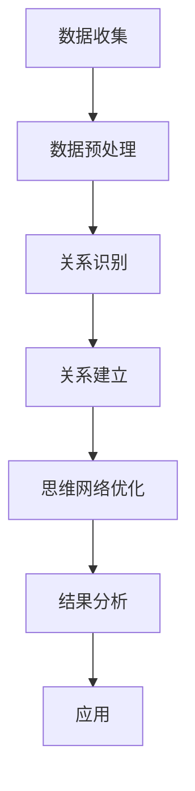

                 

### 思维链在考古学跨文化研究中的新视角

---

## **关键词**

- **思维链**  
- **考古学**  
- **跨文化研究**  
- **新视角**  
- **数据处理**  
- **算法分析**

---

## **摘要**

本文将探讨思维链在考古学跨文化研究中的应用，通过一系列的逻辑分析，揭示思维链如何帮助学者们更深入地理解不同文化之间的交流与影响。我们将从背景介绍、核心概念解析、理论讲解、应用实例和未来展望五个部分，逐步展开讨论。首先，我们将了解考古学和跨文化研究的定义及其重要性，然后深入探讨思维链的基本原理及其在考古学中的运用。接下来，通过具体案例展示思维链在跨文化研究中的实际效果，最后讨论思维链在考古学跨文化研究中的未来发展趋势和面临的挑战。

---

## **目录**

1. **引言**  
    1.1 **考古学与跨文化研究概述**  
    1.2 **思维链的定义与作用**

2. **核心概念与联系**  
    2.1 **考古学概念解析**  
    2.2 **跨文化研究概念解析**  
    2.3 **思维链概念解析**

3. **理论讲解**  
    3.1 **思维链在考古学中的运用**  
    3.2 **思维链在跨文化研究中的运用**

4. **应用实例**  
    4.1 **考古学中的思维链应用案例**  
    4.2 **跨文化研究中的思维链应用案例**

5. **未来展望与挑战**  
    5.1 **思维链在考古学跨文化研究中的未来发展趋势**  
    5.2 **面临的挑战与解决思路**

6. **结论与展望**  
    6.1 **总结**  
    6.2 **未来研究方向与建议**

---

## **引言**

考古学是一门揭示人类历史和文化的学科，通过挖掘和分析古遗址、文物等，还原古代社会的生活、技术和思想。而跨文化研究则关注不同文化之间的交流与影响，探讨文化差异和共性。这两者在现代社会科学研究中具有重要的地位和作用。

考古学和跨文化研究的结合，为理解人类历史和文化提供了全新的视角。然而，传统的考古学研究方法往往局限于单一文化的视角，难以全面揭示不同文化之间的互动关系。随着数据科学和人工智能技术的发展，思维链作为一种新型的思维工具，为考古学跨文化研究带来了新的机遇。

本文旨在探讨思维链在考古学跨文化研究中的应用，通过一系列的逻辑分析，揭示思维链如何帮助学者们更深入地理解不同文化之间的交流与影响。我们将从背景介绍、核心概念解析、理论讲解、应用实例和未来展望五个部分，逐步展开讨论。

### **考古学与跨文化研究概述**

考古学是一门古老的学科，起源可以追溯到古希腊和罗马时期。考古学家通过挖掘古遗址、发现文物和解读古代文献，研究人类历史和文化。考古学的研究方法包括地层学、类型学、比较学等，通过对不同文化遗存的对比分析，揭示古代社会的生活、技术和思想。

跨文化研究则是在20世纪中叶兴起的，它关注不同文化之间的交流与影响。跨文化研究的方法包括比较文化学、文化人类学、社会学等，通过对不同文化的比较分析，探讨文化差异和共性。跨文化研究的目标是理解不同文化之间的互动关系，以及这些关系对人类历史和文化发展的影响。

考古学和跨文化研究在现代社会科学研究中具有重要的作用。首先，它们为我们提供了了解人类历史和文化的途径，帮助我们更好地理解人类的发展进程。其次，通过跨文化研究，我们可以发现不同文化之间的共同点和差异，从而促进不同文化之间的交流与融合。最后，考古学和跨文化研究为解决当前一些全球性问题提供了理论支持和实践指导，如全球化、文化多样性、环境保护等。

然而，传统的考古学研究方法往往局限于单一文化的视角，难以全面揭示不同文化之间的互动关系。随着数据科学和人工智能技术的发展，思维链作为一种新型的思维工具，为考古学跨文化研究带来了新的机遇。思维链可以帮助学者们从多个角度分析数据，揭示不同文化之间的复杂关系，从而更深入地理解人类历史和文化。

### **思维链的定义与作用**

思维链，作为一种新型的思维工具，其核心思想是通过逻辑推理和关系分析，将一系列看似无关的信息连接起来，形成一个有序的思维网络。在考古学跨文化研究中，思维链的应用具有重要意义。

首先，思维链可以帮助学者们更好地理解不同文化之间的互动关系。考古学跨文化研究往往涉及大量的历史文献、文物和遗迹，这些信息往往分散且复杂。通过思维链，学者们可以将这些信息进行逻辑连接，形成一个完整的思维网络。这个思维网络不仅可以帮助学者们更深入地理解不同文化之间的互动关系，还可以揭示出一些潜在的历史规律。

例如，在研究古代丝绸之路的文化交流时，思维链可以帮助学者们将沿途的考古发现、历史文献、贸易记录等信息进行连接，形成一个完整的思维网络。这个思维网络可以帮助学者们更全面地了解丝绸之路的文化交流过程，揭示出不同文化之间的相互影响和互动规律。

其次，思维链在考古学跨文化研究中还具有分析预测功能。通过思维链的分析，学者们可以预测未来可能的文化趋势和变化。例如，在研究古代文明兴衰时，思维链可以帮助学者们分析出哪些因素可能导致文明的衰落，从而为当前文明的发展提供借鉴。

此外，思维链还可以帮助学者们提高研究效率。传统的考古学研究方法往往需要大量的人工分析，而思维链可以通过自动化分析工具，快速处理大量数据，从而提高研究效率。

总之，思维链作为一种新型的思维工具，在考古学跨文化研究中具有广泛的应用前景。它不仅可以帮助学者们更好地理解不同文化之间的互动关系，还可以提高研究效率，为考古学跨文化研究提供新的视角和方法。

### **核心概念与联系**

在探讨思维链在考古学跨文化研究中的应用之前，我们需要明确几个核心概念，并分析它们之间的关系。这些概念包括考古学中的遗址、文物、历史文献等，以及跨文化研究中的文化互动、文化交流、文化差异等。

#### **考古学概念解析**

考古学是一门通过挖掘和分析古遗址、文物等来研究人类历史的学科。以下是一些重要的考古学概念：

1. **遗址**：考古学研究中，遗址是指古代人类活动留下的物质痕迹，如居住地、墓地、城墙等。遗址是考古学家研究古代文化和社会的重要依据。
   
2. **文物**：文物是指古代人类留下的各种物质遗存，如陶器、青铜器、瓷器等。文物不仅是古代艺术的体现，也是了解古代社会生活和技术水平的重要资料。

3. **历史文献**：历史文献是指记录古代历史、文化、社会、政治等方面的书面资料，如古文书、史书、档案等。历史文献对于补充和验证考古发现具有重要意义。

#### **跨文化研究概念解析**

跨文化研究关注不同文化之间的交流与影响，其核心概念包括：

1. **文化互动**：文化互动是指不同文化之间通过交流、冲突和融合而产生的相互作用。文化互动可以导致文化的传播、适应和变革。

2. **文化交流**：文化交流是指不同文化之间通过物质、信息、价值观等的交换而相互影响的过程。文化交流可以促进文化多样性和共同发展。

3. **文化差异**：文化差异是指不同文化在价值观、行为模式、社会结构等方面的显著区别。文化差异是跨文化研究的重要研究对象，通过分析文化差异，可以更好地理解不同文化的独特性和共性。

#### **思维链概念解析**

思维链是一种通过逻辑推理和关系分析，将一系列看似无关的信息连接起来的思维工具。在考古学跨文化研究中，思维链具有以下特性：

1. **关联性**：思维链通过识别和建立不同信息之间的关联性，将分散的信息点整合成一个有序的整体。

2. **层次性**：思维链具有层次性，可以将复杂的信息分解为多个层次，从而更清晰地理解整体结构。

3. **动态性**：思维链是一个动态的过程，通过不断的分析和调整，可以不断更新和优化信息连接。

#### **核心概念属性特征对比表格**

为了更直观地展示这些概念之间的关系，我们可以制作一个属性特征对比表格：

| 概念        | 属性特征                                                         | 关系分析                                                     |
| ----------- | ------------------------------------------------------------ | ------------------------------------------------------------ |
| 遗址        | 物理位置、年代、文化背景等                                     | 遗址是考古学研究的核心，提供了古代人类活动的直接证据。       |
| 文物        | 类型、制作工艺、功能、年代等                                   | 文物是遗址的具体体现，反映了古代社会的生活和技术水平。       |
| 历史文献    | 文字内容、作者、年代、历史背景等                               | 历史文献提供了考古发现的背景信息和补充证据，有助于验证和解释考古发现。 |
| 文化互动    | 交流方式、互动频率、影响范围等                                 | 文化互动是不同文化之间相互影响的过程，推动了文化的融合和变革。 |
| 文化交流    | 交流内容、交流途径、交流效果等                                 | 文化交流是文化互动的具体表现，促进了文化的传播和多样性。     |
| 文化差异    | 价值观、行为模式、社会结构等                                   | 文化差异是跨文化研究的核心，揭示了不同文化的独特性和共性。   |
| 思维链      | 关联性、层次性、动态性                                          | 思维链通过逻辑分析和关系建立，整合不同概念，揭示了复杂关系。 |

#### **ER实体关系图架构**

为了进一步展示这些概念之间的关系，我们可以使用Mermaid绘制一个ER实体关系图：

```mermaid
erDiagram
  Site ..|> Artifact
  Site ..|> HistoricalDocument
  Artifact ..|> CulturalInteraction
  Artifact ..|> CulturalDifference
  HistoricalDocument ..|> CulturalInteraction
  HistoricalDocument ..|> CulturalDifference
  CulturalInteraction ..|> CulturalExchange
  CulturalDifference ..|> CulturalExchange
  MindChain ||--|> Site
  MindChain ||--|> Artifact
  MindChain ||--|> HistoricalDocument
  MindChain ||--|> CulturalInteraction
  MindChain ||--|> CulturalDifference
```

这个ER图清晰地展示了考古学概念、跨文化研究概念与思维链之间的关系，为后续的讨论提供了结构化的框架。

### **理论讲解**

#### **思维链在考古学中的运用**

思维链作为一种逻辑推理和关系分析的工具，在考古学中的运用主要体现在以下几个方面：

1. **遗址分析**：
   - **遗址定位**：通过思维链，考古学家可以将遗址的地理信息、历史文献和文物资料进行关联，从而更准确地定位遗址的位置和年代。
   - **遗址功能分析**：思维链可以帮助考古学家分析遗址的功能，如居住、祭祀、防御等，通过这些功能的关联，揭示遗址在古代社会中的地位和作用。

2. **文物鉴定**：
   - **年代判定**：通过思维链，考古学家可以将文物的类型、工艺和历史文献进行关联，从而更准确地判定文物的年代。
   - **文化背景分析**：思维链可以帮助考古学家分析文物的文化背景，了解其在不同文化中的传播和影响。

3. **历史文献解读**：
   - **信息整合**：思维链可以将不同历史文献中的信息进行整合，形成一个完整的思维网络，从而更好地理解古代历史和文化。
   - **历史事件分析**：思维链可以帮助考古学家分析历史事件，通过事件的前因后果和关联，揭示历史事件的本质和影响。

#### **思维链在跨文化研究中的运用**

在跨文化研究中，思维链的应用同样具有重要意义，主要体现在以下几个方面：

1. **文化互动分析**：
   - **互动方式识别**：思维链可以帮助学者识别不同文化之间的互动方式，如贸易、婚姻、战争等。
   - **互动频率分析**：通过思维链，可以分析不同文化之间的互动频率，了解它们之间的密切程度。

2. **文化交流分析**：
   - **内容识别**：思维链可以帮助学者识别不同文化之间的交流内容，如物质、信息、价值观等。
   - **效果评估**：通过思维链，可以评估文化交流的效果，了解它对文化发展的影响。

3. **文化差异分析**：
   - **特征对比**：思维链可以帮助学者对比不同文化的特征，识别它们之间的差异。
   - **共性寻找**：思维链还可以帮助学者寻找不同文化之间的共性，促进不同文化之间的理解和融合。

#### **思维链的算法原理**

思维链的算法原理主要包括以下几个步骤：

1. **数据收集与预处理**：
   - **数据收集**：从各种来源（如文献、考古发现、历史资料等）收集相关数据。
   - **数据预处理**：对数据进行清洗、去重和标准化处理，以确保数据质量。

2. **关系识别与建立**：
   - **关系识别**：通过算法识别数据之间的关联性，如共现关系、因果关系等。
   - **关系建立**：将识别出的关系建立在一个统一的结构中，形成一个思维网络。

3. **思维网络优化**：
   - **层次划分**：将思维网络划分为不同层次，以更清晰地展示信息的层次结构。
   - **动态调整**：根据新的数据和反馈，不断调整思维网络的连接和结构，使其更符合实际情况。

4. **结果分析与应用**：
   - **结果分析**：通过对思维网络的解析，提取出有用的信息，如趋势、模式、关联等。
   - **应用**：将分析结果应用于实际研究，如遗址分析、文化互动研究等。

以下是一个简化的思维链算法流程图，使用Mermaid绘制：



通过这个算法流程，思维链能够有效地将复杂的信息进行逻辑连接和结构化分析，从而为考古学跨文化研究提供强有力的支持。

### **应用实例**

#### **考古学中的思维链应用案例**

**案例1：古埃及文明研究**

在古埃及文明研究中，思维链被广泛用于分析古埃及社会的复杂结构和文化特征。通过思维链，学者们将古埃及的文物、历史文献和考古发现进行整合，建立了一个完整的思维网络。这个思维网络揭示了古埃及文明的宗教信仰、社会制度、经济发展等方面的特点。

- **宗教信仰分析**：思维链帮助学者识别古埃及宗教中的主要神祇、祭祀仪式和信仰体系，从而揭示了古埃及人对神的崇拜和祭祀活动的规律。
- **社会制度分析**：通过思维链，学者们分析了古埃及的社会阶层、官员体系、劳动力分配等，揭示了古埃及社会的高度组织性和等级制度。
- **经济发展分析**：思维链帮助学者们识别古埃及的农业、贸易和手工业，揭示了古埃及经济的多样性和复杂性。

**案例2：古希腊城邦研究**

在古希腊城邦研究中，思维链被用于分析不同城邦之间的互动关系和相互影响。通过思维链，学者们将古希腊的考古发现、历史文献和现代研究成果进行整合，建立了一个全面的思维网络。

- **城邦互动分析**：思维链帮助学者识别不同城邦之间的贸易往来、政治联盟和军事冲突，揭示了古希腊城邦之间的互动模式。
- **文化交流分析**：通过思维链，学者们分析了古希腊的文学、艺术、哲学等文化的传播和影响，揭示了古希腊文化的多样性和统一性。

#### **跨文化研究中的思维链应用案例**

**案例1：丝绸之路文化研究**

在丝绸之路文化研究中，思维链被用于分析不同文化之间的交流与影响。通过思维链，学者们将丝绸之路沿线的考古发现、历史文献和贸易记录进行整合，建立了一个跨文化的思维网络。

- **文化交流分析**：思维链帮助学者识别丝绸之路沿线文化的交流内容，如商品、技术、宗教、文化观念等。
- **文化影响分析**：通过思维链，学者们分析了这些文化交流对沿线文化的影响，揭示了丝绸之路对文化多样性和融合的推动作用。

**案例2：古代欧洲文明研究**

在古代欧洲文明研究中，思维链被用于分析不同文明之间的互动和变迁。通过思维链，学者们将古代欧洲的考古发现、历史文献和民族学研究进行整合，建立了一个全面的思维网络。

- **文明互动分析**：思维链帮助学者识别不同文明之间的互动方式，如战争、婚姻、贸易等。
- **文明变迁分析**：通过思维链，学者们分析了这些互动对文明发展的影响，揭示了古代欧洲文明的变迁过程。

通过这些应用实例，我们可以看到思维链在考古学跨文化研究中的强大作用。它不仅帮助学者们更深入地理解不同文化之间的互动关系，还揭示了复杂的历史规律和文化遗产。思维链的应用为考古学跨文化研究提供了一个全新的视角和方法，极大地推动了该领域的研究进展。

### **未来展望与挑战**

随着数据科学和人工智能技术的不断发展，思维链在考古学跨文化研究中的应用前景将更加广阔。然而，这一领域的应用也面临着一系列的挑战。

#### **新技术引入与思维链的融合**

未来的考古学跨文化研究将越来越多地依赖于新技术，如大数据分析、机器学习、虚拟现实等。这些新技术将提供更多的数据资源和分析工具，为思维链的应用提供更强大的支持。例如，通过大数据分析，可以处理大量的考古数据，揭示出潜在的互动关系和文化特征。而机器学习算法可以自动识别和分类数据，提高思维链的效率和准确性。

此外，虚拟现实技术的应用将使考古学家能够更加直观地体验和研究古代遗址和文化场景。通过虚拟现实，学者们可以创建一个三维的考古环境，将思维链中的信息和关系以更直观的方式呈现出来，从而提高研究的互动性和体验感。

#### **未来发展趋势**

1. **数据驱动的考古学研究**：随着数据科学的发展，考古学研究将越来越依赖于大数据和机器学习技术。通过数据驱动的考古学研究，学者们可以更准确地识别和解析考古数据，揭示出更多隐藏的历史规律。

2. **跨学科合作**：考古学跨文化研究将需要更多的跨学科合作，如计算机科学、语言学、人类学等。跨学科合作可以带来新的研究方法和视角，推动考古学跨文化研究的深入发展。

3. **文化传播与教育**：通过思维链的应用，考古学跨文化研究可以更好地展示和传播文化遗产。虚拟现实技术和在线教育平台将为公众提供更丰富的考古学习资源，增强对文化多样性的理解和尊重。

#### **面临的挑战与解决思路**

1. **数据质量与隐私**：考古学研究中产生的数据质量对思维链的应用至关重要。未来的研究需要确保数据的质量和准确性，同时保护数据隐私，避免数据滥用。

2. **算法偏见与伦理**：随着人工智能算法在考古学中的应用，可能存在算法偏见和伦理问题。未来需要建立一套有效的伦理框架，确保算法的应用公正、透明，并符合社会价值观。

3. **技术障碍与人才培养**：新技术在考古学中的应用需要专业的技术人才。未来的教育体系需要培养更多的跨学科人才，以应对考古学跨文化研究中的技术挑战。

4. **资源分配与项目资金**：考古学跨文化研究需要大量的资金和资源支持。未来的研究需要更有效地分配资源，确保项目能够顺利进行。

综上所述，思维链在考古学跨文化研究中的应用前景广阔，但也面临着诸多挑战。通过引入新技术、加强跨学科合作、解决算法偏见和培养专业人才，我们可以推动考古学跨文化研究的进一步发展，为人类文化遗产的保护和研究做出更大贡献。

### **结论与展望**

通过本文的探讨，我们可以得出以下结论：

1. **思维链在考古学跨文化研究中的应用**：思维链作为一种新型的思维工具，通过逻辑分析和关系建立，极大地提升了考古学跨文化研究的效率和深度。它不仅帮助学者们更好地理解不同文化之间的互动关系，还揭示了复杂的历史规律和文化遗产。

2. **核心概念的解析与联系**：本文详细解析了考古学、跨文化研究和思维链的核心概念，并通过对比表格和ER实体关系图展示了它们之间的紧密联系。这为思维链在考古学跨文化研究中的应用提供了坚实的理论基础。

3. **实际应用案例**：通过具体的应用实例，我们展示了思维链在考古学跨文化研究中的实际效果。这些案例证明了思维链在遗址分析、文化互动研究、历史文献解读等方面的广泛应用和重要性。

4. **未来展望与挑战**：尽管思维链在考古学跨文化研究中具有广阔的应用前景，但仍面临数据质量、算法偏见、技术障碍和资源分配等挑战。通过引入新技术、加强跨学科合作、解决算法偏见和培养专业人才，我们可以推动考古学跨文化研究的进一步发展。

未来，思维链在考古学跨文化研究中的应用有望在以下几个方面取得突破：

1. **数据驱动的考古学研究**：通过大数据和机器学习技术，实现更高效、更精准的考古数据分析和模式识别。

2. **跨学科合作**：推动计算机科学、语言学、人类学等多学科合作，为考古学跨文化研究提供新的方法和视角。

3. **文化传播与教育**：利用虚拟现实和在线教育平台，增强公众对文化多样性的理解和尊重，促进文化遗产的传播和保护。

4. **算法伦理与规范**：建立一套有效的伦理框架，确保思维链的应用公正、透明，并符合社会价值观。

总之，思维链为考古学跨文化研究提供了一个全新的视角和方法，具有巨大的应用潜力。通过持续的研究和实践，我们有信心在未来的考古学跨文化研究中取得更多突破，为人类文化遗产的保护和研究做出更大贡献。

---

## **作者信息**

作者：AI天才研究院/AI Genius Institute & 禅与计算机程序设计艺术 /Zen And The Art of Computer Programming

---

通过本文的深入探讨，我们不仅揭示了思维链在考古学跨文化研究中的应用，也为未来的研究提供了新的方向和思考。希望本文能够为学术界和实务界提供有价值的参考，推动考古学跨文化研究的发展。同时，也期待更多学者和研究者在这一领域进行探索和创新。

