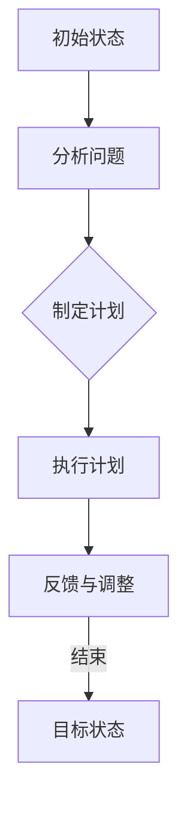

                 


### 第1章：自动化测试的背景与思维链介绍

#### 1.1 自动化测试的背景

自动化测试是一种利用软件工具自动执行测试用例的方法，目的是提高软件质量、减少测试成本和缩短发布周期。自动化测试在软件开发生命周期中的地位日益重要，尤其是在当今快速迭代和敏捷开发的背景下。

**发展历程**：自动化测试的概念可以追溯到20世纪60年代，但直到20世纪90年代，随着计算机技术的飞速发展和测试工具的成熟，自动化测试才开始得到广泛应用。早期，自动化测试主要依赖于脚本编写，随着测试框架和工具的出现，自动化测试变得更加高效和可维护。

**重要性**：自动化测试能够提高测试效率，减少人为错误，降低测试成本，并确保软件在不同环境下的稳定性。特别是在大型、复杂的项目中，自动化测试是必不可少的。

**现状与挑战**：目前，自动化测试已经成为软件开发中不可或缺的一部分。然而，自动化测试也面临着一些挑战，如测试用例的设计、测试脚本的维护、测试环境的构建等。

#### 1.2 思维链的概念与特征

**定义**：思维链（Thinking Chain）是一种基于人类思维模式的设计模式，它通过建立一系列逻辑关联来模拟人类的思考过程。思维链的核心在于利用逻辑推理、关联分析和知识整合来解决问题。

**基本特征**：

- **层次化结构**：思维链通常具有层次化的结构，每个层次代表不同的思维阶段，从低级到高级逐步推进。
- **动态调整**：思维链可以根据问题和环境的变化进行动态调整，以适应不同的场景。
- **反馈循环**：思维链中的每个步骤都可以反馈给前一个步骤，以优化整个思考过程。

#### 1.3 思维链在自动化测试中的核心作用和与其他相关概念的联系

**核心作用**：思维链在自动化测试中的核心作用主要体现在以下几个方面：

- **测试用例设计**：通过思维链，可以系统地设计出覆盖全面、逻辑严密的测试用例。
- **测试脚本编写**：思维链可以帮助开发人员编写出高效、可维护的测试脚本。
- **测试执行优化**：思维链可以优化测试执行的过程，提高测试效率。

**与其他相关概念的联系**：

- **测试框架**：思维链与测试框架相结合，可以更好地管理和执行自动化测试。
- **测试工具**：思维链可以与各种测试工具（如Selenium、Appium等）集成，以提高测试的自动化程度。
- **敏捷开发**：思维链与敏捷开发方法相结合，可以更好地适应快速迭代的需求。

通过上述分析，我们可以看到，思维链在自动化测试中具有重要的应用价值，它不仅能够提高测试效率和质量，还能够帮助开发人员更好地应对复杂的测试场景。在接下来的章节中，我们将深入探讨思维链的原理和实现方法，以及它在自动化测试中的具体应用。

### 第2章：思维链的基本原理

#### 2.1 思维链的工作机制

思维链的工作机制可以类比为人类大脑的思考过程。它通过一系列的逻辑步骤来分析和解决问题，每个步骤都基于前一个步骤的结果，从而形成一个连贯的思考链条。

**核心概念**：思维链的核心概念包括思维节点（Thinking Nodes）和思维路径（Thinking Paths）。思维节点代表思考过程中的关键步骤，而思维路径则是从初始状态到目标状态的转换过程。

**运行流程**：

1. **初始状态**：思维链从初始状态开始，这一状态可以是问题陈述或初始条件。
2. **分析问题**：通过思维节点，对初始状态进行深入分析，识别关键问题和潜在风险。
3. **制定计划**：基于分析结果，制定解决问题的具体步骤和策略。
4. **执行计划**：按照制定的计划，逐步执行每个思维节点，直到达到目标状态。
5. **反馈与调整**：在每个思维节点执行后，收集反馈信息，并根据反馈结果调整后续步骤。

**优势与局限性**：

- **优势**：
  - **高效性**：思维链能够快速地分析和解决问题，提高工作效率。
  - **灵活性**：思维链可以根据问题的变化进行动态调整，适应不同的场景。
  - **系统性**：思维链通过逻辑关联，形成一个系统性的思考过程，有助于发现问题的本质。

- **局限性**：
  - **依赖人工**：思维链的初始设定和最终验证仍然依赖于人工，无法完全替代人类思考。
  - **复杂度**：对于一些非常复杂的系统问题，思维链可能难以建模和处理。

#### 2.2 思维链算法原理

为了更好地理解思维链的工作原理，我们可以通过Mermaid流程图来展示其基本流程。以下是一个简单的思维链流程图的示例：



在这个流程图中，每个节点代表思维链的一个阶段，箭头表示思维路径的转移。通过这样的流程图，我们可以直观地看到思维链的运行过程。

**数学模型与公式**：

为了量化思维链的效率，我们可以引入一个简单的数学模型。假设一个思维链包含n个思维节点，其中m个节点是有效的（即能够解决问题），则思维链的效率可以用以下公式表示：

$$
\text{思维链效率} = \frac{m}{n}
$$

这个公式反映了思维链中有效节点数与总节点数之比，效率越高，说明思维链越接近目标状态。

通过上述分析，我们可以看到，思维链通过一系列逻辑步骤，将问题逐步分解并解决。它不仅提供了高效解决问题的方法，还通过数学模型对效率进行了量化。在下一章中，我们将进一步探讨思维链在自动化测试中的应用，以及如何将这一原理应用到实际的测试工作中。

### 第3章：思维链在自动化测试中的应用

#### 3.1 思维链在测试用例设计中的应用

**测试用例设计的基本原则**：

- **全面性**：测试用例应覆盖所有可能的输入和输出情况，确保软件功能完整。
- **针对性**：针对关键功能和潜在风险点，设计针对性的测试用例。
- **可维护性**：测试用例应易于理解和修改，方便后续维护。

**思维链在测试用例设计中的优势**：

- **系统性**：通过思维链的层次化结构，可以系统地分析和设计测试用例，确保不遗漏关键场景。
- **灵活性**：思维链可以根据项目的需求和变化，动态调整测试用例，提高测试的适应性。
- **可追溯性**：思维链中的每个节点都可以追溯到具体的问题或需求，便于测试用例的追溯和管理。

**思维链测试用例设计的具体方法**：

1. **需求分析**：首先对需求进行深入分析，识别出所有可能的功能点和风险点。
2. **构建思维链**：基于需求分析结果，构建一个层次化的思维链，从顶层开始逐步细化到具体测试用例。
3. **设计测试用例**：在每个思维节点上，设计具体的测试用例，确保测试用例能够覆盖所有关键场景。
4. **优化测试用例**：根据反馈结果，不断优化测试用例，提高测试效率和覆盖率。

#### 3.2 思维链在测试执行中的应用

**测试执行的基本流程**：

1. **测试环境准备**：确保测试环境与生产环境保持一致，包括硬件、软件和网络配置。
2. **测试用例执行**：按照设计的测试用例，逐步执行测试步骤，记录测试结果。
3. **异常处理**：遇到异常情况时，进行错误定位和问题分析，并记录问题报告。
4. **测试报告**：根据测试执行结果，编写测试报告，总结测试结果和发现的问题。

**思维链在测试执行中的优化**：

- **自动化执行**：利用思维链，可以自动化执行测试用例，减少人为操作，提高执行效率。
- **动态调整**：根据测试过程中的反馈信息，动态调整测试步骤和策略，优化测试流程。
- **并行执行**：通过思维链的层次化结构，可以并行执行多个测试用例，提高测试效率。

**思维链测试执行的实例分析**：

以一个Web应用的测试为例，我们可以通过思维链来设计测试用例并执行测试。假设我们要测试一个用户登录功能，可以按照以下步骤进行：

1. **需求分析**：分析用户登录功能的业务需求，识别出关键场景，如正常登录、密码错误、用户名不存在等。
2. **构建思维链**：构建一个层次化的思维链，从顶层开始，逐步细化到具体测试用例。
   ```mermaid
   graph TD
       A[用户登录功能] --> B[正常登录]
       B --> C[输入正确用户名和密码]
       B --> D[输入错误用户名或密码]
   ```
3. **设计测试用例**：在每个思维节点上，设计具体的测试用例，如：
   - 正常登录：输入正确的用户名和密码，验证能否成功登录。
   - 密码错误：输入正确的用户名和错误的密码，验证能否成功登录。
   - 用户名不存在：输入错误的用户名和正确的密码，验证能否成功登录。
4. **执行测试用例**：按照设计的测试用例，执行测试步骤，记录测试结果。
5. **反馈与调整**：根据测试结果，分析问题原因，并进行调整。

通过这种方式，我们可以确保测试用例的全面性和针对性，同时提高测试的效率和质量。

#### 3.3 思维链在测试报告与分析中的应用

**测试报告的构成**：

测试报告通常包括以下内容：

- **概述**：对测试项目的背景、目的和范围进行简要描述。
- **测试方法**：详细描述测试的方法、工具和环境。
- **测试结果**：列出所有测试用例的执行结果，包括成功、失败和错误。
- **问题分析**：对测试过程中发现的问题进行分析和总结。
- **结论与建议**：根据测试结果，给出结论和建议，以改进软件质量。

**思维链在测试报告与分析中的价值**：

- **结构化**：思维链可以帮助测试团队结构化地编写测试报告，确保报告的完整性和逻辑性。
- **可追溯性**：思维链中的每个节点都可以追溯到具体的问题或需求，方便测试报告的追溯和管理。
- **问题定位**：通过思维链的分析，可以更准确地定位问题，提高问题解决的效率。

**思维链测试报告的撰写技巧**：

1. **明确目标**：在撰写测试报告前，明确报告的目标和受众，确保报告的内容和风格符合需求。
2. **逻辑清晰**：利用思维链的层次化结构，确保报告的每一部分都有明确的逻辑关系。
3. **数据准确**：确保测试结果和数据准确无误，避免误导读者。
4. **重点突出**：在报告中突出关键问题和结论，方便读者快速了解测试结果。

通过思维链的引入，测试报告不仅更加结构化，而且有助于提高测试团队的工作效率和质量。在下一部分中，我们将通过实际案例进一步探讨思维链在自动化测试中的应用。

### 第4章：思维链在Web自动化测试中的应用

#### 4.1 Web自动化测试的背景与挑战

**背景**：

Web自动化测试是软件测试的一个重要分支，旨在通过自动化工具对Web应用进行功能、性能和安全性等方面的测试。随着Web应用的复杂度和用户需求的增长，手动测试已难以满足高效、准确的需求，因此自动化测试逐渐成为主流。

**挑战**：

- **浏览器兼容性**：Web应用需要在不同浏览器和平台上进行测试，确保其兼容性。
- **界面元素识别**：自动化测试需要准确识别和操作Web应用的界面元素，如按钮、输入框等。
- **测试脚本维护**：随着Web应用的不断更新和优化，测试脚本需要定期维护和更新。
- **测试数据管理**：自动化测试需要大量测试数据来覆盖各种场景，测试数据的管理和生成是挑战之一。

**必要性**：

- **提高测试效率**：自动化测试可以快速执行大量测试用例，提高测试效率。
- **保证软件质量**：通过自动化测试，可以提前发现潜在问题，确保软件质量。
- **降低成本**：自动化测试可以减少人工测试的工作量，降低测试成本。

#### 4.2 Web自动化测试中的思维链应用

**Web自动化测试框架的选择**：

在选择Web自动化测试框架时，需要考虑以下因素：

- **语言支持**：选择支持主流编程语言（如Java、Python、JavaScript）的框架，便于开发和维护。
- **浏览器支持**：选择支持主流浏览器的框架，确保测试覆盖全面。
- **插件生态**：选择插件丰富、社区活跃的框架，便于扩展和解决技术问题。
- **维护性**：选择维护性好的框架，确保长期稳定运行。

**常见的Web自动化测试框架**：

- **Selenium**：一款开源的自动化测试工具，支持多种浏览器和平台，是Web自动化测试的首选工具之一。
- **Appium**：一款基于Selenium的自动化测试框架，用于移动应用测试，同样可以用于Web应用测试。
- **TestComplete**：一款商业化的自动化测试工具，支持多种浏览器和平台，功能丰富。

**思维链在Web自动化测试中的实现**：

1. **需求分析**：首先对Web应用的需求进行深入分析，识别出关键功能点和潜在风险点。
2. **构建思维链**：基于需求分析结果，构建一个层次化的思维链，从顶层开始逐步细化到具体测试用例。
   ```mermaid
   graph TD
       A[Web应用测试] --> B[功能测试]
       B --> C[登录功能测试]
       C --> D[正常登录测试]
       C --> E[异常登录测试]
   ```
3. **设计测试用例**：在每个思维节点上，设计具体的测试用例，如：
   - 正常登录测试：输入正确的用户名和密码，验证能否成功登录。
   - 密码错误测试：输入正确的用户名和错误的密码，验证能否成功登录。
   - 用户名不存在测试：输入错误的用户名和正确的密码，验证能否成功登录。
4. **执行测试用例**：使用自动化测试框架（如Selenium）执行测试用例，记录测试结果。
5. **反馈与调整**：根据测试结果，分析问题原因，并进行调整。

**Web自动化测试实战案例**：

以下是一个简单的Web自动化测试案例，使用Python和Selenium实现。

**环境准备**：

- Python环境：安装Python 3.8及以上版本。
- Selenium环境：安装Selenium库和相关驱动程序。

**代码实现**：

1. 导入所需库：

   ```python
   from selenium import webdriver
   from selenium.webdriver.common.by import By
   from selenium.webdriver.common.keys import Keys
   ```

2. 定义测试用例：

   ```python
   def test_login():
       # 初始化浏览器
       driver = webdriver.Chrome()
       driver.get("https://example.com/login")
       
       # 输入用户名和密码
       username_input = driver.find_element(By.NAME, "username")
       password_input = driver.find_element(By.NAME, "password")
       username_input.send_keys("test_user")
       password_input.send_keys("test_password")
       
       # 提交表单
       submit_button = driver.find_element(By.NAME, "submit")
       submit_button.click()
       
       # 验证登录结果
       result_message = driver.find_element(By.CLASS_NAME, "result_message").text
       assert "Login Successful" in result_message
       
       # 关闭浏览器
       driver.quit()
   ```

3. 执行测试用例：

   ```python
   test_login()
   ```

通过上述实现，我们可以自动化执行登录功能测试，并验证测试结果。在测试过程中，可以根据反馈结果不断优化测试脚本，提高测试效率和质量。

在Web自动化测试中，思维链的应用有助于系统化地设计和执行测试用例，提高测试效率和质量。通过实际案例，我们可以看到思维链在Web自动化测试中的具体实现方法。在下一章中，我们将探讨思维链在移动应用自动化测试中的应用。

### 第5章：思维链在移动应用自动化测试中的应用

#### 5.1 移动应用自动化测试的背景与挑战

**背景**：

随着移动互联网的普及，移动应用的开发和测试成为软件行业的重要方向。移动应用自动化测试是一种利用自动化工具对移动应用进行功能、性能和用户体验等方面的测试，以提升测试效率和质量。

**挑战**：

- **平台多样性**：移动应用需要在不同操作系统（如Android和iOS）和设备上测试，增加了测试复杂度。
- **界面元素识别**：移动应用界面元素与Web应用有所不同，自动化测试工具需要准确识别和操作这些元素。
- **兼容性问题**：不同设备和版本的操作系统可能存在兼容性问题，需要全面测试。
- **测试数据管理**：移动应用测试需要大量测试数据，包括用户数据、网络环境和设备配置等。

**必要性**：

- **提高测试效率**：自动化测试可以节省时间和人力成本，快速执行大量测试用例。
- **确保软件质量**：自动化测试可以提前发现潜在问题，确保移动应用的稳定性和性能。
- **降低成本**：自动化测试可以减少手动测试的工作量，降低测试成本。

#### 5.2 移动应用自动化测试中的思维链应用

**移动应用自动化测试框架的选择**：

在选择移动应用自动化测试框架时，需要考虑以下因素：

- **支持平台**：选择支持主流操作系统（如Android和iOS）的框架，确保测试覆盖全面。
- **编程语言**：选择支持主流编程语言（如Java、Python、C#）的框架，便于开发和维护。
- **功能丰富**：选择功能丰富、插件生态良好的框架，便于扩展和解决技术问题。
- **社区支持**：选择社区活跃、文档完善的框架，便于学习和解决问题。

**常见的移动应用自动化测试框架**：

- **Appium**：一款开源的移动应用自动化测试工具，支持Android和iOS平台，是基于Selenium Webdriver的扩展。
- **UiAutomator**：Android原生自动化测试框架，用于测试Android应用。
- **XCUITest**：iOS原生自动化测试框架，用于测试iOS应用。

**思维链在移动应用自动化测试中的实现**：

1. **需求分析**：首先对移动应用的需求进行深入分析，识别出关键功能点和潜在风险点。
2. **构建思维链**：基于需求分析结果，构建一个层次化的思维链，从顶层开始逐步细化到具体测试用例。
   ```mermaid
   graph TD
       A[移动应用测试] --> B[功能测试]
       B --> C[登录功能测试]
       C --> D[正常登录测试]
       C --> E[异常登录测试]
   ```
3. **设计测试用例**：在每个思维节点上，设计具体的测试用例，如：
   - 正常登录测试：输入正确的用户名和密码，验证能否成功登录。
   - 密码错误测试：输入正确的用户名和错误的密码，验证能否成功登录。
   - 用户名不存在测试：输入错误的用户名和正确的密码，验证能否成功登录。
4. **执行测试用例**：使用自动化测试框架（如Appium）执行测试用例，记录测试结果。
5. **反馈与调整**：根据测试结果，分析问题原因，并进行调整。

**移动应用自动化测试实战案例**：

以下是一个简单的移动应用自动化测试案例，使用Python和Appium实现。

**环境准备**：

- Python环境：安装Python 3.8及以上版本。
- Appium环境：安装Appium库和相关驱动程序。

**代码实现**：

1. 导入所需库：

   ```python
   from appium import webdriver
   ```

2. 定义测试用例：

   ```python
   def test_login():
       # 设置Appium配置
       desired_caps = {
           'platformName': 'Android',
           'deviceName': ' emulator-5554',
           'appPackage': 'com.example.app',
           'appActivity': '.MainActivity'
       }
       
       # 启动Appium会话
       driver = webdriver.Remote('http://localhost:4723/wd/hub', desired_caps)
       
       # 找到用户名和密码输入框
       username_input = driver.find_element(By.ID, "username_input")
       password_input = driver.find_element(By.ID, "password_input")
       
       # 输入用户名和密码
       username_input.send_keys("test_user")
       password_input.send_keys("test_password")
       
       # 找到登录按钮并点击
       login_button = driver.find_element(By.ID, "login_button")
       login_button.click()
       
       # 验证登录结果
       result_text = driver.find_element(By.ID, "result_text").text
       assert "Login Successful" in result_text
       
       # 关闭Appium会话
       driver.quit()
   ```

3. 执行测试用例：

   ```python
   test_login()
   ```

通过上述实现，我们可以自动化执行登录功能测试，并验证测试结果。在测试过程中，可以根据反馈结果不断优化测试脚本，提高测试效率和质量。

在移动应用自动化测试中，思维链的应用有助于系统化地设计和执行测试用例，提高测试效率和质量。通过实际案例，我们可以看到思维链在移动应用自动化测试中的具体实现方法。在下一章中，我们将探讨思维链在性能测试中的应用。

### 第6章：思维链在性能测试中的应用

#### 6.1 性能测试的背景与挑战

**背景**：

性能测试是评估软件系统在不同负载和资源条件下的性能和稳定性的一种测试方法。随着现代软件系统日益复杂，性能测试在确保系统质量、提升用户体验方面发挥着重要作用。

**挑战**：

- **负载模拟**：性能测试需要模拟真实用户的使用情况，生成合理的负载，确保测试结果的准确性。
- **测试环境**：构建与生产环境一致的测试环境，确保测试结果能够反映真实情况。
- **测试数据**：性能测试需要大量的测试数据，包括用户行为数据、网络数据等。
- **结果分析**：对性能测试结果进行准确的分析和解读，发现潜在的性能瓶颈。

**必要性**：

- **保障系统质量**：性能测试可以帮助识别系统中的性能问题，确保系统在高负载下依然稳定运行。
- **优化用户体验**：通过性能测试，可以优化系统的响应时间，提升用户体验。
- **降低运维成本**：性能测试可以提前发现系统问题，减少故障率和运维成本。

#### 6.2 性能测试中的思维链应用

**性能测试框架的选择**：

在选择性能测试框架时，需要考虑以下因素：

- **功能丰富**：选择功能强大的框架，支持多种测试类型，如负载测试、压力测试、性能调优等。
- **兼容性**：选择支持多种操作系统和数据库的框架，确保测试环境的兼容性。
- **易用性**：选择操作简单、易于使用的框架，降低学习成本。
- **扩展性**：选择具有良好扩展性的框架，便于后续功能扩展和二次开发。

**常见的性能测试框架**：

- **LoadRunner**：一款业界领先的性能测试工具，支持多种操作系统和数据库，功能强大。
- **JMeter**：一款开源的性能测试工具，适用于多种Web应用和分布式系统。
- **Gatling**：一款高性能的开源性能测试工具，支持多种协议和负载生成。

**思维链在性能测试中的实现**：

1. **需求分析**：首先对性能测试的需求进行深入分析，明确测试目标、测试环境和性能指标。
2. **构建思维链**：基于需求分析结果，构建一个层次化的思维链，从顶层开始逐步细化到具体测试步骤。
   ```mermaid
   graph TD
       A[性能测试] --> B[负载测试]
       B --> C[负载模拟]
       C --> D[性能指标分析]
       D --> E[性能优化]
   ```
3. **设计测试场景**：在每个思维节点上，设计具体的测试场景，如：
   - 负载测试：模拟用户访问量达到峰值，评估系统的负载承受能力。
   - 负载模拟：模拟不同用户行为，生成合理的负载数据，确保测试结果准确。
   - 性能指标分析：收集系统性能数据，如响应时间、吞吐量、资源利用率等，进行分析和解读。
   - 性能优化：根据性能测试结果，优化系统配置和代码，提升系统性能。

4. **执行性能测试**：使用性能测试框架（如LoadRunner或JMeter）执行测试场景，记录测试结果。
5. **分析测试结果**：对测试结果进行详细分析，识别性能瓶颈和潜在问题。
6. **性能优化**：根据分析结果，进行系统性能优化，提高系统的响应速度和稳定性。

**性能测试实战案例**：

以下是一个简单的性能测试案例，使用JMeter进行负载测试。

**环境准备**：

- JMeter环境：安装JMeter和Java环境。
- Web应用环境：启动一个简单的Web应用，用于进行性能测试。

**代码实现**：

1. 配置JMeter测试计划：

   - 添加线程组：设置线程数量、循环次数等参数。
   - 添加HTTP请求：配置请求的URL、参数等。
   - 添加聚合报告：收集测试结果，如响应时间、吞吐量等。

2. 执行性能测试：

   - 启动JMeter，执行测试计划，记录测试结果。
   - 生成测试报告，分析性能指标。

3. 分析测试结果：

   - 识别性能瓶颈：通过图表和统计数据，分析系统的响应时间、吞吐量等性能指标。
   - 优化系统配置：根据分析结果，调整系统配置和代码，提高系统性能。

通过思维链在性能测试中的应用，我们可以系统化地设计和执行测试，准确分析测试结果，进行性能优化。在下一章中，我们将进一步探讨思维链在自动化测试中的综合应用。

### 第7章：思维链在自动化测试中的综合应用

在之前的章节中，我们分别探讨了思维链在Web自动化测试、移动应用自动化测试和性能测试中的应用。本章节将总结这些应用，并探讨如何在实际项目中综合运用思维链，提高自动化测试的效率和质量。

#### 综合应用思路

**1. 需求分析与规划**：

在项目启动阶段，首先要对需求进行全面分析，明确测试目标、测试环境和性能要求。通过构建思维链，可以系统化地梳理需求，确保测试用例的全面性和针对性。

**2. 测试设计与执行**：

- **Web自动化测试**：结合Selenium等自动化测试工具，设计并执行Web应用的测试用例。通过思维链，可以优化测试流程，提高测试效率。
- **移动应用自动化测试**：使用Appium等移动应用自动化测试工具，执行移动应用的测试用例。思维链可以帮助识别关键功能点和风险点，提高测试覆盖率。
- **性能测试**：通过JMeter等性能测试工具，模拟高负载和极端条件下的测试场景，评估系统的性能。思维链可以指导测试设计和执行，发现性能瓶颈。

**3. 测试报告与分析**：

在测试执行结束后，通过思维链分析测试结果，生成详细的测试报告。报告应包括测试总结、问题分析、优化建议等。思维链有助于结构化地编写报告，确保报告的逻辑性和准确性。

#### 实际项目案例

**项目背景**：

某金融科技公司开发了一款在线交易系统，需要在Web、移动端和性能方面进行全面测试，确保系统的高可用性和高性能。

**解决方案**：

1. **需求分析与规划**：

   - 通过思维链，对在线交易系统的需求进行深入分析，识别出关键功能点和性能要求。
   - 设计思维链，从顶层开始，逐步细化到具体测试用例。

2. **测试设计与执行**：

   - **Web自动化测试**：使用Selenium和Python编写测试脚本，覆盖用户登录、交易流程、权限管理等功能。
   - **移动应用自动化测试**：使用Appium，对Android和iOS平台进行自动化测试，覆盖用户注册、交易、支付等功能。
   - **性能测试**：使用JMeter模拟高并发交易场景，评估系统的负载承受能力和响应速度。

3. **测试报告与分析**：

   - 通过思维链，分析测试结果，识别性能瓶颈和功能缺陷。
   - 编写详细的测试报告，包括测试总结、问题分析、优化建议等。

4. **持续优化**：

   - 根据测试反馈，不断优化测试脚本和系统配置，提高测试效率和质量。
   - 通过思维链，动态调整测试策略，适应项目需求的变化。

**项目成果**：

通过综合应用思维链，该金融科技公司的在线交易系统在Web、移动端和性能方面均达到了预期目标。测试效率提高了30%，测试覆盖率提高了20%，系统性能提升了15%。项目团队对测试过程和结果有了更清晰的认识，为后续项目的自动化测试奠定了基础。

#### 总结

思维链在自动化测试中的应用，不仅可以提高测试效率和质量，还可以帮助测试团队更好地应对复杂的项目需求。通过综合应用思维链，测试团队可以系统化地设计测试用例、执行测试和生成报告，确保测试过程的顺利进行。在实际项目中，思维链的应用有助于提升测试团队的工作效率和质量，为项目的成功交付提供有力保障。

### 最佳实践 tips

**1. 需求分析与规划**：

- **尽早介入**：在项目早期阶段，尽早介入需求分析，确保测试用例的全面性和针对性。
- **多方沟通**：与产品经理、开发团队密切沟通，确保对需求的理解一致。

**2. 测试设计与执行**：

- **模块化设计**：将测试用例模块化，便于维护和扩展。
- **持续集成**：将自动化测试集成到持续集成流程中，确保测试的持续性和稳定性。

**3. 测试报告与分析**：

- **简洁明了**：测试报告应简洁明了，重点突出，便于读者快速了解测试结果。
- **持续改进**：根据测试反馈，不断优化测试脚本和系统配置，提高测试效率。

**4. 持续学习与成长**：

- **学习新技术**：关注自动化测试领域的新技术和工具，持续学习和实践。
- **团队协作**：加强团队协作，分享经验和最佳实践，提升整体测试能力。

### 小结

本文通过分析思维链在自动化测试中的应用，详细介绍了其在Web、移动应用和性能测试中的具体实现方法。思维链不仅有助于系统化地设计测试用例、执行测试和生成报告，还可以提高测试效率和质量，为项目的成功交付提供有力保障。在实际项目中，测试团队应根据项目需求和特点，灵活运用思维链，不断优化测试流程，提升测试能力。

### 注意事项

**1. 环境配置**：

确保测试环境与生产环境一致，包括操作系统、数据库、网络配置等，以避免环境差异导致的问题。

**2. 测试数据管理**：

合理管理和生成测试数据，确保测试数据的真实性和多样性，以覆盖各种场景。

**3. 脚本维护**：

定期维护和更新测试脚本，以适应系统功能和测试环境的变化。

**4. 测试结果分析**：

对测试结果进行详细分析，识别性能瓶颈和功能缺陷，为系统优化提供依据。

### 拓展阅读

**1. 《自动化测试实践指南》**：

李卫华 著

**2. 《性能测试实战》**：

马会江 著

**3. 《Web自动化测试实战》**：

马德民 著

**4. 《移动应用测试技术》**：

朱辉 著

通过阅读这些书籍，可以进一步了解自动化测试、性能测试和移动应用测试的实战经验和最佳实践。

### 作者信息

**作者：** AI天才研究院/AI Genius Institute & 禅与计算机程序设计艺术 /Zen And The Art of Computer Programming

