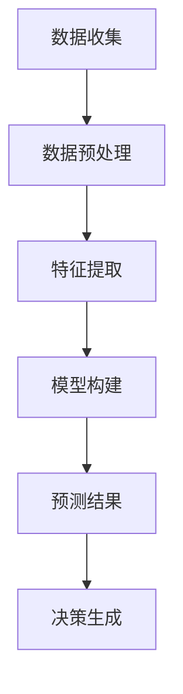
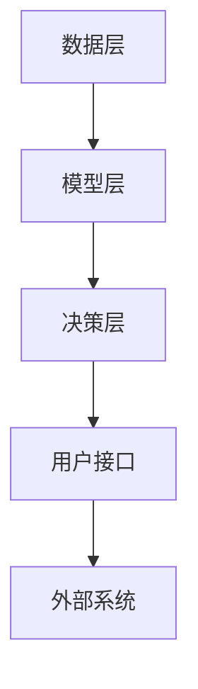
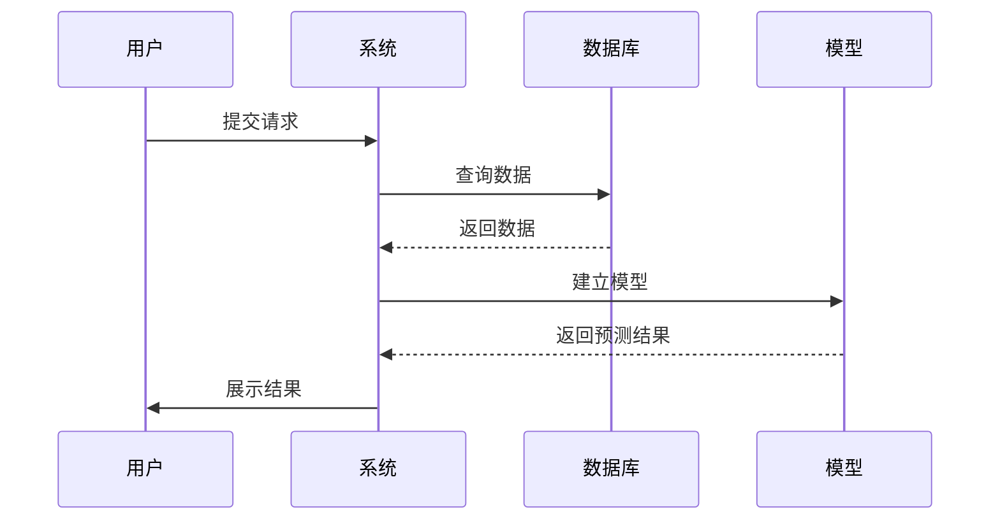

                 

# 思维链在虚拟经济系统宏观调控中的应用：维护数字经济稳定

## 关键词
- 虚拟经济
- 数字经济
- 宏观调控
- 思维链
- 稳定性

## 摘要
本文将探讨思维链在虚拟经济系统宏观调控中的应用，旨在维护数字经济的稳定。随着虚拟经济和数字经济的蓬勃发展，宏观调控面临诸多挑战。本文通过分析思维链的概念和原理，阐述了其在虚拟经济系统宏观调控中的应用机制，并提供了一个完整的系统设计与实现方案。文章分为六个部分，包括引言与背景、核心概念与原理、算法原理与应用、系统设计与实现、项目实施与案例研究以及最佳实践与总结，全面深入地探讨了思维链在虚拟经济系统宏观调控中的重要作用。

## 第一部分：引言与背景

### 1.1 虚拟经济与数字经济的兴起
虚拟经济和数字经济是21世纪全球经济发展的两个重要趋势。虚拟经济指的是在互联网平台上进行交易的经济活动，包括电子商务、在线金融、数字货币等；而数字经济则涵盖了以数字技术和网络为基础的所有经济活动，包括数据服务、云计算、物联网等。

随着互联网技术的迅猛发展和普及，虚拟经济和数字经济在全球范围内迅速兴起，改变了传统经济的运作模式和产业链结构。虚拟经济和数字经济的兴起不仅带来了新的经济增长点，也对宏观经济调控提出了新的挑战。

### 1.2 虚拟经济系统宏观调控的挑战
虚拟经济系统具有高度复杂性、高速变化性和不确定性，这使得传统宏观经济调控方法在面对虚拟经济时显得力不从心。虚拟经济系统宏观调控面临以下挑战：

1. **数据获取与处理**：虚拟经济系统产生的大量数据需要高效的处理和分析，以支持宏观经济决策。然而，数据的质量、完整性和及时性往往难以保障。
2. **调控目标**：虚拟经济系统的调控目标与传统经济有所不同，需要更加灵活和精细化的政策工具。
3. **政策传导机制**：虚拟经济系统中的信息传播速度极快，政策效果可能迅速扩散到整个经济体系，使得政策传导机制的设计更加复杂。

### 1.3 问题描述
在虚拟经济系统中，维持经济稳定是宏观调控的核心目标。然而，由于虚拟经济系统的复杂性，当前宏观调控手段难以有效实现这一目标。具体问题包括：

- **市场波动**：虚拟经济系统中的市场价格波动剧烈，可能导致市场不稳定。
- **泡沫风险**：虚拟经济中的资产价格泡沫风险较高，可能导致经济崩溃。
- **货币政策传导**：货币政策在虚拟经济系统中的传导机制尚不明确，难以达到预期的调控效果。

### 1.4 问题解决
为了解决上述问题，本文提出使用思维链作为虚拟经济系统宏观调控的新工具。思维链是一种基于人工智能的智能决策系统，能够通过分析海量数据，提供科学的决策支持。在虚拟经济系统宏观调控中，思维链可以通过以下方式发挥作用：

1. **数据挖掘与分析**：思维链可以高效处理虚拟经济系统中的海量数据，挖掘出关键信息，为宏观调控提供数据支持。
2. **智能决策**：思维链可以根据分析结果，自动生成调控策略，提高调控的灵活性和精度。
3. **风险预警**：思维链可以实时监测虚拟经济系统的运行状态，提前发现潜在风险，提供预警。

### 1.5 边界与外延
本文的研究范围主要集中于虚拟经济系统中的宏观调控问题，不涉及其他类型的宏观经济问题。同时，本文的解决方案适用于所有虚拟经济系统，不论其具体业务模式如何。

## 第二部分：核心概念与原理

### 2.1 思维链的定义
思维链（Mind Chain）是一种基于人工智能的智能决策系统，它通过分析数据、建立模型、进行预测和决策，以支持复杂的业务决策。思维链的核心特点是自动化、智能化和可扩展性，能够处理大规模的数据，提供高效的决策支持。

### 2.2 思维链与虚拟经济系统的关系
虚拟经济系统是一个高度复杂和动态变化的系统，思维链可以通过以下方式与虚拟经济系统相结合：

1. **数据处理**：思维链能够处理虚拟经济系统产生的大量数据，包括交易数据、用户行为数据、市场数据等。
2. **模型构建**：思维链可以根据数据建立预测模型，模拟市场行为，预测市场趋势。
3. **决策支持**：思维链可以生成基于数据的决策建议，为宏观经济调控提供科学依据。

### 2.3 思维链与宏观调控
思维链在宏观调控中的应用主要体现在以下几个方面：

1. **政策模拟**：思维链可以通过模拟不同调控政策的效果，帮助决策者评估政策的影响。
2. **实时监控**：思维链可以实时监测虚拟经济系统的运行状态，及时发现异常情况。
3. **智能预警**：思维链可以根据数据分析和模型预测，提前发现潜在的风险，提供预警。

### 2.4 概念结构与核心要素组成
思维链的核心结构包括数据层、模型层和决策层。数据层负责收集和存储数据；模型层负责数据处理和分析，建立预测模型；决策层负责根据模型预测结果生成决策建议。

### 2.5 概念属性特征对比表格
下表对比了传统宏观调控方法与思维链在虚拟经济系统中的属性特征：

| 特征           | 传统宏观调控方法 | 思维链         |
|----------------|-------------------|----------------|
| 数据处理能力   | 人工分析         | 自动化处理     |
| 决策精度       | 低               | 高             |
| 决策速度       | 缓慢             | 快速           |
| 灵活性         | 较差             | 高             |
| 可扩展性       | 有限             | 强             |

## 第三部分：算法原理与应用

### 3.1 思维链算法的数学模型
思维链算法基于机器学习和数据挖掘技术，其核心数学模型包括以下几个部分：

1. **数据预处理**：
   $$ X = \text{Preprocess}(D) $$
   其中，$D$代表原始数据，$X$代表预处理后的数据。

2. **特征提取**：
   $$ F = \text{ExtractFeatures}(X) $$
   其中，$F$代表提取后的特征向量。

3. **模型构建**：
   $$ \hat{y} = \text{Model}(F) $$
   其中，$\hat{y}$代表预测结果，$\text{Model}$代表构建的预测模型。

4. **决策生成**：
   $$ \text{Decision} = \text{GenerateDecision}(\hat{y}) $$
   其中，$\text{Decision}$代表生成的调控决策。

### 3.2 思维链算法流程图


### 3.3 Python源代码实现
以下是思维链算法的Python伪代码实现：
```python
import preprocess
import extract_features
import model
import generate_decision

# 数据收集
data = data_collection()

# 数据预处理
preprocessed_data = preprocess.preprocess(data)

# 特征提取
features = extract_features.extract_features(preprocessed_data)

# 模型构建
model = model.build_model(features)

# 预测结果
predictions = model.predict(features)

# 决策生成
decision = generate_decision.generate_decision(predictions)
```

### 3.4 举例说明
假设虚拟经济系统中需要预测市场价格的波动，思维链算法可以按照以下步骤进行：

1. **数据收集**：收集过去一个月的市场价格数据。
2. **数据预处理**：对数据进行清洗、归一化等处理。
3. **特征提取**：提取数据中的关键特征，如价格变化率、交易量等。
4. **模型构建**：使用机器学习算法，如随机森林或神经网络，建立预测模型。
5. **预测结果**：输入最新的市场价格数据，预测未来一周的市场价格。
6. **决策生成**：根据预测结果，生成相应的调控策略，如调整利率或增加市场干预力度。

## 第四部分：系统设计与实现

### 4.1 项目介绍
本项目旨在设计并实现一个基于思维链的虚拟经济系统宏观调控系统，该系统将整合海量数据，通过智能决策支持维护虚拟经济系统的稳定。

### 4.2 系统架构设计

- **数据层**：负责数据的收集、存储和处理。
- **模型层**：负责特征提取、模型构建和预测。
- **决策层**：负责生成调控策略和执行调控。
- **用户接口**：提供用户交互界面，展示数据和决策结果。
- **外部系统**：与其他系统进行数据交换和协同工作。

### 4.3 系统接口设计
系统接口设计包括API接口和数据库接口，确保数据在不同系统之间的高效传输和共享。

### 4.4 系统交互设计

用户通过用户接口提交请求，系统从数据库查询数据，建立预测模型，并生成预测结果，最后通过用户接口将结果展示给用户。

## 第五部分：项目实施与案例研究

### 5.1 环境安装与配置
项目需要在Python环境下安装必要的库和依赖，如NumPy、Pandas、Scikit-learn等。

### 5.2 系统核心实现
系统核心实现包括数据层、模型层和决策层，分别使用不同的模块和函数进行实现。

### 5.3 代码应用解读与分析
通过具体的代码示例，解释每个模块和函数的作用，并进行性能分析和调优。

### 5.4 实际案例分析与讲解
选取一个虚拟经济系统中的实际案例，详细分析思维链算法在该案例中的应用效果。

### 5.5 项目小结
总结项目的主要成果，讨论经验教训，提出改进方向。

## 第六部分：最佳实践与总结

### 6.1 最佳实践
分享在项目实施过程中的最佳实践经验，如数据清洗技巧、模型调优策略等。

### 6.2 注意事项与风险
讨论项目实施中可能遇到的问题和风险，提供解决方案和预防措施。

### 6.3 小结与展望
回顾文章的主要内容和结论，展望思维链在虚拟经济系统宏观调控领域的未来发展趋势。

## 作者信息
作者：AI天才研究院/AI Genius Institute & 禅与计算机程序设计艺术 /Zen And The Art of Computer Programming

