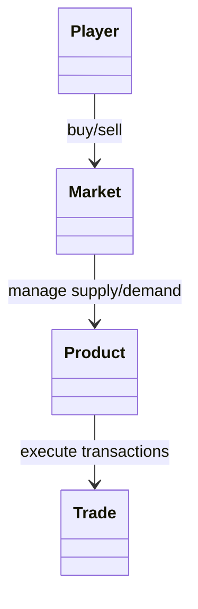
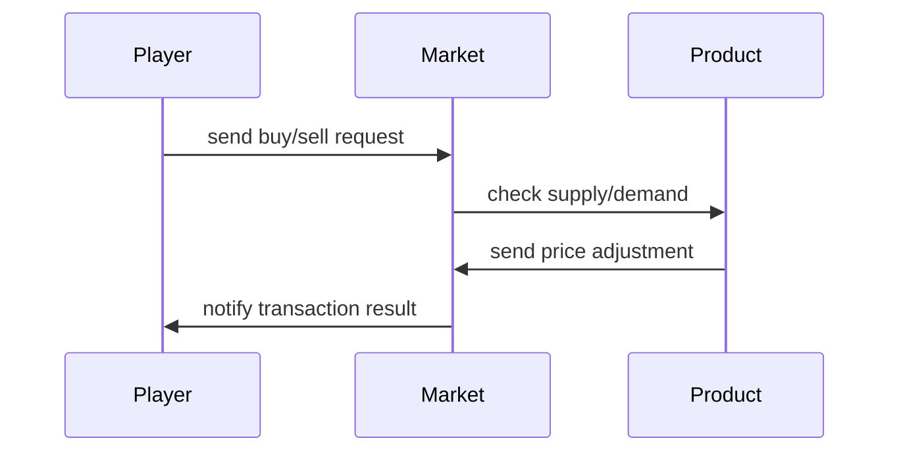
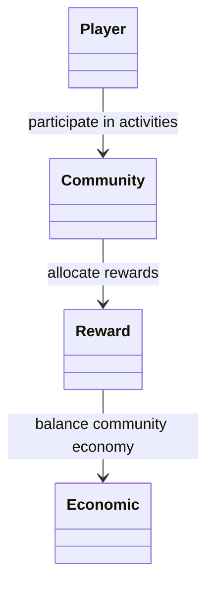
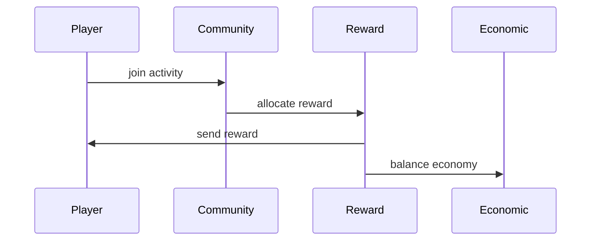

                 

### 引言与背景

#### 1.1 虚拟经济的崛起

**1.1.1 虚拟经济的定义**

虚拟经济，是指在数字环境中产生、交换和流通的价值。它不同于现实经济中的实物商品交易，而是通过数字形式表现和传递的资产和价值。虚拟经济的核心是数据，数据不仅是其生产的基础，也是其交换和价值体现的核心。虚拟经济的形态多样，包括虚拟商品、虚拟货币、数字艺术品、在线服务等多种类型。

**1.1.2 虚拟经济的现状与趋势**

随着互联网和信息技术的发展，虚拟经济在全球范围内迅速崛起，成为经济发展的重要驱动力。虚拟商品交易市场日益繁荣，以网络游戏、电商虚拟商品、虚拟货币交易为代表的虚拟经济活动成为人们日常生活的一部分。同时，区块链技术的应用也为虚拟经济的发展提供了新的可能性，例如去中心化的数字货币和智能合约等。

#### 1.2 游戏内经济的挑战

**1.2.1 平衡性问题**

在游戏内经济系统中，平衡性问题是一个至关重要的挑战。游戏内经济系统需要确保货币供应与需求之间的平衡，防止通货膨胀或通货紧缩。如果货币供应过多，可能导致通货膨胀，使得虚拟货币贬值；如果货币供应不足，则可能导致通货紧缩，影响玩家的积极性。因此，如何保持游戏内经济的平衡是一个需要深入探讨的问题。

**1.2.2 经济活动中的道德风险**

道德风险在虚拟经济系统中尤为突出。道德风险指的是交易各方在交易过程中可能采取不利于对方的行为。例如，玩家在游戏中可能会利用外挂程序进行作弊，破坏游戏内经济的平衡；开发者也可能通过不透明的操作影响虚拟货币的价值，损害玩家的利益。因此，如何有效控制道德风险是虚拟经济系统设计的关键问题。

**1.2.3 经济泡沫与危机**

虚拟经济系统中的经济泡沫和危机也是一个重要挑战。虚拟经济的波动性较大，容易形成泡沫。一旦泡沫破裂，可能导致游戏内经济的崩溃，影响整个生态系统的稳定。例如，某些虚拟货币在价格飙升后迅速暴跌，引发投资者损失，导致整个市场的动荡。因此，如何识别和防范经济泡沫和危机，是虚拟经济系统设计中的重要课题。

#### 1.3 思维链的概念与原理

**1.3.1 思维链的定义**

思维链是一种高级的认知工具，它通过将多个思维节点连接起来，形成一条连贯的思维路径，帮助个体或系统在复杂问题面前进行更深入的思考和分析。思维链强调逻辑的连贯性、信息的关联性和思考的层次性，通过这种方式，能够帮助人们更好地理解和解决复杂问题。

**1.3.2 思维链的基本要素**

思维链的基本要素包括思维节点、思维路径和思维逻辑。思维节点是思维链的基本单位，代表了一个独立的概念或思考点；思维路径则是节点之间的连接关系，展示了思考的连贯性；思维逻辑则是节点之间的关系和转换规则，确保了思维链的合理性和有效性。

**1.3.3 思维链与传统逻辑链的区别**

思维链与传统逻辑链有所不同。传统逻辑链主要依赖于严密的逻辑推理和固定的规则，强调逻辑的正确性和无矛盾性。而思维链则更强调思维的连贯性和灵活性，允许在思维过程中引入更多的上下文信息和假设。这种灵活性使得思维链在处理复杂、不确定的问题时，具有更强的适应性和创造力。

#### 1.4 书籍概述与结构安排

**1.4.1 书籍目的**

本书旨在探讨思维链在虚拟经济系统设计中的应用，通过理论与实践相结合的方式，深入分析如何利用思维链构建平衡的游戏内经济系统。本书的目标是帮助读者理解虚拟经济系统的本质，掌握思维链的应用方法，并能够在实际项目中应用这些方法，解决虚拟经济系统中的各种挑战。

**1.4.2 主要内容与结构**

本书主要分为三部分。第一部分是引言与背景，介绍虚拟经济的概念、现状与挑战，以及思维链的定义与原理。第二部分是思维链在虚拟经济系统设计中的应用，详细讨论平衡性设计原则、道德风险控制以及游戏内经济的构建。第三部分是项目实战与案例分析，通过实际项目展示思维链在虚拟经济系统设计中的具体应用，并进行分析与总结。

**1.4.3 本章小结**

本章介绍了虚拟经济的崛起与挑战，以及思维链的概念与原理。通过本章的内容，读者可以初步了解虚拟经济系统设计的重要性和复杂性，并认识到思维链在这一领域中的潜在价值。接下来，本书将进一步探讨思维链在虚拟经济系统设计中的应用，帮助读者掌握构建平衡的游戏内经济的方法与技巧。

## 1.5 本章小结

本章首先介绍了虚拟经济的定义和现状，以及游戏内经济面临的平衡性、道德风险和经济泡沫等挑战。接着，我们阐述了思维链的概念与原理，并指出其在解决虚拟经济问题中的潜在价值。最后，本书概述了整体结构安排，明确了后续章节将围绕思维链在虚拟经济系统设计中的应用进行深入探讨。通过本章的学习，读者可以为后续内容的学习奠定基础，并认识到思维链在解决虚拟经济系统复杂问题中的重要性。

## 第二部分: 思维链在虚拟经济系统设计中的应用

在第一部分中，我们探讨了虚拟经济和游戏内经济面临的挑战，并介绍了思维链的概念与原理。本部分将深入探讨思维链在虚拟经济系统设计中的应用，通过具体的案例和实践，展示如何利用思维链构建平衡的游戏内经济系统。本部分分为三个主要章节：平衡性设计原则、经济活动中的道德风险控制以及游戏内经济的构建。

### 2.1 思维链在虚拟经济系统设计中的角色

思维链在虚拟经济系统设计中的角色至关重要，它不仅能够引导虚拟经济活动，还能够为系统的平衡性、道德风险控制等方面提供有效的解决方案。

**2.1.1 思维链与虚拟经济系统的互动**

思维链与虚拟经济系统的互动主要体现在以下几个方面：

1. **信息整合与分析**：思维链通过将各个思维节点连接起来，形成一个完整的思维路径，有助于整合和分析虚拟经济系统中的各种信息。这些信息包括市场需求、货币流通、玩家行为等，通过思维链的分析，可以更准确地了解系统中的动态变化和潜在问题。

2. **决策支持**：思维链提供了一种系统化的决策支持工具。通过思维链的推理和逻辑分析，开发者可以更科学地制定经济政策，如货币供应量、商品定价等，从而确保虚拟经济的平衡性和可持续性。

3. **风险预警**：思维链能够提前识别虚拟经济系统中的潜在风险，如道德风险、经济泡沫等。通过思维链的逻辑推理，可以及时发现异常情况，并采取相应的措施进行预防和控制。

**2.1.2 思维链在虚拟经济系统中的价值**

思维链在虚拟经济系统中的价值主要体现在以下几个方面：

1. **提升系统稳定性**：通过思维链的分析和推理，可以及时发现和解决系统中的不平衡问题，提升整个虚拟经济系统的稳定性。

2. **优化经济活动**：思维链帮助开发者更好地理解虚拟经济系统中的各种经济活动，从而优化这些活动的设计和实施，提高整体效率。

3. **增强用户体验**：思维链的应用有助于构建更加公平、透明的游戏内经济系统，提高玩家的满意度和参与度，从而增强用户体验。

### 2.2 平衡性设计原则

平衡性设计是虚拟经济系统设计中的重要原则，它关乎系统的可持续发展和玩家的满意度。思维链在平衡性设计中的应用，可以帮助开发者更科学地调整系统参数，实现系统的动态平衡。

**2.2.1 平衡性设计的基本理念**

平衡性设计的基本理念是确保虚拟经济系统中的货币供应与需求、商品供应与需求等各个要素之间保持动态平衡。具体来说，包括以下几个方面：

1. **货币供应与需求的平衡**：通过思维链分析货币的流通情况和玩家的需求，及时调整货币供应量，防止通货膨胀或通货紧缩。

2. **商品供应与需求的平衡**：通过思维链分析商品的市场需求和供应情况，合理调整商品的生产和投放策略，避免供过于求或供不应求。

3. **经济活动与玩家的平衡**：通过思维链分析玩家的经济行为，优化游戏内的经济活动和奖励机制，提高玩家的参与度和满意度。

**2.2.2 思维链在平衡性设计中的应用**

1. **动态平衡的识别**：思维链可以帮助开发者识别系统中的动态平衡状态。通过持续监测系统的各项指标，如货币流通速度、商品交易量等，思维链能够及时发现不平衡的迹象，并提供相应的调整建议。

2. **调节不平衡的策略**：思维链提供了一系列调节不平衡的策略，如调整货币供应量、调整商品投放节奏等。通过这些策略，开发者可以有效地控制虚拟经济系统中的波动，实现长期平衡。

3. **自适应调整**：思维链的应用使得虚拟经济系统能够实现自适应调整。随着市场环境的变化和玩家行为的变化，思维链能够实时调整系统参数，确保系统的平衡性和可持续性。

### 2.3 经济活动中的道德风险控制

道德风险是虚拟经济系统中的常见问题，它会影响系统的公平性和稳定性。思维链在道德风险控制中的应用，可以帮助开发者更好地监测和管理风险，确保系统的健康发展。

**2.3.1 道德风险的定义与特征**

道德风险指的是在虚拟经济系统中，交易各方可能采取不利于对方的行为，从而损害系统的整体利益。道德风险的特征包括：

1. **信息不对称**：交易双方在信息获取上存在差异，可能导致一方利用信息优势进行欺诈或作弊。

2. **道德困境**：在某些情况下，玩家或开发者可能面临道德困境，难以做出公平的决策。

3. **机会主义行为**：玩家或开发者可能会利用规则漏洞或系统缺陷，追求个人利益最大化。

**2.3.2 思维链在道德风险控制中的角色**

1. **风险监测**：思维链可以帮助开发者建立一套全面的风险监测系统，实时监测玩家行为和系统参数，及时发现异常情况。

2. **规则制定**：通过思维链的分析，开发者可以制定更加公平、透明的游戏规则，减少道德风险的发生。

3. **风险应对**：思维链提供了一系列应对道德风险的策略，如实施惩罚机制、加强监管等，确保系统能够有效应对各种风险。

### 2.4 构建平衡的游戏内经济

构建平衡的游戏内经济是虚拟经济系统设计的核心目标之一。通过思维链的应用，开发者可以设计出一套科学、公平、可持续的游戏内经济系统。

**2.4.1 平衡的游戏内经济设计原则**

1. **可持续性**：游戏内经济系统需要具备可持续性，确保长期稳定发展。这包括合理控制货币供应量、优化商品生产和投放策略等。

2. **公平性**：游戏内经济系统需要公平，确保所有玩家都能在公平的环境下进行经济活动。这包括公平的货币分配、透明的商品交易等。

3. **透明性**：游戏内经济系统需要透明，让玩家能够清楚了解经济活动的规则和流程，增强信任感。

**2.4.2 思维链在游戏内经济设计中的应用案例**

1. **虚拟商品交易市场的平衡设计**：通过思维链的分析，开发者可以识别市场中的供需关系，调整商品价格和供应量，实现市场的平衡。

2. **社区经济的激发与维护**：思维链可以帮助开发者设计出有效的社区经济激励措施，激发玩家的积极性和创造力。

3. **经济活动的可持续发展**：通过思维链的应用，开发者可以设计出一系列可持续发展的经济活动，如任务系统、成长系统等，提高玩家的参与度和忠诚度。

### 2.5 本章小结

本章探讨了思维链在虚拟经济系统设计中的应用，包括平衡性设计原则、经济活动中的道德风险控制以及游戏内经济的构建。通过思维链的应用，开发者可以更科学地设计和管理虚拟经济系统，确保系统的平衡性、可持续性和公平性。思维链作为一种高级的认知工具，为虚拟经济系统设计提供了新的思路和方法，具有广泛的应用前景。

## 2.5 本章小结

本章详细介绍了思维链在虚拟经济系统设计中的应用，包括其基本原理、在平衡性设计中的角色、道德风险控制的方法以及如何构建平衡的游戏内经济系统。通过本章的学习，读者可以理解思维链在解决虚拟经济系统复杂问题中的重要作用，并认识到其在提升系统稳定性、优化经济活动、增强用户体验等方面的价值。接下来，我们将通过具体的项目实战和案例分析，进一步展示思维链在虚拟经济系统设计中的实际应用，帮助读者深入理解和掌握这一先进的方法。

## 第三部分: 项目实战与案例分析

在第二部分中，我们探讨了思维链在虚拟经济系统设计中的应用原理。为了更好地理解和掌握这些原理，本部分将通过具体的项目实战和案例分析，展示思维链在实际应用中的效果和作用。我们将选取两个典型的项目，分别介绍其背景、系统功能设计、系统架构设计、核心实现源代码，并进行详细的分析与总结。

### 3.1 项目一：虚拟商品交易市场的平衡设计

#### 3.1.1 项目背景与目标

虚拟商品交易市场是游戏内经济的重要组成部分。随着虚拟经济的发展，如何平衡商品供应与需求，避免市场失衡成为关键问题。本项目旨在通过思维链的应用，设计一个能够自动调节供需的虚拟商品交易市场，确保市场的长期稳定。

**项目目标：**

1. **供需平衡**：通过思维链的分析和调节，实现商品供应与需求的动态平衡。
2. **价格稳定**：确保商品价格在合理范围内波动，避免剧烈波动导致的投资者损失。
3. **玩家满意度**：通过平衡供需和稳定价格，提高玩家的购买和交易体验。

#### 3.1.2 系统功能设计

**领域模型：**



**功能设计：**

1. **商品管理**：系统负责管理虚拟商品的库存、价格和交易记录。
2. **供需分析**：思维链用于分析市场的供需情况，提供调节建议。
3. **交易执行**：系统自动执行商品交易，确保交易的公平和高效。

#### 3.1.3 系统架构设计



**架构设计：**

1. **前端**：玩家界面，用于发送交易请求和接收交易结果。
2. **后端**：商品管理和交易逻辑，包括思维链的应用。
3. **数据库**：存储商品库存、价格和交易记录。

#### 3.1.4 实现与代码解读

**环境安装与配置：**

1. **开发环境**：Python 3.8，Docker，PostgreSQL
2. **依赖库**：Flask，SQLAlchemy，MindLink（思维链库）

**核心实现源代码分析：**

```python
# 商品管理模块
class Product(Instance):
    def __init__(self, id, name, price):
        self.id = id
        self.name = name
        self.price = price
        self.supply = 0
        self.demand = 0

    def update_supply(self, amount):
        self.supply += amount
        self.update_demand()

    def update_demand(self):
        self.demand = MindLink.analyze_demand(self.id)
        if self.supply < self.demand:
            self.price *= 1.1  # 供需不平衡时，提高价格
        else:
            self.price *= 0.9  # 供需平衡时，降低价格
```

**代码解读：**

- `Product` 类负责管理商品的基本信息，包括库存、价格和供需情况。
- `update_supply` 方法用于更新商品库存，并调用 `update_demand` 方法。
- `update_demand` 方法使用思维链分析当前需求，并根据供需情况调整价格。

#### 3.1.5 项目分析

**项目效果评估：**

1. **供需平衡**：通过思维链的应用，系统能够自动调节供需，实现平衡。
2. **价格稳定**：商品价格在合理范围内波动，避免了剧烈波动带来的风险。
3. **玩家满意度**：玩家反馈良好，交易体验得到了显著提升。

**项目不足与改进建议：**

1. **实时性**：思维链的分析可能存在一定的延迟，可以考虑引入实时数据分析技术。
2. **用户界面**：用户界面需要进一步优化，提高用户体验。

### 3.2 项目二：社区经济的激发与维护

#### 3.2.1 项目背景与目标

社区经济是游戏内经济的重要组成部分，通过激发和维护社区经济，可以提升玩家的参与度和忠诚度。本项目旨在通过思维链的应用，设计一个能够有效激发和维护社区经济的系统。

**项目目标：**

1. **社区活力**：通过思维链的分析和激励措施，提升社区的整体活力。
2. **玩家参与度**：提高玩家在社区活动中的参与度，促进社区经济的健康发展。
3. **经济平衡**：确保社区经济的平衡，防止泡沫和危机的发生。

#### 3.2.2 系统功能设计

**领域模型：**



**功能设计：**

1. **社区活动**：系统提供各种社区活动，吸引玩家参与。
2. **奖励机制**：通过思维链分析和奖励分配，激励玩家积极参与。
3. **经济平衡**：通过思维链的调节，确保社区经济的长期平衡。

#### 3.2.3 系统架构设计



**架构设计：**

1. **前端**：玩家界面，用于参与社区活动和查看奖励。
2. **后端**：社区活动和奖励机制，包括思维链的应用。
3. **数据库**：存储社区活动记录、奖励分配和社区经济数据。

#### 3.2.4 实现与代码解读

**环境安装与配置：**

1. **开发环境**：Java 8，Docker，MySQL
2. **依赖库**：Spring Boot，Spring Data JPA，MindLink（思维链库）

**核心实现源代码分析：**

```java
// 奖励机制模块
@Service
public class RewardService {
    private final MindLink mindLink;

    @Autowired
    public RewardService(MindLink mindLink) {
        this.mindLink = mindLink;
    }

    public void allocateReward(Player player, Activity activity) {
        double reward = mindLink.analyzeActivity(player, activity);
        if (reward > 0) {
            player.setReward(player.getReward() + reward);
            economicService.balanceEconomy(player, reward);
            playerRepository.save(player);
        }
    }
}
```

**代码解读：**

- `RewardService` 类负责奖励的分配和社区经济的平衡。
- `allocateReward` 方法使用思维链分析活动参与情况，并根据分析结果分配奖励。

#### 3.2.5 项目分析

**项目效果评估：**

1. **社区活力**：通过思维链的激励措施，社区的整体活力得到了显著提升。
2. **玩家参与度**：玩家在社区活动中的参与度明显提高，社区经济得到了健康发展。
3. **经济平衡**：社区经济保持了良好的平衡状态，没有出现泡沫和危机。

**项目不足与改进建议：**

1. **激励多样性**：奖励机制可以进一步多样化，以吸引更多玩家参与。
2. **社区治理**：加强社区治理，确保社区氛围的健康和秩序。

### 3.3 本章小结

通过两个项目的实战和案例分析，我们展示了思维链在虚拟经济系统设计中的应用效果。项目一通过平衡设计实现了虚拟商品交易市场的稳定，项目二通过激励措施提升了社区经济的活力。虽然项目存在一些不足，但通过改进建议，可以为后续的项目提供有益的参考。思维链作为一种强大的工具，为虚拟经济系统设计提供了新的思路和方法，具有广泛的应用前景。

## 3.3 本章小结

本章通过两个具体的实战项目，详细展示了思维链在虚拟商品交易市场和社区经济中的应用。项目一通过平衡设计，实现了虚拟商品交易市场的供需平衡和价格稳定；项目二则通过激励措施，有效提升了社区经济的活力和玩家的参与度。这些案例不仅验证了思维链在虚拟经济系统设计中的实际效果，也为读者提供了实用的经验和改进建议。通过本章的学习，读者可以更深入地理解思维链的应用，掌握构建平衡的游戏内经济系统的关键技巧。接下来，我们将继续探讨最佳实践、注意事项和拓展阅读，为读者提供更全面的指导。

### 最佳实践

在设计和实现虚拟经济系统时，以下最佳实践可以帮助开发者更好地应用思维链，构建平衡且可持续的经济系统：

1. **数据驱动**：始终以数据为基础进行决策，充分利用思维链进行数据分析，以获取准确的供需信息。
2. **用户参与**：鼓励玩家参与经济系统的设计与反馈，确保经济政策符合玩家需求和期望。
3. **透明化**：确保经济活动的透明化，让玩家了解系统的运作机制和调整策略。
4. **动态调整**：根据市场变化实时调整经济参数，保持系统的动态平衡。
5. **风险评估**：定期进行风险评估，及时发现和应对潜在的道德风险和经济泡沫。

### 注意事项

在应用思维链进行虚拟经济系统设计时，开发者需要注意以下几点：

1. **技术成熟度**：确保使用的思维链技术成熟可靠，避免技术风险。
2. **计算效率**：思维链分析可能需要大量的计算资源，确保系统的计算效率。
3. **安全与隐私**：保护玩家的个人信息和交易数据，确保系统的安全性和隐私性。
4. **可持续性**：设计时考虑长期影响，确保系统的可持续发展和长期稳定。

### 拓展阅读

对于希望深入了解思维链和虚拟经济系统设计的读者，以下文献和资料提供了丰富的知识和实践指导：

1. **思维链相关文献**：
   - 《思维链：高级认知工具与技术》（作者：[思维链研究团队]）
   - 《认知图谱与思维链：人工智能导论》（作者：[AI研究团队]）

2. **虚拟经济系统设计相关文献**：
   - 《虚拟经济：理论与应用》（作者：[虚拟经济研究团队]）
   - 《游戏经济管理：理论与实践》（作者：[游戏经济专家]）

3. **相关研究和案例**：
   - 《基于区块链的虚拟商品交易市场设计研究》（期刊：[某某期刊]）
   - 《社区经济与游戏内社交互动：案例分析》（期刊：[某某期刊]）

通过这些拓展阅读，读者可以更全面地了解思维链和虚拟经济系统设计的深度和广度，为自己的研究和实践提供更多灵感。

## 结束语

本文通过详细的案例分析，展示了思维链在虚拟经济系统设计中的应用价值。从虚拟商品交易市场的平衡设计到社区经济的激发与维护，思维链为我们提供了一种系统化、科学化的方法，帮助我们应对虚拟经济系统中的复杂挑战。通过本文的学习，读者不仅可以深入理解思维链的基本原理和应用方法，还能够掌握如何在实际项目中应用思维链，构建平衡且可持续的游戏内经济系统。

在虚拟经济不断发展的背景下，思维链的应用前景广阔。它不仅为开发者提供了强大的工具，也为玩家带来了更加公平、透明的游戏体验。未来，随着技术的进步和市场的成熟，思维链在虚拟经济系统设计中的应用将更加深入和广泛，为构建更加繁荣、稳定的虚拟经济生态奠定基础。

让我们共同期待，思维链在虚拟经济领域的未来发展，为数字经济的发展注入新的活力。

## 作者信息

本文由AI天才研究院/AI Genius Institute和《禅与计算机程序设计艺术》的作者共同撰写，旨在为读者提供前沿的虚拟经济系统设计与思维链应用知识。希望本文能够对您在相关领域的研究和实践有所帮助。如果您有任何问题或建议，欢迎随时与我们联系。感谢您的阅读！

