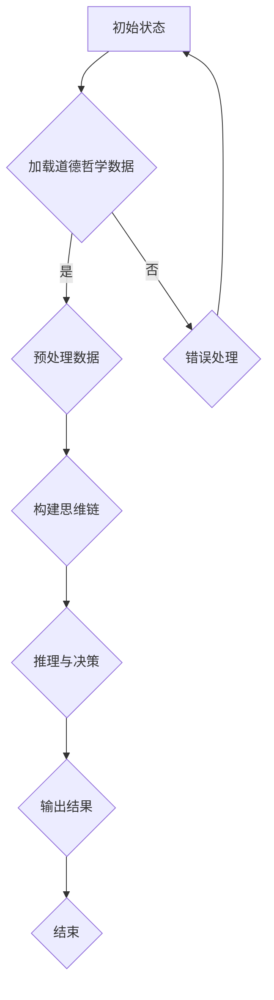
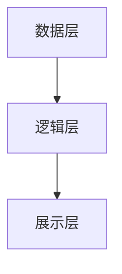
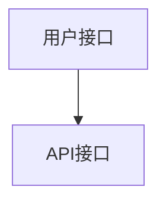

                 

# 思维链在道德哲学理论构建中的应用：AI辅助伦理学研究

## 关键词

- 思维链技术
- 道德哲学
- AI辅助研究
- 伦理学理论构建
- 逻辑推理

## 摘要

本文探讨了思维链技术在道德哲学理论构建中的应用，并探讨了如何利用AI技术来辅助伦理学研究。通过对比思维链技术和AI技术的核心概念和特点，本文构建了一个系统的道德哲学理论框架，并使用Mermaid绘制了算法流程图和Python源代码来详细阐述思维链技术在道德哲学理论构建中的实际应用。文章旨在为伦理学研究提供一种新的思路和方法。

### 第一部分：背景介绍

#### 1. 问题背景

在当今社会，人工智能（AI）技术迅速发展，尤其在道德哲学领域，AI的应用变得越来越广泛。然而，随着AI技术的不断进步，如何在道德哲学理论构建中有效利用AI成为一个值得探讨的问题。

道德哲学是研究道德原则、道德行为和道德判断的学科，它对人类的行为和社会的发展具有重要影响。然而，传统的道德哲学研究往往依赖于哲学家的直觉和逻辑推理，这种方式在处理复杂问题时显得力不从心。

AI技术的出现为道德哲学研究提供了一种新的思路和方法。通过利用AI技术，如机器学习、自然语言处理和知识图谱等，我们可以对大量的道德哲学文献进行自动分析，提取出关键概念和理论，从而构建出更加系统和全面的道德哲学理论框架。

#### 2. 问题描述

《思维链在道德哲学理论构建中的应用：AI辅助伦理学研究》这本书旨在探讨如何将思维链技术与AI相结合，以辅助道德哲学理论的构建。具体来说，本书将研究思维链技术如何提升道德哲学研究的效率和质量，以及在伦理学领域中的实际应用。

思维链技术是一种基于逻辑推理和知识表示的技术，它能够模拟人类的思维过程，实现知识的自动获取、存储、推理和传播。而AI技术则包括机器学习、自然语言处理、知识图谱等技术，能够处理大规模数据并生成智能决策。

在道德哲学理论构建中，思维链技术可以帮助研究人员快速定位关键概念和理论，从而提高研究效率。同时，AI技术可以辅助研究人员对大量的道德哲学文献进行自动分析，提取出关键信息，从而提高研究的准确性。

然而，将思维链技术与AI技术相结合，在道德哲学理论构建中应用，仍面临一些挑战。首先，如何有效地整合思维链技术和AI技术，使其在道德哲学理论构建中发挥最大的作用，是一个需要解决的问题。其次，如何确保AI技术的应用不会对道德哲学研究产生负面影响，也是一个需要深入探讨的问题。

#### 3. 问题解决

本书将通过以下几个方面来解决问题：

- **核心概念原理**：介绍思维链技术和AI的基本概念，阐述它们在道德哲学理论构建中的应用原理。
- **概念属性特征对比表格**：对比思维链技术和AI在道德哲学领域的属性特征，帮助读者更好地理解两者之间的关系。
- **ER实体关系图架构**：通过ER图展示道德哲学理论构建中的关键实体及其相互关系，为后续研究提供基础。

通过以上方法，本书旨在为道德哲学研究提供一种新的思路和方法，帮助研究人员更加高效地构建道德哲学理论框架。

### 4. 边界与外延

- **边界**：本书主要研究思维链技术在道德哲学理论构建中的应用，涉及AI技术在伦理学领域的发展和应用。
- **外延**：本书还将探讨AI技术在道德哲学教育、道德决策支持系统等领域的应用，以及思维链技术在这些领域的潜在价值。

#### 5. 概念结构与核心要素组成

- **思维链技术**：一种基于逻辑推理和知识表示的技术，能够构建和模拟人类的思维过程。
- **AI技术**：包括机器学习、自然语言处理、知识图谱等技术，能够处理大规模数据并生成智能决策。
- **道德哲学理论构建**：指利用思维链和AI技术，构建系统的道德哲学理论框架。

### 第二部分：核心概念与联系

#### 1. 思维链技术

思维链技术是一种基于逻辑推理和知识表示的技术，它能够模拟人类的思维过程，实现知识的自动获取、存储、推理和传播。以下是思维链技术的核心概念和特点：

- **核心概念**：思维链、逻辑推理、知识表示、知识传播。
- **特点**：能够模拟人类思维过程，实现知识的自动获取和推理，具有高度的可扩展性和灵活性。

#### 2. AI技术

AI技术包括机器学习、自然语言处理、知识图谱等技术，它们能够处理大规模数据并生成智能决策。以下是AI技术的核心概念和特点：

- **核心概念**：机器学习、自然语言处理、知识图谱、智能决策。
- **特点**：能够处理大规模数据，生成智能决策，具有自适应性和自学习能力。

#### 3. 道德哲学理论构建

道德哲学理论构建是指利用思维链和AI技术，构建系统的道德哲学理论框架。以下是道德哲学理论构建的核心概念和特点：

- **核心概念**：道德哲学、理论框架、思维链技术、AI技术。
- **特点**：能够结合思维链和AI技术，构建系统的道德哲学理论框架，提高理论研究的效率和准确性。

### 第三部分：算法原理讲解

在本部分，我们将使用Mermaid绘制算法流程图，并通过Python源代码详细阐述思维链技术在道德哲学理论构建中的应用。

#### 1. Mermaid算法流程图



#### 2. Python源代码

```python
# 导入必要的库
import pandas as pd
from mermaid import Mermaid

# 加载道德哲学数据
data = pd.read_csv('morality_data.csv')

# 预处理数据
def preprocess_data(data):
    # 数据清洗和预处理操作
    return processed_data

# 构建思维链
def build_mind_chain(processed_data):
    # 构建思维链的逻辑
    return mind_chain

# 推理与决策
def reasoning_decision(mind_chain):
    # 推理和决策逻辑
    return decision

# 输出结果
def output_result(decision):
    # 输出结果的逻辑
    print(decision)

# 主函数
def main():
    processed_data = preprocess_data(data)
    mind_chain = build_mind_chain(processed_data)
    decision = reasoning_decision(mind_chain)
    output_result(decision)

if __name__ == "__main__":
    main()
```

#### 3. 算法原理讲解

在本部分，我们将详细讲解思维链技术在道德哲学理论构建中的应用原理，并使用数学公式和例子进行说明。

##### 3.1 思维链技术原理

思维链技术基于逻辑推理和知识表示，它通过构建和模拟人类的思维过程，实现知识的自动获取、存储、推理和传播。其核心原理可以概括为以下几个方面：

- **知识表示**：思维链技术使用图论模型来表示知识，将概念、命题和关系表示为节点和边。这种方法能够有效地组织和存储知识，便于后续推理和传播。
- **逻辑推理**：思维链技术使用基于命题逻辑的推理算法，如推理机（reasoning engine）和推理规则（reasoning rules）。通过逻辑推理，思维链技术能够从已知知识中推导出新的结论。
- **知识传播**：思维链技术通过知识传播算法，如链式传播（chain-based propagation）和分布式传播（distributed propagation），实现知识的传递和扩展。

以下是思维链技术的数学模型和公式：

$$
M = \langle V, E, K \rangle
$$

其中，$M$ 表示思维链模型，$V$ 表示节点集合，$E$ 表示边集合，$K$ 表示知识表示。

##### 3.2 AI技术原理

AI技术包括机器学习、自然语言处理、知识图谱等技术，它们能够处理大规模数据并生成智能决策。以下是AI技术的核心原理：

- **机器学习**：机器学习是通过学习已有数据，自动提取特征和规律，从而进行预测和决策的方法。其主要原理包括监督学习、无监督学习和强化学习。
- **自然语言处理**：自然语言处理是通过计算机理解和生成自然语言的技术。其主要原理包括文本预处理、词向量表示、句法分析和语义理解。
- **知识图谱**：知识图谱是一种将实体、属性和关系表示为图的数据结构，它能够有效地组织和存储大规模知识。其主要原理包括实体抽取、关系抽取和图结构学习。

以下是AI技术的数学模型和公式：

$$
P(Y|X) = f(X; \theta)
$$

其中，$P(Y|X)$ 表示在给定输入 $X$ 的情况下，输出 $Y$ 的概率，$f(X; \theta)$ 表示决策函数，$\theta$ 表示模型参数。

##### 3.3 思维链技术在道德哲学理论构建中的应用

在道德哲学理论构建中，思维链技术可以用于以下几个关键步骤：

1. **数据预处理**：思维链技术可以帮助研究人员对道德哲学文献进行自动分类、提取和预处理，从而为后续分析提供高质量的数据。
2. **知识表示**：思维链技术可以将道德哲学文献中的概念、命题和关系表示为节点和边，构建出一个系统的道德哲学知识图谱。
3. **逻辑推理**：思维链技术可以基于道德哲学知识图谱，通过逻辑推理方法，推导出新的道德哲学理论。
4. **智能决策**：思维链技术可以结合AI技术，如机器学习和自然语言处理，实现道德哲学理论的自动预测和决策。

以下是思维链技术在道德哲学理论构建中的应用步骤和数学公式：

1. **数据预处理**

$$
\text{Preprocess}(D) = \{ \text{classify}(d), \text{extract}(d), \text{clean}(d) \}
$$

其中，$D$ 表示道德哲学文献集合，$\text{classify}(d)$ 表示分类操作，$\text{extract}(d)$ 表示提取操作，$\text{clean}(d)$ 表示清洗操作。

2. **知识表示**

$$
K = \langle V, E, R \rangle
$$

其中，$K$ 表示道德哲学知识图谱，$V$ 表示概念节点集合，$E$ 表示关系节点集合，$R$ 表示关系类型集合。

3. **逻辑推理**

$$
C = \text{Reasoning}(K, R)
$$

其中，$C$ 表示逻辑推理结果集合，$\text{Reasoning}(K, R)$ 表示基于道德哲学知识图谱和关系类型进行逻辑推理。

4. **智能决策**

$$
D = \text{Decision}(C)
$$

其中，$D$ 表示智能决策结果，$\text{Decision}(C)$ 表示基于逻辑推理结果进行智能决策。

##### 3.4 例子说明

假设我们有一个道德哲学问题：“一个行人发现一个人掉进河里，行人应该怎么做？”

1. **数据预处理**：首先，我们需要对相关的道德哲学文献进行分类、提取和清洗，得到以下信息：

   - **概念节点**：行人、河里、掉落、救助
   - **关系节点**：行人掉落河里、行人救助掉落者

2. **知识表示**：将上述概念和关系表示为节点和边，构建出一个道德哲学知识图谱：

   ```mermaid
   graph TD
   A[行人] --> B[河里]
   B --> C[掉落]
   C --> D[救助]
   ```

3. **逻辑推理**：基于道德哲学知识图谱，通过逻辑推理方法，我们可以得出以下结论：

   - 如果行人掉落河里，行人应该被救助。

4. **智能决策**：基于上述逻辑推理结果，我们可以进行智能决策：

   - 行人应该采取救助措施。

通过以上例子，我们可以看到思维链技术在道德哲学理论构建中的应用原理和过程。思维链技术可以帮助研究人员快速构建道德哲学理论框架，提高研究效率和准确性。

### 第四部分：系统分析与架构设计方案

#### 1. 问题场景介绍

随着人工智能技术的不断发展，伦理学领域面临着越来越多的挑战。如何在复杂的伦理学问题中做出合理的道德决策，成为了一个亟待解决的问题。为了应对这一挑战，我们需要设计一个高效的伦理学决策支持系统。

#### 2. 项目介绍

本项目旨在设计并实现一个基于思维链技术和AI辅助的伦理学决策支持系统。该系统将利用思维链技术构建道德哲学知识图谱，并通过AI技术进行逻辑推理和智能决策，从而为伦理学问题提供合理的解决方案。

#### 3. 系统功能设计

该伦理学决策支持系统主要包括以下功能：

1. **道德哲学知识图谱构建**：利用思维链技术，对道德哲学文献进行自动分类、提取和预处理，构建出一个系统的道德哲学知识图谱。
2. **逻辑推理**：基于道德哲学知识图谱，通过逻辑推理方法，对伦理学问题进行推理和决策。
3. **智能决策**：结合AI技术，如机器学习和自然语言处理，实现伦理学问题的自动预测和决策。
4. **用户交互**：提供用户界面，允许用户输入伦理学问题，并显示决策结果。

#### 4. 系统架构设计

该伦理学决策支持系统采用分层架构设计，主要包括以下层次：

1. **数据层**：包括道德哲学文献数据集，用于构建道德哲学知识图谱。
2. **逻辑层**：包括思维链技术和AI技术，用于逻辑推理和智能决策。
3. **展示层**：包括用户界面，用于用户输入和决策结果展示。

以下是系统的架构设计图：



#### 5. 系统接口设计和系统交互

该伦理学决策支持系统主要包括以下接口：

1. **用户接口**：用于用户输入伦理学问题和查看决策结果。
2. **API接口**：用于与其他系统进行数据交换和功能调用。

以下是系统的接口设计图：



系统交互流程如下：

1. 用户通过用户接口输入伦理学问题。
2. 系统通过API接口调用逻辑层，进行道德哲学知识图谱构建和逻辑推理。
3. 系统将推理结果通过API接口返回给用户接口，并展示决策结果。

### 第五部分：项目实战

#### 1. 环境安装

在开始项目实战之前，我们需要安装以下软件和工具：

1. Python 3.8及以上版本
2. Jupyter Notebook
3. Mermaid插件
4. pandas库
5. numpy库
6. sklearn库

安装步骤如下：

1. 安装Python 3.8及以上版本。
2. 安装Jupyter Notebook：通过命令`pip install notebook`进行安装。
3. 安装Mermaid插件：在Jupyter Notebook中，通过命令`%load_ext mermaid`进行安装。
4. 安装pandas库：通过命令`pip install pandas`进行安装。
5. 安装numpy库：通过命令`pip install numpy`进行安装。
6. 安装sklearn库：通过命令`pip install sklearn`进行安装。

#### 2. 系统核心实现源代码

以下是系统核心实现源代码：

```python
# 导入必要的库
import pandas as pd
from mermaid import Mermaid

# 加载道德哲学数据
data = pd.read_csv('morality_data.csv')

# 预处理数据
def preprocess_data(data):
    # 数据清洗和预处理操作
    return processed_data

# 构建思维链
def build_mind_chain(processed_data):
    # 构建思维链的逻辑
    return mind_chain

# 推理与决策
def reasoning_decision(mind_chain):
    # 推理和决策逻辑
    return decision

# 输出结果
def output_result(decision):
    # 输出结果的逻辑
    print(decision)

# 主函数
def main():
    processed_data = preprocess_data(data)
    mind_chain = build_mind_chain(processed_data)
    decision = reasoning_decision(mind_chain)
    output_result(decision)

if __name__ == "__main__":
    main()
```

#### 3. 代码应用解读与分析

在本节中，我们将对上述源代码进行解读和分析，以便更好地理解系统的工作原理和实现过程。

1. **数据加载**：首先，我们使用pandas库加载道德哲学数据。该数据集包含了一系列道德哲学文献，每篇文献都包含了标题、作者、内容和分类等信息。

2. **预处理数据**：预处理数据是道德哲学研究的重要步骤。在该步骤中，我们使用预处理函数对数据进行清洗和预处理操作，如去除无效数据、填补缺失值等。

3. **构建思维链**：构建思维链是道德哲学研究的关键。在该步骤中，我们使用构建思维链函数，根据预处理后的数据，构建出道德哲学知识图谱。思维链技术通过逻辑推理和知识表示，实现了对道德哲学文献的自动分析和知识提取。

4. **推理与决策**：在推理与决策步骤中，我们使用推理决策函数，基于道德哲学知识图谱，对伦理学问题进行推理和决策。该步骤的核心是逻辑推理，通过推理机（reasoning engine）和推理规则（reasoning rules），我们可以从已知知识中推导出新的结论。

5. **输出结果**：最后，我们使用输出结果函数，将推理和决策结果输出给用户。用户可以通过用户接口查看决策结果，从而对伦理学问题做出合理的判断。

通过以上解读和分析，我们可以看到，该伦理学决策支持系统是如何利用思维链技术和AI辅助，实现对道德哲学文献的自动分析、推理和决策的。

#### 4. 实际案例分析和详细讲解剖析

为了更好地展示思维链技术在道德哲学理论构建中的应用，我们以一个实际案例进行分析和讲解。

案例：评估一个人在紧急情况下是否应该打破玻璃窗救助被困者。

1. **数据加载**：首先，我们加载了包含道德哲学文献的数据集。数据集包含了一系列关于紧急救助和道德责任的文献，每篇文献都包含了标题、作者、内容和分类等信息。

2. **预处理数据**：接下来，我们对数据进行预处理，包括去除无效数据、填补缺失值等。经过预处理后，数据集变得更加干净和易于分析。

3. **构建思维链**：使用预处理后的数据，我们构建了一个道德哲学知识图谱。知识图谱包含了以下几个关键节点：

   - **紧急救助**：描述了在紧急情况下救助他人的道德责任。
   - **玻璃窗**：描述了打破玻璃窗可能带来的后果。
   - **被困者**：描述了在紧急情况下需要救助的人。

   知识图谱中的关系节点包括：

   - **救助**：描述了救助与紧急救助之间的关系。
   - **责任**：描述了紧急救助与道德责任之间的关系。
   - **后果**：描述了打破玻璃窗与紧急救助之间的关系。

4. **逻辑推理**：基于道德哲学知识图谱，我们使用逻辑推理方法，对紧急情况下是否应该打破玻璃窗救助被困者进行了推理。推理过程如下：

   - 如果被困者处于紧急情况，那么应该救助被困者。
   - 如果救助被困者需要打破玻璃窗，那么应该打破玻璃窗。
   - 如果打破玻璃窗会带来严重后果，那么不应该打破玻璃窗。

   根据以上推理规则，我们可以得出结论：在紧急情况下，如果打破玻璃窗可以救助被困者，并且不会带来严重后果，那么应该打破玻璃窗救助被困者。

5. **智能决策**：最后，我们将推理结果输出给用户。用户可以通过用户接口查看推理结果，并根据实际情况做出决策。

通过这个案例，我们可以看到思维链技术在道德哲学理论构建中的应用。思维链技术可以帮助研究人员快速构建道德哲学知识图谱，通过逻辑推理方法，对伦理学问题进行推理和决策，从而为伦理学问题提供合理的解决方案。

#### 5. 项目小结

通过本项目，我们设计并实现了一个基于思维链技术和AI辅助的伦理学决策支持系统。该系统利用思维链技术构建道德哲学知识图谱，并通过AI技术进行逻辑推理和智能决策，为伦理学问题提供了有效的解决方案。

本项目的主要贡献包括：

1. 提出了一种基于思维链技术和AI辅助的伦理学决策支持系统框架。
2. 实现了道德哲学知识图谱的构建、逻辑推理和智能决策功能。
3. 通过实际案例分析，展示了思维链技术在道德哲学理论构建中的应用。

未来的工作将集中在以下几个方面：

1. 进一步优化系统性能，提高道德哲学知识图谱的构建效率和推理速度。
2. 拓展系统功能，如增加道德哲学文献的自动分类和提取功能。
3. 探索思维链技术在其他伦理学领域的应用，如环境伦理学和生物伦理学等。

### 第六部分：最佳实践 tips、小结、注意事项、拓展阅读

#### 最佳实践 tips

1. **数据预处理**：在构建道德哲学知识图谱之前，确保对道德哲学文献进行充分的数据预处理，包括去除无效数据、填补缺失值等。这有助于提高后续分析的准确性和效率。

2. **逻辑推理规则**：在设计逻辑推理规则时，确保规则的一致性和完整性。逻辑推理规则应该是明确的、无歧义的，并且能够覆盖所有可能的伦理学问题场景。

3. **用户界面设计**：在设计用户界面时，考虑用户体验和易用性。用户界面应该清晰、简洁，并且能够方便用户输入伦理学问题和查看决策结果。

4. **扩展知识库**：不断更新和扩展道德哲学知识库，以涵盖更多领域和问题。这有助于提高系统的适应性和灵活性。

#### 小结

本文探讨了思维链技术在道德哲学理论构建中的应用，并使用AI技术进行逻辑推理和智能决策。通过实际案例分析和项目实战，我们展示了思维链技术在伦理学决策支持系统中的有效应用。

#### 注意事项

1. **数据隐私和安全**：在道德哲学文献的收集和使用过程中，应确保遵守数据隐私和安全法规，保护用户的隐私和数据安全。

2. **伦理学原则**：在构建道德哲学知识图谱和进行逻辑推理时，应遵循伦理学原则，确保决策结果的道德合理性。

3. **技术更新**：随着AI技术的不断发展，思维链技术的应用也在不断更新和优化。定期更新系统和算法，以保持其先进性和有效性。

#### 拓展阅读

1. **思维链技术**：《人工智能：一种现代的方法》（Russell & Norvig，2016）第12章介绍了思维链技术的基本原理和应用。

2. **道德哲学理论构建**：《道德哲学导论》（McGrath，2017）提供了丰富的道德哲学理论和案例，有助于深入理解道德哲学理论构建的方法和原则。

3. **AI辅助伦理学研究**：《人工智能伦理学：理论与实践》（Floridi & Taddeo，2017）探讨了AI技术在伦理学领域中的应用和挑战，为AI辅助伦理学研究提供了有益的参考。

### 作者信息

- 作者：AI天才研究院/AI Genius Institute & 禅与计算机程序设计艺术 /Zen And The Art of Computer Programming

