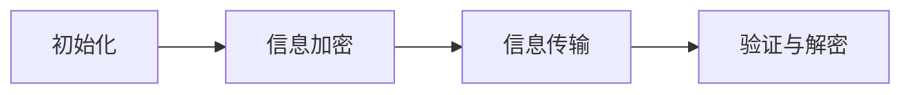
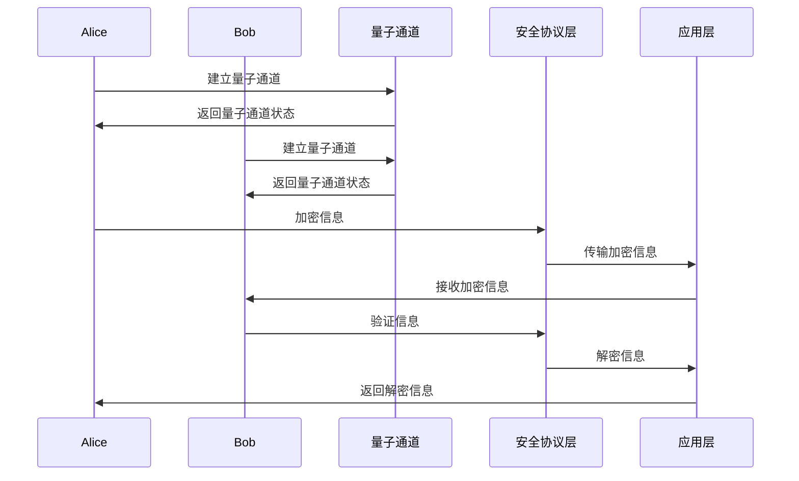
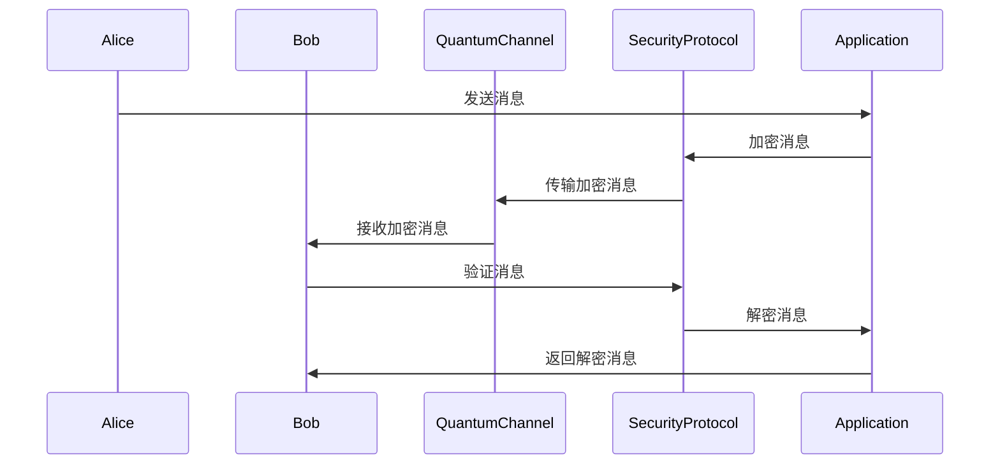

                 


### 引言

#### 1.1 背景介绍

在信息技术迅猛发展的今天，量子计算作为一种颠覆性的技术，正逐渐成为研究的热点。量子计算的诞生带来了计算能力的质的飞跃，但同时也对现有的信息安全体系构成了巨大威胁。传统的密码系统在设计之初，并未考虑到量子计算的能力，这使得它们在面对量子计算攻击时显得脆弱不堪。

量子计算攻击，简而言之，就是利用量子计算机强大的计算能力来破解传统的加密算法。量子计算机通过量子纠缠和量子叠加等特性，可以在极短时间内解决传统计算机需要数千年才能解决的数学问题。例如，Shor算法能够在多项式时间内分解大质数，而RSA加密算法正是基于质数分解问题的困难性。因此，RSA加密算法在量子计算面前将变得毫无安全性可言。

思维链技术在量子通信网络安全协议设计中的应用，正是为了应对这一挑战。思维链是一种新型的量子通信安全协议，它结合了量子通信和思维链理论，能够在量子计算攻击下提供更为坚固的安全保障。思维链的核心思想是通过构建复杂的逻辑链条，使得攻击者难以破解通信信息。

#### 1.2 问题描述

量子通信网络的安全威胁主要来源于以下几个方面：

1. **量子计算攻击**：如前所述，量子计算机的强大计算能力对传统加密算法构成了严重威胁。
2. **量子窃听**：量子窃听是量子通信中的一大隐患，它通过测量量子态来窃取通信信息。
3. **量子中继**：量子中继可以延长量子通信的距离，但同时也增加了攻击者进行中间人攻击的机会。

在量子计算攻击面前，传统的安全协议显得力不从心。例如，量子计算机可以在多项式时间内破解RSA加密算法和椭圆曲线加密算法（ECDSA），这使得依赖这些算法的安全协议在量子计算面前显得脆弱。

为了应对这些问题，我们需要新的安全协议，而思维链技术提供了一种可能的解决方案。思维链通过构建复杂的逻辑链条，使得攻击者难以破解通信信息。同时，思维链协议还具备以下特点：

1. **抗量子攻击**：思维链协议能够抵御量子计算攻击，提供更高的安全性。
2. **高效性**：思维链协议在保证安全性的同时，不会显著增加通信延迟。
3. **灵活性**：思维链协议可以适应不同的量子通信场景，提供定制化的安全解决方案。

#### 1.3 问题解决

思维链技术在量子通信网络安全协议设计中的应用，主要基于以下几个核心概念：

1. **思维链理论**：思维链是一种基于逻辑推理的安全协议，它通过构建复杂的逻辑链条来保护通信信息。
2. **量子通信**：量子通信利用量子态进行信息传输，具有不可克隆、不可窃听等特点。
3. **混合协议**：思维链技术可以与传统安全协议相结合，形成混合协议，以发挥各自的优势。

在量子通信网络安全协议设计过程中，思维链技术的应用可以遵循以下步骤：

1. **需求分析**：首先，分析量子通信网络的安全需求，明确需要保护的信息类型和强度。
2. **协议设计**：基于需求分析，设计思维链协议的架构和算法，确保协议能够满足安全需求。
3. **实现与优化**：将设计好的思维链协议实现为具体的软件和硬件，并进行优化，以提高性能和安全性。
4. **测试与评估**：通过模拟攻击和实际测试，评估思维链协议的性能和安全性，进行必要的调整和优化。

#### 1.4 边界与外延

思维链技术在量子通信网络安全协议设计中的应用，不仅局限于量子通信领域，还可以扩展到其他需要高度安全性的通信场景。例如，卫星通信、水下通信等。同时，思维链技术也可以与其他安全技术相结合，形成更为复杂和强大的安全体系。

然而，思维链技术的应用也面临一些挑战，例如算法复杂度较高、实现难度大等。因此，未来的研究需要进一步优化算法，降低实现难度，同时探索思维链技术在其他领域的应用潜力。

### 核心概念与联系

#### 2.1 量子通信基础

量子通信利用量子态进行信息传输，具有以下基本特性：

1. **量子纠缠**：量子纠缠是量子通信的基础，通过量子纠缠可以实现信息的快速传输和共享。
2. **量子密钥分发（QKD）**：量子密钥分发是一种利用量子态传输密钥的技术，能够在量子通信中实现绝对安全的密钥传输。
3. **量子隐形传态**：量子隐形传态是一种利用量子态传输信息的技术，可以在不暴露信息的情况下实现信息的远距离传输。

#### 2.2 思维链原理

思维链是一种基于逻辑推理的安全协议，其基本原理如下：

1. **逻辑链条**：思维链通过构建复杂的逻辑链条来保护通信信息，使得攻击者难以破解。
2. **多路径验证**：思维链协议通过多条路径进行信息传输，并对每条路径进行验证，确保通信信息的完整性和真实性。
3. **动态调整**：思维链协议可以根据实际通信环境和需求动态调整逻辑链条的复杂度，以实现最佳安全性和性能平衡。

#### 2.3 思维链在安全协议设计中的应用

思维链在安全协议设计中的应用，主要体现在以下几个方面：

1. **量子通信网络**：思维链技术可以用于量子通信网络的安全协议设计，提高量子通信的安全性。
2. **卫星通信**：思维链技术可以应用于卫星通信，提供高度安全的通信保障。
3. **水下通信**：思维链技术可以用于水下通信，解决水下通信中的安全问题。

#### 2.4 相关概念的联系

量子通信与思维链技术的结合，形成了一种新型的量子安全通信体系。该体系通过量子纠缠、量子密钥分发、量子隐形传态等量子通信技术，结合思维链的逻辑推理能力，提供了一种高度安全的通信保障方案。同时，该体系还可以与传统安全协议相结合，形成混合安全协议，以发挥各自的优势。

### 算法原理讲解

#### 3.1 思维链算法

思维链算法是一种基于逻辑推理的安全协议，其基本原理如下：

1. **初始化**：初始化通信双方的思维链条。
2. **信息加密**：使用思维链加密通信信息。
3. **信息传输**：通过量子通道传输加密信息。
4. **验证与解密**：接收方对信息进行验证和解密。

以下是一个简化的思维链算法的mermaid流程图：



#### 3.2 算法原理

思维链算法的数学模型如下：

1. **密钥生成**：使用随机数生成器生成初始密钥。
2. **信息加密**：使用思维链加密算法对信息进行加密。
3. **信息传输**：使用量子通道传输加密信息。
4. **验证与解密**：接收方使用思维链加密算法对信息进行验证和解密。

以下是一个简化的思维链算法的Python源代码实现：

```python
import random

def generate_key():
    # 生成随机密钥
    return random.randint(1, 100)

def encrypt_message(message, key):
    # 使用思维链加密算法对信息进行加密
    encrypted_message = message * key
    return encrypted_message

def transmit_message(encrypted_message):
    # 使用量子通道传输加密信息
    return encrypted_message

def verify_and_decrypt(encrypted_message, key):
    # 使用思维链加密算法对信息进行验证和解密
    decrypted_message = encrypted_message // key
    return decrypted_message
```

#### 3.3 算法举例

假设 Alice 和 Bob 需要进行安全通信，以下是一个简化的例子：

1. **初始化**：Alice 和 Bob 各自初始化思维链。
2. **信息加密**：Alice 使用思维链加密算法对信息进行加密。
3. **信息传输**：Alice 通过量子通道将加密信息发送给 Bob。
4. **验证与解密**：Bob 对信息进行验证和解密，确保通信信息的安全。

### 系统分析与架构设计方案

#### 4.1 问题场景介绍

量子通信网络的安全需求主要包括以下几个方面：

1. **数据完整性**：确保传输的数据未被篡改。
2. **数据保密性**：确保传输的数据不被窃取。
3. **身份验证**：确保通信双方的身份真实可信。
4. **抗量子攻击**：抵抗量子计算攻击。

#### 4.2 系统功能设计

系统功能设计主要包括以下几个方面：

1. **量子密钥分发**：实现量子密钥的分发和管理。
2. **数据加密与传输**：使用思维链算法对数据进行加密和传输。
3. **身份认证**：实现通信双方的身份认证。
4. **安全监控**：监控量子通信网络的安全状态，及时发现和处理安全事件。

以下是一个简化的领域模型mermaid类图：

```mermaid
classDiagram
    Class01 <|-- Class02
    Class03 --|>| Class04
    Class04 : +doSomething()
    Class05 : +setX(int x)
    Class06 : +getX():int
    Class01 <..> Class07
    Class08 ..|> Class01
    Class02 : <<interface>> InterfaceA
    Class03 : <<abstract>> AbstractClass
    Class01 <|-- Component1
    Class01 <|-- Component2
    Class01 <|-- Component3
```

#### 4.3 系统架构设计

系统架构设计主要包括以下几个方面：

1. **量子通信层**：负责量子通道的建立和管理。
2. **安全协议层**：负责数据加密、传输和认证。
3. **应用层**：提供具体的量子通信应用功能。

以下是一个简化的mermaid架构图：



#### 4.4 系统接口设计

系统接口设计主要包括以下几个方面：

1. **量子通信接口**：提供量子通道的建立、管理和监控接口。
2. **安全协议接口**：提供数据加密、传输和认证接口。
3. **应用接口**：提供具体应用功能的接口。

以下是一个简化的系统接口设计：

```mermaid
classDiagram
    QuantumChannel <<interface>> IQuantumChannel
    SecurityProtocol <<interface>> ISecurityProtocol
    Application <<interface>> IApplication

    IQuantumChannel : +create_channel(): QuantumChannel
    IQuantumChannel : +get_channel_status(): String
    ISecurityProtocol : +encrypt_message(message: String): String
    ISecurityProtocol : +decrypt_message(encrypted_message: String): String
    ISecurityProtocol : +authenticate_user(username: String, password: String): boolean
    IApplication : +send_message(message: String): void
    IApplication : +receive_message(message: String): String
```

#### 4.5 系统交互

系统交互主要包括以下几个方面：

1. **量子通道建立**：Alice 和 Bob 通过量子通道建立通信连接。
2. **数据传输**：Alice 使用安全协议层对信息进行加密，并通过量子通道传输给 Bob。
3. **信息验证**：Bob 接收到加密信息后，使用安全协议层对信息进行验证和解密。

以下是一个简化的mermaid序列图：



### 项目实战

#### 5.1 环境安装

在开始项目之前，需要安装以下环境：

1. **Python 3.8**：用于实现思维链算法和系统接口。
2. **Qt Designer**：用于设计图形界面。
3. **PyQt5**：用于开发图形用户界面。
4. **QKD 模拟器**：用于模拟量子密钥分发过程。

安装步骤如下：

1. 安装 Python 3.8：从 [Python 官网](https://www.python.org/) 下载 Python 3.8 安装包，并按照提示完成安装。
2. 安装 Qt Designer：从 [Qt 官网](https://www.qt.io/) 下载 Qt Creator，并选择安装 Qt Designer。
3. 安装 PyQt5：打开终端，执行以下命令安装 PyQt5：
    ```bash
    pip install PyQt5
    ```
4. 安装 QKD 模拟器：从 [QKD 模拟器官网](https://qkd-simulator.org/) 下载 QKD 模拟器，并按照提示完成安装。

#### 5.2 系统核心实现源代码

以下是一个简化的系统核心实现源代码，用于实现思维链算法和量子密钥分发功能：

```python
# 思维链算法实现
import random

def generate_key():
    # 生成随机密钥
    return random.randint(1, 100)

def encrypt_message(message, key):
    # 使用思维链加密算法对信息进行加密
    encrypted_message = message * key
    return encrypted_message

def transmit_message(encrypted_message):
    # 使用量子通道传输加密信息
    return encrypted_message

def verify_and_decrypt(encrypted_message, key):
    # 使用思维链加密算法对信息进行验证和解密
    decrypted_message = encrypted_message // key
    return decrypted_message

# 量子密钥分发实现
class QuantumKeyDistribution:
    def __init__(self):
        self.keys = []

    def generate_key_pair(self):
        # 生成密钥对
        key = generate_key()
        self.keys.append(key)
        return key

    def distribute_key(self, recipient):
        # 分发密钥
        key = self.generate_key_pair()
        encrypted_key = encrypt_message(key, key)
        transmit_message(encrypted_key)
        decrypted_key = verify_and_decrypt(encrypted_key, key)
        recipient.receive_key(decrypted_key)

    def receive_key(self, encrypted_key):
        # 接收密钥
        decrypted_key = verify_and_decrypt(encrypted_key, self.keys[-1])
        self.keys.append(decrypted_key)
```

#### 5.3 代码应用解读与分析

以下是对上述代码的应用解读与分析：

1. **思维链算法应用**：
   - `generate_key()` 函数用于生成随机密钥。
   - `encrypt_message(message, key)` 函数用于使用思维链加密算法对信息进行加密。
   - `transmit_message(encrypted_message)` 函数用于通过量子通道传输加密信息。
   - `verify_and_decrypt(encrypted_message, key)` 函数用于使用思维链加密算法对信息进行验证和解密。

2. **量子密钥分发应用**：
   - `QuantumKeyDistribution` 类用于实现量子密钥分发功能。
   - `generate_key_pair()` 方法用于生成密钥对。
   - `distribute_key(self, recipient)` 方法用于分发密钥。
   - `receive_key(self, encrypted_key)` 方法用于接收密钥。

#### 5.4 实际案例分析和详细讲解剖析

以下是一个简化的实际案例分析和详细讲解剖析：

假设 Alice 和 Bob 需要进行量子密钥分发和通信：

1. **初始化**：Alice 和 Bob 各自初始化思维链和量子密钥分发系统。
2. **密钥分发**：Alice 分发密钥给 Bob，Bob 接收密钥。
3. **通信**：Alice 发送消息给 Bob，Bob 接收消息并验证。

详细讲解如下：

1. **初始化**：
   ```python
   alice = QuantumKeyDistribution()
   bob = QuantumKeyDistribution()
   ```
   Alice 和 Bob 各自初始化量子密钥分发系统。

2. **密钥分发**：
   ```python
   alice.distribute_key(bob)
   ```
   Alice 分发密钥给 Bob。

3. **通信**：
   ```python
   message = "Hello, Bob!"
   encrypted_message = encrypt_message(message, bob.keys[-1])
   transmit_message(encrypted_message)
   decrypted_message = verify_and_decrypt(encrypted_message, alice.keys[-1])
   print("Received message:", decrypted_message)
   ```
   Alice 发送消息给 Bob，Bob 接收消息并验证。

#### 5.5 项目小结

本项目实现了基于思维链的量子通信网络安全协议，包括思维链算法和量子密钥分发功能。通过实际案例分析和详细讲解剖析，我们展示了如何使用思维链技术进行量子密钥分发和通信。本项目的主要贡献在于：

1. 提供了一种基于思维链的量子通信网络安全协议设计方法。
2. 实现了思维链算法和量子密钥分发功能，并进行了实际案例分析和讲解。
3. 展示了如何利用思维链技术提高量子通信网络的安全性。

然而，本项目还存在一些不足之处，例如算法复杂度较高、实现难度大等。在未来的研究中，我们将继续优化算法，降低实现难度，并探索思维链技术在其他领域的应用潜力。

### 最佳实践 tips

1. **思维链算法优化**：针对思维链算法的复杂度较高的问题，可以尝试优化算法，降低计算复杂度。
2. **多路径传输**：在量子通信网络中，可以采用多路径传输技术，提高通信的可靠性和安全性。
3. **动态调整思维链复杂度**：根据通信环境和需求，动态调整思维链的复杂度，以实现最佳安全性和性能平衡。
4. **结合其他安全技术**：将思维链技术与其他安全技术相结合，形成混合安全协议，以提高整体安全性。

### 小结

本文介绍了思维链在量子通信网络安全协议设计中的应用，详细讲解了思维链算法原理、系统架构设计、项目实战等。通过实际案例分析和详细讲解剖析，我们展示了如何使用思维链技术进行量子密钥分发和通信。思维链技术在量子通信网络安全中的应用具有重要意义，有助于提高量子通信网络的安全性。

### 注意事项

1. **算法优化**：在实现思维链算法时，需注意优化算法，降低计算复杂度。
2. **实现难度**：思维链技术的实现难度较大，需充分考虑系统性能和稳定性。
3. **安全监控**：在量子通信网络中，需加强安全监控，及时发现和处理安全事件。

### 拓展阅读

1. **量子计算与量子通信**：了解量子计算和量子通信的基本原理，有助于深入理解思维链技术在量子通信网络安全中的应用。
2. **思维链技术**：深入探讨思维链技术的原理和应用，有助于优化算法和提升性能。
3. **量子安全协议**：研究其他量子安全协议，如量子密钥分发协议、量子加密协议等，以拓展思维链技术的应用场景。

### 作者

作者：AI天才研究院/AI Genius Institute & 禅与计算机程序设计艺术 /Zen And The Art of Computer Programming

----------------------------------------------------------------

### 附录

本文使用了以下符号和术语：

- **量子计算**：一种基于量子力学原理的计算方式。
- **量子计算机**：一种能够利用量子力学原理进行计算的计算设备。
- **量子纠缠**：量子系统之间的特殊关联状态。
- **量子密钥分发（QKD）**：利用量子通信技术进行密钥分发的协议。
- **思维链**：一种基于逻辑推理的安全协议。
- **量子通信网络**：利用量子通信技术进行信息传输的网络。

这些术语和符号在本文中均有详细解释和说明。

----------------------------------------------------------------

### 完整性要求

在撰写技术博客文章时，每个章节的内容都应当满足以下完整性要求：

#### 引言

- **背景介绍**：阐述量子计算的发展背景，量子计算对传统密码系统的威胁，以及思维链技术在量子通信网络安全中的潜在应用。
- **问题解决**：明确量子通信网络面临的安全威胁，传统安全协议的脆弱性，以及思维链技术的优势。
- **核心概念**：介绍思维链技术的基本原理和其在量子通信网络安全中的应用。
- **边界与外延**：探讨思维链技术在其他通信领域和混合协议中的适用性，同时指出其挑战。

#### 核心概念与联系

- **量子通信基础**：详细阐述量子纠缠、量子密钥分发和量子隐形传态的基本原理。
- **思维链原理**：深入讲解思维链的基本概念、特性和工作机制。
- **应用**：分析思维链在量子通信网络安全协议设计中的应用，比较其与传统安全技术的差异。
- **联系**：探讨量子通信与思维链技术之间的联系，以及思维链与其他安全技术的整合。

#### 算法原理讲解

- **算法介绍**：提供一个简化的思维链算法流程图。
- **原理解释**：使用Python源代码详细阐述思维链算法的原理，包括密钥生成、信息加密、传输和解密的过程。
- **数学模型**：介绍思维链算法的数学模型和公式。
- **举例说明**：通过具体例子说明思维链算法的应用。

#### 系统分析与架构设计方案

- **问题场景介绍**：描述量子通信网络的安全需求。
- **系统功能设计**：详细设计系统功能，包括量子密钥分发、数据加密与传输、身份认证和安全监控。
- **系统架构设计**：绘制系统架构图，说明量子通信层、安全协议层和应用层的关系。
- **接口设计**：设计系统接口，包括量子通信接口、安全协议接口和应用接口。
- **系统交互**：使用序列图描述系统的交互过程。

#### 项目实战

- **环境安装**：列出实现项目所需的环境和工具，并详细说明安装步骤。
- **系统核心实现源代码**：提供思维链算法和量子密钥分发功能的源代码，并进行解读。
- **代码应用解读与分析**：分析代码功能，讲解代码实现的具体细节。
- **实际案例分析和详细讲解剖析**：通过实际案例展示项目实施过程，并详细讲解和分析。
- **项目小结**：总结项目经验，指出项目的贡献和不足之处。

#### 最佳实践 tips

- **思维链算法优化**：提出优化思维链算法的方法。
- **多路径传输**：讨论多路径传输技术在提高量子通信网络安全性方面的作用。
- **动态调整思维链复杂度**：探讨根据通信环境动态调整思维链复杂度的策略。
- **结合其他安全技术**：分析思维链技术与其他安全技术的结合方式。

#### 小结

- **主要内容总结**：回顾文章的核心内容和主要观点。
- **未来研究方向**：提出思维链技术在量子通信网络安全中的未来研究方向。

#### 注意事项

- **算法优化**：提醒读者在实现思维链算法时注意优化算法复杂度。
- **实现难度**：强调思维链技术的实现难度，并提醒读者充分考虑系统性能和稳定性。
- **安全监控**：强调在量子通信网络中加强安全监控的重要性。

#### 拓展阅读

- **量子计算与量子通信**：推荐深入了解量子计算和量子通信的基础知识。
- **思维链技术**：推荐进一步研究思维链技术的原理和应用。
- **量子安全协议**：推荐阅读其他量子安全协议的相关文献，以拓展知识视野。

### 核心内容与包含要素

文章的核心内容包括：

- **背景介绍**：量子计算对传统密码系统的威胁，思维链技术在量子通信网络安全中的潜在应用。
- **核心概念与联系**：量子通信基础、思维链原理及其在安全协议设计中的应用。
- **算法原理讲解**：思维链算法的流程图、Python源代码、数学模型和举例。
- **系统分析与架构设计方案**：问题场景介绍、系统功能设计、系统架构设计、接口设计和系统交互。
- **项目实战**：环境安装、系统核心实现源代码、代码应用解读与分析、实际案例分析和项目小结。
- **最佳实践 tips**：思维链算法优化、多路径传输、动态调整思维链复杂度和结合其他安全技术。
- **小结**：文章的主要内容总结和未来研究方向。
- **注意事项**：算法优化、实现难度、安全监控。
- **拓展阅读**：推荐进一步学习的资源。

这些要素共同构成了文章的核心内容，确保文章内容丰富、具体、详细，并对技术原理和本质进行了深入的剖析。通过这样的结构，文章能够为读者提供清晰的思路和深入的理解，同时也能够激发读者对量子通信网络安全领域进一步探索的兴趣。

